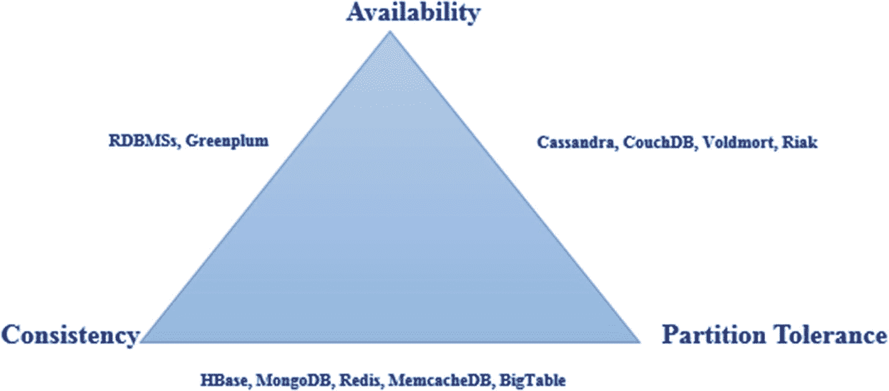
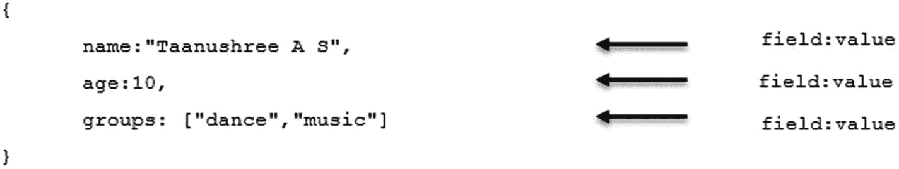

# 1. MongoDB 特性与安装

本章介绍 `NoSQL` 数据库、`MongoDB` 的各种特性以及如何与 `MongoDB` 进行交互。我们将重点讨论以下主题：

*   为什么需要 `NoSQL`？
*   什么是 `NoSQL` 数据库？
*   `CAP` 定理。
*   `BASE` 方法。
*   `NoSQL` 数据库的类型。
*   `MongoDB` 特性。
*   在 Windows 上安装 `MongoDB`。
*   在 Linux 上安装 `MongoDB`。
*   在 Windows 上安装 `MongoDB Compass`。
*   `MongoDB` 中使用的术语。
*   `MongoDB` 中的数据类型。
*   数据库命令。

## 对 NoSQL 数据库的需求

现代应用程序面临多种数据库挑战，包括以下几点。

*   现代应用程序的存储容量超出了传统关系数据库管理系统（`RDBMS`）的存储能力。
*   现代应用程序需要未知级别的可扩展性。
*   现代应用程序应能 24/7 全天候可用。
*   数据需要在全球范围内分布式存储。
*   用户应能在任何地方读写数据。
*   用户总是寻求降低软硬件成本。

所有这些挑战催生了 `NoSQL` 数据库。

## 什么是 NoSQL 数据库？

`NoSQL` 数据库是开源、非关系型、分布式的数据库，允许组织分析海量数据。

以下是 `NoSQL` 数据库的一些关键优势：

*   可用性。
*   容错性。
*   可扩展性。

`NoSQL` 数据库具有以下特征：

*   它们不使用 `SQL` 作为查询语言。
*   大多数 `NoSQL` 数据库设计为在集群上运行。
*   它们在无模式下运行，可以自由地向数据库添加字段，而无需首先定义任何结构变更。
*   它们是多语言持久化的，意味着可以根据需求以不同方式存储数据。
*   它们的设计方式使其能够横向扩展。


### CAP 定理

CAP 定理指出，任何分布式系统都只能满足以下三个属性中的两个：

*   **一致性** 意味着每次读取都能获取到最后一次写入的数据。
*   **可用性** 意味着读写操作总是能够成功。换句话说，每个未发生故障的节点都将在合理的时间内返回响应。
*   **分区容错性** 意味着即使发生数据丢失或系统故障，系统仍能继续运行。

图 1-1 是 CAP 定理的图形化表示。



图 1-1：CAP 定理

CAP 定理根据三个类别对系统进行分类：

1.  一致性和可用性。
2.  一致性和分区容错性。
3.  可用性和分区容错性。

##### 注意

分区容错性是 NoSQL 数据库的必备属性。

### BASE 方法

NoSQL 数据库基于 BASE 方法。BASE 代表：

*   **基本可用：** 数据库应在大部分时间内保持可用。
*   **软状态：** 允许临时的不一致。
*   **最终一致性：** 系统在一段时间后将达到一致状态。

### NoSQL 数据库的类型

NoSQL 数据库通常分为四种类型，如表 1-1 所示。

表 1-1：NoSQL 数据库类型

| **数据模型** | **示例** | **描述** |
| --- | --- | --- |
| 键/值存储 | Dynamo DB, Riak | •    最简单的 NoSQL 选项。•    一个键和一个值。 |
| 列存储 | HBase, Big Table | •    也称为宽列存储。•    将数据表存储为数据列的片段。 |
| 文档存储 | MongoDB, CouchDB | •    扩展了键/值的概念。•    将数据存储为文档。•    复杂的 NoSQL 选项。•    每个文档包含一个用于检索该文档的唯一键。 |
| 图数据库 | Neo4j | •    基于图论。•    将数据存储为节点、边和属性。 |

## MongoDB 特性

MongoDB 是一个用 C++ 编写的开源、面向文档的 NoSQL 数据库。MongoDB 提供高可用性、自动扩展和高性能。以下部分介绍 MongoDB 的特性。

### 文档数据库

在 MongoDB 中，一条记录表示为一个文档。文档是字段和值对的组合。MongoDB 文档类似于 JavaScript 对象表示法（JSON）文档。图 1-2 展示了一个文档。



图 1-2：一个文档

以下是使用文档的优势。

*   在许多编程语言中，文档对应于原生数据类型。
*   嵌入式文档有助于减少昂贵的连接操作。

### MongoDB 是无模式的

MongoDB 是一个无模式数据库，这意味着一个集合（类似于关系数据库管理系统中的表）可以包含不同的文档（类似于关系数据库管理系统中的记录）。这样，MongoDB 在处理数据库模式方面提供了灵活性。参考下面的 `Person` 集合。

```
{name:"Aruna M S", age:12 } //包含两个字段的文档。
{ssn:100023412, name:"Anbu M S",groups:["sports","news"]} //包含三个字段的文档。
```

这里，`Person` 集合有两个文档，每个文档都有不同的字段、内容和大小。

### MongoDB 使用 BSON

JSON 是一种用于数据交换的开源标准格式。文档数据库使用 JSON 格式存储记录。以下是一个 JSON 文档的示例。

```
{
name:"John",
addresses:[
{
address:"123,River Road",
status:"office"
},
{
address:"345,Mount Road",
status:"personal"
}
]
}
```

MongoDB 在后台以二进制编码格式——二进制 JSON（BSON）来表示 JSON 文档。BSON 扩展了 JSON 模型，以提供 JSON 不支持的其他数据类型，例如日期。BSON 使用名为 `ObjectId` 的 `_id` 字段作为主键。`_id` 字段的值由 MongoDB 服务或应用程序生成。以下是 `ObjectId` 的一个示例：

```
"_id": ObjectId("12e6789f4b01d67d71da3211")
```

### 丰富的查询语言

MongoDB 提供了一种丰富的查询语言来支持增、查、改、删（CRUD）操作、数据聚合和文本搜索。让我们通过一个示例来了解如何查询 MongoDB 中的集合。考虑下面的 `Employee` 集合。

```
{_id: 10001, name:"Subhashini",unit:"Hadoop"}
{_id: 10002, name:"Shobana", unit:"Spark"}
```

要显示员工详情，MongoDB 查询语句为：

```
db.Employee.find();
```

我们将在第 2 章详细讨论 MongoDB 查询语言。

### 聚合框架

MongoDB 提供了一个聚合框架来执行聚合操作。该聚合框架可以对来自多个文档的数据进行分组，并对分组后的数据执行各种操作。MongoDB 提供了聚合管道、`map-reduce` 函数和单一用途聚合方法来执行聚合操作。我们将在第 3 章详细讨论聚合框架。

