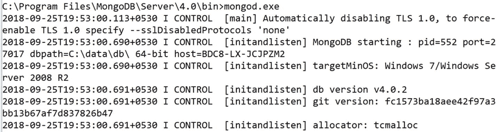
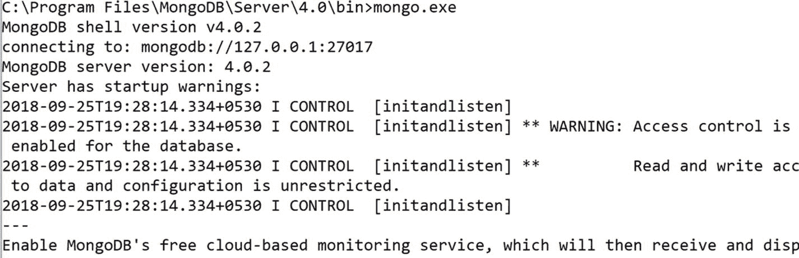
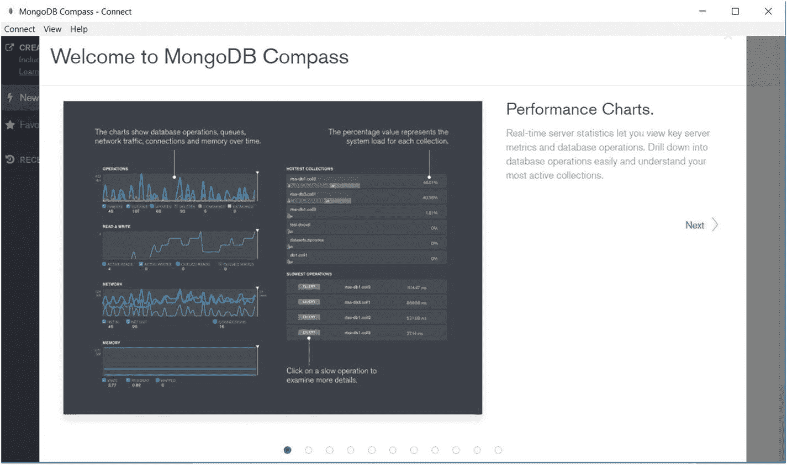
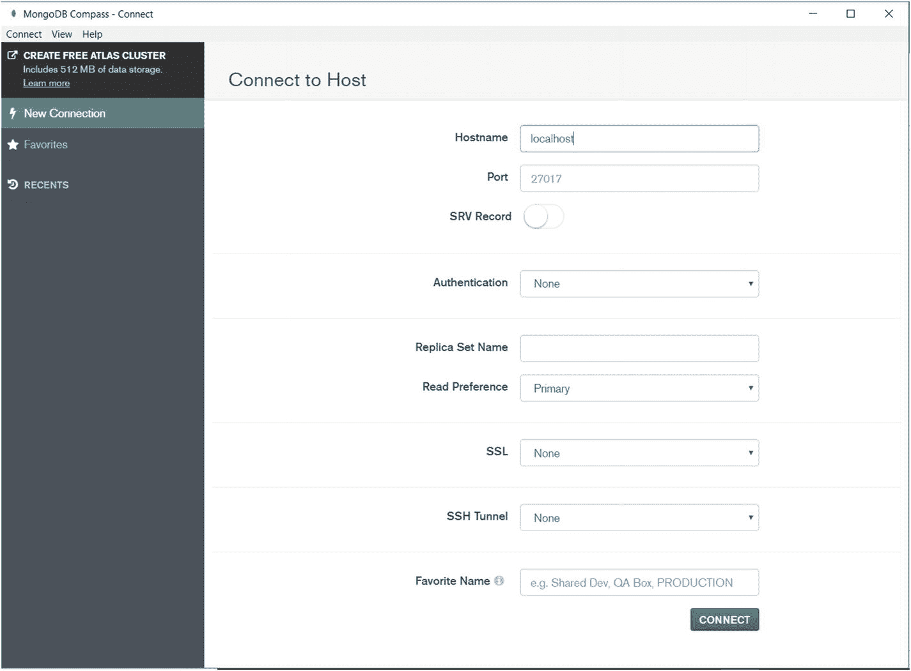
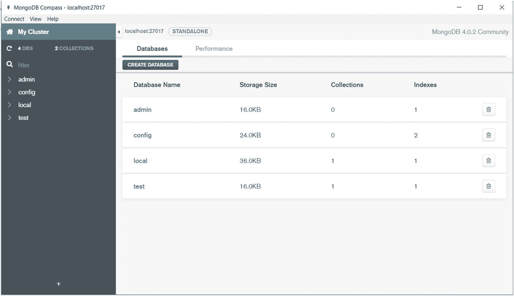

# 索引

索引提高了查询执行的性能。MongoDB 使用索引来限制需要扫描的文档数量。我们将在第 4 章讨论各种索引。

### GridFS

GridFS 是一个用于存储和检索大文件的规范。GridFS 可用于存储超过 BSON 最大文档大小 16 MB 的文件。GridFS 将文件分成称为块的部分，并将它们作为单独的文档存储。GridFS 将文件分成大小为 255 KB 的块，除了最后一块，其大小基于文件大小而定。

## 复制

复制是将数据库实例复制到不同数据库服务器以提供冗余和高可用性的过程。复制提供了针对单个数据库服务器故障的容错能力。在 MongoDB 中，副本集是一组维护相同数据集的 `mongod` 进程。我们将在第 5 章讨论如何创建副本集。

## 分片

当需要处理大型数据集和高吞吐量应用程序时，单个服务器在中央处理器（CPU）和输入/输出（I/O）容量方面可能面临挑战。MongoDB 使用分片来支持大型数据集和高吞吐量操作。分片是一种将数据分布在多个系统上的方法，将在第 5 章详细讨论。

### mongo Shell

`mongo` shell 是 MongoDB 的一个交互式 JavaScript 接口。`mongo` shell 用于查询、更新数据以及执行管理操作。`mongo` shell 是 MongoDB 发行版的一个组件。当你启动 `mongod` 进程时，`mongo` shell 将连接到一个 MongoDB 实例。

## MongoDB 中使用的术语

让我们了解 MongoDB 中使用的术语，如表 1-2 所示。

表 1-2：MongoDB 术语

| 术语 | MongoDB |
| --- | --- |
| MongoDB 服务器 | mongod |
| MongoDB 客户端 | mongo |

表 1-3 显示了关系数据库管理系统（RDBMS）和 MongoDB 中使用的等效术语。

表 1-3：RDBMS 和 MongoDB 的等效术语

| RDBMS | MongoDB |
| --- | --- |
| 数据库 | 数据库 |
| 表 | 集合 |
| 记录 | 文档 |
| 列 | 字段或键/值对 |
| ACID 事务 | ACID 事务 |
| 二级索引 | 二级索引 |
| 连接 | 嵌入文档，`$lookup` |
| GROUP_BY | 聚合管道 |


## MongoDB 中的数据类型

表 1-4 提供了 MongoDB 数据类型的描述。

表 1-4

MongoDB 数据类型

| 数据类型 | 描述 |
| --- | --- |
| String | 字符串采用 UTF-8 编码 |
| Integer | 可以是 32 位或 64 位 |
| Double | 用于存储浮点值 |
| Arrays | 将值列表存储在一个键中 |
| Timestamps | 供 MongoDB 内部使用；值为 64 位，记录文档何时被修改或添加 |
| Date | 一个 64 位整数，表示自 Unix 纪元（1970 年 1 月 1 日）以来的毫秒数 |
| ObjectId | 小巧、唯一、生成速度快且有序。由 12 个字节组成，前四个字节是反映 `ObjectId` 创建时间的时间戳 |
| Binary data | 用于存储二进制数据（图像、二进制文件等） |
| Null | 用于存储 `NULL` 值 |

##### 注意

有关 MongoDB 数据类型的更多信息，请参考以下链接：[`https://docs.mongodb.com/manual/reference/bson-types/`](https://docs.mongodb.com/manual/reference/bson-types/)

## MongoDB 安装

接下来，我们将学习如何安装 MongoDB。

### 教程 1-1. 在 Windows 上安装 MongoDB

在本教程中，我们将讨论如何在 Windows 上安装 MongoDB。

### 问题

你想在 Windows 上安装 MongoDB。

### 解决方案

从 [`https://www.mongodb.com/download-center#enterprise`](https://www.mongodb.com/download-center%2523enterprise) 下载 MongoDB `msi` 安装程序。

### 工作原理

让我们按照本节的步骤在 Windows 上安装 MongoDB。

##### 步骤 1：安装 `msi` 安装程序

右键单击 Windows 安装程序，选择“以管理员身份运行”，然后按照说明安装 MongoDB。

##### 步骤 2：创建数据目录

在 `C:\` 下创建 `\data\db` 目录来存储 MongoDB 数据。目录结构类似 “`C:\data\db`”。

##### 步骤 3：启动 MongoDB 服务器

打开命令提示符并导航到 MongoDB 安装文件夹。执行以下命令以启动 MongoDB 服务器，如图 1-3 所示。



图 1-3

启动 MongoDB 服务器

```
mongod.exe
```

你应该会看到一条消息，显示“Waiting for connection on port 27017.”

##### 步骤 4：启动 MongoDB 客户端

打开另一个命令提示符并导航到 MongoDB 安装文件夹。执行以下命令以启动 MongoDB 客户端，如图 1-4 所示。



图 1-4

启动 MongoDB 客户端

```
mongo.exe
```

我们可以看到 `mongo` shell。

这证实我们已在 Windows 上安装了 MongoDB。

### 教程 1-2. 在 Ubuntu 上安装 MongoDB

在本教程中，我们将讨论如何在 Ubuntu 上安装 MongoDB。

### 问题

你想在 Ubuntu 上安装 MongoDB。

### 解决方案

从 [`https://www.mongodb.com/download-center/community`](https://www.mongodb.com/download-center/community) 下载 MongoDB tarball。

### 工作原理

让我们按照本节的步骤在 Ubuntu 上安装 MongoDB。

##### 步骤 1：解压 tarball

执行以下命令解压 tarball：

```
tar -xzf mongodb-linux-x86_64-ubuntu1604-4.0.8.tgz
```

##### 步骤 2：创建数据目录

如教程 1-1 所示，创建一个 `/data/db` 目录。

##### 步骤 3：启动 MongoDB 服务器

打开终端，导航到 MongoDB 安装文件夹，并执行以下命令以启动 MongoDB 服务器。

```
./mongod --dbpath
```

##### 步骤 4：启动 MongoDB 客户端

打开另一个终端，导航到 MongoDB 安装文件夹，并执行以下命令以启动 MongoDB 客户端。

```
./mongo.exe
```

### 教程 1-3. 在 Windows 上安装 MongoDB Compass

在本教程中，我们将讨论如何在 Windows 上安装 MongoDB Compass。MongoDB Compass 是一个简单易用的图形用户界面（GUI），用于与 MongoDB 交互。

### 问题

你想在 Windows 上安装 MongoDB Compass。

### 解决方案

从 [`https://www.mongodb.com/download-center#compass`](https://www.mongodb.com/download-center%2523compass) 下载 MongoDB Compass `msi` 安装程序。

### 工作原理

让我们按照本节的步骤在 Windows 上安装 MongoDB Compass。

##### 步骤 1：安装 MongoDB Compass `msi` 安装程序

右键单击 MongoDB Compass Windows 安装程序，选择“以管理员身份运行”，然后按照说明安装 MongoDB Compass。图 1-5 显示了 MongoDB Compass GUI。



图 1-5

MongoDB Compass GUI

##### 步骤 2：启动 MongoDB 服务器

打开命令提示符，导航到 MongoDB 安装文件夹，并执行以下命令以启动 MongoDB 服务器。

```
mongod.exe
```

你应该会看到一条消息，显示“Waiting for connection on port 27017.”

##### 注意

MongoDB 的默认端口号是 `27017`。

##### 步骤 3：将 MongoDB Compass 连接到 MongoDB 服务器

单击“新建连接”选项卡。输入所需的详细信息，如图 1-6 所示。



图 1-6

新建连接页面

单击“连接”以连接到 MongoDB 服务器，如图 1-7 所示。



图 1-7

将 MongoDB Compass 连接到 MongoDB 服务器

我们现在已经将 MongoDB Compass 连接到了 MongoDB 服务器。

## 使用数据库命令

接下来，我们将讨论 MongoDB 中的数据库命令。

### 教程 1-4. 创建数据库

在本教程中，我们将讨论如何在 MongoDB 中创建数据库。

### 问题

你想在 MongoDB 中创建一个数据库。

### 解决方案

使用以下语法在 MongoDB 中创建数据库。

```
use
```

### 工作原理

让我们按照本节的步骤在 MongoDB 中创建数据库。

##### 步骤 1：创建一个数据库

要创建一个名为 `mydb` 的数据库，请使用此命令：

```
use mydb
```

输出如下：

```
> use mydb
switched to db mydb
>
```

要确认数据库的存在，请在 `mongo` shell 中输入以下命令。

```
> db
mydb
>
```

这表明你正在 `mydb` 数据库中工作，因此我们知道我们已经创建了该名称的数据库。

### 教程 1-5. 删除数据库

在本教程中，我们将讨论如何在 MongoDB 中删除数据库。

### 问题

你想在 MongoDB 中删除一个数据库。

### 解决方案

使用以下语法在 MongoDB 中删除数据库。

```
db.dropDatabase()
```

### 工作原理

让我们按照本节的步骤在 MongoDB 中删除数据库。

##### 步骤 1：删除一个数据库

要删除数据库，首先确保你正在要删除的数据库中工作。使用 `db.dropDatabase()` 方法。

```
use mydb
```

输出如下：

```
> use mydb
switched to db mydb
>
> db.dropDatabase()
{ "ok" : 1 }
>
```

这样，我们就删除了名为 `mydb` 的数据库。

##### 注意

如果没有选择任何数据库，则默认的 `test` 数据库将被删除。


### 配方 1-6. 显示数据库列表

在本配方中，我们将讨论如何显示数据库列表。

### 问题

你想显示一个数据库列表。

### 解决方案

使用以下语法来显示数据库列表。

```javascript
show dbs
show databases
```

### 工作原理

让我们按照本节的步骤来显示数据库列表。

##### 步骤 1：显示数据库列表

在 `mongo` Shell 中键入以下命令。

```javascript
show dbs
show databases
```

输出如下，

```javascript
> show dbs
admin   0.000GB
config  0.000GB
local   0.000GB
test    0.000GB
>
> show databases;
admin   0.000GB
config  0.000GB
local   0.000GB
>
```

我们现在可以看到数据库列表了。

##### 注意

新创建的数据库 `mydb` 没有显示在列表中。这是因为该数据库需要至少拥有一个集合才能在列表中显示。默认数据库是 `test`。

### 配方 1-7. 显示 MongoDB 版本

在本配方中，我们将讨论如何显示 MongoDB 的版本。

### 问题

你想显示 MongoDB 的版本。

### 解决方案

使用以下语法来显示 MongoDB 的版本。

```javascript
db.version()
```

### 工作原理

让我们按照本节的步骤来显示 MongoDB 的版本。

##### 步骤 1：显示 MongoDB 版本

在 `mongo` Shell 中键入以下命令。

```javascript
db.version()
```

输出如下，

```javascript
> db.version()
4.0.2
>
```

我们可以看到 MongoDB 的版本是 `4.0.2`。

### 配方 1-8. 显示命令列表

在本配方中，我们将看到如何显示 MongoDB 命令列表。

### 问题

你想显示 MongoDB 命令列表。

### 解决方案

使用以下语法来显示命令列表。

```javascript
db.help()
```

### 工作原理

让我们按照本节的步骤来显示命令列表。

##### 步骤 1：显示命令列表

在 `mongo` Shell 中键入以下命令。

```javascript
db.help()
```

输出如下，

```javascript
> db.help()
dB 方法：
db.adminCommand(nameOrDocument) - 切换到 'admin' 数据库，并运行命令 [只是调用 db.runCommand(...)]
```

我们现在可以看到 MongoDB 命令列表了。

##### 注意

我们可以应用 MongoDB 的一些场景包括电子商务产品目录、博客和内容管理。

在下一章中，我们将讨论如何使用 MongoDB 查询语言执行 CRUD 操作。

