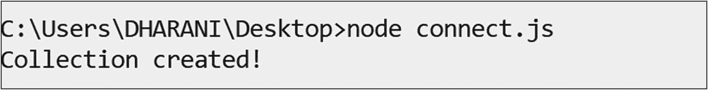

# 配方 2-16\. `Node.js` 和 MongoDB

在本配方中，我们将讨论如何使用 `Node.js` 和 MongoDB。

### 问题

你想使用 `Node.js` 执行 CRUD 操作。

### 解决方案

从 [`https://nodejs.org/en/download/`](https://nodejs.org/en/download/) 下载 `Node.js` 安装程序并安装。

##### 注意

给定的链接将来可能会更改。

接下来，打开命令提示符并发出以下命令以安装 `mongodb` 数据库驱动程序。

```
npm install mongodb
```

### 工作原理

让我们遵循本节中的步骤来操作 `Node.js` 和 MongoDB。

##### 步骤 1：建立连接并创建集合

将以下代码保存在名为 `connect.js` 的文件中。

```
var MongoClient = require('mongodb').MongoClient;
var url = "mongodb://localhost:27017/";
MongoClient.connect(url,{useNewUrlParser:true,useUnifiedTopology:true},function(err, db) {
if (err) throw err;
var mydb = db.db("mydb");
mydb.createCollection("employees", function(err, res) {
if (err) throw err;
console.log("Collection created!");
db.close();
});
});
```

通过在终端发出此命令来运行代码。

```
node connect.js
```

输出如下，

```
C:\Users\DHARANI\Desktop>node connect.js
Collection created!
```



##### 步骤 2：插入文档

将此处显示的代码保存在名为 `insert.js` 的文件中。

```
var MongoClient = require('mongodb').MongoClient;
var url = "mongodb://localhost:27017/";
MongoClient.connect(url, {useNewUrlParser:true, useUnifiedTopology:true},function(err, db) {
if (err) throw err;
var mydb = db.db("mydb");
var myobj = { name: "Subhashini", address: "E 603 Alpyne" };
mydb.collection("employees").insertOne(myobj, function(err, res) {
if (err) throw err;
console.log("Inserted");
db.close();
});
});
```

通过在命令提示符下发出以下命令来运行代码。

```
node insert.js
```

输出如下，

```
> show collections
mydb
> db.employees.find()
{ "_id" : ObjectId("5c050dd8c63a253134cbd375"), "name" : "Subhashini", "address" : "E 603 Alpyne" }
>
```

要插入多个文档，请使用此命令。

```
var myobj = [{name:"Shobana",address: "E 608 Alpyne"},{name:"Taanu", address:"Valley Street"}];
```

##### 步骤 3：查询文档

将以下代码保存在名为 `find.js` 的文件中。

```
var MongoClient = require('mongodb').MongoClient;
var url = "mongodb://localhost:27017/";
MongoClient.connect(url, {useNewUrlParser:true, useUnifiedTopology:true}, function(err, db) {
if (err) throw err;
var mydb = db.db("mydb");
var query = {name:"Subhashini" };
mydb.collection("employees").find(query).toArray(function(err, result) {
if (err) throw err;
console.log(result);
db.close();
});
});
```

通过在命令提示符下发出此命令来运行代码。

```
node find.js
```

输出如下，

```
[ { _id: 5c050dd8c63a253134cbd375,
name: 'Subhashini',
address: 'E 603 Alpyne' } ]
```

##### 步骤 4：更新文档

将此处显示的代码保存在名为 `update.js` 的文件中。

```
var MongoClient = require('mongodb').MongoClient;
var url = "mongodb://127.0.0.1:27017/";
MongoClient.connect(url, {useNewUrlParser:true, useUnifiedTopology:true}, function(err, db) {
if (err) throw err;
var mydb = db.db("mydb");
var query = {address:"E 603 Alpyne" };
var newvalues = { $set: {address:"New Street"}};
mydb.collection("employees").updateOne(query, newvalues, function(err, res) {
if (err) throw err;
console.log("Document Updated");
db.close();
});
});
```

通过在命令提示符下发出以下命令来运行代码。

```
node update.js
```

输出如下，

```
> db.employees.find({name:"Subhashini"})
{ "_id" : ObjectId("5c050dd8c63a253134cbd375"), "name" : "Subhashini", "address" : "New Street" }
>
```

##### 步骤 5：删除文档

将此处显示的代码保存在名为 `delete.js` 的文件中。

```
var MongoClient = require('mongodb').MongoClient;
var url = "mongodb://localhost:27017/";
MongoClient.connect(url, {useNewUrlParser:true, useUnifiedTopology:true}, function(err, db) {
if (err) throw err;
var mydb = db.db("mydb");
var query = {name:"Subhashini"};
mydb.collection("employees").deleteOne(query, function(err, obj) {
if (err) throw err;
console.log("Document deleted");
db.close();
});
});
```

通过在命令提示符下发出以下命令来运行代码。

```
node delete.js
```

输出如下，

```
Document deleted
```

