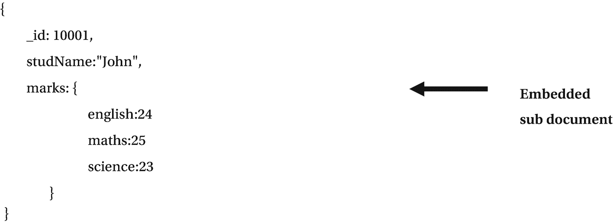
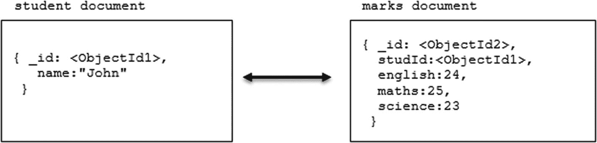

# 3. 数据建模与聚合

在第 2 章中，我们讨论了 MongoDB CRUD 操作、嵌入式文档和数组。在本章中，我们将涵盖以下主题。

*   数据模型。
*   文档之间的数据模型关系。
*   树结构建模。
*   聚合操作。
*   SQL 聚合术语及相应的 MongoDB 聚合操作。


## 数据模型

MongoDB 提供两种用于数据建模的数据模型设计：

*   `嵌入式数据模型`。
*   `规范化数据模型`。

### 嵌入式数据模型

在 MongoDB 中，您可以将相关数据嵌入到单个文档中。这种模式设计被称为 `非规范化` 模型。请参考图 3-1 中的示例。


图 3-1
一个非规范化模型

这种嵌入式文档模型允许应用程序将相关信息存储在同一条记录中。因此，应用程序只需少量查询和更新即可完成常见操作。

我们可以使用嵌入式文档来表示一对一关系（两个实体之间的“包含”关系）和一对多关系（当多个文档在一个父级的上下文中被查看时）。

嵌入式文档在以下情况下表现更佳：

*   对于读操作。
*   当我们需要在单次数据库操作中检索相关数据时。

`嵌入式数据模型` 在单个原子操作中更新相关数据。可以使用点表示法访问嵌入式文档数据。

### 规范化数据模型

`规范化数据模型` 使用引用来描述关系，如图 3-2 所示。


图 3-2
规范化数据模型

`规范化数据模型` 在以下情况下最为适用：

*   当嵌入式数据模型导致数据重复时。
*   用于表示复杂的多对多关系。
*   用于建模大型的层次数据集。

`规范化数据模型` 不能提供良好的读取性能。

## 文档间的数据模型关系

让我们探索一个同时使用嵌入式文档和引用的数据模型。

## 方案 3-1. 使用嵌入式文档的数据模型

在本方案中，我们将讨论使用嵌入式文档的数据模型。

### 问题

您想为一对一关系创建一个数据模型。

### 解决方案

使用嵌入式文档。

### 工作原理

让我们遵循本节中的步骤来为一对一关系设计数据模型。

#### 步骤 1： 一对一关系

考虑这个例子。

```json
{
_id: "James",
name: "James William"
}
{
student_id: "James",
street: "123 Hill Street",
city: "New York",
state: "US",
}
```

在这里，我们有学生和地址关系，其中一个地址属于该学生。如果我们经常需要连同姓名一起检索地址数据，那么引用方式需要多次查询来解析引用。在这种情况下，我们可以将地址数据与学生数据嵌入在一起，以提供更好的数据模型，如下所示。

```json
{
_id: "James",
name: "James William",
address: {
street: "123 Hill Street",
city: "New York",
state: "US",
}
}
```

通过这种数据模型，我们可以通过一次查询检索完整的学生信息。

#### 步骤 2： 一对多关系

考虑这个例子。

```json
{
_id: "James",
name: "James William"
}
{
student_id: "James",
street: "123 Hill Street",
city: "New York",
state: "US",
}
{
student_id: "James",
street: "234 Thomas Street",
city: "New Jersey",
state: "US",
}
```

在这里，我们有一个学生和多个地址的关系（一个学生有多个地址）。如果我们经常需要连同姓名一起检索地址数据，那么引用方式需要多次查询来解析引用。在这种情况下，设计模式的最优方式是像下面这样，将地址数据与学生数据嵌入在一起。

```json
{
_id: "James",
name: "James William",
address: [{
street: "123 Hill Street",
city: "New York",
state: "US",
},
{
street: "234 Thomas Street",
city: "New Jersey",
state: "US",
}]
}
```

这种数据模型允许我们通过一次查询检索完整的学生信息。

### 问题

您想为一对多关系创建一个数据模型。

### 解决方案

使用文档引用。

### 工作原理

让我们遵循本节中的步骤来为一对多关系设计数据模型。

#### 步骤 1： 一对多关系

考虑以下映射出版商和书籍关系的数据模型。

```json
{
title: "Practical Apache Spark",
author: [ "Subhashini Chellappan", "Dharanitharan Ganesan" ],
published_date: ISODate("2018-11-30"),
pages: 300,
language: "English",
publisher: {
name: "Apress",
founded: 1999,
location: "US"
}
}
{
title: "MongoDB Recipes",
author: [ "Subhashini Chellappan"],
published_date: ISODate("2018-11-30"),
pages: 120,
language: "English",
publisher: {
name: "Apress",
founded: 1999,
location: "US"
}
}
```

在这里，出版商文档被嵌入在书籍文档内部，这导致了出版商数据模型的重复。

在这种情况下，我们可以使用文档引用来避免数据重复。在文档引用中，关系的增长决定了引用的存储位置。如果每个出版商的书籍数量很少，那么我们可以像下面这样，在出版商文档内部存储书籍引用。

```json
{
name: "Apress",
founded: 1999,
location: "US",
books: [123456, 456789, ...]
}
{
_id: 123456,
title: "Practical Apache Spark",
author: [ "Subhashini Chellappan", "Dharanitharan Ganesan" ],
published_date: ISODate("2018-11-30"),
pages: 300,
language: "English"
}
{
_id: 456789,
title: "MongoDB Recipes",
author: [ "Subhashini Chellappan"],
published_date: ISODate("2018-11-30"),
pages: 120,
language: "English"
}
```

如果每个出版商的书籍数量是无限的，这种数据模型将导致可变的、不断增长的数组。我们可以通过像下面这样，在书籍文档内部存储出版商引用来避免这种情况。

```json
{
_id:"Apress",
name: "Apress",
founded: 1999,
location: "US"
}
{
_id: 123456,
title: "Practical Apache Spark",
author: [ "Subhashini Chellappan", "Dharanitharan Ganesan" ],
published_date: ISODate("2018-11-30"),
pages: 300,
language: "English",
publisher_id: "Apress"
}
{
_id: 456789,
title: "MongoDB Recipes",
author: [ "Subhashini Chellappan"],
published_date: ISODate("2018-11-30"),
pages: 120,
language: "English",
publisher_id: "Apress"
}
```


## 建模树形结构

让我们看一个描述树状结构的数据模型。

### 问题

你想为一个具有父引用的树形结构创建一个数据模型。

### 解决方案

使用父引用模式。

### 工作原理

让我们遵循本节中的步骤，来设计一个带有父引用的树形结构数据模型。

#### 步骤 3：使用祖先数组的树形结构

*祖先数组*模式将每个树节点存储在一个文档中；除了树节点本身，该文档还将该节点的祖先或路径的 `_id` 值存储在一个数组中。

考虑以下这个带有祖先数组的 `author` 树模型。

```
db.author.insert( { _id: "Practical Apache Spark", ancestors: [ "Subhashini", "Books" ], parent: "Books" } )
db.author.insert( { _id: "MongoDB Recipes", ancestors: [ "Subhashini", "Books" ], parent: "Books" } )
db.author.insert( { _id: "Books", ancestors: [ "Subhashini" ], parent: "Subhashini" } )
db.author.insert( { _id: " A Framework For Extracting Information From Web Using VTD-XML ", ancestors: [ "Subhashini", "Article" ], parent: "Article" } )
db.author.insert( { _id: "Article", ancestors: [ "Subhashini" ], parent: "Subhashini" } )
db.author.insert( { _id: "Subhashini", ancestors: [ ], parent: null } )
```

祖先数组字段存储了 `ancestors` 字段和对直属父节点的引用。

要检索祖先，请使用此命令。

```
db.author.findOne( { _id: "MongoDB Recipes" } ).ancestors
```

输出如下，

```
> db.author.findOne( { _id: "MongoDB Recipes" } ).ancestors
[ "Subhashini", "Books" ]
>
```

使用此命令查找其所有后代。

```
db.author.find( { ancestors: "Subhashini" } )
```

输出如下，

```
> db.author.find( { ancestors: "Subhashini" } )
{ "_id" : "Practical Apache Spark", "ancestors" : [ "Subhashini", "Books" ], "parent" : "Books" }
{ "_id" : "MongoDB Recipes", "ancestors" : [ "Subhashini", "Books" ], "parent" : "Books" }
{ "_id" : "Books", "ancestors" : [ "Subhashini" ], "parent" : "Subhashini" }
{ "_id" : " A Framework For Extracting Information From Web Using VTD-XML ", "ancestors" : [ "Subhashini", "Article" ], "parent" : "Article" }
{ "_id" : "Article", "ancestors" : [ "Subhashini" ], "parent" : "Subhashini" }
>
```

此模式为查找所有后代和节点的祖先提供了一个高效的解决方案。祖先数组模式是处理子树的一个不错选择。

## 聚合

聚合操作对来自多个文档的值进行分组，并可以对分组后的值执行各种操作以返回单个结果。MongoDB 提供以下聚合操作：

*   聚合管道。
*   Map-reduce 函数。
*   单用途聚合方法。

### 聚合管道

聚合管道是一个用于数据聚合的框架。它是基于数据处理管道的概念建模的。管道对某些输入执行一个操作，并将该输出用作下一个操作的输入。文档进入一个多阶段管道，该管道将它们转换为聚合结果。

### 配方 3-4. 聚合管道

在本配方中，我们将讨论聚合管道的工作原理。

### 问题

你想使用聚合函数。

### 解决方案

使用此方法。

```
db.collection.aggregate()
```

### 工作原理

让我们遵循本节中的步骤来使用聚合管道。

##### 步骤 1：聚合管道

执行以下 `orders` 集合以进行聚合。

```
db.orders.insertMany([{custID:"10001",amount:500,status:"A"},{custID:"10001",amount:250,status:"A"},{custID:"10002",amount:200,status:"A"},{custID:"10001",amount: 300, status:"D"}]);
```

要仅投影客户 ID，请使用以下语法。

```
db.orders.aggregate( [ { $project : { custID : 1 , _id : 0 } } ] )
```

输出如下，

```
> db.orders.aggregate( [ { $project : { custID : 1 , _id : 0 } } ] )
{ "custID" : "10001" }
{ "custID" : "10001" }
{ "custID" : "10002" }
{ "custID" : "10001" }
>
```

要按 `custID` 分组并计算 `amount` 的总和，请使用以下命令。

```
db.orders.aggregate({$group:{_id:"$custID",TotalAmount:{$sum:"$amount"}}});
```

在前面的例子中，通过使用 `$` 符号来访问变量的值。

输出如下，

```
> db.orders.aggregate({$group:{_id:"$custID",TotalAmount:{$sum:"$amount"}}});
{ "_id" : "10002", "TotalAmount" : 200 }
{ "_id" : "10001", "TotalAmount" : 1050 }
>
```

要筛选 `status: "A"`，然后按 `custID` 分组并计算 `amount` 的总和，请使用以下命令。

```
db.orders.aggregate({$match:{status:"A"}},{$group:{_id:"$custID",TotalAmount:{ $sum:"$amount"}}});
```

输出如下：

```
>db.orders.aggregate({$match:{status:"A"}},{$group:{_id:"$custID",TotalAmount:{ $sum:"$amount"}}});
{ "_id" : "10002", "TotalAmount" : 200 }
{ "_id" : "10001", "TotalAmount" : 750 }
>
```

要按 `custID` 分组并计算每组 `amount` 的平均值，请使用此命令。

```
db.orders.aggregate({$group:{_id:"$custID",AverageAmount:{$avg:"$amount"}}});
```

输出如下，

```
> db.orders.aggregate({$group:{_id:"$custID",AverageAmount:{$avg:"$amount"}}});
{ "_id" : "10002", "AverageAmount" : 200 }
{ "_id" : "10001", "AverageAmount" : 350 }
>
```

### Map-Reduce

MongoDB 也提供 map-reduce 来执行聚合操作。Map-reduce 包含两个阶段：一个 map 阶段，处理每个文档并输出一个或多个对象；一个 reduce 阶段，合并 map 操作的输出。

使用自定义的 JavaScript 函数来执行 map 和 reduce 操作。与聚合管道相比，map-reduce 效率较低且更复杂。

### 配方 3-5. Map-Reduce

在本配方中，我们将讨论如何使用 map-reduce 执行聚合操作。

### 问题

你想使用 map-reduce 来处理聚合操作。

### 解决方案

使用一个自定义的 JavaScript 函数。

### 工作原理

让我们遵循本节中的步骤来使用 map-reduce。

##### 步骤 1：Map-Reduce

执行以下 `orders` 集合以执行聚合操作。

```
db.orders.insertMany([{custID:"10001",amount:500,status:"A"},{custID:"10001",amount:250,status:"A"},{custID:"10002",amount:200,status:"A"},{custID:"10001",amount: 300, status:"D"}]);
```

要筛选 `status:"A"`，然后按 `custID` 分组并计算 `amount` 的总和，请使用以下 map-reduce 函数。

Map 函数：

```
var map = function(){
emit (this.custID, this.amount);}
```

Reduce 函数：

```
var reduce = function(key, values){ return Array.sum(values) ; }
```

要执行查询：

```
db.orders.mapReduce(map, reduce,{out: "order_totals",query:{status:"A"}});
db.order_totals.find()
```

输出如下，

```
> var map = function(){
... emit (this.custID, this.amount);}
> var reduce = function(key, values){ return Array.sum(values) ; }
> db.orders.mapReduce(map, reduce,{out: "order_totals",query:{status:"A"}});
{
"result" : "order_totals",
"timeMillis" : 82,
"counts" : {
"input" : 3,
"emit" : 3,
"reduce" : 1,
"output" : 2
},
"ok" : 1
}
> db.order_totals.find()
{ "_id" : "10001", "value" : 750 }
{ "_id" : "10002", "value" : 200 }
>
```

### 单用途聚合操作

MongoDB 也提供单用途聚合操作，例如 `db.collection.count()` 和 `db.collection.distinct()`。这些聚合操作对单个集合中的文档进行聚合。此功能提供了对常见聚合过程的简单访问。


## 方案 3-6. 单目的聚合操作

在本方案中，我们将讨论如何使用单目的聚合操作。

### 问题

你需要使用单目的聚合操作。

### 解决方案

使用以下命令。

```
db.collection.count()
db.collection.distinct()
```

### 工作原理

让我们按照本节的步骤来学习单目的聚合操作。

#### 步骤 1：单目的聚合操作

执行以下命令，向 `orders` 集合插入数据，以进行单目的聚合操作。

```
db.orders.insertMany([{custID:"10001",amount:500,status:"A"},{custID:"10001",amount:250,status:"A"},{custID:"10002",amount:200,status:"A"},{custID:"10001",amount: 300, status:"D"}]);
```

使用以下语法查找不重复的 `"custID"`。

```
db.orders.distinct("custID")
```

输出如下：

```
> db.orders.distinct("custID")
[ "10001", "10002" ]
>
```

要计算文档数量，请使用此代码。

```
db.orders.count()
```

输出如下：

```
> db.orders.count()

>
```

## SQL 聚合术语及对应的 MongoDB 聚合操作符

表 3-1 展示了 SQL 聚合术语及其对应的 MongoDB 聚合操作符。

表 3-1

SQL 聚合术语及对应的 MongoDB 操作符

| SQL 术语 | MongoDB 操作符 |
| --- | --- |
| WHERE | `$match` |
| GROUP BY | `$group` |
| HAVING | `$match` |
| SELECT | `$project` |
| ORDER BY | `$sort` |
| LIMIT | `$limit` |
| SUM | `$sum` |
| COUNT | `$sum` |
| JOIN | `$lookup` |

## 方案 3-7. 将 SQL 聚合映射到 MongoDB 聚合操作

在本方案中，我们将讨论将 MongoDB 操作与等效的 SQL 聚合术语相匹配的示例。

### 问题

你想要理解任何 SQL 查询所对应的 MongoDB 查询等效形式。

### 解决方案

参考表 3-1，并为相应的 SQL 子句使用等效的 MongoDB 操作符。

### 工作原理

让我们按照本节的步骤来理解某些 SQL 操作所对应的 MongoDB 查询。

#### 步骤 1：将 SQL 聚合操作转换为 MongoDB

执行以下查询以检查 `orders` 集合的详细信息。

```
> db.orders.find()
```

输出如下：

```
> db.orders.find()
{ "_id" : ObjectId("5d636112eea2dccfdeafa522"), "custID" : "10001", "amount" : 500, "status" : "A" }
{ "_id" : ObjectId("5d636112eea2dccfdeafa523"), "custID" : "10001", "amount" : 250, "status" : "A" }
{ "_id" : ObjectId("5d636112eea2dccfdeafa524"), "custID" : "10002", "amount" : 200, "status" : "A" }
{ "_id" : ObjectId("5d636112eea2dccfdeafa525"), "custID" : "10001", "amount" : 300, "status" : "D" }
```

现在，让我们来获取 `orders` 集合中的记录数。

想象一下，这与任何关系型数据库管理系统（RDBMS）中的 `orders` 表相同，用于从表中获取记录数的 SQL 语句如下：

```
SELECT COUNT(*) AS count FROM orders
```

使用以下查询来获取 MongoDB 集合中的文档数量。

```
> db.orders.aggregate( [ { $group: {  _id: null,  count: { $sum: 1 } } } ] )
```

输出如下：

```
> db.orders.aggregate( [ { $group: {  _id: null,  count: { $sum: 1 } } } ] )
{ "_id" : null, "count" : 4 }
```

