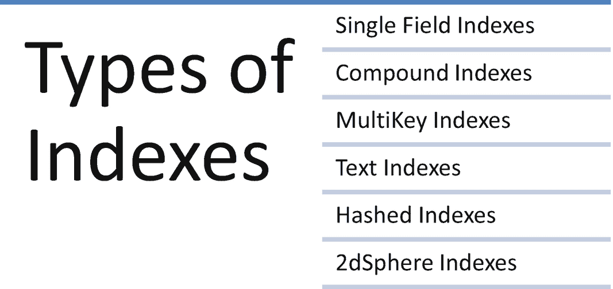

# 4. 索引

在第 3 章中，我们讨论了数据建模模式和聚合框架。在本章中，我们将讨论以下主题：

*   索引。
*   索引的类型。
*   索引属性。
*   需要考虑的各种索引策略。

索引用于提高查询性能。如果没有索引，MongoDB 必须扫描整个集合来选择与查询语句匹配的那些文档。因此，MongoDB 使用索引来限制其必须扫描的文档数量。

索引是一种特殊的数据结构，它以易于转换的格式存储集合数据集的一小部分。索引存储一组按字段值排序的字段。这种排序有助于提高等值匹配和基于范围的查询操作的性能。

MongoDB 在集合级别定义索引，可以在文档的任何字段上创建索引。默认情况下，MongoDB 为 `_id` 字段创建索引。

##### 注意

MongoDB 会为 `_id` 字段创建一个默认的唯一索引，这有助于防止插入两个 `_id` 字段值相同的文档。

## 方案 4-1. 使用索引

在本方案中，我们将讨论如何在 MongoDB 中使用索引。

### 问题

你想创建一个索引。

### 解决方案

使用以下命令。

```
db.collection.createIndex()
```

### 工作原理

让我们按照本节的步骤来创建索引。

考虑以下 `employee` 集合。

```
db.employee.insert({empId:1,empName:"John",state:"KA",country:"India"})
db.employee.insert({empId:2,empName:"Smith",state:"CA",country:"US"})
db.employee.insert({empId:3,empName:"James",state:"FL",country:"US"})
db.employee.insert({empId:4,empName:"Josh",state:"TN",country:"India"})
db.employee.insert({empId:5,empName:"Joshi",state:"HYD",country:"India"})
```

#### 步骤 1：创建索引

要为 `empId` 字段创建单字段索引，请使用以下命令。

```
db.employee.createIndex({empId:1})
```

这里的参数值 `1` 表示 `empId` 字段值将按升序存储。

输出如下：

```
> db.employee.createIndex({empId:1})
{
"createdCollectionAutomatically" : false,
"numIndexesBefore" : 1,
"numIndexesAfter" : 2,
"ok" : 1
}
>
```

要在多个字段上创建索引（称为复合索引），请使用此命令。

```
db.employee.createIndex({empId:1,empName:1})
```

输出如下：

```
> db.employee.createIndex({empId:1,empName:1})
{
"createdCollectionAutomatically" : false,
"numIndexesBefore" : 2,
"numIndexesAfter" : 3,
"ok" : 1
}
>
```

要显示索引列表，语法如下。

```
db.employee.getIndexes()
```

输出如下：

```
> db.employee.getIndexes()
[
{
"v" : 2,
"key" : {
"_id" : 1
},
"name" : "_id_",
"ns" : "test.employee"
},
{
"v" : 2,
"key" : {
"empId" : 1
},
"name" : "empId_1",
"ns" : "test.employee"
},
{
"v" : 2,
"key" : {
"empId" : 1,
"empName" : 1
},
"name" : "empId_1_empName_1",
"ns" : "test.employee"
}
]
>
```

要删除复合索引，请使用以下命令。

```
db.employee.dropIndex({empId:1,empName:1})
```

输出如下：

```
> db.employee.dropIndex({empId:1,empName:1})
{ "nIndexesWas" : 3, "ok" : 1 }
>
```

要删除所有索引，请使用此命令。

```
db.employee.dropIndexes()
```

输出如下：

```
> db.employee.dropIndexes()
{
"nIndexesWas" : 2,
"msg" : "non-_id indexes dropped for collection",
"ok" : 1
}
>
```

##### 注意

我们不能删除 `_id` 索引。默认情况下，MongoDB 为 `_id` 字段创建索引。

## 方案 4-2. 索引类型

在本方案中，我们将讨论各种索引类型。

### 问题

你想创建不同类型的索引。

### 解决方案

使用以下命令。

```
db.collection.createIndex()
```

### 工作原理

让我们按照本节的步骤来创建如图 4-1 所示的不同类型的索引。



图 4-1

索引类型


## 配方 4-3. 索引属性

索引也可以拥有属性。索引属性定义了索引字段在运行时的某些特性和行为。例如，唯一索引确保被索引的字段不支持重复值。在本配方中，我们将讨论各种索引属性。

### 问题

你想要使用索引属性。

### 解决方案

使用此命令。

```
db.collection.createIndex()
```

### 工作原理

让我们按照本节的步骤来使用索引属性。

#### 步骤 1：多键索引

多键索引对于为持有数组值的字段创建索引非常有用。MongoDB 会为数组中的每个元素创建一个索引键。

考虑下面的集合，如果该集合不存在，你可以创建它。

```
db.employeeproject.insert({empId:1001,empName:"John",projects:["Hadoop","MongoDB"]})
db.employeeproject.insert({empId:1002,empName:"James",projects:["MongoDB","Spark"]})
```

要为 `projects` 字段创建索引，请使用以下命令。

```
db.employeeproject.createIndex({projects:1})
```

输出如下：

```
> db.employeeproject.createIndex({projects:1})
{
"createdCollectionAutomatically" : false,
"numIndexesBefore" : 1,
"numIndexesAfter" : 2,
"ok" : 1
}
```

##### 注意

你无法创建复合多键索引。

#### 步骤 2：文本索引

MongoDB 提供文本索引以支持对字符串内容进行文本搜索查询。你可以在其值为字符串或字符串元素数组的字段上创建文本索引。

考虑这个 `post` 集合。

```
db.post.insert({
"post_text": "Happy Learning",
"tags": [
"mongodb",
"10gen"
]
})
```

要创建文本索引，请使用以下命令。

```
db.post.createIndex({post_text:"text"})
```

此命令为 `post_text` 字段创建文本索引。

输出如下：

```
> db.post.createIndex({post_text:"text"})
{
"createdCollectionAutomatically" : false,
"numIndexesBefore" : 1,
"numIndexesAfter" : 2,
"ok" : 1
}
>
```

要执行搜索，请使用如下所示的命令。

```
db.post.find({$text:{$search:"Happy"}})
```

输出如下：

```
> db.post.find({$text:{$search:"Happy"}})
{ "_id" : ObjectId("5bb215286d8d957bcedc225e"), "post_text" : "Happy Learning", "tags" : [ "mongodb", "10gen" ] }
>
```

#### 步骤 3：哈希索引

借助哈希索引，可以减小索引的大小。哈希索引存储索引字段值的哈希值。哈希索引支持使用哈希分片键进行分片。在基于哈希的分片中，字段的哈希索引被用作分片键，以在分片集群中分配数据。我们将在第 5 章讨论分片。

哈希索引不支持多键索引。

考虑此处显示的 `user` 集合。

```
db.user.insert({userId:1,userName:"John"})
db.user.insert({userId:2,userName:"James"})
db.user.insert({userId:3,userName:"Jack"})
```

要在 `userId` 字段上创建基于哈希的索引，请使用以下命令。

```
db.user.createIndex( { userId: "hashed" } )
```

输出如下：

```
> db.user.createIndex( { userId: "hashed" } )
{
"createdCollectionAutomatically" : false,
"numIndexesBefore" : 1,
"numIndexesAfter" : 2,
"ok" : 1
}
>
```

#### 步骤 4：2dsphere 索引

2dsphere 索引对于返回地理空间数据上的查询非常有用。

考虑此处给出的 `schools` 集合。

```
db.schools.insert( {
name: "St.John's School",
location: { type: "Point", coordinates: [ -73.97, 40.77 ] },
} );
db.schools.insert( {
name: "St.Joseph's School",
location: { type: "Point", coordinates: [ -73.9928, 40.7193 ] },
} );
db.schools.insert( {
name: "St.Thomas School",
location: { type: "Point", coordinates: [ -73.9375, 40.8303 ] },
} );
```

使用以下语法创建 2dsphere 索引。

```
db.schools.createIndex( { location : "2dsphere" } )
```

以下代码使用 `$near` 运算符返回距离指定 GeoJSON 点至少 500 米且最多 1,500 米的文档。

```
db.schools.find({location:{$near:{$geometry: { type: "Point",  coordinates: [ -73.9667, 40.78 ] },$minDistance: 500,$maxDistance: 1500}}})
```

输出如下：

```
> db.schools.find({location:{$near:{$geometry: { type: "Point",  coordinates: [ -73.9667, 40.78 ] },$minDistance: 500,$maxDistance: 1500}}})
{ "_id" : ObjectId("5ca47a184b034d4cc1345f45"), "name" : "St.John's School", "location" : { "type" : "Point", "coordinates" : [ -73.97, 40.77 ] } }
>
```

#### 步骤 5：TTL 索引

生存时间 (TTL) 索引是单字段索引，用于在一定时间后从集合中移除文档。数据过期对于某些类型的信息（如日志、机器生成的数据等）非常有用。

考虑此处显示的 `sample` 集合。

```
db.credit.insert({credit:16})
db.credit.insert({credit:18})
db.credit.insert({credit:12})
```

要在 credit 字段上创建 TTL 索引，请发出以下命令。

```
db.credit.createIndex( { credit: 1 }, { expireAfterSeconds: 35 } );
```

输出如下：

```
> db.credit.createIndex( { credit: 1 }, { expireAfterSeconds:35 } );
{
"createdCollectionAutomatically" : false,
"numIndexesBefore" : 1,
"numIndexesAfter" : 2,
"ok" : 1
}
>
```

#### 步骤 6：唯一索引

唯一索引确保被索引的字段不包含任何重复值。默认情况下，MongoDB 在 `_id` 字段上创建唯一索引。

考虑以下 `student` 集合。

```
db.student.insert({_id:1,studid:101,studname:"John"})
db.student.insert({_id:2,studid:102,studname:"Jack"})
db.student.insert({_id:3,studid:103,studname:"James"})
```

要为 `studId` 字段创建唯一索引，请使用此命令。

```
db.student.createIndex({"studid":1}, {unique:true})
```

输出如下：

```
> db.student.createIndex({"studid":1}, {unique:true})
{
"createdCollectionAutomatically" : false,
"numIndexesBefore" : 1,
"numIndexesAfter" : 2,
"ok" : 1
}
>
```

当我们尝试插入值 `studid:101` 时，

```
db.student.insert([{_id:1,studid:101,studname:"John"}])
```

会抛出以下错误消息：

```
"errmsg" : "E11000 duplicate key error collection: test.student index: _id_ dup key: { : 1.0 }",
```

#### 步骤 7：部分索引

当你想要索引集合中满足特定过滤条件的文档时，部分索引非常有用。过滤条件可以使用任何运算符指定。例如，`db.person.find( { age: { $gt: 15 } } )` 可用于查找 `person` 集合中年龄大于 15 的文档。部分索引减少了存储需求和性能开销，因为它们只存储文档的一个子集。

使用带有 `partialFilterExpression` 选项的 `db.collection.createIndex()` 方法来创建部分索引。

`partialFilterExpression` 选项接受一个文档，该文档使用以下内容指定过滤条件：

*   相等表达式（即 `字段: 值` 或使用 `$eq` 运算符）。
*   `$exists: true` 表达式。
*   `$gt`、`$gte`、`$lt` 和 `$lte` 表达式。
*   `$type` 表达式。
*   仅限顶级的 `$and` 运算符。

考虑以下 `person` 集合的文档。

```
db.person.insert({personName:"John",age:16})
db.person.insert({personName:"James",age:15})
db.person.insert({personName:"John",hobbies:["sports","music"]})
```

要仅索引 `person` 集合中 `age` 字段值大于 15 的那些文档，请使用以下命令。

```
db.person.createIndex(  { age: 1},{partialFilterExpression: { age: { $gt: 15 }}})
```

此处显示的查询使用部分索引来返回 `person` 集合中 `age` 值大于 15 的那些文档。

```
db.person.find( { age: { $gt: 15 } } )
```

输出如下：

```
> db.person.find( { age: { $gt: 15 } } )
{ "_id" : ObjectId("5ca453954b034d4cc1345f3b"), "personName" : "John", "age" : 16 }
>
```

