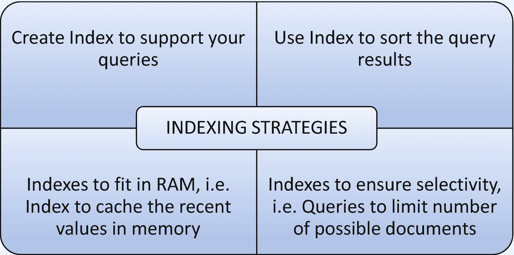

# 技巧 4-4. 索引策略

我们必须遵循不同的策略来为我们的需求创建正确的索引。在本技巧中，我们将讨论各种索引策略。

### 问题

您想了解索引策略，以确保为不同目的创建正确类型的索引。

### 解决方案

最佳索引策略由多种因素决定，包括

*   执行查询的类型。
*   读/写操作的数量。
*   可用内存。

图 4-2 展示了不同的索引策略。



图 4-2：索引策略

### 工作原理

让我们按照本节的步骤来使用不同的索引策略。

##### 步骤 1：创建支持查询的索引

创建正确的索引来支持查询，可以提高查询执行性能并带来卓越的表现。

如果所有查询都使用相同的单个键来检索文档，则创建单字段索引。

```
> db.employee.createIndex({empId:1})
```

如果所有查询都使用多个键（多个过滤条件）来检索文档，则创建多字段复合索引。

```
> db.employee.createIndex({empId:1,empName:1})
```

##### 步骤 2：使用索引对查询结果排序

排序操作使用索引以获得更好的性能。索引通过根据索引中的顺序获取文档来确定排序顺序。

排序可以在以下场景中完成：

*   使用单字段索引排序。
*   对多个字段排序。

###### 使用单字段索引排序

在检索文档时，索引可以支持对单个字段进行升序或降序排序。

```
> db.employee.createIndex({empId:1})
```

上面的索引可以支持升序排序。

```
> db.employee.find().sort({empId:1})
```

输出如下，

```
MongoDB Enterprise > db.employee.createIndex({empId:1})
{
"createdCollectionAutomatically" : false,
"numIndexesBefore" : 1,
"numIndexesAfter" : 2,
"ok" : 1
}
MongoDB Enterprise > db.employee.find()
{ "_id" : ObjectId("5d50ed688dcf280c50fde439"), "empId" : 1, "empName" : "John", "state" : "KA", "country" : "India" }
{ "_id" : ObjectId("5d50ed688dcf280c50fde43a"), "empId" : 2, "empName" : "Smith", "state" : "CA", "country" : "US" }
{ "_id" : ObjectId("5d50ed688dcf280c50fde43b"), "empId" : 3, "empName" : "James", "state" : "FL", "country" : "US" }
{ "_id" : ObjectId("5d50ed688dcf280c50fde43c"), "empId" : 4, "empName" : "Josh", "state" : "TN", "country" : "India" }
{ "_id" : ObjectId("5d50ed688dcf280c50fde43d"), "empId" : 5, "empName" : "Joshi", "state" : "HYD", "country" : "India" }
MongoDB Enterprise > db.employee.find().sort({empId:1})
{ "_id" : ObjectId("5d50ed688dcf280c50fde439"), "empId" : 1, "empName" : "John", "state" : "KA", "country" : "India" }
{ "_id" : ObjectId("5d50ed688dcf280c50fde43a"), "empId" : 2, "empName" : "Smith", "state" : "CA", "country" : "US" }
{ "_id" : ObjectId("5d50ed688dcf280c50fde43b"), "empId" : 3, "empName" : "James", "state" : "FL", "country" : "US" }
{ "_id" : ObjectId("5d50ed688dcf280c50fde43c"), "empId" : 4, "empName" : "Josh", "state" : "TN", "country" : "India" }
{ "_id" : ObjectId("5d50ed688dcf280c50fde43d"), "empId" : 5, "empName" : "Joshi", "state" : "HYD", "country" : "India" }
```

相同的索引也可以支持对文档进行降序排序。

```
MongoDB Enterprise > db.employee.find().sort({empId:-1})
{ "_id" : ObjectId("5d50ed688dcf280c50fde43d"), "empId" : 5, "empName" : "Joshi", "state" : "HYD", "country" : "India" }
{ "_id" : ObjectId("5d50ed688dcf280c50fde43c"), "empId" : 4, "empName" : "Josh", "state" : "TN", "country" : "India" }
{ "_id" : ObjectId("5d50ed688dcf280c50fde43b"), "empId" : 3, "empName" : "James", "state" : "FL", "country" : "US" }
{ "_id" : ObjectId("5d50ed688dcf280c50fde43a"), "empId" : 2, "empName" : "Smith", "state" : "CA", "country" : "US" }
{ "_id" : ObjectId("5d50ed688dcf280c50fde439"), "empId" : 1, "empName" : "John", "state" : "KA", "country" : "India" }
```

###### 对多个字段排序

我们可以创建一个复合索引以支持对多个字段进行排序。

```
> db.employee.createIndex({empId:1,empName:1})
```

输出如下，

```
MongoDB Enterprise > db.employee.createIndex({empId:1,empName:1})
{
"createdCollectionAutomatically" : false,
"numIndexesBefore" : 2,
"numIndexesAfter" : 3,
"ok" : 1
}
MongoDB Enterprise > db.employee.find().sort({empId:1,empName:1})
{ "_id" : ObjectId("5d50ed688dcf280c50fde439"), "empId" : 1, "empName" : "John", "state" : "KA", "country" : "India" }
{ "_id" : ObjectId("5d50ed688dcf280c50fde43a"), "empId" : 2, "empName" : "Smith", "state" : "CA", "country" : "US" }
{ "_id" : ObjectId("5d50ed688dcf280c50fde43b"), "empId" : 3, "empName" : "James", "state" : "FL", "country" : "US" }
{ "_id" : ObjectId("5d50ed688dcf280c50fde43c"), "empId" : 4, "empName" : "Josh", "state" : "TN", "country" : "India" }
{ "_id" : ObjectId("5d50ed688dcf280c50fde43d"), "empId" : 5, "empName" : "Joshi", "state" : "HYD", "country" : "India" }
```

###### 将最近的值保存在内存中的索引

当使用多个集合时，我们必须考虑所有集合上索引的大小，并确保索引能放入内存，以避免系统从磁盘读取索引。

使用以下查询检查任何集合的索引大小。

```
> db.employee.totalIndexSize()
```

当我们确保索引完全装入 RAM 时，这就能保证更快的系统处理速度。

输出如下，

```
MongoDB Enterprise > db.employee.totalIndexSize()

```

##### 步骤 4：稀疏索引

稀疏索引仅为包含被索引字段的文档存储条目，即使该字段包含 `null` 值。稀疏索引会跳过任何不包含被索引字段的文档。该索引被认为是稀疏的，因为它不包含集合中的所有文档。

考虑以下 `person` 集合。

```
db.person.insert({personName:"John",age:16})
db.person.insert({personName:"James",age:15})
db.person.insert({personName:"John",hobbies:["sports","music"]})
```

要在 `age` 字段上创建稀疏索引，请执行此命令。

```
db.person.createIndex( { age: 1 }, { sparse: true } );
```

输出如下，

```
> db.person.createIndex( { age: 1 }, { sparse: true } );
{
"createdCollectionAutomatically" : false,
"numIndexesBefore" : 1,
"numIndexesAfter" : 2,
"ok" : 1
}
>
```

要使用 `age` 字段上的索引返回名为 `person` 的集合中的所有文档，请使用 `hint()` 来指定稀疏索引。

```
db.person.find().hint( { age: 1 } ).count();
```

输出如下，

```
> db.person.find().hint( { age: 1 } ).count();

>
```

要执行正确的计数，请使用此代码。

```
db.person.find().count();
```

输出如下，

```
> db.person.find().count();

>
```

##### 注意

部分索引根据过滤条件确定索引条目，而稀疏索引则根据被索引字段的存在性来选择文档。


##### 创建查询以确保选择性

任何查询利用已创建索引来缩小结果范围的能力被称为 `选择性`。编写利用索引字段限制可能文档数量的查询，并且这些查询相对于你的索引数据具有适当选择性，这样才能保证选择性。

```
> db.employee.find({empId:{$gt:1},country:"India"})
```

此查询必须扫描所有文档才能返回 `empId` 值大于 1 的结果。输出如下：

```
MongoDB Enterprise > db.employee.find({empId:{$gt:1},country:"India"})
{ "_id" : ObjectId("5d50ed688dcf280c50fde43c"), "empId" : 4, "empName" : "Josh", "state" : "TN", "country" : "India" }
{ "_id" : ObjectId("5d50ed688dcf280c50fde43d"), "empId" : 5, "empName" : "Joshi", "state" : "HYD", "country" : "India" }
> db.employee.find({empId:4})
```

此查询只需扫描一个文档即可返回 `empId:4` 的结果。输出如下：

```
MongoDB Enterprise > db.employee.find({empId:4})
{ "_id" : ObjectId("5d50ed688dcf280c50fde43c"), "empId" : 4, "empName" : "Josh", "state" : "TN", "country" : "India" }
```

