# 复制与分片

在第 4 章，我们讨论了 MongoDB 中的各种索引。在本章，我们将涵盖以下主题：

*   复制。
*   分片。

## 复制

`复制` 是在多台服务器上创建和管理数据库副本的过程，旨在提供冗余并提高数据的可用性。

在 MongoDB 中，复制是借助副本集实现的。副本集是一组 `mongod` 实例，它们维护着相同的数据集。一个副本集包含一个主节点，负责所有的写操作；以及一个或多个从节点，它们复制主节点的操作日志并应用这些操作到自己的数据集上，以反映主节点的数据集。图 5-1 是一个副本集的示意图。

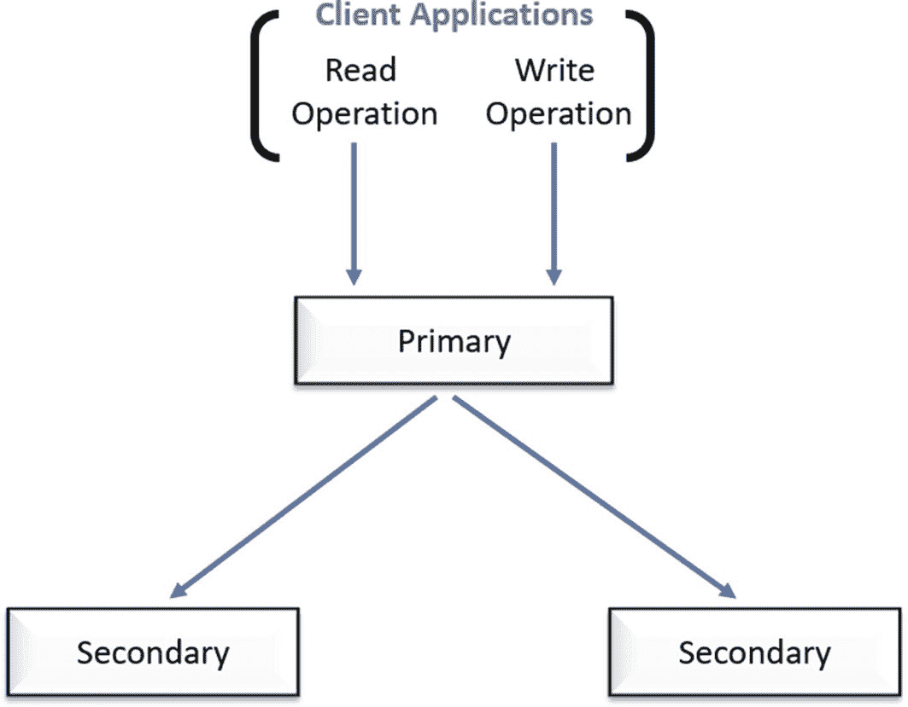
*图 5-1：一个副本集*

### 配方 5-1. 设置副本集

在本配方中，我们将讨论如何在 Windows 中设置一个副本集（一个主节点和两个从节点）。

### 问题

你想创建一个副本集。

### 解决方案

使用一组 `mongod` 实例。

### 工作原理

让我们按照本节的步骤来设置一个三成员的副本集。

##### 步骤 1：三成员副本集

首先，创建三个数据目录：

```
md c:\mongodb\repset\rs1
md c:\mongodb\repset\rs2
md c:\mongodb\repset\rs3
```

输出如下：

```
c:\>md c:\mongodb\repset\rs1
c:\>md c:\mongodb\repset\rs2
c:\>md c:\mongodb\repset\rs3
```

接下来，如下所示启动三个 `mongod` 实例（见图 5-2、5-4 和 5-6）。

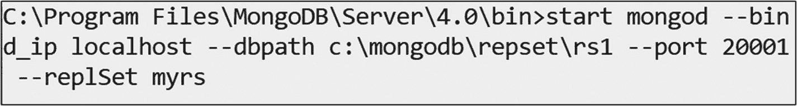
*图 5-2：使用副本集 1 启动 `mongod`*

```
start mongod --bind_ip hostname --dbpath c:\mongodb\repset\rs1 --port 20001 --replSet myrs
```


## 副本集初始化与基本操作

### 初始化副本集

`hostname` 必须被替换为 `ipaddress`，如果它是同一台本地机器，则也可以替换为 `localhost`。

请参考图 5-3，其中展示了一个正在端口 20001 上等待连接的 `mongod` 实例。
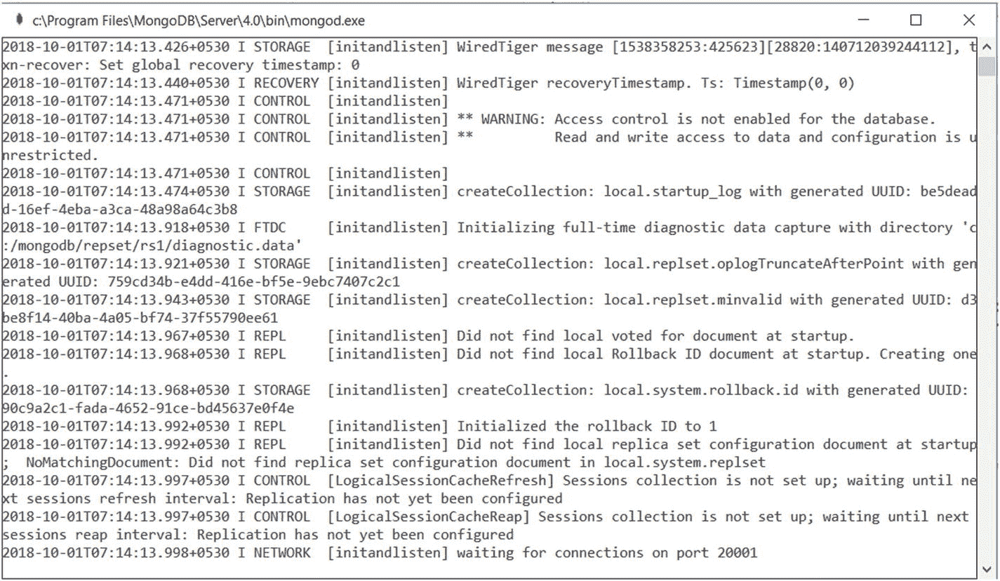
图 5-3：`mongod` 实例在端口 20001 上等待连接

```
start mongod --bind_ip hostname --dbpath c:\mongodb\repset\rs2 --port 20002 --replSet myrs
```

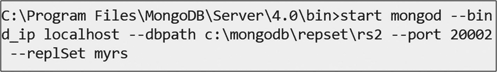
图 5-4：启动第二个副本集的 `mongod`

请参考图 5-5，其中展示了一个正在端口 20002 上等待连接的 `mongod` 实例。
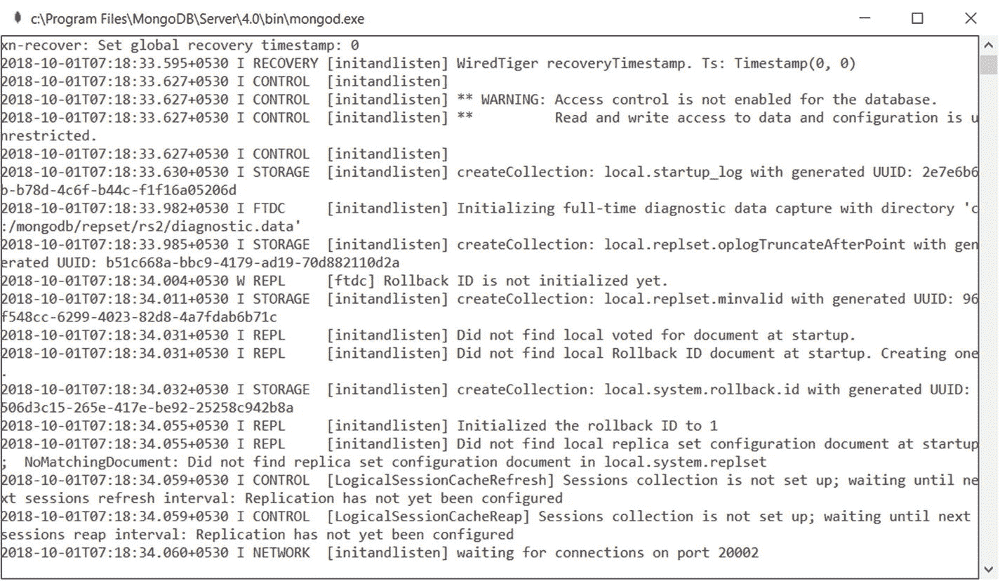
图 5-5：`mongod` 实例在端口 20002 上等待连接

```
start mongod --bind_ip hostname --dbpath c:\mongodb\repset\rs3 --port 20003 --replSet myrs
```

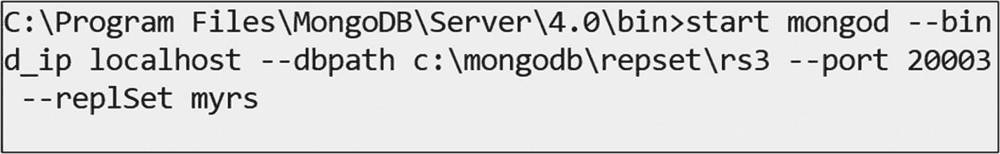
图 5-6：启动第三个副本集的 `mongod`

请参考图 5-7，其中展示了一个正在端口 20003 上等待连接的 `mongod` 实例。
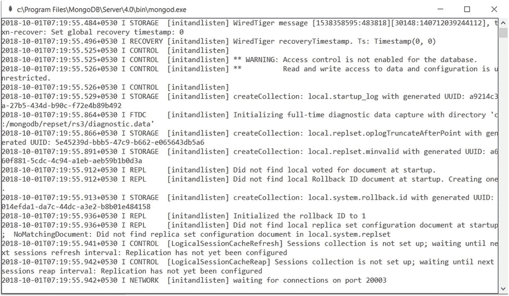
图 5-7：`mongod` 实例在端口 20003 上等待连接

接下来，执行以下命令以连接到运行在端口 20001 的 `mongod` 实例。

```
mongo hostname:20001
```

图 5-8 显示了连接到端口 20001 的 `mongo` shell。
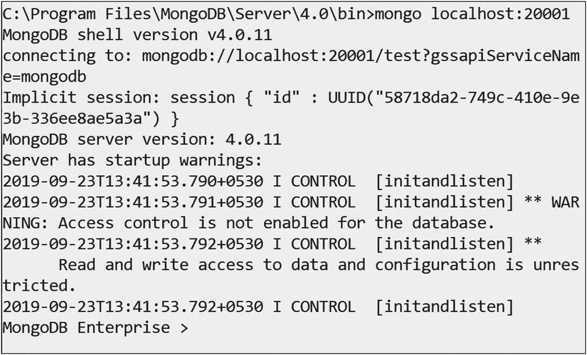
图 5-8：连接到端口 20001 的 `mongo` 实例

在 `mongo` shell 中执行以下命令以创建一个三成员的副本集。

```
rs.initiate();   // 初始化副本集
```

输出如下：

```
> rs.initiate();
{
"info2" : "no configuration specified. Using a default configuration for the set",
"me" : "hostname:20001",
"ok" : 1,
"operationTime" : Timestamp(1538362864, 1),
"$clusterTime" : {
"clusterTime" : Timestamp(1538362864, 1),
"signature" : {
"hash" : BinData(0,"AAAAAAAAAAAAAAAAAAAAAAAAAAA="),
"keyId" : NumberLong(0)
}
}
}
```

初始化副本集后，我们可以使用此命令添加辅助节点。

```
rs.add("hostname:20002");  // 添加辅助节点
```

输出如下：

```
myrs:SECONDARY> rs.add("hostname:20002");
{
"ok" : 1,
"operationTime" : Timestamp(1538362927, 1),
"$clusterTime" : {
"clusterTime" : Timestamp(1538362927, 1),
"signature" : {
"hash" : BinData(0,"AAAAAAAAAAAAAAAAAAAAAAAAAAA="),
"keyId" : NumberLong(0)
}
}
}
myrs:PRIMARY>
```

此时，运行在端口 20001 的 `mongod` 实例成为主节点。

我们可以使用以下命令添加另一个辅助节点。

```
rs.add("hostname:20003");    // 添加辅助节点
```

输出如下：

```
myrs:PRIMARY>  rs.add("hostname:20003");
{
"ok" : 1,
"operationTime" : Timestamp(1538362931, 1),
"$clusterTime" : {
"clusterTime" : Timestamp(1538362931, 1),
"signature" : {
"hash" : BinData(0,"AAAAAAAAAAAAAAAAAAAAAAAAAAA="),
"keyId" : NumberLong(0)
}
}
}
myrs:PRIMARY>
```

现在，你可以通过执行以下命令来检查副本集的状态。

```
rs.status()
```

接下来，使用主副本节点创建一个名为 `employee` 的集合。

```
db.employee.insert({_id:10001,name:'Subhashini'});
db.employee.insert({_id:10002,name:'Shobana'});
```

输出如下：

```
myrs:PRIMARY> db.employee.insert({_id:10001,name:'Subhashini'});
WriteResult({ "nInserted" : 1 })
myrs:PRIMARY>  db.employee.insert({_id:10002,name:'Shobana'});
WriteResult({ "nInserted" : 1 })
myrs:PRIMARY>
```

现在，执行此命令连接到运行在端口 20002 的 `mongo` shell。

```
mongo hostname:20002
```

输出如下：

```
myrs:SECONDARY>
```

现在，执行以下命令查找所有员工记录。

```
myrs:SECONDARY> db.employee.find()
Error: error: {
"operationTime" : Timestamp(1538364766, 1),
"ok" : 0,
"errmsg" : "not master and slaveOk=false",
"code" : 13435,
"codeName" : "NotMasterNoSlaveOk",
"$clusterTime" : {
"clusterTime" : Timestamp(1538364766, 1),
"signature" : {
"hash" : BinData(0,"AAAAAAAAAAAAAAAAAAAAAAAAAAA="),
"keyId" : NumberLong(0)
}
}
}
myrs:SECONDARY>
```

输出 `Error: error: { ........... }` 表明，因为我们正尝试从辅助节点读取数据，所以收到了错误信息。

执行以下命令以从辅助节点执行读操作。

```
myrs:SECONDARY> rs.slaveOk()
myrs:SECONDARY> db.employee.find()
{ "_id" : 10001, "name" : "Subhashini" }
{ "_id" : 10002, "name" : "Shobana" }
```

接下来，尝试从辅助节点执行写操作。

```
myrs:SECONDARY> db.employee.insert({_id:10003,name:"Arunaa MS"})
WriteCommandError({
"operationTime" : Timestamp(1538364966, 1),
"ok" : 0,
"errmsg" : "not master",
"code" : 10107,
"codeName" : "NotMaster",
"$clusterTime" : {
"clusterTime" : Timestamp(1538364966, 1),
"signature" : {
"hash" : BinData(0,"AAAAAAAAAAAAAAAAAAAAAAAAAAA="),
"keyId" : NumberLong(0)
}
}
})
myrs:SECONDARY>
```

在上面的输出中，`WriteCommandError { ........... }` 表明我们收到了错误信息，因为我们无法在辅助节点上执行写操作。我们只能在主节点上执行写操作。

所有辅助节点都会复制主节点的日志并应用其操作，以确保辅助节点的数据集反映主节点的数据集，如图 5-9 所示。
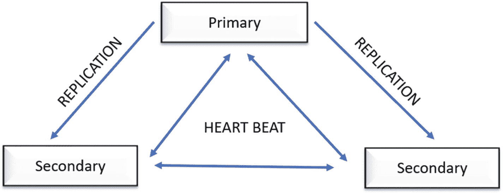
图 5-9：复制策略

### 自动故障转移—高可用

终止运行在端口 20001 的主节点，并在运行于端口 20002 和 20003 的 `mongo` shell 中按回车键（图 5-10）。此时任何一个辅助节点都可以成为主节点。
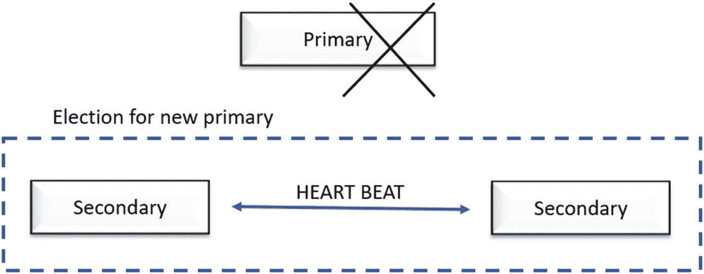
图 5-10：主节点故障转移

当主节点在配置的时间段内（默认 10 秒）未与副本集中的其他成员通信时，一个符合条件的辅助节点会发起选举，提名自己为新的主节点并恢复正常操作（图 5-11）。
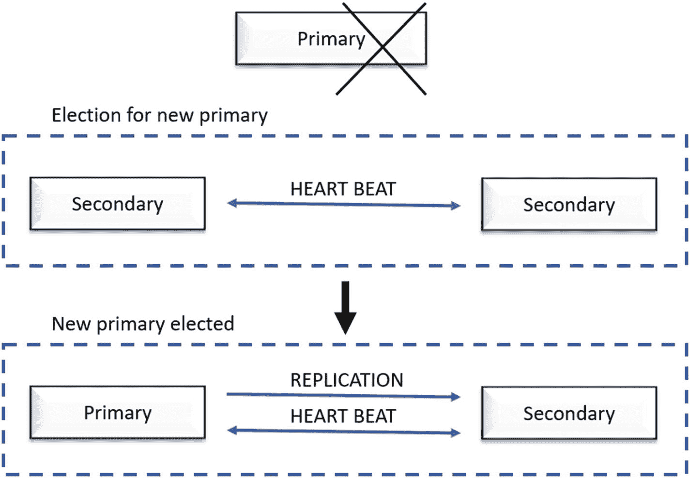
图 5-11：主节点故障转移与新主节点选举

要启用免费监控，请运行以下命令。

```
db.enableFreeMonitoring()
```

要永久禁用此提醒，请运行以下命令。

```
db.disableFreeMonitoring()
```

要检查免费监控的状态，请使用此命令。

```
db.getFreeMonitoringStatus()
```

## 分片

分片是一种将数据分布到多台机器的方法。解决系统扩展问题有两种方法：垂直扩展和水平扩展。

*   *垂直扩展：* 我们需要提升单台服务器的能力，例如使用更强大的 CPU、增加更多 RAM 或扩大存储空间。
*   *水平扩展：* 我们需要划分数据集，并通过根据需要添加更多服务器来分摊工作负载，从而提升处理能力。

MongoDB 通过分片技术支持水平扩展。一个 MongoDB 分片集群包含以下组件：

1.  *分片：* 每个分片包含一部分分片数据。每个分片可以部署为一个副本集。
2.  `mongos`*:* `mongos` 作为查询路由器，在客户端应用程序和分片集群之间提供接口。
3.  *配置服务器：* 配置服务器存储集群的元数据和配置设置。

## 方法 5-2. 创建分片

在这个方法中，我们将讨论如何创建分片来在服务器之间分布数据。

### 问题

你希望创建分片，以在服务器间分布数据。

### 解决方案

解决方案是一组 `mongod` 实例。

### 工作原理

让我们按照本节的步骤来设置一个分片。


##### 第 1 步：分片集群

首先，按如下所示为三个分片创建数据目录。

*分片 1*

```
md c:\shard_data\shard1\data1
md c:\shard_data\shard1\data2
md c:\shard_data\shard1\data3
```

*分片 2*

```
md c:\shard_data\shard2\data1
md c:\shard_data\shard2\data2
md c:\shard_data\shard2\data3
```

*分片 3*

```
md c:\shard_data\shard3\data1
md c:\shard_data\shard3\data2
md c:\shard_data\shard3\data3
```

接下来，按如下所示启动分片。

*分片 1*

```
start mongod.exe --shardsvr --port 26017 --dbpath "c:\shard_data\shard1\data1" --replSet shard1_replset
start mongod.exe --shardsvr --port 26117 --dbpath "c:\shard_data\shard1\data2" --replSet shard1_replset
start mongod.exe --shardsvr --port 26217 --dbpath "c:\shard_data\shard1\data3" --replSet shard1_replset
```

图 5-12 显示了命令的执行情况。

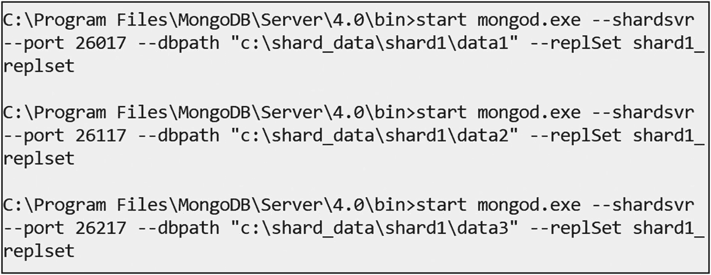

图 5-12

启动 `shard1` 服务器

*分片 2*

```
start mongod.exe --shardsvr --port 28017 --dbpath "c:\shard_data\shard2\data1" --replSet shard2_replset
start mongod.exe --shardsvr --port 28117 --dbpath "c:\shard_data\shard2\data2" --replSet shard2_replset
start mongod.exe --shardsvr --port 28217 --dbpath "c:\shard_data\shard2\data3" --replSet shard2_replset
```

图 5-13 显示了命令的执行情况。

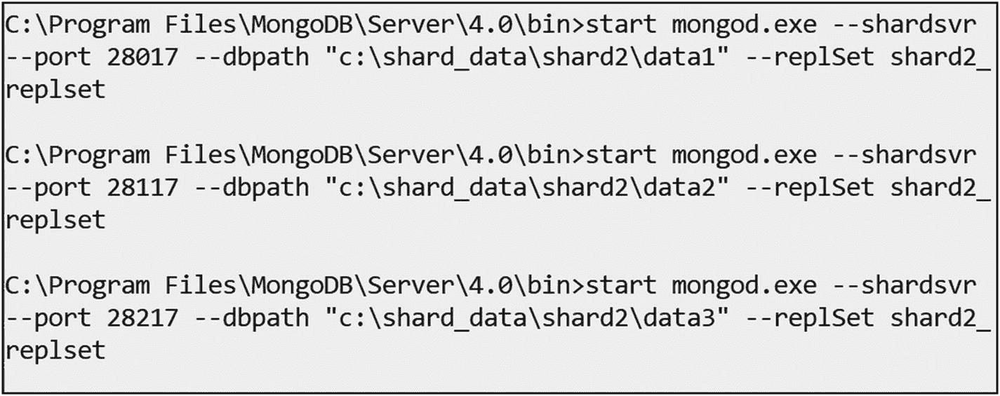

图 5-13

启动 `shard2` 服务器

*分片 3*

```
start mongod.exe --shardsvr --port 29017 --dbpath "c:\shard_data\shard3\data1" --replSet shard3_replset
start mongod.exe --shardsvr --port 29117 --dbpath "c:\shard_data\shard3\data2" --replSet shard3_replset
start mongod.exe --shardsvr --port 29217 --dbpath "c:\shard_data\shard3\data3" --replSet shard3_replset
```

图 5-14 显示了命令的执行情况。

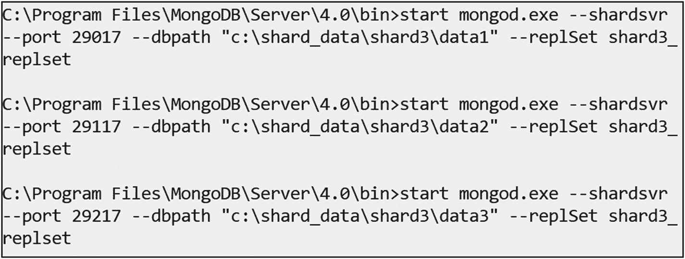

图 5-14

启动 `shard3` 服务器

现在，连接到其中一个分片服务器以启用副本集，如下所示及见图 5-15。

```
mongo.exe hostname:26017
C:\Program Files\MongoDB\Server\4.0\bin> mongo.exe localhost:26017
```

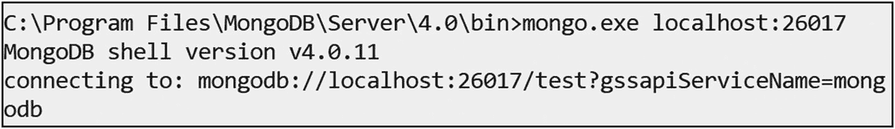

图 5-15

连接 `shard1` 服务器

接下来，在 `mongo` shell 中使用以下命令初始化副本集，如下所示。

```
MongoDB Enterprise > rs.initiate(
{
_id: "shard1_replset",
members: [
{ _id : 0, host:"hostname:26017" },
{ _id : 1, host:"hostname:26117" },
{ _id : 2, host:"hostname:26217" }]}
)
```

图 5-16 是供参考的快照。

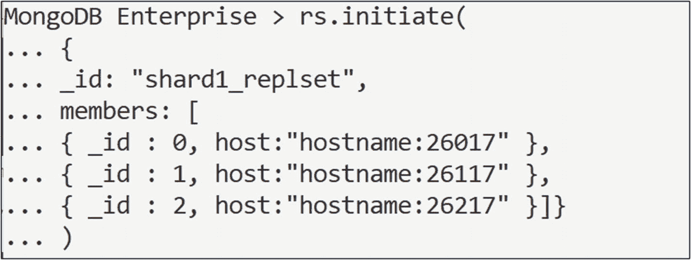

图 5-16

在 `shard1` 服务器上初始化副本集

现在连接到另一个分片并初始化副本集。

```
C:\Program Files\MongoDB\Server\4.0\bin> mongo.exe hostname:28017
MongoDB Enterprise >  rs.initiate(
{
_id: "shard2_replset",
members: [
{ _id : 0, host:"hostname:28017" },
{ _id : 1, host:"hostname:28117" },
{ _id : 2, host:"hostname:28217" }
]
}
)
```

现在连接到第三个分片并初始化副本集。

```
C:\Program Files\MongoDB\Server\4.0\bin> mongo.exe hostname:29017
MongoDB Enterprise >  rs.initiate(
{
_id: "shard3_replset",
members: [
{ _id : 0, host:"hostname:29017" },
{ _id : 1, host:"hostname:29117" },
{ _id : 2, host:"hostname:29217" }
]
}
)
```

现在，使用以下命令启动配置服务器。为配置服务器创建数据目录。

```
md c:\shard_data\config_server1\data1
md c:\shard_data\config_server1\data2
md c:\shard_data\config_server1\data3
```

以副本集方式启动配置服务器。

```
start mongod.exe --configsvr --port 47017 --dbpath "c:\shard_data\config_server1\data1" --replSet configserver1_replset
start mongod.exe --configsvr --port 47117 --dbpath "c:\shard_data\config_server1\data2" --replSet configserver1_replset
start mongod.exe --configsvr --port 47217 --dbpath "c:\shard_data\config_server1\data3" --replSet configserver1_replset
```

图 5-17 是一个供参考的启动配置服务器的快照。

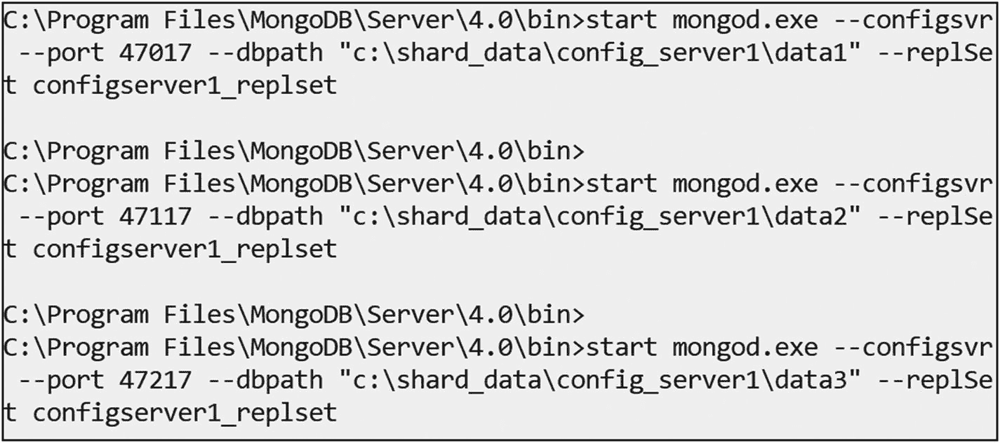

图 5-17

启动配置服务器

现在我们可以连接到配置服务器以启用副本集。

```
C:\Program Files\MongoDB\Server\4.0\bin> mongo.exe hostname:47017
```

然后初始化副本集。

```
MongoDB Enterprise >  rs.initiate(
{
_id: "configserver1_replset",
configsvr: true,
members: [
{ _id : 0, host : "hostname:47017" },
{ _id : 1, host : "hostname:47117" },
{ _id : 2, host : "hostname:47217" }
]
}
)
```

按如下所示启动 `mongos`。

```
start mongos.exe --configdb configserver1_replset/hostname:47017,hostname:47117,hostname:47217 --port 1000
```

现在是执行分片的时候了。这里，我们将使用一个查询路由器、一个配置服务器和三个分片。

按如下所示连接到查询路由器。

```
mongo.exe localhost:1000
```

输出如下：

```
2018-10-01T12:47:08.929+0530 I CONTROL  [main]
mongos>
```

接下来，将三个分片服务器添加到配置服务器，如下所示。

```
sh.addShard("shard1_replset/localhost:26017,localhost:26117,localhost:26217")
```

第一个分片的输出如下：

```
mongos> sh.addShard("shard1_replset/localhost:26017,localhost:26117,localhost:26217")
{
"shardAdded" : "shard1_replset",
"ok" : 1,
"operationTime" : Timestamp(1538378773, 7),
"$clusterTime" : {
"clusterTime" : Timestamp(1538378773, 7),
"signature" : {
"hash" : BinData(0,"AAAAAAAAAAAAAAAAAAAAAAAAAAA="),
"keyId" : NumberLong(0)
}
}
}
mongos>
sh.addShard("shard2_replset/localhost:28017,localhost:28117,localhost:28217")
```

第二个分片的输出如下。

```
mongos> sh.addShard("shard2_replset/localhost:28017,localhost:28117,localhost:28217")
{
"shardAdded" : "shard2_replset",
"ok" : 1,
"operationTime" : Timestamp(1538378886, 4),
"$clusterTime" : {
"clusterTime" : Timestamp(1538378886, 6),
"signature" : {
"hash" : BinData(0,"AAAAAAAAAAAAAAAAAAAAAAAAAAA="),
"keyId" : NumberLong(0)
}
}
}
mongos>
sh.addShard("shard3_replset/localhost:29017,localhost:29117,localhost:29217")
```

第三个分片的输出如下。

```
mongos> sh.addShard("shard3_replset/localhost:29017,localhost:29117,localhost:29217")
{
"shardAdded" : "shard3_replset",
"ok" : 1,
"operationTime" : Timestamp(1538378938, 4),
"$clusterTime" : {
"clusterTime" : Timestamp(1538378938, 4),
"signature" : {
"hash" : BinData(0,"AAAAAAAAAAAAAAAAAAAAAAAAAAA="),
"keyId" : NumberLong(0)
}
}
}
```

发出以下命令以检查分片的状态。

```
mongos> sh.status()
```

现在，要为数据库启用分片，请使用此命令。

```
mongos> sh.enableSharding("demos")
```

要为集合启用分片，请使用此代码。

```
mongos> sh.shardCollection("demos.users",{"id":1}
```

输出如下：

```
mongos> sh.shardCollection("demos.users",{"id":1})
{
"collectionsharded" : "demos.users",
"collectionUUID" : UUID("0122f602-212e-4c79-8be7-5c7a63676c8b"),
"ok" : 1,
"operationTime" : Timestamp(1538379345, 15),
"$clusterTime" : {
"clusterTime" : Timestamp(1538379345, 15),
"signature" : {
"hash" : BinData(0,"AAAAAAAAAAAAAAAAAAAAAAAAAAA="),
"keyId" : NumberLong(0)
}
}
}
```

接下来，我们可以使用以下命令创建一个大型集合。

```
mongos> use demos;
for(var i=0;i<10000;i++){db.users.insert({id: Math.random(), count:i, date: new Date()})}
```

发出下一个命令以统计用户数量。

```
mongos> db.users.count()
```

发出以下命令以查看 `user` 集合的分布情况。

```
mongos> sh.status()
--- 分片状态 ---
分片版本: {
"_id" : 1,
"minCompatibleVersion" : 5,
"currentVersion" : 6,
"clusterId" : ObjectId("5bb1c63e9bbb23ade7b2dd95")
}
分片:
{  "_id" : "shard1_replset",  "host" : "shard1_replset/localhost:26017,localhost:26117,localhost:26217",  "state" : 1 }
{  "_id" : "shard2_replset",  "host" : "shard2_replset/localhost:28017,localhost:28117,localhost:28217",  "state" : 1 }
{  "_id" : "shard3_replset",  "host" : "shard3_replset/localhost:29017,localhost:29117,localhost:29217",  "state" : 1 }
活动的 mongos 实例:
"4.0.2" : 1
自动分片:
当前启用: 是
均衡器:
当前启用:  是
当前运行:  否
过去 5 次均衡轮次失败次数:  0
过去 24 小时的迁移结果:
没有最近的迁移
数据库:
{  "_id" : "config",  "primary" : "config",  "partitioned" : true }
config.system.sessions
分片键: { "_id" : 1 }
唯一: false
均衡中: true
数据块:
shard1_replset  1
{ "_id" : { "$minKey" : 1 } } -->> { "_id" : { "$maxKey" : 1 } } 在 : shard1_replset Timestamp(1, 0)
{  "_id" : "demos",  "primary" : "shard2_replset",  "partitioned" : true,  "version" : {  "uuid" : UUID("52ced1e7-6afd-4554-a310-609d62c11450"),  "lastMod" : 1 } }
demos.users
分片键: { "id" : 1 }
唯一: false
均衡中: true
数据块:
shard2_replset  1
{ "id" : { "$minKey" : 1 } } -->> { "id" : { "$maxKey" : 1 } } 在 : shard2_replset Timestamp(1, 0)
```

这表明 `user` 数据已分布到 `shard1` 和 `shard2`。


##### 注意

所有演示均在 **Windows** 环境下执行。

接下来，要使用哈希分片对集合进行分片，按如下所示为数据库启用分片。

```
sh.enableSharding("sample")
```

输出如下：

```
mongos> sh.enableSharding("sample")
{
"ok" : 1,
"operationTime" : Timestamp(1554705786, 5),
"$clusterTime" : {
"clusterTime" : Timestamp(1554705786, 5),
"signature" : {
"hash" : BinData(0,"AAAAAAAAAAAAAAAAAAAAAAAAAAA="),
"keyId" : NumberLong(0)
}
}
}
```

最后，使用以下命令通过哈希分片对集合进行分片。

```
sh.shardCollection("sample.users",{"id":"hashed"})
```

输出如下：

```
mongos> sh.shardCollection("sample.users",{"id":"hashed"})
{
"collectionsharded" : "sample.users",
"collectionUUID" : UUID("4fb2750a-ec5d-4ae0-be8f-a8fbea8294ab"),
"ok" : 1,
"operationTime" : Timestamp(1554705891, 13),
"$clusterTime" : {
"clusterTime" : Timestamp(1554705891, 25),
"signature" : {
"hash" : BinData(0,"AAAAAAAAAAAAAAAAAAAAAAAAAAA="),
"keyId" : NumberLong(0)
}
}
}
```

