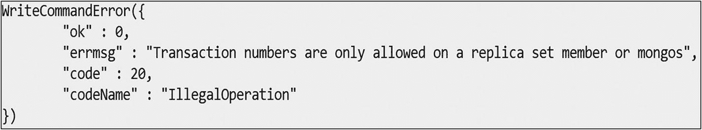

# 6. 多文档事务

在第 5 章中，我们讨论了 MongoDB 中的副本集和分片。在本章中，我们将讨论 MongoDB 中的多文档事务，这是 MongoDB 4.0 引入的新功能。

## MongoDB 中的多文档事务

在 MongoDB 中，对单个文档的写操作是原子的，即使该写操作修改了单个文档内的多个嵌入式文档。当单个写操作（例如 `db.collection.updateMany()`）修改多个文档时，每个文档的修改是原子的，但整个操作并非原子。

从 4.0 版本开始，MongoDB 为副本集提供了多文档事务。多文档事务帮助我们实现“全部或全部不执行”的执行，以维护数据完整性。

多文档事务是原子的。

*   当事务提交时，在事务中进行的所有数据更改都会被保存，并在事务外部可见。在事务提交之前，数据更改在事务外部不可见。
*   当事务中止时，在事务中进行的所有数据更改都会被丢弃，永远不会变得可见。

##### 注意

多文档事务仅适用于副本集。如果我们尝试在非副本集上使用多文档事务，将会得到错误“Transaction numbers are only allowed on a replica set member or mongos”，如图 6-1 所示。



图 6-1

在非副本集上使用多文档事务时的错误

#### 事务的限制

事务确实有一些限制，列举如下。

*   只能对现有集合指定 CRUD 操作。这些集合可以位于不同的数据库中。
*   不能在 `config`、`admin` 和 `local` 数据库上执行读/写操作。
*   不能写入 `system.*` 集合。
*   不能在事务内创建或删除索引。
*   不能在事务内执行非 CRUD 操作。
*   不能返回操作的查询计划（即 `explain`）。

#### 事务与会话

在 MongoDB 中，事务与会话相关联。MongoDB 的会话提供了一个框架，支持一致性以及可重试的写入。MongoDB 的会话仅适用于副本集和分片集群。需要会话来启动事务。不能在会话之外运行事务，并且一个会话一次只能运行一个事务。会话本质上是一个上下文。

有三个命令在处理事务时很重要。

*   `session.startTransaction()`：在当前会话中启动一个新事务。
*   `session.commitTransaction()`：保存事务中操作所做的更改。
*   `session.abortTransaction()`：中止事务而不保存。

### 配方 6-1. 使用多文档事务

在本配方中，我们将讨论如何使用多文档事务。

### 问题

您想要使用多文档事务。

### 解决方案

使用 `session.startTransaction()`、`session.commitTransaction()` 和 `session.abortTransaction()`。

### 工作原理

让我们按照本节的步骤使用多文档事务。

##### 步骤 1：多文档事务

要使用多文档事务，首先我们在 `employee` 数据库下创建一个 `employee` 集合，如下所示。

```
use employee
db.createCollection("employee")
```

输出如下：

```
myrs:PRIMARY> use employee
switched to db employee
myrs:PRIMARY> db.createCollection("employee")
{
"ok" : 1,
"operationTime" : Timestamp(1552385760, 1),
"$clusterTime" : {
"clusterTime" : Timestamp(1552385760, 1),
"signature" : {
"hash" : BinData(0,"AAAAAAAAAAAAAAAAAAAAAAAAAAA="),
"keyId" : NumberLong(0)
}
}
}
```

接下来，插入一些文档，如下所示。

```
db.employee.insert([{_id:1001, empName:"Subhashini"},{_id:1002, empName:"Shobana"}])
```

输出如下：

```
myrs:PRIMARY> db.employee.insert([{_id:1001, empName:"Subhashini"},{_id:1002, empName:"Shobana"}])
BulkWriteResult({
"writeErrors" : [ ],
"writeConcernErrors" : [ ],
"nInserted" : 2,
"nUpserted" : 0,
"nMatched" : 0,
"nModified" : 0,
"nRemoved" : 0,
"upserted" : [ ]
})
```

现在，创建一个会话，如下所示。

```
session = db.getMongo().startSession()
```

输出如下：

```
myrs:PRIMARY> session = db.getMongo().startSession()
session { "id" : UUID("55d56ef2-cab1-40c0-8d01-c2f75b5696b5") }
```

接下来，启动事务并插入一些文档，如下所示。

```
session.startTransaction()
session.getDatabase("employee").employee.insert([{_id:1003,empName:"Taanushree"},{_id:1004, empName:"Aruna M S"}])
```

输出如下：

```
myrs:PRIMARY> session.startTransaction()
myrs:PRIMARY> session.getDatabase("employee").employee.insert([{_id:1003,empName:"Taanushree"},{_id:1004, empName:"Aruna M S"}])
BulkWriteResult({
"writeErrors" : [ ],
"writeConcernErrors" : [ ],
"nInserted" : 2,
"nUpserted" : 0,
"nMatched" : 0,
"nModified" : 0,
"nRemoved" : 0,
"upserted" : [ ]
})
```

现在，我们尝试从事务内部和外部读取集合。首先，我们将从事务内部读取集合。

```
session.getDatabase("employee").employee.find()
```

输出如下：

```
myrs:PRIMARY> session.getDatabase("employee").employee.find()
{ "_id" : 1001, "empName" : "Subhashini" }
{ "_id" : 1002, "empName" : "Shobana" }
{ "_id" : 1003, "empName" : "Taanushree" }
{ "_id" : 1004, "empName" : "Aruna M S" }
```

我们可以从事务内部看到修改。

其次，我们将尝试从事务外部读取集合。

```
db.employee.find()
myrs:PRIMARY> db.employee.find()
{ "_id" : 1001, "empName" : "Subhashini" }
{ "_id" : 1002, "empName" : "Shobana" }
```

因为事务尚未提交，所以我们无法在事务外部看到修改。

发出以下命令来提交事务。

```
session.commitTransaction()
```

输出如下：

```
myrs:PRIMARY> session.commitTransaction()
```

现在，我们也可以在事务外部看到修改了。

```
myrs:PRIMARY> db.employee.find()
{ "_id" : 1001, "empName" : "Subhashini" }
{ "_id" : 1002, "empName" : "Shobana" }
{ "_id" : 1003, "empName" : "Taanushree" }
{ "_id" : 1004, "empName" : "Aruna M S" }
```


## 配方 6-2. 两个并发事务之间的隔离性测试

在本配方中，我们将讨论如何在两个并发事务之间执行隔离性测试。

### 问题

你想在两个并发事务之间执行隔离性测试。

### 解决方案

使用 `session.startTransaction()`、`session.commitTransaction()` 和 `session.abortTransaction()`。

### 工作原理

让我们按照本节的步骤在两个并发事务之间执行隔离性测试。

#### 步骤 1：两个并发事务之间的隔离性测试

创建第一个连接，如下所示。

```
var session1 = db.getMongo().startSession()
session1.startTransaction()
session1.getDatabase("employee").employee.update({_id:1003},{$set:{designation: "TL" }})
```

输出如下，

```
myrs:PRIMARY> var session1 = db.getMongo().startSession()
myrs:PRIMARY> session1.startTransaction()
myrs:PRIMARY> session1.getDatabase("employee").employee.update({_id:1003},{$set:{designation: "TL" }})
WriteResult({ "nMatched" : 1, "nUpserted" : 0, "nModified" : 1 })
```

接下来，读取集合，如下所示。

```
session1.getDatabase("employee").employee.find()
```

输出如下，

```
myrs:PRIMARY> session1.getDatabase("employee").employee.find()
{ "_id" : 1001, "empName" : "Subhashini" }
{ "_id" : 1002, "empName" : "Shobana" }
{ "_id" : 1003, "empName" : "Taanushree", "designation" : "TL" }
{ "_id" : 1004, "empName" : "Aruna M S" }
```

现在，创建第二个连接并更新文档，如下所示。

```
var session2 = db.getMongo().startSession()
session2.startTransaction()
session2.getDatabase("employee").employee.update({_id:{$in:[1001,1004]}},{$set:{designation:"SE"}},{multi:"true"})
```

输出如下，

```
myrs:PRIMARY> var session2 = db.getMongo().startSession()
myrs:PRIMARY> session2.startTransaction()
myrs:PRIMARY> session2.getDatabase("employee").employee.update({_id:{$in:[1001,1004]}},{$set:{designation:"SE"}},{multi:"true"})
WriteResult({ "nMatched" : 2, "nUpserted" : 0, "nModified" : 2 })
```

接下来，读取集合，如下所示。

```
session2.getDatabase("employee").employee.find()
```

输出如下，

```
myrs:PRIMARY> session2.getDatabase("employee").employee.find()
{ "_id" : 1001, "empName" : "Subhashini", "designation" : "SE" }
{ "_id" : 1002, "empName" : "Shobana" }
{ "_id" : 1003, "empName" : "Taanushree" }
{ "_id" : 1004, "empName" : "Aruna M S", "designation" : "SE" }
```

在这里，事务是相互隔离的，每个事务只显示它自身所做的修改。

## 配方 6-3. 发生写冲突的事务

在本配方中，我们将讨论与事务相关的写冲突。

### 问题

你想查看当两个事务尝试修改同一个文档时发生写冲突的错误消息。

### 解决方案

使用 `session.startTransaction()`、`session.commitTransaction()` 和 `session.abortTransaction()`。

### 工作原理

让我们按照本节的步骤来处理两个并发事务之间的写冲突。

#### 步骤 1：发生写冲突的事务

创建第一个连接，如下所示。

```
var session1 = db.getMongo().startSession()
session1.startTransaction()
session1.getDatabase("employee").employee.update({empName:"Subhashini"},{$set:{empName: "Subha" }})
```

输出如下，

```
myrs:PRIMARY> var session1 = db.getMongo().startSession()
myrs:PRIMARY> session1.startTransaction()
myrs:PRIMARY> session1.getDatabase("employee").employee.update({empName:"Subhashini"},{$set:{empName: "Subha" }})
WriteResult({ "nMatched" : 1, "nUpserted" : 0, "nModified" : 1 })
myrs:PRIMARY>
```

现在，创建第二个连接并尝试更新同一个文档，如下所示。

```
var session2 = db.getMongo().startSession()
session2.startTransaction()
session2.getDatabase("employee").employee.update({empName:"Subhashini"},{$set:{empName: "Subha" }})
```

输出如下，

```
myrs:PRIMARY> var session2 = db.getMongo().startSession()
myrs:PRIMARY> session2.startTransaction()
myrs:PRIMARY> session2.getDatabase("employee").employee.update({empName:"Subhashini"},{$set:{empName: "Subha" }})
WriteCommandError({
"errorLabels" : [
"TransientTransactionError"
],
"operationTime" : Timestamp(1552405529, 1),
"ok" : 0,
"errmsg" : "WriteConflict",
"code" : 112,
"codeName" : "WriteConflict",
"$clusterTime" : {
"clusterTime" : Timestamp(1552405529, 1),
"signature" : {
"hash" : BinData(0,"AAAAAAAAAAAAAAAAAAAAAAAAAAA="),
"keyId" : NumberLong(0)
}
}
})
```

在这里，即使事务尚未提交，MongoDB 也会立即检测到写冲突。

## 配方 6-4. 使用 `abortTransaction` 丢弃数据变更

在本配方中，我们将讨论如何使用 `abortTransaction` 丢弃数据变更。

### 问题

你想使用 `abortTransaction` 丢弃数据变更。

### 解决方案

使用 `session.startTransaction()`、`session.commitTransaction()` 和 `session.abortTransaction()`。

### 工作原理

让我们按照本节的步骤，使用 `abortTransaction` 方法丢弃数据变更。

#### 步骤 1：丢弃数据变更

在 `student` 数据库下创建一个 `student` 集合，如下所示。

```
use student;
db.createCollection("student")
```

输出如下，

```
myrs:PRIMARY> use student;
switched to db student
myrs:PRIMARY> db.createCollection("student")
{
"ok" : 1,
"operationTime" : Timestamp(1552406937, 1),
"$clusterTime" : {
"clusterTime" : Timestamp(1552406937, 1),
"signature" : {
"hash" : BinData(0,"AAAAAAAAAAAAAAAAAAAAAAAAAAA="),
"keyId" : NumberLong(0)
}
}
}
myrs:PRIMARY>
```

接下来，插入一些文档，如下所示。

```
db.student.insert({_id:1001,name:"subhashini"})
db.student.insert({_id:1002,name:"shobana"})
```

启动一个事务并插入一个文档。

```
var session1 = db.getMongo().startSession()
session1.startTransaction()
session1.getDatabase("student").student.insert({_id:1003,name:"Taanushree"})
```

输出如下，

```
myrs:PRIMARY> var session1 = db.getMongo().startSession()
myrs:PRIMARY> session1.startTransaction()
myrs:PRIMARY> session1.getDatabase("student").student.insert({_id:1003,name:"Taanushree"})
WriteResult({ "nInserted" : 1 })
myrs:PRIMARY>
```

现在，从集合和会话中查找文档。

```
db.student.find()
```

输出如下，

```
myrs:PRIMARY> db.student.find()
{ "_id" : 1001, "name" : "subhashini" }
{ "_id" : 1002, "name" : "shobana" }
myrs:PRIMARY>session1.getDatabase("student").student.find()
myrs:PRIMARY> session1.getDatabase("student").student.find()
{ "_id" : 1001, "name" : "subhashini" }
{ "_id" : 1002, "name" : "shobana" }
{ "_id" : 1003, "name" : "Taanushree" }
myrs:PRIMARY>
```

现在，你可以使用 `abortTransaction` 丢弃数据变更，如下所示。

```
session1.abortTransaction()
```

输出如下，

```
myrs:PRIMARY> session1.abortTransaction()
```

现在，你可以查询集合，如下所示。

```
db.student.find()
myrs:PRIMARY> db.student.find()
{ "_id" : 1001, "name" : "subhashini" }
{ "_id" : 1002, "name" : "shobana" }
```

在这里，数据变更被丢弃了。

##### 注意

多文档事务仅适用于使用 WiredTiger 存储引擎的部署。

