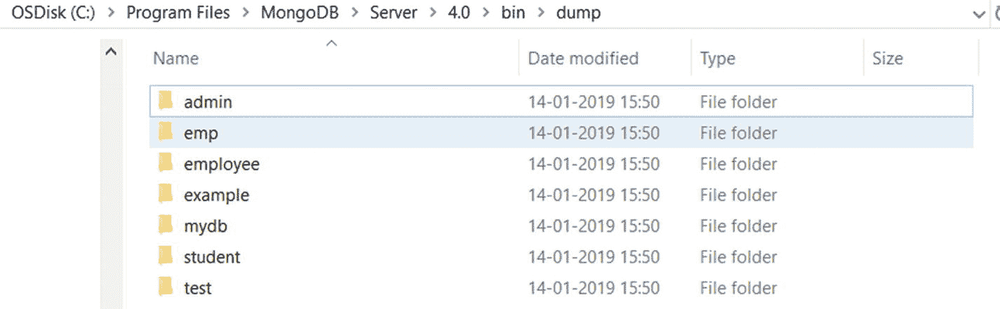
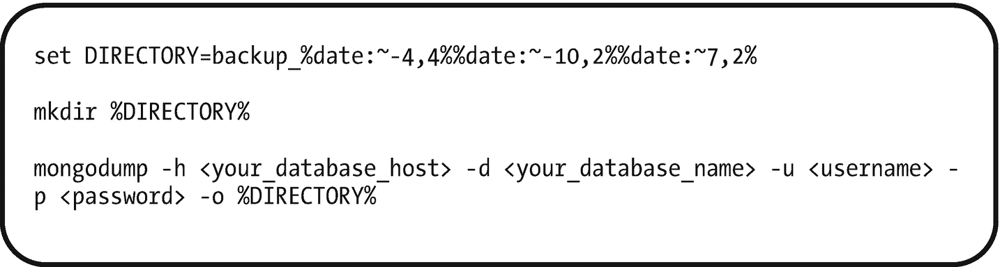
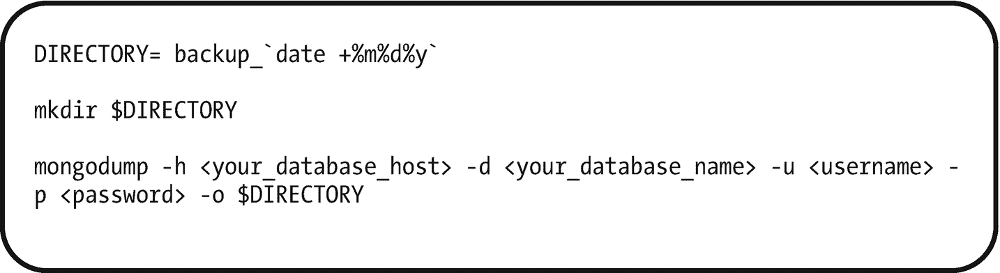

# 7. MongoDB 监控与备份

在第 6 章中，我们讨论了 MongoDB 中的事务。在本章中，我们将讨论以下主题：

*   MongoDB 监控工具。
*   MongoDB 的备份与恢复。

## MongoDB 监控

MongoDB 提供了各种工具来监控数据库。这些 MongoDB 监控工具帮助我们了解数据库在不同层面上正在发生什么。

### 日志文件

第一个基础工具是日志文件。

## 配方 7-1. 使用 MongoDB 日志文件

在本配方中，我们将讨论 MongoDB 日志文件。

### 问题

你想查看 MongoDB 日志文件并设置日志级别。


### 解决方案

MongoDB 日志文件位于以下安装路径中：

```
c:\Program Files\MongoDB\Server\4.0\log>
```

使用 `db.setLogLevel` 函数来设置日志级别。

### 工作原理

让我们遵循本节中的步骤，在 `mongo` shell 中查看日志文件。

#### 步骤 1：显示日志文件内容并设置日志级别

在 `mongo` shell 中输入以下命令。

```
show logs
```

输出如下：

```
> show logs
global
startupWarnings
```

输入下一条命令可以查看日志条目。

```
show log global
```

我们无法在控制台中过滤日志消息。

MongoDB 有多个日志级别，可以使用 `db.setLogLevel` 函数进行设置。

`db.setLogLevel` 的语法是

```
db.setLogLevel(, )
```

这里，`level` 表示日志详细程度级别，范围从 0 到 5。默认日志级别是 0，包含信息性消息。级别 1 到 5 会提高详细程度以包含调试消息。第二个参数 `component` 是可选的。它指的是您要为其设置详细程度级别的组件名称。组件名称对应于相应的 `systemLog.component.<name>.verbosity` 设置中的 `<name>`：

```
accessControl
command
control
ftdc
geo
index
network
query
replication
recovery
sharding
storage
storage.journal
transaction
write
```

要将 `query` 主题的日志级别设置为 2，请执行以下命令。

```
db.setLogLevel(2,"query")
```

输出如下：

```
> db.setLogLevel(2,"query")
{
"was" : {
"verbosity" : 0,
"accessControl" : {
"verbosity" : -1
},
"command" : {
"verbosity" : -1
},
"control" : {
"verbosity" : -1
},
"executor" : {
"verbosity" : -1
},
"geo" : {
"verbosity" : -1
},
"index" : {
"verbosity" : -1
},
"network" : {
"verbosity" : -1,
"asio" : {
"verbosity" : -1
},
"bridge" : {
"verbosity" : -1
}
},
"query" : {
"verbosity" : -1
},
"replication" : {
"verbosity" : -1,
"heartbeats" : {
"verbosity" : -1
},
"rollback" : {
"verbosity" : -1
}
},
"sharding" : {
"verbosity" : -1
},
"storage" : {
"verbosity" : -1,
"recovery" : {
"verbosity" : -1
},
"journal" : {
"verbosity" : -1
}
},
"write" : {
"verbosity" : -1
},
"ftdc" : {
"verbosity" : -1
},
"tracking" : {
"verbosity" : -1
},
"transaction" : {
"verbosity" : -1
}
},
"ok" : 1
}
```

MongoDB 回显了应用新设置之前的先前配置。在顶部，您可以看到默认级别，这表示任何未设置的组件将按此级别记录日志。这里，它将仅覆盖 `query` 组件。-1 的详细程度表示它从其父级继承默认级别。

要查看当前级别，请执行以下命令。

```
db. getLogComponents
```

输出如下：

```
> db.getLogComponents()
{
"verbosity" : 0,
"accessControl" : {
"verbosity" : -1
},
"command" : {
"verbosity" : -1
},
"control" : {
"verbosity" : -1
},
"executor" : {
"verbosity" : -1
},
"geo" : {
"verbosity" : -1
},
"index" : {
"verbosity" : -1
},
"network" : {
"verbosity" : -1,
"asio" : {
"verbosity" : -1
},
"bridge" : {
"verbosity" : -1
}
},
"query" : {
"verbosity" : 2
},
"replication" : {
"verbosity" : -1,
"heartbeats" : {
"verbosity" : -1
},
"rollback" : {
"verbosity" : -1
}
},
"sharding" : {
"verbosity" : -1
},
"storage" : {
"verbosity" : -1,
"recovery" : {
"verbosity" : -1
},
"journal" : {
"verbosity" : -1
}
},
"write" : {
"verbosity" : -1
},
"ftdc" : {
"verbosity" : -1
},
"tracking" : {
"verbosity" : -1
},
"transaction" : {
"verbosity" : -1
}
}
>
```

这里，`query` 级别被设置为 2。

现在，执行以下查询，我们将使用它来向日志文件添加一个条目：

```
> db.demos.find()
>
```

此查询不会返回任何结果，因为测试数据库中没有名为 `demos` 的集合。

现在，执行此命令以查看日志文件。

```
> show log global
```

以下是日志文件输出的最后几行：

```
2019-02-17T16:08:43.681+0530 D QUERY    [conn1] Collection test.demos does not exist. Using EOF plan: query: {} sort: {} projection: {}
2019-02-17T16:09:03.805+0530 D QUERY    [conn1] Collection test.demos does not exist. Using EOF plan: query: {} sort: {} projection: {}
2019-02-17T16:09:31.633+0530 D QUERY    [LogicalSessionCacheRefresh] Using idhack: { _id: { id: UUID("9d7def64-8b49-4c85-9392-01f7ab88e019"), uid: BinData(0, E3B0C44298FC1C149AFBF4C8996FB92427AE41E4649B934CA495991B7852B855) } }
```

您可以看到有关查询的一些额外信息。

现在将 `query` 日志级别设置为 `-1`：

```
> db.setLogLevel(-1,"query")
```

然后，执行以下查询，并观察日志文件中的详细信息，稍后将对此进行解释。

```
> db.demos.find({y:1})
```

现在使用以下命令检查日志文件。

```
> show log global
```

现在检查日志文件的末尾：我们无法看到此 `find` 查询的额外日志记录信息。

使用 `db.setLogLevel(0)` 关闭日志级别。

如果我们没有将选项指定为 `query` 或 `write` 或其他任何内容，它将应用于所有选项。

日志级别 5 非常详细；级别 1 到 3 是更有用的选项，除非您需要最高日志级别 5 提供的所有详细信息，否则推荐使用这些级别。

此外，设置适当的日志级别有助于我们通过识别日志文件中记录的查询计划以及通过检查执行查询所需的时间来识别慢操作，从而提高查询性能。

##### 注意

请参阅配方 7-10 以了解更多关于 MongoDB 查询计划的信息。

## MongoDB 性能

当我们使用 MongoDB 开发新应用程序时，分析数据库性能是强制性的。性能下降可能由于硬件可用性问题、打开的数据库连接数量以及数据库访问策略而发生。

性能问题表明数据库正在满负荷运行，并且由于连接数量的增加而导致异常的流量负载。

数据库分析器可以帮助我们理解导致性能下降的各种数据库操作。

### 数据库分析器

数据库分析器用于收集有关对正在运行的 `mongod` 实例执行的命令的信息。数据库分析器将所有收集到的数据写入 `admin` 数据库中的 `system.profile` 固定集合。

MongoDB 还有一个性能建议工具，可以自动监控慢查询并建议新的索引以提高查询性能。如果查询执行时间超过 100 毫秒，则认为该查询是慢查询。

##### 注意

性能建议工具在 MongoDB Atlas 集群中可用。MongoDB Atlas 是面向现代应用程序的全球云数据库服务。

分析器默认是关闭的。它可以基于每个数据库或每个实例，在表 7-1 中提到的任何一个分析级别上启用。

表 7-1

分析级别

| 级别 | 描述 |
| --- | --- |
| 0 | 分析器关闭，不收集任何数据。这是默认的分析器级别。 |
| 1 | 分析器收集操作时间超过 `slowms` 参数值的数据。 |
| 2 | 分析器收集所有操作的数据。 |


## 配方 7-2. 使用数据库分析器

在本配方中，我们将讨论如何启用数据库分析器以及如何设置分析级别。

### 问题

你想启用数据库分析并设置一个分析级别。

### 解决方案

在 `mongo` shell 中使用 `db.setProfilingLevel()` 辅助函数。

### 工作原理

让我们按照本节的步骤来启用数据库分析器。

#### 步骤 1：启用并配置数据库分析器

要启用数据库分析器以收集所有数据库信息，请使用以下命令。

```
db.setProfilingLevel(2)
```

输出如下，

```
> db.setProfilingLevel(2)
{ "was" : 0, "slowms" : 100, "sampleRate" : 1, "ok" : 1 }
```

`was` 是一个键值对，表示之前的分析级别。

你可以使用以下命令指定慢操作的阈值。

```
db.setProfilingLevel(1, { slowms: 30 })
```

输出如下，

```
> db.setProfilingLevel(1, { slowms: 30 })
{ "was" : 2, "slowms" : 100, "sampleRate" : 1, "ok" : 1 }
```

这里，慢操作阈值为 30 毫秒。

要对慢操作的随机样本进行分析，请使用以下命令。

```
db.setProfilingLevel(1, { sampleRate: 0.53 })
```

该代码将分析器设置为对所有慢操作的 53% 进行采样。

##### 注意

慢操作的默认阈值是 100 毫秒。

你可以通过执行以下命令来获取分析级别。

```
db.getProfilingStatus()
```

输出如下，

```
> db.getProfilingStatus()
{ "was" : 1, "slowms" : 30, "sampleRate" : 1 }
```

`was` 字段表示当前的分析级别。

要禁用数据库分析器，请使用此命令。

```
db.setProfilingLevel(0)
```

输出如下，

```
> db.setProfilingLevel(0)
{ "was" : 1, "slowms" : 30, "sampleRate" : 1, "ok" : 1 }
```

要为整个 `mongod` 实例启用分析，请在启动 `mongod` 实例时传递以下选项。

```
mongod --profile 1 --slowms 20 --slowOpSampleRate 0.5
```

此命令将分析级别设置为 1，慢操作阈值设置为 20 毫秒，并且只对 50% 的慢操作进行分析。

## 配方 7-3. 查看数据库分析器

在本配方中，我们将讨论如何查看数据库分析器信息。

### 问题

你想查看数据库分析器信息。

### 解决方案

在 `mongo` shell 中使用 `db.system.profile.find()`。

### 工作原理

让我们按照本节的步骤来查看数据库分析器信息。

#### 步骤 1：启用并配置数据库分析器

数据库分析器将信息记录在 `system.profile` 集合中。你需要查询 `system.profile` 集合来查看分析信息。

如这里所示，在 `example` 数据库中创建一个 `employee` 集合。

```
> use example;
switched to db example
> db.setProfilingLevel(2)
{ "was" : 0, "slowms" : 100, "sampleRate" : 1, "ok" : 1 }
> show collections
> db.employee.insert({_id:1001,name:"Subhashini"})
WriteResult({ "nInserted" : 1 })
> db.employee.insert({_id:1001,name:"Shobana"})
WriteResult({
"nInserted" : 0,
"writeError" : {
"code" : 11000,
"errmsg" : "E11000 duplicate key error collection: example.employee index: _id_ dup key: { : 1001.0 }"
}
})
> db.employee.find()
{ "_id" : 1001, "name" : "Subhashini" }
```

分析器将其详细信息存储在各自的键中，如下所示：

*   `op:` 组件类型（即查询或命令）。
*   `ts:` 时间戳。
*   `ns:` 执行查询的集合详细信息。

这些选项可用于过滤或排序，如下列查询所示。

要返回对 `employee` 集合执行的操作，请执行以下命令。

```
> db.system.profile.find( { ns : 'example.employee' } ).pretty()
```

输出如下，

```
{
"op" : "insert",
"ns" : "example.employee",
"command" : {
"insert" : "employee",
"ordered" : true,
"lsid" : {
"id" : UUID("93b33e8d-f561-46a1-8310-0f62d31442f1")
},
"$db" : "example"
},
"ninserted" : 1,
"keysInserted" : 1,
"numYield" : 0,
"locks" : {
"Global" : {
"acquireCount" : {
"r" : NumberLong(3),
"w" : NumberLong(3)
}
},
"Database" : {
"acquireCount" : {
"w" : NumberLong(2),
"W" : NumberLong(1)
}
},
"Collection" : {
"acquireCount" : {
"w" : NumberLong(2)
}
}
},
"responseLength" : 45,
"protocol" : "op_msg",
"millis" : 21,
"ts" : ISODate("2019-01-14T06:08:38.838Z"),
"client" : "127.0.0.1",
"appName" : "MongoDB Shell",
"allUsers" : [ ],
"user" : ""
}
{
"op" : "insert",
"ns" : "example.employee",
"command" : {
"insert" : "employee",
"ordered" : true,
"lsid" : {
"id" : UUID("93b33e8d-f561-46a1-8310-0f62d31442f1")
},
"$db" : "example"
},
"ninserted" : 0,
"keysInserted" : 0,
"numYield" : 0,
"locks" : {
"Global" : {
"acquireCount" : {
"r" : NumberLong(1),
"w" : NumberLong(1)
}
},
"Database" : {
"acquireCount" : {
"w" : NumberLong(1)
}
},
"Collection" : {
"acquireCount" : {
"w" : NumberLong(1)
}
}
},
"responseLength" : 194,
"protocol" : "op_msg",
"millis" : 2,
"ts" : ISODate("2019-01-14T06:08:50.297Z"),
"client" : "127.0.0.1",
"appName" : "MongoDB Shell",
"allUsers" : [ ],
"user" : ""
}
{
"op" : "query",
"ns" : "example.employee",
"command" : {
"find" : "employee",
"filter" : {
},
"lsid" : {
"id" : UUID("93b33e8d-f561-46a1-8310-0f62d31442f1")
},
"$db" : "example"
},
"keysExamined" : 0,
"docsExamined" : 1,
"cursorExhausted" : true,
"numYield" : 0,
"nreturned" : 1,
"locks" : {
"Global" : {
"acquireCount" : {
"r" : NumberLong(1)
}
},
"Database" : {
"acquireCount" : {
"r" : NumberLong(1)
}
},
"Collection" : {
"acquireCount" : {
"r" : NumberLong(1)
}
}
},
"responseLength" : 147,
"protocol" : "op_msg",
"millis" : 0,
"planSummary" : "COLLSCAN",
"execStats" : {
"stage" : "COLLSCAN",
"nReturned" : 1,
"executionTimeMillisEstimate" : 0,
"works" : 3,
"advanced" : 1,
"needTime" : 1,
"needYield" : 0,
"saveState" : 0,
"restoreState" : 0,
"isEOF" : 1,
"invalidates" : 0,
"direction" : "forward",
"docsExamined" : 1
},
"ts" : ISODate("2019-01-14T06:22:07.873Z"),
"client" : "127.0.0.1",
"appName" : "MongoDB Shell",
"allUsers" : [ ],
"user" : ""
}
>
```

要返回最近的 5 条日志条目，请执行以下命令。

```
> db.system.profile.find().limit(5).sort( { ts : -1 } ).pretty()
```

##### 注意

`ts` 指定时间戳，值 `-1` 指定按降序排序。我们可以指定 `1` 为升序，`-1` 为降序。

要返回慢于 5 毫秒的操作，请使用此语法。

```
> db.system.profile.find( { millis : { $gt : 5 } } ).pretty()
```

## `mongostat`

`mongostat` 是一个监控实用程序，如果你正在处理单个 `mongod` 实例，它会提供有关该 `mongod` 实例的信息。如果你正在处理一个分片集群，它会显示有关 `mongos` 实例的信息。


### 配方 7-4. 使用 `mongostat`

在本配方中，我们将讨论如何使用 `mongostat` 来监控 MongoDB 服务器。

### 问题

你希望查看 MongoDB 服务器的详细信息。

### 解决方案

使用 `mongostat` 工具，该工具在安装目录中可用。通常安装目录是 `C:\Program Files\MongoDB\Server\4.0\bin`，或者是你在安装过程中指定的自定义路径。

避免每次都导航到该目录去使用 `mongostat` 工具，请将该目录路径添加到你的 `PATH` 环境变量中。

### 工作原理

让我们按照本节步骤，使用 `mongostat` 查看服务器信息。

##### 步骤 1： `mongostat` 命令

通过指定 MongoDB 服务器的主机名和端口来执行 `mongostat` 命令。

输出如下：

```
c:\Program Files\MongoDB\Server\4.0\bin>mongostat --host localhost:27017
insert query update delete getmore command dirty used flushes vsize   res qrw arw net_in net_out conn                time
*0    *0     *0     *0       0   146|0  0.0% 0.0%       0 4.97G 28.0M 0|0 1|0  11.6k   4.49m    2 Feb 17 16:59:19.131
*0    *0     *0     *0       0     2|0  0.0% 0.0%       0 4.97G 28.0M 0|0 1|0   163b   63.6k    2 Feb 17 16:59:20.095
*0    *0     *0     *0       0     2|0  0.0% 0.0%       0 4.97G 28.0M 0|0 1|0   158b   61.7k    2 Feb 17 16:59:21.090
*0    *0     *0     *0       0     1|0  0.0% 0.0%       0 4.97G 28.0M 0|0 1|0   157b   61.3k    2 Feb 17 16:59:22.090
*0    *0     *0     *0       0     1|0  0.0% 0.0%       0 4.97G 28.0M 0|0 1|0   157b   61.2k    2 Feb 17 16:59:23.093
*0    *0     *0     *0       0     2|0  0.0% 0.0%       0 4.97G 28.0M 0|0 1|0   158b   61.4k    2 Feb 17 16:59:24.092
*0    *0     *0     *0       0     2|0  0.0% 0.0%       0 4.97G 28.0M 0|0 1|0   159b   62.1k    2 Feb 17 16:59:25.080
*0    *0     *0     *0       0     1|0  0.0% 0.0%       0 4.97G 28.0M 0|0 1|0   157b   61.2k    2 Feb 17 16:59:26.082
*0    *0     *0     *0       0     1|0  0.0% 0.0%       0 4.97G 28.0M 0|0 1|0   157b   61.0k    2 Feb 17 16:59:27.088
*0    *0     *0     *0       0     2|0  0.0% 0.0%       0 4.97G 28.0M 0|0 1|0   158b   61.6k    2 Feb 17 16:59:28.083
```

##### 注意

`27017` 是默认端口。如果我们想连接到 `localhost` 和默认端口 `27017` 并获取统计数据，可以简单地使用 `mongostat` 而无需任何选项。要连接到不同的或远程实例，则需要如示例所示指定 `-host` 选项。

你可以看到输出中有多个列。

*   `insert`/`query`/`update`/`delete`：这些列显示每秒的插入、查询、更新和删除操作次数。
*   `getmore`：此列显示每秒执行 `getmore` 操作的次数。
*   `command`：此列显示每秒在服务器上执行的命令数量。
*   `flushes`：此列显示每秒数据被刷新到磁盘的次数。
*   `mapped`：此列显示 `mongo` 进程针对数据库使用的内存量。它与数据库的大小相同。
*   `vsize`（虚拟大小）：此列表示分配给整个 `mongod` 进程的虚拟内存。
*   `res`（常驻内存）：此列表示 MongoDB 使用的物理内存。
*   `faults`：此列显示每秒的 Linux 页面错误数。
*   `qr|qw`：此列显示排队等待执行机会的读操作和写操作数量。
*   `ar|aw`：此列显示活动客户端数量。
*   `netIn` 和 `netOut`：这些列显示在给定时间范围内进出 MongoDB 服务器的网络流量。
*   `conn`：此列显示打开的连接数。
*   `time`：此列显示执行操作的时间范围。

## `mongotop`

`mongotop` 提供了一种跟踪 `mongod` 进程在读写操作上所花费时间的方法。`mongotop` 提供了每个集合级别的统计数据。

### 配方 7-5. 使用 `mongotop`

在本配方中，我们将讨论如何使用 `mongotop` 来跟踪 `mongod` 进程在读写操作上所花费的时间。

### 问题

你希望查看 `mongod` 进程在读写操作上所花费的时间。

### 解决方案

在 MongoDB 的安装路径下执行 `mongotop` 命令。

### 工作原理

让我们按照本节步骤来查看在读写操作上花费的时间。

##### 步骤 1： `mongotop` 命令

执行以下命令。

```
c:\Program Files\MongoDB\Server\4.0\bin>mongotop
2019-02-17T21:51:25.975+0530    connected to: 127.0.0.1
ns    total    read    write    2019-02-17T21:51:26+05:30
admin.system.roles      0ms     0ms      0ms
admin.system.version      0ms     0ms      0ms
config.system.sessions      0ms     0ms      0ms
emp.employee      0ms     0ms      0ms
employee.author      0ms     0ms      0ms
employee.authors      0ms     0ms      0ms
employee.categories      0ms     0ms      0ms
employee.employee      0ms     0ms      0ms
employee.employeedetails      0ms     0ms      0ms
employee.names      0ms     0ms      0ms
```

## `db.stats()`

`db.stats()` 提供单个数据库的统计数据。

### 配方 7-6. 使用 `db.stats()`

在本配方中，我们将讨论如何获取单个数据库的统计数据。

### 问题

你希望查看数据库的磁盘和内存使用情况估算。

### 解决方案

使用 `db.stats` 命令来显示数据库的统计数据。

### 工作原理

让我们按照本节步骤来查看数据库的统计数据。

##### 步骤 1： `db.stats()` 命令

执行以下命令来显示名为 `employee` 的数据库的统计数据。

```
> use employee
switched to db employee
> db.stats()
{
"db" : "employee",
"collections" : 12,
"views" : 0,
"objects" : 40,
"avgObjSize" : 90.875,
"dataSize" : 3635,
"storageSize" : 401408,
"numExtents" : 0,
"indexes" : 12,
"indexSize" : 212992,
"fsUsedSize" : 208018800640,
"fsTotalSize" : 509929914368,
"ok" : 1
}
>
```

数据大小和存储大小等详细信息以字节为单位给出。要以兆字节为单位查看信息，请执行以下命令。

```
> db.stats(1000000)
{
"db" : "employee",
"collections" : 12,
"views" : 0,
"objects" : 40,
"avgObjSize" : 90.875,
"dataSize" : 0.003635,
"storageSize" : 0.401408,
"numExtents" : 0,
"indexes" : 12,
"indexSize" : 0.212992,
"fsUsedSize" : 208020.402176,
"fsTotalSize" : 509929.914368,
"ok" : 1
}
>
```

## `db.serverStatus()`

`db.serverStatus()` 返回一个文档，提供数据库进程状态的统计数据。

### 配方 7-7. 使用 `db.serverStatus()`

在本配方中，我们将讨论 `db.serverStatus()` 命令。

### 问题

你希望查看数据库的内存状态。

### 解决方案

使用 `db.serverStatus()` 命令。

### 工作原理

让我们按照本节步骤来查看数据库内存状态的统计数据。

##### 步骤 1： `db.serverStatus()` 命令

执行以下命令来查看数据库的内存统计数据。

```
> db.serverStatus().mem
{
"bits" : 64,
"resident" : 85,
"virtual" : 5089,
"supported" : true,
"mapped" : 0,
"mappedWithJournal" : 0
}
```


## 使用 MongoDB 工具进行备份与还原

MongoDB 提供了 `mongodump` 和 `mongorestore` 实用程序来处理 BSON 数据转储。这些工具对于为小型部署创建备份非常有用。要为大型部署创建弹性且不间断的备份，我们可以使用文件系统或块级别磁盘快照方法。

我们应该使用系统级工具来创建存放 MongoDB 文件的设备文件系统的副本。文件系统快照或磁级别快照备份方法需要在 MongoDB 之外进行额外的系统配置，因此本书不深入探讨这部分内容。

在生产环境中部署 MongoDB 时，我们应制定备份和故障转移策略，以便在发生数据丢失事件时捕获和还原备份。

### 配方 7-8. 使用 `mongodump`

在本配方中，我们将讨论如何使用 `mongodump` 备份数据。

### 问题

你需要使用 `mongodump` 备份数据。

### 解决方案

使用 `mongodump` 命令。

### 工作原理

让我们按照本节的步骤来备份数据。

`mongodump` 实用程序通过连接到正在运行的 `mongod` 或 `mongos` 实例来创建备份。

当你在不指定任何参数的情况下运行 `mongodump` 命令时，它会连接到在本地主机端口 27017 上运行的 `mongodb`，并在当前目录创建一个名为 `dump` 的数据库备份。

让我们讨论如何发出 `mongodump` 命令来创建备份。



图 7-1

MongoDB 安装文件夹

1.  确保 `mongod` 正在运行。
2.  打开具有管理员权限的命令提示符，导航到 `mongodb` 安装文件夹，然后键入 `mongodump`，如下所示。

    ```
    c:\Program Files\MongoDB\Server\4.0\bin>mongodump
    ```
3.  你可以在当前目录中看到 `dump` 文件夹，如图 7-1 所示。

你可以通过发出以下命令指定输出目录。

```
mkdir "c:\Program Files\MongoDB\Server\4.0\dump"
mongodump --out "c:\Program Files\MongoDB\Server"\4.0\dump
```

要创建集合的备份，请发出以下命令。

```
mongodump --collection employee --db example --out "c:\Program Files\MongoDB\Server"\4.0\backup
```

输出如下，

```
c:\Program Files\MongoDB\Server\4.0\bin>mongodump --collection employee --db example --out "c:\Program Files\MongoDB\Server"\4.0\backup
2019-01-14T18:36:28.460+0530    writing example.employee to
2019-01-14T18:36:28.465+0530    done dumping example.employee (1 document)
```

你可以通过指定 `host` 和 `port` 参数从远程主机进行备份，如下所示。

```
mongodump --host sample.net --port 5017 --username user --password "pass"
```

#### 使用 `mongodump` 进行自动和定期备份调度

为所有数据库执行定期备份是良好实践，以防发生任何硬件故障转移。请按照以下步骤以特定间隔执行定期备份。



图 7-2

在 Windows 中创建批处理脚本文件

1.  我们可以创建脚本，为当前日期和时间创建备份目录，并将数据库导出到同一目录。
    对于 Windows，创建一个包含图 7-2 所示命令的 `bat`（批处理脚本）文件。
    对于 Unix/Linux 机器，创建一个包含图 7-3 所示命令的 shell 脚本文件。



图 7-3

在 Unix/Linux 中创建 shell 脚本文件

2.  调度脚本文件以特定间隔执行。对于 Windows 使用任务计划程序或其他调度器，对于 Unix/Linux 使用 CRON 调度。

### 配方 7-9. 使用 `mongorestore`

在本配方中，我们将讨论如何使用 `mongorestore` 还原数据。

### 问题

你需要使用 `mongorestore` 还原数据。

### 解决方案

使用 `mongorestore` 命令。

### 工作原理

让我们按照本节的步骤来还原数据。

##### 步骤 1：使用 `mongorestore` 还原数据

要还原数据，请打开命令提示符并导航到 `mongodb` 安装文件夹，然后发出以下命令。

```
c:\Program Files\MongoDB\Server\4.0\bin>mongorestore dump/
```

这里，`mongorestore` 将 `dump` 目录中存在的数据导入到正在运行的 `mongod` 实例。默认情况下，`mongorestore` 会在 `dump/` 目录中查找数据库备份。我们可以使用此命令连接到活动 `mongod` 实例的不同端口以及不同的备份路径。

```
mongorestore --port
```

##### 步骤 2：使用 `mongorestore` 还原到远程实例

默认情况下，`mongorestore` 连接到本地主机和默认端口号 27017 上的正在运行的实例。要还原到不同的主机和端口，我们可以使用 `--host` 和 `--port` 选项指定，如下所示。

```
mongorestore --host --port --username myuser --password 'mypass' /backup/mongodumpfile
```

仅当远程 `mongod` 实例需要身份验证时，才使用选项 `--user` 和 `--password` 指定 `username` 和 `password`。

### 配方 7-10. 使用 `mongodb` 查询计划

在本配方中，我们将讨论查询计划，以通过查询规划器和查询优化器理解 MongoDB 查询执行细节。

### 问题

你需要理解查询执行计划。

### 解决方案

使用 `cursor.explain()` 命令。

### 工作原理

让我们按照本节的步骤来理解查询计划。


##### 步骤 1：使用 `explain()` 理解查询计划

要在 MongoDB 命令执行期间查看查询计划，请使用 `cursor.explain()`。这里假设 `authors` 数据库中存在 `employee` 集合，其数据如下所示。

```
MongoDB Enterprise > use authors
switched to db authors
MongoDB Enterprise > db.employee.find()
{ "_id" : ObjectId("5d50ed688dcf280c50fde439"), "empId" : 1, "empName" : "John", "state" : "KA", "country" : "India" }
{ "_id" : ObjectId("5d50ed688dcf280c50fde43a"), "empId" : 2, "empName" : "Smith", "state" : "CA", "country" : "US" }
{ "_id" : ObjectId("5d50ed688dcf280c50fde43b"), "empId" : 3, "empName" : "James", "state" : "FL", "country" : "US" }
{ "_id" : ObjectId("5d50ed688dcf280c50fde43c"), "empId" : 4, "empName" : "Josh", "state" : "TN", "country" : "India" }
{ "_id" : ObjectId("5d50ed688dcf280c50fde43d"), "empId" : 5, "empName" : "Joshi", "state" : "HYD", "country" : "India" }
```

要在执行命令 `db.employee.find()` 时获取查询计划，请按如下所示使用 `.explain()`。

```
MongoDB Enterprise > db.employee.find().explain()
```

输出如下：

```
MongoDB Enterprise > db.employee.find().explain()
{
"queryPlanner" : {
"plannerVersion" : 1,
"namespace" : "authors.employee",
"indexFilterSet" : false,
"parsedQuery" : {
},
"winningPlan" : {
"stage" : "COLLSCAN",
"direction" : "forward"
},
"rejectedPlans" : [ ]
},
"serverInfo" : {
"host" : "DESKTOP-MEISTBV",
"port" : 27017,
"version" : "4.0.11",
"gitVersion" : "417d1a712e9f040d54beca8e4943edce218e9a8c"
},
"ok" : 1
}
```

观察此输出，可以看到查询规划器中没有 `parsedQuery`，且获胜计划显示它涉及完整的集合扫描。

现在，让我们尝试为同一查询添加一个过滤条件，并观察查询计划。

```
MongoDB Enterprise > db.employee.find({country:"India"})
{ "_id" : ObjectId("5d50ed688dcf280c50fde439"), "empId" : 1, "empName" : "John", "state" : "KA", "country" : "India" }
{ "_id" : ObjectId("5d50ed688dcf280c50fde43c"), "empId" : 4, "empName" : "Josh", "state" : "TN", "country" : "India" }
{ "_id" : ObjectId("5d50ed688dcf280c50fde43d"), "empId" : 5, "empName" : "Joshi", "state" : "HYD", "country" : "India" }
```

我们添加了过滤条件 `country:India` 来仅检索印度员工的数据。现在检查带有过滤条件的同一查询的查询计划。

```
MongoDB Enterprise> db.employee.find({country:"India"}).explain()
```

输出如下：

```
MongoDB Enterprise > db.employee.find({country:"India"}).explain()
{
"queryPlanner" : {
"plannerVersion" : 1,
"namespace" : "authors.employee",
"indexFilterSet" : false,
"parsedQuery" : {
"country" : {
"$eq" : "India"
}
},
"winningPlan" : {
"stage" : "COLLSCAN",
"filter" : {
"country" : {
"$eq" : "India"
}
},
"direction" : "forward"
},
"rejectedPlans" : [ ]
},
"serverInfo" : {
"host" : "DESKTOP-MEISTBV",
"port" : 27017,
"version" : "4.0.11",
"gitVersion" : "417d1a712e9f040d54beca8e4943edce218e9a8c"
},
"ok" : 1
}
```

观察前面的输出，可以看到查询规划器添加了一个解析后的查询：

```
"parsedQuery" : { "country" : {"$eq" : "India" } }
```

##### 步骤 2：理解 `explain()` 中的不同模式

`explain()` 方法接受 `queryPlanner`、`executionStats` 或 `allPlansExecution` 作为操作模式。如果我们未另行指定，默认模式是 `queryPlanner`。

使用以下命令，可以将这些参数之一作为模式传递给 `explain()`。

```
db.employee.find().explain("queryPlanner")
```

输出如下：

```
MongoDB Enterprise > db.employee.find().explain("queryPlanner")
{
"queryPlanner" : {
"plannerVersion" : 1,
"namespace" : "authors.employee",
"indexFilterSet" : false,
"parsedQuery" : {
},
"winningPlan" : {
"stage" : "COLLSCAN",
"direction" : "forward"
},
"rejectedPlans" : [ ]
},
"serverInfo" : {
"host" : "DESKTOP-MEISTBV",
"port" : 27017,
"version" : "4.0.11",
"gitVersion" : "417d1a712e9f040d54beca8e4943edce218e9a8c"
},
"ok" : 1
}
```

现在，如下所示，使用 `executionStats` 作为 `explain()` 方法的操作模式。

```
db.employee.find().explain("executionStats")
```

输出如下：

```
MongoDB Enterprise > db.employee.find().explain("executionStats")
{
"queryPlanner" : {
"plannerVersion" : 1,
"namespace" : "authors.employee",
"indexFilterSet" : false,
"parsedQuery" : {
},
"winningPlan" : {
"stage" : "COLLSCAN",
"direction" : "forward"
},
"rejectedPlans" : [ ]
},
"executionStats" : {
"executionSuccess" : true,
"nReturned" : 5,
"executionTimeMillis" : 0,
"totalKeysExamined" : 0,
"totalDocsExamined" : 5,
"executionStages" : {
"stage" : "COLLSCAN",
"nReturned" : 5,
"executionTimeMillisEstimate" : 0,
"works" : 7,
"advanced" : 5,
"needTime" : 1,
"needYield" : 0,
"saveState" : 0,
"restoreState" : 0,
"isEOF" : 1,
"invalidates" : 0,
"direction" : "forward",
"docsExamined" : 5
}
},
"serverInfo" : {
"host" : "DESKTOP-MEISTBV",
"port" : 27017,
"version" : "4.0.11",
"gitVersion" : "417d1a712e9f040d54beca8e4943edce218e9a8c"
},
"ok" : 1
}
MongoDB Enterprise >
```

在此输出中，观察以下内容：

*   `"executionSuccess" : true`：这显示查询是否已成功执行。
*   `"nReturned" : 5`：这是返回的行数。
*   `"executionTimeMillis" : 0`：这是以毫秒为单位的执行时间。

如果 `executionTimeMillis` 的值较高，则可将其视为慢查询，我们必须重写查询，通过添加必要的过滤器仅检索所需数据来优化执行时间。我们也可以考虑在键上使用索引以获得更好的性能。

