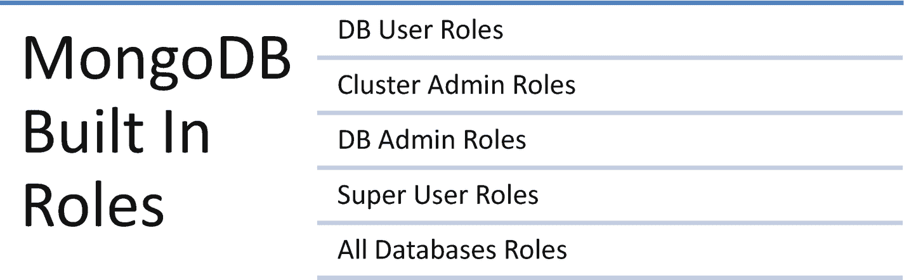
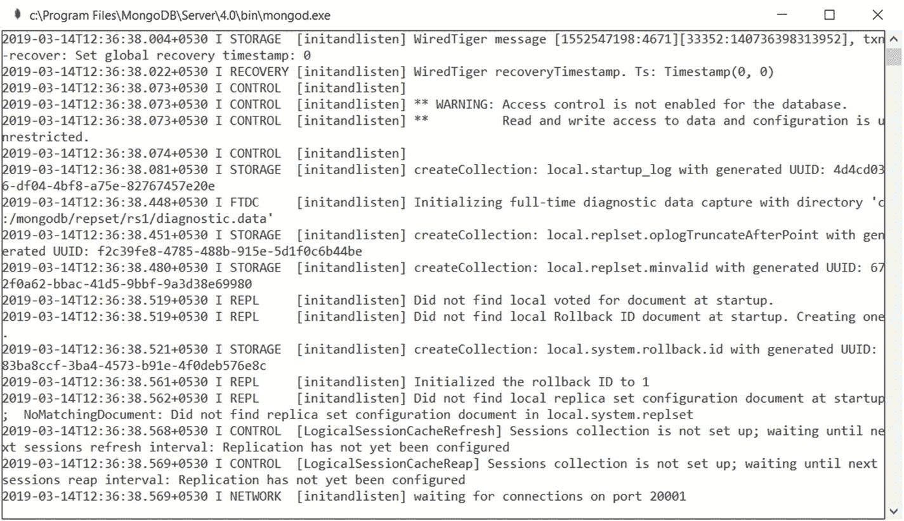
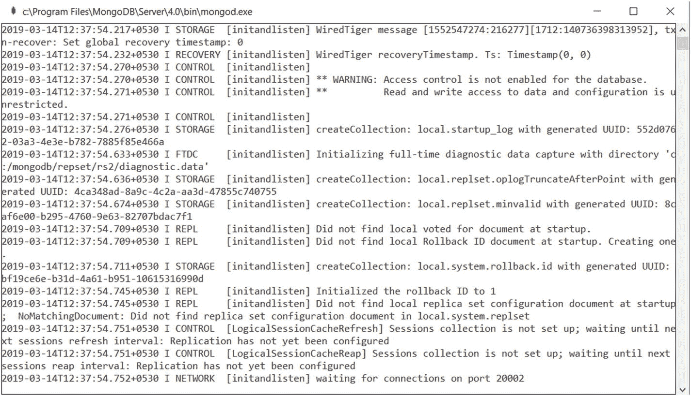
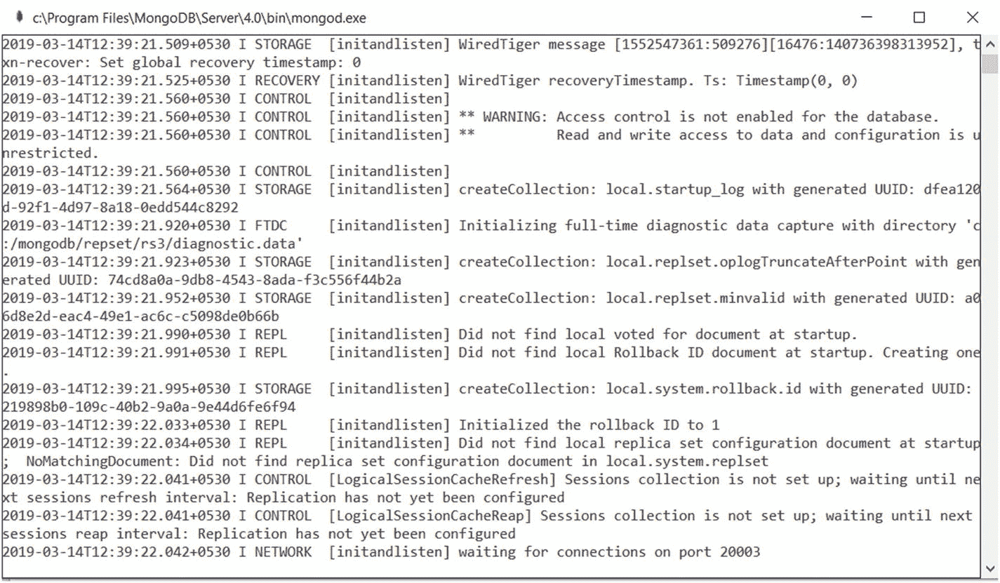
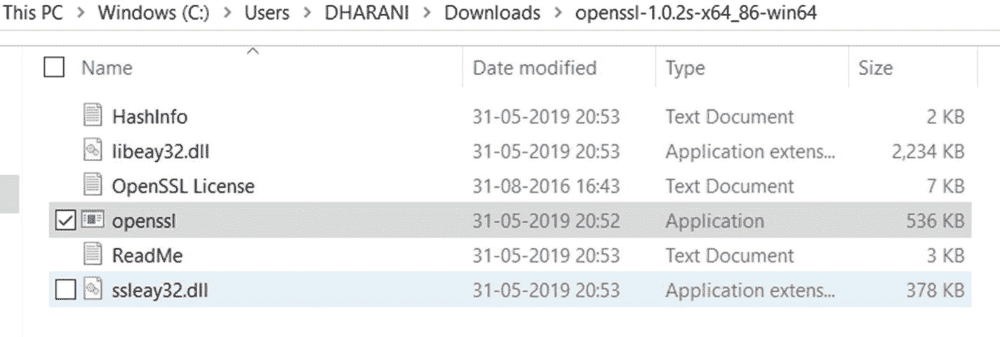
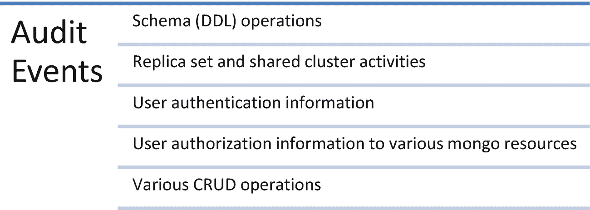
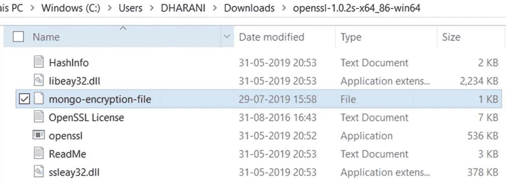
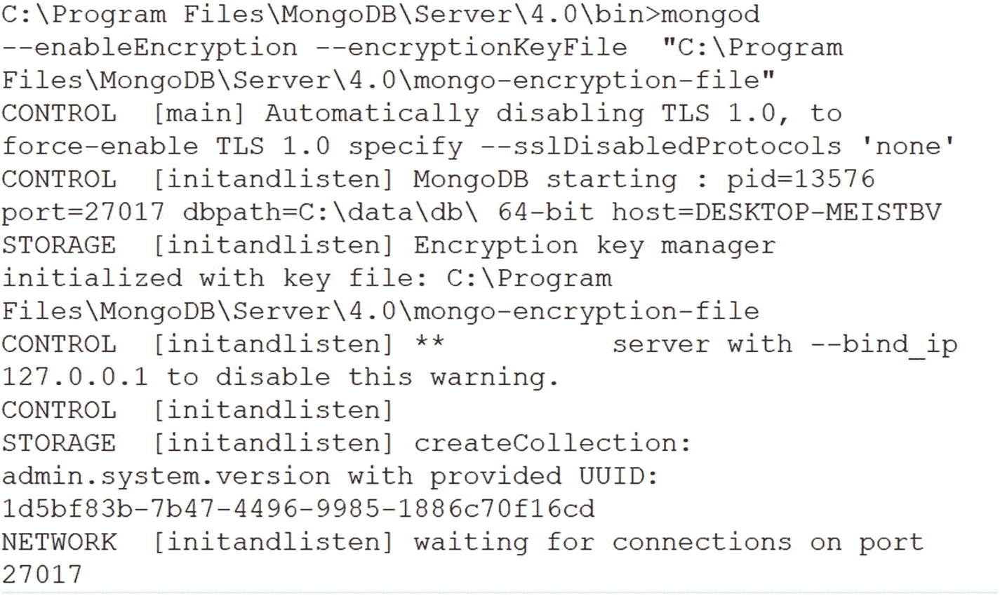

# 8. MongoDB 安全

在第 7 章中，我们讨论了 MongoDB 中的监控和备份方法。在本章中，我们将讨论 MongoDB 的安全特性。


## 身份验证与授权

身份验证是验证用户身份的过程，而授权或访问控制则决定了已验证用户对资源和操作的访问权限。

MongoDB 支持以下多种身份验证机制来验证用户的身份。

*   `SCRAM`：这是 MongoDB 的默认身份验证机制。它根据用户名、密码和认证数据库来验证用户。
*   `x.509 证书`：此机制使用 `x.509` 证书进行身份验证。MongoDB 支持多种客户端可用于验证其身份的机制。这些机制允许 MongoDB 集成到现有的身份验证系统中。

此外，MongoDB 企业版还支持轻量目录访问协议（`LDAP`）代理身份验证和 Kerberos 身份验证。

##### 注意

当启用访问控制时，副本集和分片集群需要成员之间进行内部身份验证。请参阅配方 8-2 以了解副本集的身份验证过程。

### 访问控制

MongoDB 仅在启用访问控制时，才会强制执行身份验证以识别用户及其访问资源的权限。接下来的配方将解释创建各种角色以及启用访问控制的机制。

*安装 MongoDB 时，它没有任何用户。因此，我们首先需要创建管理员用户，该用户可用于创建其他用户。*

### 角色

在 MongoDB 中，角色授予用户访问 MongoDB 资源的权限。MongoDB 有一些内置角色，如图 8-1 所列，可以分配给任何用户以访问资源。我们也可以创建用户自定义的角色。



图 8-1

MongoDB 内置角色

首先，让我们看看常用的内置角色。

#### MongoDB 用户角色

##### `read`

`read` 角色授予持有者读取所有用户创建集合的权限。

##### `readwrite`

`readwrite` 角色授予读取所有用户创建集合的权限，以及修改非系统（即用户创建的）集合的能力。

#### MongoDB 管理员角色

##### `dbAdmin`

`dbAdmin` 角色可以帮助我们执行管理任务，例如与模式相关的任务、索引和收集统计信息。我们不能使用此角色为用户和其他角色的管理授予权限。

##### `dbOwner`

我们可以使用 `dbOwner` 角色在数据库上执行任何管理任务。此角色还包含其他角色权限，如 `readWrite`、`dbAdmin` 和 `userAdmin` 角色。

##### `userAdmin`

我们可以在当前活动数据库上创建和修改角色及用户。

#### 集群管理员角色

##### `clusterAdmin`

`clusterAdmin` 角色提供集群管理访问权限。此角色还包含其他角色权限，例如 `clusterManager`、`clusterMonitor` 和 `hostManager` 角色。

##### `clusterManager`

此角色帮助我们管理和监视 `mongodb` 集群上的用户操作。

## 配方 8-1. 创建超级用户并对用户进行身份验证

在本配方中，我们将讨论如何创建超级用户并对用户进行身份验证。

### 问题

您想创建一个超级用户并对用户进行身份验证。

### 解决方案

以下是命令：

```
db.createUser()
mongo --username username --password password --authenticationDatabase databasename
db.auth()
```

### 工作原理

让我们按照本节中的步骤创建一个超级用户。

#### 步骤 1：创建超级用户

连接到 `mongod` 实例并键入以下命令。

```
> use admin
> db.createUser({user:"superUserAdmin",pwd:"1234",roles:[{role:    "userAdminAnyDatabase",db:"admin"}]})
```

输出如下，

```
> use admin
switched to db admin
> db.createUser({user:"superUserAdmin",pwd:"1234",roles:[{role: "userAdminAnyDatabase",db:"admin"}]})
Successfully added user: {
	"user" : "superUserAdmin",
	"roles" : [
		{
			"role" : "userAdminAnyDatabase",
			"db" : "admin"
		}
	]
}
>
```

要使用 `mongo` shell 进行身份验证，请执行以下任一操作。

*   在连接到 `mongod` 或 `mongos` 实例时，使用 MongoDB 命令行身份验证选项（即 `--username`、`--password` 和 `–authenticationDatabase`）。
*   连接到 `mongod` 或 `mongos` 实例，然后针对认证数据库运行 `db.auth` 方法。

#### 步骤 2：对用户进行身份验证

在连接到 `mongo` shell 时，在终端（命令提示符）中键入以下命令。

```
> mongo --username superUserAdmin --password 1234 --authenticationDatabase admin
```

您将连接到 mongoshell。您也可以使用 `db.auth()` 来对用户进行身份验证。

通过发出以下命令连接到 `mongod` 实例。

```
> use admin
> db.auth("superUserAdmin","1234")
```

输出如下，

```
> use admin
switched to db admin
> db.auth("superUserAdmin","1234")

>
```

#### 步骤 3：创建一个具有读写访问控制的新用户

键入以下命令，为 `admin` 数据库创建一个具有读写访问控制的新用户。

```
> db.createUser(
  {
    user: "user1000",pwd: "abc123",
    roles: [ { role: "readWriteAnyDatabase", db:"admin" } ]
  }
)
```

输出如下，

```
> db.createUser(
...   {
...     user: "user1000",
...     pwd: "abc123",
...     roles: [ { role: "readWriteAnyDatabase", db:"admin" } ]
...   }
... )
Successfully added user: {
	"user" : "user1000",
	"roles" : [
		{
			"role" : "readWriteAnyDatabase",
			"db" : "admin"
		}
	]
}
>
```

现在，您可以按如下所示在启用访问控制的情况下重新启动 MongoDB。

```
mongod.exe --auth
```

## 配方 8-2. 使用密钥文件对副本集中的服务器进行身份验证

在本配方中，我们将讨论如何使用密钥文件对副本集中的服务器进行身份验证。

### 问题

您想使用密钥文件对副本集中的服务器进行身份验证。

### 解决方案

使用副本集和密钥文件。

### 工作原理

让我们按照本节中的步骤使用密钥文件对副本集中的服务器进行身份验证。


#### 步骤 1：使用密钥文件认证副本集中的服务器

首先，我们将按照此处给出的流程创建一个包含三个成员的副本集。

按照所示创建三个数据目录。

```
md c:\mongodb\repset\rs1
md c:\mongodb\repset\rs2
md c:\mongodb\repset\rs3
```

以下是输出结果：

```
c:\>md c:\mongodb\repset\rs1
c:\>md c:\mongodb\repset\rs2
c:\>md c:\mongodb\repset\rs3
```

接下来，启动三个 `mongod` 实例，如下所示。

```
start mongod --bind_ip hostname --dbpath c:\mongodb\repset\rs1 --port 20001 --replSet myrs
```

图 8-2 显示了一个 `mongod` 实例，它正在端口 20001 上等待连接。

```
start mongod --bind_ip hostname --dbpath c:\mongodb\repset\rs2 --port 20002 --replSet myrs
```



图 8-2

一个正在端口 20001 上等待连接的 `mongod` 实例

图 8-3 显示了一个 `mongod` 实例，它正在端口 20002 上等待连接。

```
start mongod --bind_ip hostname --dbpath c:\mongodb\repset\rs3 --port 20003 --replSet myrs
```



图 8-3

一个正在端口 20002 上等待连接的 `mongod` 实例

图 8-4 显示了一个 `mongod` 实例，它正在端口 20003 上等待连接。



图 8-4

一个正在端口 20003 上等待连接的 `mongod` 实例

发出以下命令以连接到运行在端口 20001 上的 `mongod` 实例。

```
mongo hostname:20001
```

在 `mongo` shell 中发出以下命令以创建一个三成员副本集。

```
rs.initiate();   // 初始化副本集
rs.add("hostname:20002");  // 添加从节点
rs.add("hostname:20003");    // 添加从节点
```

现在，如所示创建一个超级用户。

```
use admin
db.createUser(
{
user: "subhashini",
pwd: "abc123",
roles: [ { role: "userAdminAnyDatabase", db: "admin" } ]
}
)
```

以下是输出结果：

```
myrs:PRIMARY> use admin
switched to db admin
myrs:PRIMARY> db.createUser(
...   {
...     user: "subhashini",
...     pwd: "abc123",
...     roles: [ { role: "userAdminAnyDatabase", db: "admin" } ]
...   }
... )
Successfully added user: {
"user" : "subhashini",
"roles" : [
{
"role" : "userAdminAnyDatabase",
"db" : "admin"
}
]
}
myrs:PRIMARY>
```

接下来，关闭所有服务器。要关闭 `mongod`，请使用 `mongo` shell 连接到每个 `mongod`，并在 `admin` 数据库上执行 `db.shutdownServer()`，如下所示。

```
use admin
db.shutdownServer()
```

接下来，如所示使用 `openssl` 方法生成一个密钥文件，并将密钥文件复制到每个副本集成员。

```
openssl rand -base64 756 > /home/anyPath/keyfile
chmod 400 /home/anyPath/keyfile
```

##### 注意

我们可以使用任何方法生成密钥文件。要使用 `openssl` 方法，你需要安装 openssl。请访问 [`https://indy.fulgan.com/SSL/`](https://indy.fulgan.com/SSL/) 下载并安装 openssl 包（请注意，此链接将来可能会更改）。

图 8-5 显示了提取出的 `openssl` 包中的文件。



图 8-5

`openssl` 包的提取文件

如前所述，使用 `openssl.exe` 生成密钥。另外，在 Windows 中，不会检查生成的密钥文件的权限。仅在 Unix 平台上，密钥文件不应具有组或其他用户的权限。

现在，如所示在启用访问控制的情况下启动 `mongod` 实例。

```
start mongod --bind_ip hostname --dbpath c:\mongodb\repset\rs1 --keyFile c:\mongodb\repset\rs1\keyfile --port 20001 --replSet myrs
start mongod --bind_ip hostname --dbpath c:\mongodb\repset\rs2 --keyFile c:\mongodb\repset\rs2\keyfile --port 20002 --replSet myrs
start mongod --bind_ip hostname --dbpath c:\mongodb\repset\rs3 --keyFile c:\mongodb\repset\rs3\keyfile --port 20003 --replSet myrs
```

接下来，连接到 `mongo` shell 并列出数据库，如下所示。

```
mongo hostname:20001
show dbs;
```

你可能会看到如下所示的错误消息。

```
myrs:PRIMARY> show dbs;
2019-03-14T13:08:48.704+0530 E QUERY    [js] Error: listDatabases failed:{
"operationTime" : Timestamp(1552549127, 1),
"ok" : 0,
"errmsg" : "command listDatabases requires authentication",
"code" : 13,
"codeName" : "Unauthorized",
"$clusterTime" : {
"clusterTime" : Timestamp(1552549127, 1),
"signature" : {
"hash" : BinData(0,"0URBFn1xm2E642FtlhSIHv7SXoA="),
"keyId" : NumberLong("6668141343576948737")
}
}
} :
_getErrorWithCode@src/mongo/shell/utils.js:25:13
Mongo.prototype.getDBs@src/mongo/shell/mongo.js:67:1
shellHelper.show@src/mongo/shell/utils.js:876:19
shellHelper@src/mongo/shell/utils.js:766:15
@(shellhelp2):1:1
myrs:PRIMARY>
```

要解决此问题，我们需要先进行身份验证才能列出数据库，如下所示。

```
use admin
db.auth("subhashini","abc123")
show dbs;
```

以下是输出结果：

```
myrs:PRIMARY> use admin
switched to db admin
myrs:PRIMARY> db.auth("subhashini","abc123")

myrs:PRIMARY> show dbs;
admin   0.000GB
config  0.000GB
local   0.000GB
myrs:PRIMARY>
```


## 配方 8-3. 为现有用户修改访问权限

在本配方中，我们将讨论如何为现有用户修改访问权限。

让我们使用在配方 8-1 中创建的 `superUserAdmin` 用户。

### 问题

我们想要修改 `superUserAdmin`（之前创建的）的访问权限。

### 解决方案

检查用户被授予的访问权限（即分配的角色和权限），然后撤销不需要的权限或授予新的角色和权限。

### 工作原理

让我们遵循本节的步骤来修改 `superUserAdmin` 的访问权限。

#### 步骤 1：使用用户 `superUserAdmin` 连接到实例并连接到 `admin` 数据库

使用以下语法。

```
mongo --username superUserAdmin --password 1234 --authenticationDatabase admin
```

输出如下，

```
> mongo --username superUserAdmin --password 1234 --authenticationDatabase admin
MongoDB shell version v4.0.11
connecting to: mongodb://127.0.0.1:27017/?authSource=admin&gssapiServiceName=mongodb
Implicit session: session { "id" : UUID("9f31da4d-ac50-438a-8dd5-2ebd4fefadbb") }
MongoDB server version: 4.0.11
>
```

#### 步骤 2：识别用户现有角色

使用以下命令获取 `superUserAdmin` 在 `admin` 数据库中的角色。

```
> use admin
> db.getUser("superUserAdmin")
```

输出如下，

```
> show dbs;
admin   0.000GB
config  0.000GB
local   0.000GB
> use admin
switched to db admin
> db.getUser("superUserAdmin")
{
"_id" : "admin.superUserAdmin",
"userId" : UUID("f109b62e-5138-487b-aa13-f183f977398c"),
"user" : "superUserAdmin",
"db" : "admin",
"roles" : [
{
"role" : "userAdminAnyDatabase",
"db" : "admin"
}
],
"mechanisms" : [
"SCRAM-SHA-1",
"SCRAM-SHA-256"
]
}
```

此输出清楚地显示用户 `superUserAdmin` 拥有 `"role" : "userAdminAnyDatabase"`。

##### 注意

`userAdminAnyDatabase` 是一个内置角色，提供在除 `local` 和 `config` 之外的所有数据库上以 `userAdmin` 身份执行管理操作的能力。

#### 步骤 3：为用户授予一个额外角色

使用以下命令为 `superUserAdmin` 分配 `local` 数据库的读角色。

```
> use admin
> db.grantRolesToUser(
"superUserAdmin",
[
{ role: "read", db: "local" }
]
)
```

重复前面的步骤以识别角色并验证新添加的角色是否已分配给用户 `superUserAdmin`。

输出如下，

```
> use admin
switched to db admin
> db.grantRolesToUser(
...     "superUserAdmin",
...     [
...       { role: "read", db: "local" }
...     ]
... )
> db.getUser("superUserAdmin")
{
"_id" : "admin.superUserAdmin",
"userId" : UUID("f109b62e-5138-487b-aa13-f183f977398c"),
"user" : "superUserAdmin",
"db" : "admin",
"roles" : [
{
"role" : "read", "db" : "local"
},
{
"role" : "userAdminAnyDatabase","db" : "admin"
}
],
"mechanisms" : [
"SCRAM-SHA-1","SCRAM-SHA-256"
]
}
```

如你所见，`"role"` : `"read"` 已被添加到 `superUserAdmin` 用户的 `"db"` : `"local"` 中。

#### 步骤 4：从用户撤销现有角色

使用此步骤从 `superUserAdmin` 用户撤销 `"role":"userAdminAnyDatabase"`。

```
> use admin
> db.revokeRolesFromUser(
"superUserAdmin",
[
{ role: "userAdminAnyDatabase", db: "admin" }
]
)
```

现在通过重复之前的步骤检查现有角色，并验证该角色已被移除。

```
> db.getUser("superUserAdmin")
```

输出如下，

```
> db.getUser("superUserAdmin")
{
"_id" : "admin.superUserAdmin",
"userId" : UUID("f109b62e-5138-487b-aa13-f183f977398c"),
"user" : "superUserAdmin",
"db" : "admin",
"roles" : [
{
"role" : "read","db" : "local"
}
],
"mechanisms" : [
"SCRAM-SHA-1",
"SCRAM-SHA-256"
]
}
```

你可以看到 `"role" : "userAdminAnyDatabase"` 已从 `superUserAdmin` 用户的 `"db" : "admin"` 中移除。

## 配方 8-4. 为现有用户更改密码

在本配方中，我们将讨论如何为 `superUserAdmin` 用户更改密码。

### 问题

你想要更改特定用户的密码。

### 解决方案

使用 `changeUserPassword()` 并传入新密码。

### 工作原理

让我们遵循本节的步骤来更改用户的密码。

#### 步骤 1：使用用户 `superUserAdmin` 连接到实例并连接到 `admin` 数据库

```
mongo --username superUserAdmin --password 1234 --authenticationDatabase admin
```

输出如下，

```
> mongo --username superUserAdmin --password 1234 --authenticationDatabase admin
MongoDB shell version v4.0.11
connecting to: mongodb://127.0.0.1:27017/?authSource=admin&gssapiServiceName=mongodb
Implicit session: session { "id" : UUID("9f31da4d-ac50-438a-8dd5-2ebd4fefadbb") }
MongoDB server version: 4.0.11
>
```

#### 步骤 2：更改密码

```
> db.changeUserPassword("superUserAdmin", "newpwd@123")
```

现在断开实例连接，并使用新密码重新连接，以确保密码已更改。

输出如下，

```
> exit
bye
C:\Program Files\MongoDB\Server\4.0\bin> mongo --username superUserAdmin --password newpwd@123 --authenticationDatabase admin
MongoDB shell version v4.0.11
connecting to: mongodb://127.0.0.1:27017/?authSource=admin&gssapiServiceName=mongodb
Implicit session: session { "id" : UUID("9676d897-719d-4857-9570-af7e982e10fe") }
MongoDB server version: 4.0.11
>
```

## 配方 8-5. 跟踪集群中用户的活动

在本配方中，我们将讨论如何跟踪不同用户的各项活动。

### 问题

你想要跟踪用户活动。

### 解决方案

使用审计功能。

##### 注意

审计功能仅在 MongoDB 企业版中可用。

### 工作原理

让我们遵循本节的步骤来启用审计功能，并将审计信息存储在不同的输出格式中，例如将审计事件写入控制台、JSON 文件或 BSON 文件。

我们可以使用审计功能记录图 8-6 中所示的操作。



图 8-6. 审计事件

#### 步骤 1：启用和配置审计事件

我们可以使用 `auditDestination` 来启用审计功能并指定审计信息的输出位置。

使用 `syslog` 输出将审计事件打印到 syslog。

```
> mongod --dbpath data/testDB --auditDestination syslog
```

##### 注意

此 `syslog` 选项在 Windows 上不可用。

使用 `console` 输出将审计事件打印到控制台。

```
> mongod --dbpath data/testDB --auditDestination console
```

使用 `auditFormat JSON` 输出将审计事件打印到任何路径下的独立 JSON 文件。

```
> mongod --dbpath data/testDB --auditDestination file --auditFormat JSON --auditPath data/testDB/auditLog.json
```

#### 步骤 2：创建审计过滤器

审计过滤器帮助我们仅为某些操作启用审计功能。例如，假设我们想创建一个审计过滤器，仅记录与在 `local` 数据库上执行的身份验证操作相关的审计事件。使用以下过滤器。

```
{ atype: "authenticate", "param.db": "test" }
```

这里，`atype` 指操作类型，`param.db` 指要监控的数据库。

在启用审计功能时使用以下命令设置过滤器。

```
> mongod --dbpath data/testDB --auth --auditDestination file --auditFilter '{atype: "authenticate", "param.db": "local"}' --auditFormat JSON --auditPath data/testDB/auditLog.json
```

## 配方 8-6. 加密

在本配方中，我们将讨论如何对 MongoDB 中的数据进行加密。

### 问题

你想要对存储或移入 MongoDB 的数据进行加密。

### 解决方案

在文件级别和整个数据库级别使用加密。

##### 注意

审计功能仅在 MongoDB 企业版中可用。

### 工作原理

让我们遵循本节的步骤来加密存储的数据并在读取时解密。


#### 步骤 1：了解不同的加密选项

MongoDB 在两个层面提供加密：
*   对动态数据进行加密。
*   对静态数据进行加密。

##### 动态数据加密

MongoDB 企业版支持传输层安全性(`TLS`)和安全套接字层(`SSL`)加密技术，以保障通过网络发送或接收的数据安全。

##### 静态数据加密

MongoDB 企业版支持一种基于原生存储的对称密钥加密技术，以保护存储系统上的数据。它还提供透明数据加密(`TDE`)，用于加密整个数据库。

#### 步骤 2：使用本地密钥管理加密静态数据

使用任何适当方法创建一个 16 或 32 个字符的、经过 base64 编码的密钥文件。我们使用这里展示的`openssl`方法。

```
> openssl rand -base64 32 > mongo-encryption-file
```

输出如下：
```
C:\Users\DHARANI\Downloads\openssl-win>
openssl rand -base64 32 > mongo-encryption-file
```

现在，我们可以在图 8-7 中看到在同一目录下创建的加密文件。


*图 8-7：新的加密文件*

现在，要使用加密文件来加密存储引擎中的数据，请使用以下选项启动`mongod`。

```
--enableEncryption
--encryptionKeyFile
> mongod --enableEncryption --encryptionKeyFile  " C:\Program Files\MongoDB\Server\4.0\mongo-encryption-file"
```

输出如图 8-8 所示。


*图 8-8：加密输出*

我们可以在日志中检查以下行，以确保加密密钥管理器已使用指定的密钥文件成功初始化。

```
2019-07-27T16:07:51.500+0530 I STORAGE  [initandlisten] Encryption key manager initialized with key file: C:\Program Files\MongoDB\Server\4.0\mongo-encryption-file
```

##### 注意
不推荐使用本地密钥文件加密数据，因为本地密钥文件的安全管理至关重要。

