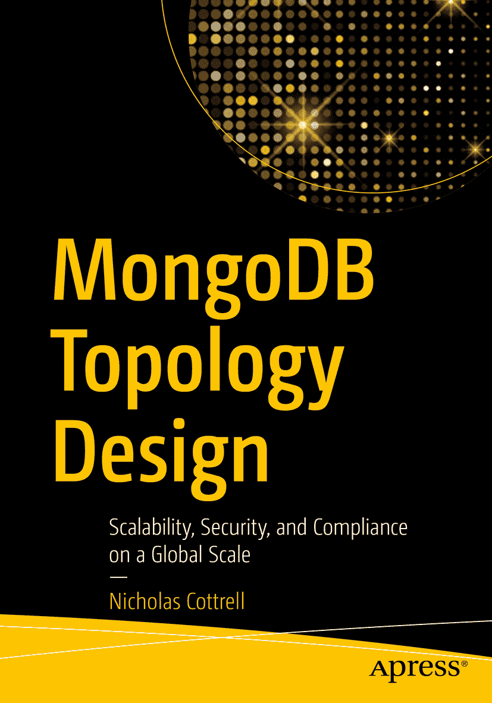

ISBN 978-1-4842-5816-3 e-ISBN 978-1-4842-5817-0 [`doi.org/10.1007/978-1-4842-5817-0`](https://doi.org/10.1007/978-1-4842-5817-0) © Nicholas Cottrell 2020
本作品受版权保护。出版者保留所有权利，无论涉及材料的整体还是部分，特别是翻译权、重印权、图表的再利用、朗诵、广播、缩微胶片或其他任何物理方式的复制，以及信息存储与检索、电子改编、计算机软件，或当前已知及未来开发的类似或相异方法。
本出版物中对通用描述性名称、注册商标、服务标志等的使用，即使未作特别说明，也不意味着这些名称可免于相关保护性法律法规的约束而可供自由使用。
出版者、作者和编辑安全地认为本书中的建议和信息在出版时是真实准确的。出版者、作者或编辑均不就本书所含材料或可能存在的任何错误或遗漏提供任何明示或暗示的保证。
出版者对出版地图中的管辖权主张及机构附属关系保持中立。
本书在全球图书贸易中由 Springer Science+Business Media New York 分销，地址：233 Spring Street, 6th Floor, New York, NY 10013。电话：1-800-SPRINGER，传真：(201) 348-4505，电子邮件：orders-ny@springer-sbm.com，或访问网站：www.springeronline.com。
Apress Media, LLC 是一家加利福尼亚州有限责任公司，其唯一成员（所有者）是 Springer Science + Business Media Finance Inc (SSBM Finance Inc)。SSBM Finance Inc 是一家特拉华州公司。

我将本书献给我的父亲 David，他是关系数据库领域的先驱，也是 Retek 的创始人。他激励我去构建和实验，并鼓励我从事信息技术和数据库领域的职业生涯。

致谢

我需要特别感谢我的妻子 Sophie、女儿 Lucie 和儿子 James，在我撰写本书的那些夜晚和周末，他们给予了我持续的支持和无尽的耐心。

同时，我要感谢我的同事 Wes、Idan 和 Clare 提供的额外校对和反馈，以及 MongoDB 的所有工程师同仁，是你们创造了如此卓越的产品。

关于作者 关于技术审阅者

