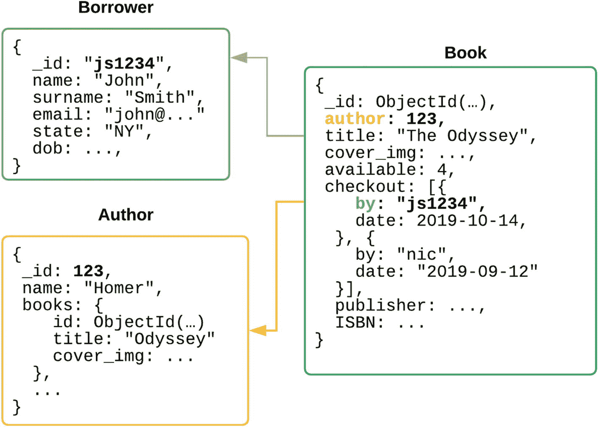

# 1. 核心概念

对于来自传统关系数据库管理系统世界，甚至是企业级 Microsoft SQL Server 或 Oracle 的用户来说，MongoDB 提供了一种关于可扩展性和可用性的创新思维方式。本章介绍了 MongoDB 部署的所有核心概念，并阐述了 MongoDB 节点如何实现高可用性、低延迟复制，以及如何处理意外的基础设施故障。

> 冗余是模糊的，因为如果什么不寻常的事都没发生，它似乎是一种浪费。然而，不寻常的事情通常会发生。
> —— 纳西姆·尼古拉斯·塔勒布，学者、风险分析师，《`黑天鹅`》作者

## MongoDB 的主要特性

自计算机时代伊始，存储结构化数据就一直是个问题。最初数据保存在分隔符文件中，最终存储在预定义的数据表中，但最近出现了一个数据库新时代，它以键/值存储、图和复杂的多级文档形式记录数据。这些相对较新的方案在“关系性”上并不逊色于旧的 SQL 解决方案。MongoDB 允许开发人员以更直观、更灵活的方式，通过 `结构化文档` 来表达关系。

MongoDB 的另一个优势在于，它从核心设计上就是高效、可扩展且具备冗余性的。通过运行在通用硬件上，企业可以在自己的数据中心构建强大的“大数据”解决方案，并随着应用程序的增长和发展轻松扩展它们。

如今，大容量、低延迟的存储已相对便宜，数据库设计的整个范式已经改变。SQL 数据库设计侧重于使用 `规范化` 使数据库尽可能小，但这在读取时可能需要将数据 `连接` 回逻辑块，从而产生巨大的开销。通过将相关数据存储在单个文档中，可能需要更多的磁盘空间，但读取性能得到了极大的优化，无需在读取时进行任何“连接”或其他处理。

MongoDB 专为高可用性而设计，采用分布式架构，同时仍能保持持久且一致的数据变更。在生产部署中，将有多个 MongoDB `节点`，每个节点都拥有数据的完整副本，并通过 `复制` 保持同步。MongoDB 采用主/从范式的一种变体，即 `副本集` 中的一个成员被指定为 `主节点`，负责确认任何写操作，其余成员为 `次节点`，维护数据的副本。这些次节点是一种 `灾难恢复` 备用节点，如果主节点变得不可用，它们将接替主节点的角色。关于拓扑结构和分片的架构选择将在后续章节中详细讨论。

## 与“传统数据库”的区别

Oracle、MySQL 或 Microsoft SQL Server 等传统数据库使用表状范式存储数据——很像电子表格。它们要求系统架构师或开发人员将逻辑数据对象分解为多个表，这不仅增加了软件开发的复杂性，而且在向存储设备的多个不同位置写入变更时，也会产生额外的 I/O。

### 术语对照

虽然查询、索引和事务等许多概念非常相似，但表 1-1 展示了传统 SQL 数据库与 MongoDB 之间的关键术语和差异。

表 1-1

常见 SQL 与 MongoDB 术语对照

| SQL | MongoDB | 说明 |
| --- | --- | --- |
| `Table` | `Collection` | 包含共享相似实体类型的文档，但不必是完全相同的字段集。 |
| `Row` | `Document` | 一个具有唯一 ID 字段和其他数据字段的实体。 |
| `Column` | `Field` | 并非所有文档都必须拥有相同的字段。可以向单个文档添加字段，而无需重建任何数据文件。字段可以具有多种数据类型，包括子文档的嵌套数组。 |
| `Index` | `Index` | MongoDB 也支持二级索引、部分索引、稀疏索引、地理空间索引、大小写不敏感索引和复合索引。 |
| `Query` | `Query` | MongoDB 查询被定义为文档。 |
| `View` | `View` | MongoDB 支持只读视图，并且在 MongoDB 4.2+ 中还支持按需物化视图。 |
| `Transaction` | `Transaction` | MongoDB 4.2+ 在分片部署中支持多文档事务。 |
| `Master/slave` | `Primary/secondary` | 与许多系统不同，主节点和次节点的角色是动态的，在维护和网络故障期间会自动响应。 |
| `Replication` | `Replication` | MongoDB 使用逻辑操作日志，而非复制二进制数据差异。 |
| | `Deployment` | 以特定配置协同工作的任何一组 MongoDB 节点。 |
| | `Cluster` | 包含一个或多个分片、配置服务器和路由器的 MongoDB 部署。 |
| | `Shard` | 包含数据子集的一组 MongoDB 节点。 |

## 存储引擎

与许多其他流行的数据库类似，MongoDB 支持替代性的存储引擎。这一点在从最初的内存映射存储方案（现称为 `MMAPv1`）过渡到新的 WiredTiger 存储引擎时尤为重要，WiredTiger 在 3.2 版本中成为默认引擎。WiredTiger 提供了卓越的并发特性，以及压缩、加密和其他现代 MongoDB 功能现在所需的内部功能。

### 二进制 JSON

虽然我们通过 JSON 文档与 MongoDB 交互，进行查询、管理命令和配置，但数据库服务器本身实际上操作的是 JSON 的一种特殊二进制编码格式，称为 `BSON`（“二进制 JSON”）。该格式定义了许多标准 JSON 中没有的数据类型，例如 `Decimal128`（128 位精度十进制数）和 `Date`（64 位 UTC 时间戳）。同时提供了一种扩展 JSON 格式，支持类似 `{"$numberDecimal":"10.99"}` 和 `{"$date":"2019-08-11T17:54:14.692Z"}` 的表达式，用于将数据导出为人类可读的格式。

`BSON` 还具有轻量级、可遍历和高效的优点。该格式非常简单，其规范是开源的。它的开销很小，因此可以最小化传输或存储所需的字节数。该格式保留了一些字节来指示子文档的大小，使得遍历复杂文档和跳转到目标字段在算法上是高效的。最后，其格式易于解码、编码和压缩。

### 数据文件

每个集合和索引在磁盘上都需要一个 WiredTiger 文件。大多数操作系统对单个进程可用的最大资源数（文件、线程、内存等）设定了上限。拥有大量集合、索引或活动连接的非常大规模部署有时可能会达到这些限制。一个常见的原因是本章后面讨论的多租户模式。

注意：在 Unix 类操作系统中，文件描述符几乎用于所有读写操作、I/O 设备、管道和网络套接字；过多的打开网络连接也会耗尽此限制。

## 并发性

与任何支持来自多个客户端并发写入和查询数据的高并发级别的数据库一样，MongoDB 使用多版本并发控制（MVCC）系统，该系统利用快照隔离来实现乐观并发控制。很少有操作需要全局锁，大多数在文档级别加锁。然而，一些管理命令（例如 `compact()`）仍可能在长时间内锁定整个逻辑数据库，因此应以滚动方式运行这些命令以避免停机。一些命令（例如 `createIndex()`）将在集合级别加锁，强制将该集合中所有文档的更改放入队列。

## 关系

假设我们正在构建一个国家图书馆平台，并且我们有三个大型文档集合：（1）图书，（2）借阅者，以及（3）作者。

在图 1-1 中，我们看到了 MongoDB 文档的结构化和关系特性。在 `Author` 文档中，有一个 `books` 字段，包含三个子字段 `id`、`title` 和 `cover_img`。这让我们可以通过 `id` 引用另一个集合中的 `Book` 文档，同时由于标题不会改变而将其保留在本地。如果我们想在网站上呈现作者的简介，这个文档已经包含了所有必需的值，因此可以避免第二次往返数据库。

我们在 `Book` 文档中看到了类似的模式。`checkout` 数组包含多个条目，对应当前借阅了副本的每个借阅者。我们将它们表示为子文档数组，包含 `by` 和 `date` 字段。`by` 值引用 `Borrower` 文档的唯一 `_id` 字段。`Book` 文档包含了查看图书馆系统中剩余多少副本以及当前谁借阅了图书所需的所有数据。

在 SQL 数据库中，我们需要一个单独的 `borrower_history` 表来表示借阅者和图书之间的多对多关系。

### 引用完整性

在数据库中维护有效的关系，例如在 SQL 数据库中使用外键的概念，被称为引用完整性。再次强调，SQL 表的一对多映射通常在 MongoDB 中表示为单个文档，因此几乎完全避免了跨多个表维护完整性的问题。当然，有时需要在 MongoDB 中表达和存储更复杂的关系，软件架构师和开发人员需要考虑如何在数据库中保持这些关系的一致性。

虽然 MongoDB 中没有外键约束或级联删除这样的概念，但大多数设计模式和对象数据映射器（ODM）使应用程序能够轻松维护这些引用。

在我们之前 SQL 中的图书馆例子中，如果我想从 `borrower` 表中删除一个人，数据库将需要从 `borrower_history` 表中删除每个条目。但我们会因此丢失有价值的历史信息。

在存储成本低廉的时代，范式已经转变，我们希望尽可能多地保留数据。在 MongoDB 中，与其真正删除 `borrower` 文档，我们更倾向于通过设置一个字段 `active` 为 `false` 来将该人标记为非活动状态。由于我们保留了所有的借阅历史，外键约束违反的问题也得以避免。

在大多数情况下，由应用程序负责使用多文档事务来更新关系的双方。实际上，这是一种更好的编码和创建应用程序逻辑的方式，因为它将所有内容保留在应用程序代码库内部，而不是让一些约束和验证在数据库端执行，另一些在应用程序端执行。

随着欧盟《通用数据保护条例》及其他类似法规中的数据保护法规和“被遗忘权”的出现，有时需要完全删除用户数据。这将在第 4 章中讨论。

## ACID 合规性

ACID 代表原子性、一致性、隔离性和持久性。传统数据库的这四个特性曾被认为是任何生产就绪系统的基石，并常被用作反对 MongoDB 的论据。历史上，MongoDB 一直提供灵活的方法，允许应用程序开发人员选择他们所需的持久性和一致性级别，并让他们在速度、吞吐量和成本之间取得平衡。

