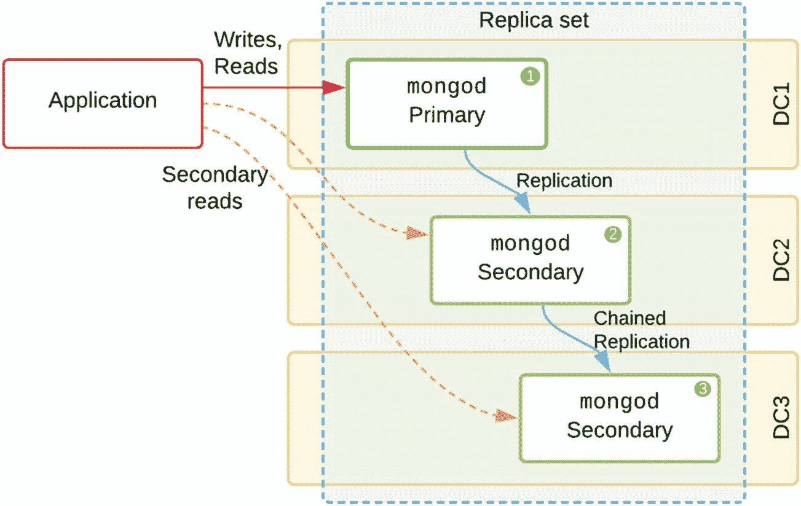
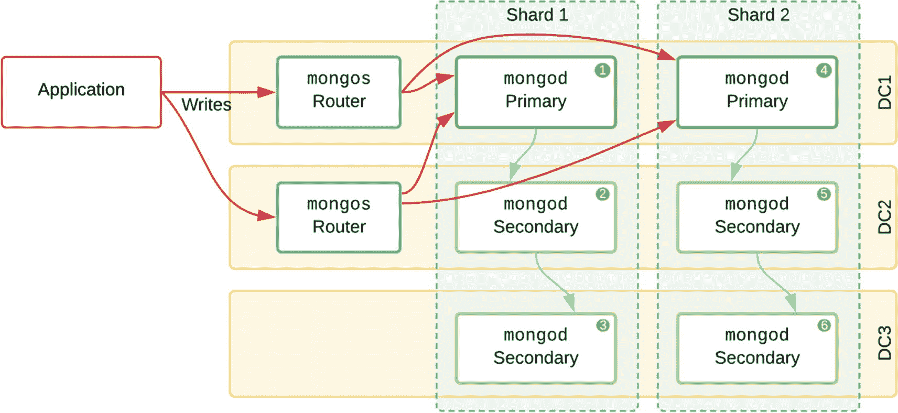
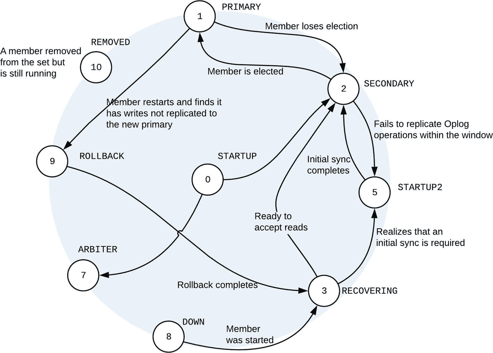
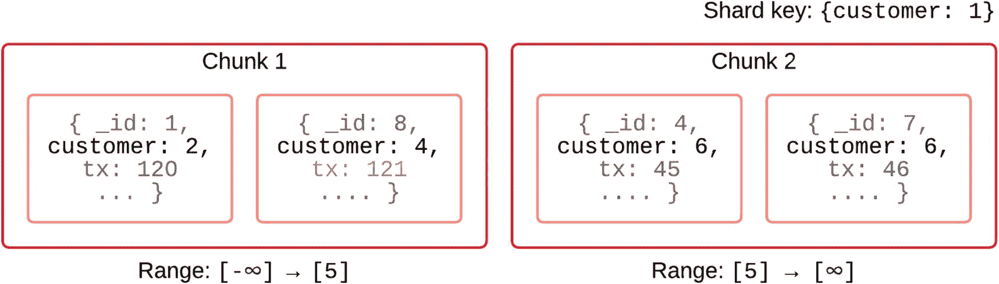
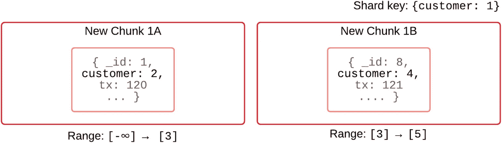
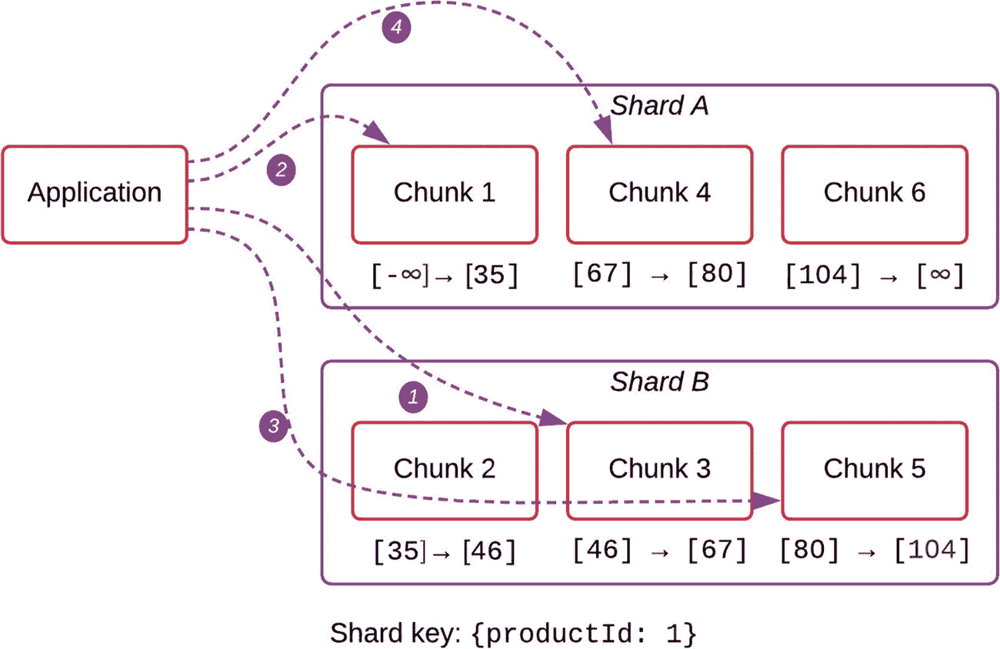
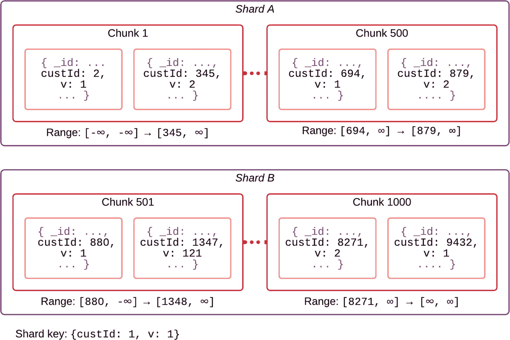
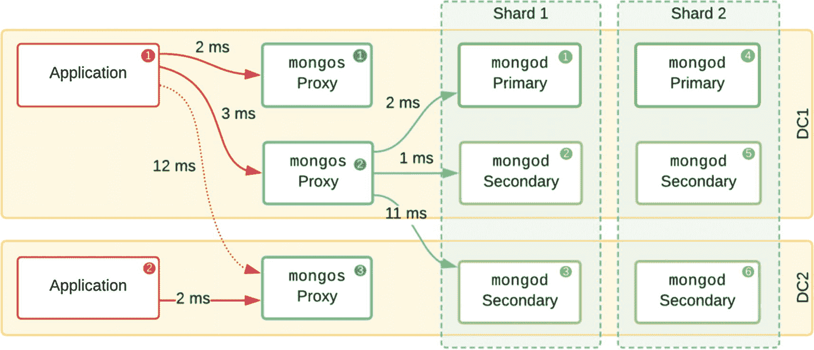

# MongoDB 的 ACID 特性

### 原子性
**原子性** 指的是在数据库内执行多个更改时“要么全部成功，要么全部失败”的事务能力。如果更改的某一部分无法执行（例如，因为违反了唯一约束），那么整个事务都应该失败。这在使用独立数据表来表示一对多关系的“关系型数据库”中尤为重要。

在 MongoDB 中，大多数此类关系都记录在单个文档内，文档级别的原子性自最早期版本以来一直是 MongoDB 的核心特性。例如，在代码清单 1-1 中，我们看到一个示例，它首先检查书籍的可用性，然后才执行借阅操作。如果两个线程同时试图借阅最后一本相同的书，只有一个线程会成功。此外，通过文档级别的原子性，对文档的更新会更改所有字段值，或者一个都不改。

```
db.books.findAndModify ( {
    query: {
        _id: 123456789,
        available: { $gt: 0 }
    },
    update: {
        $inc: { available: -1 },
        $push: { checkout:
            { by: " nic", date: new Date() } }
    }
} )
```
*代码清单 1-1*
*文档级别原子性示例：“借阅一本书”*

MongoDB 4.0 引入了针对不同集合（前提是集合未分片）中多个文档的完整事务支持。在 MongoDB 4.2 中，也支持包含分片集合的复杂事务，这使其能力与任何 SQL 数据库相当，尽管可能只有一小部分用例需要此功能。

### 一致性
此属性旨在保持数据处于有效状态且免遭破坏。由于 MongoDB 使用 MVCC 来控制文档级别的数据一致性，因此更新文档中多个字段的操作要么完全成功，要么失败。失败可能由诸如*唯一键约束*或*模式验证*违规等情况引起。在内部，MVCC 实现了快照隔离保证，确保每个操作总是看到一致的数据快照。自 MongoDB 3.6 起，可以使用因果一致性会话以特定顺序执行因果操作，前提是使用了多数写入和读取。MongoDB 4.2 增加了对分片集合中多文档事务的支持，使得在金融交易等关键且复杂操作中确保关系完整性成为可能。

### 隔离性
在任何数据库中，读取隔离都是一个难以理解的概念，在分布式数据库中尤其如此，因为一些应用程序进程明确选择从可能落后于主节点的辅助成员读取。应用程序可以为特定查询指定 `local` 读取关注点（很像一个*隔离级别*），以选择在数据在整个分布式集合中完全持久化之前读取数据。这允许更快、更简单的读取操作，但应用程序可能面临读取稍后可能被回滚的数据的风险。

在大多数情况下，应用程序应该从主节点读取以确保获取最新数据。不过，使用*读取关注点* `majority` 将确保只返回已完全持久化的数据。这会带来一些额外的处理开销和延迟惩罚。关于*多数写入*的相应详细信息，请参见第 5 章。

在 MongoDB 中，显式*事务*应仅用于关键代码路径，其中多个相关文档必须原子地一起更新。在这种情况下，隔离的工作方式与任何数据库大致相同。在事务提交之前，事务内所做的任何写入对任何其他查询都不可见。

例如，如果您正在处理一个影响同一或不同集合中多个文档的金融事务，那么使用显式的 `start` 和 `commit`/`abort` 步骤的事务可能是合适的。

> **注意**
> 当事务中止时，事务中所做的所有更改都会被完全丢弃，并且永远对事务外的任何其他进程不可见。

完全的*分布式事务*（影响分片集合）会在处理能力和操作延迟方面产生额外成本，应仅在绝对必要时使用。如果您要一起进行多个不相关的更改，则根本不应使用事务。

#### 批量操作
为了获得更好的性能，MongoDB 支持批量操作，这些操作可以一起通过网络发送并由服务器更高效地处理。应用程序可以选择使这些批量操作*有序*或*无序*。有序时，任何错误都会取消队列中的后续操作。无序时，服务器将尝试处理所有操作，即使其中一些失败。在这两种情况下，应用程序都会被告知哪些操作失败以及失败原因。这允许灵活的错误处理以及在业务逻辑认为适当时进行重试。在事务外部运行时，批量操作在文档级别是原子且隔离的。

> **注意**
> 为了避免两个进程可能同时尝试首次插入某个值的情况，您应该在该字段上配置一个*唯一索引*。这将防止重复数据，并且其中一个进程在插入时会收到唯一索引违规，该情况可由应用程序处理。

### 持久性
在 ACID 范式中，持久性意味着写入操作已被提交到一个程度，即使服务器突然崩溃也不会丢失该操作。

#### 日志与刷盘
MongoDB 使用常见的*预写式日志*文件来帮助确保写入尽快持久化。当客户端向节点发送写入操作时，它首先在内存中应用，然后写入磁盘上的日志，然后大约每 60 秒，内存中排队的所有更改（包括索引）都会刷入磁盘，创建一个持久的*检查点*。

通过首先在内存中排队更改，MongoDB 可以实现更高的吞吐量，因为它可以丢弃任何过时的更改（例如，当同一文档的字段在 60 秒内被更改两次时），然后将所有剩余的 I/O 操作批量处理在一起。

对于*独立*的 MongoDB 节点，我们可以认为一旦写入日志（至少每 50 毫秒发生一次），写入就是持久的。作为 `mongod` 启动过程的一部分，它将检查日志并应用在上一个会话期间预先写入那里的任何操作。

对于*副本集*，我们只能认为在写入到大多数节点后，写入才是持久的。此时，如果主节点的存储突然完全故障，拥有此写入的辅助节点将成为主节点，该更改将永远不会丢失。


## 扩展性

虽然传统数据库已增加了分布式和复制实现，但 MongoDB 提供了一对简单却极其灵活的功能——`复制`和`分片`，以创建能够满足几乎所有项目在可用性、性能和成本方面要求的部署方案。

在 MongoDB 中，复制意味着逻辑操作会在`复制集`（参见图 1-2）的所有数据承载节点之间进行复制。MongoDB 不发送变更增量的二进制版本，而是将变更操作记录在一个幂等的操作日志（称为`oplog`）中，这些相同的操作在从节点上被复制并应用，其过程与在主节点上一致。通过避免`二进制复制`，MongoDB 不会复制因存储设备故障可能引入的任何基于文件系统的错误。



图 1-2

一个包含三个数据承载节点的复制集

在一些传统的拓扑结构中，会在第三个数据中心部署一个仲裁器来在网络分区时进行裁决。现在强烈建议避免使用仲裁器，而只部署数据承载节点。

对于更大的部署，MongoDB 引入了`分片`的概念，如图 1-3 所示。每个`分片`由一个复制集（用于提供冗余）组成，并存储分片集合整个数据的一个子集。这可以被视为一种“多主”部署，其中每个主节点负责特定范围的文档。对于这些`分片集群`，我们还需要引入一个`mongos`路由器，它对应用程序隐藏了复杂性。这个`mongos`独立于分片及其组件运行，并将任何传入的写入操作重定向到当前作为主节点的复制集成员。



图 1-3

一个包含两个分片（每个分片都是一个复制集）的分片集群

从应用程序的角度来看，`mongos`路由节点的行为几乎与其他任何节点相同。从复制集拓扑迁移到分片集群，只需要应用程序将连接 URI 更新为指向`mongos`路由器，而不是直接指向成员节点。

## 复制

既然我们已经介绍了复制的概念，让我们更深入地探讨一些内部机制，以便了解它们如何受到我们拓扑设计的影响。

### 同步

在复制集中同步一个节点主要有两个阶段：

1.  `初始同步`：通过网络复制所有数据，并在目标节点上从头重建数据和索引。
2.  增量 oplog 处理：将已在主节点上执行的`一批更新`应用到从节点的数据上。

初始同步是一个资源密集型过程，因为网络和存储容量都可能成为瓶颈。这仅在以下情况下发生：

1.  一个新节点被添加到现有的复制集中。
2.  一个节点离线时间过长，以至于无法根据可用的 oplog 赶上进度，或者
3.  存储级别的损坏意味着现有的数据文件不再可信。

### 选举

MongoDB 通过举行选举来决定复制集中的哪个节点成为主节点。系统架构师可以为某些节点设置优先级，但一般来说，拥有最近写入数据的节点会被选为主节点，以在最坏情况下最大限度地减少数据丢失。通过正确使用多数写关注点，可以保证写入永远不会因网络故障而丢失。这将在第 5 章进一步讨论。

### 延迟/陈旧

因为节点通常位于不同的主机（最好也在不同的数据中心），所以当 oplog 数据通过网络流向每个从节点时，总会存在一些延迟。每个从节点都会尽快应用相同的 oplog 变更。从写入在主节点上完成到从节点应用相同变更之间的时间称为`复制延迟`。从节点可以通过`复制链式传输`从主节点或另一个从节点拉取 oplog 更新。

当应用程序使用`多数`进行写入时，它必须等待大多数数据承载节点写入完成后才能继续下一个操作。这种等待的结果是，复制延迟`减少`，但`吞吐量`也会降低。

应用程序可以选择在没有显式写关注点的情况下写入某些变更。在此模式下，默认使用写关注点值 `1`，应用程序将只等待主节点确认变更，而不等待任何从节点。如果主节点随后发生故障，写入可能永远不会被复制。当该节点稍后重新加入复制集时，这些写入最终会被`回滚`，然后被写入磁盘上的特殊本地`回滚`文件中。之后需要手动干预才能将这些回滚的写入重新整合到数据库中。

只有在吞吐量比持久性更重要的某些情况下（例如点击日志或“物联网”指标），才应在生产环境中考虑使用 `{w: 1}` 写入。

### Oplog 窗口

默认情况下，每个复制集成员将 oplog 创建为一个固定大小的集合，大小在约 1GB 到 50GB 之间，具体取决于创建时数据卷上的可用磁盘空间量。如果初始大小被证明不足，稍后也可以增加 oplog 集合的大小。

`oplog 窗口`是 oplog 中保留的最近变更的`小时数`，通过最旧和最新 oplog 条目的时间戳差异计算得出。这个窗口会随着时间变化，因为它取决于工作负载的繁重程度以及更新操作的紧凑程度。

复制集中的所有节点都应配置足够大的 oplog 大小，以便在正常负载下至少能保存 72 小时的变更，从而实现快速恢复并满足服务水平协议，即使在周末也能如此。

#### 读取偏好

我们介绍了从复制集读取数据时可定制的隔离级别的概念。记住，从节点可能会落后于主节点，如果我们从主节点以外的任何节点读取，就有读取陈旧数据的风险。在可以接受这种情况的情况下，应用程序可以根据表 1-2 中概述的不同性能和延迟指标选择从其他节点读取。

表 1-2

自定义读取偏好以平衡应用程序优先级

| 目标 | 方法 |
| --- | --- |
| 最大化一致性 | 使用 `primary` 读取偏好和 `majority` 读关注点，仅查看永远不会回滚的写入。 |
| 最大化可用性 | 使用 `primaryPreferred`，在有主节点时获得一致读取，在只有从节点可用时获得陈旧读取。 |
| 最小化延迟 | 使用 `nearest` 以获得快速的读取响应，但结果可能`陈旧`。 |
| 目标工作负载 | 使用带标签的 `secondaryPreferred` 以避免对主节点造成压力，并控制使用哪些从节点。 |
| 保护主节点 | 对特殊的高影响工作负载（例如无索引的聚合）使用 `secondary`，以便主节点`永远不会`过载。 |

我们将在第 5 章更详细地探讨这些读取偏好的一些实际应用。


### 状态

由于副本集的分布式特性，每个节点都可能处于多种状态中，这会影响其自身行为以及应用程序（及其驱动程序）与该节点交互的方式。我们已经提到了与状态相对应的常见角色，例如`PRIMARY`、`SECONDARY`和`ARBITER`。

理解其他可能的状态非常重要，因为它们会影响部署在灾难恢复期间的行为，此时保持应用程序可运行并能够持续持久地写入变更至关重要。

**表 1-3：成员可能状态的描述**

| 状态 | 说明 | 是否可投票？ |
| --- | --- | --- |
| `STARTUP` | `mongod`的初始状态，此时它正在读取配置并将必要数据加载到内存中。 | 是 |
| `PRIMARY` | 节点在线，已赢得选举，并正在接受来自客户端的写入。 | |
| `SECONDARY` | 节点在线，并正在从主节点复制数据。其数据副本可能有延迟。 | |
| `RECOVERING` | 节点已加入副本集，但尚未准备好接受读取，因为它当前正在执行一些管理功能。 | |
| `STARTUP2` | 节点已主动加入副本集，但目前正在通过初始同步从另一成员复制数据。 | |
| `ROLLBACK` | 该节点曾是主节点，但与副本集断开连接。它已上线，但正在进行`回滚更改`，以便能赶上当前的主节点。 | |
| `ARBITER` | 此节点维护连接以促进健康检查和选举。 | |
| `DOWN` | 此节点曾与副本集通信，但停止通信，可能已离线或从网络其余部分隔离。 | `否` |
| `UNKNOWN` | 此成员从未将其状态告知其他成员。 | |
| `REMOVED` | 此成员已从副本集中移除，将不再复制数据。 | |

图 1-4 描绘了不同状态之间最常见的转换。



#### 分片

为了横向扩展写入能力，将数据分片为多个子集，每个子集有自己的主节点，是一种在某些传统数据库中可用的“主-主”拓扑形式。

在 MongoDB 中，分片是一个应由开发人员和数据库管理员共同做出的设计决策。

当需要对这些集合进行分片时，我们必须选择一个`分片键`来划分数据。这个分片键必须具有选择性，并且应该是常见查询的一部分，以便`mongos`路由器可以`定位`到确切的分片。例如，如果我们按`{author: 1, _id: 1}`对书籍集合进行分片，然后查询`{author: 123}`，那么通常所有匹配的文档都将存在于单个分片上。我们要避免`scatter-gather queries`（分散收集查询），因为这种查询需要查询集群中的所有分片，然后在路由器上合并结果，这种方法`无法有效扩展`。

一旦选定了`分片键`并对集合进行了分片，更改分片键就需要手动干预，因为数据现在已分布在集群中。这将在第 10 章和第 11 章中进一步讨论。

### 块

为了管理可能拥有数十亿或数万亿文档的集合的分片，有必要将文档分组为逻辑上的`块`。每个块被定义为基于所选分片键字段的一系列值。在图 1-5 中，我们看到一个示例集合，其中四个文档通过`简单分片键`在字段`customer`上进行分片。块 1 包含`customer`值从负无穷大到但不包括 5 的所有文档。块 2 包含`customer`值为 5 及更高的文档。



随着时间的推移，文档数量增加，可能有必要将块 1 拆分为两个，如图 1-6 所示。注意，*新块 1A* 的下边界和 *新块 1B* 的上边界与它们的父 *块 1* 相同。此拆分步骤需要更新`config`数据库上的某些元数据，影响相对较小。迁移是随后的一个独立步骤。



由于我们仅在`customer`上创建了分片键，最小的范围将是单个客户 ID 值。该客户的文档永远无法分布在多个块上，这使得平衡此集群变得更加困难。

> **注意**：实际上，MongoDB 使用`MinKey`和`MaxKey`而不是负无穷大到正无穷大来标识块边界，因为值可以是任何 BSON 数据类型，而不仅仅是整数。

### 分片键的选择

一个好的分片键对于最大化分片性能以及在未来添加更多分片时保持部署的前瞻性至关重要。它必须：

1.  具有高基数，以确保随着数据增长，块可以被拆分为更小的块
2.  存在于大多数查询中，以便`mongos`可以定位到特定的分片
3.  随机（从而均匀地）将写入分配到所有分片上
4.  避免使用单调递增的字段

在图 1-7 中，我们看到字段`productId`上的单个分片键，对于大型电子商务网站来说，这可以是一个好的分片键，只要值不是单调递增的，它就能均匀分布。实际上，大多数好的分片键是`复合的`，包含两个或更多字段，第一个用于定位，第二个确保高基数。



也可以在单个字段上定义`哈希`分片键。基于相应的哈希索引，这种类型的分片键可以在更广泛的块范围内均匀分布文档。

### 平衡器

平衡器进程致力于在分片之间均匀平衡`块`的数量。根据块边界的划分方式，一些块可能包含比其他块更多的文档。因此，即使每个块的文档数量相等，一些文档也可能比其他文档大，导致每个块的数据大小略有不同。

### 分片分布

您可以在每个分片集合上运行`db.<collection>.getShardDistribution()`以查看有关分布的元数据。代码清单 1-2 显示了一个包含两个分片的平衡集群。平衡器尝试确保每个分片上的块数量相同，但根据插入模式，一个块中的文档数量以及文档的平均大小可能意味着块之间的数据大小有时会有显著差异。

```
Shard prod-a at prod-a/node-a1.local:27018,node-a2.local: 27018,node-a3.local: 27018
data : 512.34Mb docs : 76861 chunks : 26
estimated data per chunk : 19.71Mb
estimated docs per chunk : 2956
Shard prod-b at prod-b/node-b1.local:27018,node-b2.local:27018, node-b3.local:27018
data : 456.78Mb docs : 79142 chunks : 27
estimated data per chunk : 16.92Mb
estimated docs per chunk : 2931
Totals
data : 969.12Mb docs : 156003 chunks : 53
Shard prod-a contains 52.8% data, 49.3% docs in cluster, avg obj size on shard : 267b
Shard prod-b contains 47.2% data, 50.7% docs in cluster, avg obj size on shard : 224b
```

**代码清单 1-2：显示平衡分片集群的分片元数据**


## 预分裂

在将大量数据恢复或导入到一个空的分片集合时，如果你已经大致了解数据的分布情况，采用`预分裂块`的方式会高效得多。这意味着通过`mongos`执行的`mongrestore`操作会立即将文档插入直接分布到各个分片上。通过精心定义的预分裂，块应该被均匀分布，数据恢复后几乎不需要均衡器在网络上进行重新分配。

清单 1-3 中的命令将在所有当前分片上创建 16,384 个大小相等的块，并将使新文档插入的分布近乎完全均匀。

```
db.adminCommand({
    shardCollection: "cacheDB.userCache",
    key: { _id: 'hashed' },
    numInitialChunks: 16384
})
```
*清单 1-3: 使用哈希分片键进行预分裂的命令*

## 递增分片键与热分片

让我们想象一下第一个分片示例的一个微小变体：集合存储用户账户文档，分片键包含一个版本字段 `v`，该字段通常介于 1 和 3 之间，因此具有较低的基数。

当新用户注册此服务时，他们会获得一个`单调递增`的客户 ID 号 `custId`。在如图 1-8 所示的示例中，我们看到接下来的注册客户将获得 ID 9433、9434 和 9435。所有这些自然都将落入 `Chunk 1000` 的范围内，并被路由到 Shard B。事实上，我们最近注册的客户中大约一半的读写操作都将被路由到 Shard B，而最旧的（可能也是最不活跃的）客户则会被路由到 Shard A。在这种情况下，我们将 Shard B 视为一个`热分片`，因为它接收了集群中的绝大多数工作负载。即使增加更多分片，这种扩展设计也会失败，因为范围以无穷大结尾的块将接收到`所有`插入操作。



*图 1-8: 一个热分片接收所有新插入的分片集群*

存在几种替代方案，将在第 10 章和第 11 章关于高级分片技术的部分进行讨论。

## 架构选择

既然我们已经理解了 MongoDB 复制和分片的主要概念，是时候考虑如何最好地设计底层基础设施，以最高效、最具成本效益的方式，可扩展且高性能地承载我们的部署了。

在许多情况下，当我们面临最大化集群性能的挑战时，从瓶颈的角度思考是很有帮助的。常见的瓶颈包括 `CPU` 处理、可用`内存`、`存储 I/O` 容量以及`网络`延迟、带宽或拥塞。

### 计算资源

MongoDB 设计为在通用硬件上运行，不需要任何特殊的昂贵的企业级硬件。话虽如此，对于任何主机（虚拟机或其他类型）都有许多硬件选择可以创建良好的基线性能。

#### 内存

首先，节点应具有足够的内存，以将文档和索引的`工作集`保持在内存中。通过避免往返存储设备，MongoDB 能够极快地处理传入的请求和更改。这个工作集很难提前预测，因为它代表了在给定时间段内被主动访问和更改的文档。使用真实数据模拟工作负载是评估应用程序工作集需求的最佳方式。

当收到更改文档或执行查询的请求时，如果数据已经在 WiredTiger 存储引擎的内存缓存中，则无需等待较慢的存储层查找。甚至写操作也可以纯粹在内存中以并发方式执行，并且大约每 60 秒会刷新到磁盘一次。

在任何应用程序的演进过程中，随着负载增加，在某个时刻工作集将扩展到超过主机可用的物理内存，此时 I/O 将突然成为瓶颈，因为内存中的文档缓存“抖动”，并且需要提前将内存中的更改刷新到磁盘。重要的是在高峰时段监控实际的内存增长和交换空间使用情况，以便及早发现这些限制，并通过增加内存资源或进行分片来应对。

#### 存储

以当前每 GB 的价格来看，固态存储（SSD）应该是任何新部署基础设施的最低要求。应不惜一切代价避免使用旋转硬盘（HDD），因为其极高的寻道延迟会减慢随机读取速度。

大多数云提供商提供多个级别的存储设备延迟。`预配置`的每秒输入/输出操作次数（IOPS）存储通常以合理的额外成本提供低得多的延迟。

另一种进一步降低存储延迟并提高吞吐量的方法是使用更新的 NVMe（非易失性内存快速）技术。一些云提供商甚至在某些类别的虚拟机实例上提供本地 NVMe 存储。但请注意，这些通常作为临时驱动器提供，如果实例停止（无论是显式停止还是由于数据中心故障），`所有数据都可能丢失`。因此，请务必至少有一个节点运行在持久性存储上，以避免在所有实例同时关闭时发生完全数据丢失。

### 带宽与延迟

为实现高性能分布式数据库，低延迟设计至关重要。有多种不同的硬件选项可供选择，制造商正在努力在每个层面、每次迭代中降低延迟并提高带宽。

如表 1-4 所示，内存仍然比持久存储技术快得多，但一些最新的 SSD 存储设备现在在带宽方面可以与较旧的内存技术竞争。

*表 1-4: 不同存储介质的访问速度（近似值）*

| 类别 | 寻道延迟 | 读取带宽（顺序） |
| --- | --- | --- |
| L1 缓存 | 2 ns（2-3 个时钟周期） | ~3500MB/s |
| L2 缓存 | 5 ns（~10 个时钟周期） | ~4000MB/s |
| 内存（DDR4） | 70 ns | ~3000MB/s |
| 内存（DDR3） | 80 ns | ~2000MB/s |
| 采用非易失性内存快速（NVMe）的 SSD | 120,000 ns（0.1 ms） | ~2500MB/s（使用 4 通道） |
| SSD 存储（SATA 3.0） | 500,000 ns（0.5 ms） | ~550MB/s |
| HDD 存储（SAS/FC） | 12 x 10⁶ ns（13 ms） | ~200MB/s |
| SAN（光纤通道，iSCSI）网络存储 | 存储延迟 + 额外 200-700 ns | 200MB/s-16GB/s |

我们可以得出结论，投资于合适的 SSD 和内存技术可以轻松地将数据库节点的 I/O 性能提升一倍。

尽管内存的读取带宽不再比 SSD 存储高很多，但其延迟大约低 1000 倍。在大多数情况下，查询会先读取索引，然后加载并返回一个小文档（大小几百字节），因此延迟对性能而言比带宽重要得多。

*注意：内存性能实际上会随着容量增加而下降。8GB 内存条的延迟比 4GB 大约慢 50%。每 GB 的成本增长也不成比例。*


#### 水平扩展

一旦节点的垂直扩展潜力耗尽，并且副本集无法处理应用程序的所有写入请求（或者磁盘上的数据大小已超过约 2TB），那么就该通过分片进行*水平*扩展了。

> 注意
>
> 分片大小的 2TB 推荐限制是基于存储和网络吞吐量的实际限制，以使初始同步和恢复能在可接受的时间范围内完成。

通过分片，我们可以将负载分散到多个主节点上，并且从那时起，可以根据工作负载或数据的增长，通过添加额外的分片来进一步增加容量。这可能是增加整体内存资源和集群总性能最具成本效益的方式。

#### 往返延迟

在 MongoDB 中，与任何分布式系统一样，一个瓶颈可能是数据包在组件之间发送并获得响应所需的时间。这被称为往返时间（RTT）延迟，它会影响 MongoDB 集群中许多组件选择路由请求的方式。

这种延迟通常以毫秒为单位记录，并受到许多因素的限制。任何一对主机之间的物理距离（以及光速）、网络拥堵、所选的网络路径（跳数）以及沿途交换机添加的延迟都是可能增加延迟的常见因素。如果可能，应使用数据中心之间的直接专用光纤连接以尽可能减少此延迟。

在分片集群中，应用程序通过`mongos`路由节点进行查询，因此存在两组不同的往返，如图 1-9 所示。在此示例中，我们看到应用程序[1]到同一数据中心内的`mongos`节点的延迟较低。基于此，应用程序[1]中的驱动程序将通过`mongos`[1]和`mongos`[2]分发其查询，而应用程序[2]将所有查询路由到 DC2 中的`mongos`[3]。但是，如果`mongos`[3]发生故障，应用程序[2]将自动且立即故障转移到 DC1 中可用的`mongos`，因为它们现在代表了最佳的 RTT。



图 1-9
两个数据中心部署中组件之间的延迟

第二组往返是在`mongos`实例和分片中承载数据的节点之间进行的。默认情况下，读写操作将通过主节点进行。但是，如果应用程序请求`nearest`读取偏好，那么查询将被发送到`mongod`[1]或`mongod`[2]，因为它们的 RTT 最低，分别为 2 毫秒和 1 毫秒。

### 本地部署与云部署

本书的其余部分将重点介绍客户希望构建高性能、高可用性的自管理 MongoDB 部署的情况。直到最近，大多数生产环境中的 MongoDB 部署都部署在公司自己的数据中心——即所谓的"*本地*"部署。

现在，许多大公司发现主要的云提供商（如 AWS、Azure 和 GCP）足够稳定且具有成本效益，他们可以在云上运行虚拟机作为"*自管理云*"服务器。我们有时会比较在本地可能实现的功能与 MongoDB 自己的称为 MongoDB Atlas 的*完全托管*解决方案。

### 逻辑数据库

与大多数数据库管理系统一样，MongoDB 允许在单个物理部署上存在多个*逻辑数据库*。每个逻辑数据库可以有自己的数据集合以及拥有自定义角色和权限的用户。然而，这些数据库的数据文件仍在同一路径中，因此，对存储卷进行*LVM*（逻辑卷管理器）备份将必然同时备份所有逻辑数据库。

在所谓的"*多租户*"设置中，单个物理 MongoDB 部署通常有许多数据库，每个数据库对应一个单独的客户。对于某些*SaaS*（软件即服务）产品，每个数据库将有许多几乎相同的小型集合，每个集合都匹配相同的模式。

## 关键要点

从本章中，需要记住的关键概念如下：

*   MongoDB 数据库使用称为 BSON 的特殊二进制 JSON 类似格式存储具有各种数据类型的结构化文档。
*   MongoDB 部署可以是独立节点、副本集或分片集群，其中数据被分解为子集，用于扩展以处理海量数据集。
*   MongoDB 数据库支持 ACID 合规性，即使对于分片集群上的多文档事务也是如此。
*   复制机制健壮且异步，可处理自动故障转移。
*   如果需要，可以调整写入和读取以优先考虑性能而非一致性。
*   分片集合基于用户定义的分片键进行分布，并通过块迁移来保持分片平衡。
*   MongoDB 部署可以在本地或自管理的云基础设施上实现自动化。
*   还提供名为 Atlas 的完全托管 MongoDB 服务，以避免直接管理任何基础设施。

