# 2. 容错设计

本章更深入地探讨 MongoDB 的容错特性，并介绍一些特殊类型的节点以及它们在生产系统中的使用方式。我们研究了现实世界系统中可能发生的常见错误以及如何减轻它们。

> *冗余昂贵但不可或缺。*
>
> ——简·雅各布斯，城市学家、作家和活动家

## 特殊节点

我们已经介绍了 MongoDB 部署中的标准节点类型。这些承载数据的节点通过复制机制保持数据的完整副本，并且如果当前主节点因任何原因发生故障，它们可以随时成为主节点。接下来，我们将讨论一些其他类型的节点，这些节点可以在某些特殊情况下使用。

在 MongoDB 的早期，在健壮的生产就绪备份解决方案可用之前，以及可靠的 SSD 存储特别昂贵的时候，以下一些类型的节点在生产配置中有其合理的位置。然而，随着更便宜的硬件和更先进的功能（如多数写关注）的出现，以下一些节点现在应避免在生产部署中使用。我们将介绍历史用例和当前的替代最佳实践。

### 仲裁者

仲裁者是一种 MongoDB 节点，它加入副本集的唯一角色是参与选举。它们不存储任何用户数据，但会维护副本集元数据的副本，以便知道它们应该连接到哪些成员以及如何安全地进行通信。

这是少数仍在生产部署中定期使用的“特殊”节点类型之一，但通常仅在可用的不同数据中心少于三个时才需要。这将在关于*基础*和*全局*拓扑的第 5 章和第 6 章中进一步讨论。一些拥有两个数据中心的客户会将单个仲裁者放置在云实例中，因为他们的数据保护策略不允许将用户数据存储在云中。

在图 2-1 中，我们看到复制发生在数据中心 1 和 2 之间，但只与驻留在云中的仲裁者节点进行健康“ping”通信。

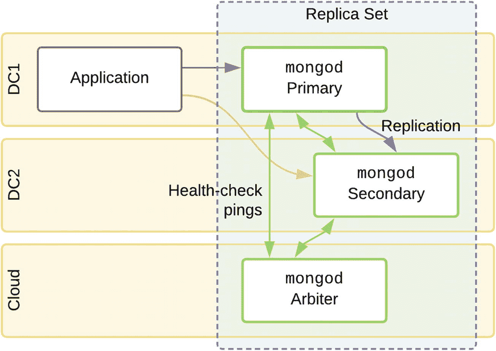

图 2-1
带有仲裁者的双数据中心架构

### 隐藏从节点

隐藏成员是一种承载数据的节点类型，它们会正常复制数据，但专为分析或数据转储等特殊工作负载而预留。它们可以配置不同的索引，并且通常分配有不同的系统资源。隐藏节点*永远不能成为主节点*，并且*对客户端应用程序*（以及`mongos`路由器）*隐藏*，即使是进行从节点读取。

应用程序可以直接连接到这些节点执行聚合或分析查询，但绝不应向它们写入数据。由于它们从主节点复制数据，因此可能会返回过时的数据。

### 延迟从节点

延迟成员是一种隐藏成员类型，其复制应用了延迟。

注意

在 Ops/云管理器引入*可查询备份*之前，这些节点被用来增加一层针对用户错误的防护。

假设你的副本集有一个额外的节点，其复制延迟为 2 小时。实际上，它拥有一个 2 小时前的数据库完整副本。现在，如果数据库管理员或应用程序意外删除或损坏了一个完整的数据集合，你就有了一个“实时备份”。通过一些快速的人工干预，可以将应用程序指向此节点，这样你只会丢失一些最近的更改。这是生产环境中的最坏情况，因为如后续步骤所示，存在若干问题：

1.  你需要在 2 小时的时间窗口内发现、决定并应对数据丢失。
2.  将延迟成员转换为主节点后，你丢失了两小时的其他更改。
3.  如果你选择擦除其他节点并从此单一节点开始初始同步，你的应用程序突然就只有数据的单个副本了。
4.  新主节点现在为应用程序提供服务，同时又是多个复制的同步源，因此负载会显著增加。
5.  在恢复期间，应用程序和终端用户可能会受到显著的性能影响。

在图 2-2（左）中，我们看到第四个隐藏节点延迟复制。在发生损坏的情况下（右），延迟节点已被转换为主节点，其他节点正在从这个 2 小时前的数据同步自身。

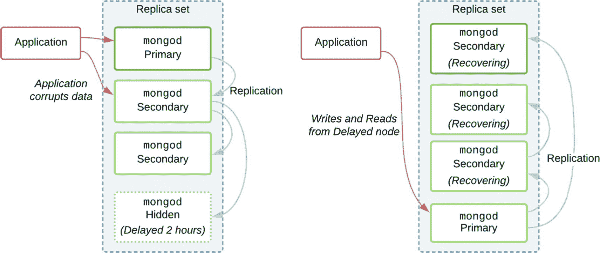

图 2-2

具有延迟隐藏成员的副本集

#### 部分恢复

在仅丢失部分数据，甚至整个集合被删除的情况下，你可以将延迟成员用作干净的数据源。你可以转储该集合并将其恢复回副本集。或者，你可以直接连接到隐藏成员并执行查询以检索单个文档或值。

注意

隐藏节点应始终*在*为优化故障转移而设计的拓扑结构*之外*添加。由于它们是延迟的，它们无法参与多数写确认，并且不能成为主节点。

### 非投票从节点

MongoDB 副本集中的非投票成员拥有 0 票，但也必须具有 0 优先级（意味着它自身不能成为主节点）。副本集最多可以有 7 个投票成员（以使选举过程尽可能精简）。然而，一些用例严重依赖读取操作，并且不介意读取稍微过时的数据。对于此类副本集，可以通过添加更多非投票从节点来水平扩展系统。

注意

当（i）数据频繁更改或（ii）需要读取最新已确认的数据时，从节点读取不适用于大多数工作负载。

如图 2-3 所示，通过使用非投票从节点（只要投票节点数量是奇数），你可以拥有一个大型的地理分布式副本集，且节点总数为偶数。*复制链*将用于从其他从节点复制，而不是所有节点都直接从主节点复制。这种链式结构减轻了主节点上的内存和 I/O 压力，但从节点可能会遭受显著的复制延迟。从从节点读取的应用程序将经历陈旧读取，因此这必须得到用例的支持。

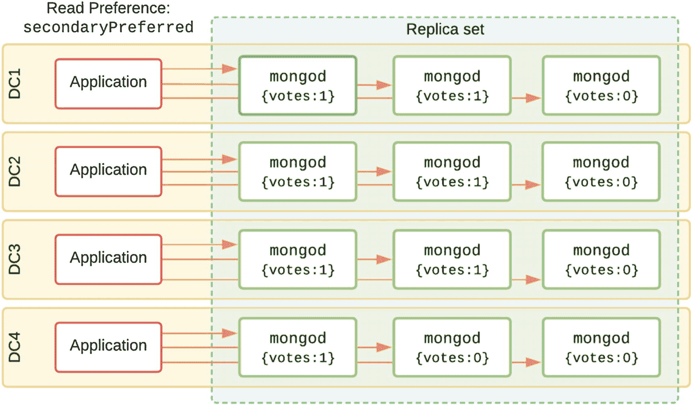

图 2-3

具有多个从节点以扩展读取的副本集

在表 2-1 中，我们可以看到本章讨论的所有节点类型的概览。

表 2-1

不同节点类型摘要

| 类型 | 设置 | 说明 |
| --- | --- | --- |
| 标准 | `{votes: 1, priority: 1}` | 包含数据，可以投票，并且可以成为主节点。 |
| 仲裁者 | `{votes: 1, priority: 0}` | 无数据，因此不能成为主节点，但可以投票。Atlas 上不可用。 |
| 隐藏 | `{votes: 1, priority: 0, hidden: true}` | 包含数据，可以投票，但不能成为主节点。对客户端和`mongos`不可见，即使进行从节点读取也不行。 |
| 延迟 | `{votes: 1, priority: 0, hidden: true, slaveDelay: 3600}` | 一种特殊类型的隐藏节点，具有复制延迟。它可以帮助选举主节点，但由于没有最新数据，*不能成为主节点*。在分片集群中无用，且 Atlas 上不可用。 |
| 非投票 | `{votes: 0, priority: 0}` | 此节点复制数据，但不投票，也不能成为主节点。有助于确保投票节点数量为奇数。 |

## 避免故障

任何复杂系统的鲁棒性都取决于其故障点。最终，系统中的每个组件都会出现故障、需要升级、重启或需要物理搬迁。如果某个组件是其同类中的唯一一个，它就被称为*单点故障*，或称*SPOF*。当它发生故障时，会破坏整个组件间的相互依赖关系，导致应用程序停机。

为避免此类故障，你应该有多个应用程序在负载均衡器后运行，位于不同的物理机器上，最好在不同的数据中心。域名系统（DNS）查找应有多个名称服务器，这样即使发生互联网级别的故障，也不应阻止用户访问你的应用程序服务器。

对于你的 MongoDB 数据库，我们建议遵循相同的原则，使用一个包含三个数据承载成员的副本集。这是提供高可用性和多数写确认的最低要求，这样即使单个节点完全丢失，也不会造成数据丢失，也不会导致任何停机或性能影响。

### 故障点

一些常见的故障点包括：

*   数据中心（断电、网络基础设施故障、火灾等）
*   物理服务器（电源、CPU、存储设备等）
*   软件（虚拟机[VM]宿主机、操作系统崩溃）

通过内部冗余系统，例如多个电源、具有热插拔驱动器的 RAID-10 存储、多个网络接口卡，以及配备备用电源和多个互联网骨干网的数据中心，可以大大降低其中一些故障点的风险。自动化并测试任何故障转移机制对于最小化停机时间至关重要，在理想情况下，可以完全避免停机。

### 容量冗余

你需要为任何组件在最糟糕时刻离线的情况做好预案。假设你为一个运输提供商处理生产负载，每个工作日的票务销售有 90%集中在上午 9-10 点和下午 5-6 点。你应该为 MongoDB 节点配置计算资源，确保即使主节点故障，替换的主节点也能处理相同的工作负载。

所有这些冗余都是有代价的，系统架构师和管理者必须在为系统添加冗余的成本之间进行权衡。人们倾向于寻求用复杂的故障转移策略和混合硬件来节省资金的巧妙方法。稍后，我们将探讨一些例子，并说明为何采用混合硬件资源的部署是不可取的。

### 自动故障转移

除了依赖冗余硬件外，MongoDB 还提供了一种更简单、更便宜的软件方法，它假定基础设施故障会发生，并内置了故障转移功能。通过在不同的物理位置运行多个承载数据的节点，确保基础设施的每一层都具备弹性变得不再那么重要。我们可以在成本低得多的商用硬件上运行，这些硬件仅配备单个电源和单个网卡，无需备用电源或互联网连接。

如果我们的副本集能够同时处理一个甚至两个完整的数据中心故障而不会丢失数据，我们就能在基础设施上节省资金，并提供一个能够自我修复、完全不会对其应用程序造成任何中断的数据库系统。

大多数云提供商为客户提供了统一的虚拟机界面，这与在商用硬件上运行标准 Linux 操作系统非常相似。然而，在底层，大多数云提供商已经内置了多层冗余。例如，他们的网络存储解决方案通常建立在 RAID-10 风格的架构上，该架构使用多个物理存储设备来存储每个数据块，并且在`IOPS`（每秒输入/输出操作）方面几乎呈线性扩展。

**警告**

许多云提供商提供的存储选项包含“突发额度”。这些额度可以在工作负载高峰期间使用，但最终会过期。如果你在云虚拟机上看到`IOPS`无故突然下降，可能是因为额度余额已降至零。

### 为灵活性而设计

构建容错系统的另一个好方法是遵循允许未来灵活调整的设计原则。

#### 使用 DNS 而非 IP

虽然可以在连接字符串中使用 IP 地址配置副本集成员和种子列表（见图 2-4），但这可能会使你的部署变得脆弱。通过使用内部 DNS 服务器，你可以为部署中的每个主机分配一个逻辑主机名或别名。

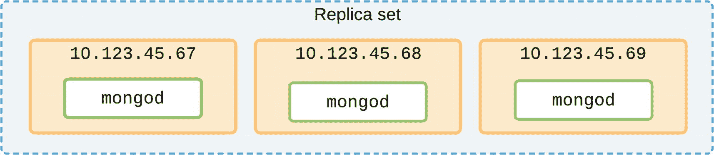
图 2-4

使用 IP 地址进行配置会导致系统不灵活

一些组织会根据主机的物理位置和业务部门为其分配增量主机名，例如`host0003456.mortgages.dc-nyc.bigbank.local`。虽然这比使用 IP 地址更可取，并且能让我们快速了解主机所在的数据中心，但它仍然缺乏灵活性。

如果该主机是某个分片副本集的一部分，并且由于某种原因主板完全故障，那么该主机就需要被替换。替换的主机将有一个新的主机名，例如`host0003587`。现在，需要在 MongoDB 部署内部进行手动干预，以便所有其他成员、`mongos`和 Ops Manager 都能知道此节点角色所在的新主机位置。

如图 2-5 所示的另一种方法是，为主机名赋予逻辑命名，或者至少为功能性主机名创建一个 CNAME 别名，格式为`node3.mortgages_prod.mongo.bigbank.local`。在这种情况下，可以启动一台新的主机，将 CNAME 别名指向该主机名，配置`mongod`进程，一旦 DNS 缓存刷新，所有组件都将能够自动发现它。对于计划内的迁移，可以缩短 DNS 生存期以减少缓存持续时间。

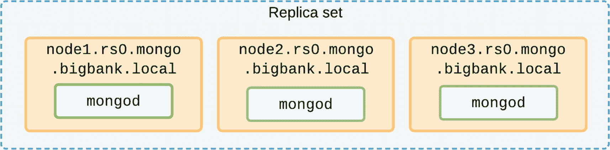
图 2-5

使用逻辑主机名使得理解和管理复杂部署更加容易；也使得替换故障主机更加方便

**注意**

对于副本集、分片集群和 Ops Manager 代理的自动发现功能，每个节点需要检测其自身的“MongoDB 主机名”作为主机的完全限定域名。命令`hostname -f`的输出结果应始终与配置中的节点名称匹配。在 Linux 上，可以通过运行`hostnamectl set-hostname <new_hostname>`或更改`/etc/hostname`中的主机名并重启主机来实现。未能检查这一点可能意味着`mongod`不知道自己的身份。

### 自动发现

MongoDB 驱动程序会自动尝试检测部署的所有成员。即使你在连接 URI 字符串中只列出了一个副本集成员，驱动程序仍然会与所有成员建立连接，以便更快地响应选举和其他副本集变化。但是，你应该始终在连接 URI 中包含所有已知的副本集成员或`mongos`路由器，以防在应用程序首次启动时列出的节点不可用。

### 计划内停机

MongoDB 副本集内在的分布式特性意味着，节点有时会为了计划内的维护而被有意关闭，这是完全正常且预期的行为。只要任何维护操作不超过 oplog 窗口时间，节点在重启后会自动同步任何更改。

对于计划内的停机，无需重新配置副本集。最好保留原有配置，这样一旦节点重启，它就能自动且即时地重新加入副本集。

**注意**

强烈建议利用滚动升级，让 MongoDB 节点保持在当前主要版本的`最新次要版本`上运行。与任何软件一样，偶尔会发现影响稳定性或安全性的错误。避免你的部署因一个已被修复的错误而下线，并及时进行更新。

### 多路由器

任何用于生产的分片集群在部署中至少应有两个`mongos`路由器节点（参见图 2-6）。应用程序应在连接 URI 字符串中配置所有`mongos`实例以支持故障转移。`mongos`连接到每个分片的方式与应用程序连接副本集的方式大致相同。并且，就像驱动程序发现所有副本集成员一样，`mongos`将通过配置服务器自动发现分片集群中的所有组件。

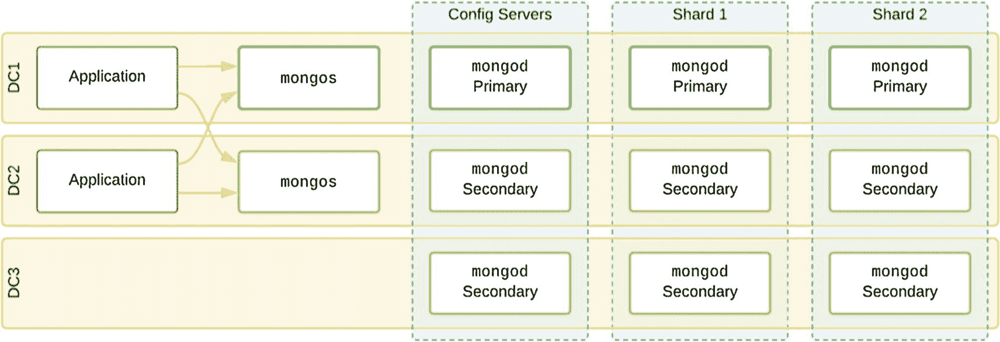

图 2-6
具有多个`mongos`节点的高可用部署

对于具有多个应用程序服务器的部署，一个好的选择是将`mongos`与应用程序服务器同地部署。这减少了`mongos`向应用程序传输数据时的延迟。由于`mongos`通常无状态且不在磁盘上持久化任何数据，可以根据负载需求随时启动和停止。如果你有一个在云“自动伸缩组”内运行的应用程序，它在高峰负载时会启动新的虚拟机，那么你应该在该预构建镜像中包含一个`mongos`，这样你的分片路由器也会自动扩展。

每个`mongos`将与其他每个`mongos`以及部署中的每个非隐藏节点保持连接。在图 2-7 中，每个`mongos`将保持 9 个开放连接，每个连接每个节点大约占用 1MB 的 RAM。想象一个大型部署，有 30 个`mongos`和 10 个分片，每个分片有 5 个节点。在这种部署中，每个`mongos`仅为了持续检查部署中所有组件的健康状态，就要打开近 80 个连接。因此，我们通常建议一个部署中不要超过 30 个`mongos`，而是通过增加内存和 CPU 资源来垂直扩展一个固定大小的`mongos`池。

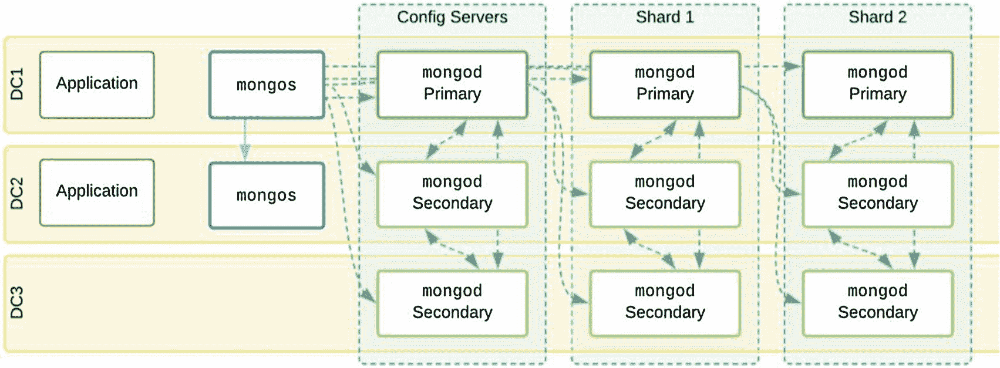

图 2-7
显示一个`mongos`开放连接的分片集群

### 滚动维护

在计划维护或配置更改期间避免故障的一个重要方法是逐个节点地应用它们。由于设计良好的副本集可以在一个成员离线的情况下运行，我们应该以*滚动方式*执行诸如版本升级等操作。

一些操作，如索引构建，最好在暂时从集合中分离出的节点上执行。这可以通过停止一个节点，并临时在没有其副本集参数的情况下启动它来实现。该节点仍将保留数据副本，但对应用程序和其他副本集成员不可见。一旦索引构建完成，该节点可以使用其复制参数重新启动并重新加入集合。许多其他操作，如二进制版本升级或某些服务器配置选项（安全、性能等），则需要节点重启。

虽然这些滚动维护操作可以手动或通过脚本执行，但 Ops/Cloud Manager 的自动化功能是专门设计来执行这些操作的。更改是逐节点进行的，所有辅助节点首先被更改，并且只有在那时成功后，主节点才会*降级*以进行更改，从而确保写工作负载不受影响。如果集群不健康（例如一个节点已经不可用），自动化将永远不会启动滚动维护。如果先前节点的更改未完成和成功，它也不会为了维护而关闭另一个节点。这避免了不必要地降低副本集的弹性或可用性。

#### 干净降级

*降级*是主节点向副本集的其他成员（以及任何连接的客户端）发出的明确信号，表示将进行选举。它会立即触发选举，并且比在高负载下主节点突然丢失要顺畅得多。有了这个通知，选举可以在几毫秒内发生。如果当选的节点尚未赶上旧的辅助节点，它将在接受任何新写入之前先进行追赶（参见`catchUpTimeoutMillis`设置）。如果在 30 秒内没有赶上，仍然拥有最新数据的旧主节点将调用新的选举来接管，以确保集合不会阻塞传入的写操作。

由于应用程序将持有并重试任何待处理的操作，直到新的主节点准备就绪，这意味着对应用程序的影响也非常短暂，并且对最终用户是完全透明的。

如果没有降级，默认情况下，辅助节点会等待 10 秒（副本集配置中的`electionTimeoutMillis`设置）再触发选举。这是为了避免由于非常短暂的网络错误或停顿而导致不必要的主节点变更。

### 工具故障转移

Ops/Cloud Manager 是 MongoDB 企业版客户可用的自动化、监控和备份工具，为在私有数据中心管理复杂的分片集群提供了关键功能。因此，该工具本身具有类似的冗余和自动故障转移至关重要。

图 2-8 展示了一个具备良好冗余的 Ops Manager 部署示例。任何一个数据中心的丢失都不会导致应用程序停机。Ops Manager 应用程序本身有一个热备份，因此自动化和监控可以继续自动进行。备份快照保存在本地部署的 S3 兼容存储解决方案中，该解决方案本身跨多个数据中心进行配置。只有备份守护进程缺乏自动故障转移。如果 DC1 丢失，需要手动干预来激活 DC2 中 Ops Manager 实例的备份守护进程。

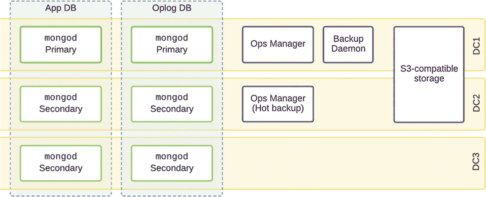

图 2-8
使用 Ops Manager（仅限企业版）且具备冗余的部署

### 故障场景

与任何复杂的分布式系统一样，可能出现许多问题来影响生产数据库的可用性。有了冗余节点，丢失单个服务器或整个文件系统损坏并不意味着数据丢失或数据库不可用。

然而，如果没有正确的容错设计，一些常见错误可能会导致意外或不理想的状态。

### 网络分区

当你有一个分布在多个数据中心、通过网络主干连接的数据库时，数据中心之间的连接可能会间歇性甚至长时间故障。我们无论如何都要避免数据损坏或不一致，因此在某些情况下，部署会自动切换到只读模式，以避免同一文档在两个不同地点被同时编辑的情况。

让我们考虑图 2-9 所示的例子。这里，我们只访问两个数据中心——一个被视为“生产”站点，另一个是“灾难恢复”站点。基于这种设计理念，数据中心 2 中的副节点主要目的是作为灾难恢复的备用节点。可能节点的优先级已被调整，使得数据中心 1 中的节点具有更高的优先级，从而有效地阻止节点 3 成为主节点。如图所示，网络分区只是断开了一个成员。数据中心 1 中存在一个`quorum`（投票节点的多数），因此不需要选举，主节点也无需更换。

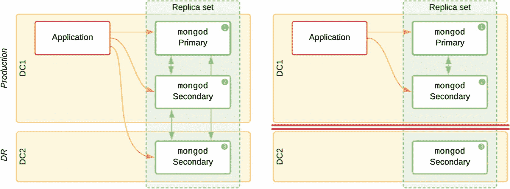

图 2-9
（左）在数据中心 2 中有一个成员的副本集。（右）网络分区断开了数据中心 2 的节点

现在让我们考虑图 2-10 中有两个应用服务器的例子。它们可能配置了负载均衡器，或者根据某些自定义路由，靠近数据中心 2 的用户使用该应用服务器。如果网络故障将数据中心 1 与数据中心 2 分区，数据中心 1 内部将发生选举并选出新的主节点。数据中心 2 中的应用仍能从其本地节点读取旧数据，但既不能写入，也无法从主节点接收任何更新。

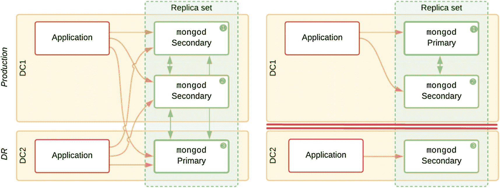

图 2-10
（左）包含副应用服务器的部署。（右）网络分区意味着副应用服务器只能读取

### 硬件故障

对于副本集的所有其他成员来说，成员节点由于硬件或软件故障而离线，与该节点失去网络访问权限是一样的。图 2-11 显示将发生选举，仍然相互通信的两个节点拥有举行选举的法定人数。应用服务器将自动重新连接到新的主节点，以重试任何待处理的写入。

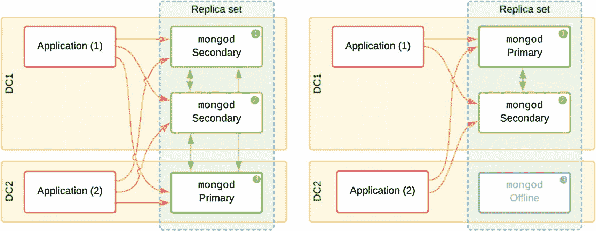

图 2-11
（左）主节点单独在数据中心 2 中。（右）主机/节点故障将导致选举但不会造成停机

### 远程数据中心故障

另一种常见情况，特别是对于内部应用，是数据库运行在公司数据中心内，但应用程序运行在其他地方——办公室网络或员工的个人电脑上。图 2-12 是一个例子，其中拥有大多数节点的“生产”数据中心 1 离线了。从应用程序和节点 3 的角度来看，网络分区的实际结果与节点 1 和 2 同时崩溃是一样的。然而，在数据中心 1 内部，主节点保持不变，因为这两个节点仍然可以形成法定人数。如果应用程序当时正在写入更改（即使使用了多数写入关注），问题就会出现。节点 1 和 2 可能已确认了一些尚未复制到节点 3 的写入。如果应用程序从数据中心 2 的副节点读取，它将错过那些写入。

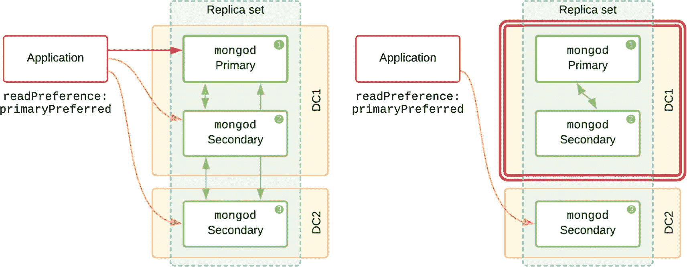

图 2-12
如果配置了 `primaryPreferred` 读取偏好，远程应用程序将连接到副节点并执行读取

通过手动干预，我们可以在节点 3 上重新配置副本集，并完全从成员列表中移除节点 1 和 2。这将使节点 3 成为唯一的剩余节点并成为主节点，但一些写入已经丢失，并且当数据中心 1 重新上线时无法整合这些更改。

这是为什么 3 数据中心配置更可取的另一个例子。即使整个数据中心宕机也绝不意味着缺乏法定人数，也不需要手动干预。

### 存储卷故障

一个不太常见但更难处理的问题是存储卷出现问题，导致无法及时进行 I/O，但问题又不严重到完全阻止节点运行。想象一下图 2-13 中存储设备的微妙硬件故障。它没有以通常的每秒 2000 次 I/O 操作（`IOPS`）的容量运行，而是突然只执行 200 `IOPS`（或者停顿然后短时间爆发式工作）。作为副本集的成员，它仍然响应 ping 并通过所有健康检查。因此没有理由触发选举。相反，副本集现在只能以之前容量水平的 10%来处理传入的写入。

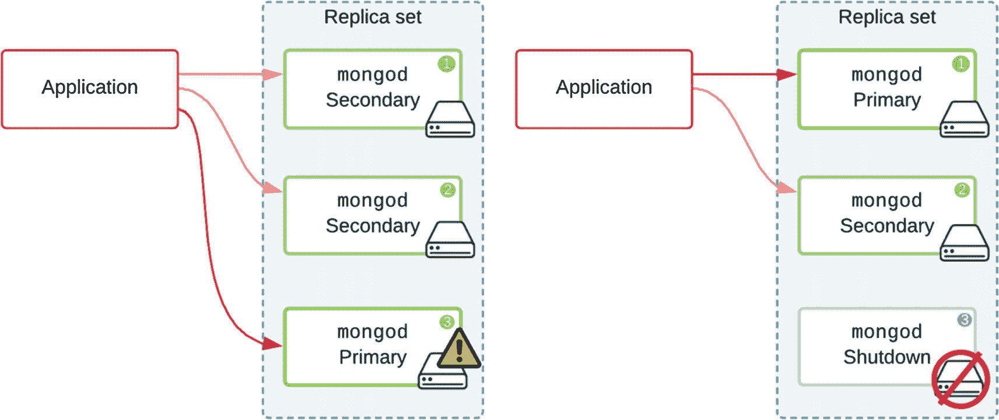

图 2-13
如果其存储变得无响应，存储节点看门狗将使节点离线

一个部分的解决方案是 `Storage Node Watchdog`（自 MongoDB 4.2 起在社区版中可用）。这是一项可选服务，监控其节点上文件系统的健康状况，并在检测到无响应的文件系统时触发节点关闭。如果此节点是主节点，它还将导致选举发生，从而有效地将处理写入的责任传递给副本集的另一个成员。

### 网络性能下降

由于故障网络导致丢包影响带宽，可能会出现与前面类似的情况（图 2-14）。由于健康检查 ping 最终通过`TCP`重试成功，因此不会触发选举。在 MongoDB 中，选举在连接中断和应用重试方面会产生开销，因此该算法避免让主节点下台，除非它确信有更合适的候选节点。在这种情况下，需要网络管理员在网络基础设施本身上建立监控和警报。在这种情况下，数据库管理员可能会选择在网络稳定期间触发故障转移或调整成员优先级。

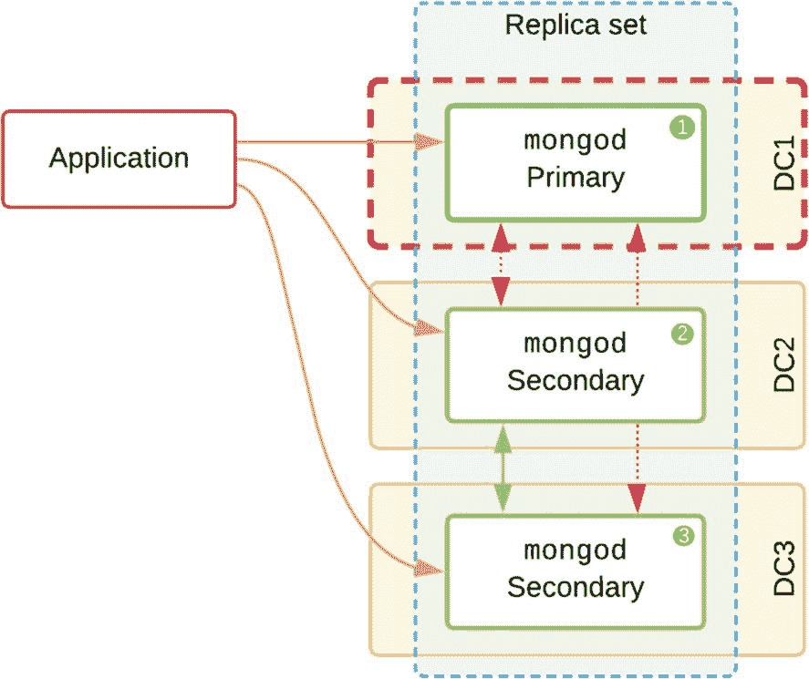

图 2-14
数据中心 1 中的节点经历网络性能下降但仍保持主节点

### 共享虚拟机主机

现在企业在其本地数据中心部署应用程序时使用`VM`主机非常普遍。这增加了一层额外的复杂性，因为嘈杂的邻居可能会窃取资源，或者错误配置可能导致内存使用未达到最优（例如`内存超量使用`或过度的`内存交换`）。除了这些性能问题之外，将同一副本集的多个 MongoDB 节点共同定位还会合并故障点。例如，在图 2-15 中我们看到大多数节点驻留在单个物理`VM`主机上。如果此主机遭受硬件故障或因紧急维护而被关闭，这两个节点将突然一起故障，副本集将变为只读。

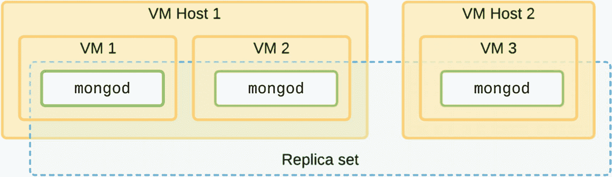

图 2-15
共同位于同一虚拟机主机上的节点增加了联合故障点

### 共享存储区域网络

另一个可能出乎意料的故障点是共享网络存储的“倒金字塔”结构。在许多虚拟主机配置中，会有一个通过光纤通道连接的共享存储服务器，但它被多个 VM 主机共享（图 2-16）。即使每个 MongoDB 节点拥有独立的物理 CPU 和内存，一旦 SAN 发生故障，所有节点也会随之故障。再次强调，使用三个独立的数据中心可以完全避免这种故障场景。

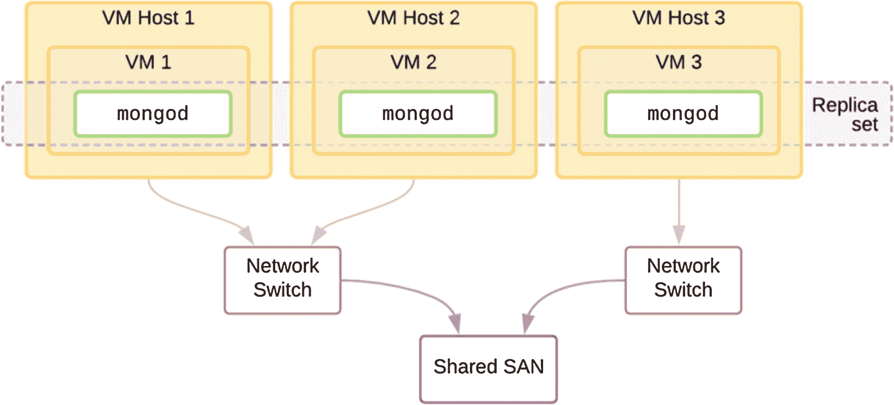

图 2-16
共享的 SAN 可能引入一个意外的故障点

### 硬件不平衡

想象这样一种情况：为了减少延迟，主节点被设计为与应用服务器共同位于第一个数据中心中。该节点被赋予较高的优先级，因此当所有节点都可用时，它应该能赢得选举。由于它需要处理应用程序的读写操作，所以为其分配了更多的内存和 CPU。其他节点的资源则较少。位于次要数据中心的节点甚至被赋予优先级 0，以确保它永远不会被选为主节点（见图 2-17）。

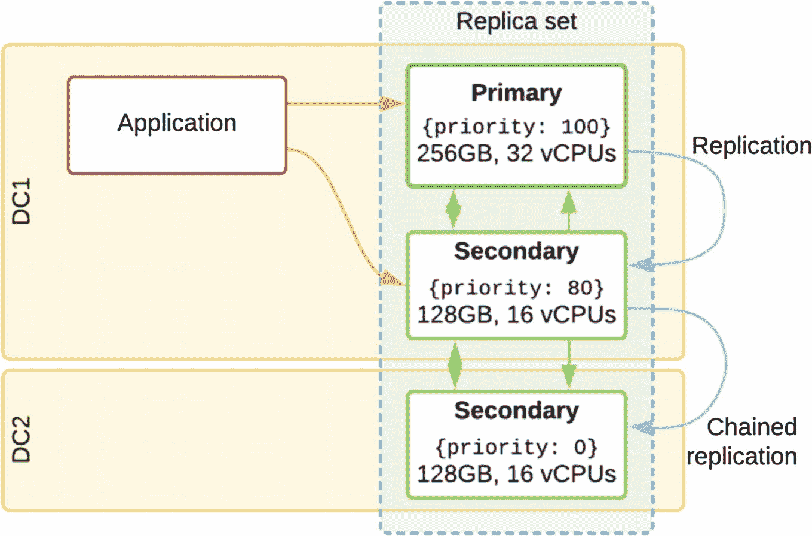

图 2-17
一个副本集，其指定的主节点拥有双倍的内存和 CPU 资源

现在，让我们想象一下如果主节点主机发生故障会发生什么。DC1 中的次要节点被选为主节点，但它的资源只有旧主节点的一半。它只能将一半的旧缓存装入内存；它将需要做更多的 I/O 操作来刷新脏缓存并从磁盘加载数据。其影响是写入性能会显著下降到远低于之前水平的一半。应用程序性能很可能会对终端用户产生明显的负面影响。

在图 2-18 中，我们为 DC1 中的次要节点分配了相同的资源，现在只有 DC2 中的节点拥有 half the resources. Now if the primary fails, the secondary in DC1 will again be elected to replace it, and can function the same, but if the application is using `majority write concern` to avoid rollbacks, it is now waiting for the only other available node to replicate the writes. Since the `oplog` entries must be applied in order, any processing lag in the underresourced secondary will now make the application wait. In effect, the application is still waiting on a node with half the resources to write all the same changes and update all the same indexes. 现在，只有 DC2 中的节点拥有 half the resources. 如果主节点发生故障，DC1 中的次要节点将再次被选为替代节点，并能发挥相同的作用；但如果应用程序使用 `majority write concern` 来避免回滚，那么现在它需要等待唯一另一个可用节点来复制写入。由于 `oplog` 条目必须按顺序应用，资源不足的次要节点中任何处理延迟现在都会导致应用程序等待。实际上，应用程序仍然在等待一个资源减半的节点来写入所有相同的更改并更新所有相同的索引。

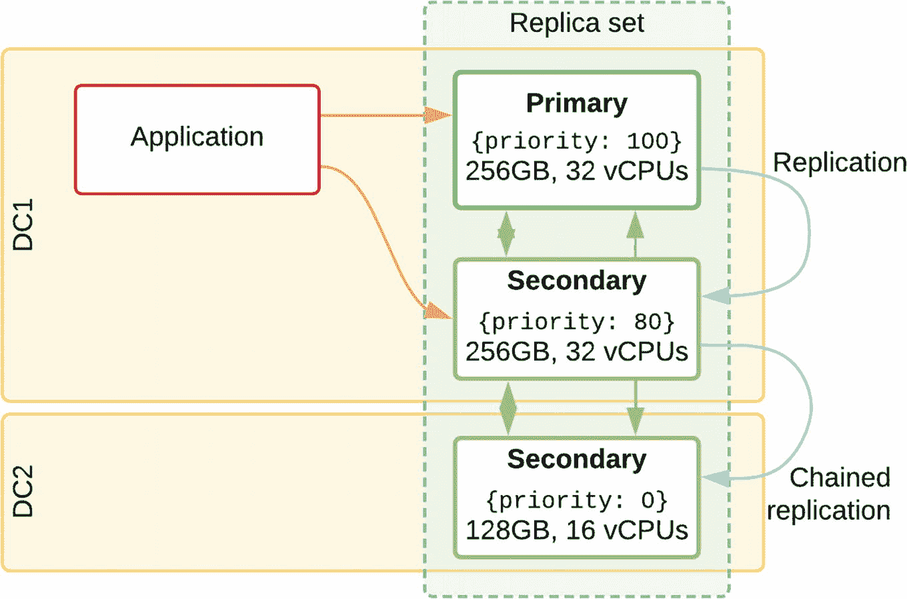

图 2-18
一个副本集，其中资源不足的次要节点作为备用

我们已经看到，复制和 `majority write concern` 是避免在生产环境中出现节点资源不平衡的两个主要原因。对于三节点副本集，您的部署容量在发生任何单点组件故障后，受限于最慢节点的计算资源。

## 关键要点

从本章中，需要记住的关键概念如下：

*   MongoDB 架构的设计旨在优化正常运行时间和恢复能力。
*   可以通过添加冗余组件并避免基础设施中的单点故障来采取缓解措施以避免故障。
*   在至少三个数据中心和多个互联网骨干网中部署具有奇数个节点的副本集，可以避免许多故障点。
*   特殊节点（如隐藏或延迟成员）应仅在至少三个数据承载节点之外部署。
*   副本集中不可能有多个主节点。因为需要一个法定数量的投票节点才能产生一个主节点，所以分区只有一方能赢得选举。如果投票节点数为偶数，则有可能即使所有节点都在线，双方也无法产生主节点。
*   应避免并计划消除手动干预。遵循最佳实践，唯一需要手动干预的情况是多个独立故障同时发生时。
*   应使用滚动维护来升级或更改配置，确保任何时候只有一个节点不可用。
*   副本集中的所有节点都应配置至少 72 小时的 `oplog`，以便在周末也能快速恢复并满足 SLA。

