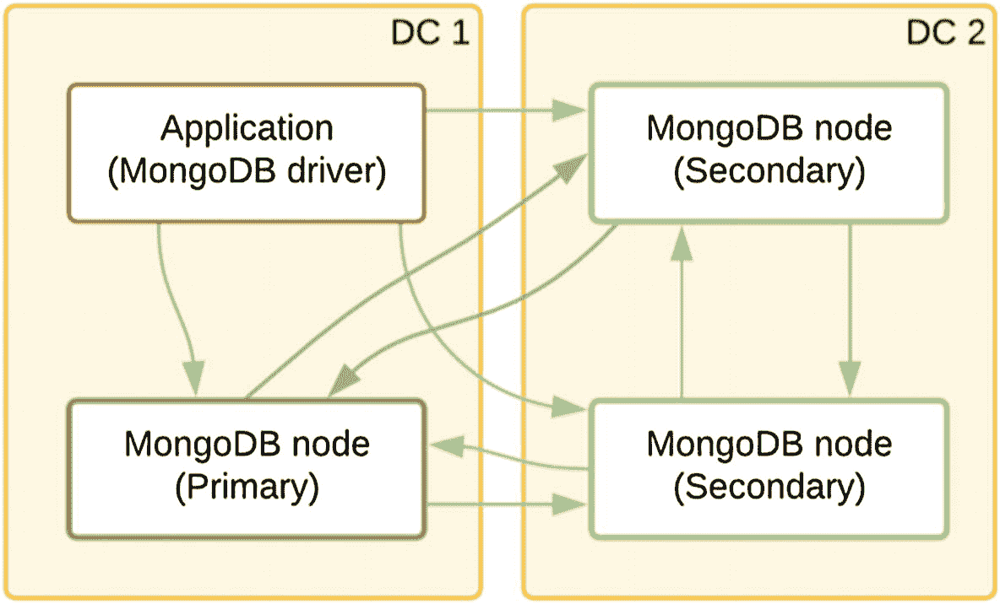
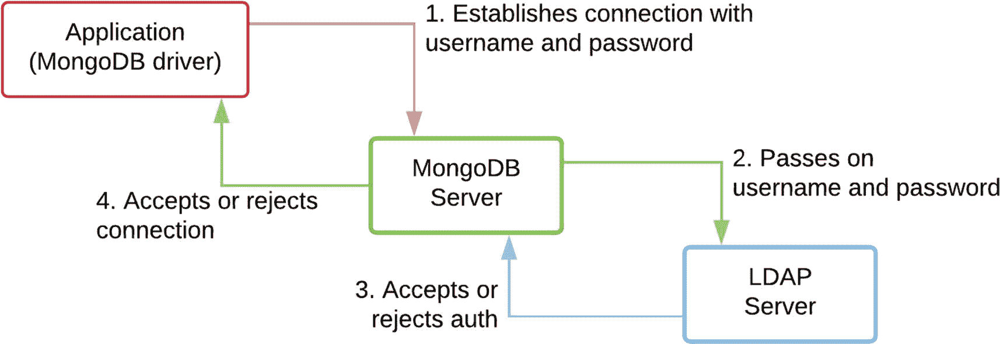
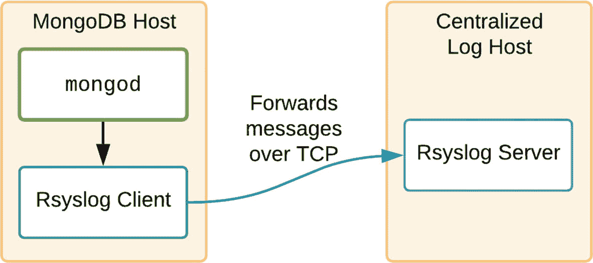

# 3. 安全

> *2016 年，美国研究公司 Cybersecurity Ventures 预测，到 2021 年，网络犯罪每年将给全球造成 6 万亿美元的损失，高于 2015 年的 3 万亿美元。*^(¹)

本章介绍与 MongoDB 集群设计相关的主要安全特性，包括如何在基础架构层面保护系统、对传输中和静态数据进行加密，以及如何通过应用程序代码和接口防范攻击。

最后，我们将探讨如何审计集群操作以及混淆日志，以便在不泄露数据库用户数据的情况下进行性能分析。

## 本地访问

保护任何 MongoDB 部署的第一步是确保对主机的访问仅限于受信任的用户。由于所有数据最终都存储在文件系统上，恶意系统用户可能损坏、窃取、劫持或破坏本地磁盘上的任何数据。

每个操作系统都有自己的方法来限制对机器的登录。通常，每个用户都有自己的认证凭据（密码或 SSH 密钥）并被分配到一个组。`mongod`进程及其二进制文件和数据文件通常以`mongod:mongod`身份运行，这是通过 RPM 存档在 Linux 机器上安装 MongoDB 时的默认设置。

作为系统管理员，您应始终遵循*最小权限原则*，例如，禁止通过 SSH 以 root 身份登录机器，限制`sudo`权限，并记录所有连接尝试（包括成功和失败的）以备后续审计。像 OWASP ([`www.owasp.org`](http://www.owasp.org)) 这样的安全资源提供了有用的工具和培训来帮助实现这一目标。

## 网络加固

MongoDB 在主机上运行后，需要与副本集或分片集群的其他成员进行通信（双向），并且需要接收来自其他可信源（如应用程序和 MongoDB Compass 等数据探索工具）的某些传入连接。我们稍后会介绍多层安全措施，但最基本的是，我们希望将访问限制在特定端口，并仅限某些远程主机。

如图 3-1 所示，所有副本集组件和驱动程序都需要能够建立出站连接并与所有其他组件通信，通常是跨数据中心的。



图 3-1
副本集中组件建立的连接


### 使用 iptables 的防火墙

大多数 Linux 发行版都预装了防火墙系统。我们将介绍最常见的一个：`iptables`。这是一个非常复杂且强大的防火墙系统，但正确配置可能比较困难。Red Hat Linux 在图形用户界面中包含了一些辅助工具，并提供了一个向导来帮助生成 `iptables` 规则列表。

实际上，你可以手动配置防火墙，使用一系列规则来允许仅与 MongoDB 集群的其他成员以及任何应用服务器、开发者机器，甚至最终用户主机之间的连接。

要允许来自受信任主机的传入连接，你可以在配置文件 `/etc/sysconfig/iptables`（以及 `/etc/sysconfig/ip6tables`）中添加条目，如清单 3-1 所示。

```
-A INPUT -s 12.34.56.78 -j ACCEPT
-A OUTPUT -d 12.34.56.78 -j ACCEPT
清单 3-1
允许受信任主机 12.34.56.78 的流量通过防火墙
```

这将允许与该受信任主机之间在任何端口上的任何流量（TCP 或 UDP）。为了增强安全性，你还可以将访问限制为仅使用 MongoDB 节点所用端口的 TCP 流量。此外，你可以限制出站流量仅为从远程主机建立的连接，如清单 3-2 所示。

```
-A INPUT -s 12.34.56.78 -p tcp --destination-port 27017 -m state --state NEW,ESTABLISHED -j ACCEPT
-A OUTPUT -d 12.34.56.78 -p tcp --source-port 27017 -m state --state ESTABLISHED -j ACCEPT
清单 3-2
仅允许活动 MongoDB 端口的 TCP 流量
```

你需要为部署中的每个主机配置这样一对规则，包括配置服务器、`mongos` 实例以及运行需要连接到数据库的应用程序的任何主机。

为了确保 `iptables` 正在运行，请使用以下命令重启它：

```
service iptables restart
```

如果你的网络或主机支持 IPv6，你可以同时配置 `ip6tables`，或者完全禁用该主机的 IPv6，并将 MongoDB 配置为仅绑定到 IPv4 网络接口。

对于较新的 Linux 系统，你也可以使用 `firewalld` 作为 `iptables` 的替代方案。两者都使用 `netfilter` 框架来实际处理数据包，但 `firewalld` 可以在已建立的连接上更改配置。对于在 Linux 上排查连接问题，`ss -plnt` 命令对于查看套接字统计信息非常有用。

在 Windows 上，你可以使用 `netsh` 在所有组件（所有 MongoDB 节点、分片和配置服务器以及应用程序）之间打开所有需要的端口。和往常一样，官方文档为你所使用的 MongoDB 版本提供了逐步示例。

### 使用 bindIp 限制接口

默认情况下，新版本的 MongoDB 将 `bindIp` 配置参数默认设置为 `127.0.0.1`。这意味着 `mongod` 进程仅监听来自 `localhost` 接口的传入请求，并忽略任何外部网络接口。这对于在开发机器上进行测试，或者将独立的 MongoDB 与 Web 服务器运行在同一云服务器实例上是合适的。要接受来自外部客户端的请求，你需要同时指定接口的 IP 地址，即网络分配给主机的用于路由外部流量的 IP 地址，通过设置：

```
net:
bindIp: 12.34.56.78
```

如果由于某种原因你的主机动态分配了随时间变化的 IP 地址，你可以通过添加以下内容让 MongoDB 绑定到所有接口：

```
net:
bindIp: 0.0.0.0
```

或者

```
net:
bindIpAll: true
```

注意：这可能会允许来自互联网的传入连接尝试。在添加外部接口之前，你应始终启用认证。

### 自定义端口

另一个小型的安全增强措施是在非标准端口上运行你的 MongoDB 部署。在分片集群中，默认情况下，承载数据的节点将在端口 27018 上运行，而 `mongos` 在 27017 上运行。通过将这些端口更改为不同的端口，可以阻止简单的恶意软件或端口扫描器发现正在运行的 MongoDB 实例。

可以在配置文件中通过以下方式进行配置：

```
net:
port: 37001
```

## 文件系统

在大多数 Linux 安装中，MongoDB 以用户 `mongod` 和组 `mongod` 的身份运行。因此，它会以这个相同的 `mongod` 用户身份创建所有数据文件和日志文件。数据文件和日志文件的路径也应由该用户和组所有，其他任何用户甚至不应具有读取权限。

可以通过在你的 `dbPath`（通常是 `/var/lib/mongodb`）上运行 `ls -l` 来检查当前的权限。

如果你创建了一个密钥文件来保护服务器，它也应由 `mongod` 所有，并且组用户甚至不应具有读取权限。这可以通过运行以下命令实现：

```
chmod 600 /path/to/keyfile
```

注意：没有文件级加密的情况下，任何对主机具有 root 访问权限的人都可以启动一个没有访问控制的独立 `mongod` 进程并读取数据。

### 认证

虽然网络安全是保护任何数据库的关键因素，但它只是安全环境的一个组成部分。来自已知来源的连接仍然需要加以限制，以防止受损主机远程访问数据。MongoDB 支持多种不同的认证方法，要求新的传入连接在执行任何数据库操作之前进行身份验证。

### 密码与密钥文件

强烈建议在 MongoDB 部署中使用基于角色的访问控制 (RBAC) 来创建用户，并且一旦开始在数据库中存储任何真实数据，你应至少创建一个用户账户。

像大多数数据库一样，你可以创建一个用户名和密码，该用户可以被授予访问多个数据库或集合的权限。用户可以被限制为某些角色，例如“只读”，或者仅限于能够配置副本集，但根本看不到任何数据。你应始终遵循“最小特权”原则，仅授予该特定用户完成其用例所需的角色。

注意：仅创建用户账户不足以在连接到 MongoDB 数据库时要求进行认证。你还必须显式启用认证。

可以通过在配置文件中添加以下行，然后重启 MongoDB 节点来启用认证：

```
security:
authorization: enabled
```

系统管理员可以通过在不带 `--auth` 参数或 `security.authorization` 配置的情况下重启 `mongod` 进程来临时禁用访问控制。如果忘记了管理员密码，这对于维护和密码重置很有用。

#### 使用密码连接

当从驱动程序或像 MongoDB Compass 或 Mongo shell 这样的数据浏览器工具连接到 MongoDB 时，你需要通过特殊字段或在 *连接 URI* 中以以下形式提供用户名和密码：

```
mongodb://[username:password@]host1[:port1][,...hostN[:portN]][/[database][?options]]
```

当在 URI 中指定包含特殊字符的密码时，它们需要被转义；当在命令行中使用时，它们应被双引号或单引号包围。

在部署中使用密码的一个问题是，脚本将需要存储密码以连接到 MongoDB。这是一个安全风险，因为密码以未加密的形式存在于脚本文件（和源代码控制）中，可能会出现在进程列表中（例如 Linux 上的 `ps`），并且可能不安全地存储在用户的个人计算机上。

如果你的组织有更严格的安全要求，你应该考虑使用 x.509 证书（稍后讨论）。

### Keyfiles

密钥文件本质上是一个存储在安全文件中的超长密码，由部署中的每个 `mongod` 节点引用。该密钥文件充当组件之间的“共享密言”，使它们在建立副本集或向现有集添加全新节点时能够进行身份验证。

如果没有这个共享密言，黑客可能将他们控制下的新空节点添加到现有副本集，并触发初始同步。他们将借此搭上 MongoDB 复制架构的便车来复制数据库。

这些文件的内容应视为密码，并在文件系统级别限制读取权限。任何获得其内容的人都可以伪造对副本集的访问，因此这是您部署的最低安全措施。

您可以通过如下所示指定路径并重启服务器，来指示 MongoDB 要求密钥文件进行内部身份验证：

```yaml
security:
  keyFile: /path/secure.key
```

请注意，设置密钥文件也会自动启用身份验证。

### x.509 证书

比使用密钥文件更优越但更复杂的方法是为您的服务器和客户端组件创建和部署 x.509 证书。

在撰写本文时，有一个方便免费的站点叫 Let’s Encrypt，它使得生成可用于 MongoDB 的 x.509 证书变得容易，但要求您的主机具有可公开寻址的 DNS 主机名。这些证书仅持续 90 天，因此您需要编写脚本来自动生成和更新它们。

虽然 x.509 证书可用于保护 MongoDB 集群组件*内部*通信的安全，但稍有不同的证书格式可用于*应用程序*客户端向集群进行身份验证。如果您选择使用此方法，那么每个连接的的不同用户账户都需要为其创建一个唯一的证书，并将用户名嵌入元数据中。

### Client authentication

MongoDB 具有独立的*身份验证*和*授权*子系统。身份验证可以使用内置的身份验证方法（称为加盐质询响应身份验证机制（SCRAM））执行，也可以通过支持轻量目录访问协议（LDAP）或 Kerberos 的外部身份验证系统执行。使用 SCRAM 时，用户及其凭据以加密形式存储在 `admin` 数据库中（并自动复制到部署中的所有成员）。

授权是在身份验证成功后的后续步骤，MongoDB 将在允许运行命令之前检查经过身份验证的用户的角色和权限。

可以根据需要，在数据库或集合级别授予授权。可以将多个预定义角色的权限相加以达到正确的组合。

**注意**

x.509 和 Kerberos 集成仅允许身份验证，而授权基于在 `admin` 数据库上创建的权限和角色。MongoDB Enterprise 还支持通过 LDAP 进行完整的授权——这样用户和角色都完全在 LDAP 服务器中定义。

#### External authentication

MongoDB 提供了多种类型的外部身份验证方法。截至本文撰写时，支持的方法包括 x.509、LDAP 和 Kerberos。LDAP 是一个标准的目录协议，具有许多开源和商业实现，例如 OpenLDAP、Windows Active Directory 和 Apache Directory Server。Kerberos 是一个用于大型客户端/服务器系统的行业标准身份验证协议，允许客户端和服务器相互验证对方的身份。在撰写本文时，Windows Active Directory 和 Apache Directory Server 支持 Kerberos。

大多数这些方法需要在 `$external` 数据库上创建用户，并在 MongoDB 内部定义角色和权限。外部源仅执行身份验证步骤。

使用外部身份验证时，是 MongoDB 服务器与外部身份验证服务通信，而不是应用程序直接通信（图 3-2）。



**图 3-2**

外部身份验证的步骤和通信

表 3-1 列出了支持的身份验证机制及其与身份验证和授权行为的关系。通过 `--authenticationMechanism` 配置机制的值显示在括号中。请注意，即使使用 Kerberos 身份验证，您仍然可以使用 LDAP 授权来将用户映射到角色。

**表 3-1**

可用的不同身份验证机制

| 机制 | 身份验证 | 授权 |
| :--- | :--- | :--- |
| SCRAM (`SCRAM-SHA-256`) | 密码在 MongoDB 内部加密 | 权限在 MongoDB 中定义。 |
| x.509 (`MONGODB-X.509`, external) | 用户已注册，但 MongoDB 中无密码。每个用户都有一个唯一的证书。 | 权限在 MongoDB 中定义。 |
| LDAP (`PLAIN`, external) | 客户端发送密码，但密码从不存储在 MongoDB 中。 | 权限在 MongoDB 中定义，或与 LDAP 协同工作以进行可选的授权（仅限 MongoDB Enterprise）。 |
| Kerberos (`GSSAPI`, external) | 用户已注册，但 MongoDB 中无密码。 | 权限在 MongoDB 中定义。 |

### Encrypted connections

即使您的所有 MongoDB 节点和应用程序都存在于同一个安全网络中，考虑加密所有通信仍然是一个好主意。这可以防止对进出 MongoDB 部署的网络流量进行窃听，并使您日后想要迁移时更容易横向扩展。例如，您可能希望逐渐从完全本地部署过渡到部分节点托管在云提供商上的混合解决方案。

对于任何生产用途，您应该已经为 MongoDB 部署考虑采用具有物理分离数据中心的多数据中心配置。即使使用 VPN/VPC，数据中心之间的同步几乎总是依赖于共享的互联网骨干网，因此加密连接对于保持数据安全至关重要。

MongoDB 社区版包含使用 TLS/SSL（传输加密）对*传输中*数据的完整加密。由于加密连接对于安全系统至关重要，最近版本的 MongoDB 默认移除了对较旧、安全性较差的 TLS 1.0 系统的支持。您可以使用来自官方*证书颁发机构*的任何有效证书，也可以使用 `openssl` 命令行工具从头开始构建自己的*自签名证书*。无论采用哪种方法，数据流都会被加密，但如果没有由第三方证书颁发机构签署的证书进行身份验证，您的通信可能容易受到所谓的*中间人攻击*。

即使您已为内部 MongoDB 通信配置了 TLS，您仍需要通过将 `?ssl=true` 添加到连接字符串来显式启用从应用程序到 MongoDB 的加密。如果您想要求所有客户端都使用 TLS 才能连接到您的 MongoDB 服务器，可以将此配置添加到您的 MongoDB 配置中：

```yaml
net:
  tls:
    mode: requireTLS
```

**注意**

在 MongoDB 4.2 及更高版本中，所有配置引用都从 SSL 更改为 TLS，例如：

`net.ssl.mode: requireSSL`

变更为

`net.tls.mode: requireTLS`

在生产环境中，您应该为 MongoDB 部署中的所有组件使用由*同一证书颁发机构*（无论是组织内部的还是受信任的第三方 TLS 供应商）签署的有效证书。


### TLS 1.2

一些组织有严格的规定，要求使用 TLS 1.2 加密所有连接。如果是这种情况，你可以通过在任何已启用 SSL/TLS 的 MongoDB 服务器上添加 `disabledProtocols` 参数来显式禁用 TLS 1.0 和 1.1：

```yaml
net:
  tls:
    disabledProtocols: TLS1_0,TLS1_1
```

在许多驱动程序中，你也可以强制传出应用连接使用 TLS 1.2。例如，使用 Java 驱动程序，你可以通过以下代码构建连接来强制执行 TLS 1.2：

```java
SSLContext sslContext = SSLContext.getInstance("TLSv1.2");
MongoClientOptions options = MongoClientOptions.builder()
    .sslEnabled(true)
    .sslInvalidHostNameAllowed(true)
    .socketFactory(sslContext.getSocketFactory())
    .build();
```

### 静态加密

默认情况下，MongoDB 将其数据以 snappy 压缩的 WiredTiger 二进制文件形式存储在磁盘上。如果未经授权的一方访问到这些文件（或其备份）且没有加密，他们可以轻松启动自己的本地 MongoDB 进程指向这些文件并启动一个禁用了所有认证的数据库。然后任何 MongoDB 客户端都可以连接以浏览或查询该数据。

为了防止此类攻击，任何包含真实用户数据的 MongoDB 数据库都应对静态数据进行加密。

静态数据加密可以通过以下两种方法之一解决：

1.  加密卷
2.  从应用程序加密

第一项可以通过文件系统上的磁盘加密来解决。如果你在主流云提供商上自托管，你应该能够访问利用内置主密钥管理服务的文件系统级加密。

或者，所有近期的企业版 Linux 发行版都包含全盘加密解决方案，例如 Linux 统一密钥设置磁盘格式（或 LUKS）。这也使用主密钥来加密整个存储卷或其子集。你应该将 MongoDB 数据文件存储在与根分区不同的卷上（以便进行针对性的性能调优），这也使得文件系统级加密成为一个实用的选择。

但是，如果你不想在卷级别加密，那么在数据库服务器内部加密是另一个选择。

幸运的是，静态加密是 MongoDB 企业版的一个可选模块。此加密过程完全自动进行。只有加密数据才会被写入磁盘，而未加密数据仅在主机的内存中可用。

> **注意**
>
> 应用程序崩溃时的任何核心/内存转储都可能包含未加密的 MongoDB 数据，因此在与第三方共享转储时要小心。

通过使用外部主密钥配置加密，并使用兼容密钥管理互操作协议（KMIP）的第三方密钥管理应用程序进行适当的密钥轮换，可以满足大多数数据隐私合规性法规的要求。

### 备份

你不应忘记确保所有创建的备份也已加密并安全存储。使用 `mongodump` 进行备份时，你可以写入到加密卷。如果使用 Ops Manager 进行备份，则需要兼容 KMIP 的密钥服务器才能对快照进行加密。

### 审计、日志混淆

自 MongoDB 2.6 起，企业版 MongoDB 已包含审计功能。在 `mongod` 或 `mongos` 实例上启用后，这允许数据库管理员跟踪复杂部署中的所有关键更改。在发生任何安全事件后进行事后分析或作为定期合规性检查的一部分时，这些审计日志可能至关重要。在这些情况下，审计日志可以显示用户角色的任何更改、创建的新用户或对生产数据库的意外访问。

社区版没有此审计功能的等效功能，尽管第三方已创建了一些解决方案，复制了一些基本功能，包括将输出过滤到特定用户、数据库、集合或源位置。

审计日志功能需要在 MongoDB 配置文件中显式启用，并且可以输出到文件、控制台或兼容的 `syslog` 目标，以便最终存储在集中式日志服务器上以增加安全性。激活后，默认情况下，它将为部署中任何用户的每个更改操作记录一个日志条目。也可以配置过滤器以简化审计日志。

清单 3-3 显示了一个简单配置的示例。

```yaml
auditLog:
  destination: file
  format: BSON
  path: /var/lib/mongodb/auditLog.bson
  # 清单 3-3
  # 启用 BSON 格式的审计日志记录
```

将审计日志存储在节点及其数据的同一文件系统上有相当大的缺点。例如，日志文件需要具有 mongod 进程的读/写权限。如果服务器被外部黑客甚至拥有凭据的员工攻破，他们可以通过从 `auditLog.bson` 文件中删除证据或完全删除文件来掩盖他们的痕迹，从而使事后分析变得不可能。

另一种方法是将审计日志通过 syslog 管道输出，并安装一个 *日志处理系统*，例如 rsyslog，它可以处理不同的日志生成源并将其输出到不同的目的地。这需要在 MongoDB 主机机器上设置一个 *Rsyslog 客户端* 和一个集中式的 *Rsyslog 服务器*，该服务器通过开放的 TCP 端口接受来自部署中每个主机的日志消息。从 MongoDB 端，这需要将配置设置更改为

```yaml
auditLog:
  destination: syslog
```


*图 3-3 审计日志消息发送到集中式主机*

> **注意**
>
> 一个独立的 MongoDB 部署实际上是 `rsyslog` 的一个可能输出目标，并且可以是集中来自复杂应用程序部署日志的一个很好选择，但最好将 MongoDB 审计日志保存在完全独立的架构中，以避免审计跟踪被篡改。

默认情况下，日志文件既不加密也不混淆，但企业版还有另一个功能，可以对可能泄露到日志文件中的用户数据进行编辑。要启用此功能，请在配置文件中设置

```yaml
security:
  redactClientLogData: true
```

或者在运行时通过以下命令启用：

```javascript
db.adminCommand(
  { setParameter: 1, redactClientLogData : true | false }
)
```

### 主动安全

对于任何安全网络，你应该已经建立了定期的物理和环境安全审查、漏洞扫描、渗透测试以及对网络或虚拟机异常流量模式的自动警报。这应该能够对任何安全漏洞进行快速干预。

MongoDB 在发布后支持大多数版本大约 2 年，并提供定期的安全补丁。你应该快速升级到任何次要版本（例如从 4.2.8 到 4.2.9），因为这些版本通常包含安全改进，但绝不会引入破坏兼容性的更改。你也可以考虑在最新主要版本发布后的 6 个月内升级到该版本，以受益于其他重大的安全和稳定性改进。

你还可以监控 [`www.mongodb.com/alerts`](http://www.mongodb.com/alerts)，关键警报和公告将会发布在那里。

### 服务器端 JavaScript


### 输入验证与注入攻击

由于 MongoDB 基于 JSON 文档，因此不存在传统 `SQL` `注入攻击`的风险。然而，当运行 JavaScript/NodeJS Web 应用程序（如 Mongoose ORM）或 API 时，存在 `JSON 注入攻击`的可能性。设想一个 API，它接受 JSON 文档作为查询的一部分。如果此查询被直接传递给 MongoDB 的 `find` 查询，恶意用户可能会利用 MongoDB 查询语言的技巧来查询属于其他用户的数据，这被称为“对象注入”。已知的攻击会结合使用 `$not` 和 `$ne` 来绕过常规检查。

假设你有一个登录界面，它接受 Web 浏览器输入，格式如下：
```
{user: 'nic', password; '123'}
```
并且这个输入被直接传递到类似下面的查询中：
```
db.users.findOne(query)
```
如果这个 `findOne` 返回了结果，我们就一步完成了用户认证和数据加载。这是减少一次到服务器往返的巧妙方法吗？不是。如果黑客转而发送：
```
{user: 'nic', password: {$ne: ''}}
```
或
```
{user: 'nic', password: {$gt: ''}}
```
即使黑客无需尝试猜测我的密码，这个查询也会向 `findOne` 返回一个文档。当然，这种攻击不仅适用于读取未授权数据。即使是从不验证 JSON 数据的应用程序进行的数据库插入和更新，也可能存在风险。

因此，对于在 API 查询中接受 JSON 文档的应用程序设计者来说，验证此类文档并以预期的数据类型提取值至关重要。

对于 NodeJS，有一些库如 `Joi` 可以提供帮助。其他选项包括使用 `JSON.parse`，使用像 `mongo-sanitize` 这样的 `npm` 包，或者在使用数据之前手动删除 API 输入中的任何美元符号或花括号。

### $where 操作符

`$where` 操作符是一个旧的 `find` 查询功能，它允许你向查询子系统传递一个包含 JavaScript 表达式的字符串或一个完整的 JavaScript 函数。显然，允许将 JavaScript 命令传递给 MongoDB 内置的 JavaScript 引擎是危险的，特别是如果存在这些命令可能来自未经验证的用户输入的风险时。

已经增加了各种安全改进和限制来约束其影响，但底线是这是一个非常危险的功能，几乎所有原始用例都可以通过其他更新、性能更好、更安全的 MongoDB 函数来处理。

即使在最新版本的 MongoDB 中，此选项默认也是启用的，但我们建议你在所有部署中将其禁用，方法是在配置文件中添加：
```
security:
  javascriptEnabled: false
```
或者使用 `--noscripting` 命令行选项。这也将禁用旧的 `mapReduce` 和 `db.collection.group` 功能——这两者都可以在你的应用程序中通过使用 `聚合管道` 来替代。

注意

如果你启用了 `SELinux`，则绝对应该禁用服务器端 JavaScript，因为任何需要 JavaScript 的操作尝试都将导致 MongoDB 段错误。

### SELinux

安全增强式 Linux（也称为 `SELinux`）是一个 Linux 模块，它提供了一种支持访问控制安全策略（例如强制访问控制）的机制。一旦启用，`SELinux` 可以通过限制对某些预先批准的目录、文件和网络端口的访问，来防止 Linux 主机上的任何单个程序/服务危及整个系统。

在设置 MongoDB 时，你可以在两种不同的模式下运行 `SELinux`。`宽容` 模式适用于调试你的配置，因为它将允许 MongoDB 尝试所有访问，但会记录每一次尝试。一旦你将 `SELinux` 切换到 `强制` 模式，它将阻止任何未授权的访问，并可能阻止你的 MongoDB 实例按预期运行。

你可以通过运行 `getenforce` 来检查当前模式，或使用 `sestatus` 查看完整状态。为了使强制模式成为系统启动时的默认模式，通常你只需要编辑 `/etc/selinux/config` 文件。

当通过预打包的 RPM 文件安装 MongoDB 时，有一些用于存储数据和日志文件的标准目录：

*   `/var/lib/mongo`（数据目录）
*   `/var/log/mongodb`（日志目录）

Red Hat Enterprise Linux 7（及其衍生版本）中包含的 MongoDB 默认 `SELinux` 配置假设使用相同的目录，因此如果你选择将 MongoDB 配置为在其他位置存储数据或日志，你将需要使用一系列命令手动更新 `SELinux` 权限。例如，如果你想将数据存储在新的分区 `/data/mongodb` 中，你需要运行以下命令以允许 MongoDB 正确启动和运行：
```
semanage fcontext -a -t mongod_var_lib_t '/data/mongodb.*'
chcon -Rv -u system_u -t mongod_var_lib_t '/data/mongodb'
restorecon -R -v '/data/mongodb'
```
同样地，要使用非标准端口进行绑定，你需要运行：
```
semanage port -a -t mongod_port_t -p tcp <端口号>
```
如果 `SELinux` 阻止你的 MongoDB 实例正确启动，它会将所有详细信息以自定义格式记录到本地 `/var/log/audit/audit.log` 文件中。如果你在配置 MongoDB 并启用 `SELinux` 强制模式时遇到任何问题，有一些工具和命令可以帮助你根据这个 `audit.log` 来解释问题。

`audit2allow` 可以帮助生成一组新的 `SELinux` 策略，你可以以比默认策略更高的优先级引入这些策略来覆盖它们。

或者，运行：
```
sudo sealert -a /var/log/audit/audit.log
```
将激活 `setroubleshoot` 客户端工具，通常会提供一些有用的见解和针对 `SELinux` 配置更改的建议。

付出额外的努力来启用 `SELinux` 并让 MongoDB 生产实例在强制模式下运行是非常值得的。如果可能，请坚持使用默认端口和目录路径，因为保持这些标准也将有助于新团队成员上手并简化任何后续的故障排除。

### 二进制监控

有一些解决方案旨在为在银行或医院等敏感企业中运行的关键应用程序增加额外的保护层。这些工具操作二进制代码，并用它们自己的函数替换某些操作（如内存分配）。其思路是监控和防止某些攻击途径。像 `Imperva` 这样的公司提供了声称与 MongoDB 兼容的工具，但根据我的有限经验，这些工具可能会增加不稳定性，并且其承诺的额外保护程度难以量化。

### 认证

`ISO/IEC 27000` 系列标准帮助组织保护信息资产安全。特别是 `ISO/IEC 27001`，它规定了一套最佳实践，并详细列出了与信息风险管理相关的安全控制清单。

虽然 27001 标准没有强制要求特定的信息安全控制，但它所建立的框架和控制清单使公司能够确保一个全面且持续改进的安全管理模式。

另一个流行的框架是支付卡行业数据安全标准 (`PCI DSS`)。即使你不存储信用卡数据，其核心要求也是一个很好的安全活动检查清单。

如果你的数据特别敏感，你的组织应考虑对你的安全实践进行认证。`MongoDB Inc.` 为 `Atlas` 提供的认证和白皮书是一个有用的参考，请参阅 [`www.mongodb.com/cloud/trust`](http://www.mongodb.com/cloud/trust)。


## 检查清单

总之，以下是保护 MongoDB 部署应采取的所有步骤的检查清单：

1.  启用身份验证（并创建具有完成其用例所需的最小权限的 MongoDB 用户），如果可用，请使用 Kerberos 进行外部身份验证。
2.  通过阻止来自所有非受信 IP/网络的传入连接并阻止所有非关键端口来保护网络基础设施。
3.  确保主机上的大多数用户只能读取而不能修改 MongoDB 数据或日志文件。
4.  配置所有组件之间的加密（内部身份验证、复制）以及使用定义明确的 x.509 证书从客户端进行的加密。
5.  使用文件系统加密或使用定期轮换的主密钥的应用程序级加密来加密静态数据（仅限企业版）。
6.  将审计日志发送到集中式日志服务器（仅限企业版）。
7.  编校日志文件，避免将敏感用户数据泄露到日志中（仅限企业版）。
8.  禁用服务器端 JavaScript。
9.  强制执行 SELinux。
10. 在不再需要时（即人员离开团队时）删除用户帐户。
11. 尽快升级到任何 MongoDB 次要版本，以利用安全修复。
12. 监控安全警报页面 [`www.mongodb.com/alerts`](http://www.mongodb.com/alerts) 以获取任何更新。

脚注 1   2

