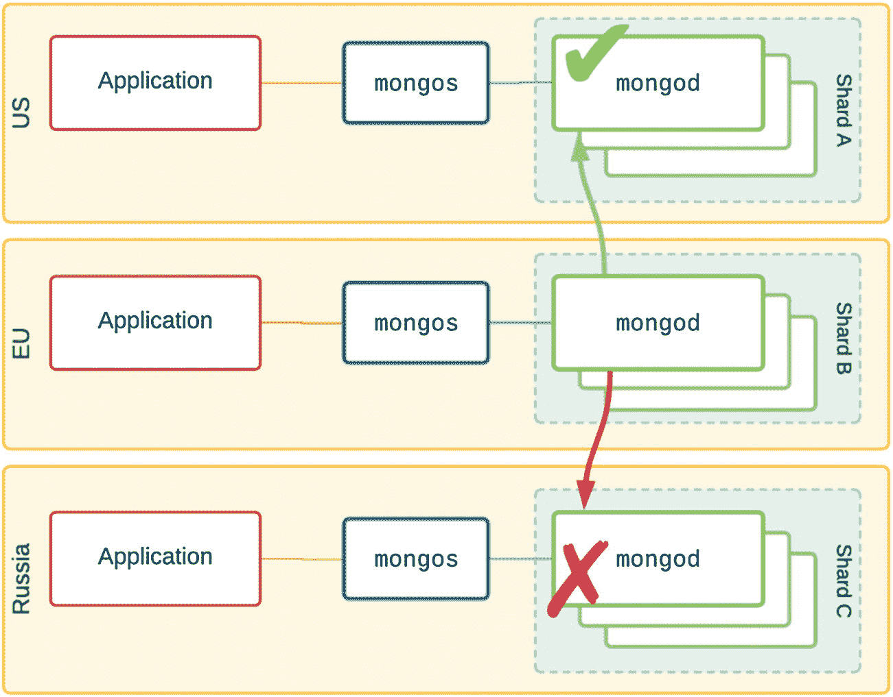
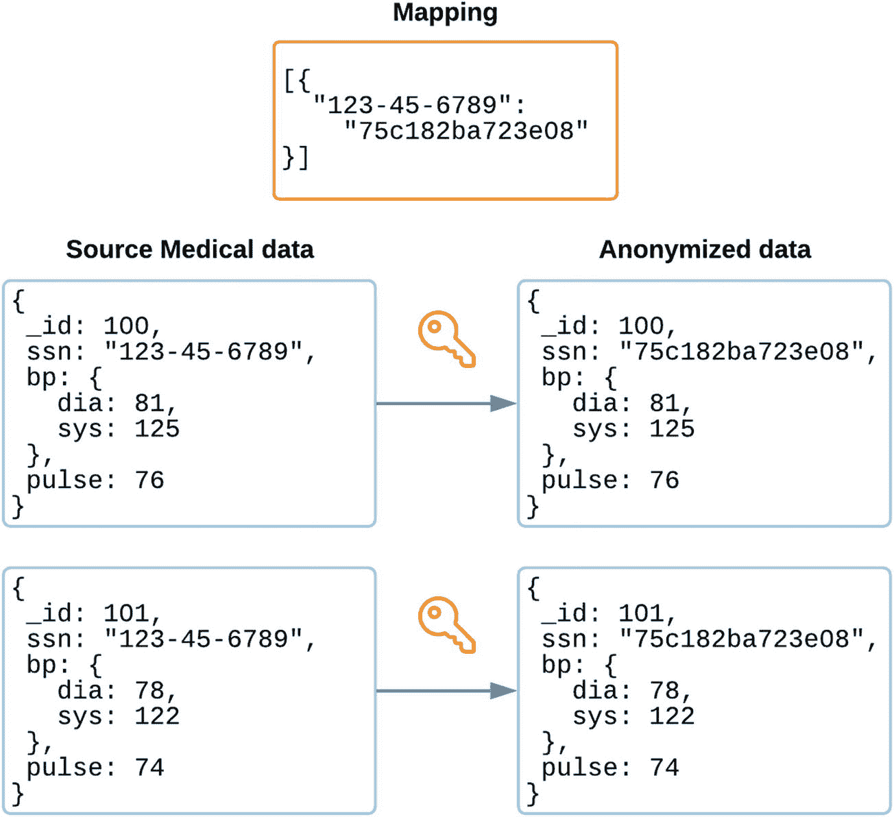
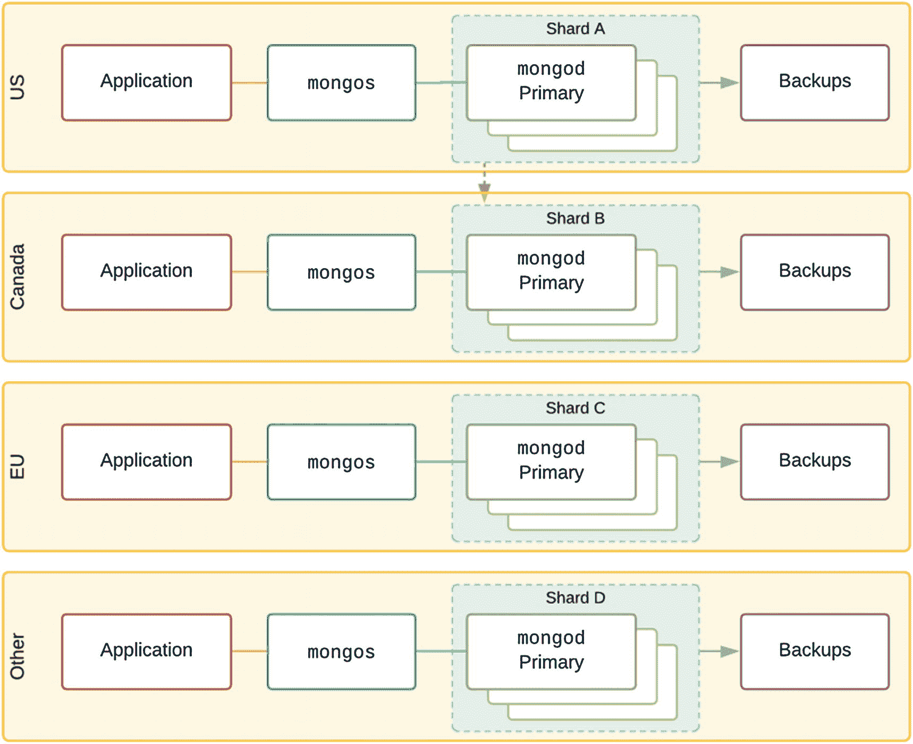
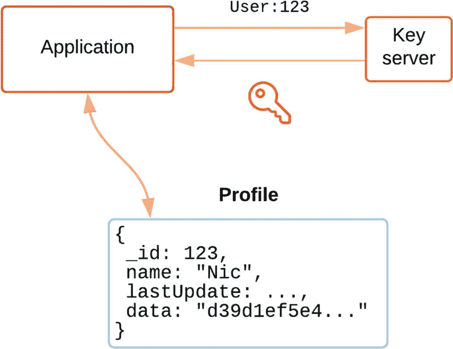

# 4. 合规性与 GDPR

> *依赖政府来保护你的隐私，就像要求一个偷窥狂来安装你的百叶窗。*
>
> ——约翰·佩里·巴洛，网络自由主义者、政治活动家、电子前沿基金会创始成员

> *将消费者隐私作为竞争差异化点的企业将赢得更高的客户忠诚度。*
>
> ——皮埃尔·南特梅，埃森哲董事长兼首席执行官

> *数据隐私已不再仅仅是律师们的事情。在领英，我们称之为隐私文化。*
>
> ——卡琳达·瑞纳，领英全球隐私主管

存储海量数据的能力为强大的分析洞察创造了机会。随着世界各地新数据保护法规的出台，它也给公司带来了合规和安全风险，因为数据通常被倾倒到数据湖或数据仓库中，而没有适当的标签、审计或策略执行。

MongoDB 提供了许多功能来减轻遵守隐私法规（如被遗忘权和导出个人数据权）的部分负担。其他义务，例如在 72 小时内通知用户其数据泄露的要求，则需要定制的 `业务工作流程` 和 `应用程序端准备`。

## 通用数据保护条例

虽然许多法规，如欧盟的 `通用数据保护条例` (GDPR)，看起来极其复杂，但实际上它们是许多行业最佳实践的法典化。尽管 GDPR 是一部基于欧盟的法律，但它适用于全球任何存储或处理欧盟公民数据的组织。不合规的罚款很高，最高可达 2000 万欧元或违规组织全球年收入的 4%，以较高者为准。不太严重的侵权行为仍面临一半的罚款。(³)

在本章中，我们将讨论在现实世界的 MongoDB 部署中存储用户结构化数据时的主要合规性问题。通过正确的设置，现成的 MongoDB 工具可以提供关于存储了什么数据以及如何使用这些数据的可见性和透明度。MongoDB Enterprise 和 MongoDB Atlas 包含额外的安全和隐私功能。

作为世界上最严格、最全面的法律规定，我们将以 GDPR 作为本章大部分讨论的基础，尽管我们也会探讨世界其他地区其他相关法规的显著差异。

### 隐私设计

在运行数据库时，隐私法规范了组织如何收集、存储、处理、保留和共享欧盟公民的个人数据，即使对于处理或存储欧盟公民数据的外国公司也是如此。

本章重点介绍 MongoDB 拓扑设计如何满足数据保护法规。我们涵盖了大多数法规的基本要求，以及某些 MongoDB 功能如何被用来，例如，根据角色隐藏特定数据，并作为“被遗忘权”的一部分删除用户数据。

### 注意事项

GDPR 要求有明确证据表明组织正在持续进行合规努力。这使得有必要持续监控您的数据处理实践，并充分应对任何新出现的隐私和安全风险，以确保数据保护流程持续有效。

免责声明

为确保遵守适用于您所在国家或业务所在国家/地区的任何类似 GDPR 的法律，您应直接审阅相关法律（例如 `GDPR (条例 (欧盟) 2016/679)`），并寻求法律咨询，以便在您的情况下正确应用这些法律。

## 数据保护

从高层来看，GDPR 涵盖了“被遗忘权”、“审查权”以及关于任何数据泄露或处理不当的“知情权”。

本节将深入探讨一些对于设计、架构或使用 MongoDB 实施数据收集、存储或处理的人员特别关注的问题。

## 关键概念

在深入细节之前，了解一些与全球所有数据保护法规相关的关键概念非常重要。

`数据控制者` 是指收集、存储和处理关于个人（称为 `数据主体`）以及其他公司数据的组织。`数据处理者` 是指执行处理工作的雇员、承包商或软件工具（如 MongoDB 或应用程序）。数据控制者有责任确保数据处理者有能力并配置为满足适用合规法规规定的所有隐私和安全要求。

对于任何拥有国际客户的组织来说，这实际上意味着他们需要遵循每个客户所在地区的法规。如果您的数据库中有欧盟客户，并且您在欧盟运营，那么您需要确保您的数据存储满足所有 GDPR 要求；否则，您将面临违规和处罚的风险。

### 个人身份信息

`个人数据` 是与可识别的个人相关的任何信息，但不一定识别该个人。另一方面，`个人身份信息` (PII) 是任何可能识别特定个人的数据。表 4-1 显示了哪些类型的数据是个人身份信息，哪些不是。

表 4-1

个人数据类型示例及哪些是 PII

| 个人身份信息 (PII) | 个人数据 (非 PII) |
| --- | --- |
| • 全名• 社会保险号码• 驾照号码 | • 设备 ID• IP 地址• Cookie |


## 数据隐私与 GDPR

### 定义

构成欧盟法规的法律术语有很多，这些将在后续章节中使用。表 4-2 定义了最相关的术语。

表 4-2：核心概念与定义摘要

| 术语 | 定义 |
| --- | --- |
| 实体 | 控制或处理数据的个人、法人团体、组织、公共机构、代理机构或团体。 |
| 数据控制者 | 决定个人数据处理的`目的`和`方式`的实体（可单独或与他人/公司/团体共同决定）。 |
| 数据主体 | 由识别性数据值所指向的已识别或可识别的自然人，也称为`用户`。 |
| 数据处理者 | 代表数据控制者负责处理个人数据的实体。该实体对任何数据泄露承担法律责任。在我们的语境中，数据处理者可包括 IT 团队负责人、应用程序开发人员、数据库管理员、QA 团队、发布经理和 DevOps 工程师。 |
| 数据保护官 | 组织内负责确保法规在内部得到应用，并保护数据主体免受处理操作不利影响的角色。 |
| 个人数据 | 任何能唯一识别个人的信息（例如，移动设备 ID），并且`与`可识别的个人`相关`。任何真正匿名（或完全匿名化）的数据不包含在 GDPR 或本文涉及的其他法规中。 |
| 标识符 | 任何单独或组合起来能够识别个人的`类型`数据，例如 • 姓名 • 社会保障号或税务档案号 • 位置数据 • 用户名 • 生日 |
| 在线标识符 | 标识符的一个特定子集，用于在线数据，例如 • IP 地址 • MAC（网卡）地址 • 浏览器 Cookie |
| 关联因素 | 关于个人的其他详细信息，如生理或遗传数据。 |
| 数据项 | 数据库中实际存储的关于某个人的字段`值`。 |

### 代表

GDPR 要求公司在欧盟设有当地代表，该代表承担确保法规得到应用和数据保护得到遵守的法律责任。这使得该代表在数据被滥用或误用时可承担法律后果，便于实施罚款和处罚。

## 数据可移植性

数据可移植性是数据保护法规领域中一个相对较新的要求，其设立是为了保护消费者免受*供应商锁定*的影响。该主题在 GDPR 第 20 条：数据可移植权（第 3 章）中有所阐述。

这意味着，公司必须能够在收到请求后，以结构化的、机器可读的格式提供或传输其收集的关于客户的全部个人数据。

通过 MongoDB 中良好的文档设计，在满足个人数据方面的这项要求可以相当容易。发现、识别和收集这些数据的难易程度可能取决于所选的架构设计和应用的验证级别。

提示

`MongoDB Compass`的"分析架构"功能可用于更轻松地找到`标识符`字段。

以 JavaScript 对象表示法格式导出任何相关文档，在机器可读性方面应该是足够的。

可以开发一个基于`聚合管道`的 MongoDB`视图`，使用`$lookup`来关联来自其他集合的相关文档，重新格式化某些字段，并排除其他字段。

## 数据大小

从客户的物联网设备收集的历史数据被视为个人数据，应可导出。在这种情况下，你需要能够提供或传输大量数据。以高效、紧凑的结构化和存储数据对于存储和带宽成本都很重要。

考虑使用*存储聚合*技术将较旧的数据聚合到精度较低的存储桶中，从而在不存储精确数据的情况下概括长期趋势。例如，你可能保留长达一个月的每小时数据点，然后只保留长达一年的日平均值。

## 个人数据的留存

GDPR 第 13 条（第 2a 款）规定如下：

> *控制者在收集* *个人数据* *时，应向* *数据主体* *提供以下确保处理公平透明所必需的进一步信息：（a）* ***个人数据*** *将被存储的**期限**……*

该条款要求数据控制者预先知道*个人数据将被存储的期限*，并将其传达给最终用户。你至少应该有一个在收集时为数据加时间戳的策略，以及一个轮换数据的方法。

### 自动移除

在实现自动移除旧数据的一种方法中，每个文档可以包含一个类似`dateCollected`的字段，并在该集合上针对该字段建立一个`生存时间索引`，以便在大约 12 个月后自动、完全地移除文档。

你应该谨慎处理批量删除，因为它们可能对复制过程产生性能影响，尤其是在 MongoDB 4.0 之前的版本中。大量操作在几秒钟内同时发生，可能会使 I/O 不堪重负，并暂时阻止其他操作。确保日期值的粒度足够细以避免这种情况（分钟级粒度通常效果良好）。另外，在将数据导入或迁移到 MongoDB 时，注意不要将大量文档的日期字段设置为同一个占位日期或导入过程开始的时间戳。如果生存时间索引在 12 个月后突然启动，这可能会像前面描述的那样阻止复制。

在代码清单 4-1 中，我们看到消息日志以分钟粒度级别存储，并有一个生存时间索引，该索引将在一年（365 天）后自动清除它们。根据系统的负载，这应该能创建足够小的批次，以避免停顿风险。

```
db.msglog.insertOne(
{ from: "nic", to: "sophie",
createDate: ISODate("2019-11-04T20:55"),
msg: "What’s for dessert?" });
db.msglog.createIndex(
{ "createDate": 1 },
{ expireAfterSeconds: 365*24*3600 } )
```
清单 4-1：用于一年后删除数据的生存时间索引

### 自定义编辑

清除个人数据的另一个选项是使用`cron`作业来启动更精细或自定义的旧个人数据清理。例如，你可以使用`$unset`更新命令在预定义的时间段后从文档中删除某些字段（参见代码清单 4-2）。

注意

MongoDB 的 Realm 无服务器平台包含"计划触发器"，允许在预定义的时间间隔执行任意 JavaScript 函数来清除、修剪或聚合文档。

代码清单 4-2 中的代码对收集的数据执行一种"滚动编辑"，清除`PII`字段，但保留其他字段，以便后续可以进行数据挖掘以寻找其他趋势和关联，而不会冒暴露存储的个人数据的风险。

```
db.msglog.insertOne(
{ from: "nic", to: "sophie",
createDate: ISODate("2019-11-04T20:55"),
msg: "What’s for dessert?",
metadata: {
deviceId: "34-A4-8C-71",
deviceName: "iPhone XS",
ip: "123.45.67.89",
gps: { lat: 48.86, long: 2.349 }
}});
db.msglog.update(
{ _id: ObjectId(1234...) },
{ $unset: {metadata: "" } )
```
清单 4-2：当不再需要时取消设置某些元数据


### 被遗忘权

全球大多数数据合规法规的另一个常见组成部分是，用户有权要求删除所有收集到的关于他们的数据。这涉及到与数据可移植性合规类似的许多数据发现技术问题。主要区别在于，数据需要被完全销毁，而不仅仅是导出。为了完全合规，备份中的用户数据也应被清除，或者个人数据的备份保留时间应限制在非常短的时间内。

> **注意**
>
> MongoDB 的字段级加密支持允许使用每个用户的密钥来加密个人数据。删除用户的密钥可以有效地销毁对该数据在实时数据库以及所有备份和副本中的访问。更多详情请参见 "*设计建议*" 部分。

#### 产品保证

在某些情况下，你可能仍然需要保留与订单相关的一些个人数据（例如，姓名、账单地址）。这些数据通常出于审计目的和保修要求（例如，退货或产品召回）而需要保留。

#### 避免使用带日期的集合

一些架构使用了一种反模式，即对相同类型的数据使用多个集合，并附加日期后缀。例如，旧消息在 30 天后会被移动到月度集合中。这会产生拥有大量集合的数据库，例如：

```
user_messages
user_messages_201909
user_messages_201910
user_messages_201911
```

这种方法不仅使得对历史数据进行聚合变得更加困难，而且大量的集合仅仅为了管理操作系统内部底层数据文件的文件句柄就需要大量的内存开销。

## 数据流

GDPR 第 45 条（第 1 款）引入了一个我们将称之为 "*数据流*" 的概念：

> *“****向第三国或国际组织传输个人数据****可以进行，前提是[欧洲]委员会已决定该第三国、该第三国内的一个领土或一个或多个特定部门，或所涉国际组织****确保适当水平的保护****。”*

GDPR 所做的一个重要区分是数据过境与数据传输之间的区别。"*数据过境*" 是指为了处理而临时传输数据副本，可以被认为是“运动中的数据”。而 "*数据传输*" 则是将持久数据存储永久性地重新定位到另一个物理位置，并且包括备份。

正如你所想的，数据传输在数据保护方面有着更高的要求，并在 "*数据存储*" 部分有所涉及。

### 处理数据

题为“处理合法性”的 GDPR 第 6 条允许一个包含地理位置个人数据的分片集群*临时*将一些包含个人数据的文档复制到另一个分片节点进行分析处理，例如在聚合管道中。但是，这仅适用于该远程位置在预先批准的地理位置内。例如，如果你有欧盟客户数据，并且一个集群的物理主机位于俄罗斯，那么甚至将数据过境到那里进行处理也是违规的（参见图 4-1）。



图 4-1

欧盟数据可在美国临时处理，但不能在俄罗斯处理

为了安全起见，你可以在每个国家配置部署带有`mongos`路由器和应用程序，并在本地执行任何必要的处理。这将在关于特殊配置的第 8 章以及关于高级和极限分片的第 10 和第 11 章中更详细地讨论。

### 端到端数据加密

在所有情况下，GDPR 要求数据必须以安全的方式进行通信，例如，使用最新的 TLS 加密版本和证书颁发机构来防止中间人攻击。

## 数据存储

个人数据存储的安全性和管理是全球大多数法规的主要考虑因素。本节探讨一些技术，用于在数据存储后保持其安全，或在收集期间通过混淆使其安全。

### 数据映射

大多数全球法规要求*数据保护官*（`DPO`）不仅要知道存储了什么数据，还要知道数据存储在**哪里**。例如，如果你在分片集群上存储个人数据，`DPO`必须了解分片键如何影响数据存储在哪些主机和数据中心。

这一要求还意味着*数据控制者*必须能够跟踪备份中的数据，并能够确认即使在这些数据（例如，“被遗忘权”）方面也符合法规。

重要的是要维护数据模式的最新文档，并知道哪些集合和字段包含个人数据、数据是什么格式、哪些文档需要在一定期限后清除，以及哪些数据应在特定时间后进行假名化/匿名化。

在这里，控制者可以使用像`MongoDB Compass`这样的工具进行数据探索和模式发现。识别无效数据值也很重要，因为如果这些字段构成分片键的一部分，它们可能会意外导致个人数据存储在意外的位置。

### 审核变更

MongoDB 企业版支持许多审计功能，这些功能对于保证没有未经授权的数据访问或用户访问权限的更改至关重要。审计子系统会将任何此类更改记录到单独的日志文件中，并允许将这些日志流式传输到安全的远程位置以防止篡改。

使用`Ops Manager`（随`MongoDB Enterprise Advanced`提供），数据控制器可以在数据库配置发生某些更改时自动即时收到警报。这对于向监管机构证明正在采取一切可能的措施来确保安全处理个人数据至关重要。

### 验证

MongoDB 对 `JSON Schema` 的支持允许数据库管理员为每个集合中的文档指定复杂的模式规则。通过要求某些标识符以特定格式存储（即所有社会安全号码都以相同的字符串格式存储，而不是部分存储为整数），它确保了如果曾有移除请求或需要通知用户有关数据泄露的情况，数据是可被正确发现的。

模式验证可以仅配置为警告，也可以配置为阻止将失败的操作（如插入和更新操作）。验证不会应用于预先存在的文档。可以使用 `$jsonSchema` 查询操作符来查找任何与最近添加的模式验证规则不匹配的文档。


### 伪匿名化

`伪匿名化数据`是指那些经过混淆处理，但其原始值保存在一个单独的查找表中的数据。这种处理方式允许将数据恢复到原始状态，并能重新识别出个体。

相比之下，`匿名化数据`会随机地将值替换为同一类型、真实且相似但没有任何相关性的数据，这意味着数据永远无法恢复到其原始状态。

伪匿名化在需要安全地在拥有各自独立数据库的临床中心之间传递患者相关数据等场景中是一个问题。某些法规要求对伪匿名化数据进行特殊处理，而完全匿名化的数据通常可以免于数据保护法规的约束。

在 MongoDB 中，可以使用基于`聚合管道`的`视图`来替换所有标识性的唯一键值（如社会安全号码）为一个人工标识符。这仍然允许进行某些分析，例如分组和跨整个数据库的跨集合引用，而不会暴露原始值。

当使用 MongoDB 作为数据分析或数据挖掘的数据源时，另一种在数据摄入阶段采用的方法是在“导入时”用伪名替换个人身份信息（PII）（参见图 4-2），这意味着可识别的个人数据从一开始就不会被插入到数据库中。


图 4-2
敏感数据被匿名化但允许恢复

本章后面的“视图”一节将详细介绍此问题的解决方案。

### 数据泛化

另一种从一开始就避免存储个人数据的方法是在数据插入数据库时进行`数据泛化`。例如，在设置`出生日期`字段时，只记录出生年份；对于`邮编`，只存储前几位数字，并将其余数字置零，以保留用于分桶的一般性信息，但无法追溯到原始用户。

在存储 GPS 位置时可以使用相同的方法。或者，可以给值添加一些随机的“噪声”，就像某些主要手机厂商在收集移动设备使用指标时所做的那样。通过将值略微更改为一个相似且仍然有效的值，可以在不侵犯用户隐私的情况下进行数据分析。

### 静态加密

公认的数据保护要求的一部分是确保数据在磁盘上存储时是加密的，这样即使文件被复制，其内容也无法访问。

MongoDB 允许使用 WiredTiger 存储引擎对所有数据文件进行原生加密。或者，您也可以使用存储层提供的加密功能，例如通过 Linux 上的加密 `LVM`（逻辑卷管理器），或使用 AWS 的加密 `EBS`（弹性块存储）卷。

有关加密选项的更多细节将在第 3 章中介绍。

### 备份

设计一个合规的 MongoDB 集群的另一个关键考虑因素是备份如何以及存储在何处。在撰写本文时，欧盟的`GDPR`是全球最严格的数据保护法规，因此最简单的方法是将所有备份存储在欧洲。这样，您可以自动为副本集设置每晚的简单`mongodump`，或者使用 MongoDB 企业级的`Ops Manager`工具，将分片集群的持续备份创建到特殊的备份节点中，并存储在物理位于欧盟境内的服务器上。MongoDB 托管的`Atlas`服务也允许您选择持续备份数据的存储位置，以满足您的特定需求。

随着其他法律的生效，例如加拿大的《个人信息保护与电子文件法》（`PIPEDA`）和加利福尼亚州的新法规，要同时满足所有法规将变得更加困难。全球集群（在第 6 章中解释）是一种特殊类型的分片集群，其中用户的数据存储在其物理位置附近，通常是为了最小化延迟。这种方法也意味着他们的数据可以存储在同一个国家（或司法管辖区内），从而更容易合规地备份数据（参见图 4-3）。


图 4-3
一个分片集群，每个分片的备份都存储在“本地”

### 世界各地的相关法规

欧盟的`GDPR`是迄今为止最著名、被讨论最多的数据保护法规，作为数据库架构师和管理员，我们必须关注。根据您的客户、业务和行业的所在地，还有许多其他正在生效的法规也可能需要关注。

许多新隐私法的一个共同点是，控制个人数据的实体必须能够从法律上证明其最初收集数据的目的是否合理。在我们的语境中，这意味着我们不应该收集所提供服务不需要的、多余的元数据。

### 美国医疗保健行业

《健康保险流通与责任法案》（`HIPAA`）是一项针对美国医疗保健数据行业的法规。该法案涵盖了基因数据，这些数据有时不可能被去身份化，因为研究需要确切的数值，但这些值同时也会识别出个体。在这种情况下，使用安全的外部密钥对数据进行加密至关重要。

### 加利福尼亚州

2018 年的《加州消费者隐私法案》（`CCPA`）于 2020 年 1 月 1 日生效，涵盖了在加利福尼亚州开展业务且持有超过 50,000 人数据的公司关于消费者权利的规定。这套法规与`GDPR`有许多相同的目标，并涵盖了许多相同的问题。

尽管`CCPA`**不是**以`GDPR`为蓝本或以相同方式构建的，但它包含了所有相同的最佳实践。

### 印度

在撰写本文时，印度正在制定他们自己的`GDPR`版本，包括访问和更正数据的权利、数据可携带权（即导出自己的数据）和被遗忘权等规定。目前，其权力与`GDPR`相比不那么极端。

然而，拟议的法律确实施加了严格的`数据本地化`规则，要求个人数据的存储和处理都必须物理上在印度境内进行。这与`GDPR`形成鲜明对比，后者允许只要满足条件（如安全的加密通信），数据可以临时`传输`到欧盟以外进行处理。

通过保留一个专门存储印度客户数据的分片，并将其主机放在印度的数据中心，即可满足这一本地化要求。本章末尾以及关于极端分片的第 11 章将进一步讨论这种方法。

如果印度的法律最终仅要求将实体个人数据的“镜像”副本存储在物理上位于印度的服务器上，那么使用位于印度数据中心的副本集节点即可轻松满足此要求。

### 加拿大

管辖加拿大的《个人信息保护与电子文件法》（`PIPEDA`）和《隐私法》涵盖了许多与`GDPR`相同的普遍权利，但具体性较低。

然而，重要的是要注意，加拿大的许多`省级`都有其各自实质性且广泛的隐私法规，这些法规与国家级法规大致相似，但往往有所扩展并进一步使其复杂化。


### 中国

中国拥有全球最多的互联网用户，但在撰写本文时，尚未出台一部全面统一的数据保护`法规`。

2018 年 3 月，中国国家标准化管理委员会 TC260 发布了国家标准《信息安全技术 个人信息安全规范》，为个人信息的收集、存储、使用、共享、转移和披露提供了指导。

该标准目前尚未导致法律或经济后果，但预计国家立法可能很快出台，届时可能要求使用和处理用户数据必须获得明确同意。目前似乎没有针对作为公司与客户合同正常部分的处理行为设定自动许可条款，因此`同意`要求将比 GDPR 更为严格。

就 MongoDB 而言，你可能至少需要在系统中为每个用户维护一个不同处理用例的数组，以便能够追踪谁已同意哪些活动。

### 俄罗斯

由于俄罗斯未被列入 GDPR 下提供充分数据保护水平的国家名单，因此自动将欧盟数据传输至俄罗斯进行处理（即使是临时处理）是不被允许的。在 MongoDB 方面，建议将数据存储和处理均置于欧盟境内，或者如后续章节所述，为欧盟和俄罗斯的个人数据保留独立的分片。

## 设计建议

在本节中，我们将介绍一些在应用程序设计阶段已被证明能最好地应对合规性问题的方法。

### 字段级加密

MongoDB 4.2 的一项新安全特性是客户端字段级加密（FLE）。随着官方驱动程序添加了对此的支持，这允许应用程序在数据通过网络发送之前，使用外部密钥`prior`对某些字段和子文档进行加密。其效果是，关键或敏感的用户数据仅对应用程序可用，永远不会以未加密形式到达数据库。即使入侵者以某种方式访问了正在运行的`mongod`进程内的实时数据（例如被称为`Meltdown`和`Spectre`的漏洞），字段值仍将保持加密状态。

应用程序通过一个`外部密钥存储`（不属于 MongoDB 的一部分）进行交互，以安全管理这些密钥，这增加了一层安全性，但也增加了复杂性。这种方法还有一个额外好处，即通过`mongodump`或 Ops Manager 进行的备份也是加密和安全的。

密钥不仅可以基于数据库或集合级别创建，甚至可以基于每个用户、每个文档创建。这使得从实时数据库和`所有备份`中永久擦除用户数据变得更加容易。

在图 4-4 中，我们可以看到一个应用程序检索每个用户的密钥，用于从用户配置文件中提取`data`子文档。对加密值的任何文档操作都需要此密钥。这意味着无法在此数据字段（或其子字段）上进行任何类型的服务器端聚合，因为 MongoDB 查询引擎基本上将它们视为二进制数据。



图 4-4

应用程序加密数据子文档

当使用`确定性加密`时，客户端可以对加密字段值执行相等性查询。另一方面，`随机加密`提供了更强的保密性，但限制了查询期间对加密字段的操作。

通过丢弃特定用户的旧密钥，实际上几乎不可能再解密那些加密值。正如你所见，这可以成为确保 GDPR 及类似合规性法规的“被遗忘权”要求的一种非常便捷的方式，因为它能即时且永久地锁定实时数据库和所有备份中的所有加密值。

### 视图

MongoDB 允许我们构建一个`视图`，其定义为一个多阶段聚合管道。通过利用一组不同的运算符，我们可以以标准方式转换集合中的所有文档，创建一个新的虚拟集合，该集合可以在组织内获得更广泛的访问权限，而包含完整数据值的原始集合则只允许受信任的少数用户账户访问。

在代码清单 4-3 中，我们看到一个视图，它获取了此集合中可用数据的“垂直”和“水平”子集。聚合管道首先根据客户的出生日期计算年龄，然后除以一年的毫秒数以得到以年为单位的年龄。

结果视图仅包含年龄超过 18 岁的研究参与者的文档，并排除了他们的姓名、社会安全号码、生日和确切的街道地址。这些视图保留了像`address.postcode`和`address.state`这样的字段，因此仍然可以进行基于邮政编码的分组或可视化分析，而不会泄露或恢复任何可识别身份的数据。

```javascript
db.createView(
"participants_adults_nonpersonal",
"participants",
[ { $addFields: {
age: {
$divide: [{
$subtract: [new Date(), "$birthdate"]
},
365.25 * 24 * 60 * 60 * 1000]
}
}},
{ $match: { age: { $gt: 18 }}},
{ $project: {
name: 0, ssn: 0, birthdate: 0,
"address.street": 0, age: 0
}}
])
```
代码清单 4-3
排除某些个人数据的视图定义

聚合管道阶段`$redact`是另一个强大的选项，可用于视图中，根据嵌套深度或同一文档中其他字段的值有条件地修剪文档中的字段。

### 独立的权限

视图本身被暴露为一个只读集合。`基于角色的访问控制`（`RBAC`）意味着可以为单个用户或组授予对视图的读取权限，但无权访问包含个人数据的底层源集合。该视图可以安全地与更广泛的受众共享以执行分析或报告，而没有暴露敏感信息的风险。

例如，在一项医学研究中，你可以授予一个名为`controller`的角色对原始`participants`集合的读取权限，以便只有受信任的用户才能看到完整数据。在代码清单 4-4 中，我们看到另一个名为`researcher`的角色只能被授予对派生视图`participants_adults_nonpersonal`的读取权限。这些研究人员永远无法看到标识性数值，但仍可以操作数据进行分析。

```javascript
use admin;
db.createRole({
role  : "researcher",
privileges : [
{
resource : {
db : "app1",
collection : " participants_adults_nonpersonal" },
actions  : [ "find" ]
}
],
roles : []
})
db.createUser({
user : "nic",
pwd : "securepassword",
roles : ["researcher "] }
)
```
代码清单 4-4
只能查询此视图的自定义角色和用户


### 数据泄露

除了主要风险外，个人数据从数据库泄露到其他位置还有一些其他潜在来源。

#### 分片

在分片集群中，个人数据存储在分片节点上。利用基于地理位置的分片，你可以控制数据的存放位置。在这种情况下，应避免选择包含用户数据字段（例如，社会安全号码）的分片键，如 `{country: 1, ssn: 1}`。因为这样，这些值将构成块边界的一部分，同时也将被记录在分片集群的 `config` 数据库中，而该数据库可能物理上位于另一个司法管辖区。

### 日志记录

默认情况下，MongoDB 会记录任何耗时超过 100ms 才完成的查询。记录查询时，包含具体值的完整查询语句会被写入日志，以便于重现和优化。然而，当查询涉及个人数据字段时，这些信息也会被记录到可能存在安全风险的日志文件中。

为了避免此类泄露（以牺牲少许性能为代价），可以通过在节点配置文件中设置 `security.redactClientLogData: true` 来指示 MongoDB 从日志中编辑掉任何字段值。

一旦设置了此配置参数，对类似 `{ "name" : "Nic", "SSN" : "123-45-6789" }` 文档的插入操作，将产生如代码清单 4-5 所示的日志行。

```
2019-10-07T11:10:02.321+0200 I COMMAND [conn2] command test.clients appName: "MongoDB Shell" command:
insert {
insert: "###", ordered: "###",
lsid: { id: "###" }, $db: "###" }
ninserted:1 keysInserted:1 numYields:0 reslen:45
locks:{ ... }
代码清单 4-5
经过编辑的日志输出，所有客户端值均显示为哈希值
```

### 最小化漏洞

人们很容易将安全漏洞想象成外部黑客通过网络基础设施中的安全漏洞或某个未修补的软件来获取数据库访问权限。相反，一些数据泄露可能简单到是不当处置硬盘驱动器，或者可能是由内部人员获取个人数据的未授权副本并将其出售给第三方造成的。

请记住，要妥善销毁存储设备，限制对所有数据库的访问，并在人员离开组织时立即撤销其访问权限。

## 总结

每个使用数据库存储个人数据的应用程序都应采用“隐私设计”原则。为帮助确保你的 MongoDB 数据库满足或超过全球数据保护法规的要求，表 4-3 列出了你需要考虑的主要问题。

表 4-3
MongoDB 的 GDPR 问题与解决方案摘要

| 要求 | 解决方案 |
| --- | --- |
| 合法且透明 | 请求许可，解释存储了哪些数据，并且只存储提供服务所必需的个人数据。记录每个用户给予的许可。 |
| 完整性和机密性 | 通过用户访问控制（例如，LDAP 授权）、x509 证书、加密的 TLS 1.2+ 连接、防火墙、静态数据加密、主机访问限制、加密的网络存储备份，甚至字段级加密来保护对实时数据库的访问。在 MongoDB 上启用审计功能以监控用户权限的任何变化。启用重要更改的监控告警，以便数据控制者能立即知悉任何问题。如果检测到任何违规行为，需同时通知主管机构和用户。 |
| 目的限制 | 确保存储的数据在所获许可的范围内；数据应被假名化或匿名化，或者被完全清除。 |
| 时间限制 | 数据保存时间不应超过必要时长，也不应超过向用户告知的时限。对实时数据使用 TTL 索引，并对个人数据备份进行滚动删除。 |
| 最小化存储数据 | 当数据不再对所提供的服务有用时，应予以裁剪，仅保留必需的数据（例如，用于税务审计或保修跟踪的购买记录）。 |
| 数据准确性 | 你有一个有限的时间窗口来根据数据主体的请求更新、更正和提供其个人数据，因此最好将数据保持良好的结构化，并存放在一个逻辑位置。 |
| 保护传输中的数据 | 对 MongoDB 节点之间以及与客户端应用程序（通过官方驱动程序）的通信进行加密，并使用 TLS 证书。 |
| 管理数据位置 | 使用国家级分片，将个人数据及其相关备份保留在数据来源国境内。 |
| 保护静态数据 | 在存储引擎内部加密数据，或加密整个文件系统。 |
| 被遗忘权 | 确保实时数据库和备份中的数据均被清除。考虑使用基于每个用户独立密钥的字段级加密。 |
| 限制敏感信息仅授权用户访问 | 启用使用 SCRAM、Kerberos、LDAP 等机制的身份验证和授权。使用视图来编辑敏感字段；根据年龄、居住国等标准跳过特定个人的数据。定义访问控制，将源集合的访问权限限制在少数可信用户。

