# 5. 基本拓扑结构

本章将根据可用数据中心的数量，介绍常见的部署拓扑结构。我们将讨论每种拓扑结构的限制，以及如何最优配置节点和备份以优化可用性。

## 引言

历史上，大多数人初次接触 MongoDB 都是在本地运行它。你可以非常轻松地免费下载 MongoDB 并将其安装在你的个人电脑或 Mac 上。通过 Mongo shell、像 Compass 或 Studio 3T 这样的可视化工具，或者通过某种编程界面，你可以在几分钟内就开始从 MongoDB 服务器读写数据。

本地 MongoDB 实例对于想要学习或进行实验的开发人员和研究人员来说非常棒，但不适合任何类型的生产工作负载。正如我们已经讨论过的，MongoDB 的一个关键优势在于其分布式特性。与 MySQL 或其他开源数据库相比，真正的革命性进步在于 MongoDB 能够如此轻松灵活地进行横向扩展以适应你的用例。

如果你是为单一地点的内部客户构建内部应用程序，那么位于单一物理位置的集群可能就足够了。相反，如果你正在构建一个面向全球受众的初创公司，你希望能够将用户的数据放置在尽可能接近他们的地方，以减少延迟并满足合规义务（第 4 章）。

表 5-1 快速概述了不同环境以及增加数据中心数量带来的收益。每一行都比上一行增加了额外的收益。

表 5-1
拓扑结构与用例摘要

| 环境 | 收益 |
| --- | --- |
| 单台独立服务器 | 用于原型设计、开发和简单测试的快速启动。 |
| 副本集，单数据中心 | 此时任何单台服务器故障都不会导致数据丢失或停机。 |
| 两个数据中心 | 此时即使整个数据中心永久丢失，数据也不会丢失。需要人工干预以恢复写入。 |
| 两个数据中心（加上云仲裁节点） | 此时即使整个数据中心丢失，应用程序也不会停机，并且仍然可以进行写入。 |
| 三个数据中心 | 此时即使整个数据中心丢失，应用程序也可以继续向多数节点写入，因此数据回滚永远不会发生。 |
| 地理位置数据中心 | 此时利用基于地理位置的分片，数据可以存储在靠近用户的地方，以减少延迟并遵守数据保护法规。


## 节点共置

在深入细节之前，理解在生产环境中将多个节点共置于单台主机上的缺点也很重要。在某些情况下，由于预算或管理限制，可能会倾向于在单台主机或虚拟机上安装多个 MongoDB 组件。在一个分片集群中，您可能会计划将配置服务器节点与分片成员安装在同一主机上，或者与 `mongos` 路由器安装在一起。

在单台主机上安装多个组件通常是个坏主意，因为它会使配置变得复杂（多个组件共享相同的主机名但使用不同的端口），并且可能使快速理解日志和诊断数据变得更加困难。

另一个问题涉及用于承载数据节点的 WiredTiger 缓存。默认情况下，此特殊缓存会保留主机近一半的 RAM。当一台主机上有两个节点时，就没有 RAM 留给文件系统缓存或操作系统了。

如果您必须共置节点，您将至少需要设置 `storage.wiredTiger.engineConfig.cacheSizeGB` 配置选项。更推荐的方法是改为每个节点使用一个独立的虚拟机。

## 组件间通信

由于 MongoDB 旨在作为一个分布式系统，在规划部署时，组件间的通信是一个关键问题。

### 连接与心跳

MongoDB 集群中的所有组件都需要能够相互通信，以同步数据、监控健康状况和可用性，并对变化做出反应。为了促进这种通信，每个节点、应用程序（通过驱动程序）和 `mongos` 路由器都会为其集合中的每个其他组件打开至少一个连接，以定期来回发送心跳消息。如果其中某个心跳出现延迟，则意味着某个组件可能承受着极大的负载。如果心跳完全丢失，则可能表明另一个成员由于负载或网络问题而不可用。如果一个 `主` 节点错过了心跳，则会触发故障机制，计时器开始倒计时，直到召集选举以选出替换节点。

### 路由

MongoDB 支持广泛的可能部署拓扑结构。为了实现这一点，有许多不同的设置和机制用于自动化查询路由，通过一种特殊类型的 `负载均衡` 来最大化稳定性和性能。

#### 发现

`服务器发现与监控` (SDAM) 规范定义了所有官方应用程序驱动程序如何连接和监控复杂的 MongoDB 部署。它规定了驱动程序如何适应部署中的变化，例如节点离线、主节点降级以及网络错误。它有助于确保所有驱动程序（无论使用何种编程语言）都能以一致、可预测的方式做出反应。

#### 服务器选择算法

另一个规范是 `服务器选择算法` (SSA)，它描述了一种智能负载均衡。SSA 包含在驱动程序规范中，并且所有官方 MongoDB 驱动程序都遵循该规范。

此算法控制驱动程序（在应用程序空间内部）如何决定将操作路由到您的 MongoDB 部署中的哪个位置。当使用副本集工作时，此算法决定查询是发送给主节点还是从节点。当与分片集群通信时，它将决定使用多个 `mongos` 节点中的哪一个。

图 5-1 显示，位于数据中心 1 的应用程序可能会使用同一个数据中心内的 `mongos`，但不会使用数据中心 2 中的 `mongos`，因为延迟太高。数据中心 1 中的 `mongos` 将根据请求的读取偏好，将查询路由到数据中心 1（而不是数据中心 2）的主节点或从节点。

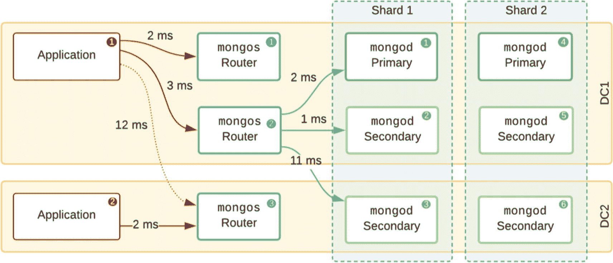

图 5-1 分片集群中的服务器选择

#### 分片路由器 (mongos)

任何分片集群都应包含多个 `mongos` 路由器节点，并且 `所有` 节点都应在应用程序的 `连接 URI 字符串` 中列出（因为它们并非设计为自动被发现）。

拥有多个节点的主要目的是在某个路由器节点完全故障时允许进行故障转移。然而，驱动程序内部的一个自动 `性能` 机制也是激活的。此机制监控 `mongos` 池的 `往返时间` (RTT) 延迟。它会根据可用的最佳 `mongos` 节点确定一个可接受的延迟“窗口”。然后，驱动程序会将查询路由到此延迟窗口内的任何 `mongos`，从而有效地在它们之间分配工作负载。在负载异常高的时期，这种分配对于确保没有单个 `mongos` 过载至关重要。

提示：如果您想强制应用程序在所有 `mongos` 之间均匀分配负载，即使那些延迟较高的节点也包括在内，那么请在连接字符串中将 `localThresholdMS` 设置为一个较高的值。

#### 副本集节点选择

根据最佳实践，您的副本集节点应分布在多个数据中心上，这使得地理上接近的节点与远程节点之间的延迟可能非常不同。由于写入总是发送到主节点，您可以在（副本集配置中）使用更高的 `priority` 值，以便在与您的应用程序服务器相同的数据中心中选举出主节点。

虽然不是默认行为，但也可以对从节点执行读取操作。这正是某些巧妙设计可以在特定情况下实现可扩展解决方案的地方。MongoDB 驱动程序支持一系列读取偏好，如表 5-2 所述。

表 5-2 副本集读取偏好

| 偏好 | 说明 |
| --- | --- |
| `primary` (默认) | 所有读取操作都发送到主节点。 |
| `secondary` | 所有读取操作都发送到从节点。如果当前只有主节点可用而没有从节点，这些操作将停滞。请改用 `secondaryPreferred`。 |
| `nearest` | 驱动程序将与任何在最低往返时间 (RTT) 窗口内的节点（主节点或从节点）通信。 |
| `primaryPreferred` | 驱动程序将在可能的情况下从主节点读取，但如果主节点不可用，则将回退到从节点。这对于需要在 `网络分区` 期间运行的应用程序是推荐的。 |
| `secondaryPreferred` | 驱动程序将在可能的情况下从从节点读取，但如果从节点不可用，则将从主节点读取。这是一个比 `secondary` 更稳健的选择。 |

对于除 `primary` 之外的所有读取偏好选项，驱动程序都可以在多个节点中进行选择，并且在所有情况下都可以提供 `maxStalenessSeconds` 或 `标签集` 来控制选择。

通过在连接 URI 中指定明确的 `maxStalenessSeconds`，驱动程序将排除任何 `复制延迟` 超过此值的节点。这允许客户端安全地从从节点读取，并且尽管知道他们读取的是过时的数据，但返回的文档最多只会比主节点落后几秒钟。


### 标签集

在特定节点上指定*标签集*可用于（i）在副本集内为基本的地理定位指定特定物理位置，或（ii）在从节点读取时控制特定的读取工作流。

例如，您可以将所有分析工作负载发送到一个延迟较高的遥远数据中心（`DC2`），让`DC1-a`和`DC1-b`中较近的节点分担正常的读取工作负载。图 5-2 显示，虽然写入总是会发送到主节点，但当应用程序指定了`{use: "analytics"}`的标签集时，读取操作将发送到`DC2`。

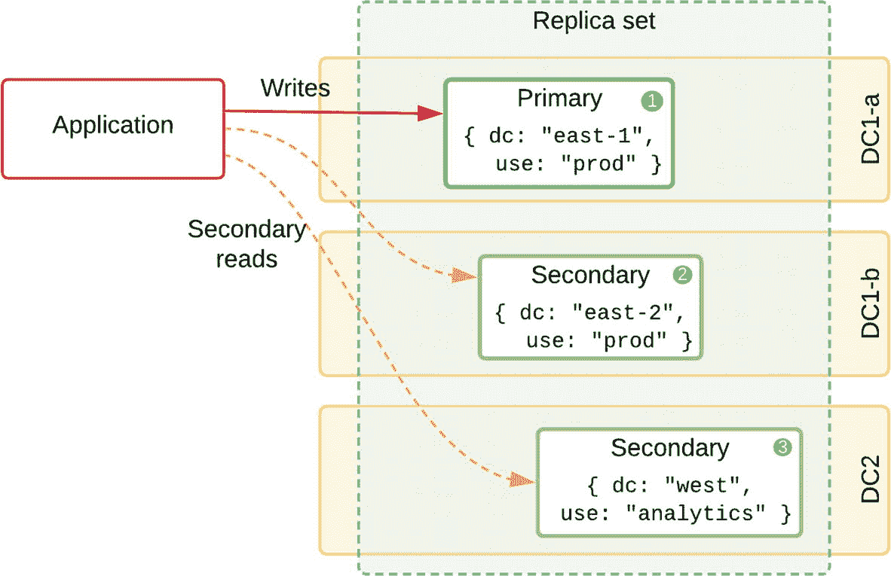
*图 5-2. 在所有节点上定义了标签集的副本集*

可以使用 `rs.reconfig(...)` 方法并传递更新后的配置文档（如清单 5-1 所示）来定义和更改标签。

```
{
"_id" : "myRS",
...
"members" : [
{ "_id" : 0, "host" : "mongodb0.bigbank.local:27017", ...,
"tags": { "dc": "east-1", "use": "prod" }, ... },
{ "_id" : 1, "host" : "mongodb1.bigbank.local:27017", ...,
"tags": { "dc": "east-2", "use": "prod" }, ... },
{ "_id" : 2, "host" : "mongodb2.bigbank.local:27017", ...,
"tags": { "dc": "west", "use": "analytics" }, ... }
],
...
}
```
*清单 5-1. 包含区域和用途标签的副本集配置*

要实际使用这些标签，应用程序需要按照特定顺序设置读取偏好标签，以便驱动程序解析和使用。在清单 5-1 和 5-2 中，我们看到一个针对节点 `mongodb2.bigbank.local:27017` 的示例，因为这是唯一具有匹配 `use` 标签的节点。如果应用程序发送了多个标签，将按顺序尝试每个标签，重叠最多的标签将优先被选中。

```
db.transactions.aggregate([...]).readPref( "secondaryPreferred",
[ { "use": " analytics " } ] )
```
*清单 5-2. 使用标签定位分析从节点的聚合操作*

## 写关注点

虽然写入总是会被路由到主节点，但当使用自定义*写关注点*时，驱动程序会等待其他节点确认写入操作已持久化，然后才向应用程序报告成功。例如，写关注点为 `2` 时，要求主节点和至少一个从节点在继续操作之前已复制该写入。这允许应用程序为每个用例选择自定义的持久性级别，并在不牺牲所需持久性的前提下最大化性能。MongoDB 驱动程序默认的写关注点为 `1`，但对于所有生产用例，建议使用写关注点 `majority`。

在图 5-3 中，我们看到一旦一个从节点（`3`）复制了操作日志条目，主节点就立即将 **Ack** 发送回应用程序。另一个从节点（`2`）将尽快复制，但应用程序不会等待它。

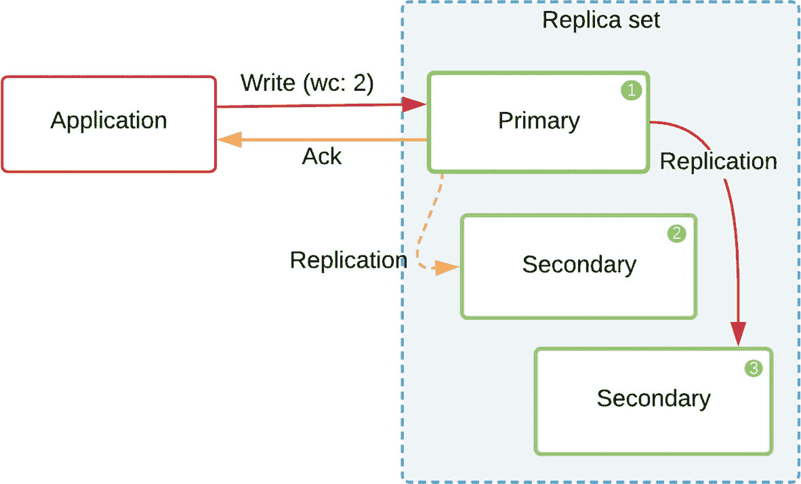
*图 5-3. 写关注点：2 要求 2 个节点确认更改*

### 日志记录

一个额外的选项 `j` 允许应用程序请求服务器等待，直到写入操作已写入磁盘日志。如果此选项设置为 `false`，则一旦更改在内存中应用，写入就会被确认返回给应用程序，但不一定写入磁盘。当设置为 `false` 时，应用程序可能会获得稍快的响应，但如果主机突然故障，则存在完全丢失该写入的风险。当未指定 `j` 时的默认行为将取决于所使用的写关注点，并且可能在不同版本之间发生变化。

**警告**

对于生产环境部署，永远不应设置 `{j: false}`。日志写入通常非常快，并且可以通过将其放置在自己独立的存储卷上进一步优化。

#### 超时

您可以选择为写关注点设置一个以毫秒为单位的 `wtimeout` 时间限制。如果超时（例如由于高复制延迟），确认信息将作为失败报告回应用程序。然而，此操作在此超时后不会自动终止，并且可能最终在服务器端成功。

这可能会给应用程序逻辑带来显著的混淆和复杂性，因为开发人员可能会假设数据已丢失。最好避免此选项，而是使用可重试的读取和写入（稍后讨论）。

### 自定义持久性

应用程序可以将写关注点与标签集结合使用，以控制哪些节点应该确认写入。这可用于控制某些节点上的复制延迟（即，使一个从节点在任何时候都没有有效延迟），或确保不同数据中心中的两个节点持久化每次写入。

这对于节点分布在多个区域的配置（如图 5-4 所示）尤其重要。这里，我们假设 `DC1-a` 和 `DC1-b` 是同一城市中的两个建筑，而 `DC2` 位于另一个城市。由于*节点 2* 与主节点在同一区域，其延迟较低，通常复制更快。在网络压力或网络不稳定时期，您可能会遇到应用程序返回写关注点 `2` 成功，但远程数据中心的复制滞后了几分钟的情况。如果整个 `DC1` 区域一起发生故障，最后几分钟的写入将会丢失。

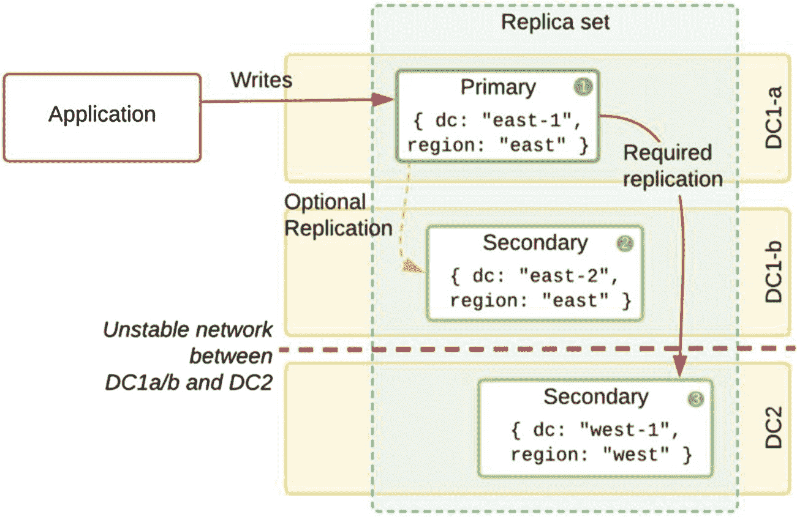
*图 5-4. 不稳定网络导致远端节点出现不可接受的延迟*

为了确保写入被复制到至少两个独立的区域，我们可以定义一个名为 `multi_dc` 的自定义写关注点级别，该级别要求标签 `region` 具有两个不同值的节点：

```
conf = rs.conf();
conf.settings = {
getLastErrorModes: { multi_dc : { "region": 2 } }
};
rs.reconfig(conf);
```

然后，应用程序可以在重要的插入或更新操作中使用此自定义的 `multi_dc` 写关注点，以强制在两个区域都进行更新：

```
db.collection.update( { _id: 123, status: "Important" },
{ writeConcern: { w: "multi_dc" } } )
```

在此示例中，当时三个节点中哪个是主节点并不重要，我们总是会将更改复制到 `DC1` 和 `DC2` 两个区域。

## 读关注点

一个相关的概念是读关注点，它允许您控制从副本集和分片读取操作的一致性和隔离性。例如，一个系统如果专门使用写关注点 `majority` 和读关注点 `majority`，就可以确保返回的数据已被副本集的大多数成员确认。换句话说，读取操作返回的文档是持久的，即使在任何成员发生故障的情况下也是如此。


### 单数据中心

在单数据中心拓扑中，我们的选择有限，但可以通过构建包含多于三个成员的副本集来最大化可用性。例如，我们可以使用七个成员来构建副本集。

我们可以通过将每个节点放置在其独立的物理主机上来增加额外的防护措施。每台主机应放置在独立的机架上，最好在不同的电源回路上，并配备独立的备用电源。

**警告**

位于不同虚拟机（VM）但共享同一底层虚拟机主机的节点，若该虚拟机主机发生硬件故障，将会一起失效。

每台物理主机应具备 `冗余网络`。这可以通过 `网络绑定`（也称为 `链路聚合`）来实现。有多种不同模式可用，包括提供负载均衡的轮询均衡器（round-robin）和仅提供容错的“主备”（Active-Backup）模式。在大多数现代 Linux 发行版中，可通过 `modprobe` 启用；在 Debian 系统上，可使用 `ifenslave`。你应与网络管理员确认，确保你的网络交换机支持网络绑定。

避免在 MongoDB 节点的数据卷上使用 `共享网络存储` 解决方案。这种方法意味着所有副本集成员的数据实际上都存储在同一个存储解决方案上。更安全的做法是使用如 `NVMe` 驱动器这样的快速本地存储，每台主机独立配置。

`备份` 应尽可能频繁地进行，并以加密状态存储在安全的云提供商处。如果使用 MongoDB 企业版，Ops Manager 可提供带时间点恢复的持续备份。

你应定期测试从备份中`恢复`，以确认工作流程并确保集群能在恢复时间目标（`RTO`）内恢复。

然而，总的来说，对于任何生产用例，单数据中心风险过高。区域性电力故障总会导致停机，而火灾则可能轻易导致数据完全丢失。

### 双数据中心

使用两个数据中心时，你有机会让每个数据中心至少保留一个承载数据的节点。在图 5-5 中，我们看到一个分布于两个数据中心的 `PSS` 或 `PS|S`（主-从-从）拓扑。这样，在某个数据中心完全故障的情况下，仍然拥有整个数据库的完整且最新的副本。

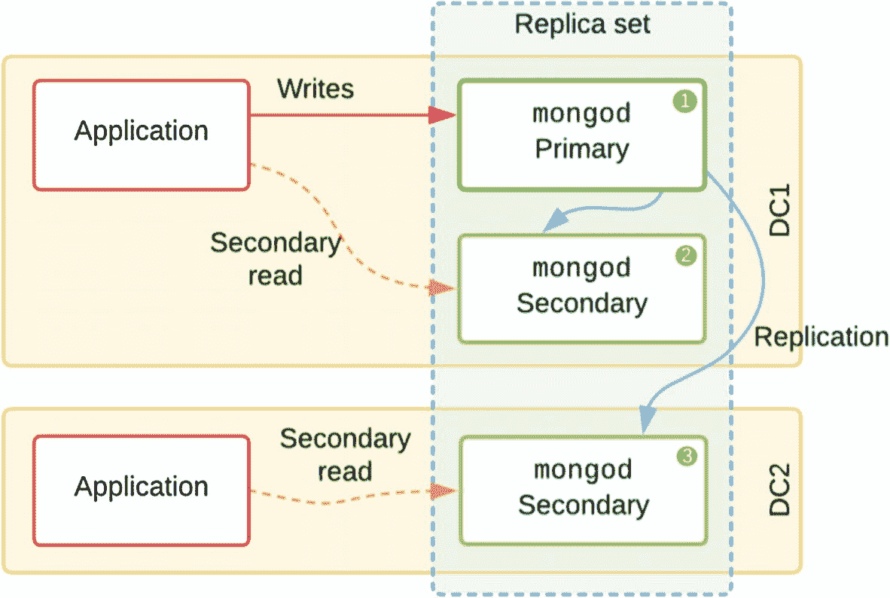

图 5-5：最佳的双数据中心配置

在此配置中，如果 `DC2` 完全故障，`DC1` 维持了多数节点，可以继续承载主节点。然而，如果 `DC1` 故障，则只剩下三个节点中的一个，位于 `DC2` 的剩余节点无法自行选举为主节点并接受写入。因为它不知道是仅仅是 `网络分区`，还是 `DC1` 中已存在主节点，所以它必须保持从节点状态。`DC2` 中的应用程序仍可读取陈旧数据，但如果尝试任何写入操作将会超时。

### 双数据中心（外加云仲裁节点）

如果你只有两个数据中心可用于存储生产数据，你可以使用云提供商上的远程 `仲裁节点` 作为公正的投票者，以避免集群中的“脑裂”情况。

如果安全策略不允许使用云提供商，则可以使用位于远程地点的第三个私有数据中心，即使它通常因容量较低或高延迟而不适合承载数据节点。

正如我们在第 1 章讨论的，`仲裁节点` 不会复制或存储任何用户数据。因此，它的网络带宽和存储要求非常低，并且不构成数据保护法规的风险（第 4 章）。它的唯一目的是通过确定哪些承载数据的数据中心当前可从网络其余部分访问，来参与选举。

所谓的 `PSA`（主-从-仲裁）配置有一个主要问题，即你的应用程序无法在数据中心故障时启用多数写入并继续运行（见图 5-6）。如果任一数据中心不可用，则只剩下一个承载数据的节点，多数写入将一直超时，直到该 `DC` 恢复。

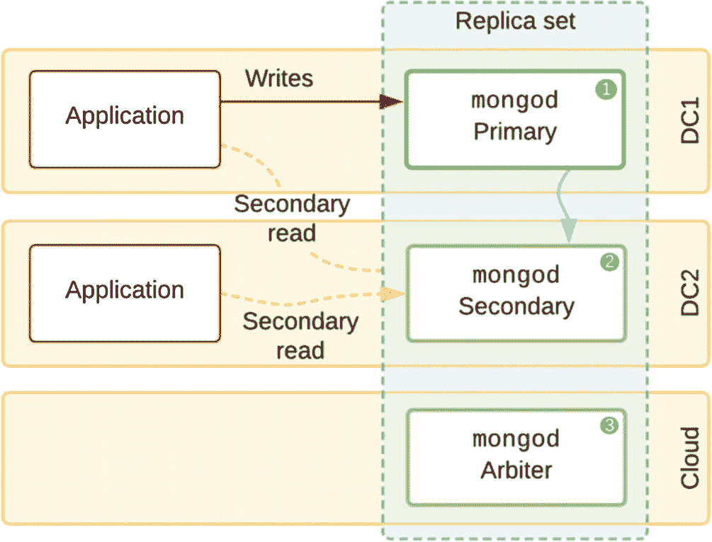

图 5-6：云中的仲裁节点，但不具备安全的多数写入能力

**警告**

当承载数据的节点宕机时，仲裁节点会引入许多不良的边缘情况（特别是对于读关注级别 `majority`），在生产环境中应尽可能避免使用。

一个稍微安全的选择（图 5-7）是使用一个五成员集，写关注级别设为 `3`（而不是 `majority`），并且在每个数据中心有两个承载数据的节点。在这种情况下，当单个承载数据的节点故障时，写关注级别仍允许写入。然而，如果任何一个完整的 `DC` 故障，我们再次无法安全地向部署中写入数据。

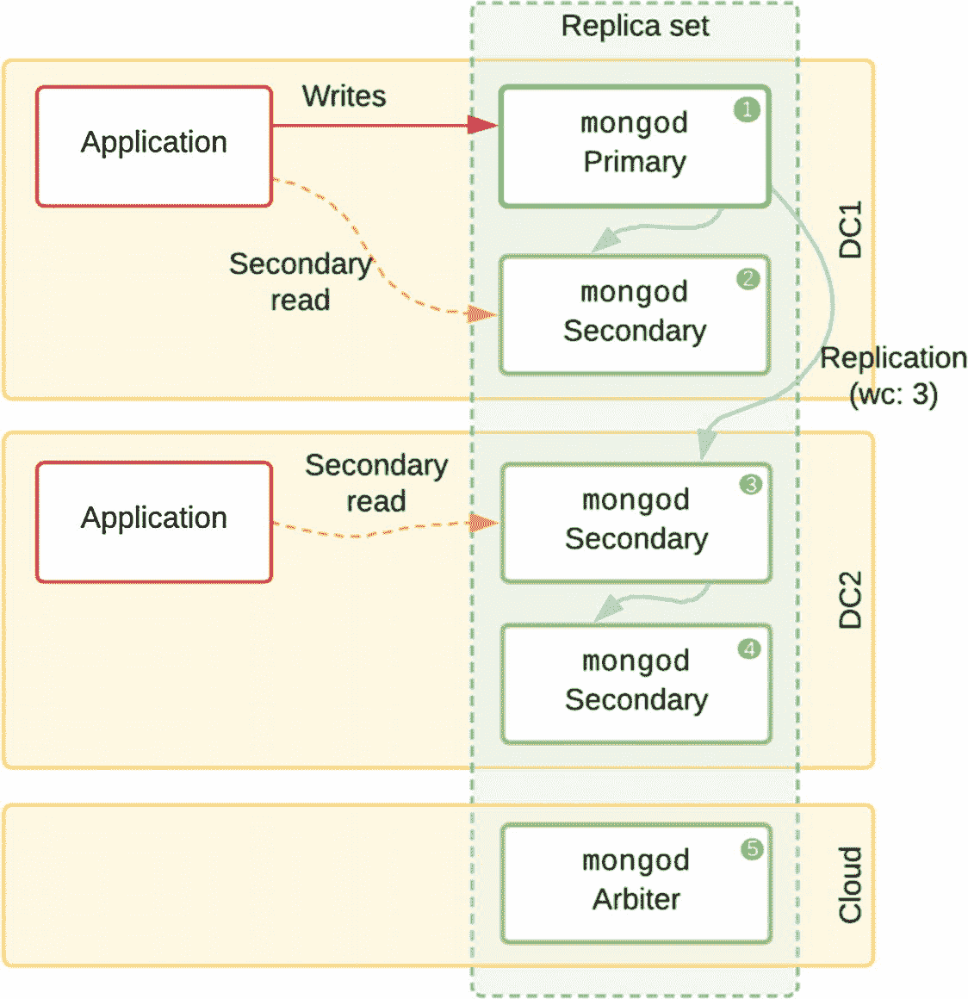

图 5-7：一个 `PSSSA` 拓扑，仲裁节点在云中，写关注级别为：3

这种拓扑结构还有另一个好处。因为一个从节点与主节点位于同一 `DC`，它将具有非常低的延迟，应该能更容易地跟上复制速度。如果主节点突然故障，`mongod` 通常会先复制写入操作，并且能够比任何远程成员更快地接管主节点角色。

#### 手动干预

假设我们有一个 `P|S|A` 拓扑，并且由于该地区的大规模电力故障，两个数据中心之一变得不可用。位于第三个位置的 `仲裁节点` 保留了投票者的法定人数，因此主节点可以保持主节点状态。然而，现在只有一个承载数据的节点可用。任何请求写关注级别为 `majority` 的写入操作都将被阻塞，等待第二个承载数据的节点确认更改。

请注意，`仲裁节点` 的 `优先级` 始终为 `0`，因为它没有数据，所以永远不能成为主节点。

为了本节的目的，让我们考虑一个 `PSA` 副本集的默认配置。

```
{
"_id" : "rs0",
"version" : 1,
"protocolVersion" : NumberLong(1),
"members" : [
{
"_id" : 0,
"host" : "mongodb0.example.local:27017",
"arbiterOnly" : false,
"hidden" : false,
"priority" : 1,
"votes" : 1
},
{
"_id" : 1,
"host" : "mongodb1.example.local:27017",
"arbiterOnly" : false,
"hidden" : false,
"priority" : 1,
"votes" : 1
},
{
"_id" : 2,
"host" : "mongodb2.example.local:27017",
"arbiterOnly" : true,
"hidden" : false,
"priority" : 0,
"votes" : 1
}
],
"settings" : {
...
}
}
```
**代码清单 5-3：带仲裁节点的副本集配置示例**

写入的 `多数` 通常基于集合中 `有投票权的数据承载` 节点数量来计算。通常在 `rs.config` 中为从节点设置 `votes: 0` 是不够的；然而，对于 `PSA` 拓扑存在一个特例。因此，在这种情况下，你会移除不可用从节点的投票权，但保留该节点作为集合的成员，如下所示：

```
conf = rs.conf();
conf.members[1].votes = 0;
rs.reconfig(conf);
```

这将使主节点的投票权得以延续，并允许应用程序的多数写关注请求由单个承载数据的节点来满足。不可用的从节点一旦重新上线，将尝试赶上复制进度。在具有大量写入操作的副本集中，从节点离线时间过长可能无法跟上操作日志（oplog）的变化，需要完全重新同步。

不要忘记在不可用成员重新上线后 `恢复` 其投票权。


#### 读取与延迟

当组件部署在多个物理位置时，数据中心间的延迟可能成为性能的主要问题。我们首先希望尽可能保持容错能力，其次希望通过低延迟数据流实现高吞吐量，但第三，我们不希望因为整个组件在系统健康状态下利用率不足而浪费计算资源。

警告

反对在有效备用状态下不预留任何资源的论点是，当任何一个组件发生故障时，性能将会下降。

在构建包含许多承载数据的辅助节点的副本集时，某些用例下从辅助节点读取会成为一个理想的选择。

让我们想象一下图 5-8 中所示的 PSSSA（主节点、3 个辅助节点和仲裁节点）部署，其中有两个应用服务器处于活动状态，每个数据中心一个。

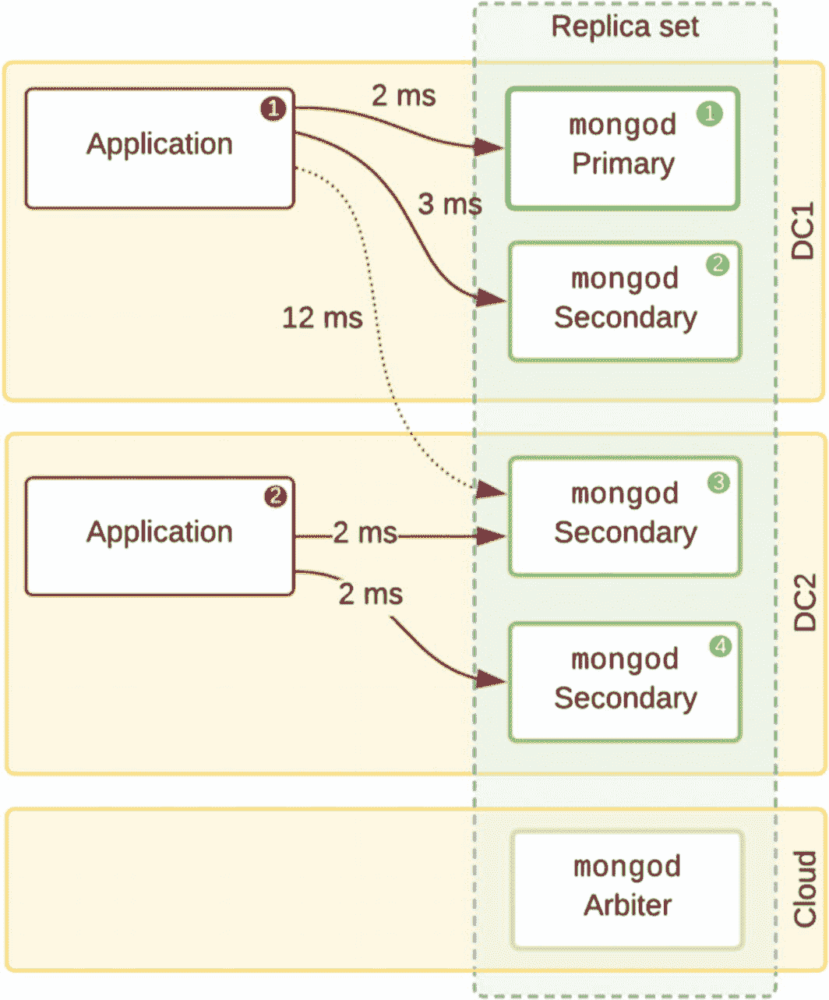

图 5-8

一个 PS|SS|A 副本集，应用程序位于两个数据中心

##### 最近节点偏好

如果在连接字符串中请求了 `nearest` 偏好，应用程序（1）将从 `mongod`（1）或（2）读取，因为往返时间（RTT）分别为 2 毫秒和 3 毫秒，并且数据中心 2（DC2）中的节点超过了延迟窗口。应用程序（2）将倾向于从 `mongod`（3）或（4）读取，除非复制延迟超过 `maxStalenessSeconds`。在这种情况下，驱动程序将选择从 `mongod`（1）或（2）读取。如果未指定 `maxStalenessSeconds`，节点选择将只考虑 RTT 延迟。

##### 主节点优先读取

另一方面，如果请求的是 `primaryPreferred`，应用程序（1）和（2）都将从 `mongod`（1）读取，因为它是当前的主节点。然而，如果 `localThresholdMS` 设置为 5 毫秒，那么位于数据中心 1（DC1）的主节点就被认为太远了，因此将选择 `mongod`（3）或（4）。

### 三个数据中心场景

将承载数据的 MongoDB 节点均匀分布在至少三个数据中心的拓扑结构是最理想的情况。在图 5-9 中，我们可以看到一个在 PSS 拓扑结构中具有最佳冗余的拓扑。任何一个数据中心都可以丢失，同时应用程序使用写关注点 `majority` 进行写入，以确保持久性分发并防止数据丢失。此外，如果随后第二个数据中心也发生故障，仍然不会丢失数据，但需要一些手动干预来强制剩余的数据承载节点接受写入。

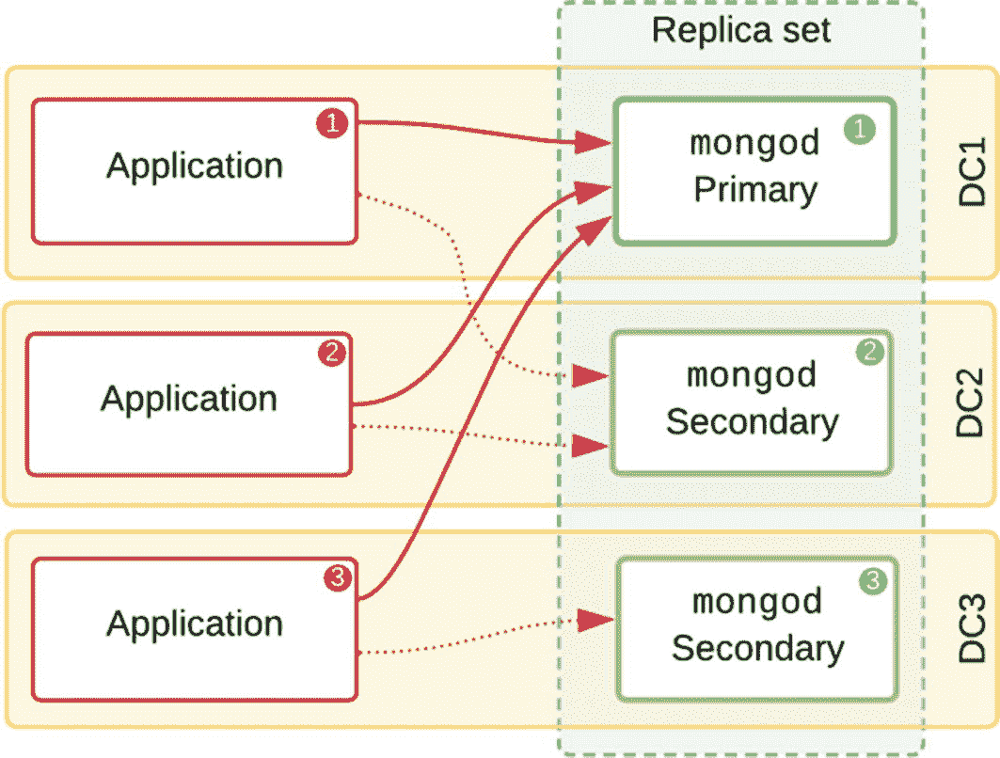

图 5-9

一个具有最佳冗余的 3-DC（数据中心）、3 节点拓扑

一些架构师选择每个数据中心多个节点的拓扑，例如，一个 PS|SS|S 拓扑（见图 5-10）。在这种情况下，整个数据中心可以丢失而不影响可用性；然而，选择这种设计通常是为了允许从辅助节点读取。但这样一来，数据中心的丢失也会导致 `性能下降`，因为响应读取请求的节点会减少。对于具有严格性能目标或当前工作负载资源不足的关键应用，这可能产生相当大的影响。

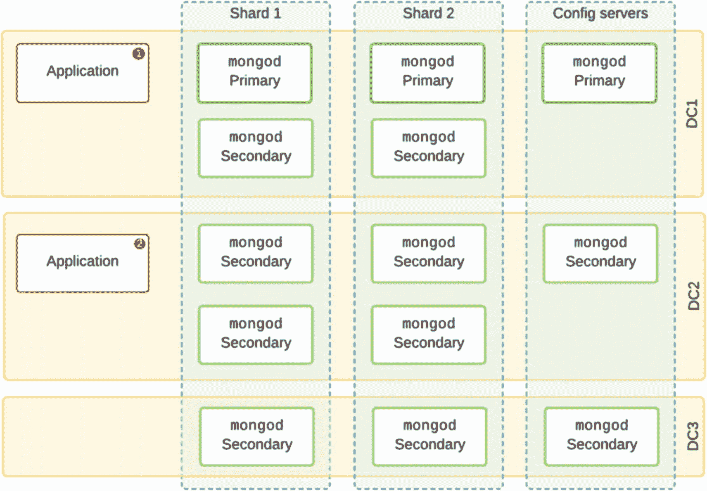

图 5-10

一个在 3 个数据中心中采用 PS|SS|S 分片的集群

一种更具成本效益的方法是使用整体少一个节点，而是创建三个分片，每个分片有三个承载数据的成员（图 5-11）。在单个数据中心故障时，它具有相同的冗余特性，但为我们提供了三个分片，每个分片都有一个可以接受写入的主节点。如果您选择进行辅助节点读取，总体上只有六个辅助节点，但每个节点的数据量更少，可以在其内存缓存中保留更大比例的数据，在相同的硬件配置下，提供更好的单节点性能。

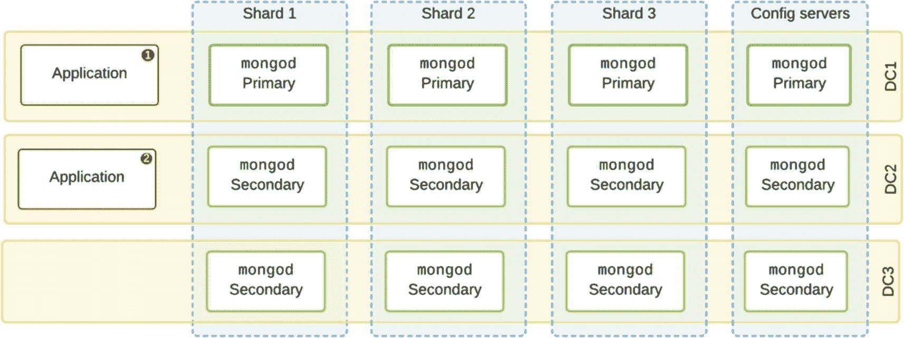

图 5-11

一个在三个数据中心中采用 P|S|S 分片的集群

### 负载与性能测试

首次构建集群并准备推出新的 MongoDB 应用程序时，始终进行 `性能测试` 非常重要，以确保在小规模下能达到预期性能。在进入生产规模数据之前，您还应该进行 `负载测试`，以确保所有组件的行为正确。本节考虑测试时可能遇到的几种常见情况。

#### 连接过载

任何应用程序都能正确响应响应缓慢和超时连接非常重要。如果到了分片本身无法及时处理传入操作的地步，那么连接将在 `mongos` 上堆积。默认情况下，`mongos` 在开始拒绝来自应用程序的新连接之前，最多允许 `64k` 个连接。请注意，每 `1k` 个连接在开销上几乎需要 `1GB` 的 RAM。因此，如果您在资源有限的虚拟机（VM）上运行 `mongos`，您很可能会更早达到此限制。在大多数 Linux 变体上运行时，内存不足杀手（OOM Killer）将激活并终止占用驻留内存最多的进程。在具有许多 `mongos` 的生产系统中，应用程序将继续将请求路由到幸存的 `mongos`，这些 `mongos` 现在可能负载更重，从而导致级联效应。

#### 超时

大多数 MongoDB 驱动程序包含一个选项，可在查询操作上设置 `maxTime` 或 `maxTimeMS`。这允许应用程序对任何操作设置服务器端时间限制，例如，`3000` 表示 3 秒限制。此值与初始请求一起传递到服务器，服务器端的计时器将在该时间后自动终止未完成的操作并干净地释放服务器资源。这对于在意外负载或网络不稳定的情况下避免使用过多的服务器资源非常有用。如果应用程序由于某种原因断开连接，或者连接由于非常长的查询而超时，我们可以确信它对服务器资源的影响将是有限的。

另一方面，设置非常低的连接超时可能会产生相反的效果。想象一下，客户端在连接上设置了 3 秒超时，但正在请求一个需要 5 秒才能完成的复杂聚合管道。如果应用程序的连接在 3 秒后自动关闭并重试，服务器将花费 2 秒完成第一个管道，同时，由于客户端重新请求，它将重新启动相同的管道。这有两个负面影响：服务器的额外负载，以及应用程序持续尝试重试繁重操作可能导致潜在的无限循环。

#### 应用程序退避逻辑

解决应用程序导致服务器过载的方法是在应用程序中添加 `退避逻辑`。本质上，应用程序应该能够检测服务器是否负载过重并减慢操作速度。一种方法是使用递增的暂停间隔。在初始失败后，应用程序等待 1 秒再重试。如果再次失败，它可以等待两倍的时间再尝试。这使得应用程序能够自动尝试，而不会对自己的数据库服务器执行“拒绝服务”攻击。


## 可重试写入与读取

从 MongoDB 3.6 版本开始，各驱动程序能够在某些故障（例如瞬时网络问题或副本集主节点切换）发生时，**一次**重试写入和读取操作。从应用的角度来看，这提高了稳定性，且不会给服务器带来过载的风险。

对于为 MongoDB 4.2 及更高版本设计的驱动程序，可重试写入已成为默认行为，并可通过连接 URI 的 `retryWrites` 和 `retryReads` 选项进行控制。

## 降级测试

当你开始拥有多个数据中心或更大的集群时，网络问题的可能性会急剧增加。由于存在多个网络交换机和互联网骨干网，故障点很多。虽然 TCP 层会自动重试数据包并绕过故障，因此通常可以避免完全的路由故障，但性能会受到严重影响。

在构建集群时，模拟此类降级网络环境非常重要，以便正确测试故障切换处理，并确保 MongoDB 集群中的所有组件都经过充分配置和准备，能够优雅地处理此类事件。

### 网络饱和

你可能会遇到这样的情况：网络上的其他工作负载足以使某个特定交换机饱和，从而导致某个子网和分片集群中的少数节点出现极端的数据包延迟。如果受影响的节点承载的是副本集中的从节点，即使是定期的性能下降也可能不明显。

然而，设想一下：由于当前主节点所在主机进行计划维护而触发了一次选举，其中一个受影响的节点成为了新的主节点。现在，一个分片的主节点受到了这种网络饱和的影响，连接突然因套接字超时而失败。我们该如何诊断和修复这种情况呢？

#### 诊断

这里，我们将提及一些可能有用的工具和方法：

```
ping
```

这个常用工具对于确认副本集配置中使用的主机名是否确实解析到预期的 IP 地址并具有有效路由非常有用。在通过虚拟私有云连接的混合本地和云数据中心环境中，这可能是一个特别棘手的问题。

```
netstat -s
```

此命令从本主机视角输出关键网络指标的摘要，包括关于已发送数据包总数以及有多少数据包被延迟或丢失的历史信息。

如果观察到数据包丢失，下一步是确定数据包丢失开始发生的位置。可以使用 `traceroute`（Linux）或 `tracert`（Windows）检查通往目的地路径上的每一跳。

```
tcpdump -i any -w /tmp/out.file
```

这是一个通用的数据包分析器，也可以捕获通过网络传输或接收的所有 TCP 数据包，并可选择按端口或远程主机 IP 进行过滤。捕获数据后，可以在 `Wireshark` 中可视化数据，以跟踪流程并调试诸如 TLS 握手或意外断开连接等问题。

```
iftop
```

类似于 `top` 和 `iotop`，此工具按远程主机分组显示当前网络流量摘要。这对于监控初始同步期间的实际峰值带宽或监控复制流量非常有用。

#### iPerf3

`iPerf3` 是一个跨平台工具，用于测量 IP 网络上的最大可实现带宽。它可以用于模拟真实的 MongoDB 流量，具有多个同时连接，可设置运行时间并定期报告输出。

例如，以下命令设置一个客户端和一个服务器，运行一个使用 50K 大小的 TCP 数据包和 15 个并行流的双向测试，测量双向带宽。

服务器端：`iperf3 -s -f K`

客户端：`iperf3 -c <服务器 IP> -f K -w 50K -R -P 15 --get-server-output`

### 数据包丢失的常见原因

网络上的数据包丢失可能由多种原因引起。如果你遇到数据包丢失，以下部分描述了一些你可以排查的可能问题。

#### 链路拥塞

当过多的流量通过一个已饱和的网络（或单个交换机）时，可能会发生这种情况，结果是一些数据包可能会被丢弃。

如果无法通过引入更高效的查询、减少分片平衡或改变写入模式以减少操作日志来降低网络压力。

然而，实际上，增加带宽是最快、最具成本效益的方法。

#### 错误的协议配置

偶尔，传输路径上两个网络设备之间的最大传输单元或双工模式不匹配可能导致冲突，并最终导致链路上的数据包丢失。

双工不匹配通常可以识别，因为它会导致不对称的数据包丢失（即仅在一个方向上），并且数据包丢失是持续的。在现代硬件的大多数情况下，启用双工自动协商将解决不匹配问题。

#### 错误的防火墙配置

配置错误的防火墙可能在发生选举之前一直未被发现。想象一个从节点，当主节点位于同一子网时能够从某个主机复制数据，但当选举导致另一个主机成为主节点时，错误配置的防火墙规则导致所有传入数据包被丢弃。由于所有节点都会持续尝试发送健康检查 ping，你应该已经能在日志中看到警告。

**注意**
MongoDB 日志中的任何警告都应认真对待，并尽快纠正。虽然它们可能看起来没有产生任何负面影响，但如果集群状态发生变化，这可能表明了停机的一个根源。

#### 故障硬件或软件

还有许多其他不常见的情况可能导致网络性能突然下降，例如交换机过热、电缆故障等。网络交换机拥有自己的处理器，已知其中包含软件错误，这些错误会导致在某些边缘情况下数据包处理或路由失败。

在其他情况下，感染网络内部机器的恶意软件可能导致流量突然激增，这就像内部拒绝服务攻击一样，影响正常的 MongoDB 流量。

## 故障排除技巧

本节介绍在规划复杂部署时的一些技巧，以便在组件随时间增加时，使故障排除和维护更加容易。

### 端口

在构建一个相对简单的分片集群时，会运行许多不同类型的组件，包括配置服务器、`mongos` 路由器和分片 `mongod` 节点。即使每个组件都运行在自己的虚拟机和唯一的主机名上，也强烈建议在整个组织中使用标准化的端口编号方案，如表 5-3 所示。这使得系统管理员、数据库管理员以及任何第三方监控或支持工具都能快速识别每个节点的角色。

**表 5-3**
根据组件角色分配端口的示例

| 组件 | 进程名 | 端口 |
| --- | --- | --- |
| 配置服务器 | `mongod` | 27019 |
| 独立节点 | `mongod` | 27016 |
| 分片节点，或副本集成员 | `mongod` | 27018 |
| 分片路由器 | `mongos` | 27017 |

如果日志中出现错误消息或通过驱动程序报告给应用程序，仅凭端口号，我们就可以快速判断问题是否与配置服务器或分片节点有关。


### 时区

当使用位于多个国家的数据中心时，为了简化来自多个不同组件的日志故障排除，建议将所有主机的系统时钟设置为协调世界时（UTC）。

注意
缩写 UTC 是一个折衷方案，因为英语曾提议使用 CUT（代表“coordinated universal time”），而法语曾提议使用 TUC（代表“temps universel coordonné”）。

某些代理和驱动程序始终会以 UTC 时间记录日志，因此，通过在部署范围内强制使用此时区设置，可以更轻松地在日志中对齐不同组件的时间线，从而调试任何问题。

在 Linux 系统上，可以通过以下命令强制设置 UTC/GMT：

```bash
ln -sf /usr/share/zoneinfo/Etc/UTC /etc/localtime
systemctl restart rsyslog
```

## 关键要点

本章详细介绍了在不同数据中心配置上部署 MongoDB 的诸多细节。

关键要点如下：

*   MongoDB 组件需要能够相互通信以传输数据和共享运行状况信息。
*   在三个数据中心分布三个数据承载节点的配置是推荐的拓扑结构，以最大限度地提高可用性和冗余性。
*   许多 MongoDB 组件（包括驱动程序和`mongos`路由器）在选择查询数据的位置时会自动考虑网络往返时间。
*   在投入生产之前，测试任何配置的性能非常重要。

