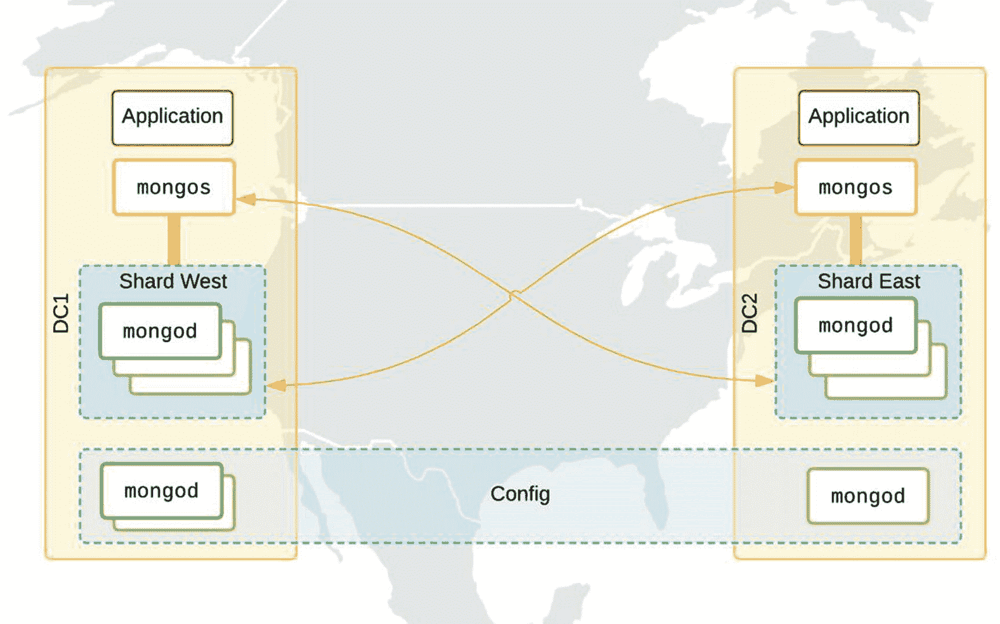
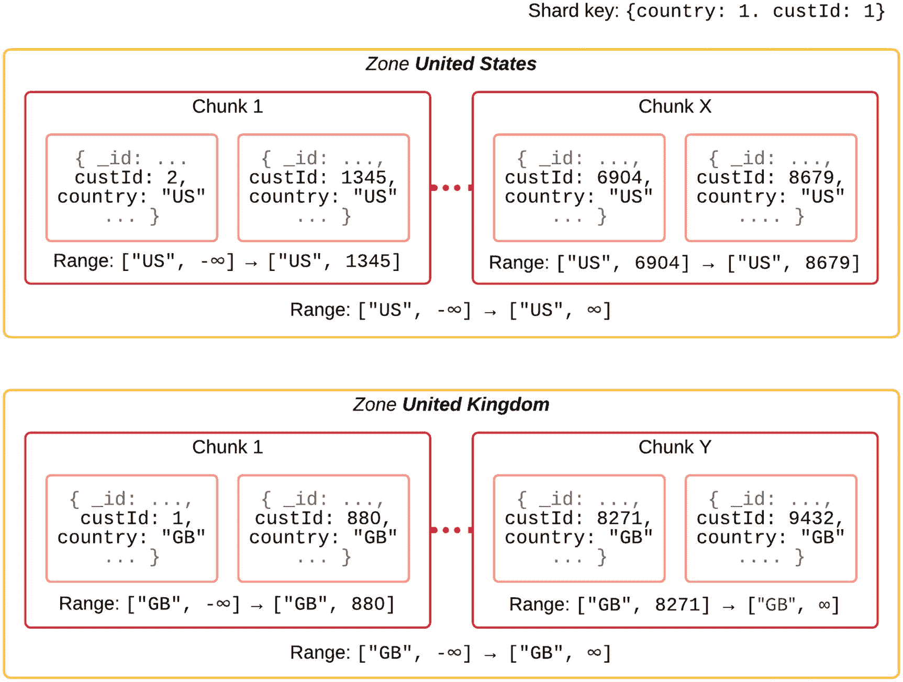
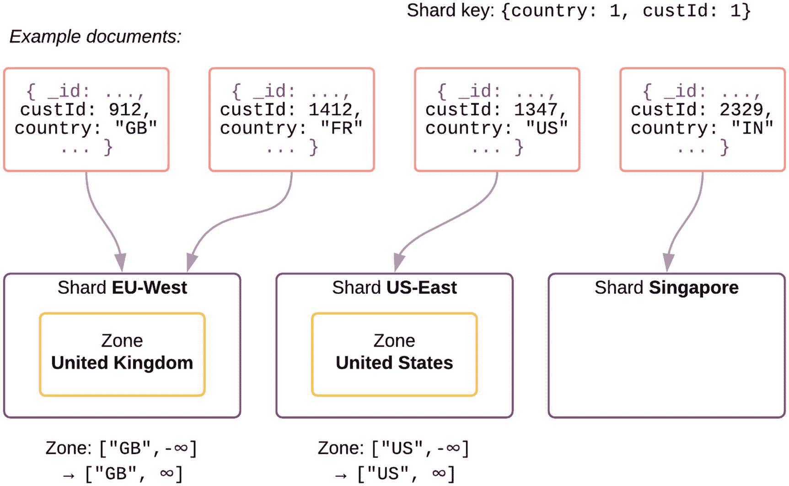
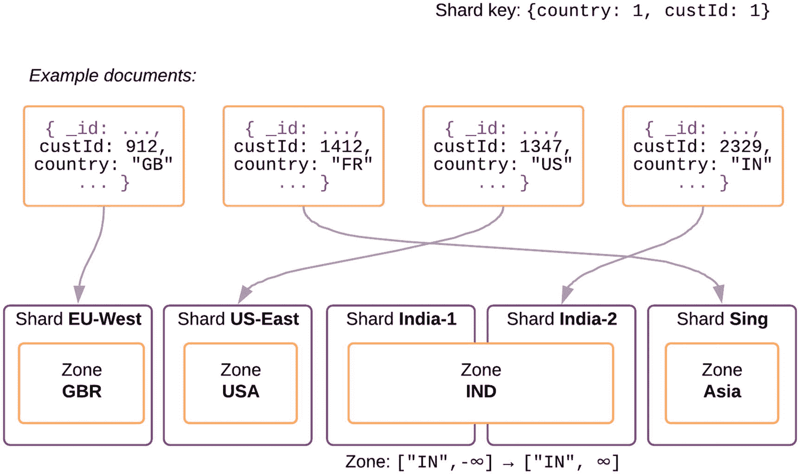
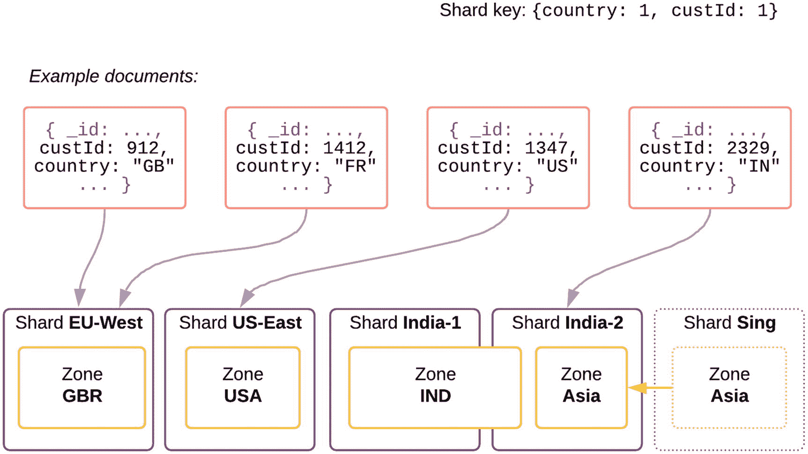
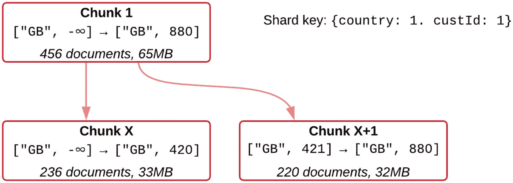
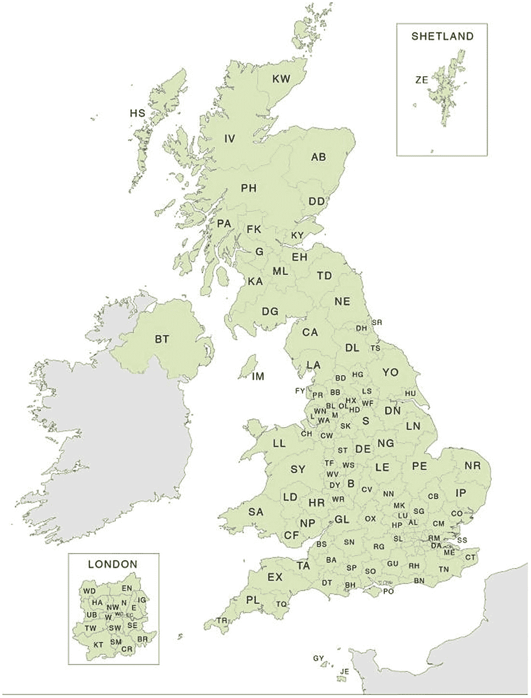
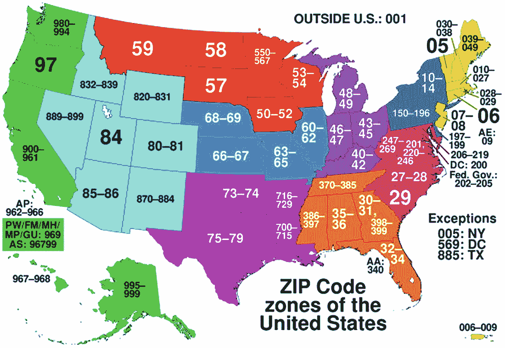
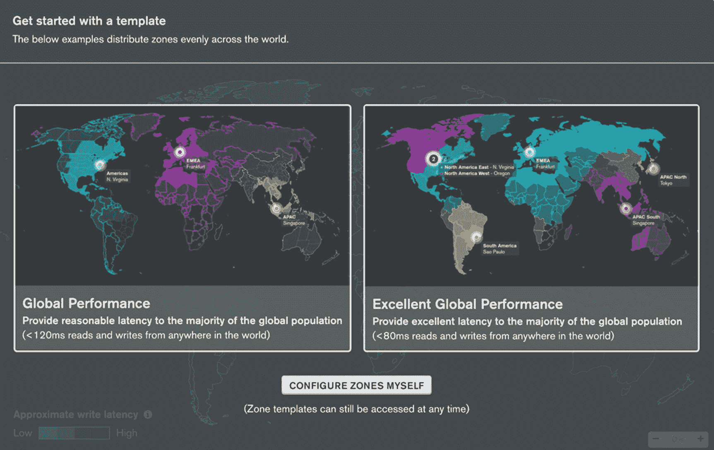
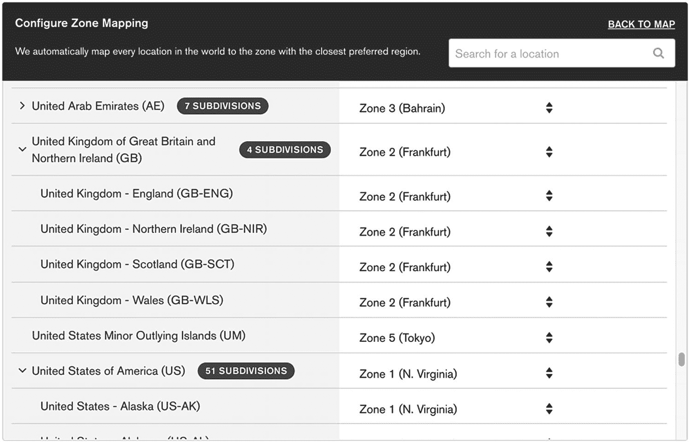

# 6. 全球拓扑结构

本章将继续深入探讨针对不同类型的全球分片选项的拓扑结构建议，具体取决于低延迟还是数据控制/主权是优先考虑的因素。

## 关键概念

在探讨不同全球拓扑结构的一些实际细节之前，让我们回顾一下对分片，特别是`区域`的理解。

### 块、分裂与迁移

正如你在第 1 章中所记得的，当对一个集合进行分片时，文档会根据分片键被分解成块范围，这些块会分布在可用的分片上。块的大小通常被限制在 64MB 以内，以便在必要时能够进行相当快速的迁移。

经过多次插入后，这些块会被分裂成更小的块，并且可能会从拥有过多块的分片迁移到拥有较少块的另一个分片。这个子系统的目标是在所有可用分片之间均衡地平衡块的数量。

因此，即使我们开始时一个分片存放`country`字段等于“US”的文档，另一个分片存放所有值为“UK”的文档，默认情况下也无法保证这种情况会永远保持不变。

## 分片键

第 1 章介绍了分片键，这是一个特定于集合的设置，它定义了文档中的哪些字段将决定块的范围，并最终决定文档将被路由到哪个分片。

当使用`复合`分片键时，字段的组合决定了块。当我们规划 MongoDB 上数据的地理分布时，分片键的第一个字段**必须**是地理组件（国家代码、邮政编码等），以便对块进行分组。

注意
在设置任何类型的区域分片时，避免使用哈希分片键，因为区域是基于整个键的哈希值来确定的，因此无法控制原始值的范围会落在哪里。更多详细信息请参见第 11 章关于极端分片的内容。

## 全球分片

对于任何拥有单一城市或州以外用户群的大型应用程序，按区域考虑分片变得至关重要。这有众多原因，包括降低延迟（从应用程序到主节点的网络往返时间）、带宽成本（即使在同一云服务提供商的不同数据中心/区域之间也会产生）以及满足合规性要求。MongoDB 提供了设计和构建满足所有这些需求的拓扑结构的能力，同时不牺牲对大多数生产工作负载至关重要的高可用性和冗余性。

### 带宽要求

假设你经营一家总部在美国的企业，一半客户居住在东海岸，另一半在加利福尼亚州。单个副本集虽然提供了高可用性，但要求所有数据在集合内复制，这意味着加州的数据存储在弗吉尼亚州，反之亦然。最好的解决方案是转向分片配置，即使数据大小尚未接近我们 2TB 的分片大小启发式标准。

在图 6-1 中，我们看到一个分片集群，在加利福尼亚州有一个分片，在弗吉尼亚州有一个分片。每个数据中心都有自己的应用程序服务器和`mongos`路由器。区域分片已按州配置，因此客户数据大致存储在离他们最近的分片上。



图 6-1. 通过分片最小化带宽要求

使用 AWS 或其他提供商提供的类似 DNS 路由服务，客户也会被路由到离他们最近的应用程序服务器。在大多数情况下，数据将在数据中心内部传输，尽管在某些情况下，某些查询可能需要路由到另一个数据中心。对未分片集合的操作，例如系统范围的配置，仍然可能访问“远程”分片。

请注意，我们利用多个数据中心在 DC2 中保存了配置副本集的一个副本。请记住，`config`数据库包含了关键的映射数据，即哪些块范围位于哪个分片上。

这种方法有一些缺点。一个是西部数据的所有三个副本都在同一个区域。通过将每个节点托管在不同的可用区（AZ）中，可以在一定程度上降低这种风险。否则，区域范围内的问题可能导致整个分片以及存储在那里的任何未分片集合不可用。

### 低延迟要求

全球分片拓扑结构最常见的原因是最大限度地减少最终用户的延迟。在全球范围内，实现这一目标的唯一方法是根据客户的可能位置对数据进行分区，并允许通过地理上靠近的数据中心的 MongoDB 节点进行写入和读取。

## 设置区域分片集群

在本节中，我们将通过一个示例来说明如何根据全球集群随时间变化的需求，在其上使用区域规则。


## 定义区域

我们可以将区域想象为管理员定义的、连续的分片键值范围。一个区域最初可能不包含或只包含少量文档块，但在大型生产系统中，可能会存在数百万个块。

在图 6-2 中，我们可以看到为美国客户（国家代码为“US”）和英国客户（根据 ISO 3166-1 标准，国家代码为“GB”代表大不列颠）定义了两个区域。

在此示例中，我们仍然假设客户 ID 字段 `custId` 在整个集群中实际上是唯一的字段，但由于我们使用的是复合分片键，因此对于“US”和“GB”块，都存在一个从 `custId` 的负无穷大值开始的块区域。

注意：在以下图表中，-∞ 在内部实际上表示为特殊的 BSON 值 `MinKey`，而 ∞ 则表示为 `MaxKey`。



*图 6-2：区域及其块的示例*

以这种方式在系统中仅定义两个区域，并不限制我们插入 `country` 字段为其他值（如加拿大“CA”或法国“FR”）的文档。这仅仅意味着我们没有为这些值的文档设置特定的区域。我们允许内置的均衡器定义一个块范围，并自动选择一个分片来存储这些文档。这个过程是完全自动且即时完成的。

请注意，区域范围不能重叠，并且范围总是包含下边界但不包含上边界。这使得所有 `mongos` 路由器都能清楚地知道新文档应该插入到哪个分片。

## 将区域映射到分片

让我们想象一下，我们的集群中有三个可用分片：一个在美国东部，一个在欧盟西部，另一个在新加坡。目前我们主要关注美国和英国的客户，并希望确保他们的数据存储在各自的国家内。对于所有其他客户，我们目前乐意将数据存储在任何地方。

注意：一个分片可以承载多个区域。此外，一个区域可以与多个分片关联。

在图 6-3 中，我们看到英国和美国的客户符合我们的区域规则，这些区域各自映射到一个特定的分片。来自印度（“IN”）和法国（“FR”）的客户可能位于任何分片上。事实上，法国的块很可能会迁移到新加坡分片，因为该分片的数据量较少。



*图 6-3：分配到区域的文档示例*

现在，让我们想象一下我们在印度开展业务，并且由于该国的一些新法规（有关数据合规性法规，请参见第 4 章），我们需要将所有印度客户的数据保留在该国境内。我们可以通过添加一个新区域来实现这一点。

## 添加新区域

我们首先需要指定一个新区域来约束 `{country: "IN"}` 的文档，例如使用以下命令。

```
sh.updateZoneKeyRange("myDB.customers",
{ country: "IN", custId: MinKey },
{ country: "IN", custId: MaxKey },
"IND");
```

*清单 6-1：为印度定义一个名为“IND”的新区域范围*

区域本身还不会影响迁移，因为我们尚未向均衡器指定这些区域应该位于哪些物理分片的偏好。

注意：`Ops Manager` 和 `MongoDB Atlas` 托管服务都提供了用户界面来帮助定义区域和分配。

## 添加新分片

我们现在已经为印度客户数据定义了一个区域。在将任何数据移动到印度区域之前，我们必须首先在该国创建基础设施并将其集成到现有的分片集群中。大致步骤如下：

1.  在目标国家境内的多个数据中心配置新的服务器或虚拟机。
2.  根据生产清单和安全最佳实践，安装依赖项、MongoDB 二进制文件和存储系统。
3.  构建一个具有适当名称的新副本集，例如“`sh-india-1`”。这将便于我们集群日后的管理。
    注意：使用自动化工具（如仅企业版可用的 `Ops Manager`）或 Ansible 脚本始终是最安全的方式，可以避免人为错误。有关部署的更多详细信息，请参见第 7 章；有关副本集拓扑的更多详细信息，请参见第 5 章。
4.  暂停均衡器，因为我们不希望在区域正确配置之前，它立即开始将任何块移动到该分片。在 `mongos` 上运行 `sh.stopBalancer( 10*60*1000 )`。
    这里我们只暂停 10 分钟，因为长时间禁用均衡器也会阻止其他正常操作，例如块分裂。
5.  现在，将这个新的未分配分片连接到我们的集群中。在 `mongos` 上运行 `sh.addShard("sh-india-1/node1.dc0.india.bigcorp.com:27123")`。
6.  添加区域。在 `mongos` 上运行 `sh.addShardToZone("sh-india-1", "IND")`。
7.  恢复均衡器，允许开始向新分片迁移块：
    在 `mongos` 上运行 `sh.startBalancer()`。
    注意：副本集一旦创建就无法重命名，因为所选名称充当成员相互识别的密钥。因此，如果集合有特定的用途或位置，最好给出描述性名称，而不是 `rs0`、`rs1` 等。

## 渐进式均衡

均衡器进程在我们的分片集群中具有明确的低优先级。我们不希望为了快速均衡一个分片而占用 CPU 和网络资源，从而影响常规工作负载。分片一次最多只能参与一次迁移，无论是捐赠还是接收块。例如，在一个六分片集群中，最多可以同时进行三个分片对之间的并行迁移。

对于大型数据集，当有高达 2TB 的数据要移动到新分片时，可能需要长达一周的时间才能使数据完全均衡。

## 扩展区域

假设我们在印度的业务增长强劲，我们最初的印度分片已接近 2TB 的数据大小阈值。我们希望进一步分区，以避免备份和恢复时间出现问题。

我们仍然需要将印度数据保留在印度境内，因此解决方案是部署*第二个*印度分片，并在两个分片之间均衡数据。我们已经为印度文档定义了区域 `"IND"`，因此扩展的步骤更少：

1.  在目标国家境内的多个数据中心配置新的服务器或虚拟机；根据生产清单和安全最佳实践，安装依赖项、MongoDB 二进制文件和存储系统。
2.  构建另一个具有一致名称的副本集，例如这次是“`sh-india-2`”。
3.  无需暂停均衡器，因为现有的印度数据已经限制在该国境内。
4.  同样，我们将这个新的未分配分片连接到我们的集群：
    `sh.addShard("sh-india-2/node5.dc1.india.bigcorp.com:27123")`。
5.  将这个新分片链接到现有的印度区域：
    `sh.addShardToZone("sh-india-2", "IND")`。
6.  使用以下命令监控向第二个印度分片的块迁移情况：
    `sh.status()`。


### 重新分配区域

假设除了英国、美国和印度的国家特定区域定义之外，我们还定义了一个泛亚洲区域来覆盖所有其他东南亚国家。

如果我们没有创建这个“全覆盖”的亚洲区域，那么亚洲客户可能会被自动均衡到位于欧盟或美国的物理分片上，从而可能导致不可接受的往返延迟。

我们可以将多个范围分配给这个*亚洲*分片，如代码清单 6-2 所示。

```javascript
sh.updateZoneKeyRange("myDB. customers ",
{ country: "JP", custId: MinKey },  // 日本
{ country: "JP", custId: MaxKey }, "Asia")
sh.updateZoneKeyRange("myDB. customers ",
{ country: "KO", custId: MinKey }, // 韩国
{ country: "KO", custId: MaxKey }, "Asia")
sh.updateZoneKeyRange("myDB. customers ",
{ country: "TH", custId: MinKey }, // 泰国
{ country: "TH", custId: MaxKey }, "Asia")
sh.updateZoneKeyRange("myDB. customers ",
{ country: "PH", custId: MinKey }, // 菲律宾
{ country: "PH", custId: MaxKey }, "Asia")
```
代码清单 6-2
可以为单个区域分配多个区域范围

假设我们已经取消了向东南亚扩张的计划，但我们仍然在新加坡拥有数据中心。但如图 6-4 所示，现在我们在印度也有两个分片。亚洲其他地区遗留客户的延迟是可以接受的，因此我们决定停用新加坡分片，并将数据迁移到印度。



图 6-4
“新加坡”分片及其亚洲区域将被迁移到印度

我们需要记住，*新加坡*分片可能不仅仅包含亚洲区域。它也可能包含一些未在任何现有区域中明确指定的国家的客户的其他块。

#### 清空分片

在停用新加坡的硬件之前，有两个步骤：

1.  将区域移动到不同的分片。
2.  清空新加坡分片的其余部分，从而强制将任何“杂项”块移动到其他地方。

在图 6-5 中，我们看到*亚洲*区域已移至*印度-2*分片，并且幸运的是，我们来自法国的未分区客户被移到了*美国东部*。



图 6-5
“新加坡”分片在停用前被清空

随着我们在美国业务的增长，我们决定在美西增加第二个分片。你可能已经注意到，我们无法将加利福尼亚的客户映射到西海岸分片，也无法将纽约的客户映射到东海岸分片。满足此需求的方法将在本章后面的“州级分片*”*中介绍。

### 检查块分布

通过运行在`mongos`上的几个简单命令，可以简洁地概述我们的分片集群。第一个命令是`sh.status()`，以下是代码清单 6-3 所示的我们分片集群的示例输出。

```javascript
mongos> sh.status()
--- 分片状态 ---
分片版本: {
"_id" : 1,
"minCompatibleVersion" : 5,
"currentVersion" : 6,
"clusterId" : ObjectId("5e41c1b7bb6aba86023a5aa8")
}
分片:
{ "_id" : "sh-eu-west",
"host" : "sh-eu-west/:,...",
"tags" : [ "GBR" ] }
{ "_id" : "sh-india-1",
"host" : "sh-india-1/:,...",
"tags" : [ "IND" ] }
{ "_id" : "sh-india-2",
"host" : "sh-india-2/:,...",
"tags" : [ "IND" ] }
{  "_id" : "sh-sing",
"host" : "sh-sing/:,...",
"tags" : [ "Asia" ] }
{  "_id" : "sh-us-east",
"host" : "sh-us-east/:,...",
"tags" : [ "USA" ] }
活跃的 mongos 实例:
"4.2.3" : 3
自动分裂:
当前启用: 是
均衡器:
当前启用:  是
当前运行:  否
过去 5 次均衡尝试失败次数:  0
过去 24 小时迁移结果:
2 : 成功
数据库:
{  "_id" : "config",  "primary" : "config",  "partitioned" : true }
{  "_id" : "myDB",  "primary" : "sh-eu-west",  "partitioned" : true,  "version" : {  "uuid" : UUID("b366477f-afa9-4b95-924e-d916cc56d9e8"),  "lastMod" : 1 } }
myDB.customers
分片键: { "country" : 1, "custId" : 1 }
唯一: false
均衡中: true
块:
sh-eu-west    1
sh-india-2    1
sh-us-east    1
{ "country" : { "$minKey" : 1 },
"custId" : { "$minKey" : 1 } } -->>
{ "country" : "IN",
"custId" : { "$minKey" : 1 } }
位于 : sh-us-east Timestamp(4, 0)
{ "country" : "IN",
"custId" : { "$minKey" : 1 } } -->>
{ "country" : "IN",
"custId" : { "$maxKey" : 1 } }
位于 : sh-india-2 Timestamp(3, 0)
{ "country" : "IN",
"custId" : { "$maxKey" : 1 } } -->>
{ "country" : { "$maxKey" : 1 },
"custId" : { "$maxKey" : 1 } }
位于 : sh-eu-west Timestamp(4, 1)
标签: IND  {
"country" : "IN",
"custId" : { "$minKey" : 1 } } -->>
{ "country" : "IN",
"custId" : { "$maxKey" : 1 } }
```
代码清单 6-3
`sh.status()`命令的示例输出

我们将逐节介绍这个`sh.status()`输出。

#### 分片

顾名思义，**分片**部分列出了此集群中所有已配置的分片。每个分片都应列出该分片副本集中所有已知节点作为种子列表。实际上，这类似于：

```javascript
sh-india-2/host5.dc1.india.bigcorp.com:27123, host6.dc1.india.bigcorp.com:27123, host7.dc1.india.bigcorp.com:27123
```

出于高可用性的同样原因，我们在配置分片时确实应该包含所有节点。

如果`mongos`启动并从`config`数据库获取此配置时`host5`恰好宕机，它仍然能够连接到其他节点，并从它们那里自动检测到副本集的其他部分。

#### 活跃的 mongos 实例

**活跃的 mongos 实例**部分简单列出了部署中可用的`mongos`实例总数及其二进制版本。

注意

你应用程序中的驱动程序只会连接到连接 URI 中列出的`mongos`实例，不会自动发现部署中的其他`mongos`实例。这对于保留一些`mongos`实例用于特殊工作负载可能很有用。

#### 分裂器/均衡器

分裂器和均衡器是分片集群自动化中密切相关的模块。分裂器识别过大的块，并将其分裂成两个更小的块。

虽然单个分裂的开销很小，但不必要地分裂块会导致元数据更复杂，并且查询到目标分片的路由效率降低。

请注意，分裂只会触发于向该特定块范围插入或更新文档时。**自动分裂**已启用仅仅意味着这些分裂可以发生，即使当前不允许进行任何迁移。

在图 6-6 中，你可能会注意到分裂产生的子块保留了其父块的边界。分裂操作永远不需要迁移到另一个块，也不会使区域规则失效。因此，任何要求用户文档存在于特定物理位置的数据保护规定都不会被违反。



图 6-6
一个大块被分裂成两个子块

一旦块被分裂成两个，如果检测到分片之间不平衡，就可能触发均衡器。在前面的`sh.status()`输出中，我们看到均衡器已启用，但当前没有运行，因为没有分片失衡，并且所有块已经遵循区域配置。如果我们更改了区域范围，均衡器可能需要开始将块移动到新的分片以匹配区域配置。

注意

你应该避免长时间禁用分裂器或均衡器，因为分片可能会变得不平衡，尤其是在导入工作负载期间。


### 数据库

本节列出了此集群上已知的所有数据库。

如果数据库列为 `partitioned: true`，则表示它已分片。也可能存在一些完全没有分区的小型数据库，它们可以没有分片集合。

请注意，我们的 `customers` 数据库列出了一个 `primary` 分片。主分片是所有未分片集合的存放位置，可以被视为该特定数据库的“归属”分片。任何非分片集合将仅存在于该分片上。这使得 `mongos` 路由器能够轻松地将这些较小集合的查询定向到特定分片。

这里还显示了一些基本元数据，例如分片键以及是否应用了唯一约束。接下来，列出了 `chunks`（数据块）的摘要，以便我们可以快速查看每个分片的数据量是否大致相同。在没有设置区域的情况下，这些数据应该是平衡的，但在我们的全局集群中，链接到包含更多文档区域的分片会更大。

### 检查现有区域

在进行更多更改之前，我们希望检查我们的映射是否符合预期。我们可以通过任何 `mongos` 路由器连接，从 `config` 数据库中查询配置信息。

`shards` 集合列出了所有分片以及映射到它们的区域。`tags` 集合列出了所有区域、它们的范围以及选择的标签，例如“`IND`”。这在代码清单 6-4 和 6-5 中显示。

例如，以下命令可以从 Mongo Shell 运行。

```
{ "_id" : { "ns" : "myDB.customers",
"min" : { "country" : "IN", "custId" : { "$minKey" : 1 } } },
"ns" : "myDB.customers",
"min" : { "country" : "IN", "custId" : { "$minKey" : 1 } },
"max" : { "country" : "IN", "custId" : { "$maxKey" : 1 } },
"tag" : "IND" }
{ "_id" : { "ns" : "myDB.customers ", "min" : { "country" : "JP", "custId" : { "$minKey" : 1 } } },
"ns" : "myDB.customers ",
"min" : { "country" : "JP", "custId" : { "$minKey" : 1 } },
"max" : { "country" : "JP", "custId" : { "$maxKey" : 1 } },
"tag" : "Asia" }
```

*代码清单 6-5：标签输出显示了范围和标签*

```
use config;
db.tags.find();
```

*代码清单 6-4：列出所有已配置的区域范围*

### 移动一个区域

在我们的案例中，我们希望重新定位整个亚洲区域，但不更改其任何范围，因为国家代码没有改变。将区域重新映射到分片可以通过以下命令完成：

```
sh.removeShardFromZone("sh-sing", "Asia")
sh.addShardToZone("sh-india-2", " Asia ")
```

此时，所有*亚洲*数据块将开始移动到 `sh-india-2` 分片。

### 清空一个分片

要从分片中清空数据块，我们首先在要移除的分片上发出 `removeShard` 命令：

```
db.adminCommand( { removeShard: "sh-sing" } )
```

这将开始移动位于*其他*分片上的分片数据库中的任何文档数据块，但需要手动干预来重新安置仅存在于此分片上的数据库。系统无法自动决定将它们移动到哪里。

`removeShard` 命令将返回一个文档，告知我们活动状态以及是否有任何数据库阻碍了移动。

```
{
"msg" : "draining ongoing",
"state" : "ongoing",
"remaining" : {
"chunks" : NumberLong(45),
"dbs" : NumberLong(2),
"jumboChunks" : NumberLong(0)
},
"note" : "you need to drop or movePrimary these databases",
"dbsToMove" : [
"db2",
"db3"
],
"ok" : 1
}
```

*代码清单 6-6：在数据库主分片上执行 removeShard 的结果*

在这种情况下，我们需要手动移动两个数据库：`db2` 和 `db3`。我们可以选择将它们都移动到我们的第一个印度分片：

```
db.adminCommand( { movePrimary: "db2", to: "sh-india-1" })
db.adminCommand( { movePrimary: "db3", to: "sh-india-1" })
```

最初的 `removeShard` 命令需要重新运行，直到响应的 `state` 值为 `"completed"`。此时，分片已被清空，可以安全地将主机下线。

### 目标状态

请注意，在上述两种情况下，配置的“目标状态”会在元数据中立即更新，但数据块本身可能需要数小时或数天才能完全迁移以满足新配置。网络带宽、其他工作负载以及均衡器窗口都是可能限制达到目标状态速度的因素。

## 州/省级分片

如果您的业务集中在一个或多个地理面积很大的国家，如美国、中国或澳大利亚，而数据仅存储在单一物理位置（例如所有数据中心都在美国东海岸的弗吉尼亚州），那么到该国另一端的延迟对于您的用例来说可能过高。

解决方案是将这种国家级别的分片概念扩展到州/省级别。幸运的是，这只需要使用比国家代码更细粒度的信息即可。

### 邮政编码

如果你知道自己的业务永远只会在美国境内运营，那么邮政编码（zip code）可能是一个不错的选择。但如果要支持国际扩张，某种复合地理分片键会更加灵活。

假设你有这样的文档结构（清单 6-7）：

```
{ _id: ObjectId(....),
custId: 1234567,
name: "John Smith",
street: "20 W 34th St",
city: "New York",
postcode: "10118",
state: "NY",
country: "US"
...
}
清单 6-7
一个支持州级分片的文档结构
```

> **注意**
> 你应该考虑将邮政编码存储为字符串而非数字，因为英国的邮政编码包含大写字母。例如，“SW1A 1AA”是白金汉宫的邮政编码。

对于前面的文档，使用像 `{ country: 1, postcode: 1, custId: 1}` 这样的分片键，可以初始实现简单的基于国家和地区的分片，随后可以应用更复杂的区域规则将数据划分到更具体的位置。例如：

```
sh.updateZoneKeyRange("myDB.customers",
{ country: "GB", postcode: "SW00 000", custId: MinKey },
{ country: "GB", postcode: "SWZZ ZZZ", custId: MaxKey },
"UK-London")
sh.updateZoneKeyRange("myDB.customers",
{ country: "GB", postcode: "SE00 000", custId: MinKey },
{ country: "GB", postcode: "SEZZ ZZZ", custId: MaxKey },
"UK-London")
```
这将定义一些区域，其数据存放在物理位置位于伦敦或其附近的分片上。在图 6-7（英国）和图 6-8（美国）中，我们可以看到为每个区域指定精确的区域规则将极其复杂。^(⁴)



*图 6-7*
用于次国家分片的英国邮政编码地图

在同一个部署中，可以设置规则来标记纽约的客户，并将他们定位在位于美国东海岸的硬件上：

```
sh.updateZoneKeyRange("myDB.customers",
{ country: "US", postcode: "00500", custId: MinKey },
{ country: " US", postcode: "00600", custId: MaxKey },
"US-NY")
sh.updateZoneKeyRange("myDB.customers",
{ country: "US", postcode: "06390", custId: MinKey },
{ country: "US", postcode: "06390", custId: MaxKey },
"US-NY")
sh.updateZoneKeyRange("myDB.customers",
{ country: "US", postcode: "10000", custId: MinKey },
{ country: "US", postcode: "14999", custId: MaxKey },
"US-NY")
```

如图 6-8 所示，美国邮政编码的纯数字方式，以及按州分组的方式，将使得定义少量区域键范围变得容易得多，同时仍能准确地映射分组。^(⁵)



*图 6-8*
可用于区域分片的美国邮政编码地图

在英国，两个字母的前缀之间没有逻辑上的地理关联，因此可能需要为每一个前缀定义一个区域键范围。你可以只为高密度区域定义范围，并让所有其他区域的数据存放在一个位于中央数据中心的分片上，该中心到全国所有地区都具有可接受的低延迟。

### ISO 3166-2

从前面可以看出，使用邮政编码进行州级分片很快会变得复杂。一个优越得多的解决方案是使用国际标准化组织（ISO）的 3166-2 标准。该标准为世界上每个国家提供了不同详细程度的正式行政区划代码。

对于英国，使用顶级行政区划代码 `GB-ENG`、`GB-NIR`、`GB-SCT` 和 `GB-WLS` 分别代表英格兰、北爱尔兰、苏格兰和威尔士，可能就足够了。否则，还可以使用 27 个二级郡县代码，例如 `GB-OXF` 代表牛津郡。

对于美国，有所有 50 个州的顶级行政区划代码，以及 `US-DC` 代表哥伦比亚特区，还有其他地区的代码，如 `US-GU` 代表关岛和 `US-PR` 代表波多黎各。

在这种方法中，你会添加一个额外的 `location` 字段，生成的文档如下所示：

```
{ _id: ObjectId(....),
custId: 1234567,
name: "John Smith",
street: "20 W 34th St",
city: "New York",
postcode: "10118",
state: "NY",
country: "US"
location: "US-NY"
...
}
```

然后通过使用分片键 `{ location: 1, custId: 1}`，你可以将客户数据分区到适当的次国家行政区划。

### 读取与分散-聚集

扩展分片集群以处理数据读取的最佳方式是，能够在每次查询中指定分片键的所有值。这样，`mongos` 路由器就可以从包含所需数据的那一个分片请求数据。在我们目前的方法中，我们可能最初只知道 `custId` 值（例如，来自 Web 或 API 请求），因此必须查询整个集群中的每个分片以寻找匹配项。一旦我们也拥有了国家和邮政编码字段，随后的查询就可以使用所有分片键组成部分进行过滤，并仅定位到一个分片。

### MongoDB Atlas

MongoDB Atlas 是一个完全托管的云数据库。Atlas 处理了在您选择的云服务提供商上部署、管理和修复全球部署的所有复杂性。此服务包括一个友好的界面，可根据业务需求变得复杂时配置和扩展您的部署。

这个全局分片系统使用了前面讨论的 ISO 3166-2 国家和行政区划代码，并要求一个名为 `location` 的字段与您选择的另一个辅助字段组合使用。

图 6-9 显示了两个用于高性能全局集群的预定义模板，一个包含三个区域，另一个包含五个区域。这些模板假设分片数量至少与区域数量相同，因此这将需要一个相当大的部署。



*图 6-9*
Atlas 包含预定义的全局分片模板

在图 6-10 中，我们可以看到一个简单的界面，用于根据所选的分片位置数量定义自定义区域。



*图 6-10*
Atlas 还包含一个用于映射行政区划的界面

### 小结

在本章中，我们通过一些示例探讨了全局集群随时间变化的情况。我们还为不同的全局分片用例探索了一些不同的分片键选项。表 6-1 总结了涵盖的三种分片键模式及其优点。

*表 6-1*
全局分片选项总结

| 分片键 | 优点 | 缺点 |
| --- | --- | --- |
| `{ country: 1,    custId: 1}` | • 区域规则简单 | • 无法实现次国家级分区 |
| `{ country: 1,`  `postcode: 1,`  `custId: 1}` | • 可以实现次国家级分区 | • 元数据和区域规则复杂 |
| `{ location: 1,`  `custId: 1}` (例如 Atlas) | • 灵活• 次国家级分区简单 | • 需要计算和存储额外的字段 |


## 关键要点

本章需要记住的核心概念如下：

*   **区域**可用于控制数据块范围的物理存放位置。
*   每个区域可定义多个范围，因此我们可以创建一个包含多个国家的单一亚洲区域。
*   一个区域可以映射到多个**分片**，这样即使某个区域的数据量超过了我们设定的`2TB`基准限制，仍可在单一区域内增长。
*   区域和分片可以随着部署规模的扩大或需求的变化而添加或移除。
*   基于区域的分片可用于确保最终用户位置与数据库之间的`低延迟`往返，或最大限度地减少`带宽费用`。
*   利用区域实现的地理政治分片规则还可用于确保满足`数据保护法规`（如 GDPR）的要求。

脚注 1   2

