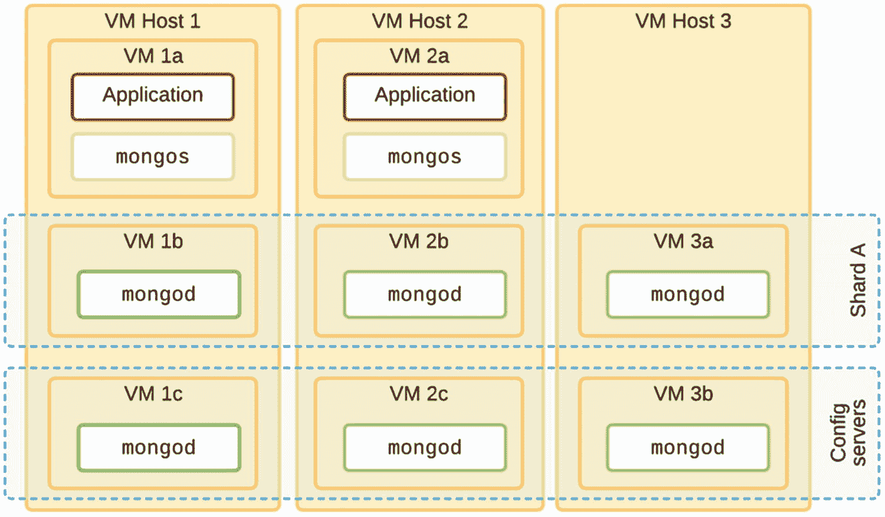
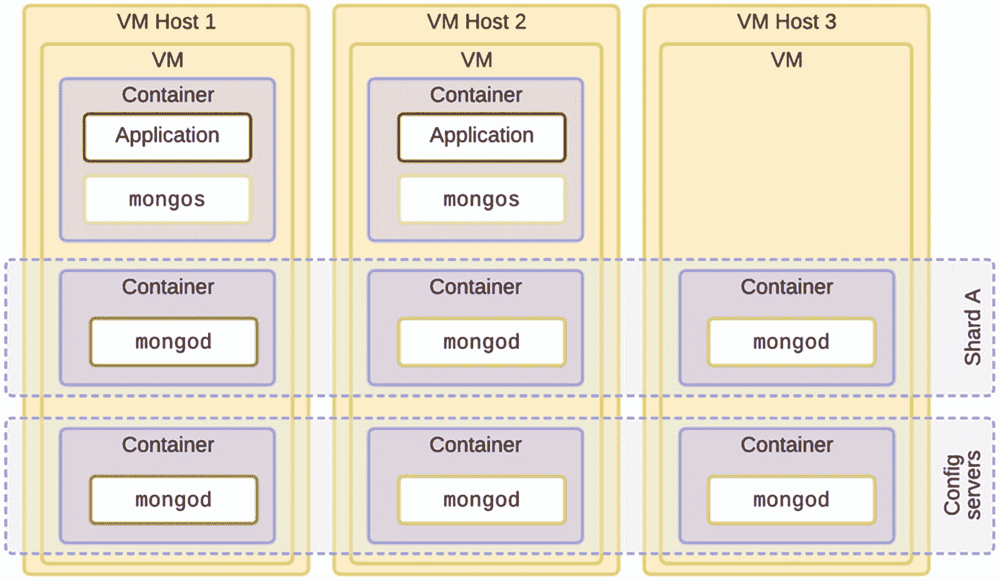

# 7. 部署与监控

本章探讨在生产环境、本地环境以及基于云的自管理环境中，自动化 MongoDB 部署最常用的工具和技术。我们还将回顾不同的监控解决方案和技巧，以帮助 DevOps 团队规避问题并对部署中的变化做出快速反应。

## DevOps 工具集

随着云提供商不断增加新功能，以及大型企业将更多工作负载转移到“公有云”，DevOps 工具集仍在快速发展。本文提供的所有细节在撰写时都是准确的。

## 目标

理想情况下，我们的 DevOps 工具集应紧密契合数据库需求，即：随着部署规模扩大而具备`可扩展性`、`隔离`各组件、确保数据的`持久性`以及优化`性能`。

### 社区版与企业版

MongoDB 公司（MongoDB 背后的公司）早期选择将数据库作为开源产品，部分是为了推动普及，但也坚信开源数据库会变得更加安全、稳定和可靠。

为了建立业务，公司也为**企业客户**保留并构建了一些额外功能。本章提到的 DevOps 工具就属于此类。任何获得许可的客户均可在本地或自管理的云基础设施上自由使用这些工具，并能获得无限制的技术支持，以确保其部署始终在线且处于最优状态。

MongoDB 的发布遵循常见范式：偶数版本用于生产环境，奇数版本用于预生产工作。例如，4.3 版是用于测试的预生产版本，之后通常会作为 4.4 版正式发布用于生产。

次要版本（如从 4.4.1 到 4.4.2）包含安全性和性能改进，但永远不会破坏向后兼容性。通常，您应在几周内升级到任何次要版本，以获得重要的稳定性改进和错误修复。相比之下，主要版本升级应在 UAT 环境中使用真实数据和工作负载进行测试，然后再在生产部署中进行升级。

#### Ops/Cloud Manager

`Ops Manager`是 MongoDB 的企业级管理平台，旨在您自己的基础设施上部署、监控、备份和扩展 MongoDB 部署。`Cloud Manager`几乎与之相同，区别在于其指标和备份由 MongoDB 公司存储和管理，但实际用户数据永远不会离开您自己的基础设施。表 7-1 展示了 Ops Manager 与 Cloud Manager 之间的差异。

表 7-1
Ops Manager 与 Cloud Manager 对比

|   | Ops Manager | Cloud Manager |
| --- | --- | --- |
| 自动化部署 | 是，本地部署 | 是，本地部署 |
| 监控部署 | 是，所有元数据和指标均在本地 | 是，但元数据和指标在云端 |
| 备份部署 | 是，备份可全部在本地（使用文件系统、块存储或本地 S3 兼容存储），或备份到 Amazon S3 云存储 | 是，备份存储在由 MongoDB 公司管理的 Amazon S3 存储桶中 |
| 要求 | 在所有主机上安装自动化代理 用于存储 Ops Manager 配置的副本集（AppDB） 用于存储操作日志和块存储（用于备份）的副本集 Ops Manager 实例的主机（以及可选的负载均衡器） | 在所有主机上安装自动化代理 |

这两种工具都能以`滚动方式`帮助管理、重新配置、扩容和升级您的 MongoDB 部署版本，以避免停机。对于生产环境中任何比单个副本集更复杂的部署，手动应用更新的风险都太高。

#### 滚动变更

在自动化生产环境 MongoDB 部署时，进行滚动变更至关重要。由于一个构建良好、健康的集群至少会有一个冗余节点，因此应该可以一次升级集群中的一个节点，并在应用下一个变更之前确保所有节点都重新上线。

同时进行多项变更（例如，在三节点副本集中重启两个节点）会使分片暂时变为只读状态，从而阻塞整个应用程序。这种滚动逻辑是 Ops/Cloud Manager 的基础功能，使用现成的 DevOps 框架和自定义脚本很难复制。

### 挑战

正如 DevOps 领域的任何人都可以证明的那样，`自动化是困难的`。在不中断服务的情况下自动化复杂的分布式系统则更为困难。我们希望保证能够以可重复、稳健的方式执行变更，并易于将组件保持在最新、最稳定和最安全的版本。以下是管理 MongoDB 部署时面临的一些具体挑战。

#### 状态变更

MongoDB`集群是有状态的`。主节点和从节点具有特定的角色，这些角色会随时间变化。它们还需要持久化并同步数据。我们不能只是将一个替换镜像启动到副本集中——那会触发初始同步——影响同步源和网络。我们可能需要通过严格控制数据的位置和流动来遵守数据保护法规。

#### 安全性

我们还需要在集群中`管理安全`。这可能包括创建适当的 x.509 证书来验证集群成员身份，从 KMIP 服务器检索主密钥，或连接 Kerberos 以验证新连接。我们可能需要以正确的顺序设置 TLS，以免将自己锁在集群之外，导致变更无法完成。

#### 规模与复杂性

手动管理大型 MongoDB 部署，并手动配置每个节点，会带来一些风险。这些风险包括更长的停机时间（以及可能因操作日志不足而导致的初始同步），或引入配置错误。一个成熟且经过充分测试的自动化系统应该消除或至少大大降低这些风险。

#### 容错性

由于 MongoDB 本身具有`自愈能力`，一旦集群被正确配置，除非需要升级、配置变更或更换硬件，否则它应该不需要太多干预（手动或自动）。

系统架构师可以选择适合其业务案例的容错级别。例如，一个拥有五个数据承载成员（而非通常的三个）的副本集，可以在最多两个成员宕机的情况下继续运行。

### 框架选择

DevOps 的技术和工具栈发展迅速。本章讨论的许多框架和方法在您阅读本书时可能已经发生了变化。选择框架时，有几个问题需要考虑。

#### 复用

我们希望自动化组件之间是松耦合的，尽可能复用我们所使用产品中已有的功能（即，像 `Ops Manager` 和 `Kubernetes Operator` 这样的仅企业版工具），并避免从头开始编写我们自己的配置/脚本。

#### 避免锁定

通常，我们不想过度依赖某个特定的框架。即使是流行的解决方案也可能停止获得支持，我们可能会突然发现无法轻松升级到最新、最安全的操作系统，因为我们的工具就是不支持它。

我们不想将自己锁定在当前的基础设施中，无论是裸金属、`OpenStack`、`OpenShift`、超融合架构等等。

我们希望保持选择权，以便能无痛地迁移到云提供商，或者更好的是，迁移到多云配置，这样我们就不依赖于任何单一提供商。在新冠肺炎疫情期间，这一点尤其痛苦，那些依赖 `Azure` 的用户发现根本没有可用的容量来启动新的计算实例。

### 多云拓扑

如果您计划部署到云端并最大化高可用性，使用多个云提供商是一种选择。您可以有一个欧洲分片，其节点分别位于 `GCP europe-west3`、`Azure Germany West Central` 和 `AWS eu-central-1`。这将把所有节点都放置在德国法兰克福或其附近，以降低延迟，但我们需要小心计算提供商之间带宽的成本。

多云 DevOps 的复杂性也更高。一些工具（如 `Terraform`）包含特定于平台的模块，可以无缝部署底层基础设施。其他工具（如 `Ansible`）可能需要为某些提供定制主机镜像、网络堆栈或防火墙的云提供商定制 Playbook。

#### 基础镜像

每个云提供商都为每种 Linux 发行版提供了一定程度定制（和优化）的基础镜像。使用每个提供商的镜像作为基础很有诱惑力，因为它们附带了预配置的优化。为避免锁定，您可以改为使用 HashiCorp 的 Packer (`https://packer.io/`) 或类似的基础设施即代码 (`IaC`) 工具来构建自己的定制镜像。

在许多情况下，最好使用 `Terraform` 来管理环境的任何特定于云的方面（例如，安全组、`VPN`、自动扩展），尽管也有用于配置管理工具（如 `Ansible`）的特定于云的模块。

### 虚拟机

虚拟机 (`VM`) 现在构成了本地和云计算堆栈的基石。通过将非常大的主机拆分成多个虚拟机，`MongoDB` 部署可以更高效地部署并保持隔离。这意味着一个 `VM` 或一个节点的不稳定不应不利地影响同一 `VM` 主机上任何其他节点的稳定性。

图 7-1 展示了一个跨越八个虚拟机的单分片集群，这些虚拟机部署在三台物理 `VM` 主机上。任何一台物理主机发生故障都不会影响集群的运行。

*图 7-1 虚拟机提供资源隔离*

大多数 `VM` 解决方案都支持亲和性与反亲和性的概念。亲和性规则要求一组 `VM` 应部署在同一台 `VM` 主机上。相比之下，反亲和性规则可用于防止副本集（例如 1b、2b 和 3a）的 `VM` 被部署在同一台主机上。

#### 共置

“吵闹的邻居”从同一主机上的其他 `VM` 窃取 `CPU` 和内存资源的问题在云端仍然可能存在。在本地，通常可以通过阻止 `VM` “借用”其他 `VM` 的资源来配置解决这个问题。这使得系统管理员能够为部署中的所有进程提供一致的资源和有保证的基线性能。

#### 其他优势

`VM` 还提供了许多其他优势，包括能够更轻松地调整 `VM` 大小，增加计算核心、额外内存资源，以及对存储卷进行快照。

### 容器

计算容器是另一种巧妙地隔离、交付和运行进程而不与其他进程产生负面影响的方式。对于 `MongoDB` 部署，一个容器将包含节点启动和联系其其他集群成员所必需的数据文件和配置文件。`MongoDB` 二进制文件和其他必需的包可以在同一主机上的所有容器之间共享，因此它们不一定需要额外的存储空间。

像 `VM` 一样，容器保持内存、`CPU` 和 `I/O` 资源的隔离和限制，使得在同一物理主机上运行多个 `MongoDB` 节点变得更加容易，而不会产生副作用。

在 Linux 中使用 `cgroups`，可以为容器配置资源上限，这意味着一个配置服务器节点可以使用（例如）仅 `2GB` 的 `RAM`，但同一主机上的一个分片成员可能被允许使用高达 `200GB`。

#### 与虚拟机比较

`VM` 需要一个完整的操作系统来实现相同级别的资源分配，但当然，在每个 `VM` 客户端内运行整个操作系统会浪费大量宝贵的系统主机 `RAM`。

在图 7-2 中，我们看到了与图 7-1 相同的集群拓扑，只是我们只有三个 `VM`。通过改用容器，我们可以更高效地使用主机的内存和存储资源。

*图 7-2 容器提供隔离且无虚拟机开销*

容器更轻量级，但通常部署更复杂。它们也有更适合开发人员的工具，适合采用持续交付方法的组织。使用容器还使测试更加准确，因为可以测试和部署完全相同的容器。

至少在不久的将来，虚拟机很可能仍然是系统管理的基础级别，因为它们是云计算的基础。

### Docker

虽然确实存在替代方案（Oracle 的 `VirtualBox`、`Vagrant` 和 `Wox` 等），但 Docker 是目前最常见且易于使用的容器。

`Docker` 在内存和网络方面提供强大的隔离性。这些容器的端口需要明确暴露，以允许与外部世界通信。

`Docker` 镜像通常使用容器编排系统（如 `Kubernetes`）跨多个主机和数据中心进行部署。

### 基于云的容器服务

`Amazon Elastic Container Service (ECS)` 是一项高度可扩展的容器管理服务，用于在集群上管理 `Docker` 容器。`Amazon Elastic Container Service for Kubernetes (EKS)` 通过增加一个基于标准的 `Kubernetes` 管理系统来扩展此功能，需额外付费。

其他云提供商也提供类似的解决方案，如 `Azure Container Service (AKS)` 和 `Google Kubernetes Engine (GKE)`。

### 超融合基础设施

（在撰写本书时）另一项相对较新的技术是 `hyperconverged infrastructure`（HCI，超融合基础设施）。这种方法的目标之一是让组织能够构建两个或多个数据中心，并无缝维护所有计算资源的冗余副本。如果一个数据中心突然发生故障，系统将自动在剩余的数据中心中启动所有服务的替换实例。这要求数据中心之间的数据通过 `storage area network`（存储区域网络）始终能被即时、透明地复制到其他数据中心。

组织可能会倾向于依赖超融合框架来维持数据库正常运行时间的服务水平目标（SLO），但将 MongoDB 的高可用复制系统与超融合结合使用既存在问题，又过于冗余。

MongoDB 本身已包含所有数据中心和网络状态感知功能，但它是专门为管理结构化文档而设计的。应用程序可以通过写关注点和读关注点来控制其冗余级别，这提供了比 HCI 更加细粒度的控制。

在生产环境中，MongoDB 可以安装在超融合基础设施内部，但应禁用其内置的存储复制功能。MongoDB 将自行处理复制，而来自 HCI 的额外负载和延迟并不能带来任何额外收益。

此外，如果 MongoDB 集群已针对容错性（参见第 2 章）和全局拓扑（参见第 6 章）进行了正确配置，那么丢失单个数据中心不应影响应用程序。因此，在故障发生后立即启动新的替换节点并非必要，如果该节点需要进行初始同步，还可能增加额外负载。

### 生产环境要求

您所用 MongoDB 版本文档中的 `Production Notes`（生产环境说明）是权威参考，其中说明了如何最佳配置服务器以优化 MongoDB 的稳定性和性能。

这些说明涵盖了诸如文件系统所需权限、如何设置日志（journal）和日志文件（logs）路径以避免磁盘 I/O 冲突、网络安全、WiredTiger 缓存设置和压缩、内存配置（包括 NUMA 和禁用透明大页）、为文件系统使用 XFS 和 `noatime`、正确的网络设置（压缩、TCP 保活等）、优化虚拟机（内存交换）以及如何使 SELinux 正常工作等内容。

这些设置大多依赖于具体的操作系统和版本、可用硬件以及任何虚拟化环境，因此没有官方预制的虚拟机镜本或脚本来准备环境。需要由系统管理员确保为将要运行 MongoDB 节点的服务器进行正确设置。

#### 标准化服务器

大多数组织选择为其整个集群（配置服务器、`mongos` 实例和分片节点）运行标准化服务器。即使内存和存储设备的规格不完全相同，主机至少应具有完全相同的操作系统版本和安全设置。

有任意数量的自动化和编排工具可以以标准化、可重复的方式构建、准备和升级服务器，从而轻松替换或添加新服务器，以满足数据库随时间增长的需求，或在硬件故障需要更换时使用。

操作系统升级也应以经过准备、可控的方式进行，理想情况下只需很少或无需人工步骤即可完成。

这样，配置至少在整个集群中保持一致，在排除运行在其上的 MongoDB 组件的任何行为或性能变化的故障时，我们可以排除服务器级别的配置错误。

### 操作系统选择

虽然 MongoDB 已被开发为可在多种流行架构和操作系统上以高性能、生产就绪的配置运行，但在生产环境中广泛使用的只有少数几种。这些包括企业级 Linux（Red Hat、CentOS、Oracle、SUSE、Ubuntu Server LTS）和 Windows。

#### 云变体

对于在自管理云主机上运行的用户，Amazon Linux 等系统也很受欢迎，因为这些镜像已经针对特殊的虚拟存储和网络实现进行了优化配置。不幸的是，它们通常是旧版 Linux 的分支，配置文件的位置和包含的软件包可能与标准有显著差异。这种差异使得管理混合本地和云环境变得更加困难。

由于您可以找到大多数企业级 Linux 风味版的官方云镜像，或许最好保持相同的操作系统，但增加特定于云的配置任务，例如将云存储设备配置得与本地硬件 RAID 不同。

#### 旧版 RHEL 版本

一些旧版企业 Linux 可能包含已知的安全或稳定性问题。通常，您应计划在 Red Hat 发布下游版本后一年内升级到最新版本。

例如，如果您通过操作系统的 OpenLDAP 库使用原生 LDAP，则强烈建议至少使用 RHEL 7.5。在这个版本中，OpenLDAP 切换到了 OpenSSL 实现，这带来了重要的线程安全性。

MongoDB 仅为企业版或 LTS（长期支持）版本提供官方软件包。其他操作系统版本的支持生命周期不够长。

### 虚拟机

如果您需要运行多个较小的 MongoDB 节点（例如用于 `mongos` 或配置服务器节点），可能会倾向于将它们共同部署在一台服务器上，或在同一台虚拟机上使用不同端口运行。然而，在排除此类系统的故障时的复杂性以及确保两个进程以最佳方式共享系统资源的难度要大得多。

更好的做法是首先设置一个虚拟机主机，并部署具有固定资源（即禁用内存气球驱动）的多个虚拟机。

### Kubernetes

然而，对某些组织来说，虚拟机已经过于笨重难以管理。许多企业已将其生产应用程序迁移到基于 Kubernetes 的基础设施上，如 Amazon EKS 和 OpenShift。

从历史上看，在 Kubernetes 生态系统中，无法部署具有持久存储的 Pod，这些存储无法在某些 Pod 移动或硬件故障后保留，这使其不适合数据库部署。随着 `PersistentVolumes`（持久卷）和 `StatefulSets`（有状态集）的引入，现在可以移动 Pod 而不会丢失数据或需要执行完整的初始同步。

#### 操作符

可以使用 `Kubernetes Operators`（Kubernetes 操作符）将 MongoDB 打包、部署和管理为 Kubernetes 原生应用程序，本质上充当一个自定义控制器。

MongoDB 企业版许可证包含对 Kubernetes 操作符的访问权限，该操作符与 Ops/Cloud Manager 配合可以部署适当的 `Kubernetes Resource Containers`（Kubernetes 资源容器），然后在其上部署 `MongoDB Database Resources`（MongoDB 数据库资源）。本质上，您可以在 Kubernetes 环境中正确自动化 MongoDB 副本集和分片集群。

提示

在 Pod 内部运行应用程序或微服务时，务必在连接字符串中设置 `appName`。此应用程序名称将出现在日志文件中，并且由于 Pod 重新分配时 IP 地址可能会更改，这个唯一的名称有助于将记录的问题追溯回生成它的应用程序。

### 工具

`Infrastructure as code`（IaC，基础设施即代码）是通过机器可读的定义文件或脚本来管理和配置主机的过程，这些文件或脚本易于进行版本控制和测试。它是一种将容易出错的手动配置流程（如运行手册）封装到软件代码中的方法，使实际部署变得精简、可靠且无限可扩展。当今最常见的 IaC 工具是 Terraform。

`Continuous configuration automation`（CCA，持续配置自动化）工具可以被视为 IaC 框架的扩展，但也包括在托管主机之上 `provisioning`（供应）和配置应用程序及服务。

### 配置管理

我们将快速回顾一些最流行的配置管理与自动化工具：`Ansible`、`Puppet` 和 `Chef`。这三款工具都是开源的，应用非常广泛，拥有完善的文档和活跃的社区贡献，同时也提供可选的付费企业版支持。它们还可以与 `Terraform` 等工具配合使用，在配置之前准备主机基础架构。

其他值得注意的替代方案是 `SaltStack` 和 `Pulumi`。

### Ansible

`Ansible`（首次发布于 2012 年，于 2015 年被 Red Hat, Inc.收购）是一个自动化平台，允许你以简单、可重复的方式部署和配置你的 `MongoDB`。它的范式是关于配置简单的规则，这些规则被分组到固定顺序的步骤和模板中，而不是用过程式语言编写脚本。

它使用 `SSH` 从工作站连接到多台远程机器，无需在远程主机上安装任何特殊代理，仅需使用其自身的 `SSH` 密钥。

`Ansible` 简单易上手，用户基础广泛，网上有大量示例。也容易将变更纳入源代码控制。然而，测试变更可能比较困难，并且在调试分组到 `playbook` 中的复杂任务时，可能需要多次运行。

### Puppet

`Puppet`（首次发布于 2005 年）是模型驱动、静态检查的，并且是为系统管理员设计的。它遵循客户端-服务器（或代理-主控）架构。商业版本 `Puppet Enterprise` 可通过 `Puppet Labs` 获取。

`Puppet` 主控服务器将目标机器的当前状态与机器级别的配置详情进行比较，然后向转换层发送指令以执行操作。一个代理会定期检查变更并触发更新。

一个名为 `puppet/mongodb`^(⁶) 的模块（由 `Puppet Labs` 和开源社区维护）用于管理 `MongoDB` 进程的服务器安装和配置，以及 `Ops Manager` 的设置。该模块功能先进且完备，包括一个 `mongodb_shard` 提供程序，允许定义分片及其成员。在撰写本文时，它支持 `RHEL/CentOS 5/6/7`、`Ubuntu 10` 和 `12`，以及 `Debian 6` 和 `7`。

`Puppet` 比其他一些管理工具（如 `Chef` 和 `Ansible`）稍微复杂一些，但它拥有大量可用于解决数据库管理相关问题的模块。

### Chef

与 `Puppet` 类似，`Chef`（首次发布于 2009 年）会在对 `Chef` 节点进行更改之前，将主机资源与期望状态进行比较。与 `Ansible` 不同，它需要在每个远程主机上安装 `Chef client`，该主机才能成为 `Chef node`。

配置被写入 `Chef recipes`，这些 `recipes` 被分组为 `cookbooks` 以便于管理。一个名为 `SC-MongoDB Cookbook`^(⁷) 的开源 `cookbook` 是 `Chef` 现有最先进的 `cookbook`，目前正处于积极开发中。

### 本地部署对比

前面介绍的三种工具中的任何一种都可以用来准备依赖项并部署复杂的 `MongoDB` 部署。表 7-2 比较了一些关键差异，这可能有助于你根据自己的平台和基础架构偏好在它们之间做出选择。

表 7-2
配置管理工具对比

|   | Ansible | Puppet | Chef |
| --- | --- | --- | --- |
| 架构 | 推送配置（来自单个节点） | 拉取（主从式） | 拉取（主从式） |
| 配置范式 | 声明式（Plays 和 Playbooks） | 过程式（Tasks 和 Plans） | 过程式（Recipes 和 Cookbooks） |
| 更新范式 | 基于步骤 | 幂等且基于状态 | 幂等且基于状态 |
| 远程要求 | 仅需 SSH 守护进程，无需代理 | 需要主服务器 + Puppet 代理 | 需要主服务器 + Chef 代理 |
| 安全 | SSH 密钥 + 用户权限 | 证书 | SSL 和共享密钥 |
| 上手难度 | 简单 | 较难 | 较难 |
| 复杂任务 | 难以调试 | 功能强大 | 可实现 |
| 平台 | Python/pip | Ruby/gem | Ruby/gem |
| 支持的操作系统（远程） | 主控端：带 Python 的 Linux/BSD 远程端：任何带 Python 的 POSIX 系统，以及 Windows | 主控端：Enterprise Linux, Ubuntu, SUSE 远程端：Linux, macOS, Windows, Solaris 等 | 工作站：RHEL, Ubuntu, Windows, macOS 服务器：Enterprise Linux, Ubuntu 节点/远程端：AIX, Linux, BSD, Windows, macOS |
| 最适用场景 | 基于预制虚拟机镜像或 Docker 的初始设置 | 经常变化的环境。合规性很重要的场景。 | 经常变化的环境 |

### 自动化

通常，`CM` 工具的目标是在部署新主机和软件堆栈时标准化并避免人为错误。通过一些额外的努力，可以扩展此配置代码，以在数千个节点上拆分、迁移和扩展系统，这些节点运行在不同的底层硬件/云和操作系统上。

通过了解整个系统和组件之间的依赖关系，可以实现自动化，以一致的方式协调变更，例如，确保同一副本集中的多个节点不会同时被关闭。

## 供应与编排

在配置我们的 `MongoDB` 环境和部署之前，我们可能首先希望自动化主机的供应。在某些情况下，我们可能还需要供应网络基础架构、存储甚至负载均衡器。

对于大多数部署而言，`Terraform` 目前是“基础设施即代码”领域的赢家，无论是用于供应可复现的本地部署还是云无关的基础架构。

### Terraform

虽然 `Terraform` 也可以执行配置，但目前最好使用像 `Ansible`、`Puppet` 或 `Chef` 这样的专用配置管理工具。像大多数 `CM` 工具一样，所有 `Terraform` 配置文件都可以轻松进行版本控制。可以使用 `Go` 编程语言创建自定义的 `Provider` 插件。

虽然可以使用免费的社区版本，但维护者 `HashiCorp` 销售带有支持的企业版本。

#### 用途

`Terraform` 监控环境的状态，如果出现任何异常或缺失，它可以自动提供替代资源。这对于需要非常稳定状态的环境来说非常棒。

#### 云基础设施

`Terraform` 可以通过标准 API 密钥通过云提供商 API 进行通信，其方式与本地主服务器非常相似。

#### Atlas 的官方提供程序

`MongoDB Inc.` 与 `HashiCorp` 合作创建了一个 `official provider`，专为 `MongoDB's Atlas` 全托管解决方案设计。目前，还没有用于将 `Terraform` 与非 Atlas 的本地 `MongoDB` 部署一起使用的官方插件。

虽然可以自己创建自定义或社区提供程序，但构建和测试一个提供程序可能是一项非常复杂的任务。因此，目前仅使用 `Terraform` 进行本地 `MongoDB` 部署并非理想方法。

#### 与 Ansible 集成

`Terraform` 可以调用 `Ansible` 配置（通过 `Packer`），以自动化构建包含 `MongoDB`、依赖包和 `OS` 级别配置文件的机器镜像。`Terraform` 可以向你的服务器添加特殊标签，供 `Ansible` 查找并相应配置每个服务器。

另一方面，`Ansible` 也可以被挂钩到工作流程中，调用 `Terraform` 根据已经由 `Ansible` 构建的镜像启动多个计算实例。通常在供应后还需要一些最终步骤来实际部署特定于集群的 `MongoDB` 配置并启动实例。

### CloudFormation

CloudFormation 是在亚马逊 AWS 云环境中为复杂服务编写部署脚本最流行的方式之一。它支持使用声明式或编程式方法，以可重复的方式在云端建模和配置应用环境。

例如，您可以定义一个 CloudFormation 脚本来部署四个 EC2 计算主机，一个用于应用程序，三个用于 MongoDB 副本集。此脚本可以通过 `yum` 安装所有依赖项和 MongoDB 库，为 MongoDB 节点创建配置文件和密钥文件，并确保在所有三个节点根据分配的主机名上线后，初始化一个副本集。

与这里列出的其他工具不同，它是完全闭源的，没有本地管理的选项。

### Kubernetes 操作员

对于任何在自我管理基础设施上的企业客户，MongoDB 提供了一个使用 Kubernetes API 定制的操作员，用于自动化和管理 MongoDB 集群。

`MongoDB Enterprise Operator for Kubernetes` 使您可以从单一的 Kubernetes 控制平面全面控制您的 MongoDB 部署。您可以将此操作员与任何兼容 Kubernetes 的服务一起使用，例如 OpenShift 和 Pivotal Container Service (`PKS`)。

### 面向 MongoDB Atlas 的 Kubernetes

在您使用 Kubernetes 在完全托管的平台即服务 (`PaaS`) 环境中部署应用的情况下，MongoDB Atlas Open Service Broker 可以在最适合您应用程序的任何云提供商上，自动化您在 MongoDB Atlas 服务上的数据库。

## 监控

持续自动地监控部署的健康状况，包括异常检测和告警，对于避免多点故障和应用影响至关重要。

### 评估故障

根据 MongoDB 集群中的拓扑和设计选择，会有不同级别的故障，需要不同的紧急程度来修复。如果您的集群设计良好，任何单个组件的故障都不应导致应用停机，但您应始终尽快做出反应以恢复故障组件。

### 性能

监控集群的性能和延迟是一个往往在问题出现前较少受到关注的方面。通过了解您集群的 `基线性能` 及其每周和每小时的趋势，您应该能够在异常行为显现为应用不稳定或性能下降之前检测到它们。

自然，随着时间的推移，随着新用户和服务的添加，数据库的规模会增长。随时间监控基线指标有助于 `容量规划`。如果您能预测当前计算资源何时会不足，就可以在性能受到影响之前对其进行纵向或横向扩展。

#### FTDC

了解性能的一种方法是分析由每个 `mongod` 和 `mongos` 进程生成的 `全时诊断数据捕获` (`FTDC`) 指标，这些数据存储在 MongoDB 的 `storage.dbPath` 内一个名为 `diagnostic.data` 的目录中。

`FTDC` 数据包括关于服务器、复制和集合状态的指标，以及连接指标。它还捕获有价值的主机指标，如 CPU 和内存使用率、I/O 以及网络使用情况。这些指标旨在为部署提供一种“黑匣子飞行记录仪”式的遥测数据，以便在观察到问题时进行调查。

每秒钟会记录数百个指标，但其格式非常紧凑，一周的指标只需要几百兆字节的存储空间。有许多工具可以提取和读取这些数据，包括一个用 Go 语言编写的官方开源解析库 (`https://github.com/mongodb/ftdc`) 和一个名为 Keyhole (`https://github.com/simagix/keyhole`) 的分析工具。

#### 连接容量

`FTDC`（通过 `serverStatus` 命令）捕获的重要指标的一个例子是关于活动连接与当前打开（但不一定活动）的连接数量。由于每个连接都会占用内存，因此设置限制以避免传入的连接风暴非常重要，特别是来自微服务或物联网设备的连接（参见第 `8` 章）。

#### SNMP

企业版 MongoDB 还支持通过 Linux 和 Windows 上的 `SNMP` 直接从每个节点收集数据库指标，并导入到其他监控解决方案中。Ops Manager 还支持 `SNMP` 陷阱，以通过其告警界面配置的方式发送告警。

### 告警

理想情况下，当某个组件发生故障时，应该有人收到告警。为了避免误报，我们可能希望等待几分钟再触发这些告警，以跳过短暂的网络故障。

还建议在计划的维护窗口期间暂时禁用告警，例如当我们预期要关闭和重启节点以进行服务器维护或 MongoDB 版本升级时。

有许多流行的通用告警工具；其中一些可以配置为通过端口连接 MongoDB 节点来检查其“活性”，但不太可能检测节点的内部健康状况。

一些监控解决方案可以监视进程的 CPU 和内存使用情况，并在超过某些阈值时触发告警。然而，这些对进程的外部观察可能只是因为合法的应用流量高峰而观察到的工作负载峰值。

### Prometheus

Prometheus 是一个开源、社区驱动的项目，它以系统无关的方式收集、告警和存储指标，并使用其自己的内部数据库进行存储。它利用 Grafana（一个开源仪表板）在各种时间序列视图中显示指标。

由于 Prometheus 被设计为通用监控解决方案，没有用于监控 MongoDB 的内置机制，但此类功能通过称为 `exporters` 的插件得到支持。

其中一个这样的导出器是开源的 `mongodb_exporter`，目前维护在 `github.com/percona/mongodb_exporter`，它对 Prometheus 服务器的调用响应指标。

### 企业工具

相比之下，官方的监控解决方案 Ops Manager 和 Cloud Manager 是由 MongoDB Inc. 本身构建的，用于监控大型集群、记录指标和触发告警。它们不仅能够连接到每个节点，还能 `评估内部健康状况` 以确认节点仍能响应请求。

Ops/Cloud Manager 还会记录有关节点负载的指标，以供后续分析和可视化使用。这些指标可通过一个全面的 API 获取，以便与 New Relic 等其他监控服务集成。

在 Ops/Cloud Manager 中配置的告警可以通过您现有的告警工具发送，通过与 PagerDuty、Flowdock、HipChat、Opsgenie、Datadog、Slack 等的集成实现。

## 关键要点

从本章中，需要记住的关键概念如下：

*   配置管理、编排和配置工具复杂且发展迅速，目前没有部署 MongoDB 集群基础设施的单一标准。
*   由于 MongoDB 是有状态且具备自愈能力的，通常用于应用服务器自动扩展的工具无法轻易挪作他用。
*   Terraform 是用于本地和多云环境配置的流行工具，而 Ansible 是配置管理的一个良好选择。
*   对于像 OpenShift 这样的 Kubernetes 基础设施，可以使用官方的企业专属 Operator 插件来配置和管理 MongoDB 集群。
*   正确监控集群以了解基准性能至关重要，这既是为了在正确的阈值设置警报，也是为了知道何时需要扩展集群。
*   像 Ops/Cloud Manager 这样的企业工具是自动化和监控大型复杂集群的最佳选择，也可以与现有的监控/告警系统（如 Prometheus 或 New Relic）或通过 SNMP 进行集成。
*   为了获得最佳的安全性和稳定性，应及时升级到最新的 MongoDB 次要版本和操作系统次要版本。

脚注 1 2

