# 8. 特殊用例与配置

> *显然，记忆存在冗余：你会将相同的记忆存储在大脑的不同部分，以便以不同的速度访问。这个速度取决于使用的频率和知识的重要性。*
>
> ——比尔·奈，机械工程师和“科学小子”

在本章中，我们将介绍一系列生产环境中 MongoDB 特定配置的用例，例如混合本地/云端集群、低延迟应用程序、使用 LDAP 池进行身份验证以及如何存储大型二进制文件。

## 通过从节点读取进行扩展

在大多数情况下，应用程序应从主节点读取和写入，并使用读取偏好 `primaryPreferred`。从节点旨在实现高可用性，通常应专门用于以尽可能小的延迟复制操作日志。它们应随时准备从主节点接管，以避免最终用户可能注意到的应用程序影响。

#### 读取偏好

然而，在某些特殊情况下，当读取负载远高于写入负载，并且读取稍微过时的文档不是问题时，使用 `secondaryPreferred` 读取偏好可能是一个有效的方法。读取偏好 `secondary` 也可以使用，但在极少数情况下，如果副本集只有一个主节点可用（可能是由于紧急的 `rs.reconfig()` 以移除损坏/故障的主机），那么应用程序将看不到可读取的候选成员，并会停滞。

第三个选项是使用 `nearest` 读取偏好。这将从从节点或主节点读取，但会选择网络延迟最低的节点。如果存在许多分布于多个相对较远的数据中心的应用程序服务器，这可能是有用的。

在图 8-1 中，我们看到应用程序使用 `nearest` 读取偏好分布在三个数据中心，其中 DC3 较偏远，网络连接不稳定。这导致 DC3 中的从节点复制延迟超过 90 秒。

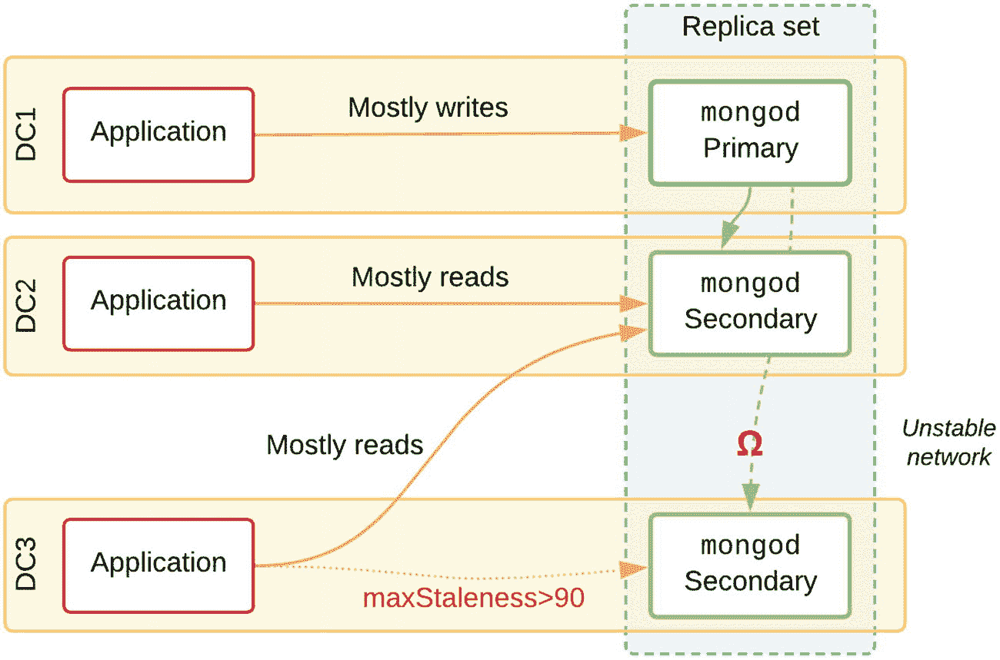
图 8-1 应用程序在新鲜度限制内从最近节点读取

### 限制数据陈旧度

在某些极端情况下，例如当从节点主机的工作负载配置严重不足时，从节点可能会严重落后于复制。想象一下，您正在执行从节点读取，而在工作负载高峰期，复制延迟了数小时。

通过在连接 URI 字符串中指定一个 `maxStalenessSeconds` 值（例如 `90`），可以在一定程度上避免这种情况。设置后，驱动程序将从其候选列表中排除任何复制落后主节点超过 90 秒的从节点。

在图 8-1 中，我们还看到 DC3 中的应用程序由于这种过度的复制延迟，正确地忽略了本地数据中心的从节点，转而从 DC2 中下一个最近的节点读取。

请记住，要完全避免 `stale`（陈旧）读取并因此 `maximize consistency`（最大化一致性），请使用 `primary` 读取偏好和 `majority` 读取关注级别。

### 标签集

读取偏好 `nearest` 和 `secondaryPreferred` 都可以与 `maxStalenessSeconds` 和*标签集*结合使用，以控制哪个节点被用于查询。假设您有一个特定的微服务[A]只从 `collection`[`A`] 读取，另一个微服务[B]只从 `collection`[`B`] 读取。我们可以在副本集配置中为成员配置标签，指定 `secondaryPreferred` 读取偏好，并为每个微服务使用不同的标签集值（图 8-2）。当所有节点都在线时，驱动程序会将微服务[A]（运行在 DC1 中）的流量路由到 `mongod`[1]，将微服务[B]（在 DC2 和 DC3 中）的流量路由到 `mongod`[3]。这意味着 `mongod`[1] 的缓存中主要工作集是 `collection`[`A`] 的文档，而 `mongod`[3] 的缓存中主要缓存的是 `collection`[`B`] 的文档。与在两个从节点之间随机定向读取相比，这应该会导致缓存抖动（和 I/O 读取）大大减少。

由于所有应用程序都指定了标签集，这种设置也意味着 `mongod`[2] 根本不会接收到从节点读取流量。在此示例中，`mongod`[1] 恰好是主节点，但由于没有其他节点具有匹配的 `{use: "msA"}` 标签，微服务[A]的 `secondaryPreferred` 读取偏好将被标签匹配覆盖，转而执行主节点读取。

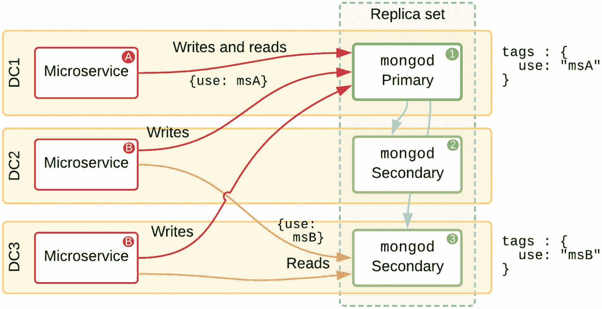
图 8-2 使用不同标签为每个应用程序定位特定成员

复制行为总是意味着通过主节点修改的文档将被加载到从节点的内存中，并可能驱逐其他缓存的文档。

关于读取偏好、数据新鲜度和标签的更多背景细节在第 5 章中介绍。关于确切的行为和语法，请参阅在线 MongoDB 文档^(⁸)。

## 高级 LDAP 与连接池

轻量级目录访问协议（LDAP）是 MongoDB 企业版支持的外部身份验证源之一（与 Kerberos 一起）。使用 LDAP 允许您通过现有系统（如 Windows Active Directory）管理密码。

#### 连接管理

一个简单的、使用 LDAP 为 MongoDB 部署提供身份验证的环境可能只有一台 LDAP 服务器可用。在这种设置中（图 8-3），由于任何原因（服务器过载、TLS 连接失败等）无法连接到 LDAP 服务器时，理想情况下应该能够重试 LDAP 请求。在 MongoDB 4.0 及更早版本中，OpenLDAP/`libldap` 库完全负责选择 LDAP 服务器、建立连接和错误处理。

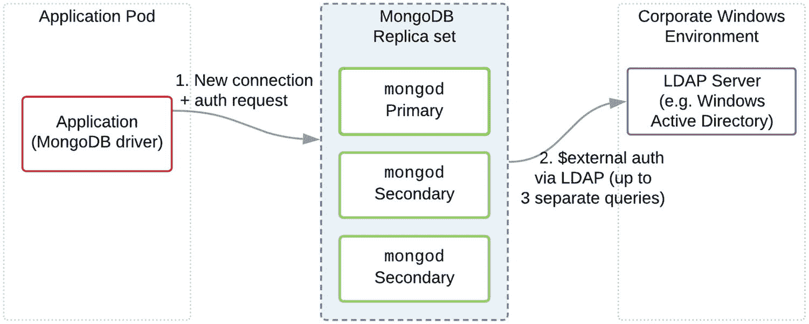
图 8-3 使用单个 LDAP 服务器的外部认证

从 MongoDB 4.2 开始，增加了一些 LDAP 增强功能，如连接池，这些功能极大地提高了 LDAP 身份验证的性能。最初，每个到 LDAP 服务器的连接都是按需打开并立即关闭的。如前所述，打开新连接可能会增加流程延迟。这一改进复用了 MongoDB 驱动程序使用的池化算法，以保持一个开放的连接池，用较低的延迟来服务传入的客户端请求。

### 多个 LDAP 服务器

MongoDB 也支持指定多个 LDAP 服务器。这对于因 LDAP 请求失败而无法承受任何停机时间的生产环境部署至关重要。当 LDAP 池较小且可用的 LDAP 服务器主机名不改变时，配置如下：

```yaml
security:
  ldap:
    servers: ldap1.mycompany.internal:389, \
             ldap2.mycompany.internal:389, \
             ldap3.mycompany.internal:389
```

在图 8-4 中，我们看到了一个包含三个采用轮询方式的 Active Directory 服务器的配置。


**图 8-4** 使用 LDAP 服务器池进行外部认证

在这种情况下，第一次认证尝试连接到了 LDAP 服务器 #1，但由于瞬时网络故障，此连接失败了。LDAP `authz` 模块使用的 OpenLDAP 库将在 10 秒后超时，并自动从其列表中重试另一台服务器。这次，它连接到了服务器 #3，并成功认证了用户。初始错误将被记录在 `mongodb.log` 中，但对应用程序的唯一影响是，连接时间比平时长了 10 秒。

由于认证过程仅在开启新的客户端连接时发生，如果应用程序已正确配置了连接池，那么新连接不会定期建立。因此，即使 LDAP 服务器不稳定，这种“卡顿”的风险也会很低。

这种方法需要在池中列出所有 LDAP 服务器的主机名或 IP 地址。对于一些大型组织，LDAP 服务器由单独的团队管理，并且可能会在不通知的情况下发生变更。因此，不可能预先知道所有 LDAP 服务器的主机名。

一种解决方案是在内部 DNS 中创建一个 `CNAME` 别名，例如 `ldap-pool.mycompany.internal`，该别名被配置为返回所有活动 LDAP 服务器的主机名。但是，如果您为 MongoDB 节点配置 `servers` 中只有一个条目，例如：

```yaml
security:
  ldap:
    servers: ldap-pool.mycompany.internal:389
```

那么 MongoDB 及其 OpenLDAP 库并不知道存在一个可用的 LDAP 服务器池。如果对某个 LDAP 服务器的第一次认证请求失败，它会认为该 LDAP 服务器宕机，甚至不会尝试重试。解决此情况的方法（在撰写本文时）是指定多次相同的别名，以强制进行 LDAP 请求重试，即：

```yaml
security:
  ldap:
    servers: ldap-pool.mycompany.internal:389, \
             ldap-pool.mycompany.internal:389, \
             ldap-pool.mycompany.internal:389
```

现在，任何单个 LDAP 服务器中的瞬时错误都将无缝重试，根本不会向应用程序显示任何错误。

一如既往，您应监控 MongoDB 日志中的任何错误，并做出相应反应，在错误开始影响生产应用程序之前纠正基础设施故障。

### 负载均衡器

OpenLDAP 库本身不维护关于池中 LDAP 服务器健康状况的任何状态。如果某台服务器宕机或不健康，认证尝试仍可能被路由到该服务器。MongoDB 4.2 及更高版本具有基本的健康检查功能，试图避免使用不健康的 LDAP 服务器。更好的方法是使用专用的 TCP 负载均衡器，它能够执行 LDAP 查询作为健康检查。如图 8-5 所示，MongoDB 节点与负载均衡器通信，负载均衡器将查询分发给健康的 LDAP 服务器。


**图 8-5** 负载均衡器代理并分发 LDAP 请求

该负载均衡器通常会随机地将请求分配给后端的 LDAP 服务器。大多数先进的负载均衡器还能够执行测试 LDAP 查询并检查结果。如果有任何 LDAP 服务器未及时响应，它们将暂时从池中移除。这样，任何发生故障或过载的 LDAP 服务器都将被忽略，并且不应导致 MongoDB LDAP 请求停滞。

假设负载均衡器只有一个主机名 `ldap-lb.mycompany.internal`。如前所述，我们应在 `security.ldap.servers` 中多次列出负载均衡器的主机名，以确保 TCP 级别的重试。

### 连接超时

为任何类型的分布式系统选择正确的超时值可能很棘手。过去对 MongoDB 来说也是如此，在早期版本中，一些默认的超时值对于大型或复杂集群来说并非总是最优的。

对于自 3.4 版以来的任何版本的 MongoDB，除非绝对必要，建议 `对服务器和驱动程序配置均使用默认超时值`。默认超时值已被选择为对具有多个 `mongos` 路由器和多个应用程序服务器的分片集群是最优的。

**警告**

由于之前的默认设置，网上仍存在大量无效建议。许多开发人员和数据库管理员倾向于尝试不同的值组合，以期挤出一些额外的性能，或在负载非常重的时期提高稳定性。

低超时值的一个风险是，它会导致几乎完成的操作的连接过早被切断，而服务器端的操作仍在完全执行。如果此时重试操作，服务器将并行运行两个相同的、有影响的操作。如果任其继续，应用程序将面临对其自身数据库基础设施发起一种 `拒绝服务攻击` 的风险。

#### 限制操作时间

为确保缓慢（通常是错误的或意外产生重大影响的）操作被终止并正确释放服务器端资源，请使用 `maxTimeMS` 而不是连接超时。

`maxTimeMS` 指定了在游标上处理操作的累计时间限制（以毫秒为单位）。MongoDB 在此时间限制内不计算客户端和服务器之间的网络延迟。超过 `maxTimeMS` 的正在进行的操作将在下一个可以安全中止的中断点被终止。


### 超时详情

`连接超时` 与驱动程序启动/打开到 MongoDB 节点的套接字连接相关。这是建立连接的第一步，发生在驱动程序尝试进行身份验证之前。只要 MongoDB 节点接收了传入的连接，此超时就不会被触发。

`套接字超时` 是关于监控持续的数据流入。如果数据流在指定的超时时间内中断，则该连接被视为停滞/断开。将此值设置为较低的值（例如 5 秒）意味着如果在此时间内没有数据发送/请求，则连接会超时并被回收。这会在应用程序和 MongoDB 节点之间产生不必要的连接搅动，这就是为什么不建议设置套接字超时。

`最大等待时间` 是关于当所有现有连接都已在使用时，驱动程序线程从连接池获取连接将阻塞多久。

`wtimeoutMS` 是关于等待写关注被处理的时间长度，可以根据所需的持久性为每个写操作设置不同的值。这与复制子系统相关，与建立应用程序和 MongoDB 节点之间的连接无关。

表 8-1 总结了不同等待和超时的默认值。

**表 8-1** Java 驱动程序的超时描述和值

| 设置 | 描述 | 默认值 |
| --- | --- | --- |
| `连接超时` | 值为 0 表示永不超时。仅在建立新连接 `Socket.connect(java.net.SocketAddress, int)` 时使用。 | 10000 (10s) |
| `套接字超时` | 用于 I/O 套接字读写操作 `Socket.setSoTimeout(int)`。 | 0 (无超时) |
| `最大等待时间` | 线程等待连接可用的最长时间（毫秒）。 | 1200000 (120s) |
| `wtimeoutMS` | 对应于写关注的 `wtimeout`。`wtimeoutMS` 指定了写关注的时间限制（毫秒）。 | 无默认值 |
| `maxTimeMS` | 这是游标超时，与前面提到的高级别连接超时无关。 | 无默认值 |

## 混合云模型

假设你有一个分片集群，其中多个数据库在两个数据中心本地运行。你的组织决定是时候在像 AWS 这样的公有云上测试运行一些实例了。有些数据比其他数据更敏感，因此决定一小部分数据（全部包含在一个集合中）不能存储在云端。一个极端的选择可能是提取出这些数据，并将其存储在本地一个单独的副本集中。

我们将通过一个示例来了解如何将部分数据迁移到云端，同时将特定的敏感数据子集保留在我们的私有数据中心。

### 管理敏感数据

将数据提取到一个全新的、独立的部署中，将需要对现有 API 调用和应用逻辑进行重大重构。另一种方法可以是使用非分片数据库的 `主分片` 概念来实现混合方法。有关分片的高级详细信息，请参见第 10 章和第 11 章。

> **注意**：任何敏感的分片集合已经分布在集群的 *所有* 分片上。对于下面的示例，首先需要 `mongodump` 然后 `mongorestore` 这些集合的数据到新的非分片集合中。

### 注意事项

迁移到云基础设施的主要动机之一是，能够在计算资源当前不需要时，通过在云中向上和向下扩展（或完全停止）来整体降低成本。

#### 带宽

有一个主要领域成本实际上可能会增加，那就是 `带宽费用`。本地数据中心之间的网络连接通常有固定的安装费和月度成本，与实际数据传输无关。相比之下，在云中，可用区（AZ）和区域之间的 `出站` 字节是按千兆字节收费的。但是，到云区域的 `入站` 字节是免费的。这意味着云中的 `mongos` 或辅助节点主要是在读取数据，就带宽成本而言不会很昂贵。没有主要的云提供商对每个可用区 *内部* 的带宽收费，但会对同一区域内数据中心之间传输的字节收取少量费用。

图 8-6 展示了一个副本集，其两个成员位于两个不同的本地数据中心。第三个成员在云中，还有一个隐藏的非投票成员位于同一云区域的不同可用区中。从云提供商的角度来看，到云中辅助节点的复制流量是 `入站` 数据。从基于云的 `mongos` 路由器到本地主节点的写入流量，从云提供商的角度看是 `出站`，因此将会被收费。

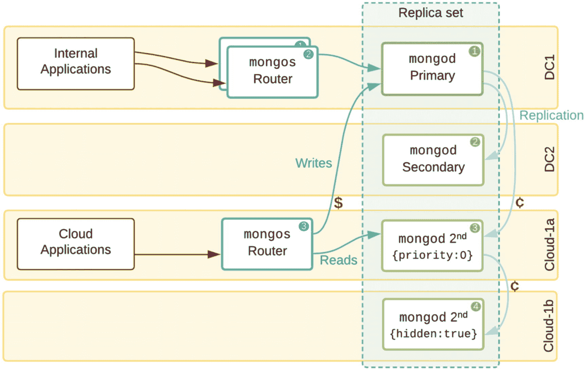

**图 8-6** 展示昂贵带宽的混合部署示例

许多云提供商还包含一个初始层级，其中每月有一定数量的 TB 是免费的。表 8-2 中的数字试图估算一个平均 MongoDB 集群的价格。价格自然会随着时间的推移而下降，但出站流量与区域内和可用区内流量费用之间的比率有助于解释为什么同一可用区内的副本集通常更便宜。

> **请记住**：应避免将副本集的所有成员部署在单个可用区内，因为这会跳过冗余级别，如果该可用区发生停机。

**表 8-2** 带宽费用比较（所有价格单位为美元/GB）

| 内部出站流量 | | | |
| --- | --- | --- | --- |
|   | 每 GB 出站费用 | 区域之间 | 可用区之间 |
| --- | --- | --- | --- |
| Microsoft Azure | $0.09 | **$0.09** (与出站到任何其他目的地的费率相同) | $0.01 |
| Google Cloud | $0.13 | $0.01 (美国境内) 至 $0.08 (洲际)，到/来自大洋洲最高 $0.15 | $0.01 |
| Amazon EC2 | $0.09 | $0.02 | $0.01 |
| IBM Cloud | $0.09 | $0.09 | - |
| 其他 (例如 Linode, DigitalOcean) | $0.02 | $0.02 | - |

> **注意**：上述托管解决方案均不收取入站流量费用。

### 压缩

在现代 MongoDB 集群中，`集群内通信` 已经被压缩以最小化所需带宽，当一些承载数据的节点最终迁移到云端时，这也带来了最小化带宽费用的愉快副作用。`应用和集群之间` (`mongos` 或主节点) 的流量压缩必须通过 `compressors` URI 参数或相应的设置器显式启用。

#### 高可用性

在许多情况下，组织可以访问两个数据中心，通常被指定为主站点和灾难恢复（DR）站点。正如我们已经了解到的，如果一个数据中心离线或被分区，双位置拓扑并不能保证高可用性。

在这些情况下，一些组织选择在云中放置一个仲裁器，以确保剩余数据中心中的一个承载数据的成员可以被选为主节点。然而，任何使用写关注多数（参见第 5 章）的应用程序，如果任一承载数据的成员不可用，将会停滞。

最好的选择是在云中保留完整的承载数据的节点，并对所有通信和静态存储进行加密。通过优化写入和更新工作负载以最小化操作日志，我们保持了复制的低带宽费用。

#### 数据主权

迁移到云端时，我们还需要考虑承载数据节点的 `位置`。公司政策或行业法规可能要求“事实来源”物理上驻留在组织完全控制的服务器上，因此必须在本地。

```javascript
if (condVar > someVal) {console.log("xxx")}
```


#### 陈旧读取

在某些情况下，我们可以通过读取已复制到云中辅助节点的一些稍微陈旧的数据来降低成本。这种数据可能总是有几秒钟的延迟，但在高写入工作负载期间可能会落后更多。（更多内容请参见辅助读取部分。）

无论如何，具有异步复制的分布式系统的性质意味着，我们永远无法保证辅助节点拥有已经写入主节点的数据。辅助节点根本无法知道主节点已确认但尚未刷新到磁盘的写操作。

因此，**如果你需要读取最新数据，你必须从主节点读取**，并产生任何相关的带宽费用。

### 迁移步骤

让我们设想一下，我们计划开始将完全本地化的应用程序和集群迁移到云端，以便在完全迁移之前积累管理云基础设施的机构知识和专业技能。

对于此示例，我们假设一个仅有两个数据中心的双分片集群，因此此次迁移的部分动机是在云端添加第三个数据中心。另一个动机是将一些应用程序服务器移动到可以每天在高峰工作负载期间上下扩展的云基础设施（图 8-7）。

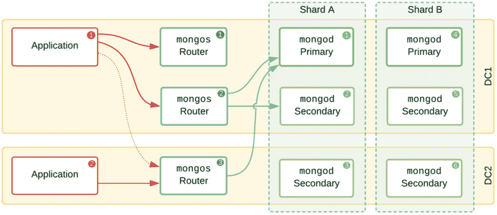

图 8-7

最初，数据和应用程序都在本地

#### 云辅助节点

如果我们正在逐步迁移到云，作为第一步，我们有几个不同的选择。一种（如图 8-8 所示）是最初将应用程序保留在本地，并将一些辅助节点移动到云端。默认启用 `replication chaining`，这些节点将从其副本集中位于 DC1 或 DC2 的其他节点之一进行复制。通过将 `priority` 设置为 `0`，我们将确保这些节点永远不会成为其副本集中的主节点。如果主节点在云端，来自 DC1 和 DC2 的所有应用程序写入流量都将被路由到云端，而复制流量将返回，从而显著增加云带宽成本。

在云辅助节点拓扑中，带宽费用将适用于传出的心跳，但传入的 `oplog` 数据是免费的。

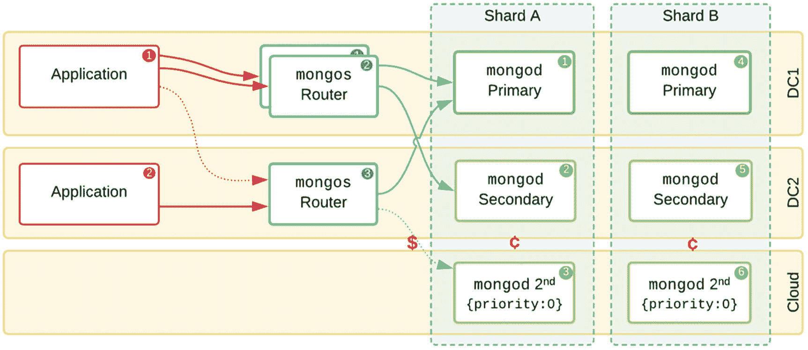

图 8-8

辅助节点为高可用性提供了第三个位置，但应用程序保留在本地

#### 云应用程序

另一个第一步是将一些应用程序移动到云端，通过在停机期间缩减应用程序来节省成本（见图 8-9）。在这个阶段，我们通常会看到内部应用程序保留在本地。这些可能是来自遗留系统的写密集型 *提取、转换和加载* (ETL) 工作负载，以及内部分析查询工作负载等。

根据我们的最佳实践，我们将 `mongos` 路由器放置在与应用程序和微服务相同的区域/区域中。

在这个拓扑中，我们看到我们正在为从 `mongos` 到主节点的写有效负载支付传出带宽费用。用于读取的传出请求数据包通常比返回到云的结果数据小，这使得这些操作很便宜。

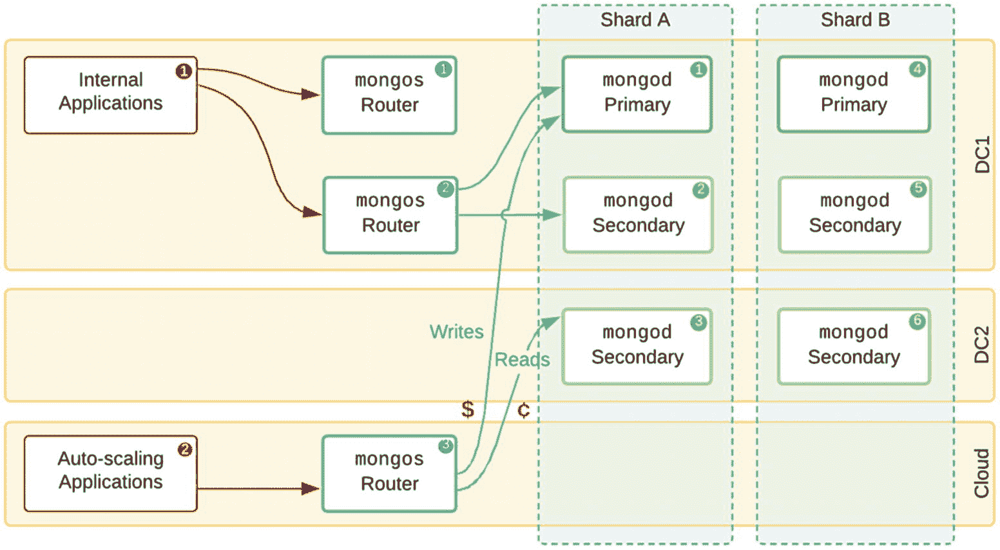

图 8-9

只有自动扩展的应用程序被移到云端

#### 完全混合

自然的下一步是将应用程序和节点都组合在云端（见图 8-10）。与之前一样，`{priority: 0}` 确保云节点永远不会成为主节点，因为我们假设大部分写操作仍然源自本地应用程序。

我们需要为从云应用程序传出的任何字节支付带宽费用。然而，在这种情况下，客户端应用程序写入不多，因此云中的 `mongos` 和辅助节点主要*接收*字节，这不会产生费用。

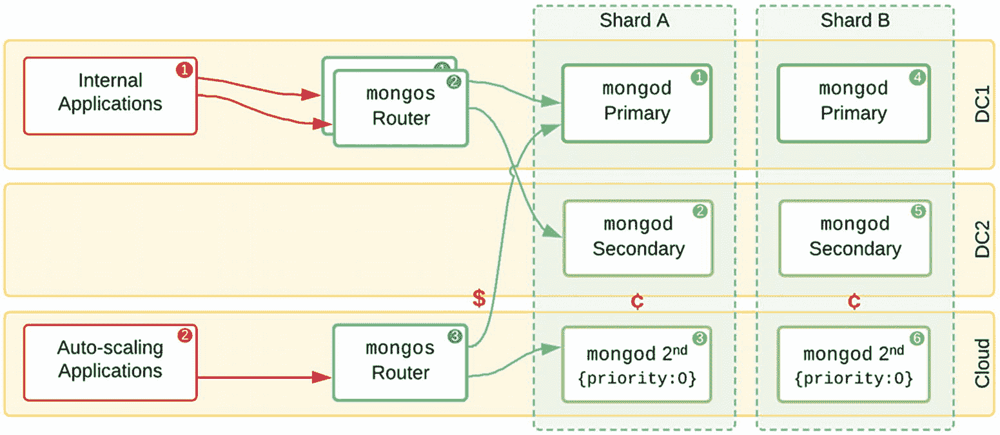

图 8-10

允许在云中进行辅助读取的混合拓扑

#### 非对称分片

我们将探索的最后迭代包括非对称分片，分片 A 完全位于本地，分片 B 大部分在云端，但所有数据至少有一个副本在本地（图 8-11）。

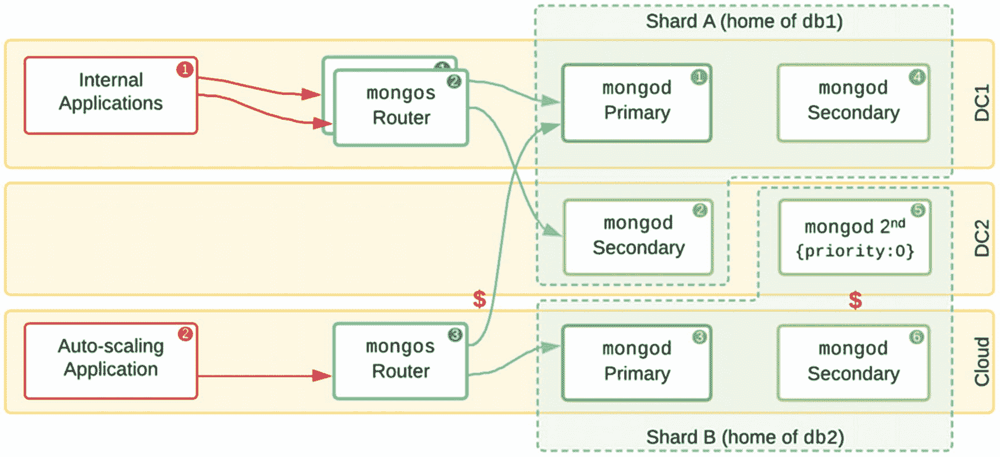

图 8-11

一个高级拓扑，其中一个分片主节点在云端

通过仔细地将某些数据库“归属”到分片 A 或分片 B，我们可以确保敏感的未分片集合完全位于本地。当由于公司政策或法规，某些数据子集不能存储在云中时，这可能很有用。

请注意，通过只有两个数据中心，我们在分片 A 中失去了高可用性。但是，如果 DC2 宕机，内部应用程序实际上不会受到影响。

在云区域中，可以将两个节点放置在不同的可用区（AZ）中以提供所需的冗余。

#### 数据库结构

图 8-12 展示了如何在我们的混合集群上部署两个数据库的示例。分片 A 物理上位于本地数据承载节点上，因此虽然它的分片集合（例如 `sharded1`）会有一半数据在分片 B 中从而在云节点上，但未分片的集合（如 `onprem1` 和 `onprem2`）保证存储在完全受控的本地主机上。默认情况下，没有任何措施可以阻止云上具有足够权限的应用程序查询 `db1.onprem1` 并将一些机密数据传输到公共云。

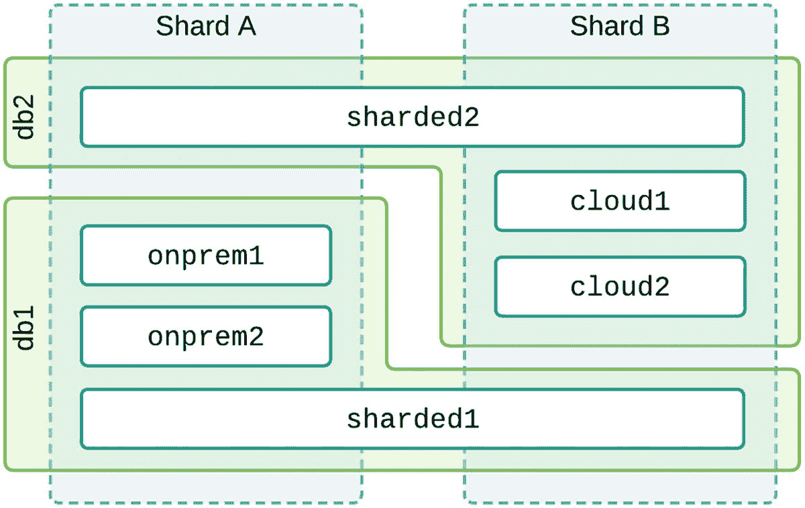

图 8-12

主要供云使用的数据库可以大部分存储在云中

一个完全不同的替代方案是使用近期的*字段级加密*（FLE）机制（参见第 4 章），该机制在官方驱动程序内部对某些字段或子文档进行加密和解密。这意味着没有机密数据会以未加密形式到达数据库，因此要求某些类别的数据只能持久化在本地的合规规则可以得到满足。

#### 访问控制

为了完全防止某些数据“泄露”，云上的应用程序可以连接一个只对 `db2` 具有读/写访问权限的用户，因此无权查询 `db1` 中包含的机密数据。

在清单 8-1 中，我们为每个应用程序定义一个用户。面向客户的云应用程序的用户将不被允许访问 `db1`。

```javascript
// The on-prem application user can access both databases
db.createUser(
{
user: "userPrem",
pwd: "......"
roles: [
{ role: "readWrite", db: "db1" }
{ role: "readWrite", db: "db2" }
],
}
)
// The cloud application user can only access db2
db.createUser(
{
user: "userCloud",
pwd: "......"
roles: [
{ role: "readWrite", db: "db2" }
],
}
)
// Listing 8-1
// Create cloud user which can’t read private db1
```

在 MongoDB 3.6+ 中，你可以使用 `authRestrictions`^(⁹) 进一步将用户账户限制为从特定的 IP 地址或 CIDR 范围连接。例如，本地账户可能仅对来自本地地址范围的登录有效。在处理高度机密数据时，创建两个完全独立的部署通常更简单、更安全，这些部署可以根据各自的数据增长通过分片进行水平扩展。


### 自定义写关注点

假设我们已经确定采用混合拓扑结构：两个位于私有数据中心的承载数据节点，以及一个位于云端的节点。虽然我们已防止云端节点成为主节点，但应用程序并不知晓这两个本地节点具有特殊属性。例如，我们可能希望确保当使用 `majority` 写关注点执行操作时，由这两个本地节点确认写入。这样，如果其中一个本地节点宕机，另一个可以立即接管主节点角色，而无需先追赶操作日志。

MongoDB 支持自定义写关注点来满足这类用例。现在我们将创建一个名为 `OnPrem` 的写关注点，以确保始终包含 `dc1` 和 `dc2` 中的节点。

首先，我们需要为每个分片副本集中的节点添加 `dc` 标签：

```
conf = rs.conf();
conf.members[0].tags = { "dc": "dc1"};
conf.members[1].tags = { "dc": "dc2"};
conf.members[2].tags = { "cloud": "aws-us-east1"};
rs.reconfig(conf);
```

然后，我们可以在每个副本集中创建自定义写关注点：

```
conf = rs.conf();
conf.settings = { getLastErrorModes: { OnPrem : { "dc": 2 } } };
rs.reconfig(conf);
```

这会创建一个名为 `OnPrem` 的自定义写关注点，*仅*当写入在具有 `dc` 标签*不同*值的两个成员上被确认时，该条件才被视为满足。

最后，应用程序可以按如下方式使用此自定义写关注点：

```
db.myCollection.update(
{ id: 123 },
[ { $set: { value: "abc", lastUpdated: "$$NOW"} ],
{ writeConcern: { w: "OnPrem" } }
)
```

在我们这个三成员分片中，`OnPrem` 写关注点意味着两个本地节点都必须确认写入。如果任何一个本地节点不可用，任何指定了此写关注点的写入操作都将超时。在 DC1 和 DC2 中添加更多成员并创建 PS|SS|S 拓扑结构将提供更好的容错能力。

### 物联网

物联网已成为大规模分布式系统的代名词，这类系统包含大量小型设备，通过网络进行通信，通常收集数据以供后续整理和分析。

有许多关于大规模物联网服务的用例示例和博客文章，重点讨论所需的模式设计，这超出了本书范围。通常，传感器和执行器与边缘网关通信，网关对传入的数据流进行初步处理和聚合，并准备存储。

从拓扑设计角度看，主要问题在于所需的庞大连接数量，如图 8-13 所示。大多数使用 MongoDB 驱动程序的应用程序会打开一个到数据库的连接池以供重用。

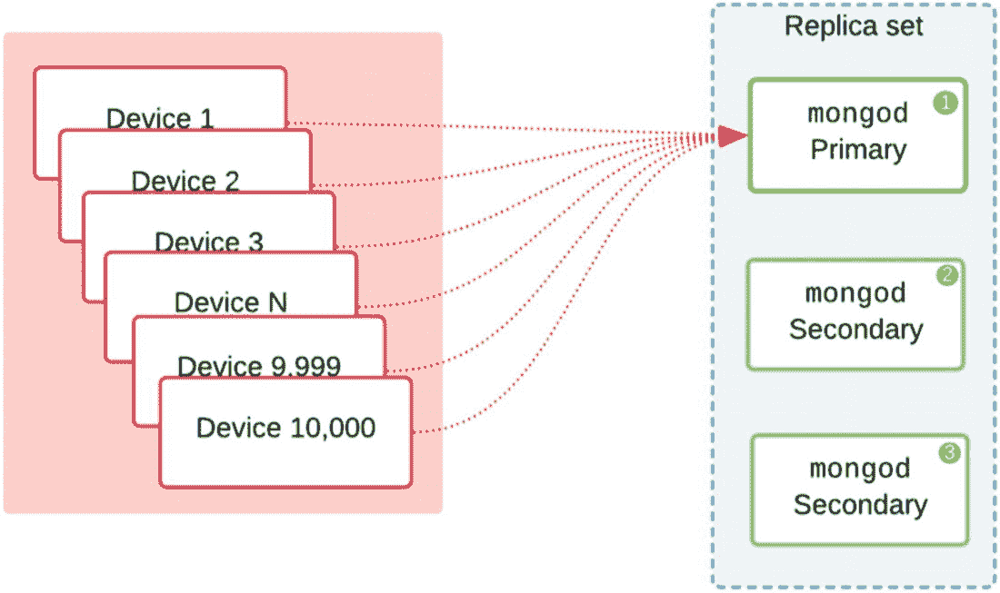

*图 8-13. IoT 设备直接连接到 MongoDB*

#### 连接管理

对于作为*微服务*运行的应用程序，需要将连接池大小（每个服务/Pod/API）精确调优，以避免过多的开放连接压垮主节点或 `mongos`。在物联网场景中，可能有数百万台设备各自连接到数据库进行更新，这个问题会更加严重。

#### 短期连接

对于物联网，简单的解决方案是根本不维持开放连接。相反，将数据累积到预定义的存储桶中，然后每小时（或更不频繁）仅创建一次 `MongoClient` 对象并建立数据库连接，以分享该小时的数据摘要。假设这些数据可以在几秒钟内插入，那么数千台设备平均在任何时间点只会打开一个到集群的连接。

#### 写入扩展

对于数百万台设备，您可能需要考虑分片集群。这将允许您将数据拆分为子集，每个子集有一个可以接受写入操作的主节点。这为高插入/更新工作负载提供了横向扩展能力。

如果您预计将在全球部署设备，并希望确保对 MongoDB 部署的低延迟写入操作，请参阅第 6 章了解全球拓扑结构的更多细节，以及第 10 章和第 11 章了解高级分片主题。

### 内存存储

随着 WiredTiger 存储引擎的出现（自 3.4 版起成为默认引擎），MongoDB 还为企业客户添加了纯内存存储引擎。内存存储引擎不会将任何数据持久化到磁盘，因此适用于一些利基用例，其中可预测的延迟至关重要，并且数据可以纯粹在内存中读写。当在副本集中配置时，存在较低但非零的风险，即所有节点可能同时故障，导致数据完全丢失。显然，这不适用于任何需要长期持久化数据的系统。一种解决方案是部署第四个隐藏节点，运行正常的 WiredTiger 存储引擎，将数据持久化到磁盘（图 8-14）。通过将其与主节点置于同一数据中心，我们可以通过最小化网络延迟来确保最佳的复制性能。

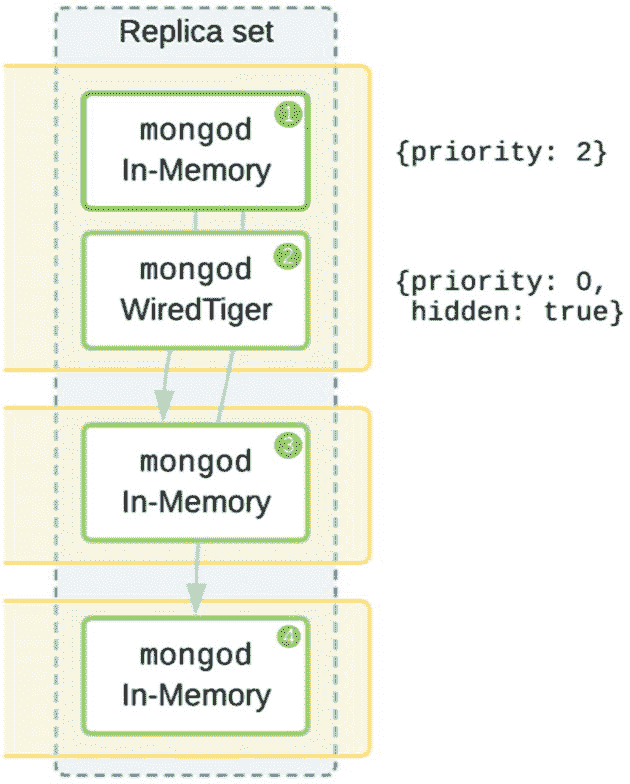

*图 8-14. 包含一个 WiredTiger 节点的内存部署*

由于内存存储引擎不会将数据刷新到磁盘，几乎没有 I/O 需求，人们很容易认为它可以比正常的 WiredTiger 配置以更高的速度处理数据。有趣的是，在大多数情况下，吞吐量几乎相同，特别是在副本集中，网络延迟使得复制成为瓶颈。

总的来说，虽然有趣，但这种存储引擎并未被广泛使用，因为 WiredTiger 性能相似，即使在进程或服务器重启后也能保持数据持久性。

### 移动数据承载节点

MongoDB 复制系统被设计为具有自动故障转移功能的分布式系统。写入始终在主节点上发生并被复制。分片允许我们拥有多个主节点来扩展工作负载，但每个主节点都有明确的“范围”，没有重叠，也没有冲突风险。

某些用例需要一种主-主配置类型，其中两个隔离的节点都接受相同文档范围的写入，但这需要冲突解决机制。

在接下来的内容中，我们将探讨此类系统的一个例子：移动数据承载节点。最后我们将看到，这种方法充满了妥协。

#### 场景

假设我们正在运营一支赛车队，我们需要在一个赛季中将一套复杂的设备从一个场地移动到另一个场地。这套设备将包括一个移动计算设备机架和一个 MongoDB 数据库。还有一个工厂位置，团队的其他成员在那里测试新设备和场景，也需要访问相同的数据。

一些比赛场地可能有良好的互联网连接，而另一些可能完全没有互联网连接。

随着我们从一个比赛移动到另一个比赛，移动计算设备可能一次离线数周。在此期间，工厂中的数据库需要保持在线、可用且可修改。

更困难的是，移动数据库是比赛准备工作的关键组件，因此任何停机都是不可接受的。因此，我们实际上会携带两个数据承载节点以实现冗余。

那么问题是：我们如何设计一个拓扑结构，以提供高可用性，其中两个节点在大部分时间处于离线状态，并且允许从两个位置进行写入？


### 解决方案

我们将通过几个示例来更好地理解这些需求的难度。在图 8-15 中，我们看到一个简化方案，该方案在移动“工具包”中包含了两个位于不同主机上的节点以增加冗余度，并在工厂中包含一个节点。请注意，工厂节点没有优先级，因此不会成为主节点。在移动工具包中，一个节点的规格较低（CPU 核心数、内存），以节省资源成本，并且被赋予较低的优先级，因此它通常保持为辅助节点。

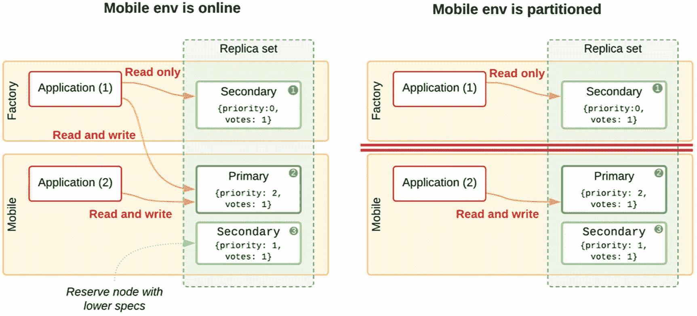

图 8-15：使用移动工具包的简化方案

当移动环境在线时，我们拥有一个相当标准的副本集，只是我们强制让一个移动节点成为主节点。这意味着当移动工具包连接互联网时，工厂位置可以写入数据，否则只能读取数据（参见图 8-15，右侧）。

#### 固定站点冗余

虽然我们有了移动冗余，但我们无法承受工厂的任何读取停机时间，因此我们将在工厂中添加第二个承载数据的节点。我们必须添加一个仲裁节点以获得奇数个成员。我们将把仲裁节点添加到移动工具包中，以便在两个环境因无互联网而被分区时，它能托管多数票。

图 8-16 展示了这个新的五成员拓扑结构，该结构在两者分区或移动工具包关闭时，对工厂具有相同的限制。

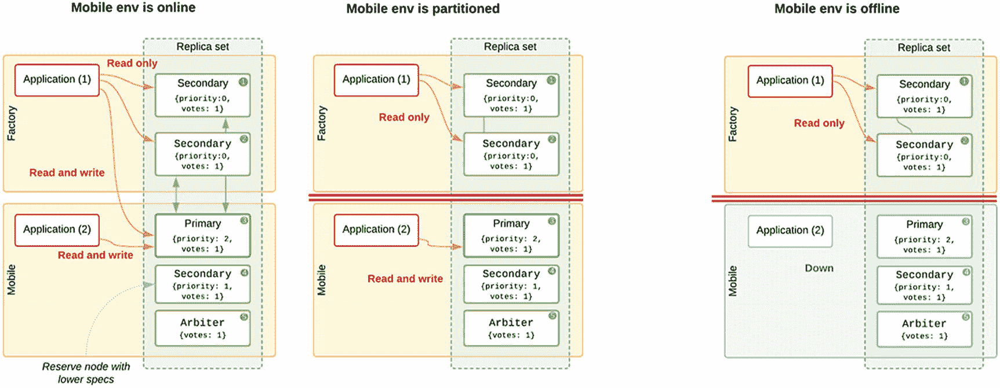

图 8-16：一个更复杂、具有冗余性的移动部署

#### 多主节点

现在我们希望整合对多主节点副本集的需求。至少工厂需要能够在移动环境分区时临时写入数据。在图 8-17 中，我们重新构建了拓扑结构，将一个仲裁节点放在工厂，并给一个节点较低的优先级。现在当两者分离时，将进行选举，工厂中的节点 1 将自动成为主节点。在移动环境中，需要一些手动干预来强制指定主节点。我们要么使用 `rs.reconfig()` 删除工厂仲裁节点的条目，要么为移动仲裁节点创建一个新条目。一种有风险的方法是编辑所有移动主机上的 `/etc/hosts` 文件，将工厂仲裁节点的主机名覆盖为运行在移动工具包主机上的某个主机名。由于仲裁节点没有状态或任何数据，运行在移动环境中的 `mongod` 进程可以轻松接管此角色。

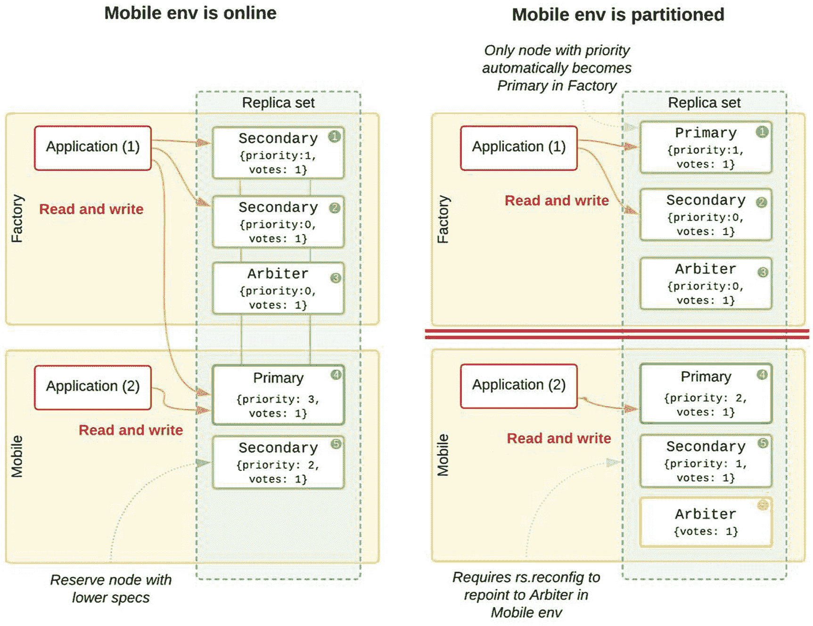

图 8-17：一个支持多主节点的移动部署

现在，我们已成功强制实现多主节点设置并创建了一个 `脑裂集群`，尽管选举任期机制应能阻止其中一方接受冲突的写入操作。

此时，如果互联网恢复并且仲裁节点主机名的重映射被重置，两个环境中的节点数据将可能不一致，可能有完全不同的文档共享相同的 `_id` 主键值。为避免损坏副本集并恢复稳定的复制，需要擦除其中一组节点（节点 #1 和 #2，或者节点 #4 和 #5）的数据文件并初始化初始同步。

实际上，这种主-主拓扑需要手动重新配置。当副本集重新统一时，将会发生数据丢失。MongoDB Realm 将提供用于实现离线移动设备和自动冲突解决的工具包，或许可以满足许多类似此场景的用例，而无需任何集群级别的定制。

## 关键要点

从本章中，需要记住的关键概念如下：

*   虽然 MongoDB 确实支持许多自定义配置，但其中大多数都伴随着各种权衡。

*   与大多数信息技术挑战一样，定制解决方案需要在业务目标和一系列妥协之间取得平衡。

*   使用 Kerberos 或 LDAP 进行外部认证，可以通过负载均衡和启用连接重试来实现扩展。

*   混合本地/云集群可以带来一些有用的好处，例如在保持私有数据不上云的同时实现应用程序扩展。

*   物联网的数据库存储扩展可以通过控制和关闭连接，以及通过分片增加写入容量来实现。

*   手工打造的主-主拓扑充满了妥协，并且难以实现弹性。MongoDB Realm 引入了一个生产就绪的同步和冲突解决系统。

脚注 1   2

### 9. 备份与恢复

本章涵盖与拓扑设计相关的备份决策。我们将探讨 MongoDB 自身的企业工具，用于对分片集群执行时间点恢复，以及使用脚本对地理分布的集群进行快照，并将备份数据保留在数据来源国内以符合 GDPR 要求。

## 目标

进行备份的主要动机是什么？以下是现实世界中最常见的一些备份用途：

*   回滚因 `开发人员` 错误而进行的更改。这可能是一个在测试中被遗漏的应用程序错误，并且已经开始在整个部署级别损坏数据。

*   回滚因 `客户` 错误而进行的更改。在多租户系统中，可能有客户删除了一些数据，然后意识到这些数据仍然需要。有时可能只需要恢复单个数据库或集合。

*   回滚因 `管理员` 错误而进行的更改。数据库管理员可能意外删除了整个集合，误以为他们连接的是测试/暂存集群。

*   发生全站灾难，生产数据库和所有服务器已完全丢失。在这种情况下，异地备份对于恢复运营至关重要。

*   使用生产系统的最新备份来更新暂存或开发数据库，以便可以在真实、近期的数据上进行测试。

在以上所有情况下，备份都需要反映数据库的一致状态。我们不希望捕获数据文件的快照，其中写入操作仅部分刷写到磁盘，或者写入操作仅部分完成。

大多数组织会定义一个 `恢复点目标` (RPO) 和一个 `恢复时间目标` (RTO) 以确保业务连续性。RPO 是可能丢失的数据更改的时间量。如果我们每 12 小时进行一次备份快照，那么最多可能丢失最近 12 小时的数据。RTO 是从灾难发生到数据库能够从备份完全恢复功能所允许的最大时间。某些备份/恢复方法可以比其他方法实现更快的恢复。

## 避免恢复

虽然拥有备份并能够恢复大型、地理分布的分片集群至关重要，但在灾难后使它们重新上线总是很复杂的。我们应尽可能避免人为错误导致此类活动。


## 测试环境

减少错误的一种方法是对应用程序进行彻底的单元测试和集成测试。从拓扑结构角度来看，我们可以借助建立合适的开发环境（`DEV`）以及用户验收测试或预发布环境（`UAT`）来提供帮助。这些环境应在操作系统版本和安全配置方面与生产环境（`PROD`）尽可能匹配，并使用与生产环境相同的 MongoDB 版本。

`DEV` 和 `UAT` 环境在 CPU 和内存资源方面容量可以较小，测试数据的规模也应按与 `PROD` 相似的比例缩减。`UAT` 环境至少应在分片数量、配置服务器数量以及集合的分片方式上与生产环境拓扑匹配。

例如，如表 9-1 所示，如果你有一个 `PROD` 集群，包含 3 个分片，共 6TB 数据，每台主机有 256GB 内存，你可以创建一个 `UAT` 环境：同样是 3 个分片，但每台主机仅 64GB 内存，数据量为 `PROD` 的 1/4，即约 1.5TB。这应能保持内存中工作集的比例大致相当，以更接近地匹配性能影响。

表 9-1：基于 `PROD` 规模调整的 `UAT` 和 `DEV` 环境示例

|   | 拓扑结构 | 资源 | 数据 |
| --- | --- | --- | --- |
| `PROD` | 3 分片集群 | 每台主机 32 核，256GB RAM | 总计 6TB |
| `UAT/预发布` | 3 分片集群 | 每台主机 8 核，64GB RAM | 总计 1.5TB |
| `DEV` | 单分片集群 | 每台主机 8 核，32GB RAM | 总计 250GB（分片数为 `UAT` 的 1/3，RAM 为 `UAT` 的 1/2） |

> **注意**
>
> 如果你需要在生产环境中达到非常具体的性能目标，`UAT` 环境应完全匹配其资源，并恢复近期的备份以使用真实数据进行性能测试。

### 捕获应用程序错误

`DEV` 环境在分片和冗余方面可以更简化。即使生产环境是采用五节点副本集的多分片集群，`DEV` 环境也可以仅使用一个包含三节点副本集的单分片。

`DEV` 环境应能模拟副本集故障切换以及与 `mongos` 的交互，因此仅使用单节点是不够的。通过首先在 `DEV` 环境中测试应用程序变更，应能发现可能损坏或删除有效数据的错误，从而避免因从备份恢复而导致的集群范围回滚。

### 捕获配置错误

主要的集群变更，如分片新集合、添加索引以及任何类型的配置更改，都存在风险，因此应首先在 `UAT` 环境中运行。通过在 `UAT` 环境中设置与生产相同数量的分片，数据库管理员可以在功能上与 `PROD` 完全相同的环境中测试分片标签、区域、预分片和迁移影响。

## 非分片集群

备份单节点或单个副本集相对简单，因为只有一个节点接受写入。分片集群则更复杂，因为有多个主节点接受写入，并且文档块可能随时在分片之间迁移。

> **注意**
>
> 正如我们在第 1 章讨论过的，单节点绝不应使用于生产环境，因为它完全不提供弹性。然而，在某些情况下，MongoDB 被用于本地开发或研究，此时你可能希望在特定时间点对数据进行快照。

对于适用于单节点或副本集的简单备份，有三种通用方法：

1.  **停止节点**，然后复制数据路径中的所有文件，这可能需要几分钟或几小时。
2.  使用 `db.fsyncLock()` **锁定节点**，并进行文件系统快照（这需要像 `LVM` 这样的逻辑卷管理系统），几秒钟后解锁。
3.  保持**所有节点在线**，运行 `mongodump` 来复制数据、元数据（但不包括索引本身）以及 `oplog`。

### 完全复制

停止节点进行完全复制是最简单且恢复最快的方法。如果你有足够的磁盘空间来完整复制 `dbpath`，你将获得所有数据和索引的快照。如果你需要回滚到该时间点，你可以启动一个新的 `mongod` 进程，其 `--dbpath` 参数指向该数据目录，即可立即完成恢复。

由于数据文件默认已经压缩，对此副本进行任何额外的压缩不太可能带来明显的额外空间节省，并且只会在恢复时需要更多时间进行解压缩，从而进一步延迟恢复。

### 采取快照

下一种方法是获取干净的文件系统快照。此方法需要使用 Linux *逻辑卷管理器*（`LVM`）的存储卷。借助 `LVM`，你可以构建一个由多个较小物理卷支持的大卷组（`VG`），还可以选择提供一定额外性能和冗余的 `RAID` 级别。然后，你可以为 MongoDB 节点的数据路径定义一个逻辑卷，并留出一些未分配的空间用于快照。

`LVM` 允许你对卷进行快照。你可以随着时间的推移创建多个增量快照，只有更改的块（称为 delta）需要存储空间。你可以保留节点 6 小时或每日的快照，其占用的物理存储空间仅为完整独立副本的一小部分。

*弹性块存储*（`EBS`）快照在亚马逊 `AWS` 上使用了相同的概念。所有主流云供应商也提供类似的快照功能。`EBS` 快照存储在与原始存储卷相同的云区域中。如果你创建了地缘分片集群以遵守全球数据保护法规，你对客户数据的快照自然会驻留在与生产数据相同的国家/地区。你仍然应该加密云备份，以进一步确保满足 `GDPR` 和其他法规的注意义务条款。有关法律规定的更多详情，请参见第 4 章。

#### 刷新磁盘

在 MongoDB 中采取快照之前的先决步骤非常简单。你需要通过 Mongo shell 或脚本连接到节点，并在启动快照前发出 `db.fsyncLock()`。这确保任何待处理的磁盘刷新都已完成，磁盘上的状态完全干净，就像你已经干净地关闭了节点一样。然而，此时 MongoDB 对任何新的写操作都已锁定，因此即使在生产环境中，我们也希望避免这种情况，哪怕只是很短的时间。

#### 触发快照

接下来，可以触发快照（但不一定立即完成），然后你可以立即使用同一个 Mongo shell 发出 `db.fsyncUnlock()`。这会解除锁定并允许再次写入。`LVM` 和 `EBS` 快照随后可以在它们自己的时间内完成，因为它们将反映快照被触发时的时间点，此时 MongoDB 数据文件处于干净状态。

#### 恢复快照

这种方法的主要缺点是**恢复数据文件可能很慢**。由于我们采用增量备份以节省空间，恢复特定快照需要将原始状态与更改增量相结合。根据你使用的具体系统、触发备份的频率以及更新旧文档的频率，恢复 terabytes 的数据可能需要几分钟到几小时不等。

如果你依赖这些备份作为灾难恢复方法，你需要对恢复时间进行实际测试，以确保能够在内部服务级别协议（`SLA`）要求的时间（例如 `RTO`）内检索到最近的备份。


### `mongodump`

当节点写入绝对不能被锁定，或者无法使用 LVM 快照等类似方法时，可以使用 `mongodump` 命令行工具转储节点（或整个集群）的全部数据。此工具连接到一个节点，遍历所有数据库和集合，转储每个文档。默认情况下，它会创建一个 `dump` 文件夹，其中包含每个集合的 BSON 格式数据文件以及包含任何索引规范的相应元数据文件。请注意，为了速度和紧凑性，`它不会转储索引本身`。这可能会使恢复过程非常缓慢，因为所有索引都需要从头开始重建。由于转储需要将所有文档从磁盘加载并解压缩到内存中，在转储完成之前，会对缓存以及随之而来的整体数据库性能产生相当大的影响。

#### 操作日志一致性

转储整个节点可能需要几分钟，有时甚至几小时。你应该选择性地转储一份操作日志副本，并在恢复时应用它，以便获得某个时间点的一致数据版本。否则，你可能在时间点 0（t⁰）先转储了集合 `aaa`，但在转储进行到 5 分钟（t⁵）时，应用程序对集合 `aaa` 和 `zzz` 中的文档进行了更改。最终的转储将包含对 `zzz` 在 t⁵ 的更改，但不包含对 `aaa` 的更改，从而导致数据状态不一致。`mongorestore` 中的 `--oplogReplay` 选项允许你将所有集合一致地恢复到 `mongodump` 使用 `--oplog` 选项完成时的时间点。

#### 数据子集

如果整个数据库太大，或者你需要将集群的数据子集转储到不同的存储区域以符合 GDPR 要求，可以使用 `mongodump` 中的 `--query` 选项来过滤数据。例如，如果你想要转储 `customers` 集合的欧盟数据，可以使用以下命令进行转储：

```
mongodump -d=myDB -c=customers --query='{ "country":
{ "$in": ["BE", "CZ", "DK", "DE", "EE", ...] }}'
```

#### 读取偏好

默认情况下，`mongodump` 会从主节点读取数据，以确保转储的是最新数据。但如果你想限制对存储 I/O 和工作集缓存刷新的性能影响，可以指定 `--readPreference=secondary` 来强制从从节点读取数据。

#### 用于转储恢复的 `Mongorestore`

当需要恢复由 `mongodump` 生成的转储时，`mongorestore` 命令将连接到一个集群（无论是否为空），并可以恢复数据，可选择在导入前删除任何现有的集合。

文档恢复后，此命令会读取包含索引定义的元数据，并着手创建索引。根据索引的复杂性、分布和数据大小，`索引构建可能需要数小时或数天`才能完全完成。在此期间，应用程序的操作性能将受到严重影响。对于任何大型数据集，这种漫长的恢复时间是 `mongodump`/`mongorestore` 方法的主要缺点。

#### 将转储恢复到独立节点

对分片集群进行文件系统快照时，你必须恢复到具有相同分片数的集群。使用 `mongodump`/`mongorestore`，你可以将分片集群转储到一个统一的备份集中，每个集合一个 BSON 文件。然后，你可以将其恢复到副本集甚至独立节点。这对于使用来自生产环境分片集群的真实数据更新 DEV 和 UAT 环境非常有用。

### 副本集

备份副本集可以通过前面列出的任何适用于独立节点的方法执行。但是，我们现在可以选择从多个节点中进行备份。主节点是拥有最新写入的节点，但我们不想阻止主节点上的写入，因为这会影响生产环境中的任何应用程序。对于手动备份，从节点通常是一个更好的选择，因为如果应用程序默认从主节点读取，那么除了复制之外，从节点没有其他外部工作负载。更好的方法是添加一个额外的隐藏成员用于备份和其他特殊工作负载。我们可以安全地对这个隐藏节点调用 `db.fsyncLock()` 或干净地关闭它进行长时间操作，而不会以任何方式影响副本集的可用性或应用程序性能。

### 延迟成员

我们在第 2 章中介绍了延迟成员的概念。在某些情况下，这些节点可以用作防止严重人为错误的额外保护。如果没有其他备份可用，如果数据库管理员意外删除了整个集合，或者从每个文档中移除了某个字段，这个延迟成员至少会拥有几个小时前的一致副本。

如果发生灾难，并且活动成员已经复制了数据删除操作，它们可以被关闭，主节点的操作日志被转储，然后重新启动延迟成员并配置为主节点。图 9-1 显示，操作日志可以通过新的主节点*重放*，直到执行错误操作之前的时刻。

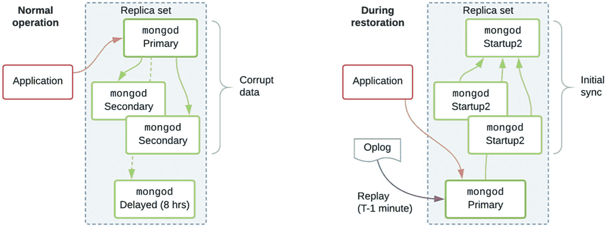

**图 9-1**
通过延迟成员恢复

大多数人为错误不需要采取如此极端的措施。延迟成员也可用于查找和导出被意外删除或修改的数据子集。

如果你选择这种方法，应该预先创建并彻底测试操作手册和脚本，以便恢复场景能够尽可能顺利地执行，涉及很少或无需手动步骤。

**注意**

在 MongoDB Atlas 或使用 Ops/Cloud Manager 备份时，你可以利用*可查询备份*来查询连续备份中的某个时间点，并查找旧文档或值。


## 恢复性能

作为任何灾难恢复计划的一部分，测试、衡量和优化恢复性能至关重要。为了最大程度地减少停机时间，我们希望将备份物理上靠近参与恢复的主机。如果是在本地托管，您需要平衡将备份保存在异地的要求，同时又要确保网络性能不会因数据下载而延迟，所以备份不能离得太远。

### 分片大小

推荐的最大分片大小为 2TB，原因之一是超过这个大小后，恢复数据就会达到大多数网络的容量极限。例如，如果我们尝试通过千兆连接（实际速度约为每秒 100 MB）替换单个 8TB 节点，仅数据传输时间就大约需要 23 小时。

### 云托管

主要的云提供商都提供低成本、长期的文件存储解决方案，适用于存储大型 MongoDB 备份。它们通常不会公布基准测试，更不用说保证存储传输速度了。恢复时间将取决于中间网络，在同一可用区和区域内的计算实例之间的传输速度要比传输到私有数据中心快得多。请记住，从云存储恢复数据也会产生带宽费用。

### 媒介类型

正如我们在 第 1 章 中介绍的，不同的媒介会有截然不同的吞吐率。简单地复制或下载大型数据文件不会高度依赖寻道时间，因此机械硬盘可能不会比 SSD 慢很多。但是当通过 `mongorestore` 恢复并构建索引时，SSD 更低的寻道时间可以显著减少整体恢复时间。

### 压缩

从 `mongodump` 恢复时，文档已经以 BSON 格式存储，并且可以使用 `--gzip` 和 `--archive` 选项在磁盘上进行压缩以减少存储需求。恢复时，解压缩将需要相当多的 CPU 周期。

### 索引重建

关联的 `.metadata.json` 文件包含集合选项和索引定义，并且将为每个集合重建索引。根据索引的数量和复杂性、字段值的分布以及可用的 RAM 量，索引构建阶段可能与整个数据写入阶段一样长，甚至更长。

## 分片集群

分片集群比副本集更难进行一致的备份，因为有多个主节点（primary）在执行写入，并且它们可能处于不同程度的负载下。从节点（secondary）也很可能受到这些相同的工作负载差异影响。图 9-2 展示了一个全局分片集群，其中每个分片的独立备份存储在同一区域，但配置服务器的数据则备份到 *美洲* 数据中心。

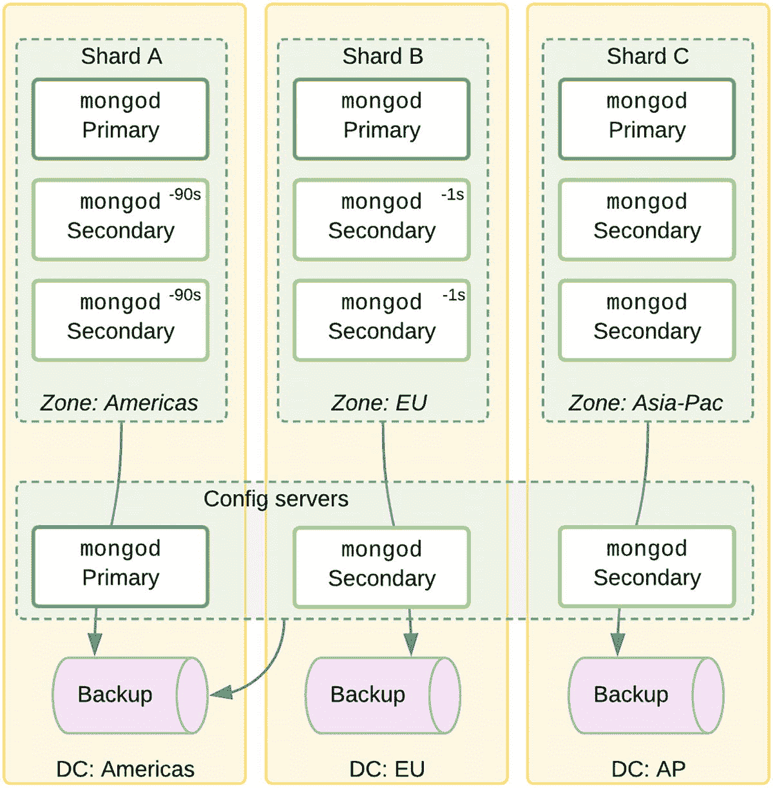

**图 9-2**
为满足 GDPR 合规性而进行备份的分片集群

### 复制延迟

在上面的示例中，分片 A 的某个从节点可能因负载过高而复制延迟了 90 秒，而分片 B 的从节点可能仅落后其各自的主节点 1 秒。

从具有不同延迟的从节点进行备份，会导致备份中遗漏不同数量的已确认（但未复制）的写入。但是，从主节点进行备份需要加锁，这会阻塞写入，在生产环境中也是不可接受的。

### 配置服务器

配置服务器也需要备份。它们包含关于哪个分片应包含特定分片键范围内的文档的元数据。此配置也需要恢复，因此一个三分片的集群只能真正恢复回一个三分片的集群，除非已经通过 `mongos` 执行了单一的统一 `mongodump`。

### 待处理的分块迁移

同时，作为分片平衡操作的一部分，副本集之间可能正在进行分块（chunk）迁移。在迁移期间，一个分块的文档可能同时存在于源分片（donor）和目标分片（recipient）上，之后才会从源分片上清除。

为确保分片集群备份的一致性，我们需要同时停止所有平衡迁移，并在进行文件系统级复制或 LVM 快照之前，锁定配置服务器的主节点以及每个分片的主节点，以将所有写入刷新到磁盘。

请记住，如果您想从从节点进行快照，可以暂时暂停应用程序的写入几秒钟，让从节点追上，然后再进行快照。两种选项都需要应用程序短时间暂停写入。

### 地理分片

每个分片副本集可能存在于一个地缘政治容器内，该容器限制了数据的传输，包括那些保存在加密备份中的数据。为避免违反 GDPR 或其他数据保护法规，我们需要将客户数据保存在同一区域。这有一个积极的好处，即减少延迟，并可能在恢复时提高吞吐量。

唯一需要担心的是，来自配置服务器分块边界的元数据可能会泄露到配置备份中。为安全起见，最好将配置服务器备份存储在法规最严格的国家/地区。

### 快照备份步骤

现在，我们将详细介绍备份过程，以充分理解其中涉及的复杂性。要获取分片集群的一致快照，必须遵循以下步骤。

#### 停止后台操作

在拍摄快照之前，必须将平衡器（balancer）`禁用并停用`。您可以通过连接到 `mongos` 并运行 `sh.stopBalancer()`，然后等待任何当前迁移完成来实现此目的。任何正在进行的迁移可能需要几分钟才能干净地完成。当 `sh.getBalancerState()` 返回 `false` 时，平衡器即完全停用，您可以继续下一步。

#### 分片和配置服务器

由于您需要对每个分片和配置服务器副本集分别拍摄快照，这些快照在时间上必然是分开的。如果您拍摄快照时分片集群中仍有任何写入操作处于活动状态，这些操作可能尚未刷新到磁盘。为确保整个分片集群的有效和一致备份，在拍摄任何快照之前，必须停止对集群的 `所有写入`，并使用 `db.fsyncLock()` 方法将 `所有数据刷新` 到磁盘。

#### 从主节点拍摄快照

对于集群中的每个 `分片`，使用 Mongo shell 连接到当前的主节点，并运行 `db.fsyncLock()`。在一个单独的窗口中保持此连接打开，以便我们可以轻松地再次解锁该节点。

然后，连接到 `配置服务器` 副本集的主节点，并运行相同的 `db.fsyncLock()` 命令，保持该窗口打开。

此操作将暂时阻止主节点接受来自应用程序的写入。对于应用程序来说，主机会表现为突然停止响应任何通信。重要的是，此操作应仅在指定的非高峰备份时段运行。

现在，通过 LVM 或云提供商存储快照的用户界面或 API `触发文件系统快照`。一旦触发了快照，您无需等待它完全完成。

我们现在应该先在配置服务器上运行 `db.fsyncUnlock()`，然后在所有分片上运行，顺序与我们锁定时相反。

#### 从从节点创建快照

如果你希望避免应用程序写入被阻塞哪怕几秒钟，你可以选择改为从从节点创建快照。

此选项可能产生不一致的备份，因为从节点是异步复制的。图 9-3 展示了一个集群，其中分片 B 的负载较小，因此其复制延迟也较小（5-10 秒，而 *分片 A* 上是 80-90 秒）。首先 *写入 1* 在分片 A 上执行并得到确认。然后 *写入 2* 在分片 B 上执行。当 10 秒后创建快照时，第二次写入会被记录在备份中，但先发生的写入 1 在此同一备份快照中不会出现。

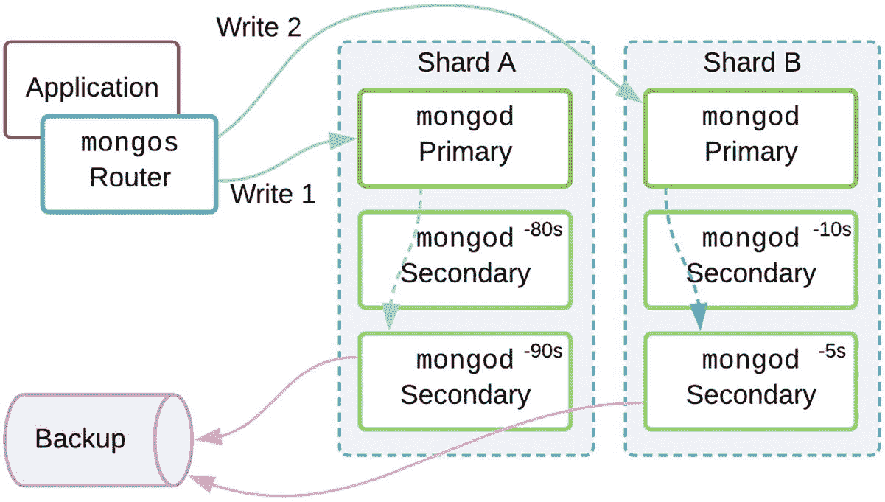

图 9-3

从从节点创建的、不一致的分片集群备份

最佳实践是使用写关注 `majority`。这将确保最近的写入被复制到至少一个从节点。你可以连接到每个分片副本集的当前主节点，并运行 `rs.printSlaveReplicationInfo()` 来获取每个从节点复制落后的秒数报告。通过选择在集群写入活动非常少的时间段，当从节点能够立即复制时，你更有可能获得整个集群的一致快照。

针对从节点的操作过程与之前针对主节点的几乎相同。改为锁定分片的从节点，但仍然锁定配置服务器的主节点，然后以相反的顺序解锁它们。

#### 恢复正常操作

现在所有快照都已完成并且所有节点都已解锁，你可以通过连接到任意一个 `mongos` 并运行 `sh.setBalancerState(true)` 来重新启用均衡器。

### 从快照恢复的步骤

手动从文件系统快照恢复一个分片集群也是一个复杂的过程。恢复阶段的关键点如下。

#### 关闭集群

由于我们将用恢复的版本替换磁盘上的数据文件，因此必须完全关闭分片和配置服务器副本集的所有 `mongod` 和 `mongos` 实例。

#### 恢复配置服务器

首先恢复配置服务器副本集的快照。根据创建快照时使用的 LVM 或云配置类型，这会有所不同。通常你会将快照挂载到一个临时挂载点，然后复制数据文件以替换现有 `dbPath` 中的文件。

然后，通过注释掉配置文件中的 `replSetName` 和 `clusterRole`，将一个配置服务器节点作为独立实例启动。

一旦该节点启动，使用 Mongo shell 连接到它，并删除 `local` 数据库，因为它包含来自原始节点的特定于实例的数据：

```
use local
db.dropDatabase()
```

当在具有相同主机名和节点端口的同一集群上恢复时，不需要更改配置。但如果你是作为测试的一部分恢复到不同的主机，或者是为了“迁移”现有集群，你将需要更新 `config.shards` 集合中的主机名。仔细按照文档操作以确保正确至关重要。

现在是重启配置服务器副本集的时候了，从一个节点开始。首先，关闭我们作为独立实例启动的 `mongod`。通过取消注释那些行来恢复 `replSetName` 和 `clusterRole` 设置。

我们在删除 `local` 数据库时有效地移除了副本集配置。我们现在应该使用以下命令初始化副本集：

```
rs.initiate()
```

这会创建一个包含一个成员的副本集。

现在我们可以清空 `dbPath` 并启动其他配置服务器节点。然后我们使用 `rs.add(...)` 在已打开的 Mongo shell 连接上将它们添加到集合中：

```
rs.add("config2.bigDB.bigcorp.local:27019")
rs.add("config3.bigDB.bigcorp.local:27019")
```

然后它们将通过初始同步复制已恢复的数据副本。

#### 恢复分片

我们现在需要恢复每个分片的副本集。我们遵循与恢复配置服务器集相同的步骤，但除了删除 `local` 数据库外，我们还需要创建一个临时管理员用户来清理其他一些元数据。我们将 `mongod` 作为单节点副本集重新启动，并添加任何其他成员，允许它们从分片初始同步数据。详细步骤记录在 *恢复分片集群*^(¹⁰) 在线文档中。

#### 恢复 mongos 路由器

最后，启动你的 `mongos` 节点，新恢复的分片集群应该就可以使用了。

### 结论

分片集群备份很复杂，但可以使用开源工具实现。人为错误始终存在风险，因此最好开发尽可能自动化此过程的手册或脚本。备份和恢复都应该定期测试，以确保系统按预期工作，并且在需要时能够尽快完成恢复。

## Ops/云管理器

比上述任何手动或自定义解决方案好得多的方法是使用由 MongoDB 公司构建的备份解决方案。MongoDB 企业版许可证包含使用 Ops Manager 或 Cloud Manager 的可能性。云管理器备份服务也可以单独购买。这两个工具都执行自动备份，并支持包括计划快照、时间点恢复和可查询备份在内的功能。对于副本集，你可以恢复到过去 12-24 小时内（取决于你选择的配置）任何选定的时间点，或使用每日、每周或每月的快照之一。

### 时间点恢复

此功能也完全支持分片集群。备份系统将同步的时间标记注入到每个副本集的备份中，允许你执行粒度为 15 分钟的一致分片集群恢复。

新版本的 MongoDB 和 Ops/云管理器利用 WiredTiger 存储引擎的原生快照能力，并可以将这些快照保存到 S3 兼容的块存储中。仍然需要保留 oplog 的副本，以填补从上次快照到所需恢复确切时间之间的空白。

### 其他功能

即使你拥有地缘政治的分片集群，Ops Manager 也允许你将每个分片备份到不同的位置，以确保合规性，因为客户数据永远不会离开其原产国。

你还可以从备份启动临时集群以执行部分恢复。可查询备份支持临时查询，并导出集群时间点快照的子集。这使得恢复单个集合或文档变得容易。

Ops Manager 提供了一种快速、经济高效且强大的恢复机制，涵盖了所有主要用例，并且只需在 UI 中执行几个步骤即可实现。


## 关键要点

从本章中，需要记住的核心概念如下：

*   可以使用低影响的 LVM 快照功能对整个 MongoDB 数据路径进行增量副本备份。云计算存储（如 EBS 卷）也提供类似的快照功能。

*   只要节点已停止或写入已首先刷写，就可以通过 `mongodump`、文件系统级副本或快照对单个节点进行备份。

*   为符合 GDPR，备份应与其来源分片存储在同一个国家/地区。

*   由于带宽限制以及需要从增量副本中读取，从文件系统快照恢复通常速度较慢。

*   从 `mongodump` 恢复也可能需要很长时间，因为转储中不包含索引，必须在数据恢复后重建。

*   使用社区工具在一致状态下备份整个分片集群需要暂时暂停写入负载。

*   使用 Ops Manager 和 Cloud Manager 等企业工具，可以在线备份分片集群，且对工作负载无影响。

*   借助企业版备份功能，可以将副本集恢复到任意时间点，将分片集群恢复到任意 15 分钟间隔的时间点。

*   企业工具还支持可查询备份，以便从特定时间点仅恢复一个集合，甚至单个文档。

脚注 1

