# 10. 高级分片

在本章中，我们通过规划处理海量数据集或极高写入负载的部署，来扩展关于分片的讨论。我们将回顾在这些情况下分片面临的挑战，并探讨随着数据增长避免或缓解问题的方法。

由于我们处理的是分片，本章中展示的所有示例和命令都必须始终通过 `mongos` 实例运行，切勿直接在分片本身上执行。

## 分片的适用场景

根据数据规模和访问模式，有几种不同的扩展选项。如果你的数据库较“小”，数据量小于 2TB，那么副本集通常是首选拓扑，因为它避免了分片集群的开销。

如果你的应用程序是 `写密集型` 的，并且你发现主节点的每秒输入/输出操作数 (`IOPS`) 超出了存储层的容量，那么增加存储吞吐量是扩展的最佳方法。如果应用程序执行大量 `小型随机读取`，这可能意味着没有明确的活动数据集，在这种情况下，瓶颈可能既在于存储的寻址时间，也在于有限的内存。

MongoDB 会将文档缓存在内存中，因此如果你有一组常见的文档（在我们的电商示例中，可能是活跃的购物者和商店中最受欢迎的 10,000 个商品列表），那么节点的内存资源应足以将这些文档保留在内存缓存中。

## 分片键

正如我们在第 1 章和第 6 章所讨论的，选择最优的分片键可能是一个困难的设计决策，需要在均衡数据分布、最小化平衡操作以及最大化查询尽可能定位到单个分片的需求之间取得平衡。

### 热分片

如果你的分片键配置得使得某个时间点的大多数插入操作都被路由到同一个分片，那么该分片就被称为 `热分片`。务必小心避免 `热分片`，因为它们会损害整体吞吐量，并导致再平衡问题。

#### 对吞吐量的影响

将所有操作路由到单个分片就失去了分片集群的所有优势，因为所有写入负载都由单个主节点处理。理想情况下，我们希望所有写入操作（插入、更新和删除）都能均匀地分布到所有分片主节点上。

在图 10-1 中，一个应用程序正在插入基于当前时间生成的自动生成的 `UUID` 文档。结果，所有这些文档都落在 `533000001` 到 `B200000` 的范围内，并被发送到分片 B。

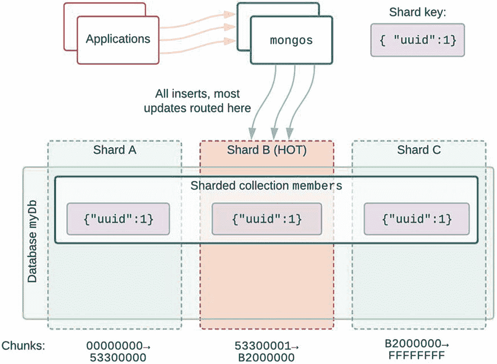

图 10-1. 所有写入负载都流向一个热分片

#### 对再平衡的影响

`热分片` 不仅会降低批量导入的吞吐量，还需要将这些文档迁移到其他地方。如图 10-2 所示，对于写入 `热分片` 的 300GB 数据，平衡器需要从该分片再次读取 200GB 数据，以便向其他每个分片写入 100GB。

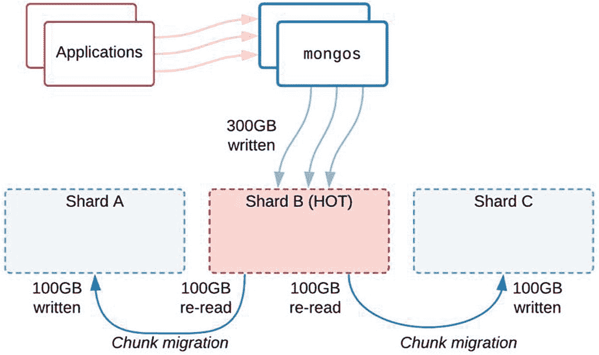

图 10-2. 导入到热分片时的最坏情况

如果直接写入每个分片，`I/O` 影响仅为总共写入 300GB，而不是写入 500GB 加上读取 200GB。图 10-3 展示了这种最佳情况。

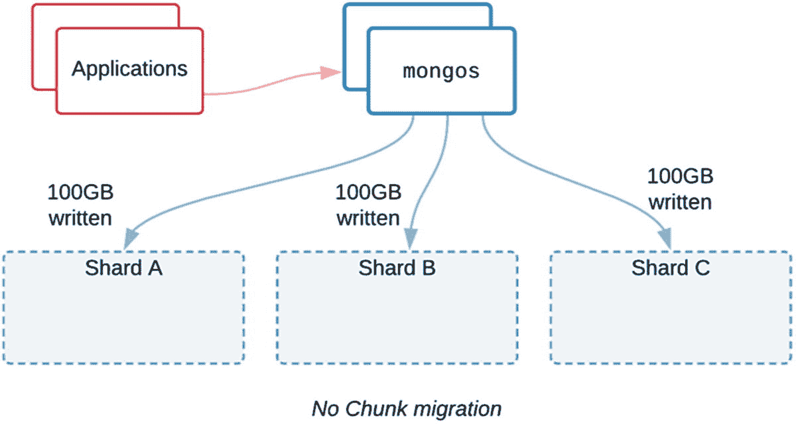

图 10-3. 每个分片接收均等数据且无需迁移的最佳情况

### 唯一值

在所有 `MongoDB` 集合中，`_id` 字段充当主键，并始终具有带有唯一约束的相应索引。这可以防止在独立实例或副本集中出现任何两个 `_id` 值相同的文档。在进行分片时，重要的是要理解唯一约束是每个分片 `本地` 的。假设你在集合中创建了两个唯一索引：

```
db.members.createIndex( { "userName": 1 }, { unique: true } )
db.members.createIndex( { "uuid": 1 }, { unique: true } )
```

然后使用其中一个进行分片：

```
sh.shardCollection("myDb.members, { "uuid": 1}, true)
```

这里的 `shardCollection` 中的第三个参数告诉分片系统在此分片键上维护唯一约束。因此，现在我们确保了 `uuid` 值在每个分片内部以及集群级别都是唯一的。

然而，我们 `在集群级别` 对 `userName` 没有这样的约束。想象一下，两个新用户从两个不同的应用程序服务器同时注册并选择了 `相同` 的用户名。我们实际上会看到通过一个或多个 `mongos` 实例提交的两个插入操作：

```
db.members.insertOne({ _id: ObjectId(...123),
uuid: "0123-abcd...", userName: "logikewl", ...)
db.members.insertOne({ _id: ObjectId(...456),
uuid: "4567-efab...", userName: "logikewl", ...)
```

如你所见，自动生成的 `_id` 值和应用程序生成的 `uuid` 值都如预期那样是唯一的。因为我们是在 `uuid` 上分片的，这两个插入很可能被发送到不同的分片。假设第一个插入到分片 A，第二个插入到分片 B（参见图 10-4）。也很可能没有其他用户使用该用户名，因此两个插入在分片级别都成功了，但现在我们的系统中有两个具有相同用户名的 `members`。

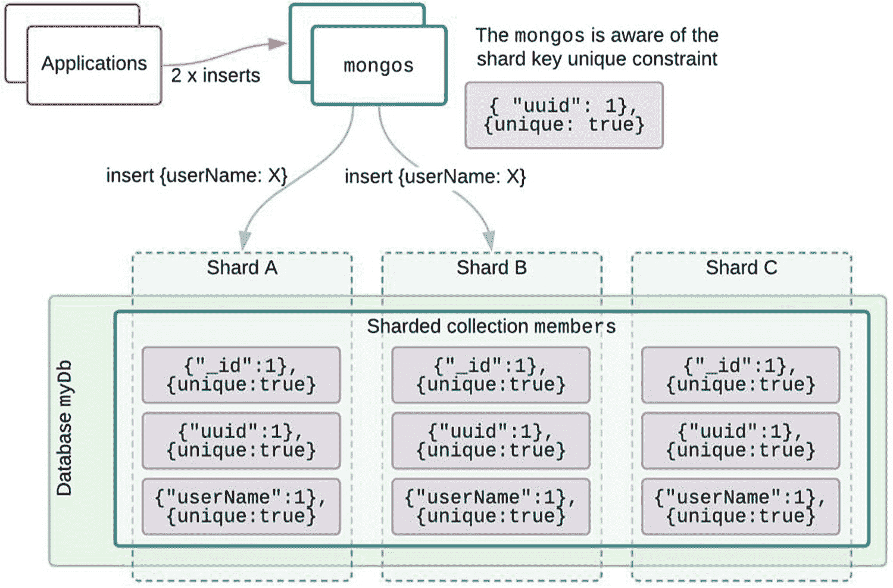

图 10-4. 分片级别的唯一约束可能被违反

注意

`ObjectId` 数据类型高度随机的特性意味着，上述场景中插入两个 `_id` 值相同的文档的可能性极低。


### 分片键与唯一字段

当分片键不是 `{_id: 1}` 时，可能会出现两个文档具有相同的 `_id` 字段但存在于不同分片上的情况（因为 `_id` 索引的唯一性约束是在每个分片上独立存在的）。

#### 基于 `_id` 分片

仅使用主键字段 `_id` 本身通常不是一个好的分片键选择。对 `_id` 字段使用 `ObjectId` 数据类型或使用自增 ID 可能会导致热点分片。`ObjectID` 的开头几个字节是一个日期/时间戳，因此即使由不同的应用服务器生成，它们的排序顺序也几乎相同。

虽然整数 ID 通常是递增的，但如果您的应用程序能生成带有随机前缀的 `UUID`，则可以避免热点分片问题。

有许多更好的选择，例如使用 ID 的哈希值（例如 `{_id: "hashed"}`），这应该能更均匀地将文档分布到各个分片上。

如果您几乎总是查询其他重要字段，可以使用复合分片键，如 `{country: 1, _id: 1}`，以受益于分片定位优化。

#### 非唯一分片键值

分片键没有唯一性要求，并且当多个文档共享同一个分片键值时，也不会立即引发性能问题。

关于多个文档共享相同分片键值的主要担忧是，最终可能会创建一个 `jumbo chunk`（超大块）。这是指一个无法再拆分且大于最大块大小（默认为 `64MB`）的数据块。由于性能影响，平衡器不会迁移超大块，这最终可能导致分片不均衡。

### 基于时间的分片键

使用存储*当前*日期或*插入*日期的字段作为分片键是一个糟糕的选择，因为它本质上是递增的。如果您是基于不同的日期（如客户的出生日期）进行分片，只要文档不是按此顺序批量加载，可能不会造成问题。

以当前日期开头的复合分片键，当它是键中的第一个字段时，同样存在问题。因此，像 `{insertDate: 1, custId: 1}` 这样的分片键很可能会导致热点分片。而像 `{custId: 1, insertDate: 1}` 这样的键则能为基于 `custId` 过滤的查询提供良好的分片定位，但如果客户 ID 值是单调递增的，同样会创建热点分片。

本章后面，我们将探讨一些通过预拆分技术高效地将数据批量加载到分片集合中的方法。

### 哈希分片键

当以“哈希”方式对集合进行分片时，使用 `numInitialChunks` 将集合预拆分为指定数量的块（例如 1024 个）。在开始导入工作负载之前，让平衡器先迁移这些空块。

当您加载数据时，随着文档的添加，这些块会被拆分以确保它们保持在块大小限制之内。这种拆分只是更新配置服务器中的元数据，并不实际需要在分片本身上进行 I/O 操作。由于哈希算法保证了良好的分布性，在大多数情况下，即使经过额外的拆分，也几乎不会出现块不平衡，因此不需要通过迁移块来恢复分片间的平衡。

然而，如果原始值的基数不足，哈希分片键仍然会导致超大块和平衡问题。

### 优化键

即将发布的 MongoDB 版本（4.4 及更高版本）将允许通过添加一个额外字段作为复合分片键来优化现有的分片键。如果当前分片键的选择性不够，并且产生了过大而无法迁移的超大块，这种方法会很有用。

### 高级拆分

在大多数情况下，只要分片键选择得当，MongoDB 的原生行为会自动平衡数据，同时拆分活动块并将其重新分配到各个分片上。

**注意**

每当操作分片配置或块时，您应首先通过运行 `sh.stopBalancer()` 来停止任何平衡活动。完成更改后，不要忘记再次使用 `sh.startBalancer()` 重新启动平衡器。

在以下部分中，我们将探讨一些手动拆分有益的情况。

#### 提前拆分

当您即将向 MongoDB 中的一个新集合加载大量数据时，在加载开始之前**预拆分**集合非常重要。这避免了在操作期间拆分和移动块的开销。文档将直接插入到最终所在的分片上。

由于平衡是在块级别计算的，因此定义将包含大致相同数量待加载文档的块范围非常重要。我们要避免创建不包含任何文档的块，因为这最终会导致集群在每个分片存储的字节数方面不均衡。

在图 10-5 中，我们看到一个集群，每个分片上有 20 个块。然而，由于自动拆分算法的特性，原始分片 A 上的块往往每个块包含稍多的文档，这意味着分片 A 在字节大小上要大 30%。

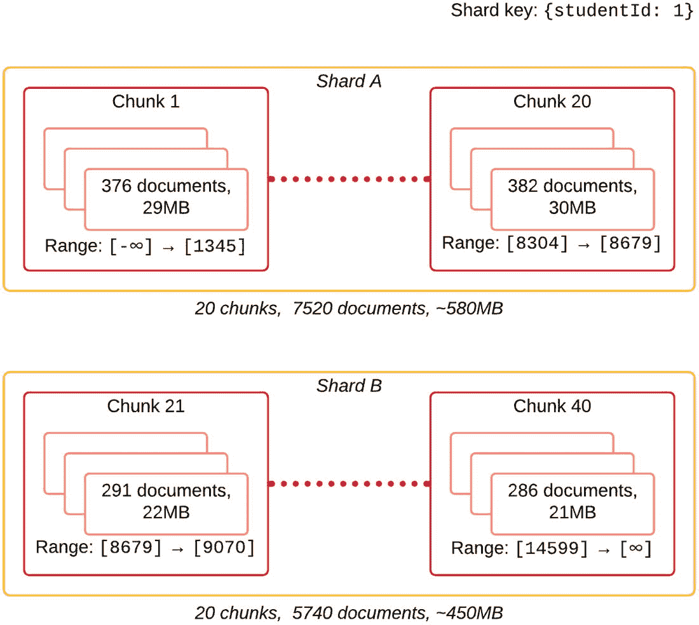

图 10-5

预拆分可能导致分布不均的块

#### 手动拆分

如果分片键/值的分布是预先已知的，并且我们没有使用哈希分片键，那么我们可以通过脚本手动进行预拆分。

假设我们运行一个学校系统，其中学号是按升序分配的。这不是单字段分片键的好选择，我们将在本示例中探讨一些相关问题。

之前的数据库包含 200,000 名过去和现在的学生记录，我们想要加载这些数据。我们将定义 100 个块，每个块将包含 2000 个文档。我们可以在空的分片集合 `students` 上使用以下脚本来实现这个目标：

```javascript
for (var i = 0;  i < 100; i++) {
sh.splitAt("school.students", { studentId : 2000*i } );
}
```

如果我们立即意识到第一个学号是从 5000 开始的，我们可以安全地合并前两个相邻的空块：

```javascript
db.adminCommand( {
mergeChunks: "school.students",
bounds: [ { studentId : MinKey },
{ studentId : 6000 } ]
} )
```

请注意，我们永远不能直接删除一个块，因为块的定义范围必须跨越从 `MinKey` 到 `MaxKey`（本质上是从负无穷到正无穷）。

一旦平衡器移动了块，我们将看到块在可用分片之间均匀分布，如代码清单 10-1 所示的 `sh.status(true)` 输出结果。

```javascript
school.students
shard key: { "studentId" : 1 }
unique: false
balancing: true
chunks:
shardA    34
shardB    34
shardC    33
{ "studentId" : { "$minKey" : 1 } } -->> { "studentId" : 0 } on : shardA Timestamp(2, 0)
{ "studentId" : 0 } -->> { "studentId" : 2000 } on : shardC Timestamp(3, 0)
{ "studentId" : 2000 } -->> { "studentId" : 4000 } on : shardB Timestamp(4, 0)
{ "studentId" : 4000 } -->> { "studentId" : 6000 } on : shardC Timestamp(5, 0)
{ "studentId" : 6000 } -->> { "studentId" : 8000 } on : shardC Timestamp(6, 0)
{ "studentId" : 8000 } -->> { "studentId" : 10000 } on : shardA Timestamp(7, 0)
代码清单 10-1
sh.status() 的输出，显示新分布的空块
```

现在，我们之前的 `mergeChunks` 命令将会失败，因为该范围内的块位于不同的分片上，无法再轻易合并。


### 预分片哈希分片键

如果我们想确保良好的数据分布，并且知道在所有查询中主要使用特定的`studentId`进行筛选，那么可以基于哈希分片键进行分片，并立即创建 1024 个初始数据块：

```javascript
db.adminCommand( {
    shardCollection: "school.students",
    key: { studentId: "hashed" },
    numInitialChunks: 1024
} )
```

请注意，任何基于`studentId`值范围进行筛选，或完全不包含`studentId`的查询或聚合操作，都将在每次操作中命中**所有**分片，无法受益于分片的水平扩展能力。对于这类常见的查询模式，应避免使用哈希分片键。

### 预分片 UUID

如果我们需要在 UUID 或其他随机分布的十六进制值上进行预分片怎么办？UUID 中的每个字符可以是`0`–`9`和`a`–`f`，共 16 种可能的值。

让我们将 UUID 范围分成 1024 个数据块。为此，我们至少需要 3 个十六进制位（`16² = 256`，但`16³ = 4096`），并且我们将把它们放在最高有效位（即最左边的 3 位）来定义范围。以下脚本将创建这些数据块：

```javascript
// 为每一位使用 for 循环
for ( var x=0; x < 16; x++ ){
    for( var y=0; y < 16; y++ ) {
        // 对于最内层循环，我们每次增加 2，以获得总共 2048 次迭代
        // 我们只使用 z=0,4,8,16
        for ( var z=0; z<16; z+=4 ) {
            // 现在构造 UUID，用 0 填充
            // toString 方法接受一个参数来指定进制
            var prefix = "" + x.toString(16) + y.toString(16) +
                         z.toString(16) + "00000000000000000000000000000";
            // 创建相应数据块的 split 命令
            db.adminCommand( { split : "school.students" ,
                               middle : { _id : prefix } } );
        }
    }
}
```

### 负载定向

预分片还提供了控制数据流的另一个方面。由于数据块在导入开始前就已定义，你可以快速移动数据块并将特定范围的数据分配给分片，可以手动使用`moveChunk`完成，也可以通过区域分片完成（更多示例请参见第 6 章）。

如果你拥有**不对称的分片**，其中一个分片存放近期数据，其他分片存放历史数据，那么你可以确保文档直接导入到目标分片上，无需后续迁移。

### 无预分片的批量加载

如果你无法提前知道数据分布，这里有一些技巧可以高效地批量加载数据，而无需手动预分片。

#### 采样与平衡

一种方法是导入一小部分数据，直到创建了`N`个数据块。现在暂停导入，让平衡器将这些数据块迁移到可用的分片上。如果样本具有代表性，当我们恢复导入时，分片负载应该是分布得相当合理的。

#### 随机化顺序

按分片键排序的数据进行批量加载，注定会带来最差的性能，因为负载会一次集中在一个分片上。避免此问题的一种方法是**随机化**待导入数据相对于分片键的顺序。如果你选择分片键是为了优化应用程序生命周期内的读取和更新，那么通过**不**按升序加载数据，你可以大大减少数据加载阶段的时间。

如果你能随机化从旧系统导出的数据，或按不同字段（例如，学生的姓氏而不是 ID）对其进行排序，那么后续的新文档更有可能被发送到不同的分片，从而平滑每个分片的负载并最大化吞吐量。

### 拆分现有分片

假设你有一个两分片的集群，其当前计算资源即将达到上限，而且获得购买必要新硬件的批准需要一段时间。我们最近获批增加两个新的分片。如何高效地实现这一点？

#### 初始加载

在负载很重的系统下，将新分片链接到集群后的最初几个小时将是最关键的，因为除了现有的应用程序工作负载**外**，还有数据块迁移。迁移需要在源分片上进行大量的*读取*I/O，在目标分片主节点上进行大量的*写入*I/O 工作负载，随后在目标分片的次节点上产生大量的复制工作负载。

#### 迁移窗口

如果初始迁移可以在应用程序负载的非高峰时段，并以短窗口进行，将会缓解原始分片上的一些压力（详情请参见下文的*限制平衡影响*）。随着时间的推移，随着分片接近平衡状态，可以使用越来越长的迁移窗口。

#### 有丝分裂

在一些分布式数据库系统中，存在*有丝分裂*的概念——将一个现有分片拆分成两个子集。不幸的是，当前版本的 MongoDB 尚未支持这种方法。

增加分片数量的一个选择是添加新的分片硬件，并让平衡器通过迁移来处理数据的再平衡。如第 6 章所述，每对源/目标分片可以并行进行一次迁移。因此，在这种情况下，将有两个到新分片的并行数据块迁移。

### 管理平衡

在你开始决定哪些集合将被分片以及使用什么键之前，首先了解数据是如何实际平衡的会很有用。

#### 主分片

对集群进行分片时，你可以拥有分片集合和未分片集合的组合。每个逻辑数据库有一个单独的**主分片**（与“主”节点完全无关），所有未分片集合都驻留在此。

在图 10-6 中，我们看到一个分片集群，其中有一个逻辑数据库`db1`，它包含多个集合。只有最大的集合`bigColl1`和`bigColl2`被分片，它们的文档已根据数据块平均分布在各个分片上。

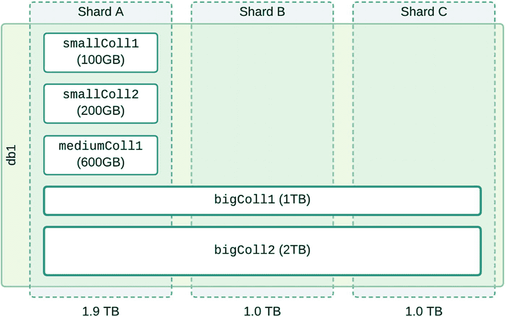

图 10-6

一个包含一些分片集合的单一数据库

根据未分片集合的大小，你可能会得到一些相当不均衡的分片。在这种情况下，分片 A 的大小几乎是其他分片的两倍。


### 再平衡集合

那么，我们如何处理一个不平衡的集群，例如当一个分片的大小是其他分片的两倍时？在某些情况下，最简单的选项可能就是给分片 A 中的主机分配额外的资源。额外的 CPU 核心和内存应该能让这些主机处理额外的工作负载，为这个未分片的集合提供服务。但最终我们得到了混合的主机类型，这使得管理和扩展变得复杂。

我们也不希望对非常小的集合进行分片，因为平衡它们的数据和管理这些集合的元数据会有一些额外的开销。不过，最糟糕的缺点是，我们必须将某些查询（那些不包含分片键的查询）路由到*所有*分片，并执行*分散-聚集查询*，其速度与当时最慢的分片一样慢。

在这种情况下，如果我们选择对 `mediumColl1` 进行分片，我们将从分片 A 迁移 200GB 数据到分片 B 和分片 C 各一份。

#### 移动主分片

在您拥有多个逻辑数据库的情况下，MongoDB 会自动将任何新数据库的主分片分配给一个未充分利用的分片。但是，如果您从只有一个分片开始，并随时间推移添加了额外的分片，主分片**不会**自动重新分配到新的分片上。您将让所有未分片的集合都存放在原始分片上。图 10-7 展示了一个例子，其中新分片每个分片的数据少了 400GB。

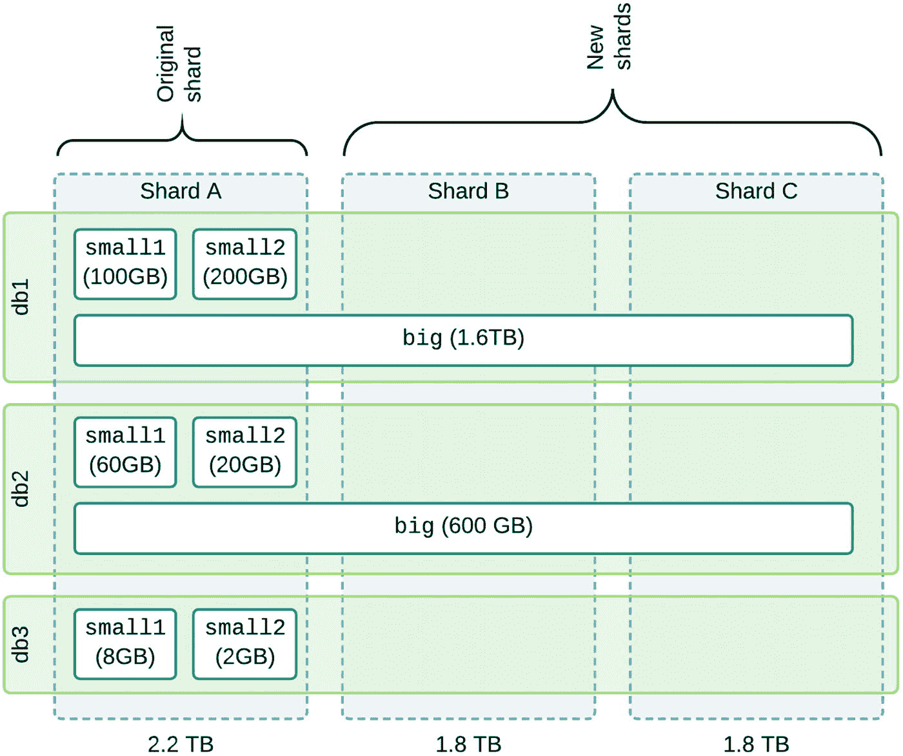

图 10-7

一个扩展后的集群，未分片集合位于分片 A 上

要手动重新平衡未分片集合的负载，您可以使用 `movePrimary` 命令，将特定数据库的主分片重新分配到您选择的分片上。在上面的例子中，可以通过以下命令实现：

```
db.adminCommand( { movePrimary : "db2", to : "shardB" } )
db.adminCommand( { movePrimary : "db3", to : "shardC" } )
```

### 额外的分片

在图 10-8 中，我们看到一个类似的分片集群，但包含两个逻辑数据库。在这个例子中，`db1` 的主分片在分片 C 上，而 `db2` 的主分片存放在分片 A 上。这里有三个分片集合：`db1.bigColl1`、`db2.bigColl1` 和 `db2.bigColl2`。

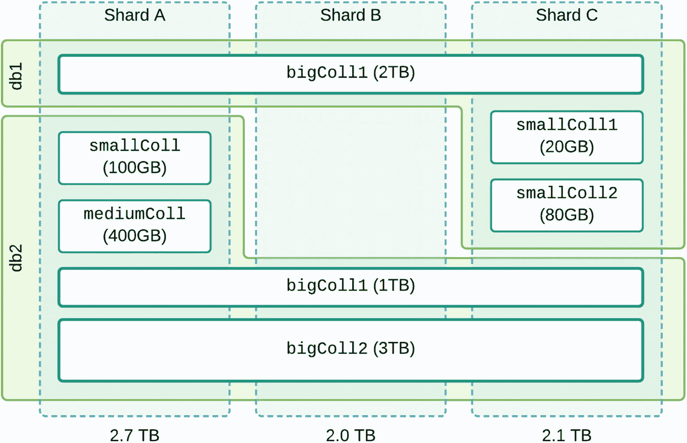

图 10-8

一个相对均衡的分片集群

在这个例子中，我们的分片 A 数据量略高于建议的分片大小阈值，我们应该考虑向此集群添加一个额外的分片。如果我们这样做，这三个大型分片集合将自动均匀分布，并且大约 0.5TB 的数据将从当前三个分片迁移到新的第四个分片。

这个迁移过程可能需要几天时间，因为它被赋予了较低的优先级，以确保迁移不会影响正常的应用程序或复制流量。

### 限制平衡操作的影响

在向集群添加分片后，我们需要规划和管理由此产生的数据块迁移**工作负载**，以确保它不会对已经负载的集群产生负面影响。

在**网络**接近饱和、可用容量有限的情况下添加分片时，我们也应小心，尤其是在业务时间内数据中心之间的带宽已经饱和时。

一个简单的方法是使用**内置的平衡器时间窗口**，它允许您选择一个每天固定的时间窗口，在此期间允许进行数据块传输。

例如，在代码清单 10-2 中，我们激活了一个每天凌晨 1 点到 6:30（服务器当地时间）的时间窗口，每周七天皆如此。

```
use config;
db.settings.update(
{ _id: "balancer" },
{ $set: { activeWindow :
{ start : "01:00", stop : "06:30" } } },
{ upsert: true }
)
代码清单 10-2
激活内置的平衡窗口
```

### 周末工作负载

许多应用程序有特殊的周末工作负载。有些几乎没有用户流量，可以安全地仅在周末运行平衡器。另一些则有特殊的加载、转换或分析工作负载，因此希望完全避免任何平衡操作。对于这些情况，一个外部的 `cron` 作业或触发器可以使用 Mongo shell 脚本来随意开关平衡器：

```
mongo --uri mongodb://U:P@mongos1.bigcorp.local:27017/config
--authenticationDatabase admin
--eval "sh.startBalancer()"
```

同样的方法可以用来停止平衡，使用 `sh.stopBalancer()`。

注意

从 MongoDB 4.2 开始，停止平衡器也将停止数据块的自动分裂。当平衡停止时，此更改实际上会停止配置服务器副本集上的几乎所有写入工作负载。

### 管理存储

管理员最关心的问题之一是确保不断增长的数据库的主机有足够的存储空间。意外耗尽可能导致停机甚至数据损坏。

#### 最大存储大小

在某些情况下，控制每个分片的最大数据量是有用的，允许不对称的分片大小，而无需使用分区显式控制数据块范围。在向现有集群添加新分片时，新的主机通常具有更大、更快的存储设备。我们希望避免填满较旧、较小的分片，因为磁盘空间不足可能导致数据损坏和许多其他问题。

例如，我们可以通过运行以下命令为我们的分片 A 设置最大大小为 1TB（1,048,576 MB）：

```
config = db.getSiblingDB("config")
config.shards.updateOne( { "_id" : shardA"},
{ $set : { "maxSize" : 1048576 } } )
```

如果接收数据块会超过此配置的最大存储大小，平衡器将不会考虑将任何分片作为该数据块的接收者。

#### 确定实际存储大小

磁盘上的实际使用大小甚至在同一个分片副本集的成员之间也会有所不同。最近进行初始同步或 `compact` 的成员，其实际使用的存储空间可能比长期运行、存储可能严重碎片化的节点小得多。

WiredTiger 使用一种非覆盖写算法，它实际上不会覆盖旧的文档版本，而是找到一个未使用的块并重新利用它。被删除的文档将打开新的块以供将来可能的重用。由于文档可能保留对文件不同部分的内部引用，就地压缩方法并不总能回收大量空间。

如果空闲空间是一个严重的问题，并且您最近**删除了**大量文档或添加了更多分片并**迁移了数据**，最好的方法是依次在分片的每个成员上触发*滚动初始同步*。

要检查每个成员实际使用的存储空间，请遍历所有数据库，然后运行 `db.stats()`，并将 `storageSize`（这是不包括索引的压缩数据文件大小）和 `indexSize`（这是此数据库上所有集合的所有索引的总和）的值相加。

## 核心要点

从本章中，需要记住的关键概念如下：

*   分片是扩展部署写入能力的好方法，但需要良好的分片键来避免因迁移导致的过度再平衡。
*   如果某个唯一性约束需要在集群范围内保持，那么分片键应包含该约束。
*   应避免使用以递增值（如日期、时间戳或 `ObjectId`）开头的分片键，因为这会导致“热点分片”和再平衡。
*   哈希分片键能很好地在各分片间均匀分布写入，但会使范围查询效率低下。
*   对于导入工作负载（例如从旧数据库迁移），在数据加载前预分割数据块并让它们均匀分布在各分片之间可能更高效。
*   还有其他技巧可以预分布数据块，以避免将数据加载到“热点分片”。
*   每个数据库将其未分片的集合保存在单个分片上，并且可以将这些集合移动到另一个分片以修复分片不平衡。
*   所有更改分片配置的操作都应通过 `mongos` 执行，禁用平衡器，并在计划的维护窗口内进行，以避免意外的应用程序行为。

## 11. 极限分片

本章将更深入地探讨分片细节，并介绍在面临硬件限制时可增加写入吞吐量的配置。我们还将研究如何对用户数据进行分区，以遵守数据保护法规、最小化成本并优化跨分片的读取。

## 回顾

在大多数情况下，没有区域或其他大小限制的分片集群会通过将数据块从“繁重”（数据块过多）的分片迁移到数据块较少的分片，来自动平衡数据块。

### 增加分片

如果您开始遇到性能问题，并且已排除任何应用程序或模式设计问题，一个好的选择是增加更多分片。这将从现有分片卸载数据，减轻它们的工作负载和内存缓存中的工作集大小。

选择不良的分片键导致的热点分片（如第 10 章所述），无论添加多少分片都无法扩展。在系统已经不堪重负的情况下增加迁移工作负载，也会使短期性能变得更糟。

如果添加新主机和分片不可行，或者当前分片没有自动平衡，则可以进行某些手动调整以强制实现更平衡的工作负载。

### 高级数据块分割

MongoDB 会在向某个数据块范围插入数据或迁移该数据块之前，自动触发大数据块的分割。如果我们想人为地使某些数据块变小，可以强制进行分割。这样做的原因可能是我们即将向该范围导入大量数据，并希望确保插入操作能更均匀地分布在所有分片上。

分割完成后（无论是自动还是手动），平衡器可能会将该数据块迁移到另一个分片。请记住，我们可以使用 `sh.status(true)` 来查看当前所有数据块的确切存储位置。

有两种方法可以手动分割数据块：

*   `sh.splitFind()` 查找一个数据块，并将其大致均等分割成两块。
*   `sh.splitAt()` 查找具有给定值的数据块，并在此点*精确*分割。

让我们用两个例子来明确这一点。在图 11-1 中，我们使用 `sh.splitFind("myDb.customers", {custId: 9000})` 分割一个数据块。这首先找到包含客户 ID 为 `9000` 的文档的数据块，然后将该数据块大致均等地分割成两部分。

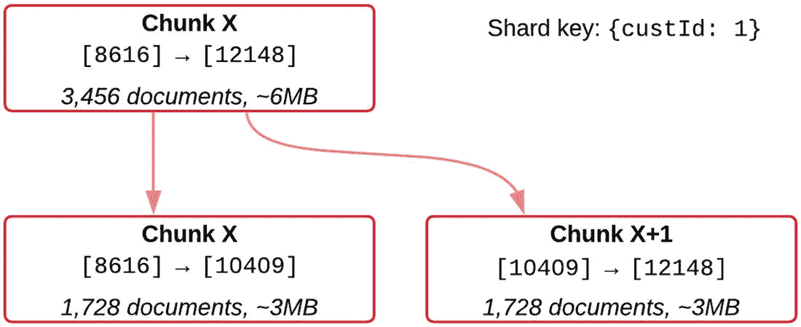
图 11-1 `splitFind` 将数据块大致均等分割

在图 11-2 中，使用 `sh.splitAt("myDb.customers", {custId: 9000})`，同一个数据块在该确切值处被分割，得到两个大小差异很大的数据块（600KB 对比 5MB）。如果我们即将向该点导入数据，或者需要控制该范围内某些特定客户所在的分片，这可能是合适的。

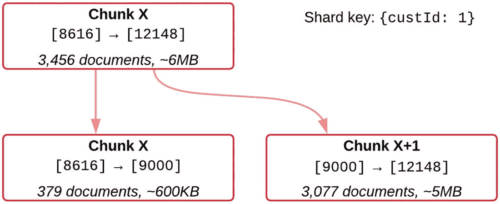
图 11-2 `splitAt` 在指定的分片键值处精确分割

就性能而言，`splitAt` 更轻量，应在为数据加载做准备而预分割时的脚本中使用。`splitFind` 会尝试计算数据块中值的中位点以创建大小相等的块。获取文档和计算既需要 I/O 也需要 CPU。

## 分片键场景

在选择分片键时，可能存在相互竞争的目标，但并非所有目标都能在所有情况下都得到满足。例如，我们可能希望通过降低读取查询的*平均负载*来优化，或者我们可能希望通过使用地理位置分片来降低写入的*延迟*，或者通过最均匀地分布写入来尽可能快地完成批量数据的*写入*。

我们将研究每种情况，并回顾最佳的分片键和拓扑组合。

## 读取性能

确保分片集群快速读取响应的最佳方式是仅查询单个分片。这意味着无需等待最慢的分片，因为不需要对响应进行整理和排序。但是，如何确保我们 99%的情况下都能命中单个分片呢？

假设我们有一个包含所有过去和现在的职业网球选手的数据库。表 11-1 展示了该数据库中一些典型文档可能的样子。

表 11-1
大型集合中的两个示例文档

| `{ _id: 123, userName: "petesampras", country: "US", titles: 64, .... }` | `{ _id: 124, userName: "bjornborg", country: "SE", titles: 63, .... }` |

根据这些示例文档，我们可以考虑多个分片键，例如：
1. `{ userName: 1 }`
2. `{ _id: “hashed” }`
3. `{ country: 1, userName: 1 }`

我们不会考虑简单的`{ country: 1 }`键，因为基于此进行分片可能导致过大的块。这是因为我们最多可能有大约 195 个块，每个国家一个。

我们需要对不同的字段组合执行许多查询和聚合操作，但已决定最重要的优化查询是汇总特定国家所有选手的职业生涯冠军数。该查询如下所示：

```
db.players.aggregate([
{ $match: { country: "SE" } },
{ $group: {
_id: "$country",
count: { $sum: "$titles" }
}
}
]);
```

让我们首先考虑使用`{userName :1}`作为分片键，如图 11-3 所示。对于我们的聚合调用，我们仅按`country`字段进行过滤，但由于它不是分片键的一部分，文档可能存在于任何分片上。因此，`mongos`必须查询每一个分片，并在最慢的分片响应后最终对标题进行求和。注意，分片 B 最终没有任何匹配项，但它仍然必须做一些工作来确定这个负面结果。

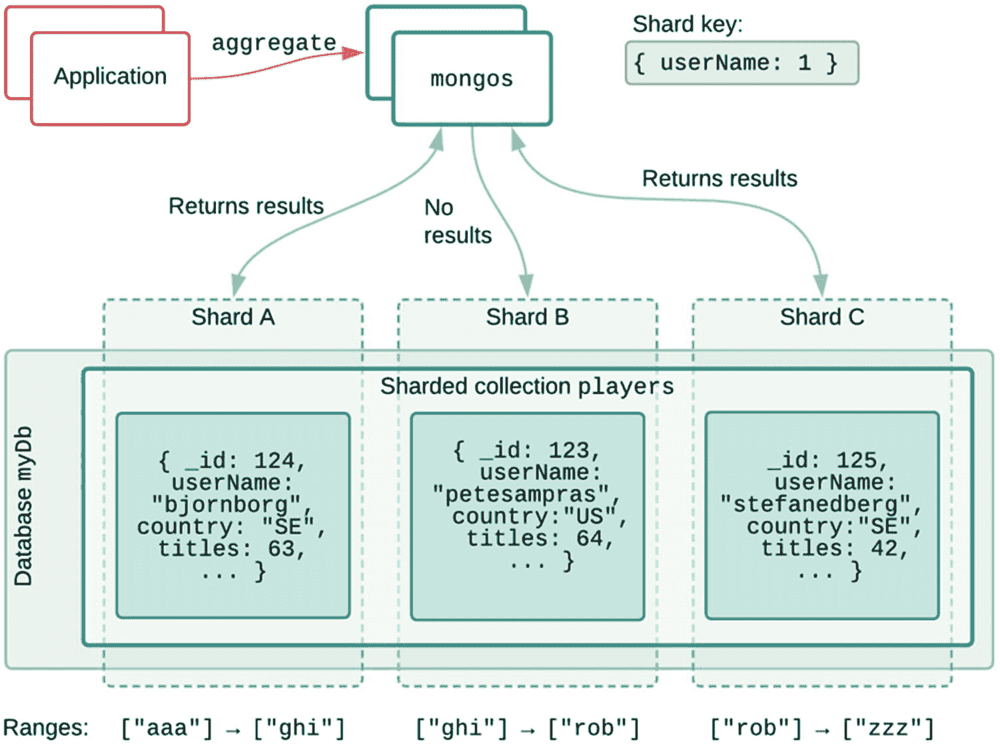

图 11-3
分片键强制查询所有分片

在`{_id: "hashed"}`上分片也会在任何不是精确匹配`_id`字段的查询中命中每个分片。这使得它在优化读取效率时成为最差的选择。

如果我们改为在`{country:1, userName: 1}`上分片会怎样？在图 11-4 中，我们看到由于我们的分片键以`country`开头，我们可以缩小到包含瑞典国家代码的两个分片。在这种情况下，我们需要等待两个分片响应才能得出最终总和。由于没有以瑞典国家代码“SE”开头的块范围，可以忽略分片 A。

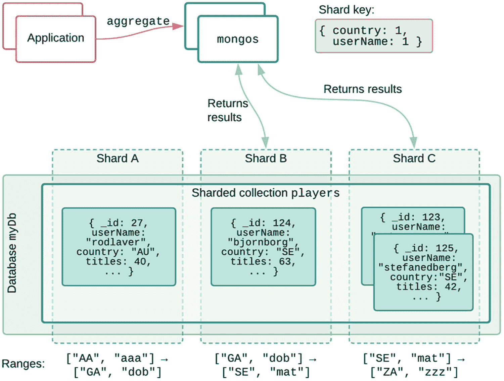

图 11-4
分片键对查询更具针对性

我们能否以某种方式确保仅命中单个分片？可以！我们可以使用区域范围和标签来实现这一点。我们可以为欧洲选手（“EUR”）、美洲选手（“AMER”）和世界其他地区（“ROW”）各分配一个分片。

我们必须为每一个国家定义一个键范围，例如：

```
sh.updateZoneKeyRange("myDb.players",
{ country: "SE", userName: MinKey },
{ country: "SE", userName: MaxKey }, "EUR")
```

并将欧洲选手与分片 A 关联：

```
sh.addShardToZone("shardA", "EUR")
```

虽然这对于一个相对较小的数据库来说可能有些过度，但同样的技术可以在多 TB 的分片集群中为每次查询节省宝贵的毫秒时间。

## 写入性能

假设我们为欧洲纸张销售公司 Wernham-Hogg 运行一个客户关系管理（CRM）解决方案。我们正在与总部位于美国的公司 Dunder Mifflin 合并，需要尽可能高效地导入他们的整个客户数据。在分片集群中，这可以通过将写入操作均匀分布到我们的三个分片来实现。

假设当前的欧洲数据大致如图 11-5 所示分布，分片键为`{country:1, acct:1}`。这是一个简化模型，显示了三个连续的范围，而实际上每个范围内会有许多块。

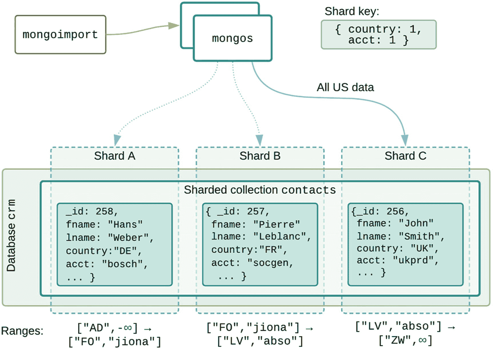

图 11-5
一个基于国家的分片 CRM 系统

虽然这可能不是最佳的分片键，但它支持基于国家的分析、最终的地理分片，并避免了过大的块。不幸的是，这也意味着所有需要导入的带有`{country: "US"}`的新数据都将被发送到分片 C，因为它落在`LV`和`ZW`国家代码范围内。

由于 Wernham-Hogg 目前 CRM 中几乎没有基于美国的联系人，因此将只有一个包含这些文档的块。如果我们现在导入 100,000 个联系人，文档将被插入到那个分片中。随着块的增长，它们将被拆分成多个更小的块。随着更多文档被插入这些子块，它们将被反复拆分。

如果平衡器已启用，它将尝试在某个分片变得过大时迁移一些块，但由于在后台以低优先级运行，并且面临导入的压力，它没有时间移动许多块，因此导入实际上将局限于单个分片。

解决方案是什么？我们需要手动预先拆分这些块，并将它们均匀地分布在各个分片上。如果我们已经大致知道 Dunder Mifflin 数据库中账户名的分布，我们可以从三个大块开始，并手动移动这些块，使得三个分片各有一个块。

然后在导入过程中，块将自动拆分。由于导入数据的 1/3 将进入每个分片，因此它们都不需要迁移。

我们希望将来自美国联系人的传入数据按表 11-2 所示进行分布。

表 11-2
期望的数据分布

| 账户 ID 值（小写） | 分片 |
| --- | --- |
| 起始 | 结束（含） |  |
| --- | --- | --- |
| a | m | A |
| l | q | B |
| r | z | C |

为了实现表 11-1 中的分布，我们将使用`sh.splitAt()`函数，并确保我们有三个整齐的块：一个从字母“a”开始直到“mzzzzzzz...”，另一个从“l”开始直到“qzzzzzzzz...”，以及一个从“r”开始的最终块，通过声明四个边界如代码清单 11-1 所示。

```
sh.splitAt("crm.contacts", {country: "US", acct: "a"});
sh.splitAt("crm.contacts", {country: "US", acct: "l"});
sh.splitAt("crm.contacts", {country: "US", acct: "r"});
sh.splitAt("crm.contacts", {country: "US", acct: "zzzzzzzzz"});
```

代码清单 11-1
使用精确的拆分点创建四个新块

然后我们使用`sh.moveChunk()`函数手动移动这些块，通过提供一个示例分片键值，该值对应于将存在于我们刚刚强制创建的这三个块之一中的文档，如代码清单 11-2 所示。

```
sh.moveChunk("crm.contacts",
{country: "US", acct: "abc"}, "shardA")
sh.moveChunk("crm.contacts",
{country: "US", acct: "man"}, "shardB")
sh.moveChunk("crm.contacts",
{country: "US", acct: "sta"}, "shardC")
```

代码清单 11-2
将新创建的块手动移动到其他分片

当输出如代码清单 11-3 所示时，我们可以通过`sh.status()`确认块已经迁移。

## 分片状态示例

```
databases:
{  "_id" : "crm",  "primary" : "shardA",  "partitioned" : true,  ... } }
crm.contacts
shard key: { "country" : 1, "acct" : 1 }
unique: true
balancing: true
chunks:
shardA    2
shardB    1
shardC    2
{ "country" : { "$minKey" : 1 }, "acct" : { "$minKey" : 1 } } -->> { "country" : "US", "acct" : "a" } on : shardA Timestamp(2, 0)
{ "country" : "US", "acct" : "a" } -->> { "country" : "US", "acct" : "l" } on : shardA Timestamp(3, 0)
{ "country" : "US", "acct" : "l" } -->> { "country" : "US", "acct" : "r" } on : shardB Timestamp(4, 0)
{ "country" : "US", "acct" : "r" } -->> { "country" : "US", "acct" : "zzzzzzzzzzzz" } on : shardC Timestamp(4, 1)
{ "country" : "US", "acct" : "zzzzzzzzzzzz" } -->> { "country" : { "$maxKey" : 1 }, "acct" : { "$maxKey" : 1 } } on : shardC Timestamp(1, 8)
```

### 分片状态详情

`Listing 11-3` 展示了数据在所有三个分片上的分布情况。

我们现在可以开始数据加载了，因为知道写入工作负载将被均匀分布。

## 多租户架构

MongoDB 是构建多租户架构和软件即服务应用程序的一个流行选择。在某些情况下，所选择的设计使用一个**单一数据库**配合分片集合来容纳所有客户的数据。这种模型通常在每个文档中使用一个字段来标识客户或项目。另一些人则选择为每个客户创建一个**新数据库**，并将相同的集合名称和索引重复放入每个数据库中。

这两种方法在原始的 MMAP 存储引擎上都能很好地工作，该引擎简单地使用原生操作系统功能将内存中的数据结构映射到磁盘上。磁盘上的文件数量随存储的数据量扩展，而与集合或索引的数量无关。

当引入 WiredTiger 存储引擎时，数据文件的映射方式发生了变化。现在，每个集合在磁盘上存储在一个单独的文件中。每个集合中的每个索引也单独存储。因此，基于第二种模型开发的多租户架构突然之间在磁盘上有了更多的独立文件。

### 文件句柄

想象一个小型的多租户集群，容纳了 24 个租户的数据库，以及一个用于保存系统范围元数据的共享数据库。我们假设每个租户数据库有 32 个集合，平均每个集合有 3 个索引，即每个数据库有 96 个索引。这需要 128 个文件句柄来加载所有这些集合的数据。如果我们在这个系统上运行一个副本集，在高峰使用期间，我们可能需要多达 3200 个文件句柄（24 个数据库 × 128 个文件句柄 + 共享的 128 个）。由于每个打开的文件句柄可能占用相当多的内存资源，我们开始遇到一个点：为文件描述符分配给操作系统的内存比用于在内存缓存中保存 MongoDB 数据的内存还要多。可以想象，一个增长到数千个租户的系统将更严重地受到这种影响。

在图 11-6 中，我们看到一个示例，其中数据库分布在 6 个分片上。在这种情况下，每个分片中的节点现在只需要打开最多 640 个文件句柄，相比之下，之前则需要 3200 个。

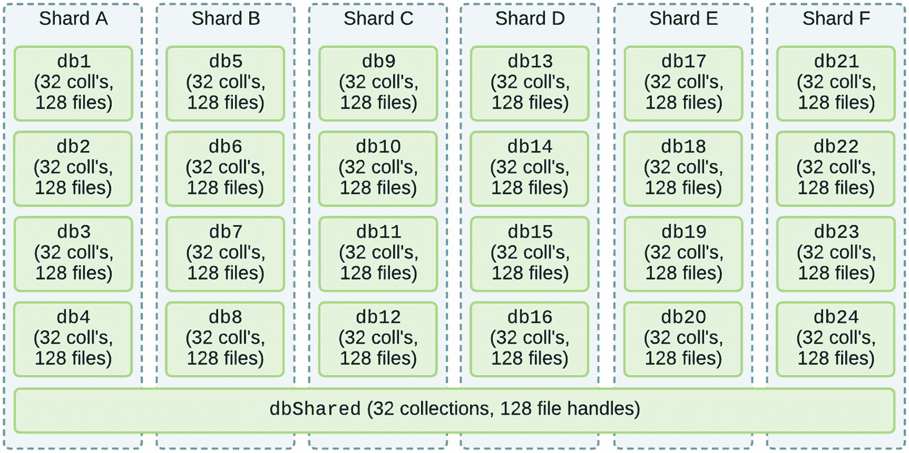
**图 11-6** 使用分片的多租户架构

### 虚拟机

随着虚拟机技术的可用性，我们将受益于将单个大型主机拆分为多个较小的虚拟机。我们实际上并不分片任何集合，而是确保每个数据库的**主分片**均匀分布在各个分片上。随着租户数量的增长，我们可以添加更多分片以将文件句柄总数保持在合理的最大值。

这种为集群拓扑增加的复杂性并不理想，但使用企业级自动化工具管理一个大型 MongoDB 集群通常比完全重新设计一个多租户 SaaS 应用程序要容易得多。

## 混合架构

随着云计算的日益普及，即使是拥有内部和法规限制的保守企业也在将运营迁移到云端。

通常，这些云迁移是从现有的本地 MongoDB 节点和应用逐步推出的。第一步通常是将仲裁节点迁移到云端；然后，有时当只有两个完全本地的数据中心可用时，云被用来提供“第三个数据中心”。

### 加密

凭借对传输中和静态加密以及**字段级加密**的内置支持，即使是金融和医疗行业的企业也可以确信云端的数据是安全的，即使他们更愿意将大部分节点保留在他们直接控制的服务器上。

### 迁移服务

下一阶段通常是将某些服务迁移到云端。例如，批处理和分析工作负载可能保留在本地，但面向客户的 Web 或移动服务由于使用模式需要每天快速扩展和缩减数次，因此具有迁移到灵活的云基础设施的强烈成本压力。

### 隐藏成本

将应用程序迁移到云端引入了一个新的成本来源：**云带宽费用**。所有主要的云提供商都对从云计算网络传出的字节收费。他们通常也对可用区之间的数据收费（但费率低得多）。因此，即使在同一地区的多个可用区中分布的副本集也会因复制而产生带宽费用。

对企业来说，很容易试图寻找一种方法，通过从已经位于同一可用区的节点读取来减少过高的带宽费用。理论上，这可能意味着只需要复制带宽。

在图 11-7 中，我们看到一种拓扑，其中主节点在本地（因为大部分写入工作负载仍在本地），但云中只有读取副本成员。在某些情况下，基于云的微服务可以从云中的二级节点读取以避免带宽费用，但将面临读取**陈旧数据**的风险。

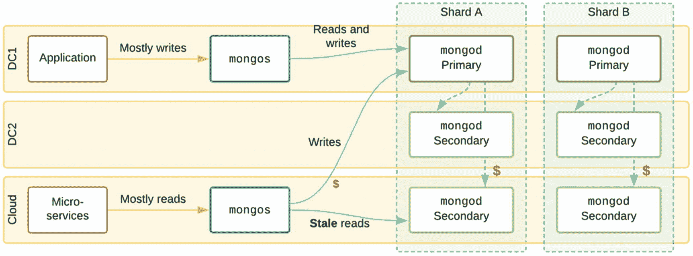
**图 11-7** 主节点仍在本地的混合部署

或者，如图 11-8 所示，主节点可以位于云端。现在我们可能会因本地应用的写入而产生带宽费用。这些写入随后需要从云端复制回本地的其他副本集成员。默认启用的**复制链**可以用来让数据中心 2 中的成员从数据中心 1 复制。

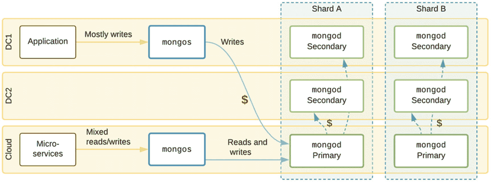
**图 11-8** 主节点在云端的混合部署

> **注意**
> 从应用到 `mongos` 的网络压缩需要通过向连接 URI 添加 `?compressors=snappy` 来显式启用。

### 策略限制

更复杂的是，由于公司策略或外部法规，有时分片集群中的部分集合甚至整个数据库仍可能无法存储在云端。在这种情况下，仍存在一些复杂的架构，允许集群拥有大量基于云的分片，同时确保某些数据始终保留在本地。

在图 11-9 中，我们可以看到一个分片集群，其中包含一个机密数据库，其内容必须仅存储在我们自己的数据中心内。只要所有`confidential`集合都是未分片的，它们就会保留在主分片 Shard 3 上。如果 Shard 3 的所有副本集成员都在我们自己的数据中心内，那么`confidential`数据就永远不会存储在云端。

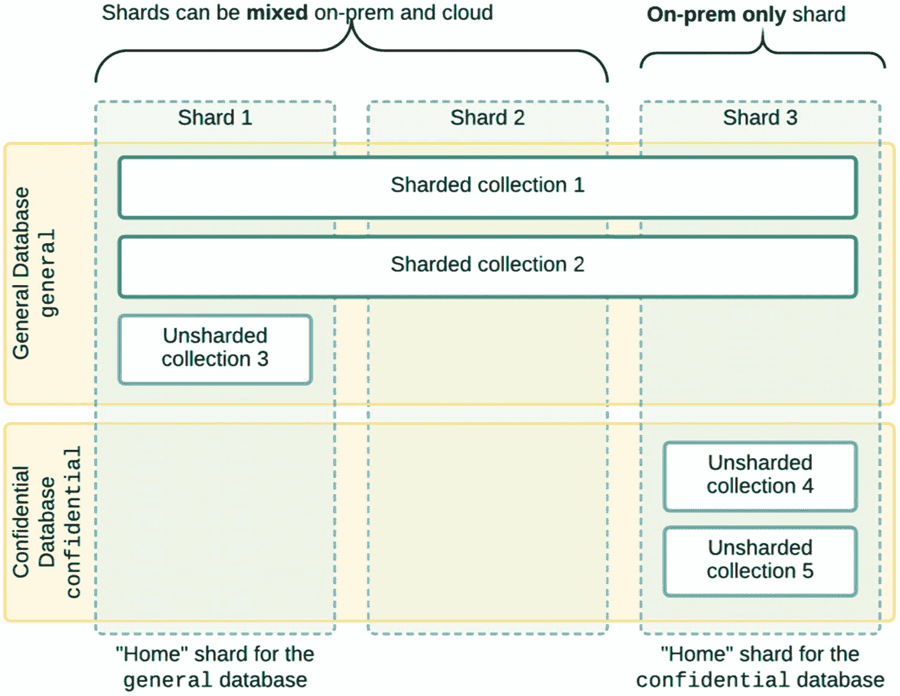

图 11-9：单一集群，但机密数据保留在本地

分片 Shard 1 和 Shard 2 的副本集成员可以是本地和云主机的混合体，如图 11-7 和 11-8 所示。

## 缩减分片集群规模

在某些情况下，你可能最初创建了一个多分片集群，以准备应用程序在大型发布前的短期增长。但有时数据增长不如预期快，部分硬件可以更好地用于其他集群或项目。

移除分片并释放主机是相当直接的。主要有三个步骤：

1.  迁移该分片上的任何数据（特别是“归属”于该分片的数据库）。
2.  移除任何引用这些分片节点的分片级配置。
3.  关闭节点。

### 迁移数据

让我们想象一个简单的例子：一个三分片集群，包含两个数据库，每个数据库有一个分片集合和一个未分片集合，如图 11-10 所示。数据库`db2`归属于 Shard C，这是我们要移除的分片。

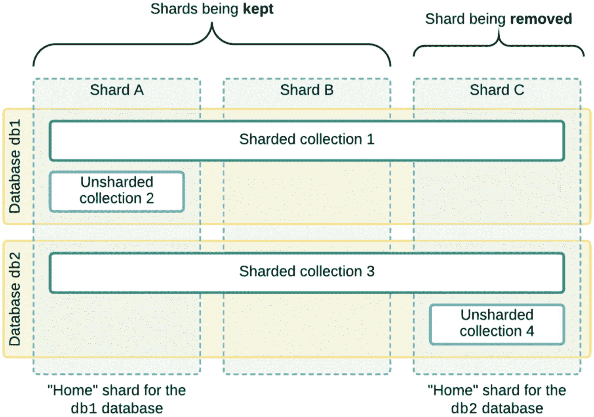

图 11-10：一个分片，其归属的数据库等待被清空

在 Shard C 的分片集合数据被清空之前，我们首先需要为`db2`选择一个新位置作为主分片。在这种情况下，我们应该使用 Shard B 来存储未分片集合，因为 Shard A 已经是`db1`的归属地，这将有助于保持分片的平衡。

#### 维护窗口

在开始任何更改之前，我们需要确保**没有活跃的迁移**，并且**没有针对`db2`中未分片集合的读写操作正在运行**。为安全起见，建议使用计划的维护窗口，并完全停止所有使用此数据库的应用程序。

#### 移动主分片

现在我们需要通过`mongos`发出以下命令：

```
db.adminCommand( { movePrimary : "db2", to : "shardB" } )
```

这可能会花费相当长的时间，因为数据需要传输，然后这些未分片集合上的所有索引需要在 Shard B 副本集的所有成员上重建。

#### 重启所有组件

由于已知的元数据缓存问题（至少到版本 4.2），现在极其重要的是：

1.  重启所有`mongos`实例和所有`mongod`分片成员（包括辅助成员）。
2.  连接到*所有*`mongos`实例和*所有*`mongod`分片成员（包括辅助成员），并运行 `db.adminCommand({ flushRouterConfig: "db2" } )`。

提示：请查阅 [`https://jira.mongodb.org/browse/SERVER-17397`](https://jira.mongodb.org/browse/SERVER-17397) 以获取适用于你 MongoDB 版本的当前最佳实践。

#### 恢复应用程序

只有在所有分片组件上都刷新了路由器配置后，才能安全地重新启动任何使用此数据库的应用程序。

### 移除分片

既然 Shard C 不再是任何数据库的主分片，我们就可以开始移除过程。

#### 清空分片

此时，未分片集合已被移走，但所有分片集合的部分数据仍将存储在 Shard C 上。我们现在将通过连接到`mongos`并发出以下命令，将 Shard C 上任何数据库的所有数据块移走：

```
db.adminCommand( { removeShard: "shardC" } )
```

你可以多次运行此命令以检查迁移状态，直到它报告该分片上没有剩余的数据块。现在集合的位置将如图 11-11 所示。

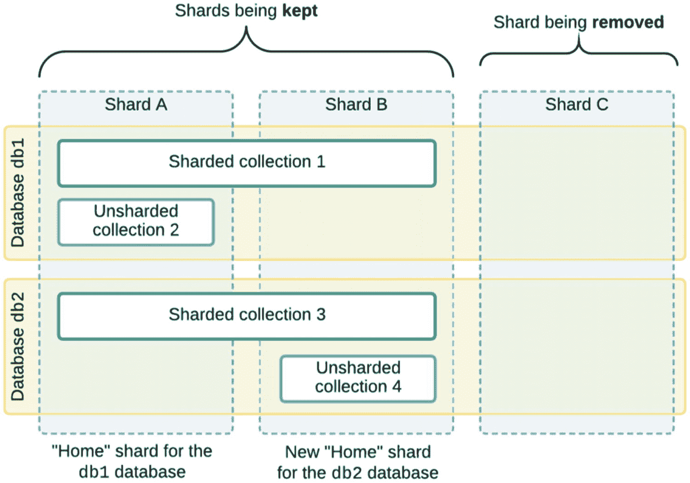

图 11-11：一个准备好从集群中移除的分片

#### 关闭分片

曾经构成 Shard C 的副本集仍将运行，但已无任何数据，并且不再连接到集群的其他成员。这些被隔离的节点现在可以停止，并且主机可以重新用于其他目的。

## 超大集群

当集群变得非常大，包含许多数据块定义和复杂的分区规则时，配置服务器副本集上的数据量自然也会变得更大。

每个`mongos`都会缓存有关数据块位置和到分片映射的元数据，以便在可能的情况下高效地将查询路由到各个分片。对于超大集群，此数据的内存需求也会增长，因此`mongos`主机可能需要升级配置。

### 配置服务器

监控配置服务器的磁盘空间和性能也很重要，特别是在平衡窗口或数据密集加载期间，以确保它们能够应对工作负载。

对于大型集群，最好为配置服务器运行一个五成员的副本集，以帮助分担来自`mongos`的读取负载并提供额外的弹性。随着集群的增长，你还需要扩展配置服务器的 CPU 核心和内存，尽管通常只需要 2-4 个核心。

## 关键要点

从本章中，需要记住的关键概念如下：

*   可以选择分片键来优化某些查询的读取性能，避免涉及所有分片的“分散-聚集”查询。
*   在大量数据导入期间，数据的分割和迁移相对较慢，可能意味着所有数据都写入一个热点分片，从而大大降低性能并增加总导入时间。
*   可以手动定义数据块范围并在分块之间分布，以优化具有已知值分布的新数据的批量加载。
*   可以在正常的平衡器窗口之外使用名为`moveChunk`的特殊管理命令手动移动数据块。
*   可以通过在它们的数据库上使用`movePrimary`命令，将未分片集合重新定位到另一个分片。
*   可以通过`removeShard`命令来启动清空一个不需要的、包含数据的分片。
*   数据中心与云提供商之间的带宽成本差异很大，并且会对运行分布式集群的总成本产生重大影响。
*   应用程序与`mongod`/`mongos`之间的网络通信需要在连接 URI 中显式启用。
*   数据库可以归属于特定的分片，以便出于法规或成本原因控制未分片集合的物理位置。


