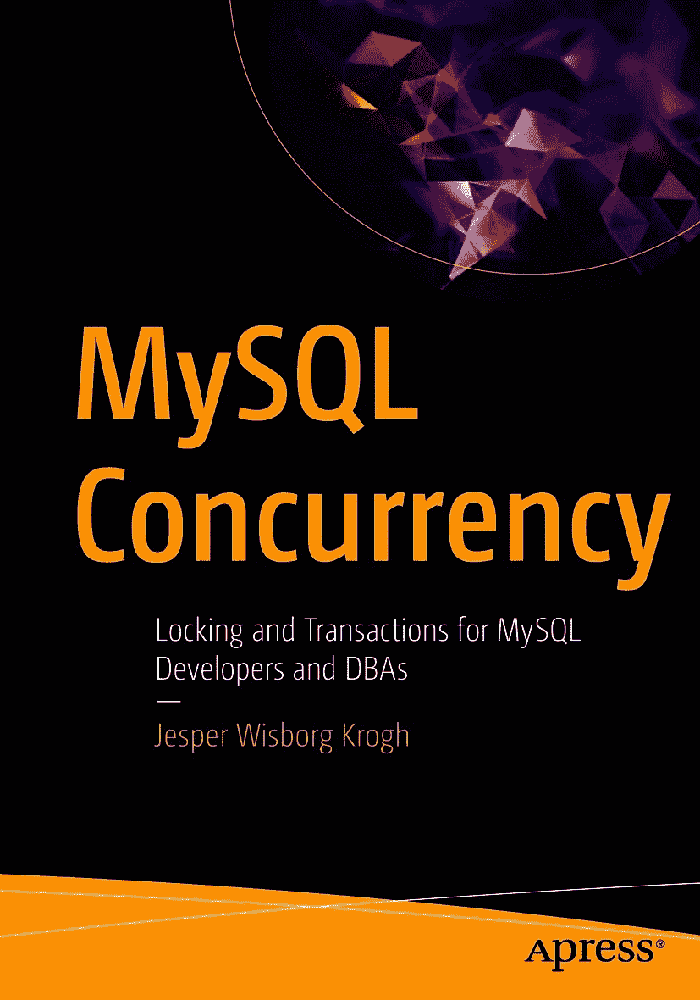

ISBN 978-1-4842-6651-9 e-ISBN 978-1-4842-6652-6 [`doi.org/10.1007/978-1-4842-6652-6`](https://doi.org/10.1007/978-1-4842-6652-6) © Jesper Wisborg Krogh 2021

本作品受版权保护。出版方保留所有权利，无论涉及材料的全部或部分，特别是翻译、转载、插图重用、朗诵、广播、缩微胶片或其他任何物理形式的复制，以及信息存储与检索、电子改编、计算机软件传输，或现在已知或未来开发的类似或不同方法。本出版物中对通用描述性名称、注册商标、服务标志等的使用，即使未作特别说明，也不意味着这些名称可不受相关保护性法律法规约束而自由使用。出版方、作者和编辑均安全地假设本书中的建议和信息在出版时是真实准确的。出版方、作者或编辑均不对本书所含材料或可能存在的任何错误或遗漏提供明示或暗示的保证。对于已出版地图中的管辖权主张和机构从属关系，出版方保持中立。

本书通过 `Springer Science+Business Media LLC` 向全球图书贸易发行，地址：1 New York Plaza, Suite 4600, New York, NY 10004。电话 1-800-SPRINGER，传真 (201) 348-4505，电子邮件 orders-ny@springer-sbm.com，或访问 www.springeronline.com。`Apress Media, LLC` 是一家加利福尼亚州有限责任公司，其唯一成员（所有者）是 `Springer Science + Business Media Finance Inc (SSBM Finance Inc)`。`SSBM Finance Inc` 是一家特拉华州公司。

*献给我的妻子 Ann-Margrete——感谢您的耐心与支持。*

## 前言

在使用数据库时，锁和事务是最困难且最常被误解的主题之一。本书旨在提升您对这两个概念的理解：它们如何工作、如何调查它们，以及如何优化您的工作负载以使其与它们协同工作得最好。实现这一目标的方法是结合讨论监控、锁与事务理论以及一系列案例研究。

`MySQL` 以其对存储引擎的支持而闻名。然而，本书仅涵盖 `InnoDB` 存储引擎，并且只考虑 `MySQL 8`。尽管如此，大部分讨论也适用于旧版本的 `MySQL`，并且通常会说明某个功能是 `MySQL 8` 中的新特性，或者 `MySQL 8` 的行为与旧版本不同。

### 目标读者

本书是为有 `MySQL` 使用经验的开发人员和数据库管理员编写的，他们希望扩展关于 `MySQL` 并发领域内锁和事务如何工作的知识。

### 示例与本书的 GitHub 仓库

我尝试添加了尽可能多的示例和示例输出。其中一些示例相当简短，有些则相当长。无论哪种情况，我希望您能够跟上并复现所演示的效果或结果。同时，请务必记住，本质上常常涉及随机性，示例的确切结果可能取决于示例执行前表和数据的使用方式。换句话说，即使您操作完全正确，也可能得到不同的结果。这尤其适用于与锁 ID、内存地址、互斥量/信号量、时间等相关的信息。

较长或输出过长或过宽的示例已添加到本书的 GitHub 仓库中。这包括一些在页面格式允许的图像尺寸下可能难以看清的图表。

**注意**
仓库链接可以从本书主页 [`www.apress.com/gp/book/9781484266519`](http://www.apress.com/gp/book/9781484266519) 找到。也可以直接在 [`www.github.com/Apress/mysql-concurrency`](http://www.github.com/Apress/mysql-concurrency) 找到。

为了更轻松地复现示例，并提供可用于检查测试所演示问题的示例查询，一个用 `Python` 编写、供 `MySQL Shell` 使用的模块也包含在本书的 GitHub 仓库中。基本的安装和使用说明见第 1 章，完整文档见附录 B。

GitHub 仓库也将是本书勘误表的所在地。我将使用勘误表不仅传达书中的错误，而且在 `MySQL 8` 中的错误修复和新功能导致书内容发生变化时提供更新。如有必要，我还将更新仓库中的示例以反映新版本中的行为。基于这些原因，我建议您关注该仓库。

## 书籍结构

我尽量使每一章都相对独立，目的是让你能将本书作为参考书使用。这种选择的缺点是，信息会不时有所重复。这在案例研究中尤为明显，其中重复了前面章节讨论过的部分内容。这是一个有意的选择，希望能帮助你减少翻找所需信息时的翻页次数。

本书分为 18 章和两个附录。第 1 章提供概述，第 2 至 4 章涵盖锁和事务的监控，第 5 至 10 章讨论锁，第 11 至 12 章包含关于事务的信息，最后，第 13 至 18 章通过六个案例研究进行讲解。附录则提供了关于监控锁和事务的参考资料，以及本书附带的 MySQL Shell 模块的参考资料。

### `第[1]章`，“概述”
这章概述性章节涵盖了一些高级概念，并介绍了用于重现本书示例和测试数据的 MySQL Shell 模块。

### `第[2]章`，“监控锁”
本章介绍如何使用 Performance Schema、`sys`模式、状态计数器和 InnoDB 指标来监控锁。还包括如何使用 InnoDB 锁监视器、InnoDB 监视器中的死锁信息，以及如何获取有关互斥量和信号量争用的信息。

### `第[3]章`，“监控 InnoDB 事务”
本章主要展示如何使用`information_schema.INNODB_TRX`视图来调查 InnoDB 事务。也涵盖了 InnoDB 监视器中的事务列表以及与事务相关的 InnoDB 指标。

### `第[4]章`，“Performance Schema 中的事务”
本章承接上一章，讲解 Performance Schema 中的事务信息，以及如何查找属于一个事务的语句。

### `第[5]章`，“锁访问级别”
本章介绍了共享锁、排他锁和意向锁，并展示了这些锁彼此之间的兼容性。

### `第[6]章`，“高级锁类型”
本章涵盖在比记录更高层级上工作的锁。这些主要是处理存储引擎作用域之外的锁，包括用户级锁、元数据锁、刷新锁和表级锁。还包含了 MySQL 8 新增的备份锁和日志锁。

### `第[7]章`，“InnoDB 锁”
本章介绍 InnoDB 使用的记录级锁。包括普通记录锁、间隙锁、临键锁、插入意向锁、自增锁，以及互斥量和读写锁信号量。

### `第[8]章`，“处理锁冲突”
本章解释当锁冲突发生时的情况，从讨论内部用于锁优先级的争用感知事务调度（CATS）开始，到锁兼容性、锁等待超时和死锁。

### `第[9]章`，“减少锁问题”
本章介绍如何减少系统中的锁争用及其影响。方法包括减小事务大小和年龄、使用索引、并发任务按相同顺序访问记录、更改事务隔离级别等。

### `第[10]章`，“索引与外键”
本章详细探讨索引和外键对锁定的影响。唯一索引是否比非唯一索引需要更少的锁？外键是否会导致更多的锁？答案是肯定的，本章解释了原因并给出了差异示例。

### `第[11]章`，“事务”
本章讨论事务是什么，以及它们如何帮助处理并发工作负载。还涵盖了事务的影响，以及组提交功能如何帮助减少持久化已提交事务的影响。

### `第[12]章`，“事务隔离级别”
本章介绍了 InnoDB 支持的四种事务隔离级别，并讨论了每种级别对锁定和数据一致性的影响。

### `第[13]章`，“案例研究：刷新锁”
本章设置数据库以产生刷新锁争用，然后分析问题，提供解决方案，并讨论如何预防该问题。

### `第[14]章`，“案例研究：元数据锁与模式锁”
本章通过研究一个涉及元数据锁的情况，探讨了另一个常见的锁问题。

### `第[15]章`，“案例研究：记录级锁”
本章对 InnoDB 记录级锁进行调查，并讨论如何解决该锁问题以及减少遇到它们的机会。

### `第[16]章`，“案例研究：死锁”
本章对一个死锁进行调查，详细分析了从 InnoDB 监视器输出中获取的死锁信息。

### `第[17]章`，“案例研究：外键”
本章涵盖了一个由外键引起的高级锁场景，涉及元数据锁和 InnoDB 记录锁。

### `第[18]章`，“案例研究：信号量”
本章设置了一个触发信号量争用的测试案例，并对该问题进行了调查。

### 附录 A，“参考资料”
本附录提供了查找本书讨论主题相关信息的资源概述。资源主要包括 Performance Schema 中的表和`sys`模式中的视图，包括`performance_schema.metadata_locks`表中`OBJECT_TYPE`和`LOCK_TYPE`列的可能值。还包括一些 Information Schema 资源，并列出了 InnoDB 监视器输出中的各个部分。

### 附录 B，“重现锁场景的 MySQL Shell 脚本”
本附录是随书提供的 Python 模块的参考。包括如何安装和使用该模块的讨论，以及如果你想用自己的工作负载扩展它，代码的组织方式。

## 致谢
首先，我要感谢 Apress 团队所有让本书成为可能的人。特别要感谢提出这个想法的乔纳森·詹尼克（Jonathan Gennick），协调工作的吉尔·巴尔扎诺（Jill Balzano），在幕后工作的劳拉·贝伦森（Laura Berendson），以及纠正我语言错误的克瑞普泽琳·罗马（Creapzylene Roma）。

本书所分享的知识并非凭空产生。感谢 Charles Bell 始终如一的细致审阅，以及他富有建设性的反馈和改进建议。Jakub Lopuszanski 在 InnoDB 锁相关细节上提供了帮助。同时，我也要感谢多年来所有的同事们，他们通过指导、教学、提出好问题以及日常讨论，共同参与了我学习 MySQL 工作原理的旅程。特别感谢 Edwin Desouza 和 Frédéric Descamps（更广为人知的名字是 Lefred）给予的协助。

最后但同样重要的是，感谢我的妻子 Ann-Margrete 在我撰写本书过程中的耐心与支持。没有你，这本书的完成将无从谈起。

关于作者 关于技术审阅者

