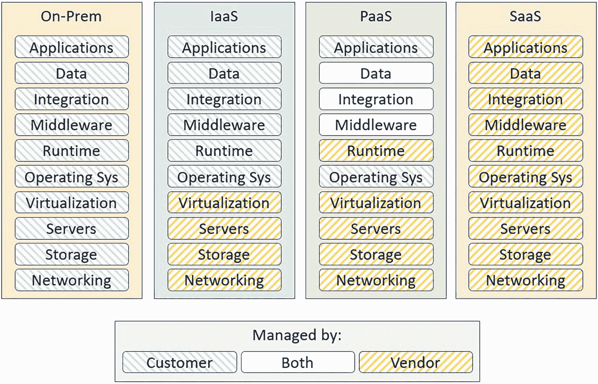
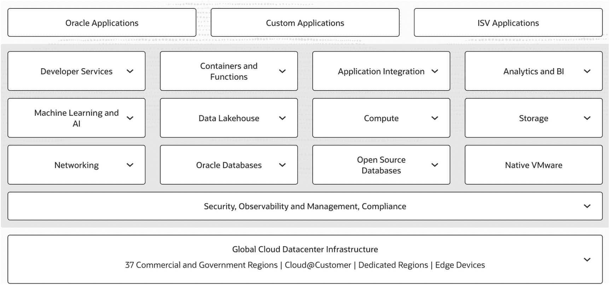

# 云端 MySQL 入门

本书中示例的代码可在 Apress 网站 [`www.apress.com`](http://www.apress.com) 上获取。你可以在本书信息页面的“源代码/下载”选项卡中找到链接。该选项卡位于页面的“相关书籍”部分。

## 联系作者

如果您有任何问题或意见——甚至发现您认为我应该知道的错误——都可以通过 `drcharlesbell@gmail.com` 联系我。

## 致谢

我要感谢 Apress 众多才华横溢、充满活力的专业人士。我感谢我的编辑 Jonathan Gennick 和执行编辑 Jill Balzano 的理解与耐心。他们对这个项目的成功至关重要。我还要感谢 Apress 庞大的出版专业团队，让我在印刷品中显得如此出色，并特别感谢技术审校者的睿智建议。非常感谢大家！

最重要的是，我要感谢我的妻子 Annette，感谢她在我花大量时间与笔记本电脑相处时，所给予的无限耐心和理解。

## 关于作者 关于技术审校者

云时代已经来临一段时间了。这是一个美好的愿景，我们不再需要设计、建造和配备人员来维护装满昂贵计算设备的巨大房间，这些设备需要训练有素、值得信赖的员工全天候关注和维护。最终目标是降低成本、提高能力。这导致了云解决方案和云提供商的快速增长。(¹)

虽然云服务已经存在一段时间，但直到最近，云服务才变得功能齐全、足够复杂，能够支持现实世界的用例。其中一个用例就是将您的数据存储需求托管给云服务。

在这种情况下，我们希望将 `MySQL` 用于我们所有的数据库需求，但我们不想自己构建和维护硬件和软件。相反，我们希望能够专注于构建我们的应用程序和满足客户的需求，而无需担心数据库系统。

这正是 `Oracle Cloud Infrastructure` 和 `MySQL 数据库服务` 的设计目的——通过提供完全托管的 `MySQL` 数据库服务，让您能够专注于您的业务。

`MySQL` 长期以来一直被认为是世界上最受欢迎的开源数据库，并且在世界数据库系统排名中持续位居第二，只有其所有者 (`Oracle`) 排名高于它。获得如此赞誉的理由包括经过验证的可靠性、高性能和易用性。众所周知，`MySQL` 为世界上使用最广泛的网站提供支持，包括 `Facebook`、`YouTube` 和 [`booking.com`](http://booking.com)。正如您可能推测的那样，`MySQL` 拥有一个强大而庞大的生态系统，以及世界领先的数据库公司 `Oracle` 的支持。

近年来，`MySQL 堡垒服务` 使得组织能够扩展其基础设施以满足业务目标，同时保持低成本和生产力。随着 `MySQL` 迁移到云端，这一趋势仍在继续。事实上，由于 `OCI` 中为他们提供了 `MySQL` 的常规管理，组织现在可以更快地进行创新和集成他们的解决方案。

在本章中，我们将了解什么是 `Oracle Cloud Infrastructure` 和 `MySQL 数据库服务`，以及如何使用它们。虽然本书不是关于云计算或 `Oracle Cloud Infrastructure` 的教程，但我们需要了解云计算和 `Oracle Cloud Infrastructure` 的基本概念，以便我们能够利用 `MySQL 数据库服务`。

## 概述

近年来，各种云提供商都提供了 `MySQL`，承诺提供更好的 `MySQL` 体验。虽然有些提供商成功地为云客户以各种形式提供了 `MySQL`，但一直缺乏一个能将 `MySQL` 的精华封装在一个完全托管套餐中的产品。直到现在，这种情况才改变。

`Oracle` 已将其 `MySQL` 加入到其 `Oracle Cloud Infrastructure (OCI)` 中漫长而令人印象深刻的服务列表中。在本节中，我们将对云计算、`Oracle Cloud Infrastructure` 和 `MySQL 数据库服务` 进行一个高层次的概述。

---
脚注：
1.  云时代...快速增长。↩

### 什么是云计算？

时至今日，很难再找到没听说过云计算的信息技术经理或工程师了。的确，"云"这个词被炒作得如此泛滥，以至于我们开始觉得它只是个营销术语，有些人因此直接忽略它。另一些人则从喧嚣中听闻了许多优点，想要了解更多。如果你属于后一类，接下来的内容将为我们开启这段旅程做好铺垫。如果你已经在使用 `OCI`，可以随意跳到 `MySQL 数据库服务` 章节。

自云计算的早期以来，云服务已大幅发展。那时，云仅仅意味着使用虚拟机来托管服务器，供客户构建和运行自己的服务。随着云服务的发展，更多组件被添加进来，例如虚拟网络和类似的基础设施组件，它们通常作为"弹性"设备，打破了传统计算的束缚。

例如，弹性技术实现了网络分离，允许你创建一个 `IP` 地址，该地址可以分配给一台服务器，之后还能被其他资源复用。这不仅使得 `IP` 或网络与服务器得以分离，还意味着当你需要用另一台服务器替换故障服务器时，可以减少应用程序的重新调整或配置。

自那些早期以来，云计算已变得更加成熟，现在包含的特性或技术有如下示例：

-   `按需资源`：你可以随意创建、部署、使用和销毁资源
-   `网络资源`：虚拟化的网络组件
-   `资源池化`：能够从类似组件/虚拟化资源池中消耗资源
-   `组件间的弹性`：将独立的组件连接在一起，并混合搭配资源

除了资源特性，云系统已经发展到包含三种主要形式或服务模型。这些模型之间的主要区别在于客户（企业）能够控制或深入交互资源的程度。以下从云服务提供商的角度简要描述每种模型：

-   `软件即服务 (SaaS)`：软件作为托管服务交付，通常是在虚拟化服务器上运行的组件，并通过 Web 应用程序访问。支持 `SaaS` 应用程序的虚拟化硬件组件完全由提供商管理，通常对客户是隐藏的。一些 `SaaS` 解决方案示例包括 DocuSign、Dropbox 和 Microsoft Office 365（在线版）。
-   `基础设施即服务 (IaaS)`：为客户提供建立自身基础设施所需的组件和资源，这些资源来自虚拟化组件。这些组件可能是完全管理的。例如，数据库系统被认为是 `IaaS` 组件，其支持性的虚拟化组件由提供商管理，但数据库和数据则由客户管理和拥有。一些 `IaaS` 解决方案示例包括 Rackspace、Google Compute Engine 和 Digital Ocean。
-   `平台即服务 (PaaS)`：这为客户提供了一个用于创建定制化应用程序的框架。通常，客户管理平台组件，而云提供商管理底层的支持组件。一些 `PaaS` 解决方案示例包括 Google App Engine、Heroku 和 OpenShift。

图 1-1 展示了这三种模型以及传统的本地部署模型在开发应用程序方面的图形化视图。请注意不同模型间管理职责的变化。

本地部署、`IaaS`、`PaaS` 和 `SaaS` 四种模型的框图。每种模型中，应用程序、数据、集成、中间件和运行时由客户和供应商共同管理。

图 1-1
本地部署、`IaaS`、`PaaS` 和 `SaaS` 之间的管理职责

然而，这些模型可以相互混合，并且经常使用一种模型来提供其他模型的资源。例如，在本书中，我们将重点介绍 `MySQL 数据库服务`，它是 `Oracle 云基础设施`（一项 `IaaS` 服务）中的一个 `PaaS` 组件。因此，`MySQL 数据库服务` 是构建在 `Oracle 云基础设施` 之上的。

### 为什么要迁移到云？

企业希望将其基础设施组件迁移到云端的原因有很多。我们已经了解到这可以节省成本、提高产品开发的敏捷性，以及云服务如何实现更多的自动化。让我们更深入地探讨一下这些方面。

#### 提高敏捷性

这也许是使用云服务带来的最大组织效益。能够快速响应业务和市场变化，使组织更强大，更能跟上（甚至领先于）竞争。为什么会这样呢？

试想一下启动一个新项目所需的时间、资源和资金。具体来说，考虑一下支持项目后续开发和部署所需的信息技术资源。大多数组织不得不依赖其信息技术部门来研究、采购、安装和配置硬件及软件，之后才能全面开展开发工作。根据组件的复杂性和独特性，你可能要花费数月时间来调整基础设施。

然而，有了云系统，你可以跳过所有冗长的预算、订购、安装等流程，直接通过 Web 控制台点击几下鼠标来创建这些资源。通过将关键的、通常是全新的资源迁移到云端，你可以获得以下潜在好处：

-   `敏捷性`：把握机遇，适应优先级变化
-   `快速部署`：在数小时内部署资源，而非数天或数月
-   `适应性`：快速响应市场变化和技术的发展趋势
-   `简化流程`：消除冗长采购流程的负担
-   `减少 IT 投资`：通过减少资本投入和人力资源，降低拥有和维护自有硬件的开销
-   `改进交付`：快速开发和交付解决方案

#### 自动化

安装、配置、调优和维护自己的资源（如数据库系统）可能耗时，并需要持续、细致的监控，这已不是秘密。对于大多数本地安装来说，这不仅涉及采购的负担，还需要高技能的工程师和技术人员。当资源数量开始增长时，这种需求只会加剧。例如，管理几个数据库系统所需的人力可能很少，但当系统数量增加时，技术的复杂性对人力资源提出了更高要求，通常需要更多的员工并对现有员工进行培训。

当你使用托管服务时，云系统能显著削减这些成本。例如，一个完全托管的数据库服务意味着你不再需要人力资源来调优和监控数据库系统——大部分工作都通过内置于云服务平台中的自动化为你完成了。

这使得组织能够将资源转向管理其解决方案，从而为开发运维（`DevOps`）腾出时间。开发运维通常包括配置、部署和维护组织解决方案的自动化，这比投资于硬件及配套软件更直接地投入到开发的最终产品上，并能带来更快的交付和更高的利润率。

如你所见，云技术有许多引人入胜的优点，而 `Oracle 云基础设施` 正是为了超越这些优点而构建的。让我们进一步了解 `Oracle 云基础设施`。

## 什么是 Oracle 云基础设施？

Oracle 云基础设施（Oracle Cloud Infrastructure，简称 OCI）旨在通过让您能够使 OCI 资源适应独特的业务需求并满足创新要求，从而改变您的云体验。OCI 是一个自主、可扩展的云平台，专为广泛的企业工作负载而构建，从基本云系统（其核心组件驻留在 OCI 中）到原生云基础设施。更棒的是，借助 OCI，您可以像管理本地（也称为 on-prem）基础设施实验室一样，控制和管理您的资源，包括安全性和监控。

您将与之交互并用于构建基于云的基础设施的关键 IaaS 组件包括：

*   **计算**：您可以从各种计算设备（可将服务器硬件和操作系统视为一个虚拟单元）中进行选择，从需要少量计算能力、内存的设备到需要更多计算能力（包括处理核心和更大内存）的设备。您还可以选择裸机计算资源，以确保获得更强的隔离性、更高的性能和一致性。这些构成了您自行构建的应用程序和中间件软件服务的基础。
*   **存储**：与计算类似，您可以选择多种基于云的存储与计算资源配合使用。您可以从网络文件、对象、网络块、闪存、归档、数据库备份、数据传输甚至软件存储网关中进行选择。有了这么多选择，您一定能找到最适合您解决方案的存储机制。
*   **网络**：您可以选择私有、安全的网络，使用虚拟专用网络（VPN），设置子网，扩展负载均衡等等。虚拟云网络资源使您能够创建高可用、安全的网络解决方案，以替代现有的昂贵本地硬件。凭借弹性特性，您无需在每次进行网络范围的更改时重写或重新配置软件。例如，当您替换或升级计算或存储资源时，只要网络地址不变，您就不需要过长的停机时间来重新配置。
*   **边缘**：OCI 还提供资源来提供网络边缘服务，例如域名服务（DNS）。
*   **容器**：还提供生产级和企业级资源，以高性能、高可用的方式运行基于容器的解决方案。
*   **数据库**：除了预期的 Oracle 数据库资源系列外，OCI 还提供 PaaS MySQL 数据库解决方案。MySQL 数据库服务是您构建和集成解决方案的一站式资源，其中数据库服务器是关键组件。我们将在下一节中了解更多关于 MySQL 数据库服务的信息。

虽然此列表是 OCI 核心资源和功能的高层概述，但它还提供了更多功能，以及许多利用 OCI 来满足云计算需求的方式。图 1-2 展示了 OCI 功能和特性的类别摘要。

该图以表格形式分类和总结了 OCI 的能力与特性。

**图 1-2** OCI 能力与特性（由[oracle.com](http://oracle.com)提供）

> **提示**
>
> 有关 OCI 的更多信息，请访问 [`www.oracle.com/cloud/`](http://www.oracle.com/cloud/)。在那里您将看到图 1-2，其中包含指向每个类别和特性更多信息的链接。

OCI 提供了一个基于 Web 的控制台，允许您创建、配置和销毁资源。这很可能是您的默认访问机制。登录 OCI 帐户后，您将看到 OCI 控制台。

我们将在下一章中了解更多关于 OCI 的信息，包括在探索如何设置我们的第一个 MySQL 数据库服务时，如何设置您的帐户。

## 什么是 MySQL 数据库服务？

MySQL 数据库服务（MySQL Database Service，简称 MDS）是一种完全托管的 OCI 资源，作为原生服务运行。也就是说，它内置于 OCI 核心组件中，因此完全集成到 OCI 架构中。MDS 继续由 Oracle 的同一 MySQL 工程团队开发、管理和支持。更棒的是，MDS 与本地 MySQL 安装兼容，这意味着您无需更改应用程序即可从本地 MySQL 迁移到 MDS。

简单地说，MDS 就是 MySQL。它并非为了看起来和感觉像 MySQL 而捆绑在一起的混合组件。虽然 MDS 使用的 MySQL 版本是企业版，但您无需购买许可证即可使用 MDS。在许多方面，您使用 MDS 就像使用开源社区版一样。不同之处在于，您获得了所有的企业功能，只需支付很少的名义费用即可使用它！

借助 MDS，您将获得与在本地运行 MySQL 相同的所有功能、成熟度、可靠性和性能。不同之处在于，OCI 允许自动化维护任务，例如升级、备份、数据库和操作系统修补等。您从这种负担中解放出来，使您可以完全专注于管理数据、架构设计和访问策略。因此，您花费更少的资金，却仍然能获得使用 MySQL 作为数据库服务器的好处。

实际上，OCI 中的 MDS 能带来以下好处：

*   **快速置备**：使用针对生产部署优化的预配置设置创建 MySQL 实例。
*   **自动化**：配置、升级、修补等全部自动化。
*   **定制化**：通过从一系列配置中选择来定制您的 MDS 资源，这些配置将计算能力、内存和存储大小配对，使您可以限制这些资源的成本——只为所需付费。
*   **安全存储**：选择经济高效的存储解决方案，范围从高性能的附加固态硬盘（SSD）到可靠、高性能的块卷，以及经济高效的归档存储。
*   **快速网络**：创建配置为满足您隐私需求的虚拟云网络。
*   **监控**：使用监控来优化您的应用程序，并快速响应需要更改以获得最佳性能的事件。
*   **更少的资源投入**：迁移到 MDS 使您能够为对业务至关重要的任务和技能招聘和培训新的人力资源。

随着我们了解更多关于 MDS 和 OCI 的信息，我们将看到其中大部分的更多细节。

### OCI 中的 MDS

现在我们对 OCI 有了更多了解，我们应该讨论一些限制、术语以及使用 MDS 所需的 OCI 机制。我们暂时不会讨论如何设置和连接到 MDS。我们将在下一章介绍这些内容。相反，以下是一些您应该熟悉的内容，为您使用 MDS 做准备。如果您已经在使用 OCI，其中一些内容您会很熟悉。

#### 区域可用性

OCI 中的区域是一个本地化的地理区域，通常由该区域内的 OCI 数据中心提供服务。MDS 在大多数区域可用，但在新区域部署后可能不会立即可用。请与您的 Oracle 客户经理确认 MDS 在您的区域是否可用。

#### 所需的身份和访问管理策略

对 OCI 服务的访问受另一个 OCI 资源——身份和访问管理（`IAM`）的控制，该资源用于所有身份验证和授权，包括通过控制台、SDK 或 CLI 以及 REST API 进行的访问。为了使用 MDS，您的 OCI 管理员需要设置`IAM`以允许访问 MDS 资源。

## 数据安全

MDS 使用加密技术来保护您的数据。在底层，MDS 使用一种称为块卷的存储机制，该机制始终处于加密状态。MDS 还支持使用传输层安全协议 (TLS) 在 MDS 与客户端之间进行加密通信。默认情况下，MDS 应用程序会尝试使用加密方式建立连接。

## MDS 与审计服务

MDS 与 OCI 审计服务集成，使您能够对数据库服务器执行访问审计等审计目标。

## MDS 版本与存储引擎

MDS 基于 `MySQL Enterprise Edition` 8.0 版本构建，并且**专一地**使用 `InnoDB 存储引擎`。`MySQL Enterprise Edition` 提供了众多企业级功能，包括审计、可通过可插拔认证模块（“PAM”）或原生 Windows 服务轻松将 MySQL 集成到安全基础设施中的外部认证模块、透明数据加密 (TDE)、增强的加密与其他密码学特性，以及防御网络安全威胁的防火墙功能。

## 计算形状

MDS 被配置为从一组计算资源配置选项中进行选择，这些配置描述了计算、内存和存储的规模。这些选项被称为计算形状。在置备（创建）MDS 时，您需要从一系列形状中选择最符合您需求的那一个。

**提示**

有关 MDS 的更多信息，请访问在线文档 [`https://docs.oracle.com/en-us/iaas/mysql-database/doc/overview-mysql-database-service.xhtml`](https://docs.oracle.com/en-us/iaas/mysql-database/doc/overview-mysql-database-service.xhtml)。

## DB 系统

一个 MDS DB 系统（有时称为 `dbSystem`）是 MySQL 服务器实例的逻辑单元或容器。其主要目的是为 MDS 便捷地提供置备、备份、恢复、监控、终止等功能。DB 系统容器由以下组件构成。除了与用户界面（例如 OCI 控制台）有交集外，此列表应视为参考信息，因为您无法直接与某些组件交互：

*   `计算`：也称为计算实例，它是一个 OCI 计算资源，在创建时使用所选的计算形状进行配置。
*   `操作系统`：操作系统虽然被视为独立于作为虚拟机的计算实例，但已预定义为 Oracle Enterprise Linux。
*   `MySQL 企业版服务器`：MDS 配置了 MySQL 产品线中 8.0 版本的最新发布版。
*   `虚拟网络接口卡 (VNIC)`：将 DB 系统连接到虚拟云网络 (VCN) 的子网。
*   `网络附加块存储`：MDS 为所有块存储使用高性能选项。根据所选计算形状中存储的大小，存储可能由一个组内的多个块卷组成，以便实现高性能访问。

虽然这个列表看起来需要配置和设置的内容很多，但 DB 系统容器已针对组件的快速部署（创建和置备）进行了优化。实际上，操作系统和 MySQL 作为特殊镜像进行了预配置，在配置 MDS 时会加载该镜像。

**提示**

有关 DB 系统的完整描述，包括 MySQL 配置的所有详细信息，请参见 [`https://docs.oracle.com/en-us/iaas/mysql-database/doc/db-systems.xhtml`](https://docs.oracle.com/en-us/iaas/mysql-database/doc/db-systems.xhtml)。

## MySQL HeatWave

MDS 最重大且最令人兴奋的功能之一，实际上是一个独立的产品。`MySQL HeatWave` 构建于 MDS 之上。`HeatWave` 提供了一个高性能的内存分析处理引擎，并已针对在 OCI 上运行进行了优化。

您可以使用存储在 MDS 中的数据来运行 `HeatWave`，无需进行昂贵的数据迁移、中间系统或任何应用程序更改。您的应用程序可以使用常规的 MySQL 通信协议（可以理解为相同的应用程序）连接到 `HeatWave` 并与之交互。与 MDS 本身一样，所有典型的管理和维护操作都是自动化的。您也可以使用相同的 OCI Web 控制台、REST API、CLI 或 DevOps 工具来管理您的 `HeatWave` 实例。

虽然这一切听起来很棒，但 `HeatWave` 最重要的方面在于，您的查询可以在 MySQL 数据库的基础上实现数量级的加速，使您能够利用与应用程序相同的数据库存储，构建复杂且快速的联机事务处理和联机分析处理操作。我们将在第 8 章了解更多关于 `HeatWave` 的内容。

为了帮助我们理解如何在您的基础架构中利用 MDS，让我们来看看 MDS 的用例。

### 用例

MDS 有许多用例。事实上，您已知的大多数 MySQL 用例都适用于 MDS。然而，在 OCI 中，有一些用例是 MDS 独有的。以下列出了几个更重要的用例：

*   `迁移工作负载`：您可以将最繁重甚至全部的 MySQL 工作负载迁移到 OCI，从而释放资源并专注于业务更重要的目标。
*   `开发云应用程序`：您可以更快地改进和发展您的应用程序，将其转变为基于 MySQL 的云原生应用程序，并消除许多从零开始开发基础设施的负担。
*   `部署灵活性`：由于 MDS 与本地 MySQL 完全兼容，您在将部分或全部 MySQL 服务器部署到 OCI 时具有灵活性。
*   `SaaS 应用程序`：由于 MySQL 是许多 SaaS 产品的首选数据库，您可以将您的 SaaS 应用程序构建并扩展到 OCI 上。

然而，在 OCI 中使用 MDS 存在一些限制。

## 限制

虽然我们期望能在 MDS 中使用所有 MySQL 功能，但有些功能不受支持，原因可能是它们不适用于云环境、尚未适配用于 OCI，或者需要 OCI 中的额外功能支持。以下是当前在 MDS 中不受支持的功能：

*   认证插件
*   修改系统表
*   二进制日志访问
*   错误日志记录到系统日志
*   组复制插件
*   InnoDB 表空间加密
*   密码强度插件
*   设置全局变量
*   持久化系统变量
*   复制过滤器
*   半同步复制
*   可传输表空间

如果您当前计划使用这些 MySQL 功能中的一项或多项，请在尝试使用之前查阅在线的 DB 系统文档以获取更多详细信息。您可能还需要查看 [`https://docs.oracle.com/en-us/iaas/mysql-database/doc/db-systems.xhtml#GUID-DAF5136C-C602-434E-8EBB-E1AFA57F0BB7`](https://docs.oracle.com/en-us/iaas/mysql-database/doc/db-systems.xhtml%2523GUID-DAF5136C-C602-434E-8EBB-E1AFA57F0BB7) 以获取 MDS 中限制的完整列表，包括对现有功能的限制。

