# 2. Oracle Cloud Infrastructure

## 云服务成本预期

使用云服务作为基础设施组件（如 IaaS 组件）最具吸引力的方面之一就是成本。你不仅可以节省建立物理信息技术实验室的成本（包括冷却和安全措施），而且无需额外投入人力资源来运营和维护硬件及服务器。

但是，在规划数据库系统时必须谨慎。Oracle 提供了多种不同的配置供你选择，例如选择**形状（计算对象的大小）**，这定义了 CPU 处理能力以及内存和磁盘大小。自然，更大（更强大）的形状比较小的形状成本更高。

使用云服务的费用因供应商而异，但所有供应商都基于可消耗处理（如虚拟计算平台）的小时费率计费，在某些情况下也按单位（如磁盘或其他存储设备）计费。此外，当你与数据库系统交互时（如上传数据、导出、网络传输等），可能会产生数据传输速率的费用。这些成本随时间累积，将决定你的节省总额。

让我们探讨一个简单的假设示例。我们将保持简单，仅计算数据库服务的成本。假设我们使用一个虚构的云服务，其计算服务收费为 $0.05/小时，存储收费为 $0.025/GB/天。这看起来真的很便宜，对吧？让我们算一下。对于一天，我们将产生 $36.00 的计算成本（30 天乘以 24 小时乘以 $0.05），如果我们每天使用 10 Gb 的磁盘存储，则需额外支付 $0.25（10 Gb 乘以 $0.025），每月总计 $36.25。显然，这比维护你自己的 MySQL 服务器所需的物理和人力资源成本要便宜得多！

虽然这个例子纯属虚构且极不准确，^(²) 但它应该让你了解云服务的计费方式以及你的账单在一个月内是如何累积的。但这不必完全出乎意料，因为你可以创建一个 OCI 账户并尝试可用的资源。事实上，如果你按照下一章的教程创建你自己的 OCI 账户，你可以看到这些费用是如何生成的，以及 Oracle 授予新账户的注册信用额度是如何抵扣账单的。也就是说，你将获得一定的美元信用额度，用于探索 OCI 资源。一旦该信用额度用完，你将按月为你使用的服务付费。

无论如何，请务必做好功课，并与 Oracle 的客户代表合作，以设定你对月度账单负债的预期。

**提示**

要获得 MDS 更准确的定价，请联系你的 Oracle 销售代表，讨论你的需求并设定成本预期。

#### 小结

云服务对于大多数系统架构师、基础设施规划师和信息技术专家来说已成为日常生活的一部分。利用云来满足容量、增长和创新等关键业务需求，是大多数企业未来的关键。

在本章中，我们发现了使用云服务的好处，对 Oracle Cloud Infrastructure 进行了简要介绍，并了解了使用 OCI 如何让你的业务以更少的资源、更少地依赖通常复杂的采购、安装、配置和关键基础设施组件维护而变得更加敏捷。

我们还简要了解了 MySQL 数据库服务，包括其相对于本地 MySQL 安装的优势，以及你可以用来将 MySQL 应用程序迁移到 OCI 的功能。

除了 MySQL 数据库服务的优势之外，我们还初步了解了 OCI 术语以及可用的主要 MySQL 资源，包括 MySQL DB 系统和 HeatWave。我们将在本书中继续探索这些功能及更多内容。

在下一章中，我们将更仔细地研究 Oracle Cloud Infrastructure，包括对可用服务的简要介绍、如何设置你的账户，以及最重要的——如何部署你的第一个 MySQL DB 系统。

脚注 1   2

## 服务简介

OCI 是一个强大的 IaaS 公有云服务平台，提供计算、存储和高级网络功能。其众多功能中还包括一些面向企业的平台即服务（PaaS）工具，例如全托管的 Oracle 自治数据库，以及容器服务和其他 PaaS 工具。

对 OCI 服务的详细导览或教程将占用许多篇幅，甚至需要一整个图书馆的书籍来描述每个服务的细微差别。与其试图在几页内塞入一个教程，我们将只关注那些与 MDS 协同工作时构成你日常活动的 OCI 服务。

**提示**

有关 OCI 及其服务的更深入介绍，包括一些主要核心功能的教程，请参阅在线 OCI 用户指南 [`https://docs.oracle.com/en-us/iaas/pdf/ug/OCI_User_Guide.pdf`](https://docs.oracle.com/en-us/iaas/pdf/ug/OCI_User_Guide.pdf)。

然而，在我们开始核心服务导览之前，让我们先回顾一些术语。

### 术语

在开始使用 OCI 时，你会遇到许多术语和概念。有些很容易理解，而另一些有时可能会让初学者感到困惑或误解。以下是学习 OCI 时会遇到的关键术语的简短列表。正如你将在熟练掌握 OCI 后看到的那样，这个列表并不完整，但它是一个很好的起点。这些术语大致按照你第一次开始使用 OCI 时可能遇到的顺序列出。一些术语和概念使用常见缩写，这些缩写也一并列出。

**提示**

有关概念和术语的更多信息，请参阅 [`https://docs.oracle.com/en-us/iaas/Content/GSG/Concepts/concepts.htm`](https://docs.oracle.com/en-us/iaas/Content/GSG/Concepts/concepts.htm) 中的*关键概念和术语*部分。


## 虚拟化

让我们首先了解虚拟化对于云服务意味着什么。这可能是初学者最难掌握的概念，因为有些人觉得云中没有什么是“真实”的。

简单来说，虚拟化仅仅意味着一项服务、一个功能，甚至硬件，已经被表示为一个独立的实体。在大多数情况下，这意味着所讨论的对象或资源确实作为进程或以某种形式的软件在一个庞大的计算框架中运行。

例如，一个计算资源（可以理解为服务器）可以作为虚拟机在 `虚拟机管理程序栈` 上运行。在其他情况下，它可能意味着一个概念性的、受管理的概念，比如一个虚拟网络，它向用户（你）呈现的方式就好像它是一个物理网络。

此外，一些虚拟资源只是其他虚拟资源的一部分，并非设计为单独使用。例如，一个 `块存储设备` 通常连接到一个计算资源，并通过运行在操作系统之上的操作系统（或平台服务）进行访问。

## 租户

租户是 `OCI` 为特定客户（用户）组织所有资源的方式。当你注册 `OCI` 时，系统会为你的账户分配一个 `租户`。你所有的资源、账单等都将与你的 `租户` 相关联。你 `租户` 中的资源无法与其他 `租户` 中的资源交互（除非配置了额外的资源来授予访问权限），并且你只能管理位于你 `租户` 中的那些资源。

## 隔离区

`隔离区` 是你 `租户` 的另一个组织层级。你可以创建 `隔离区` 来容纳一组相关的资源。对 `隔离区` 中资源的访问由你授予特定权限的用户组来定义。因此，`隔离区` 是一个虚拟或逻辑上的分组（而非物理分组）。有趣的是，当你使用 `OCI 云控制台` 时，你可以使用 `隔离区` 来筛选要查看的资源。

一个 `租户` 可以被视为你云资源的“根” `隔离区`，并且一旦你创建了一个 `隔离区`，创建的任何资源都需要你选择该资源将驻留于其中的 `隔离区`。

**提示**
为初学者简化起见，建议你在适应使用 `OCI` 之后再创建多个 `隔离区`。添加 `隔离区` 及其安全配置文件可能会使学习曲线更陡峭且更容易出错。

当你创建一个 `隔离区` 时，它就与你的 `租户` 关联起来。你可以根据需要创建多个 `隔离区`。每个 `隔离区` 都通过特定于该 `隔离区` 的访问策略进行控制，允许你限制用户组的访问，确保他们只能访问他们需要的资源。因此，当你处理多个 `隔离区` 时，必须仔细考虑如何为你用户对 `隔离区` 资源的访问进行授权（或限制）。

#### 安全区

每个 `隔离区` 都有一个 `安全区` 或 `安全区配置文件`。当创建一个 `隔离区` 并添加资源时，`OCI` 将使用 `安全区` 策略来验证所有针对这些资源的操作。如果操作受到限制（验证失败），该操作将被拒绝。我们将在下一节通过设置免费试用 `OCI` 账户的演练来了解更多关于安全性的内容。

#### OCI 资源分配

你可能想知道所有这些 `OCI` 资源存放在哪里，甚至它们是如何组织的。`OCI` 资源按物理和逻辑分组进行组织。`OCI` 资源可能位于一个或多个称为 `区域` 的本地数据中心，或在其中分布，这些中心具有一个或多个物理布局（地理隔离的硬件、电力、冷却等），称为 `可用域`，然后再细分为物理上相邻（同一机架）的分组，称为 `故障域`。以下尝试解释 `OCI` 内部的资源组织方式：

*   **区域**：由一个或多个数据中心组成的局部地理区域。在每个 `区域` 内，资源被分配到一个或多个 `可用域`，这允许进行额外的组织。所有资源要么是 `区域` 特定的（例如，虚拟网络），要么是 `可用性` 特定的（例如，存储和计算资源）。

*   **可用域 (AD)**：一个地理上隔离（与其他 `可用域` 隔离）、容错的物理资源分组。`可用域` 隔离通过允许你在 `可用域` 之间分配资源，从而降低故障风险。请注意，某些资源必须在同一 `可用域` 内创建。例如，如果你创建一个计算资源并想要附加存储，那么存储资源必须与计算资源位于同一 `可用域`。

*   **故障域 (FD)**：一个 `可用域` 内的硬件分组。`故障域` 允许你分配你的实例，使实例在同一个 `可用域` 内不运行在同一硬件上。这样可以防范影响一个 `故障域` 的硬件故障（相同或类似事件影响多个 `故障域` 的可能性很小），停机不会影响其他 `故障域` 中的资源。因此，如果你想要资源具有高可用性，你会希望在 `可用域` 之间以及在每个 `可用域` 内跨 `故障域` 分配你的资源。

*   **领域**：`区域` 的一个（逻辑）集合。`领域` 彼此隔离。你的 `租户` 将存在于单个 `领域` 中，并且能够访问该 `领域` 内的 `区域`。`OCI` 目前提供多个商业和政府 `领域`。

图 2-1 以视觉方式展示了 `区域`、`可用域` 和 `故障域` 的逻辑排列方式。如你所见，我们可以在 `区域` 之间分配资源，在一个 `区域` 内跨 `可用域` 分配，以及在一个 `可用域` 内跨 `故障域` 分配。每一层都增加了显著的隔离级别，以防止由硬件或外部影响引起的故障。

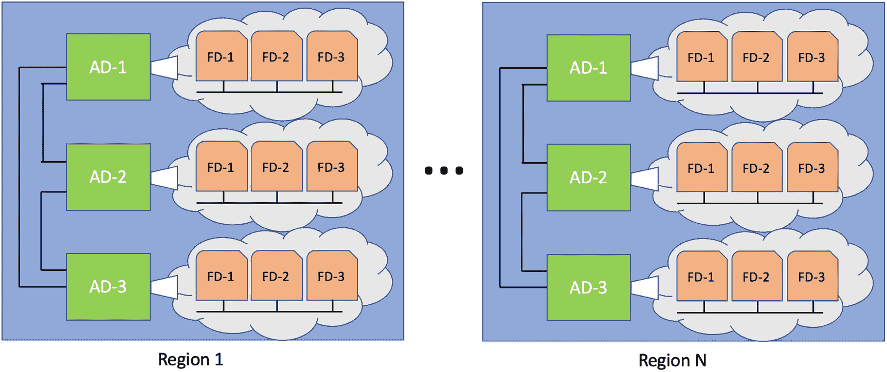

一个方块图展示了从区域 1 到区域 N。每个区域包含 1 到 3 号可用域。每个可用域有 3 个串联的故障域。

**图 2-1** 区域、可用域和故障域

注意，我们有一个 `区域`，即 `区域 1`，它包含三个 `可用域`（通常缩写为 `AD-n`），每个 `可用域` 有三个 `故障域`（通常缩写为 `FD-n`）。Oracle 目前在全球支持多个 `区域`，并且正在定期增加更多。图 2-2 显示了当前 `OCI` `区域` 的状态，取自 [`https://oracle.com/cloud/architecture-and-regions`](https://oracle.com/cloud/architecture-and-regions)。


一幅世界地图描绘了 Oracle 当前支持的商业、商业计划中和政府区域。

**图 2-2** OCI 区域（由 [oracle.​com](http://oracle.com) 提供）

#### 虚拟云网络

`虚拟云网络 (VCN)` 是对传统计算机网络的虚拟化。这种虚拟化扩展到创建子网、路由表、网关等。你所有的资源都将在一个 `虚拟云网络` 上运行。该 `虚拟云网络` 与单个 `区域` 相关联，但可以连接到所有 `可用域` 和 `故障域`。此外，对于每个子网，你可以跨越一个或多个 `可用域`。在你能够启动（创建）计算实例之前，必须至少设置一个 `虚拟云网络`。因此，创建 `虚拟云网络` 是你设置账户时首先要做的事情之一。


#### 甲骨文云标识符 (`OCID`)

OCI 中的每个资源都有一个 Oracle Cloud Identifier（甲骨文云标识符）。它是一个唯一的字符串，用于标识 OCI 中的一个资源。通过命令行界面 (`CLI`)、`REST API` 或开发者 API 代码访问资源时，几乎任何要对资源执行的操作都需要用到 Oracle Cloud Identifier。以下展示了 `OCID` 的格式：
```
ocid1...[REGION][.FUTURE USE].
```
以下展示了一个 MySQL 数据库服务 `DB System` 的 `OCID` 示例。其他 OCI 资源将使用类似的格式，但前导部分通常显示 `OCID` 所引用的资源类型：
```
ocid1.mysqldbsystem.oc1.iad.aaaaaaaapuif...sbg5z7sy5imjtlclhbxwbjmrq
```

## 计算实例

也称为计算实例，是在 OCI 中运行的计算主机。换句话说，它是一个你可以用来运行软件、安装自己的应用程序等的服务器。计算实例可以是虚拟机或裸机主机。计算实例的大小或虚拟化硬件能力由一组称为**配置方案**的逻辑分组（包括 CPU 大小、核心数、性能和内存设置）来管理。服务器的配置（操作系统等）则由一个称为**镜像**的模板来管理。

##### 虚拟机

虚拟机是一种在大型系统主机（称为虚拟机管理程序服务器）上运行的硬件的软件抽象实现，该主机为服务器分配虚拟化内存、CPU，有时还有磁盘。在使用自己的服务器或 `PC` 时，你可能已经接触过虚拟机。OCI 中的虚拟机与此类似，但复杂得多，因为它们可以通过配置方案进行性能和容量的定制。

##### 裸机主机

当性能或隔离性至关重要时，OCI 提供一小部分物理（或“裸金属”）机器。这些机器直接运行在硬件上，绕过虚拟机管理程序，不使用虚拟化内存、`CPU` 等（但可以连接到虚拟化资源）。甲骨云基础设施为你提供对物理主机（“裸金属”）机器的控制。当你使用裸机主机时，你是唯一使用物理 `CPU`、内存和网络接口卡 (`NIC`) 的租户。你可以像使用任何其他计算实例一样使用它，其外观与使用虚拟机的计算实例没有区别。

##### 配置方案

配置方案是一组定义计算实例的 `CPU` 核心数、内存大小以及在某些情况下磁盘空间的配置项。这允许你“调整”你的计算实例以满足需求。例如，如果你不需要大量内存，可以选择一个“较小”的配置方案，从而在产生成本时节省一些费用。

##### 镜像

镜像是一个虚拟化磁盘的模板，定义了操作系统和默认安装的软件。当你创建计算实例时，可以选择要使用的镜像。例如，你可以选择预装了 Oracle Linux 的镜像。你也可以从已配置的计算实例创建一个镜像，这样就可以部署一个相同配置的新计算实例，为你节省设置和配置时间。很棒！

##### 关于“实例”一词的说明

实例（instance）是云计算中那些被过度使用的术语之一。在 OCI 的术语中，将计算实例简称为“实例”是不正确的。这是因为还有其他被视为实例的资源。
例如，在 MySQL 术语中，“实例”可以指运行中的 MySQL 服务器应用程序（运行在服务器平台上的 MySQL），或者在 MySQL 数据库服务中，一个 `DB System` 可以被称为 `DB System 实例`。因此，你应该始终明确“实例”的含义：计算实例、MySQL 实例或 `DB System 实例`。

## 配置

这是你开始创建资源时会遇到的一个术语。此处的配置是指 OCI 创建资源所需的一系列操作，包括其子组件以及为使用该资源配置资源。例如，配置一个新的计算实例（从高层次上讲）包括：分配一个虚拟机、通过镜像安装操作系统和基础软件，以及为你所在的区域、可用性域等配置计算实例。在使用 OCI 资源时，你可能会在状态信息中看到这个术语。

**提示**
你可能在文档和博客中遇到这些术语和概念以首字母缩写形式或简写形式呈现。务必参考文档字典部分，以确认你可能不熟悉的术语和首字母缩写的含义，从而避免混淆。

接下来，让我们讨论你可以用来与 OCI 交互的主要接口。


## OCI 用户界面

OCI 提供了多种交互机制。具体来说，有多种用户界面可用于创建、管理和销毁 OCI 资源。这些包括基于 Web 的 OCI 云用户界面（称为 Oracle Cloud Console 或简称 cloud console）、名为 OCI 命令行界面（`CLI`）的命令行工具，以及面向开发人员的可编程接口，包括一个表述性状态传递（`REST`）应用程序编程接口（`API`）^(³) 以及特定语言的 API，允许你直接从代码中操作 OCI。甚至还有一个名为 Cloud Shell 的基于云的终端应用程序。我们将在本章探讨基于 Web 的云控制台界面，而将 `CLI`、`REST` 和开发者 API 留到第 9 章。

> **注意**
>
> `CLI`、`REST` 和 API 需要在你的个人电脑上进行设置和配置。我们将在第 9 章详细介绍这些步骤。

OCI 云控制台是处理 OCI 资源最常用的机制。它易于使用、易于导航，并且不需要任何特殊软件。虽然某些菜单可能看起来有点长，但资源页面和详细信息页面之间的一致性使得整个体验感觉完全无缝。一旦你花了一些时间熟悉云控制台，你可能会发现它会成为你处理 OCI 时的首选工具。

要访问 OCI 云控制台，请导航至 [`https://cloud.oracle.com`](https://cloud.oracle.com)。登录后，你将看到云控制台。你首先应该了解界面的关键点或功能是：左上角的菜单按钮、中间的搜索框、中间的实用快速提示和教程，以及右侧的账户信息。根据你创建的账户类型，一旦账户创建并激活，控制台可以显示你当前计费周期的费用情况。这有助于你跟踪支出。对于免费试用账户，目前不显示此信息。图 2-3 展示了 OCI 云控制台的一个示例，因此也称为 OCI 控制台。

> **注意**
>
> 本章中的许多图像显示的是我个人账户的 `UUID` 或其他特定数据。出于安全考虑，这些数据已被遮蔽。当你访问自己账户中的相同页面时，你将看到此类值。除非你在可信用户之间特意共享，否则应将所有 `OCID` 视为私有数据。

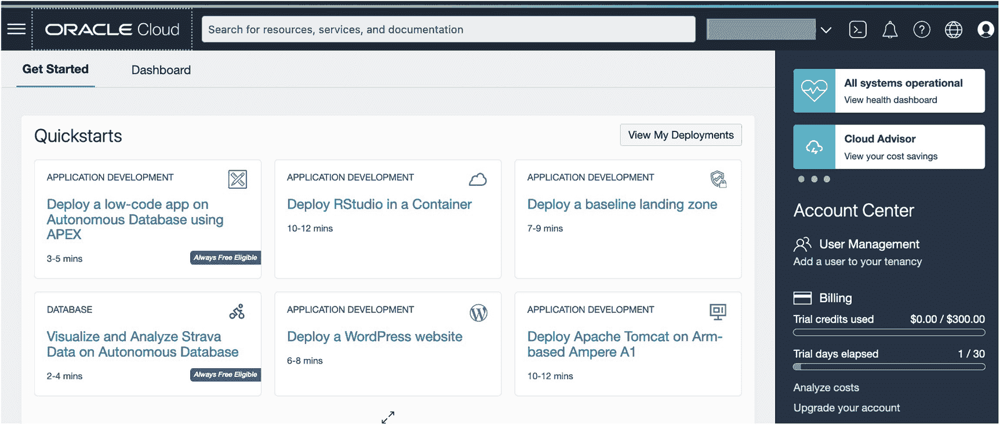

Oracle 云的主菜单突出显示了身份和安全选项。选择该选项后，下一个菜单会显示可选项—— compartments。

**图 2-3**

OCI 云控制台

> **注意**
>
> Oracle 每周都会对 OCI 控制台进行微小更改。未来展示的一些图像可能会略有不同，但方法和机制基本保持不变。例如，对话框可能会有一个需要你完成的新字段，或者字段可能会重新组织以便更好地查看。

在你学会如何使用 OCI 之后，可能还会对另一个功能感兴趣。如果你查看云控制台的右上角，会看到一个看起来像提示符的符号。点击它会打开 OCI Cloud Shell，其中包含可用于管理资源的命令行界面（`CLI`）。点击该按钮，云 Shell 将被创建。有趣的是，它本身是作为一个资源创建的，可以保存状态以供下次使用。图 2-4 展示了 OCI 云控制台。

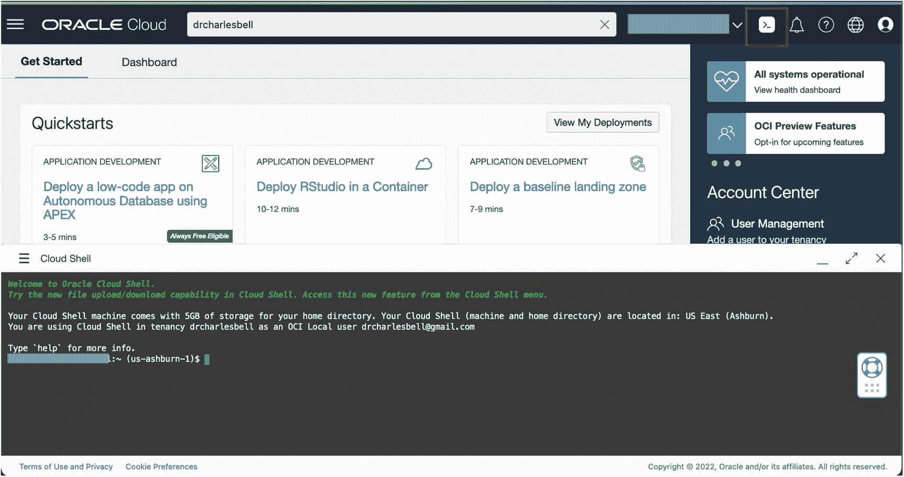

Oracle 云搜索 Dr. Charles Bell 的窗口。下方显示快速启动链接。底部出现一个用于输入更多信息的 Oracle 云 Shell。

**图 2-4**

OCI Cloud Shell

要了解更多关于 OCI Cloud Shell 的信息，请在控制台中输入 `help`，或参阅在线文档：[`https://docs.oracle.com/en-us/iaas/Content/API/Concepts/cloudshellintro.htm`](https://docs.oracle.com/en-us/iaas/Content/API/Concepts/cloudshellintro.htm)。我们将在下一节中了解更多关于 `CLI` 的内容。

你也可以通过点击右上角的问号，或点击任何快速启动链接/按钮来学习特定资源，从而从云控制台获得关于 OCI 的帮助。你可能想先点击问号符号，然后选择 **Using the Console** 主题来了解更多关于云控制台的信息。

现在，我们准备开始探索，首先了解在使用 OCI 时会遇到的核心服务。

## 核心服务

到目前为止，在我们对 OCI 的探索中，我们遇到了虚拟网络、计算实例、存储和访问等概念。这些资源由专用于该类型资源的云服务（有时称为云能力）管理和提供。你用来创建、管理和销毁这些资源的机制在很大程度上是隐藏的，并且涉及一系列通常密集的自动化流程。例如，当你创建一个计算实例时，会启动几个自动化机制和其他例程（称为工作流）来完成资源的配置。

这些概念被认为是 OCI 中可用服务的核心。由于它们每个都是 OCI 提供的服务，因此我们将该能力称为服务，而单个资源则按其对象名称引用。例如，计算服务用于创建计算实例。

以下列出了 OCI 提供的核心服务。我们将在后面的章节中更详细地了解每一项：

*   网络服务
*   计算服务
*   存储服务
*   身份与访问管理服务

OCI 中的这些核心服务用于构建和提供更复杂的服务和资源。事实上，OCI 中的每个复杂资源通常都是使用这些核心服务中的一个或多个构建的。例如，MySQL 数据库服务构建在计算、网络、存储和身份与访问管理服务之上。其他例子包括容器编排、额外的托管服务、无服务器计算等等。

让我们更详细地看看这些核心服务。


#### 网络服务

或许最重要的核心服务是网络服务。与其他资源一样，网络服务也是虚拟化的。这意味着传统的硬件/软件组件，例如网络、子网、路由、网关以及基于硬件的传统网络的类似构建模块，都以资源的形式呈现，您可以创建这些资源并与其他资源一起使用，以实现网络连通性。

这种虚拟网络组件的概念有时被称为 `软件定义网络（SDN）`。因此，连接到这些虚拟网络组件的云端资源也是启用了 `SDN` 的基础设施，使您可以创建和终止您的 `虚拟云网络（VCN）`，将它们组织成 `子网`，并与您的计算实例和其他云资源一起使用。OCI 网络资源包括以下内容。本节我们仅涉及高层次概念，当我们在创建网络资源的教程中看到时，会提供更多细节：

*   虚拟云网络及其子网
*   预留的公共 IP 地址
*   安全列表和安全规则
*   网关
*   路由表和规则
*   负载均衡器
*   `DNS` 区域
*   Web 应用程序防火墙（`WAF`）策略

提示

有关 OCI 网络服务和资源的更多信息，请参阅 [`https://docs.oracle.com/en-us/iaas/Content/Network/Concepts/landing.htm#top`](https://docs.oracle.com/en-us/iaas/Content/Network/Concepts/landing.htm#top)。

在使用 OCI 网络时，您通常从创建一个 `虚拟云网络（VCN）` 开始，并为其分配一个私有互联网协议（`IP`）地址范围供网络内使用。您可以创建多个 `VCN`，并可将它们配置为可通过互联网访问（或不可访问），以及云专属的（隔离的）和互连的网络。您还可以将您的 `VCN` 组织成 `子网`；这是网络地址的一个逻辑细分。此处的 `子网` 与硬件网络子网的概念相同。

当您创建需要网络连接的资源（例如计算实例）时，必须通过一个称为 `虚拟网络接口卡（vNIC）` 的云资源将它们分配到一个或多个 `子网`。连接到公共 `子网` 的 `vNIC` 可以被分配一个公共 `IP` 地址，从而允许从互联网访问。

有趣的是，OCI 使用一个动态分配的公共 `IP` 地址池。当 `vNIC` 请求公共 `IP` 地址时，它会从池中分配一个。当资源被终止时，该公共 `IP` 地址会返回到池中。这是云服务弹性的另一个例子。但是，如果您需要一个永久的公共 `IP` 地址，您可以申请一个预留的公共 `IP` 地址，该地址会分配到您的云账户（这可能也涉及费用）。

您还可以创建一个 `安全列表`，其中存储用于添加一层软件防火墙的规则，以阻止或允许访问您的资源。它的工作方式类似于端口和地址过滤器，只允许那些符合安全权限列表的连接。

类似地，您可以创建 `路由规则`，用于控制 `VCN` 的出站通信，允许数据包移动到网络中的下一跳（hop）。路由规则与 `网关` 资源相关联。

云端的网络工作与基于硬件的网络一样辛苦。您必须仔细选择所需的资源，并选择正确的规则集，以确保一切正常工作，只允许期望的流量进出 `子网`。幸运的是，OCI 提供了一个向导，我们可以用它来自动化一些更常见的配置。

#### 计算服务

计算服务是代表计算硬件的资源，例如运行应用程序或服务的服务器。回想一下，我们使用术语 `计算实例` 来指代已配置的计算资源。

当您配置一个 `计算实例` 时，您可以从多种选项中选择，包括机器类型（裸机、虚拟机等）以及一组性能设置（称为 `形状`），使您可以根据容量和性能需求定制计算实例。

#### 存储服务

这些服务是 OCI 提供的磁盘和数据存储资源。您有多种数据存储资源可供选择，以适应您的数据工作负载。这些资源具有诸如持久性/非持久性、数据类型、读写输入/输出操作每秒性能（`IOPS`）、吞吐量、持久性、连接性、存储接口协议、容量等特性。

与计算实例类似，您有许多选项可以定制存储以满足您的业务需求。以下部分简要介绍了 OCI 中存储的常见选择。

##### 块卷

一种虚拟化的硬盘。`块卷` 是为计算实例提供持久存储的磁盘。与大多数资源一样，它们是虚拟的，意味着您可以在不同的计算实例之间分离和重新连接它们（使用另一个称为 `块卷附加` 的虚拟资源）（一次只能连接到一个计算实例），而不会丢失数据。

`块卷` 的使用方式与您在 PC 上使用硬盘的方式相同。您只需读写磁盘数据或安装应用程序。您可以选择 `启动卷`（计算实例使用它来写入镜像（可以理解为操作系统））或用于数据的 `块卷`。`块卷` 是持久且耐用的。您可以从基础、平衡和高性能品种中选择，这些品种定义了性能特征。

##### 本地 NVMe

一种虚拟化的内存驱动器（类似于 `SSD`）。与 `块卷` 类似，它们可以作为块存储附加，但具有非持久性和非耐用性。这些主要用于需要高性能本地存储而不需要长期存储的应用程序。

##### 文件存储

一种分布式文件系统，您可以将其附加到计算实例并像使用本地驱动器一样使用它。通常用作共享文件系统存储，文件存储是持久且高度耐用的。

## 对象存储

与 `块卷` 不同，`对象存储` 是一种不同的架构，设计用于将数据存储为对象。因此，存储是针对对象级访问而非像 `块卷` 那样的单个文件访问进行优化的，因此您不会使用 `对象存储` 来读写您的数据文件。

数据对象存储在 `存储桶` 中，这是您创建的用于放置数据对象的特殊容器。每个 `存储桶` 可以包含无限数量的数据对象。但是，数据对象可以是任何类型，最大可达 50 GB。

您可以在两个存储层之间选择：标准对象存储（活动且可访问的，有时称为热存储）或存档存储（不使用时会被存档，有时称为冷存储，并且在您想要使用时必须使其可用）。

`对象存储` 也不是您可以直接附加到计算实例的东西。相反，您使用 `对象存储` 将数据复制到对象存储。`对象存储` 的用例包括备份数据、共享文件以及非结构化数据存储（如日志）。


## 身份和访问管理服务

身份和访问管理 (IAM) 服务是您用来控制对 OCI 资源访问的资源，这使得这些核心服务成为构建基于 OCI 的基础设施时较为复杂但又至关重要的部分。您可以创建`用户`和`组`，并应用访问策略。

最常用的概念是`委托主体`（有时称为`实例委托主体`），这是一个应用于 IAM`用户`和计算实例的资源，用于授予访问或与 OCI 资源交互的权限。经认证的`委托主体`可执行的操作和行为称为`授权`。

`用户`和`组`正如您所预期的那样，`用户`拥有名称、密码、API 签名密钥和一个或多个身份验证令牌。通过使用`策略`资源向`用户`和`组`授予权限，这些策略允许`用户`或`组`在`租户`内的特定` compartment `（隔离区）中访问资源，并可附带任何限制或条件。

例如，当`用户`想要访问 OCI 资源时，该`用户`（或应用程序/服务）必须是一个`组`的成员，并且该`组`应在同一个` compartment `和`租户`中拥有包含相应权限的`策略`。

现在我们已经简要介绍了 OCI 核心服务，让我们学习如何设置 OCI 账户并创建我们的第一个 OCI 资源。

## 设置您的账户

开始使用 OCI 非常简单。事实上，Oracle 允许您创建一个免费账户，用于学习如何使用 OCI。虽然免费账户在可创建资源的规模或复杂性方面有一些限制，但 Oracle 为每个注册的免费账户提供 300.00 美元的初始赠金。这意味着您可以使用资源进行尝试，费用会从初始赠金中扣除。一旦该金额用完，您将开始产生费用。因此，在创建账户时，您必须提供一个有效的信用卡。

免费套餐账户还可以访问某些始终免费的服务，例如：

*   两个 Oracle 自治数据库，附带如`Application Express (APEC)`和`Oracle SQL Developer`之类的工具
*   两个 OCI 计算实例（虚拟机）；块存储、对象存储和归档存储；负载均衡器和数据出口；监控和通知服务

如前所述，免费账户有以下限制：

*   所有可用服务中最多八个计算实例
*   最多 5 TB 的存储空间

您可以在 30 天结束时将您的账户升级为按需付费账户。如果您创建了付费资源并希望在 30 天后保留它们，您将需要升级您的账户。

**注意**

使用您的赠金额度配置的任何资源，在 30 天期限届满后都将被 Oracle 回收，除非您升级您的账户。

您可以随时升级到付费账户。只需点击云控制台页面右侧面板中的`升级您的账户`链接即可。升级账户后，您将继续拥有云资源的所有权和访问权限。

### 始终免费资源

所有 OCI 账户（包括按需付费账户）都可以创建标识为“始终免费”的资源。它们在云中由一个标有`Always Free`的标签表示。其中一些资源可能仅限于某些配置。例如，始终免费的计算实例是那些作为虚拟机配置的实例。同样，Oracle 自治数据库，以及支持您想要构建的应用程序所需的网络、负载均衡和存储资源，对于示例应用程序或进行原型设计也可能是免费的。

有关哪些资源始终免费的更多详细信息，请参阅 OCI 文档 (`https://docs.oracle.com/en-us/iaas/Content/FreeTier/freetier_topic-Always_Free_Resources.htm#resources`)。

我们还有一个与所有账户相关但免费套餐账户限制更多的概念需要讨论。


### 服务使用情况和限制

设置服务使用情况和限制是为了限制您可以在账户中创建的某些资源的数量。这些限制可能适用于您的租户，也可能跨您的 compartment 应用。

您可以通过点击云控制台菜单，然后选择 `Governance and Administration`，再选择 `Limits, Quotas, and Usage` 来查找您租户的限制。这会显示一长串服务限制列表，但您可以按服务、范围、资源名称或 compartment 进行筛选。

例如，如果您查看块卷服务，您会看到备份数量、免费备份数量以及以 GB 为单位的免费存储空间的限制。图 2-5 展示了这些限制在云控制台中的示例。

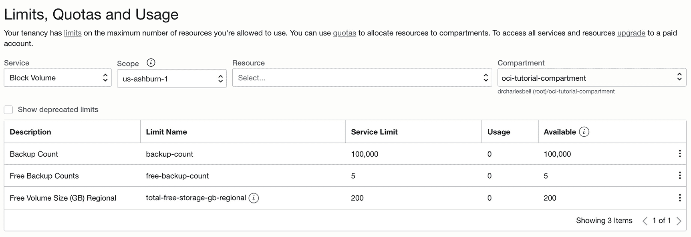

一个图片预览窗口，根据云控制台中的 compartment 显示资源的限制、配额和使用情况。

**图 2-5** 服务限制示例

考虑到这一点，让我们看看如何创建我们的 OCI 账户，并简要浏览一下您可能想要使用的一些基础资源。有趣的是，教程中的这些资源是用于构建 MySQL 数据库服务中数据库系统资源的一些组件。

导航到 [`https://cloud.oracle.com/`](https://cloud.oracle.com/)。点击左侧“还不是 Oracle Cloud 客户？”下的 `注册`。图 2-6 展示了初始着陆页面。

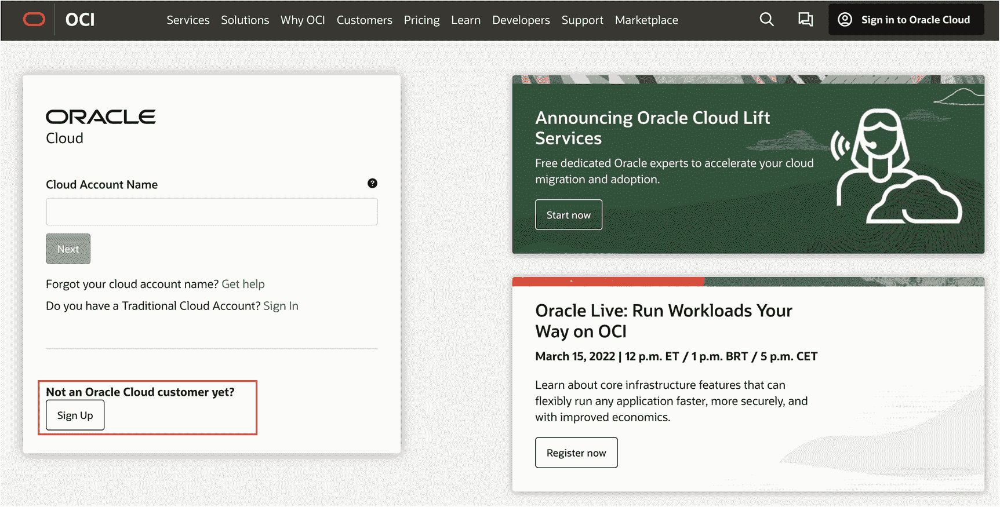

一个窗口显示 O C I，右上角有 Oracle Cloud 登录选项。左侧可以输入云账户名称。它突出显示了“非 Oracle Cloud 客户”选项。

**图 2-6** Oracle Cloud 着陆页面

这将打开一个新的浏览器窗口，您可以在其中创建您的 Oracle 云账户。图 2-7 展示了您需要输入的必填信息。注意它默认是免费套餐账户。

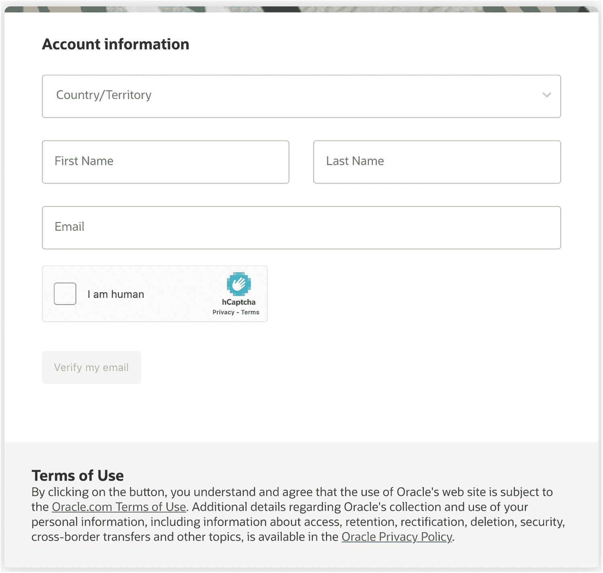

一个账户信息窗口，需要填写国家、名、姓、电子邮件，以及“我是人类”的验证选项。底部提供了使用条款。

**图 2-7** 新账户信息（第 1 部分）

您需要选择您居住的国家或地区，输入您的名和姓，成功通过人机验证挑战，然后点击 `验证我的电子邮件`。您也应该阅读对话框底部显示的使用条款。

点击按钮后，您将收到一封电子邮件，邮件中会包含一个链接（按钮名为 `验证电子邮件`），您需要点击该链接以完成账户创建过程。如果您正在跟着操作，请立即打开您的电子邮件并点击链接/按钮。然后您将被返回到登录创建页面，对话框将变为允许您设置密码、公司名称、云账户名称以及您的 home 区域，如图 2-8 所示。

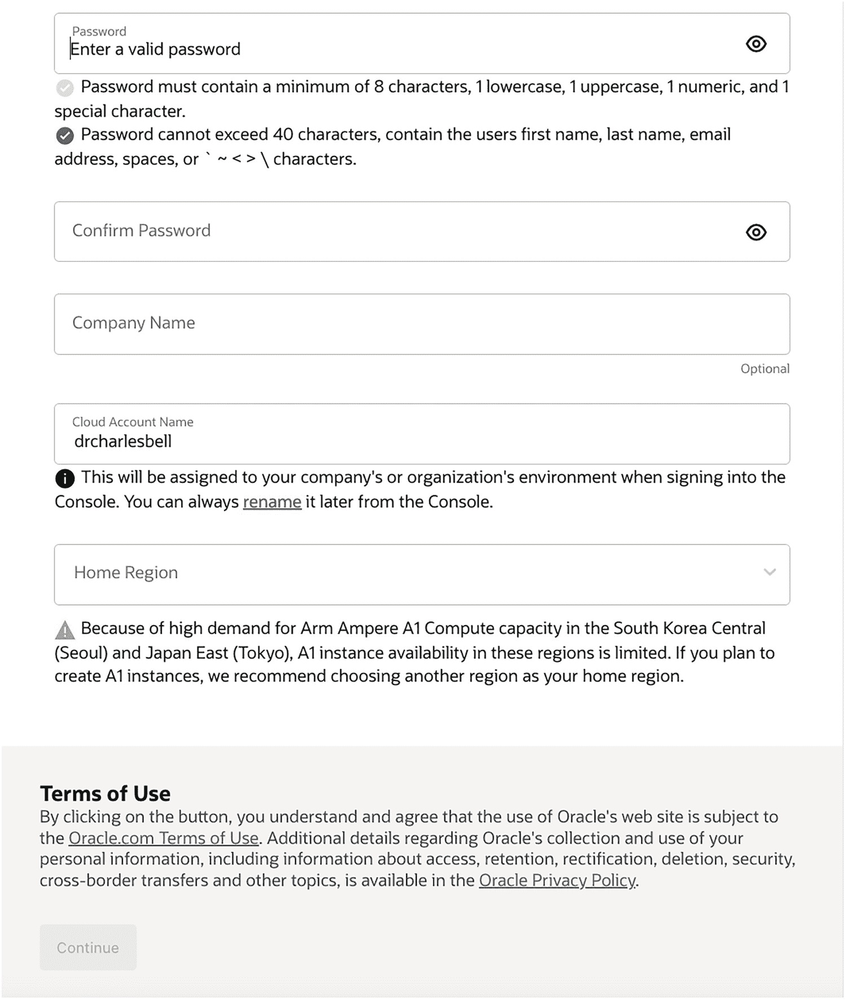

新账户信息的第二页，需要填写新密码、确认密码和公司名称。云账户名称已填写为 drcharlesbell。使用条款位于底部。

**图 2-8** 新账户信息（第 2 部分）

您的 home 区域是距离您居住地最近的地理数据中心组。选择最近的区域非常重要，有助于减少潜在的互联网延迟。输入信息后，点击底部的 `继续`。再次提醒，您应该阅读按钮上方的使用条款声明。

点击按钮后，您将看到另一个对话框，要求您提供邮寄地址和电话号码，如图 2-9 所示。

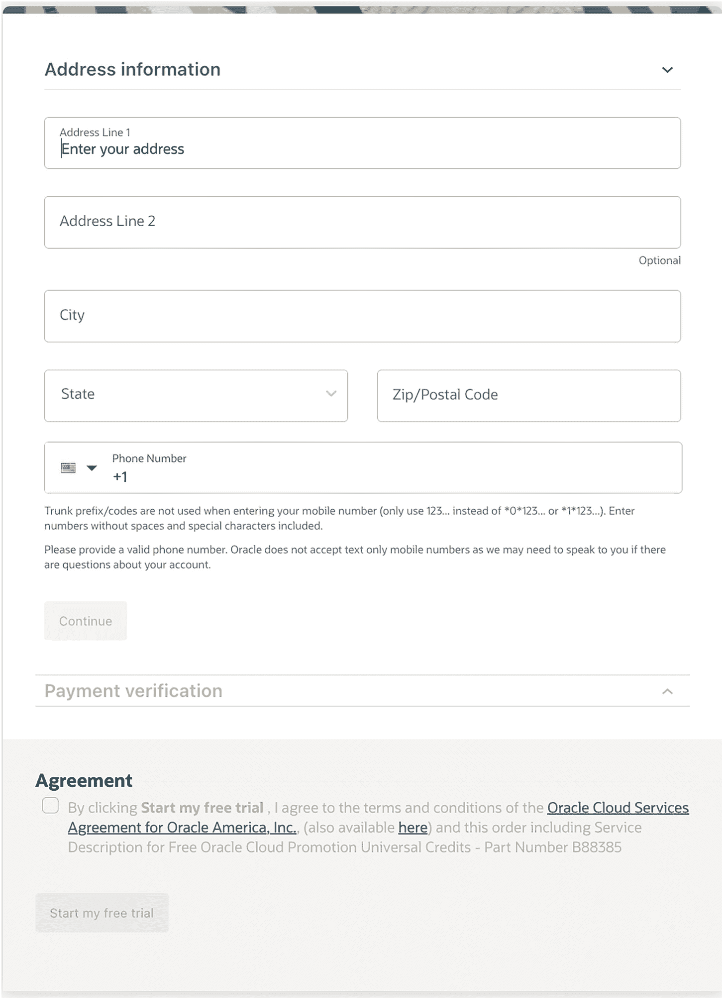

新账户信息的第三页，需要填写地址行 1 和 2、城市、州、邮政编码和电话号码。协议复选框位于底部。

**图 2-9** 新账户信息（第 3 部分）

输入您的个人信息后，点击 `继续` 进入支付信息部分，如图 2-10 所示。要添加您的支付偏好，请点击 `添加支付验证方法` 按钮并按照提示操作。

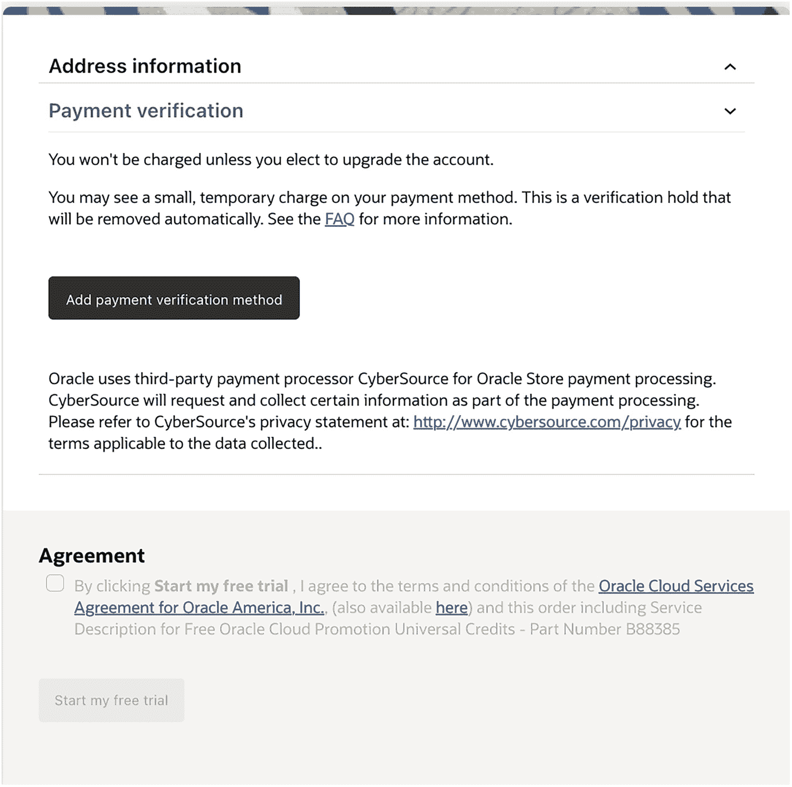

新账户信息的第四页，包含支付验证选项。中间是“添加支付验证方法”按钮。协议复选框位于底部。

**图 2-10** 新账户信息（第 4 部分）

输入支付信息并通过验证后，您将返回到对话框。要完成账户创建，请勾选 `协议` 复选框（阅读协议后），然后点击 `开始我的免费试用`，如图 2-11 所示。

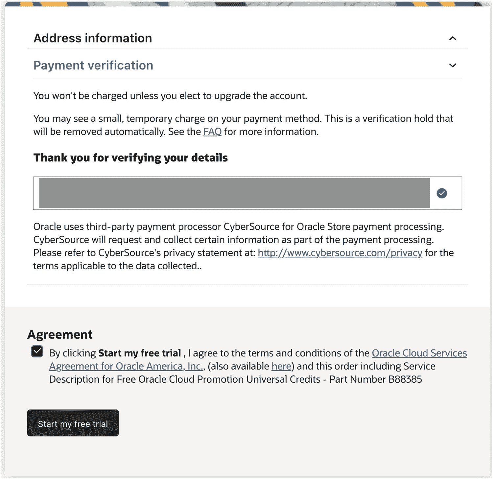

新地址信息窗口的第五页，包含支付验证。中心显示“感谢您验证详细信息”。协议复选框位于底部。

**图 2-11** 新账户信息（第 5 部分）

此时，您的新账户正在配置中。您可能会收到一条消息，提示此过程需要一些时间，如图 2-12 所示。这是正常现象。注意 Oracle 提供了一个链接，让您在等待时了解更多关于 OCI 的信息。这很贴心。当您的账户准备就绪时，您将通过电子邮件收到通知。


一个图片预览，显示文本“感谢您注册 Oracle Cloud”。带有一个链接，文本为“等待时，您可以阅读关于 O C I 的信息”。

**图 2-12** 账户创建消息

账户创建后，点击电子邮件中的链接登录，您将被发送到 OCI 登录页面（您的用户名是您的电子邮件地址），登录后，您可能会看到一个简短的问卷。完成问卷后，您将看到 OCI 起始页。您可能会看到一条通知，提示额外的账户设置任务正在后台运行，如图 2-13 所示。


一个图片预览，显示文本“关于您的账户目前正在设置中，部分功能将不可用。设置完成后您将收到电子邮件。”

**图 2-13** 新账户起始通知

至此，您已准备好开始使用 OCI！但是，请记住我们提到过每个账户都有自己的租户。您的租户名称是您注册时使用的电子邮件地址的第一部分。例如，如果您使用 `mynamehere@wesayso.com`，您的租户名称将是 `mynamehere`。在我们完成本教程的示例时，请记住这一点。

让我们快速浏览一下如何创建我们的第一个 OCI 资源。


### OCI 教程

在本教程中，我们将在 OCI 中创建我们的第一个资源。目标是创建一个可以登录并进行实验的计算实例。我们将学习如何浏览 OCI 云控制台（Web 界面）来创建使计算实例运行所需的资源，这包括向我们的计算实例添加一个块存储设备，这将揭示在您创建 MySQL 数据库服务 DB 系统时后台发生的一些事情。我们将在第 4 章中了解如何操作。

现在，让我们开始配置新的 OCI 资源。首先，有几件事我们需要做。以下是我们将按顺序创建的资源列表：

*   创建一个新的 compartment
*   创建虚拟云网络
*   创建计算实例
*   向计算实例添加块存储
*   终止资源

本教程的编写旨在让您能够跟随操作，并在您自己的 OCI 账户中创建相同的资源。如果您尚未创建自己的 OCI 账户，现在就应该创建一个。

#### 创建新的 compartment

您应该做的第一件事是创建一个新的 compartment 来组织您的资源。虽然这不是必需的，但使用 compartment 可以更轻松地为不同项目、客户或实验组织资源。不仅如此，通过您可以分配给用户和组的附加安全设置，您可以确保用户只能访问您允许的那些资源。

我们将使用 Oracle Cloud Console 侧边栏菜单，您可以通过控制台左上角的菜单按钮访问它。菜单和子菜单中的每个条目都会将您带到不同的对话框，您可以从那里查看和管理该类别/组的资源。要打开 compartment 页面，请打开侧边栏菜单，选择 `身份与安全`，然后选择 ` compartments `，如图 2-14 所示。

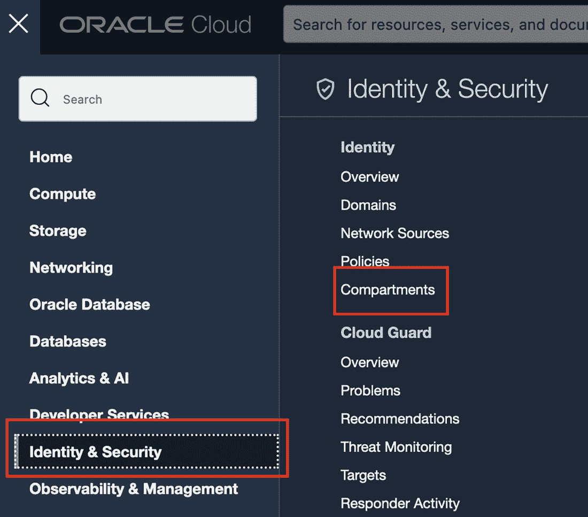

图 2-14： compartments （主菜单）

这将打开 compartment 页面，如图 2-15 所示。与大多数资源页面一样，您将在中心看到当前资源的列表，左侧有一个菜单，可以让您操作资源。每个资源页面都略有不同，但随着时间的推移，您会熟悉其布局。但是，请注意筛选器部分。这允许您按不同的组（如状态或其他资源中的 compartment）筛选视图。

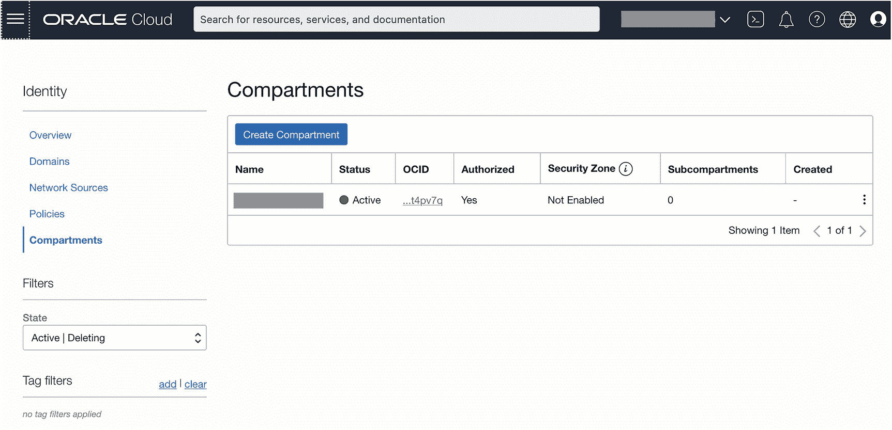

图 2-15： compartments 页面

要创建新的 compartment，请单击 `创建 compartment ` 按钮。这将打开创建 compartment 对话框。在这里，我们给 compartment 一个名称。尽量使用对用途有意义的名称。例如，如果您是为特定项目或客户创建 compartment，您可能希望在名称中包含相关的内容。出于我们的测试目的，我们将 compartment 命名为 `mysql-tutorial-compartment`。继续填写对话框的名称和您想要的任何描述。将其他字段保留为默认值，如图 2-16 所示。

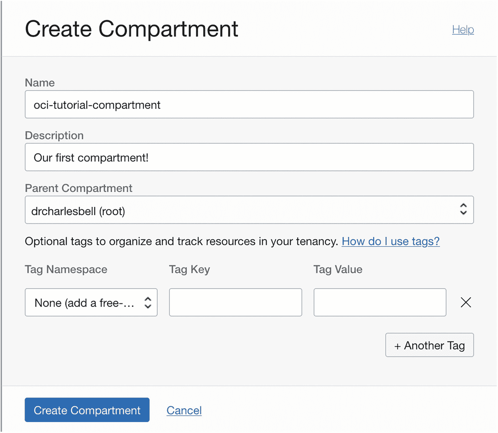

图 2-16：创建 compartment 对话框

请注意，有一个添加标签的空间。标签正如其名——您可以添加到资源上的标签，以使它们更容易排序或定位。虽然不鼓励使用标签存储易变信息，但如果您愿意，可以使用标签存储关键的记账信息。

当您准备好创建 compartment 时，请单击 `创建 compartment ` 按钮。一旦 compartment 配置完成（只需几秒钟），您将看到它在 compartment 列表中列出，如图 2-17 所示。

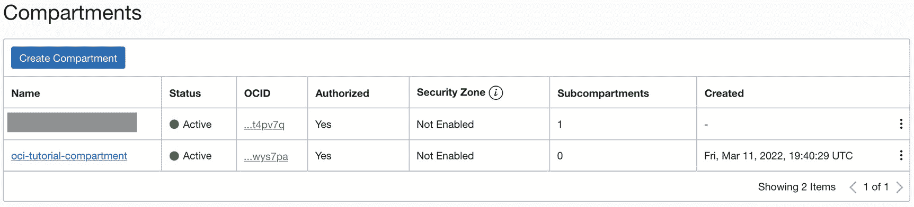

图 2-17： compartments 列表

注意我们既看到了根 compartment，也看到了新的 compartment。回顾关于 compartments 的讨论，所有账户都有那个根账户。这就是为什么创建 compartment 是可选的——您已经有一个（根）^(⁴)。显然，如果您想要任何形式的组织，您将需要使用 compartments。

**注意**

一旦您开始创建资源，您的账户将开始产生费用。由于您注册时获得的 300 美元信用额度，您暂时不会在信用卡上看到任何费用，但请注意，除了标记为“永久免费”或“免费套餐”之外，您创建的所有资源都将消耗您最初的信用额度。当信用额度用完时，您的信用卡将被扣费。

如果您想查看新 compartment 的 compartment 页面，可以单击链接（列表中的带下划线的名称）。这将打开 compartment 详情页面，如图 2-18 所示。

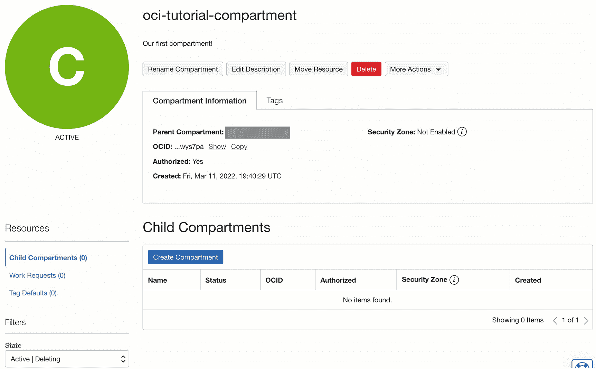

图 2-18： `oci-tutorial-compartment` 详情页面

请注意，您可以在其详情页面上管理资源，包括删除它。另外，请注意详情页面的底部还有另一个用于子 compartment 的列表。是的，您可以创建 compartment 层次结构！只需打开 compartment 的详情页面，并使用子列表上方的 `创建 compartment ` 按钮创建新的 compartment。

现在我们有了一个 compartment，我们可以开始创建要放入其中的资源。下一步是创建 VCN。


#### 创建虚拟云网络

接下来，我们需要一个虚拟云网络（VCN）来连接我们的计算实例，以便能够访问它。我们将使用 VCN 向导来简化配置工作，而不是手动配置 VCN。在这种情况下，我们将创建一个具有互联网访问权限的 VCN，以便可以将计算实例放置在网络中并访问它。

首先点击云控制台菜单按钮（左上角），然后选择`联网`，接着选择`虚拟云网络`，如图 2-19 所示。这将打开 VCN 的主页。

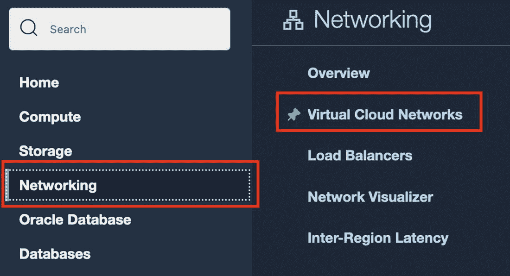

主菜单中用矩形框突出显示了联网选项，随后右侧的联网菜单打开。其中，虚拟云网络被高亮显示。

**图 2-19**
虚拟云网络（主菜单）

在 VCN 页面上，您需要使用左侧的筛选控件选择 compartment，如图 2-20 所示。选择我们之前创建的 `oci-tutorial-compartment`。

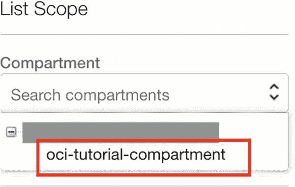

V C N 页面中的筛选控件打开了列表范围。其下方有 compartment 和搜索 compartment 选项。在搜索下方，显示了 `oci-tutorial-compartment`。

**图 2-20**
设置列表范围（VCN 页面）

设置好 compartment 后，显示内容将更改以显示该 compartment 中所有 VCN 的列表。目前，它将显示一个空列表。要启动 VCN 向导，请单击 `启动 VCN 向导` 按钮，如图 2-21 所示。

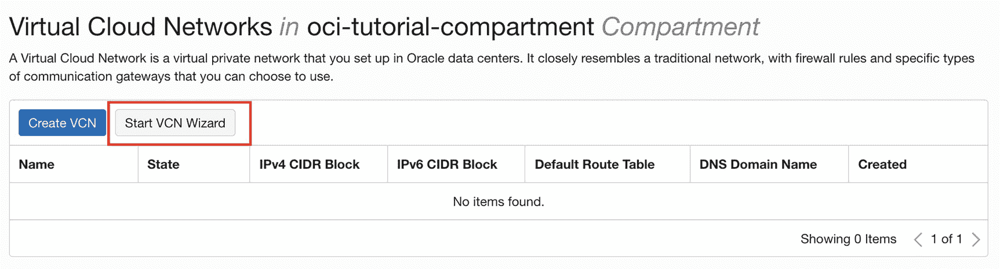

一个表格，包含创建 v C N 和启动 V C N 向导选项。列名是名称、状态、I Pv4 C I D R 块、I Pv6 C I D R 块、默认路由表、D N S 域名和创建时间。

**图 2-21**
VCN 网络列表 (`oci-tutorial-compartment`)

点击该按钮后，向导将打开，您可以输入所需信息。在这种情况下，我们将选择 `创建具有互联网连接的 VCN` 选项，如图 2-22 所示。选择后，如图所示单击 `启动 VCN 向导` 按钮。

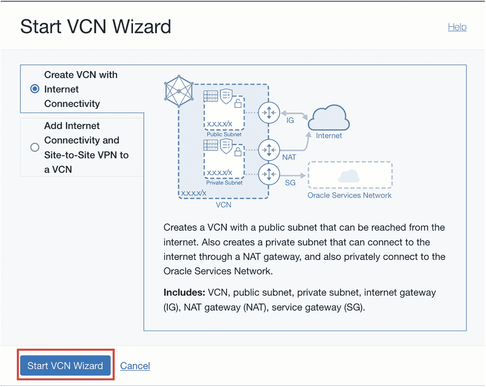

一个启动 V C N 向导的窗口，有用于创建具有互联网连接的 V C N 和向 V C N 添加互联网连接及站点到站点 V P N 的单选按钮。

**图 2-22**
启动 VCN 向导

这将触发 OCI 中的检查，以确保允许创建 VCN，并且您可以创建它。您可能会在向导中看到指示此情况的横幅。页面打开时，我们需要提供 VCN 的名称并确保选择了正确的 compartment。如果您正在跟随操作，请使用 `oci-tutorial-vcn` 作为 VCN 名称，然后单击 `下一步`，如图 2-23 所示。在 `配置 VCN 和子网` 部分保留默认值。

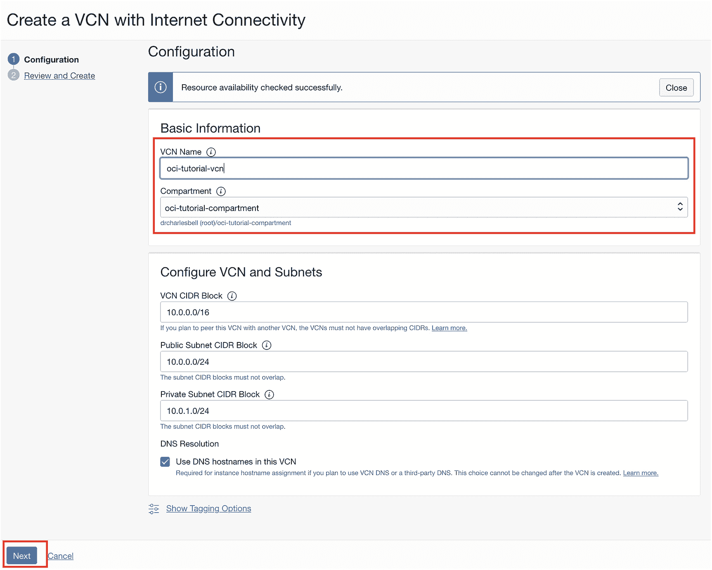

一个创建具有互联网连接的 V C N 并进行配置的窗口。它包含基本信息以及配置 V C N 和子网选项。

**图 2-23**
创建具有互联网连接的 VCN – 基本信息

在下一页，我们看到了来自向导的 VCN 参数摘要。花点时间查看一下。注意我们有一个公共子网和一个私有子网。我们将在后面的章节中了解如何使其与我们的计算实例协同工作。准备好后单击 `创建` 按钮，如图 2-24 所示。

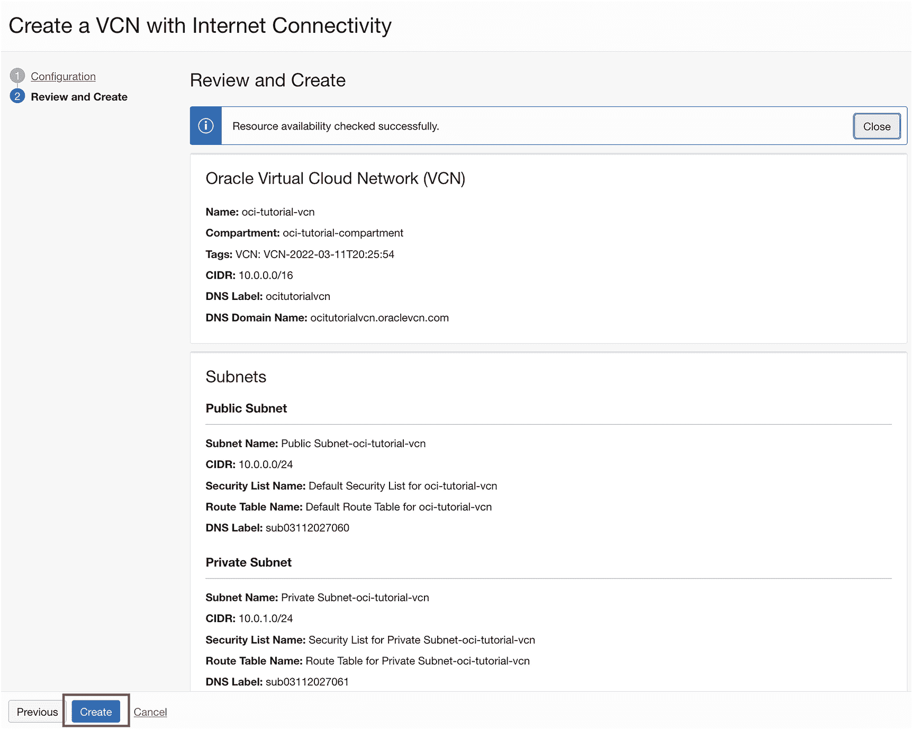

一个创建具有互联网连接的 V C N 的窗口。右侧显示了审阅和创建选项，包括 Oracle 虚拟云网络详细信息以及私有和公共子网的详细信息。

**图 2-24**
审阅并创建 VCN

此时，将出现一个对话框，通知您资源调配的进度。由于我们使用的是向导，很自然地认为这是一个单一资源，但事实并非如此。正在为您调配和配置多个资源，包括 VCN、其子网、用于互联网和私有子网访问的网关、网关的路由表和安全列表等。图 2-25 显示了所有资源调配完成并准备就绪后的对话框。

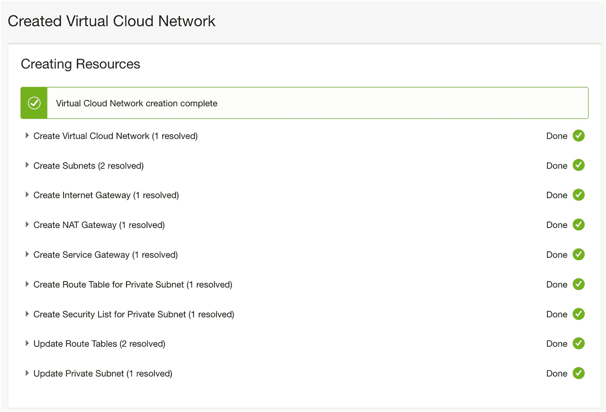

一个已创建虚拟云网络并正在创建资源的窗口。左侧列出了虚拟云网络创建过程。

**图 2-25**
正在调配 VCN

VCN 创建完成后，您可以关闭对话框，然后单击底部的 `查看虚拟云网络` 按钮导航到 VCN 页面，如图 2-26 所示。在这里，我们看到 VCN 及其两个子网都已就绪。酷！

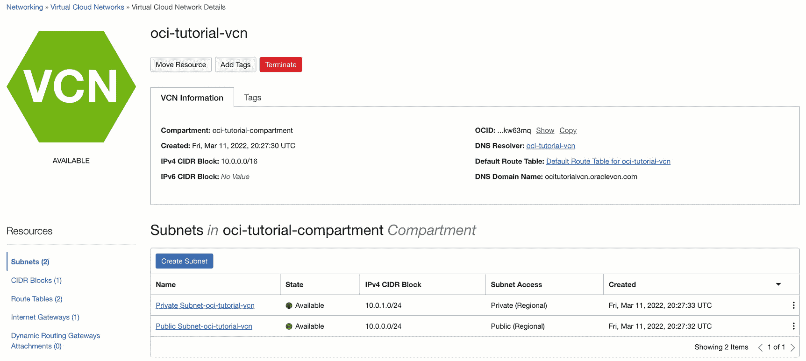

一个 `oci-tutorial-vcn` 的窗口，左侧有一个六边形绿色图标。右侧列出了 V C N 详细信息和子网 compartments。

**图 2-26**
VCN 详细信息页面

现在我们有了 VCN，就可以准备创建计算实例了。


#### 创建计算实例

在本教程中，我们将创建一个简单的计算实例，使用最小的规格，因为我们仅用于演示目的。我们将使用默认值，这些值恰好构成一个始终免费的计算实例。首先，打开云控制台主菜单，选择 "Compute | Instances"，如图 2-27 所示。

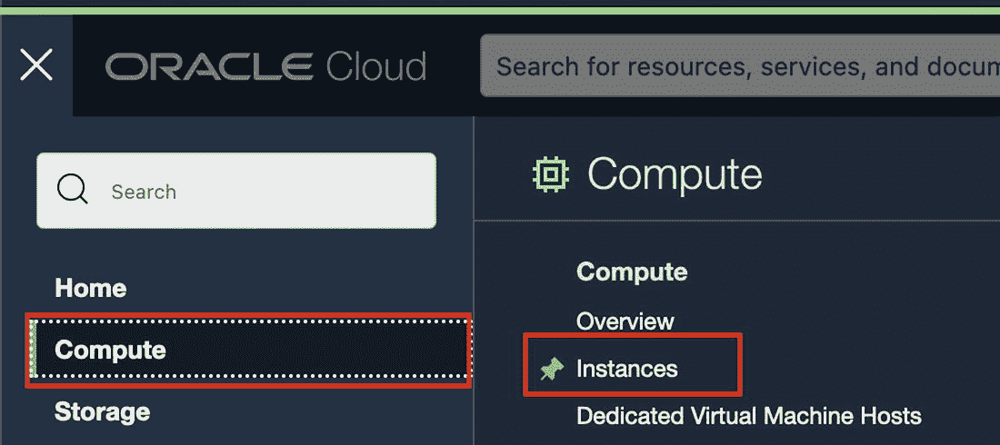

Oracle 云上的主菜单高亮显示计算选项。右侧的计算菜单用矩形框突出显示了实例。

图 2-27

计算实例（主菜单）

在计算页面上，您需要使用左侧的筛选控件选择 compartment，如图 2-28 所示。选择我们之前创建的 `oci-tutorial-compartment`。

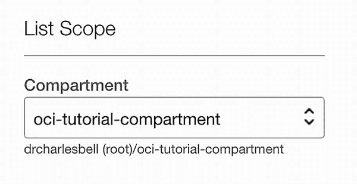

计算页面左侧有筛选控件。顶部列出范围，其下方是 compartment。oci-tutorial compartment 显示在滚动按钮中。

图 2-28

设置列表范围（计算页面）

接下来，点击实例列表中的 "Create instance" 按钮，如图 2-29 所示。这将启动创建实例对话框。

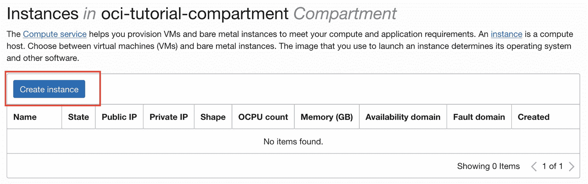

一个窗口高亮显示了左上角的创建实例按钮。其下方显示了一个未找到项目的表格。

图 2-29

计算实例列表 (oci-tutorial-compartment)

创建实例对话框是一个长表单。让我们逐个部分来了解。

我们将检查的第一部分包括名称、选择 compartment、放置位置（可用性域）以及映像和规格的条目。对于放置位置以及映像和规格条目，我们将再次使用默认值。如果您好奇有哪些选项可用，可以点击每个部分中的 "Edit" 链接。

如果您正在跟随操作，请将名称更改为 `oci-tutorial-instance-1`，如图 2-30 所示。您可能会看到系统为您生成的计算实例名称，形式类似 `instance-20220312-1956`。您还应确认选择了正确的 compartment (`oci-tutorial-compartment`)，然后向下滚动。

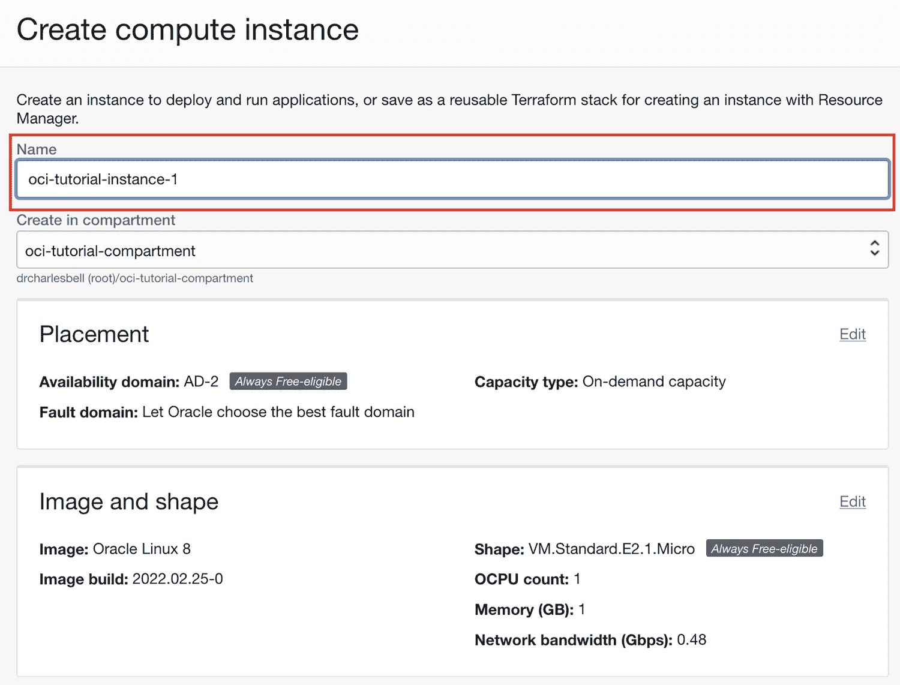

一个创建计算实例的窗口，包含名称、创建于 compartment。下方显示了放置详细信息、映像和规格详细信息。

图 2-30

创建计算实例（第 1 部分）

下一部分是 "Networking" 和 "Add SSH Keys" 部分。在这里，我们看到 OCI 再次选择了我们创建的 VCN 资源（它是 compartment 中唯一的一个）。如果您好奇有哪些网络选项可用，可以点击 "Edit" 按钮。然而，对于本教程，默认值是可接受的。

"Add SSH Keys" 部分很重要，因为 OCI 将为您生成一个 SSH 密钥对。您需要使用这些密钥才能登录到计算实例。

要下载私钥，请点击 "Save Private Key" 按钮将私钥保存到您的 PC，如图 2-31 所示。

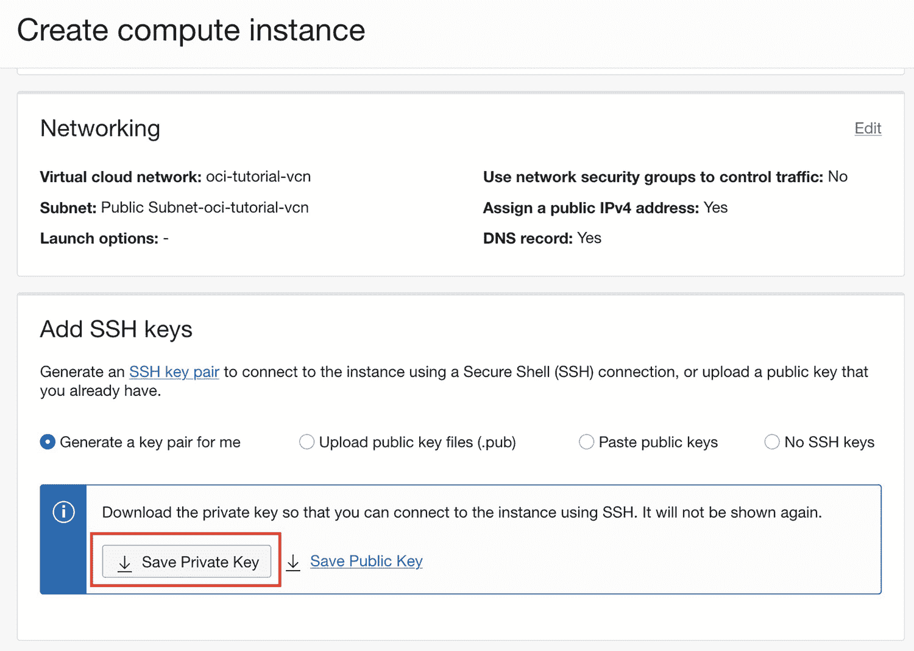

一个创建计算实例的窗口显示第二页，包含网络和添加 SSH 密钥。在添加 SSH 密钥中选择生成密钥对。底部的保存私钥按钮被高亮显示。

图 2-31

创建计算实例（第 2 部分）

您需要将其放置在您的 SSH 密钥目录（文件夹）中。例如，在 macOS 或 Linux 上，您可以将文件保存在 `~/.ssh` 中。但是，您可以将文件放在任何您想要的地方，只要权限设置正确即可，如下所示。

```
% mkdir ~/.ssh
% mv ~/Downloads/ssh-key-2022-03-13.key ~/.ssh/.
% chmod 400 ~/.ssh/ssh-key-2022-03-13.key
```

下一部分定义了启动卷参数，包括设置自定义大小和指定加密。我们将使用默认值，但您可以通过提供的链接探索其他选项。准备就绪后，点击 "Create" 按钮，如图 2-32 所示。

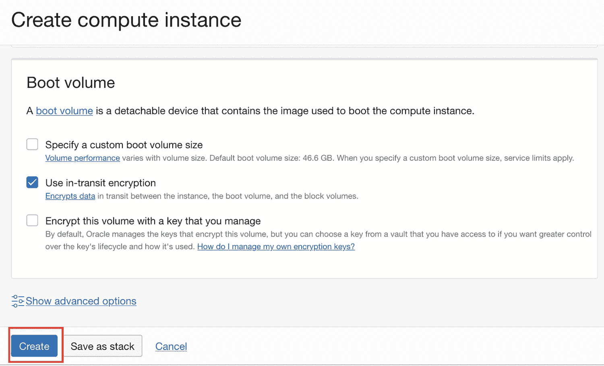

一个创建计算实例的窗口在复选框中显示了 3 个启动卷选项。选中了使用传输中加密。左下角的创建按钮被高亮显示。

图 2-32

创建计算实例（第 3 部分）

现在计算实例将被配置。将打开计算实例的详细信息页面，状态将显示为 `PROVISIONING`，背景为橙色。这可能需要一段时间，因此您可能不会立即看到状态的任何变化。当计算实例配置完成并启动后，状态将更改为 `RUNNING`，背景为绿色，如图 2-33 所示。花点时间浏览一下显示的数据。您会看到一些重要值，包括公共 IP 地址和 OCID。我们将使用公共 IP 地址通过安全外壳主机 (SSH) 会话登录到计算实例。

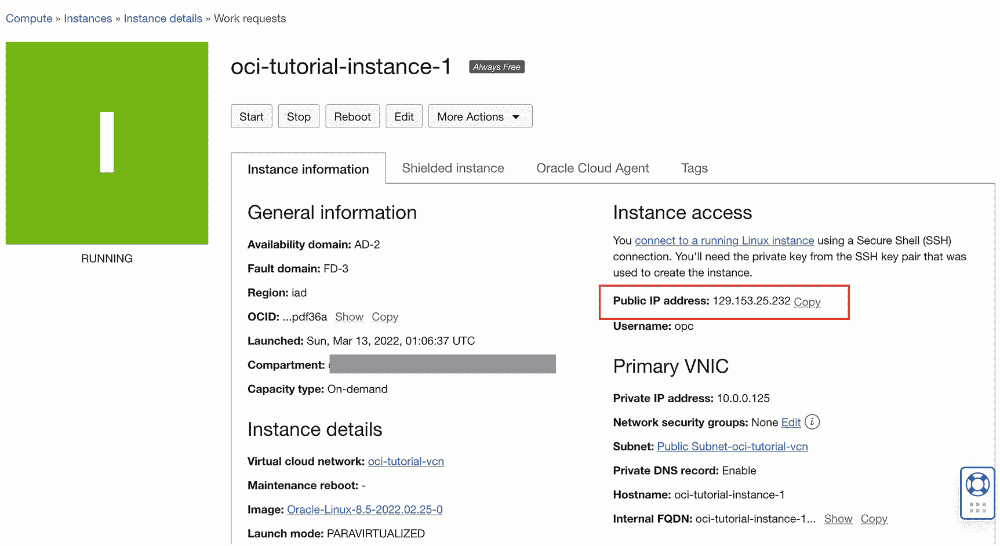

一个 oci-tutorial-instance-1 的窗口，包含实例信息。描述了常规信息、实例详细信息、实例访问和公共 VNIC。公共 IP 地址被高亮显示。

图 2-33

计算实例详细信息页面

如果您的 PC 上未安装 SSH 客户端，则需要在连接到计算实例之前安装一个。需要加密的 SSH 会话。macOS 和大多数 Linux 发行版默认安装了 SSH 客户端。请参阅您的平台文档以了解如何安装 SSH 客户端。

遗憾的是，Windows 不附带 SSH 客户端。幸运的是，有几种第三方应用程序可用。一个流行的选项称为 PuTTY，它实际上是一个通用的终端会话应用程序。PuTTY 中的 SSH 功能非常易于使用。我最喜欢 PuTTY 的一点是它是开源软件，因此可以免费下载和使用。

您可以从 [`www.putty.org`](http://www.putty.org) 下载 PuTTY。下载的文件不是一个安装包（`.msi`），而仅仅是 PuTTY 可执行文件 (`putty.exe`)。只需下载该文件并将其放在您的 path 环境变量中的某个文件夹中。您也可以将其放在您的文档文件夹中，然后直接从那里执行或通过引用该文件夹来执行。

回到计算实例详细信息页面，如果向下滚动，您将看到 "Work requests" 部分，该部分显示已在或正在计算实例上执行的工作流。我们想要确保完成的工作流是 "Create instance" 工作流，其状态应为 `Succeeded`，如图 2-34 所示。

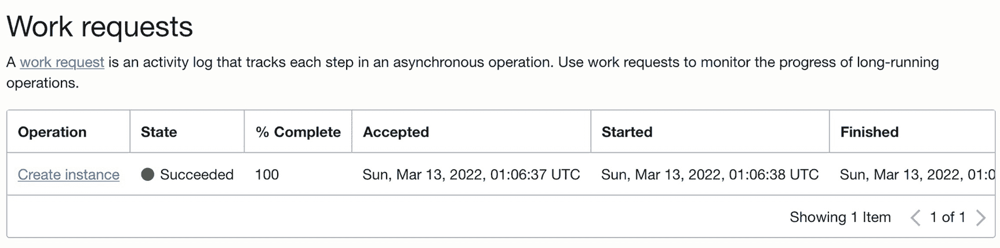

一个包含 3 行 6 列的工作请求表。列名为 operation, state, %complete, accepted, started, finished。添加了一个成功的状态条目。

图 2-34

计算实例工作请求列表

一旦看到工作流成功，我们就准备好通过终端连接到实例。为此，只需使用以下命令。在这里，我们看到我们使用 `ssh` 实用程序和 `-i` 参数，以及之前下载的私有 SSH 密钥的路径。接下来，我们提供在计算实例详细信息页面上找到的用户名和公共 IP 地址。默认用户名是 `opc`：

```
ssh -i  opc@
```


让我们看看该命令的实际操作。我们将使用之前下载并复制到用户账户 `.ssh` 文件夹的密钥，以及来自**图 2-33**的公网 IP 地址（`129.153.25.232`）。**清单 2-1**展示了命令的实际操作。你可能会被要求如所示将 IP 地址添加到你的 hosts 文件。连接成功后，我们执行一个简单的 `ls -lsa` 命令来显示计算实例上用户目录的内容。

```
% ssh -i ~/.ssh/ssh-key-2022-03-13.key opc@129.153.25.232
The authenticity of host '129.153.25.232 (129.153.25.232)' can't be established.
...
Are you sure you want to continue connecting (yes/no/[fingerprint])? yes
Warning: Permanently added '129.153.25.232' (ED25519) to the list of known hosts.
Activate the web console with: systemctl enable --now cockpit.socket
[opc@oci-tutorial-instance-1 ~]$ ls -lsa
total 12
0 drwx------. 3 opc  opc   74 Mar 13 01:08 .
0 drwxr-xr-x. 3 root root  17 Mar 13 01:08 ..
4 -rw-r--r--. 1 opc  opc   18 Oct 10 01:59 .bash_logout
4 -rw-r--r--. 1 opc  opc  141 Oct 10 01:59 .bash_profile
4 -rw-r--r--. 1 opc  opc  376 Oct 10 01:59 .bashrc
0 drwx------. 2 opc  opc   29 Mar 13 01:08 .ssh
[opc@oci-tutorial-instance-1 ~]$ exit
清单 2-1
使用 SSH 连接到计算实例
```

要关闭连接，只需使用 `exit` 命令。完成此操作后，我们已经证明可以成功连接到计算实例并使用它。现在，让我们为计算实例添加块存储。

## 为计算实例添加块存储

由于默认的启动卷是 50 GB，对于存储任何大型应用程序甚至数据来说可能都太小了。毕竟，启动卷旨在用于存储系统应用程序等，而不是用户应用程序。幸运的是，我们可以轻松地为计算实例添加一个块卷，用于我们的应用程序和数据目的。

添加块卷的过程比我们目前所见的简单点击式界面要复杂一些。简而言之，我们需要执行以下操作：
- 创建一个块卷
- 将块卷附加到计算实例
- 在计算实例上连接块卷
- 在计算实例上格式化并挂载块卷

要创建块卷，请打开云控制台菜单并选择 *存储*，然后选择 *块卷*，如**图 2-35**所示。但是，这次，右键单击 *块卷* 标签并在新标签页中打开选项。我们需要同时看到计算实例详情和块卷页面。

**图 2-35** 块卷（主菜单）
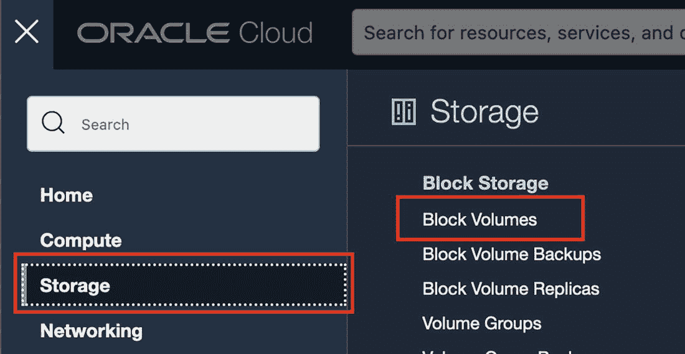
一个突出显示了存储的 Oracle 云主菜单。存储菜单在右侧打开，块卷被一个用于选择的矩形框突出显示。

在块卷页面上，你需要使用左侧的筛选控件来选择 compartment，如**图 2-36**所示。选择我们之前创建的 `oci-tutorial-compartment`。

**图 2-36** 设置列表范围（块卷页面）
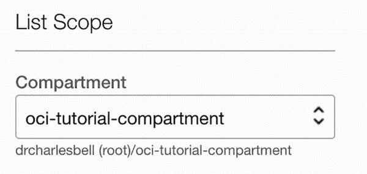
一个列表范围的菜单。下方有 compartment 选项，并显示了可选的 compartment 名称。其中 Oci-tutorial-compartment 被选中。

接下来，单击实例列表中的 *创建块卷* 按钮，如**图 2-37**所示。这将启动创建实例对话框。

**图 2-37** 块卷列表 (`oci-tutorial-compartment`)
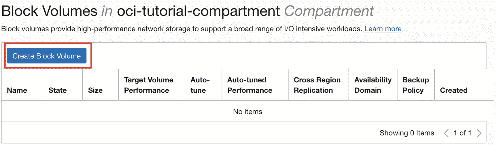
一个列出块卷的表格。它有 3 行 10 列。块卷列表中未添加任何项目。

当你单击 *创建块卷* 按钮时，你将看到创建块卷对话框。表单顶部是块卷名称的输入框。如果你正在跟随操作，请使用 `oci-tutorial-block-volume-1` 作为名称。你还应该看到为 compartment 选择了 `oci-tutorial-compartment`。

下方是选择可用性域的区域。这是可能出错的地方。如果你选择的可用性域与你的计算实例不同，你将无法将块卷附加到你的计算实例。

返回计算实例详情页面，找到 *常规信息* 标签下方的可用性域。务必记下使用的是哪个可用性域，并在创建块卷对话框中选择相同的可用性域。在本教程中，我们使用了 `AD-2` 可用性域（具体拼写可能因你所在的区域而异）。

你可以将块卷大小保留为默认值（50 GB）。

当你准备好后，单击 *创建块卷* 按钮，如**图 2-38**所示。

**图 2-38** 创建块卷对话框
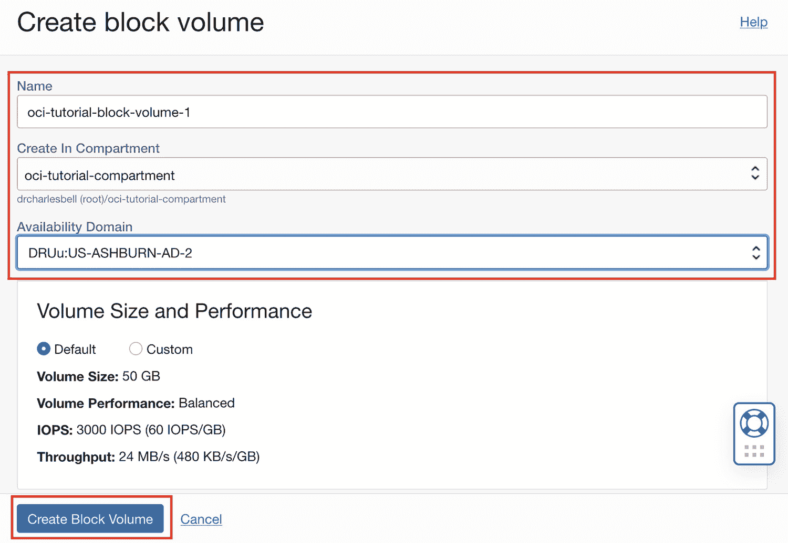
一个用于创建块卷的窗口，包含名称、compartment 和可用性域详细信息。卷大小和性能选项默认被选中，提供了详细信息。

与计算实例类似，你将被定向到块卷详情页面，在那里你可以观察块卷的配置过程。当它准备就绪时，状态将变为带有绿色背景的 `可用`，如**图 2-39**所示。

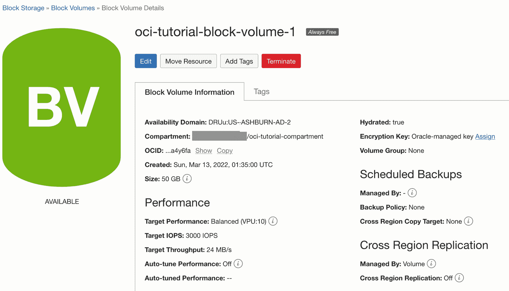


一个标题为 `oci-tutorial-block-volume-1` 的窗口，其中包含块卷信息。列出了性能、计划备份和跨区域复制的详细信息。

图 2-39

块卷详情页面

现在，请导航回你的计算实例对话框。如果你没有在单独的标签页中打开计算实例，请使用云控制台菜单选择 `计算` | `实例`，然后单击我们创建的实例（`oci-tutorial-instance-1`）以查看其详情页面。请注意，它被标记为 `始终免费`。

要将块卷附加到计算实例，请在计算实例详情页面左侧的 `资源` 菜单项中找到 `已附加的块卷` 项，并单击它，如图 2-40 所示。

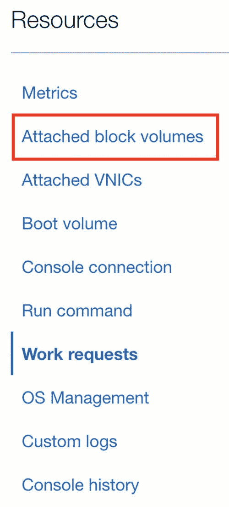

一个标题为“资源”的菜单，其中包含实例详细信息。已附加的块卷在菜单中高亮显示以供选择。

图 2-40

资源菜单（计算实例详情）

这将显示“已附加的块卷”列表，我们将从这里开始附加过程。但是，我们需要一条信息。我们需要刚刚创建的块卷的 `OCID`。之所以需要这个，是因为“附加块卷”对话框可能不会立即填充可用块卷列表（应该给它一点时间）。也就是说，你可以从列表中选择一个块卷，也可以指定 `OCID`。在此示例中，我们将使用选择 OCI 的选项。

要定位块卷的 `OCID`，请打开块卷详情页面（标签页），并在 `块卷信息` 选项卡上找到 `OCID`，如图 2-41 所示。你可以从块卷详情页面复制 `OCID`，并单击 `OCID` 旁边的 `复制` 链接。

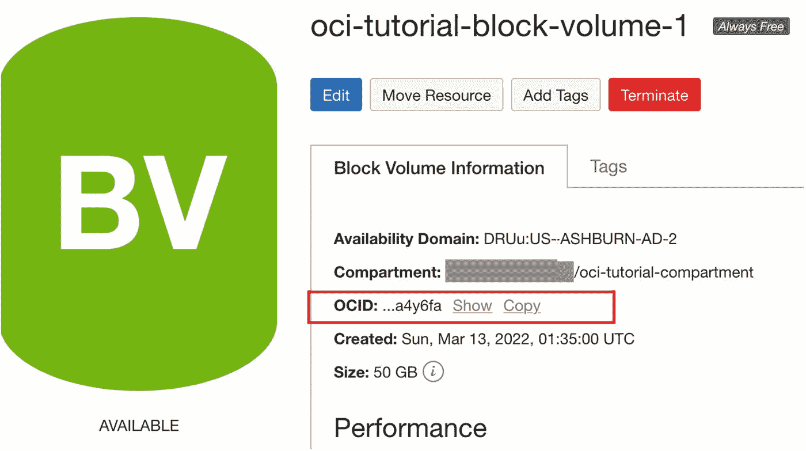

一个标题为 `oci-tutorial block-volume-1` 的窗口，其中包含块卷信息的详细内容。`OCID` 的位置被高亮显示。

图 2-41

在块卷详情页面上定位 `OCID`

现在，我们可以返回计算实例详情页面，并在 `已附加的块卷` 列表中找到 `附加块卷` 按钮，如图 2-42 所示。复制块卷的 `OCID` 后，单击此按钮。

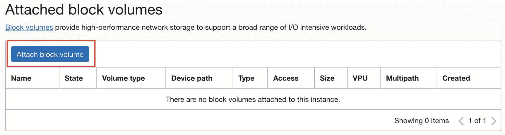

一个列出已附加块卷的表格。它有 3 行 10 列。表格中没有块卷附加到该实例。左上角的“附加块卷”按钮被高亮显示。

图 2-42

已附加的块卷列表（计算实例详情页面）

选择 `输入卷 OCID` 并将 `OCID` 粘贴到框中。对于 `设备路径`，选择 `/dev/oracleoci/oraclevdb`，如图 2-43 所示。保留其他部分的默认值。准备就绪后，单击 `附加` 按钮。

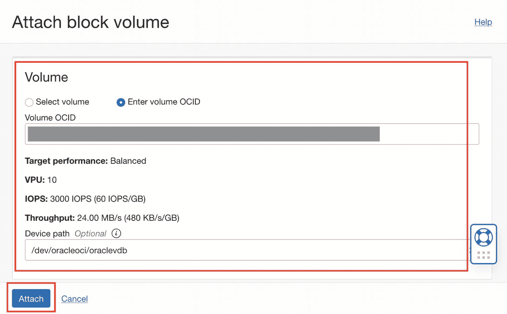

一个附加块卷的对话框，其中包含卷选项。输入卷 `OCID`。显示了卷规模以及目标、`VPU`、`IOPS` 和吞吐量的详细信息。

图 2-43

附加块卷对话框

此过程将创建另一个称为“块卷附加”的 OCI 资源。你不会直接看到这个资源，但它是 OCI 用来将块卷与计算实例关联的对象。重要的是要理解，这个附加资源就像 OCI 中的任何其他资源一样；它是一个虚拟对象，在此场景下，是一个用于实现将块卷与计算实例关联这一目标的设备。

单击 `附加` 按钮后，你可能会看到一个对话框，提醒你运行一组 `iSCSI` 命令，以将块卷连接到计算实例上的操作系统。我们将在附加过程完成后了解如何执行此操作。

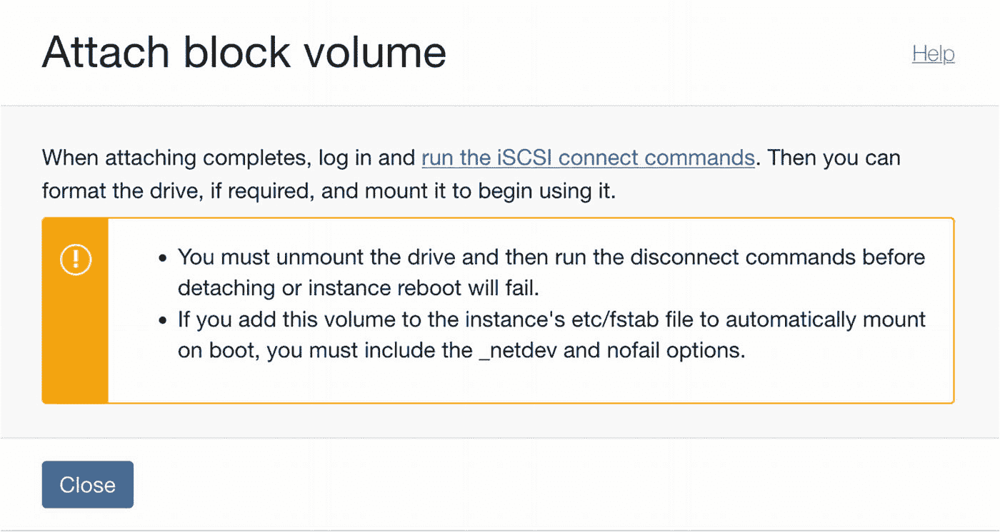

一个显示剩余命令的已附加块卷窗口。它有两个项目符号提示。关闭按钮在左下角。

图 2-44

运行 iSCSI 命令提醒

一旦附加过程完成，块卷将出现在 `已附加的块卷列表` 中。

回想一下，我们被告知需要在计算实例上运行一些 `iSCSI` 命令。我们可以通过单击特殊菜单（由三个垂直点指示）并选择 `iSCSI 命令和信息`，从 `已附加的块卷` 中获取需要运行的命令，如图 2-45 所示。

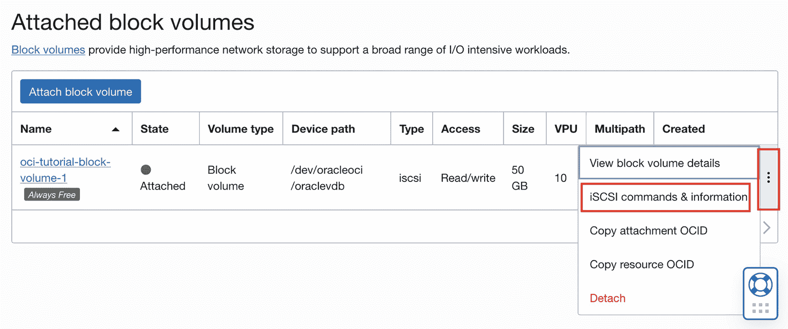

一个包含 2 行 10 列的已附加块卷表格。`oci-tutorial block volume1` 已附加到该表格。“查看块卷详细信息”菜单中的 `iSCSI 命令和信息` 被高亮显示。

图 2-45

获取 iSCSI 信息（计算实例详情）

这将打开一个新的对话框，显示你需要运行的命令，如图 2-46 所示。

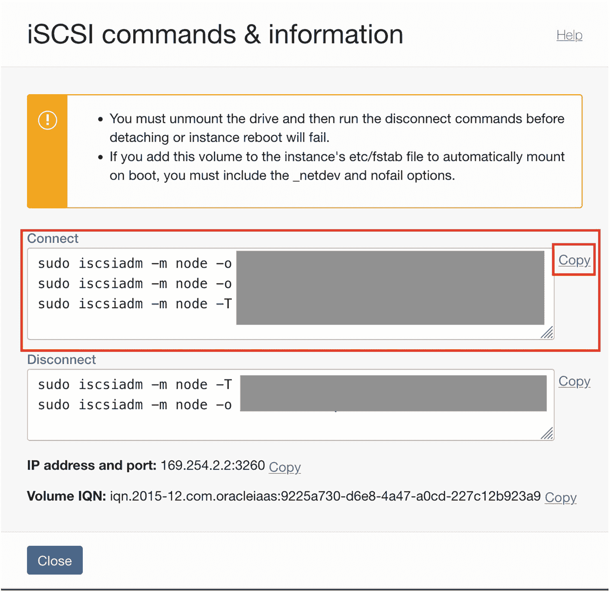

一个窗口显示 `iSCSI` 命令和信息。顶部有一个包含 2 点的警告通知，并显示了连接和断开连接的代码。给出了 `IP` 地址和端口、卷等详细信息。

图 2-46

iSCSI 信息对话框

你会发现一个 `连接` 部分和另一个 `断开连接` 部分，其中包含在计算实例上连接和断开块卷所需的确切命令。我们不会在本章中讨论这些命令的参数。相反，我们将直接复制 `连接` 部分中的三个命令，并在计算实例上运行它们。

如果你在上一部分中关闭了 `SSH` 连接，请打开一个新的连接，并将命令粘贴到终端中，如下所示：

```
$ sudo iscsiadm -m node -o new -T iqn.2015-12.com.oracleiaas:UUID -p 169.254.2.2:3260
New iSCSI node [tcp:[hw=,ip=,net_if=,iscsi_if=default] 169.254.2.2,3260,-1 iqn.2015-12.com.oracleiaas:UUID] added
$ sudo iscsiadm -m node -o update -T iqn.2015-12.com.oracleiaas:UUID -n node.startup -v automatic
$ sudo iscsiadm -m node -T iqn.2015-12.com.oracleiaas:UUID -p 169.254.2.2:3260 -l
Logging in to [iface: default, target: iqn.2015-12.com.oracleiaas:UUID, portal: 169.254.2.2,3260]
Login to [iface: default, target: iqn.2015-12.com.oracleiaas:UUID, portal: 169.254.2.2,3260] successful.
```

接下来，我们需要知道与已附加块卷关联的设备。我们可以通过在 `SSH` 终端会话中执行以下命令来找到它：

```
$ ls -lsa /dev/oracleoci
total 0
0 drwxr-xr-x.  2 root root  140 Mar 13 02:27 .
0 drwxr-xr-x. 21 root root 3320 Mar 13 02:27 ..
0 lrwxrwxrwx.  1 root root    6 Mar 13 02:25 oraclevda -> ../sda
0 lrwxrwxrwx.  1 root root    7 Mar 13 02:25 oraclevda1 -> ../sda1
0 lrwxrwxrwx.  1 root root    7 Mar 13 02:25 oraclevda2 -> ../sda2
0 lrwxrwxrwx.  1 root root    7 Mar 13 02:25 oraclevda3 -> ../sda3
0 lrwxrwxrwx.  1 root root    6 Mar 13 02:27 oraclevdb -> ../sdb
```

注意

本节中的示例命令仅是格式化和挂载驱动器的几种方法之一。请使用任何适用于 Oracle Linux 的机制来完成驱动器映射。

这里我们看到使用的设备是 `/dev/sdb`。我们现在可以使用 `fdisk` 来创建一个分区，如下所示。请务必像示例那样使用 `sudo`。我们将使用的命令以粗体显示。

```
$ sudo fdisk /dev/sdb
Command (m for help): n
Partition type
p   primary (0 primary, 0 extended, 4 free)
e   extended (container for logical partitions)
Select (default p): p
Using default response p.
Partition number (1-4, default 1):
First sector (2048-104857599, default 2048):
Last sector, +sectors or +size{K,M,G,T,P} (2048-104857599, default 104857599):
Created a new partition 1 of type 'Linux' and of size 50 GiB.
Command (m for help): w
The partition table has been altered.
Calling ioctl() to re-read partition table.
Syncing disks.
```

接下来，我们使用 `xfs` 文件系统格式化驱动器，如下所示：


```
$ sudo mkfs.xfs /dev/sdb -f
meta-data=/dev/sdb               isize=512    agcount=4, agsize=3276800 blks
=                       sectsz=4096  attr=2, projid32bit=1
=                       crc=1        finobt=1, sparse=1, rmapbt=0
=                       reflink=1
data     =                       bsize=4096   blocks=13107200, imaxpct=25
=                       sunit=0      swidth=0 blks
naming   =version 2              bsize=4096   ascii-ci=0, ftype=1
log      =internal log           bsize=4096   blocks=6400, version=2
=                       sectsz=4096  sunit=1 blks, lazy-count=1
realtime =none                   extsz=4096   blocks=0, rtextents=0
```

最后，我们可以创建一个挂载点并挂载驱动器，如下所示：

```
$ sudo mkdir /mnt/data
$ sudo mount /dev/sdb /mnt/data
$ ls -lsa /mnt/data
total 0
0 drwxr-xr-x. 2 root root  6 Mar 13 02:43 .
0 drwxr-xr-x. 3 root root 18 Mar 13 02:35 ..
```

现在，我们就可以使用该驱动器来存储应用程序和数据了。

## 持久化挂载

如果您计划将附带块卷的计算实例用于实验或单次会话之外，您会希望使此映射永久生效。为此，您需要编辑 `/etc/fstab` 文件。要完成此操作，您需要块卷的 UUID。您可以使用 `sudo blkid` 命令找到 UUID。获得 UUID 后，将以下行添加到 `/etc/fstab` 文件中，然后运行 `sudo mount -a` 以检查映射：

```
UUID= /mnt/data xfs defaults,_netdev,nofail 0 2
```

完成上述操作后，驱动器将在启动时自动挂载。

就是这样！我们的教程已完成。如果您正在跟随操作，可以自由探索计算实例和块卷，或者创建额外的计算实例或块卷进行更多练习。

实验完成后，教程的下一步是终止我们不想保留的资源。

### 终止资源

此步骤是可选的，但如果您正在使用 OCI 资源进行实验，这是您一定不想忘记做的事情。请记住，您创建的任何不属于“始终免费”类别/促销的资源都将在您的账户上产生费用。如果您不打算使用它们，您肯定不想为此付费。

这是大多数人将学到的关于云的第一课；与本地硬件不同，本地硬件在关机后，除了最初的投资（无论多么复杂）外不会产生任何费用，而大多数云资源始终是可计费的。一个值得注意的例外是可以停止的资源。例如，已停止的计算实例的费用与活动（运行）的实例不同。相反，块存储无论您是否使用都会产生费用。

我们可以通过简单地终止（删除）不再需要的资源来最小化成本。在本例中，我们将采取更极端的步骤，终止教程中创建的所有会产生费用或根本不再需要的资源。在本教程中，我们只需要终止计算实例和块卷。幸运的是，终止这些高层资源也将终止辅助资源，例如块卷附加：

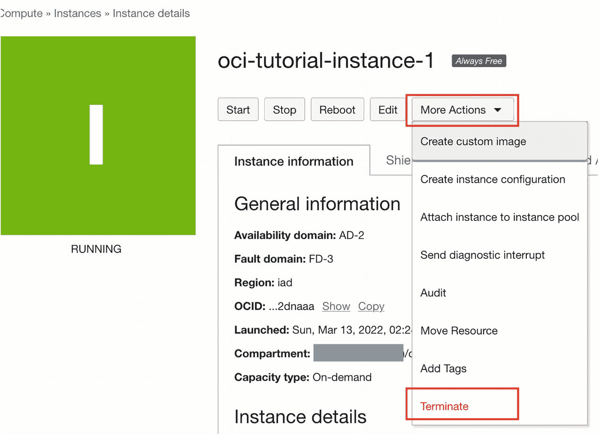

图 2-47 终止计算实例（计算实例详细信息页面）

有几种终止资源的方法。最简单的方法是直接导航到资源详细信息页面，筛选视图以显示您想要终止（删除）的资源，然后使用*终止*按钮或*其他操作* | *终止*菜单。

让我们从计算实例开始。我们将从主云控制台页面开始。在那里，打开主菜单并选择*计算*，然后选择*实例*。在计算实例列表中，我们可以单击计算实例的名称（显示为超链接）以打开计算实例详细信息页面。然后，我们单击顶部附近的*其他操作*菜单，然后选择*终止*，如图 2-47 所示。

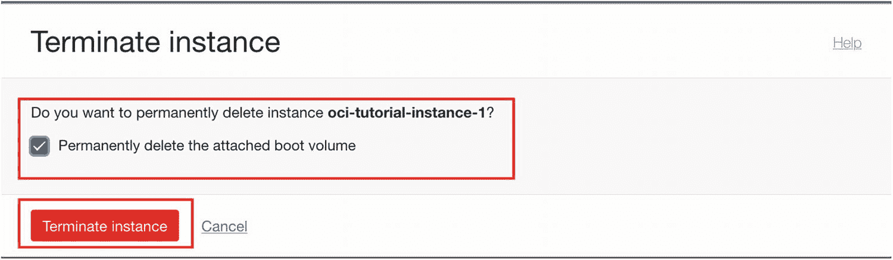

图 2-48 永久删除已附加的启动卷

当您单击该按钮时，您将看到一个弹出消息，询问您是否也要永久删除启动卷。在本例中，我们需要这样做，我们应该勾选*永久删除已附加的启动卷*复选框，如图 2-48 所示。准备就绪后，点击*终止实例*按钮。

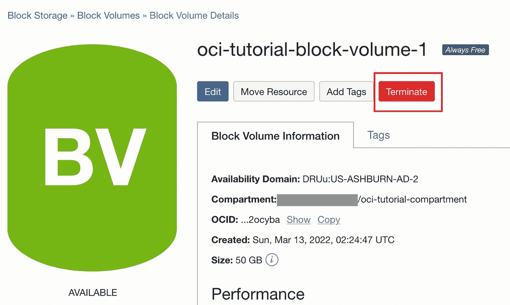

图 2-49 终止块卷（块卷详细信息页面）

请注意消息中“附加”一词的使用。正如您可能推测的那样，这意味着启动卷的附加方式与块卷类似。虽然它们以相同方式连接，但幕后有一个启动卷附加资源对象。

同样值得注意的是，这意味着可以将一个计算实例的单个启动卷用于另一个计算实例。例如，如果您需要更大的规格，您可以终止一个计算实例，保存启动卷以供另一个更大规格的计算实例使用。很酷。

一旦您点击终止实例按钮，状态将变为 `TERMINATING`，图标将变为橙色。一旦终止，状态将变为 `TERMINATED`，图标变为灰色。请务必等到此状态出现后再继续，因为计算实例需要处于已终止状态，然后我们才能终止块卷。

计算实例终止后，您可以通过点击云控制台菜单并选择*存储*然后选择*块卷*来导航到块卷详细信息页面。然后，您可以单击块卷名称（显示为超链接）以打开块卷详细信息页面。从那里，我们可以点击终止按钮来终止块卷，如图 2-49 所示。

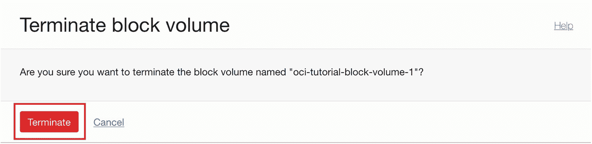

图 2-50 终止块卷对话框

系统将提示您确认终止。再次点击终止按钮以终止块卷，如图 2-50 所示。

与计算实例类似，状态将变为 `TERMINATING`，图标将变为橙色。一旦终止，状态将变为 `TERMINATED`，图标变为灰色。您现在可以关闭 Web 浏览器中的标签页了。

我们的教程到此结束！我们已经看到了开始创建 OCI 资源是多么容易，包括隔离区、VCN、计算实例和块存储设备。

如果您正在跟随教程操作，请务必从您的账户注销。您可以通过点击云控制台右上角的账户图标并选择*注销*来完成，如图 2-51 所示。

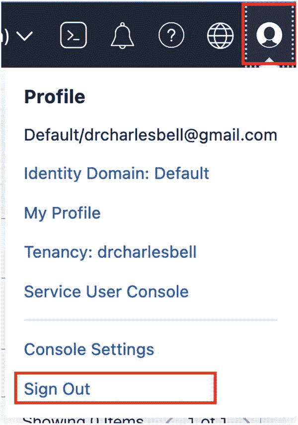

图 2-51 注销云控制台
```


## 概要

Oracle Cloud Infrastructure 是一套庞大的云基础设施，提供了数十种服务供您构建自己的云解决方案。我们拥有诸如用于创建服务器的网络和计算等基础核心服务，诸如数据库系统等高级托管服务，乃至诸如容器编排等平台级服务。尽管我们已经了解更多关于这些概念和特性的知识，但我们仅仅是触及了 OCI 所提供能力的皮毛。

我们还了解到虚拟化和自动化是使 OCI 能够让您轻松地创建（配置）、管理和销毁资源的关键工具。这些简单的用例可以在几分钟内通过虚拟计算完成，而使用物理硬件则可能需要数小时甚至数天。

在本章中，我们进一步了解了 OCI，包括所使用的术语、可用于操作 OCI 的用户界面，以及对 OCI 核心服务的解释。最后，我们看到了一个关于如何设置 OCI 试用账户并创建我们的第一个 OCI 资源的简短教程。

在下一章中，我们将花点时间进一步了解 MySQL，包括一个关于如何开始使用 MySQL 的简短教程。正如您将看到的，它是一个健壮、功能齐全且易于使用的数据库管理系统。

脚注 1 2

# 3. MySQL 简明教程

也许您以前从未使用过数据库系统，或者您曾作为用户使用过，但从未需要从头开始设置过。又或者您决定探究一下数据库系统到底有什么名堂。

在本章中，我将从通用 SQL 接口的角度（传统 MySQL）对 MySQL 进行简要介绍。您不仅会看到如何使用 MySQL 8 来创建和使用数据库，还将接触到一些 SQL 接口的基础知识，这些是将 MySQL 服务器完全集成到您的基础设施中所必需且确实需要的。

我们还将简要了解 MySQL Shell，以及如何通过 SQL 和 NoSQL 接口（用于应用程序和交互式会话）使用它来连接和操作 MySQL。

我们将在本章结尾简要介绍如何将您的应用程序连接到 MySQL 服务器，以操作您创建的数据库。

让我们从简要了解 MySQL 是什么以及它能为我们做什么开始。我们将从在本地 PC 上安装 MySQL 开始进行实验。

注意

虽然本书介绍了 Oracle Cloud Infrastructure 中的 MySQL 数据库服务，但本章中的大部分信息可用于任何 MySQL 服务器。

## 入门指南

MySQL 是世界上最受欢迎的开源数据库系统，这有许多充分的理由。首先，它是开源的，这意味着任何人都可以免费将其用于各种任务。最重要的是，MySQL 包含在许多平台的软件仓库中，使其易于获取和安装。如果您的平台（例如 aptitude）没有在软件仓库中包含 MySQL，您可以从 MySQL 网站 ([`http://dev.mysql.com`](http://dev.mysql.com)) 下载。

Oracle 公司拥有 MySQL。Oracle 通过收购 Sun Microsystems 获得了 MySQL，而 Sun Microsystems 则是从其原始所有者 MySQL AB 手中收购了 MySQL。尽管存在相反的担忧，但 Oracle 通过持续投资于 MySQL 的演进和新功能开发，并忠实维护其开源传统，展现了出色的管理。尽管 Oracle 也提供 MySQL 的商业许可证——正如其以前的所有者过去所做的那样——MySQL 仍然是开源的，并对所有人开放。

开源真的是免费的吗？

开源软件起源于对公司财产心态的有意识抵制。Richard Stallman 被认为是自由软件运动之父，他开创了一种许可机制，以帮助保护软件的所有权，同时让软件的使用以及一定程度上的修改对所有人免费。目标是重建一个开发者合作的社区，只有一个共同的使命——保障自由而非限制自由。

这最终导致了一些措辞巧妙（即具有法律约束力）的许可协议的发明，这些协议允许代码不受限制地复制和修改，并规定衍生作品（修改后的副本）必须根据与原始版本相同的许可证分发，不得附加任何额外限制。其中一种许可证（由 Stallman 创建）称为 GNU 通用公共许可证（GPL）。Oracle 正是使用此许可证来授权 MySQL，因此它确实可供任何人免费使用。

然而，GPL 及类似许可证旨在保障使用、修改和分发的自由；大多数情况下，它们从未将“自由”意指为“免费”或“免费赠予”。为了消除这种误解，开源促进组织（OSI）成立，后来采纳并推广了“开源”一词来描述 GPL 许可证所保障的自由。有关开源软件和 GPL 的更多信息，请访问 [`www.opensource.org`](http://www.opensource.org)。

MySQL 作为后台进程（或者如果您从命令行启动它，也可以作为前台进程）在您的系统上运行。与大多数数据库系统一样，MySQL 支持结构化查询语言（SQL）。您可以使用 SQL 来创建数据库和对象（使用数据定义语言 [DDL]），写入或更改数据（使用数据操纵语言 [DML]），以及执行用于管理服务器的各种命令。

连接到 MySQL 有两种机制。您可以使用像 MySQL Shell 或 MySQL Workbench 这样的应用程序，或者您可以使用较旧的 MySQL 客户端。让我们看看这两种选项。


### 连接 MySQL Shell

MySQL Shell 是 MySQL 产品组合中新增的一个令人兴奋的组件。它代表了首个用于连接和交互 MySQL 的现代化高级客户端。该 Shell 可作为脚本环境，用于开发处理数据的新工具和应用程序。虽然它确实支持 SQL 模式，但其主要目的是允许使用 JavaScript 和 Python 语言访问数据。没错，你可以编写 JavaScript 和 Python 脚本，并在 Shell 中以交互方式或批处理方式执行它们。很酷吧！

**注意**

我使用术语 “shell” 指代 MySQL Shell 支持的功能或对象。我使用 “MySQL Shell” 指代产品本身。

MySQL Shell 设计用于通过 X Plugin 使用新的 X Protocol 与服务器通信。但是，Shell 也可以使用较旧的协议连接到服务器，尽管在脚本模式下功能有限。这意味着，Shell 允许你同时处理关系型（SQL）、JSON 文档（NoSQL）或两者。

NoSQL 接口基于一个称为 X DevAPI（[`https://dev.mysql.com/doc/x-devapi-userguide/en/`](https://dev.mysql.com/doc/x-devapi-userguide/en/)）的应用程序编程接口。管理操作则由另一个称为 AdminAPI 的 API 支持。如果你计划使用 Shell 进行开发工作，请参阅在线文档以获取有关这些 API 的更多信息（[`https://dev.mysql.com/doc/mysql-shell/8.0/en/`](https://dev.mysql.com/doc/mysql-shell/8.0/en/)）。

Oracle 通过 MySQL 下载网站（[`https://dev.mysql.com/downloads/shell/`](https://dev.mysql.com/downloads/shell/)）免费提供 MySQL Shell。你可以下载适用于你平台（例如 Windows、macOS、Linux）的特定版本，并使用你平台的常规机制进行安装。安装后，可以通过你平台的菜单系统或通过在命令行输入 `mysqlsh` 来启动它。图 3-1 显示了一个启动 MySQL Shell 的示例。注意其漂亮的提示符，它显示了 MySQL 徽标、连接信息和模式。很棒！

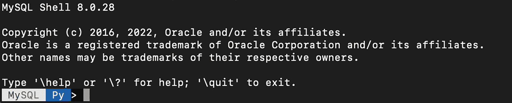

MySQL Shell 屏幕截图，显示版权及其关联公司。在命令行中键入 mysqlsh 以启动 MySQL Shell。

图 3-1

**MySQL Shell**

以下各节从高层次介绍了 Shell 的主要功能。我们不会探讨每个功能或选项的所有细节，相反，本节提供了一个广泛的概述，以便你能快速开始，更重要的是，了解足够多的 Shell 知识，以便你能跟上本书中的示例。

有关 MySQL Shell 的更多信息，请参阅在线 MySQL 参考手册中名为 “MySQL Shell 用户指南” 的部分。

#### 功能特性

MySQL Shell 具有许多功能，包括支持传统 SQL 命令处理、脚本原型设计，甚至支持自定义 Shell。以下列出了 Shell 的一些主要功能。大多数功能可以通过命令行选项或特殊的 Shell 命令来控制。我们将在后续章节中更深入地探讨一些更关键的功能：

*   *日志记录*：你可以为会话创建日志以供后续分析或保存消息记录。你可以使用 `--log-level` 选项设置详细级别，范围从 1（无日志记录）到 8（最大调试信息）。

*   *输出格式*：Shell 支持三种格式选项：表格（`--table`），这是你从旧客户端习惯的传统网格格式；制表符分隔（tabbed），它使用制表符进行间距并用于批处理执行；以及 JSON（`--json`），它以更易于阅读的方式格式化 JSON 文档。这些是你在启动 Shell 时指定的命令行选项。

*   *交互式代码执行*：使用 Shell 的默认模式是交互模式，它像传统客户端一样工作，你输入命令并获得响应。

*   *批处理代码执行*：如果你想在没有交互会话的情况下运行脚本，可以使用 Shell 以批处理模式运行脚本。但是，输出仅限于非格式化输出（但可以使用 `--interactive` 选项覆盖）。

*   *脚本语言*：Shell 同时支持 JavaScript 和 Python，但一次只能使用一种。

*   *会话*：会话本质上是到服务器的连接。Shell 允许你存储和删除会话。我们将在后面的章节中看到更多关于会话的内容。

*   *启动脚本*：你可以定义一个脚本在 Shell 启动时执行。你可以用 JavaScript 或 Python 编写该脚本。

*   *命令历史和命令补全*：Shell 会保存你输入的命令，允许你使用上下箭头键调用它们。Shell 还为已知关键字、API 函数和 SQL 关键字提供代码补全功能。

*   *全局变量*：Shell 提供了一些全局变量，你可以在交互模式下访问它们。这些包括：
    *   `session`：如果已建立，则为全局会话对象
    *   `db`：如果通过连接建立，则为模式对象
    *   `dba`：用于处理 InnoDB 集群的 AdminAPI 对象
    *   `shell`：用于使用 Shell 的通用函数
    *   `util`：用于处理服务器的实用函数

*   *自定义提示符*：你还可以通过使用特殊格式更新名为 `~/.mysqlsh/prompt.json` 的配置文件或定义名为 `MYSQLSH_PROMPT_THEME` 的环境变量来更改默认提示符。有关更改提示符的更多详细信息，请参阅 MySQL Shell 参考手册。

*   *自动补全*：从 8.0.4 版本开始，Shell 允许用户按 *TAB* 键在 SQL 模式下自动补全关键字，以及在 JavaScript 和 Python 模式下自动补全主要类和方法。

*   *扩展*：你可以以报告和扩展对象的形式定义扩展。报告和扩展对象可以使用 JavaScript 或 Python 创建。

*   *实用程序*：Shell 还提供了几个你可能会觉得有用的实用程序，包括以下。你可以通过 API 调用访问它们，如示例所示。
    *   *升级检查器*：用于验证 MySQL 服务器实例是否已准备好进行升级（例如，`util.checkForServerUpgrade()`）。
    *   *JSON 导入*：将 JSON 文档导入到 MySQL 服务器的集合或表中（例如，`util.importJSON()`）。
    *   *并行表导入*：拆分单个数据文件并使用多个线程将数据块加载到 MySQL 表中。

*   *Shell 命令*：与原始的 MySQL 客户端一样，有一些特殊命令用于控制应用程序本身，而不是与数据交互。要执行 Shell 命令，请使用反斜杠（`\`）发出命令。例如，`\help` 会打印所有 Shell 命令的帮助信息。

*   *选项*：可以使用多个启动选项来启动 Shell，这些选项控制模式、连接、行为等。常见选项包括模式（SQL、JavaScript 或 Python）和连接参数。有关选项的完整列表，请使用 `mysqlsh --help` 执行 Shell。

如你所见，MySQL Shell 有一个长长的功能列表。有关完整的功能列表，请参阅在线参考手册。

让我们看看对于刚开始使用 MySQL 的人来说最重要的两个方面：模式以及如何连接。


## 模式支持

MySQL Shell 支持三种模式（也称为语言支持或活动语言）：SQL、JavaScript 和 Python。我们可以通过 Shell 命令来启动其中任何一种模式。你可以根据需要随时切换模式（语言），而无需每次断开连接。以下是三种模式及其切换方式：

*   `\sql`：切换到 SQL 语言

*   `\js`：切换到 JavaScript 语言（默认模式）

*   `\py`：切换到 Python 语言

你也可以使用 `--` 代替 `\` 作为启动命令（`--sql`、`--js`、`--py`）。

## 建立连接

在 Shell 中建立连接是一个需要与原来 MySQL 客户端（`mysql`）不同操作习惯的领域。你可以使用特殊格式的 URI 字符串，或者像旧客户端那样通过指定名称的各个选项来连接到服务器。也支持 SSL 连接。连接可以通过启动选项、Shell 命令和脚本建立。但是，所有连接都需要密码。因此，除非另有说明，否则如果未提供密码，Shell 将提示输入密码。

> **注意**
>
> 如果你想使用无密码连接（不推荐），必须使用 `--password` 选项，或者如果使用 URI，则需要额外添加一个冒号来代替密码。

与其讨论所有可用的连接方式及相应选项，不如在下面的章节中介绍每种连接方法的一个示例。

### 使用 URI

在 MySQL Shell 连接的场景下，URI 是一个使用以下格式编码的特殊字符串：`<dbuser>[:<dbpassword>]@host[:port][/schema/]`，其中 `<>` 表示各个参数的字符串值。注意，密码、端口和模式是可选的，但用户和主机是必需的。这里的模式是指连接时要使用的默认模式（数据库）。

> **注意**
>
> X 协议的默认端口是 `33060`。

要在启动 Shell 时在命令行上使用 URI 连接到服务器，请使用 `--uri` 选项指定它，如下所示：

```bash
$ mysqlsh --uri root:secret@localhost:33060
```

Shell 假定所有连接都需要密码，如果未提供密码，将提示输入密码。清单 3-1 显示了上面没有密码的相同连接。请注意 Shell 如何提示输入密码。

```bash
$ mysqlsh --uri root@localhost:33060/world_x
Please provide the password for 'root@localhost:33060':
Save password for 'root@localhost:33060'? [Y]es/[N]o/Ne[v]er (default No): Y
MySQL Shell 8.0.28
Copyright (c) 2016, 2022, Oracle and/or its affiliates.
Oracle is a registered trademark of Oracle Corporation and/or its affiliates.
Other names may be trademarks of their respective owners.
Type '\help' or '\?' for help; '\quit' to exit.
Creating a session to 'root@localhost:33060/world_x'
Fetching schema names for autocompletion... Press ^C to stop.
Your MySQL connection id is 8 (X protocol)
Server version: 8.0.23 MySQL Community Server - GPL
Default schema `world_x` accessible through db.
MySQL  localhost:33060+ ssl  world_x  JS >
```
*清单 3-1 使用 URI 连接*

注意我还在 URI 中通过 `/schema` 选项指定了默认模式（`world_x`）。

> **提示**
>
> `world_x` 数据库是一个示例数据库，你可以从 [`https://dev.mysql.com/doc/index-other.xhtml`](https://dev.mysql.com/doc/index-other.xhtml) 下载。

### 使用单独选项

你也可以在 Shell 命令行上使用单独的选项指定连接，例如指定用户、主机、端口等。有关连接选项的完整列表，请参阅在线参考手册（[`https://dev.mysql.com/doc/mysql-shell/8.0/en/mysql-shell-connections.xhtml`](https://dev.mysql.com/doc/mysql-shell/8.0/en/mysql-shell-connections.xhtml)）。清单 3-2 展示了如何使用单独选项连接到 MySQL 服务器。

```bash
$ mysqlsh --user root --host localhost --port 33060 --schema world_x --py --mx
MySQL Shell 8.0.28
Copyright (c) 2016, 2022, Oracle and/or its affiliates.
Oracle is a registered trademark of Oracle Corporation and/or its affiliates.
Other names may be trademarks of their respective owners.
Type '\help' or '\?' for help; '\quit' to exit.
Creating an X protocol session to 'root@localhost:33060/world_x'
Fetching schema names for autocompletion... Press ^C to stop.
Your MySQL connection id is 9 (X protocol)
Server version: 8.0.23 MySQL Community Server - GPL
Default schema `world_x` accessible through db.
MySQL  localhost:33060+ ssl  world_x  Py >
```
*清单 3-2 使用单独选项连接*

注意，我通过 `--py` 选项将模式（语言）改为了 Python。

### 使用 SSL 连接

你还可以创建 SSL 连接以实现到服务器的安全连接。要使用 SSL，必须将服务器配置为使用 SSL。要在运行 MySQL 的同一台机器上使用 SSL，可以使用 `--ssl-mode=REQUIRED` 选项。你也可以按照在线参考手册（[`https://dev.mysql.com/doc/mysql-shell/8.0/en/mysql-shell-connections.xhtml`](https://dev.mysql.com/doc/mysql-shell/8.0/en/mysql-shell-connections.xhtml)）所示指定 SSL 选项。可以使用命令行选项在命令行上指定它们，也可以作为 `\connect` Shell 命令的扩展。以下是如何使用 SSL 和命令行选项连接到服务器。

```bash
$ mysqlsh -uroot -h127.0.0.1 --port=33060 --ssl-mode=REQUIRED
```

> **提示**
>
> 有关加密连接的更多详细信息，请参阅 MySQL Shell 参考手册中的“使用加密连接”部分。

MySQL Shell 是 MySQL 客户端技术的一个巨大飞跃。它不仅旨在以更智能的方式与 MySQL 中的 SQL 配合工作，还旨在支持 JavaScript 和 Python 的原型设计。你可以使用任何你想要的语言，并轻松地在它们之间切换，而无需重新启动应用程序或断开连接。这有多酷？

现在，让我们来看看连接到 MySQL 服务器的旧应用程序。

### 连接 MySQL 客户端

虽然 MySQL Shell 已推出数年，并具备包括脚本编写和开发能力在内的诸多功能，但另一个客户端在 MySQL 中已存在数十年。它是一个名为 `mysql` 的应用程序，可让你连接到服务器并在其上运行 SQL 命令。有趣的是，这个 MySQL 客户端最初被称为 MySQL 监视器，但长期以来被简称为“MySQL 客户端”、终端监视器，甚至 MySQL 命令窗口。

你只有在安装 MySQL 服务器（在 Windows 或 macOS 上）或某个软件包组件时才能获得 `mysql` 客户端。例如，在 Linux 上，你可以仅安装客户端软件包，这样也会获得该客户端。我们将把客户端的安装留到后续在本地 PC 上安装 MySQL 的章节。

#### 新的默认认证方式

在 MySQL 8.0.4 版本之前，默认的认证机制使用了一个名为 `mysql_native_password` 插件的认证插件，该插件使用 SHA1 算法。这种机制速度快，且不需要加密连接。然而，由于 NIST 已建议组织停止使用 SHA1 算法，Oracle 在 MySQL 8.0.4 版本中将默认认证插件更改为了 `caching_sha2_password` 插件。

如果你想了解更多关于此变更的信息，包括 Oracle 为何做出此变更以及为用户带来的优势，请参阅 [`https://mysqlserverteam.com/mysql-8-0-4-new-default-authentication-plugin-caching_sha2_password/`](https://mysqlserverteam.com/mysql-8-0-4-new-default-authentication-plugin-caching_sha2_password/)。

要使用 MySQL 客户端 (`mysql`) 连接到服务器，你必须指定一个用户账户和要连接的服务器。如果你连接的是同一台机器上的服务器，可以省略服务器信息（主机和端口），因为它们默认为 localhost 和端口 3306。用户通过 `--user`（或 `-u`）选项指定。你可以在命令行上指定用户的密码，但更安全的做法是指定 `--password`（或 `-p`），客户端会提示你输入密码。如果你确实在命令行上指定了密码，系统会提示一条警告，建议你不要这样做。

在同一台机器上使用 `mysql` 客户端而不指定 `--host`（或 `-h`）和 `--port` 选项时，不会使用网络连接。如果你想通过网络连接或使用不同端口连接，必须使用回环地址。例如，要连接到同一台机器上运行在端口 3307 的服务器，请使用命令 `mysql -uroot -p –h127.0.0.1 --port=3306`。清单 3-3 展示了一个使用 `mysql` 客户端连接（并断开连接）到 MySQL 服务器的示例。

```
$ mysql -uroot -p -h 127.0.0.1 --port=3306
Enter password:
Welcome to the MySQL monitor.  Commands end with ; or \g.
Your MySQL connection id is 15
Server version: 8.0.23 MySQL Community Server - GPL
Copyright (c) 2000, 2021, Oracle and/or its affiliates.
Oracle is a registered trademark of Oracle Corporation and/or its
affiliates. Other names may be trademarks of their respective
owners.
Type 'help;' or '\h' for help. Type '\c' to clear the current input statement.
mysql> quit
Bye
清单 3-3
使用 mysql 客户端进行连接
```

## 基本 SQL 命令

现在我们已经了解了如何连接到 MySQL，让我们通过一个简短的例子，简要地看一下你可能会用到的一些更流行的 SQL 命令。我们将在后面的章节中更详细地讨论这些命令。清单 3-4 展示了使用 `mysql` 客户端执行几个 SQL 命令的示例。

提示：要查看客户端中可用的命令列表，请在提示符下输入 `help;` 并按 `Enter`。

```
$ mysql -uroot -p -h 127.0.0.1 --port=3306
Enter password:
Welcome to the MySQL monitor.  Commands end with ; or \g.
Your MySQL connection id is 15
Server version: 8.0.23 MySQL Community Server - GPL
Copyright (c) 2000, 2021, Oracle and/or its affiliates.
Oracle is a registered trademark of Oracle Corporation and/or its
affiliates. Other names may be trademarks of their respective
owners.
Type 'help;' or '\h' for help. Type '\c' to clear the current input statement.
mysql> CREATE DATABASE greenhouse;
Query OK, 1 row affected (0.00 sec)
mysql> CREATE TABLE greenhouse.plants (plant_name char(50), sensor_value int, sensor_event timestamp);
Query OK, 0 rows affected (0.02 sec)
mysql> INSERT INTO greenhouse.plants VALUES ('living room', 23, NULL);
Query OK, 1 row affected (0.01 sec)
mysql> SELECT * FROM greenhouse.plants;
+-------------+--------------+--------------+
| plant_name  | sensor_value | sensor_event |
+-------------+--------------+--------------+
| living room |           23 | NULL         |
+-------------+--------------+--------------+
1 row in set (0.00 sec)
mysql> SET @@global.server_id = 106;
Query OK, 0 rows affected (0.00 sec)
mysql> quit
Bye
清单 3-4
使用 mysql 客户端的 SQL 命令示例
```

在这个例子中，你可以看到以 `CREATE DATABASE` 和 `CREATE TABLE` 语句形式出现的数据定义语言^(⁵)（DDL），以 `INSERT` 和 `SELECT` 语句形式出现的数据操作语言^(⁶)（DML），以及一个用于设置全局服务器变量的简单管理命令。

接下来，你看到的是创建数据库和表来存储数据，在表中添加一行数据，最后检索表中的数据。注意我是如何使用大写字母来书写 SQL 命令关键字的。这是一种常见的做法，有助于使 SQL 命令更易于阅读，也更容易找到用户提供的选项或数据。

提示：你可以通过输入命令 `quit` 退出 MySQL 客户端。在 Linux 和 Unix 系统上，你可以按 `Ctrl+D` 退出客户端。

MySQL 中有非常多的命令。幸运的是，你只需要掌握少数几个更常用的命令即可。以下是你将最常使用的命令。用 `<>` 括起来的部分表示命令中由用户提供的组件，`[...]` 表示需要其他选项：

*   `CREATE DATABASE <database_name>`：创建一个数据库
*   `USE <database>`：设置默认数据库（非 SQL 命令）
*   `CREATE TABLE <table_name> [...]`：创建一个用于存储数据的表或结构
*   `INSERT INTO <table_name> [...]`：向表中添加数据
*   `UPDATE [...]`：更改特定行的一个或多个值
*   `DELETE FROM <table_name> [...]`：从表中删除数据
*   `SELECT [...]`：从表中检索数据（行）
*   `SHOW [...]`：显示对象列表

注意：你必须以分号 (`;`) 或 `\G` 终止每条命令。

尽管此列表只是一个简短的介绍，远非完整的语法指南，但有一份优秀的在线参考手册，其中更详细地解释了每条命令（以及更多内容）。当你对 MySQL 中的任何内容有疑问时，应查阅该在线参考手册。你可以在 [`http://dev.mysql.com/doc/`](http://dev.mysql.com/doc/) 找到它。

其中一个更有趣的命令是允许你查看对象列表的命令。例如，你可以使用 `SHOW DATABASES` 查看数据库，在切换到某个数据库后使用 `SHOW TABLES` 查看表列表，甚至使用 `SHOW GRANTS` 查看用户的权限。我发现我自己经常使用这些命令。

如果你认为 MySQL 的内容远不止这几个简单的命令，那你是对的。尽管它易于使用且启动速度快，但 MySQL 是一个功能齐全的关系数据库管理系统（RDBMS）。它的内容远比你在此处看到的要多。有关 MySQL 的更多信息，包括所有高级功能，请参阅参考手册。

### 如何获取与安装 MySQL

MySQL 服务器适用于多种平台，包括大多数 Linux 和 Unix 平台、Mac OS X 以及 Windows。它可作为社区版下载（开源）或作为授权产品（企业版）提供。您可以直接从 Oracle 下载社区版，或通过您的 Oracle 账户下载企业版。本章中，我们将使用社区版。

要下载 MySQL 8 的社区版，请访问 [`www.mysql.com/downloads/`](http://www.mysql.com/downloads/)，向下滚动并点击 *MySQL 社区版（GPL）下载*，然后点击 *MySQL 社区服务器*。页面将自动检测您的操作系统。如果您想为其他平台下载，可以从下拉列表中选择。

下载页面将列出多个可供下载的文件。根据您的平台，您可能会看到几个选项，包括压缩文件、源代码和安装包。大多数用户会选择在笔记本电脑或台式计算机上安装的安装包。图 3-2 展示了 macOS 平台各种下载选项的示例。

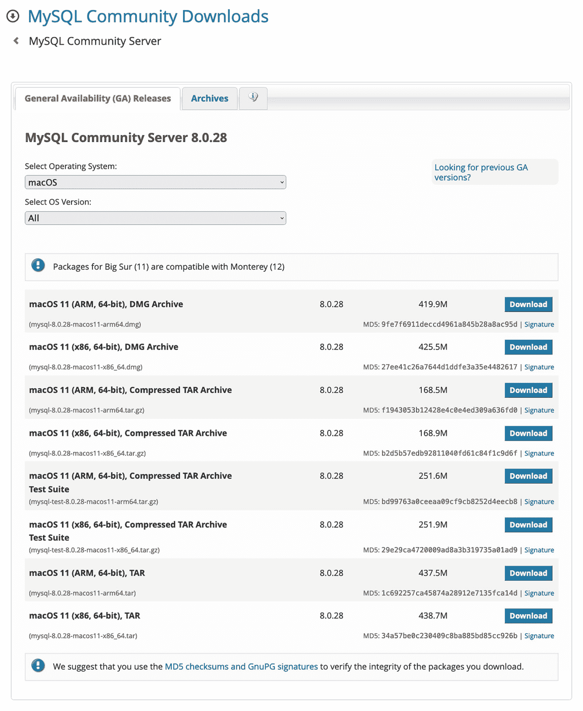

一张截图描绘了通用可用版本选项卡，显示了可下载的 macOS 11 示例。列出了版本和文件大小。下载按钮在右侧。

图 3-2

macOS 下载页面

最受欢迎的平台之一是 Microsoft Windows。Oracle 为 Windows 提供了一个名为 Windows 安装程序的特殊安装包。该包包含社区许可下所有可用的 MySQL 产品，包括 MySQL 服务器、Workbench、实用工具以及所有可用的连接器（用于连接到 MySQL 的程序库）。这使得在 Windows 上安装变成了一站式、一次完成的事情。图 3-3 展示了 Windows 安装程序的下载页面。

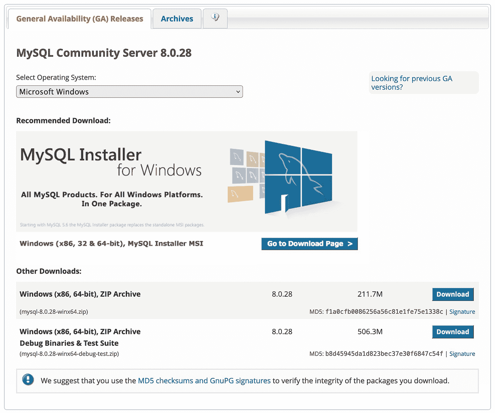

通用可用版本选项卡的截图显示了适用于 Windows 的 My S Q L 安装程序，底部也提供了其他下载选项。

图 3-3

Windows 安装程序下载页面

我们在图片中 Windows 安装程序下载链接下方看到这些内容。您可以选择 Windows 安装程序的 32 位或 64 位安装。请注意，该包可能只是一个包含服务器代码的 `.zip` 文件。在这种情况下，您可能需要从解压后的文件夹运行服务器，或进行本地手动安装。

如果您想跟随本章的示例进行操作，应考虑在您的 PC 或本地网络中的另一台 PC 上安装 MySQL。虽然使用 MDS 时您无需进行任何安装或配置，但我们可以通过本地安装来了解一些关于 MySQL 的知识，这样我们就可以随时使用它而无需产生成本。

安装 MySQL 非常简单，一旦您下载了适用于您平台的正确软件包，只需几分钟即可完成。只需像安装该平台上的任何其他软件一样安装服务器和任何子组件。如果您需要分步说明，可以参考在线参考手册 ([`https://dev.mysql.com/doc/refman/8.0/en/installing.xhtml`](https://dev.mysql.com/doc/refman/8.0/en/installing.xhtml))。

出于实验目的，您可以使用默认设置安装 MySQL。更具体地说，采用标准安装。如果您想为不同的环境进行预配置，随时可以重新安装。在安装过程中，系统可能会要求您为 root 用户提供密码。请务必遵循密码选择的最佳实践。

好的，现在我们已经安装了 MySQL 8 服务器，我们可以开始配置服务器以供使用。使用 MDS 时，您无需执行以下任何操作，但了解有关 MySQL 如何配置以及如何向用户账户授予权限总是有好处的。

### 配置与管理 MySQL 访问权限

既然您已在本地安装了 MySQL，让我们简要讨论一下如何配置 MySQL、如何向他人授予服务器（和数据库）的访问权限，以及如何设置 X 插件（启用文档存储的关键组件）。我们首先了解一下用于定义 MySQL 行为并配置选项的配置文件。

#### 配置文件

在 MySQL 中配置启动选项和变量的主要方法是使用一个名为 `my.cnf`（在 Windows 上为 `my.ini`）的文本文件。该文件通常位于 Posix 系统上的 `/etc` 文件夹中。例如，在 macOS 上，该文件名为 `/etc/my.cnf`。清单 3-5 展示了一个典型 MySQL 配置文件的前几十行。

```sql
