# Close the cursor and connection
cur.close()
cnx.close()
```

**清单 3-11** MySQL 插入数据示例

我们读取的文件只有几行，是植物监控系统示例的一个模拟数据。以下显示了文件内容。请注意，我将其命名为 `plants_data.txt`。如果你更改了文件名，请务必相应地更改代码：

```text
Jerusalem Cherry,deck,2
Moses in the Cradle,patio,2
Peace Lilly,porch,1
Thanksgiving Cactus,porch,1
African Violet,porch,1
```

要运行该脚本，请从存储文件的文件夹中发出以下命令。请务必先将数据文件放在同一文件夹中。我展示了运行脚本的结果：

```bash
% python3 ./mysql_insert.py
INSERT INTO plant_monitoring.plants (name, location, climate) VALUES ('Jerusalem Cherry','deck',2)
INSERT INTO plant_monitoring.plants (name, location, climate) VALUES ('Moses in the Cradle','patio',2)
INSERT INTO plant_monitoring.plants (name, location, climate) VALUES ('Peace Lilly','porch',1)
INSERT INTO plant_monitoring.plants (name, location, climate) VALUES ('Thanksgiving Cactus','porch',1)
INSERT INTO plant_monitoring.plants (name, location, climate) VALUES ('African Violet','porch',1)
```

现在让我们检查一下我们的表。如果我们从一个空表开始，当我们对 plants 表执行 `SELECT` 时，应该会看到以下内容。请注意，我们使用 MySQL Shell 传递要执行的查询并将输出格式化为表格：

```bash
% mysqlsh -uroot -p --sql -e "SELECT * FROM plant_monitoring.plants" --table
+----+---------------------+----------+---------+
| id | name                | location | climate |
+----+---------------------+----------+---------+
| 11 | Jerusalem Cherry    | deck     | outside |
| 12 | Moses in the Cradle | patio    | outside |
| 13 | Peace Lilly         | porch    | inside  |
| 14 | Thanksgiving Cactus | porch    | inside  |
| 15 | African Violet      | porch    | inside  |
+----+---------------------+----------+---------+
```

你可以使用连接器完成比这里展示的更多的功能。你应该阅读在线参考手册（ [`https://dev.mysql.com/doc/connector-python/en/`](https://dev.mysql.com/doc/connector-python/en/) ）以获取更多信息和如何使用连接器满足你应用程序需求的示例。

现在，让我们看一个 Connector/J 示例。我们将使用相同的示例，但用 Java 实现。


### 示例连接器：Connector/J

Oracle 提供的 Java 连接器是一个功能齐全的连接器，它为 Java 应用程序提供了与 MySQL 数据库服务器的连接能力。Connector/J 支持所有当前的 MySQL 服务器版本。它是一个功能齐全的连接器，具备创建安全连接所需的所有功能，并支持所有 MySQL SQL 命令。

Connector/J 必须安装在您将运行代码的电脑上，其安装方式与您可能使用的任何 Java 库相同。在应用程序中使用 Connector/J 包括导入基础模块、启动连接以及使用游标执行查询。

为了保持简单，我们将使用一种简化的 Java 编程形式来编写和执行示例。更具体地说，我们将使用简单的文本编辑器创建代码文件，并使用 Java 开发工具包（JDK）来编译代码（`javac`）和执行（`java`）。如果您有使用更强大的 Java IDE 的经验，也可以使用它们。

注意：Java 运行时环境（JRE）与 JDK 不同。即使您安装了 JRE，也必须安装 JDK。

当然，要使用 Connector/J，您需要确保您的电脑上安装了最新版本的 Java 运行时环境。大多数电脑都安装了 JDK。但是，如果您想检查一下，只需在终端中执行 `javac --version`。如果提示找不到该命令，请访问 [`www.oracle.com/java/technologies/downloads/`](http://www.oracle.com/java/technologies/downloads/) 了解如何在您的电脑上下载和安装 JDK。

注意：您应该使用 8.0 或更高版本的 JDK。

在我们深入探讨如何使用 Connector/J 编写一些支持 MySQL 数据库的应用程序之前，先来谈谈如何获取和安装 Connector/J。

#### 安装 Connector/J

下载过程与您为服务器发现的过程相同。您可以从 Oracle 的 MySQL 网站（[`http://dev.mysql.com/downloads/connector/j/`](http://dev.mysql.com/downloads/connector/j/)）下载 Connector/J。该页面会自动检测您的平台并显示适用于您平台的可用下载项。您可能会看到几个选项。请务必选择与您的配置匹配的选项。但请注意，没有 macOS 的安装包。如果您的平台未在列表中显示，您可以使用 *Platform Independent*（平台无关）操作系统选项进行下载。

在本演示中，我们将使用 *Platform Independent* 选项。我们这样做是为了演示如何使用此选项并从安装目录（文件夹）中使用类，而不是将其安装在系统上。如果您正在一个用于 Java 开发的系统上工作，以避免干扰您的 IDE 或 Java 安装，您可能希望这样做。

只需从下载页面选择 *Platform Independent* 操作系统选项，然后下载 .zip 或 .tar.gz 文件。下载后，将文件复制到您的项目目录并解压缩。例如，如果您有一个名为 `../Ch03/java` 的文件夹来存储本节中的示例，您可以将文件解压缩到该目录中。这将在相同路径下生成一个名为 `../Ch03/java/mysql-connector-java-8.0.28`（或者如果您下载了较新版本的连接器，名称可能类似）的文件夹。

要访问该文件夹中的类，我们需要如下设置 `CLASSPATH`，以便能够找到这些类。这是一个临时设置，仅对打开的终端会话有效，不会影响您的 Java 安装。只需记住在运行本节示例之前执行一次此命令。

```
% cd ../Ch03/java
% export CLASSPATH=./mysql-connector-java-8.0.28/mysql-connector-java-8.0.28.jar:$CLASSPATH
```

提示：有关在某些平台上安装的具体说明，请参阅在线参考手册（[`https://dev.mysql.com/doc/connector-j/8.0/en/connector-j-installing.xhtml`](https://dev.mysql.com/doc/connector-j/8.0/en/connector-j-installing.xhtml)）。

#### 检查安装

安装 Connector/J 后，您可以通过以下简短示例验证其是否正常工作。我们将创建一个名为 `MySQLTest.java` 的新代码文件，其中包含一个同名的类。

Connector/J 与 Java 数据库连接性（JDBC）库协同工作。因此，我们不是为连接提供单独的参数，而是构建一个符合 JDBC 标准的统一资源定位符（URL）。

以下是 MySQL Connector/J 的数据库连接 URL 语法的模拟格式：

*   `host`：MySQL 服务器的主机名。默认值为 127.0.0.1。
*   `port`：MySQL 服务器的端口号。默认值为 3306。
*   `database`：连接的默认数据库名称。
*   `failoverhost`：备用数据库服务器的主机名。MySQL Connector/J 在连接失败时支持故障转移。更多细节请参阅在线参考。
*   `propertyNameN = propertyValueN`：一个或多个由 & 符号分隔的属性列表（可选）

```
jdbc:mysql://[host][,failoverhost...]
[:port]/[database]
[?propertyName1][=propertyValue1]
[&propertyName2][=propertyValue2]...
```

提示：有关 JDBC 的完整教程，请参阅 Oracle 的 JDBC 教程网站 [`https://docs.oracle.com/javase/tutorial/jdbc/basics/index.xhtml`](https://docs.oracle.com/javase/tutorial/jdbc/basics/index.xhtml)。

因此，要使用 localhost 和 MySQL 的默认端口连接到我们本地的 MySQL 服务器，URL 将如下所示：

```
"jdbc:mysql://localhost:3306/plant_monitoring?useSSL=false";
```

请注意，我们省略了用户名和密码。为了连接到服务器，我们将使用 Java 的 `DriverManager` 类来获取连接。我们在调用 `DriverManager` 类的 `getConnection()` 方法时将这些作为附加参数提供。

既然我们已经了解了如何建立连接，现在来看一个设计用于测试 Connector/J 是否安装的 Java 应用程序示例。在这个例子中，我们尝试使用一个不存在的用户账户进行连接。我们这样做是为了确保会得到 MySQL 访问被拒绝的错误消息。如果它没有出现该特定错误就成功了，我们就知道出了其他问题（它不应该成功）。相反，如果连接产生了不同的错误，我们就知道 Connector/J 要么未安装（在 `CLASSPATH` 上找不到），要么是其他问题。无论哪种情况，我们都会打印异常信息，以便用户可以确定解决问题的方案。

我们将此逻辑放在 `main()` 方法中。如果安装了 Connector/J，您应该会看到一条错误消息，指出用户（`not_a_user`）无法连接。再次强调，任何其他错误都意味着 URL 路径无效，或者 Connector/J 未安装。代码清单 3-12 显示了完整的代码。

```
//
//  MySQL Database Service
//
// Chapter 03 - MySQL Test Connector/J
//
// This example tests installation of Connector/J by attempting to connect
// to a MySQL server. Be sure to get the URL statement connect before
// compiling and running the test.
//
// Dr. Charles Bell
//
// Imports
import java.sql.Connection;
import java.sql.DriverManager;
import java.sql.SQLException;
// Class
public class MySQLTest {
public static void main(String[] args) {
// Connection parameters
String url = "jdbc:mysql://localhost:3306/"
+ "plant_monitoring?useSSL=false";
String user = "not_a_user";
String password = "SECRET";
// Attempt connection
try (Connection con = DriverManager.getConnection(url, user,
password)) {
System.out.println("ERROR: Should not connect with "
"'not_a_user'!");
} catch (SQLException ex) {
// Test to see if access denied error (expected).
if (ex.getMessage().contains("Access denied")) {
System.out.println("Success!");
} else {
// If Connector/J is not installed, print message.
System.out.println("Connector/J is missing.");
System.out.println(ex.getMessage());
}
}
}
}
```

代码清单 3-12：测试 Connector/J 示例


# MySQL JDBC 连接与操作示例

一旦你将代码保存在一个名为 `MySQLTest.java` 的文件中，就可以继续使用以下命令编译并运行它。如果 Connector/J 未安装，你应该会看到如下的错误信息：

```
% javac MySQLTest.java
% java MySQLTest
Connector/J is missing.
No suitable driver found for jdbc:mysql://localhost:3306/plant_monitoring?useSSL=false
```

如果将 Connector/J 安装在本地文件夹中，你可以如上所述设置 `CLASSPATH`，然后再次运行代码。这次，你应该会看到类似下面的成功消息：

```
% export CLASSPATH=./mysql-connector-java-8.0.28/mysql-connector-java-8.0.28.jar:$CLASSPATH
% java MySQLTest
Success!
```

一旦确认 Connector/J 已安装并正常工作，你就可以开始接下来的示例了。

## 示例 1：连接到 MySQL

让我们从一个简单的例子开始，连接到 MySQL 服务器并获取数据库列表。我们将此示例命名为 `MySQLConnect.java`。

代码逻辑与上面的 `MySQLTest.java` 相同，区别在于这次我们将建立连接、请求一个 `Statement` 类并在一个代码块中执行查询。然后，我们遍历返回的行并打印结果集的第一列。清单 3-13 展示了此示例的完整代码。正如你将看到的，它非常易于理解：

```
//
//  MySQL Database Service
//
// Chapter 03 - MySQL Connect
//
// This example attempts to connect to a MySQL server, execute a query
// then print the first column of the result set.
//
// Dr. Charles Bell
//
// Imports
import java.sql.Connection;
import java.sql.DriverManager;
import java.sql.ResultSet;
import java.sql.SQLException;
import java.sql.Statement;
import java.util.logging.Level;
import java.util.logging.Logger;
public class MySQLConnect {
    public static void main(String[] args) {
        // Connection parameters
        String url = "jdbc:mysql://localhost:3306/"
            + "plant_monitoring?useSSL=false";
        String user = "root";
        String password = "SECRET";
        String query = "SHOW DATABASES";
        // Attempt the connection and execute a query then print the results
        try (Connection con = DriverManager.getConnection(url, user,
            password);
            Statement st = con.createStatement();
            ResultSet rs = st.executeQuery(query)) {
            while (rs.next()) {
                System.out.println(rs.getString(1));
            }
        } catch (SQLException ex) {
            Logger lgr = Logger.getLogger(MySQLConnect.class.getName());
            lgr.log(Level.SEVERE, ex.getMessage(), ex);
        }
    }
}
```
清单 3-13 MySQL 连接与查询示例

输入代码后，你可以编译并执行它以查看结果，如下所示：

**提示**
确保你的 MySQL 服务器正在运行，并且你在连接参数中提供了正确的密码和主机名。

```
% javac MySQLConnect.java
% java MySQLConnect
animals
greenhouse
information_schema
mysql
performance_schema
plant_monitoring
sakila
sys
world
world_x
```

根据你安装或创建的示例数据库或其他数据库，你的结果可能不同，但至少应该看到 `plant_monitoring`、`mysql`、`information_schema` 和 `performance_schema`。

如果遇到如下错误，请务必检查你的连接参数，确保使用了正确的主机名（或 IP 地址）、端口、用户和密码。

```
Error: 1045 (28000): Access denied for user 'root'@'localhost' (using password: YES)
```

现在让我们看看如何插入数据。

## 示例 2：插入数据

现在让我们看看如何向表中插入一些数据。我们将此示例代码命名为 `mysql_insert.py`。

在这种情况下，我们只是想从文件中读取数据并将其插入表中。我们将使用与之前示例相同的代码连接到服务器并执行查询。不同之处在于，我们将使用文件以逗号分隔值格式（`.csv`）读取样本数据。这是一种在各种应用程序中常用的格式。

对于文件中的每一行，我们解码字段，然后使用列中的数据构建一个 `INSERT` 命令。我们将再次使用游标类的 `execute()` 方法来执行插入数据的查询。由于没有结果，我们不获取任何内容。但是，在完成行插入后，我们必须调用游标类的 `commit()` 方法来提交更改。清单 3-14 展示了此示例的完整代码。花点时间阅读一下以明确其逻辑。

```
//
//  MySQL Database Service
//
// Chapter 03 - MySQL Insert
//
// This example attempts to connect to a MySQL server, read rows from a file
// and insert data into a table.
//
// Dr. Charles Bell
//
// Imports
import java.io.File;
import java.sql.Connection;
import java.sql.DriverManager;
import java.sql.SQLException;
import java.sql.Statement;
import java.util.logging.Level;
import java.util.logging.Logger;
import java.util.Scanner;
public class MySQLInsert {
    public static void main(String[] args) {
        String url = "jdbc:mysql://localhost:3306/plant_monitoring?useSSL=false";
        String user = "root";
        String password = "SECRET";
        try (Connection con = DriverManager.getConnection(url, user, password);
            Statement st = con.createStatement()) {
            // Open the file and read all rows inserting them.
            try {
                File myObj = new File("plants_data.txt");
                Scanner myReader = new Scanner(myObj);
                while (myReader.hasNextLine()) {
                    String data = myReader.nextLine();
                    String cols[] = data.split(",");
                    String sql = "INSERT INTO plant_monitoring.plants (name, "
                        + "location, climate) VALUES ('" + cols[0]
                        + "','" + cols[1] + "'," + cols[2] + ");";
                    System.out.println(sql);
                    st.executeUpdate(sql);
                }
                myReader.close();
            } catch (Exception e) {
                System.out.println("An error occurred.");
                e.printStackTrace();
            }
        } catch (SQLException ex) {
            Logger lgr = Logger.getLogger(MySQLInsert.class.getName());
            lgr.log(Level.SEVERE, ex.getMessage(), ex);
        }
    }
}
```
清单 3-14 MySQL 插入数据示例

我们读取的文件只有几行，是植物监测系统示例的模拟数据。以下是文件内容。请注意，我将其标记为 `plants_data.txt`。如果更改文件名，请务必相应地修改代码：

```
Jerusalem Cherry,deck,2
Moses in the Cradle,patio,2
Peace Lilly,porch,1
Thanksgiving Cactus,porch,1
African Violet,porch,1
```

回想一下，如果你想在运行完上面的 Python 示例后运行此示例，或者你想重新运行示例，你应该在两次执行之间运行以下命令来清空表：

```
% mysqlsh -uroot -p --sql -e "DELETE FROM plant_monitoring.plants" --table
```

要编译并执行代码，请从存储文件的文件夹中发出以下命令。首先确保数据文件在同一文件夹中。我展示了运行代码的结果：

```
% javac MySQLInsert.java
% java MySQLInsert
INSERT INTO plant_monitoring.plants (name, location, climate) VALUES ('Jerusalem Cherry','deck',2);
INSERT INTO plant_monitoring.plants (name, location, climate) VALUES ('Moses in the Cradle','patio',2);
INSERT INTO plant_monitoring.plants (name, location, climate) VALUES ('Peace Lilly','porch',1);
INSERT INTO plant_monitoring.plants (name, location, climate) VALUES ('Thanksgiving Cactus','porch',1);
INSERT INTO plant_monitoring.plants (name, location, climate) VALUES ('African Violet','porch',1);
```


现在来检查我们的表格。如果我们从一个空表开始，对植物表执行`SELECT`语句后，应该会看到以下内容。请注意，我们使用 MySQL Shell 传递要执行的查询，并将输出格式化为表格：
```
% mysqlsh -uroot -p --sql -e "SELECT * FROM plant_monitoring.plants" --table
+----+---------------------+----------+---------+
| id | name                | location | climate |
+----+---------------------+----------+---------+
| 11 | Jerusalem Cherry    | deck     | outside |
| 12 | Moses in the Cradle | patio    | outside |
| 13 | Peace Lilly         | porch    | inside  |
| 14 | Thanksgiving Cactus | porch    | inside  |
| 15 | African Violet      | porch    | inside  |
+----+---------------------+----------+---------+
```

再次强调，这些示例仅展示了使用连接器的最基础功能。实际上，连接器能实现的功能远不止于此。如需了解更多信息以及如何使用连接器满足您的应用需求的示例，请阅读在线参考手册 (`https://dev.mysql.com/doc/connector-j/8.0/en/`)。

## 总结

MySQL 数据库服务器是一个强大的工具。鉴于其在作为互联网数据库服务器方面的独特市场定位，网络开发者（以及许多初创公司和类似的互联网企业）选择 MySQL 作为解决方案也就不足为奇了。该服务器不仅稳健且易于使用，还可以作为免费的社区许可证获取，让您能够将初始投资控制在预算之内。

在本章中，您了解了使用 SQL 接口时 MySQL 数据库服务器在传统角色中的一些强大功能；如何发出用于创建数据库和表以存储数据的命令，以及检索这些数据的命令，甚至如何将您的应用程序连接到 MySQL 以存储数据。虽然本章仅提供了 MySQL 的一个简短入门，但您已经学会了如何通过实践自己的 MySQL 安装来开始使用，这在生产环境中使用 MySQL 数据库服务时将会带来回报。

在下一章中，我们将深入探讨 MySQL 数据库服务，包括如何开始创建和使用您的第一个数据库系统（在 MDS 中称为 `dbSystem`）。

脚注 1 2 3

# 4. MySQL 数据库服务

如果您是 MySQL 新手并且阅读了上一章，那么您现在应该已经足够熟悉 MySQL，能够欣赏其强大功能和简洁性。然而，如果您是一位长期的 MySQL 用户，并且已经将您自己的 MySQL 服务器构建到您的基础设施中，那么您很可能非常清楚管理 MySQL 服务器所需付出的努力。长期以来，业界一直需要的是一种全托管的基于云的 MySQL 服务，它在安全环境中运行，并得到云服务提供商的支持，该提供商提供实时服务管理，以确保您的数据库需求得到充分满足且可靠。那一天已经到来，它就是由 Oracle 拥有和管理的 Oracle 云基础设施上运行的 **MySQL 数据库服务**。

既然我们现在对 Oracle 云基础设施 (OCI) 和 MySQL 有了更多了解，我们就可以继续学习如何在 OCI 中使用和操作 MySQL，即 MySQL 数据库服务，简称 MDS。在该服务中，有一个称为**数据库系统**的资源，简称 DB System。这就是为您提供托管 MySQL 服务器的 OCI 资源。

回顾第 1 章，DB System 构建在现有的 OCI 资源之上，包括计算实例和块存储。然而，在幕后还有更多被使用和管理的组件。

这种全托管服务为您提供了许多优势，包括无需初始设置硬件、安装操作系统、安装 MySQL、配置所有组件使其良好工作等，并且之后，您也无需担心基础操作系统甚至 MySQL 的更新或升级——所有这些任务都由 OCI 内部的自动化处理，并由 MySQL 工程部门自身监督。太棒了！

## 托管式 MySQL 的职责

“托管”一词用于描述 MySQL 在 OCI 中的运行方式。虽然这包括我们讨论过的设置、配置和升级等内容，但还包含什么？客户与 Oracle 的职责分别是什么？

Oracle 负责确保备份和恢复机制可用，并在请求时按计划执行自动化备份、MySQL 版本补丁和升级、操作系统补丁和升级、监控系统是否存在异常并响应紧急问题，以及确保您的 DB 系统在安全环境中运行。客户负责建模、设计和维护任何创建的模式（数据库）、查询设计和优化，以及数据访问和保留策略。

因此，保持 MySQL 服务器成功运行的维护任务属于 Oracle 的职责范围，而数据和对其的访问则是客户的责任。

在本章中，我们将回到我们的 OCI 账户，学习如何设置和使用一个 MDS 数据库系统。我们将通过云控制台简要浏览 MDS 服务和一个 DB System，以便我们完全理解页面上的所有内容。因此，我们要更深入地探索！让我们开始吧。

## 入门指南

如果您一直在按照第 2 章和第 3 章中的 OCI 和 MySQL 教程操作，那么您应该已经设置好了一个 OCI 账户，并且熟悉 MySQL 中常用的术语和 SQL 命令。如果您至少没有完成第 2 章中的 OCI 教程，您可能需要先回顾一下那一章。

在开始部署您的第一个 DB 系统之前，您必须满足几个先决条件。以下步骤总结了我们需要在 OCI 账户中设置的内容：

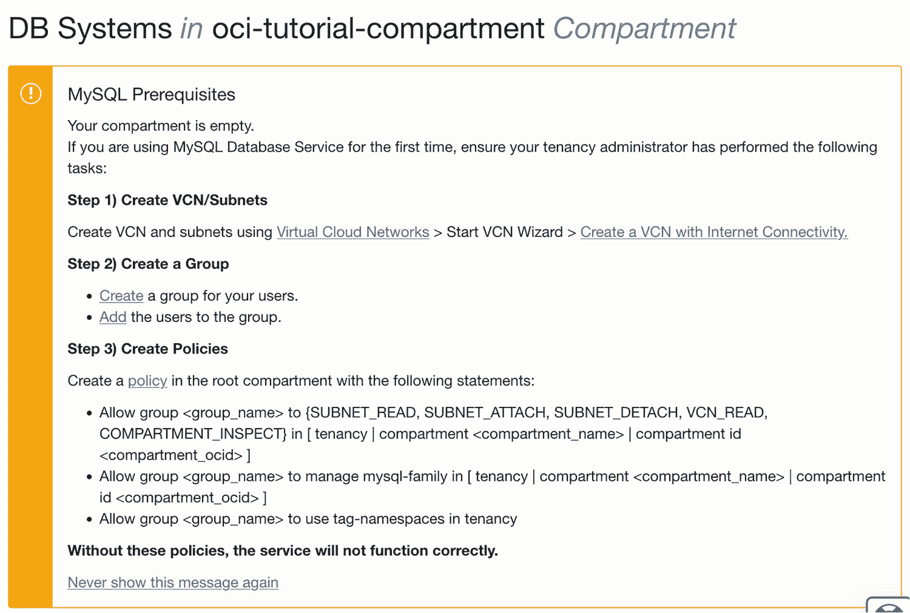

一个横幅显示了 MySQL 先决条件。提到了租户管理员执行该任务的 3 个步骤。可以找到用于创建或将用户添加到组的几个超链接。

图 4-1：首次使用 MDS 时的横幅

1.  您必须拥有一个虚拟云网络 (VCN) 来放置您的 MySQL 资源。
2.  您必须创建一个用户组并向该组添加至少一个用户。
3.  您必须创建一个策略，允许该组拥有使用 MDS 和 DB 系统的某些权限。

如果您不具备所有这些条件，您可能无法部署 DB 系统。有趣的是，OCI 在 MDS 资源页面顶部生成了一个横幅，如图 4-1 所示。

请注意，它概述了所有三个步骤以及您需要通过根 compartment 上的策略授予的权限。另外，请注意横幅底部有一个关闭通知的链接。建议您在首次成功部署 DB 系统之前不要关闭该横幅。

让我们逐步完成所有三个步骤，并演示如何满足每一步的要求。请务必首先访问 `cloud.oracle.com` 登录您的 OCI 账户。

**注意：** 在接下来的内容中，我们将省略显示菜单选择和类似基本操作的图片，因为我们在第 2 章中已经进行了足够的练习。


### 步骤 1：创建虚拟云网络

由于我们已经在第 2 章中创建了一个虚拟云网络 (`oci-tutorial-vcn`)，我们将继续使用它。如果你想创建另一个，也可以操作。同样地，如果你已经终止了该虚拟云网络，则需要重新创建它。只需按照第 2 章的演示，使用相同的设置创建一个虚拟云网络（使用不同的名称）。简而言之，你需要在云控制台中打开主菜单，然后选择 `网络`，接着选择 `虚拟云网络`，然后点击 `启动虚拟云网络向导` 按钮来开始此过程。

### 步骤 2：创建用户组

接下来的步骤是我们见过的。在 OCI 中，你可以创建用户和用户组，将用户归入组中，以便设置安全策略。OCI 要求你为使用 MDS 创建一个用户组和一个用户。

在本教程中，我们将创建一个包含单个用户的示例用户组。我们将用户组命名为 `mysql-users`，用户名为 `mysqladmin`。名称并非至关重要，但为它们取一个能暗示其用途的名字是好的。这涉及两个步骤。首先，我们将创建用户组，然后将用户添加到该组中。

#### 创建用户组

用户组在域中创建。没有直接的云控制台菜单能带你直达用户组的资源页面；要创建用户组，你必须先打开当前（默认）域的资源页面。为此，请打开云控制台中的主菜单，然后选择 `身份与安全`，接着点击 `域`。你将看到如图 4-2 所示的域资源页面。

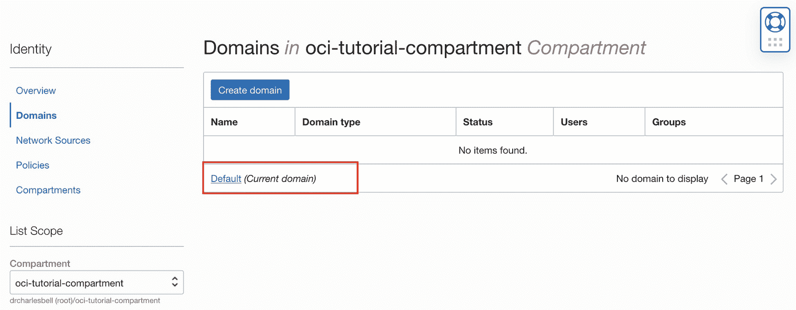

OCI 教程 compartment 中的一个域资源页面，右侧显示默认域为当前域。左侧，在“身份”下，选择了“域”。

图 4-2

域资源页面

要打开域详情页，只需选择如图所示的“默认”标签。在“默认”域详情页上，点击左侧“身份”菜单中的 `组`，如图 4-3 所示。

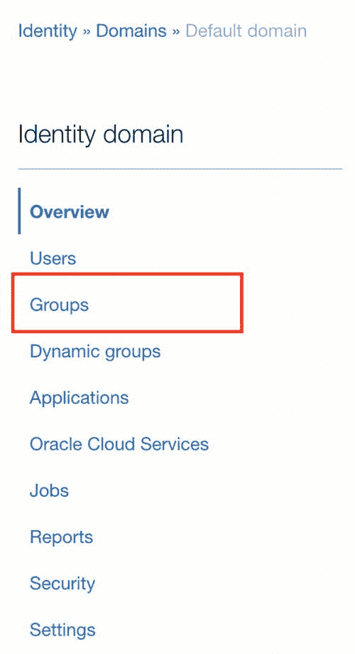

云控制台中的身份域菜单列出了概览、用户、组、动态组、应用程序、作业等。其中，“组”选项在一个红色矩形框内高亮显示。

图 4-3

默认域详情页

此时，我们将看到该域的用户组列表。在列表顶部，点击 `创建组` 按钮以开始创建用户组的流程，如图 4-4 所示。

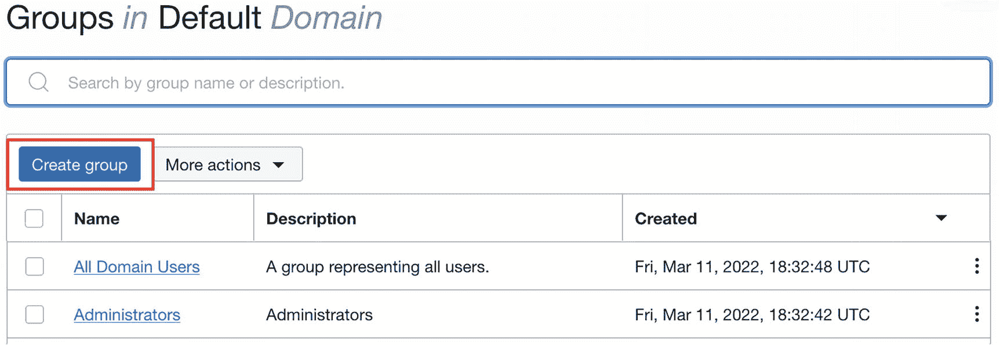

一个表格显示了用户组列表：所有域用户和管理员。左上角的“创建组”被高亮以供选择。

图 4-4

用户组列表（默认域）

在“创建组”对话框中，我们至少需要输入以下信息：

*   `名称`：为用户组选择一个唯一的名称。名称长度必须在 1 到 100 个字符之间。
*   `描述`：输入一个说明该用户组用途的描述。
*   `标签`（可选）：你可以为资源分配一个或多个短文本字符串。你不应存储关键信息或机密信息。

提示

OCI 中允许的名称包含以下字符：小写字母 `a`-`z`、大写字母 `A`-`Z`、`0`-`9`、句点 (`.`)、短横线 (`-`) 和下划线 (`_`)。不允许使用空格。

如果你要跟着操作，我们将使用 `mysql-users` 作为用户组名称，描述为 “`使用 MySQL 数据库系统的用户`”，如图 4-5 所示。我们将不使用标签。

注意

如果你暂时不想创建新用户，可以使用你的根用户账户。只需在创建用户组时勾选根用户账户，即可将其添加到该组中。

准备就绪后，点击 `创建` 按钮，如下所示。

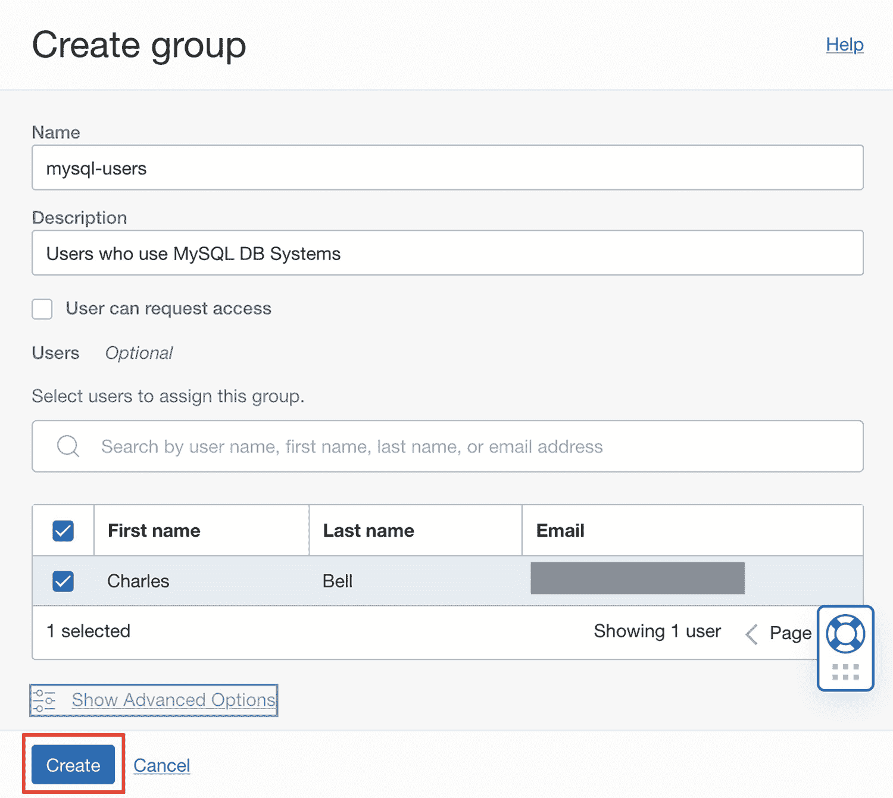

一个用于创建组的对话框，包含名称、描述、请求用户访问权限以及一个用于列出名字、姓氏和电子邮件地址的表格。底部的“创建”按钮被高亮显示。

图 4-5

创建组对话框

创建用户组只需片刻时间。完成后，你将被重定向到组详情页，如图 4-6 所示。你可以使用 `编辑组` 按钮来编辑用户组和更改参数。你也可以使用 `删除` 按钮（这是与界面中其他地方使用的“终止”一词少见的区别）来删除该用户组。

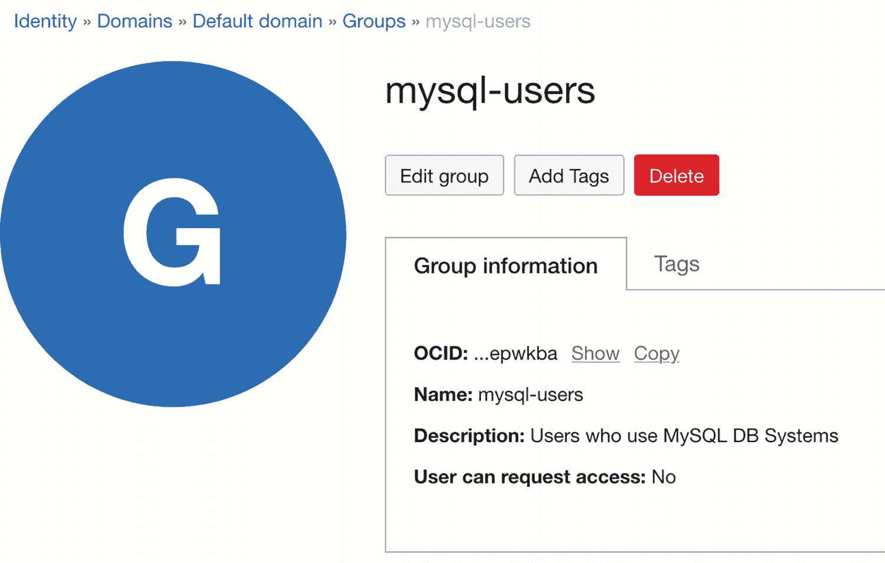

一个页面在右侧显示了已创建组的详细信息。提供“编辑组”和“添加标签”选项。左侧有一个内部写有字母 G 的蓝色圆圈。

图 4-6

组详情页

现在我们有了用户组，可以创建一个用户并将其添加到该组中。如果你决定将根用户添加到组中，这一步可能是可选的。


## 创建用户并将其添加到组

即使您是唯一使用 OCI 账户的人，创建新用户也是一个良好的实践，因为这样您可以测试用户如何与您的资源进行交互。这不仅确保您创建的用户能够执行应用程序或使用资源，还能确保您的安全策略定义正确。

本节中，我们将创建一个新用户并将其添加到组中。您需要输入名称、用户名以及一个有效的电子邮件地址。电子邮件地址是必需信息之一，因为 OCI 将通过电子邮件向用户发送一个链接来设置用户账户密码，这与您的根账户收到通知的方式非常相似。

要创建用户，您需要导航回 **Default** 域详情页面。回想一下，您可以通过使用云控制台菜单选择 **Identity & Security**，然后单击 **Domains**，在 Domains 资源页面上选择 **Default** 域来访问此页面。更多详情请参考上文相关章节。

回到 **Default** 域详情页面后，单击左侧菜单中的 **Users** 项，然后在用户列表中单击 **Create user** 按钮，如图 4-7 所示。

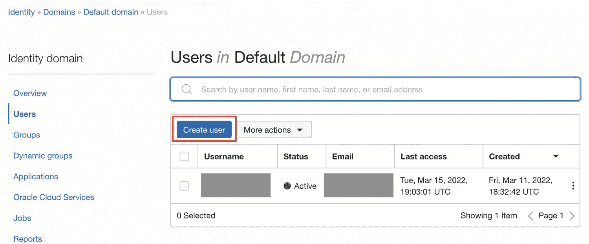

*图 4-7：用户列表（默认域详情页面）*

接下来，我们将创建一个名为 `Joe User` 的新用户并提供一个有效的电子邮件地址。该对话框允许您使用电子邮件地址作为用户名，但您也可以使用自定义用户名。为此，请取消选中 **Use the email address as username** 复选框，以便输入 `joeuser` 作为用户名。请务必检查您输入的电子邮件地址是否有效。提示：您可以在此处使用自己的电子邮件地址。这就是为什么我们将登录方式改为使用用户名而不是电子邮件地址。很聪明吧。图 4-8 显示了填入数据后的创建用户对话框。

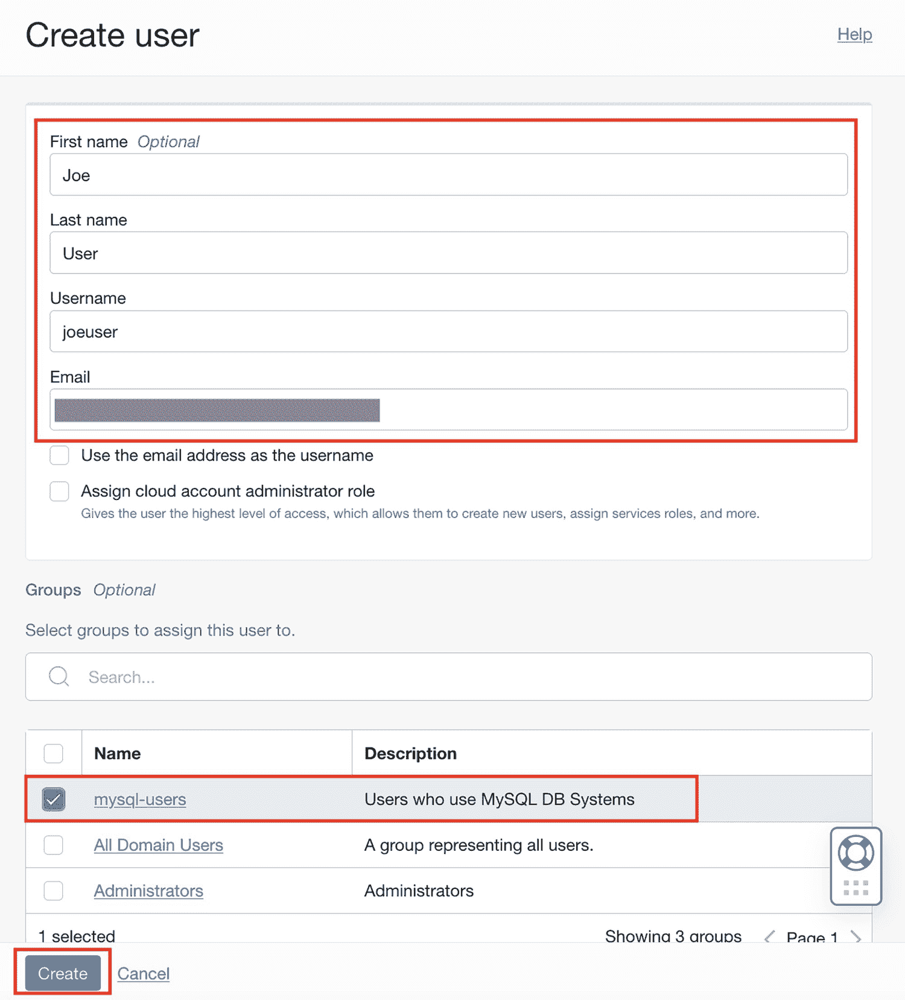

*图 4-8：创建用户对话框*

请注意，我们还可以在同一操作中将用户添加到组！这里，我们只需选择我们之前创建的组 (`mysql-users`)。准备好后，单击 **Create** 按钮以创建用户。一封电子邮件将发送到您提供的电子邮件地址，允许您为新用户设置密码。如果您当前以根账户登录，则必须先注销该账户，然后才能设置/重置密码。

> **注意**：当您尝试创建 MySQL DB 系统时，要以新用户身份登录，您需要注销根账户，然后使用新用户账户重新登录。

现在我们已经创建了组和新用户，我们只需要使用安全策略向该组授予某些权限。

### 步骤三：创建策略

最后，我们需要一个安全策略，向组授予某些权限，以便用户可以访问和使用 MySQL 资源。有几种方法可以做到这一点，包括使用云控制台界面来构建我们需要的特定命令，或者我们可以手动输入命令。在本例中，我们将使用手动选项。

为了满足 MDS 的要求，我们需要为该组分配以下权限：

*   `SUBNET_READ, SUBNET_ATTACH, SUBNET_DETACH, VCN_READ, COMPARTMENT_INSPECT`：允许组操作子网和 VCN
*   `manage mysql-family`：允许组管理 MySQL 资源
*   `use tag-namespaces`：允许组在租户中使用标签命名空间

我们将使用 `Allow` 权限语句来授予这些权限，这允许您将权限应用于租户本身或特定 compartment。由于我们将使用 `oci-tutorial-compartment`，我们将在语句中使用该值。但是，最后一个权限是应用于租户的。

让我们看看如何做到这一点。要创建安全策略，请单击云控制台主菜单，选择 **Identity & Security**，然后单击 **Policies**。这将打开 Policies 资源页面，如图 4-9 所示。要创建新策略，请单击 **Create Policy** 按钮。

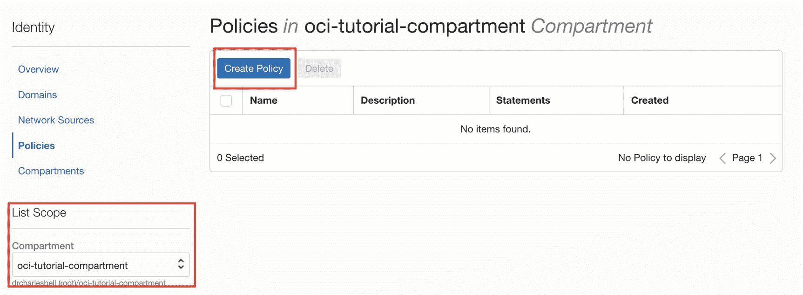

*图 4-9：策略资源页面*

安全策略是在根 compartment 中创建的。您可能在列表范围中选择了 `oci-tutorial-compartment`，但这没关系。我们可以在下一个页面中选择 compartment。

创建策略时需要提供以下信息。如果您是跟随操作，以下显示了每个数据项的示例条目：

*   名称：策略的名称。使用 `mysql-users-policy`。
*   描述：对该策略提供内容的简短描述。使用 `Allow users to access MySQL DB Systems`。
*   Compartment：务必选择您的根 compartment。

我们还需要提供如上所述的策略语句。我们需要的语句格式由 OCI 之前提供的横幅给出。在本例中，以下是建议的策略语句。请注意 `[..|..]` 的使用，这表示我们有一组参数可供选择。在适用的情况下，我们将使用 `compartment_name` 选项（我们移除其他选项和方括号）。这些语句经过人工格式化以便阅读：

```
Allow group <group_name> to
{SUBNET_READ, SUBNET_ATTACH, SUBNET_DETACH, VCN_READ, COMPARTMENT_INSPECT}
in [
tenancy |
compartment <compartment_name> |
compartment id <compartment_OCID>
]
Allow group <group_name> to manage mysql-family in [
tenancy |
compartment <compartment_name> |
compartment id <compartment_OCID>
]
Allow group <group_name> to use tag-namespaces in tenancy
```

我们可以用 `mysql-users` 替换 `<group_name>`，用 `oci-tutorial-compartment` 替换 `<compartment_name>`，如下所示，再次格式化以便阅读：

```
Allow group mysql-users to
{SUBNET_READ, SUBNET_ATTACH, SUBNET_DETACH, VCN_READ, COMPARTMENT_INSPECT}
in compartment oci-tutorial-compartment
Allow group mysql-users to manage mysql-family
in compartment oci-tutorial-compartment
Allow group mysql-users to use tag-namespaces in tenancy
```

要将它们添加到“创建策略”对话框中，您需要单击开关 **Shown manual editor** 以获取一个文本框来粘贴这些语句。

图 4-10 显示了填入数据后的“创建策略”对话框。请务必仔细检查所有内容，包括选择您的根 compartment，然后单击 **Create** 按钮以创建策略。

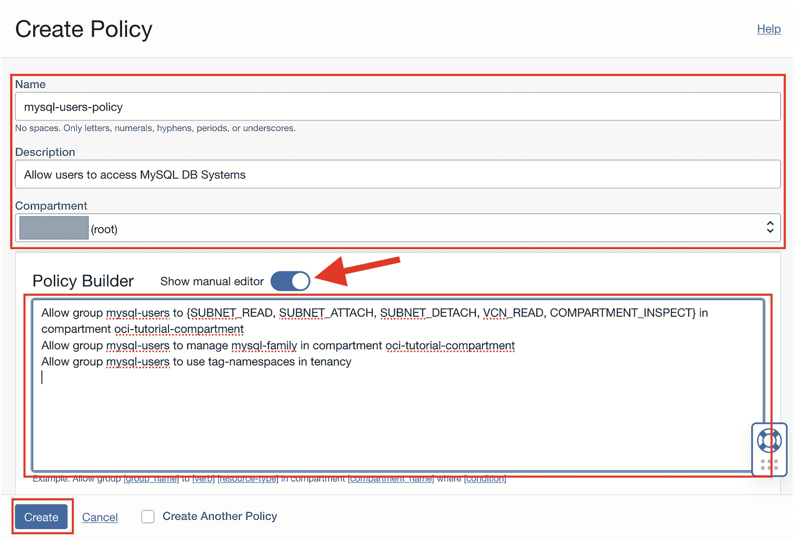


一个用于创建策略的对话框，其中已输入`名称`、`描述`和` compartments`数据。下方显示了带有“显示手动编辑器”选项的策略构建器。“创建”按钮位于左下角。

**图 4-10**  
创建策略对话框

**注意**  
如果你未选择你的根 compartment，可能会在对话框底部看到一个红色横幅，显示一条有些晦涩的错误信息，提示该 compartment 不存在。如果发生这种情况，请仔细检查你的 compartment 选择，然后重试创建。

策略创建后，你将被定向到“策略详情”页面，如图 4-11 所示。请注意，你可以使用“编辑策略”按钮编辑策略，或使用“删除”按钮将其删除。

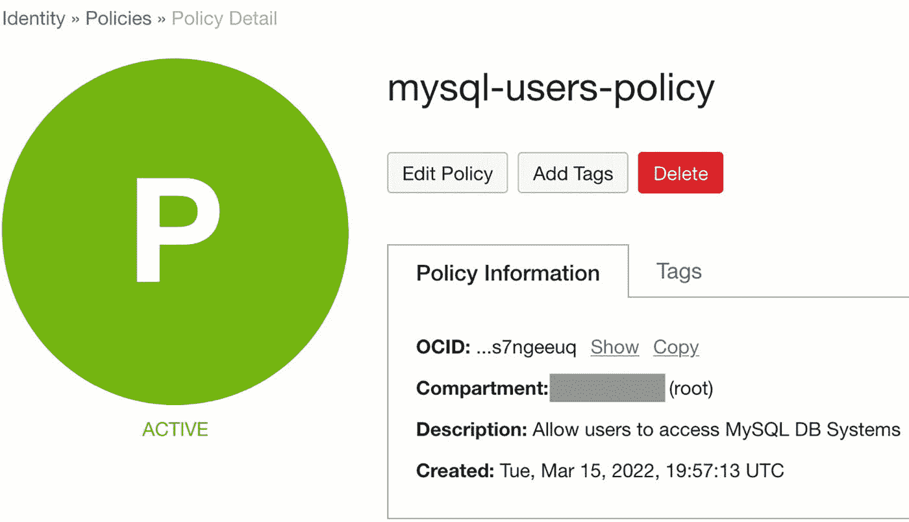

一个页面在右侧显示已创建策略的详细信息。提供编辑策略、删除和添加标签的选项。左侧有一个带有字母`P`的绿色圆圈。

**图 4-11**  
策略详情页

好了，现在我们已经完成了所有三个先决条件，是时候参观一下 MDS 并学习如何创建我们的第一个 DB 系统了。

## MDS 概览

现在本书进行到这里，大多数人渴望看到实际操作——在 OCI 中使用 MDS。我们将从一个简单的示例开始，探索创建和了解 DB 系统的细微差别，然后再转向 MDS 的高级功能。

对于某些人来说，可能不太清楚 MDS 与 DB 系统之间的区别。MDS 是 OCI 的平台即服务（PaaS），而 DB 系统是该服务中可用的资源之一。MySQL 服务菜单在云控制台菜单中的显示如图 4-12 所示。随着 MDS 的不断成熟，你可能会看到更多资源出现在 MySQL 菜单下。

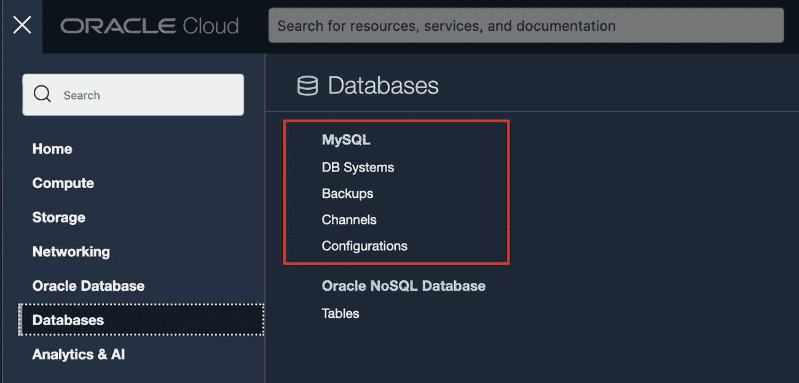

Oracle Cloud 中的一个菜单，选择了“数据库”选项。右侧显示数据库。在其下方，一个框内选中了 MySQL、DB 系统、备份、通道和配置。

**图 4-12**  
MySQL 服务菜单（云控制台）

请注意，我们在 MySQL 菜单下看到有四个资源。以下是对它们的简要概述：

- `DB 系统`：完全托管的 MySQL 服务器资源
- `备份`：对 DB 系统进行的备份
- `通道`：由入站或出站复制通道组成的复制资源。入站通道允许在 MySQL 源和 DB 系统之间进行异步复制。出站通道允许将 DB 系统数据库异步复制到 MySQL 副本。
- `配置`：定义 DB 系统操作的用户、系统、初始化或服务特定变量的集合。列表包含许多预定义配置，但你也可以创建自己的配置。

我们将在接下来的章节中看到 MDS 的所有功能。现在，让我们看一个创建我们的第一个 DB 系统的教程。

**注意**  
如果你尚未满足创建 DB 系统的先决条件，请先返回并完成那些步骤。

## 创建你的第一个 DB 系统

此时，我们应该已经设置好我们的 OCI 账户，以及一个虚拟云网络（`oci-tutorial-vcn`）、一个 compartments 资源（`oci-tutorial-compartment`）、一个新用户（`joeuser`）、一个该用户被分配到的用户组（`mysql-users`），以及一个允许用户创建和使用 MDS 资源的策略（`mysql-users-policy`）。如果你没有全部准备好，请务必回顾前面的章节以获取更多细节。

创建 DB 系统有很多需要学习的东西和几个步骤。一旦你学会了，其实相当容易，但与之前引导你完成最小步骤的教程不同，本教程将逐步进行，并学习更多关于在每个 OCI 云控制台上可用的功能。所以，这个教程可能需要一些时间才能完成，但为了学习你能用 DB 系统做什么，这是值得的。

### 打开 DB 系统资源页面

我们将使用云控制台中的 MySQL 菜单来创建 DB 系统。只需打开云控制台菜单，选择`数据库`，然后在`MySQL`菜单下点击`DB 系统`。这将打开 DB 系统资源页面，如图 4-13 所示。

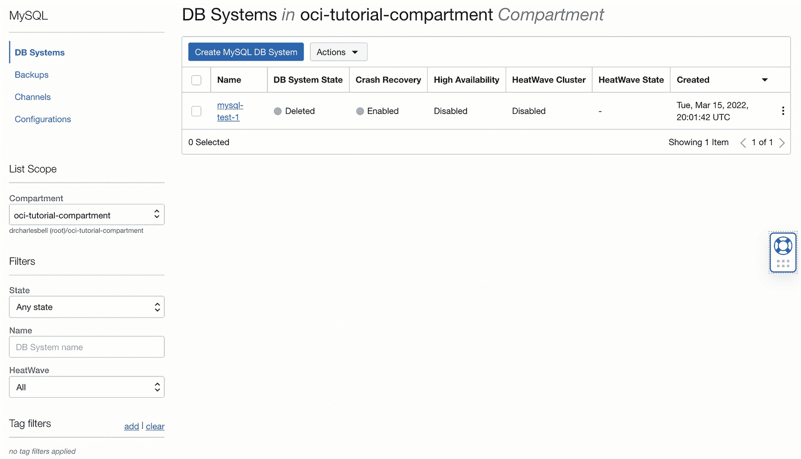

一个页面在右侧显示了 o c i tutorial compartment 中的 D B 系统。创建 MySQL 数据库系统按钮和标记为 mysql test 1 的已创建数据库表位于右侧。

**图 4-13**  
DB 系统资源页面

我们在右侧看到我们已创建的 DB 系统列表（`...中的 DB 系统`）及其状态，包括 DB 系统、崩溃恢复、高可用性和 HeatWave 的状态，以及资源创建的日期和时间。

请注意`...中的 DB 系统`列表上方的按钮。我们有一个`创建 DB 系统`按钮和一个`操作`下拉菜单。在`操作`下拉菜单上，你可以对列表中选中的任何 DB 系统执行操作。这些操作包括：

- `停止`：停止 DB 系统
- `启动`：启动 DB 系统
- `重启`：停止然后启动 DB 系统
- `创建手动备份`：创建 DB 系统的备份
- `应用标签`：向资源应用一个或多个标签
- `删除`：删除（终止）DB 系统

如你所见，这是一个功能强大的菜单，对于处理多个 DB 系统来说非常方便。幸运的是，`操作`下拉菜单是 OCI 云控制台资源页面列表中的常见功能。具体操作可能不同，但概念是相同的。

还要注意，这里有一个 DB 系统已被终止（`已删除`）。已终止的 DB 系统将在列表中保留几天，直到所有资源都被清除（例如，块卷不会立即销毁）。

在页面左侧，我们看到重复的`MySQL`菜单。我们可以通过点击我们想要查看的标签，使用它在 MySQL 资源之间导航。在左侧下方，是我们之前见过的`列表范围`列表，我们可以在其中选择 compartment 来筛选 DB 系统列表。

左下角是一个特殊的`筛选器`部分，我们可以通过选择特定状态、名称，甚至在 HeatWave 条目中选择（我们将在第 8 章了解更多关于 HeatWave 的信息）来进一步筛选列表。

最后，在底部是一个标签筛选器，如果我们使用了标签，可以进一步筛选列表，仅显示具有那些标签的 DB 系统。

这三种筛选机制在所有提供列表的 OCI 云控制台页面中都很常见。某些资源的筛选选项可能有所不同，但所有资源页面都允许你筛选列表。很好。


### 创建数据库系统

让我们开始创建一个数据库系统。创建数据库系统的对话框很长，因此我们将分部分介绍。我们需要提供的信息包括：

*   *名称*：数据库系统的名称。
*   *描述*（可选）：为您自己提供一个描述来解释数据库系统，例如其创建原因、分配到的项目等。您应避免在描述中包含任何机密数据。
*   *数据库系统类型*：您可以选择独立（无高可用性）、启用高可用性和 HeatWave 数据库系统。我们将在第 7 章中了解更多关于高可用性功能的信息，在第 8 章中了解 HeatWave。
*   *管理员*：您需要指定 MySQL 管理员用户帐户和密码。
*   *网络*：您需要为数据库系统选择 VCN 和子网。
*   *可用性域*（放置位置）：选择可用性域。
*   *硬件*：选择数据存储（块卷）的形状和大小。
*   *备份计划*：您可以选择开启自动备份。

我们将引导您完成所有这些数据的填写，并展示如何为一个位于 `oci-tutorial-compartment` 中、没有自动备份的独立数据库系统完成每一项设置。在数据库系统资源页面的“数据库系统位于…”列表中，点击 *创建数据库系统* 按钮来创建数据库系统。

> **提示**
>
> 注意在创建对话框中有几个带下划线的短语。这些是指向文档的链接，您可以使用它们来了解更多细节。您应该考虑花时间探索这些链接，以便更熟悉数据库系统的细节。

我们将从顶部底部分部分检查对话框。您可以向下滚动查看创建数据库系统对话框的其他部分。图 4-14 显示了第一个部分，它要求填写 compartment、名称和描述。请务必在“在 compartment 中创建”下拉列表中选择 `oci-tutorial-compartment`，并使用名称 `mysql-test-1`。如果您愿意，可以填写描述。

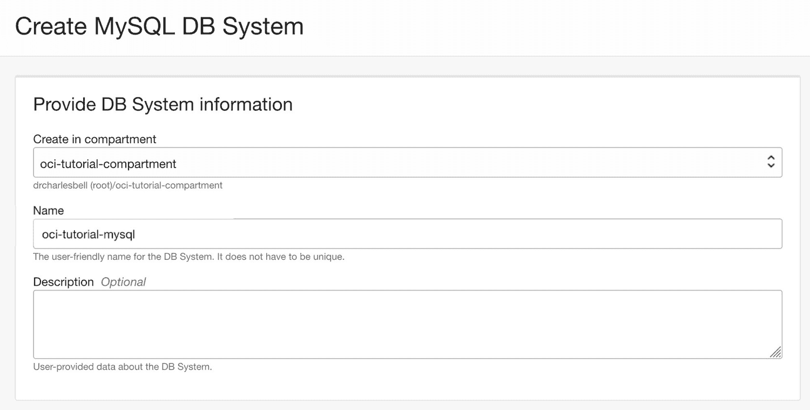
*图 4-14 创建数据库系统（第 1 部分）*

向下滚动到下一个部分，它要求填写数据库系统的类型和 MySQL 管理员凭据。为数据库系统类型选择 *独立* 选项，使用 `mysql_admin` 作为用户名并提供一个密码。请务必遵循密码限制，并再次输入密码进行验证。图 4-15 显示了已选择和输入数据的部分。

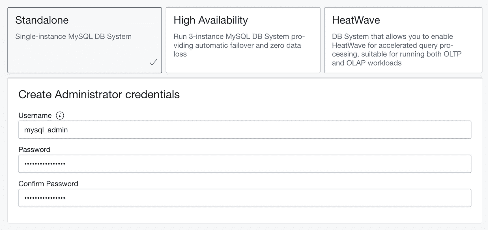
*图 4-15 创建数据库系统（第 2 部分）*

一旦添加了这些信息，向下滚动到下一个部分，即 *配置网络* 部分，如图 4-16 所示。在这里，我们希望确保在“虚拟云网络位于 oci-tutorial-compartment”列表中选择了 `oci-tutorial-vcn`，并且在“子网位于 oci-tutorial-compartment”列表中选择了 `Private Subnet oci-tutorial-vcn (Regional)` 条目。如果您看不到这些条目，可以使用“更改 Compartment”链接来更改 compartment。

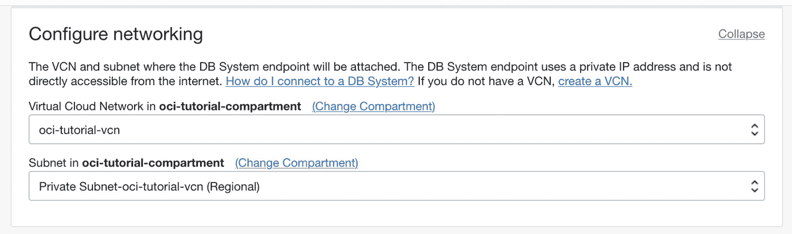
*图 4-16 创建数据库系统（第 3 部分）*

一旦您验证了这些条目，向下滚动到下一节，即可用性域的放置位置。在这里，选择哪个可用性域并不重要，但既然我们迄今为止一直使用 *AD-2*，请继续选择它，如图 4-17 所示。

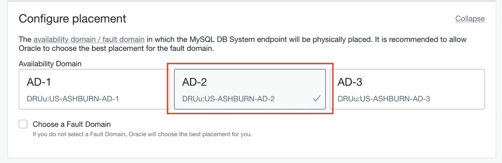
*图 4-17 创建数据库系统（第 4 部分）*

选择了 AD-2 后，向下滚动到下一节，即 *配置硬件* 部分。在这里，我们可以选择更改形状以及更改数据存储的大小，如图 4-18 所示。由于我们是在练习创建数据库系统，我们将使用如图所示的默认值。在这种情况下，它是一个小型的虚拟机形状，具有 8 GB RAM 和附加的 50 GB 块存储用于数据。正如您所推测的，创建和配置数据库系统的过程包括配置块卷、附加、连接并将块卷挂载到某个文件夹。

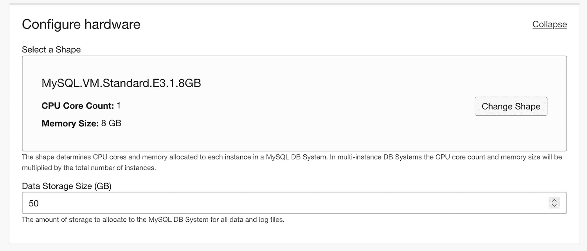
*图 4-18 创建数据库系统（第 5 部分）*

向下滚动到下一节，通过选择备份计划来选择自动备份。备份计划简单来说就是备份的频率和类型。我们将在第 5 章中了解更多关于备份的信息。目前，我们可以关闭备份功能，如图 4-18 所示。我们不需要备份，因为我们不会创建任何数据，也不会出于任何保留目的配置数据库。当您确认输入的数据后，点击 *创建* 按钮来创建数据库系统。这将引导您进入数据库系统详细信息页面。

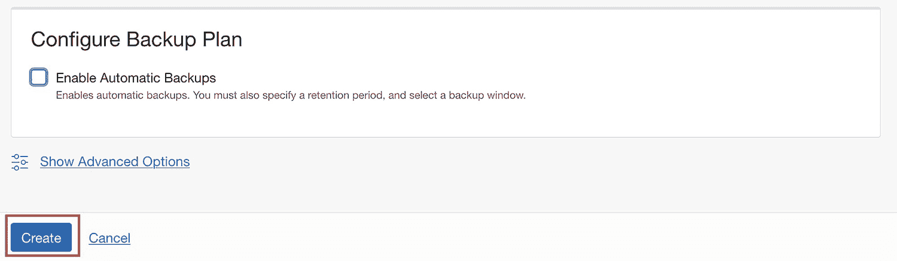
*图 4-19 创建数据库系统（第 6 部分）*

点击按钮后，数据库系统的创建、设置和配置过程将开始，`创建数据库系统` 工作请求（也称为工作流）将启动。这可能需要一段时间，所以如果没有立即发生任何事情或您认为它可能卡住了，请不要惊慌。就像我们在其他资源中看到的那样，一旦开始创建，您将被定向到资源详细信息页面。在这种情况下，您应该会看到类似于图 4-20 的数据库系统详细信息页面。请注意，数据库系统仍处于 `正在创建` 状态。

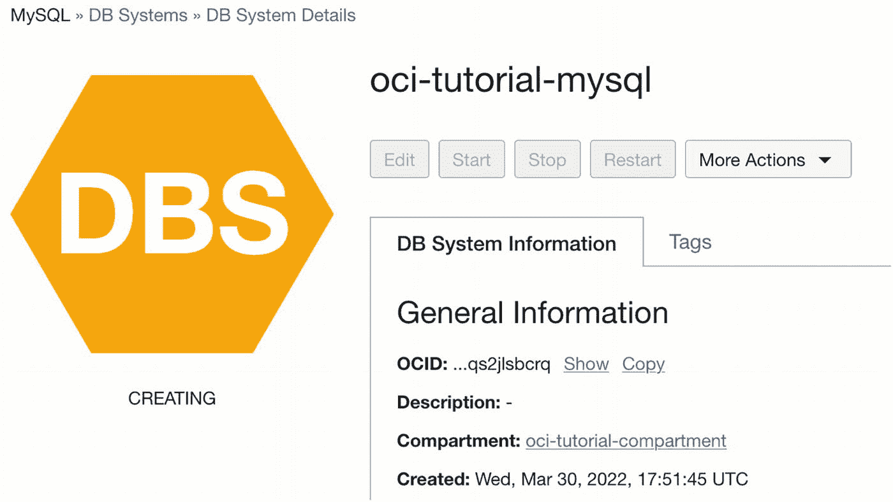
*图 4-20 数据库系统详细信息页面（正在创建）*

您可以通过向下滚动到 *资源* 菜单，然后点击 *工作请求* 以查看 *工作请求* 部分（如图 4-21 所示）来检查初始配置数据库系统的工作流状态。在这里，我们可以看到所有已运行或正在运行的工作请求（工作流）。如您所见，初始工作流仍在运行，并且可能会持续一段时间。

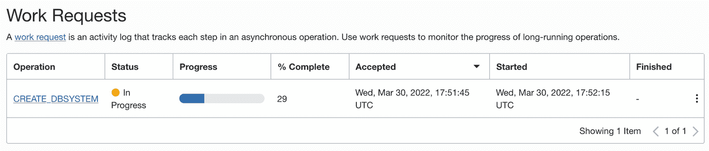
*图 4-21 数据库系统详细信息页面（工作请求列表）*


工作流完成后，数据库系统的图标将变为绿色，状态将更改为 `ACTIVE`，并且工作流将显示为完成。此过程可能需要几分钟才能完成。让我们进一步了解数据库系统详情页面。

### 数据库系统详情页面

这是一个更仔细查看数据库系统详情页面的好机会。图 4-22 展示了我们将要探索的各个部分的地图。您可能在其他资源页面中见过其中一些部分，因此布局应该不足为奇。我们不会逐一详述每个部分的所有细节，而是花些时间了解每个部分的功能以及可为您提供哪些数据。

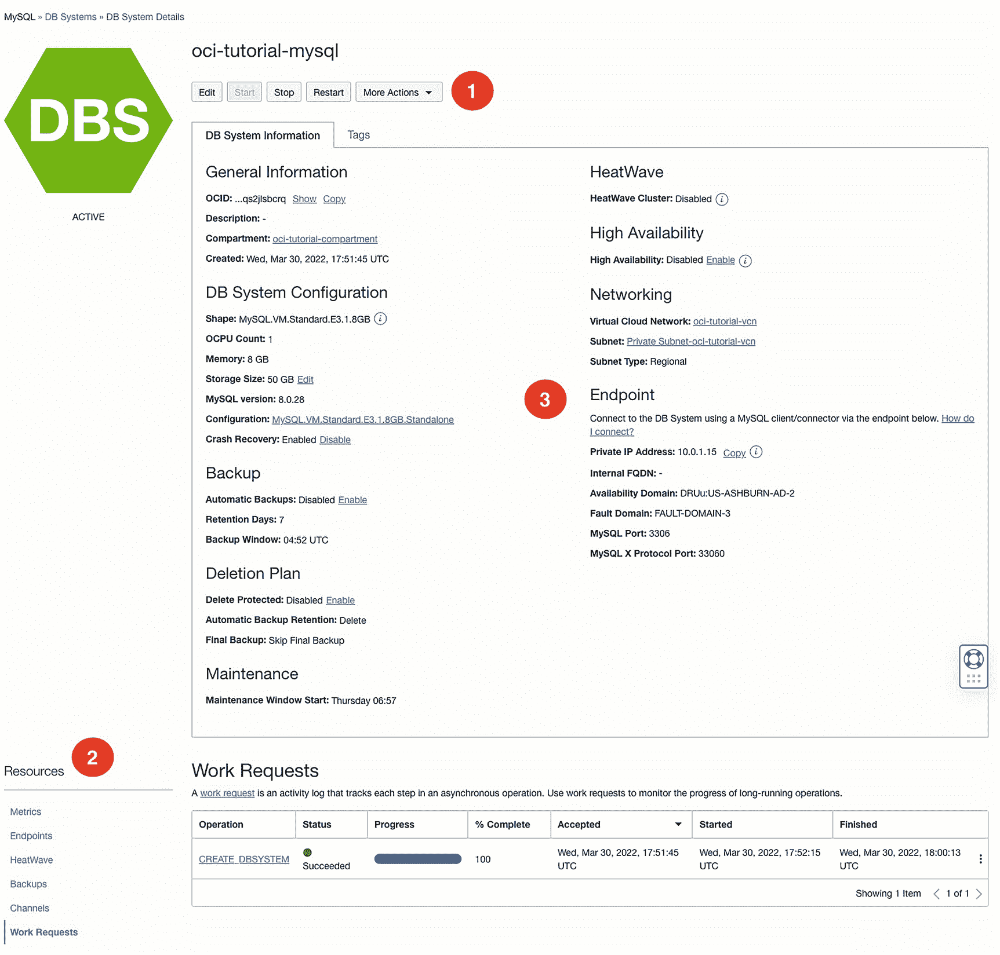

页面显示 o c i 教程 my s q l 的数据库系统详情，包括常规信息、数据库系统配置、备份、删除计划等。下表显示了工作请求。

图 4-22

数据库系统详情页面（功能图）

图中标识了三个区域。这些区域包括以下内容。我们将在后续章节中更详细地查看每个部分。列表中的编号对应于图中的编号点：

1.  状态与按钮
2.  资源菜单
3.  数据库系统信息与标签

#### 状态与按钮

详情页面的状态与按钮部分与其他 OCI 资源详情页面类似。即，左侧是一个图标，通过颜色和图标下方写的状态值来描述资源的状态。图标右侧是一组用于数据库系统常见操作的按钮，如图 4-23 所示。

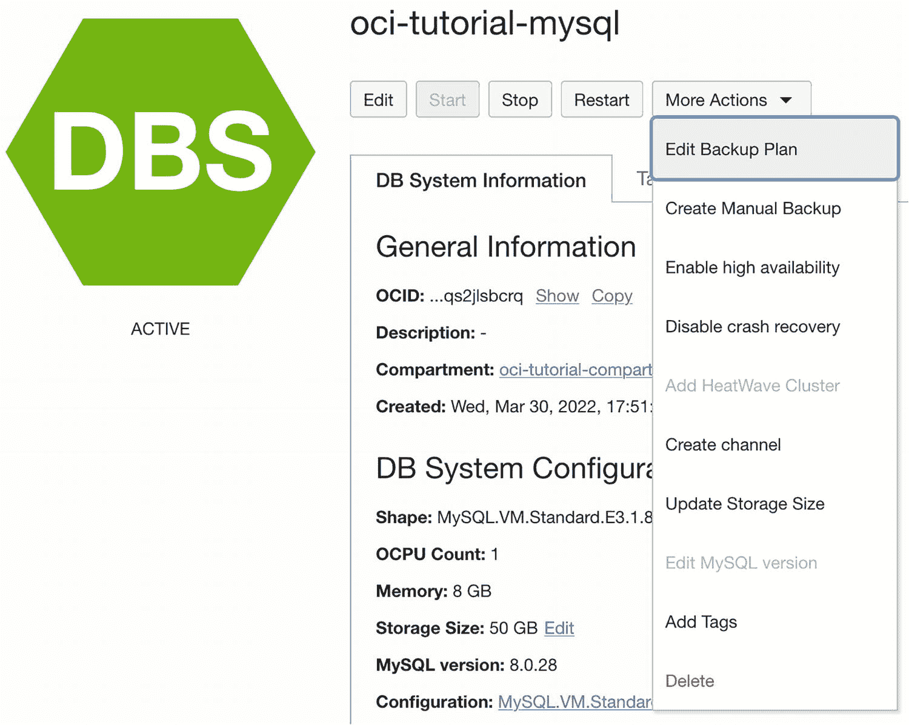

页面显示 o c i 教程 my s q l 的数据库系统详情，包括常规信息和数据库系统配置。右上角的更多操作按钮显示删除、添加标签等操作。

图 4-23

状态与按钮，操作菜单

数据库系统可能有几种状态。表 4-1 显示了状态列表以及图标的颜色。

表 4-1

数据库系统状态与图标颜色

| 图标颜色 | 状态 | 描述 |
| --- | --- | --- |
| 灰色 | `INACTIVE` | 数据库系统已通过控制台或 API 中的停止或重启操作关闭。 |
| 红色 | `DELETED` | 数据库系统已被删除且不再可用。 |
|  | `FAILED` | 错误情况阻止了数据库系统的创建或持续运行。 |
| 黄色 | `CREATING` | 数据库系统正在预留资源、启动并创建初始数据库。配置可能需要几分钟。您尚不能使用该系统。 |
|  | `UPDATING` | 数据库系统正在启动、停止、重启或更新与数据库系统关联的复制通道。 |
|  | `DELETING` | 数据库系统正在通过控制台或 API 中的终止操作被删除。 |
| 绿色 | `ACTIVE` | 数据库系统已成功创建。 |

按钮用于执行以下操作：

*   `编辑`：对于活动的数据库系统，更改其名称和描述。对于非活动的数据库系统，可以更改其配置形状。
*   `启动`：启动已停止或非活动的数据库系统。请注意，对于活动的数据库系统，此按钮呈灰色（不可操作）。
*   `停止`：停止活动的数据库系统。
*   `重启`：停止然后启动数据库系统。
*   `更多操作`：对数据库系统执行资源特定的操作。

如果您正在按照本教程操作并希望稍后停止以完成本章，您可能希望停止数据库系统以避免产生任何执行成本。对于非活动的数据库系统，您仍会产生成本，但低于活动状态。要停止数据库系统，请单击 `停止` 按钮，并可选择更改停止类型。系统会提示您选择快速、慢速等选项，但您应选择默认选项。数据库系统停止后，其图标将变为黄色，并显示状态 `INACTIVE`。

`更多操作` 菜单包含以下操作。其中一些操作可能在下一部分定义的各种资源窗格中可用（重复）。例如，您可以在查看现有备份列表时创建新备份。

我们不会在本章中涵盖所有这些操作，将解释留待后续章节。我们将在第 5 章介绍备份操作，在第 7 章介绍高可用性选项，在第 8 章介绍 HeatWave：

*   `编辑备份计划`：启用或禁用自动备份。
*   `创建手动备份`：创建数据库系统的备份。
*   `启用高可用性`：将独立数据库系统更改为启用高可用性的数据库系统。
*   `禁用崩溃恢复`：启用或禁用崩溃恢复。禁用崩溃恢复可以提高性能，但也会关闭自动备份。请谨慎使用。
*   `添加 HeatWave 集群`：向 HeatWave 配置添加另一个集群（仅对启用了 HeatWave 的数据库系统有效）。
*   `创建通道`：创建一个复制通道，用于接受来自另一个源的复制数据。有关此高级主题的更多详细信息，请参见第 7 章。
*   `更新存储大小`：更改 MySQL 数据的存储大小。
*   `编辑 MySQL 版本`：如果数据库系统运行的 MySQL 版本低于 OCI 中可用的版本，您可以选择将数据库系统更新为使用最新版本的 MySQL。
*   `添加标签`：添加一个或多个用户定义的标签，这些标签将显示在 `标签` 选项卡中。
*   `删除`：终止数据库系统并删除其所有资源。

接下来，让我们查看 `资源` 菜单及其选项。

#### 资源菜单

资源菜单用于将详情页面底部部分（窗格）更改为几种资源视图之一，如图 4-24 所示。某些视图包含用于过滤视图的筛选部分。可用于查看和交互的资源包括指标、复制端点、HeatWave 集群、备份、通道和工作请求。我们将在以下部分看到每种资源的示例：

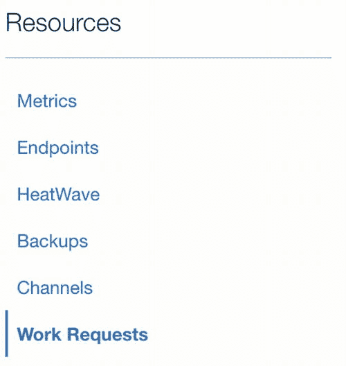

一个资源菜单显示指标、端点、heatwave、备份、通道和工作请求。

图 4-24

资源菜单

##### 指标

诊断性能和相关问题最强大的工具之一是从系统收集的指标。MySQL 包含一长串您可以通过性能模式视图和 MySQL 其他地方监控的内容。然而，其中大部分信息由 OCI 管理。幸运的是，您仍然可以查看许多此类性能指标的图形表示，以及数据库系统重要的 OCI 相关性能指标。

当您单击菜单中的 `指标` 时，您将看到以网格形式显示的各种指标计数器，如图 4-25 所示。这些指标包括连接、语句、CPU、内存、网络延迟、磁盘利用率和备份的指标。

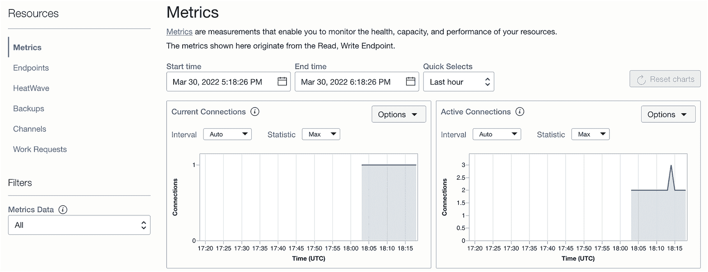

一个窗口显示资源选项卡，其中选择了指标。它显示了 2022 年 3 月 30 日 17:20 至 18:15 期间，当前连接和活动连接随时间变化的 2 个图表。

图 4-25

指标资源窗格（数据库系统）

请注意，指标资源窗格左侧有一个筛选器，可用于显示所有指标或将视图限制为数据库系统或备份。

随着您对数据库系统越来越熟悉并开始在生产环境中使用它们，您可能希望访问此资源窗格以了解您的数据库系统随时间推移的性能表现。


## 端点

端点是数据库系统的连接点。您可以将它们用于高级复制操作（我们将在第 7 章中看到），或者用于从其他进程或系统连接到 MySQL。

当您在菜单中点击 `Endpoints` 时，您将看到已创建的端点列表，如图 4-26 所示。该列表将显示端点的主机名、其状态、IP 地址、MySQL 端口以及操作模式。请注意，在我们教程数据库系统的端点列表中，唯一的条目是您可以用于从 VCN 连接到 MySQL 的 IP 地址。我们将在下一节中看到如何使用此端点。

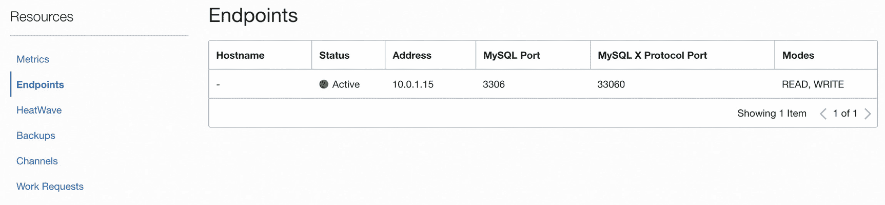

一个窗口显示了资源选项卡，其中选择了端点。它显示了主机名列表，包含状态、IP 地址、MySQL 端口和模式。

图 4-26

端点资源窗格（数据库系统）

## HeatWave

HeatWave 资源窗格用于显示有关 HeatWave 配置中集群的信息。当您在菜单中点击 `HeatWave` 时，您将看到已创建集群的列表。由于我们在创建数据库系统时未启用 HeatWave，我们将看到一条说明此情况的消息，如图 4-27 所示。我们将在第 8 章更详细地介绍 HeatWave。

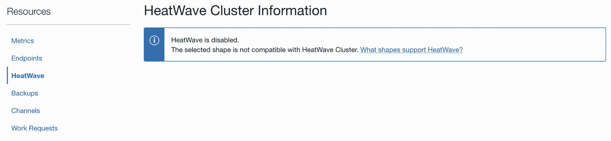

一个窗口显示了资源选项卡，其中选择了 heat wave。它显示了 heat wave 集群信息。

图 4-27

HeatWave 资源窗格（数据库系统）

## 备份

备份是 OCI 中的特殊实体，包含所有数据的备份以及 MySQL 配置。就像为您的电脑备份一样，您可以使用备份将数据库系统恢复到备份时的状态。备份是维护数据完整性的重要工具。我们将在第 5 章更详细地介绍备份。

当您在菜单中点击 `Backups` 时，您将看到适用于该数据库系统的可用备份列表。该列表将显示名称、状态、创建类型（完全、增量）、保留天数、大小以及创建日期，如图 4-28 所示。请注意，此资源窗格包含一个过滤器，可让您按 compartment（范围）过滤列表。

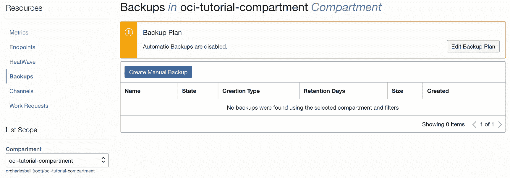

一个窗口显示了资源选项卡，其中选择了备份。它显示了 o c i tutorial compartment 中的备份。自动备份已禁用。下方的表格显示了备份列表。

图 4-28

备份资源窗格（数据库系统）

## 通道

通道用于复制中，以允许数据从/到其他系统（包括数据库系统）传输。我们将在第 7 章了解更多关于通道的信息。

当您在菜单中点击 `Channels` 时，您将看到与该数据库系统关联的通道列表，包括名称、源、目标、状态、详细信息、是否启用以及创建日期。

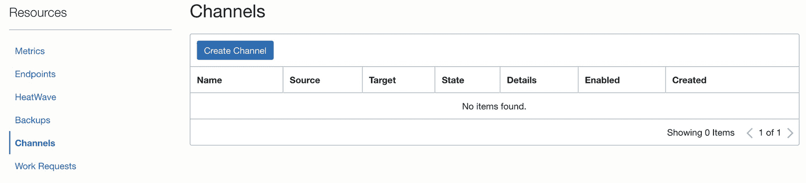

一个窗口显示了资源选项卡，其中选择了通道。表格显示未找到项目。创建通道按钮位于右上角。

图 4-29

通道资源窗格（数据库系统）

## 工作请求

回想一下我们之前创建数据库系统时的情况，工作请求是 OCI 内部运行的一个或多个进程，用于在数据库系统上执行某些操作。这些操作可以包括备份、编辑（更新）数据库系统、停止、重启等。

当您在菜单中点击 `Work Requests` 时，您将看到工作请求列表出现在右侧窗格中，如图 4-30 所示。这将包括所有过去的工作请求以及任何当前活动的请求。该列表显示操作（工作请求名称）、状态、进度条、完成百分比、OCI 接受工作请求的时间、开始日期以及完成日期。

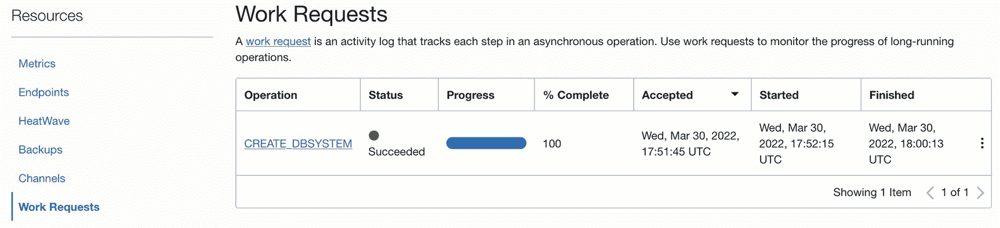

一个窗口显示了资源选项卡，其中选择了工作请求。表格显示了操作创建 d b system 的活动。

图 4-30

工作请求资源窗格（数据库系统）

如果列出了工作请求，您可以在上下文菜单（行右侧垂直堆叠的三个点）上操作以管理工作请求并查看详细信息。

现在，让我们看一下详细信息页面中心显示的数据库系统信息。

## MySQL 数据库系统信息和标签

在数据库系统详细信息页面的中心有两个选项卡：一个用于显示处理数据库系统的关键元数据的 `Information`（信息），另一个用于显示为数据库系统创建的标签或标记（包括系统生成和用户定义的标签）的 `Tags`（标签）。让我们分别看看这些选项卡。


### DB 系统信息标签页

详情页中心的大片区域包含大量重要信息。这些细节被分为以下几个部分进行描述。描述中包含了您可能在某些操作中需要使用的键值或参数。图 4-31 展示了示例数据库系统的摘录，供您对照列表定位所描述的信息。

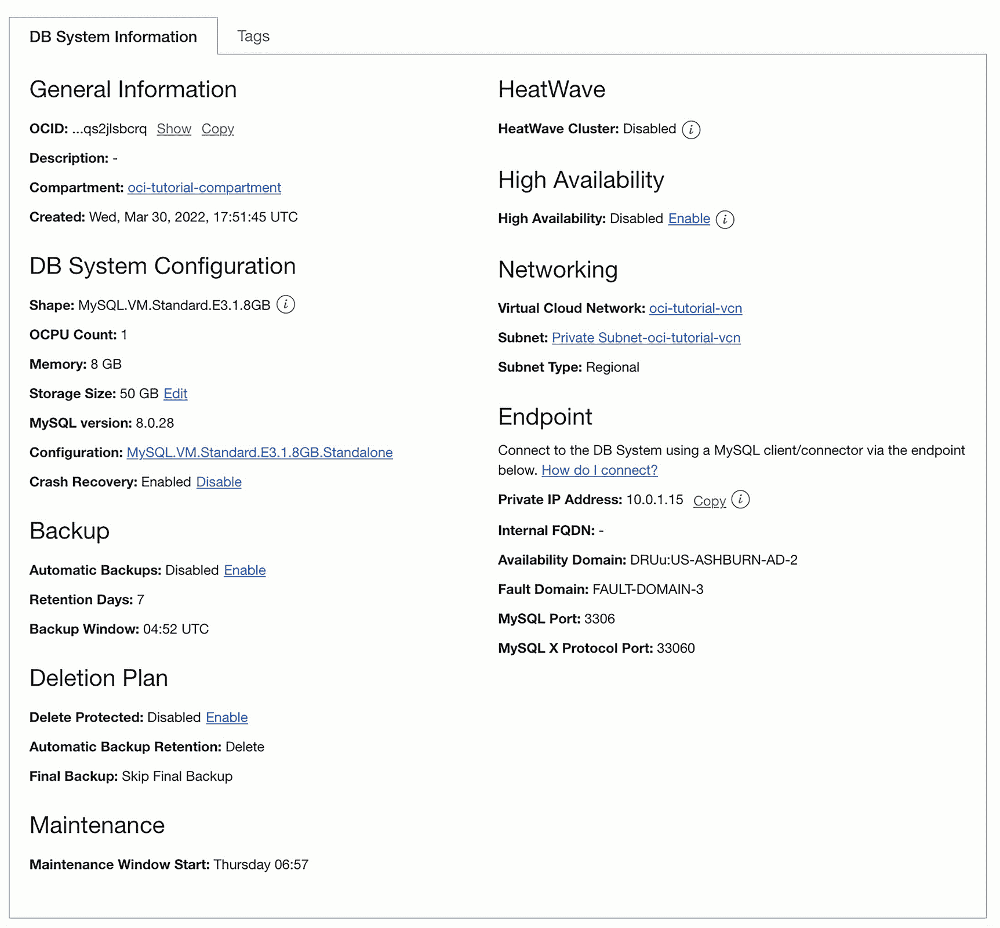

一个 `DB` 系统信息标签页，包含常规信息、`DB` 系统配置、备份、删除计划、维护、Heatwave、高可用性、网络和端点。

图 4-31

DB 系统信息标签页

`DB 系统信息` 标签页按分区显示以下信息。请注意，部分数据以链接形式呈现。这些链接可用于导航到该资源或对象的详情页，或作为运行常见操作的快捷方式。

*   *常规信息*: 显示 `OCID` 及其复制到剪贴板的链接、描述（您创建 `DB 系统` 时提供）、`DB 系统` 所在的 compartment 以及创建日期。`OCID` 是此部分最重要的信息，因为您可能需要在某些高级操作和功能中使用它。

*   *DB 系统配置*: 显示关于 `DB 系统` 的信息，包括其形态、内存和存储大小、MySQL 版本和配置，以及是否启用了崩溃恢复。存储大小旁边的编辑链接是更改 `DB 系统` 存储大小的快捷方式。

*   *备份*: 显示是否启用了自动备份、备份的保留天数以及运行自动备份的时间窗口。启用/禁用链接是启用或禁用自动备份的快捷方式。

*   *删除计划*: 显示 `DB 系统` 的删除计划，包括是否已启用、自动备份的保留时间以及最终备份的状态。启用/禁用链接是启用或禁用删除计划的快捷方式。

*   *维护*: 显示 `MDS` 下一个维护周期的开始时间。这是自动升级和更新将发生的时间。您可以用它来安排或延迟关键操作，以确保应用程序平稳运行。

*   *HeatWave*: 显示关于 `HeatWave` 集群的信息。更多详情请参见 `第 8 章`。

*   *高可用性*: 显示高可用性配置的信息。更多详情请参见 `第 7 章`。

*   *网络*: 显示 `DB 系统` 所连接的 `VCN`、子网和子网类型。连接服务时可能需要参考此信息。

*   *端点*: 显示 `DB 系统` 在 `VCN` 上使用的私有 `IP` 地址、完全限定域名 (`FQDN`)、可用性域、故障域以及配置的 MySQL 端口，并提供了一个有用的链接，指向有关如何连接到 `DB 系统` 的文档。我们将在下一节探讨该主题。您需要从此部分获取的关键信息包括私有 `IP` 地址（使用复制链接将其复制到剪贴板）。在规划连接和其他功能时，一目了然地查看可用性域和故障域也可能很有帮助。

### 标签标签页

接下来是界面的标签页部分，如图 4-32 所示。在这里，我们将看到 `DB 系统` 的所有标签，包括任何 `OCI` 生成的标签以及用户定义的标签。请注意，我们有两个 `OCI` 生成的标签和一个用户定义的标签。您可以通过点击“`Defined Tags`”或“`Free-form Tags`”标签在这些列表之间切换。

您可以使用“`More Actions`”菜单并选择“`Add Tags`”来创建用户定义的标签。请注意，标签名称不允许包含空格或任何不可打印的字符 (`ASCII`)。

请注意图中标签旁边有一个小铅笔图标。如果铅笔图标是启用状态（未灰显），您可以点击它来编辑标签。

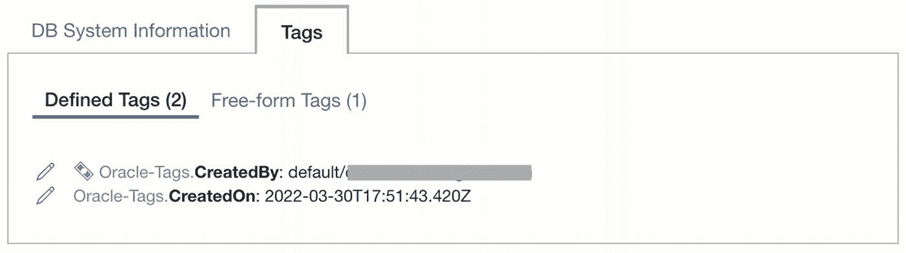

一个对话框，其中显示了从数据库系统中选择的标签。列出了两个已定义的标签。

图 4-32

DB 系统标签标签页

现在，让我们看看 `DB 系统` 最常见的操作：停止和启动。

提示

有关 `DB 系统` 详情页上可用资源和操作的更多详情，请参见 [`https://docs.oracle.com/en-us/iaas/mysql-database/doc/managing-db-system.xhtml`](https://docs.oracle.com/en-us/iaas/mysql-database/doc/managing-db-system.xhtml)。

### 停止和启动 DB 系统

如果您还记得前面讨论的“`More Actions`”菜单，您可以停止和启动 `DB 系统`。如果您在一段时间内不使用或不打算使用 `DB 系统`，停止它可能是个好主意。停止 `DB 系统` 将减轻您账户的费用负担。由于您分配了可计费资源，您仍将被收取少量费用，但您不会为空闲的计算实例付费。如果您计划跟随下一节操作，则无需停止 `DB 系统`。但是，如果您计划稍后再回来，您应该停止 `DB 系统`，并在准备好继续教程时再次启动它。

要停止 `DB 系统`，您可以使用“`More Actions`”按钮菜单选择“`Stop`”。同样地，要启动已停止的 `DB 系统`，您可以使用操作按钮菜单并选择“`Start`”。两项操作都需要一些时间才能完成，但 `DB 系统` 的状态会相应改变，您可以查看工作请求列表以检查其进度。

现在我们已经创建了 `DB 系统`，您可能想知道如何像在 `第 4 章` 中连接安装在 `PC` 上的 MySQL 服务器那样连接到它。正如您将看到的，根据我们的需求，可以使用几种机制。

## 连接到您的 DB 系统

连接到您的 MySQL `DB 系统` 与连接您安装在 `PC` 或本地网络中的 MySQL 服务器不同。回想一下，`DB 系统` 是在 `VCN` 中创建的，更具体地说，是在一个私有子网中。这意味着 `DB 系统` 只能被同样连接到或有权访问该私有子网的机器访问。因此，没有额外的步骤，您无法从 `PC` 直接连接到您的 `DB 系统`。实际上，有几种机制可用于连接到 `DB 系统`。我们将在本节中了解这些机制。

注意

准备连接方法可能需要一些时间，因为您需要完成各个步骤。如果您在上一节中创建了 `DB 系统` 并跟随本教程操作，可以让 `DB 系统` 保持运行。但是，如果您想先阅读本部分，稍后再实践，您应该停止 `DB 系统` 以减少成本，并在准备连接时启动它。


### 连接机制

连接到您的数据库系统的机制包括以下几种。每种都附有简要概述。正如您将看到的，有些设置起来非常简单，而另一些则更为复杂。幸运的是，选项足够多，几乎可以满足任何需求。可能还有其他更高级的机制，但这些是演示和文档中最常见的。

在所有情况下，您用于连接到 MySQL 的工具包括常规工具，例如较旧的 `mysql` 客户端、MySQL Shell 或 MySQL Workbench。有关可用于连接到数据库系统的工具的更多信息，请参阅 [`https://docs.oracle.com/en-us/iaas/mysql-database/doc/connecting-db-system.xhtml`](https://docs.oracle.com/en-us/iaas/mysql-database/doc/connecting-db-system.xhtml)：

*   `计算实例`：使用位于公共子网中的 VCN 里的计算实例。通过登录到计算实例，然后运行一个 MySQL 客户端来连接到数据库系统。这模拟了应用服务器如何用于托管您的应用程序并与数据库系统通信的方式。

*   `Bastion 会话`：使用 Bastion 服务（一种 OCI 资源），它为那些没有公共端点的受目标资源提供受限且有时限的访问。您可以授权用户从特定 IP 地址使用 SSH 通过几种选项之一连接到目标资源。例如，您可以创建一个端口转发会话（也称为 SSH 隧道），并通过 Bastion 会话使用它来将 MySQL 客户端连接到您的数据库系统。

*   `VPN 连接`：使用站点到站点 VPN、FastConnect（一种 OCI 资源）^(⁸) 或 OpenVPN 访问服务器^(⁹) 将您的本地网络与您的 OCI VCN 桥接。更多信息，请访问 OCI 文档 ([`https://docs.oracle.com/en-us/iaas/Content/home.htm`](https://docs.oracle.com/en-us/iaas/Content/home.htm)) 并使用目录菜单导航到 `数据管理` | `MySQL 数据库` | `网络设置` | `VPN 连接` 以了解更多详情。

*   `OpenVPN 访问服务器`：配置 OpenVPN 访问服务器以将您的本地网络连接到您的 VCN。更多信息，请访问 OCI 文档 ([`https://docs.oracle.com/en-us/iaas/Content/home.htm`](https://docs.oracle.com/en-us/iaas/Content/home.htm)) 并使用目录菜单导航到 `数据管理` | `MySQL 数据库` | `网络设置` | `OpenVPN 访问服务器` 以了解更多详情。

**提示**
有关网络和数据库系统的更多信息，请参阅位于 [`https://docs.oracle.com/en-us/iaas/mysql-database/doc/networking-setup-mysql-db-systems.xhtml`](https://docs.oracle.com/en-us/iaas/mysql-database/doc/networking-setup-mysql-db-systems.xhtml) 的网络设置文档。

让我们看几个选项来完成我们关于数据库系统的教程。我们将看到如何使用计算实例并创建一个 Bastion 会话，将我们 PC 上的 MySQL 客户端连接到我们的数据库系统。

### 通过计算实例连接

这种机制是最容易使用的，并且为试验或了解 MDS 和数据库系统提供了最快的方法。在这种情况下，我们只需创建一个计算实例，并将其放在与数据库系统相同的 compartment 中。我们将其放在数据库系统所在 VCN 的同一个公共子网中。

**提示**
如果您跳过了第 2 章的教程，您可能需要返回该教程以查看创建计算实例所需的步骤。

如果您在第 2 章中创建了计算实例并且仍然可用，只要它在同一个 VCN 的公共子网中，您就可以使用它来连接到您的数据库系统。我们将总结一下步骤，以防您需要创建一个新的计算实例。

#### 创建计算实例

创建计算实例的步骤总结如下。如果您需要重温该教程以了解过程中每个步骤的更多信息，请参阅第 2 章。用于输入或选择的值显示在括号中：

1.  打开云控制台主菜单，选择 `计算` | `实例`，然后点击 `创建实例` 按钮。

2.  给实例起一个名字 (`connection-instance`)。

3.  验证正确的 compartment (`oci-tutorial-compartment`)。从列表中选择正确的 compartment。

4.  验证是否选择了正确的 VCN (`oci-tutorial-vcn`)。点击 `编辑` 按钮可以更改 VCN。

5.  点击 `保存私钥` 按钮下载私钥。

6.  （可选）将私钥复制到您的 `~/.ssh` 文件夹并更改文件权限（例如，`chmod 400 ~/.ssh/ssh-key-2022-04-01.key`）。

7.  点击创建按钮。

最后，等待计算实例配置完成并将状态设置为 `ACTIVE`。回想一下，您可以在计算实例详细信息页面上的 `工作请求` 窗格中跟踪创建计算实例 (`创建实例`) 的工作请求进度。


### 修改 VCN – 为私有子网创建入站规则

对于我们的虚拟云网络（VCN），还需要完成一项操作。我们需要在私有子网中创建一条入站规则，以允许来自公有子网的连接。具体来说，就是要允许 VCN 公有子网上的新计算实例连接到 VCN 私有子网上的数据库系统。之前运行 VCN 设置向导时并未自动完成此配置，但操作非常简单。

首先，点击云控制台主导航菜单，然后选择 `网络` | `虚拟云网络`，导航至 VCN。接着，点击您的 VCN（`oci-tutorial-vcn`）。

在 VCN 详情页面，点击左侧`资源`菜单中的`子网`条目，然后点击私有子网（`Private Subnet-oci-tutorial-vcn`），如图 4-33 所示。或者，您也可以点击私有子网右侧的上下文菜单并选择`查看详细信息`。

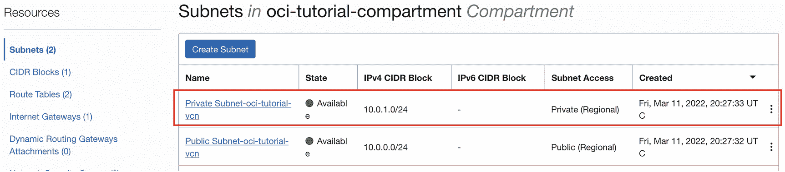

一个带有资源菜单的窗口，其中左侧选中了子网。一个表格列出了 oci 教程 compartment 中的子网。创建子网按钮位于顶部。

图 4-33

选择私有子网（VCN）

接下来，我们需要创建入站规则。在私有子网详情页面，点击左侧`资源`菜单中的`安全列表`条目，然后点击安全列表，如图 4-34 所示。或者，您也可以点击私有子网右侧的上下文菜单并选择`查看详细信息`。

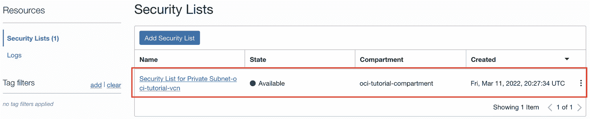

一个带有资源菜单的窗口，其中左侧选中了安全列表。一个表格列出了安全列表，其中一项在矩形框中高亮显示。

图 4-34

选择安全列表（私有子网）

接着，在入站规则列表下方，点击`添加入站规则`按钮，如图 4-35 所示。

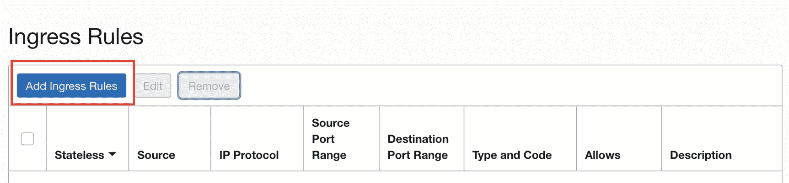

顶部是一个带有添加入站规则、编辑和移除按钮的表格。列标题为：无状态、源、IP 协议、源和目标端口范围、类型和代码、允许以及描述。

图 4-35

添加入站规则（私有子网安全列表）

将打开一个对话框，您可以在其中填写数据。至少需要输入 CIDR（`10.0.0.0/16`）、目标端口（`3306, 33060`）以及（可选）描述（`MySQL 入站规则`）。填写完数据后，可以点击`添加入站规则`按钮，如图 4-36 所示。请注意，您可以点击`+ 另一条入站规则`按钮在此对话框中添加更多入站规则。

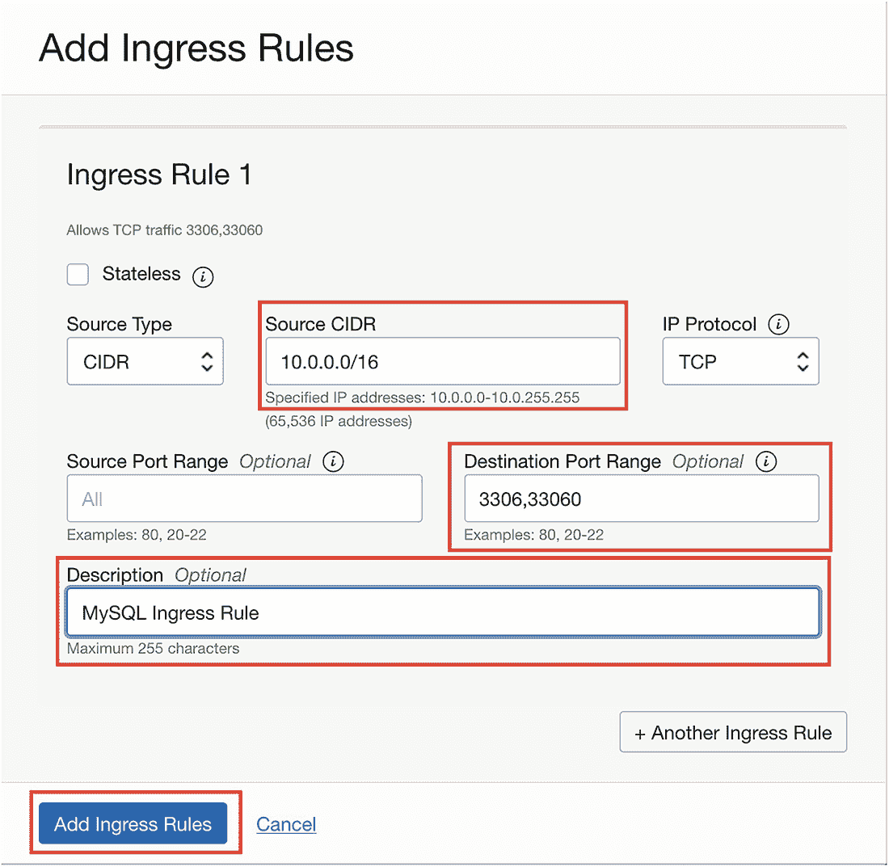

一个用于添加入站规则的对话框。其中源 CIDR、目标端口范围和描述字段被高亮显示。填写详细信息后，点击底部的添加入站规则按钮。

图 4-36

为 MySQL 创建入站规则

这将为我们的计算实例（位于 VCN 的公有子网）与数据库系统（位于 VCN 的私有子网）之间创建一个通信通道，但仅限于通过端口 3306 和 33060 进行通信。现在，我们可以继续下一步了。

**注意**

MySQL 的入站规则只需添加一次。在您手动移除之前，它将一直保持生效。

### 连接到计算实例

现在，我们已经运行了一个计算实例，并且它与数据库系统位于同一个 VCN 中，同时拥有一个公有 IP 地址，因此我们可以从自己的个人电脑（PC）连接到它。您需要获取计算实例的公有 IP 地址，该地址可以在计算实例详情页面的`实例信息`选项卡（位于页面中央）中`实例访问`标题下找到，如图 4-37 所示。

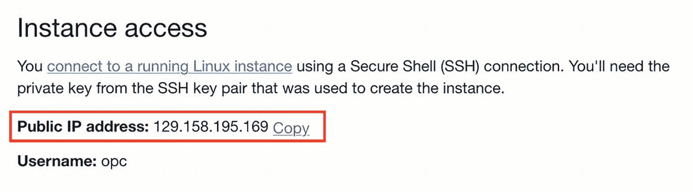

实例信息选项卡中的一个页面，包含带有超链接的实例访问信息。公有 IP 地址被高亮显示，用户名也被提及。

图 4-37

定位公有 IP 地址（计算实例）

回想一下，我们可以使用公有 IP 地址和之前下载的 SSH 密钥，从自己的 PC 连接到计算实例。您可以点击`复制`链接来复制公有 IP 地址，并将其粘贴到以下 SSH 连接命令中所示的位置。另外，`opc`用户是为计算实例创建的默认用户：

```
ssh -i ~/.ssh/ssh-key-2022-04-01.key opc@129.158.195.169
```

如果您将下载的 SSH 密钥放在了不同的位置，请务必更改命令中加粗显示的部分。输入命令后，您将连接到计算实例，如清单 4-1 所示。

```
% ssh -i ~/.ssh/ssh-key-2022-04-01.key opc@129.158.195.169
The authenticity of host '129.158.195.169 (129.158.195.169)' can't be established.
...
This key is not known by any other names
Are you sure you want to continue connecting (yes/no/[fingerprint])? yes
Warning: Permanently added '129.158.195.169' (ED25519) to the list of known hosts.
Activate the web console with: systemctl enable --now cockpit.socket
[opc@connection-instance ~]$
```

清单 4-1

连接到计算实例（从您的 PC）

一旦连接到计算实例，我们现在就可以从该计算实例连接到数据库系统了。


## 连接到数据库系统

我们将使用已创建的计算实例作为访问数据库系统的网关。一旦登录到计算实例，您就可以连接到运行在数据库系统上的 MySQL 实例。我们可以使用 MySQL 客户端 (`mysql`) 或 MySQL Shell (`mysqlsh`)。

不过，您首先需要在计算实例上安装这些软件包。相关命令如下所示。请注意，您需要使用 `sudo` 命令，因为连接需要提升的权限，而 `opc` 用户账户有权限使用 `sudo`。此外，在安装这些软件包时，您可能会看到一个或多个依赖包被一同安装：

```
$ sudo yum install mysql-shell
$ sudo yum install mysql
```

您可以分别安装它们，也可以使用以下命令同时安装两者：

```
$ sudo yum install mysql-shell mysql
```

清单 4-2 展示了安装 MySQL Shell 的过程摘录。安装 MySQL 客户端（或两者都安装）将产生类似的输出，可能包含其他软件包。

```
$ sudo yum install mysql-shell
Ksplice for Oracle Linux 8 (x86_64)                                       6.4 MB/s | 779 kB     00:00
MySQL 8.0 for Oracle Linux 8 (x86_64)                                       6.5 MB/s | 2.2 MB     00:00
MySQL 8.0 Tools Community for Oracle Linux 8 (x86_64)                               2.0 MB/s | 249 kB     00:00
MySQL 8.0 Connectors Community for Oracle Linux 8 (x86_64)                               166 kB/s |  20 kB     00:00
Oracle Software for OCI users on Oracle Linux 8 (x86_64)                                32 MB/s |  29 MB     00:00
Oracle Linux 8 BaseOS Latest (x86_64)                                        29 MB/s |  43 MB     00:01
Oracle Linux 8 Application Stream (x86_64)                                        22 MB/s |  32 MB     00:01
Oracle Linux 8 Addons (x86_64)                                        10 MB/s | 2.9 MB     00:00
Latest Unbreakable Enterprise Kernel Release 6 for Oracle Linux 8 (x86_64            21 MB/s |  41 MB     00:02
Dependencies resolved.
...
Install  4 Packages
Total download size: 27 M
Installed size: 137 M
Is this ok [y/N]: Y
...
Installed:
mysql-shell-8.0.28-1.el8.x86_64
python39-libs-3.9.6-2.module+el8.5.0+20364+c7fe1181.x86_64
python39-pip-wheel-20.2.4-6.module+el8.5.0+20364+c7fe1181.noarch
python39-setuptools-wheel-50.3.2-4.module+el8.5.0+20364+c7fe1181.noarch
Complete!
清单 4-2 安装 MySQL Shell（计算实例）
```

客户端安装完成后，您可以使用创建数据库系统时提供的 MySQL 管理员用户和密码，以及数据库系统详情页面中的私有 IP 地址，来连接到您的 MySQL 实例。回想一下，此信息显示在图 4-38 所示的数据库系统信息（页面中央）的“专用”标题下。您可以使用 `Copy` 链接来复制 IP 地址。

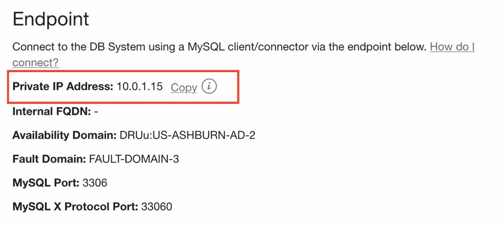
数据库系统信息包含一个带有连接方式超链接的端点。显示私有 IP 地址、内部 FQDN、可用性域、故障域。其中私有 IP 地址被高亮显示。
图 4-38 定位私有 IP 地址（数据库系统）

现在我们准备连接。以下命令展示了使用 MySQL Shell 连接到我们的数据库系统的正确选项（仅是可能的组合之一）。对于 MySQL 客户端，选项类似（去掉 `--sql` 选项，因为它仅适用于 MySQL Shell）：

```
$ mysqlsh --sql -umysql_admin -p -h 10.0.1.15 --port=33060
```

或者，您可以使用结合了用户名、主机和端口的 URI 以及以下命令：

```
$ mysqlsh --sql mysql_admin@10.0.1.15:33060
```

> **注意**
> 如果您之前停止了数据库系统，请务必启动它并等待其变为活动状态，然后再继续。

清单 4-3 展示了使用该命令从计算实例连接到 MySQL 的演示。

```
[opc@connection-instance ~]$ mysqlsh --sql mysql_admin@10.0.1.73:33060
Please provide the password for 'mysql_admin@10.0.1.73:33060': ****************
Save password for 'mysql_admin@10.0.1.73:33060'? [Y]es/[N]o/Ne[v]er (default No): y
MySQL Shell 8.0.28
Copyright (c) 2016, 2022, Oracle and/or its affiliates.
Oracle is a registered trademark of Oracle Corporation and/or its affiliates.
Other names may be trademarks of their respective owners.
Type '\help' or '\?' for help; '\quit' to exit.
Creating a session to 'mysql_admin@10.0.1.73:33060'
Fetching schema names for autocompletion... Press ^C to stop.
Your MySQL connection id is 21 (X protocol)
Server version: 8.0.28-u2-cloud MySQL Enterprise - Cloud
No default schema selected; type \use  to set one.
MySQL  10.0.1.73:33060+ ssl  SQL > SHOW DATABASES;
+--------------------+
| Database           |
+--------------------+
| information_schema |
| mysql              |
| performance_schema |
| sys                |
+--------------------+
4 rows in set (0.0009 sec)
MySQL  10.0.1.73:33060+ ssl  SQL > \q
Bye!
清单 4-3 连接到数据库系统上的 MySQL（计算实例）
```

如果您看到类似清单中的输出，恭喜您！您刚刚连接到了您的第一个数据库系统。如果想尝试一下，可以继续运行一些示例 SQL 语句。

### 等等，它不工作！

如果您无法连接，请返回并确保您的计算实例位于同一可用性域、同一 VCN（在公有子网中），并且您已按照上述说明向 VCN 私有子网添加了正确的入口规则。

另一个常见问题是忘记了 MySQL 管理员用户名和密码。虽然记下密码是非常糟糕的做法，但您应确保使用创建数据库系统时提供的用户名和密码。更改该密码并不容易，因此最坏的情况可能需要您删除当前的数据库系统，用相同的数据创建另一个，并确保记录下 MySQL 管理员用户的用户名和密码。

就是这样！设置和使用起来相当容易，对吧？再次说明，这与您通常在 OCI 中构建应用程序的方式非常相似。您会将应用程序服务器或面向公众的连接点放在 VCN 的公有子网上，而将数据资源放在私有子网上，通过良好的安全实践来保护您的重要投资。

现在，让我们看看如何直接从我们的 PC 连接到数据库系统。

### 使用堡垒机会话进行连接

堡垒机是 OCI 的一项服务，它通过 SSH 提供受限且有时间限制的连接，用于访问那些没有公共端点的资源。连接建立后，用户可以使用任何 SSH 支持的软件或协议与目标资源进行交互。连接是使用堡垒机资源上的会话对象，通过 SSH 客户端或 SSH 隧道连接到私有子网上的资源来完成的。例如，您可以使用支持 SSH 的 MySQL 客户端连接到数据库系统。在我们查看演示之前，让我们先了解一下堡垒机中使用的术语。

> **注意**
> 堡垒机与单个 VCN 相关联。它们无法从一个 VCN 移动到另一个 VCN。


#### 堡垒服务术语

以下总结了堡垒服务中使用的关键术语：

*   **堡垒服务**：一项提供对目标资源进行安全公共访问的 OCI 服务。这些资源是那些您无法从虚拟云网络外部访问的资源，因为它们被置于虚拟云网络中的一个私有子网内。堡垒服务（有时实例就简称为堡垒）被置于虚拟云网络的公共子网中。客户端通过 CIDR 允许列表来指定您允许连接到私有子网中特定资源或资源范围的地址或地址范围，以此进行身份验证。

*   **会话**：会话用于通过与公钥 SSH 密钥对匹配的私钥向用户提供访问权限。SSH 密钥对在会话创建时被记录。因此，会话可以被视为通过堡垒服务建立的一个活动连接。

*   **目标资源**：您想要连接的、位于虚拟云网络私有子网中的资源。

*   **目标主机**：一种特定类型的目标资源，支持 SSH 连接，例如计算实例。

#### 会话类型

堡垒有两种类型的会话，设计用于连接到特定类型的目标资源。会话类型包括：

*   **托管 SSH**：允许 SSH 访问运行 Linux、OpenSSH 服务器以及启用了堡垒插件的 Oracle Cloud Agent 的计算实例。

*   **SSH 端口转发**：也称为 SSH 隧道。不需要在目标资源上运行 OpenSSH 服务器或 Oracle Cloud Agent。在客户端的特定端口和目标资源的特定端口之间创建一个安全连接。该隧道支持大多数 TCP 协议，包括远程桌面协议、Oracle Net Services 和 MySQL。

可以通过任何支持 SSH 的、用于与 OCI 资源通信的常规客户端访问堡垒。例如，您可以使用云控制台、CLI 或 OCI API。

> 提示
>
> 要了解有关堡垒服务的更多信息，请参见 `https://docs.oracle.com/en-us/iaas/Content/Bastion/Concepts/bastionoverview.htm`。

在本教程中，我们将使用端口转发选项和堡垒会话，通过我们的个人电脑连接到我们的 DB 系统。

#### 先决条件

在开始之前，我们需要以下信息。随着操作进行，我们将了解如何（以及在哪里）找到这些信息：

*   DB 系统的私有 IP 地址
*   虚拟云网络和子网
*   客户端（例如个人电脑）IP 地址的无类域间路由
*   最大会话时长（您希望连接保持打开的时间）
*   SSH 密钥对
*   虚拟云网络私有子网的入站规则

显然，您需要有一个正在运行的（或可以启动的）DB 系统、它所连接的虚拟云网络以及子网。如果您没有可用的 DB 系统，请先返回创建一个再继续。

我们还必须为私有子网设置一个入站规则，以允许来自公共子网的 MySQL 端口 3306 和 33060 的流量通过。如果您跳过了前面的示例，请返回标题为“*修改虚拟云网络——为私有子网创建入站规则*”的部分，并在继续之前创建入站规则。

#### 创建堡垒服务

现在让我们创建堡垒服务。使用云控制台主菜单，选择**身份与安全** | **堡垒服务**（您可能需要向下滚动一点），然后点击**创建堡垒**按钮，如图 4-39 所示。确保选择了正确的 compartment。

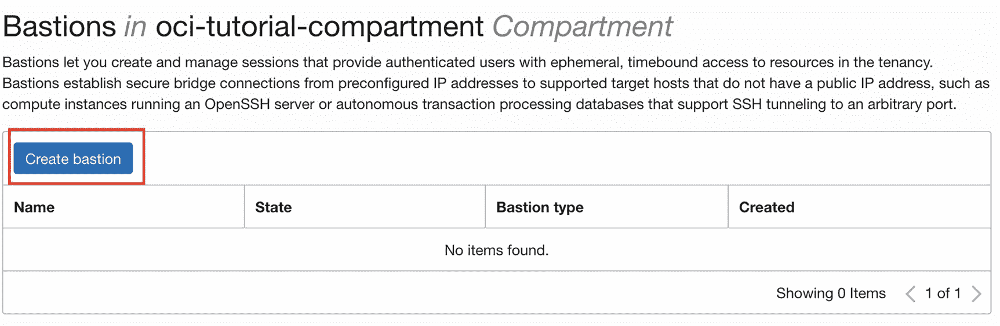

**图 4-39** 创建新的堡垒服务（堡垒主页面）

这将打开一个新对话框，您将在其中为我们虚拟云网络上的堡垒服务进行配置。首先，将堡垒命名为`MySQL Bastion`。请注意，堡垒的名称不能包含空格、下划线或短横线（它会提醒您）。接下来，从下拉框中选择`oci-tutorial-vcn`和`Public Subnet-oci-tutorial-vcn`。回想一下，我们想要从公共子网创建到私有子网的桥梁，因此堡垒必须位于公共子网中。接下来，我们还将使用一个`0.0.0.0/0`的 CIDR（输入字符串后按*回车*键在框中确认），这是非常开放的（允许所有 IP 地址），但在生产环境中您可能希望修改它以限制访问。图 4-40 显示了填入相同数据的对话框。当您确认输入的数据正确后，点击**创建堡垒**按钮。

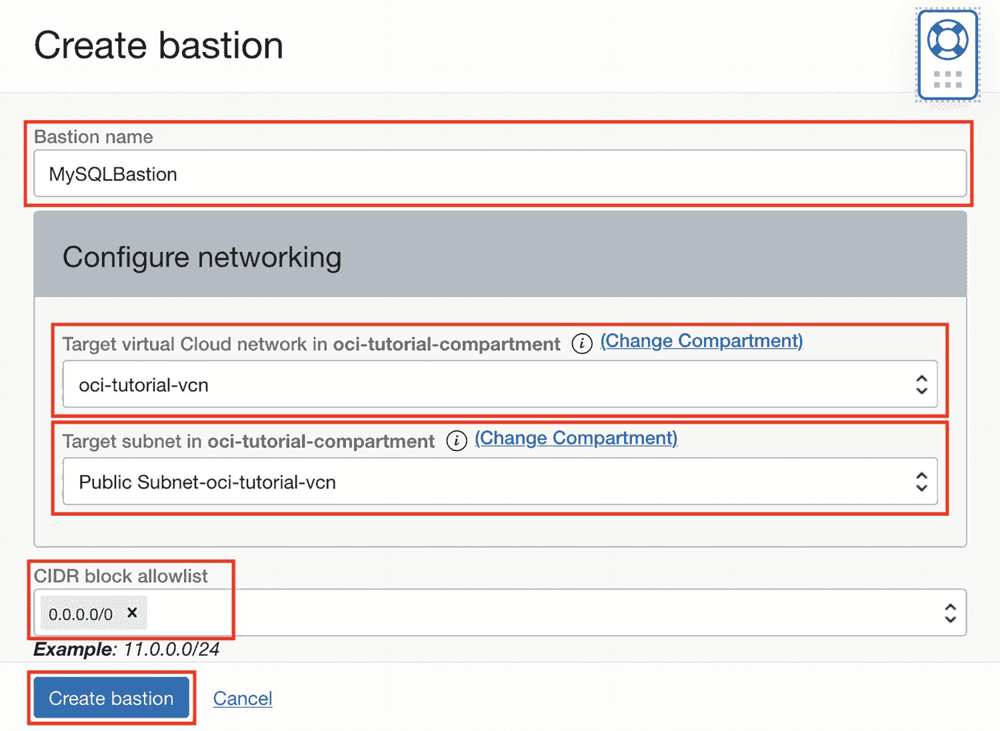

**图 4-40** 创建堡垒服务（对话框）

您应该等待堡垒创建和配置完成后再继续下一步。

#### 创建 SSH 密钥对

我们需要一个 SSH 密钥对来与堡垒一起使用。现在就在您的个人电脑上创建一个吧。清单 4-4 展示了在`~/.ssh`文件夹中创建密钥对并为私钥分配权限的示例。注意使用的名称是`bastion_rsa`，但您可以使用任何名称，只需不要覆盖任何现有的密钥对即可。

```bash
% ssh-keygen -t rsa
Generating public/private rsa key pair.
Enter file in which to save the key (/Users/XXXX/.ssh/id_rsa): /Users/XXXX/.ssh/bastion_rsa
...
The key fingerprint is:
SHA256:NGrshx+714+XXXXXXXXXXXXXXXXXXXXXXXXU YYYYYYYY.local
The key's randomart image is:
+---[RSA 3072]----+
...
+----[SHA256]-----+
```

**清单 4-4** 生成 SSH 密钥对

在 Windows 10 或 11 上生成 SSH 密钥对的方法，请参见`www.howtogeek.com/762863/how-to-generate-ssh-keys-in-windows-10-and-windows-11/`。在 macOS 和 Linux 上创建 API 签名密钥的方法，请参见`https://docs.oracle.com/en-us/iaas/Content/API/Concepts/apisigningkey.htm#two`。

#### 创建端口转发会话

现在，我们已具备创建端口转发会话（也称为 SSH 隧道）所需的一切条件。请如图 4-41 所示，在列表中点击新创建的 Bastion（`MySQLBastion`），导航至其详情页面。或者，您也可以使用右侧的上下文菜单并选择`查看详情`。

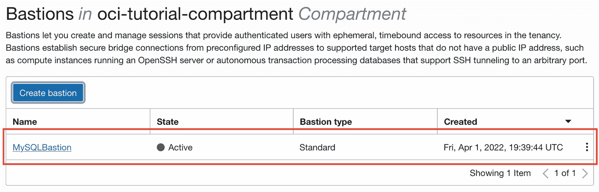

OCI 教程中 compartment 内的 Bastion 主页面。左上角有“创建 Bastion”按钮，下方是一个空表格。列标题为：名称、状态、Bastion 类型和创建时间。

图 4-41

选择新的 Bastion 服务

在 Bastion 详情页面的`会话`部分下，点击`创建会话`按钮，如图 4-42 所示。

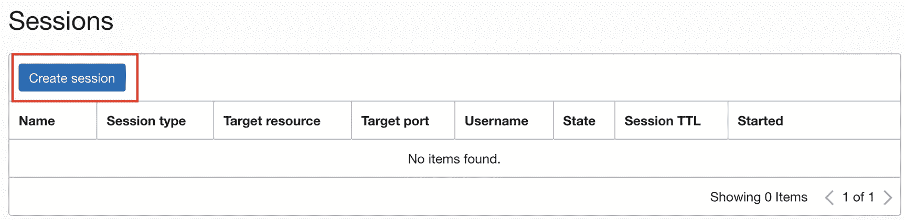

一个对话框，顶部有“创建会话”按钮。空表格的列标题为：名称、会话类型、目标资源、目标端口、用户名、状态、会话 TTL 和启动时间。

图 4-42

创建会话（Bastion 详情页面）

这将打开一个对话框，我们将在其中创建端口转发会话。在对话框中，于`会话类型`下拉菜单中选择`SSH 端口转发会话`，（可选）将会话命名为`MySQLSession`，在`用户名`文本框中输入`opc`，输入数据库系统的私有 IP 地址（例如`10.0.1.73`），以及我们要打开的端口（例如`33060`），如图 4-43 所示。

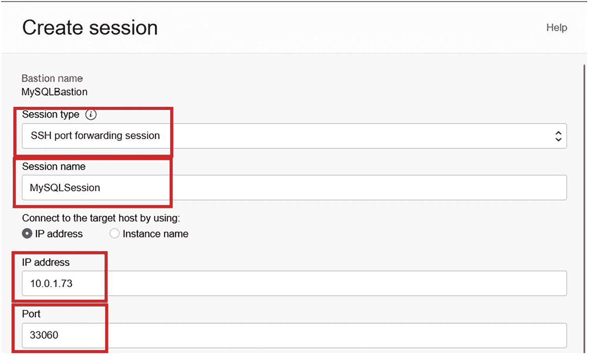

“创建会话”对话框，显示了 Bastion 名称、会话类型、会话名称、IP 地址和端口的详细信息。目标主机选择为 IP 地址。

图 4-43

创建端口转发会话（第 1 部分）

我们使用`opc`用户，因为它是 Bastion 和计算实例等系统的默认用户。您指定的端口将是用于创建隧道的端口。您可以选择任何有效的端口。如果您的 PC 上安装了 MySQL，您可能需要选择另一个端口使用。

在对话框中向下滚动，您将看到下一部分，我们需要上传先前生成的密钥对中的公钥。为此，点击`浏览`链接并选择我们之前创建的公钥（例如`bastion_rda.pub`），如图 4-44 所示。验证输入的信息正确后，您可以点击`创建会话`按钮。

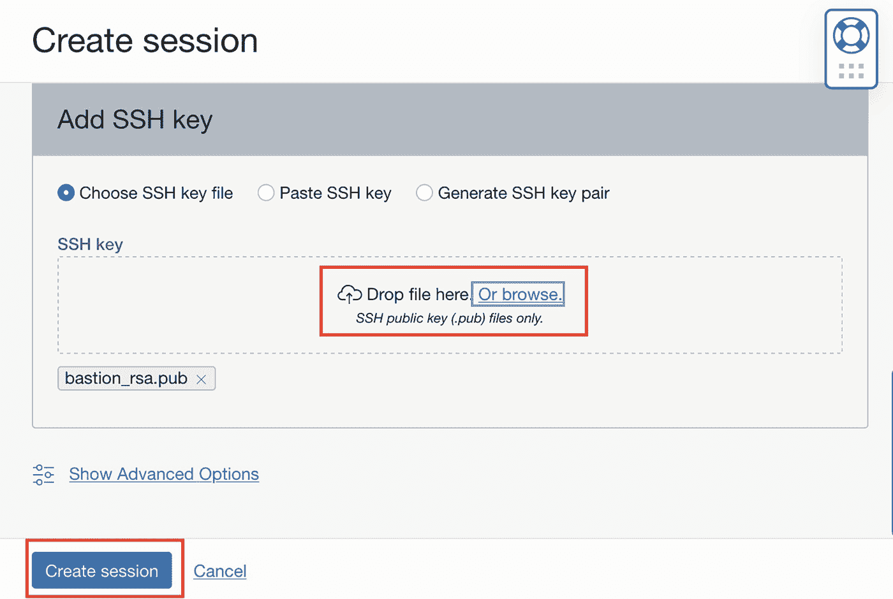

“创建会话”页面上的一个对话框。它显示“添加 SSH 密钥”。其特点是：选择 SSH 密钥文件、添加 SSH 公钥的位置和创建会话按钮。

图 4-44

创建端口转发会话（第 2 部分）

您可能需要稍等片刻等待会话创建。创建完成后，它将显示在会话列表中，状态为`活跃`，如图 4-45 所示。

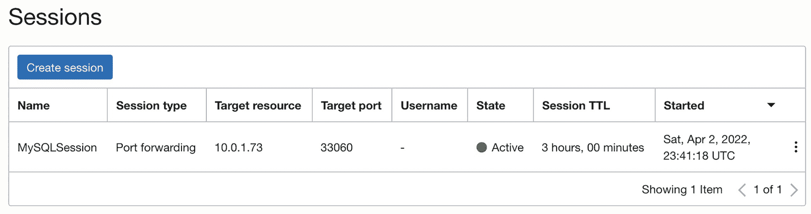

一个对话框，顶部有“创建会话”按钮。空表格的列标题为：名称、会话类型、目标资源、目标端口、用户名、状态、会话 TTL 和启动时间。

图 4-45

Bastion 中的会话列表

注意`会话 TTL`列。这是 SSH 会话的超时时间（称为生存时间）。它代表了会话可用时间的上限。默认是 30 分钟（或 1800 秒）。您可以在创建会话时设置此值：在创建会话对话框中点击`高级选项`，并更改`最大会话生存时间`的值（以及可选地更改单位），如图 4-46 所示。

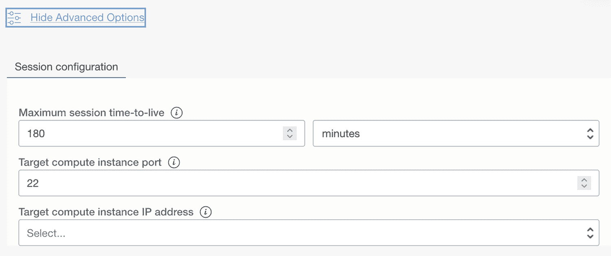

一个包含会话配置的对话框。它包含最大会话生存时间、目标计算实例端口和目标计算实例 IP 地址。所有字段均已填好。

图 4-46

设置会话生存时间

您现在可以使用它将您的 PC 连接到数据库系统。

#### 从您的 PC 连接

现在我们有了端口转发会话，可以打开隧道了。我们需要使用的命令有点复杂，但幸运的是，OCI 通过提供一个包含可用于访问 Bastion 端口转发会话的特殊 OCID 的示例命令，使我们变得简单。只需在 Bastion 详情页面的`会话`列表中点击上下文菜单以打开菜单，然后选择`查看 SSH 命令`，如图 4-47 所示。

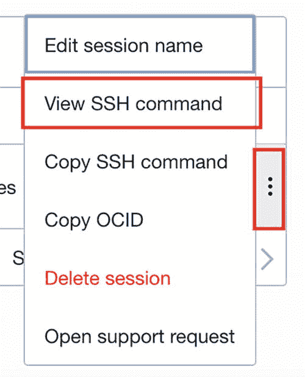

一个会话上下文菜单，包含编辑会话名称、查看 SSH 命令、复制 SSH 命令、复制 OCID、删除会话和打开支持请求。

图 4-47

会话上下文菜单

这将打开一个如图 4-48 所示的对话框，其中显示了命令。点击`复制`标签复制该命令，然后点击`关闭`按钮关闭对话框。

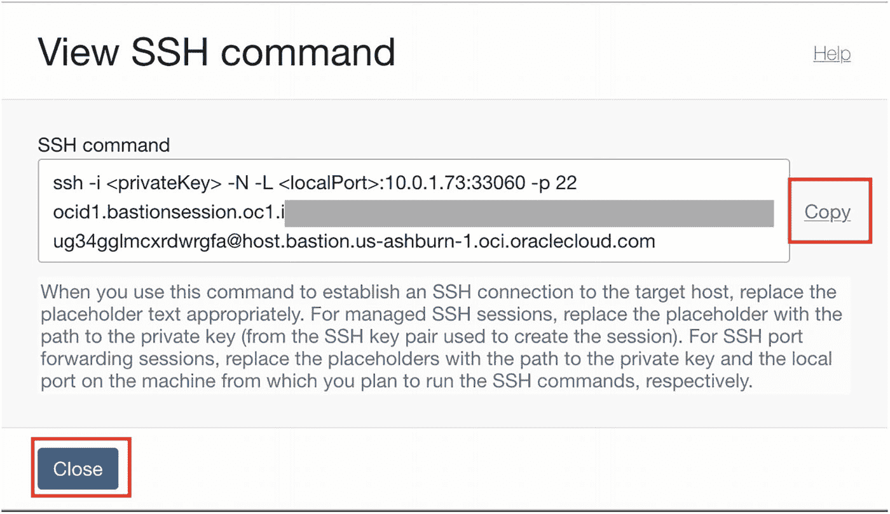

“查看 SSH 命令”对话框。它显示了 SSH 命令并带有一个复制按钮。关闭按钮在左下角。

图 4-48

查看 SSH 命令对话框（会话）

我们需要在使用前编辑它。具体来说，我们需要添加我们先前创建的 SSH 密钥路径`~/.ssh/bastion_rsa`，提供我们在端口转发会话中使用的端口（`33060`），以及我们想要在数据库系统上使用的端口（`33060`），如下所示。更改部分以粗体显示。最后，我们添加`&`运算符以运行命令并返回到命令行（在后台运行）。这是因为端口转发连接需要保持打开状态供我们使用：

```
% ssh -i ~/.ssh/bastion_rsa -N -L 33060:10.0.1.73:33060 -p 22 ocid1.bastionsession.oc1...bfa@host.bastion.us-ashburn-1.oci.oraclecloud.com &
```

如果您在跟着操作，请在您的 PC 上打开终端窗口并输入该命令。在尝试连接到 MySQL 之前，您需要等到看到以下响应：

```
Use of the Oracle network and applications is intended solely for Oracle's authorized users. The use of these resources by Oracle employees and contractors is subject to company policies, including the Code of Conduct, Acceptable Use Policy and Information Protection Policy; access may be monitored and logged, to the extent permitted by law, in accordance with Oracle policies. Unauthorized use may result in termination of your access, disciplinary action and/or civil and criminal penalties.
```

一旦从 SSH（来自 OCI）获得响应，您就可以使用以下命令连接到数据库系统上的 MySQL：

```
% mysqlsh --sql mysql_admin@127.0.0.1:33060
```

注意，我们正在使用`mysqlsh`连接到环回地址（`127.0.0.1`或 localhost）端口`33060`上的 MySQL。这将通过 SSH 隧道将通信发送到数据库系统。列表 4-5 显示了连接的记录。


```
% mysqlsh --sql mysql_admin@127.0.0.1:33060
请输入 'mysql_admin@127.0.0.1:33060' 的密码：
是否为 'mysql_admin@127.0.0.1:33060' 保存密码？[Y]es/[N]o/Ne[v]er (默认选择 No)：N
MySQL Shell 8.0.28
Copyright (c) 2016, 2022, Oracle and/or its affiliates.
Oracle is a registered trademark of Oracle Corporation and/or its affiliates.
Other names may be trademarks of their respective owners.
输入 '\help' 或 '\?' 获取帮助；输入 '\quit' 退出。
正在创建到 'mysql_admin@127.0.0.1:33060' 的会话
正在获取用于自动补全的架构名称... 按 ^C 停止。
您的 MySQL 连接 ID 为 39 (X 协议)
服务器版本: 8.0.28-u2-cloud MySQL Enterprise - Cloud
未选择默认架构；输入 \use <schema> 来设置一个。
MySQL  127.0.0.1:33060+ ssl  SQL > SHOW DATABASES;
+--------------------+
| Database           |
+--------------------+
| information_schema |
| mysql              |
| performance_schema |
| sys                |
+--------------------+
4 行于集合 (0.1007 秒)
MySQL  127.0.0.1:33060+ ssl  SQL > \q
再见！
清单 4-5
通过 SSH 隧道连接到 DB 系统上的 MySQL
```

如果未能建立连接或出现超时，您可能需要检查堡垒机和会话的设置。最坏的情况下，您可能需要销毁堡垒机和会话并重新创建它们。您可以通过在堡垒机详情页的 `会话列表` 中点击会话的上下文菜单并选择 `删除会话` 来删除会话。您可以通过点击堡垒机详情页上的 `删除堡垒机` 按钮来删除堡垒机。

如果连接成功打开，并且您看到与清单类似的结果，恭喜！您已成功连接到 OCI 中 DB 系统上运行的 MySQL 数据库服务器。由于您现在可以从个人电脑直接访问 OCI 中的 MySQL 数据库系统，您可以尝试各种 MySQL 查询。

实验完成后，请务必删除您在 OCI 中创建但不再需要的任何数据库系统、堡垒机、计算实例或其他资源。请记住，如果您不想删除这些资源，可以通过停止您的数据库系统和计算实例来降低成本。

### 养成良好的云资源管理习惯

如果您已完成对 DB 系统的实验，并希望稍后继续探索其功能，请务必在注销前停止 DB 系统，以最大限度地减少您账户的费用。如果您将暂时搁置本书中的教程，您可能需要考虑删除 DB 系统和其他资源（如您创建的堡垒机服务），以进一步减少账户费用。请记住，您留下的任何正在运行的可计费资源都将产生费用。如果您使用的是试用账户，这可能不是问题，但当您拥有大量 DB 系统和其他 OCI 资源后，让资源持续运行久而久之会产生不小的开销。通过养成良好的云计算资源管理习惯，避免收到意外的月度账单。

## 总结

MySQL 数据库服务对于希望在云端利用世界上最流行的开源数据库系统——MySQL——的强大功能的组织来说，是一个全新的机遇。这不仅是可行的，而且 Oracle 通过其 Oracle Cloud Infrastructure (OCI) 让创建和管理多个 MySQL 数据库服务 DB 系统变得轻而易举。

尽管 MySQL 数据库服务下还有其他可用资源，但 DB 系统代表了托管需要数据库系统的应用程序的任何基础设施的核心组件。最好的消息是，DB 系统是一个功能齐全、托管式的 MySQL 实例，您可以根据业务需求进行定制。

从 CPU 性能和内存（通过规格形状）到数据存储的大小，您可以根据即时需求配置一系列 DB 系统。而且您无需花费辛苦赚来的资金购买硬件和雇佣人力来设置、配置和调优这些服务器——所有这些都在几分钟内为您完成！显然，DB 系统是世界领先的开源数据库系统的下一代演进。

在本章中，我们浏览了 MySQL 数据库服务，重点介绍了 DB 系统。我们学习了如何创建 DB 系统、管理它，以及了解更多可用于与 DB 系统协作的功能。我们甚至学习了如何从个人电脑连接到 DB 系统。

在下一章中，我们将学习更多关于 MDS 针对 DB 系统的备份和恢复功能。

脚注 1   2

# 5. 备份与恢复

既然我们已经了解了 MySQL 数据库服务（MDS）是什么，以及如何在 MDS 中创建和连接到 DB 系统，我们差不多可以开始在项目和应用程序中使用它们了。然而，在规划与 MDS 集成之前，有一个重要的功能必须考虑，那就是如何备份和恢复我们的数据。

专业的系统和数据库管理员都知道，在将任何重要数据放入系统之前，必须有一个良好的恢复计划，这对于项目和组织的长期稳定至关重要。如果出现问题，您必须能够将数据恢复到某个合理的点，以便能够从故障中恢复并重建数据。对于许多系统来说，一个简单的备份和恢复机制就是所需的全部。

在本章中，我们将学习 MDS 中可供您用来保护数据的备份和恢复选项。然而，在我们深入探讨 MDS 中的备份和恢复操作之前，让我们先了解为什么为 MDS 中的数据制定恢复计划很重要。


## 可能出现什么问题？

有人可能认为云服务万无一失，永远不会离线。遗憾的是，这种想法是个误区。许多细微因素都可能影响您访问数据的能力。可能是您的互联网服务提供商出现故障，您的本地硬件发生故障，当然，云服务本身也会发生故障。幸运的是，这些情况很少见，并且已经采取了许多步骤和周密的计划，以确保及早检测故障，并通过冗余措施以及快速行动恢复的人员来减轻故障影响。

但我们不要忘记那个可能造成最大破坏的因素——人为错误。无论是意外删除，还是由于对数据执行了规划不当、执行不力的更新所带来的后果，人为错误都是我们必须防范的。因此，备份与恢复在云端与在本地环境同样重要，并将持续如此。此外，组织应将其备份和恢复设施纳入 MDS 中，以取代当前可能用于本地 MySQL 备份与恢复的操作。

例如，如果您使用诸如 `MySQL Enterprise Backup` (`MEB`) 之类的外部应用程序来备份本地 MySQL 服务器，您将用 `OCI` 中的 `DB System` 备份功能来替代它。虽然 `DB System` 备份不提供与 `MEB` 相同的选项，但它仍可在您的业务连续性计划中取代 `MEB` 的位置。而且，最重要的是，它们是物理备份，因此您可以确保数据能够快速高效地备份和恢复，而不会遇到逻辑备份所带来的空间问题或其他问题。

同样，您的恢复计划也可以用 `DB Systems` 中的恢复功能来替代。不过，在恢复方面，这更多是一种差异。与 `MEB`（物理备份）或基于 SQL 的逻辑备份选项（如 `mysqlpump` 和 `mysqldump`）等应用程序不同，`DB System` 恢复用于利用恢复的数据创建一个新的 `DB System`。更具体地说，您无法将数据恢复到一个现有的 `DB System` 上。原因有很多，但如果您仔细想想，恢复到一个具有相同数据和配置的新 `DB System` 意味着您无需销毁原始系统即可回滚数据。您可以保留这两个 `DB System`，以便进行任何您想要的恢复分析。

提示
有关 `mysqlpump` 的更多信息，请参见 [`https://dev.mysql.com/doc/refman/8.0/en/mysqlpump.xhtml`](https://dev.mysql.com/doc/refman/8.0/en/mysqlpump.xhtml)；有关 `mysqldump` 的更多信息，请参见 [`https://dev.mysql.com/doc/refman/8.0/en/mysqldump.xhtml`](https://dev.mysql.com/doc/refman/8.0/en/mysqldump.xhtml)。

因此，尽管缺乏选择性备份、选择性恢复以及恢复到现有 `DB System` 的功能，`DB System` 的备份和恢复特性依然强大、高效且可靠。正如您将看到的，自动备份功能使保护数据变得毫不费力。

既然我们已经了解了备份与恢复在 MDS 中的重要性和作用，让我们更详细地看看这些特性。

注意
如果您想跟随演示操作，请确保已创建并运行一个 `DB System`，其参数与第 2 章讨论的参数类似。

## 备份

为了更好地理解 `DB System` 备份，让我们从高层次角度考虑 `DB System` 的配置。`DB System` 由一个计算实例、一个安装并运行着操作系统和 MySQL 的启动卷、用于数据的块存储设备（称为数据驱动器或简称为数据）以及一组用于运行 MySQL 的配置参数组成。

当启动备份时，会调用数据驱动器的块卷服务来创建块卷（数据）的副本。块卷服务实现了一种快速复制，采用一种逻辑卷管理器（`lvm`）的形式来对数据进行快照。因此，无需产生某些备份应用程序和机制必须采用的任何形式的等待、阻塞或类似中断。

然后，块卷备份与配置参数副本以及一些用于重建 `DB System` 的附加元数据相结合。计算实例、启动卷等不会被复制或放入备份中。相反，`DB System` 备份包含了在备份时刻重建 `DB System` 和您的数据所需的一切。

在本节中，我们将学习所有关于 `DB System` 备份的基本操作，包括自动和手动备份。您将看到，设置备份有很多可微调的选项。

### 备份类型

`DB Systems` 中的备份可以设置为按预设时间间隔自动发生，可以手动随时创建备份，可以创建最终备份，并且如果需要维护或纠正措施，`OCI` 操作员可以为您创建备份。

`DB Systems` 还支持完整备份和增量备份。完整备份是指备份备份时存在的所有数据。增量备份仅包含自上次完整备份以来的更改。通常，增量备份较小，因此可以更频繁地进行。例如，您可能希望采用这样的计划：在每天使用率低时运行一次完整备份，并在一天中定期进行增量备份。这样，您总是可以将数据恢复到增量备份时间窗口内的状态。

增量备份允许您更频繁地进行备份，因为它们通常占用更少的空间。这允许您进行一次完整备份，然后在一段时间内进行多次增量备份。如果需要恢复，您需要恢复最近的完整备份，然后恢复之后进行的所有增量备份。

例如，您可能希望采用这样的策略：在通常是在夜间使用率较低时进行一次完整备份，然后每隔几个小时进行一次增量备份。最佳实践建议根据您的数据恢复目标来调整频率。更具体地说，增量备份之间的时间间隔不应超过您的组织可以安全容忍的最大数据丢失量。这是因为自上次增量备份以来更改或添加的任何数据，在恢复完整备份及后续增量备份时都可能丢失。

另一个最佳实践是利用 MySQL 的一个特殊功能，即时间点恢复，它内置于 MDS 中。这允许您通过每五分钟对数据进行一次快照来设置自动化恢复。因此，最大数据丢失将不超过五分钟的时间段。我们将在第 6 章中更详细地讨论时间点恢复以及如何利用它来改进数据恢复。

让我们更详细地看看每种备份类型。

## 手动备份

手动备份是由您，即 `DB System` 的所有者，通过云控制台或通过 `REST API` 调用创建的备份（有关 `REST API` 调用的更多信息见第 9 章）。手动备份的保留期可以设置为 1 到 365 天。所有手动备份都是完整备份。

您可能希望在以下情况之前创建手动备份：对数据进行重大更改、执行任何数据清理或转换脚本、导入大量数据，或者在业务的关键时刻之前，例如大型活动或新产品发布之前。


#### 自动备份

您可以使用自动备份功能来选择备份数据库系统的时间。与手动备份不同，自动备份的保留期可设置为 1 到 35 天，默认为 7 天。请注意，一旦设置了自动备份保留期，将无法更改，因此在设置自动备份时请根据需求仔细考虑。有趣的是，自动备份一旦配置，即使数据库系统处于非活动状态（例如已停止），也会对其进行备份。

最后，如果您删除了数据库系统，除非您更改了数据库系统中的删除计划，否则自动备份也会被一并删除。回想一下，删除计划可以在创建数据库系统时设置，也可以在之后更改。`删除计划`选项卡中的一项设置是保留自动备份。如果勾选此项，在删除数据库系统时，自动备份将不会被删除。

您可能希望设置自动备份，以便确保数据定期得到备份，而无需每天进行监控或管理。

## 最终备份

最终备份是一种特殊备份，可在删除数据库系统时触发。更具体地说，您可以为数据库系统设置删除计划，以便在删除之前执行最终备份。在这种情况下，系统会先执行备份，完成后才删除数据库系统。最终备份始终是完整备份，并且只能通过数据库系统的`删除计划`选项卡自动设置。

## 操作员备份

这种备份形式是另一种特殊备份，可由 MDS 支持团队（常被称为操作员，因此得名）触发。通常，操作员在采取操作纠正问题或协助您解决数据库系统问题之前，会执行此类备份作为预防措施。此类备份始终是完整备份。

操作员备份会自动删除，不计入您的计费或服务限制。虽然您可以手动删除操作员备份，但不建议这样做，因为如果问题未得到解决，或者数据库系统无法完全恢复，您可能需要使用它。

MySQL 支持团队创建此备份以协助调查您服务中的潜在问题。这些备份会自动删除。您也可以手动删除这些备份，但不建议。这些备份不影响您的限制。

### 备份详情

每当您访问数据库系统详情页面，并点击左侧`资源`菜单中的`备份`时，您都可以看到备份列表。随后，您将看到一个类似于图 5-1 的备份列表。

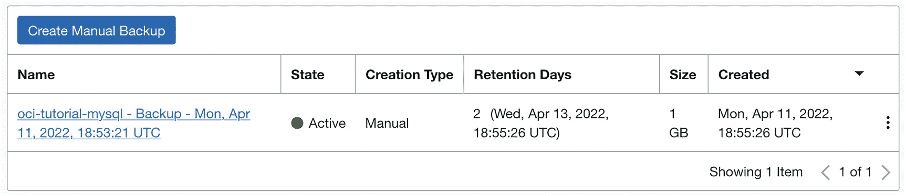

图 5-1 显示了一个名为“创建手动备份”的表格，包含以下列：名称、状态、创建类型、保留天数、大小和创建时间。

图 5-1

数据库系统中的备份列表

请注意，列表显示了名称、状态、备份（创建）类型、保留期、大小和创建日期。如果您点击每个备份右侧的上下文菜单，可以查看可对该备份执行的操作列表，如图 5-2 所示。

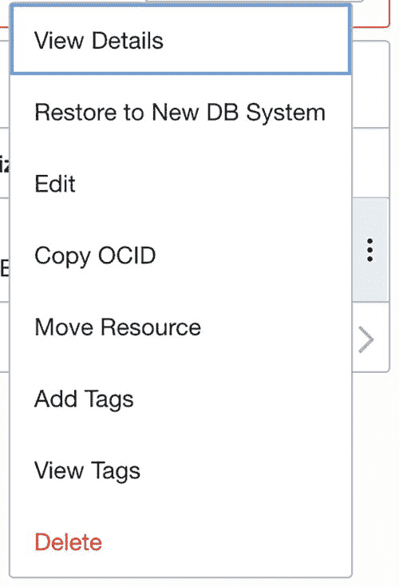

图 5-2 显示了一个包含以下选项的菜单：查看详情、恢复到新系统、编辑、复制 OCID、移动资源、添加标签、查看标签和删除。其中“查看详情”选项被选中。

图 5-2

上下文菜单（备份列表 - 数据库系统详情页面）

在这里，我们可以查看备份的详情、恢复到新的数据库系统、编辑备份（更改名称、描述和保留期）、复制其 OCID、将其移动到新位置、添加或查看标签，以及删除备份。

提示

您可以通过使用云控制台主菜单，然后选择`数据库` | `备份`，来导航到所有备份的列表。您将能够对列表中的每个备份执行上述相同的操作。

让我们来看一下备份的详情页面。备份的详情页面与大多数 OCI 资源的详情页面类似，关键数据显示在中央，状态图标位于左侧，下方是带有各种列表选项卡的`资源`菜单。在这种情况下，备份在`资源`菜单中只有一个条目：`数据库系统`，它显示有关从中获取备份的数据库系统的信息。

图 5-3 显示了备份详情页面的顶部部分。

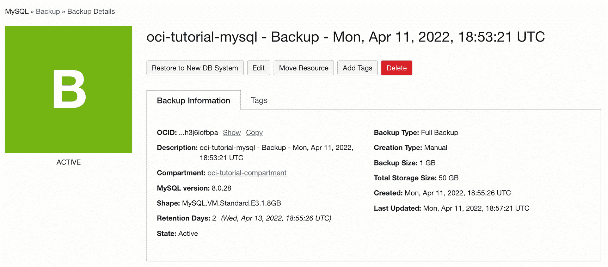

图 5-3 显示了一个 OCI 教程中的 MySQL 备份页面截图，包含备份信息和标签选项卡。还显示了资源、编辑、移动、添加标签和删除选项。左侧有一个带有“B”字样的矩形框。

图 5-3

备份详情页面（顶部）

请注意，左侧有图标。图标和状态的行为与其他 OCI 资源相同，在某些状态下会改变颜色，其中绿色始终代表`活动`状态。右侧是名称和一系列用于常见操作的按钮。这些操作包括：

*   `恢复到新数据库系统`：从备份创建一个新的数据库系统以恢复数据。
*   `编辑`：用于更改备份元数据（名称、描述和保留期）。
*   `移动资源`：允许您将资源移动到新位置（ compartment）。
*   `添加标签`：用于添加用户定义的标签。
*   `删除`：您可以删除备份。

主要信息部分有两个选项卡：`备份信息`和`标签`。备份信息包括 OCID、描述、 compartment、MySQL 版本、形状、状态、备份类型、创建类型、大小和创建日期。标签是您或 OCI 系统为备份设置的那些标签。

表 5-1 更详细地列出了数据。

表 5-1

备份信息（备份详情页面）


### 备份详情与管理

#### 备份详情页面

备份详情页面的上半部分展示了备份的元数据信息，如下表所示。

| 参数 | 描述 |
| --- | --- |
| *OCID* | 备份的 OCID（唯一标识符）。 |
| *Description* | 创建备份时您提供的描述（对于手动备份），或是由 OCI 生成的描述。 |
| *Compartment* | 创建备份所在的 compartment。您可以点击提供的链接查看关于该 compartment 的更多详细信息。 |
| *MySQL Version* | 创建备份时，DB 系统上运行的 MySQL 版本。如果您要还原一个旧备份，这可能是一个需要考虑的关键项目，因为当新的 MySQL 版本发布时，DB 系统会不断升级。 |
| *Shape* | DB 系统计算实例的形状。 |
| *Retention Days* | 备份的保留期（天数）。 |
| *State* | 备份的当前状态。 |
| *Backup Type* | 所采取的备份类型：完全备份或增量备份。 |
| *Creation Type* | 备份创建方法：手动或自动。 |
| *Backup Size* | 备份大小（GB）。 |
| *Total Storage Size* | 备份时的数据存储大小。 |
| *Created* | 备份创建的日期和时间。 |
| *Last Updated* | 备份最后更新的日期和时间。 |

`MySQL Version` 和 `Shape` 是将备份还原到新 DB 系统时所需的两个关键组件。在这里，您可以一目了然地看到 DB 系统的一般配置。

`图 5-4` 显示了备份详情页面的下半部分。

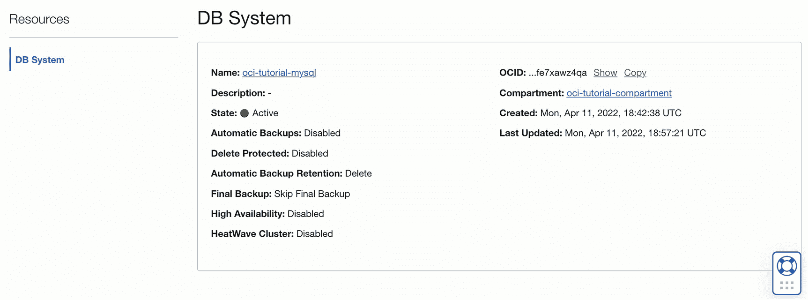

**图 5-4：备份详情页面（底部）**

此处展示了关于 DB 系统的信息，包括其关于备份、高可用性、`HeatWave`、`OCID`、`Compartment` 和创建日期的参数。`表 5-2` 更详细地展示了这些数据。

**表 5-2：MySQL DB 系统（备份详情页面）**

| 参数 | 描述 |
| --- | --- |
| *Name* | DB 系统的名称。显示为链接，因此您可以导航到 DB 系统详细信息页面。 |
| *Description* | 创建 DB 系统时您提供的描述。 |
| *State* | DB 系统的运行状态。 |
| *Automatic Backups* | 自动备份状态：已启用或已禁用。 |
| *High Availability* | 高可用性状态：已启用或已禁用。 |
| *HeatWave Cluster* | HeatWave 集群状态：已启用或已禁用。 |
| *OCID* | DB 系统唯一的 OCID。提供了显示或复制 OCID 的链接。 |
| *Compartment* | DB 系统所在 compartment 的名称。 |
| *Created* | DB 系统创建的日期和时间。 |
| *Last Updated* | DB 系统最后更新的日期和时间。 |

#### 管理自动备份

现在我们了解了备份类型以及每种备份可以看到的信息类型，让我们看看如何对 DB 系统进行备份。我们将看到所有备份类型的示例。

##### 启用或禁用自动备份

回想一下，我们在 `第 4 章` 中创建 DB 系统时，并没有开启自动更新。幸运的是，我们可以随时打开（启用）或关闭（禁用）自动更新。

我们只需通过云控制台主导航菜单选择 `Databases` | `DB Systems` 来导航到 DB 系统，然后选择 DB 系统并查看其详细信息，或者使用右侧的上下文菜单选择 `View Details`。进入 DB 系统详细信息页面后，点击 `More Actions` 按钮并选择 `Edit Backup Plan`。

如果自动备份被禁用，您将看到一个用于启用的复选框。只需勾选 `Enable Automatic Backups` 复选框，然后将出现另外两个选项，如 `图 5-5` 所示。

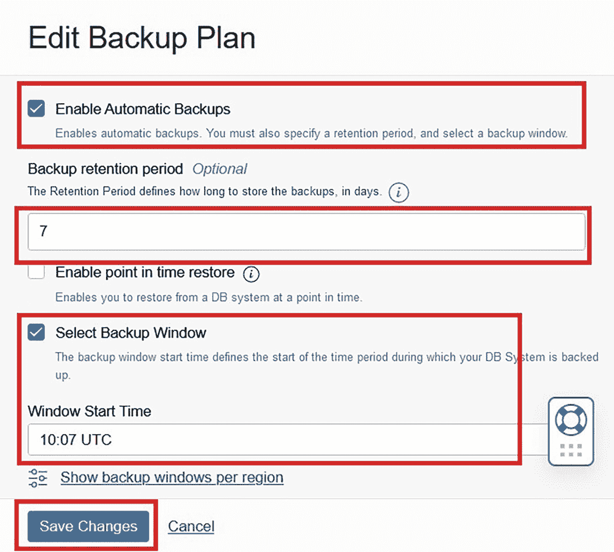

**图 5-5：启用自动备份**

您将被允许更改备份保留期（默认为 7 天），并且可以更改自动备份的开始时间。您必须勾选 `Select Backup Window` 复选框才能启用开始时间窗口选择。开始窗口是自动备份可以发生的时间段。

当您点击 `Window Start Time` 框时，将出现一个下拉列表，允许您从预定义的选项列表中选择一个开始窗口。请注意时间是 `UTC` 时间，因此请务必修正任何时区差异。请注意，您的自动备份将被安排在指定开始时间后的 30 分钟内开始。您还可以点击 `Show backup windows per region` 链接以查看特定于您区域的默认备份窗口。

当您对选择满意后，点击 `Save Changes` 按钮以启用自动备份。这可能会暂时将 DB 系统的状态更改为 `UPDATING`，并将图标颜色更改为黄色。

> **注意：** 您也可以在 DB 系统列表中使用 DB 系统的上下文菜单来选择 `Edit Backup Plan`，以启用或禁用自动备份。

要禁用自动备份，请使用 `More Actions` 按钮并选择 `Edit Backup Plan`。然后，只需取消勾选 `Enable Automatic Backups` 复选框，并点击 `Save Changes` 按钮即可禁用自动备份。这可能会暂时将 DB 系统的状态更改为 `UPDATING`，并将图标颜色更改为黄色。


#### 创建手动备份

您可以随时为数据库系统创建手动备份。请注意，手动备份可以是增量备份或完整备份，保留期限可设置为 1 到 365 天。手动备份包含您所有数据的副本。再次强调，在对数据进行任何重大更改（包括导入、重组、启动新应用等）之前，创建手动备份始终是一个好习惯。在这些操作前立即进行的备份，将允许您将数据恢复到一个“已知良好”的状态。

手动备份可在任何时间进行，但 MDS 正在升级数据库系统的维护周期期间除外。实际上，如果您尝试在不建议或不允许的时间创建备份，MDS 可能会向您发出警告。幸运的是，这些情况很少见，您不太可能遇到。

要创建手动备份，请使用云控制台并导航至您的数据库系统。您可以通过点击主菜单，选择`数据库`，然后选择`数据库系统`，再点击您的数据库系统名称以查看数据库系统详情页面。

进入数据库系统详情页面后，点击`资源`菜单中的`备份`条目，然后点击`创建手动备份`按钮，如图 5-6 所示。或者，您可以使用`更多操作`按钮并选择`创建手动备份`。此外，您也可以不导航至数据库系统详情页面，而是直接从数据库系统列表的右键菜单中选择`创建手动备份`。

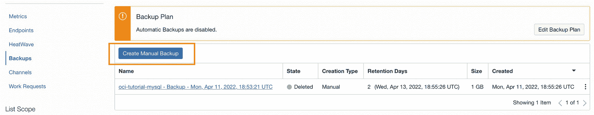

*显示了一个标签为“创建手动备份”的页面。右上角显示“编辑备份计划”。出现一个标题为“备份计划”的对话框，带有一个警告标志，显示“自动备份已禁用”。*

**图 5-6：创建手动备份（数据库系统详情页面）**

点击按钮或从右键菜单启动手动备份后，将打开一个对话框，提示您提供以下信息：

*   `显示名称`：为备份命名。MDS 会为您生成一个名称，但如果您希望快速找到它，或者想将名称与某个事件或项目关联起来，您应该提供一个名称。默认情况下，MDS 会包含数据库系统的名称以及备份的日期和时间。
*   （可选）`描述`：您可以为备份添加描述。这里可以包含您无法（或不应该）在名称中编码的相关信息^(¹⁰)，例如促使您创建备份的详细原因。
*   `配置备份类型`：在此处，您可以在完整备份或增量备份之间进行选择。默认是完整备份。
*   `配置保留期`：您可以输入备份的保留天数。可选择 1 到 365 天的范围。超过该天数后，备份将被删除。您也可以选择一个特定日期，该日期代表备份保留期到期并将被删除的日子。
*   `关闭对话框后备份详情页`：勾选此复选框后，系统会自动将您重定向到备份详情页。默认情况下，此框已勾选。

输入并验证信息后，点击`创建手动备份`按钮以创建备份。图 5-7 显示了`创建手动备份`对话框的示例。

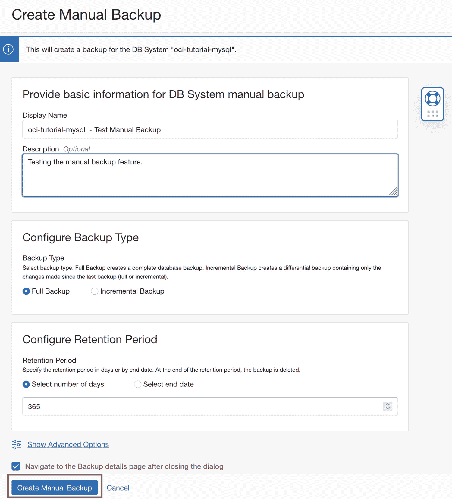

*显示一个标题为“创建手动备份”的对话框。它包含 3 个标题部分：提供数据库系统手动备份的基本信息、配置备份类型和配置保留期。*

**图 5-7：创建手动备份对话框**

**提示**：为简洁起见，我将不再高亮显示对话框和表单上的所有输入框，但会高亮显示命令按钮和其他重要功能。

如果您勾选了显示备份详情页的复选框，系统会将您重定向到该页面，以便您可以监控备份进度。您也可以在数据库系统详情页面`资源`菜单的`备份`视图中监控备份进度。图 5-8 显示了在数据库系统详情页面的备份视图中显示的手动备份进度。

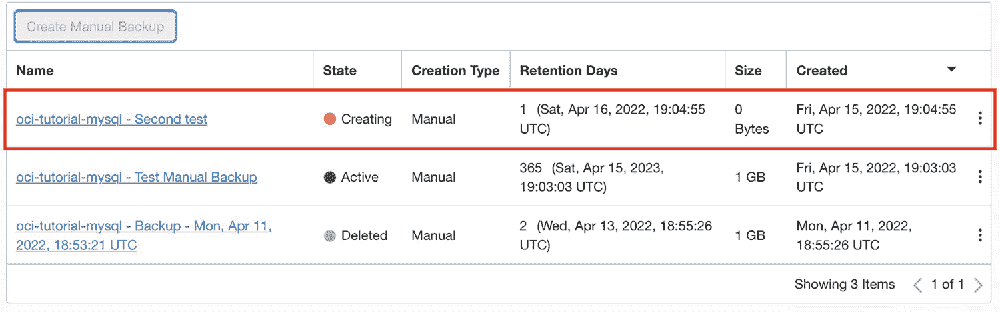

*显示一个标题为“创建手动备份”的表格。该表包含以下列：名称、状态、创建类型、保留天数、大小和创建时间。第一行标签为“oci-tutorial-mysql-second-test”被高亮显示。*

**图 5-8：备份进度（数据库系统详情页面）**

**注意**：备份开始时，数据库系统的状态可能会短暂变更为`更新中`。

#### 编辑备份

如果您需要编辑备份的名称或描述，可以使用编辑备份功能。要从数据库系统详情页面编辑备份，请点击`资源`菜单中的`备份`视图，点击右键菜单并选择`编辑`，如图 5-9 所示。

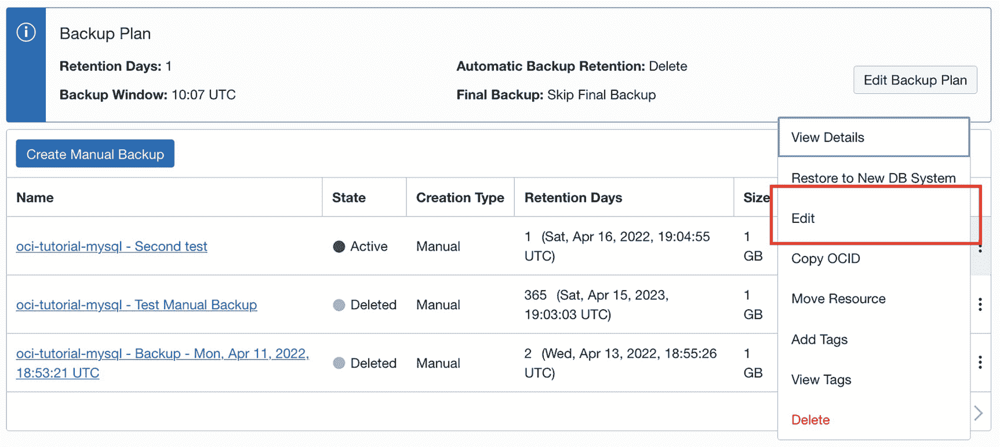

*显示一个标题为“创建手动备份”的方框。其中有一个文本框，显示以下列表：查看详情、还原到新系统、编辑、复制 OCI ID、移动资源、添加标签、查看标签和删除，其中“编辑”被选中。*

**图 5-9：编辑备份（数据库系统详情页面）**

如果您已导航至备份详情页，可以点击`编辑`按钮来编辑备份。

点击编辑备份按钮后，将出现一个对话框，您可以在其中更改以下信息：

*   `显示名称`：您可以更改备份的名称。默认情况下，MDS 会包含数据库系统的名称以及备份的日期和时间。
*   `描述`：您可以更改备份的描述。
*   `配置备份类型`：在此处，您可以在完整备份或增量备份之间进行选择。默认是完整备份。
*   `配置保留期`：您可以更改备份的保留天数。您也可以选择一个特定日期，该日期代表备份保留期到期并将被删除的日子。

图 5-10 显示了编辑备份对话框。

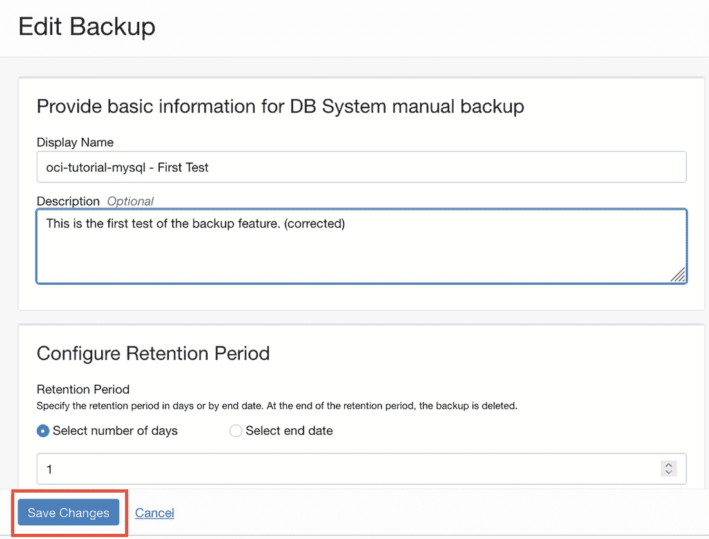

*显示一个标题为“编辑备份”的对话框。该对话框包含副标题：提供数据库系统手动备份的基本信息和配置保留期。最后提供了“保存更改”选项。*

**图 5-10：编辑备份对话框**

更正信息后，您可以点击`保存更改`按钮来保存您的修改。

#### 管理标签

您可以用来关联备份（或 OCI 中任何支持标签的资源）的另一机制是向该资源添加一个或多个标签。标签是您可以自行添加的短字符串。您可能希望添加标签用于筛选或排序。例如，您可以使用标签将备份与成本中心、事件或项目关联起来。

您可以随时向备份添加标签。要执行此操作，请从数据库系统详情页面点击`资源`菜单中的`备份`视图，点击上下文菜单并选择`添加标签`，如图 5-11 所示。

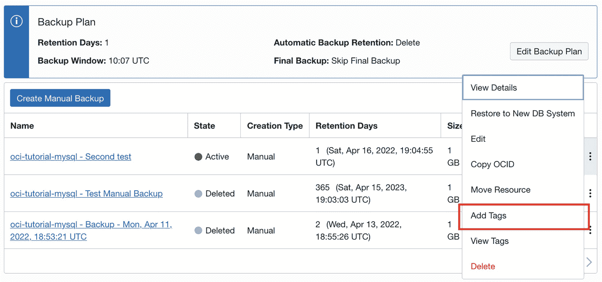

一个标题为“创建手动备份”的框。给定了一个带列表的文本框。查看详情、恢复到新系统、编辑、复制 OCID、移动资源、添加标签、查看标签、删除，其中“添加标签”被选中。

图 5-11

添加标签（数据库系统详情页面 – 备份视图）

如果您已导航至备份详情页面，则可以点击`编辑`按钮来编辑备份。

点击`添加标签`按钮后，您将看到一个对话框，您可以在其中指定要添加到备份的一个或多个标签。图 5-12 展示了添加单个标签的示例。这里，我们添加了一个名为 `CostCenter`、值为 `901` 的标签。请注意，标签中不能包含空格。

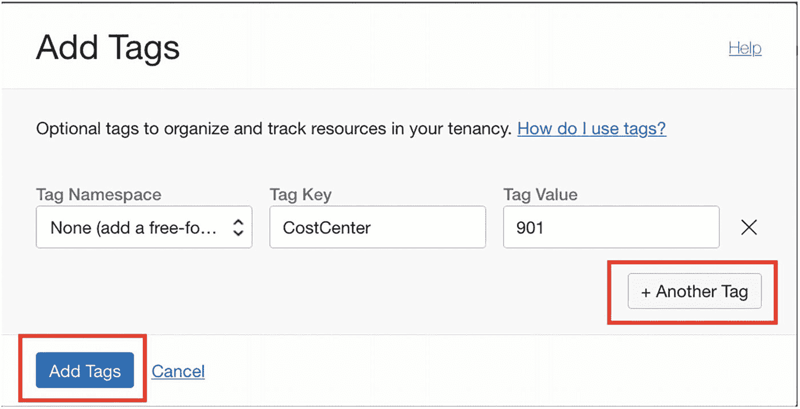

一个标题为“添加标签”的对话框，其中右下角的框“+ 添加另一个标签”和左下角的“添加标签”被选中。

图 5-12

添加标签对话框

如果您想添加更多标签，可以点击 `+ 另一个标签` 按钮，这将为您添加另一组文本框以指定另一个标签。完成后，您可以点击`添加标签`按钮将标签添加到您的备份。

请注意，您可以通过导航至备份详情页面查看与备份关联的标签。在那里，您可以选择`标签`选项卡，然后查看`自由格式标签`视图，以查看您已添加的标签，如图 5-13 所示。

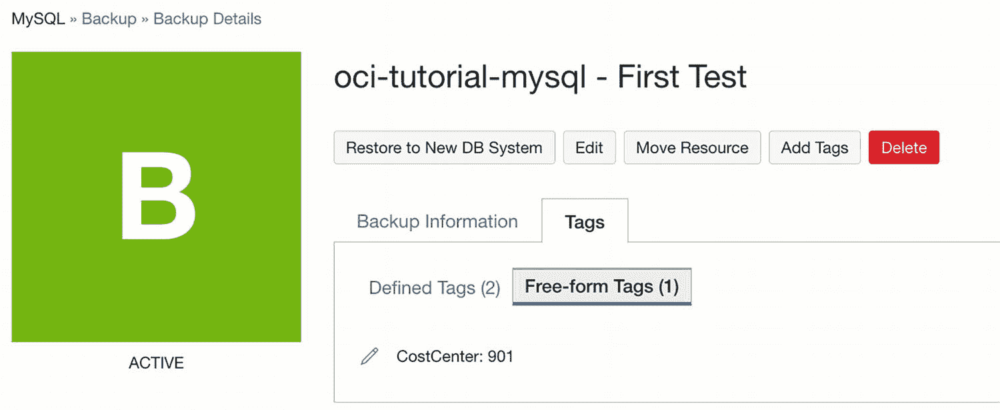

OCI 教程“MySQL 第一次测试”的屏幕截图，包含备份信息和标签选项卡。还显示了资源、编辑、移动、添加标签和删除选项。左侧有一个带字母 B 的矩形框。

图 5-13

自由格式标签视图（备份详情页面）

#### 删除备份

您可以随时删除备份。如果您创建了手动备份或希望通过删除旧备份来清理部分备份资源，您可以轻松完成。删除一组备份的最简单方法是使用云控制台主菜单并导航到 `数据库` | `备份`，这将显示您所有的 MDS 备份，如图 5-14 所示。

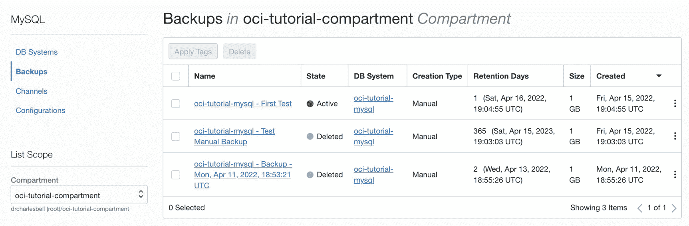

一个标题为“oci-tutorial-compartment 中的备份”的对话框，其中选中了选项“备份”。该表包含以下列：名称、状态、创建类型、保留天数、大小和创建时间。

图 5-14

列出所有数据库系统备份

请注意，这里我们看到列表的标题是“*oci-tutorial-compartment 中的备份*”。正如您可能推断的那样，该列表一次只显示一个 compartment 中的备份。这是因为备份包含在创建它们的 compartment 中——很像数据库系统（或任何存在于 compartment 级别的资源）。

这个列表非常方便，因为它允许您选择多个备份，然后应用两种操作之一：添加标签或删除。`应用标签`按钮允许您向所有选中的备份添加一个或多个标签。同样，`删除`按钮会删除所有选中的备份。

要删除单个备份，请使用右侧的上下文菜单并选择`删除`，如图 5-15 所示。

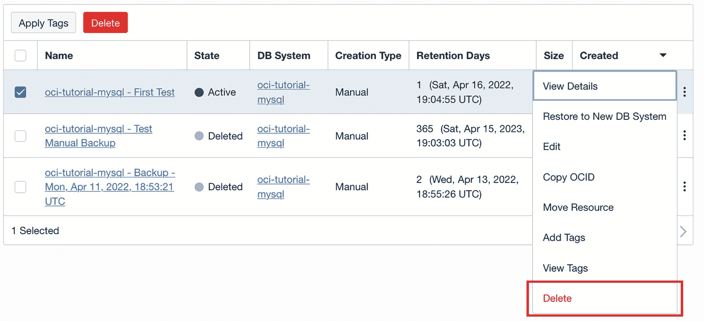

一个以名称、状态、数据库系统、创建类型、保留天数、大小和创建时间为列标题的对话框，其中第一列被选中。右侧有一个带删除选项的文本框。

图 5-15

删除备份（MDS 备份列表）

系统将要求您确认信息，如图 5-16 所示。点击`删除备份`按钮以确认删除操作。显示此对话框是因为删除备份会导致该备份以后无法访问。

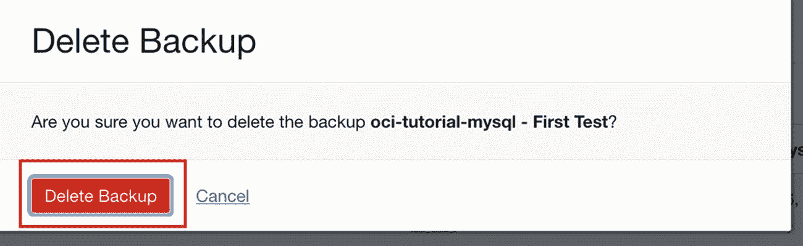

一个标题为“删除备份”的对话框。在对话框中，“删除备份”选项被标记为选中。

图 5-16

确认备份删除对话框

您也可以从备份详情页面点击`删除`按钮来删除备份。或者，如果您正在查看数据库系统详情页面，请使用`资源`菜单中的`备份`视图选择上下文菜单并选择`删除`。


### 移动备份

备份包含在创建它们的 compartment 中。您无法在一个 compartment 中使用另一个 compartment 的备份（例如用于恢复）。您必须先将备份移动到其他 compartment 才能使用它。

### 注意

只有处于活动状态的备份才能被移动。处于任何其他状态的备份无法被移动到其他 compartment。

如果您需要操作多个 compartment，您可能需要或希望将备份移动到不同的 compartment。例如，您可能希望恢复位于另一个 compartment 中的某个 DB 系统的数据，可能是为了建立开发环境的基线、复制数据用于其他分析等。

### 注意

发起移动的用户必须在目标 compartment 拥有 `MYSQL_BACKUP_MOVE` 权限。更多详情请参见 [`https://docs.oracle.com/en-us/iaas/mysql-database/doc/policy-details-mysql-database-service.xhtml`](https://docs.oracle.com/en-us/iaas/mysql-database/doc/policy-details-mysql-database-service.xhtml)。

要将备份移动到其他 compartment，您可以通过云控制台菜单导航到备份列表，选择 `数据库` | `备份`，然后点击上下文菜单并选择 `移动资源`，如图 5-17 所示。

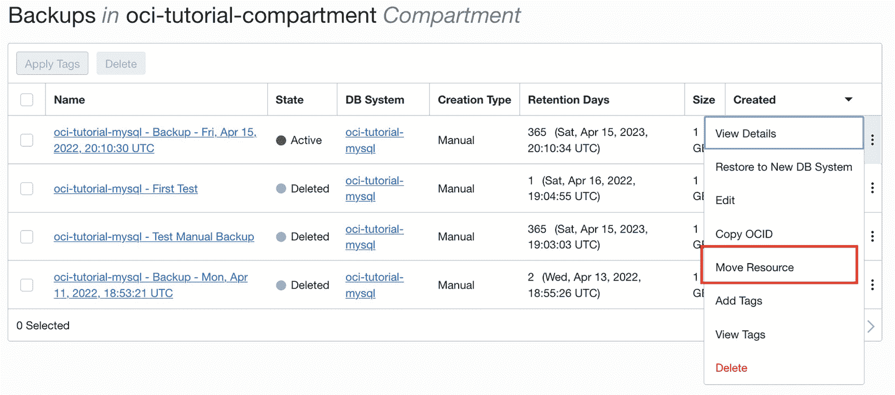

显示一个带文本框的对话框，其中包含以下列表选项。查看详情、恢复到新系统、编辑、复制 O C I D、移动资源、添加标签、查看标签和删除，其中“移动资源”选项被选中。

图 5-17
移动资源（MDS 备份列表）

点击 `移动资源` 后，您将看到一个带有一个下拉列表的对话框，您可以在其中选择要将备份移动到的 compartment。图 5-18 显示了该对话框。

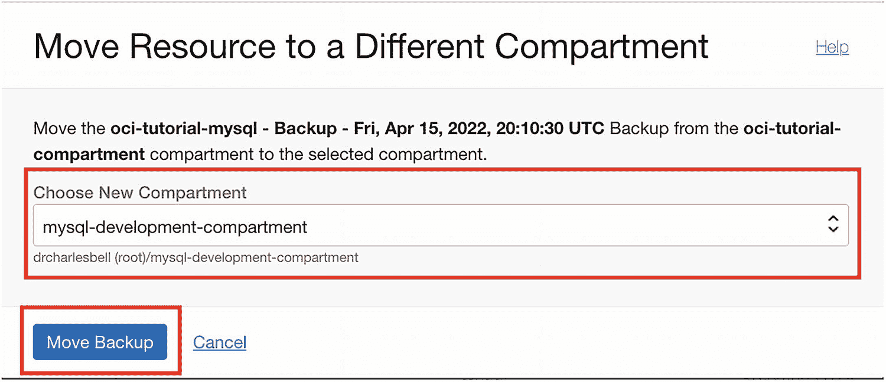

显示一个标题为“将资源移动到其他 compartment”的对话框。在对话框中，“移动备份”选项被标记为选中。

图 5-18
移动资源对话框

只需从列表中选择目标 compartment，然后点击 `移动备份` 按钮即可移动备份。请注意，示例中显示了将备份移动到 `mysql-development` compartment。操作仅需片刻，完成后，备份将从当前列表中移除。

### 注意

您无法选择备份当前所在的 compartment。

这是因为 MDS 备份列表使用 compartment 作为过滤器。由于我们之前查看的是 `oci-tutorial-compartment`，但我们将资源移动到了 `mysql-development` compartment，因此我们必须更改 `Compartment` 过滤器才能看到该备份，如图 5-19 所示。

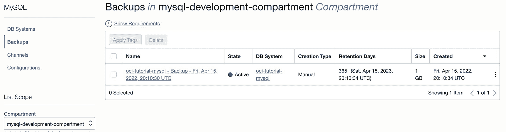

显示一个标题为“mysql-development compartment 中的备份”的对话框，其中“备份”选项被选中。表格包含以下列：名称、状态、创建类型、保留天数、大小和创建时间。

图 5-19
显示 mysql-development compartment 中的备份

现在您可以在 `mysql-development` compartment 中使用该备份了。您可以随时按需移动备份，但请记住，除非您将备份移动到某个 compartment，否则无法在该 compartment 中使用它们。

现在，让我们了解一下可以如何恢复我们的数据（备份）。

## 恢复

MDS DB 系统中的恢复操作并非一个独立的功能或资源。它实际上是备份资源的一个功能。这与其他操作系统和数据库备份工具的工作方式略有不同，因此，为了避免混淆，我们为 MDS 和 MDS 备份的新用户将恢复操作单独列出。

当您恢复备份时，您并不是将数据恢复到同一个 DB 系统。MDS（以及其他 OCI）资源被设计并实现为“使用...创建新资源”的操作。因此，恢复备份意味着您将使用备份中的数据以及随备份存储的某些配置元数据来创建一个新的 DB 系统。一旦您习惯了这个新流程，您可能会发现它在某些情况下很有用，例如当您为了诊断目的而希望恢复备份，并同时拥有当前的和恢复的 DB 系统会很有优势时。

由于恢复操作会使用备份中的数据创建一个新的 DB 系统，用于创建恢复的对话框与用于创建新 DB 系统的对话框非常相似。因此，其中一些细节可能非常熟悉，但我们为了完整性和清晰性仍将其包含在内。

只有一个非常重要的方面需要考虑。新的 DB 系统不能使用与现有、正在运行的 DB 系统相同的 IP 地址。如果您想使用相同的 IP 地址，必须先删除现有的 DB 系统。

另一件需要考虑的事情是，新的 DB 系统将保留来自原始 DB 系统的管理员凭据，因此您无需重新创建管理员帐户和密码。

### 注意

如果您想跟随此演示操作，请务必为您的现有 DB 系统创建一个手动备份，以便您有一个可用于恢复的备份。

要恢复备份，首先使用云控制台主导航到 DB 系统备份列表，然后选择 `数据库` | `备份`，接着为您想要恢复的备份从上下文菜单中点击 `恢复到新 DB 系统`，如图 5-20 所示。在此情况下，我们看到一个已采取的手动备份，我们想要恢复它。原始 DB 系统仍然处于活动运行状态。

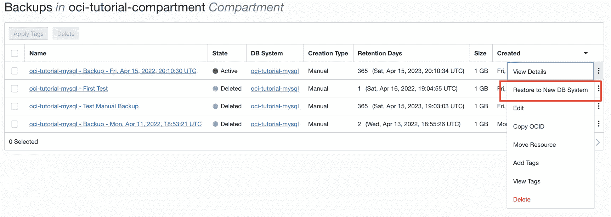

显示一个列标题为名称、状态、D B 系统、创建类型、保留天数、大小和创建时间的对话框。右侧有一个文本框，其中“恢复到新 D B 系统”选项被标记为选中。

图 5-20
恢复到新 DB 系统（DB 系统备份列表）

您也可以导航到备份详情页面并点击 `恢复到新 DB 系统` 按钮，如图 5-21 所示，来开始恢复过程。

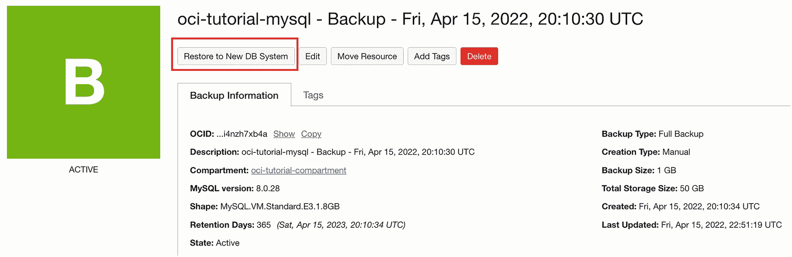

显示 o c i 教程 my s q l 备份页面的截图，包含备份信息和标签选项卡。还显示了资源、编辑、移动、添加标签和删除选项。左侧有一个带有 B 字样的矩形框。

图 5-21
恢复到新 DB 系统（备份详情页面）

一旦您点击该按钮，“恢复到新 DB 系统”对话框将会出现。我们需要提供的信息包括以下内容：

*   `名称`：DB 系统的名称。
*   `描述`（可选）：提供您自己使用的描述，用于解释 DB 系统，例如其创建原因、分配给哪些项目等。您应避免在描述中包含任何机密数据。
*   `网络`：您需要为 DB 系统选择 VCN 和子网。
*   `可用性域`（放置）：选择可用性域。
*   `硬件`：选择数据存储（块卷）的形状和大小。
*   `备份计划`：您可以选择是否开启自动备份。

由于该对话框相当长，并且看起来与创建新 DB 系统的对话框非常相似，我们将从顶部开始分部分介绍该对话框。如果您正在跟随进行自己的恢复操作，您可能需要向下滚动才能看到对话框的所有部分。


### 从备份还原数据库系统

首先，我们必须选择数据源。根据您启动还原的方式，此信息可能已为您填写。我们必须选择是从备份还原还是执行时间点还原（在第 6 章中有解释）。在此示例中，我们是从备份还原，因此数据源已为我们选定。图 [5-22] 显示了对话框的数据源部分。

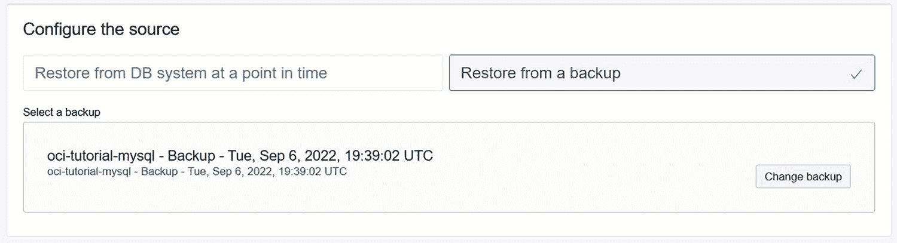

图 5-22 还原数据库系统（第 1 部分）

#### 配置源

一个标题为“配置源”的对话框，其中“从备份还原”选项标记为已选中。

#### 提供数据库系统信息

“名称”部分允许您为还原的数据库系统指定名称。MDS 会为您提供一个默认名称，但您很可能需要更改它。您还可以添加描述。MDS 会为您提供一个描述，其中包含还原的来源或出处，包括备份的名称、还原的日期和时间以及备份 ID（备份的 OCID）。图 [5-23] 显示了对话框的名称部分。

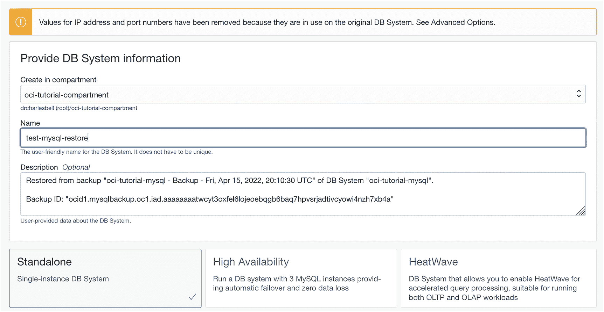

图 5-23 还原数据库系统（第 2 部分）

一个标题为“提供数据库系统信息”的对话框。“独立单实例数据库系统”选项标记为已选中。

在此示例中，我们将还原为 `oci-tutorial-mysql` 数据库系统创建的手动备份之一，并将其命名为 `test-mysql-restore`。输入信息后，向下滚动到下一部分。

#### 配置网络与放置位置

在下一部分中，我们必须选择希望在其中还原备份的 compartment，但请记住，您应将备份还原到备份创建时所在的同一 compartment 中的数据库系统。我们还需要选择要使用的 VCN 和可用性域。您会注意到，MDS 在这里已为您选择了正确的 compartment、VCN 和可用性域，如图 [5-24] 所示。

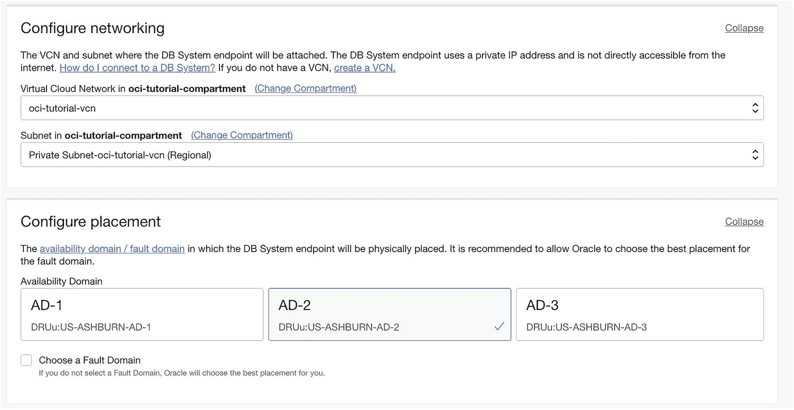

图 5-24 还原数据库系统（第 3 部分）

一个对话框包含两个标题：“配置网络”和“配置放置位置”。在“配置放置位置”框中，“AD 2”选项标记为已选中。

如果您想在与当前 compartment 不同的 compartment 中启动数据库系统，可以从列表中选择不同的 compartment。如果您不选择其他 compartment，则将使用备份所在的同一 compartment。

如果您正在使用自己的帐户进行操作，您应该看到 `oci-tutorial-vcn` 在 *Virtual Cloud Networking in oci-tutorial-compartment* 列表中被选中，`Private Subnet oci-tutorial-vcn (Regional)` 条目在 *Subnet in oci-tutorial-compartment* 列表中被选中，可用性域 2 (*AD-2*) 在 *Configure placement* 框中被选中。检查完选择后，向下滚动到下一部分，即 *Configure hardware* 部分。在这里，我们可以选择更改配置（shape）和更改数据存储的大小，如图 [5-25] 所示。

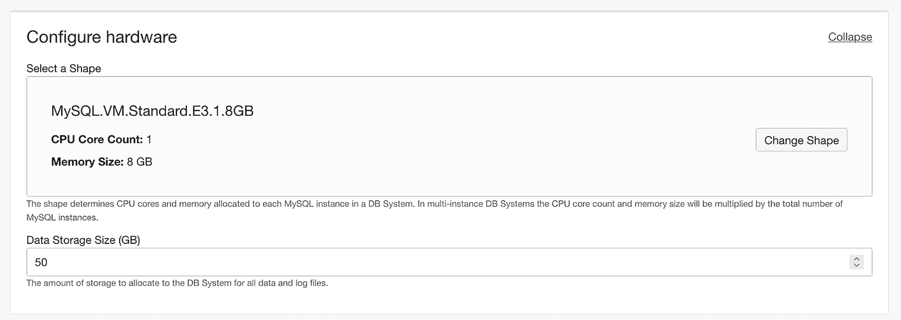

图 5-25 还原数据库系统（第 4 部分）

一个标题为“配置硬件”的对话框。提供两个框，标题分别为：选择配置，以及数据存储大小（GB）。

#### 配置硬件

由于我们是从备份创建新的数据库系统，我们将使用默认设置，但您可以借此机会更改设置。只需确保数据的新大小足以存储您的数据即可。

> **注意**
> 如果您选择的配置比创建备份时使用的配置小，您必须确保新配置具有支持数据库系统所需的正确资源。例如，您必须确保有足够的处理器和内存分配以满足性能预期，并有足够的磁盘空间分配来还原数据。

> **重要提示**
> 从备份还原时，无法更改数据库系统的类型。例如，如果原始数据库系统是“独立”型，您的新数据库系统也将是“独立”型。

#### 配置备份计划

下一部分允许您选择启用自动备份、保留期和开始时间，如图 [5-26] 所示。此信息将与用于备份的数据库系统相同，但您可以更改选项。如果启用了时间点还原，您可以通过勾选所示的复选框来禁用它。

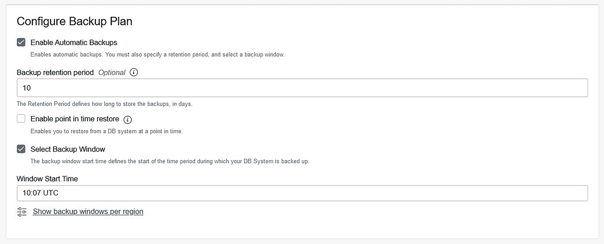

图 5-26 还原数据库系统（第 5 部分）

一个标题为“配置备份计划”的对话框。提供两个框，标题分别为：备份保留期，和窗口开始时间。“启用自动备份”和“选择备份窗口”选项标记为已选中。

#### 摘要与最终配置

最后一部分是一个摘要，包含多个选项卡，允许您更改许多配置项，包括以下内容。同样，默认情况下，设置将与用于备份的原始数据库系统相同：

*   **删除计划**：显示数据库系统的删除计划，包括是否启用、自动备份的保留时间以及最终备份的状态。启用/禁用链接是用于启用或禁用删除计划的快捷方式。
*   **配置**：显示有关数据库系统的信息，包括其配置、内存和存储大小、MySQL 版本和配置，以及是否启用了崩溃恢复。存储大小旁边的编辑链接是更改数据库系统存储大小的快捷方式。
*   **崩溃恢复**：启用或禁用崩溃恢复。禁用崩溃恢复可以提高性能，但也会关闭自动备份。请明智使用。
*   **管理**：显示 MDS 维护窗口开始时间。请务必选择您使用量最低的时间段，以避免潜在冲突。
*   **网络**：显示主机名、IP 地址和 MySQL 端口。除非您想自定义端点，否则不应更改这些设置。
*   **标签**：显示数据库系统的标签。您也可以添加标签。

图 [5-27] 显示了还原备份对话框的摘要部分。

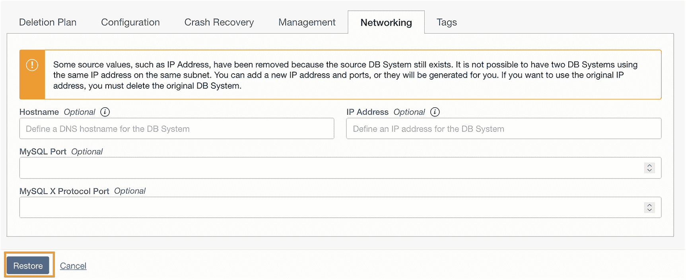

图 5-27 还原数据库系统（第 6 部分）

一个对话框包含以下标题：删除计划、配置、崩溃恢复、管理、网络和标签。其中选择了“网络”选项，“还原”标记为已选中。

#### 执行还原

一旦您通过这些选项卡决定了任何自定义设置，并准备好从备份还原数据库系统，就可以单击 *还原* 按钮。

还原完成后，您将在数据库系统列表中看到它，并且现在可以访问新的数据库系统。如果您还原了正在使用的数据库系统的备份，则将生成一个新的端点，因此请务必检查还原的数据库系统详细信息页面以获取详细信息。例如，图 [5-28] 显示了上述还原的数据库系统上的新端点。

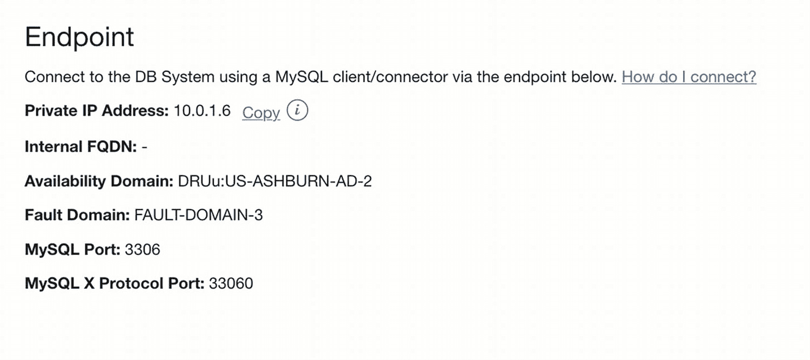

图 5-28 已还原数据库系统详细信息页面（新端点）

一个标题为“端点”的对话框。提供以下详细信息：私有 IP 地址、内部 FQDN、可用性域、故障域、MySQL 端口，以及 MySQL X 协议端口。

如果您遵循本章开头的教程创建了新的数据库系统，当您导航到已还原的数据库系统详细信息页面时，应该会看到一个不同的端点。

这就结束了我们对 MDS 备份和还原操作的探讨。


## 总结

如果你已经按照本章的示例操作，并创建了自己的数据库系统、备份并进行了恢复，那么你已经了解到创建和操作数据库系统是非常容易的。一旦你熟悉了操作按钮的位置以及访问相同功能的几种方法，这就变得相当例行化了。

而且，如果你曾在自己的硬件（甚至是你自己的个人电脑）上设置并安装过 MySQL，你很可能已经发现配置 MySQL 需要大量的工作。也就是说，与其他一些系统相比，安装是轻而易举的，但调整 MySQL 可能是一个相当大的挑战。幸运的是，MDS 让所有这些工作都成为了过去。

在本章中，我们学习了 MDS 备份资源。我们详细了解了备份资源，包括如何列出它们。我们还学习了如何备份我们的数据库系统，包括设置自动备份以及如何创建手动备份。我们了解了增量备份和完全备份之间的区别，以及何时可能需要使用每种方式。最后，我们学习了如何使用备份资源来恢复数据库系统。

在下一章中，我们将学习如何启用一个名为“时间点恢复”的新恢复功能；这是一种自动恢复机制，可以将你的数据库恢复到过去特定的 5 分钟时间段。很酷。

脚注 1

# 6. 时间点恢复

备份和恢复面临的一个挑战，体现在需要将数据库或一组数据库恢复到关键事件发生前的特定时间点的任务上。更具体地说，数据被认为在某个导致不一致或数据丢失的特定事件之前是有效的。例如，该事件可能是操作员错误、软件缺陷或硬件/连接问题的结果。

当这种情况发生时，系统管理员（或数据库管理员）必须使用最后一个已知完好的备份来恢复数据。然而，如果备份设置在午夜进行，而更改数据的事件发生在白天，那么可能会有数小时的数据变更丢失，并且必须以某种方式重新创建。

幸运的是，MySQL 中有一个功能可以用来保护你自己免受此类恢复事件的影响。它被称为时间点恢复（PITR），是复制技术和备份策略的结合。

在本章中，我们将从简要概述 PITR 在本地的工作原理开始，学习 OCI MySQL 数据库服务（MDS）中 DB 系统上的 PITR。这将使你有机会了解 MDS 中的 PITR 以及如何利用它来为数据恢复获取优势。

## 概述

拥有本地 MySQL 服务器的用户可以使用 MySQL 中的一个名为“二进制日志”的功能，它以特殊的二进制格式记录你数据的变更，如果在需要数据恢复时可以重放。与物理备份类似，二进制日志不是人类可读的，但与物理备份不同，它们必须一个事件（数据变更）一个事件地处理，这使得它们作为恢复机制使用起来很麻烦。

启用二进制日志记录的最佳方式是在你的 `my.cnf`（或 `my.ini`）配置文件中添加以下行并重启你的 MySQL 服务器。

```
log_bin=ON
```

你也可以通过使用以下命令来判断二进制日志记录是否已启用。注意值为 `ON`，这意味着二进制日志记录已启用：

```
MySQL  localhost:33060+ ssl  SQL > SHOW VARIABLES LIKE 'log_bin' \G
*************************** 1. row ***************************
Variable_name: log_bin
Value: ON
1 rows in set (0.0033 sec)
```

你也可以使用以下命令为特定命令或一系列命令关闭二进制日志记录，这告诉 MySQL 跳过记录事件。这对于某些管理命令或你不想暴露给二进制日志（或传播给二进制日志的消费者，例如那些用于复制的）的数据更改可能很有用：

```
SET sql_log_bin = ON

SET sql_log_bin = OFF
```

有趣的是，二进制日志是启用 MySQL 高可用性功能的关键组件之一。我们将在第 8 章探讨 MDS 中的高可用性功能。

提示

有关 MySQL 二进制日志的更多信息，请参阅 [`https://dev.mysql.com/doc/refman/8.0/en/binary-log.xhtml`](https://dev.mysql.com/doc/refman/8.0/en/binary-log.xhtml)。

一旦二进制日志记录开启，你的 MySQL 服务器就会在处理每个事件时进行记录并将其写入日志。这些日志的设计允许手动或自动轮换以减小文件大小。

当与常规备份结合使用时，你可以设置备份例程，在数据快照之前立即轮换二进制日志。这使你能够开始记录自上次备份以来创建了哪些二进制日志。

如果发生需要恢复到自动备份之间时间段的事件，你可以恢复最新的备份，然后通过重放（执行或应用）自上次备份以来创建的二进制日志，将数据应用到事件发生点。对于在本地服务器上使用此机制的用户，你可以使用二进制日志记录工具来帮助定位恢复数据的精确位置。

这种机制，即 PITR，在 MDS 中对于数据库系统是可用的，并且是完全自动化的。你无需担心二进制日志、要恢复哪个备份或任何此类细节——所有这些都由 MDS 自动化机制处理。事实上，它使用起来非常简单，你只需打开它然后忘记它（直到你需要恢复数据）。

然而，复杂任务的自动化总是会导致某种程度的限制，以使其一致且可靠。OCI 为 MDS PITR 施加的限制是恢复窗口。目前，你可以使用启用 PITR 的 DB 系统将数据恢复到任何 5 分钟的时间段。因此，你最多可能需要手动恢复 5 分钟的数据，这对于在备份之间自动恢复数据来说是一个很小的代价。

现在我们了解更多关于 PITR 的信息了，让我们看看如何设置我们的数据库系统。


## 设置

您可以随时通过**数据库系统**详情页面启用时间点恢复（PITR）功能，为数据库系统进行设置。您也可以在创建数据库系统时启用 PITR。该功能需要激活自动备份，因此如果您的数据库系统已关闭此功能，您将需要先启用 PITR。

要检查您的数据库系统是否已启用 PITR 或自动备份，请访问数据库系统详情页面，并查找`备份`部分，如图 6-1 所示。

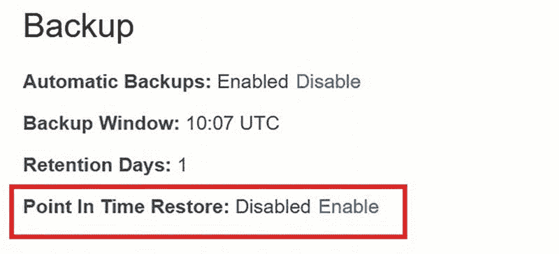

这是备份部分的截图，显示了自动备份、备份窗口、保留天数和时间点恢复详情。其中时间点恢复被高亮显示。

图 6-1

备份设置 – 已禁用（数据库系统详情页面）

要在数据库系统上启用 PITR，请点击所示的`启用`链接。这将打开一个新的`编辑备份计划`对话框，您可以在其中配置该功能。您可以设置备份保留期（天数），勾选`启用时间点恢复`复选框来启用 PITR，并选择备份窗口。设置完成后，您可以点击`保存更改`按钮以启用 PITR 和自动备份（如适用）。图 6-2 展示了`编辑备份计划`对话框。

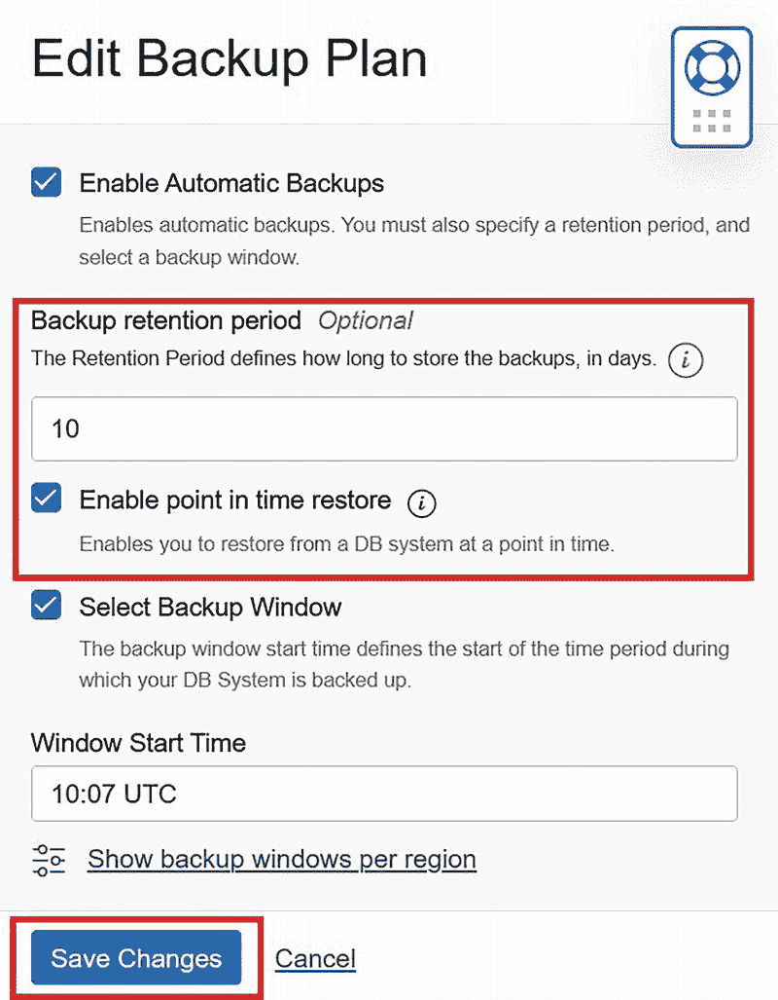

这是编辑备份计划的截图，其中 3 个复选按钮已被选中。备份保留期设置为 10，底部的“保存更改”按钮被高亮显示。

图 6-2

编辑备份计划对话框

### 注意

如果您的数据库系统运行的是 MySQL 8.0.28，则需要至少更新到 MySQL 8.0.29 才能使用 PITR。您可以在详情页面上，通过点击 MySQL 版本旁边的`编辑`链接，并从列表中选择您想要升级到的版本，来升级您的数据库系统。

保存更改后，数据库系统将进入更新期，以便 MDS 自动化在后台完成配置更改。完成后，您将看到自动备份和 PITR 已启用，如图 6-3 所示。

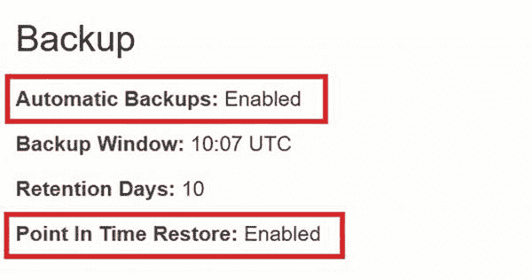

这是一个备份菜单，列出了自动备份、备份窗口、保留天数和时间点恢复。自动备份和时间点恢复已启用，并被一个矩形框高亮标出。

图 6-3

备份设置 – 已启用（数据库系统详情页面）

如果您想在新的数据库系统上启用 PITR，可以在创建数据库系统的对话框的“备份”部分完成相同的参数设置，如图 6-4 所示。

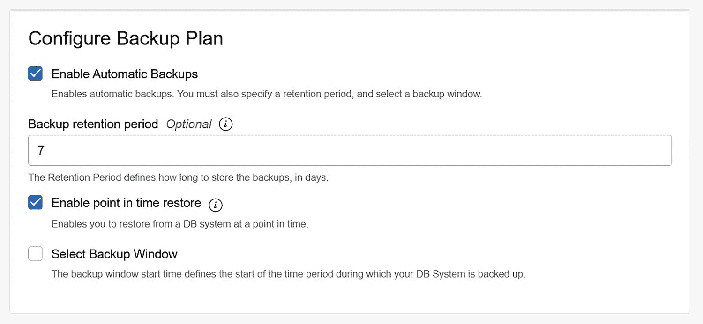

这是一个配置备份计划的对话框，其中“启用自动备份”和“启用时间点恢复”复选框已被选中。备份保留时间为 7。

图 6-4

备份设置（创建数据库系统）

最后，您可以通过在数据库系统详情页面的资源菜单上选择“备份”列表来列出您的备份，如图 6-5 所示。

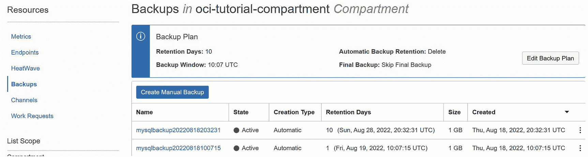

一个窗口页面显示了备份列表，顶部是详细信息，底部是列出备份的表格。

图 6-5

备份列表（数据库系统详情页面）

现在我们知道了如何设置 PITR，接下来看一个小演示，了解如何使用 PITR 恢复数据库系统。

## 恢复

使用 PITR 恢复数据库系统与使用任何普通备份恢复非常相似。不同之处在于您选择备份的方式。如果您选择通过 PITR 条目恢复，则需要从列表中选择最新的备份。

为了使这个演示可行，我们需要引入一个我们需要从中恢复的事件。一个简单的`DROP DATABASE`或类似的 SQL 语句就足够了。在这个例子中，我执行了一个`DROP DATABASE sakila`; 命令。

我通过登录到一个计算实例，然后在该计算实例上启动`MySQL Shell`来连接到数据库系统，从而完成了此操作。然后，我在大约 UTC 时间 21:06 发出了`DROP`命令。我使用计算实例详情页面上显示的`公网 IP 地址`，通过以下命令登录到计算实例：

```bash
ssh -i c:\users\cbell\.ssh\ssh-key-2022-08-16.key opc@150.136.69.126
```

从那里，我使用`MySQL Shell`登录到 MySQL 并删除了数据库：

```
[opc@connection-instance ~]$ mysqlsh --sql mysql_admin@10.0.1.226:33060
MySQL Shell 8.0.30
Copyright (c) 2016, 2022, Oracle and/or its affiliates.
Oracle is a registered trademark of Oracle Corporation and/or its affiliates.
Other names may be trademarks of their respective owners.
MySQL  10.0.1.226:33060+ ssl  SQL > DROP DATABASE sakila;
Query OK, 23 rows affected (0.1493 sec)
```

好的，现在我们的事件发生了。现在，我们可以尝试恢复到 UTC 时间 21:06 之前的一个时间点。我们可以通过点击备份列表中备份的上下文菜单里的`恢复到新数据库系统`来完成此操作，如图 6-6 所示。如果您有更多备份可供选择，您应该选择事件发生前最近日期的备份。

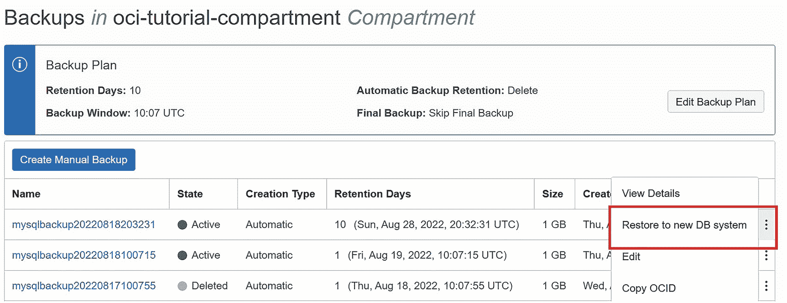

一个窗口页面显示了备份列表，顶部是详细信息，底部是一个包含 4 行 7 列的表格来列出备份。在查看详细信息中，选择并更改为“恢复到新数据库系统”。

图 6-6

启动恢复到新数据库系统（数据库系统详情页面的备份列表）

这将启动一个新对话框，您可以在其中为新的数据库系统更改几个参数。对话框的第一部分涉及备份设置，如图 6-7 所示。

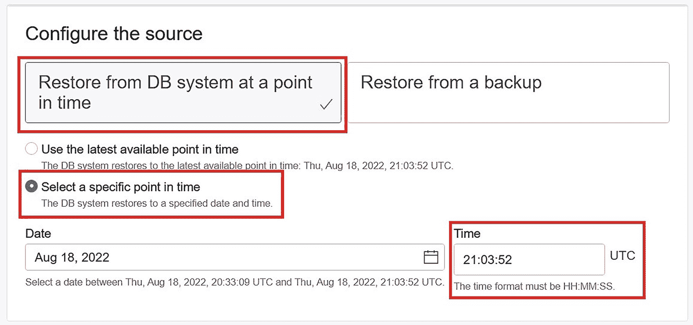

一个用于配置源的对话框，突出显示了“从数据库系统在某个时间点恢复”、“选择特定时间点”和“时间”。

图 6-7

从备份恢复数据库系统（PITR）

这是您可以指定要恢复到特定时间点的区域。首先点击`从数据库系统在某个时间点恢复`。注意这允许您选择最新的 PITR 时间段或特定时间段。在这个演示中，我们勾选`选择特定时间点单选按钮`。最后，您可以输入一个在您事件发生之前的时段。在这个例子中，最后一个可用的条目是 UTC 时间 21:03。只需将显示的时间减少 5 分钟，直到达到您想要的时段。

一旦您点击`恢复`按钮并且数据库系统准备就绪，我们就可以登录并看到`sakila`数据库确实存在，并且不需要的数据更改事件已被恢复。回想一下，底层进行了很多操作。MDS 从最后一个已知完好的备份进行恢复，恢复后，会应用自备份以来记录的二进制日志。所有这些都无需用户干预。是不是很酷？

回想一下，在启动`MySQL Shell`之前，我们必须先登录到一个计算实例，使用如图 6-8 所示的已恢复数据库系统的`私有 IP 地址`。

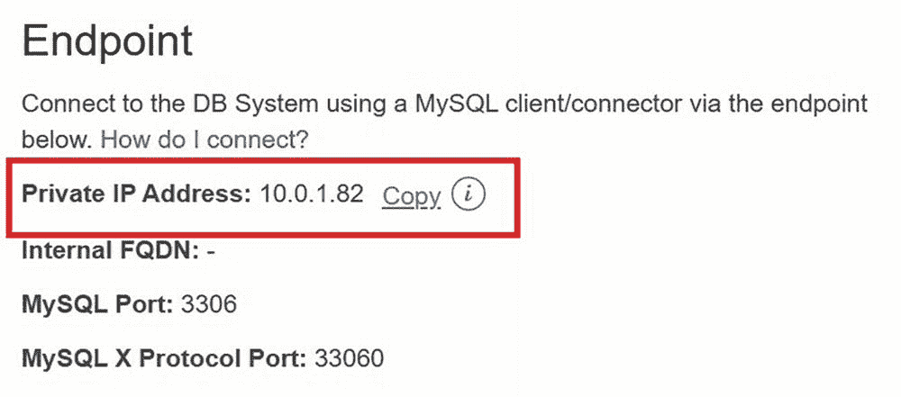

一个端点菜单显示了私有 IP 地址、互联网 FQDN、MySQL 端口和 MySQL X 协议端口。私有 IP 地址被一个矩形框高亮标出。

图 6-8

私有 IP 地址（通过 PITR 恢复的数据库系统）


清单 6-1 展示了一个测试，用于确保 `sakila` 数据库存在。

```
[opc@connection-instance ~]$ mysqlsh --sql mysql_admin@10.0.1.82:33060
Please provide the password for 'mysql_admin@10.0.1.82:33060': ****************
Save password for 'mysql_admin@10.0.1.82:33060'? [Y]es/[N]o/Ne[v]er (default No): yes
MySQL Shell 8.0.30
Copyright (c) 2016, 2022, Oracle and/or its affiliates.
Oracle is a registered trademark of Oracle Corporation and/or its affiliates.
Other names may be trademarks of their respective owners.
Type '\help' or '\?' for help; '\quit' to exit.
Creating a session to 'mysql_admin@10.0.1.82:33060'
Fetching schema names for autocompletion... Press ^C to stop.
Your MySQL connection id is 13 (X protocol)
Server version: 8.0.29-u2-cloud MySQL Enterprise - Cloud
No default schema selected; type \use  to set one.
MySQL  10.0.1.82:33060+ ssl  SQL > SHOW DATABASES;
+--------------------+
| Database           |
+--------------------+
| information_schema |
| mysql              |
| performance_schema |
| sakila             |
| sys                |
| world              |
+--------------------+
6 rows in set (0.0012 sec)
MySQL  10.0.1.82:33060+ ssl  SQL > SELECT first_name, last_name FROM sakila.actor LIMIT 10;
+------------+--------------+
| first_name | last_name    |
+------------+--------------+
| PENELOPE   | GUINESS      |
| NICK       | WAHLBERG     |
| ED         | CHASE        |
| JENNIFER   | DAVIS        |
| JOHNNY     | LOLLOBRIGIDA |
| BETTE      | NICHOLSON    |
| GRACE      | MOSTEL       |
| MATTHEW    | JOHANSSON    |
| JOE        | SWANK        |
| CHRISTIAN  | GABLE        |
+------------+--------------+
10 rows in set (0.0094 sec)
Listing 6-1
Testing the Data (Restored DB System)
```

就是这样！现在我们知道了如何使用基于时间点的恢复将数据库系统恢复到特定的 5 分钟时间段。

## 总结

基于时间点恢复与自动备份一样，是一项可以增强您从数据灾难中恢复的能力并降低数据丢失风险的功能。MDS 中的 PITR 是自动化的且易于设置。使用 PITR 恢复您的数据库系统也同样易于实现，无需记录复杂的系统参数或处理二进制日志文件。一旦您有机会使用该功能，并且在极少数情况下依赖它来恢复系统运行，您将会赞赏 Oracle 所做的工作，他们让数据库系统所有者在执行这一复杂任务时变得简单。

在下一章中，我们将学习可用于将数据导入或导出到您的 MDS 数据库系统的选项。

# 7. 数据导入与导出

MDS 中的数据库系统显然是一种非常强大且引人入胜的替代方案，可替代本地 MySQL 服务器。我们已经了解了如何创建数据库系统和创建备份，但是当您想将您自己的数据导入新的数据库系统时，您该怎么做？或者，如果您想将数据库系统中的数据副本用于本地开发实验室，您该如何导出数据？

幸运的是，有一些方法可以导出数据并将其导入到您的数据库系统。正如您将看到的，该过程并不复杂，并且适用于大多数用例。但是，如果您的数据量非常大，拥有许多 GB 或 TB 的数据，您可能需要考虑联系 Oracle 的 MySQL 销售团队，以获取有关导入数据的更多选项。

在本章中，我们将发现几种可以将数据迁移到云中或从云中迁出的方法。但首先，让我们看看一些概念、策略和工具。

## 概述

Oracle 确保您不必从零开始填充您的数据库系统。您确实可以将数据从本地 MySQL 服务器复制到数据库系统。Oracle 在文档中使用了几个术语，包括迁移和导入数据。但是，将数据复制到云中的过程称为迁移，而执行迁移的操作是名为导出和导入的两个过程。

在本节中，我们将概述用于将数据从您的本地 MySQL 服务器迁移到 MDS 中的数据库系统的工具和过程。

### 将数据迁移到 MDS

推荐的将数据迁移到 MDS 的过程涉及首先使用 MySQL Shell 导出数据，采用几种策略之一将导出的数据传输到您的数据库系统，然后使用 MySQL Shell 导入数据。我们将在下一节中看到将数据传输到数据库系统的策略。

MySQL Shell 有几种用于导出数据的方法（也称为实用工具）和一种用于导入数据的方法。这些方法位于名为 `util` 的 Java 模块中，该模块是 MySQL Shell 的一部分。要使用这些方法，您必须处于 JavaScript 模式。我们可以在启动 MySQL Shell 时使用 `--js` 选项设置模式，也可以在 shell 中使用 `/js` shell 命令切换到 JavaScript 模式。当您以 JavaScript 模式启动 shell 或切换到该模式时，您应该会看到如下提示：

```
MySQL  localhost:33060+ ssl  JS >
```

注意

我们在第 3 章中见过 MySQL Shell，如果您一直在按照书中的示例操作，您应该已经安装了 MySQL Shell。如果没有，请访问文档 [`https://dev.mysql.com/doc/mysql-shell/8.0/en/`](https://dev.mysql.com/doc/mysql-shell/8.0/en/) 了解如何下载和安装 MySQL Shell。

以下简要描述了用于导入和导出数据的方法。我们列出了必需和可选的参数（显示在方括号中）。虽然这些看起来像是 JavaScript 方法（它们确实是），但它们在底层执行了一个实用工具。因此，Oracle 称这些方法为“实用工具”：

*   `util.dumpInstance(outputUrl[, options])`：使用此实用工具从 MySQL 服务器导出所有兼容的数据库（模式）。默认情况下，该实用工具导出用户、事件、存储过程和触发器。

*   `util.dumpSchemas(schemas, outputUrl[, options])`：使用此实用工具从 MySQL 服务器导出数据库（模式）列表。因此，您可以使用它一次导出一个数据库（模式），或者导出部分数据库以迁移到 MDS。

*   `util.loadDump()`：使用此实用工具从 `dump*()` 方法导出的文件中导入数据。

这是 MySQL Shell 中可用实用工具的部分列表。有关完整列表，请参见 [`https://dev.mysql.com/doc/mysql-shell/8.0/en/mysql-shell-utilities.xhtml`](https://dev.mysql.com/doc/mysql-shell/8.0/en/mysql-shell-utilities.xhtml)。该文档包含专门介绍转储（导出）数据实用工具的部分。我们将在后面的章节中实际查看其中一些实用工具。但首先，我们必须讨论将导出的数据传输到您的数据库系统以进行导入的策略。

提示

有关使用 `dumpInstance()` 方法的更多信息，请参见 [`https://dev.mysql.com/doc/mysql-shell/8.0/en/mysql-shell-utilities-dump-instance-schema.xhtml`](https://dev.mysql.com/doc/mysql-shell/8.0/en/mysql-shell-utilities-dump-instance-schema.xhtml)。


### 数据传输策略

如前所述，将导出数据传输到你的数据库系统以进行导入有三种方式。最快的方式是使用另一个 OCI 资源，名为 `ObjectStore` 作为从 `MySQL Shell` 指定的目标，Shell 会将数据直接复制到 `ObjectStore` 存储桶中。一种较慢的方法是使用一个中间的 `Compute` 实例，你将数据复制到该实例，然后再导入。最慢的方法是设置一个 `Bastion 服务`，将你的个人电脑连接到你的数据库系统，在导入时直接从你的个人电脑读取数据。

回顾第 2 章，`ObjectStore` 是一种存储资源，允许你将一组文件视为对象进行处理。`ObjectStore` 允许你将文件（对象）放置在一个称为“存储桶”的容器中。因此，当你使用 `MySQL Shell` 导出到 `ObjectStore` 时，实际上是将数据文件导出到一个存储桶中，然后在后续导入过程中从该存储桶读取这些文件。

那么，哪种方法最好呢？这取决于你的环境配置以及 `OCI` 资源的设置方式。不过，推荐的方法是使用 `ObjectStore`。但请注意，使用 `ObjectStore` 将导出的数据放入存储桶可能会产生少量费用，如果你将文件留在存储桶中的话（`ObjectStore` 是一项付费资源）。

### 其他物理备份工具怎么办？

虽然可以使用某些物理备份工具，如 `MySQL Enterprise Backup` (`MEB`) 来备份你的本地 `MySQL` 并将其恢复到 `MDS` 数据库系统上，但这个过程很复杂，并且需要对 `MySQL` 数据文件存储、`数据库系统` 配置有深入的了解，还需要一个能在 `OCI` 中使用的有效工具许可证。因此，**不建议**使用物理备份工具来导入你的本地数据。

### 兼容性问题

虽然你在将数据迁移到 `MDS` 时不太可能遇到问题，但有一些关于你的本地 `MySQL` 服务器与 `MDS` 之间兼容性的注意事项需要留意。

## 安全性

首先，在安全性方面存在一些限制，这些限制在你的本地服务器上可能不存在。幸运的是，`MySQL Shell` 中的转储工具可以检测到此类问题，并且在某些情况下，可以通过修改 SQL `CREATE` 语句在导出过程中使你的数据库（模式）兼容。你可以在 `MySQL Shell` 中调用（call） `util.dumpInstance()` 方法时指定 `ocimds:true` 选项来启用此功能。这些选项以 `JSON` 文档形式添加。例如，要为 `util.dumpInstance()` 调用提供 `ocimds` 和 `dryRun` 选项，你可以使用以下命令：

```javascript
util.dumpInstance(".\test",{ocimds:true,dryRun:true});
```

此选项指示 `MySQL Shell` 转储工具对你的数据库运行兼容性检查。如果发现任何无法自动修复的问题，你将看到一份详细报告，其中包含如何修复这些问题的策略和示例。

**提示**

强烈建议在第一次使用 `MySQL Shell` 中的转储工具时使用 `ocimds:true` 和 `dryRun:true` 选项。这将让你有机会在开始迁移前查看并修复任何潜在问题。

要在转储工具中使用自动纠正功能，你必须在调用该方法时，通过 `compatibility=<列表>` 选项提供一个以逗号分隔的列表，其中包含以下一个或多个兼容性检查覆盖项（作为字符串输入）。例如，`util.dumpInstance(..., compatibility:["force_innodb", "strip_definers"], ...)`：

*   `force_innodb`：修改 `ENGINE=` 子句以使用 `INNODB`。这确保所有表在转储时，其 `CREATE TABLE` 语句都使用 `InnoDB` 存储引擎。`MDS` 仅支持 `InnoDB` 存储引擎。
*   `strip_definers`：从视图、例程、事件和触发器中移除 `DEFINER=<账户>` 子句。
*   `strip_restricted_grants`：从 `GRANT` 语句中移除那些 `MDS` 不使用的权限。这些权限包括 `RELOAD`、`FILE`、`SUPER`、`BINLOG_ADMIN` 和 `SET_USER_ID`。
*   `skip_invalid_accounts`：跳过任何没有密码的用户账户。
*   `strip_tablespaces`：从 `CREATE TABLE` 语句中移除 `TABLESPACE=<>` 选项。
*   `create_invisible_pks`：为没有主键的表添加主键。`MDS` 要求主键以实现高可用性。
*   `ignore_missing_pks`：允许没有主键的表。仅当你不打算为 `数据库系统` 使用高可用性功能时才使用此选项。

**提示**

有关这些选项和兼容性检查的更多信息，请参见 [`https://dev.mysql.com/doc/mysql-shell/8.0/en/mysql-shell-utilities-dump-instance-schema.xhtml`](https://dev.mysql.com/doc/mysql-shell/8.0/en/mysql-shell-utilities-dump-instance-schema.xhtml)。

让我们看一个使用兼容性功能的例子。

在这个例子中，我们在本地 `PC` 上运行着一个 `MySQL` 服务器，版本为 `8.0.23`。服务器上有几个数据库，其中一些是示例数据库，如代码清单 7-1 所示。

```sql
MySQL  localhost:33060+ ssl  SQL > SHOW DATABASES;
+--------------------+
| Database           |
+--------------------+
| animals            |
| contact_list1      |
| contact_list2      |
| contact_list3      |
| greenhouse         |
| information_schema |
| library_v1         |
| library_v2         |
| library_v3         |
| mysql              |
| performance_schema |
| plant_monitoring   |
| sakila             |
| sys                |
| test               |
| world              |
| world_x            |
+--------------------+
```
*清单 7-1 示例：本地服务器数据库*

注意，`sakila`、`world` 和 `world_x` 是来自 `Oracle` 的示例数据库。

要运行转储工具的试运行（dry run）并执行兼容性检查，我们使用以下命令。注意我们必须切换到 `JavaScript` 模式才能使用该命令。此外，位置或目标路径是必需的，但我们将使用名为 `test` 的本地子文件夹（由于是试运行，不会创建任何文件）：


### 检查兼容性问题（发现）

```
util.dumpInstance(".\test",{ocimds:true,dryRun:true})
```

运行此命令后，我们将看到一个所有兼容性问题的列表。清单 7-2 展示了你可能会看到的一些错误和警告类型的摘录。

```
dryRun enabled, no locks will be acquired, and no files will be created.
Acquiring global read lock
Global read lock acquired
Initializing - done
13 out of 17 schemas will be dumped and within them 43 tables, 8 views, 10 routines, 6 triggers.
4 out of 7 users will be dumped.
Gathering information - done
All transactions have been started
Locking instance for backup
Global read lock has been released
Checking for compatibility with MySQL Database Service 8.0.28
NOTE: Database test had unsupported ENCRYPTION option commented out
NOTE: Database world_x had unsupported ENCRYPTION option commented out
NOTE: Database library_v3 had unsupported ENCRYPTION option commented out
NOTE: Database library_v2 had unsupported ENCRYPTION option commented out
...
NOTE: Database world had unsupported ENCRYPTION option commented out
NOTE: Database contact_list2 had unsupported ENCRYPTION option commented out
NOTE: Database plant_monitoring had unsupported ENCRYPTION option commented out
NOTE: Database library_v1 had unsupported ENCRYPTION option commented out
...
NOTE: Database contact_list1 had unsupported ENCRYPTION option commented out
NOTE: Database greenhouse had unsupported ENCRYPTION option commented out
NOTE: Database contact_list3 had unsupported ENCRYPTION option commented out
NOTE: Database animals had unsupported ENCRYPTION option commented out
ERROR: Table 'library_v1'.'books_authors' does not have a Primary Key, which is required for High Availability in MDS
...
ERROR: View animals.num_pets - definition does not use SQL SECURITY INVOKER characteristic, which is required (fix this with 'strip_definers' compatibility option)
ERROR: One or more tables without Primary Keys were found.
MySQL Database Service High Availability (MDS HA) requires Primary Keys to be present in all tables.
To continue with the dump you must do one of the following:
* Create PRIMARY keys in all tables before dumping them.
MySQL 8.0.23 supports the creation of invisible columns to allow creating Primary Key columns with no impact to applications. For more details, see https://dev.mysql.com/doc/refman/en/invisible-columns.xhtml.
This is considered a best practice for both performance and usability and will work seamlessly with MDS.
* Add the "create_invisible_pks" to the "compatibility" option.
The dump will proceed and loader will automatically add Primary Keys to tables that don't have them when loading into MDS.
This will make it possible to enable HA in MDS without application impact.
However, Inbound Replication into an MDS HA instance (at the time of the release of MySQL Shell 8.0.24) will still not be possible.
* Add the "ignore_missing_pks" to the "compatibility" option.
This will disable this check and the dump will be produced normally, Primary Keys will not be added automatically.
It will not be possible to load the dump in an HA enabled MDS instance.
Compatibility issues with MySQL Database Service 8.0.28 were found. Please use the 'compatibility' option to apply compatibility adaptations to the dumped DDL.
Validating MDS compatibility - done
Util.dumpInstance: Compatibility issues were found (RuntimeError)
Listing 7-2
Checking for Compatibility (Issues Found)
```

我们在这里看到了一些错误。其中大多数与不使用 `SECURITY INVOKER` 特性的对象有关。报告告诉我们要使用 `strip_definers` 兼容性选项。我们还看到了缺少主键的问题，但由于我们不会使用高可用性功能，所以这不是问题。为此，我们使用 `ignore_missing_pks` 兼容性选项。其他被指出的问题包括注释掉的加密子句，这可以在迁移过程中修复。

如果我们再次运行命令，但这次按照建议提供兼容性选项，使用以下命令（为便于阅读进行了格式化），我们将得到一个短得多的报告。我们还使用了 `strip_restricted_grants` 兼容性选项来修复具有不兼容权限的用户账户（清单中未显示）：

```
util.dumpInstance(".\test",
{
ocimds:true,
dryRun:true,
compatibility:[
"strip_definers",
"ignore_missing_pks",
"strip_restricted_grants"
]
}
)
```

一旦我们使用这个新命令，我们将得到一个更干净的报告，如清单 7-3 所示。

```
dryRun enabled, no locks will be acquired, and no files will be created.
Acquiring global read lock
Global read lock acquired
Initializing - done
13 out of 17 schemas will be dumped and within them 43 tables, 8 views, 10 routines, 6 triggers.
4 out of 7 users will be dumped.
Gathering information - done
All transactions have been started
Locking instance for backup
Global read lock has been released
Checking for compatibility with MySQL Database Service 8.0.28
...
NOTE: One or more tables without Primary Keys were found.
This issue is ignored.
This dump cannot be loaded into an MySQL Database Service instance with High Availability.
Compatibility issues with MySQL Database Service 8.0.28 were found and repaired. Please review the changes made before loading them.
Validating MDS compatibility - done
Writing global DDL files
Writing users DDL
Writing DDL - done
Starting data dump
0% (0 rows / ~83 rows), 0.00 rows/s, 0.00 B/s uncompressed, 0.00 B/s compressed
Listing 7-3
Checking for Compatibility (No Issues Found)
```

在这里，我们看到一个所有关键兼容性问题都已解决的报告。然后你可以继续进行并删除 `dryRun:true` 选项。

### 较旧的 MySQL 版本

还有一个兼容性问题需要考虑：MySQL 版本。迁移支持的最低版本是 MySQL 5.7.9。但是，如果你的版本比 MDS 中当前提供的版本（目前是 8.0.29）更旧，你应该考虑运行 MySQL Shell 升级检查器实用程序，以查看迁移潜在问题的报告。有关此实用程序的更多信息，请参阅 MySQL Shell 用户指南 – 升级检查器实用程序 ([`https://dev.mysql.com/doc/mysql-shell/8.0/en/mysql-shell-utilities-upgrade.xhtml`](https://dev.mysql.com/doc/mysql-shell/8.0/en/mysql-shell-utilities-upgrade.xhtml))。

现在我们已经了解了数据迁移过程的一些知识，我们可以看到这些方法的示例来学习如何使用它们。在以下部分中，我们将看到通过首先将数据从本地 MySQL 服务器迁移到 DB System，然后重新审视将数据从 DB System 迁移到本地 MySQL 服务器的过程，来实际操作导出和导入的示例。正如你将看到的，每个过程都需要使用导出和导入机制，我们将看到完成该过程的各种方式。这为你提供了将数据导入 MDS 的选项，你可以根据需要进行调整。

如果你想跟随下一部分的示例进行操作，你应该准备你的本地 MySQL 服务器只包含 `sakila` 和 `world` 数据库。如果你包含其他数据库，你可能需要调整所示的命令。你可以在 [`https://dev.mysql.com/doc/index-other.xhtml`](https://dev.mysql.com/doc/index-other.xhtml) 的 *示例数据库* 标题下找到这些示例数据库及其安装方法。

### 将数据迁移到 MDS

在将数据迁移到 MDS 时，我们必须选择三种移动导出数据到 MDS 的方法之一。回想一下，这些方法包括使用 ObjectStore 存储桶、将导出的数据上传到中间的 Compute 实例，以及通过 Bastion 网关将导出的数据直接上传到我们的 DB System。本节演示了使用每种机制将数据迁移到 MDS。正如你将看到的，所有方法都使用 MySQL Shell 来导出和导入数据。


### 使用对象存储桶

第一种从本地 MySQL 服务器导出数据的方法是使用对象存储作为导出数据的中间存储。我们将使用本地 MySQL 服务器上的 MySQL Shell 创建数据导出，将其放入对象存储，然后再次使用 MySQL Shell 从我们的 MDS DB 系统访问该数据进行导入。

为了使用对象存储桶选项来上传导出的数据，您必须先配置您的 PC 以允许使用 OCI CLI。这是因为该机制和自动化过程将需要使用您的安全凭据。我们需要配置系统以允许自动访问您 OCI 租户中的对象。然而，您应考虑将 OCI CLI 访问凭据存储在 PC 上的潜在安全影响。您只需设置一次 PC，并且除非您的 SSH 密钥发生变化，否则无需更改配置。

**注意**

一旦您将 PC 配置为自动访问租户中的某些对象，您应确保 PC 的安全性足够，以防止未经授权的访问来保护您的 OCI 凭据。

#### 为 OCI CLI 访问配置您的 PC

您需要配置 PC 两件事以通过 API 访问 OCI 对象：(1) 您需要一个 SSH 密钥对，并将公钥上传到您的 OCI 账户，以及 (2) 您需要创建一个包含您账户信息的特殊 OCI 配置文件。如果您已有创建好的 SSH 密钥对，可以使用它，但下面演示了如何创建 SSH 密钥对并上传到您的 OCI 账户。

**提示**

以下示例展示了如何在 Windows 上生成 SSH 密钥对。如果您使用 Mac 或 Linux，请参阅 `https://docs.oracle.com/en-us/iaas/Content/API/Concepts/apisigningkey.htm#Required_Keys_and_OCIDs` 以获取特定于平台的生成密钥命令示例。

首先，我们需要创建一个 SSH 密钥对，但我们会将密钥放在用户账户的一个特殊文件夹中。打开 Windows PowerShell（或终端），在您的用户目录中创建一个名为 `.oci` 的文件夹并切换到该目录，如下所示：

```
PS C:\Users\cbell> mkdir %HOMEDRIVE%%HOMEPATH%\.oci
PS C:\Users\cbell> cd %HOMEDRIVE%%HOMEPATH%\.oci
PS C:\Users\cbell\.oci>
```

接下来，我们将生成 SSH 密钥对，从私钥开始，然后生成公钥。请注意，系统会要求您提供密钥密码。请务必选择一个与您的 MySQL 管理密码不同并且您能记住的密码，因为您需要使用它来访问密钥。以下命令展示了如何创建密钥。命令以粗体显示：

```
PS C:\Users\cbell\.oci> openssl genrsa -out oci_api_key.pem -aes128 -passout stdin 2048
Generating RSA private key, 2048 bit long modulus (2 primes)
........................+++++
....+++++
e is 65537 (0x010001)
Enter pass phrase for oci_api_key.pem:
Verifying - Enter pass phrase for oci_api_key.pem:
PS C:\Users\cbell\.oci> openssl rsa -pubout -in oci_api_key.pem -out oci_api_key_public.pem
Enter pass phrase for oci_api_key.pem:
writing RSA key
```

**注意**

Mac 和 Linux 系统要求密钥具有一组特殊的权限。您需要运行命令 `chmod go-rwx ~/.oci/oci_api_key.pem` 来为这些平台正确设置权限。

我们将把公钥上传到我们的 OCI 账户。我们可以通过上传公钥或粘贴密钥文本来完成。在此示例中，我们将粘贴文本，以便使用 `type` 命令显示密钥内容，如下所示。注意，输出内容出于安全原因已被遮盖。您自己的密钥看起来类似但数值不同：

```
PS C:\Users\cbell\.oci> type oci_api_key_public.pem
-----BEGIN PUBLIC KEY-----
12039812039u10293012983912839128309128309812039810-923801928309182
12039812039u10293012983912839128309128309812039810-923801928309182
12039812039u10293012983912839128309128309812039810-923801928309182
12039812039u10293012983912839128309128309812039810-923801928309182
12039812039u10293012983912839128309128309812039810-923801928309182
12039812039u10293012983912839128309128309812039810-923801928309182
UQIDAQAB
-----END PUBLIC KEY-----
```

现在我们已经生成了密钥，可以将密钥添加到我们的 OCI 账户。在 OCI 控制台中，通过单击右上角的您的用户图标打开您的账户设置，然后选择 *我的配置文件*。接着，在资源列表中，选择 API 密钥，如图 7-1 所示。

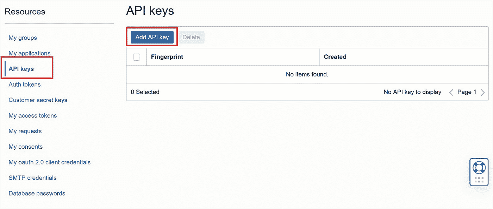

左侧是包含资源选项卡的窗口，其中选择了 API 密钥。顶部有“添加 API 密钥”按钮，并且存在指纹和创建日期的列。

图 7-1

API 密钥（我的配置文件）


接下来，如图 7-1 所示，单击 `添加 API 密钥` 按钮以添加一个新密钥。在下一个屏幕中，选择 `粘贴公钥` 选项，然后复制 `type` 命令显示的文本（包括标有 `--------…---------` 的部分），将其粘贴到文本框中，然后单击 `添加` 按钮。

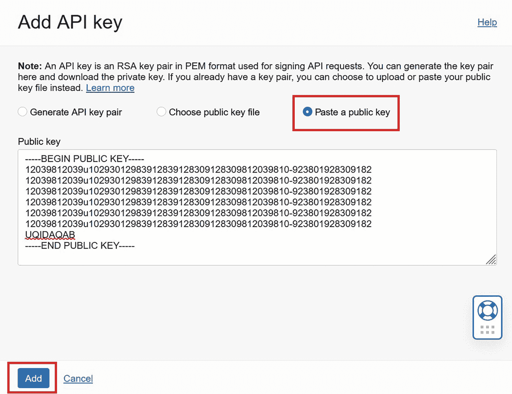

一个用于添加 API 密钥的对话框显示了上传或粘贴公钥的选项。选择“粘贴公钥”，它会在空白区域显示公钥。

图 7-2

添加 API 密钥（粘贴选项）

单击“添加”按钮后，您将看到一个对话框，其中显示您需要在 PC 上创建的配置文件。图 7-3 显示了一个输出示例，其中某些参数出于安全原因已被屏蔽。

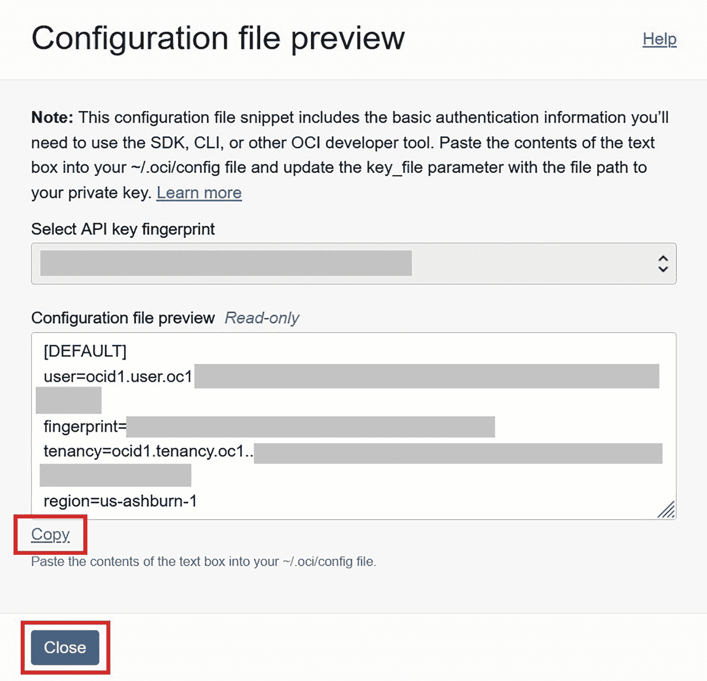

一个用于配置文件预览的对话框显示了选定的 API 密钥指纹。中间的空白区域显示了编码的程序。底部有“复制”按钮和“关闭”按钮。

图 7-3

OCI 配置文件内容示例（添加 API 密钥）

请注意，API 密钥显示时附带一个指纹，这是该密钥特有的特殊哈希值。我们将在下一步创建的配置文件中使用此指纹。

事实上，我们将使用 `复制` 链接来复制示例配置文件的内容，并将其粘贴到名为 `config` 的文件中，该文件将放置在我们之前创建的 `.oci` 文件夹中。使用您喜欢的文本编辑器打开一个新文件，将文本粘贴到文件中并将其保存为 `HOMEDRIVE%%HOMEPATH%\.oci`。完成后，单击 `关闭` 按钮。您现在应该在列表中看到您的 API 密钥指纹，如图 7-4 所示（出于安全原因已模糊处理）。请注意，显示的密钥可能有所不同。

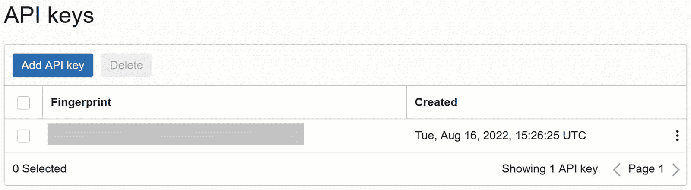

一个表格显示了 API 密钥，左上角是“添加 API 密钥”。每行有一个复选框，列标题是“指纹”和“创建时间”。有一个指纹于 2022 年 8 月 16 日添加。

图 7-4

API 密钥列表（我的个人资料）

好了，我们快完成了。还需要向配置文件添加一项内容。我们必须设置 SSH 密钥的密钥位置（路径）。打开配置文件 (`HOMEDRIVE%%HOMEPATH%\.oci`)，注意其中有一行带有 `TODO` 注释，如下所示。在这里，我们将 `<>` 替换为 SSH 密钥所在路径：

```
key_file= # TODO
```

在文件底部，使用您 PC 上 SSH 密钥的实际路径替换所示路径。请务必使用实际路径：

```
key_file=C:\Users\cbell\.oci\oci_api_key.pem
```

完成更改后，保存并关闭文件。我们可以通过安装 OCI 命令行界面 (CLI) 来测试配置是否正常工作。在本章中，我们将使用 OCI CLI 进行测试，但会在第 8 章中使用 OCI CLI 来演示如何编写 MDS 操作脚本。

#### 安装并测试 OCI CLI

要安装 OCI CLI，我们将在 Windows 上使用 PowerShell。其他平台有类似命令。请务必以管理员权限打开 PowerShell。请注意，安装过程在运行安装脚本时支持自动补全。您必须启用 `RemoteSigned` 执行策略，这是第一条命令。下一条命令将 PowerShell 更改为使用 TLS 1.2。接下来的命令下载安装脚本文件，最后一条命令执行安装脚本（带有提示）。清单 7-4 显示了所需命令的示例执行（以粗体显示）。您的输出可能会根据您安装的 Python 包而有所不同。另外，请注意我们对所有安装都使用默认路径。为简洁起见，部分内容省略。

```
PS C:\WINDOWS\system32> Set-ExecutionPolicy RemoteSigned                                                                                                                                    Execution Policy Change
Do you want to change the execution policy?
[Y] Yes  [A] Yes to All  [N] No  [L] No to All  [S] Suspend  [?] Help (default is "N"): A
PS C:\WINDOWS\system32> [Net.ServicePointManager]::SecurityProtocol = [Net.SecurityProtocolType]::Tls12
PS C:\WINDOWS\system32> Invoke-WebRequest https://raw.githubusercontent.com/oracle/oci-cli/master/scripts/install/install.ps1 -OutFile install.ps1
PS C:\WINDOWS\system32> iex ((New-Object System.Net.WebClient).DownloadString('https://raw.githubusercontent.com/oracle/oci-cli/master/scripts/install/install.ps1'))
...
-- 正在验证 Python 版本。
-- Python 版本 3.7.5 正常。
===> 您希望将安装放在哪个目录中？（留空则使用 'C:\Users\cbell\lib\oracle-cli'）：
-- 正在创建目录 'C:\Users\cbell\lib\oracle-cli'。
-- 我们将安装在 'C:\Users\cbell\lib\oracle-cli'。
===> 您希望将 'oci.exe' 可执行文件放在哪个目录中？（留空则使用 'C:\Users\cbell\bin'）：
-- 可执行文件将位于 'C:\Users\cbell\bin'。
===> 您希望将 OCI 脚本放在哪个目录中？（留空则使用 'C:\Users\cbell\bin\oci-cli-scripts'）：
-- 脚本将位于 'C:\Users\cbell\bin\oci-cli-scripts'。
===> 当前支持的可选包是：['db (将安装 cx_Oracle)']
您希望安装哪些可选的 CLI 包（逗号分隔的名称；如果不需要任何可选包，请按回车键）？：
-- 已安装的可选包将是 ''。
-- 尝试使用 python3 venv。
-- 执行：['C:\\Program Files (x86)\\Microsoft Visual Studio\\Shared\\Python37_64\\python.exe', '-m', 'venv', 'C:\\Users\\cbell\\lib\\oracle-cli']
-- 执行：['C:\\Users\\cbell\\lib\\oracle-cli\\Scripts\\python.exe', '-m', 'pip', 'install', '--upgrade', 'pip']
Collecting pip
Downloading https://files.pythonhosted.org/packages/1f/2c/d9626f045e7b49a6225c6b09257861f24da78f4e5f23af2ddbdf852c99b8/pip-22.2.2-py3-none-any.whl (2.0MB)
|████████████████████████████████| 2.0MB 930kB/s
Installing collected packages: pip
Found existing installation: pip 19.2.3
Uninstalling pip-19.2.3:
Successfully uninstalled pip-19.2.3
...
===> 立即修改 PATH 以包含 CLI 并在 PowerShell 中启用 Tab 补全吗？(Y/n): y
--
-- ** 关闭并重新打开 PowerShell 以重新加载对 PATH 的更改 **
-- 为了运行自动补全脚本，您可能还需要将 PowerShell 执行策略设置为允许运行本地脚本（以管理员身份在 PowerShell 提示符下运行 Set-ExecutionPolicy RemoteSigned）
--
-- 安装成功。
-- 使用 C:\Users\cbell\bin\oci.exe --help 运行 CLI
VERBOSE: Successfully installed OCI CLI!
清单 7-4
安装 OCI CLI（Windows 11）
```

提示

如果您使用不同的平台，请参阅 [`https://docs.oracle.com/en-us/iaas/Content/API/SDKDocs/cliinstall.htm`](https://docs.oracle.com/en-us/iaas/Content/API/SDKDocs/cliinstall.htm) 获取安装详情。


接下来，关闭 PowerShell 并重新打开（以获取更新的安装路径），然后执行以下命令。这是一个简单的 OCI CLI 列出命令，用于列出我们之前创建的 `oci-tutorial-compartment` 中的 ObjectStore 存储桶。你需要使用该 compartment 的 OCID（为安全起见已做模糊处理）。你可能尚未创建任何存储桶，因此输出结果可能有所不同。如果命令执行无误，则你的 PC 现已正确配置为使用 OCI CLI，可以继续进行导出示例。请注意，系统可能会要求你多次输入 SSH 密钥的密码：

```
PS C:\Users\cbell> oci os bucket list --compartment-id=ocid1.compartment.oc1..1290387120983120928301982309128309128309182398
Private key passphrase:
Private key passphrase:
{
"data": [
{
"compartment-id": "ocid1.compartment.oc1..aaaaaaaawzwb45t3lutkqvyhofxh3ai26e5oli2a4q6efbh25g3llqwys7pa",
"created-by": "ocid1.user.oc1..aaaaaaaabbufd2sc7d6r2gojlnx3xeaenpesx5yu4clxi2eovyjf46jpopeq",
"defined-tags": null,
"etag": "2eec575a-80d0-42d2-9ab0-70c3b6a86ce3",
"freeform-tags": null,
"name": "test-bucket",
"namespace": "idj5psxg6enz",
"time-created": "2022-08-16T17:03:10.148000+00:00"
}
]
}
```

**注意**

如果此命令返回错误，请务必查阅 OCI CLI 的在线安装说明 (`https://docs.oracle.com/en-us/iaas/Content/API/SDKDocs/cliinstall.htm`) 并修正安装。你将需要 OCI CLI 才能结合导出和导入功能使用 ObjectStore。

请注意，我们的列表中有一个存储桶。OCI CLI 命令默认使用 JSON 输出格式来返回数据。

让我们继续从 MDS 进行导出的示例。回想一下，上述步骤（创建 SSH 密钥、上传私钥、创建配置文件、安装 OCI CLI）可以为你计划用于通过 ObjectStore 导出数据（或使用 OCI CLI）的每台 PC 执行一次。

#### 创建 ObjectStore 存储桶

接下来，我们需要创建一个 ObjectStore 存储桶来存放从导出中获取的数据。在本例中，我们将在 `oci-tutorial-compartment` 中创建一个名为 `mysql-data-bucket` 的存储桶。首先登录 OCI，然后从菜单中选择 **存储 | 存储桶**。你将看到如图 7-5 所示的 ObjectStore 存储桶页面。请务必从列表中选择正确的 compartment，如图所示。

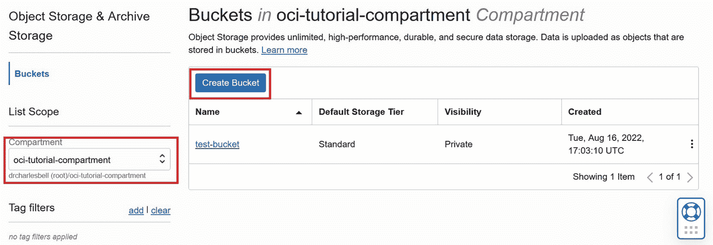

一个包含对象存储和归档存储选项卡的窗口，左侧选中了存储桶。右侧是创建存储桶按钮。该表仅显示存储桶中存储的一条数据。

**图 7-5**

ObjectStore 存储桶列表

要创建新存储桶，请单击 `创建存储桶` 按钮，并在创建存储桶对话框中将存储桶名称替换为 `mysql-data-bucket`，如图 7-6 所示。我们可以对其他列出的选项使用默认值。更具体地说，我们将使用标准存储桶层和标准的 Oracle 托管加密密钥。是的，存储桶默认是加密的。很好。

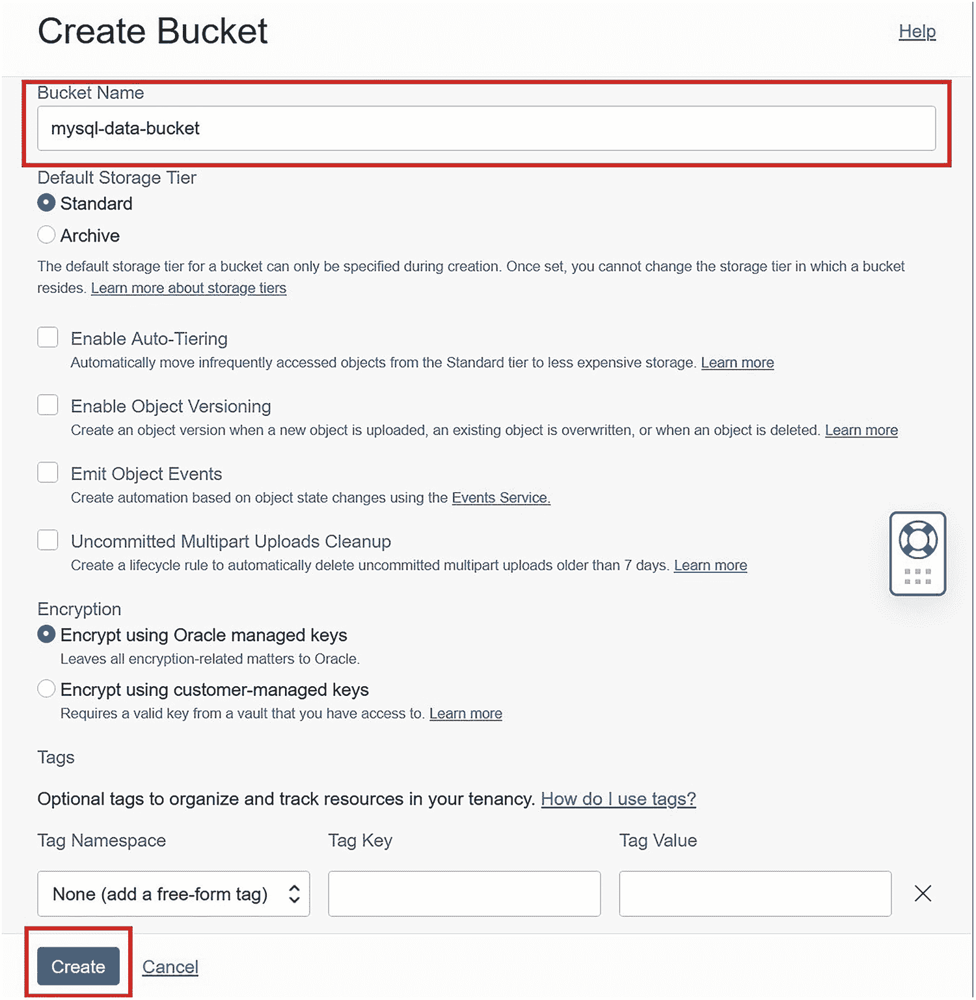

一个对话框，其中存储桶名称高亮显示。默认存储已选中，并且选择使用 Oracle 托管密钥进行加密。

**图 7-6**

创建存储桶对话框

准备好后，单击 `创建` 按钮以创建存储桶。你现在应该在该 compartment 的列表中看到该存储桶。我们现在已经准备好使用这个新存储桶从我们的本地 MySQL 服务器导出数据。

#### 导出到 ObjectStore 存储桶

现在我们准备好从本地 MySQL 服务器导出数据了。如果你尚未创建 DB System 进行测试，请立即创建。创建一个满足你数据存储要求的标准 DB System。如果你想跟随本教程操作，我们将使用一个名为 `oci-tutorial-mysql` 的 DB System，我们在本书前面已经使用过它。

我们还将使用一个中间计算实例（名为 `connection-instance`）来连接到我们的 DB System，而不是创建 Bastion 或 VPN 网关。回想一下，你需要在该计算实例上安装 MySQL Shell 才能连接到 DB System。有关创建和配置计算实例的更多详细信息，请参见第 4 章。

返回到你的本地 MySQL 服务器并打开 MySQL Shell 连接到它。你可以使用如下所示的命令使用 JavaScript 选项：

```
C:\Users\cbell>mysqlsh -uroot -p –js
```

接下来，我们将执行 `util.dumpInstance()` 方法，为存储桶数据提供一个前缀（使用 `mds-test`），以及一个包含存储桶名称 (`osBucketName`)、线程数、MDS 数据兼容性开关 (`ocimds`) 设置为 `true` 和之前讨论过的 `compatibility` 选项的 JSON 字符串，在兼容性选项中我们将剥离受限授权、definer 子句、缺失的主键和无效账户。以下显示了方法调用的格式：

```
util.dumpInstance("bucketPrefix", {osBucketName: "mds-bucket", threads: n, ocimds: true, compatibility: ["strip_restricted_grants", "strip_definers", "ignore_missing_pks", "skip_invalid_accounts"]})
```

好的，让我们运行这个方法看看会发生什么。清单 7-5 显示了运行该方法将本地 MySQL 服务器上的数据库转储到我们之前创建的 ObjectStore 存储桶 (`mysql-data-bucket`) 的输出。


# 列表 7-5
## 从本地 MySQL 服务器导出数据

```
MySQL  localhost:33060+ ssl  JS > util.dumpInstance("mds-test", {osBucketName: "mysql-data-bucket", ocimds: true, compatibility: ["strip_restricted_grants", "strip_definers", "ignore_missing_pks", "skip_invalid_accounts"]})
请输入 API 密钥口令：**********
正在获取全局读锁
已获取全局读锁
正在初始化 - 完成
将转储 6 个模式中的 2 个，其中包含 19 张表、7 个视图、6 个例程和 6 个触发器。
将转储 4 个用户中的 1 个。
正在收集信息 - 完成
所有事务已启动
正在为备份锁定实例
已释放全局读锁
正在检查与 MySQL 数据库服务 8.0.29 的兼容性
注意：数据库 `sakila` 中不受支持的 ENCRYPTION 选项已被注释掉
注意：函数 `sakila`.`get_customer_balance` 的定义者子句已被移除
注意：函数 `sakila`.`get_customer_balance` 的 SQL 安全特性已设置为 INVOKER
注意：函数 `sakila`.`inventory_in_stock` 的定义者子句已被移除
注意：函数 `sakila`.`inventory_in_stock` 的 SQL 安全特性已设置为 INVOKER
注意：函数 `sakila`.`inventory_held_by_customer` 的定义者子句已被移除
注意：函数 `sakila`.`inventory_held_by_customer` 的 SQL 安全特性已设置为 INVOKER
注意：存储过程 `sakila`.`rewards_report` 的定义者子句已被移除
注意：存储过程 `sakila`.`rewards_report` 的 SQL 安全特性已设置为 INVOKER
注意：存储过程 `sakila`.`film_in_stock` 的定义者子句已被移除
注意：存储过程 `sakila`.`film_in_stock` 的 SQL 安全特性已设置为 INVOKER
注意：存储过程 `sakila`.`film_not_in_stock` 的定义者子句已被移除
注意：存储过程 `sakila`.`film_not_in_stock` 的 SQL 安全特性已设置为 INVOKER
注意：数据库 `world` 中不受支持的 ENCRYPTION 选项已被注释掉
注意：触发器 `sakila`.`ins_film` 的定义者子句已被移除
注意：触发器 `sakila`.`upd_film` 的定义者子句已被移除
注意：触发器 `sakila`.`del_film` 的定义者子句已被移除
注意：触发器 `sakila`.`customer_create_date` 的定义者子句已被移除
注意：触发器 `sakila`.`payment_date` 的定义者子句已被移除
注意：触发器 `sakila`.`rental_date` 的定义者子句已被移除
注意：视图 `sakila`.`staff_list` 的定义者子句已被移除
注意：视图 `sakila`.`staff_list` 的 SQL 安全特性已设置为 INVOKER
注意：视图 `sakila`.`customer_list` 的定义者子句已被移除
注意：视图 `sakila`.`customer_list` 的 SQL 安全特性已设置为 INVOKER
注意：视图 `sakila`.`film_list` 的定义者子句已被移除
注意：视图 `sakila`.`film_list` 的 SQL 安全特性已设置为 INVOKER
注意：视图 `sakila`.`sales_by_film_category` 的定义者子句已被移除
注意：视图 `sakila`.`sales_by_film_category` 的 SQL 安全特性已设置为 INVOKER
注意：视图 `sakila`.`nicer_but_slower_film_list` 的定义者子句已被移除
注意：视图 `sakila`.`nicer_but_slower_film_list` 的 SQL 安全特性已设置为 INVOKER
注意：视图 `sakila`.`sales_by_store` 的定义者子句已被移除
注意：视图 `sakila`.`sales_by_store` 的 SQL 安全特性已设置为 INVOKER
注意：视图 `sakila`.`actor_info` 的定义者子句已被移除
发现并修复了与 MySQL 数据库服务 8.0.29 的兼容性问题。请在加载之前检查所做的更改。
正在验证 MDS 兼容性 - 完成
正在写入全局 DDL 文件
正在写入用户 DDL
正在使用 4 个线程运行数据转储。
注意：进度信息使用的是估算值，可能不准确。
正在写入模式元数据 - 完成
正在写入 DDL - 完成
正在写入表元数据 - 完成
开始数据转储
99%（已处理 52.58K 行 / 总计约 52.69K 行），处理速度 4.96K 行/秒，未压缩 381.83 KB/秒，压缩后 95.16 KB/秒
转储耗时：00:00:13 秒
总耗时：00:00:14 秒
已转储模式：2
已转储表：19
未压缩数据大小：3.23 MB
压缩后数据大小：807.97 KB
压缩率：4.0
已写入行数：52575
已写入字节数：807.97 KB
平均未压缩吞吐量：243.06 KB/秒
平均压缩吞吐量：60.78 KB/秒
MySQL  localhost:33060+ ssl  JS >
```

请注意，在导出过程中有一些内容发生了变化，例如定义者子句和其他已修复的兼容性问题。尽管如此，如果你导航到对象存储桶（`mysql-data-bucket`），你会在存储桶中看到数据。

要导航到 `mysql-data-bucket` 存储桶的内容，请点击 OCI 控制台菜单并选择 `Storage` | `Buckets`，然后点击 `mysql-data-bucket` 链接以打开存储桶详细信息页面。接着，在 `Resources` 菜单中，选择 `Objects`，然后点击 `>` 展开 `mds-test` 前缀。你应该会看到一个类似图 7-7 所示的文件列表。

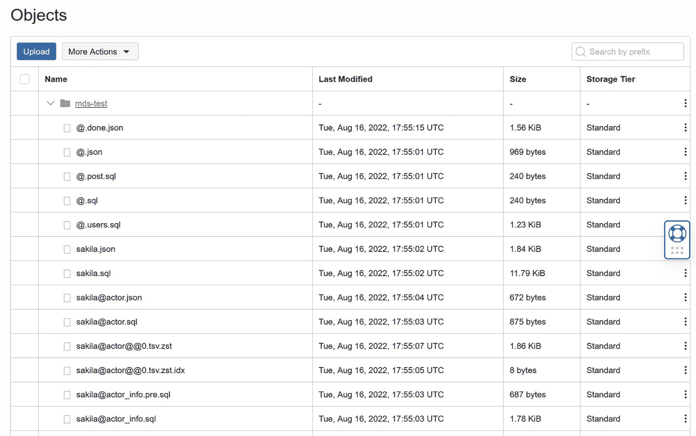

图 7-7
`mysql-data-bucket` 中的对象

好的，现在我们的数据已经（可以说）在存储桶里了，接下来我们需要将其导入到我们的数据库系统中。但首先，我们必须像在个人电脑上那样，配置我们的中间计算实例以使用 OCI CLI。不过，我们无需创建新的 API 密钥，只需上传现有的密钥即可。我们也可以使用相同的配置文件，只需做一个微小的更改。很好。

### 配置计算实例

首先，在一个终端（PowerShell）会话中，使用如下 `ssh` 命令登录到计算实例。你可以打开第二个终端会话来进行文件复制操作。务必使用计算实例详细信息页面上显示的 `公网 IP 地址`：

```
ssh -i c:\users\cbell\.ssh\ssh-key-2022-08-16.key opc@150.136.69.126
```

在计算实例上，使用以下命令创建 `.oci` 文件夹：

```
mkdir .oci
```

在你的个人电脑上（在另一个终端中），导航到你的 `.oci` 文件夹，并将文件复制到计算实例。你需要复制 `config` 文件以及 API 密钥，如下所示。请注意，我们使用的是创建计算实例时生成的 SSH 密钥。如果你的 `.ssh` 文件夹中没有正确的密钥，这些命令将无法工作：

> 注意
> 如果你丢失了 SSH 密钥文件，你将不得不终止并重新创建计算实例。

```
scp -i c:\users\cbell\.ssh\ssh-key-2022-08-16.key config opc@150.136.69.126:~/.oci/
scp -i c:\users\cbell\.ssh\ssh-key-2022-08-16.key oci_api_key_public.pem opc@150.136.69.126:~/.oci/
scp -i c:\users\cbell\.ssh\ssh-key-2022-08-16.key oci_api_key.pem opc@150.136.69.126:~/.oci/
```

接下来，回到计算实例，使用命令 `nano ~/.oci/config` 编辑 `config` 文件。将最后一行的 `key_file` 参数更改为如下内容并保存文件：

```
key_file=/home/opc/.oci/oci_api_key.pem
```

我们还需要做一件小事。我们必须为对象存储桶创建一个预认证请求。


#### 创建预认证请求（PAR）

预认证请求（PAR）是一种专属访问令牌，允许在限定时间内对存储桶进行访问（读取、读写、写入）。使用 OCI 控制台，导航到对象存储列表，打开名为`mysql-data-bucket`的存储桶的详细信息页面。在存储桶详细信息页面上，导航至资源菜单中的"预认证请求"，如图 7-8 所示。

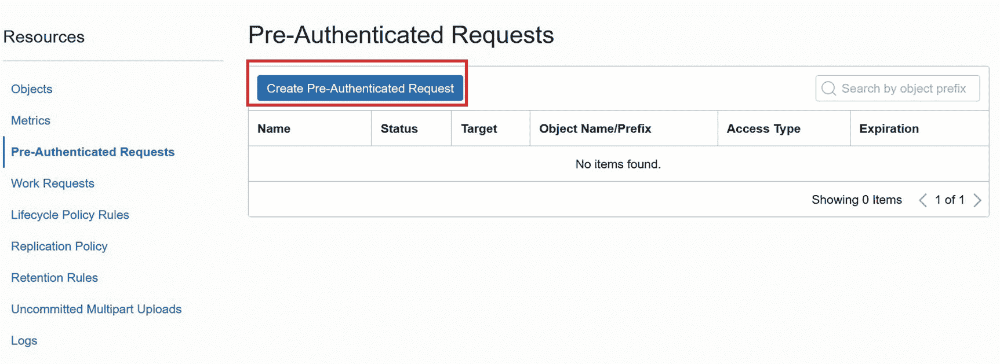

资源选项卡窗口，左侧选中了预认证请求。顶部是创建预认证请求的按钮，表格中没有找到任何项目。

图 7-8

预认证请求列表

要创建 PAR，请点击`创建预认证请求`按钮。这将打开一个类似图 7-9 的对话框。你可以为 PAR 命名（例如，`par-import-mysql-data`），但必须将`访问类型`设置为`允许对象读取`，并勾选`启用对象列表`复选框。

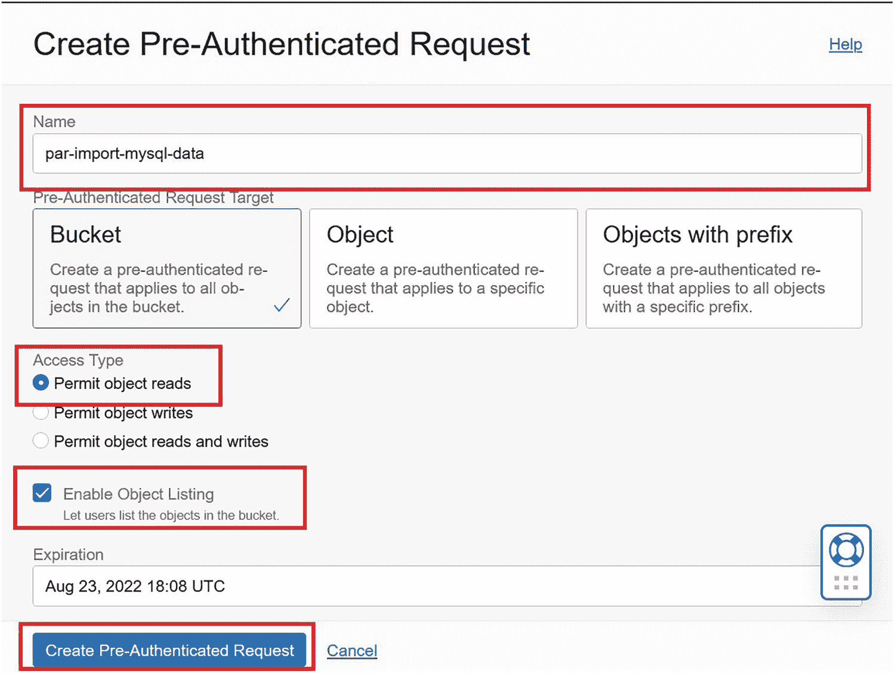

创建预认证请求的对话框，其中名称、目标（存储桶类型）、访问类型（允许对象读取）以及启用对象列表被突出显示。

图 7-9

创建 PAR 对话框

请注意，你还可以设置过期时间。这是 PAR 到期的日期和时间。在该日期之后尝试使用 PAR 将导致访问被拒绝的错误。准备好创建 PAR 后，点击`创建预认证请求`按钮。

OCI 随后会显示一个需要特别注意的特殊对话框。该对话框将向你展示 PAR 字符串本身。这个对话框是你复制 PAR 字符串唯一的机会。如果关闭对话框，你将无法再次检索该 PAR。你必须创建一个新的 PAR。图 7-10 显示了 PAR 对话框的示例。

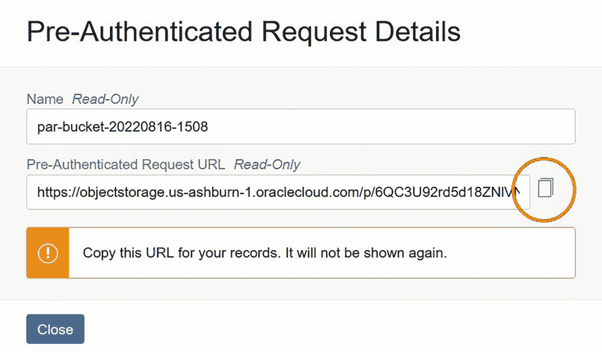

预认证请求详细信息的对话框，包含名称、预认证请求 URL。下方有一条复制 URL 的消息。

图 7-10

PAR 对话框

请务必复制 PAR 并将其粘贴到文件中妥善保管。请记住，虽然它只在有限的时间段内有效，但应像保护任何其他安全访问令牌一样保护它。

**注意**

你必须使用显示的复制选项从对话框中复制 PAR。一旦关闭对话框，你将无法再检索 PAR。

好了，现在我们准备在我们的数据库系统上运行导入操作。

#### 从对象存储存储桶导入到数据库系统

既然我们的计算实例已正确配置，并且我们有一个可用于导入的 PAR，我们就可以使用下面的命令，通过我们的计算实例登录到数据库系统。再次强调，请务必使用适用于你的计算实例和数据库系统的正确访问点（IP）地址。通过在 OCI 控制台中导航到正确的详细信息页面来检查这些值：

```
PS C:\Users\cbell> ssh -i c:\users\cbell\.ssh\ssh-key-2022-08-16.key opc@150.136.69.126
[opc@connection-instance ~]$ mysqlsh --sql mysql_admin@10.0.1.226:33060
```

接下来，我们可以列出数据库系统上的数据库，如代码清单 7-6 所示。

```
MySQL  10.0.1.226:33060+ ssl  SQL > SHOW DATABASES;
+--------------------+
| Database           |
+--------------------+
| information_schema |
| mysql              |
| performance_schema |
| sys                |
+--------------------+
4 rows in set (0.0013 sec)
代码清单 7-6
导入前的测试数据库
```

现在我们可以运行导入了。回想一下，我们可以使用`util.loadDump()`方法，该方法需要几个参数。我们将把 PAR 作为第一个参数传递，然后是选项列表，我们只需要一个`progressFile`。你可以随意命名该文件。以下是我们将使用的命令示例：

```
util.loadDump("PAR_STRING_HERE", {progressFile: "progressFile"})
```

**提示**

如果你想运行命令进行测试，可以添加`dryRun: true`选项。对于大型或生产数据，强烈建议这样做。

好的，让我们看看这个操作！切换到 MySQL Shell 中的 JavaScript 界面，复制上面的命令，并用你在之前步骤中复制的 PAR 替换 PAR 字符串。代码清单 7-7 显示了作为试运行运行的命令以检查错误。出于安全考虑，PAR 被部分隐藏了。

```
MySQL  10.0.1.226:33060+ ssl  JS > util.loadDump("https:...mysql-data-bucket/o/mds-test/", {dryRun:true, progressFile:"progressFile"})
Loading DDL and Data from OCI prefix PAR=/p//n/idj5psxg6enz/b/mysql-data-bucket/o/mds-test/, prefix='mds-test/' using 4 threads.
Opening dump...
dryRun enabled, no changes will be made.
Target is MySQL 8.0.28-u3-cloud (MySQL Database Service). Dump was produced from MySQL 8.0.29
Fetching dump data from remote location...
Listing files - done
Scanning metadata - done
Checking for pre-existing objects...
Executing common preamble SQL
Executing DDL - done
Executing view DDL - done
Starting data load
Executing common postamble SQL
0% (0 bytes / 3.23 MB), 0.00 B/s, 19 / 19 tables done
Recreating indexes - done
No data loaded.
0 warnings were reported during the load.
代码清单 7-7
试运行示例
```

好的，没有错误！现在，让我们像代码清单 7-8 所示的那样，在不使用试运行参数的情况下运行导入。

```
MySQL  10.0.1.226:33060+ ssl  JS > util.loadDump("https.../mysql-data-bucket/o/mds-test/", {progressFile:"progressFile"})
Loading DDL and Data from OCI prefix PAR=/p//n/idj5psxg6enz/b/mysql-data-bucket/o/mds-test/, prefix='mds-test/' using 4 threads.
Opening dump...
Target is MySQL 8.0.28-u3-cloud (MySQL Database Service). Dump was produced from MySQL 8.0.29
Fetching dump data from remote location...
Listing files - done
Scanning metadata - done
Checking for pre-existing objects...
Executing common preamble SQL
Executing DDL - done
Executing view DDL - done
Starting data load
100% (3.23 MB / 3.23 MB), 2.15 MB/s, 19 / 19 tables done
Recreating indexes - done
Executing common postamble SQL
19 chunks (52.58K rows, 3.23 MB) for 19 tables in 2 schemas were loaded in 4 sec (avg throughput 2.15 MB/s)
0 warnings were reported during the load.
代码清单 7-8
导入数据
```

太棒了！成功了。现在，让我们通过检查数据库列表来看看导入是否成功。代码清单 7-9 显示了导入后的数据库列表以及一些查询数据的操作。


```
MySQL  10.0.1.226:33060+ ssl  SQL > SHOW DATABASES;
+--------------------+
| Database           |
+--------------------+
| information_schema |
| mysql              |
| performance_schema |
| sakila             |
| sys                |
| world              |
+--------------------+
6 rows in set (0.0011 sec)
MySQL  10.0.1.226:33060+ ssl  sakila  SQL > SELECT * FROM city LIMIT 5;
+---------+--------------------+------------+---------------------+
| city_id | city               | country_id | last_update         |
+---------+--------------------+------------+---------------------+
|       1 | A Corua (La Corua) |         87 | 2006-02-15 09:45:25 |
|       2 | Abha               |         82 | 2006-02-15 09:45:25 |
|       3 | Abu Dhabi          |        101 | 2006-02-15 09:45:25 |
|       4 | Acua               |         60 | 2006-02-15 09:45:25 |
|       5 | Adana              |         97 | 2006-02-15 09:45:25 |
+---------+--------------------+------------+---------------------+
清单 7-9
测试数据库（导入后）
```

如果你看到类似的结果，恭喜你！你刚刚已将数据从本地 MySQL 服务器迁移到了你的 DB 系统。如果看到错误，请查阅 MySQL Shell 文档获取更多信息 (`https://dev.mysql.com/doc/mysql-shell/8.0/en/mysql-shell-utilities-load-dump.xhtml`)。

如果必须重新运行导入，请务必删除所有已创建的数据库，并使用 `resetProgress:true` 选项参数来强制重新开始进度。

现在，让我们探索另一种导出数据的流程。但首先，请务必在你的 DB 系统上使用以下命令删除已导入的数据库。

```
DROP DATABASE sakila;
DROP DATABASE world;
```

### 使用计算实例

第二种从本地 MySQL 服务器导出数据的方法将使用一个计算实例作为中间存储。在这种情况下，我们只需在本地 MySQL 服务器上执行导出操作，将文件放置在该系统上，然后将它们复制到计算实例，最后在 DB 系统上使用这些数据。在我们开始之前，先回顾一下 MySQL Shell 是如何导出数据的。

MySQL Shell 使用 `util.dumpInstance()` 方法将数据导出到本地文件，格式为制表符分隔值（文件扩展名 `.tsv`），并通过 `zstd` 压缩（文件扩展名 `.zst`）以节省空间（`gzip` 也是一个可选项）。你也可以选择不压缩，但如果你是上传到对象存储，则建议使用默认压缩。

注意

默认情况下，大表会被分块，默认分块大小为 32MB。可以禁用分块，但不建议这样做。通过并行线程导入分块可以提高导入性能。

如果你将数据导出到一个文件夹（例如，在你的本地 MySQL 服务器上），你会看到每个数据库和表对应多个文件。例如，如果你的本地 MySQL 服务器安装了 `world_x` 数据库，你会看到 `city` 表的几个文件，如下所示：

```
world_x@city.json
world_x@city.sql
world_x@city@@0.tsv.zst
world_x@city@@0.tsv.zst.idx
```

这里，我们看到该表的几个文件。有一个 `.json` 文件，包含 MySQL Shell 恢复表所需的信息。`.sql` 文件包含 `CREATE TABLE` 相关的 SQL 语句。`.tsv.zst` 文件是压缩的制表符分隔值格式的数据和索引文件。对于其他表和数据库，你也会看到类似的文件。

提示

`zstd` 实用工具的源代码可从 `https://github.com/facebook/zstd` 下载。但是，你需要在你的机器上编译（构建）源代码才能使用它。

现在我们了解了数据文件的样子，让我们进行一个示例。我们将再次使用仅安装了 `sakila` 和 `world` 数据库的本地 MySQL 服务器。

#### 使用 MySQL Shell 导出数据

第一步是运行 `util.dumpInstance()` 方法将文件保存到本地驱动器。在这种情况下，我们将使用不同的第一个参数。不是传入存储桶名称和相关参数，我们只需指定一个用于存储文件的文件夹（目录）以及与之前相同的选项集。由于大多数命令与上次将数据迁移到 MDS 的方法类似，为简洁起见，我们省略了一些解释，并在清单中显示较少的详细信息。

首先启动 MySQL Shell 并使用 JavaScript 接口连接到你的本地 MySQL 服务器 (`mysqlsh -uroot -p --js`)。清单 7-10 显示了运行中的导出操作，为简洁起见，省略了注释和警告。

```
MySQL  localhost:33060+ ssl  JS > util.dumpInstance("c:\\exported_data", {ocimds:true, compatibility: ["strip_restricted_grants", "strip_definers", "ignore_missing_pks", "skip_invalid_accounts"]})
Acquiring global read lock
Global read lock acquired
Initializing - done
2 out of 6 schemas will be dumped and within them 19 tables, 7 views, 6 routines, 6 triggers.
1 out of 4 users will be dumped.
Gathering information - done
All transactions have been started
Locking instance for backup
Global read lock has been released
Checking for compatibility with MySQL Database Service 8.0.29
...
Compatibility issues with MySQL Database Service 8.0.29 were found and repaired. Please review the changes made before loading them.
Validating MDS compatibility - done
Writing global DDL files
Writing users DDL
Running data dump using 4 threads.
NOTE: Progress information uses estimated values and may not be accurate.
Writing schema metadata - done
Writing DDL - done
Writing table metadata - done
Starting data dump
99% (52.58K rows / ~52.69K rows), 0.00 rows/s, 0.00 B/s uncompressed, 0.00 B/s compressed
Dump duration: 00:00:00s
Total duration: 00:00:00s
Schemas dumped: 2
Tables dumped: 19
Uncompressed data size: 3.23 MB
Compressed data size: 807.97 KB
Compression ratio: 4.0
Rows written: 52575
Bytes written: 807.97 KB
Average uncompressed throughput: 3.23 MB/s
Average compressed throughput: 807.97 KB/s
清单 7-10
本地导出数据（MySQL Shell）
```

如果你导航到 `c:\\exported_data` 文件夹，我们会看到所有的文件，如清单 7-11 所示的摘录。

```
C:\> cd exported_data
C:\exported_data> dir
Volume in drive C is Local Disk
Volume Serial Number is 3422-B048
Directory of C:\exported_data
08/16/2022  04:23 PM              .
08/16/2022  04:23 PM             1,598 @.done.json
08/16/2022  04:23 PM               969 @.json
08/16/2022  04:23 PM               240 @.post.sql
08/16/2022  04:23 PM               240 @.sql
08/16/2022  04:23 PM             1,264 @.users.sql
08/16/2022  04:23 PM             1,886 sakila.json
08/16/2022  04:23 PM            12,073 sakila.sql
...
08/16/2022  04:23 PM               705 world@countrylanguage.json
08/16/2022  04:23 PM               959 world@countrylanguage.sql
08/16/2022  04:23 PM             8,721 world@countrylanguage@@0.tsv.zst
08/16/2022  04:23 PM                 8 world@countrylanguage@@0.tsv.zst.idx
103 File(s)        888,396 bytes
1 Dir(s)  36,038,184,960 bytes free
清单 7-11
列出导出的数据文件（Windows 11）
```

然而，这是一个很长的列表，我们可以通过压缩文件来简化操作。你可以使用 Windows 文件资源管理器（或压缩应用程序）创建一个压缩文件。将压缩文件命名为 `mysql_data.zip`。我们将在下一步上传此文件。


#### 将导出的数据复制到计算实例

首先，登录您的计算实例并按如下所示创建用于存放导出数据的目录：

```
C:\exported_data> ssh -i c:\users\cbell\.ssh\ssh-key-2022-08-16.key opc@150.136.69.126
[opc@connection-instance ~]$ mkdir exported_data
```

接下来，导航到导出的数据文件夹，并将 `mysql_data.zip` 文件复制到计算实例，如下所示。请注意，您需要使用正确的 SSH 密钥文件和计算实例的公网 IP 地址：

```
C:\exported_data>scp -i c:\users\cbell\.ssh\ssh-key-2022-08-16.key mysql_data.zip opc@150.136.69.126:~/exported_data.
mysql_data.zip                       100%  829KB 593.6KB/s   00:01.
```

然后，再次登录计算实例，并将文件解压到一个文件夹中，如下所示：

```
C:\exported_data>ssh -i c:\users\cbell\.ssh\ssh-key-2022-08-16.key opc@150.136.69.126
[opc@connection-instance ~]$ rm mysql_data.zip
[opc@connection-instance ~]$ cd exported_data/
[opc@connection-instance exported_data]$ unzip mysql_data.zip
Archive:  mysql_data.zip
inflating: @.done.json
...
extracting: world@city@@0.tsv.zst.idx
inflating: world@country.json
inflating: world@country.sql
inflating: world@country@@0.tsv.zst
inflating: world@country@@0.tsv.zst.idx
inflating: world@countrylanguage.json
inflating: world@countrylanguage.sql
inflating: world@countrylanguage@@0.tsv.zst
inflating: world@countrylanguage@@0.tsv.zst.idx
```

#### 在 DB 系统上导入数据

最后一步是再次登录您的计算实例，启动 MySQL Shell 并导入数据。同样，我们不会使用 PAR 参数，而是使用文件路径 (`/home/opc/exported_data`)。清单 7-12 展示了运行 `util.loadDump()` 方法的记录。请注意所使用的参数。我们只需要导出数据的路径。很酷！

```
MySQL  10.0.1.226:33060+ ssl  JS > util.loadDump("/home/opc/exported_data")
Loading DDL and Data from '/home/opc/exported_data' using 4 threads.
Opening dump...
Target is MySQL 8.0.28-u3-cloud (MySQL Database Service). Dump was produced from MySQL 8.0.29
Scanning metadata - done
Checking for pre-existing objects...
Executing common preamble SQL
Executing DDL - done
Executing view DDL - done
Starting data load
2 thds loading - 1 thds indexing / 100% (3.23 MB / 3.23 MB), 6.46 MB/s, 17 / 19 tables done
Recreating indexes - done
Executing common postamble SQL
19 chunks (52.58K rows, 3.23 MB) for 19 tables in 2 schemas were loaded in 1 sec (avg throughput 3.23 MB/s)
0 warnings were reported during the load.
清单 7-12
从目录导入数据（MySQL Shell）
```

为确保导入正确工作，让我们检查数据库列表并在其中一个表上执行查询。清单 7-13 展示了用于简要测试导入的命令。

提示

您应该始终以任何方式导入的任何产品数据进行稳健、全面的测试。仅仅检查数据库是否存在以及可以运行查询是一个良好的初步测试，但对于质量保证目的来说还不够。

```
MySQL  10.0.1.226:33060+ ssl  SQL > SHOW DATABASES;
+--------------------+
| Database           |
+--------------------+
| information_schema |
| mysql              |
| performance_schema |
| sakila             |
| sys                |
| world              |
+--------------------+
6 rows in set (0.0010 sec)
MySQL  10.0.1.226:33060+ ssl  SQL > USE world;
Default schema set to `world`.
Fetching table and column names from `world` for auto-completion... Press ^C to stop.
MySQL  10.0.1.226:33060+ ssl  world  SQL > SELECT code, name FROM country LIMIT 5;
+------+-------------+
| code | name        |
+------+-------------+
| ABW  | Aruba       |
| AFG  | Afghanistan |
| AGO  | Angola      |
| AIA  | Anguilla    |
| ALB  | Albania     |
+------+-------------+
5 rows in set (0.0048 sec)
清单 7-13
检查导入结果
```

虽然这些步骤看起来更简单（确实如此），但这种方法比 ObjectStore 方法慢，因为我们必须手动复制文件。下一个也是最后一个示例绕过了上传到计算实例的步骤，而是允许我们直接将数据上传到 DB 系统。

### 使用堡垒网关

从本地 MySQL 服务器导出数据的第三种方法是使用堡垒网关将我们的 PC 直接连接到 DB 系统。这意味着我们不再需要为导入而复制或上传数据；MySQL Shell 可以直接从我们的 PC 读取数据。

由于堡垒网关和网络层的原因，此方法比其他两种方法慢，更重要的是，它有两个潜在问题：(1) 堡垒网关是付费服务，(2) 您复制的数据除了要导入的数据大小外，还必须能放入 DB 系统的存储中。因此，它可能需要存储最多两倍的数据量；一次是导出的数据，另一次是数据导入后。这可能对较小的 DB 系统存储大小或较大的数据造成问题。但是，如果您最初调整 DB 系统大小以处理导出的数据，大多数初始数据加载应该不是问题。

此方法与前一个方法的步骤类似，只是我们必须先设置堡垒服务器，然后在本地 MySQL 服务器上导出数据，最后从我们的 PC 导入数据。让我们看一个演示。

#### 设置堡垒服务

回想一下，我们在第 4 章的 *创建堡垒服务* 标题下设置了堡垒网关。虽然执行导出和导入的命令再次类似，但在本方法中，我们创建从 PC 到 DB 系统的直接访问，因此导出的数据可以直接复制到 DB 系统进行导入。

我们将使用第 4 章中描述的相同流程来设置堡垒服务。但是这次我们需要两个端口转发会话；一个为端口 `3306` 设置，另一个为端口 `33060` 设置，因为 MySQL Shell 在导入期间将使用这两个端口。回想一下，我们将使用 DB 系统的 IP 地址，并且您需要创建一个 SSH 密钥对或重用之前创建的密钥对。图 7-11 展示了设置有两个端口转发会话的堡垒服务。

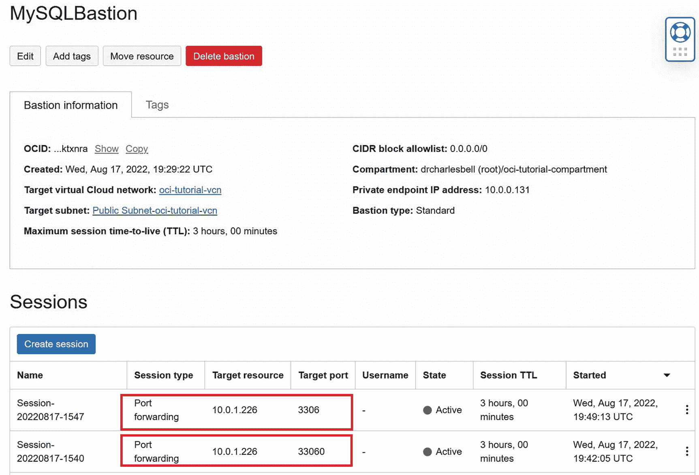

一个屏幕截图显示了堡垒服务详细信息。表格中有 2 个项目。会话类型、目标资源和目标端口被高亮显示。

图 7-11

堡垒服务会话（用于从 PC 导入数据）

提示

如果您需要查看详细步骤，请参阅第 4 章中题为 *创建堡垒服务* 的部分，了解如何设置堡垒服务。

#### 使用 MySQL Shell 导出数据

下一步是运行 `util.dumpInstance()` 方法将文件保存到本地驱动器。在这种情况下，我们将使用不同的第一个参数。我们不是传入存储桶名称和相关参数，而是简单地指定一个用于存储文件的文件夹（目录）以及与之前相同的选项集。这是我们在上一个方法中使用的相同步骤，因此我们只展示使用的命令。如果您正在跟随操作，则无需再次运行此步骤，因为导出的数据应该已经在您的 PC 上。所需的命令如下所示，以便清晰：

```
util.dumpInstance("c:\\exported_data", {ocimds:true, compatibility: ["strip_restricted_grants", "strip_definers", "ignore_missing_pks", "skip_invalid_accounts"]}
```

#### 启动 Bastion 服务的 SSH 会话

一旦 Bastion 服务正在运行，并且两个端口转发会话已启用，你必须在你的 PC 上启动端口转发。你需要为每个会话执行示例 SSH 命令。回顾一下，我们可以通过点击每个会话的上下文菜单并选择 `Copy SSH command` 来复制基本的 SSH 命令。

复制每个命令后，你可以将其粘贴到 PowerShell（终端）中，并将用 `<>` 标记的占位符部分替换为正确的数据。例如，下面展示了在 Windows 11 PC 上用于打开端口 `3306` 和 `33060` 的端口转发会话的两个命令：

```
ssh -i  -N -L 3306:10.0.1.226:3306 -p 22 ocid1.bastionsession.MASKED...
ssh -i  -N -L 33060:10.0.1.226:33060 -p 22 ocid1.bastionsession.MASKED...
```

在 Mac 或 Linux 上，你可以使用 `&` 指令在后台执行这些命令。在 Windows PC 上，你需要在 PowerShell 中使用不同的机制。你可以使用带有 `-ScriptBlock` 选项的 `Start-Job` 命令，如下所示：

```
Start-Job -ScriptBlock {ssh -i  -N -L 3306:10.0.1.226:3306 -p 22 ocid1.bastion...}
Start-Job -ScriptBlock {ssh -i  -N -L 33060:10.0.1.226:33060 -p 22 ocid1.bastion...}
```

好的，现在我们的 Bastion 设置好了，可以导入数据了。

#### 在 DB 系统上导入数据

最后一步是再次登录到你的计算实例，启动 MySQL Shell 并导入数据。我们将使用 PC 上导出数据的文件路径 (`c:\\exported_data`)。清单 7-14 显示了运行 `util.loadDump()` 方法的记录。注意所使用的参数。我们只需要导出数据的路径。很好。

```
MySQL  127.0.0.1:33060+ ssl  JS > util.loadDump("c:\\exported_data")
Loading DDL and Data from 'c:\exported_data' using 4 threads.
Opening dump...
Target is MySQL 8.0.28-u3-cloud (MySQL Database Service). Dump was produced from MySQL 8.0.29
Scanning metadata - done
Checking for pre-existing objects...
Executing common preamble SQL
Executing DDL - done
Executing view DDL - done
Starting data load
100% (3.23 MB / 3.23 MB), 97.63 KB/s, 19 / 19 tables done
Recreating indexes - done
Executing common postamble SQL
19 chunks (52.58K rows, 3.23 MB) for 19 tables in 2 schemas were loaded in 55 sec (avg throughput 174.73 KB/s)
0 warnings were reported during the load.
清单 7-14
从目录导入数据 (MySQL Shell)
```

为了确认导入是否正确工作，让我们检查数据库列表并对其中一个表执行查询。清单 7-15 显示了用于简要测试导入的命令。

```
MySQL  127.0.0.1:33060+ ssl  JS > \sql
Switching to SQL mode... Commands end with ;
MySQL  127.0.0.1:33060+ ssl  SQL > SHOW DATABASES;
+--------------------+
| Database           |
+--------------------+
| information_schema |
| mysql              |
| performance_schema |
| sakila             |
| sys                |
| world              |
+--------------------+
6 rows in set (0.0737 sec)
MySQL  127.0.0.1:33060+ ssl  SQL > SELECT title, release_year FROM sakila.film LIMIT 4;
+------------------+--------------+
| title            | release_year |
+------------------+--------------+
| ACADEMY DINOSAUR |         2006 |
| ACE GOLDFINGER   |         2006 |
| ADAPTATION HOLES |         2006 |
| AFFAIR PREJUDICE |         2006 |
+------------------+--------------+
4 rows in set (0.0620 sec)
清单 7-15
检查导入结果
```

虽然这些步骤看起来更简单，它们确实如此，但这种方法比 ObjectStore 和计算实例方法都要慢，因为我们必须通过 Bastion 服务从 PC 导入数据。

既然我们已经很好地介绍了如何将数据迁移到 DB 系统，现在让我们看看相反的操作：将数据从 MDS 迁移到我们的 PC。

## 从 MDS 迁移数据

当从 MDS 导入数据时，我们必须选择三种方法之一来将导出的数据移动到 MDS。回顾一下，这些方法包括使用 ObjectStore 存储桶、将导出的数据上传到中间计算实例，以及通过 Bastion 网关将导出的数据直接上传到我们的 DB 系统。

从 MDS 迁移遵循上述相同的机制，只是方向相反。因此，在演示上一节中展示的三种相同机制时，我们只会看到较小的细节。如果你需要更多细节，例如设置 ObjectStore 存储桶或 Bastion 服务，请参考前面的章节。

如果你执行了之前的任何示例，请务必在尝试导入之前，通过删除 `sakila` 和 `world` 数据库来准备你的本地 MySQL 服务器。

以下各节简要演示了从 MDS 导入数据的每种机制。

### 使用 ObjectStore 存储桶

将数据从 MDS 导入到我们的本地 MySQL 服务器的第一种方法是使用 ObjectStore 作为导出数据的中间存储。我们将使用 DB 系统上的 MySQL Shell 创建数据的导出，将其放入 ObjectStore，然后再次使用 MySQL Shell 从我们的本地 MySQL 服务器访问该数据进行导入。

#### 准备你的 PC

如果你尚未执行从 PC 迁移数据到 MDS 的先前示例，请返回并确保你的 PC 和计算实例已使用正确的 OCI API 配置文件和 SSH 密钥进行了准备。有关更多详细信息，请参阅上面的 `Configure Your PC for OCI CLI Access` 和 `Install and Test the OCI CLI` 部分。

还有一件事我们必须在 PC 上完成。我们必须在 MySQL 中将 `local_infile` 全局变量设置为 `ON`。默认情况下这是关闭的，你希望在完成备份后再次将其关闭。登录到本地 MySQL 服务器后，执行以下命令：

```
set @@global.local_infile=ON;
```

清单 7-16 显示了该命令的实际执行情况。

```
MySQL  localhost:33060+ ssl  SQL > SHOW VARIABLES LIKE '%local%';
+---------------+-------+
| Variable_name | Value |
+---------------+-------+
| local_infile  | OFF   |
+---------------+-------+
1 row in set (0.0033 sec)
MySQL  localhost:33060+ ssl  SQL > SET @@global.local_infile=ON;
Query OK, 0 rows affected (0.0009 sec)
MySQL  localhost:33060+ ssl  SQL > SHOW VARIABLES LIKE '%local%';
+---------------+-------+
| Variable_name | Value |
+---------------+-------+
| local_infile  | ON    |
+---------------+-------+
1 row in set (0.0032 sec)
清单 7-16
在本地 MySQL 服务器上开启 local_infile
```

#### 创建 ObjectStore 存储桶

接下来，我们需要创建一个 ObjectStore 存储桶来存储导出的数据。在此示例中，我们将在 `oci-tutorial-compartment` 中创建一个名为 `mysql-data-bucket` 的存储桶。首先登录 OCI 并从菜单中选择 Storage | Buckets。你将看到 ObjectStore 存储桶页面。

回顾一下，要创建新存储桶，请单击 `Create Bucket` 按钮，并在创建存储桶对话框中将存储桶名称替换为 `mysql-data-bucket`。如果你之前创建过此存储桶，可以重复使用它，但必须先删除所有文件。你可以通过删除存储桶并重新创建，或者通过从上下文菜单中选择 `Delete Folder` 来删除 `mds-test` 文件夹，如图 7-12 所示。

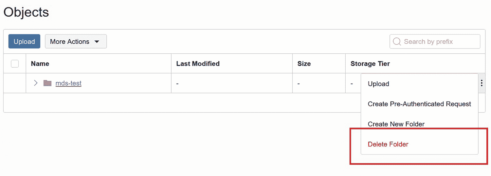

表格列出了存储桶中的对象。右侧的三点图标用于上传、创建预认证请求、创建新文件夹和删除文件夹。

图 7-12

删除存储桶中的对象

## 导出到对象存储桶

现在，我们已准备好从 DB 系统导出数据。如果您尚未创建用于测试的 DB 系统，请立即创建，并确保安装 sakila 和 world 数据库或您想使用的任何其他数据库。创建一个满足您数据存储需求的标准 DB 系统。如果您想跟随本教程操作，我们将使用一个名为 `oci-tutorial-mysql` 的 DB 系统，我们在本书前面已经使用过它。

回顾一下，我们需要使用一个中间计算实例来通过 MySQL Shell 登录我们的 DB 系统。您可以像之前一样使用 SSH 连接到同一个计算实例，然后可以像下面这样启动 MySQL Shell：

```
PS C:\Users\cbell> ssh -i c:\users\cbell\.ssh\ssh-key-2022-08-16.key opc@150.136.69.126
[opc@connection-instance ~]$ mysqlsh --sql mysql_admin@10.0.1.226:33060
```

接下来，我们将执行 `util.dumpInstance()` 方法，为存储桶数据提供一个前缀（使用 `mds-test`），并附带一个包含存储桶名称 (`osBucketName`)、线程数、MDS 数据兼容性开关 (`ocimds`) 设为 `true`，以及之前讨论过的 `compatibility` 选项的 JSON 字符串。在兼容性选项中，我们将剥离受限的权限、definer 子句、缺失的主键和无效的账户。清单 7-17 显示了运行该方法以将我们 DB 系统上的数据库转储到我们先前创建的 (`mysql-data-bucket`) 对象存储桶的输出。

```
MySQL  10.0.1.226:33060+ ssl  JS > util.dumpInstance("mds-test", {osBucketName: "mysql-data-bucket", ocimds: true, compatibility: ["strip_restricted_grants", "strip_definers", "ignore_missing_pks", "skip_invalid_accounts"]})
Please enter the API key passphrase: **********
Acquiring global read lock
Global read lock acquired
Initializing - done
2 out of 6 schemas will be dumped and within them 19 tables, 7 views, 6 routines, 6 triggers.
4 out of 7 users will be dumped.
Gathering information - done
All transactions have been started
Locking instance for backup
Global read lock has been released
Checking for compatibility with MySQL Database Service 8.0.30
...
Compatibility issues with MySQL Database Service 8.0.30 were found and repaired. Please review the changes made before loading them.
Validating MDS compatibility - done
Writing global DDL files
Writing users DDL
Running data dump using 4 threads.
NOTE: Progress information uses estimated values and may not be accurate.
Writing schema metadata - done
Writing DDL - done
Writing table metadata - done
Starting data dump
99% (52.58K rows / ~52.68K rows), 0.00 rows/s, 0.00 B/s uncompressed, 0.00 B/s compressed
Dump duration: 00:00:01s
Total duration: 00:00:01s
Schemas dumped: 2
Tables dumped: 19
Uncompressed data size: 3.23 MB
Compressed data size: 807.97 KB
Compression ratio: 4.0
Rows written: 52575
Bytes written: 807.97 KB
Average uncompressed throughput: 2.90 MB/s
Average compressed throughput: 726.36 KB/s
清单 7-17
从本地 MySQL 服务器导出数据
```

好的，现在我们的数据已经在存储桶中了，我们可以将数据导入到我们的本地 MySQL 服务器，但首先我们需要创建一个 PAR。请参考上面的 *创建预认证请求 (PAR)* 部分来创建一个读取 PAR，以便我们可以在本地 MySQL 服务器上使用它来导入数据。

请记住，务必复制 PAR 并将其粘贴到文件中妥善保存。同时请记住，尽管它在有限的时间段内有效，但它应像任何其他安全访问令牌一样受到保护。

**注意**

您必须使用所示的复制选项从对话框中复制 PAR。一旦关闭对话框，您将无法再检索该 PAR。

好的，现在我们已准备好在本地 MySQL 服务器上运行导入操作。

## 从对象存储桶导入到本地 MySQL 服务器

在继续之前，请务必在本地 MySQL 服务器上删除您已从 DB 系统导出的数据库。完成后，我们就可以运行导入了。回顾一下，我们可以使用 `util.loadDump()` 方法，该方法需要几个参数。我们将把 PAR 作为第一个参数传递，然后是选项列表，这里我们只需要一个 `progressFile`。您可以随意命名该文件。以下是我们将使用的命令示例：

```
util.loadDump("PAR_STRING_HERE", {progressFile: "progressFile"})
```

好的，让我们看看效果！切换到 MySQL Shell 的 JavaScript 界面，复制上面的命令，并将 PAR 替换为您在之前步骤中复制的那一个。现在，让我们在没有 dry run 参数的情况下运行导入，如清单 7-18 所示。

```
MySQL  localhost:33060+ ssl  JS > util.loadDump("https://objectstorage.us-ashburn-1.oraclecloud.com/p/5SX2LLcQ4wsQ30SdXVwrstyFu6jGnBADU3441TJpT1-jIIeKVryac5ko3MFpGa38/n/idj5psxg6enz/b/mysql-data-bucket/o/mds-test/", {progressFile: "progressFile"})
Loading DDL and Data from OCI PAR=/p//n/idj5psxg6enz/b/mysql-data-bucket/o/mds-test/, prefix='mds-test/' using 4 threads.
Opening dump...
Target is MySQL 8.0.29\. Dump was produced from MySQL 8.0.28-u3-cloud
Fetching dump data from remote location...
Listing files - done
Scanning metadata - done
Checking for pre-existing objects...
Executing common preamble SQL
Executing DDL - done
Executing view DDL - done
Starting data load
1 thds indexing - 100% (3.23 MB / 3.23 MB), 444.85 KB/s, 19 / 19 tables done
Recreating indexes - done
Executing common postamble SQL
19 chunks (52.58K rows, 3.23 MB) for 19 tables in 2 schemas were loaded in 33 sec (avg throughput 376.69 KB/s)
0 warnings were reported during the load.
清单 7-18
导入数据
```

太棒了！成功了。现在，让我们通过检查数据库列表来看看导入是否成功。清单 7-19 显示了导入后的数据库列表以及一个查询以获取一些数据。

```
MySQL  localhost:33060+ ssl  SQL > SHOW DATABASES;
+--------------------+
| Database           |
+--------------------+
| information_schema |
| mysql              |
| performance_schema |
| sakila             |
| sys                |
| world              |
+--------------------+
6 rows in set (0.0019 sec)
MySQL  localhost:33060+ ssl  SQL > SELECT name FROM world.city LIMIT 5;
+----------------+
| name           |
+----------------+
| Kabul          |
| Qandahar       |
| Herat          |
| Mazar-e-Sharif |
| Amsterdam      |
+----------------+
5 rows in set (0.0013 sec)
清单 7-19
测试数据库（导入后）
```

如果您看到类似的结果，恭喜您！您刚刚将数据从 DB 系统迁移到了本地 MySQL 服务器。如果您看到错误，请查阅 MySQL Shell 文档以获取更多信息 ([`https://dev.mysql.com/doc/mysql-shell/8.0/en/mysql-shell-utilities-load-dump.xhtml`](https://dev.mysql.com/doc/mysql-shell/8.0/en/mysql-shell-utilities-load-dump.xhtml))。

由于我们在本地 PC 上执行导入，我们可以使用 `util.loadDump()` 方法的另一种形式，该形式不需要 PAR，只需指定文件夹名称、存储桶名称 (`osBucketName`) 和存储桶命名空间 (`osNamespace`) 参数，如下所示：

```
util.loadDump("mds-test", { osBucketName:"mysql-data-bucket", osNamespace:"SECRET"})
```

当您使用这些参数运行该方法时，系统会要求您输入 SSH 密钥密码。您可以在存储桶详细信息页面上找到存储桶名称和命名空间，如图 7-13 所示。

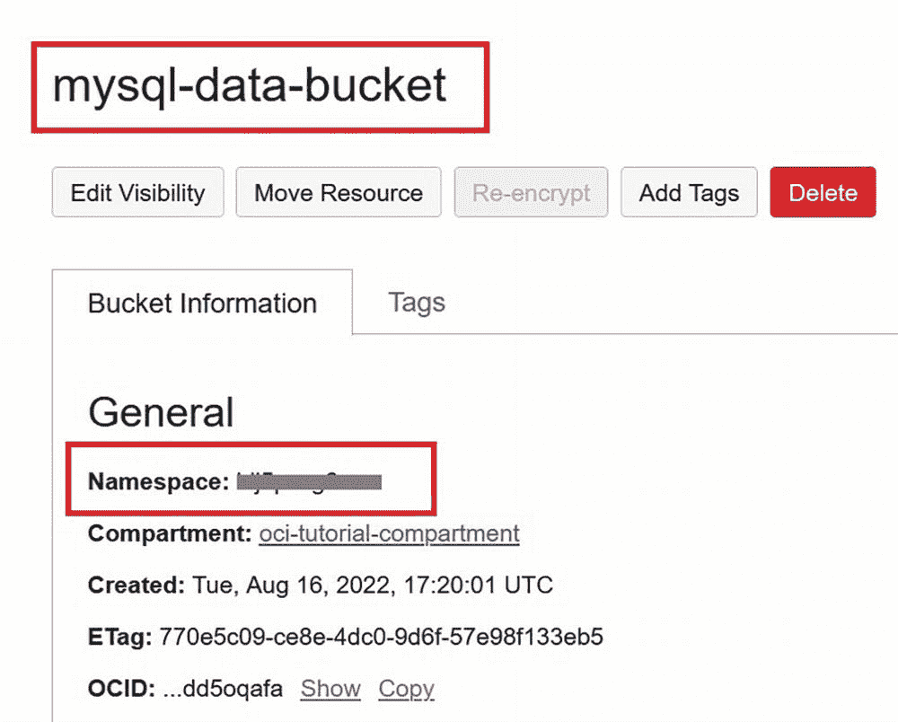

一个名为 MySQL-data-bucket 的存储桶详细信息页面，显示了存储桶信息详情。存储桶名称和命名空间被突出显示。删除按钮位于右上角。

图 7-13

查找存储桶名称和命名空间

### 使用计算实例

第二种从数据库系统导出数据的方法将使用一个计算实例作为中间存储。在这种情况下，我们只需在计算实例上执行导出，将文件放置在该系统上，然后复制到我们的本地 PC，最后在本地 MySQL 服务器上消费这些数据。

#### 使用 MySQL Shell 导出数据

第一步是运行 `util.dumpInstance()` 方法，将文件保存到计算实例的本地驱动器。首先创建一个 SSH 会话以登录计算实例，然后创建一个名为 `/home/opc/imported_data` 的文件夹，如下所示。创建完成后，使用 JavaScript 接口启动 MySQL Shell：

```
$ mkdir /home/opc/imported_data
```

接下来，像我们在迁移到 MDS 的示例中那样运行 `util.dumpInstance()` 方法，但将导出数据的位置指定为 `/home/opc/imported_data`。列表 7-20 显示了导出运行的过程，为简洁起见省略了注释和警告。

```
MySQL  10.0.1.226:33060+ ssl  JS > util.dumpInstance("/home/opc/imported_data", {ocimds:true, compatibility: ["strip_restricted_grants", "strip_definers", "ignore_missing_pks", "skip_invalid_accounts"]})
Acquiring global read lock
Global read lock acquired
Initializing - done
2 out of 6 schemas will be dumped and within them 19 tables, 7 views, 6 routines, 6 triggers.
4 out of 7 users will be dumped.
Gathering information - done
All transactions have been started
Locking instance for backup
Global read lock has been released
Checking for compatibility with MySQL Database Service 8.0.30
...
Compatibility issues with MySQL Database Service 8.0.30 were found and repaired. Please review the changes made before loading them.
Validating MDS compatibility - done
Writing global DDL files
Writing users DDL
Running data dump using 4 threads.
NOTE: Progress information uses estimated values and may not be accurate.
Writing schema metadata - done
Writing DDL - done
Writing table metadata - done
Starting data dump
99% (52.58K rows / ~52.68K rows), 0.00 rows/s, 0.00 B/s uncompressed, 0.00 B/s compressed
Dump duration: 00:00:00s
Total duration: 00:00:00s
Schemas dumped: 2
Tables dumped: 19
Uncompressed data size: 3.23 MB
Compressed data size: 807.97 KB
Compression ratio: 4.0
Rows written: 52575
Bytes written: 807.97 KB
Average uncompressed throughput: 3.23 MB/s
Average compressed throughput: 807.97 KB/s
列表 7-20
在计算实例上导出数据 (MySQL Shell)
```

#### 将导出的数据复制到本地 MySQL 服务器

登录计算实例后，导航到导出的数据文件夹，并使用以下命令创建数据的 zip 文件：

```
$ zip -r imported_data.zip ./imported_data/*
```

接下来，退出计算实例，并在您的 PC 上打开 PowerShell（终端）。我们将如下所示将 `mysql_data.zip` 文件复制到您的 PC。请注意，您需要使用正确的 SSH 密钥文件和计算实例的公共 IP 地址：

```
C:\> scp -i c:\users\cbell\.ssh\ssh-key-2022-08-16.key opc@150.136.69.126:~/imported_data.zip .
imported_data.zip                      100%  838KB   1.7MB/s   00:00
```

然后，返回您的 PC 并将文件解压缩到一个文件夹中。在 Windows 上，您可以使用文件资源管理器找到该文件，右键单击它并选择 `全部解压缩…`。

#### 在数据库系统上导入数据

最后一步是在您的 PC 上启动 MySQL Shell 并导入数据。我们将使用下面的命令。请注意所使用的参数。我们需要导出数据的路径，并且由于我们是在 PC 上执行导入，我们还需要添加一个进度文件选项的路径。该路径必须是一个用户帐户有权创建和写入文件的位置：

```
util.loadDump("c:\\imported_data", {progressFile: "c:\\imported_data\\progressFile"})
```

列表 7-21 显示了运行 `util.loadDump()` 方法的转录内容。

```
MySQL  localhost:33060+ ssl  JS > util.loadDump("c:\\imported_data", {progressFile: "c:\\imported_data\\progressFile"})
Loading DDL and Data from 'c:\imported_data' using 4 threads.
Opening dump...
Target is MySQL 8.0.29\. Dump was produced from MySQL 8.0.28-u3-cloud
Scanning metadata - done
Checking for pre-existing objects...
Executing common preamble SQL
Executing DDL - done
Executing view DDL - done
Starting data load
2 thds loading - 1 thds indexing - 100% (3.23 MB / 3.23 MB), 6.23 MB/s, 17 / 19 tables done
Recreating indexes - done
Executing common postamble SQL
19 chunks (52.58K rows, 3.23 MB) for 19 tables in 2 schemas were loaded in 3 sec (avg throughput 3.23 MB/s)
0 warnings were reported during the load.
列表 7-21
从目录导入数据 (MySQL Shell)
```

列表 7-22 显示了导入后的数据库列表以及一个获取一些数据的查询。

```
MySQL  localhost:33060+ ssl  SQL > SHOW DATABASES;
+--------------------+
| Database           |
+--------------------+
| information_schema |
| mysql              |
| performance_schema |
| sakila             |
| sys                |
| world              |
+--------------------+
6 rows in set (0.0019 sec)
MySQL  localhost:33060+ ssl  SQL > SELECT first_name, last_name FROM sakila.actor LIMIT 6;
+------------+--------------+
| first_name | last_name    |
+------------+--------------+
| PENELOPE   | GUINESS      |
| NICK       | WAHLBERG     |
| ED         | CHASE        |
| JENNIFER   | DAVIS        |
| JOHNNY     | LOLLOBRIGIDA |
| BETTE      | NICHOLSON    |
+------------+--------------+
6 rows in set (0.0012 sec)
列表 7-22
测试数据库 (导入后)
```

### 使用堡垒主机网关

第三种从 MDS 迁移数据的方法是使用一个堡垒主机网关将我们的 PC 直接连接到我们的数据库系统。回想一下，我们必须使用数据库系统的 IP 地址设置两个端口转发会话的堡垒主机服务：一个用于端口 3306，另一个用于端口 33060。如果您尚未在上一节中设置堡垒主机服务，请参阅上面的 *设置堡垒主机服务* 和 *启动堡垒主机服务 SSH 会话* 部分以获取详细信息。

请注意，如果您运行了前面的示例，您可能需要删除您创建的 `imported_data` 文件夹。


#### 使用 MySQL Shell 导出数据

下一步是运行 `util.dumpInstance()` 方法，将文件保存到本地驱动器。在本例中，我们将使用不同的第一个参数。我们不传入存储桶名称及相关参数，而是简单地指定一个用于存储文件的文件夹（目录），以及与之前相同的选项集。这与我们在上一种方法中使用的步骤相同，因此我们将只展示所使用的命令。如果您正在跟随操作，则无需再次运行此步骤，因为导出的数据应该已经在您的电脑上。为清晰起见，所需命令如下所示：

```
util.dumpInstance("c:\\imported_data", {ocimds:true, compatibility: ["strip_restricted_grants", "strip_definers", "ignore_missing_pks", "skip_invalid_accounts"]})
```

`清单 7-23` 展示了通过堡垒主机网关连接到的计算实例上运行的数据导出过程。

```
MySQL  127.0.0.1:33060+ ssl  JS > util.dumpInstance("c:\\imported_data", {ocimds:true, compatibility: ["strip_restricted_grants", "strip_definers", "ignore_missing_pks", "skip_invalid_accounts"]})
Acquiring global read lock
Global read lock acquired
Initializing - done
2 out of 6 schemas will be dumped and within them 19 tables, 7 views, 6 routines, 6 triggers.
4 out of 7 users will be dumped.
Gathering information - done
All transactions have been started
Locking instance for backup
Global read lock has been released
Checking for compatibility with MySQL Database Service 8.0.29
...
Compatibility issues with MySQL Database Service 8.0.29 were found and repaired. Please review the changes made before loading them.
Validating MDS compatibility - done
Writing global DDL files
Writing users DDL
Running data dump using 4 threads.
NOTE: Progress information uses estimated values and may not be accurate.
Writing schema metadata - done
Writing DDL - done
Writing table metadata - done
Starting data dump
99% (52.58K rows / ~52.68K rows), 7.38K rows/s, 512.03 KB/s uncompressed, 125.08 KB/s compressed
Dump duration: 00:00:11s
Total duration: 00:00:38s
Schemas dumped: 2
Tables dumped: 19
Uncompressed data size: 3.23 MB
Compressed data size: 807.97 KB
Compression ratio: 4.0
Rows written: 52575
Bytes written: 807.97 KB
Average uncompressed throughput: 271.98 KB/s
Average compressed throughput: 68.01 KB/s
清单 7-23
从数据库系统导出数据到本地电脑
```

#### 在本地 MySQL 服务器上导入数据

最后一步是在您的电脑上启动 MySQL Shell 并导入数据。我们将使用下面的命令。请注意所使用的参数。我们需要导出数据的路径，并且由于我们在自己的电脑上执行导入操作，我们还需要为进度文件选项添加一个路径。该路径必须是用户帐户有权创建和写入文件的位置：

```
util.loadDump("c:\\imported_data", {progressFile: "c:\\imported_data\\progressFile"})
```

`清单 7-24` 展示了运行 `util.loadDump()` 方法的记录。

```
MySQL  localhost:33060+ ssl  JS > util.loadDump("c:\\imported_data", {progressFile: "c:\\imported_data\\progressFile"})
Loading DDL and Data from 'c:\imported_data' using 4 threads.
Opening dump...
Target is MySQL 8.0.29\. Dump was produced from MySQL 8.0.28-u3-cloud
Scanning metadata - done
Checking for pre-existing objects...
Executing common preamble SQL
Executing DDL - done
Executing view DDL - done
Starting data load
2 thds loading - 1 thds indexing - 100% (3.23 MB / 3.23 MB), 6.23 MB/s, 17 / 19 tables done
Recreating indexes - done
Executing common postamble SQL
19 chunks (52.58K rows, 3.23 MB) for 19 tables in 2 schemas were loaded in 3 sec (avg throughput 3.23 MB/s)
0 warnings were reported during the load.
清单 7-24
从目录导入数据（MySQL Shell）
```

`清单 7-25` 展示了导入后的数据库列表以及获取一些数据的查询。

```
MySQL  localhost:33060+ ssl  SQL > SHOW DATABASES;
+--------------------+
| Database           |
+--------------------+
| information_schema |
| mysql              |
| performance_schema |
| sakila             |
| sys                |
| world              |
+--------------------+
6 rows in set (0.0019 sec)
MySQL  localhost:33060+ ssl  world  SQL > USE world;
Default schema set to `world`.
Fetching table and column names from `world` for auto-completion... Press ^C to stop.
MySQL  localhost:33060+ ssl  world  SQL > SELECT countrylanguage.language, country.name FROM country JOIN countrylanguage on country.code = countrylanguage.countrycode LIMIT 4;
+------------+-------+
| language   | name  |
+------------+-------+
| Dutch      | Aruba |
| English    | Aruba |
| Papiamento | Aruba |
| Spanish    | Aruba |
+------------+-------+
4 rows in set (0.0011 sec)
清单 7-25
测试数据库（导入后）
```

好的，就是这样！我们已经学习了如何将数据从本地电脑迁移到数据库系统，以及如何从数据库系统迁移到本地 MySQL 服务器。

#### 小结

开始使用任何基于云的服务所面临的挑战之一，就是将您的数据从本地存储（服务器或服务）转移到云端。对于开发者和那些规划其云端系统的人来说，能够将数据从云端导出也很重要。无论是用于开发、测试、质量控制、复制，还是仅仅用于离线备份，导出都和导入一样重要。

省略这些功能的云服务可能会使导入问题变得比实际需要更大、更麻烦。虽然这个步骤通常只在您的解决方案投入生产时执行几次或仅一次，但在使用云服务时，导入和导出数据应该是一个无缝集成的过程。

如果不存在导入和导出功能，开始使用 MDS 将会困难得多。幸运的是，我们了解到 MySQL Shell 提供了一些经过深思熟虑的实用程序，用于将数据导入（和导出）MDS。

在本章中，我们了解了如何将数据从本地 MySQL 服务器迁移到 MDS 中的数据库系统。我们还看到了如何将数据从 MDS 迁出以在本地环境中使用的示例。

我们还学习了将导出数据传输到 MDS 的三种机制；我们可以使用对象存储桶（推荐，快速）、将导出的数据上传到中间计算实例（较慢），或者使用堡垒服务将导出的数据直接上传到我们的数据库系统（最慢，不推荐）。如果您正在使用自己的本地 MySQL 数据进行跟随操作，那么您现在已将其迁移到 MDS！

在下一章中，我们将了解使您的数据库系统更具弹性和可靠性的高可用性选项。

### 8. 高可用性

管理基础设施的数据库管理员和系统架构师理解在保持维护工作量最低的同时构建冗余的必要性。用于实现此目的的工具之一是一类使服务器或服务尽可能保持可用的功能。我们称之为高可用性。

高可用性不仅是建立稳健、随时可用基础设施的关键因素，也是稳健的企业级数据库系统的品质。Oracle 持续开发和改进 MySQL 中的高可用性功能，并将这些能力转化到 MySQL 数据库服务（MDS）中。

MDS 中的高可用性是通过数据库系统中的一个特性实现的，该特性利用了一系列基于 MySQL 组复制长期稳定性构建的组件和自动化。这些组件共同构成了 MDS 中数据库系统的高可用性功能。

在本章中，我们将探讨什么是高可用性，以及如何使用 MDS 中的数据库系统来实现高可用性。让我们从一个关于高可用性的简要教程开始。


## 概述

理解高可用性的最简单方式，是将其大致等同于可靠性——即在约定的时间内，尽可能确保解决方案的可访问性，并能容忍计划内或计划外的故障。换句话说，它是用户可以期望系统处于运行状态的时间比例。系统越可靠，运行时间越长，就意味着可用性水平越高。

实现高可用性有多种方式，从而产生不同级别的可用性。这些级别可以作为实现更高可靠性状态的目标来表达。本质上，你使用技术和工具来提升可靠性，使解决方案能够持续运行，数据尽可能长时间可用（也称为正常运行时间）。正常运行时间以解决方案运行时间的比例或百分比表示。

你可以通过遵循以下工程原则来实现高可用性：

*   **消除单点故障**：设计你的解决方案，尽可能减少那些一旦发生故障就会导致解决方案无法使用的组件。
*   **通过冗余实现恢复**：设计你的解决方案，允许多个主动冗余机制，以便从故障中快速恢复。
*   **实现容错**：设计你的解决方案，以主动检测故障，并通过切换到冗余或备用机制自动恢复。

这些原则是构建更高级别可靠性（从而实现高可用性）的基础模块或步骤。即使你不需要实现最高的可用性（解决方案几乎一直运行），通过实施这些原则，你至少也能让你的解决方案更加可靠，这是一个很好的目标。

**可靠性与高可用性：有何区别？**

可靠性衡量的是一个解决方案随时间推移的运行状况，这涵盖了高可用性的主要目标之一。实际上，你可以说可靠性的终极水平——即解决方案始终处于运行状态——就是高可用性的定义。因此，要使你的解决方案成为高可用解决方案，你应该专注于提高可靠性。

### MDS 中的高可用性

MDS 中的高可用性功能内置于数据库系统中。它使用组复制来提供辅助服务器，以便在主服务器不可用时提供连续性。MySQL 组复制非常健壮，但对某些人来说，其设置和管理可能很复杂。然而，Oracle 为 MDS 提供的自动化层使得配置和管理易于设置和使用。以至于你甚至不需要了解组复制的工作原理即可使用它：

提示

有关 MySQL 组复制的更多信息，请参阅 [`https://dev.mysql.com/doc/refman/8.0/en/group-replication.xhtml`](https://dev.mysql.com/doc/refman/8.0/en/group-replication.xhtml)。

启用高可用性的数据库系统通过安全、受管理的内部网络复制数据，该网络与你为数据库系统终端连接配置的 VCN 子网不相连。但是，启用高可用性的数据库系统会使用更多资源（例如内存、CPU 处理和网络带宽）。因此，网络吞吐量的性能可能与没有高可用性的数据库系统不同。

由于 MDS 使用组复制，你可能会遇到一些使用的术语，例如主（负责对数据进行读/写访问的服务器实例）和辅助（一个或多个用作备用的服务器）、故障转移（当组复制检测到主服务器发生故障，并自动选择一个辅助服务器作为其替代者时）和切换（用户手动将主角色从主服务器切换到辅助服务器）。

MDS 高可用性使用三个数据库系统实现：一个主系统和两个辅助系统。这形成了一个允许自动故障转移的最小组。所有写入主系统的数据都会被复制（复制）到辅助系统，使它们可用于故障转移或切换。

在数据库系统上启用高可用性时，你可以为主数据库系统选择可用性域，而辅助数据库系统会被放置在另外两个可用性域中，从而使系统在可用性域级别上具有容错能力（因为这些域是独立的支撑硬件）。这是主实例的首选放置方式。辅助实例会自动放置在另外两个可用性或故障域中。

你可以选择使用以下方法之一来放置数据库系统：

*   **具有区域子网的多可用性域**：主系统和辅助系统放置在不同的可用性域中。
*   **具有可用性域特定子网的多可用性域**：主系统和辅助系统放置在同一可用性域中的不同故障域中。
*   **单可用性域区域**：主系统和辅助系统放置在同一可用性域中的不同故障域中。

#### 故障转移和切换如何工作？

当组复制检测到主服务器发生故障（故障转移）或用户发起手动切换（切换）时，组复制会将主角色切换到辅助服务器。此操作称为将辅助服务器提升为主服务器。

当组复制检测到主服务器不再可用时，故障转移是自动发生的。此时，一个辅助服务器被选中并提升为主服务器，恢复客户端应用程序的可用性且不会丢失数据。另一方面，切换是由用户发起的，一旦发起，就会将一个辅助服务器提升为主服务器。

#### 故障转移的条件是什么？

有两大类事件可能导致故障转移条件：硬件和 MySQL。硬件故障包括存储、网络、可用性域或主机（VM 主机）事件。MySQL 故障包括 MySQL 进程停止、操作系统崩溃、MySQL 实例性能低下或负载过高导致性能下降，或组复制错误。所有这些事件都可能导致组复制启动故障转移事件的条件。

### 前提条件

如前所述，启用高可用性的数据库系统使用三个数据库系统，因此将消耗三倍的磁盘存储空间，这也意味着你的成本会略高，具体取决于所选的形状和数据存储大小。除此之外，使用数据库系统的高可用性还有一个前提条件：主键。

注意

此后，当我们提及启用了高可用性的数据库系统时，我们将使用术语 HA 和 HA 数据库系统。

如果你想在数据库系统上启用高可用性，你的表必须有主键。这对于组复制能够正确（且唯一地）识别表中的行至关重要。以下部分将向你展示如何查找没有主键的表，以及在不给模式增加不必要复杂性的情况下添加主键的策略。

## 查找无主键的表

您可以通过搜索 MySQL 元数据来定位没有主键的表。清单 8-1 展示了一条 SQL 语句，可用于挖掘 MySQL 中的元数据数据库。请注意，我们使用 `information_schema` 和 `tables` 来查找表名和模式，并通过连接到 `information_schema.statistics` 表来查找主索引，从而判断表是否有主键。同时，我们排除了 MySQL 的元数据库。

```sql
SELECT t.table_schema, t.table_name
FROM information_schema.tables t
LEFT JOIN (SELECT table_schema, table_name
FROM information_schema.statistics
WHERE index_name = 'PRIMARY'
GROUP BY table_schema, table_name, index_name
) pks
ON t.table_schema = pks.table_schema AND t.table_name = pks.table_name
WHERE pks.table_name IS NULL
AND t.table_type = 'BASE TABLE'
AND t.table_schema NOT IN ('mysql', 'sys', 'performance_schema', 'information_schema');
```
清单 8-1
定位无主键表的 SQL 语句

清单 8-2 展示了执行该 SQL 语句的结果，其中发现了一张没有主键的表。

```sql
MySQL  localhost:33060+ ssl  SQL > SELECT t.table_schema, t.table_name FROM information_schema.tables t
LEFT JOIN (SELECT table_schema, table_name
FROM information_schema.statistics
WHERE index_name = 'PRIMARY'
GROUP BY table_schema, table_name, index_name
) pks
ON t.table_schema = pks.table_schema AND t.table_name = pks.table_name  WHERE pks.table_name IS NULL
AND t.table_type = 'BASE TABLE'
AND t.table_schema NOT IN ('mysql', 'sys', 'performance_schema', 'information_schema');
+--------------+------------+
| TABLE_SCHEMA | TABLE_NAME |
+--------------+------------+
| no_keys      | t1         |
+--------------+------------+
1 row in set (0.0230 sec)
```
清单 8-2
检查缺失的主键（SQL）

## 添加代理主键

虽然您可以轻松使用 `ALTER TABLE` SQL 命令为主键添加一个或多个字段，或者添加一个自增字段来创建代理键。然而，还有另一种方法：不可见列。在 MySQL 8.0.23 及更高版本中，您可以向表中添加一列并将其设置为不可见（查询中不显示）。在这种情况下，不可见列就是表的代理键，它满足了 HA DB 系统的要求。

以下示例展示了如何使用 `ALTER TABLE` 语句为上面清单中的表创建一个不可见列作为主键。注意，我们像往常一样添加了一个自增列作为主键，但 `INVISIBLE FIRST` 子句创建了不可见列：

```sql
ALTER TABLE no_keys.t1 ADD surrogate_key BIGINT UNSIGNED NOT NULL AUTO_INCREMENT PRIMARY KEY INVISIBLE FIRST;
```

清单 8-3 展示了修改后表的结构。

```sql
MySQL  localhost:33060+ ssl  SQL > EXPLAIN no_keys.t1\G
*************************** 1. row ***************************
Field: surrogate_key
Type: bigint unsigned
Null: NO
Key: PRI
Default: NULL
Extra: auto_increment INVISIBLE
*************************** 2. row ***************************
Field: a
Type: int
Null: YES
Key:
Default: NULL
Extra:
*************************** 3. row ***************************
Field: b
Type: char(1)
Null: YES
Key:
Default: NULL
Extra:
3 rows in set (0.0024 sec)
```
清单 8-3
使用不可见代理主键的 `ALTER TABLE` 示例

> 提示
> 有关不可见列的更多信息，请参见 [`https://dev.mysql.com/doc/refman/8.0/en/invisible-columns.xhtml`](https://dev.mysql.com/doc/refman/8.0/en/invisible-columns.xhtml)。

既然您已经了解了高可用性（HA）能够解决的目标或要求，现在让我们来讨论如何设置您的 DB 系统以使用 MDS 高可用性功能。

## 如何设置 HA

在 DB 系统上设置 HA 非常简单。您只需要在创建 DB 系统时选择启用 HA 的选项，或在现有 DB 系统上启用 HA。以下部分将演示这两种情况。

### 设置 HA（创建 DB 系统）

创建 DB 系统时，您可以选择启用 HA。以下说明了在创建新 DB 系统时如何启用 HA。我们省略了与创建独立 DB 系统相同的细节，因此如果您想继续操作，可能需要参考第 4 章的 *创建 DB 系统* 部分以了解如何创建 DB 系统。

回顾一下，我们通过使用 OCI 云界面并选择 *数据库* | *MySQL* | *DB 系统*，然后单击 *创建 DB 系统* 按钮来创建 DB 系统。在对话框顶部附近，您会看到一个部分，允许您在 *独立*、*高可用性* 和 *HeatWave* 之间进行选择。要启用 HA，请选择 *高可用性* 选项，如图 8-1 所示。

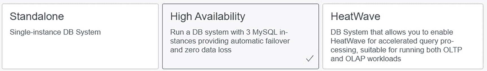

一个用于创建独立、高可用性和 HeatWave 的 D B 系统的框图。高可用性块已启用。

图 8-1
启用 HA（创建 DB 系统）

一旦您选择了 *高可用性*，您会注意到配置网络部分有一个细微的变化。这个变化是一段额外的文字，建议选择具有区域子网的 VCN，以便在某个域发生故障时最大限度地提高可用性的鲁棒性。图 8-2 显示了此对话框部分的更改。

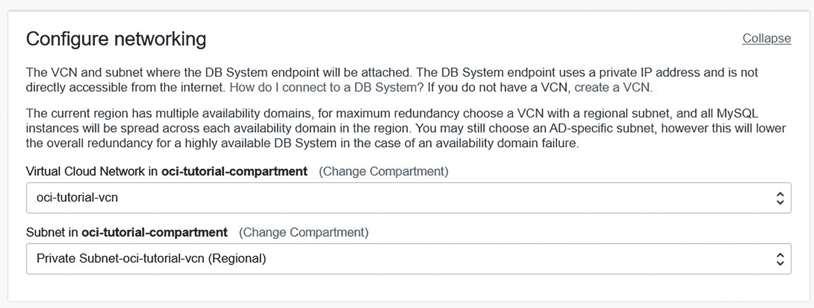

一个配置网络的对话框，文本中有一些超链接。虚拟云网络和 oci-tutorial-compartments 中的子网已填写。

图 8-2
网络部分（已启用 HA）

您还会看到一个新的部分，允许您选择主节点在可用性域中的放置位置，如图 8-3 所示。

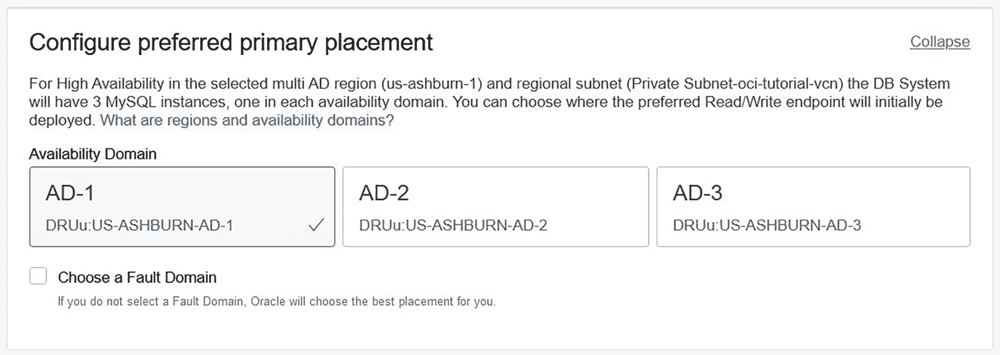

一个配置首选主节点放置位置的对话框，有 3 个可用域。启用了 A D-1。底部有一个用于选择故障域的复选框。

图 8-3
配置主节点放置位置（已启用 HA）

就是这样！一旦您完成对话框的其余部分（MySQL 管理员信息、形状和数据存储大小），然后单击 *创建* 按钮，您的 HA DB 系统就会被创建。HA DB 系统准备就绪后，您可以像查看任何其他 DB 系统一样查看它。

DB 系统详细信息页面也有变化，首先是摘要部分，其中显示了 HA 的状态，如图 8-4 所示。


一个数据库系统详细信息页面，其中包含一个高可用性菜单，显示高可用性已启用以及高可用性类型。已启用项被高亮显示。

图 8-4
HA 已启用（DB 系统详细信息页面）


## 启用高可用性（现有数据库系统）

在现有数据库系统上启用高可用性，可以通过以下方式完成：在`数据库系统列表`上使用上下文菜单选择`启用高可用性`，从`更多操作`菜单中选择`启用高可用性`，或者在`数据库系统详情页面`的高可用性部分点击`启用`链接，如图 8-5 所示。


数据库系统详情页面有一个高可用性菜单，显示高可用性为已禁用状态。超链接“启用”已高亮显示。
图 8-5：启用高可用性（数据库系统详情页面）

一旦点击`启用`，您将看到一个对话框，解释 MDS 将如何把您的独立数据库系统转换为高可用性数据库系统。图 8-6 展示了启用高可用性的对话框。

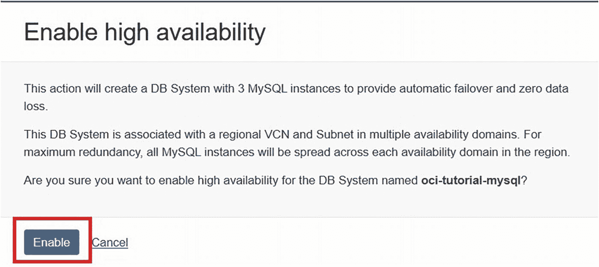
一个“启用高可用性”对话框，包含 4 到 5 行关于数据库系统的文本。“启用”按钮位于左下角并已高亮。
图 8-6：启用高可用性对话框（现有数据库系统）

当您确定要继续时，可以点击`启用`按钮。结果将与前面创建高可用性数据库系统的示例相同。

**注意**
虽然独立数据库系统支持时间点恢复，但高可用性数据库系统不支持。因此，您可能需要关闭时间点恢复才能在独立数据库系统上启用高可用性。

但是，如果您用于独立数据库系统的形状与 MDS 高可用性不兼容，您将看到一个对话框，可以在其中选择不同的形状。只需从下拉列表中选择一个形状，然后点击`启用`按钮。您的数据不会被擦除，但您可能会因新形状产生额外费用。

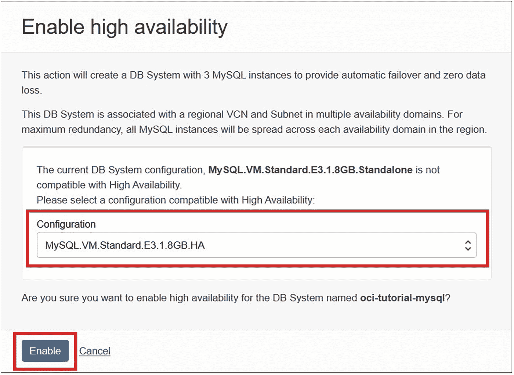
一个“启用高可用性”对话框，包含几行关于数据库系统的文本。配置从滚动框中选择。“启用”按钮位于左侧并已高亮。
图 8-7：启用高可用性时更改形状（现有数据库系统）

此过程可能需要一些时间运行，因此请耐心等待，直到高可用性功能在您的数据库系统上启用。

**注意**
在现有数据库系统上启用高可用性会增加成本，因为您将添加两个额外的数据库系统以及用于副本的数据存储。幸运的是，高可用性功能支持所产生的任何额外网络负载不会计费。

## 禁用高可用性（现有高可用性数据库系统）

令人惊讶的是，您可以在现有的高可用性数据库系统上禁用高可用性。只需在`数据库系统详情页面`的高可用性部分选择`禁用`链接，如图 8-8 所示。

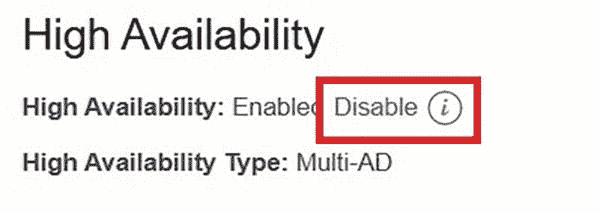
数据库系统详情页面有一个高可用性菜单，显示高可用性为已启用状态。
图 8-8：禁用高可用性（现有数据库系统）

一旦点击`禁用`，系统会要求您确认操作，如图 8-9 所示。确认后，点击对话框上的`禁用`按钮以在您的数据库系统上禁用高可用性。此操作可能需要一些时间才能完成。

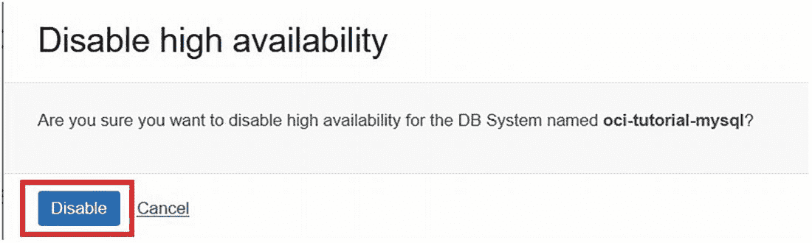
一个用于禁用高可用性的对话框。文本询问您是否确定要禁用高可用性？如果确定，请选择左下角的“禁用”按钮，该按钮已高亮。
图 8-9：确认禁用高可用性

## 如何使用 MDS 高可用性

再次说明，故障转移会自动发生，但如果您想执行切换，可以通过在`数据库系统`列表上选择上下文菜单或从菜单中选择`切换`来完成，如图 8-10 所示。

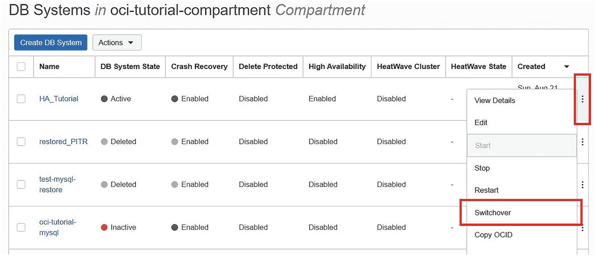
一个表格列出了数据库系统。“创建数据库系统”按钮位于左上角。点击右侧的点号并从该菜单中选择“切换”。
图 8-10：选择切换（数据库系统列表）

您也可以在`数据库系统详情页面`使用`更多操作`菜单并选择`切换`，如图 8-11 所示。

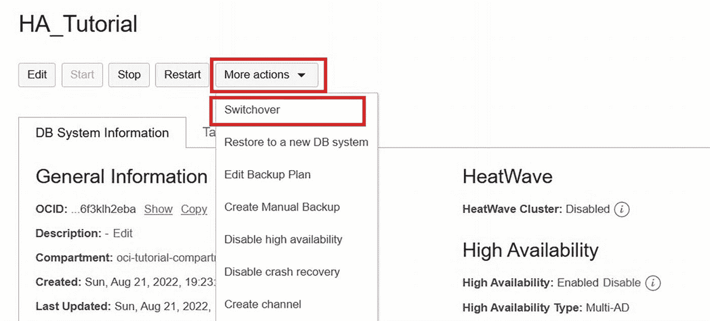
数据库系统的详情页面显示常规信息详情。从选项卡中选择“更多操作”选项，并从菜单中选择“切换”。
图 8-11：选择切换（数据库系统详情页面）

无论哪种情况，您都会看到一个对话框，需要在其中选择要提升为新的主实例的副本的故障域可用区，如图 8-12 所示。

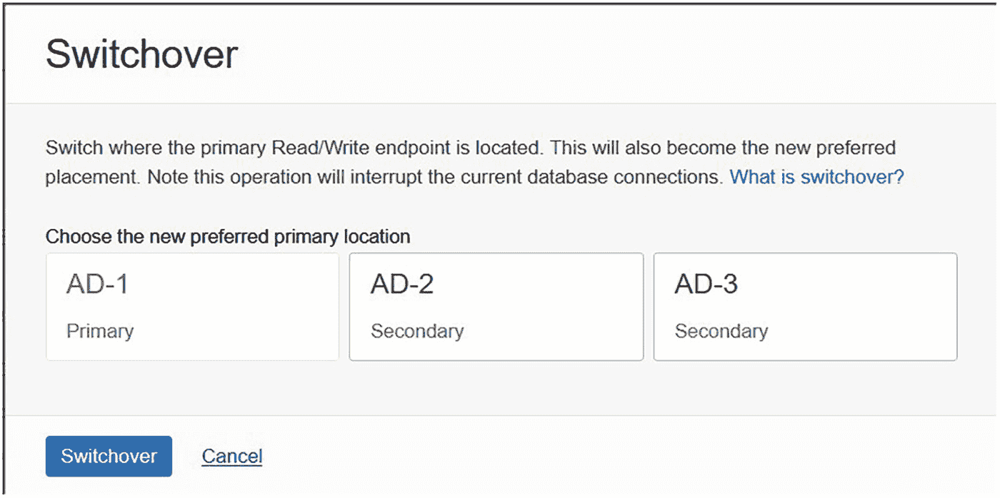
一个包含 3 个可用区的切换对话框。AD-1 为主用区，AD-2 和 AD-3 为副本区。选择左下角的“切换”按钮。
图 8-12：切换对话框

一旦您选择了一个不同的可用区并点击`切换`按钮，`数据库系统`的状态将变为`更新中`，并且所选实例将成为主实例。

## 限制

使用高可用性数据库系统存在一些限制，如下所列：

*   **备份**：您无法在高可用性数据库系统上恢复独立数据库系统的备份。
*   **高可用性配置**：您无法更改高可用性数据库系统的配置。但是，您可以使用高可用性数据库系统的备份来恢复到具有不同高可用性配置的新高可用性数据库系统。
*   **HeatWave**：您无法在高可用性数据库系统上使用 HeatWave。
*   **MySQL 版本**：高可用性数据库系统必须使用 MySQL 8.0.24 或更高版本。
*   **时间点恢复**：您无法在高可用性数据库系统上使用 PITR。
*   **滚动升级**：高可用性数据库系统升级时，使用滚动升级方式，每个数据库系统（主库和副本）依次升级，在新主库可用之前会有短暂的停机时间。
*   **副本访问**：您不能直接访问副本实例，无论是使用`MySQL Shell`还是任何其他此类客户端。
*   **形状**：您必须选择某些可用于高可用性的形状，并且事务的最大大小受形状限制。更多信息请参阅 [`https://docs.oracle.com/en-us/iaas/mysql-database/doc/high-availability1.xhtml`](https://docs.oracle.com/en-us/iaas/mysql-database/doc/high-availability1.xhtml) 中的**限制**部分。

## 高级主题

MDS 的高可用性功能还包括两个值得一提的额外高级主题。如果您现有的本地 MySQL 服务器使用复制，并且您想复制到/从 MDS 进行复制，您可以使用名为`入站复制`和`出站复制`的功能来实现。

这些功能旨在让您能够创建混合云解决方案，其中您的 MySQL 解决方案的一部分可能在本地，其余部分在 OCI（MDS）中。这些技术也可用于在本地和 MDS MySQL 服务器之间同步数据。

`入站复制`使用在 MDS 中配置的复制通道，将事务从一个本地 MySQL 服务器（或位于别处的另一个数据库系统）复制到一个称为`副本`的数据库系统。关于设置入站复制的更多信息，请参见 [`https://docs.oracle.com/en-us/iaas/mysql-database/doc/inbound-replication.xhtml`](https://docs.oracle.com/en-us/iaas/mysql-database/doc/inbound-replication.xhtml)。

`出站复制`则相反。它使用在 MDS 中配置的复制通道，将事务从一个数据库系统复制到一个本地（或位于别处的另一个数据库系统）称为`副本`的系统。该通道将数据库系统（`源`）连接到`副本`，并将事务从源复制到副本。


## 总结

实现 MDS 的高可用性非常简单。您可以在创建操作时选择它，也可以在已使用 DB 系统后启用它。无论哪种方式，Oracle 都克服了相当陡峭的学习曲线，使复制能够启动并运行，并随着时间的推移进行管理。

因此，Oracle 在 MySQL 组复制的基础上进行了改进，依托其 OCI 功能集和成功经验，并整合了多项其他功能，以提供一个更易学习、更易维护的高可用性解决方案。事实上，没有理由不在您的 DB 系统上使用高可用性。虽然由于使用更多资源而成本更高，但可靠性和可用性带来的安心感远超过其微小的增量成本。

在下一章中，我们将看到另外两项技术的概述：OCI 命令行界面（CLI）和 OCI 应用程序编程接口（API）。我们已经在第 7 章见过 CLI，但我们将更深入地了解 CLI 的可能性，包括如何编写可用于开发运维（DevOps）任务的特定操作脚本。

## 9. OCI 命令行与应用程序编程界面

到目前为止，本书中我们一直使用基于 Web 的 OCI 控制台来操作 OCI 产品和服务。我们了解了如何设置 OCI 账户、创建网络服务以及创建和配置 DB 系统。如果您对基于 Web 的控制台感到满意，应考虑继续使用它，因为您需要执行的每项操作都易于查找，并且大部分信息可以在一个页面或带有标签页的页面上找到。

但是，如果您想以 Bash（或类似）脚本文件的形式编写开发运维（DevOps）流程，该怎么办？如果您想用 Python 等编程语言来编写这些脚本呢？进一步地，如果您想将个人电脑配置为仅通过命令行访问来操作 OCI 中的对象，又该如何？幸运的是，所有这些问题的答案都可以在 OCI 提供的命令行和应用程序编程接口中找到。

在本章中，我们将概述用于操作 OCI 和 MDS DB 系统的命令行界面（CLI）和应用程序编程接口（API）的功能。

## 入门指南

OCI 文档的一个优点是，Oracle 经常包含同时涵盖基于 Web 和 CLI 示例的文本，用于操作其产品和服务。也有一些示例展示了如何使用 API 执行操作，但这些通常只出现在 API 文档中。

您使用 CLI 几乎不费吹灰之力。事实上，如果您执行了第 7 章中的示例，您就已经安装了 CLI。回想一下，我们安装 CLI 是因为 MySQL Shell 需要它。然而，当时没有透露的是，CLI 是使用 Python OCI API 编写的。所以，如果您安装了 CLI，那么您也同时安装了 Python API。很好！

在第 7 章名为“为 OCI CLI 访问配置您的个人电脑”的章节中，我们配置了个人电脑以供 CLI 使用。这至少需要以下配置，这些配置同时适用于 CLI 和 API。如果您尚未配置个人电脑，请参考第 7 章中的相应章节来为使用 CLI 和 API 配置您的个人电脑：

*   一个用于签署 API 请求的 SSH 密钥，以及已上传到您 OCI 账户的公钥。
*   安装在支持操作系统上的`Python 3`。

提示
有关安装 CLI 的更多信息，请参阅位于 [`https://docs.oracle.com/en-us/iaas/Content/API/SDKDocs/cliinstall.htm`](https://docs.oracle.com/en-us/iaas/Content/API/SDKDocs/cliinstall.htm) 的 CLI 安装文档。

### 命令行界面（CLI）

OCI CLI 是一个基于 Python 的应用程序，您可以下载并在个人电脑上运行。它代表了基于 Web 的云控制台的一种替代方案，特别适用于运行重复性任务或您希望通过开发运维（DevOps）工具自动化的任务。

有趣的是，CLI 是使用 OCI API（SDK）构建的，如果您决定使用 API，它可以向您展示其应用程序可能实现的功能。

#### 安装 CLI

回想一下，我们在第 7 章名为“安装和测试 OCI CLI”的章节中安装了 CLI。如果您尚未安装 CLI，请参考这些章节来配置您的个人电脑并安装 CLI。

#### 功能

CLI 是 Python API 的宏级接口。因此，许多可用操作执行一系列任务，这些任务通常在 API 中需要多个方法来完成。幸运的是，CLI 的设计考虑了操作员的需求。因此，这些操作是我们在使用 OCI 产品和服务时所想到的操作。

CLI 的工作原理是提供一个命令列表，每个命令都可以有子命令和参数。CLI 的主可执行文件名为`oci`，并以相同的名称调用。一个贴心之处是您无需记住所有的命令列表，因为 CLI 具有上下文帮助功能。例如，您可以不带参数地输入`oci`命令以获取所有命令的更多信息，或使用`oci <command>`获取特定命令的帮助。这也适用于子命令。列表 9-1（为简洁起见节选）显示了主命令的帮助信息。

```
if (condVar > someVal) {console.log("xxx")}
```


# OCI 命令行界面帮助

```
C:\>oci
用法：oci [选项] 命令 [参数]...
Oracle Cloud Infrastructure 命令行界面，支持审计、块卷、计算、数据库、IAM、负载均衡、网络、
DNS、文件存储、电子邮件递送和对象存储服务。
大多数命令必须指定一个服务，后跟资源类型和操作。例如，要列出用户（其中 $T 包含当前租户的 OCID）：
oci iam user list --compartment-id $T
输出为 JSON 格式。
...
命令：
iam                             身份与访问管理服务
raw-request                     对 OCI 服务发出原始请求
session                         CLI 的会话命令
setup                           CLI 的设置命令
adm                             应用程序依赖关系管理
ai                              语言
ai-vision                       视觉
analytics                       分析
announce                        公告服务
anomaly-detection               Oracle Cloud AI 服务
api-gateway                     API 网关
apm-config                      应用程序性能监控配置
apm-control-plane               应用程序性能监控控制平面
apm-synthetics                  应用程序性能监控合成监控
apm-traces                      应用程序性能监控跟踪浏览器
application-migration           应用程序迁移
appmgmt-control                 资源发现与监控控制
artifacts                       制品和容器镜像
audit                           审计
autoscaling                     自动扩展
bastion                         堡垒机
bds                             大数据服务
blockchain                      区块链平台控制平面
budgets                         预算
bv                              块卷服务
ce                              Kubernetes 容器引擎
certificates                    证书服务检索
certs-mgmt                      证书服务管理
cloud-guard                     云防护与安全区域
compute                         计算服务
compute-management              计算管理服务
dashboard-service               仪表板
data-catalog                    数据目录
data-connectivity               数据连接管理
data-flow                       数据流
data-integration                数据集成
data-labeling-service           数据标注管理
data-labeling-service-dataplane   数据标注
data-safe                       数据安全
data-science                    数据科学
database-management             数据库管理
database-migration              Oracle 数据库迁移服务
db                              数据库服务
dbtools                         数据库工具
devops                          DevOps
dns                             DNS
dts                             数据传输服务
em-warehouse                    EmdwControlPlane
email                           电子邮件递送
events                          事件
fn                              函数服务
fs                              文件存储
fusion-apps                     Fusion 应用程序环境管理
goldengate                      GoldenGate
governance-rules-control-plane  GovernanceRulesControlPlane
health-checks                   健康检查
iam                             身份与访问管理服务
instance-agent                  计算实例代理服务
integration                     Oracle Integration
jms                             Java 管理服务
kms                             密钥管理
lb                              负载均衡
license-manager                 许可证管理器
limits                          服务限制
log-analytics                   日志分析
logging                         日志记录管理
logging-ingestion               日志摄入
logging-search                  日志记录搜索
management-agent                管理代理
management-dashboard            管理仪表板
marketplace                     市场服务
media-services                  媒体服务
monitoring                      监控
mysql                           MySQL 数据库服务
network                         网络服务
network-firewall                网络防火墙
nlb                             网络负载均衡器
nosql                           NoSQL 数据库
oce                             Oracle 内容与体验
ocvs                            Oracle Cloud VMware 解决方案
oda                             数字助理服务实例
oma                             托管访问
onesubscription                 OneSubscription
ons                             通知
opa                             Oracle 流程自动化
opctl                           操作员访问控制
opensearch                      OpenSearch 服务
opsi                            运营洞察
optimizer                       云顾问
organizations                   组织
os                              对象存储服务
os-management                   操作系统管理
osp-gateway                     OSP 网关
osub-billing-schedule           OneSubscription 计费计划
osub-organization-subscription  OneSubscription 网关组织的订阅
osub-subscription               OneSubscription 订阅、承诺和费率卡详情
osub-usage                      OneSubscription 用量计算
resource-manager                资源管理器
rover                           RoverCloudService
sch                             服务连接器中心
search                          搜索服务
secrets                         Vault 密钥检索
service-catalog                 服务目录
service-manager-proxy           服务管理器代理
service-mesh                    服务网格
speech                          语音
stack-monitoring                堆栈监控
streaming                       流
support                         支持管理
threat-intelligence             威胁情报
usage                           用量代理
usage-api                       用量
vault                           Vault 密钥管理
visual-builder                  Visual Builder
vn-monitoring                   网络监控
vulnerability-scanning          扫描
waa                             Web 应用程序加速 (WAA)
waas                            Web 应用程序加速与安全服务
waf                             Web 应用程序防火墙 (WAF)
work-requests                   工作请求
清单 9-1
CLI 帮助示例
```


## 概述

正如你所看到的，这里有很多命令！我们最感兴趣的命令是 `mysql` 命令。清单 9-2 展示了 `mysql` (MDS) 命令的帮助信息。

```
C:\>oci mysql
Usage: oci mysql [OPTIONS] COMMAND [ARGS]...
The CLI for the MySQL Database Service
Options:
-?, -h, --help  For detailed help on any of these individual commands, enter
 --help.
Commands:
backup                  A full or incremental copy of a DB System which...
channel                 A Channel connecting a DB System to an external...
configuration           The set of MySQL variables to be used when...
db-system               MySQL Database Service
shape                   The shape of the DB System.
version                 A supported MySQL Version.
work-request            The status of an asynchronous task in the system.
work-request-error      An error encountered while executing a work...
work-request-log-entry  A log message from the execution of a work...
清单 9-2
CLI mysql 帮助示例
```

类似地，如果你想查看 `mysql backup` 命令的帮助，可以执行 `oci mysql backup` 命令。清单 9-3 展示了此命令的输出。

```
C:\>oci mysql backup
Usage: oci mysql backup [OPTIONS] COMMAND [ARGS]...
A full or incremental copy of a DB System which can be used to create a
new DB System or recover a DB System.
To use any of the API operations, you must be authorized in an IAM policy.
If you're not authorized, talk to an administrator. If you're an
administrator who needs to write policies to give users access, see
[Getting Started with Policies].
Options:
-?, -h, --help  For detailed help on any of these individual commands, enter
 --help.
Commands:
change-compartment  Moves a DB System Backup into a different compartment.
create              Create a backup of a DB System.
delete              Delete a Backup.
get                 Get information about the specified Backup Command...
list                Get a list of DB System backups.
清单 9-3
CLI mysql backup 帮助示例
```

注意帮助信息中包含了大量内容。这是探索 CLI 最快的方式，并且在大多数情况下，你不需要查阅更长、更详细的在线文档。这就是为什么我们从基于 Web 的控制台开始。一旦你掌握了它，所有这些术语都会变得清晰明了，你可以轻松地找到脚本化任何支持操作所需的命令和参数。

CLI 的输出是 JavaScript 对象表示法（JSON）格式，大多数人会发现它易于阅读和使用。例如，如果你想列出特定 DB System 的备份，你可以执行以下不带参数的命令，并添加 `--help` 选项以获取更多信息：

```
oci_mysql backup list --help
```

这将产生清单 [9-4 中的输出（为简洁起见进行了重新格式化）。注意 `DB System` 选项。

```
C:\>oci mysql backup list --help
"list"
******
* 说明
* 用法
* 必需参数
* 可选参数
* 全局参数
* 示例
说明
===========
获取 DB System 备份列表。
用法
=====
oci mysql backup list [OPTIONS]
必需参数
===================
--compartment-id, -c [text] 隔离区 OCID。
可选参数
===================
--all 获取所有页面的结果。如果提供此选项，则无法提供 "--limit" 选项。
--backup-id [text] 备份 OCID
--creation-type [text] 备份创建类型。可接受的值为：AUTOMATIC, MANUAL, OPERATOR
--db-system-id [text] DB System OCID。
--display-name [text] 筛选条件，仅返回与给定显示名称完全匹配的资源。
--from-json [text] 使用 file://path-to/file 语法从文件为该命令提供 JSON 文档输入。
可使用 "--generate-full-command-json-input" 选项生成一个示例 json 文件，以用于此命令选项。键名是预先填充的，并与命令选项名称匹配（转换为 camelCase 格式，例如 compartment-id compartmentId），而键的值需要用户在将示例文件作为此命令输入之前填充。对于接受多个值的任何命令选项，该键的值可以是 JSON 数组。
仍然可以在命令行上提供选项。如果某个选项同时存在于 JSON 文档和命令行中，则将使用命令行指定的值。
有关此选项用法的示例，请参阅我们使用具有高级 JSON 选项的 CLI 链接：https://docs.cloud.oracle.com/iaas/Content/API/SDKDocs/cliusing.htm#AdvancedJSONOptions
--lifecycle-state [text] 备份生命周期状态。可接受的值为：ACTIVE, CREATING, DELETED, DELETING, FAILED, INACTIVE, UPDATING
--limit [integer] 在分页列表调用中返回的最大项目数。有关分页信息，请参阅列表分页。
--page [text] 来自上一个列表调用的 *opc-next-page* 或 *opc-prev-page* 响应头的值。有关分页信息，请参阅列表分页。
--page-size [integer] 获取结果时，每次调用要获取的结果数。仅与 "--all" 或 "--limit" 一起使用时有效，否则忽略。
--sort-by [text] 排序依据的字段。只能提供一个排序顺序。时间字段默认按降序排序。可接受的值为：displayName, timeCreated, timeUpdated
--sort-order [text] 要使用的排序顺序（ASC 或 DESC）。可接受的值为：ASC, DESC
全局参数
=================
使用 "oci --help" 获取关于全局参数的帮助。
"--auth-purpose", "--auth", "--cert-bundle", "--cli-auto-prompt", "--cli-rc-file", "--config-file", "--connection-timeout", "--debug", "--defaults-file", "--endpoint", "--generate-full-command-json-input", "--generate-param-json-input", "--help", "--latest-version", "--max-retries", "--no-retry", "--opc-client-request-id", "--opc-request-id", "--output", "--profile", "--query", "--raw-output", "--read-timeout", "--region", "--release-info", "--request-id", "--version", "-?", "-d", "-h", "-i", "-v"
清单 9-4
CLI mysql backup list 帮助示例
```

哇，信息量真大！我们现在知道了所有需要的信息，可以列出某个隔离区或特定 DB System（使用 `--db-system-id` 选项）的备份。

> **注意**
> 有些选项是必需的，而其他是可选的。此外，有些选项提供了快捷方式。例如，`--compartment-id` 和 `-c` 是同一个选项。

现在我们理解了 CLI 的基础知识，让我们来看一些可以立即用于你的 DB System 的示例操作。

#### 示例用法

以下是一些使用 CLI 进行常见 MDS 操作的示例，范围从简单的对象列表到创建对象。这些仅作为示例，并未涵盖所有 MDS CLI 命令。更多链接请参见下面的 *更多信息*。

> **警告**
> `oci` 命令的参数不能使用空格。例如，`--param1=value` 是有效的，但 `--param1 = value` 是无效的，并将导致 “invalid option” 错误。

## 管理 DB 系统

### 列出 DB 系统的备份

要列出 DB 系统的备份，我们使用 `--db-system-id` 和 `--compartment-id` 选项，分别提供对应的 OCID。清单 9-5 展示了如何构建和执行此命令。请注意，输出以 JSON 格式生成。另请注意，我们使用了带有 `ACTIVE` 参数的 `--lifecycle-state` 选项，以跳过所有非活动状态的备份。

```C:\>oci mysql backup list --compartment-id=ocid1.compartment.MASKED --db-system-id=ocid1.mysqldbsystem.MASKED --lifecycle-state=ACTIVE
{
"data": [
{
"backup-size-in-gbs": 1,
"backup-type": "INCREMENTAL",
"creation-type": "AUTOMATIC",
"data-storage-size-in-gbs": 50,
"db-system-id": "ocid1.mysqldbsystem.MASKED",
"defined-tags": {
"Oracle-Tags": {
"CreatedOn": "2022-04-11T18:42:37.374Z"
}
},
"description": null,
"display-name": "mysqlbackup20220821100711",
"freeform-tags": {},
"id": "ocid1.mysqlbackup.MASKED",
"lifecycle-state": "ACTIVE",
"mysql-version": "8.0.29",
"retention-in-days": 10,
"shape-name": "MySQL.VM.Standard.E3.1.8GB",
"time-created": "2022-08-21T10:07:11.725000+00:00"
},
{
"backup-size-in-gbs": 1,
"backup-type": "INCREMENTAL",
"creation-type": "AUTOMATIC",
"data-storage-size-in-gbs": 50,
"db-system-id": "ocid1.mysqldbsystem.MASKED",
"defined-tags": {
"Oracle-Tags": {
"CreatedOn": "2022-04-11T18:42:37.374Z"
}
},
"description": null,
"display-name": "mysqlbackup20220820100710",
"freeform-tags": {},
"id": "ocid1.mysqlbackup.MASKED",
"lifecycle-state": "ACTIVE",
"mysql-version": "8.0.29",
"retention-in-days": 10,
"shape-name": "MySQL.VM.Standard.E3.1.8GB",
"time-created": "2022-08-20T10:07:10.149000+00:00"
},
{
"backup-size-in-gbs": 1,
"backup-type": "FULL",
"creation-type": "AUTOMATIC",
"data-storage-size-in-gbs": 50,
"db-system-id": "ocid1.mysqldbsystem.MASKED",
"defined-tags": {
"Oracle-Tags": {
"CreatedOn": "2022-04-11T18:42:37.374Z"
}
},
"description": null,
"display-name": "mysqlbackup20220818203231",
"freeform-tags": {},
"id": "ocid1.mysqlbackup.oc1.iad.MASKED",
"lifecycle-state": "ACTIVE",
"mysql-version": "8.0.29",
"retention-in-days": 10,
"shape-name": "MySQL.VM.Standard.E3.1.8GB",
"time-created": "2022-08-18T20:32:31.588000+00:00"
}
]
}
```
清单 9-5 列出 DB 系统的备份

注意，系统可能会要求你输入 API SSH 密钥的密码。

### 停止/启动 DB 系统

下一个示例展示了如何使用 CLI 停止一个 DB 系统。在这种情况下，我们需要使用 `mysql db-system` 命令，传递 DB 系统的 OCID 以及 `stop` 操作。清单 9-6 展示了这个命令的示例。

```C:\>oci mysql db-system stop --db-system-id=ocid1.mysqldbsystem.MASKED --shutdown-type=fast
{
"opc-work-request-id": "ocid1.mysqlworkrequest.MASKED"
}
```
清单 9-6 停止 DB 系统

请注意，输出是一个工作请求 ID。这表示有一个操作正在运行，虽然我们没有直接获得状态，但我们可以使用以下命令获取关于此工作请求的更多信息，包括其状态。这里，我们使用 `work-request` 子命令的 `get` 操作，通过 `--work-request-id` 选项中指定的 OCID 来获取工作请求的详细信息。

```C:\>oci mysql work-request get --work-request-id=ocid1.mysqlworkrequest.MASKED
Private key passphrase:
{
"data": {
"compartment-id": "ocid1.compartment.MASKED",
"id": "ocid1.mysqlworkrequest.MASKED",
"operation-type": "STOP_DBSYSTEM",
"percent-complete": 100.0,
"resources": [
{
"action-type": "RELATED",
"entity-type": "mysqldbsystem",
"entity-uri": "/dbSystems/ocid1.mysqldbsystem.MASKED",
"identifier": "ocid1.mysqldbsystem.MASKED"
}
],
"status": "SUCCEEDED",
"time-accepted": "2022-08-22T01:01:18.469000+00:00",
"time-finished": "2022-08-22T01:02:39.135000+00:00",
"time-started": "2022-08-22T01:01:22.935000+00:00"
}
}
```
清单 9-7 获取工作请求状态

`oci mysql work-request get --work-request-id=`

我们注意到状态为 `SUCCEEDED`。如果工作请求仍在运行，我们将看到相应的状态。这就是你如何使用 CLI 跟踪工作请求，这是一种常见的机制。

我们也可以获取刚刚停止的 DB 系统的信息，以确保它处于停止状态。清单 9-8 展示了获取 DB 系统信息的 CLI 命令，随后是获取工作请求状态的命令。

```C:\>oci mysql db-system start --db-system-id=ocid1.mysqldbsystem.MASKED
{
"opc-work-request-id": "ocid1.mysqlworkrequest.MASKED"
}
C:\>oci mysql work-request get --work-request-id=ocid1.mysqlworkrequest.MASKED
{
"data": {
"compartment-id": "ocid1.compartment.MASKED",
"id": "ocid1.mysqlworkrequest.MASKED",
"operation-type": "START_DBSYSTEM",
"percent-complete": 0.48333332,
"resources": [
{
"action-type": "IN_PROGRESS",
"entity-type": "mysqldbsystem",
"entity-uri": "/dbSystems/ocid1.mysqldbsystem.MASKED",
"identifier": "ocid1.mysqldbsystem.MASKED"
}
],
"status": "IN_PROGRESS",
"time-accepted": "2022-08-22T01:09:46.862000+00:00",
"time-finished": null,
"time-started": "2022-08-22T01:09:56.948000+00:00"
}
}
...
C:\>oci mysql work-request get --work-request-id=ocid1.mysqlworkrequest.MASKED
{
"data": {
"compartment-id": "ocid1.compartment.MASKED",
"id": "ocid1.mysqlworkrequest.MASKED",
"operation-type": "START_DBSYSTEM",
"percent-complete": 100.0,
"resources": [
{
"action-type": "RELATED",
"entity-type": "mysqldbsystem",
"entity-uri": "/dbSystems/ocid1.mysqldbsystem.MASKED",
"identifier": "ocid1.mysqldbsystem.MASKED"
}
],
"status": "SUCCEEDED",
"time-accepted": "2022-08-22T01:09:46.862000+00:00",
"time-finished": "2022-08-22T01:13:56.223000+00:00",
"time-started": "2022-08-22T01:09:56.948000+00:00"
}
}
```
清单 9-8 获取 DB 系统信息（已停止）

与启动/停止类似，你也可以删除 DB 系统以及列出某个容器中的 DB 系统。对于 DB 系统，还有更多可用的命令。请参阅以下“更多信息”部分中的链接，以了解更多关于这些命令的信息。

好的，让我们再看一个示例，但这次我们将使用一个复杂的操作：创建一个新的 DB 系统。


### 创建数据库系统

创建数据库系统需要一组更复杂的参数和选项。在这种情况下，我们至少需要提供 compartment OCID、subnet OCID、名称（注意不是 OCIDs）以及可用性域名。我们将添加更多可选参数，但让我们先假设我们不知道这些对象的 OCID。别担心，我们可以用 CLI 来列出它们！

列表 9-9 展示了列出你租户中所有 compartment 的命令。注意我们使用了 `iam` 命令（身份和访问管理）配合 `compartment` 子命令和 `list` 参数来列出我们租户中的所有 compartment。

```cmd
C:\>oci iam compartment list
{
"data": [
{
"compartment-id": "ocid1.tenancy.MASKED",
"defined-tags": {},
"description": "MASKED",
"freeform-tags": {},
"id": "ocid1.compartment.MASKED",
"inactive-status": null,
"is-accessible": null,
"lifecycle-state": "ACTIVE",
"name": "ManagedCompartmentForPaaS",
"time-created": "2022-03-12T10:30:27.437000+00:00"
},
{
"compartment-id": "ocid1.tenancy.MASKED",
"defined-tags": {
"Oracle-Tags": {
"CreatedOn": "2022-04-15T20:11:23.394Z"
}
},
"description": "Used for MySQL development",
"freeform-tags": {},
"id": "ocid1.compartment.MASKED",
"inactive-status": null,
"is-accessible": null,
"lifecycle-state": "ACTIVE",
"name": "mysql-development-compartment",
"time-created": "2022-04-15T20:11:23.466000+00:00"
},
{
"compartment-id": "ocid1.tenancy.MASKED",
"defined-tags": {
"Oracle-Tags": {
"CreatedOn": "2022-03-11T19:40:29.719Z"
}
},
"description": "Our first compartment!",
"freeform-tags": {},
"id": "ocid1.compartment.MASKED",
"inactive-status": null,
"is-accessible": null,
"lifecycle-state": "ACTIVE",
"name": "oci-tutorial-compartment",
"time-created": "2022-03-11T19:40:29.794000+00:00"
}
]
}
```
**列表 9-9：列出 Compartment**

列出我们 compartment 的子网是一个类似的命令，不同之处在于我们可以使用 `network` 命令和 `subnet` 子命令配合 `list` 选项。我们通过 `--compartment-id` 参数传递 compartment OCID。

```cmd
C:\>oci network subnet list --compartment-id=ocid1.compartment.MASKED
Private key passphrase:
{
"data": [
{
"availability-domain": null,
"cidr-block": "10.0.1.0/24",
"compartment-id": "ocid1.compartment.MASKED",
"defined-tags": {
"Oracle-Tags": {
"CreatedOn": "2022-03-11T20:27:33.457Z"
}
},
"dhcp-options-id": "ocid1.dhcpoptions.MASKED",
"display-name": "Private Subnet-oci-tutorial-vcn",
"dns-label": "sub03112027061",
"freeform-tags": {
"VCN": "VCN-2022-03-11T20:25:54"
},
"id": "ocid1.subnet.MASKED",
"ipv6-cidr-block": null,
"ipv6-cidr-blocks": null,
"ipv6-virtual-router-ip": null,
"lifecycle-state": "AVAILABLE",
"prohibit-internet-ingress": true,
"prohibit-public-ip-on-vnic": true,
"route-table-id": "ocid1.routetable.MASKED",
"security-list-ids": [
"ocid1.securitylist.MASKED"
],
"subnet-domain-name": "sub03112027061.ocitutorialvcn.oraclevcn.com",
"time-created": "2022-03-11T20:27:33.893000+00:00",
"vcn-id": "ocid1.vcn.MASKED",
"virtual-router-ip": "10.0.1.1",
"virtual-router-mac": "00:00:17:38:7B:54"
},
{
"availability-domain": null,
"cidr-block": "10.0.0.0/24",
"compartment-id": "ocid1.compartment.MASKED",
"defined-tags": {
"Oracle-Tags": {
"CreatedOn": "2022-03-11T20:27:32.655Z"
}
},
"dhcp-options-id": "ocid1.dhcpoptions.MASKED",
"display-name": "Public Subnet-oci-tutorial-vcn",
"dns-label": "sub03112027060",
"freeform-tags": {
"VCN": "VCN-2022-03-11T20:25:54"
},
"id": "ocid1.subnet.MASKED",
"ipv6-cidr-block": null,
"ipv6-cidr-blocks": null,
"ipv6-virtual-router-ip": null,
"lifecycle-state": "AVAILABLE",
"prohibit-internet-ingress": false,
"prohibit-public-ip-on-vnic": false,
"route-table-id": "ocid1.routetable.MASKED",
"security-list-ids": [
"ocid1.securitylist.MASKED"
],
"subnet-domain-name": "sub03112027060.ocitutorialvcn.oraclevcn.com",
"time-created": "2022-03-11T20:27:32.987000+00:00",
"vcn-id": "ocid1.vcn.MASKED",
"virtual-router-ip": "10.0.0.1",
"virtual-router-mac": "00:00:17:38:7B:54"
}
]
}
```
**列表 9-10：列出一个 Compartment 的子网**

接下来，我们需要获取可用的 MySQL 规格。由于这个列表可能很长，我们会看到分页输出，这需要多次调用才能获取完整列表。如果你和我一样，没有耐心等待，我们可以使用 `--all` 参数。

我们需要获取规格及其名称的列表，如列表 9-11 所示（为简洁起见进行了节选），这需要使用 `mysql` 命令和 `shape` 子命令配合 `list` 选项以及 `--compartment-id` 参数。

```cmd
C:\>oci mysql shape list --compartment-id=ocid1.compartment.MASKED --all
Private key passphrase:
{
"data": [
{
"cpu-core-count": 1,
"is-supported-for": [
"DBSYSTEM"
],
"memory-size-in-gbs": 8,
"name": "VM.Standard.E2.1"
},
{
"cpu-core-count": 2,
"is-supported-for": [
"DBSYSTEM"
],
"memory-size-in-gbs": 16,
"name": "VM.Standard.E2.2"
},
{
"cpu-core-count": 4,
"is-supported-for": [
"DBSYSTEM"
],
"memory-size-in-gbs": 32,
"name": "VM.Standard.E2.4"
},
{
"cpu-core-count": 8,
"is-supported-for": [
"DBSYSTEM"
],
"memory-size-in-gbs": 64,
"name": "VM.Standard.E2.8"
},
{
"cpu-core-count": 1,
"is-supported-for": [
"DBSYSTEM"
],
"memory-size-in-gbs": 8,
"name": "MySQL.VM.Standard.E3.1.8GB"
},
...
```
**列表 9-11：列出 MySQL 规格**

好的，我们还需要一个列表：可用性域名的名称。要查找可用性域名，我们发出 `iam` 命令配合 `availability-domain` 子命令和 `list` 选项，并通过 `--compartment-id` 参数提供 compartment OCID。


#### 列出可用域

```bash
C:\ >oci iam availability-domain list --compartment-id=ocid1.compartment.MASKED
{
"data": [
{
"compartment-id": "ocid1.compartment.MASKED",
"id": "ocid1.availabilitydomain.MASKED",
"name": "DRUu:US-ASHBURN-AD-1"
},
{
"compartment-id": "ocid1.compartment.MASKED",
"id": "ocid1.availabilitydomain.MASKED",
"name": "DRUu:US-ASHBURN-AD-2"
},
{
"compartment-id": "ocid1.compartment.MASKED",
"id": "ocid1.availabilitydomain.MASKED",
"name": "DRUu:US-ASHBURN-AD-3"
}
]
}
代码清单 9-12
列出可用域
```

接下来，我们需要一些可选参数。下面展示了我们将使用的选项及其参数：

*   `--admin-password <password>`：MySQL 管理用户的密码。
*   `--admin-username <name>`：MySQL 管理用户的用户名。
*   `--data-storage-size-in-gbs <int>`：数据存储（数据库驱动器）的大小（单位为 GB）。
*   `--display-name <text>`：数据库系统的用户友好名称。
*   `--is-highly-available <bool>`：指定数据库系统是否为高可用。

我们还需要讨论另一个选项——让操作等待特定状态的选项。我们通过 `--wait-for-state <state>` 选项和以下状态之一 (`ACCEPTED`, `CANCELED`, `CANCELING`, `FAILED`, `IN_PROGRESS`, `SUCCEEDED`) 来实现。你可以多次指定此选项以等待多个操作。此操作会异步执行操作，并使用工作请求跟踪进度。可以指定多个状态，在第一个状态达到时返回。如果达到超时，则返回返回码 `2`。对于任何其他错误，则返回返回码 `1`。

好了，现在我们可以构建命令了。以下是该命令的示例。如果你想跟着操作，请务必使用你自己的 OCID 替换示例中已掩码的 OCID：

```bash
C:\>oci mysql db-system create --compartment-id=ocid1.compartment.MASKED --shape-name=VM.Standard.E2.4 --subnet-id=ocid1.subnet.MASKED --admin-password=MASKED --admin-username=mysql_admin --data-storage-size-in-gbs=50 --display-name=MySQL_CLI_Create --is-highly-available=false --wait-for-state=FAILED --wait-for-state=SUCCEEDED --availability-domain=DRUu:US-ASHBURN-AD-2
Private key passphrase:
Private key passphrase:
Action completed. Waiting until the work request has entered state: ('FAILED', 'SUCCEEDED')
{
"data": {
"compartment-id": "ocid1.compartment.oc1..aaaaaaaawzwb45t3lutkqvyhofxh3ai26e5oli2a4q6efbh25g3llqwys7pa",
"id": "ocid1.mysqlworkrequest.oc1.iad.83fd016c-1083-4a3f-92b9-c7c583d40b44.aaaaaaaai3m2mauwmhp3ppbdjvtwq26xomazthrsqk6teguy73mofidayk5q",
"operation-type": "CREATE_DBSYSTEM",
"percent-complete": 100.0,
"resources": [
{
"action-type": "CREATED",
"entity-type": "mysqldbsystem",
"entity-uri": "/dbSystems/ocid1.mysqldbsystem.oc1.iad.aaaaaaaay3d7ex7lnbvb24snjyvdg7mn6cx3qrezaq2nifq56ohdwmjk4owa",
"identifier": "ocid1.mysqldbsystem.oc1.iad.aaaaaaaay3d7ex7lnbvb24snjyvdg7mn6cx3qrezaq2nifq56ohdwmjk4owa"
}
],
"status": "SUCCEEDED",
"time-accepted": "2022-08-22T01:54:59.037000+00:00",
"time-finished": "2022-08-22T02:08:05.671000+00:00",
"time-started": "2022-08-22T01:55:13.888000+00:00"
}
}
代码清单 9-13
创建数据库系统示例命令
```

```bash
oci mysql db-system create \
--compartment-id=ocid1.compartment.MASKED \
--shape-name=VM.Standard.E2.4 \
--subnet-id=ocid1.subnet.MASKED \
--admin-password=MASKED \
--admin-username=mysql_admin \
--data-storage-size-in-gbs=50 \
--display-name=MySQL_CLI_Create \
--is-high-available=false \
--wait-for-state=FAILED \
--wait-for-state=SUCCEEDED \
--availability-domain=DRUu:US-ASHBURN-AD-2
```

好了，现在操作已返回，并且成功了。如果我们访问 OCI 控制台，可以找到该数据库系统并显示其详细信息页面，如图 9-1 所示。

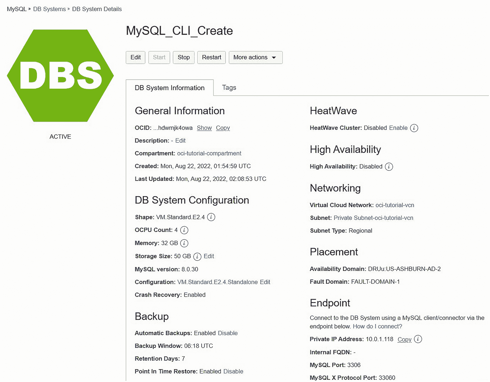
*一个名为“My SQL CLI Create”的数据库页面，显示了基本信息、数据库系统配置、备份、HeatWave、高可用性、网络、放置和端点的详细信息。*
**图 9-1：新建数据库系统详情页面（CLI 示例）**

最后，为了清理本示例，我们可以使用以下命令删除新创建的数据库系统，如代码清单 9-14 所示。请注意，系统会要求你确认删除操作。

```bash
C:\>oci mysql db-system delete --db-system-id=ocid1.mysqldbsystem.MASKED --wait-for-state=SUCCEEDED
Are you sure you want to delete this resource? [y/N]: y
Action completed. Waiting until the work request has entered state: ('SUCCEEDED',)
{
"data": {
"compartment-id": "ocid1.compartment.oc1..aaaaaaaawzwb45t3lutkqvyhofxh3ai26e5oli2a4q6efbh25g3llqwys7pa",
"id": "ocid1.mysqlworkrequest.MASKED",
"operation-type": "DELETE_DBSYSTEM",
"percent-complete": 100.0,
"resources": [
{
"action-type": "DELETED",
"entity-type": "mysqldbsystem",
"entity-uri": "/dbSystems/ocid1.mysqldbsystem.MASKED",
"identifier": "ocid1.mysqldbsystem.MASKED"
}
],
"status": "SUCCEEDED",
"time-accepted": "2022-08-22T02:15:30.534000+00:00",
"time-finished": "2022-08-22T02:18:02.293000+00:00",
"time-started": "2022-08-22T02:15:32.565000+00:00"
}
}
代码清单 9-14
删除数据库系统
```

现在，我们已经了解了一些更常见的操作，包括列出、创建和删除资源，接下来让我们看看 CLI 中可用的其他 MDS 操作的相关文档。


#### 更多信息

你持续研究 CLI 最有价值的资源和起点是位于 [`https://docs.oracle.com/en-us/iaas/tools/oci-cli/3.15.0/oci_cli_docs/`](https://docs.oracle.com/en-us/iaas/tools/oci-cli/3.15.0/oci_cli_docs/) 的文档。该文档按 OCI 产品和服务列出，包含这些产品和服务的所有 CLI 可能用途。例如，MDS 部分的文档包含以下主要部分。指向各部分文档的链接已包括在内：

*   `Backup`：处理备份的操作，包括创建和列出（[`https://docs.oracle.com/en-us/iaas/tools/oci-cli/3.15.0/oci_cli_docs/cmdref/mysql/backup.xhtml`](https://docs.oracle.com/en-us/iaas/tools/oci-cli/3.15.0/oci_cli_docs/cmdref/mysql/backup.xhtml)）。

*   `Channel`：处理用于入站和出站复制的复制通道的操作（[`https://docs.oracle.com/en-us/iaas/tools/oci-cli/3.15.0/oci_cli_docs/cmdref/mysql/channel.xhtml`](https://docs.oracle.com/en-us/iaas/tools/oci-cli/3.15.0/oci_cli_docs/cmdref/mysql/channel.xhtml)）。

*   `Configuration`：对配置 MySQL 参数的 MySQL 服务器变量集合的操作（[`https://docs.oracle.com/en-us/iaas/tools/oci-cli/3.15.0/oci_cli_docs/cmdref/mysql/configuration.xhtml`](https://docs.oracle.com/en-us/iaas/tools/oci-cli/3.15.0/oci_cli_docs/cmdref/mysql/configuration.xhtml)）。

*   `DB System`：对 DB Systems 的操作，包括所有功能，如高可用性、HeatWave 等（[`https://docs.oracle.com/en-us/iaas/tools/oci-cli/3.15.0/oci_cli_docs/cmdref/mysql/db-system.xhtml`](https://docs.oracle.com/en-us/iaas/tools/oci-cli/3.15.0/oci_cli_docs/cmdref/mysql/db-system.xhtml)）。

*   `Shape`：列出可用实例形状的列表操作（[`https://docs.oracle.com/en-us/iaas/tools/oci-cli/3.15.0/oci_cli_docs/cmdref/mysql/shape.xhtml`](https://docs.oracle.com/en-us/iaas/tools/oci-cli/3.15.0/oci_cli_docs/cmdref/mysql/shape.xhtml)）。

*   `Version`：列出可用 MySQL 服务器版本的列表操作（[`https://docs.oracle.com/en-us/iaas/tools/oci-cli/3.15.0/oci_cli_docs/cmdref/mysql/version.xhtml`](https://docs.oracle.com/en-us/iaas/tools/oci-cli/3.15.0/oci_cli_docs/cmdref/mysql/version.xhtml)）。

*   `Work-Request`：用于列出和获取监控操作的工作请求的操作（[`https://docs.oracle.com/en-us/iaas/tools/oci-cli/3.15.0/oci_cli_docs/cmdref/mysql/work-request.xhtml`](https://docs.oracle.com/en-us/iaas/tools/oci-cli/3.15.0/oci_cli_docs/cmdref/mysql/work-request.xhtml)）。

*   `Work-Request-Error`：获取有关工作请求错误的更多信息的列表操作（[`https://docs.oracle.com/en-us/iaas/tools/oci-cli/3.15.0/oci_cli_docs/cmdref/mysql/work-request.xhtml`](https://docs.oracle.com/en-us/iaas/tools/oci-cli/3.15.0/oci_cli_docs/cmdref/mysql/work-request.xhtml)）。

*   `Work-Request-Log-Entry`：从工作请求日志中获取更多信息的列表操作（[`https://docs.oracle.com/en-us/iaas/tools/oci-cli/3.15.0/oci_cli_docs/cmdref/mysql/work-request-log-entry.xhtml`](https://docs.oracle.com/en-us/iaas/tools/oci-cli/3.15.0/oci_cli_docs/cmdref/mysql/work-request-log-entry.xhtml)）。

有关这些区域的 CLI 操作的更多详情，请参阅上面的链接。你也可以访问 OCI CLI 主文档 [`https://docs.oracle.com/en-us/iaas/tools/oci-cli/3.15.0/oci_cli_docs/index.xhtml`](https://docs.oracle.com/en-us/iaas/tools/oci-cli/3.15.0/oci_cli_docs/index.xhtml) 以查看 OCI CLI 命令的完整列表。

## OCI API

Oracle 为 OCI 中的几乎所有操作都提供了 API，MDS 也不例外。Oracle 还提供软件开发工具包（SDK），你可以使用它们来开发和部署与 OCI 资源交互的应用程序。Oracle 为以下编程语言提供了 SDK。每个 SDK 都包含示例代码和文档。最重要的是，大多数 SDK 都可通过 GitHub 获取，你可以在那里贡献自己改进的建议。以下展示了 OCI 可用的 SDK 及其文档链接。如果你想在应用程序中使用这些 SDK 中的任何一个，请务必查阅文档和示例以开始使用：

*   `Java`：[`https://docs.oracle.com/en-us/iaas/Content/API/SDKDocs/javasdk.htm#SDK_for_Java`](https://docs.oracle.com/en-us/iaas/Content/API/SDKDocs/javasdk.htm%2523SDK_for_Java)

*   `Python`：[`https://docs.oracle.com/en-us/iaas/Content/API/SDKDocs/pythonsdk.htm#SDK_for_Python`](https://docs.oracle.com/en-us/iaas/Content/API/SDKDocs/pythonsdk.htm%2523SDK_for_Python)

*   `TypeScript` 和 `JavaScript`：[`https://docs.oracle.com/en-us/iaas/Content/API/SDKDocs/typescriptsdk.htm#SDK_for_TypeScript_and_JavaScript`](https://docs.oracle.com/en-us/iaas/Content/API/SDKDocs/typescriptsdk.htm%2523SDK_for_TypeScript_and_JavaScript)

*   `.NET`：[`https://docs.oracle.com/en-us/iaas/Content/API/SDKDocs/dotnetsdk.htm#SDK_for_NET`](https://docs.oracle.com/en-us/iaas/Content/API/SDKDocs/dotnetsdk.htm%2523SDK_for_NET)

*   `Go`：[`https://docs.oracle.com/en-us/iaas/Content/API/SDKDocs/gosdk.htm#SDK_for_Go`](https://docs.oracle.com/en-us/iaas/Content/API/SDKDocs/gosdk.htm%2523SDK_for_Go)

*   `Ruby`：[`https://docs.oracle.com/en-us/iaas/Content/API/SDKDocs/rubysdk.htm#SDK_for_Ruby`](https://docs.oracle.com/en-us/iaas/Content/API/SDKDocs/rubysdk.htm%2523SDK_for_Ruby)

由于 Python SDK 很流行且 Python 语言易于学习，我们将看一些使用 Python SDK 的示例。在深入研究 Python API 示例之前，让我们先简要讨论一下 MDS API，以便我们理解这些接口。

每个 SDK 的文档中都包含 API 参考，这是针对所支持每个资源的 API 的广泛列表。例如，Python SDK API 参考位于 [`https://docs.oracle.com/en-us/iaas/tools/python/2.79.0/api/landing.xhtml`](https://docs.oracle.com/en-us/iaas/tools/python/2.79.0/api/landing.xhtml)。

现在，让我们简要了解一下 MDS API。

## MDS API

MDS API 有五个主要组件（或者更准确地说，类）构成了该接口。这些包括：

*   `oci.mysql.ChannelsClient`：用于处理入站和出站复制的 API。

*   `oci.mysql.DbBackupsClient`：用于处理备份的 API。

*   `oci.mysql.DbSystemClient`：用于处理 DB Systems 的 API。

*   `oci.mysql.MysqlaasClient`：用于处理 MySQL 客户端访问（例如配置、形状、版本）的 API。

*   `oci.mysql.WorkRequestsClient`：用于与工作请求交互的 API。

此外，MDS API 还有五个类，它们将一些单独的 API 方法和类组合在一起进行宏观操作。这些包括：

*   `oci.mysql.ChannelsClientCompositeOperations`：用于处理入站和出站复制的 API。

*   `oci.mysql.DbBackupsClientCompositeOperations`：用于处理备份的 API。

*   `oci.mysql.DbSystemClientCompositeOperations`：用于处理 DB Systems 的 API。

*   `oci.mysql.MysqlaasClientCompositeOperations`：用于处理 MySQL 客户端访问（例如配置、形状、版本）的 API。

*   `oci.mysql.WorkRequestsClientCompositeOperations`：用于与工作请求交互的 API。

通常需要使用多个 MDS API 类来实现某些功能。让我们通过几个示例，简要浏览一下 Python 中的 MDS API。

### 示例使用

当你初次开始使用 OCI SDK 时，可能会有些挑战。在本节中，我们将通过演示 Python SDK 如何工作的基础知识来了解如何开始。但首先，让我们安装 Python SDK。

注意
你必须在你的 PC 上安装 Python 3。有关在你的 PC 上安装 Python 的更多详情，请参阅 Python 组织 [`www.python.org/`](http://www.python.org/)。


## 安装 Python SDK

在使用 Python SDK 之前，我们必须先安装它。回想一下，我们提到过 Python SDK 是 OCI CLI 的一部分，但它安装在自己的环境中，因此普通的 Python 客户端无法访问。幸运的是，我们可以在不影响任一产品的情况下，将 Python SDK 与 OCI CLI 一起安装。以下演示了如何在 Windows 11 上安装 Python SDK，但关于在其他平台上安装或使用其他方法的详细信息，请访问 [`https://docs.oracle.com/en-us/iaas/tools/python/2.79.0/installation.xhtml`](https://docs.oracle.com/en-us/iaas/tools/python/2.79.0/installation.xhtml)。

安装 Python SDK 的命令使用 `pip`，它在安装 Python 时会自动安装：

```
pip install oci
```

9-15 列表展示了此命令在 Windows 11 上运行的一个摘录。一旦完成，Python SDK 即安装完毕，可以继续进行。您电脑上的输出可能与此列表不同，具体取决于您电脑上安装的其他 Python 组件。

```
C:\ >pip install oci
Collecting oci
Downloading oci-2.79.0-py2.py3-none-any.whl (16.9 MB)
|████████████████████████████████| 16.9 MB 6.8 MB/s
Collecting python-dateutil=2.5.3
Downloading python_dateutil-2.8.2-py2.py3-none-any.whl (247 kB)
|████████████████████████████████| 247 kB 6.8 MB/s
Collecting cryptography=3.2.1
Downloading cryptography-37.0.2-cp36-abi3-win_amd64.whl (2.4 MB)
|████████████████████████████████| 2.4 MB 3.3 MB/s
Collecting pytz>=2016.10
Downloading pytz-2022.2.1-py2.py3-none-any.whl (500 kB)
|████████████████████████████████| 500 kB ...
Collecting certifi
Downloading certifi-2022.6.15-py3-none-any.whl (160 kB)
|████████████████████████████████| 160 kB 3.3 MB/s
Collecting circuitbreaker=1.3.1
Downloading circuitbreaker-1.4.0.tar.gz (9.7 kB)
Collecting pyOpenSSL=17.5.0
Downloading pyOpenSSL-22.0.0-py2.py3-none-any.whl (55 kB)
|████████████████████████████████| 55 kB 943 kB/s
Collecting cffi>=1.12
Downloading cffi-1.15.1-cp39-cp39-win_amd64.whl (179 kB)
|████████████████████████████████| 179 kB 3.3 MB/s
Collecting pycparser
Downloading pycparser-2.21-py2.py3-none-any.whl (118 kB)
|████████████████████████████████| 118 kB 3.2 MB/s
Requirement already satisfied: six>=1.5 in c:\users\cbell\appdata\local\programs\python\python39\lib\site-packages (from python-dateutil=2.5.3->oci) (1.16.0)
Using legacy 'setup.py install' for circuitbreaker, since package 'wheel' is not installed.
Installing collected packages: pycparser, cffi, cryptography, pytz, python-dateutil, pyOpenSSL, circuitbreaker, certifi, oci
Running setup.py install for circuitbreaker ... done
Successfully installed certifi-2022.6.15 cffi-1.15.1 circuitbreaker-1.4.0 cryptography-37.0.2 oci-2.79.0 pyOpenSSL-22.0.0 pycparser-2.21 python-dateutil-2.8.2 pytz-2022.2.1
Listing 9-15
Installing the Python SDK
```

## 入门指南

任何 Python SDK 脚本的基本布局都以导入部分开始，您在此导入 `getpass` 和 `oci` 模块。我们需要 `getpass` 模块，因为我们必须从用户（命令行）读取 SSH 密钥（称为密码短语）。

接下来是创建 `oci.config` 类的一个实例。此操作读取您的配置文件并为 SDK 对象准备使用您的凭据。然后，我们读取密码短语并将其添加到配置文件字典中。接着，我们连接到想要使用的 API 类，如果连接成功，我们就可以继续进行 API 方法调用。

**注意**

如果您的 PC 尚未设置使用 OCI CLI，请参阅第 7 章并在尝试 API 示例之前完成该设置。配置文件是通过 API 访问 MDS 所必需的。

9-16 列表展示了访问 OCI API 类所需的基本 Python 脚本。该脚本名为 `basic_api.py`。

**提示**

如果您是 Python 编程新手，可以访问 [`www.python.org/`](http://www.python.org/) 了解如何下载和安装 Python，以及获取教程和入门帮助。还有许多关于 Python 的优秀书籍和一些可以帮助您入门的网站。

```
#
