# 执行操作
if is_stop:
db_system_response = db_client.stop_db_system(
db_systems[db_num-1].id,
stop_db_system_details=oci.mysql.models.StopDbSystemDetails(
shutdown_type="FAST")
)
print(db_system_response.headers)
else:
db_system_response = db_client.start_db_system(db_systems[db_num-1].id)
print(db_system_response.headers)
print("完成！")
清单 9-19
控制数据库系统脚本


如你所见，代码要复杂得多，但其中大部分是用于收集数据库系统列表并显示给用户选择操作的 Python 代码。代码清单 9-20 展示了运行中的代码（为便于阅读进行了格式化）。请注意，我们拥有一个用户友好但简洁的界面，它可能比 OCI 控制台更具吸引力且更易于使用。

```
C:\Users\cbell>python control_db_system.py STOP
Enter the SSH key passphrase:
DB Systems in Compartment

1: oci-tutorial-mysql
Which DB System (int)? 1
Stopping the DB System named 'oci-tutorial-mysql'
{
'Date': 'Mon, 22 Aug 2022 20:44:34 GMT',
'opc-request-id': 'MASKED',
'opc-work-request-id': 'ocid1.mysqlworkrequest.MASKED',
'X-Content-Type-Options': 'nosniff',
'Content-Type': 'application/json'
}
Done!
Listing 9-20
Output of the Control DB System Script
```

这个脚本可以作为一个很好的起点，用于执行你可能想对数据库系统进行的其他操作。只需根据需要修改它即可！

我们将看的最后一个示例是创建新数据库系统的操作。虽然 Python 代码可能看起来更复杂，但它使用了与本示例相同的功能，只是采用了更复杂的 Python 编程风格。不过，它涉及更多的 API 方法，并且参数也更复杂。

### 创建数据库系统

回顾 CLI 部分中的创建数据库系统示例，我们需要几条信息来创建数据库系统。我们在以下列表中重复必需和可选参数：

*   `--compartment-id <id>`: compartment 的 ID。
*   `--shape-name <name>`: 形状名称。
*   `--subnet-id <id>`: 子网的 OCID。
*   `--availability-domain <name>`: 要使用的可用性域名。
*   `--admin-password <password>`: MySQL 管理员用户的密码。
*   `--admin-username <name>`: MySQL 管理员用户的用户名。
*   `--data-storage-size-in-gbs <int>`: 数据存储（数据库驱动器）的大小，单位为 GB。
*   `--display-name <text>`: 数据库系统的用户友好名称。
*   `--is-highly-available <bool>`: 指定数据库系统是否高度可用。

回顾 CLI 示例，我们使用了四个 CLI 命令；一个用于获取形状名称，一个用于获取子网 ID，一个用于获取可用性域，还有一个用于执行创建操作。这个使用 Python API 的示例将完成同样的事情，但全部在一个 Python 脚本中完成。

像上一个示例一样，我们将显示一个简单的用户界面，允许用户从列表中选择项目，仅将显示名称和数据大小作为提示输入。我们还将提示输入 MySQL 管理员用户名和密码。

我们不逐行分析，而是总结一下我们将要做的事情。我们知道必须获取子网、形状和可用性域，因此我们将编写方法来获取这些信息，使用一个辅助方法向用户显示列表并提示她从列表中选择一个。这样，我们将从用户那里获取这三个数据项。

在此过程中，我们将探索更多的 API 类，包括`oci.core.VirtualNetworkClient`、`oci.mysql.MysqlaasClient`和`oci.identity.IdentityClient`类，调用适当的方法来获取这些资源的列表。

可选参数；MySQL 管理员用户名和密码、数据存储大小和显示名称，都通过提示从用户读取。我们还将高可用性默认设置为禁用。

一旦我们获得了所有信息，就使用`oci.mysql.DbSystemClient`类的`create_db_system()`方法来创建数据库系统。此方法需要填充一个名为`oci.mysql.models.CreateDbSystemDetails`的模型。

最后，由于`create_db_system()`方法立即返回，我们通过使用`get_db_system()`方法获取其详细信息来轮询数据库系统，传入新数据库系统的 OCID（在`create_db_system_response.data.id`变量中返回）。我们轮询数据库系统，直到其`lifecycle_state`等于`ACTIVE`。还有其他方法可以做到这一点，包括 OCI API 中的一些辅助方法，但对于初学者来说有点高级。如果你想让脚本执行并等待资源就绪，轮询`lifecycle_state`是一个可接受的初始解决方案。

差不多就是这样了。这个示例有更多的细节，尤其是 Python 编程部分，但我们把这些细节留给你作为练习去思考。这里没有神奇或深奥的代码结构，只是围绕 OCI Python API 的普通 Python 代码。

代码清单 9-21 展示了完成的脚本。花点时间读一下，以便理解其工作原理。不必担心 Python 的细节；随着 Python 使用经验的积累，你会逐渐掌握它们。


```python
import getpass
import os
import sys
import time
# Import the oci module
import oci
# Global variables
# Get the compartment id from the environment
COMPARTMENT_ID = os.getenv('COMPARTMENT_ID')
config = None
# Helper function to display a list of items and let user choose one.
def get_selection(title, items):
    item_chosen = -1
    print("\n{0}\n".format(title))
    num = 1
    for item in items:
        # Display only the first column if item is a list
        if isinstance(item, list):
            print("{0:2}: {1}".format(num, item[0]))
        else:
            print("{0:2}: {1}".format(num, item))
        num += 1
    item_chosen = int(input("\nSelect the item in the list (int): "))
    return item_chosen - 1
# Get the subnet OCID
def get_subnet_ocid():
    # Initialize service client with default config file
    core_client = oci.core.VirtualNetworkClient(config)
    # List the subnets
    list_subnets_response = core_client.list_subnets(
        compartment_id=COMPARTMENT_ID,
        lifecycle_state="AVAILABLE"
    )
    # Loop through the data and get the subnet name + OCID
    subnets = []
    for subnet_summary in list_subnets_response.data:
        subnets.append([subnet_summary.display_name, subnet_summary.id])
    return subnets[get_selection("Choose a subnet:", subnets)][1]
# Get the MySQL shape
def get_mysql_shape():
    # Initialize service client with default config file
    mysql_client = oci.mysql.MysqlaasClient(config)
    # List the MySQL shapes
    list_shapes_response = mysql_client.list_shapes(compartment_id=COMPARTMENT_ID)
    # Loop through the data and get the shape names only.
    shapes = []
    for shape_summary in list_shapes_response.data:
        shapes.append(shape_summary.name)
    return shapes[get_selection("Choose a MySQL shape name:", shapes)]
# Get the availability domain name
def get_availability_domain_name():
    # Initialize service client with default config file
    identity_client = oci.identity.IdentityClient(config)
    # List the availability domains
    list_availability_domains_response = identity_client.list_availability_domains(COMPARTMENT_ID)
    # Loop through the data and get the shape names only.
    ad_names = []
    for ad_summary in list_availability_domains_response.data:
        ad_names.append(ad_summary.name)
    return ad_names[get_selection(
        "Choose an availability domain:", ad_names)]
# Main function
def main():
    # Read your configuration file: be sure to provide a path if
    # your configuration file.
    global config
    config = oci.config.from_file()
    # Read the passphrase from the user
    pass_phrase = getpass.getpass("Enter the SSH key passphrase: ")
    # Add the passphrase  to the config file dictionary.
    config.update({'pass_phrase':pass_phrase})
    # Initialize service client with default config file
    db_client = oci.mysql.DbSystemClient(config)
    # We need to get three pieces of information:
    # 1. Subnet OCID
    # 2. MySQL shape name
    # 3. Availability domain name
    # Get the subnets for the compartment
    subnet_ocid = get_subnet_ocid()
    # Get the shape name
    shape_name = get_mysql_shape()
    # Get the availability domain
    availability_domain_name = get_availability_domain_name()
    # Get optional parameters
    print("\nEnter optional parameters:\n")
    display_name = input("Enter display name: ")
    db_size = int(input("Enter DB size in GBs (e.g. 50): "))
    mysql_admin_user = input("Enter MySQL administrator user name: ")
    mysql_admin_passwd = getpass.getpass(
        "Enter MySQL administrator password: ")
    # Disable HA
    is_ha = False
    # Now, we create the DB System
    create_db_system_response = db_client.create_db_system(
        create_db_system_details=oci.mysql.models.CreateDbSystemDetails(
            compartment_id=COMPARTMENT_ID,
            shape_name=shape_name,
            subnet_id=subnet_ocid,
            display_name=display_name,
            is_highly_available=is_ha,
            availability_domain=availability_domain_name,
            admin_username=mysql_admin_user,
            admin_password=mysql_admin_passwd,
            data_storage_size_in_gbs=db_size,
            backup_policy=oci.mysql.models.CreateBackupPolicyDetails(
                is_enabled=False),
        )
    )
    print("\nWaiting for DB System to be available.", end='')
    # Now, loop until the work request is done by watching
    # the DB System lifecycle state.
    db_system_ocid = create_db_system_response.data.id
    while True:
        get_db_system_response = db_client.get_db_system(
            db_system_id=db_system_ocid)
        if get_db_system_response.data.lifecycle_state == 'AVAILABLE':
            break
        else:
            print(".", end='')
            sys.stdout.flush()
            time.sleep(10)
    print("Done!")
# Direct execution to main if this module is executed directly
if __name__ == "__main__":
    main()
```

列表 9-21 创建数据库系统脚本

现在，让我们看看代码运行情况。列表 9-22 展示了运行该脚本的输出。请注意其中的选择列表和响应（为简洁起见，内容已编辑）。

```
C:\Users\cbell>python create_db_system.py
Enter the SSH key passphrase:
Choose a subnet:
1: Private Subnet-oci-tutorial-vcn
2: Public Subnet-oci-tutorial-vcn
Select the item in the list (int): 1
Choose a MySQL shape name:
1: VM.Standard.E2.1
2: VM.Standard.E2.2
3: VM.Standard.E2.4
4: VM.Standard.E2.8
5: MySQL.VM.Standard.E3.1.8GB
6: MySQL.VM.Standard.E3.1.16GB
7: MySQL.VM.Standard.E3.2.32GB
8: MySQL.VM.Standard.E3.4.64GB
9: MySQL.VM.Standard.E3.8.128GB
10: MySQL.VM.Standard.E3.16.256GB
11: MySQL.VM.Standard.E3.24.384GB
12: MySQL.VM.Standard.E3.32.512GB
13: MySQL.VM.Standard.E3.48.768GB
14: MySQL.VM.Standard.E3.64.1024GB
...
45: MySQL.HeatWave.BM.Standard.E3
Select the item in the list (int): 5
Choose an availability domain:
1: DRUu:US-ASHBURN-AD-1
2: DRUu:US-ASHBURN-AD-2
3: DRUu:US-ASHBURN-AD-3
Select the item in the list (int): 3
Enter optional parameters:
Enter display name: TEST_API
Enter DB size in GBs (e.g. 50): 50
Enter MySQL administrator user name: mysql_admin
Enter MySQL administrator password:
Waiting................................................................................................................................Done!
```

列表 9-22 数据库系统脚本的输出

花些时间，根据你自己的需求尝试使用这个脚本。你可能会发现，它有助于你开始为 MDS 编写自己的 Python 自动化脚本。

不过，如果你好奇的话，图 9-2 展示了控制台中的数据库系统详情页面。

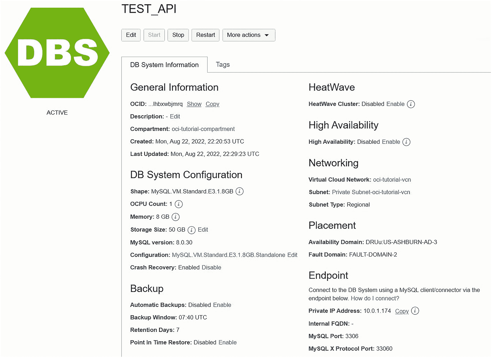

图 9-2 新建数据库系统详情页面（API 示例）

但是等等，还有更多内容。我们为你准备了一个额外的例子，供你自行尝试。

#### 删除数据库系统

你的挑战是，以上述控制数据库系统脚本为基础，添加 `delete` 操作。首先，你需要使用 `oci.mysql.DbSystemClient` 类的 `delete_db_system()` 方法。你可以在 [`https://docs.oracle.com/en-us/iaas/tools/python/2.79.0/api/mysql/client/oci.mysql.DbSystemClient.xhtml#oci.mysql.DbSystemClient.delete_db_system`](https://docs.oracle.com/en-us/iaas/tools/python/2.79.0/api/mysql/client/oci.mysql.DbSystemClient.xhtml%2523oci.mysql.DbSystemClient.delete_db_system) 找到该方法的文档和一个 Python 脚本示例。要完成此任务，你应该无需在控制数据库系统脚本 (`control_db_system.py`) 上添加太多内容，但这对于刚开始使用 Python 和 API 的人来说将是一个很好的练习。

好了，这就是我们对 API 的简要介绍！尽管对 MDS API 和 Python SDK 的介绍比较简短，但它应该让你了解了其可能性，并为你开始研究自己的 Python 应用程序来处理 MDS 资源提供了基础。


## 摘要

当需要管理数十、数百甚至上千个 `DB System` 时，通过基于 Web 的`OCI`控制台执行维护操作或进行日常使用，可能会变得繁琐且速度不如预期。这正是 `CLI` 和 `API` 的优势所在；它们允许你通过 `Bash`（或类似）脚本或 `Python` 代码文件来编写常见操作的自动化程序。

无论采用哪种方式，在使用众多 `OCI` 产品和服务时，尤其是在 `OCI` 操作变得常规化时，你都能获得更强的控制力和更高的生产力。在这些情况下，生产力的任何提升都会带来显著回报。如果这些优势吸引你，我建议你首先阅读你想自动化（编写脚本）领域的在线文档，以便熟悉其使用的机制。一旦掌握了基础知识，你就可以进一步探索更复杂的操作。

在下一章中，我们将学习一些将现有本地 `MySQL` 安装迁移到 `MDS` 的策略和规划。

## 10. 迁移至 MDS

本书涵盖了大量的内容，包括对 `MySQL Database Service` (`MDS`) 的简要概述，例如如何设置 `DB System`、执行备份与恢复、向/从 `MDS` 迁移数据、如何设置和使用高可用特性，以及我们快速了解了 `OCI` 命令行接口 (`CLI`) 和应用程序编程接口 (`API`)。我们演示了大部分这些技术，以便你能开始在环境中使用 `MDS`。

然而，本书仅是对 `MDS` 的入门介绍，其丰富内涵远非一本入门书籍所能囊括。例如，我们尚未讨论任何关于规划和迁移现有 `MySQL` 安装到 `MDS` 的策略，也没有深入探讨一些更深层次的主题，例如如何获取有关 `MDS` 特性的更多细节，或是在出现问题时的故障排除技巧。

在本章中，我们将讨论这些主题，以便你做好准备，开始使用 `MDS` 对象来规划和设计你的 `MySQL` 基础架构。正如你将看到的，许多用于规划本地 `MySQL` 安装的任务同样适用于 `MDS`。

当思考和规划迁移至 `MDS` 时，你首先应该考虑的事情之一是如何获取帮助，以及在使用 `OCI` 和 `MDS` 时发生问题该如何处理。让我们首先看看这个主题。

## 在使用 OCI 和 MDS 时获取帮助

当你开始接触新技术或新软件时，总会有一个学习曲线。`MDS` 同样如此，这也是你阅读本书的原因——为了快速掌握 `MDS` 的学习，以便能立即开始使用它。

然而，在有些情况下，你需要了解关于 `OCI` 和 `MDS` 的更多信息。确实，本书既没有，也不应被视为文档的替代品，不仅因为本书没有涵盖每一个细节，还因为 `Oracle` 每周都在改进其所有 `OCI` 功能特性。因此，如果你想随时了解所有特性的最新变化，你需要不时地查阅文档。

有时，在 `OCI` 中会发生一些状况，你需要了解这些情况。幸运的是，`Oracle` 非常善于让其客户保持知情。最后，当出现问题时，你可能还需要一些故障排除的帮助。我们将在本节涵盖所有这些主题。

### 与 Oracle 的沟通

当你使用 `OCI` 时，你实际上是在使用一个庞大的分布式系统，它有太多在幕后运行的组件，以至于大多数客户都完全意识不到它们的存在——而这正是使用云计算的意义所在，不是吗？你无需担心细节，而是依赖 `Oracle` 为你提供服务，供你在自己的产品和服务中使用。

然而，尽管 `Oracle` 拥有一支才华横溢且勤奋工作的工程师团队，但有时仍会出现问题。可能会发生互联网中断、硬件故障或其他一些局部事件，导致一项或多项服务出现暂时中断。幸运的是，这些事件通常很短暂，而且往往只影响到 `OCI` 的一小部分。

如果 `Oracle` 检测到可能影响其客户的情况发生，它会向客户发送电子邮件，提醒潜在问题。请注意，我提到的是“潜在”，因为 `Oracle` 在响应方面非常积极主动，通常会广播可能影响客户的通知。对于那些过去使用过其他云服务（它们可能突然停止工作且没有任何解释）的用户来说，这应该会让人感到安心。

如果 `Oracle` 检测到可能影响你或你的某些 `OCI` 对象的情况，你将收到一封描述问题并列出你可能需要采取的任何潜在行动的电子邮件。图 10-1 显示了一封我收到的电子邮件的摘录，当时 `Oracle` 检测到我所在区域的 `ObjectStore` 服务存在延迟问题。幸运的是，这类邮件并不频繁，但绝不能在未考虑所识别问题影响的情况下就置之不理。

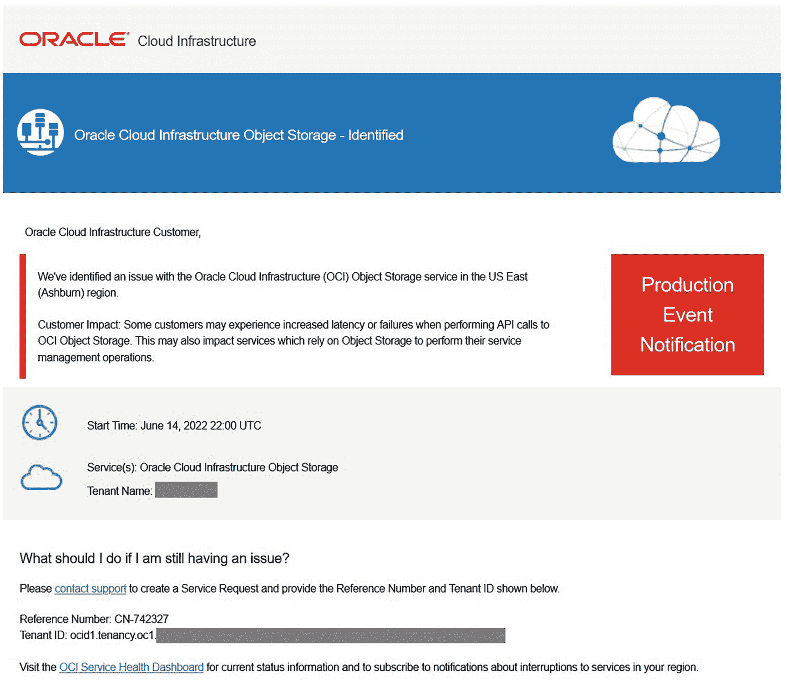

一封关于生产事件通知的 `Oracle` 基础设施电子邮件警报。如问题仍出现，提供了联系支持的信息。

图 10-1
OCI 潜在问题警报邮件

请注意，这封邮件清楚地描述了问题以及我可能遇到的潜在问题。在这个案例中，是更高的延迟问题。邮件还包括了获取更多信息以及联系 `Oracle` 支持以获取额外帮助的链接。

这也说明了任何想要使用 `MDS` 的人都需要更熟悉 `OCI` 技术和服务的必要性。在这个案例中，这是我当时未使用的一项服务，但正如邮件所述，它可能影响任何建立在 `ObjectStore` 之上的其他服务。这是一个极好的例子，也是一个了解 `OCI` 更多知识的好机会，即使你并不认识邮件中提到的服务。我们将在下一节讨论如何了解更多关于其他 `OCI` 服务和产品的信息。

当问题解决后，`Oracle` 也会向其客户发送邮件。图 10-2 显示了来自 `Oracle` 的一封“警报解除”邮件示例。`Oracle` 再次提供了链接，供你了解更多关于该问题的信息，以及在你需要更多帮助时联系支持的链接。

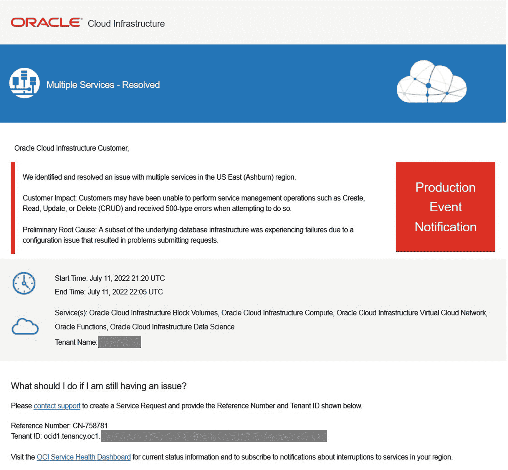

一封关于在 `美国东部` 区域解决的多项服务的 `Oracle` 云基础设施邮件。下方提供了如果问题持续存在的联系信息。

图 10-2
OCI 问题已解决邮件

`Oracle` 还会定期发送有关你的使用情况和账单信息的邮件。例如，在 `Oracle` 从你的账户扣款之前，你会收到一封电子邮件，提供截至当时的费用摘要。该邮件包含你的账户（公司）名称、账号、发票（交易）日期和编号、账单金额以及一个参考编号。


与事件邮件类似，如果您需要帮助，也会看到指向 Oracle 计费部门的链接，以及您可以联系的人员的电子邮件地址和电话号码。您也可以通过 `OCI 控制台` 查看账单详情：点击右上角的账户图标，然后在“使用情况”标题下点击 `分析成本`。这将弹出一个对话框，您可以通过它按日查看产生的成本以及按服务细分的费用。图 10-3 展示了我其中一个实验账户（活动较少）的示例。

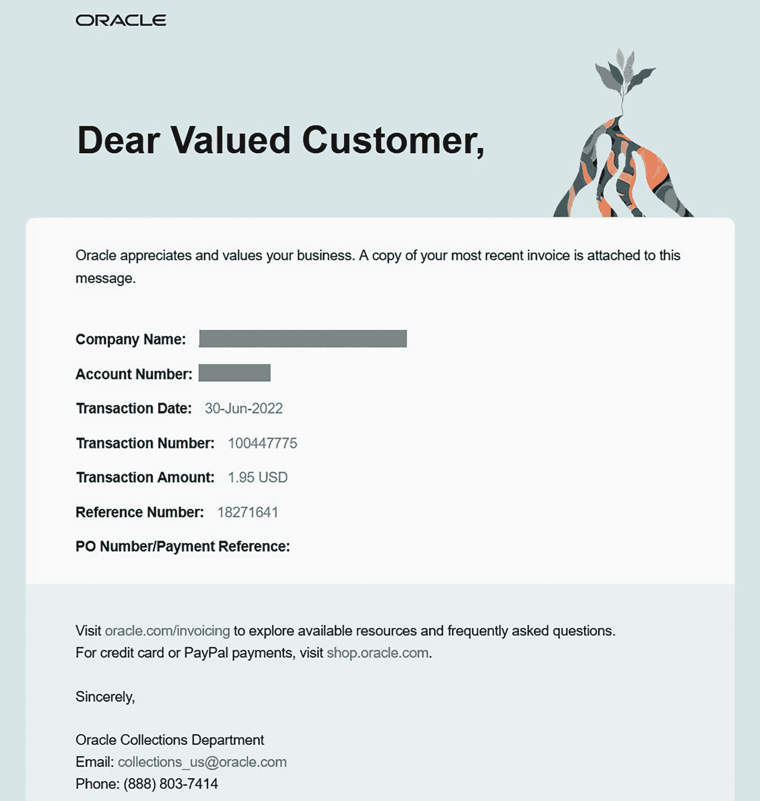

一封由 Oracle 发送的关于账单的电子邮件。列出了客户名称、账户、交易日期、交易编号、交易金额、参考号和支付参考。

图 10-3：OCI 账单邮件示例

图 10-4 展示了同一实验账户的详细账单示例。

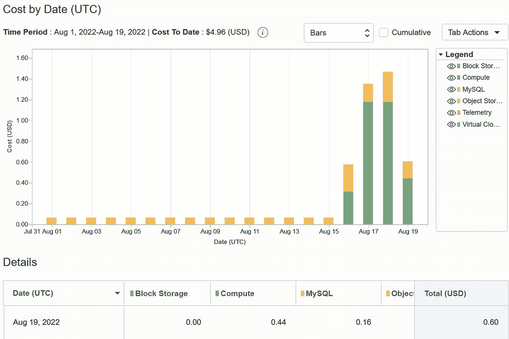

一个条形图描绘了从 7 月 31 日到 8 月 19 日期间的成本与日期的关系。图例在右侧。下方是一个表格，列名为日期、块存储、计算、MySQL、对象和总计。

图 10-4：账单使用情况（`OCI 控制台`）

请注意，您可以操作图表以显示更多细节或不同的视图。`选项卡` 下拉控件允许您将报告下载为 `PDF`、逗号分隔值（`CSV`）文件，或者仅将图表下载为图像。这些都是您的财务人员会欣赏的贴心功能。

现在，让我们来探索 `OCI` 和 `MDS` 的文档选项。

## 文档

Oracle 为所有 `OCI` 和 `MDS` 提供了文档，您只需轻点鼠标即可访问。在 `OCI 控制台` 中，您会注意到一个带问号的图标。这是满足您所有文档需求的起点。在任何时候，您都可以点击该图标，会看到一个包含内容相关链接的菜单出现。例如，如果您正在处理一个计算实例，您会看到计算实例文档的链接。

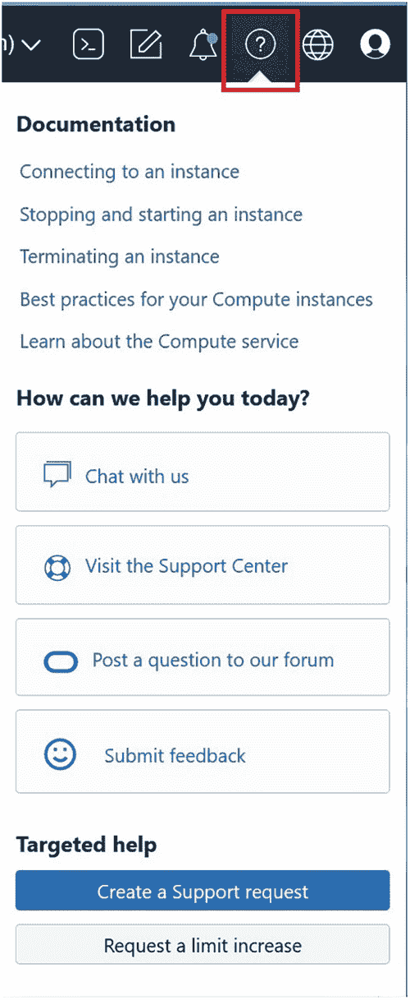

一个菜单，包含文档、今日如何提供帮助？、聊天、访问支持中心、发布问题和提交反馈以及定向帮助。

图 10-5：文档菜单（`OCI 控制台`）

请注意，您会看到指向与计算实例相关的特定任务的链接，这在您想了解某些功能如何工作时非常有帮助。另请注意，您还会看到指向支持的链接。您可以打开聊天窗口立即与某人交谈，前往支持中心研究主题，在社区论坛发布问题，或者向支持团队提交反馈。

底部还有一些按钮，包含特定的定向任务。在此示例中，我们看到了用于创建支持请求（正式支持工单）和提高服务限制的按钮。回想一下，服务限制指的是您的账户一次允许使用的特定对象或服务的数量。如果您超出了限制，可以访问此菜单并提交延长请求。

如果您想要通用的 `OCI` 文档信息，可以访问 [`https://docs.oracle.com/en-us/iaas/Content/home.htm`](https://docs.oracle.com/en-us/iaas/Content/home.htm) 主文档以获取关于 `OCI` 的完整文档。在这里，您将看到一个多列菜单，可用于查找所有 `OCI` 产品和服务文档。当您点击 `MySQL 数据库` 链接时，您将被定向到 `MySQL`（`MDS`）文档的顶部，如图 10-6 所示。从那里，您可以探索 `MDS` 的所有主题。

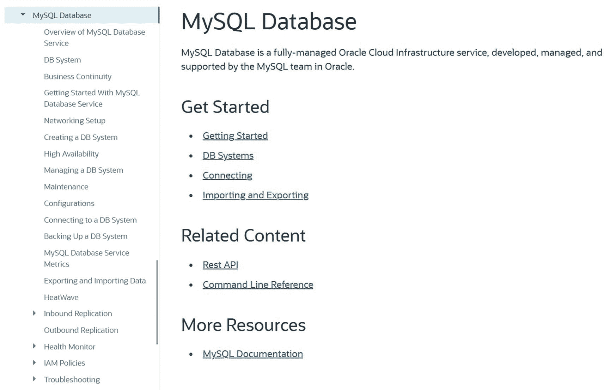

MySQL 数据库的截图，左侧显示了 MDS 的所有主题。右侧显示了主页，包含入门指南、相关内容等资源。

图 10-6：`MDS` 文档主页

请注意右下角是指向 `MySQL` 文档（用于服务器、`MySQL Shell` 等）的链接。

> **提示**
>
> 您可能想将 `MDS` 文档页面加入书签以备将来参考。

还有一项文档可能对客户变得至关重要；那就是公告页面。在 `OCI 控制台` 上，您会看到一个铃铛图标。点击后，您将看到公告页面，您可以在其中监控您可能使用或感兴趣的产品和服务的重要公告，以及关于您账户的关键信息。图 10-7 展示了主公告页面。

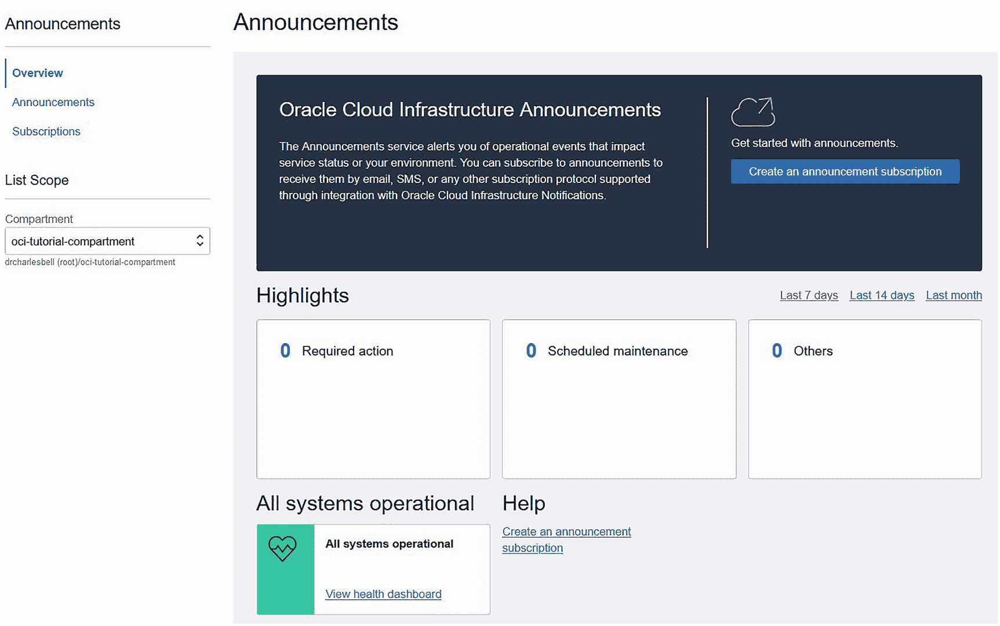

一个窗口显示 Oracle 的公告页面。公告显示在顶部，重点信息位于中心，所有系统正常运行和帮助信息在底部。

图 10-7：公告页面（概览）

请注意，您会看到来自 Oracle 的公告，以及关于任何需要采取的操作、计划维护通知或其他通知的重点信息。当这些类别中有条目时，`OCI 控制台` 上的小铃铛图标旁会出现一个红点，以提醒您有公告。

请注意右侧的`创建公告订阅`按钮。这允许您创建订阅以监视某些公告。例如，如果您计划对 `ObjectStore` 存储桶执行关键操作，您可能希望创建一个订阅来监视 `ObjectStore` 事件。您可以通过点击左侧“公告”菜单中的`订阅`链接，在订阅页面上查看您的订阅。

您还可以通过点击左侧“公告”菜单下的`公告`链接，接收可能影响您账户的任何未解决事件的详细信息。这将打开一个与您账户相关的事件视图，包括用于设置日期范围以探索过去事件的工具。图 10-8 展示了此页面的示例，显示了一个已解决的事件。请注意，有一个指向该事件的链接，点击后将打开详细信息供您查阅（如果您需要更多信息）。

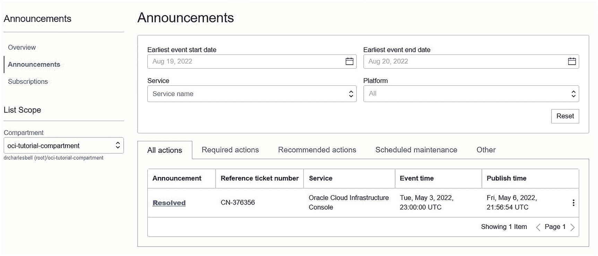

一个列出公告详细信息的窗口，顶部显示事件开始日期、事件结束日期、服务和平台。底部显示已解决的公告。

图 10-8：公告详情

既然我们知道了文档的位置以及 Oracle 用于沟通的形式，让我们来探讨一个您可能在某个时候需要的主题：故障排除。


### 故障排除

Oracle 为所有 OCI 产品和服务提供了全面的故障排除技巧列表。随着产品和服务的不断发展以及帮助客户解决问题的更多创新方法被发现，该列表会频繁更新。就我们的目的而言，MDS 有一个专门的故障排除页面，位于[`https://docs.oracle.com/en-us/iaas/mysql-database/doc/troubleshooting.xhtml`](https://docs.oracle.com/en-us/iaas/mysql-database/doc/troubleshooting.xhtml)。图 10-9 展示了 MDS 故障排除页面。

> **提示**
>
> 您可能需要将 MDS 故障排除页面加入书签，以备将来参考。

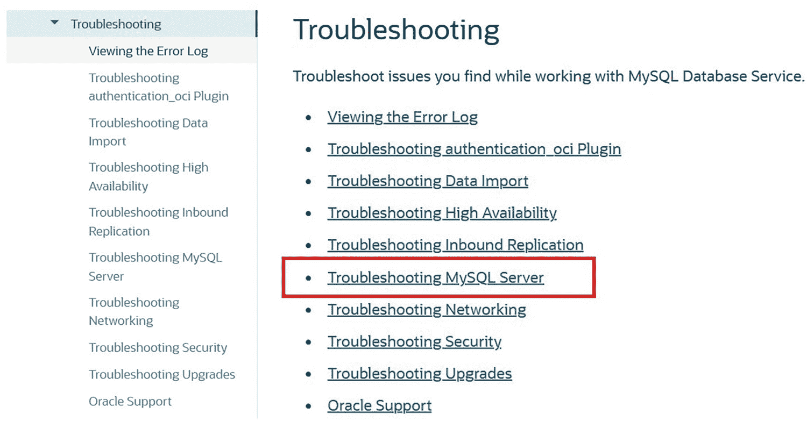
*图 10-9: MDS 故障排除页面（文档）*

您会找到指向通用故障排除技巧的链接。不过，请注意页面中央有一个指向 MySQL 服务器故障排除页面的链接，如果您遇到与 OCI 无关的 MySQL 问题，这可能会有所帮助。

现在我们已经全面了解了 Oracle 提供的在线帮助和文档，接下来让我们讨论如何开始规划迁移到 MDS。

## 检查您的数据库系统需求

在本节中，我们将讨论在规划 MDS 解决方案之前必须考虑的 OCI 特定概念和技术。虽然您无需关心 MySQL 服务器实例本身的配置（因为 MDS 会为您完成），但您必须像规划本地 MySQL 服务器那样严谨地规划您的数据库。这项规划将为您提供配置数据库系统所需的重要信息。

回顾一下，我们在第 4 章创建第一个数据库系统时简要讨论过规划数据库需求，但还有更多需要考虑的因素。例如，每个数据库系统都有一个形态（CPU 和内存的大小）以及一个数据大小（数据存储的大小）。此外，还必须考虑网络，以便使您的数据库系统可被访问。以下各节将讨论这些主题。

### 形态

您应仔细考虑需要使用何种形态。较小的形态通常成本更低，但如果使用的形态 CPU 核心数少于您的需求，可能会导致相当大的问题。同样，您也应仔细考虑需要使用多少内存。务必咨询您的系统管理规划人员，以确保选择的形态具备足够的 CPU 核心和内存。图 10-10 展示了作者实验账户可用的数据库系统形态的部分列表。请注意，有 1 核、2 核、4 核、8 核、16 核等不同 CPU 核心数的形态，内存也相应增加。

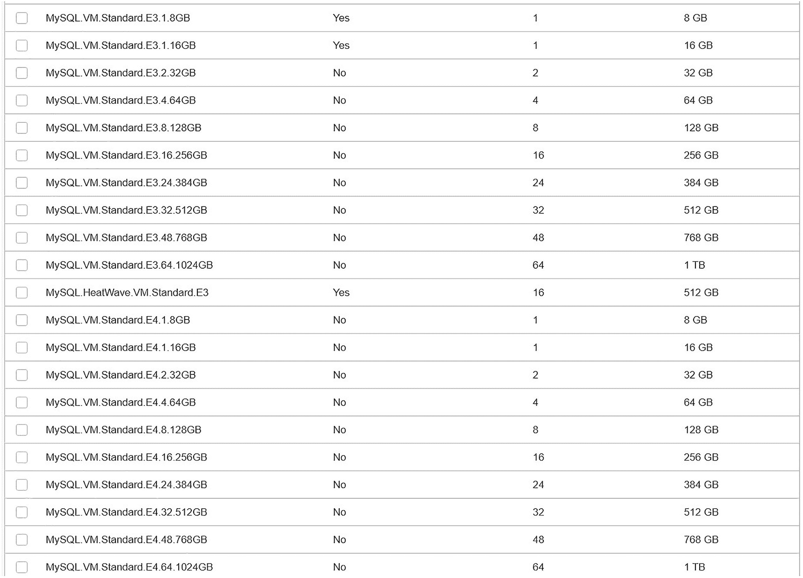
*图 10-10: 数据库系统的可用形态*

列出的形态都是虚拟机，但您还可以选择更多其他形态，包括支持 HeatWave 和裸机实例的形态。再次强调，一般而言，形态支持的核心数和内存越多，成本越高，但您从“更大”形态中获得的性能提升可以抵消这部分成本。如果性能是关注点，始终应选择比您认为的最低可接受规格更大的形态。

有关形态的更多信息，请参阅以下链接中的标题 `Supported Shapes`（支持的形态）：[`https://docs.oracle.com/en-us/iaas/mysql-database/doc/db-system.xhtml`](https://docs.oracle.com/en-us/iaas/mysql-database/doc/db-system.xhtml)

### 数据存储

同样，数据库存储大小需要仔细考虑。与形态类似，较小的数据存储大小成本较低，但较大的大小会采用 RAID 条带化以实现更好的性能。您可以选择从 50 GB 起的任意大小。务必考虑您是否计划进行任何涉及上传或扩展数据的数据迁移，以便确保有足够的空间容纳导入的数据。您可以在日后增加数据存储的大小，但最好在一开始就规划更大的空间。

有关数据存储选项和注意事项的更多信息，请参阅以下链接中的 `DB System Storage`（数据库系统存储）部分：[`https://docs.oracle.com/en-us/iaas/mysql-database/doc/db-system.xhtml`](https://docs.oracle.com/en-us/iaas/mysql-database/doc/db-system.xhtml)

> **提示**
>
> 建议在测试期间执行基准分析，以验证您的环境配置是否足以满足应用程序的性能需求。

### 网络

回顾一下，数据库系统无法从互联网直接访问。您需要设置额外的资源来弥补网络差距，例如 Bastion 服务、虚拟专用网络、Oracle FastConnect 或中间计算实例。在规划如何将数据库系统整合到您的应用程序中时，应仔细考虑这些技术。

关于网络，还有一些限制需要考虑。以下列出了您在规划网络连接时需要考虑的部分细节：

-   每个子网中有三个 IP 地址被保留给网络服务。
-   不具备高可用性的数据库系统需要三个 IP 地址：(1) 数据库系统的 IP 地址，(2) 计算实例，以及 (3) 用于 MySQL 服务器维护和升级任务的独立 IP 地址。
-   具备高可用性的数据库系统将需要最多七个 IP 地址：一个用于数据库系统的 IP 地址，三个用于托管 MySQL 的计算实例，以及每个 MySQL 服务器各一个用于维护和升级任务的 IP 地址。

有关规划网络要求的更多注意事项，请参阅 [`https://docs.oracle.com/iaas/Content/Network/Concepts/overview.htm`](https://docs.oracle.com/iaas/Content/Network/Concepts/overview.htm)。

## 规划你的数据库系统

系统管理与规划密不可分。想要成功，更是如此。在规划云解决方案时，这一点尤为突出。我们必须提前规划好如何设置、配置和部署我们的产品与服务，否则将面临意外问题和延误的风险。MDS 也不例外，你最好提前规划好希望在其环境中如何使用它。

本节中的信息将为你提供针对 MDS DB 系统的具体规划领域的见解。你应将本节视为额外资源，与你现有的用于规划 DB 系统的策略、实践和工具结合使用。以下列出了一些需要刻意规划的关

*   为 DB 系统的管理和应用程序访问创建独立的用户账户
*   配置数据规模，并以此为依据规划 DB 系统的规模
*   考虑计算实例（用于 DB 系统）的规模（CPU、内存）
*   制定升级到高可用性的计划
*   研究所有 OCI 服务的相关成本，并创建支出预测以设定预期
*   仔细规划安全性，确保保护你的云资源

其中大部分是我们在本书过程中已经讨论过的内容，但有些可能对你来说是新的，尤其是如果你没有使用过本地部署的 MySQL。

然而，最关键的是规划 DB 系统的规模和成本。你应该在这些任务上花费一些时间，因为更改 DB 系统的规模（形状）可能并非易事，并且可能需要一些停机时间来进行重新配置。幸运的是，Oracle 提供了执行此操作的选项，你可以通过备份并在具有不同形状和存储大小的新 DB 系统上进行恢复来实现。提前花时间进行规划，特别是预测你的 OCI 成本，将帮助你在最好地满足需求的同时控制支出。你会惊讶于有多少功能可以以较低的成本获得，但如果你没有为增长制定一个可靠的计划，这种经济性可能会累积成可观的开支。

另一个需要考虑的关键领域是安全性。我们将在下一节讨论安全性。

## 安全最佳实践

回顾前面的章节，你必须在 OCI 中创建账户来划分管理功能和使用功能。还要记住，建议为你的 DB 系统创建独立的用户账户，用于用户访问或应用程序访问。因此，有一份详尽的安全考虑事项清单。由于安全性对任何解决方案都至关重要，让我们讨论一下你应该考虑或计划为你的 OCI 解决方案实施的几个安全领域。以下按类别列出了你在规划时应研究的项目并进行了简要描述。提供了链接以获取更多文档：

*   `审计服务`：利用审计服务查看 OCI API 活动。请参阅 [`https//docs.oracle.com/iaas/Content/Audit/Concepts/auditoverview.xhtml`](http://docs.oracle.com/iaas/Content/Audit/Concepts/auditoverview.xhtml)。
*   `数据脱敏`：你可以使用数据脱敏来保护数据，隐藏敏感信息。请参阅 *数据脱敏* 部分 [`https//docs.oracle.com/en-us/iaas/mysql-database/doc/db-system.xhtml`](http://docs.oracle.com/en-us/iaas/mysql-database/doc/db-system.xhtml)。
*   `删除计划`：考虑使用删除计划来进一步保护你的 DB 系统免受删除操作的影响。请参阅 *高级选项：删除计划* [`https//docs.oracle.com/en-us/iaas/mysql-database/doc/creating-db-system.xhtml`](http://docs.oracle.com/en-us/iaas/mysql-database/doc/creating-db-system.xhtml)。
*   `IAM 策略`：使用身份和访问管理策略来控制访问。请参阅 *必需的 IAM 策略* [`https//docs.oracle.com/en-us/iaas/mysql-database/doc/mysql-database-service-overview.xhtml`](http://docs.oracle.com/en-us/iaas/mysql-database/doc/mysql-database-service-overview.xhtml)。
*   `传输中加密`：虽然数据在静态时已加密，但你可能希望使用传输中加密来进一步保护数据。请参阅 *数据安全* 部分 [`https//docs.oracle.com/en-us/iaas/mysql-database/doc/mysql-database-service-overview.xhtml`](http://docs.oracle.com/en-us/iaas/mysql-database/doc/mysql-database-service-overview.xhtml)。
*   `MySQL 身份验证`：使用 `authentication_oci` 插件将 MySQL 用户映射到 IAM 服务中定义的现有用户和组。请参阅 *使用 authentication_oci 插件连接到 DB 系统* [`https//docs.oracle.com/en-us/iaas/mysql-database/doc/connecting-db-system.xhtml`](http://docs.oracle.com/en-us/iaas/mysql-database/doc/connecting-db-system.xhtml)。
*   `MySQL 连接控制`：MySQL 数据库服务支持连接控制插件，以提供一种威慑手段，减缓针对 MySQL 用户账户的暴力攻击。请参阅 *插件和组件* [`https//docs.oracle.com/en-us/iaas/mysql-database/doc/db-system.xhtml`](http://docs.oracle.com/en-us/iaas/mysql-database/doc/db-system.xhtml)。
*   `MySQL 密码验证`：使用 `validate_password` 组件通过设置复杂性和强制性更改频率的规则来强制执行密码生成。请参阅 *插件和组件* [`https//docs.oracle.com/en-us/iaas/mysql-database/doc/db-system.xhtml`](http://docs.oracle.com/en-us/iaas/mysql-database/doc/db-system.xhtml)。
*   `MySQL 安全性`：规划 MySQL 安全功能以控制对数据的访问。请参阅 [`https//dev.mysql.com/doc/refman/8.0/en/access-control.xhtml`](http://dev.mysql.com/doc/refman/8.0/en/access-control.xhtml)。
*   `网络负载均衡器`：考虑将通过互联网的访问限制在特定 IP 地址或 IP 地址范围内，并使用传输中加密。同时，考虑使用网络负载均衡器。请参阅 *使用网络负载均衡器连接到 DB 系统* [`https//docs.oracle.com/en-us/iaas/mysql-database/doc/connecting-db-system.xhtml`](http://docs.oracle.com/en-us/iaas/mysql-database/doc/connecting-db-system.xhtml)。
*   `VCN 安全组`：使用虚拟云网络安全组或 VCN 的安全列表，将授权的公共 IP 地址限制为单个 IP 地址或 IP 地址范围。请参阅 *使用...添加入站规则* [`https//docs.oracle.com/en-us/iaas/mysql-database/doc/networking-setup-mysql-db-systems.xhtml`](http://docs.oracle.com/en-us/iaas/mysql-database/doc/networking-setup-mysql-db-systems.xhtml)。
*   `VCN 连接限制`：你可以将 DB 系统配置为使用 VCN 的私有子网，将连接限制为仅限 VPN 连接，或使用堡垒机会话。请参阅 *堡垒机会话* [`https//docs.oracle.com/en-us/iaas/mysql-database/doc/networking-setup-mysql-db-systems.xhtml`](http://docs.oracle.com/en-us/iaas/mysql-database/doc/networking-setup-mysql-db-systems.xhtml) 或 *VPN 连接* [`https//docs.oracle.com/en-us/iaas/mysql-database/doc/networking-setup-mysql-db-systems.xhtml`](http://docs.oracle.com/en-us/iaas/mysql-database/doc/networking-setup-mysql-db-systems.xhtml)。

虽然该列表包含了简略描述，但你应该考虑研究每一个链接，以获取有关规划和实现安全 MDS 安装的更详细信息。


## 总结

规划一次 MDS 安装的任务并非极其复杂，但确实需要一些前瞻性的思考和周密的计划。与任何技术一样，我们应该从小处着手，先进行一个简单的实验性安装，以尽可能多地测试该技术的各个方面。这不仅包括部署数据库系统的机制，还包括配置访问和保护数据的网络与安全的具体细节。这也给你提供了一个机会，去确保并学习如何将你的应用程序连接到你的数据库系统。

在本章中，我们了解了规划数据库系统时的一些重要考量，包括如何使用 OCI 文档获取帮助、去哪里寻求额外帮助，以及关于计算形态、磁盘存储、网络和安全的配置考量。

对于 MySQL 用户来说，这是一个激动人心的时刻。Oracle 继续履行其承诺，不仅持续开发 MySQL，还投入资源在云端改进和扩展其功能集，这是一项**颠覆性的技术**，它消除了自行构建复杂（且昂贵）的本地 MySQL 安装的负担（和开销）。对于那些希望利用云服务来降低成本并提升能力的人而言，OCI 和 MDS 应该是你的**得力工具**。

虽然它已经是一项能力出众且可靠的服务，足以满足你的数据库需求，但请密切关注 Oracle 云基础设施，以获取更多卓越功能、新的 MySQL 服务，以及对 MySQL 数据库服务的进一步优化和更新。


