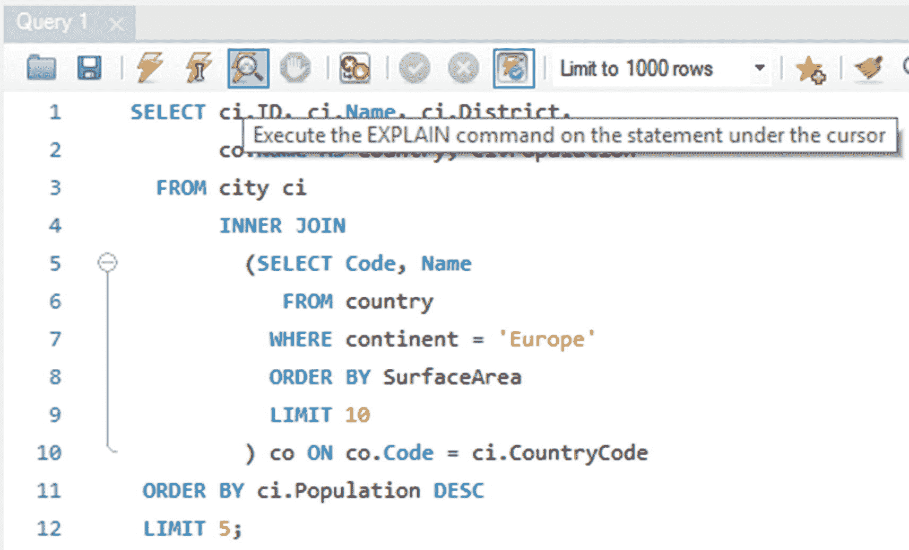
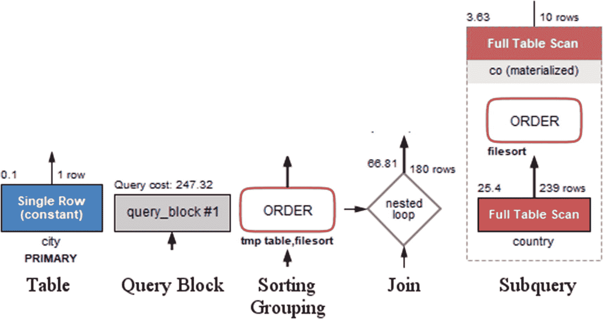
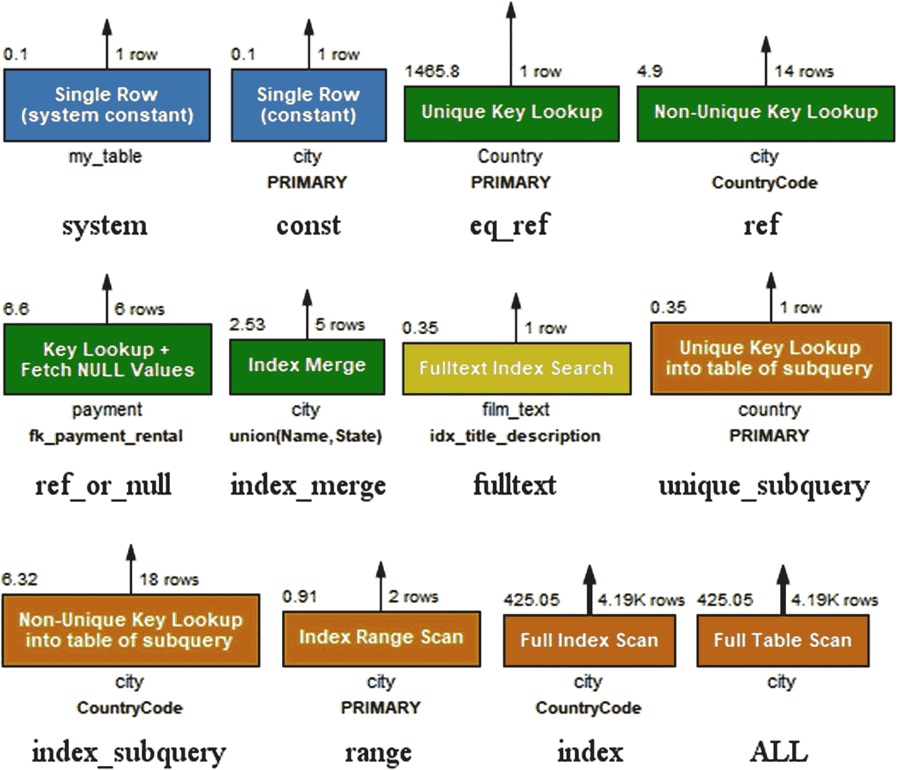
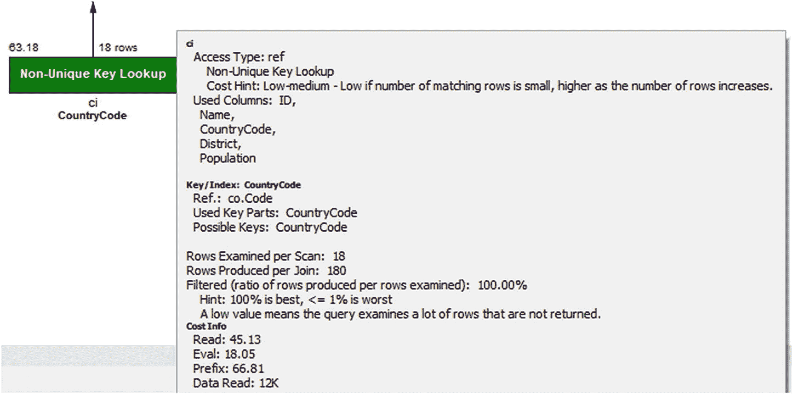
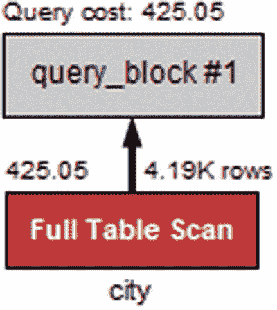
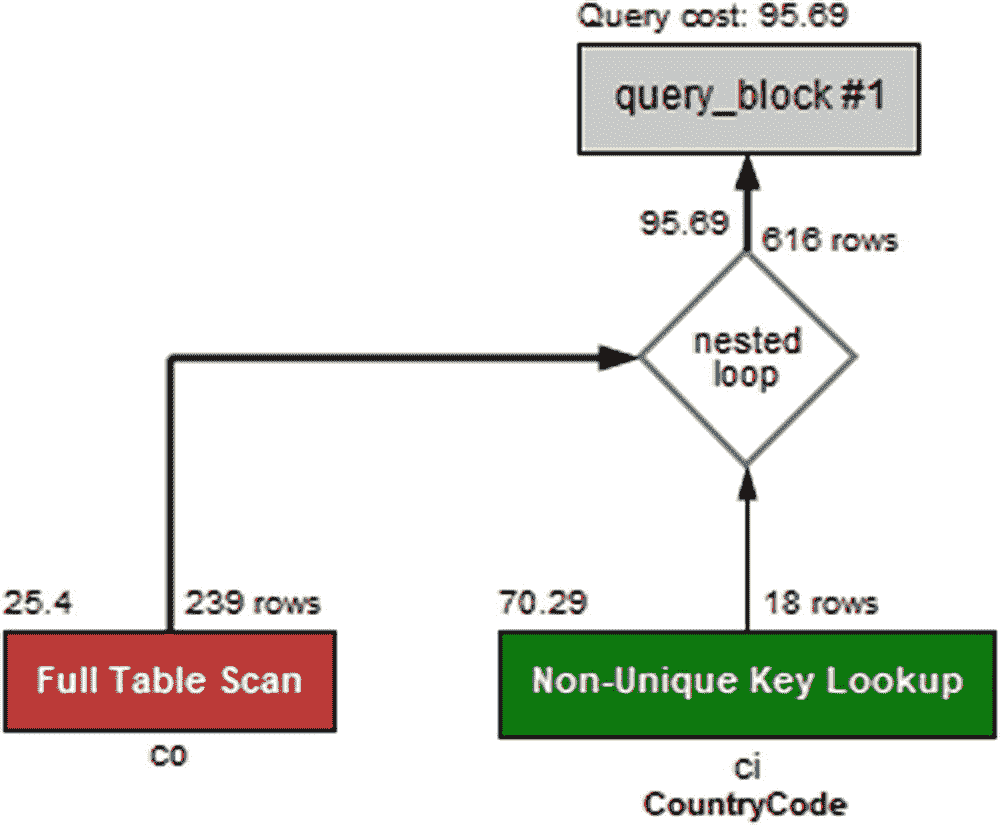
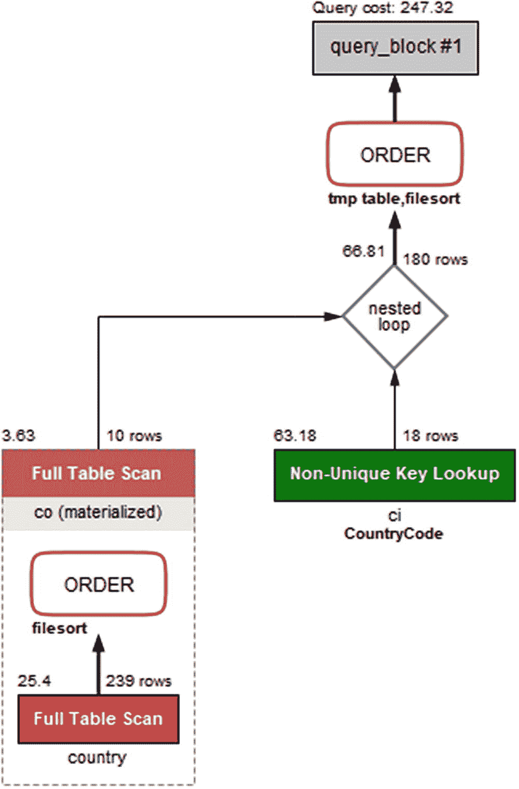
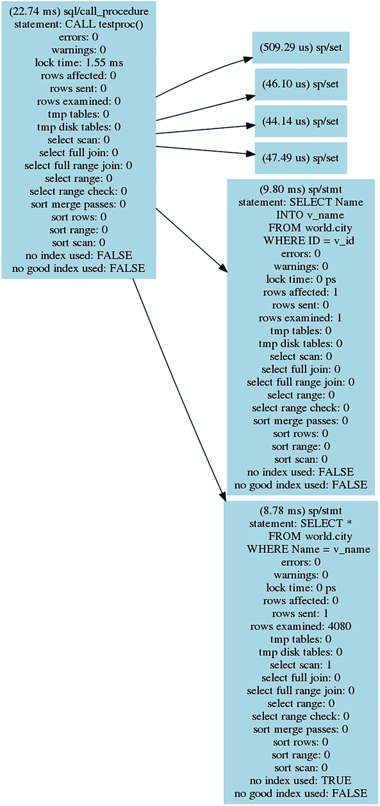

# 二十、分析查询

在上一章中，你学习了如何找到优化的候选查询。现在是采取下一步措施的时候了——分析查询以确定它们为什么没有按预期执行。分析过程中的主要工具是`EXPLAIN`语句，它显示了优化器将使用的查询计划。与之相关的是优化器跟踪，它可以用来调查优化器为什么最终得到查询计划。另一种可能性是使用性能模式中的语句和阶段信息来查看存储过程或查询花费时间最多的地方。本章将讨论这三个主题。

对`EXPLAIN`语句的讨论是本章最大的部分，分为四个部分:

*   **解释用法:**`EXPLAIN`语句的基本用法。

*   **解释格式:**可以查看查询计划的每种格式的详细信息。这包括用 MySQL Workbench 使用的`EXPLAIN`语句和*可视化解释*显式选择的两种格式。

*   **解释输出:**对查询计划中可用信息的讨论。

*   **解释示例:**使用`EXPLAIN`语句讨论返回数据的一些示例。

## 解释用法

`EXPLAIN`语句返回 MySQL 优化器将用于给定查询的查询计划的概述。它同时非常简单，也是查询调优中较为复杂的工具之一。这很简单，因为您只需在想要研究的查询之前添加`EXPLAIN`命令，这也很复杂，因为理解这些信息需要对 MySQL 及其优化器的工作原理有所了解。您可以对您明确指定的查询和另一个连接当前正在执行的查询使用`EXPLAIN`。本节介绍`EXPLAIN`语句的基本用法。

### 显式查询的用法

通过在查询前面添加`EXPLAIN`来为查询生成查询计划，可以选择添加`FORMAT`选项来指定是希望结果以传统的表格格式、使用 JSON 格式还是以树样式的格式返回。支持`SELECT`、`DELETE`、`INSERT`、`REPLACE`和`UPDATE`语句。查询没有被执行(但是参见下一小节关于`EXPLAIN ANALYZE`的异常)，所以获取查询计划是安全的。

如果您需要分析诸如存储过程和存储函数之类的复合查询，您将需要首先将执行分割成单独的查询，然后对每个应该分析的查询使用`EXPLAIN`。确定存储程序中各个查询的一种方法是使用性能模式。本章后面将给出一个实现这一点的例子。

`EXPLAIN`最简单的用法就是用您想要分析的查询指定`EXPLAIN`:

```sql
mysql> EXPLAIN <query>;

```

在示例中，`<query>`是您想要分析的查询。使用不带`FORMAT`选项的`EXPLAIN`语句返回传统表格格式的结果。如果您想指定格式，您可以通过添加`FORMAT=TRADITIONAL|JSON|TREE`来完成:

```sql
mysql> EXPLAIN FORMAT=TRADITIONAL <query>

mysql> EXPLAIN FORMAT=JSON <query>

mysql> EXPLAIN FORMAT=TREE <query>

```

哪种格式是首选取决于您的需求。当您需要查询计划的概述、使用的索引以及有关查询计划的其他基本信息时，传统格式更容易使用。JSON 格式提供了更多的细节，对于应用来说更容易使用。例如，MySQL Workbench 中的 Visual Explain 使用 JSON 格式的输出。

树格式是最新的格式，在 MySQL 8.0.16 和更高版本中受支持。它需要使用 Volcano 迭代器执行器来执行查询，在编写本文时，并不是所有的查询都支持这个执行器。树格式的一个特殊用途是用于`EXPLAIN ANALYZE`语句。

### 解释分析

`EXPLAIN ANALYZE`语句 <sup>[1](#Fn1)</sup> 是 MySQL 8.0.18 中新增的，是使用树格式的标准`EXPLAIN`语句的扩展。关键的区别在于`EXPLAIN ANALYZE`实际上执行了查询，并且在执行的同时，收集了执行的统计数据。执行语句时，查询的输出被禁止，因此只返回查询计划和统计信息。像树输出格式一样，需要使用 Volcano 迭代器执行器。

Note

在撰写本文时，对 Volcano 迭代器执行器的要求将您可以使用的查询限制在了`SELECT`语句的子集上。预计支持的查询范围将随着时间的推移而增加。

`EXPLAIN ANALYZE`的用法与您已经看到的`EXPLAIN`语句非常相似:

```sql
mysql> EXPLAIN ANALYZE <query>

```

`EXPLAIN ANALYZE`的输出将在本章后面与树形输出一起讨论。

从本质上来说，`EXPLAIN ANALYZE`只适用于显式查询，因为需要从头到尾监控查询。另一方面，普通的`EXPLAIN`语句也可以用于正在进行的查询。

### 连接的用法

假设您正在调查一个性能很差的问题，并且您注意到有一个查询已经运行了几个小时。您知道这是不应该发生的，所以您想分析为什么查询如此缓慢。一种选择是复制查询并对其执行`EXPLAIN`。但是，这可能无法提供您需要的信息，因为索引统计信息可能在慢速查询启动后发生了更改，因此现在分析查询不会显示导致性能缓慢的实际查询计划。

更好的解决方案是请求用于慢速查询的实际查询计划。您可以使用`EXPLAIN`语句的`EXPLAIN FOR CONNECTION`变体来获得这个结果。如果您想尝试一下，您需要一个长时间运行的查询，例如:

```sql
SELECT * FROM world.city WHERE id = 130 + SLEEP(0.1);

```

这大约需要 420 秒(在`world.city`表中每行 0.1 秒)。

您将需要您想要调查的查询的连接 id，并将其作为参数传递给`EXPLAIN`。您可以从进程列表信息中获取连接 id。例如，如果您使用`sys.session`视图，连接 id 可以在`conn_id`列中找到:

```sql
mysql> SELECT conn_id, current_statement,
              statement_latency
         FROM sys.session
        WHERE command = 'Query'
        ORDER BY time
         DESC LIMIT 1\G
*************************** 1\. row ***************************
          conn_id: 8
current_statement: SELECT * FROM world.city WHERE id = 130 + SLEEP(0.1)
statement_latency: 4.22 m
1 row in set (0.0551 sec)

```

为了保持输出的简单，本例中只限于感兴趣的连接。查询的连接 id 是 8。您可以使用它来获取查询的执行计划，如下所示:

```sql
mysql> EXPLAIN FOR CONNECTION 8\G
*************************** 1\. row ***************************
           id: 1
  select_type: SIMPLE
        table: city
   partitions: NULL
         type: ALL
possible_keys: NULL
          key: NULL
      key_len: NULL
          ref: NULL
         rows: 4188
     filtered: 100
        Extra: Using where
1 row in set (0.0004 sec)

```

您可以选择添加所需的格式，方法与显式指定查询时相同。如果您使用的是不同于 MySQL Shell 的客户端，过滤后的列可能会显示`100.00`。在讨论输出的含义之前，有必要熟悉一下输出格式。

## 解释格式

当您需要检查查询计划时，可以在几种格式之间进行选择。选择哪一个，大部分取决于你的喜好。也就是说，JSON 格式确实比传统格式和树格式包含更多的信息。如果您喜欢查询计划的可视化表示，MySQL Workbench 中的 Visual Explain 是一个很好的选择。

本节将讨论每种格式，并显示以下查询的查询计划的输出:

```sql
SELECT ci.ID, ci.Name, ci.District,
       co.Name AS Country, ci.Population
  FROM world.city ci
       INNER JOIN
         (SELECT Code, Name
            FROM world.country
           WHERE Continent = 'Europe'
           ORDER BY SurfaceArea
           LIMIT 10
         ) co ON co.Code = ci.CountryCode
 ORDER BY ci.Population DESC
 LIMIT 5;

```

该查询查找欧洲按面积划分的十个最小国家中最大的五个城市，并按城市人口降序排列。选择这个查询的原因是它显示了各种输出格式如何表示子查询、排序和限制。本节将不讨论由`EXPLAIN`语句返回的信息；这将推迟到“`EXPLAIN`示例”部分。

Note

`EXPLAIN`语句的输出取决于优化器开关的设置、索引统计信息以及`mysql.engine_cost`和`mysql.server_cost`表中的值，因此您可能看不到与示例中相同的内容。示例输出已经使用了默认值和一个新加载的`world` sample 数据库，并在加载完成后对表执行了`ANALYZE TABLE`，它们已经在 MySQL Shell 中创建，默认情况下会自动获取警告(但是警告仅在讨论时包含在输出中)。如果您没有使用 MySQL Shell，您将必须执行`SHOW WARNINGS`来检索警告。

查询计划输出非常详细。为了更容易地比较输出，本节中的示例已经与本书的 GitHub 存储库中的文件`explain_formats.txt`中的查询结果相结合。对于树输出格式(包括对于`EXPLAIN ANALYZE`)，在列名和查询计划之间增加了一个额外的新行，以使树层次结构显示得更清楚:

```sql
*************************** 1\. row ***************************
EXPLAIN:
-> Limit: 5 row(s)
    -> Sort: <temporary>.Population DESC, limit input to 5 row(s) per chunk

```

而不是:

```sql
*************************** 1\. row ***************************
EXPLAIN: -> Limit: 5 row(s)
    -> Sort: <temporary>.Population DESC, limit input to 5 row(s) per chunk

```

这一约定在整个章节中使用。

### 传统格式

当您在没有`FORMAT`参数或格式设置为`TRADITIONAL`的情况下执行`EXPLAIN`命令时，输出将作为一个表返回，就像您查询一个普通的表一样。当您需要查询计划的概述，并且是由数据库管理员或开发者来检查输出时，这很有用。

Tip

表的输出可能相当宽，特别是如果有许多分区、几个可能使用的索引或者几条额外的信息。当您调用`mysql`命令行客户端时，您可以通过使用`--vertical`选项请求获得垂直格式的输出，或者您可以使用`\G`终止查询。

输出中有 12 列。如果字段没有任何值，则使用`NULL`。每一列的含义将在下一节讨论。清单 [20-1](#PC10) 显示了示例查询的传统输出。

```sql
mysql> EXPLAIN FORMAT=TRADITIONAL
       SELECT ci.ID, ci.Name, ci.District,
              co.Name AS Country, ci.Population
         FROM world.city ci
              INNER JOIN
                (SELECT Code, Name
                   FROM world.country
                  WHERE Continent = 'Europe'
                  ORDER BY SurfaceArea
                  LIMIT 10
                ) co ON co.Code = ci.CountryCode
        ORDER BY ci.Population DESC
        LIMIT 5\G
*************************** 1\. row ***************************
           id: 1
  select_type: PRIMARY
        table: <derived2>
   partitions: NULL
         type: ALL
possible_keys: NULL
          key: NULL
      key_len: NULL
          ref: NULL
         rows: 10
     filtered: 100
        Extra: Using temporary; Using filesort
*************************** 2\. row ***************************
           id: 1
  select_type: PRIMARY
        table: ci
   partitions: NULL
         type: ref
possible_keys: CountryCode
          key: CountryCode
      key_len: 3
          ref: co.Code
         rows: 18
     filtered: 100
        Extra: NULL
*************************** 3\. row ***************************
           id: 2
  select_type: DERIVED
        table: country
   partitions: NULL
         type: ALL
possible_keys: NULL
          key: NULL
      key_len: NULL
          ref: NULL
         rows: 239
     filtered: 14.285715103149414
        Extra: Using where; Using filesort
3 rows in set, 1 warning (0.0089 sec)
Note (code 1003): /* select#1 */ select `world`.`ci`.`ID` AS `ID`,`world`.`ci`.`Name` AS `Name`,`world`.`ci`.`District` AS `District`,`co`.`Name` AS `Country`,`world`.`ci`.`Population` AS `Population` from `world`.`city` `ci` join (/* select#2 */ select `world`.`country`.`Code` AS `Code`,`world`.`country`.`Name` AS `Name` from `world`.`country` where (`world`.`country`.`Continent` = 'Europe') order by `world`.`country`.`SurfaceArea` limit 10) `co` where (`world`.`ci`.`CountryCode` = `co`.`Code`) order by `world`.`ci`.`Population` desc limit 5

Listing 20-1Example of the traditional EXPLAIN output

```

注意第一个表是如何被称为`<derived 2>`的。这是针对`country`表上的子查询，数字 2 指的是执行子查询的`id`列的值。`Extra`列包含诸如查询是否使用临时表和文件排序之类的信息。输出的最后是优化器重写后的查询。在许多情况下，更改并不多，但在某些情况下，优化器可能会对查询进行重大更改。在重写的查询中，注意如何使用一个注释，例如`/* select#1 */`，来显示哪个`id`值用于查询的这一部分。在重写的查询中可能有其他提示来告诉查询是如何执行的。重写后的查询由`SHOW WARNINGS`作为注释返回(默认情况下，由 MySQL Shell 隐式执行)。

输出可能看起来非常庞大，并且很难理解如何使用这些信息来分析查询。一旦讨论了其他输出格式、选择类型和连接类型的详细信息以及额外信息，就会有一些使用`EXPLAIN`信息的例子。

如果您想以编程方式分析查询计划，应该怎么做？您可以像处理普通的`SELECT`查询一样处理`EXPLAIN`输出——或者您可以请求包含一些附加信息的 JSON 格式的信息。

### JSON 格式

从 MySQL 5.6 开始，可以使用 JSON 格式请求`EXPLAIN`输出。与传统的表格格式相比，JSON 格式的一个优点是，JSON 格式增加的灵活性被用来以更符合逻辑的方式对信息进行分组。

JSON 输出的基本概念是一个*查询块*。查询块定义了查询的一部分，并且可以依次包括它自己的查询块。这允许 MySQL 将查询执行的细节指定给它们所属的查询块。从清单 [20-2](#PC11) 中显示的示例查询的输出中也可以看出这一点。

```sql
mysql> EXPLAIN FORMAT=JSON
       SELECT ci.ID, ci.Name, ci.District,
              co.Name AS Country, ci.Population
         FROM world.city ci
              INNER JOIN
                (SELECT Code, Name
                   FROM world.country
                  WHERE Continent = 'Europe'
                  ORDER BY SurfaceArea
                  LIMIT 10
                ) co ON co.Code = ci.CountryCode
        ORDER BY ci.Population DESC
        LIMIT 5\G
*************************** 1\. row ***************************
EXPLAIN: {
  "query_block": {
    "select_id": 1,
    "cost_info": {
      "query_cost": "247.32"
    },
    "ordering_operation": {
      "using_temporary_table": true,
      "using_filesort": true,
      "cost_info": {
        "sort_cost": "180.52"
      },
      "nested_loop": [
        {
          "table": {
            "table_name": "co",
            "access_type": "ALL",
            "rows_examined_per_scan": 10,
            "rows_produced_per_join": 10,
            "filtered": "100.00",
            "cost_info": {
              "read_cost": "2.63",
              "eval_cost": "1.00",
              "prefix_cost": "3.63",
              "data_read_per_join": "640"
            },

            "used_columns": [
              "Code",
              "Name"
            ],
            "materialized_from_subquery": {
              "using_temporary_table": true,
              "dependent": false,
              "cacheable": true,
              "query_block": {
                "select_id": 2,
                "cost_info": {
                  "query_cost": "25.40"
                },
                "ordering_operation": {
                  "using_filesort": true,
                  "table": {
                    "table_name": "country",
                    "access_type": "ALL",
                    "rows_examined_per_scan": 239,
                    "rows_produced_per_join": 34,
                    "filtered": "14.29",
                    "cost_info": {
                      "read_cost": "21.99",
                      "eval_cost": "3.41",
                      "prefix_cost": "25.40",
                      "data_read_per_join": "8K"
                    },
                    "used_columns": [
                      "Code",
                      "Name",
                      "Continent",
                      "SurfaceArea"
                    ],
                    "attached_condition": "(`world`.`country`.`Continent` = 'Europe')"
                  }
                }
              }
            }
          }
        },
        {
          "table": {
            "table_name": "ci",
            "access_type": "ref",
            "possible_keys": [
              "CountryCode"
            ],
            "key": "CountryCode",
            "used_key_parts": [
              "CountryCode"
            ],
            "key_length": "3",
            "ref": [
              "co.Code"
            ],
            "rows_examined_per_scan": 18,
            "rows_produced_per_join": 180,
            "filtered": "100.00",
            "cost_info": {
              "read_cost": "45.13",
              "eval_cost": "18.05",
              "prefix_cost": "66.81",
              "data_read_per_join": "12K"
            },
            "used_columns": [
              "ID",
              "Name",
              "CountryCode",
              "District",
              "Population"
            ]

          }
        }
      ]
    }
  }
}
1 row in set, 1 warning (0.0061 sec)

Listing 20-2Example of the JSON EXPLAIN output

```

正如您所看到的，输出非常冗长，但是这种结构使得查看哪些信息属于一起以及查询的各个部分如何相互关联变得相对容易。在这个例子中，有一个嵌套循环，它包括两个表(`co`和`ci`)。`co`表本身包含一个新的查询块，它是使用`country`表的物化子查询。

JSON 格式还包括附加信息，如`cost_info`元素中每个零件的估计成本。成本信息可以用来查看优化器认为查询中最昂贵的部分在哪里。例如，如果您发现查询的一部分成本非常高，但是您对数据的了解意味着您知道它应该是便宜的，这可能表明索引统计信息不是最新的或者需要直方图。

使用 JSON 格式输出的最大问题是有如此多的信息和如此多的输出行。解决这个问题的一个非常方便的方法是使用 MySQL Workbench 中的可视化解释特性，在讨论了树格式的输出后会涉及到这个特性。

### 树形格式

树格式着重于根据查询各部分之间的关系以及各部分的执行顺序来描述查询是如何执行的。从这个意义上说，它听起来可能类似于 JSON 输出；不过树形格式更容易阅读，细节也没那么多。树格式是作为 MySQL 8.0.16 中的一个实验性特性引入的，它依赖于 Volcano 迭代器执行器。从 MySQL 8.0.18 开始，树格式也被用于`EXPLAIN ANALYZER`特性。

清单 [20-3](#PC12) 显示了示例查询使用树格式的输出。此输出是非分析版本。对于同一个查询，`EXPLAIN ANALYZE`的输出示例将很快显示，因此您可以看到不同之处。

```sql
mysql> EXPLAIN FORMAT=TREE
       SELECT ci.ID, ci.Name, ci.District,
              co.Name AS Country, ci.Population
         FROM world.city ci
              INNER JOIN
                (SELECT Code, Name
                   FROM world.country
                  WHERE Continent = 'Europe'
                  ORDER BY SurfaceArea
                  LIMIT 10
                ) co ON co.Code = ci.CountryCode
        ORDER BY ci.Population DESC
        LIMIT 5\G
*************************** 1\. row ***************************
EXPLAIN:
-> Limit: 5 row(s)
    -> Sort: <temporary>.Population DESC, limit input to 5 row(s) per chunk
        -> Stream results
            -> Nested loop inner join
                -> Table scan on co
                    -> Materialize
                        -> Limit: 10 row(s)
                            -> Sort: country.SurfaceArea, limit input to 10 row(s) per chunk  (cost=25.40 rows=239)
                                -> Filter: (country.Continent = 'Europe')
                                    -> Table scan on country
                -> Index lookup on ci using CountryCode (CountryCode=co.`Code`)  (cost=4.69 rows=18)

Listing 20-3Example of the tree EXPLAIN output

```

输出很好地概述了查询是如何执行的。在某种程度上，从里到外阅读输出可以更容易理解执行。对于嵌套循环，您有两个表，其中第一个是对`co`的表扫描(缩进已经减少):

```sql
-> Table scan on co
  -> Materialize
    -> Limit: 10 row(s)
      -> Sort: country.SurfaceArea, limit input to 10 row(s) per chunk  (cost=25.40 rows=239)
        -> Filter: (country.Continent = 'Europe')
           -> Table scan on country

```

在这里，您可以看到`co`表是如何通过首先对`country`表进行表扫描，然后对洲应用过滤器，然后基于表面积排序，然后将结果限制为十行而创建的物化子查询。

嵌套循环的第二部分更简单，因为它只包括使用`CountryCode`索引对`ci`表(`city`表)进行索引查找:

```sql
-> Index lookup on ci using CountryCode (CountryCode=co.`Code`)  (cost=4.69 rows=18)

```

当使用内部联接解决了嵌套循环时，结果被流式传输(即，未具体化)到排序，并返回前五行:

```sql
-> Limit: 5 row(s)
    -> Sort: <temporary>.Population DESC, limit input to 5 row(s) per chunk
        -> Stream results
            -> Nested loop inner join

```

虽然这并没有像 JSON 输出那样详细，但是它仍然包含了很多关于查询计划的信息。这包括每个表的估计成本和估计行数。例如，从国家表面区域的分类步骤

```sql
(cost=25.40 rows=239)

```

一个好问题是，这与查询表的实际成本有什么关系。为此，您可以使用`EXPLAIN ANALYZE`语句。清单 [20-4](#PC17) 展示了为示例查询生成的输出示例。

```sql
mysql> EXPLAIN ANALYZE
       SELECT ci.ID, ci.Name, ci.District,
              co.Name AS Country, ci.Population
         FROM world.city ci
              INNER JOIN
                (SELECT Code, Name
                   FROM world.country
                  WHERE Continent = 'Europe'
                  ORDER BY SurfaceArea
                  LIMIT 10
                ) co ON co.Code = ci.CountryCode
        ORDER BY ci.Population DESC
        LIMIT 5\G
*************************** 1\. row ***************************
EXPLAIN: -> Limit: 5 row(s)  (actual time=34.492..34.494 rows=5 loops=1)
    -> Sort: <temporary>.Population DESC, limit input to 5 row(s) per chunk  (actual time=34.491..34.492 rows=5 loops=1)
        -> Stream results  (actual time=34.371..34.471 rows=15 loops=1)
            -> Nested loop inner join  (actual time=34.370..34.466 rows=15 loops=1)
                -> Table scan on co  (actual time=0.001..0.003 rows=10 loops=1)
                    -> Materialize  (actual time=34.327..34.330 rows=10 loops=1)
                        -> Limit: 10 row(s)  (actual time=34.297..34.301 rows=10 loops=1)
                            -> Sort: country.SurfaceArea, limit input to 10 row(s) per chunk  (cost=25.40 rows=239) (actual time=34.297..34.298 rows=10 loops=1)
                                -> Filter: (world.country.Continent = 'Europe')  (actual time=0.063..0.201 rows=46 loops=1)
                                    -> Table scan on country  (actual time=0.057..0.166 rows=239 loops=1)
                -> Index lookup on ci using CountryCode (CountryCode=co.`Code`)  (cost=4.69 rows=18) (actual time=0.012..0.013 rows=2 loops=10)

1 row in set (0.0353 sec)

Listing 20-4Example of the EXPLAIN ANALYZE output

```

这是与`FORMAT=TREE`相同的树输出，除了每个步骤都有关于性能的信息。如果您查看`ci`表的行，您可以看到有两个计时，行数和循环数(重新格式化以提高可读性):

```sql
-> Index lookup on ci using CountryCode
     (CountryCode=co.`Code`)
     (cost=4.69 rows=18)
     (actual time=0.012..0.013 rows=2 loops=10)

```

这里，对于预期的 18 行(每个循环)，估计成本是 4.69。实际统计数据显示，第一行是在 0.012 毫秒后读取的，所有行都是在 0.013 毫秒后读取的。共有 10 个循环(10 个国家各一个)，每个循环平均获取两行，总共 20 行。因此，在这种情况下，估计值不是很准确(因为查询只选择了小国家)。

Note

`EXPLAIN ANALYZE`的行数是每个循环的平均值，四舍五入为整数。使用`rows=2`和`loops=10,`，这意味着读取的总行数在 15 到 24 之间。在这个具体的例子中，使用性能模式中的`table_io_waits_summary_by_table`表显示读取了 15 行。

如果在 MySQL 8.0.18 和更高版本中有使用散列连接的查询，您将需要使用树格式的输出来确认何时使用散列连接算法。例如，如果使用散列连接将`city`表与`country`表连接

```sql
mysql> EXPLAIN FORMAT=TREE
       SELECT CountryCode, country.Name AS Country,
              city.Name AS City, city.District
         FROM world.country IGNORE INDEX (Primary)
              INNER JOIN world.city IGNORE INDEX (CountryCode)
                      ON city.CountryCode = country.Code\G
*************************** 1\. row ***************************
EXPLAIN:
-> Inner hash join (world.city.CountryCode = world.country.`Code`)  (cost=100125.16 rows=4314)
    -> Table scan on city  (cost=0.04 rows=4188)
    -> Hash
        -> Table scan on country  (cost=25.40 rows=239)

1 row in set (0.0005 sec)

```

注意连接是如何成为一个`Inner hash join`的，以及对`country`表的表扫描是如何使用散列的。

到目前为止，所有的例子都使用了基于文本的输出。特别是 JSON 格式的输出可能很难用来概括查询计划。对于视觉解释是一个更好选择。

### 视觉解释

可视化解释特性是 MySQL Workbench 的一部分，它通过将 JSON 格式的查询计划转换成图形表示来工作。在第 [16 章](16.html)中，当你研究向`sakila.film`表添加直方图的效果时，你已经使用了可视化解释。

如图 [20-1](#Fig1) 所示，点击闪电符号前的放大镜图标，即可得到直观的解释图。



图 20-1

获取查询的可视化解释图

如果执行查询需要很长时间或者查询修改了数据，这是生成查询计划的一种特别有用的方法。如果已经执行了查询，也可以点击结果网格右侧的*执行计划*图标，如图 [20-2](#Fig2) 所示。


图 20-2

从结果网格窗口中检索执行计划

可视化解释图创建为流程图，每个查询块和表有一个矩形。数据的处理使用其他形状来描述，例如连接的菱形。图 [20-3](#Fig3) 显示了视觉解释中使用的每个基本形状的示例。



图 20-3

视觉解释中使用的形状示例

在图中，查询块是灰色的，而表的两个示例(子查询中的单行查找和全表扫描)分别是蓝色和红色的。例如，在联合的情况下也使用灰色块。表格框下方的文本以标准文本显示表格名称或别名，以粗体文本显示索引名称。圆角矩形表示对行的操作，如排序、分组、不同操作等。

左上方的数字是该表、操作或查询块的相对成本。表和联接右上角的数字是估计要结转的行数。操作的颜色用于显示应用该操作的成本。表还使用基于表访问类型的颜色，主要是为了对相似的访问类型进行分组，其次是为了指示访问类型的开销。图 [20-4](#Fig4) 显示了颜色和成本之间的关系，使用了从视觉解释中估算的成本。


图 20-4

操作和表访问的相对成本的颜色代码

蓝色(1)最便宜；绿色(2)、黄色(3)和橙色(4)代表中低成本；最昂贵的访问类型和操作是红色的，代表高(5)到非常高(6)的成本。

颜色组之间有很多重叠。每个成本估算都考虑了一个“平均”用例，因此成本估算不应该被视为绝对真理。查询优化是复杂的，有时对于一个特定的查询，一种方法通常比另一种方法更便宜，但结果却能提供更好的性能。

Note

这本书的作者曾经决定改进一个查询，它的查询计划看起来很糟糕:内部临时表、文件排序、糟糕的访问方法等等。在长时间重写查询并验证表是否有正确的索引后，查询计划看起来很漂亮——但结果是查询的性能比原来的差。教训:总是在优化后测试查询性能，不要依赖于访问方法和操作的成本是否在纸面上有所提高。

对于表，成本与访问类型相关联，这是传统的`EXPLAIN`输出中的`type`列和 JSON 格式输出中的`access_type`字段的值。图 [20-5](#Fig5) 显示了 Visual Explain 如何表示目前存在的 12 种访问类型。访问类型的解释将推迟到下一节。



图 20-5

可视化说明中显示的访问类型

此外，Visual Explain 有一个“未知”访问类型，颜色为黑色，以防遇到未知的访问类型。根据访问类型的颜色和大概开销，访问类型从左到右，然后从上到下排序。

图 [20-6](#Fig6) 将所有这些放在一起，以显示本节中一直使用的示例查询的查询计划。


图 20-6

示例查询的可视化解释图

你从左下到右，然后向上阅读图表。因此，该图显示了首先对`country`表执行全表扫描的子查询，然后对物化的`co`表执行另一个全表扫描，并使用非唯一索引查找将行连接到`ci` ( `city`)表上。最后，使用临时表和文件排序对结果进行排序。

如果您想要比图表最初显示的更多的细节，您可以将鼠标悬停在您想要了解更多的查询计划部分上。图 [20-7](#Fig7) 显示了`ci`表包含的细节示例。



图 20-7

可视化说明中配置项表的详细信息

弹出框不仅显示了 JSON 输出中可用的其他细节，还提供了帮助理解数据含义的提示。所有这些都意味着 Visual Explain 是通过查询计划开始分析查询的一个很好的方式。随着经验的积累，您可能会更喜欢使用基于文本的输出，特别是如果您更喜欢使用 shell，但是不要因为您认为使用基于文本的输出格式更好就放弃 Visual Explain。即使对于专家来说，Visual Explain 也是理解查询如何执行的一个很好的工具。

希望讨论输出格式已经让你知道了`EXPLAIN`能给你什么信息。然而，为了充分理解和利用它，有必要更深入地了解信息的含义。

## 解释输出

在 explain 输出中有很多可用的信息，因此值得深入研究这些信息的含义。本节首先概述了传统输出和 JSON 格式输出中包含的字段；然后将更详细地介绍选择类型和访问类型以及额外信息。

### 解释字段

在工作中建设性地使用`EXPLAIN`语句来改进查询的第一步是了解哪些信息是可用的。这些信息包括对查询部分进行引用的 id、可用于查询的索引的详细信息、使用的索引以及应用的优化器功能。

如果你在第一次阅读定义后不能回忆起所有的细节，不要担心。大多数字段都是不言自明的，因此您可以对它们所代表的数据进行合理的猜测。当您自己分析一些查询时，您也会很快熟悉这些信息。表 [20-1](#Tab1) 列出了传统格式中包含的所有字段以及 JSON 格式中的一些常见字段。

表 20-1

解释字段

<colgroup><col class="tcol1 align-left"> <col class="tcol2 align-left"> <col class="tcol3 align-left"></colgroup> 
| 

传统的

 | 

数据

 | 

描述

 |
| --- | --- | --- |
| `id` | `select_id` | 一个数字标识符，显示表或子查询属于查询的哪一部分。顶层表有`id = 1`，第一个子查询有`id = 2`，依此类推。在联合的情况下，对于表示联合结果聚合的行，id 将是`NULL`，表值设置为`<unionM,N>`(另请参见`table`列)。 |
| `select_type` |   | 这显示了该表将如何包含在整个语句中。已知的选择类型将在“选择类型”一节中讨论。对于 JSON 格式，选择类型由 JSON 文档的结构和来自字段(如`dependent`和`cacheable`)所隐含。 |
|   | `dependent` | 它是否是从属子查询，也就是说，它取决于查询的外部部分。 |
|   | `cacheable` | 子查询的结果是可以缓存，还是必须对外部查询中的每一行进行重新计算。 |
| `table` | `table_name` | 表或子查询的名称。如果指定了别名，则使用该别名。这确保了每个表名对于`id`列的给定值是唯一的。特殊情况包括联合、派生表和物化子查询，其中表名分别是`<unionM,N>`、`<derivedN>`和`<subqueryN>`，其中 N 和 M 指的是查询计划前面部分的 id。 |
| `partitions` | `partitions` | 将包含在查询中的分区。您可以使用它来确定是否按预期应用了分区修剪。 |
| `type` | `access_type` | 数据是如何被访问的。这显示了优化器是如何决定限制表中检查的行数的。这些类型将在“访问类型”一节中讨论。 |
| `possible_keys` | `possible_keys` | 表中使用的候选索引列表。使用模式`<auto_key0>`的键名意味着可以使用自动生成的索引。 |
| `key` | `key` | 为表选择的索引。使用模式`<auto_key0>`的键名意味着使用了自动生成的索引。 |
| `key_len` | `key_length` | 索引中使用的字节数。对于由多个列组成的索引，优化器可能只能使用列的子集。在这种情况下，可以使用键长度来确定有多少索引对该查询有用。如果索引中的列支持`NULL`值，那么与使用`NOT NULL`列的情况相比，长度会增加 1 个字节。 |
|   | `used_key_parts` | 索引中使用的列。 |
| `ref` | `ref` | 过滤所针对的对象。例如，这可以是像`<table>.<column> = 'abc'`这样的条件的常数，或者是另一个表中的列名(如果是连接的话)。 |
| `rows` | `rows_examined_per_scan` | 包含该表的结果的估计行数。对于联接到早期表的表，它是每次联接估计找到的行数。一种特殊情况是当引用是表上的主键或唯一键时，在这种情况下，行估计正好是 1。 |
|   | `rows_produced_per_join` | 联接产生的估计行数。实际上，预期的循环数乘以`rows_examined_per_scan`和被过滤的行的百分比。 |
| `filtered` | `filtered` | 这是对将包括多少检查行的估计。该值以百分比表示，因此对于值 100.00，将返回所有检查过的行。100.00 是最佳值，最差值为 0。注意:传统格式中的值的舍入取决于您使用的客户端。例如，MySQL Shell 将返回`100`，而`mysql`命令行客户端返回`100.00`。 |
|   | `cost_info` | 一个 JSON 对象，包含查询部分的成本明细。 |
| `Extra` |   | 关于优化器决策的附加信息。这可以包括有关所使用的排序算法、是否使用覆盖索引等信息。最常见的支持值将在“额外信息”一节中讨论 |
|   | `message` | 在 JSON 输出中没有专用字段的传统输出的`Extra`列中的信息。比如`Impossible WHERE`。 |
|   | `using_filesort` | 是否使用文件排序。 |
|   | `using_index` | 是否使用覆盖索引。 |
|   | `using_temporary_table` | 子查询或排序等操作是否需要内部临时表。 |
|   | `attached_condition` | 与查询部分相关联的`WHERE`子句。 |
|   | `used_columns` | 表中所需的列。这有助于了解您是否即将能够使用覆盖索引。 |

有些信息在 JSON 格式中初看起来是缺失的，因为该字段只存在于传统格式中。事实并非如此；相反，信息可以通过其他方式获得，例如，`Extra`中的几条消息在 JSON 格式中有自己的字段。其他`Extra`消息使用`message`字段。JSON 输出表中没有包括的一些字段将在本节后面讨论`Extra`列中的信息时提到。

一般来说，JSON 格式输出中的布尔字段会被省略，如果值是`false`；一个例外是`cacheable`,因为与可缓存的情况相比，不可缓存的子查询或联合表示更高的成本。

对于 JSON 输出，也有用于对操作信息进行分组的字段。操作范围从访问表到将几个操作组合在一起的复杂操作。一些常见操作及其触发示例如下

*   `table` **:** 访问表。这是最低级别的操作。

*   `query_block` **:** 最高级别的概念，对于传统格式，一个查询块对应一个`id`。所有查询都至少有一个查询块。

*   `nested_loop` **:** 一次加入操作。

*   `grouping_operation` **:** 例如，由一个`GROUP BY`子句产生的操作。

*   `ordering_operation` **:例如**的操作，结果为一个`ORDER BY`子句。

*   `duplicates_removal` **:以**操作为例，使用`DISTINCT`关键字时产生。

*   `windowing` **:** 使用窗口函数产生的操作。

*   `materialized_from_subquery` **:** 执行子查询并物化结果。

*   `attached_subqueries` **:** 附加到查询其余部分的子查询。例如，对于`IN`子句中的子查询，这种情况会发生在像`IN (SELECT ...)`这样的子句中。

*   `union_result` **:** 用于使用`UNION`组合两个或多个查询结果的查询。在`union_result`块中，有一个`query_specifications`块，其中包含联合中每个查询的定义。

表 [20-1](#Tab1) 中的字段和复杂操作的列表对于 JSON 格式来说并不全面，但它应该能让您对可用的信息有一个很好的了解。一般来说，字段名本身就携带信息，结合字段名出现的上下文通常就足以理解字段的含义。不过，有些字段的值值得多加注意——从选择类型开始。

### 选择类型

选择类型显示查询的每个部分是哪种类型的查询块。在这个上下文中，查询的一部分可以包括几个表。例如，如果有一个简单的查询连接一列表，但不使用子查询之类的结构，那么所有的表都将位于查询的相同(且唯一)部分。查询的每个部分都有自己的 JSON 输出中的`select_id`)。

有几种选择类型。对于它们中的大多数，JSON 输出中没有直接字段；但是，可以从结构和其他一些字段中派生出选择类型。表 [20-2](#Tab2) 显示了当前存在的选择类型，并提示了如何从 JSON 输出中派生类型。在表中，*选择类型*列的值是传统输出格式中用于`select_type`列的值。

表 20-2

解释选择类型

<colgroup><col class="tcol1 align-left"> <col class="tcol2 align-left"> <col class="tcol3 align-left"></colgroup> 
| 

选择类型

 | 

数据

 | 

描述

 |
| --- | --- | --- |
| `SIMPLE` |   | 对于不使用派生表、子查询、联合等的`SELECT`查询。 |
| `PRIMARY` |   | 对于使用子查询或联合的查询，主要部分是最外面的部分。 |
| `INSERT` |   | 对于`INSERT`报表。 |
| `DELETE` |   | 对于`DELETE`报表。 |
| `UPDATE` |   | 对于`UPDATE`报表。 |
| `REPLACE` |   | 对于`REPLACE`报表。 |
| `UNION` |   | 对于 union 语句，第二个或后面的`SELECT`语句。 |
| `DEPENDENT UNION` | `dependent=true` | 对于 union 语句，它依赖于外部查询的第二个或后面的`SELECT`语句。 |
| `UNION RESULT` | `union_result` | 聚合 union `SELECT`语句结果的查询部分。 |
| `SUBQUERY` |   | For 子查询中的`SELECT`语句。 |
| `DEPENDENT SUBQUERY` | `dependent=true` | 对于从属子查询，第一个`SELECT`语句。 |
| `DERIVED` |   | 派生表–通过查询创建的表，但其行为类似于普通表。 |
| `DEPENDENT DERIVED` | `dependent=true` | 依赖于另一个表的派生表。 |
| `MATERIALIZED` | `materialized_from_subquery` | 物化子查询。 |
| `UNCACHEABLE SUBQUERY` | `cacheable=false` | 一种子查询，必须对外部查询中的每一行的结果进行评估。 |
| `UNCACHEABLE UNION` | `cacheable=false` | 对于 union 语句，是不可缓存子查询的一部分的第二个或后面的`SELECT`语句。 |

一些选择类型可以作为信息，以便更容易理解您正在查看查询的哪一部分。例如，这包括`PRIMARY`和`UNION`。但是，一些选择类型表明这是查询的一个开销很大的部分。这尤其适用于不可缓存的类型。依赖类型还意味着优化器在决定在执行计划中的何处添加表时灵活性较低。如果您的查询速度很慢，并且看到了不可缓存的或相关的部分，那么考虑一下是否可以重写这些部分或将查询分成两部分是值得的。

另一条重要的信息是如何访问表。

### 访问类型

在讨论可视化解释时，已经遇到了表访问类型。它们显示查询是否使用索引、扫描等方式访问表。由于与每种访问类型相关的成本变化很大，所以在`EXPLAIN`输出中寻找一个重要的值来确定处理查询的哪些部分以提高性能也是很重要的。

本小节的其余部分总结了 MySQL 中的访问类型。标题是传统格式的`type`列中使用的值。对于每种访问类型，都有一个使用该访问类型的示例。

#### 系统

系统访问类型用于只有一行的表。这意味着该表可以被视为一个常数。视觉解释成本、消息和颜色如下:

*   **成本:非常低**

*   **消息:**单行(系统常数)

*   **颜色:**蓝色

使用`system`访问类型的查询示例如下

```sql
SELECT *
  FROM (SELECT 1) my_table

```

`system`访问类型是`const`访问类型的特例。

#### 常数

例如，当对主键的单个值或唯一索引进行筛选时，表最多匹配一行。视觉解释成本、消息和颜色如下:

*   成本:非常低

*   **消息:**单行(常量)

*   **颜色:**蓝色

使用`const`访问类型的查询示例如下

```sql
SELECT *
  FROM world.city
 WHERE ID = 130;

```

#### eq_ref

该表是连接中的右侧表，其中表的条件是主键或非空唯一索引。视觉解释成本、消息和颜色如下:

*   **成本:**低

*   **消息:**唯一键查找

*   **颜色:**绿色

使用`eq_ref`访问类型的查询示例如下

```sql
SELECT *
  FROM world.city
       STRAIGHT_JOIN world.country
             ON CountryCode = Code;

```

`eq_ref`访问类型是`ref`访问类型的一个特例，每次查找只能返回一行。

#### 裁判员

该表由非唯一的辅助索引筛选。视觉解释成本、消息和颜色如下:

*   **成本:**中低

*   **消息:**非唯一关键字查找

*   **颜色:**绿色

使用`ref`访问类型的查询示例如下

```sql
SELECT *
  FROM world.city
 WHERE CountryCode = 'AUS';

```

#### ref_or_null

与`ref`相同，但过滤后的列也可能是`NULL`。视觉解释成本、消息和颜色如下:

*   **成本:**中低

*   **消息:**关键字查找+获取空值

*   **颜色:**绿色

使用`ref_or_null`访问类型的查询示例如下

```sql
SELECT *
  FROM sakila.payment
 WHERE rental_id = 1
       OR rental_id IS NULL;

```

#### 索引 _ 合并

优化器选择两个或更多索引的组合来解析在不同索引的列之间包含一个`OR`或`AND`的过滤器。视觉解释成本、消息和颜色如下:

*   **费用:**中等

*   **消息:**索引合并

*   **颜色:**绿色

使用`index_merge`访问类型的查询示例如下

```sql
SELECT *
  FROM sakila.payment
 WHERE rental_id = 1
       OR customer_id = 5;

```

虽然成本被列为中等，但更常见的严重性能问题之一是查询通常使用单个索引或进行全表扫描，索引统计变得不准确，因此优化器选择了索引合并。如果使用索引合并的查询性能很差，请尝试告诉优化器忽略索引合并优化或使用的索引，看看这是否有助于或分析表来更新索引统计信息。或者，可以将查询重写为两个查询的并集，每个查询使用过滤器的一部分。这方面的一个例子将在第 [24 章](24.html)中给出。

#### 全文

优化器选择全文索引来筛选表。视觉解释成本、消息和颜色如下:

*   **成本:**低

*   **消息:**全文索引搜索

*   **颜色:**黄色

使用`fulltext`访问类型的查询示例如下:

```sql
SELECT *
  FROM sakila.film_text
 WHERE MATCH(title, description)
       AGAINST ('Circus' IN BOOLEAN MODE);

```

#### 唯一子查询

用于`IN`运算符内的子查询，其中子查询返回主键或唯一索引的值。在 MySQL 8 中，这些查询通常由优化器重写，因此`unique_subquery`需要禁用`materialization`和`semijoin`优化器开关。视觉解释成本、消息和颜色如下:

*   **成本:**低

*   **消息:**查询子查询表的唯一键

*   **颜色:**橙色

使用`unique_subquery`访问类型的查询示例如下

```sql
SET optimizer_switch = 'materialization=off,semijoin=off';

SELECT *
  FROM world.city
 WHERE CountryCode IN (
         SELECT Code
           FROM world.country
          WHERE Continent = 'Oceania');

SET optimizer_switch = 'materialization=on,semijoin=on';

```

对于使用主索引或惟一索引的情况，`unique_subquery`访问方法是`index_subquery`方法的特例。

#### 索引子查询

用于`IN`运算符内的子查询，其中子查询返回辅助非唯一索引的值。在 MySQL 8 中，这些查询通常由优化器重写，因此`unique_subquery`需要禁用`materialization`和`semijoin`优化器开关。视觉解释成本、消息和颜色如下:

*   **成本:**低

*   **消息:**查询子查询表的非唯一关键字

*   **颜色:**橙色

使用`index_subquery`访问类型的查询示例如下

```sql
SET optimizer_switch = 'materialization=off,semijoin=off';

SELECT *
  FROM world.country
 WHERE Code IN (
         SELECT CountryCode
           FROM world.city
          WHERE Name = 'Sydney');

SET optimizer_switch = 'materialization=on,semijoin=on';

```

#### 范围

当索引用于按顺序或按组查找多个值时，使用范围访问类型。它既用于像`ID BETWEEN 1 AND 10`这样的显式范围，也用于`IN`子句，或者用于同一列中由`OR`分隔的几个条件。视觉解释成本、消息和颜色如下:

*   **费用:**中等

*   **消息:**步进范围扫描

*   **颜色:**橙色

使用`range`访问类型的查询示例如下

```sql
SELECT *
  FROM world.city
 WHERE ID IN (130, 3805);

```

使用范围访问的成本很大程度上取决于范围中包括多少行。在一个极端情况下，范围扫描只匹配使用主键的单个行，因此成本非常低。在另一种极端情况下，范围扫描包括使用二级索引的大部分表，在这种情况下，执行全表扫描可能会更便宜。

`range`访问类型与`index`访问类型相关，区别在于需要部分扫描还是完全扫描。

#### 索引

优化器已选择执行完全索引扫描。这可以结合使用覆盖索引来选择。视觉解释成本、消息和颜色如下:

*   **成本:**高

*   **消息:**全索引扫描

*   **颜色:**红色

使用`index`访问类型的查询示例如下

```sql
SELECT ID, CountryCode
  FROM world.city;

```

因为索引扫描需要使用主键进行第二次查找，所以它可能会变得非常昂贵，除非该索引是查询的覆盖索引，以至于执行全表扫描会更便宜。

#### 全部

最基本的访问类型是扫描表的所有行。它也是最昂贵的访问类型，因此该类型全部用大写字母编写。视觉解释成本、消息和颜色如下:

*   成本:非常高

*   **消息:**全表扫描

*   **颜色:**红色

使用`ALL`访问类型的查询示例如下

```sql
SELECT *
  FROM world.city;

```

如果使用全表扫描看到第一个表以外的表，通常是一个红色标志，表示该表上有缺失条件或者没有可用的索引。对于第一个表来说,`ALL`是否是一个合理的访问类型取决于查询需要多少表；需要的表格部分越大，全表扫描就越合理。

Note

虽然全表扫描被认为是开销最大的访问类型，但它和主键查找是每行开销最小的访问类型。因此，如果您确实需要访问表的大部分或全部，全表扫描是读取行的最有效方式。

关于访问类型的讨论到此结束。在本章稍后查看`EXPLAIN`示例时，以及在本书稍后查看优化查询时，将再次引用访问类型，例如，在第 [24 章](24.html)中。同时，我们来看看`Extra`一栏的信息。

### 额外信息

传统输出格式中的`Extra`列是一个无所不包的信息箱，它没有自己的列。当引入 JSON 格式时，没有理由保留它，因为引入额外的字段很容易，而且没有必要为每个输出包含所有的字段。因此，JSON 格式没有一个`Extra`字段，而是有一系列字段。一些剩余的消息被留在了一个普通的`message`字段中。

Note

在某些情况下，`Extra`列中的可用信息依赖于存储引擎，或者仅在极少数情况下使用。此讨论将仅涵盖最常遇到的消息。有关消息的完整列表，请参考位于 [`https://dev.mysql.com/doc/refman/en/explain-output.html#explain-extra-information`](https://dev.mysql.com/doc/refman/en/explain-output.html%2523explain-extra-information) 的 MySQL 参考手册。

一些更常见的消息包括

*   `Using index` **:** 当使用覆盖索引时。对于 JSON 格式，`using_index`字段被设置为`true`。

*   `Using index condition` **:** 当一个索引用于测试是否需要读取整行时。例如，当索引列上存在范围条件时，就会使用这种方法。对于 JSON 格式，`index_condition`字段设置了过滤条件。

*   `Using where` **:** 将`WHERE`子句应用于表而不使用索引时。这可能表明表上的索引不是最佳的。在 JSON 格式中，`attached_condition`字段设置了过滤条件。

*   `Using index for group-by` **:** 当松散索引扫描用于解析`GROUP BY`或`DISTINCT`时。在 JSON 格式中，`using_index_for_group_by`字段被设置为`true`。

*   `Using join buffer (Block Nested Loop)` **:** 这意味着在不能使用索引的地方进行连接，所以使用连接缓冲区。带有此消息的表是添加索引的候选表。对于 JSON 格式，`using_join_buffer`字段被设置为`Block Nested Loop`。需要注意的一点是，当使用散列连接时，传统的和 JSON 格式的输出仍然会显示使用了块嵌套循环。要查看它是实际的块嵌套循环连接还是散列连接，您需要使用树格式的输出。

*   `Using join buffer (Batched Key Access)` **:** 这意味着一个连接正在使用批量键访问(BKA)优化。要启用批量键访问优化，您必须启用`mrr`(默认为`on`)和`batch_key_access`(默认为`off`)并禁用`mrr_cost_based`(默认为`on`)优化器开关。优化需要一个连接索引，因此与使用块嵌套循环的连接缓冲区不同，使用批量键访问算法并不意味着访问表的开销很大。对于 JSON 格式，`using_join_buffer`字段被设置为`Batched Key Access`。

*   `Using MRR` **:** 使用多范围读取(MRR)优化。这有时用于减少需要整行的辅助索引上范围条件的随机 I/O 量。优化由`mrr`和`mrr_cost_based`优化器开关控制(默认情况下两者都启用)。对于 JSON 格式，`using_MRR`字段被设置为`true`。

*   `Using filesort` **:** MySQL 使用一次额外的传递来决定如何以正确的顺序检索行。例如，通过二级索引进行排序时会出现这种情况；并且该索引不是覆盖索引。对于 JSON 格式，`using_filesort`字段被设置为`true`。

*   `Using temporary` **:** 内部临时表用于存储子查询的结果，用于排序或分组。对于排序和分组，有时可以通过添加索引或重写查询来避免使用内部临时表。对于 JSON 格式，`using_temporary_table`字段被设置为`true`。

*   `sort_union(...)` **、** `Using union(...)` **、** `Using intersect(...)` **:** 这三个消息与索引合并一起使用，说明如何进行索引合并。对于这两种消息，有关索引合并中涉及的索引的信息都包含在括号内。对于 JSON 格式，`key`字段指定了使用的方法和索引。

*   `Recursive` **:** 该表是递归公用表表达式(CTE)的一部分。对于 JSON 格式，`recursive`字段被设置为`true`。

*   `Range checked for each record (index map: 0x1)` **:** 当第二个表的索引列上有一个条件依赖于第一个表的列值的连接时，会发生这种情况，例如，`t2.val2` : `SELECT * FROM t1 INNER JOIN t2 WHERE t2.val2 < t1.val1;`上有一个索引。这是触发性能模式语句事件表中的`NO_GOOD_INDEX_USED`计数器递增的原因。索引映射是一个位掩码，指示哪些索引是范围检查的候选。如`SHOW INDEXES`所示，索引号以 1 为基。当您写出位掩码时，设置了位的索引号是候选项。对于 JSON 格式，`range_checked_for_each_record`字段被设置为索引映射。

*   `Impossible WHERE` **:** 当存在一个不可能为真的过滤器时，例如`WHERE 1 = 0`。如果过滤器中的值超出了数据类型支持的范围，这也适用，例如，`tinyint`数据类型为`WHERE ID = 300`。对于 JSON 格式，消息被添加到`message`字段。

*   `Impossible WHERE noticed after reading const tables` **:** 与`Impossible WHERE`相同，只是在使用`system`或`const`访问方法解析表格后适用。一个例子是`SELECT * FROM (SELECT 1 AS ID) a INNER JOIN city USING (ID) WHERE a.id = 130;`对于 JSON 格式，消息被添加到`message`字段。

*   `Impossible HAVING` **:** 与`Impossible WHERE`相同，只是它适用于`HAVING`条款。对于 JSON 格式，消息被添加到`message`字段。

*   `Using index for skip scan` **:** 当优化器选择使用类似于松散索引扫描的多个范围扫描时。例如，它可用于覆盖索引，其中索引的第一列不用于过滤条件。这种方法在 MySQL 8.0.13 及更高版本中可用。对于 JSON 格式，`using_index_for_skip_scan`字段被设置为`true`。

*   `Select tables optimized away` **:** 这条消息意味着 MySQL 能够从查询中删除该表，因为只会产生一行，而这一行可以从一组确定的行中生成。它通常发生在表中只需要索引的最小值和/或最大值时。对于 JSON 格式，消息被添加到`message`字段。

*   `No tables used` **:** 对于不涉及任何表的子查询，例如`SELECT 1 FROM dual;`对于 JSON 格式，消息被添加到`message`字段。

*   `no matching row in const table` **:** 对于可以使用`system`或`const`访问类型但没有符合条件的行的表。对于 JSON 格式，消息被添加到`message`字段。

Tip

在编写本文时，您需要使用树格式的输出来查看不使用索引的连接是否使用散列连接算法。

关于`EXPLAIN`语句输出含义的讨论到此结束。剩下的就是开始使用它来检查查询计划。

## 解释例子

为了结束对查询计划的讨论，有必要通过几个例子来更好地了解如何将所有这些结合在一起。这里的例子只是一个介绍。更多的例子将在本书的剩余部分出现，尤其是第 24 章。

### 单个表格，表格扫描

作为第一个例子，考虑在`world`示例数据库中的`city`表上的一个查询，该查询在非索引列`Name`上有一个条件。因为没有可用的索引，所以需要全表扫描来评估查询。符合这些要求的查询示例如下

```sql
SELECT *
  FROM world.city
 WHERE Name = 'London';

```

清单 [20-5](#PC33) 显示了查询的传统`EXPLAIN`输出。

```sql
mysql> EXPLAIN
        SELECT *
          FROM world.city
         WHERE Name = 'London'\G
*************************** 1\. row ***************************
           id: 1
  select_type: SIMPLE
        table: city
   partitions: NULL
         type: ALL
possible_keys: NULL
          key: NULL
      key_len: NULL
          ref: NULL
         rows: 4188
     filtered: 10
        Extra: Using where
1 row in set, 1 warning (0.0007 sec)

Listing 20-5The EXPLAIN output for a single table with a table scan

```

输出将访问类型设置为`ALL`,这也是预期的结果，因为在有索引的列上没有条件。预计将检查 4188 行(实际数量是 4079)，并且将对每一行应用来自`WHERE`子句的条件。预计 10%被检查的行将匹配`WHERE`子句(注意，根据所使用的客户端，`filtered`列的输出可能显示为`10`或`10.00`)。回想一下第 [17](17.html) 章关于优化器的讨论，优化器使用默认值来估计各种条件的过滤效果，所以你不能直接使用过滤值来估计一个索引是否有用。

相应的直观解释图见图 [20-8](#Fig8) 。



图 20-8

带有表扫描的单个表的直观解释图

全表扫描用一个红色的*全表扫描*框表示，可以看出成本估计是 425.05。

该查询只返回两行(该表在英格兰有一个伦敦，在加拿大安大略有一个)。如果请求单个国家的所有城市，会发生什么情况？

### 单个表，索引访问

第二个例子与第一个类似，只是过滤条件被改为使用具有次要非唯一索引的`CountryCode`列。这应该会降低访问匹配行的成本。对于此示例，将检索所有德国城市:

```sql
SELECT *
  FROM world.city
 WHERE CountryCode = 'DEU';

```

清单 [20-6](#PC35) 显示了查询的传统`EXPLAIN`输出。

```sql
mysql> EXPLAIN
        SELECT *
          FROM world.city
         WHERE CountryCode = 'DEU'\G
*************************** 1\. row ***************************
           id: 1
  select_type: SIMPLE
        table: city
   partitions: NULL
         type: ref
possible_keys: CountryCode
          key: CountryCode
      key_len: 3
          ref: const
         rows: 93
     filtered: 100
        Extra: NULL
1 row in set, 1 warning (0.0008 sec)

Listing 20-6The EXPLAIN output for a single table with index lookups

```

这一次,`possible_keys`列显示可以使用`CountryCode`索引进行查询，而`key`列显示使用了该索引。访问类型是`ref`,以反映非唯一索引用于表访问。估计将访问 93 行，这正好是优化器询问 InnoDB 匹配多少行的结果。filtered 列显示索引很好地完成了筛选表的工作。相应的直观解释图如图 [20-9](#Fig9) 所示。


图 20-9

带有索引查找的单个表的可视化说明图

尽管返回的行数是第一个示例的 45 倍以上，但成本估计只有 28.05，或者说不到全表扫描成本的十分之一。

如果只使用`ID`和`CountryCode`列会怎么样？

### 两个表和一个覆盖索引

如果有一个索引包含了表中需要的所有列，那么这个索引就叫做覆盖索引。MySQL 将利用这一点来避免检索整行。因为 city 表的`CountryCode`索引是一个非唯一索引，所以它还包括`ID`列，因为它是主键。为了使查询更加真实，该查询还将包括 country 表，并根据大洲过滤所包括的国家。这种查询的一个例子是

```sql
SELECT ci.ID
  FROM world.country co
       INNER JOIN world.city ci
          ON ci.CountryCode = co.Code
 WHERE co.Continent = 'Asia';

```

清单 [20-7](#PC37) 显示了查询的传统`EXPLAIN`输出。

```sql
mysql> EXPLAIN
        SELECT ci.ID
          FROM world.country co
               INNER JOIN world.city ci
                  ON ci.CountryCode = co.Code
         WHERE co.Continent = 'Asia'\G
*************************** 1\. row ***************************
           id: 1
  select_type: SIMPLE
        table: co
   partitions: NULL
         type: ALL
possible_keys: PRIMARY
          key: NULL
      key_len: NULL
          ref: NULL
         rows: 239
     filtered: 14.285715103149414
        Extra: Using where
*************************** 2\. row ***************************
           id: 1
  select_type: SIMPLE
        table: ci
   partitions: NULL
         type: ref
possible_keys: CountryCode
          key: CountryCode
      key_len: 3
          ref: world.co.Code
         rows: 18
     filtered: 100
        Extra: Using index

Listing 20-7The EXPLAIN output for a simple join between two tables

```

查询计划显示，优化器已经选择从对`co` ( `country`)表的全表扫描开始，并对`ci` ( `city`)表的连接使用`CountryCode`索引。这里比较特别的是`Extra`列包含了`Using index`。因此没有必要读取`city`表的整行。还要注意，键的长度是 3(字节)，这是`CountryCode`列的宽度。相应的直观解释图见图 [20-10](#Fig10) 。



图 20-10

两个表之间简单连接的直观解释图

`key_len`字段不包括索引的主键部分，即使它被使用。但是，了解多列索引的使用量是很有用的。

### 多列索引

`countrylanguage`表有一个包含`CountryCode`和`Language`列的主键。假设您想要查找某个国家使用的所有语言；在这种情况下，您需要过滤`CountryCode`，而不是`Language`。该索引仍然可以用于执行过滤，并且您可以使用`EXPLAIN`输出的`key_len`字段来查看使用了多少索引。可以用于查找中国所有语言的查询是

```sql
SELECT *
  FROM world.countrylanguage
 WHERE CountryCode = 'CHN';

```

清单 [20-8](#PC39) 显示了查询的传统`EXPLAIN`输出。

```sql
mysql> EXPLAIN
        SELECT *
          FROM world.countrylanguage
         WHERE CountryCode = 'CHN'\G
*************************** 1\. row ***************************
           id: 1
  select_type: SIMPLE
        table: countrylanguage
   partitions: NULL
         type: ref
possible_keys: PRIMARY,CountryCode
          key: PRIMARY
      key_len: 3
          ref: const
         rows: 12
     filtered: 100
        Extra: NULL

Listing 20-8The EXPLAIN output using part of a multicolumn index

```

主键的总宽度是来自`CountryLanguage`列的 3 个字节和来自`Language`列的 30 个字节。由于`key_len`列显示只使用了 3 个字节，因此可以得出结论，只有索引的`CountryLanguage`部分用于过滤(索引使用的部分总是最左边的部分)。在 Visual Explain 中，您需要将鼠标悬停在有问题的表格上以获取扩展信息，如图 [20-11](#Fig11) 所示。


图 20-11

使用多列索引的一部分的直观说明图

在图中，在*键/索引:主要*下寻找*使用过的关键零件*标签。这直接表明只使用了索引的`CountryCode`列。

作为最后一个例子，让我们回到在浏览`EXPLAIN`格式时用作示例的查询。

### 带有子查询和排序的两个表

本章前面广泛使用的示例查询将用于结束关于`EXPLAIN`的讨论。该查询混合使用了各种功能，因此它触发了已经讨论过的信息的几个部分。这也是一个包含多个查询块的查询示例。提醒一下，这里重复了这个查询。

清单 [20-9](#PC40) 中重复了传统`EXPLAIN`格式的输出。

```sql
mysql> EXPLAIN
       SELECT ci.ID, ci.Name, ci.District,
              co.Name AS Country, ci.Population
         FROM world.city ci
              INNER JOIN
                (SELECT Code, Name
                   FROM world.country
                  WHERE Continent = 'Europe'
                  ORDER BY SurfaceArea
                  LIMIT 10
                ) co ON co.Code = ci.CountryCode
        ORDER BY ci.Population DESC
        LIMIT 5\G
*************************** 1\. row ***************************
           id: 1
  select_type: PRIMARY
        table: <derived2>
   partitions: NULL
         type: ALL
possible_keys: NULL
          key: NULL
      key_len: NULL
          ref: NULL
         rows: 10
     filtered: 100
        Extra: Using temporary; Using filesort
*************************** 2\. row ***************************
           id: 1
  select_type: PRIMARY
        table: ci
   partitions: NULL

         type: ref
possible_keys: CountryCode
          key: CountryCode
      key_len: 3
          ref: co.Code
         rows: 18
     filtered: 100
        Extra: NULL
*************************** 3\. row ***************************
           id: 2
  select_type: DERIVED
        table: country
   partitions: NULL
         type: ALL
possible_keys: NULL
          key: NULL
      key_len: NULL
          ref: NULL
         rows: 239
     filtered: 14.285715103149414
        Extra: Using where; Using filesort

Listing 20-9The EXPLAIN output

when joining a subquery and a table

```

图 [20-12](#Fig12) 中重复了查询的直观解释图。在阅读对输出的分析之前，我们鼓励您自己进行研究。



图 20-12

联接子查询和表的直观说明图

查询计划从子查询开始，该子查询使用`country`表按地区查找十个最小的国家。该子查询被赋予了表标签`<derived2>`，因此您需要找到带有`id = 2`的行(对于其他查询可能是几行)，在本例中是第 3 行。第 3 行的选择类型设置为`DERIVED`，所以它是一个派生表；这是一个通过查询创建的表，但在其他方面表现得像一个普通的表。使用全表扫描(`type = ALL`)生成派生表，对每一行应用一个`WHERE`子句，然后进行文件排序。得到的派生表被具体化(从 Visual Explain 中可见)并被称为`co`。

一旦构建了派生表，它就被用作与`ci` ( `city`)表连接的第一个表。您可以从第 1 行的`<derived2>`和第 2 行的`ci`的排序中看出这一点。对于派生表中的每一行，估计将使用`CountryCode`索引在`ci`表中检查 18 行。`CountryCode`索引是一个不唯一的索引，可以从 Visual Explain 中表格框的标签上看到，并且`type`列的值为`ref`。据估计，该连接将返回 180 行，这些行来自派生表中的 10 行乘以`ci`表中每次索引查找的 18 行。

最后，使用内部临时表和文件排序对结果进行排序。查询的总开销估计为 247.32。

到目前为止，讨论的是查询计划最终是什么。如果您想知道优化器是如何到达那里的，您将需要检查优化器跟踪。

## 优化程序跟踪

不经常需要优化器跟踪，但是有时当您遇到意外的查询计划时，了解优化器是如何到达那里的会很有用。这就是优化器跟踪显示的内容。

Tip

最常见的情况是，当查询计划不符合您的预期时，这是因为缺少或错误的`WHERE`子句、缺少或错误的连接条件，或者查询中的一些其他类型的错误，或者因为索引统计不正确。在深入了解优化器决策过程的血淋淋的细节之前，检查一下这些东西。

通过将`optimizer_trace`选项设置为`1`来启用优化器跟踪。这使得优化器记录后续查询的跟踪信息(直到`optimizer_trace`再次被禁用)，并且该信息通过`information_schema.OPTIMIZER_TRACE`表可用。保留的最大跟踪数量由`optimizer_trace_limit`选项配置(默认为 1)。

您可以选择执行需要优化器跟踪的查询，或者使用`EXPLAIN`来获得查询计划。后者非常有用，因为它为您提供了查询计划和优化器跟踪。获取查询的优化器跟踪的典型工作流如下:

1.  启用会话的`optimizer_trace`选项。

2.  对您想要调查的查询执行`EXPLAIN`。

3.  再次禁用`optimizer_trace`选项。

4.  从`information_schema.OPTIMIZER_TRACE`表中检索优化器跟踪。

`information_schema.OPTIMIZER_TRACE`表包括四列:

*   `QUERY` **:** 原查询。

*   `TRACE` **:** 一个带有跟踪信息的 JSON 文档。很快会有更多关于追踪的消息。

*   `MISSING_BYTES_BEYOND_MAX_MEM_SIZE` **:** 记录的 trace 的大小(以字节为单位)受限于`optimizer_trace_max_mem_size`选项的值(在 MySQL 8 中默认为 1 MiB)。这一列显示了记录完整轨迹还需要多少内存。如果该值大于 0，用该值增加`optimizer_trace_max_mem_size`选项。

*   `INSUFFICIENT_PRIVILEGES` **:** 您是否缺少生成优化程序跟踪的权限。

该表是作为临时表创建的，因此跟踪对于会话是唯一的。

清单 [20-10](#PC41) 展示了一个获取查询的优化器跟踪的例子(与前面几节中的循环示例查询相同)。优化器跟踪输出在这里被截断，因为它超过了 15000 个字符，几乎有 500 行长。类似地，`EXPLAIN`语句的输出已经被省略，因为它与前面显示的相同，并且对本讨论不重要。完整的输出包含在文件`listing_20_10.txt`中，跟踪本身包含在本书 GitHub 资源库的`listing_20_10.json`中。

```sql
mysql> SET SESSION optimizer_trace = 1;
Query OK, 0 rows affected (0.0003 sec)

mysql> EXPLAIN
       SELECT ci.ID, ci.Name, ci.District,
              co.Name AS Country, ci.Population
         FROM world.city ci
              INNER JOIN
                (SELECT Code, Name
                   FROM world.country
                  WHERE Continent = 'Europe'
                  ORDER BY SurfaceArea
                  LIMIT 10
                ) co ON co.Code = ci.CountryCode
        ORDER BY ci.Population DESC
        LIMIT 5\G
...

mysql> SET SESSION optimizer_trace = 0;
Query OK, 0 rows affected (0.0002 sec)

mysql> SELECT * FROM information_schema.OPTIMIZER_TRACE\G
*************************** 1\. row ***************************
                            QUERY: EXPLAIN
SELECT ci.ID, ci.Name, ci.District,
       co.Name AS Country, ci.Population
  FROM world.city ci
       INNER JOIN
         (SELECT Code, Name
            FROM world.country
           WHERE Continent = 'Europe'
           ORDER BY SurfaceArea
           LIMIT 10
         ) co ON co.Code = ci.CountryCode
 ORDER BY ci.Population DESC
 LIMIT 5
                            TRACE: {
...
}
MISSING_BYTES_BEYOND_MAX_MEM_SIZE: 0
          INSUFFICIENT_PRIVILEGES: 0
1 row in set (0.0436 sec)

Listing 20-10Obtaining the optimizer trace for a query

```

该轨迹是结果中最有趣的。虽然有很多可用的信息，但幸运的是，这些信息很大程度上是不言自明的，如果您已经熟悉了 JSON 格式的`EXPLAIN`输出，就会发现有一些相似之处。大部分信息是关于执行查询的各个部分的成本估计。当有多个可能的选项时，优化器会计算每个选项的成本，并选择最便宜的选项。这个跟踪的一个例子是访问`ci` ( `city`)表。这可以通过`CountryCode`索引或表格扫描来完成。清单 [20-11](#PC42) 中显示了这个决定的跟踪部分(缩进已经减少)。

```sql
"table": "`city` `ci`",
"best_access_path": {
  "considered_access_paths": [
    {
      "access_type": "ref",
      "index": "CountryCode",
      "rows": 18.052,
      "cost": 63.181,
      "chosen": true
    },
    {
      "rows_to_scan": 4188,
      "filtering_effect": [
      ],
      "final_filtering_effect": 1,
      "access_type": "scan",
      "using_join_cache": true,
      "buffers_needed": 1,
      "resulting_rows": 4188,
      "cost": 4194.3,
      "chosen": false
    }
  ]
},

Listing 20-11The optimizer trace for choosing the access type for the ci table

```

这表明，当使用成本为 63.181 的`CountryCode`索引(`"access_type": "ref"`)时，估计平均将检查 18 行多一点。对于全表扫描(`"access_type": "scan"`)，预计需要检查 4188 行，总开销为 4194.3。`"chosen"`元素表示已经选择了`ref`访问类型。

虽然很少需要深入研究优化器如何得到查询计划的细节，但是了解优化器的工作方式是很有用的。有时，查看查询计划的其他选项的估计成本也很有用，这样可以了解为什么没有选择它们。

Tip

如果你有兴趣学习更多关于使用优化器跟踪的知识，你可以在 [`https://dev.mysql.com/doc/internals/en/optimizer-tracing.html`](https://dev.mysql.com/doc/internals/en/optimizer-tracing.html) 阅读更多 MySQL 内部手册。

到目前为止，整个讨论——除了`EXPLAIN ANALYZE`——都是关于在执行之前的阶段分析查询。如果要考察实际表现，`EXPLAIN ANALYZE`通常是最佳选择。另一种选择是使用性能模式。

## 性能模式事件分析

性能模式允许您分析每个被检测的事件花费了多少时间。您可以使用它来分析执行查询时花费的时间。本节将研究如何使用性能模式来分析存储过程，以了解过程中哪些语句花费的时间最长，以及如何使用阶段事件来分析单个查询。在本节的最后，将展示如何使用`sys.ps_trace_thread()`过程来创建一个线程所做工作的图表，以及如何使用`ps_trace_statement_digest()`来收集具有给定摘要的语句的统计信息。

### 检查存储过程

检查一个存储过程所做的工作是很有挑战性的，因为你不能直接在这个过程中使用`EXPLAIN`,而且也不清楚这个过程将执行哪些查询。相反，您可以使用性能模式。它记录执行的每条语句，并在`events_statements_history`表中维护历史记录。

除非您需要在每个线程中存储十个以上的查询，否则您不需要做任何事情来开始分析。如果该过程生成十个以上的语句事件，您将需要增加`performance_schema_events_statements_history_size`选项的值(需要重启)，使用`events_statements_history_long`表，或者使用`sys.ps_trace_thread()`过程，如下所述。本讨论的剩余部分假设您可以使用`events_statements_history`表。

作为检查由存储过程执行的查询的例子，考虑清单 [20-12](#PC43) 中的过程。该过程也可在文件`listing_20_12.sql`中获得，该文件可来源于任何模式。

```sql
CREATE SCHEMA IF NOT EXISTS chapter_20;

DELIMITER $$

CREATE PROCEDURE chapter_20.testproc()
    SQL SECURITY INVOKER
    NOT DETERMINISTIC
    MODIFIES SQL DATA
BEGIN
    DECLARE v_iter, v_id int unsigned DEFAULT 0;
    DECLARE v_name char(35) CHARSET latin1;

    SET v_id = CEIL(RAND()*4079);
    SELECT Name
      INTO v_name
      FROM world.city
     WHERE ID = v_id;

    SELECT *
      FROM world.city
     WHERE Name = v_name;
END$$

DELIMITER ;

Listing 20-12An example procedure

```

该过程执行三个查询。第一个查询将`v_id`变量设置为 1 到 4079 之间的一个整数(`world.city`表中可用的`ID`值)。第二个查询获取具有该 id 的城市名称。第三个查询查找与第二个查询同名的所有城市。

如果在连接中调用此过程，则可以随后分析由该过程触发的查询以及这些查询的性能。例如:

```sql
mysql> SELECT PS_CURRENT_THREAD_ID();
+------------------------+
| PS_CURRENT_THREAD_ID() |
+------------------------+
|                     83 |
+------------------------+
1 row in set (0.00 sec)

mysql> CALL chapter_20.testproc();
+------+--------+-------------+----------+------------+
| ID   | Name   | CountryCode | District | Population |
+------+--------+-------------+----------+------------+
| 2853 | Jhelum | PAK         | Punjab   |     145800 |
+------+--------+-------------+----------+------------+
1 row in set (0.0019 sec)
Query OK, 0 rows affected (0.0019 sec)

```

该过程的输出是随机的，因此每次执行都会有所不同。然后，您可以使用通过`PS_CURRENT_THREAD_ID()`函数找到的线程 id(在 MySQL 8.0.15 和更早版本中使用`sys.ps_thread_id(NULL)`)来确定执行了哪些查询。

清单 [20-13](#PC45) 展示了如何进行这种分析。您必须在不同的连接中进行分析，将`THREAD_ID = 83`更改为使用您找到的线程 id，并将第二个查询中的`NESTING_EVENT_ID = 64`更改为使用第一个查询中的事件 id。已经从输出中删除了一些细节，以关注最感兴趣的值。

```sql
mysql> SELECT *
         FROM performance_schema.events_statements_history
        WHERE THREAD_ID = 83
              AND EVENT_NAME = 'statement/sql/call_procedure'
        ORDER BY EVENT_ID DESC
        LIMIT 1\G
*************************** 1\. row ***************************
              THREAD_ID: 83
               EVENT_ID: 64
           END_EVENT_ID: 72
             EVENT_NAME: statement/sql/call_procedure
                 SOURCE: init_net_server_extension.cc:95
            TIMER_START: 533823963611947008
              TIMER_END: 533823965937460352
             TIMER_WAIT: 2325513344
              LOCK_TIME: 129000000
               SQL_TEXT: CALL testproc()
                 DIGEST: 72fd8466a0e05fe215308832173a3be50e7edad960408c70078ef94f8ffb52b2
            DIGEST_TEXT: CALL `testproc` ( )
...
1 row in set (0.0008 sec)

mysql> SELECT *
         FROM performance_schema.events_statements_history
        WHERE THREAD_ID = 83
              AND NESTING_EVENT_ID = 64
        ORDER BY EVENT_ID\G
*************************** 1\. row ***************************
              THREAD_ID: 83
               EVENT_ID: 65
           END_EVENT_ID: 65
             EVENT_NAME: statement/sp/set
...
*************************** 2\. row ***************************
              THREAD_ID: 83
               EVENT_ID: 66
           END_EVENT_ID: 66
             EVENT_NAME: statement/sp/set
...
*************************** 3\. row ***************************
              THREAD_ID: 83
               EVENT_ID: 67
           END_EVENT_ID: 67
             EVENT_NAME: statement/sp/set
...
*************************** 4\. row ***************************
              THREAD_ID: 83
               EVENT_ID: 68
           END_EVENT_ID: 68
             EVENT_NAME: statement/sp/set
...
*************************** 5\. row ***************************
              THREAD_ID: 83
               EVENT_ID: 69
           END_EVENT_ID: 70
             EVENT_NAME: statement/sp/stmt
                 SOURCE: sp_head.cc:2166
            TIMER_START: 533823963993029248
              TIMER_END: 533823964065598976
             TIMER_WAIT: 72569728
              LOCK_TIME: 0
               SQL_TEXT: SELECT Name
      INTO v_name
      FROM world.city
     WHERE ID = v_id
                 DIGEST: NULL
            DIGEST_TEXT: NULL
         CURRENT_SCHEMA: db1
            OBJECT_TYPE: PROCEDURE
          OBJECT_SCHEMA: db1
            OBJECT_NAME: testproc
  OBJECT_INSTANCE_BEGIN: NULL
            MYSQL_ERRNO: 0
      RETURNED_SQLSTATE: 00000
           MESSAGE_TEXT: NULL
                 ERRORS: 0
               WARNINGS: 0
          ROWS_AFFECTED: 1
              ROWS_SENT: 0
          ROWS_EXAMINED: 1
CREATED_TMP_DISK_TABLES: 0
     CREATED_TMP_TABLES: 0
       SELECT_FULL_JOIN: 0
 SELECT_FULL_RANGE_JOIN: 0
           SELECT_RANGE: 0
     SELECT_RANGE_CHECK: 0

            SELECT_SCAN: 0
      SORT_MERGE_PASSES: 0
             SORT_RANGE: 0
              SORT_ROWS: 0
              SORT_SCAN: 0
          NO_INDEX_USED: 0
     NO_GOOD_INDEX_USED: 0
       NESTING_EVENT_ID: 64
     NESTING_EVENT_TYPE: STATEMENT
    NESTING_EVENT_LEVEL: 1
           STATEMENT_ID: 25241
*************************** 6\. row ***************************
              THREAD_ID: 83
               EVENT_ID: 71
           END_EVENT_ID: 72
             EVENT_NAME: statement/sp/stmt
                 SOURCE: sp_head.cc:2166
            TIMER_START: 533823964067422336
              TIMER_END: 533823965880571520
             TIMER_WAIT: 1813149184
              LOCK_TIME: 0
               SQL_TEXT: SELECT *
      FROM world.city
     WHERE Name = v_name
                 DIGEST: NULL
            DIGEST_TEXT: NULL
         CURRENT_SCHEMA: db1
            OBJECT_TYPE: PROCEDURE
          OBJECT_SCHEMA: db1
            OBJECT_NAME: testproc
  OBJECT_INSTANCE_BEGIN: NULL
            MYSQL_ERRNO: 0
      RETURNED_SQLSTATE: NULL
           MESSAGE_TEXT: NULL
                 ERRORS: 0
               WARNINGS: 0
          ROWS_AFFECTED: 0
              ROWS_SENT: 1
          ROWS_EXAMINED: 4080
CREATED_TMP_DISK_TABLES: 0
     CREATED_TMP_TABLES: 0
       SELECT_FULL_JOIN: 0
 SELECT_FULL_RANGE_JOIN: 0
           SELECT_RANGE: 0
     SELECT_RANGE_CHECK: 0
            SELECT_SCAN: 1
      SORT_MERGE_PASSES: 0
             SORT_RANGE: 0
              SORT_ROWS: 0
              SORT_SCAN: 0
          NO_INDEX_USED: 1
     NO_GOOD_INDEX_USED: 0
       NESTING_EVENT_ID: 64
     NESTING_EVENT_TYPE: STATEMENT
    NESTING_EVENT_LEVEL: 1
           STATEMENT_ID: 25242

6 rows in set (0.0008 sec)

Listing 20-13Analyzing the queries executed by a stored procedure

```

该分析由两个查询组成。第一个确定过程的总体信息，这是通过查询调用过程的事件`statement/sql/call_procedure`的最近发生(按`EVENT_ID`排序)来完成的。

第二个查询请求相同线程的事件，该线程将`statement/sql/call_procedure`事件的事件 id 作为嵌套事件 id。这些是由过程执行的语句。通过按`EVENT_ID`排序，语句按执行顺序返回。

第二个查询的查询结果显示，该过程从四个`SET`语句开始。其中一些是预期的，但也有一些是由隐式设置变量触发的。最后两行是本次讨论中最有趣的，因为它们显示执行了两个查询。首先，通过`ID`列(主键)查询`city`表。不出所料，它检查了一行。因为结果保存在`v_name`变量中，所以`ROWS_AFFECTED`计数器增加，而不是`ROWS_SENT`。

第二个查询执行得不太好。它也查询`city`表，但是在没有索引的地方按名称查询。这导致检查 4080 行以返回一行。`NO_INDEX_USED`列被设置为 1，以反映执行了全表扫描。

使用这种方法检查存储过程的一个缺点是——如您所见——它可以快速使用历史表中的所有十行。一种替代方法是启用`events_statements_history_long`消费者并在空闲的测试系统上测试该过程，或者禁用其他连接的历史记录。这允许您分析执行多达 10000 个语句事件的过程。另一种方法是使用`sys.ps_trace_thread()`过程，它也使用长历史记录，但是在过程执行时支持轮询，因此即使表不够大，无法在过程持续期间保存所有事件，它也可以收集事件。

这个例子已经使用了语句事件来分析性能。有时，您需要知道在更细粒度的级别上发生了什么，在这种情况下，您需要开始查看阶段事件。

### 分析舞台事件

如果您需要获得查询花费时间的更细粒度的细节，第一步是查看阶段事件。或者，您还可以包括等待事件。由于处理等待事件的步骤本质上与处理阶段事件的步骤相同，因此它被留给读者作为分析查询的等待事件的练习。

Caution

您检查的事件越细，它们的开销就越大。因此，在生产系统上启用登台和等待事件时要小心。一些等待事件，尤其是与互斥体相关的事件，也可能对查询产生足够大的影响，从而影响分析的结论。使用等待事件来分析查询通常是只有使用 MySQL 源代码的性能架构师和开发者需要做的事情。

生成的阶段事件的数量远大于语句事件的数量。这意味着，为了避免阶段事件从历史表中消失，建议在空闲测试系统上进行分析，并使用`events_stages_history_long`表。默认情况下，此表被禁用；要启用它，请启用相应的使用者:

```sql
mysql> UPDATE performance_schema.setup_consumers
          SET ENABLED = 'YES'
        WHERE NAME IN ('events_stages_current',
                       'events_stages_history_long');
Query OK, 2 rows affected (0.0008 sec)

Rows matched: 2  Changed: 2  Warnings: 0

```

`events_stages_history_long`消费者依赖于`events_stages_current`消费者，因此您需要同时启用两者。默认情况下，仅启用与进度信息相关的阶段事件。对于一般分析，您需要启用所有阶段事件:

```sql
mysql> UPDATE performance_schema.setup_instruments
          SET ENABLED = 'YES',
              TIMED = 'YES'
        WHERE NAME LIKE 'stage/%';
Query OK, 125 rows affected (0.0011 sec)

Rows matched: 125  Changed: 109  Warnings: 0

```

此时，分析可以以与分析存储过程时相同的方式进行。例如，考虑由性能模式线程 id 等于 83 的连接执行的以下查询:

```sql
SELECT *
  FROM world.city
 WHERE Name = 'Sydney';

```

假设这是最后一次执行的查询，您可以得到每个阶段花费的时间，如清单 [20-14](#PC49) 所示。您需要执行这是一个单独的连接，并更改`SET @thread_id = 83`以使用您的连接的线程 id。除了时间明显不同之外，您的查询所经历的阶段列表也可能不同。

```sql
mysql> SET @thread_id = 83;
Query OK, 0 rows affected (0.0004 sec)

mysql> SELECT EVENT_ID,
              SUBSTRING_INDEX(EVENT_NAME, '/', -1) AS Event,
              FORMAT_PICO_TIME(TIMER_WAIT) AS Latency
         FROM performance_schema.events_stages_history_long
        WHERE THREAD_ID = @thread_id
              AND NESTING_EVENT_ID = (
                  SELECT EVENT_ID
                    FROM performance_schema.events_statements_history
                   WHERE THREAD_ID = @thread_id
                   ORDER BY EVENT_ID DESC
                   LIMIT 1);
+----------+--------------------------------------+-----------+
| EVENT_ID | Event                                | Latency   |
+----------+--------------------------------------+-----------+
|     7193 | Executing hook on transaction begin. | 200.00 ns |
|     7194 | cleaning up                          | 4.10 us   |
|     7195 | checking permissions                 | 2.60 us   |
|     7196 | Opening tables                       | 41.50 us  |
|     7197 | init                                 | 3.10 us   |
|     7198 | System lock                          | 6.50 us   |
|     7200 | optimizing                           | 5.30 us   |
|     7201 | statistics                           | 15.00 us  |
|     7202 | preparing                            | 12.10 us  |
|     7203 | executing                            | 1.18 ms   |
|     7204 | end                                  | 800.00 ns |
|     7205 | query end                            | 500.00 ns |
|     7206 | waiting for handler commit           | 6.70 us   |
|     7207 | closing tables                       | 3.30 us   |
|     7208 | freeing items                        | 70.30 us  |
|     7209 | cleaning up                          | 300.00 ns |
+----------+--------------------------------------+-----------+

16 rows in set (0.0044 sec)

Listing 20-14Finding the stages for the last statement of a connection

```

从`events_stages_history_long`表中选择事件 id、阶段名(为简洁起见，去掉了完整事件名的前两个部分)和用`FORMAT_PICO_TIME()`函数格式化的延迟(在 MySQL 8.0.15 和更早版本中使用`sys.format_time()`函数)。`WHERE`子句根据执行查询的连接的线程 id 和嵌套事件 id 进行过滤。对于线程 id 等于 83 的连接，嵌套事件 id 被设置为最近执行的语句的事件 id。结果显示，查询最慢的部分是`Sending data`，这是存储引擎查找和发送行的阶段。

以这种方式分析查询的主要问题是，要么受到默认情况下每个线程保存 10 个事件的限制，要么在检查完长历史记录表之前就冒着事件被从长历史记录表中删除的风险。创建`sys.ps_trace_thread()`程序就是为了帮助解决这个问题。

### 使用 sys.ps_trace_thread()过程进行分析

当您需要分析一个复杂的查询或执行多条语句的存储程序时，使用一个随着执行过程自动收集信息的工具会有所帮助。从`sys`模式中做这件事的一个选项是`ps_trace_thread()`过程。

该过程在一段时间内循环轮询长历史记录表，查找新的事务、语句、阶段和等待事件。或者，该过程还可以设置性能模式以包含所有事件，并允许使用者记录事件。但是，由于包含所有事件通常太多，所以建议您自己设置性能模式，以检测和使用您的分析感兴趣的事件。

另一个可选特性是在监控开始时重置性能模式表。如果删除长历史表的内容是可以接受的，那么这将是一件好事。

调用该过程时，必须提供以下参数:

*   **线程 ID:** 您要监控的性能模式线程 ID。

*   **Out File:** 将结果写入的文件。结果是使用点图描述语言创建的。 <sup>[2](#Fn2)</sup> 这要求`secure_file_priv`选项已经设置为允许将文件写入目标目录，并且该文件不存在，并且执行该过程的用户具有`FILE`权限。

*   **最大运行时间:**监控的最大时间，以秒为单位。支持以 1/100 秒的精度指定值。如果该值设置为`NULL`，则运行时间设置为 60 秒。

*   **轮询间隔:**轮询历史表的间隔。该值可以设置为 1/100 秒的精度。如果该值被设置为`NULL`，那么轮询间隔将被设置为一秒。

*   **刷新:**一个布尔值，表示是否重置用于分析的性能模式表。

*   **自动设置:**一个布尔值，表示是否启用程序可以使用的所有仪器和用户。启用后，当前设置会在程序完成时恢复。

*   **Debug:** 一个布尔值，表示是否包含附加信息，例如事件在源代码中的什么位置被触发。这在包含等待事件时非常有用。

在清单 [20-15](#PC50) 中可以看到使用`ps_trace_thread()`程序的例子。当程序执行时，先前的`testproc()`程序从被监控的线程中被调用。该示例假设您从默认的性能模式设置开始。

```sql
Connection 1> UPDATE performance_schema.setup_consumers
                 SET ENABLED = 'YES'
               WHERE NAME = 'events_statements_history_long';
Query OK, 1 row affected (0.0074 sec)

Rows matched: 1  Changed: 1  Warnings: 0

-- Find the Performance Schema thread id for the
-- thread that will be monitored.
Connection 2> SELECT PS_CURRENT_THREAD_ID();
+-----------------+
| PS_THREAD_ID(9) |
+-----------------+
|              32 |
+-----------------+
1 row in set (0.0016 sec)

-- Replace the first argument with the thread id
-- just found.
--
-- Once the procedure returns
-- "Data collection starting for THREAD_ID = 32"
-- (replace 32 with your thread id) invoke the
-- chapter_20.testproc() chapter from connection 2.
-- The example is set to poll for 10 seconds. If you
-- need more time, change the third argument to the
-- number of seconds you need.
Connection 1> CALL sys.ps_trace_thread(
                  32,
                  '/mysql/files/thread_32.gv',
                  10, 0.1, False, False, False);
+-------------------+
| summary           |
+-------------------+
| Disabled 1 thread |
+-------------------+
1 row in set (0.0316 sec)
+---------------------------------------------+
| summary                                     |
+---------------------------------------------+
| Data collection starting for THREAD_ID = 32 |
+---------------------------------------------+
1 row in set (0.0316 sec)
-- Here, sys.ps_trace_id() blocks – execute the
-- query you want to trace. The output is random.
Connection 2> CALL chapter_20.testproc();
+------+--------+-------------+----------+------------+
| ID   | Name   | CountryCode | District | Population |
+------+--------+-------------+----------+------------+
| 3607 | Rjazan | RUS         | Rjazan   |     529900 |
+------+--------+-------------+----------+------------+
1 row in set (0.0023 sec)

Query OK, 0 rows affected (0.0023 sec)

-- Back in connection 1, wait for the sys.ps_trace_id()
-- procedure to complete.
+--------------------------------------------------+
| summary                                          |
+--------------------------------------------------+
| Stack trace written to /mysql/files/thread_32.gv |
+--------------------------------------------------+
1 row in set (0.0316 sec)
+----------------------------------------------------------+
| summary                                                  |
+----------------------------------------------------------+
| dot -Tpdf -o /tmp/stack_32.pdf /mysql/files/thread_32.gv |
+----------------------------------------------------------+
1 row in set (0.0316 sec)
+----------------------------------------------------------+
| summary                                                  |
+----------------------------------------------------------+
| dot -Tpng -o /tmp/stack_32.png /mysql/files/thread_32.gv |
+----------------------------------------------------------+
1 row in set (0.0316 sec)
+------------------+
| summary          |
+------------------+
| Enabled 1 thread |
+------------------+

1 row in set (0.0316 sec)
Query OK, 0 rows affected (0.0316 sec)

Listing 20-15Using the ps_trace_thread() procedure

```

在这个例子中，只有`events_statements_history_long`消费者被启用。这将允许记录调用`testproc()`过程产生的所有语句事件，就像之前手动完成的一样。将被监控的线程 id 是使用`PS_CURRENT_THREAD_ID()`函数获得的(在 MySQL 8.0.15 和更早的版本中，使用`sys.ps_thread_id(NULL)`)。

为线程 id 32 调用`ps_trace_thread()`过程，输出写入`/mysql/files/thread_32.gv`。该过程在 10 秒内每 0.1 秒轮询一次，所有可选功能都被禁用。

你需要一个能理解点格式的程序来把它转换成图像。一个选项是 *Graphviz* 工具集，它可以通过包存储库从几个 Linux 发行版中获得。也可以从项目主页 [`www.graphviz.org/`](http://www.graphviz.org/) 下载，适用于 Linux、微软 Windows、macOS、Solaris、FreeBSD。该过程的输出显示了如何将带有点阵图定义的文件转换为 PDF 或 PNG 文件的示例。图 [20-13](#Fig13) 显示了为`CALL testproc()`语句生成的图形。



图 20-13

调用 testproc()语句的语句图

语句图包含与手动分析过程时相同的信息。对于像`testproc()`这样简单的过程来说，生成图形的优势是有限的，但是对于更复杂的过程或者分析启用了低级事件的查询来说，这是可视化执行流程的好方法。

另一个可以帮助您分析查询的`sys`模式过程是`ps_trace_statement_digest()`过程。

### 使用 ps_trace_statement_digest()过程进行分析

作为使用性能模式分析查询的最后一个例子，将演示来自`sys`模式的`ps_trace_statement_digest()`过程。它获取一个摘要，然后监控`events_statements_history_long`和`events_stages_history_long`表中与该摘要语句相关的事件。分析结果包括摘要数据和详细信息，例如运行时间最长的查询的查询计划。

该过程有五个参数，它们都是强制的。这些论点是

*   **摘要:**要监控的摘要。如果语句的摘要与提供的摘要相匹配，则不管默认模式如何，语句都将受到监控。

*   **运行时间:**以秒为单位监控多长时间。不允许有小数。

*   **轮询间隔:**轮询历史表的间隔。该值可以设置为 1/100 秒的精度，并且必须小于 1 秒。

*   **刷新:**一个布尔值，表示是否重置用于分析的性能模式表。

*   **自动设置:**一个布尔值，表示是否启用程序可以使用的所有仪器和用户。启用后，当前设置会在程序完成时恢复。

例如，您可以使用`sys.ps_trace_statement_digest()`程序开始监控，并在监控过程中执行以下查询(监控示例如下):

```sql
SELECT * FROM world.city WHERE CountryCode = 'AUS';
SELECT * FROM world.city WHERE CountryCode = 'USA';
SELECT * FROM world.city WHERE CountryCode = 'CHN';
SELECT * FROM world.city WHERE CountryCode = 'ZAF';
SELECT * FROM world.city WHERE CountryCode = 'BRA';
SELECT * FROM world.city WHERE CountryCode = 'GBR';
SELECT * FROM world.city WHERE CountryCode = 'FRA';
SELECT * FROM world.city WHERE CountryCode = 'IND';
SELECT * FROM world.city WHERE CountryCode = 'DEU';
SELECT * FROM world.city WHERE CountryCode = 'SWE';
SELECT * FROM world.city WHERE CountryCode = 'LUX';
SELECT * FROM world.city WHERE CountryCode = 'NZL';
SELECT * FROM world.city WHERE CountryCode = 'KOR';

```

这些查询中哪一个最慢可能因执行而异。

清单 [20-16](#PC52) 展示了一个使用该过程来监控一个查询的例子，该查询选择给定国家的所有城市。在示例中，使用`STATEMENT_DIGEST()`函数找到了摘要，但是您也可以通过基于`events_statements_summary_by_digest`表的监控找到它。这将留给过程来启用所需的工具和消费者，并且被监控的表将被重置以避免包括在监控开始之前执行的语句的出现。轮询频率设置为每 0.5 秒轮询一次。为了减少输出的宽度，舞台事件名称已经去掉了前缀`stage/sql/`，并且`EXPLAIN`输出的虚线也变短了。未修改的输出可以在本书的 GitHub 库的文件`listing_20_16.txt`中找到。

```sql
mysql> SET @digest = STATEMENT_DIGEST('SELECT * FROM world.city WHERE CountryCode = ''AUS''');
Query OK, 0 rows affected (0.0004 sec)

-- Execute your queries once the procedure has started.
mysql> CALL sys.ps_trace_statement_digest(@digest, 60, 0.5, TRUE, TRUE);
+-------------------+
| summary           |
+-------------------+
| Disabled 1 thread |
+-------------------+
1 row in set (1 min 0.0861 sec)

+--------------------+
| SUMMARY STATISTICS |
+--------------------+
| SUMMARY STATISTICS |
+--------------------+
1 row in set (1 min 0.0861 sec)

+------------+-----------+-----------+-----------+---------------+---------------+------------+------------+
| executions | exec_time | lock_time | rows_sent | rows_affected | rows_examined | tmp_tables | full_scans |
+------------+-----------+-----------+-----------+---------------+---------------+------------+------------+

|         13 | 7.29 ms   | 1.19 ms   |      1720 |             0 |          1720 |          0 |          0 |
+------------+-----------+-----------+-----------+---------------+---------------+------------+------------+
1 row in set (1 min 0.0861 sec)

+--------------------------------------+-------+-----------+
| event_name                           | count | latency   |
+--------------------------------------+-------+-----------+
| Sending data                         |    13 | 2.99 ms   |
| freeing items                        |    13 | 2.02 ms   |
| statistics                           |    13 | 675.37 us |
| Opening tables                       |    13 | 401.50 us |
| preparing                            |    13 | 100.28 us |
| optimizing                           |    13 | 66.37 us  |
| waiting for handler commit           |    13 | 64.18 us  |
| closing tables                       |    13 | 54.70 us  |
| System lock                          |    13 | 54.34 us  |
| cleaning up                          |    26 | 45.22 us  |
| init                                 |    13 | 29.54 us  |
| checking permissions                 |    13 | 23.34 us  |
| end                                  |    13 | 10.21 us  |
| query end                            |    13 | 8.02 us   |
| executing                            |    13 | 4.01 us   |
| Executing hook on transaction begin. |    13 | 3.65 us   |
+--------------------------------------+-------+-----------+
16 rows in set (1 min 0.0861 sec)

+---------------------------+
| LONGEST RUNNING STATEMENT |
+---------------------------+
| LONGEST RUNNING STATEMENT |
+---------------------------+
1 row in set (1 min 0.0861 sec)

+-----------+-----------+-----------+-----------+---------------+---------------+------------+-----------+
| thread_id | exec_time | lock_time | rows_sent | rows_affected | rows_examined | tmp_tables | full_scan |
+-----------+-----------+-----------+-----------+---------------+---------------+------------+-----------+
|        32 | 1.09 ms   | 79.00 us  |       274 |             0 |           274 |          0 |         0 |
+-----------+-----------+-----------+-----------+---------------+---------------+------------+-----------+
1 row in set (1 min 0.0861 sec)

+----------------------------------------------------+
| sql_text                                           |
+----------------------------------------------------+
| SELECT * FROM world.city WHERE CountryCode = 'USA' |
+----------------------------------------------------+
1 row in set (59.91 sec)

+--------------------------------------+-----------+
| event_name                           | latency   |
+--------------------------------------+-----------+
| Executing hook on transaction begin. | 364.67 ns |
| cleaning up                          | 3.28 us   |
| checking permissions                 | 1.46 us   |
| Opening tables                       | 27.72 us  |
| init                                 | 2.19 us   |
| System lock                          | 4.01 us   |
| optimizing                           | 5.11 us   |
| statistics                           | 46.68 us  |
| preparing                            | 7.66 us   |
| executing                            | 364.67 ns |
| Sending data                         | 528.41 us |
| end                                  | 729.34 ns |
| query end                            | 729.34 ns |
| waiting for handler commit           | 4.38 us   |
| closing tables                       | 16.77 us  |
| freeing items                        | 391.29 us |
| cleaning up                          | 364.67 ns |
+--------------------------------------+-----------+
17 rows in set (1 min 0.0861 sec)

+--------------------------------------------------+
| EXPLAIN                                          |
+--------------------------------------------------+
| {
  "query_block": {
    "select_id": 1,
    "cost_info": {
      "query_cost": "46.15"
    },
    "table": {
      "table_name": "city",
      "access_type": "ref",
      "possible_keys": [
        "CountryCode"
      ],
      "key": "CountryCode",
      "used_key_parts": [
        "CountryCode"
      ],
      "key_length": "3",
      "ref": [
        "const"
      ],
      "rows_examined_per_scan": 274,
      "rows_produced_per_join": 274,
      "filtered": "100.00",
      "cost_info": {
        "read_cost": "18.75",
        "eval_cost": "27.40",
        "prefix_cost": "46.15",
        "data_read_per_join": "19K"
      },
      "used_columns": [
        "ID",
        "Name",
        "CountryCode",
        "District",
        "Population"
      ]
    }
  }
} |
+--------------------------------------------------+
1 row in set (1 min 0.0861 sec)

+------------------+
| summary          |
+------------------+
| Enabled 1 thread |
+------------------+
1 row in set (1 min 0.0861 sec)

Query OK, 0 rows affected (1 min 0.0861 sec)

Listing 20-16Using the ps_trace_statement_digest() procedure

```

输出以分析过程中发现的所有查询的摘要开始。总共用了 7.29 毫秒检测到 13 次执行。总体摘要还包括各个阶段所用时间的总和。输出的下一部分是 13 次执行中最慢的一次的详细信息。对于最慢的查询，输出以 JSON 格式的查询计划结束。

对于生成查询计划，您应该知道一个限制。执行`EXPLAIN`语句时，将默认模式设置为与执行过程时相同的模式。这意味着，如果查询在不同的模式中执行，并且不使用完全限定的表名(即，包括模式名)，那么`EXPLAIN`语句将失败，并且该过程不输出查询计划。

## 摘要

本章介绍了如何分析您认为可能需要优化的查询。这一章的大部分内容集中在分析查询的主要工具`EXPLAIN`语句上。本章的其余部分介绍了优化器跟踪以及如何使用性能模式来分析查询。

`EXPLAIN`语句支持几种不同的格式，帮助您以最适合您的格式获得查询计划。传统格式使用标准表输出，JSON 格式返回详细的 JSON 文档，而树格式显示相对简单的执行树。只有 MySQL 8.0.16 和更高版本支持树格式，并且要求使用 Volcano 迭代器执行器来执行查询。MySQL Workbench 中的可视化解释特性使用 JSON 格式来创建查询计划的图表。

在`EXPLAIN`输出中有大量关于查询计划的信息。讨论了传统格式的字段以及 JSON 中最常见的字段。这包括详细讨论选择类型和访问类型以及额外信息。最后，用一系列例子来说明如何使用这些信息。

优化器跟踪可以用来获得关于优化器如何以`EXPLAIN`语句返回的查询计划结束的信息。对于最终用户来说，通常没有必要使用优化器跟踪，但是它们对于了解有关优化器和导致查询计划的决策过程的更多信息非常有用。

这一章的最后一部分展示了如何使用性能模式事件来确定什么占用了一条语句的时间。首先展示了如何将一个存储过程分解成单独的语句，然后展示了如何将一个语句分解成多个阶段。最后，`ps_trace_thread()`过程用于自动化分析并创建事件图，而`ps_trace_statement_digest()`过程用于收集给定语句摘要的统计数据。

本章分析了查询。有时有必要考虑整个事务。下一章将展示如何分析事务。

<aside aria-label="Footnotes" class="FootnoteSection" epub:type="footnotes">Footnotes [1](#Fn1_source)

[`https://dev.mysql.com/doc/refman/en/explain.html#explain-analyze`](https://dev.mysql.com/doc/refman/en/explain.html%2523explain-analyze)

  [2](#Fn2_source)

[`https://en.wikipedia.org/wiki/DOT_%28graph_description_language%29`](https://en.wikipedia.org/wiki/DOT_%2528graph_description_language%2529) 和 [`www.graphviz.org/doc/info/lang.html`](http://www.graphviz.org/doc/info/lang.html)

 </aside>