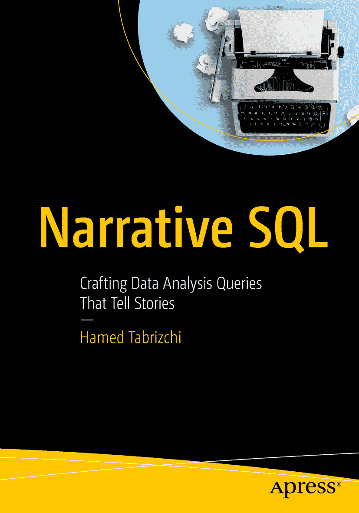

ISBN 979-8-8688-1559-1 e-ISBN 979-8-8688-1560-7 [`doi.org/10.1007/979-8-8688-1560-7`](https://doi.org/10.1007/979-8-8688-1560-7) © Hamed Tabrizchi 2025
本作品受版权保护。出版方拥有所有权利，无论是材料的全部还是部分，特别是翻译权、转载权、图表的重复使用权、朗诵权、广播权、缩微胶片或其他任何物理方式的复制权，以及信息传播或存储与检索、电子改编、计算机软件，或现在已知或未来开发的类似或相异的方法论。
在本出版物中使用通用描述性名称、注册商标、服务标志等，即使未作特别声明，也不意味着这些名称不受相关保护性法律法规的约束，因此可自由用于一般用途。
出版方、作者和编辑可以安全地假设本书中的建议和信息在出版时是真实准确的。出版方、作者或编辑均不就本书所含材料或任何可能存在的错误或遗漏提供任何明示或暗示的保证。对于已出版地图中的管辖权主张和机构隶属关系，出版方保持中立。

此 Apress 印记由 Springer Nature 旗下的注册公司 APress Media, LLC 出版。
注册公司地址是：1 New York Plaza, New York, NY 10004, U.S.A.

*献给我可敬的父亲哈米德（Hamid）、我善良的母亲索海拉（Soheyla）和我出色的兄弟穆罕默德（Mohammad）——他们每个人都帮助我理解了生命的真正价值。*

*献给肖尔（Shaul）和格里芬（Gryffin），他们信任我，并在我前进的每一步都坚定地支持我。*

## 引言

在过去的十年里，数据分析和 SQL 在我的职业生涯中扮演了核心角色。我对编写查询的热情始于本科学习期间，当时我以满分完成了数据库课程。由于这一成就，我得以在接下来的学期担任助教，这让我获得了编写查询并向学生解释它们的经验。尽管起初说话时声音有些颤抖，但这个角色帮助我建立了在技术沟通和公开演讲方面的信心，并提高了我编写复杂查询的技能。这些早期经验为我当前在 SQL 和数据分析方面的专长奠定了基础，这也是我下一个职业成就的基石。

一年后，我开始在一家科技公司工作，在那里我遇到了更复杂的挑战。作为一名数据分析实习生，我遇到的两大挑战包括缺乏整理有序的数据以及协作的困难。协调程序员、查询编写者、UI/UX 设计师和团队其他成员之间的项目非常困难，这与教学或解决教科书习题大不相同。尽管面临所有这些挑战，我每天都充满动力，从同事那里获取经验和技能，并提高我的分析能力，以成为一名具有深刻洞察力的数据分析师。

多年来，我处理了许多项目，并从过去的经验中获得了更深入的见解和更好的分析技能。有一天，我决定我有一个可以与对数据分析和查询编写感兴趣的人分享的见解。因此，我决定写这本书，尽可能详细地传授塑造我这种视角的知识。本书的核心概念是 SQL 查询编写，这是我日常活动的核心，无论我是一名数据分析师、大学讲师还是数据团队负责人。

我相信，在当今这个数据不断增长的世界中，能够将信息塑造成引人入胜的故事的人具有优势。基于这种信念，“叙事性 SQL”应运而生，其理念是学习 SQL 不应像学习机器语言，而应像掌握一种交流语言。

本书面向充满好奇的分析师、富有思想的开发者以及未来的数据故事讲述者。无论您是刚刚开始数据库之旅，还是希望提高 SQL 熟练程度，本书都旨在为您提供清晰而富有创意的指导。

本书采用叙事结构，从基础开始——简单的`SELECT`语句、过滤器和`JOIN`。在随后的章节中，本书探讨了将原始数据转化为丰富见解的查询，包括聚合、子查询、条件逻辑等。凭借提供的 SQL 查询和故事，本书不仅是一本参考指南，更是您数据旅程中的伴侣，帮助您以叙事方式思考、清晰书写和透彻分析。

每章都通过故事来介绍概念和技能，助您掌握强大的 SQL 工具，包括窗口函数、用于动态数据操作的子查询、复杂查询的条件逻辑，甚至基于索引和视图的优化策略。读完本书后，您应该能够通过编写 SQL 查询来应对广泛的数据分析挑战。本书最后几章涵盖了高级主题，如性能调优、脚本优化以及使用窗口函数进行分析性故事讲述，为您的叙述增添深度和精确性。在本书中，您将同时获得灵感和实用技能——当您合上最后一章时，您将准备好讲述自己强大的数据故事。

最后需要指出的是，本书中呈现的所有查询都是在`PostgreSQL 14.17`上开发并经过全面测试的，这是一个企业级的开源关系数据库系统，以其健壮性、可扩展性和对 SQL 的遵从性而闻名。尽管 PostgreSQL 的基本概念应适用于所有版本，但特定语法、性能特性或功能可用性可能有所不同。

包括故事和示例在内的完整查询集合，可以通过出版商的 GitHub 仓库访问：[`https://github.com/Apress/Narrative-SQL`](https://github.com/Apress/Narrative-SQL)。在整个仓库中，所有查询都按章节方便地组织和分类，使您能够方便地查找并执行与特定部分相关的示例。

