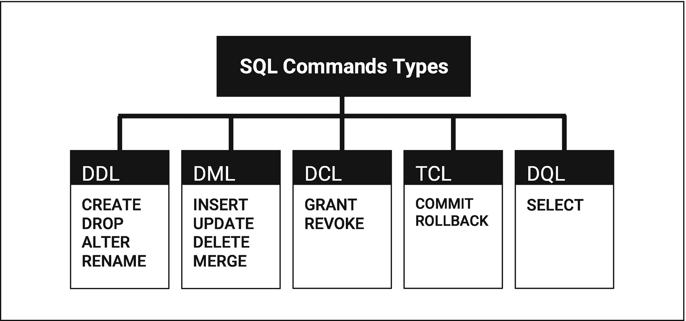

# 1. 讲述者的数据库

本章为你开启数据和叙事世界的旅程奠定基础。从数据、数据库和数据分析的基础知识开始，本章探讨数据库管理系统以及 SQL 在导航这些知识库中的关键作用。通过探索 SQL 命令和使用数据类型，你可以讲述强大的故事。本章为你提供了开始这段旅程所需的基本知识。它涵盖了数据叙事的艺术与科学。


## 数据导言

在当今社会，数据是一切事物构建的基础，它影响着我们生活的方方面面。我们能获取的数据来源不计其数，从卫星追踪的天气模式到你每天行走的步数。术语*数据*指的是一个变量的定性或定量属性。大量的数据被收集、观测或创造出来，目的是对其进行分析并基于分析做出决策。我们可以存储结构化或非结构化数据，范围涵盖数字、文本、多媒体，直至用于计算和研究的复杂数据集。

简而言之，数据是信息的原材料，是理解世界和做出明智决策的基础。数据本身就像一堆未经提炼的原油。尽管数据具有价值，但在经过处理和分析之前，它是无用的。数据蕴含着巨大的价值，因为它能够揭示隐藏的模式、趋势和洞见。分析数据的能力使人们能够做出更好的决策、解决复杂问题并推动商业创新。人们普遍认为，在数字时代，数据已成为我们生活各个方面的组成部分，并且是医疗、金融和科技等跨行业所有决策的基础。表`1-1`提供了探索数据时的五个基本问题与答案。

**表 1-1**
**探索数据的五个基本问题与答案**

| # | 问题 | 答案 |
| --- | --- | --- |
| 1 | 数据为何如此有价值？ | 数据的运用带来决策、创新与进步。在一个信息即力量的时代，数据蕴含着做出明智决策、解决复杂问题和预测未来趋势所必需的基础洞见与证据。 |
| 2 | 谁依赖数据？ | 我们所有人。数据被广泛用于各种事务，从企业利用客户数据调整产品，到政府利用数据规划政策，再到科学家利用研究数据做出发现。许多行业和社会都依赖数据。 |
| 3 | 数据从何而来？ | 遍布世界。这包括广阔互联网中的无数设备和传感器，以及构成物联网（IoT）的数十亿设备和传感器。从利用气候监测设备探索海洋深处，到通过卫星收集宇宙数据触及太空遥远之处。每个数据来源都提供了独特的洞见，共同丰富了我们集体的认知。 |
| 4 | 数据何时被使用？ | 每天，持续不断地。数据在我们的生活中被持续使用，并非局限于特定时刻。数据被用于指导应急响应、促进金融交易，也被用于影响长期政策决策和科学研究。数据的相关性跨越时间尺度，从即时到代际。 |
| 5 | 数据有什么用？ | 数据实现转化。数据有多种改变世界的方式。这包括为政策提供信息、推动经济增长、促进科学与医疗进步、改善教育以及丰富文化理解。通过分析数据，我们可以发现模式、预测结果、个性化体验并激发创新。 |

## 数据分析

正如 20 世纪的石油——为经济提供动力、彻底改变交通运输并在工业进步中扮演基础角色——数据是 21 世纪推动社会进步、经济增长和创新的基础资源。如同石油必须经过开采、提炼和分配才能利用其能量，数据也必须经过收集、组织和分析才能释放其全部潜力。因此，在这个时代，掌握数据的开采、提炼和分析的重要性不容小觑。数据分析的目的是通过检查、清洗、转换和建模数据，发现有用信息，提供洞见以得出结论，并支持决策。

### 数据库

数据库是以电子方式存储并可通过计算机系统访问的结构化数据集合。这个系统有助于高效地组织、管理和检索数据。数据库旨在处理大量数据，允许用户快速、安全地添加、修改和查询数据。数据库支持多种数据类型，包括文本、数字、多媒体文件等，并以促进业务分析、交易管理和决策的方式进行组织。成千上万的应用程序依赖数据库，从人们日常访问的网站到在全球范围内运行的金融系统。

数据库不仅仅存储数据；它们经过精心设计，以一种易于访问和使用的方式来组织信息。组织至关重要，因为数据的价值不仅在于其存在，还在于检索和解读它的能力。在社会的每个领域——无论是医疗、教育、商业还是技术——数据库都帮助管理病人记录、学生信息、金融交易等等。

一般来说，数据库有多种类型，包括结构化、半结构化和非结构化数据库。根据数据性质优化存储、检索和分析的需要，数据类型与数据库类型之间存在关联。结构化、半结构化和非结构化数据都需要不同的数据库特性。对于分析而言，了解每种数据的区别至关重要，因为它们需要不同的工具和方法来提取洞见。

结构化数据中，每条信息都以易于在数据库和电子表格中搜索的方式进行组织和格式化，并存储在预定义的模型或模式中。这样，计算机可以进行高效的处理和分析。结构化数据可以通过关系型数据库轻松访问和分析。

在现实世界中，数据并不总是以结构化形式存储，可能是非结构化或半结构化的。非结构化数据包括从电子邮件、视频到社交媒体帖子的一切内容，通常存储在处理多样化和动态数据集的非关系型（`NoSQL`）数据库中。半结构化数据介于两者之间，结合了二者的元素。`JSON`和`XML`文档是半结构化数据的例子，它们虽然不适合传统的表模式，但具有可查询和分析的内在结构。


### 关系型数据库与非关系型数据库

关系型数据库与非关系型数据库之间存在主要区别，各自具有特点、优势和应用场景。关系型数据库基于关系数据模型。在此模型中，使用表（关系）来组织数据，表由行和列组成。行代表唯一记录，列代表字段。关系型数据库的强大之处在于其使用`SQL`（结构化查询语言）进行数据操作和检索，这允许在查询数据时具有高度的灵活性和精确性。最流行的关系型数据库管理系统包括`PostgreSQL`、`MySQL`、`Oracle Database`和`Microsoft SQL Server`。另一方面，非关系型数据库，即`NoSQL`数据库，是作为对关系模型局限性的回应而出现的，特别是在处理大量非结构化或半结构化数据方面。与固定模式不同，这些数据库通常能够存储各种数据类型，如文档、键值对、宽列和图。`NoSQL`数据库特别适用于需要快速开发、可扩展性和处理多种数据类型能力的应用程序。其中最流行的包括`MongoDB`（基于文档）、`Redis`（键值存储）、`Cassandra`（宽列数据库）和`Neo4j`（图数据库）。

结构化、半结构化和非结构化数据类型之间的转换通常由数据管理和分析中的各种需求与挑战驱动。每种类型都有其独特的特征和最佳用例。因此，存在各种各样的数据库和数据库类型，从关系型数据库（可以通过定义良好的模式和关系有效地处理结构化数据）到`NoSQL`数据库（如文档、键值、宽列和图数据库）。它们各自都针对满足非结构化或半结构化数据的特定需求而定制。正如书名所示，接下来的章节将重点讨论结构化数据，探索关系型数据库的广阔世界以及使用`SQL`语言与它们进行交互。

### 探索关系型数据库管理系统

关系型数据库在整个过程中都至关重要。由于关系型数据库是结构化的，它们确保了数据的完整性和一致性，这对数据分析至关重要。`SQL`强大的查询能力使分析师能够从大型数据库中快速有效地检索特定的数据子集。`SQL`的查询能力使分析师能够轻松地执行复杂的聚合、连接和过滤操作，这些在数据预处理和探索阶段是必不可少的任务。本书的目的是教你如何使用`SQL`提取和分析存储在数据库中的数据。在本章的剩余部分，你将越来越多地了解数据分析、数据库和其他概念，但首先你需要更好地理解数据，以便能够分析它。

在大多数关系型数据库中，使用`SQL`来查询和管理数据。由于`SQL`强大而灵活的功能，它已成为关系型数据库管理系统的标准语言。有许多流行的关系型数据库系统使用`SQL`，包括`MySQL`、`PostgreSQL`、`Oracle Database`、`Microsoft SQL Server`和`SQLite`。由于`SQL`与结构化数据交互的标准方式，这些系统可以更轻松地执行复杂查询、更新数据、创建和修改模式以及管理数据库访问。

本书使用`PostgreSQL`作为其`SQL`示例的基础，对于渴望通过关系型数据库的视角更深入理解数据分析的读者来说，它提供了许多优势。`PostgreSQL`数据库系统以其健壮性、开源性质和对`SQL`标准的遵循而闻名，使其成为最先进的关系型数据库系统之一。通过其开源模型，用户不仅能够免费使用高质量的数据库系统，而且还能从一个充满活力的开发者社区中受益，该社区不断增强了其功能。除了复杂的`SQL`查询、外键、触发器、视图和存储过程之外，`PostgreSQL`还支持广泛的`SQL`功能。

### 数据分析与数据叙事中的数据库

数据库不仅提供了一种存储数据的手段，它们在分析数据和基于数据讲述故事方面也发挥着重要作用。在数据分析中，数据被检查、清理、转换和建模，以发现有用的信息、得出结论并支持决策。通过构建和组织数据，数据库促进了这一过程；它们使分析师能够有效地查询和操作数据。另一方面，叙事涉及使用叙述以引人入胜且易于理解的方式传达信息。数据叙事涉及围绕数据中的见解构建叙述，以使复杂的信息变得可访问和可理解。在数据叙事的背景下，数据库的定义可以表述为一个事实来源，数据叙事中的叙述由此构建。通过能够提取有意义的模式和趋势，数据库使讲述者能够轻松地讲述与受众产生共鸣的叙事。简而言之，数据库通过提供这些故事的原始材料，位于这一过程的核心。

## 深入了解 `SQL`

在 20 世纪 70 年代，`SQL`的创建标志着数据存储和检索演变的一个关键转折点。几十年来，`SQL`从一个简单的查询语言演变为数据专业人士使用的工具。`SQL`的旅程始于 20 世纪 70 年代初期的`IBM`，研究人员`Donald D. Chamberlin`和`Raymond F. Boyce`开发了一个名为`SEQUEL`（结构化英语查询语言）的原型。该原型设计用于操作和存储在`IBM`早期关系型数据库管理系统中的数据。后来，该语言被更名为`SQL`以避免品牌问题。到 20 世纪 70 年代末和 80 年代初，`SQL`已被采纳为关系型数据库管理系统的标准语言。自那时起，`SQL`经历了多次修订，以包含更新的功能和能力。这些功能包括对`XML`数据的支持、窗口函数，以及扩展其在管理多样数据类型和复杂查询方面的效用和效率。`SQL`允许用户与数据库交互以执行查询、更新、插入和删除数据等操作。


## SQL 命令类型：数据库交互的五大原则

SQL 中有五种不同的命令类型，每种在管理和操作数据时都执行特定的功能。这些类别分别是：数据定义语言 (DDL)、数据操作语言 (DML)、数据控制语言 (DCL)、事务控制语言 (TCL) 和数据查询语言 (DQL)。

*   **数据定义语言 (DDL)**：DDL 命令用于定义、修改和管理数据库对象（如表、索引和视图）的模式与结构。这些命令不直接操作数据本身，而是塑造容纳数据的“容器”，允许创建和修改数据库结构。
*   **数据操作语言 (DML)**：DML 命令很可能是最常用的，因为它们直接处理现有数据库结构内的数据操作。它们使用户能够插入、更新、删除和管理数据库数据。
*   **数据控制语言 (DCL)**：DCL 命令侧重于数据库对象的权限和访问控制。出于安全和保密性考虑，这些命令在多用户数据库中至关重要。
*   **事务控制语言 (TCL)**：TCL 命令将由 DML 操作所做的更改作为事务进行管理。事务要么完全处理，要么完全不处理，从而确保数据的一致性和完整性。这些命令允许用户提交或回滚对数据库的更改。
*   **数据查询语言 (DQL)**：DQL 涉及数据的检索，主要由 `SELECT` 命令表示，该命令查询数据库中的表以获取数据。DQL 允许用户精确指定查询应返回哪些数据，使其成为提取和分析存储在数据库中的信息的强大工具。

图 1-1 展示了 SQL 命令类型的概览，指出了每个类别及其各自的命令。此图作为指南，描绘了不同的 SQL 命令类型。这种可视化不仅有助于理解 SQL 内部的功能划分，还突出了每个类别中可以执行的具体操作。


*图 1-1：SQL 命令类型*

当涉及到数据分析时，你将主要使用数据操作语言 (DML) 和数据查询语言 (DQL) 命令。这两类 SQL 命令特别有用：

*   **DML 和 DQL 的共同点**：
    1.  **数据处理的灵活性**：DML 提供了根据分析需要操作数据的灵活性，确保数据集准确且相关。DQL 则提供了挖掘这些数据的工具，提取出对知情决策至关重要的洞察和信息。
    2.  **高级分析的基础**：其他 SQL 命令侧重于数据库结构和访问控制，而 DML 和 DQL 则直接关注数据本身。掌握这些命令使分析师能够提取和操作数据。
    3.  **数据完整性**：DML 有助于维护数据集的质量和相关性，而 DQL 确保分析过程中数据的完整性得以保持。通过使用 DQL，分析师可以执行只读操作，不会改变或损坏底层数据。
*   **数据查询语言 (DQL)**：
    1.  **数据检索**：SQL 环境中数据分析的本质是查询数据库以获取特定数据集。`SELECT` 允许你精确指定要检索哪些数据，包括从哪些表获取以及在什么条件下获取。
    2.  **数据聚合与筛选**：`SELECT` 查询可以通过 `WHERE`、`GROUP BY` 和 `HAVING` 等子句进行增强。它们筛选数据、聚合数据（例如，求平均值、总和、计数），并选择满足特定条件的数据。这些操作是数据分析的基础，使分析师能够探索数据中的趋势、模式和异常值。
    3.  **连接表**：数据分析通常需要组合来自多个表的数据以获得完整视图。`SELECT` 命令可以根据特定条件连接表，从而实现跨不同数据集的全面分析。
*   **数据操作语言 (DML)**：
    1.  **洞察提取**：DML 命令用于在数据库表中插入、更新、删除和管理数据。数据分析的主要目标是从数据中提取洞察，而不是修改它。
    2.  **数据准备**：在分析数据之前，通常需要清理和预处理数据。像 `UPDATE` 这样的 DML 命令可以纠正数据错误，`DELETE` 可以删除不相关或重复的记录。数据准备对于准确分析至关重要。
    3.  **插入数据**：`INSERT` 命令对于向数据库添加新数据非常有用，这些数据可能是分析所需的。这可能包括新的数据点、计算指标或你希望存储以备将来使用的先前分析结果。

DML 和 DQL 对于数据分析至关重要。DML 为分析准备数据环境，确保其干净且是最新的，而 DQL 则使分析师能够查询、聚合和解释数据，从而从中得出可行的见解。它们共同构成了 SQL 数据库中数据分析的支柱。

## 数据分析中的事务语句与查询语句

SQL 中事务语句与查询语句的区别指的是数据分析的两个基本方面：管理数据操作的完整性和获取洞察。

### 数据分析中的事务语句

事务语句管理数据更改如何应用或回滚，在确保整个分析过程中数据的完整性和一致性方面起着至关重要的作用。当执行多个操作时，事务语句允许分析师保持一致的数据状态。例如，在一个事务中更新数据库以纠正错误或反映新信息，可确保所有更新都成功应用，或者都不应用。这可以防止可能导致数据不一致的部分更新。数据分析师经常需要试验数据转换或更正。事务提供了安全性（使用 `BEGIN`、`COMMIT` 和 `ROLLBACK`），允许分析师在确定结果之前测试更改，而不会永久改变数据。

### 数据分析中的查询语句

专注于数据检索的查询语句是数据分析的基础。它们使分析师能够探索、聚合和可视化数据，提取有意义的洞察。探索数据集以更好地理解潜在的模式、趋势和异常，构成了数据分析的核心。查询语句 (`SELECT`) 允许分析师筛选大量数据、过滤特定子集，并跨表执行复杂的连接以收集全面的洞察。


## 数据分析中的事务语句与查询语句整合

虽然事务语句提供了安全操作数据的方法，但查询语句则提供了提取洞察的手段。在一个有条理的数据分析工作流中，分析师可能会使用事务语句来准备分析所需的数据（例如，修正、更新或清理数据），并使用查询语句在数据达到可靠状态后从中提取洞察。需要注意的是，事务在确保数据操作步骤的可重复性和可逆性方面也能发挥作用，这对于验证和确认分析结果至关重要。

### 使用 PostgreSQL 设置叙事环境

使用 PostgreSQL 创建一个叙事环境，涉及建立一个数据库系统，数据可以在其中被存储、操作和查询，以揭示和讲述隐藏在数据中的引人入胜的故事。PostgreSQL 为数据分析和叙事提供了一个理想的平台。本节将指导你完成建立这样一个环境的初始步骤，强调 PostgreSQL 的简洁性和强大功能。

#### 步骤一：安装

**下载并安装 PostgreSQL**。从 [PostgreSQL 官网](https://www.postgresql.org/download/) 下载适用于你操作系统的 PostgreSQL 安装程序。安装过程是直接了当的。按照屏幕上的指示操作，并务必记下你在安装期间设置的管理员密码以及 PostgreSQL 将运行的默认端口（通常是 5432）。

#### 步骤二：创建你的第一个数据库

**访问 PostgreSQL**。安装完成后，通过其名为 `psql` 的命令行界面（CLI）访问 PostgreSQL，或使用图形用户界面（GUI）工具。两者都提供了全面的数据库管理功能，其中 `pgAdmin` 因其视觉特性对初学者更友好。

**创建数据库**。要创建你的第一个数据库，请使用 `psql` 命令行界面或 `pgAdmin`。在 PostgreSQL 中，你可以通过执行以下命令创建一个名为 `storytelling_db` 的数据库：

```
CREATE DATABASE storytelling_db;
```

#### 步骤三：定义数据结构

**创建表。** 数据库就位后，下一步是通过创建表来定义数据的结构。例如，如果你要讲述关于客户交互的故事，你可能会创建一个名为 `customers` 的表，包含客户 ID、姓名、电子邮件和交互日期等字段。

```
CREATE TABLE customers (
customer_id SERIAL PRIMARY KEY,
name VARCHAR(100),
email VARCHAR(100),
interaction_date DATE
);
```

**插入数据。** 用初始数据填充你的表，以开始分析。`INSERT` 语句向表中添加记录，为你的叙事奠定基础。

```
INSERT INTO customers (name, email, interaction_date) VALUES
('Jane Doe', 'jane.doe@email.com', '2022-01-01'),
('John Smith', 'john.smith@email.com', '2022-01-02');
```

这个名为 `storytelling_db` 的数据库包含一个名为 `customers` 的表。表 `1-2` 展示了 `customers` 表，该表是为保存客户交互数据而创建的。这个表的结构旨在捕获关于客户及其交互的基本细节。`customers` 表中的字段如下：

*   `name`：客户姓名，存储为最大长度 100 个字符的可变字符串（`VARCHAR`）。
*   `email`：客户的电子邮件地址，同样存储为最大长度 100 个字符的 `VARCHAR`。
*   `interaction_date`：与客户交互的日期，存储为 `DATE` 类型。

这种结构使你能够有效地存储和查询客户交互数据。下一节将讨论 SQL 中变量的不同数据类型。

**表 1-2 客户表**

| customer_id | 姓名 | 电子邮件 | interaction_date |
| --- | --- | --- | --- |
| 1 | Jane Doe | `jane.doe@email.com` | 2022-01-01 |
| 2 | John Smith | `john.smith@email.com` | 2022-01-02 |

使用 PostgreSQL 设置环境是关键一步。创建一个强大的分析和叙事平台的初始步骤包括安装、数据库创建、数据结构化和查询。在本书接下来的章节中，你将踏上一段关于查询编写艺术的、详细的、循序渐进的旅程。通过后续章节提供的示例，你将培养 SQL 技能，从基础到高级查询技术。


### SQL 中的数据类型

SQL 中的数据类型是一个基本概念，它定义了可以存储在数据库列中的数据性质。SQL 中的每种数据类型都确保数据符合预定义的格式，便于准确的数据存储、检索和分析。为了有效地设计和操作数据库，熟悉这些数据类型至关重要。以下是 SQL 中可用的常见数据类型：

*   **数值数据类型：**

    `INTEGER`：一个整数，可以是正数或负数。根据数据库系统的不同，变体如 `INT`、`SMALLINT`、`TINYINT` 和 `BIGINT` 表示不同大小的整数。

    `DECIMAL` 和 `NUMERIC`：这些数据类型旨在存储精确的数值数据值。在 SQL 中定义 `DECIMAL` 或 `NUMERIC` 列允许分析师指定精度和小数位数，从而使数据库能够精确处理数值数据。精度指的是数字中小数点左右两侧的有效数字位数，即数字的总位数。小数位数指定小数点后的位数。它代表数字的小数部分，是精度的一个子集。

    `FLOAT`、`REAL` 和 `DOUBLE PRECISION`：表示具有不同精度级别的浮点数。适用于对精确度要求不高的科学计算。

*   **字符串数据类型：**

    `CHAR` 和 `CHARACTER`：固定长度的字符串。如果输入的字符串短于指定长度，则会在右侧填充空格。

    `VARCHAR` 和 `CHARACTER VARYING`：可变长度字符串。允许存储长度不超过指定最大值的字符串。

    `TEXT`：用于长度可能超过 `VARCHAR` 限制的大型文本数据。

*   **日期和时间数据类型：**

    `DATE`：存储日期值，包括年、月、日。

    `TIME`：存储一天中的时间值。

    `TIMESTAMP`：结合日期和时间，捕捉特定的时间点。

    `INTERVAL`：表示一段时长，可用于计算日期或时间之间的差异。

*   **布尔数据类型：**

    `BOOLEAN`：表示逻辑布尔值，通常为 `TRUE` 或 `FALSE`。

*   **二进制数据类型：**

    `BINARY` 和 `VARBINARY`：以固定长度或可变长度格式分别存储二进制数据，如图像或文件。

    `BLOB` (二进制大对象)：用于存储大型二进制数据，如图像、视频或文档。

*   **特殊化数据类型：**

    `ENUM`：一种字符串对象，其值只能从表创建时定义的值列表中选择一个。

    `ARRAY`：支持存储数组（即元素的有序集合），数组元素为指定的数据类型。

    `JSON` 和 `XML`：用于存储 JSON 或 XML 数据，允许在单个数据库列中存储复杂的数据结构。

    `UUID`：存储通用唯一标识符。

*   **地理空间数据类型：**

    `POINT`、`LINESTRING` 和 `POLYGON`：特定于支持地理空间数据的数据库，用于表示地理形状和位置。

选择适当的数据类型对于优化数据库存储、性能和数据完整性非常重要。在设计数据库模式时，请考虑您的数据特性和性能要求。

以下是每种提到的 SQL 数据类型的示例，它们说明了在创建表时如何使用这些数据类型。

*   **数值数据类型：**

    ```
    CREATE TABLE numeric_examples (
    id INT,
    small_number SMALLINT,
    big_number BIGINT,
    exact_amount DECIMAL(10, 2),
    approx_net_worth FLOAT
    );
    ```

    此查询创建了一个名为 `numeric_examples` 的表，包含五列，每列设计用于容纳不同类型和规模的数值数据。这些列包括一个名为 `id` 的整数、一个名为 `small_number` 的小整数、一个名为 `big_number` 的大整数、一个名为 `exact_amount` 的精确小数（适用于财务数据），以及一个名为 `approx_net_worth` 的浮点数（用于近似值）。

*   **字符串数据类型：**


## SQL 数据类型详解

### 字符串数据类型

```sql
CREATE TABLE string_examples (
    fixed_char CHAR(10),
    variable_char VARCHAR(100),
    long_text TEXT
);
```

此查询创建了一个名为 `string_examples` 的表，该表由三列组成，旨在以不同的格式存储字符串数据。`fixed_char` 列存储十个字符的固定长度字符串；`variable_char` 可容纳最多 100 个字符的可变长度字符串；而 `long_text` 则存储没有指定最大长度的大文本条目。

### 日期和时间数据类型

```sql
CREATE TABLE datetime_examples (
    birth_date DATE,
    appointment_time TIME,
    event_timestamp TIMESTAMP,
    duration INTERVAL
);
```

此查询创建了一个名为 `datetime_examples` 的表，该表设计用于通过四个列存储各种类型的日期和时间信息。该表包括一个用于日期的 `birth_date` 列，一个用于一天中时间的 `appointment_time` 列，一个用于日期和时间组合的 `event_timestamp`，以及一个用于表示时间间隔的 `duration` 列。

### 布尔数据类型

```sql
CREATE TABLE boolean_example (
    is_active BOOLEAN
);
```

此查询生成了一个名为 `boolean_example` 的表，该表由一个名为 `is_active` 的单列组成。`is_active` 列旨在存储布尔值，表示真或假的状态。

### 二进制数据类型

```sql
CREATE TABLE binary_examples (
    fixed_binary BYTEA,
    variable_binary BYTEA,
    large_object OID
);
```

此查询构建了一个名为 `binary_examples` 的表，该表包含三列，旨在以各种格式存储二进制数据。它包括一个 `fixed_binary` 列，用于使用 `BYTEA` 类型存储二进制数据，该类型处理可变长度的二进制数据。`variable_binary` 列的类型也是 `BYTEA`，允许灵活地存储没有预定义大小限制的二进制数据。最后，`large_object` 列用于使用 `OID` 类型存储大型二进制对象（BLOB），该类型指向在 PostgreSQL 中单独存储的大型对象。通过这种设置，可以以稳健的方式高效管理不同类型的二进制数据。

### 专用数据类型

```sql
CREATE TYPE status_enum AS ENUM ('New', 'In Progress', 'Completed');
CREATE TABLE specialized_examples (
    status status_enum,
    number_series INTEGER[],
    user_profile JSON,
    unique_id UUID
);
```

在 PostgreSQL 中，要定义 `ENUM` 类型，必须使用 `CREATE TYPE`。在此查询中，`CREATE TYPE` 语句定义了一个名为 `status_enum` 的 `ENUM` 类型，然后可以在表定义中使用它。

此查询建立了一个名为 `specialized_examples` 的表，其中包含具有专用数据类型的列：`status` 作为一个 `ENUM` 以将值限制为特定状态，`number_series` 作为一个 `ARRAY` 以存储整数序列，`user_profile` 用于存储结构化的 JSON 数据，以及 `unique_id` 用于保存通用唯一标识符（UUID）。

## 注意事项

SQL 中的 `--` 符号表示单行注释的开始，表明其后在同行上的文本不会作为 SQL 命令的一部分执行，而是用于脚本内的注释或解释。

在 SQL 中，分号（`;`）是一个语法元素，有多种用途，例如作为语句终止符、批处理、兼容性和清晰度。在 PostgreSQL 中，与 MySQL 等其他一些数据库管理系统相比，分号的使用更为严格。在 PostgreSQL 的交互式终端（`psql`）中，通常需要使用分号来终止 SQL 语句。如果没有分号，终端会等待进一步的输入，假设语句尚未完成。在 PostgreSQL 中，分号在交互式会话（`psql`）中执行语句时是必需的，在分隔多个语句时是强制性的，在脚本中对于确保每个语句被正确处理是必要的，并且在 PL/pgSQL 代码块中用于终止单个语句。

注意 地理空间类型特定于支持它们的数据库，例如带有 PostGIS 的 PostgreSQL。

### 地理空间数据类型

```sql
CREATE TABLE geospatial_examples (
    location_point POINT,
    route LINESTRING,
    boundary POLYGON
);
```

此查询在支持地理空间数据类型的数据库系统（例如带有 PostGIS 扩展的 PostgreSQL）中创建了一个名为 `geospatial_examples` 的表，旨在存储各种类型的地理数据。该表包括三列：`location_point` 用于存储单个地理点，`route` 用于存储一系列连接形成线的点，以及 `boundary` 用于定义封闭的形状或区域。

## 构建叙述

在本书的其余部分，每一章都将采用一种独特的教学方法来审视 SQL 运算符，该方法结合了数据分析和叙事。通过探索各种 SQL 运算符及其应用，每一章都将从数据中揭示洞察并创建引人入胜的叙述。通过增强您的技术技能和分析思维，您将能够有效地沟通复杂的数据驱动故事。

正如本书的名称所示，*叙述性 SQL* 指的是将自然语言查询转换为 SQL 命令的过程。自然语言查询指的是人类用于交流的日常语言所表达的问题或命令，而不是专门的编程或查询语言。这使得用户能够使用类似人类的句子与系统、数据库和计算机进行交互。在本书中，您将受邀踏上一段数据查询和操作的旅程，其中 SQL 的复杂性将以叙述的方式展开。跟随侦探使用基于数据库提供数据的 SQL 查询来解决谜题的冒险。每一章都由一系列叙述构成，使技术内容变得平易近人且令人难忘。通过使用引人入胜的故事，本书不仅将教育读者，还将激励来自不同背景的读者学习 SQL 概念，并在他们的数据驱动事业中自信地使用它们。

## 总结

本章从数据及其在数据库中存储的基础知识开始，为通过数据故事讲述掌握 SQL 奠定了基础。它探讨了关系型和非关系型数据库之间的区别，并讨论了为什么 PostgreSQL 特别适合学习 SQL，这得益于其强大的功能和强大的社区支持。每个部分都建立在前一个部分的基础上，从理解各种 SQL 命令（分为 DDL（数据定义语言）、DML（数据操作语言）、DCL（数据控制语言）、TCL（事务控制语言）和 DQL（数据查询语言））到设置一个有利于故事讲述的 PostgreSQL 环境。


### 关键点

*   `Data`（数据）：由各种可数字存储、处理和分析的信息类型组成，是洞察和决策的基础。
*   `Databases`（数据库）：在存储、组织和管理数据方面发挥着基础作用，为有效的数据分析和叙事奠定基础。
*   关系型与非关系型数据库：关系型数据库将数据组织成通过关系链接的表，而非关系型数据库以非表格形式存储数据，以满足多样化的数据存储需求。
*   选择 `PostgreSQL`：`PostgreSQL` 提供了健壮性、广泛的功能以及强大的社区支持，使其成为学习和使用 SQL 进行数据叙事的合适选择。
*   理解 `SQL`：`SQL` 是数据库交互的关键语言，涵盖了其在查询、更新和管理数据方面的重要性。
*   `SQL` 命令类别：`SQL` 命令分为 `DDL`、`DML`、`DCL`、`TCL` 和 `DQL`，为理解它们在数据库操作中的作用提供了基础。
*   设置叙事环境：设置 `PostgreSQL` 环境，从安装到创建第一个数据库和表，为数据驱动的叙事做好准备。
*   `SQL` 数据类型：`SQL` 数据类型（数值、字符串、日期和时间、布尔值、二进制及特殊类型）能够准确地存储和操作数据。
*   开始数据分析和叙事：通过 `SQL` 查询，开始一段发现模式、趋势和洞察的旅程，为叙事奠定基础。

### 关键要点

*   数据和数据库：对于存储和分析信息至关重要，是决策的支柱。
*   `PostgreSQL`：因其健壮性和适合在 `SQL` 和数据叙事方面进行教育而被选用。
*   `SQL` 基础知识：涵盖了 `SQL` 在数据库操作中的重要性，并介绍了基本命令和数据类型。

当你探索 `SQL` 时，你了解到它不仅可以用来查询数据。`SQL` 还可以讲述引人入胜的故事。在设置好叙事环境后，你现在已准备好深入研究 `SQL` 的复杂性。

### 展望未来

当你进入下一章“从 `SELECT` 开始”时，你将深入探讨如何使用 `SQL` 中最常用的命令来有效地检索和操作数据。这包括学习如何构建精确的 `SELECT` 语句来提取叙事所需的正确数据。这将为更高级的数据操作和分析技术奠定基础。

