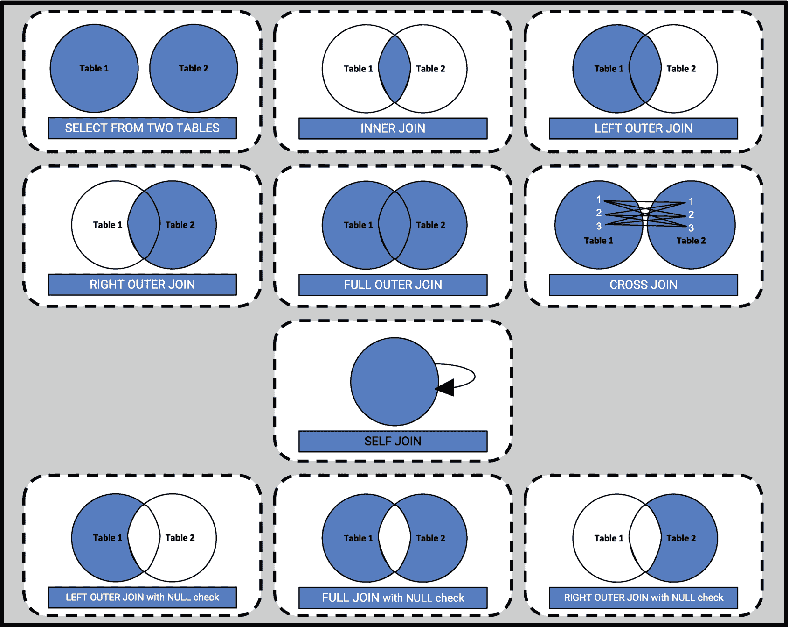

# 4. 复杂角色与 JOIN

SQL 中的 `JOIN` 操作允许你根据两个或多个表之间的关联列，将它们的行组合起来。在大多数实际应用中，全面分析数据需要考虑的不仅仅是一个单一的表。为了进行全面的分析，考虑不同的维度是非常重要且必要的，因此，使用 `JOIN` 操作可以让你实现全面的分析。在关系型数据库中，数据通常被规范化并分布在不同的表中，以减少冗余并确保数据完整性。`JOIN` 使你能够将这些分散的数据汇集在一起，并提供一个可用于更好分析和报告的统一视图。

## JOIN 简介

SQL 中的 `JOIN` 是查询关系型数据库必不可少的操作，因为它们使你能够通过链接多个表的数据来提取有意义的信息。

### JOIN 在数据叙事中的重要性

JOIN 对于数据叙事至关重要，因为它们允许分析师通过组合分散在多个表中的相关信息来创建叙述。例如，要分析客户订单，你可能需要来自三个表的数据：`Customers`、`Orders` 和 `Products`。`JOIN` 使你能够将这些表连接在一起，并提取一个连贯的数据集，从而提供对客户购买行为、产品受欢迎程度和销售绩效的见解。通过在查询中使用 `JOIN` 操作符，你可以实现以下优势。

*   组合来自多个来源的数据
*   通过访问所有相关数据点进行深入分析
*   创建能够回答更复杂问题的复杂查询

### `JOIN` 子句的剖析

`JOIN` 子句可以被描述为连接两个或多个表的桥梁。如前所述，关系型数据库将包含多个表，而基于特定条件合并这些表数据的可能性，使得你能够检索和分析存储在不同表中的信息。这很重要，因为现实世界的数据库通常将数据存储在不同的表中，以提高组织性和效率。一个 `JOIN` 子句从根本上包含以下部分：

1.  **连接类型**：这指定了所执行的连接类型。常见的类型有 `INNER JOIN`、`LEFT OUTER JOIN`、`RIGHT OUTER JOIN`、`FULL OUTER JOIN` 和 `CROSS JOIN`。每种类型决定了结果集中如何处理匹配和不匹配的行。

2.  **FROM 子句**：此子句指定了要连接的表。`FROM` 子句中表的顺序有时会影响查询性能，尤其是在使用某些 `JOIN` 类型时。

> **注意**
> 大多数现代数据库系统使用查询优化器来分析 `JOIN` 子句，并选择最有效的方式执行 `JOIN` 操作。当今的数据库优化器很智能。它们在选择 `JOIN` 策略时会考虑多种因素，例如表大小、索引和 `JOIN` 条件。在许多情况下，无论你在 `FROM` 子句中指定的顺序如何，优化器都能高效地执行 `JOIN`。如果你怀疑某个 `JOIN` 子句导致了性能问题，建议使用数据库系统提供的工具来检查实际的执行计划。这将揭示优化器选择的 `JOIN` 策略，并突出显示任何瓶颈。

3.  **ON 子句**：此子句指定了确定每个表中哪些行匹配的条件。`ON` 语句通常使用比较运算符（如 `=`、`<` 或 `>`）来比较两个表的列。

最常见的 `JOIN` 类型——`INNER JOIN` 的基本语法如下所示：

```sql
SELECT Customers.Name, Orders.OrderID, Orders.OrderDate
FROM Customers
INNER JOIN Orders ON Customers.CustomerID = Orders.CustomerID;
```

这个查询是一个 `INNER JOIN`，它连接了 `Customers` 和 `Orders` 表。`ON` 子句指定了只有当 `CustomerID` 值相等时，`Customers` 表的行才与 `Orders` 表的行匹配。此查询返回一个包含来自两个表的列的结果集，但仅包括相同客户下了订单的行（即匹配的 `CustomerID` 值）。

需要注意的是，在 SQL 中，点号 (`.`) 用于引用特定表中的特定列。当不同表中有同名列时，使用点号来确定列属于哪个表，以避免列名混淆。

### `JOIN` 的类型

尽管每个查询的具体需求不同，SQL `JOIN` 仍有不同的类型。每种 SQL `JOIN` 类型提供了组合来自多个表数据的不同方法。接下来将解释每种 `JOIN` 类型的目的。

`INNER JOIN`：当表之间存在明确关系时，这是一种用于检索数据的工具。它确保你只获得在两个表中都有匹配的行，这对于诸如查找已下订单的客户等任务非常理想。

*   **目的**：仅检索在两个表中都有匹配值的行。
*   **用例**：当你只想获取在两个表中都有相关数据的记录时。

`LEFT/RIGHT OUTER JOIN`：这些 `JOIN` 对于包含特定表（在 `FROM` 子句中首先列出的那个表）的所有行非常重要，即使在另一表中没有匹配项。它们通常用于在从另一个表检索相关信息的同时，保留一个表的数据。

`LEFT OUTER JOIN`：

*   **目的**：检索左表的所有行以及右表的匹配行。如果没有匹配，结果中右侧为 `NULL`。
*   **用例**：当你想要获取左表的所有记录，以及右表的相关数据（如果有的话）时。

`RIGHT OUTER JOIN`：

*   **目的**：检索右表的所有行以及左表的匹配行。如果没有匹配，结果中左侧为 `NULL`。
*   **用例**：当你想要获取右表的所有记录，以及左表的相关数据（如果有的话）时。

`FULL OUTER JOIN`：这种 `JOIN` 结合了左外连接和右外连接的功能。它返回两个表中的所有行，并填充不匹配的列。当你需要不受关系限制地获取来自两个表的完整数据视图时，这非常有用。

*   **目的**：当在左表或右表中有匹配时，检索所有行。在其中一个表中没有匹配的行将包含 `NULL`。
*   **用例**：当你想要获取两个表的所有记录，并在可能的情况下进行匹配时。

`CROSS JOIN`：这种 `JOIN` 创建一个笛卡尔积，本质上是将一个表中的所有行与另一个表中的所有行相乘。虽然常用于可视化目的，但对于大型数据集来说计算开销可能很大。通常谨慎使用，或者当你确实需要所有可能的行组合时使用。

*   **目的**：返回两个表的笛卡尔积。第一个表中的每一行与第二个表中的所有行组合。
*   **用例**：当你需要表中所有可能的行组合时。除非用于生成测试用的所有组合等特定目的，否则很少使用。

`SELF JOIN`：这种 `JOIN` 允许你根据特定条件将表与自身连接起来。它对于在表中查找关系非常强大。

*   **目的**：将表与自身进行 `JOIN`。
*   **用例**：当你需要比较同一表中的行时。

使用不同类型的 `JOIN` 为构造数据提供了灵活性。它们允许你根据特定的匹配条件检索数据，包含特定表的所有行，甚至检查所有可能的组合。`JOIN` 是在现实世界的关系型数据库上创建高效分析查询的有用工具。表 4-1 简要说明了使用每种 `JOIN` 类型的原因。

**表 4-1**

不同类型的 `JOIN`


| JOIN 类型 | 描述 | 查询结果 | 示例查询 |
| --- | --- | --- | --- |
| `INNER JOIN` | 仅返回在两个表中都存在匹配的行（基于 `JOIN` 条件）。 | 两个表中匹配的行 | `SELECT * FROM Table1 INNER JOIN table2 ON Table1.key = Table2.key` |
| `LEFT OUTER JOIN` | 包含左表（在 `FROM` 子句中首先指定）的所有行以及右表中匹配的行。如果右表中没有匹配项，则右表的列将填充 `NULL` 值。 | 左表的所有行，右表中匹配的行，或者对于不匹配的行填充 `NULL`。 | `SELECT * FROM Table1 LEFT JOIN table2 ON Table1.key = Table2.key` |
| `RIGHT OUTER JOIN` | 类似于 `LEFT JOIN`，但包含右表（在 `FROM` 子句中首先指定）的所有行以及左表中匹配的行。左表中不匹配的行将填充 `NULL`。 | 右表的所有行，左表中匹配的行，或者对于不匹配的行填充 `NULL`。 | `SELECT * FROM Table1 RIGHT JOIN table2 ON Table1.key = Table2.key` |
| `FULL OUTER JOIN` | 结合了 `LEFT` 和 `RIGHT OUTER JOIN`。包含两个表中的所有行，无论另一个表中是否存在匹配项。不匹配的列将填充 `NULL`。 | 两个表中的所有行，对于不匹配的行填充 `NULL`。 | `SELECT * FROM Table1 FULL OUTER JOIN table2 ON Table1.key = Table2.key` |
| `CROSS JOIN` | 创建笛卡尔积，产生两个表中所有可能的行组合，不受任何匹配条件的限制。可能生成大量行。 | 两个表中所有可能的行组合。 | `SELECT * FROM Table1 CROSS JOIN Table2` |
| `SELF JOIN` | 根据指定条件将一个表与自身连接。常用于查找同一表中的关系。 | 来自同一表且满足 `JOIN` 条件的行。 | `SELECT copy1.column1 AS first_column, copy2.column2 As second_column FROM Table1 copy1 INNER JOIN Table1 copy2 ON copy1.key = copy2.key` |
| `LEFT OUTER JOIN` 带 `NULL` 检查 | 类似于 `LEFT JOIN`，但显式检查 `NULL` 值以过滤结果。 | 左表中在右表里没有匹配行的行。 | `SELECT * FROM Table1 LEFT JOIN Table2 ON Table1.key = Table2.key WHERE Table2.key IS NULL` |
| `RIGHT OUTER JOIN` 带 `NULL` 检查 | 类似于 `RIGHT JOIN`，但显式检查 `NULL` 值以过滤结果。 | 右表中在左表里没有匹配行的行。 | `SELECT * FROM Table1 RIGHT JOIN Table2 ON Table1.key = Table2.key WHERE Table1.key IS NULL` |
| `FULL OUTER JOIN` 带 `NULL` 检查 | 类似于 `FULL JOIN`，但显式检查 `NULL` 值以过滤结果。 | 在另一表中没有匹配行的行。 | `SELECT * FROM Table1 FULL OUTER JOIN Table2 ON Table1.key = Table2.key WHERE Table1.key IS NULL OR Table2.key IS NULL` |

表 4-1 简要介绍了不同类型的 SQL `JOIN`。需要注意的是，有必要根据相关列（称为`键`）从两个或多个表中组合行。在本章的其余部分，将对所有类型的键进行详细说明。

如表中所述，总结来说，`INNER JOIN` 仅返回两个表中匹配的行，而 `LEFT JOIN` 包含左表的所有行以及右表中匹配的行，并用 `NULL` 填充右表列。相反，`RIGHT JOIN` 包含右表的所有行，对于左表中不匹配的行则填充 `NULL`。`FULL OUTER JOIN` 返回两个表中的所有行，对于没有匹配的情况使用 `NULL`。`CROSS JOIN` 创建所有行的笛卡尔积。`SELF JOIN` 将一个表与自身连接，以查找同一表中的相关数据。带有 `NULL` 检查的 `LEFT`、`RIGHT` 和 `FULL OUTER JOIN` 特殊情况用于检查结果以显示未匹配的行。理解这些 `JOIN` 类型和键有助于优化数据库查询和数据分析。为了更直观地理解，这些 JOIN 类型在图 4-1 中进行了说明。



图 4-1

JOIN 类型示意图


## 第一个故事：一家足球学院

在一家足球学院里，学院数据分析师威廉正面临来自俱乐部管理层人员的压力，需要他找出下一位年轻的明星球员。手握上个赛季的信息数据库，威廉计划通过确定以下信息来找到俱乐部的下一位年轻新星：

1.  列出所有比赛以及参与比赛的球员姓名。
2.  列出所有球员以及他们在所有比赛中的总进球数。

威廉的目标是分析存储在数据库中的数据，包括名为 `Player`、`Matches` 和 `MatchDetails` 的表。这些表存储了每位球员的统计数据及其在每场比赛中的表现。`Player`、`Matches` 和 `MatchDetails` 表分别展示在表 4-2、4-3 和 4-4 中。

表 4-4：MatchDetails 表

| MatchDetailID | MatchID | PlayerID | GoalsScored |
| --- | --- | --- | --- |
| 1 | 101 | 1 | 2 |
| 2 | 101 | 2 | 2 |
| 3 | 102 | 2 | 0 |
| 4 | 103 | 3 | 1 |
| 5 | 103 | 4 | 2 |
| 6 | 104 | 4 | 1 |
| 7 | 105 | 1 | 1 |
| 8 | 105 | 5 | 0 |
| 9 | 106 | 6 | 1 |
| 10 | 107 | 3 | 2 |
| 11 | 107 | 7 | 1 |

表 4-3：Matches 表

| MatchID | AgeGroup | MinutesPlayed |
| --- | --- | --- |
| 101 | U18 | 90 |
| 102 | U16 | 45 |
| 103 | U18 | 90 |
| 104 | U16 | 90 |
| 105 | U18 | 90 |
| 106 | U16 | 90 |
| 107 | U18 | 70 |

表 4-2：Player 表

| PlayerID | Name | Age | Position |
| --- | --- | --- | --- |
| 1 | Alex Jones | 17 | Midfielder |
| 2 | Mia Garcia | 16 | Defender |
| 3 | David Lee | 18 | Forward |
| 4 | Sarah Miller | 15 | Midfielder |
| 5 | Chris Brown | 17 | Defender |
| 6 | Emily Sanchez | 16 | Goalkeeper |
| 7 | Ben Johnson | 18 | Midfielder (Winger) |

需要注意的是，`Players`、`Matches` 和 `MatchDetails` 表使用主键和外键来确保数据完整性，并在表之间建立关系。`Players` 表有一个名为 `PlayerID` 的主键，它唯一标识每位球员，并确保没有重复的球员记录。`Matches` 表有一个名为 `MatchID` 的主键，它唯一标识每场比赛，并确保每条比赛记录是唯一的。`MatchDetails` 表连接了球员和比赛，它有一个名为 `MatchDetailID` 的复合主键，唯一标识 `MatchDetails` 表中的每条记录。此外，`MatchDetails` 表包含两个外键：`MatchID` 和 `PlayerID`。`MatchID` 外键引用 `Matches` 表中的 `MatchID`，在比赛详情和相应的比赛之间建立关系。对于 `Players` 表也是如此。这些主键和外键约束保证了完整性，意味着每条比赛详情必须与 `Players` 表和 `Matches` 表中的有效条目相匹配。

### 注意

在关系数据库表中，`键` 是一个或一组列，用于唯一标识表中的一行。换句话说，该列或这些列就像指纹一样，确保没有两行在该键上具有相同的值。在表中定义键对于维护数据完整性和高效检索特定记录非常重要。本章其余部分将更详细地解释数据库中的键。

为了找出所有比赛以及参与其中的球员姓名（包括他们的位置），可以使用 `INNER JOIN` 来匹配球员与其最近的比赛表现：

```sql
SELECT m.MatchID, p.Name, p.Position
FROM Matches m
INNER JOIN MatchDetails md ON m.MatchID = md.MatchID
INNER JOIN Players p ON p.PlayerID = md.PlayerID;
```

此查询使用两个 `INNER JOIN` 操作将三个表（`Matches`、`MatchDetails` 和 `Players`）的数据组合起来，检索出比赛列表，以及每场比赛中参赛球员的姓名和位置。首先，将 `Matches` 表（别名为 `m`）通过 `MatchID` 列链接到 `MatchDetails` 表（别名为 `md`），确保每条详情都与相应的比赛关联。然后，将得到的数据集进一步通过 `PlayerID` 列链接到 `Players` 表（别名为 `p`），将每条比赛详情关联到相应的球员。`SELECT` 语句指定查询返回 `Matches` 表中的 `MatchID` 以及 `Players` 表中的 `Name` 和 `Position`。它有效地提供了一个比赛列表，详细说明了每场比赛的参赛球员及其各自的位置，清晰地展示了球员在各项比赛中的参与情况。

### 注意

如前几章所述，在 SQL 中，`别名` 是在查询期间赋予表或列的临时名称。别名通常用于使复杂查询更具可读性，并缩短长表名，使 SQL 代码更易于编写和理解。要为表创建别名，需使用 `AS` 关键字后跟别名。例如，在 `FROM Players AS p` 语句中，`Players` 是主表名，`p` 是别名。需要注意的是，`AS` 关键字是可选的，因此也可以写成 `FROM Players p`。一旦分配了别名，就可以在查询的其余部分使用它来引用该表。这在处理多个表或进行 `JOIN` 操作时特别有用，因为它有助于清楚地区分不同的表及其列。

第一个查询的结果如表 4-5 所示。

表 4-5：第一个查询结果

| MatchID | Name | Position |
| --- | --- | --- |
| 101 | Alex Jones | Midfielder |
| 101 | Mia Garcia | Defender |
| 102 | Mia Garcia | Defender |
| 103 | David Lee | Forward |
| 103 | Sarah Miller | Midfielder |
| 104 | Sarah Miller | Midfielder |
| 105 | Alex Jones | Midfielder |
| 105 | Chris Brown | Defender |
| 106 | Emily Sanchez | Goalkeeper |
| 107 | David Lee | Forward |
| 107 | Ben Johnson | Midfielder (Winger) |

要检索所有球员列表以及他们在所有比赛中的总进球数，请使用此查询：

```sql
SELECT p.Name, SUM(md.GoalsScored) AS TotalGoals
FROM Players p
INNER JOIN MatchDetails md ON p.PlayerID = md.PlayerID
GROUP BY p.Name;
```

为了返回球员列表以及每位球员的总进球数，此查询在 `PlayerID` 列上与 `MatchDetails` 表执行 `INNER JOIN`，以确保包含每位球员的比赛详情。`SUM(md.GoalsScored)` 函数用于计算每位球员在所有比赛中的总进球数。`GROUP BY p.Name` 语句按每位球员的姓名对结果进行分组，以便求和函数 (`SUM`) 可以应用于每个分组。该查询返回一组包含每位球员姓名及其对应总进球数的结果，有效地总结了每位球员在所有记录比赛中的得分表现。

### 注意

`GROUP BY` 是 SQL 中 `SELECT` 语句内使用的一个子句。SQL 中的 `GROUP BY` 子句将相同的数据安排到组中。它通常与聚合函数（如 `COUNT()`、`SUM()`、`AVG()`、`MAX()` 和 `MIN()`）结合使用，以对任何数据组执行计算。下一章将更详细地重点介绍此语句及其几个示例。

第二个查询的结果如表 4-6 所示。

表 4-6：第二个查询结果

| Name | TotalGoals |
| --- | --- |
| Alex Jones | 3 |
| Mia Garcia | 2 |
| David Lee | 3 |
| Sarah Miller | 3 |
| Chris Brown | 0 |
| Emily Sanchez | 1 |
| Ben Johnson | 1 |


威廉能够通过将表连接在一起来获取所需的数据。威廉旨在回答的问题非常适合使用 `INNER JOIN`（内连接），因为它只返回在两个表中都有匹配的行。这意味着结果表中不会出现任何 `NULL` 值。如果威廉想找出所有球员，包括尚未进球的球员，那么 `INNER JOIN` 就不够用了，他必须在查询中使用另一种类型的 `JOIN`。他很可能需要使用 `LEFT JOIN`（左连接）或 `RIGHT JOIN`（右连接），这将包含来自一个表的所有行，即使另一个表中没有对应的数据。这不可避免地会导致那些未匹配行在特定列中出现 `NULL` 值。在本章的下一个故事中，你将更深入地了解这些类型的连接。

## 关系数据库中的键

在 SQL 中连接表开启了强大的数据检索能力，但仔细规划至关重要。选择合适的连接类型（`INNER`、`LEFT`、`RIGHT` 或 `FULL`）取决于你是否希望匹配一个或两个表中的所有行（无论是否匹配）。`JOIN` 条件（最好基于主键和外键）能确保结果准确。为此，本节将通过介绍关系数据库中的各种键来拓宽你的视野。在关系数据库中，键用于唯一标识表中的行，并建立表之间的关系（见表 4-7）。

表 4-7：关系数据库中的键

| 关系数据库键 | 描述 | 示例 |
| --- | --- | --- |
| 主键 | 唯一标识表中每一行的列。 | `PRIMARY KEY (column_name)` |
| 外键 | 一个表中的一个或一组列，用于唯一标识另一个表中的行。建立两个表数据之间的链接。 | `FOREIGN KEY (column_name) REFERENCES other_table(other_column)` |
| 唯一键 | 一个或一组列，用于唯一标识表中的每一行，但与主键不同，一个表可以有多个唯一键。 | `UNIQUE (column_name)` |
| 复合键 | 由多个列组成的主键。 | `PRIMARY KEY (column1, column2)` |
| 候选键 | 一个或一组列，可以在不引用任何其他数据的情况下唯一标识任何数据库记录。 | 通常是任何可以作为主键的列或列组合。 |
| 超键 | 一个或一组列，可用于唯一标识表中的一行。超键包含主键以及任何使其保持唯一的额外列。 | 通常是任何主键或唯一标识一行的列组合。 |

为了让你更熟悉键，你将看到如何使用 SQL 根据之前故事中的结构来创建表。在之前的故事中，有三张表：`Player`（球员）、`Matches`（比赛）和 `MatchDetails`（比赛详情）。以下查询可以在数据库中创建 `Players`、`Matches` 和 `MatchDetails` 表。

```
CREATE TABLE Players (
PlayerID INT PRIMARY KEY,
Name VARCHAR(100),
Age INT,
Position VARCHAR(50)
);
```

此查询在数据库中创建了一个名为 `Players` 的表。`CREATE TABLE` 语句用于定义表的结构，指定列及其数据类型。`PlayerID` 列被定义为 `INT`（整数），并被指定为 `PRIMARY KEY`（主键），这意味着它将唯一标识表中的每一行。这确保了没有两名球员可以拥有相同的 `PlayerID`。`Name` 列被定义为 `VARCHAR(100)`，允许存储长度可变、最多 100 个字符的字符串，适用于存储球员姓名。`Age` 列被定义为 `INT`，将以整数值存储球员的年龄。`Position` 列被定义为 `VARCHAR(50)`，允许存储长度可变、最多 50 个字符的字符串，适用于存储球员在场上的位置。

```
CREATE TABLE Matches (
MatchID INT PRIMARY KEY,
AgeGroup VARCHAR(10),
MinutesPlayed INT
);
```

此查询在数据库中创建了一个名为 `Matches` 的表。`CREATE TABLE` 语句定义了表的结构、列及其数据类型。`MatchID` 列被定义为 `INT`（整数），并设置为 `PRIMARY KEY`（主键），以确保没有两场比赛具有相同的 `MatchID`。`AgeGroup` 列被定义为 `VARCHAR(10)`，允许存储最多十个字符的长度可变字符串，适用于按年龄组对项目进行分类。`MinutesPlayed` 列被定义为 `INT`，以整数值存储比赛中进行的总分钟数。

```
CREATE TABLE MatchDetails (
MatchDetailID INT PRIMARY KEY,
MatchID INT,
PlayerID INT,
GoalsScored INT,
FOREIGN KEY (MatchID) REFERENCES Matches(MatchID),
FOREIGN KEY (PlayerID) REFERENCES Players(PlayerID)
);
```

此查询在数据库中创建了一个名为 `MatchDetails` 的表。`CREATE TABLE` 语句定义了表的结构、列、数据类型以及该表与 `Matches` 和 `Players` 表之间的关系。`MatchDetailID` 列被定义为 `INT`（整数），并设置为 `PRIMARY KEY`（主键），唯一标识表中的每一行。这确保了没有两条比赛详情记录具有相同的 `MatchDetailID`。`MatchID` 列被定义为 `INT`，用于存储比赛 ID。此列是一个外键，引用 `Matches` 表中的 `MatchID` 列。这种关系确保 `MatchDetails` 中的每条记录都对应一场有效的比赛。`PlayerID` 列被定义为 `INT`，用于存储球员 ID。此列是一个外键，引用 `Players` 表中的 `PlayerID` 列。这种关系确保 `MatchDetails` 中的每条记录都对应一名有效的球员。`GoalsScored` 列被定义为 `INT`，用于存储该球员在该场比赛中打进的进球数。

**注意**

`FOREIGN KEY (column) REFERENCES other_table(other_column)` 在关系数据库模式中定义了一个外键约束。

*   `FOREIGN KEY (column)`：这指定了当前表中将作为外键的一个或一组列。外键引用另一个表中的数据。
*   `REFERENCES other_table(other_column)`：这部分定义了外键与另一个表之间的关系。
*   `other_table`：这指的是被引用表的名称，该表保存了外键所链接的数据。

外键约束确保了参照完整性，这意味着 `MatchDetails` 表中的每一个 `MatchID` 都必须存在于 `Matches` 表中，并且 `MatchDetails` 表中的每一个 `PlayerID` 都必须存在于 `Players` 表中。这种表结构允许准确追踪球员在特定比赛中的表现，包括每位球员在每场比赛中的进球数。在本书的后续章节中，你将会遇到通过定义复合键、候选键和超键来存储数据的叙述和示例。


## 第二个故事：一家科技公司

Piper 在一家成长中的科技公司工作，该公司拥有动态的组织结构，包括多个部门、员工和项目。Piper 打算利用公司数据来寻找关于公司问题的答案。Piper 公司的数据已被收集并存储在四张表中：`Employees`（见表 4-8）、`Departments`（见表 4-9）、`Projects`（见表 4-10）和 `Employees_Projects`（见表 4-11）。

表 4-11
员工 _ 项目 表

| EmployeeID | ProjectID |
| --- | --- |
| 3 | 101 |
| 4 | 101 |
| 3 | 102 |
| 4 | 102 |
| 6 | 201 |
| 8 | 301 |

表 4-10
项目 表

| ProjectID | ProjectName | DepartmentID |
| --- | --- | --- |
| 101 | 项目 Alpha | 1 |
| 102 | 项目 Beta | 1 |
| 201 | 招聘活动 | 2 |
| 301 | 财务审计 | 3 |

表 4-9
部门 表

| DepartmentID | DepartmentName |
| --- | --- |
| 1 | 工程部 |
| 2 | 人力资源部 |
| 3 | 财务部 |

表 4-8
员工 表

| EmployeeID | Name | Age | Position | DepartmentID | ManagerID |
| --- | --- | --- | --- | --- | --- |
| 1 | John Smith | 45 | CEO | NULL | NULL |
| 2 | Jane Dylan | 38 | CTO | 1 | 1 |
| 3 | Mary Johnson | 28 | Developer | 1 | 2 |
| 4 | Mike Brown | 35 | Developer | 1 | 2 |
| 5 | Emily Davis | 30 | HR Manager | 2 | 1 |
| 6 | Laura Wilson | 25 | HR Associate | 2 | 5 |
| 7 | David White | 50 | CFO | 3 | 1 |
| 8 | Steve Black | 40 | Accountant | 3 | 7 |

Piper 分析数据表的目的是找出以下问题的答案：

*   谁是经理，谁是他们的直属下属？
*   哪些部门有员工，他们的名字是什么？列出所有部门和他们的员工，包括没有员工的部门。
*   哪些员工被分配到了哪些项目，包括没有分配到任何项目的员工？列出所有员工和他们的项目，包括没有分配到任何项目的员工。
*   项目是什么，它们被分配到了哪些部门，包括没有项目的部门？列出所有项目和它们分配的部门，包括没有项目的部门。
*   所有员工和项目的所有可能组合是什么？创建所有员工和项目的笛卡尔积。
*   哪些员工没有被分配到任何项目？找出没有被分配到任何项目的员工。

要列出经理及其直属下属，你可以在 `Employees` 表上使用 `自连接`：

```sql
SELECT e1.Name AS EmployeeName, e2.Name AS ManagerName
FROM Employees e1
LEFT JOIN Employees e2 ON e1.ManagerID = e2.EmployeeID;
```

需要注意的是，当在同一张表上使用 `LEFT JOIN` 或 `RIGHT JOIN`（或任何类型的 `JOIN`）时，这被称为*自连接*。*自连接*就是简单地将一张表与自身连接。这对于层级或递归数据结构（如组织结构图或家族树）非常有用。使用 `LEFT JOIN` 确保所有员工都包含在结果集中，即使是没有经理的员工（`ManagerID` 为 `NULL`）。这样，你就可以识别出不向任何人汇报的员工。见表 4-12。

表 4-12
第一个查询结果

| EmployeeName | ManagerName |
| --- | --- |
| John Smith | NULL |
| Jane Dylan | John Smith |
| Mary Johnson | Jane Dylan |
| Mike Brown | Jane Dylan |
| Emily Davis | John Smith |
| Laura Wilson | Emily Davis |
| David White | John Smith |
| Steve Black | David White |

要列出所有部门及其员工，包括没有员工的部门，你使用 `LEFT JOIN`：

```sql
SELECT d.DepartmentName, e.Name AS EmployeeName
FROM Departments d
LEFT JOIN Employees e ON d.DepartmentID = e.DepartmentID;
```

该查询检索每个部门以及在这些部门工作的员工姓名。通过使用 `LEFT JOIN`，你可以确保所有部门都包含在结果中，即使某些部门没有分配员工。见表 4-13。

表 4-13
第二个查询结果

| DepartmentName | EmployeeName |
| --- | --- |
| 工程部 | Jane Dylan |
| 工程部 | Mary Johnson |
| 工程部 | Mike Brown |
| 人力资源部 | Emily Davis |
| 人力资源部 | Laura Wilson |
| 财务部 | David White |
| 财务部 | Steve Black |

要列出所有员工及其项目，包括没有分配到任何项目的员工，你需要使用 `RIGHT JOIN`：

```sql
SELECT e.Name AS EmployeeName, p.ProjectName
FROM Employees e
RIGHT JOIN Employees_Projects ep ON e.EmployeeID = ep.EmployeeID
RIGHT JOIN Projects p ON ep.ProjectID = p.ProjectID;
```

此查询检索所有项目的列表以及分配给每个项目的员工姓名。它使用 `RIGHT JOIN` 确保所有项目都包含在结果集中，即使没有分配员工给它们。第一个 `RIGHT JOIN` 通过 `Employees_Projects` 表将员工与他们的项目匹配。第二个 `RIGHT JOIN` 确保来自 `Projects` 表的所有项目都被包含，即使它们没有关联的员工。结果集将显示 `EmployeeName` 和 `ProjectName`，对于没有分配员工的项目，`EmployeeName` 将为 `NULL`。见表 4-14。

表 4-14
第三个查询结果

| EmployeeName | ProjectName |
| --- | --- |
| Mary Johnson | 项目 Alpha |
| Mike Brown | 项目 Alpha |
| Mary Johnson | 项目 Beta |
| Mike Brown | 项目 Beta |
| Laura Wilson | 招聘活动 |
| Steve Black | 财务审计 |
| NULL | 项目 Alpha |
| NULL | 项目 Beta |
| NULL | 招聘活动 |
| NULL | 财务审计 |

在回答第三个问题的背景下，`NULL` 行的出现可能是个问题，这取决于你如何解释结果。使用带 `NULL` 检查的 `RIGHT JOIN` 可以帮助解决识别未分配到任何项目的员工和没有分配员工的项目的问题。这种方法允许你过滤掉不需要的 `NULL` 行，提供更清晰的结果。让我们看看如何针对相关问题完成此操作：

```sql
SELECT e.Name AS EmployeeName, p.ProjectName
FROM Employees e
RIGHT JOIN Employees_Projects ep ON e.EmployeeID = ep.EmployeeID
RIGHT JOIN Projects p ON ep.ProjectID = p.ProjectID
WHERE e.EmployeeID IS NOT NULL;
```

此查询确保你仅在来自 `Employees` 表存在有效的 `EmployeeID` 时才包含行，从而排除了未分配项目的 `NULL` 行。见表 4-15。

表 4-15
重写第三个查询的结果（已过滤掉不需要的 NULL 行）

| EmployeeName | ProjectName |
| --- | --- |
| Mary Johnson | 项目 Alpha |
| Mike Brown | 项目 Alpha |
| Mary Johnson | 项目 Beta |
| Mike Brown | 项目 Beta |
| Laura Wilson | 招聘活动 |
| Steve Black | 财务审计 |

需要注意的是，`NULL` 行通常在 SQL `JOIN` 中出现，当连接的表之间存在不匹配的行时。不同类型的 `JOIN` 处理不匹配行的方式不同，导致没有对应匹配的表列出现 `NULL` 值。在这次分析中，你了解了 `NULL` 出现的原因之一。

注意
SQL `JOIN` 中出现 `NULL` 行的主要原因是连接表之间的相应不匹配。所使用的不同类型的 `JOIN`（`LEFT`、`RIGHT`、`FULL` 或 `OUTER`）会导致不同的结果，因此理解这种行为有助于设计根据分析需求适当处理或避免 `NULL` 值的查询。

*   `INNER JOIN`：没有 `NULL`，因为只包含匹配的行。


### 处理 JOIN 中的 NULL 值

*   `LEFT JOIN`：当右表中没有匹配项时，右表的列将显示为 `NULL`。
*   `RIGHT JOIN`：当左表中没有匹配项时，左表的列将显示为 `NULL`。
*   `FULL OUTER JOIN`：当两个表中都没有匹配项时，两个表的列都将显示为 `NULL`。
*   `CROSS JOIN`：本质上不会出现 `NULL`，因为它包含了所有组合。
*   `SELF JOIN`：当同一表中的行没有匹配项时，会出现 `NULL`。
*   `LEFT JOIN` **带** `NULL` **检查**：过滤掉 `JOIN` 条件中为 `NULL` 的行，专注于不匹配的行。
*   `RIGHT JOIN` **带** `NULL` **检查**：过滤掉 `JOIN` 条件中为 `NULL` 的行，专注于不匹配的行。
*   `FULL OUTER JOIN` **带** `NULL` **检查**：专门处理 `NULL` 以突出显示两个表中未匹配的行。

需要注意的是，`NULL` 行的出现还有其他原因，包括未匹配的行和数据完整性问题。

*   **匹配遗漏：** 当关联表中没有对应条目时，SQL 会用 `NULL` 填充缺失值以表示数据不存在。
*   **数据完整性：** 不完整的数据，例如没有分配项目的员工或没有员工的项目，在执行某些 `JOIN` 时会在结果集中产生 `NULL`。

本章最后一部分将更详细地讨论 `NULL` 的出现情况。

为了找到所有项目及其分配的部门（包括没有项目的部门），运用已有知识，可以编写一个查询，确保只包含在 `Projects` 表中有有效 `ProjectID` 的行，从而为没有项目的部门移除 `NULL` 行。

```sql
SELECT p.ProjectName, d.DepartmentName
FROM Projects p
RIGHT JOIN Departments d ON p.DepartmentID = d.DepartmentID
WHERE p.ProjectID IS NOT NULL;
```

此查询确保只包含在 `Projects` 表中有有效 `ProjectID` 的行，从而排除了没有项目的部门的 `NULL` 行。参见表 4-16。

**表 4-16**

**第四个查询的结果**

| ProjectName | DepartmentName |
| --- | --- |
| Project Alpha | Engineering |
| Project Beta | Engineering |
| Recruitment Drive | Human Resources |
| Financial Audit | Finance |

通过在 `WHERE` 子句中应用 `NULL` 检查，可以过滤掉没有有效匹配的行，从而得到更有意义且更易于解释的结果。

要创建所有员工和项目的所有可能组合（笛卡尔积），可以使用 `CROSS JOIN`，它会生成员工和项目的所有可能组合：

```sql
SELECT e.Name AS EmployeeName, p.ProjectName
FROM Employees e
CROSS JOIN Projects p;
```

此查询生成 `Employees` 和 `Projects` 表的笛卡尔积，将每位员工与每个项目配对。`CROSS JOIN` 操作确保结果集中包含员工和项目的所有可能组合（参见表 4-17）。

**表 4-17**

**第五个查询的结果**

| EmployeeName | ProjectName |
| --- | --- |
| John Smith | Project Alpha |
| Jane Dylan | Project Alpha |
| Mary Johnson | Project Alpha |
| Mike Brown | Project Alpha |
| Emily Davis | Project Alpha |
| Laura Wilson | Project Alpha |
| David White | Project Alpha |
| Steve Black | Project Alpha |
| John Smith | Project Beta |
| Jane Dylan | Project Beta |
| Mary Johnson | Project Beta |
| Mike Brown | Project Beta |
| Emily Davis | Project Beta |
| Laura Wilson | Project Beta |
| David White | Project Beta |
| Steve Black | Project Beta |
| John Smith | Recruitment Drive |
| Jane Dylan | Recruitment Drive |
| Mary Johnson | Recruitment Drive |
| Mike Brown | Recruitment Drive |
| Emily Davis | Recruitment Drive |
| Laura Wilson | Recruitment Drive |
| David White | Recruitment Drive |
| Steve Black | Recruitment Drive |
| John Smith | Financial Audit |
| Jane Dylan | Financial Audit |
| Mary Johnson | Financial Audit |
| Mike Brown | Financial Audit |
| Emily Davis | Financial Audit |
| Laura Wilson | Financial Audit |
| David White | Financial Audit |
| Steve Black | Financial Audit |

要找到未分配到任何项目的员工，可以使用 `LEFT JOIN`，然后检查 `NULL` 值以找出未分配到任何项目的员工：

```sql
SELECT e.Name AS EmployeeName
FROM Employees e
LEFT JOIN Employees_Projects ep ON e.EmployeeID = ep.EmployeeID
WHERE ep.ProjectID IS NULL;
```

此查询检索未分配到任何项目的员工姓名。它使用 `LEFT JOIN` 将 `Employees` 表与 `Employees_Projects` 表在 `EmployeeID` 列上进行连接。`WHERE ep.ProjectID IS NULL` 条件过滤结果，只包括那些在 `Employees_Projects` 表中没有对应 `ProjectID` 的员工。参见表 4-18。

**表 4-18**

**第六个查询的结果**

| EmployeeName |
| --- |
| John Smith |
| Jane Dylan |
| Emily Davis |
| David White |

通过使用这些不同类型的 SQL JOIN，Piper 回答了关于公司的各种问题，例如经理-报告关系、部门-员工关联、项目分配以及识别非项目员工。考虑到数据的庞大以及公司数据中存在的许多维度，如果不使用这些 `JOIN`，就不可能回答这些问题。

#### SQL JOIN 中的 NULL 行为

在 SQL 中，`NULL` 表示数据库字段中不存在已知值。它不同于空字符串、零或其他变量。`NULL` 值通常表示缺失的数据或不适用的数据。然而，`NULL` 的行为可能因上下文而异：

*   **比较：** 将列与 `NULL` 进行比较通常会得到 `NULL` 本身，因为确切的关系（例如等于）是未知的。
*   **运算：** 涉及 `NULL` 的数学运算通常会返回 `NULL`，因为没有确定的值就无法执行计算。
*   **聚合函数：** 一些函数如 `SUM` 或 `AVG` 在计算时会忽略 `NULL` 值，而 `COUNT(*)` 会计算所有行，包括包含 `NULL` 的行。
*   **JOIN：** 不同的连接类型生成 `NULL` 值的方式不同，这会影响最终结果集中出现的行。

理解这些行为对于编写准确且高效的 SQL 查询至关重要，以有效处理缺失信息。第三个故事更详细地介绍了在使用不同类型的 `JOIN` 时如何处理 `NULL`。


## 第三个故事：医院管理

阿莱塔打算分析她就职医院的管理数据。医院的管理系统有一个数据库，其中包含与医生、患者、预约和科室相关的数据表。这些表格的数据用于有效管理各种关系和程序，确保每位患者都能获得所需的护理。表 4-19 列出了医生；表 4-20 列出了患者；表 4-21 列出了预约；表 4-22 列出了科室。

表 4-22
科室

| department_id | name    |
|---------------|---------|
| 1             | 心脏病科 |
| 2             | 神经科   |
| 3             | 骨科     |
| 4             | 儿科     |
| 5             | 皮肤科   |

表 4-21
预约

| appointment_id | patient_id | doctor_id | appointment_date |
|----------------|------------|-----------|------------------|
| 1001           | 101        | 1         | 2024-07-01       |
| 1002           | 102        | 2         | 2024-07-02       |
| 1003           | 103        | 3         | 2024-07-03       |
| 1004           | 105        | 5         | 2024-07-04       |
| 1005           | 101        | 4         | 2024-07-05       |

表 4-20
患者

| patient_id | Name         | primary_doctor_id |
|------------|--------------|-------------------|
| 101        | John Doe     | 1                 |
| 102        | Jane Roe     | 2                 |
| 103        | Jim Beam     | `NULL`              |
| 104        | Jack Daniels | 4                 |
| 105        | Jill Hill    | 1                 |

表 4-19
医生

| doctor_id | Name            | department_id |
|-----------|-----------------|---------------|
| 1         | Dr. Alice Smith | 1             |
| 2         | Dr. Bob Johnson | 2             |
| 3         | Dr. Charlie Lee | 1             |
| 4         | Dr. Dana White  | 3             |
| 5         | Dr. Eve Black   | 2             |

### 阿莱塔的分析任务

阿莱塔想要：

1.  生成一份报告，列出所有预约及其对应的医生和患者详细信息。
2.  创建一个列表，列出所有患者及其主治医生（如果有）。
3.  识别所有医生并列出他们的患者（仅限于主治关系），如果有。

### 生成预约报告

阿莱塔打算找出所有预约的列表，以及每次预约的医生和患者详情，但问题在于她必须排除任何没有匹配医生或患者的预约。以下查询可以为阿莱塔完成这项工作：

```sql
SELECT a.appointment_id, p.name AS patient_name, d.name AS doctor_name, a.appointment_date
FROM Appointments a
INNER JOIN Patients p ON a.patient_id = p.patient_id
INNER JOIN Doctors d ON a.doctor_id = d.doctor_id;
```

如前所述，`INNER JOIN` 会移除在连接表中没有匹配值的行。如果 `Appointments` 表中的 `patient_id` 与 `Patients` 表中的任何 `patient_id` 都不匹配，或者 `Appointments` 表中的 `doctor_id` 与 `Doctors` 表中的 `doctor_id` 都不匹配，那么这些行将不会出现在结果中。由于 `JOIN` 列中的 `NULL` 值会导致不匹配的行，因此它们实际上会从结果集中被移除。在此查询中无需处理额外的 `NULL` 值，因为 `INNER JOIN` 会自然地将它们过滤掉。表 4-23 显示了所有预约及其对应的医生和患者详情。

表 4-23
所有预约列表

| appointment_id | patient_name | doctor_name      | appointment_date |
|----------------|--------------|------------------|------------------|
| 1001           | John Doe     | Dr. Alice Smith  | 2024-07-01       |
| 1002           | Jane Roe     | Dr. Bob Johnson  | 2024-07-02       |
| 1003           | Jim Beam     | Dr. Charlie Lee  | 2024-07-03       |
| 1004           | Jill Hill    | Dr. Eve Black    | 2024-07-04       |
| 1005           | John Doe     | Dr. Dana White   | 2024-07-05       |

### 创建患者及其主治医生列表

阿莱塔想要获取所有患者及其主治医生（如果有）的列表。为此，她需要考虑使用 `LEFT JOIN`，它包含 `Patients` 表中的所有行，并与 `Doctors` 表中的行进行匹配。如果不匹配，医生表的列将包含 `NULL`。为了处理这些 `NULL` 值，阿莱塔可以使用 `COALESCE` 函数，将 `Doctors.name` 列中的 `NULL` 值替换为 `'未指定主治医生'`。这确保了即使患者未分配主治医生，结果集也能提供有意义的信息。

```sql
SELECT p.name AS patient_name, COALESCE(d.name, '未指定主治医生') AS doctor_name
FROM Patients p
LEFT JOIN Doctors d ON p.primary_doctor_id = d.doctor_id;
```

`COALESCE` 对于处理 `NULL` 值非常有用。例如，当你希望在特定列数据缺失时显示默认值而不是 `NULL`，`COALESCE` 可以让你直接在 SQL 查询中实现这一点。

> **注意**
>
> `COALESCE` 是 SQL 中的一个函数，用于帮助你处理 `NULL` 值。它会逐一评估你提供的一系列表达式，并返回第一个不为 `NULL` 的表达式。`COALESCE` 的工作方式是接受一个由逗号分隔的值或表达式列表。`COALESCE` 从左到右开始检查表达式。如果第一个表达式不是 `NULL`，`COALESCE` 会立即返回该值。如果第一个表达式是 `NULL`，`COALESCE` 会继续检查第二个表达式，看它是否是 `NULL`。这个过程会持续进行，直到找到非 `NULL` 值或到达列表末尾。如果列表中的所有表达式都是 `NULL`，则 `COALESCE` 本身返回 `NULL`。`COALESCE` 可以接受任意数量的表达式作为参数（多于两个）。需要注意的是，列表中表达式的数据类型需要是兼容的。`COALESCE` 将返回第一个非 `NULL` 表达式的数据类型。

表 4-24 显示了每位患者及其主治医生的姓名。对于未分配主治医生的患者，查询会替换为 `"未指定主治医生"`。

表 4-24
所有患者及其主治医生列表

| patient_name | doctor_name               |
|--------------|---------------------------|
| John Doe     | Dr. Alice Smith           |
| Jane Roe     | Dr. Bob Johnson           |
| Jim Beam     | 未指定主治医生            |
| Jack Daniels | Dr. Dana White            |
| Jill Hill    | Dr. Alice Smith           |

### 列出医生及其主治患者

为了获取所有医生及其所主治患者的列表，阿莱塔使用 `RIGHT JOIN` 来包含 `Doctors` 表中的所有行，并与 `Patients` 表中的行进行匹配。

```sql
SELECT COALESCE(p.name, '未分配患者') AS patient_name, d.name AS doctor_name
FROM Patients p
RIGHT JOIN Doctors d ON p.primary_doctor_id = d.doctor_id;
```

在此查询中，`RIGHT JOIN` 包含了 `Doctors` 表中的所有行以及 `Patients` 表中的匹配行。如果没有匹配，来自 `Patients` 表的列将包含 `NULL`。为了处理 `NULL` 值，使用了 `COALESCE` 函数，将 `Patients.name` 列中的 `NULL` 值替换为 `'未分配患者'`。这确保了结果集显示所有医生，包括那些不是任何患者主治医生的医生，并为 `NULL` 值提供了一个有意义的占位符。表 4-25 显示了每位医生及其主治患者的姓名。对于未分配主治患者的医生，查询会替换为 `'未分配患者'`。

表 4-25
医生及其主治患者姓名

| patient_name      | doctor_name      |
|-------------------|------------------|
| John Doe          | Dr. Alice Smith  |
| Jane Roe          | Dr. Bob Johnson  |
| Jack Daniels      | Dr. Dana White   |
| Jill Hill         | Dr. Alice Smith  |
| 未分配患者        | Dr. Eve Black    |
| 未分配患者        | Dr. Charlie Lee  |


### NULL 安全等值操作符

需要注意的是，一些数据库（如 MySQL）提供了 `NULL`-safe 等值操作符。操作符 `<=>` 的行为类似于标准的 `=`，但对 `NULL` 值有特殊处理。如果两个操作数都是 `NULL`，它返回 `1`（真）。如果只有一个操作数是 `NULL`，它返回 `0`（假）。这简化了涉及 `NULL` 的比较，避免了为缺失数据编写复杂逻辑或进行额外检查的需要。它提高了代码的可读性，并确保您的查询在遇到 `NULL` 值时能按预期运行。

PostgreSQL 没有像 `<=>` 这样的 `NULL`-safe 等值操作符。但是，PostgreSQL 提供了实现 `NULL`-safe 比较的替代方法：

*   `IS NULL` 和 `IS NOT NULL`：这些操作符显式检查 `NULL` 值的存在与否。您可以在比较中使用它们，例如：
    ```
    SELECT *
    FROM table
    WHERE column1 IS NULL OR column2 = value
    ```

*   `=` 操作符：虽然标准 `=` 操作符在与 `NULL` 比较时可能返回 `NULL`，但您可以使用 PostgreSQL 的 `IS DISTINCT FROM` 操作符来实现 `NULL`-safe 比较行为。
    ```
    SELECT *
    FROM table
    WHERE column1 IS DISTINCT FROM column2
    ```
    这对于非 `NULL` 值表现得像 `=`，但当两个操作数都是 `NULL` 时返回 true，当只有一个为 `NULL` 时返回 false。

这两种方法都能有效地处理 PostgreSQL 中的 `NULL`-safe 比较。虽然 PostgreSQL 没有专用的 `NULL`-safe 操作符，但其 `IS DISTINCT FROM` 操作符提供的 `NULL`-safe 比较行为在处理 `NULL` 值时，为编写更清晰、更易读的 `JOIN` 条件提供了类似的好处。使用 `NULL`-safe 操作符的代码更易于理解。如果没有这些操作符，您可能需要在 `JOIN` 条件中嵌套检查（`IS NULL` 或 `COALESCE`）来处理 `NULL` 值。这可能会使查询逻辑变得复杂且难以维护。

## 总结

本章介绍了一种用于从多个表组合数据的基本工具，称为 SQL `JOIN`，它能够实现复杂且有意义的数据分析。理解不同类型的 `JOIN` 及其应用对于有效地执行高级数据查询至关重要。

## 要点

*   `INNER JOIN`：基于相关列合并两个或多个表中的行，仅返回匹配的行。
*   `LEFT OUTER JOIN`：检索左表中的所有行以及右表中的匹配行，为不匹配的行填充 `NULL`。
*   `RIGHT OUTER JOIN`：检索右表中的所有行以及左表中的匹配行，为不匹配的行填充 `NULL`。
*   `FULL OUTER JOIN`：当在左表或右表中存在匹配时返回所有行，对于没有匹配的情况填充 `NULL`。
*   `SELF JOIN`：一个表与自身连接，用于比较同一表中的行。
*   `CROSS JOIN`：生成笛卡尔积，将一个表中的每一行与另一个表中的所有行配对，很少用于特定目的。
*   处理 `NULL` 值：妥善处理外连接产生的 `NULL` 值，以避免误导性数据。

### 关键要点

*   `JOIN` 类型：探索 `INNER`、`LEFT`、`RIGHT` 和 `FULL JOIN`，根据匹配条件从多个表组合数据。
*   `JOIN` 条件：使用 `ON` 子句和比较操作符定义表之间行的匹配规则。
*   处理 `NULL`：理解不同 `JOIN` 类型如何处理结果中的缺失数据（`NULL` 值）。

### 后续内容

下一章“聚合操作”将探讨聚合函数和 `GROUP BY`，它们对于汇总和分析大型数据集至关重要。掌握此操作将使您能够从数据中提取有意义的见解，发现趋势、模式和整体统计信息。

## 技能测试

一个数据库有三张表：`customers`（`CustomerID`, `Name`, `City`）、`orders`（`OrderID`, `CustomerID`, `ProductID`, `OrderDate`）和 `products`（`ProductID`, `Name`, `Description`, `Price`, `Color`）。

1.  编写一个 SQL 查询，使用适当的 `JOIN` 来检索所有在七月下单的客户的姓名和城市。
2.  `products` 表中有一个名为 `Color` 的列可能包含 `NULL` 值。编写一个查询，检索所有产品及其颜色信息。但是，对于颜色值为 `NULL` 的产品，显示 `"Unknown"`。
3.  编写一个查询来查找所有居住在同一城市的客户对。确保每个对只列出一次。

