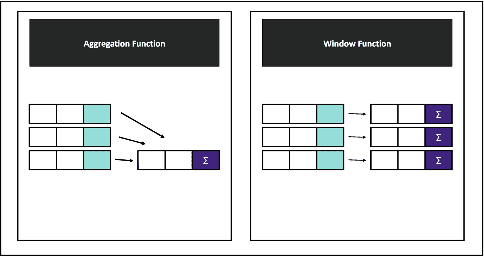

# 5. 聚合操作

SQL 中的聚合操作是将聚合函数应用于数据表中已分组的子数据集的过程。为了实现这一点，聚合函数（如 `COUNT`、`SUM`、`AVG`、`MIN` 和 `MAX`）与 `GROUP BY` 子句结合使用，以计算特定数据组的值。通过这些操作，SQL 通过提取有意义的摘要和统计信息，为数据分析和决策提供了宝贵的见解。

## GROUP BY 简介

在 SQL 中，`GROUP BY` 允许将相同的数据分组在一起。SQL 中的 `GROUP BY` 子句允许我们根据一个或多个列对行进行分组。分组后，可以应用聚合函数来计算每个组的摘要统计信息。`GROUP BY` 子句的语法如下：

```
SELECT first_column, aggregate_function(second_column)
FROM table_name
WHERE condition
GROUP BY first_column;
```

这里，`first_column` 是用于对数据进行分组的列，`aggregate_function` 是一个从一组值中计算单个值的函数（如 `COUNT`、`SUM`、`AVG`、`MIN`、`MAX`），`second_column` 是应用聚合函数的列，`table_name` 指的是您正在查询的表，而 `WHERE` 条件在分组前过滤数据。

`GROUP BY` 子句可用于根据子句中指定的列将结果集划分为子组。分组列中的每个唯一值都会形成多个组。通过应用聚合函数为每个组赋予一个值。最终结果包含每个组的一行以及聚合值。

`GROUP BY` 子句对于数据聚合至关重要，因为它允许您汇总数据、分析趋势、创建报告和提高性能。`GROUP BY` 可以通过计算总计、平均值、最小值和最大值来汇总数据。在不同类别的数据中，`GROUP BY` 可用于识别模式和趋势。可以使用 `GROUP BY` 利用各种组的汇总信息创建报告。使用 `GROUP BY` 通常可以通过减少返回的数据量来提高查询性能。本章将详细阐述这些方面。它探讨了如何使用 `GROUP BY` 计算总计、平均值、最小值和最大值。此外，它还解释了如何结合使用聚合和窗口函数，使用嵌套 `GROUP BY` 进行更精细的分析，以及如何使用公共表表达式简化复杂查询。


## 核心聚合函数

在 SQL 中，聚合函数是进行数据计算的强大工具。这些函数使你能够从大型数据集中计算出有意义的统计数据，这对于数据的分析和报告至关重要。表 5-1 列出了 SQL 中最常用的聚合函数。

表 5-1 常用聚合函数

| 函数 | 用途 | 语法 |
| --- | --- | --- |
| `COUNT()` | 计算行数或非`NULL`值的数量 | `COUNT(column_name) 或 COUNT(*)` |
| `SUM()` | 计算数值列的总和 | `SUM(column_name)` |
| `AVG()` | 计算数值列的平均值 | `AVG(column_name)` |
| `MIN()` | 查找列中的最小值 | `MIN(column_name)` |
| `MAX()` | 查找列中的最大值 | `MAX(column_name)` |
| `STDDEV()` | 计算数值列的标准差 | `STDDEV(column_name)` |
| `VARIANCE()` | 计算数值列的方差 | `VARIANCE(column_name)` |
| `MEDIAN()` | 返回数值列的中位数 | `MEDIAN(column_name)` |
| `PERCENTILE_CONT()` | 使用连续分布计算百分位数 | `PERCENTILE_CONT(percentile) WITHIN GROUP (ORDER BY column_name)` |
| `PERCENTILE_DISC()` | 使用离散分布计算百分位数 | `PERCENTILE_DISC(percentile) WITHIN GROUP (ORDER BY column_name)` |
| `STRING_AGG()` | 将值连接成单个字符串 | `STRING_AGG(column_name, delimiter)` |
| `ARRAY_AGG()` | 将值聚合到一个数组中 | `ARRAY_AGG(column_name)` |
| `MODE()` | 查找列中最频繁出现的值 | `MODE()` |
| `BIT_AND()` | 计算所有非`NULL`输入值的按位`与` | `BIT_AND(column_name)` |
| `BIT_OR()` | 计算所有非`NULL`输入值的按位`或` | `BIT_OR(column_name)` |

借助这些聚合函数，可以完成广泛的数据汇总任务。它们不仅涵盖了最常见的统计分析、数据报告和聚合需求，也是任何使用 PostgreSQL 的人员的基础工具。要开始进行有效的数据分组、有意义的汇总和提取有价值的洞察的旅程，你需要将这些函数与 `GROUP BY` 结合使用。


## 第一个故事：繁华都市中的繁忙健身房

这个故事围绕一家在繁华都市中成功运营多年的繁忙健身房展开。健身房的数据分析师杰克帮助管理团队做出数据驱动的决策，以优化管理策略、提升客户满意度并增加盈利能力。健身房每天收集多种数据点，包括会员、课程、私教课程和整体客户活动信息。

健身房有几种会员类型，包括基础、标准和高级会员。它提供瑜伽、普拉提和动感单车等多种健身课程，并拥有一支进行一对一私教课程的教练团队。健身房将所有这些数据存储在一个关系型数据库中。杰克需要处理以下数据表。

第一张表是 `Members` 表，它包含健身房会员的信息，包括他们的会员类型。该表的图示见表 5-2。

表 5-2
会员表

| 会员 _ID | 名 | 姓 | 会员类型 | 加入日期 | 出生日期 | 电话号码 |
| --- | --- | --- | --- | --- | --- | --- |
| 1 | John | Doe | Premium | 2023-01-10 | 1985-02-20 | 555-1234 |
| 2 | Jane | Smith | Standard | 2022-08-15 | 1990-05-15 | 555-5678 |
| 3 | Emily | Johnson | Basic | 2023-03-20 | 1992-09-05 | 555-8765 |
| 4 | Michael | Brown | Premium | 2021-12-10 | 1988-11-23 | 555-4321 |
| 5 | Sarah | Davis | Standard | 2023-06-01 | 1987-07-30 | 555-6543 |

第二张表是 `Classes` 表，它包含关于健身房提供的不同课程的数据。表值见表 5-3。

表 5-3
课程表

| 课程 _ID | 课程名称 | 教练 | 课程类型 | 时间安排 | 最大容量 |
| --- | --- | --- | --- | --- | --- |
| 1 | Yoga | Alice Green | Fitness | Mon 9:00 AM | 20 |
| 2 | Pilates | Bob White | Fitness | Wed 7:00 PM | 15 |
| 3 | Spinning | Carol Black | Cardio | Fri 6:00 PM | 25 |
| 4 | Zumba | Dave Brown | Cardio | Sat 10:00 AM | 30 |
| 5 | HIIT | Eve Silver | Strength | Tue 8:00 AM | 20 |

如表 5-4 所示，`Attendance` 表记录了会员参加了哪些课程以及在什么日期参加。

表 5-4
出勤表

| 出勤 _ID | 会员 _ID | 课程 _ID | 出勤日期 |
| --- | --- | --- | --- |
| 1 | 1 | 3 | 2023-08-18 |
| 2 | 2 | 1 | 2023-08-19 |
| 3 | 1 | 4 | 2023-08-20 |
| 4 | 3 | 2 | 2023-08-20 |
| 5 | 4 | 5 | 2023-08-21 |

`Personal_Training_Sessions` 表记录了私教课程的详细信息，包括教练、会员、课程日期和时长，如表 5-5 所示。

表 5-5
私教课程表

| 课程 _ID | 教练姓名 | 会员 _ID | 课程日期 | 时长 _ 分钟 |
| --- | --- | --- | --- | --- |
| 1 | Tom Harris | 1 | 2023-08-17 | 60 |
| 2 | Nina Jordan | 2 | 2023-08-18 | 45 |
| 3 | Mike Scott | 3 | 2023-08-19 | 30 |
| 4 | Lisa White | 4 | 2023-08-19 | 60 |
| 5 | Tom Harris | 5 | 2023-08-20 | 45 |

最后一个表（见表 5-6）是 `Payments`，它记录了会员的所有付款，包括会员费、课程费和私教费。

表 5-6
付款表

| 付款 _ID | 会员 _ID | 付款日期 | 金额 | 付款类型 |
| --- | --- | --- | --- | --- |
| 1 | 1 | 2023-08-01 | 50 | Membership Fee |
| 2 | 2 | 2023-08-01 | 40 | Membership Fee |
| 3 | 1 | 2023-08-18 | 20 | Class Fee (Spinning) |
| 4 | 3 | 2023-08-19 | 60 | Personal Training Fee |
| 5 | 4 | 2023-08-20 | 50 | Class Fee (HIIT) |

杰克希望得到以下问题的答案。

1.  按会员类型划分，会员的平均年龄是多少？
2.  每位教练进行了多少次私教课程，这些课程的总时长是多少？
3.  每种付款类型产生的总收入是多少？会员费、课程费和私教费都是付款类型。
4.  每种类型的课程有多少会员参加，每门课程的总出勤次数是多少？
5.  按会员类型划分，有多少会员至少参加过一门课程，每位会员平均参加的课程数量是多少？

可以使用以下查询来计算不同会员类型会员的平均年龄：

```sql
SELECT  Membership_Type, CAST(AVG(DATE_PART('year', AGE(CURRENT_DATE, Date_of_Birth))) AS INTEGER) AS Avg_Age
FROM Members
GROUP BY Membership_Type;
```

在此查询中，`AGE(CURRENT_DATE, Date_of_Birth)` 函数计算当前日期 (`CURRENT_DATE`) 与个人出生日期 (`Date_of_Birth`) 之间的差值。结果是一个表示个人年龄（年、月、日）的时间间隔。使用 `DATE_PART('year', AGE(...))`，你可以从 `AGE()` 返回的间隔中获取年数，同时忽略月和日。这提供了个人以完整年份计算的年龄。`AVG(DATE_PART(...))` 是一个聚合函数，计算所有行中以年为单位的平均年龄。`CAST(... AS INTEGER)` 被使用是因为 `AVG()` 的结果可能有小数位，所以 `CAST(... AS INTEGER)` 将结果转换为整数。这会丢弃任何小数部分，并提供一个整数以便于阅读。通过了解各年龄段会员的典型年龄构成，健身房可以提供定制化的服务和营销。需要注意的是，`DATE_PART` 和 `AGE` 函数是用于处理日期的标准 PostgreSQL 函数。`CURRENT_DATE` 和 `CAST` 的使用也是标准的。

注意

`AGE(timestamp1, timestamp2)` 函数计算两个日期或时间戳之间的差值，并将结果作为 `interval(年, 月, 日等)` 返回。需要注意的是，如果在 `AGE(timestamp2)` 中只给出一个参数，PostgreSQL 会假定 `CURRENT_DATE` 是较近的日期。例如，`SELECT AGE('2024-01-01', '1990-01-01')` 返回从 1990 年 1 月 1 日到 2024 年 1 月 1 日的时间间隔，显示年龄类似 `34 years 0 months 0 days`。另外，`DATE_PART()` 函数从日期或间隔中提取特定的 `part`（如年、月或日），`part` 是你想要提取的日期或间隔的一部分，例如年、月或日。`date` 是你想要从中提取值的日期或间隔。例如，`SELECT DATE_PART('year', '2024-09-22')` 返回 `2024`，因为它从该日期中提取了年份。

表 5-7 说明了基于会员类型的平均年龄计算。

表 5-7
基于会员类型的平均年龄

| 会员类型 | 平均年龄 |
| --- | --- |
| Premium | 38 |
| Standard | 36 |
| Basic | 32 |

通过以下查询，你可以发现一位私教进行了多少次课程以及每次课程花了多少时间，这些是评估教练工作量和绩效的重要指标。

```sql
SELECT Trainer_Name,  COUNT(Session_ID) AS Total_Sessions, SUM(Duration_mins) AS Total_Duration
FROM  Personal_Training_Sessions
GROUP BY Trainer_Name;
```

该查询通过计算每位教练进行的培训课程总数及其累计时长，提供了对每位私教表现的洞察。通过使用 `COUNT` 和 `SUM` 函数，你可以统计每位教练进行的课程次数，并计算在培训课程中花费的总分钟数。当按 `Trainer_Name` 分组时，每位教练的计算是分开的。利用这些信息，可以管理工作量并评估教练在健身房的贡献。表 5-8 显示了每位教练的私教课程次数和时长。

表 5-8
每位教练的培训课程及其时长

| 教练姓名 | 总课程数 | 总时长 |
| --- | --- | --- |
| Tom Harris | 2 | 105 |
| Nina Jordan | 1 | 45 |
| Mike Scott | 1 | 30 |
| Lisa White | 1 | 60 |

以下查询可以通过了解按付款类型划分的收入明细，帮助确定哪些服务对收入的贡献最大：

```sql
SELECT Payment_Type, SUM(Amount) AS Total_Revenue
FROM Payments
GROUP BY Payment_Type;
```

在此查询中，每种付款类型都是分开计算的。`SUM` 函数按 `Payment_Type` 分组汇总付款金额，包括会员费、课程费和私教费。如表 5-9 所示，这项分析使健身房管理层能够根据其主要收入来源，就定价策略、促销活动和资源分配做出明智的决策。

表 5-9
健身房的主要收入来源

| 付款类型 | 总收入 |
| --- | --- |
| Membership Fee | 90.00 |
| Class Fee (Spinning) | 20.00 |
| Personal Training Fee | 60.00 |
| Class Fee (HIIT) | 50.00 |

要确定有多少会员参加了健身房的每门课程，可以使用以下查询：

```sql
SELECT  C.Class_Name, COUNT(DISTINCT A.Member_ID) AS Number_of_Members, COUNT(A.Attendance_ID) AS Total_Attendances
FROM  Attendance A
JOIN Classes C ON A.Class_ID = C.Class_ID
GROUP BY C.Class_Name;
```

此查询为健身房提供的每门课程提供了两个关键指标。它们是至少参加过一节课的独立会员数量（通过 `COUNT(DISTINCT A.Member_ID))` 计算）和总出勤次数（通过 `COUNT(A.Attendance_ID)` 计算）。为了将出勤记录与课程名称匹配，它将 `Attendance` 表与 `Classes` 表连接起来。当按 `Class_Name` 对课程进行分组时，分析是针对每门课程单独进行的。如表 5-10 所示，健身房经理可以利用这些洞察来优化课程安排、更有效地分配资源，甚至根据会员偏好引入新课程。

表 5-10
每门课程的总出勤次数和会员数量

| 课程名称 | 会员数量 | 总出勤次数 |
| --- | --- | --- |
| Spinning | 1 | 1 |
| Yoga | 1 | 1 |
| Zumba | 1 | 1 |
| Pilates | 1 | 1 |
| HIIT | 1 | 1 |

可以使用以下嵌套查询来查找，按会员类型划分，至少参加过一门课程的会员数量，以及每位会员平均参加的课程数量。

```sql
SELECT M.Membership_Type, COUNT(DISTINCT M.Member_ID) AS Members_Attended, CAST(AVG(Sub.Class_Attended) AS DECIMAL(10, 2)) AS Avg_Classes_Per_Member
FROM Members M
JOIN
(SELECT Member_ID, COUNT(Attendance_ID) AS Class_Attended
FROM Attendance
GROUP BY Member_ID) Sub
ON M.Member_ID = Sub.Member_ID
GROUP BY M.Membership_Type;
```

此嵌套查询旨在分析课程出勤情况，以确定会员参与度。第一步，子查询找出每位会员参加的课程数量。然后，在主查询中将结果连接到 `Members` 表，并按 `Membership_Type` 对数据进行分组。这计算了每种会员类型的会员平均参加的课程数量。

如前所述，嵌套查询是嵌入在其他查询中的查询。在此查询中，子查询通过选择 `Member_ID` 并计算 `Attendance` 表中 `Attendance_ID` 的出现次数来计算每位会员参加的课程数量。之后，结果按 `Member_ID` 分组，给出会员列表及其各自的课程计数。然后给这个子查询一个别名 `Sub`，并在主查询中用于连接 `Members` 表。因此，主查询可以访问会员数据并对其进行聚合，以得出洞察，例如每种会员类型中有多少会员至少参加过一门课程，以及他们平均参加了多少门课程。表 5-11 显示了会员参与度，这对于了解每种会员类型的活跃程度很有用。这些洞察可用于定制健身房的服务或创建会员推广优惠。

表 5-11
基于会员类型的课程出勤分析

| 会员类型 | 参与会员数 | 人均平均课程数 |
| --- | --- | --- |
| Premium | 2 | 1.5 |
| Standard | 1 | 1 |
| Basic | 1 | 1 |

通过使用 SQL 的 `GROUP BY` 和聚合功能，这些查询揭示了关于健身房统计、参与度和收入的关键信息。下一节将讨论一个更高级的主题。


## 高级聚合技术：多步骤计算

本节讨论一个更高级的主题，称为`多步骤计算`。

### 多步骤计算：基础

对于需要多个计算步骤的复杂数据分析任务，可以结合使用子查询和嵌套聚合。子查询可以在主查询的多个位置使用，例如在`SELECT`、`FROM`或`WHERE`子句中。子查询通常返回临时结果，供主查询引用。本质上，你可以将复杂的操作分解成更小、更易于管理的查询，这些查询可用于为主查询执行特定的计算。为了实现嵌套聚合，子查询是常用的方法。执行多层级的聚合，即用一个聚合处理或聚合另一个聚合的结果，这被称为`嵌套聚合`。通常先进行子查询聚合，然后再应用另一层聚合。使用嵌套聚合的主要原因是计算需要多步骤计算的指标，例如组平均值、排名或聚合汇总。因此，你可以通过进行中间计算来对数据集执行复杂的聚合。

假设之前的故事场景：一个位于繁华都市的繁忙健身房。如果你想计算会员参加课程的平均次数，并按会员类型分组，你需要将其分解为两个步骤。首先，统计每个会员参加的课程数量，然后计算这些数量的平均值。第一个聚合通过子查询执行，统计每个会员的出勤情况；第二个聚合则通过外部查询执行，计算各会员类型会员的平均出勤次数。

```sql
SELECT M.Membership_Type, AVG(Sub.Class_Attended) AS Avg_Classes_Per_Member
FROM Members M
JOIN (SELECT Member_ID, COUNT(Attendance_ID) AS Class_Attended FROM Attendance GROUP BY Member_ID) AS Sub
ON M.Member_ID = Sub.Member_ID
GROUP BY M.Membership_Type;
```

在这里，子查询 `(SELECT Member_ID, COUNT(Attendance_ID) AS Class_Attended FROM Attendance GROUP BY Member_ID)` 计算每个会员参加的总课程数，然后外部查询执行第二次聚合，计算每个会员类型内会员参加课程的平均 `(AVG(Sub.Class_Attended))` 次数，按 `Membership_Type` 对数据进行分组。

结合子查询和嵌套聚合的优势在于，你可以获得更好的模块化、灵活性和复杂分析能力。子查询允许代码模块化，其中中间计算可以与主逻辑分离，使查询更具可读性且更易于调试。此外，使用子查询进行嵌套聚合提供了灵活性，可以执行在单次遍历中难以实现的多层级聚合。同时，这有助于创建复杂的分析，如排名、累积和与多步骤计算，其中一个聚合依赖于另一个聚合的结果。

### 使用窗口函数进行聚合

窗口函数是一种强大的 SQL 工具，允许你跨与当前查询行相关的一组行执行计算。与传统的聚合函数（如与`GROUP BY`一起使用的`SUM()`、`COUNT()`或`AVG()`）不同，窗口函数不会将多行折叠成单个结果。相反，它们在保持行结构的同时提供计算值。

#### 窗口函数定义

窗口函数在一组称为“窗口”的行上操作，该窗口由`OVER()`子句定义。`OVER()`子句指定了行应如何分组或分区以及如何评估。通过将窗口函数应用于窗口内的每一行，结果集不会被折叠。窗口函数涉及几个需要注意的关键概念。首先是分区。可以使用`PARTITION BY`子句根据一个或多个列将数据划分为组或“分区”。第二个概念是排序。使用`ORDER BY`子句，你可以指定每个分区内行的顺序。最后一个概念是框架。如果你想控制哪些行出现在窗口中，可以使用`ROWS`或`RANGE`选项，但这在简单聚合中较少需要。

窗口函数的基本语法如下：

```sql
<window_function>() OVER ( [PARTITION BY <partition_key>] [ORDER BY <order_key>] )
```

这里，`<window_function>()` 可以是任何 SQL 聚合或排名函数，例如 `SUM()`、`AVG()`、`COUNT()`、`ROW_NUMBER()`、`RANK()` 等。`OVER()` 子句指定了函数应操作的“窗口”或行集。`PARTITION BY` 将结果集划分为分区，类似于 `GROUP BY`，而 `ORDER BY` 定义了每个分区内行的顺序。

另外，使用 `ROWS` 或 `RANGE` 选项的窗口函数基本结构如下：

```sql
<window_function>() OVER (
PARTITION BY <partition_key>
ORDER BY <order_key>
{ROWS | RANGE} BETWEEN <start_bound> AND <end_bound>
)
```

这里，`ROWS` 根据物理行数定义窗口，而 `RANGE` 根据逻辑值（值范围）定义窗口。需要注意的是，`ROWS` 操作的是相对于当前行的特定数量的行，而 `RANGE` 操作的是值的范围（不一定是连续的行）。

注意

SQL 中的 `ORDER BY` 子句用于按一列或多列对查询的结果集进行排序。此子句允许你按字母顺序、数字顺序或日期顺序显示数据。该子句将在下一章中通过更多示例和故事进行介绍。简而言之，可以说 `ORDER BY` 的基本语法如下：

```sql
SELECT column_1, column_2
FROM table_name
ORDER BY column1 [ASC];
```

`ORDER BY column1` 指定要排序的列，`ASC` 表示数据按从小到大的升序排列。如果未指定，默认为 `ASC` 升序。同样，`DESC` 表示按降序对数据进行排序，即从大到小。


## 第二个故事：速驰汽车公司

在一家快速发展的汽车制造商，管理层很兴奋地从一张包含销售、客户和车辆信息的数据表中收集洞见。他们公司聘请了数据分析师安娜，来帮助他们理解数据，并提供有意义的见解以推动业务决策。公司收集汽车销售、客户人口统计、定价和生产的数据。安娜需要执行以下高级数据分析，以回答他们关键的业务问题。安娜正在处理表 5-12 所示的`汽车销售`表，该表包含汽车销售记录，包括地区、车型名称、销售日期和销售金额。

**表 5-12**
**汽车销售表**

| Sale_ID | Model_Name | Region | Sale_Date | Sales_Amount |
| --- | --- | --- | --- | --- |
| 1 | Speedster | North | 2024-01-01 | 25000 |
| 2 | Cruiser | South | 2024-01-03 | 20000 |
| 3 | Speedster | North | 2024-01-05 | 27000 |
| 4 | Zoomer | East | 2024-01-07 | 30000 |
| 5 | Speedster | West | 2024-01-10 | 28000 |
| 6 | Cruiser | South | 2024-01-12 | 22000 |
| 7 | Zoomer | North | 2024-01-15 | 26000 |
| 8 | Speedster | South | 2024-01-17 | 29000 |

安娜需要回答以下问题。

### 1. 识别各区域内的销售顺序

他们如何识别每个区域内汽车销售的顺序？

为了找到第一个问题的答案，安娜使用 `ROW_NUMBER()` 为每个区域内的每笔销售分配一个唯一的排名，按销售日期排序，以了解销售的序列。

```sql
SELECT Sale_ID, Region, Model_Name,
ROW_NUMBER() OVER (PARTITION BY Region ORDER BY Sale_Date) AS Sale_Rank
FROM Car_Sales;
```

该查询用于根据销售日期对每个区域内汽车的销售进行排名。该查询从 `Car_Sales` 表中检索四列：`Sale_ID`、`Region`、`Model_Name` 以及一个新计算的列 `Sale_Rank`，后者是使用 `ROW_NUMBER()` 窗口函数创建的。

首先，`SELECT Sale_ID, Region, Model_Name` 从 `Car_Sales` 表中检索唯一的销售标识符 (`Sale_ID`)、汽车销售的地区 (`Region`) 以及汽车的型号 (`Model_Name`)。然后，`ROW_NUMBER() OVER (PARTITION BY Region ORDER BY Sale_Date)` 使用 `ROW_NUMBER()` 窗口函数为特定分区内的每一行分配一个连续的行号（从 1 开始）。

安娜使用 `ROW_NUMBER()` 为每个区域内的每笔销售分配一个唯一的排名，按销售日期排序，以了解销售的序列。分区是通过 `Region` 列完成的，这意味着行号将为每个区域单独生成。在每个区域内，行按 `Sale_Date` 升序排列。这意味着最早的销售行号为 1，第二早的为 2，依此类推。计算出的行号在结果集中被赋予别名 `Sale_Rank` (`AS Sale_Rank`)，代表其所在区域内每笔销售的排名或顺序。

> **注意**
> `PARTITION BY` 是 SQL 中用于窗口函数的一个子句，用于将结果集划分为更小的组或分区。`PARTITION BY` 与 `GROUP BY` 的一个关键区别是，`PARTITION BY` 不会折叠行；它允许在每个分区中执行计算，同时保持所有行可见。`PARTITION BY` 允许窗口函数分别应用于每个分区。

结果将包含按同一区域内发生顺序排名的销售列表。对于跟踪销售序列或识别每个区域内随时间推移的第一、第二……笔销售，这尤其有用。表 5-13 显示了每笔销售在其区域内的排名。

**表 5-13**
**销售序列**

| Sale_ID | Region | Model_Name | Sale_Rank |
| --- | --- | --- | --- |
| 1 | North | Speedster | 1 |
| 3 | North | Speedster | 2 |
| 7 | North | Zoomer | 3 |
| 2 | South | Cruiser | 1 |
| 6 | South | Cruiser | 2 |
| 8 | South | Speedster | 3 |
| 4 | East | Zoomer | 1 |
| 5 | West | Speedster | 1 |

### 2. 按各区域总销售额对车型进行排名

他们如何按每个区域的总销售额对汽车车型进行排名？

此查询可用于基于每个区域的总销售额对汽车车型进行排名：

```sql
SELECT Model_Name, Region,
RANK() OVER (PARTITION BY Region ORDER BY SUM(Sales_Amount) DESC) AS Sales_Rank
FROM Car_Sales
GROUP BY Model_Name, Region;
```

该查询使用带有 `RANK()` 和 `PARTITION BY` 的窗口函数，基于每个区域内的总销售额对汽车车型进行排名。该查询选择了两列：`Model_Name` 和 `Region`。

然后，`RANK() OVER (PARTITION BY Region ORDER BY SUM(Sales_Amount) DESC) AS Sales_Rank` 使用 `RANK()` 函数，根据总销售额为每个车型在其区域内分配一个排名。

在此查询中，安娜使用 `RANK()` 按每个区域的总销售额对汽车车型进行排名。这里，总销售额相同的车型将获得相同的排名。`PARTITION BY Region` 将数据按地区划分为分区，因此排名计算会分别应用于每个区域。

通过使用 `ORDER BY SUM(Sales_Amount) DESC`，安娜根据总销售额 `SUM(Sales_Amount)` 对每个区域内的汽车车型进行排名，按降序排列。销售额最高的获得最高排名。需要注意的是，由于分区的原因，排名会为每个区域重置。

`GROUP BY Model_Name, Region` 被使用是因为安娜正在应用 `SUM(Sales_Amount)`。因此，该查询按 `Model_Name` 和 `Region` 对数据进行分组，以计算每个区域每个车型的总销售额。

最后，每个汽车车型根据总销售额在其区域内进行排名，销售额最高的车型排名第一。表 5-14 显示了各区域内按总销售额排名的汽车车型排名。

**表 5-14**
**按区域对汽车车型进行销售排名**

| Model_Name | Region | Sales_Rank |
| --- | --- | --- |
| Speedster | North | 1 |
| Zoomer | North | 2 |
| Cruiser | South | 1 |
| Speedster | South | 2 |
| Zoomer | East | 1 |
| Speedster | West | 1 |

### 3. 不跳过排名的车型排名（密集排名）

当销售额并列时，他们如何在不跳过排名的情况下对汽车车型进行排名？（当两个或多个车型在特定区域内的销售数量相同时，就发生了销售额并列。）

为了在销售额并列时不跳过排名地对汽车车型按销售额进行排名，下一个查询会顺序排名而没有间隔。为了回答第三个问题，当销售额并列时，车型排名不应有间隔。为了避免两个车型销售额相同时出现间隔，此查询使用 `DENSE_RANK()`：

```sql
SELECT Model_Name, Region,
DENSE_RANK() OVER (PARTITION BY Region ORDER BY SUM(Sales_Amount) DESC) AS Dense_Rank
FROM Car_Sales
GROUP BY Model_Name, Region;
```

该查询使用 `DENSE_RANK()` 窗口函数，基于每个区域内的总销售额对汽车车型进行排名。该查询选择两列：`Model_Name` 和 `Region`。

`DENSE_RANK() OVER (PARTITION BY Region ORDER BY SUM(Sales_Amount) DESC) AS Dense_Rank`，`DENSE_RANK()` 是一个窗口函数，它根据销售金额在区域内为每个车型分配一个排名。`DENSE_RANK()` 在销售额并列时不会产生间隔地对车型进行排名。`PARTITION BY Region` 按 `Region` 对数据进行分区，意味着排名将为每个区域单独计算。`ORDER BY SUM(Sales_Amount) DESC` 根据总销售额 (`SUM(Sales_Amount)`) 对汽车车型进行排名，销售额最高的车型排名最前。

> **注意**


与在出现并列时会跳过排名的`RANK()`不同，`DENSE_RANK()`不会跳过数字。如果两款车型的销售额相同，它们将共享相同的排名，而下一款车型的排名将紧随其后（无间隔）。最后一步是使用`GROUP BY Model_Name, Region`，根据`SUM(Sales_Amount)`计算每款车型在每个地区的总销售额。

该查询的结果是，在每个区域内，基于总销售额对车型进行密集排名，确保排名数字中不存在间隔，即使车型之间存在并列情况。表 5-15 展示了车型排名，即使总销售额出现并列，排名也不会跳过。

## 表 5-15：按销售额对车型进行的密集排名

| Model_Name | Region | Dense_Rank |
| --- | --- | --- |
| Speedster | North | 1 |
| Zoomer | North | 2 |
| Cruiser | South | 1 |
| Speedster | South | 2 |
| Zoomer | East | 1 |
| Speedster | West | 1 |

## 累计销售额计算

以下查询计算了每个车型随时间的累计销售额：

```sql
SELECT Sale_ID, Model_Name, Sale_Date,
SUM(Sales_Amount) OVER (PARTITION BY Model_Name ORDER BY Sale_Date) AS Cumulative_Sales
FROM Car_Sales;
```

Anna 使用带有 `OVER()` 子句的 `SUM()` 函数来计算每个车型按销售日期排序的累计销售总额。通过这个查询，从 `Car_Sales` 表中执行了每个车型的累计销售额计算。`SUM(Sales_Amount) OVER (PARTITION BY Model_Name ORDER BY Sale_Date)` 计算每个 `Model_Name` 按 `Sale_Date` 排序的销售累计总额。该方法返回 `Sale_ID`、`Model_Name`、`Sale_Date` 以及截至该次销售的累计销售额。表 5-16 显示了每个车型随时间的累计销售总额。

## 表 5-16：各车型累计销售额

| Sale_ID | Model_Name | Sale_Date | Cumulative_Sales |
| --- | --- | --- | --- |
| 1 | Speedster | 2024-01-01 | 25000 |
| 3 | Speedster | 2024-01-05 | 52000 |
| 5 | Speedster | 2024-01-10 | 80000 |
| 8 | Speedster | 2024-01-17 | 109000 |
| 2 | Cruiser | 2024-01-03 | 20000 |
| 6 | Cruiser | 2024-01-12 | 42000 |
| 4 | Zoomer | 2024-01-07 | 30000 |
| 7 | Zoomer | 2024-01-15 | 56000 |

## 移动平均值计算

为了计算每个车型在过去三次销售中的销售移动平均值，您可以使用以下查询。

```sql
SELECT Sale_ID, Model_Name, Sale_Date,
AVG(Sales_Amount) OVER (PARTITION BY Model_Name ORDER BY Sale_Date ROWS BETWEEN 2 PRECEDING AND CURRENT ROW) AS Moving_Avg
FROM Car_Sales;
```

Anna 使用 `AVG()` 窗口函数来计算每个车型在过去三次销售中的销售额移动平均值。通过此查询，基于 `Car_Sales` 表中的 `Sales_Amount`，计算了每个车型的移动平均值。为了计算平均值，查询使用了 `AVG()` 窗口函数。`PARTITION BY Model_Name` 按车型对数据进行分组。`ORDER BY Sale_Date` 按销售时间顺序排序。`ROWS BETWEEN 2 PRECEDING AND CURRENT ROW` 将窗口限制为包含当前销售和前两次销售。`Moving_Avg` 是每个车型随时间推移的销售额移动平均值。窗口框架决定了结果集中每一行的计算应包含哪些行。因此，`ROWS` 指定窗口框架由相对于当前行的特定行数定义（与 `RANGE` 的值范围相对）。`"BETWEEN 2 PRECEDING AND CURRENT ROW"` 在计算中包括了当前行及其前两行，而 `CURRENT ROW` 指的是当前行本身。因此，结果集中的每一行都将是基于（`ORDER BY Sale_Date` 确定的）前两行数据的平均值。当少于两个前置行时（例如，对于第一行或第二行），它将只计算现有的平均值。表 5-17 显示了每个车型最近三次销售的销售额移动平均值。

## 表 5-17：各车型销售移动平均值

| Sale_ID | Model_Name | Sale_Date | Moving_Avg |
| --- | --- | --- | --- |
| 1 | Speedster | 2024-01-01 | 25000 |
| 3 | Speedster | 2024-01-05 | 26000 |
| 5 | Speedster | 2024-01-10 | 26666 |
| 8 | Speedster | 2024-01-17 | 28000 |
| 2 | Cruiser | 2024-01-03 | 20000 |
| 6 | Cruiser | 2024-01-12 | 21000 |
| 4 | Zoomer | 2024-01-07 | 30000 |
| 7 | Zoomer | 2024-01-15 | 28000 |

## 按区域的销售排名

以下查询计算每个区域内各车型的总销售额，根据同一区域内的销售额对车型进行排名，并提供每个区域的总销售额。内部子查询首先通过汇总 `Car_Sales` 表中的 `Sales_Amount`，聚合每个区域内每款车型的总销售额。结果按 `Model_Name` 和 `Region` 分组，这意味着它计算了每个车型在每个区域的总销售额。外部查询随后增加了两个额外的计算：计算每个区域的总销售额，并根据销售额在每个区域内对车型进行排名。

```sql
SELECT Model_Name, Region, Total_Sales,
SUM(Total_Sales) OVER (PARTITION BY Region) AS Total_Sales_Region,
RANK() OVER (PARTITION BY Region ORDER BY Total_Sales DESC) AS Sales_Rank
FROM (
SELECT Model_Name, Region,
SUM(Sales_Amount) AS Total_Sales
FROM Car_Sales
GROUP BY Model_Name, Region
) AS AggregatedSales;
```

查询首先在内部子查询中聚合销售额，该子查询计算了 `Car_Sales` 表中每款车型（`Model_Name`）在每个区域（`Region`）的总销售额（`Total_Sales`），通过汇总 `Sales_Amount` 并按车型和区域对结果进行分组。在外部查询中，使用 `SUM(Total_Sales) OVER (PARTITION BY Region)` 计算每个区域内所有车型的总销售额。这提供了每个区域的总销售额，不考虑具体车型。然后，`RANK() OVER (PARTITION BY Region ORDER BY Total_Sales DESC)` 根据每个车型在其区域内的总销售额为其分配一个排名，销售额最高的排名第一。因此，该查询提供了每个车型的总销售额、其在每个区域内的排名以及区域本身的总销售额。这种方法对于按车型和区域分析汽车销售表现非常有用。表 5-18 显示了每个区域的总销售额，并根据销售额对车型进行了排名。

## 表 5-18：按区域的总销售额和排名

| model_name | Region | total_sales | total_sales_region | sales_rank |
| --- | --- | --- | --- | --- |
| Zoomer | East | 30000 | 30000 | 1 |
| Speedster | North | 52000 | 78000 | 1 |
| Zoomer | North | 26000 | 78000 | 2 |
| Cruiser | South | 42000 | 71000 | 1 |
| Speedster | South | 29000 | 71000 | 2 |
| Speedster | West | 28000 | 28000 | 1 |

## 总结

总而言之，Anna 使用 `ROW_NUMBER()`、`RANK()`、`SUM()` 和 `AVG()` 等窗口函数来分析 Speedy Motors 公司的汽车销售情况。分析内容包括识别销售序列、按区域对车型进行排名、计算累计销售额以及计算每个车型的移动平均值。她通过组合多种窗口函数，帮助公司做出数据驱动的决策。


### 窗口函数与传统聚合

窗口函数和传统聚合在 SQL 中服务于不同的目的。如前所述，传统聚合（使用`GROUP BY`结合`SUM()`、`COUNT()`、`AVG()`等函数）将行合并为分组的摘要。例如，如果你想要按区域统计总销售额，`GROUP BY`子句会按区域对数据进行分组，并为每个组返回一行。因此，在聚合过程中无法保留行级数据。另一方面，窗口函数使用`OVER()`在窗口内聚合行，但不会折叠结果集。在计算累计总量、排名或移动平均值时，每一行数据都会被保留。例如，`SUM(Sales) OVER (PARTITION BY Region ORDER BY Date)`计算每个区域的累计销售额，但所有原始行仍保留在输出中。

使用窗口函数与传统聚合的关键区别在于：聚合提供摘要数据，而窗口函数允许在行级基于聚合进行计算。在需要保留行级详细信息的情况下，窗口函数非常适合执行诸如排名、求和以及将单个数据点与组内平均值进行比较等任务。参见图 5-1。



图 5-1：窗口函数与传统聚合的比较

图 5-1 左侧展示了使用`GROUP BY`的聚合，它合并并隐藏了各个行。或者，右侧的窗口函数可以访问各个行并添加来自这些行的属性。总而言之，传统聚合可用于整体摘要，而窗口函数可用于更复杂的、行感知的分析。

### 组合多种聚合技术

将窗口函数与标准聚合相结合，可以构建更强大、更灵活的 SQL 查询。通过将行级详细分析与摘要分析相结合，你可以获得比单独使用任何一种方法更多的洞察。为了执行复杂分析，你可以将窗口函数（如`ROW_NUMBER()`和`RANK()`）与标准聚合函数一起使用。

#### 将窗口函数与标准聚合结合

以下示例演示了如何结合窗口函数和标准聚合。

表 5-19 所示的`Sales`表用于本节的所有查询。它包含单个销售的数据，包括`Customer_ID`、`Product_ID`、`Sale_Amount`、`Sale_Date`和`Region`。

表 5-19：销售表

| Sale_ID | Customer_ID | Product_ID | Sale_Amount | Sale_Date | Region |
| --- | --- | --- | --- | --- | --- |
| 1 | 101 | P001 | 500 | 2024-01-05 | North |
| 2 | 102 | P002 | 300 | 2024-01-08 | South |
| 3 | 101 | P003 | 200 | 2024-01-12 | North |
| 4 | 103 | P001 | 900 | 2024-01-15 | East |
| 5 | 104 | P002 | 600 | 2024-01-18 | West |
| 6 | 102 | P003 | 150 | 2024-01-22 | South |
| 7 | 101 | P002 | 700 | 2024-01-25 | North |
| 8 | 105 | P003 | 250 | 2024-01-30 | West |
| 9 | 103 | P001 | 400 | 2024-02-01 | East |
| 10 | 104 | P003 | 1000 | 2024-02-05 | West |

##### 示例：基于购买总额的客户细分

需要根据客户在特定时间范围内的总购买额进行排名，同时仍能看到单个销售记录。

```sql
SELECT Customer_ID,
COUNT(*) OVER (PARTITION BY Customer_ID) AS Total_Sales,
SUM(Sale_Amount) OVER (PARTITION BY Customer_ID) AS Total_Purchases,
ROW_NUMBER() OVER (PARTITION BY Customer_ID ORDER BY Sale_Date) AS Sale_Rank
FROM Sales;
```

`COUNT(*) OVER (PARTITION BY Customer_ID) AS Total_Sales`中，`COUNT(*)`是一个聚合函数，用于计数行数。`OVER (PARTITION BY Customer_ID)`窗口函数按`Customer_ID`对数据进行分区，意味着计数是为每个客户单独计算的。此列的每一行都显示了该客户的销售总次数。行没有被折叠，因此客户的每个销售行都显示相同的总销售次数。`SUM(Sale_Amount) OVER (PARTITION BY Customer_ID)`是一个窗口函数，它计算每个客户的总购买额而不折叠行。`ROW_NUMBER() OVER (PARTITION BY Customer_ID ORDER BY Sale_Date)`基于销售日期为每个客户的每次销售分配一个行号。通过这种方式，你可以看到每次销售、每个客户的总购买金额以及销售发生的顺序。

表 5-20 显示了每个客户的销售次数和总购买额，同时按日期对单个销售进行排名。`Total_Sales`列显示每个客户进行了多少次销售。`Total_Purchases`显示客户花费的总金额。`Sale_Rank`为客户的每次销售分配一个数字，按销售日期排序。

表 5-20：按客户排名销售并计算总额

| Customer_ID | Total_Sales | Total_Purchases | Sale_Rank |
| --- | --- | --- | --- |
| 101 | 3 | 400 | 1 |
| 101 | 3 | 1400 | 2 |
| 101 | 3 | 1400 | 3 |
| 102 | 2 | 450 | 1 |
| 102 | 2 | 450 | 2 |
| 103 | 2 | 1300 | 1 |
| 103 | 2 | 1300 | 2 |
| 104 | 2 | 1600 | 1 |
| 104 | 2 | 1600 | 2 |
| 105 | 1 | 250 | 1 |

#### 嵌套 GROUP BY 与窗口函数

为了进行更深入的分析，你可以将窗口函数与嵌套的`GROUP BY`结合使用。


## 分区内的 Top-N 分析

此处的目标是根据三个最盈利的客户，确定每个地区付费最高的三个客户。

```
WITH CustomerTotals AS (
SELECT Customer_ID, Region, SUM(Sale_Amount) AS Total_Purchase
FROM Sales
GROUP BY Customer_ID, Region
)
SELECT
Customer_ID,
Region,
Total_Purchase,
RANK() OVER (PARTITION BY Region ORDER BY Total_Purchase DESC) AS Region_Rank
FROM CustomerTotals
WHERE Customer_ID IN (
SELECT Customer_ID
FROM (
SELECT
Customer_ID,
Region,
Total_Purchase,
RANK() OVER (PARTITION BY Region ORDER BY Total_Purchase DESC) AS Region_Rank
FROM CustomerTotals ) AS RankedCustomers
WHERE Region_Rank <= 3 );
```

此 SQL 查询使用一个名为 `CustomerTotals` 的*公共表表达式*（CTE）来以结构化方式计算并组织客户购买数据。该 CTE 首先通过汇总 `Sales` 表中的 `Sale_Amount` 并按客户和地区分组，为每个客户 `Customer_ID` 在每一个地区 `Region` 聚合总购买金额 `Total_Purchase`。此步骤将聚合逻辑分离出来，生成一个简洁的结果集，其中包含每个客户在每个地区的一行记录，汇总了他们的总消费。

在主查询中，这些聚合数据使用 `RANK()` 窗口函数进行进一步处理。该函数按 `Region` 对数据进行分区，并按 `Total_Purchase` 的降序对结果排序，为每个客户在其各自地区内分配一个排名。为了识别表现最佳的客户，查询应用了一个过滤器。只有区域排名小于或等于三的客户才会被选中，从而有效地将输出限制为每个地区消费最高的三个客户。此过滤是通过在排名结果中嵌套另一个查询并使用 `WHERE Region_Rank <= 3` 子句来完成的。最终的 `SELECT` 返回 `Customer_ID`、`Region`、`Total_Purchase` 及其在该地区的排名。

使用 CTE 通过清晰地将总购买聚合与排名和过滤逻辑分开，提高了查询的可读性和可维护性。这种方法通过只计算一次总数并在不重复计算的情况下多次引用它们来避免冗余，类似于使用一个临时的、命名的结果集。在复杂的分析查询中，CTE 简化了调试，通过重用增强了性能，并使 SQL 未来更易于扩展或修改。

> 注意
> 公共表表达式是可以在 `SELECT`、`INSERT`、`UPDATE` 或 `DELETE` 查询中引用的临时结果集。它们使用 `WITH` 关键字定义，并提供了一种编写更清晰、更易读查询的方法，特别是对于复杂的多步操作。CTE 的概念类似于子查询，但它们更易于阅读和重用。CTE 的基本语法可以总结如下：

```
WITH cte_name AS (
SELECT columns
FROM table
WHERE conditions
)
SELECT * FROM cte_name;
```

表 5-21 显示了基于总购买额的每个地区前两名客户。

**表 5-21 各地区按总购买额排列的客户**

| Customer_ID | Region | Total_Purchase | Region_Rank |
| --- | --- | --- | --- |
| 101 | North | 1400 | 1 |
| 102 | South | 450 | 1 |
| 103 | East | 1300 | 1 |
| 104 | West | 1600 | 1 |
| 105 | West | 250 | 2 |

## 结合使用聚合函数和 ROW_NUMBER()

除了计算跨分区的聚合度量（如 `SUM()` 或 `COUNT()`）外，你还可以计算行级别的详细信息和排名。

### 示例：统计每个客户的订单数并为销售排名

要计算每个客户的销售总数、为每次销售排名，并确定每个客户的总购买金额，你需要计算销售总数。

```
SELECT
Customer_ID,
COUNT(*) OVER (PARTITION BY Customer_ID) AS Total_Sales,
SUM(Sale_Amount) OVER (PARTITION BY Customer_ID) AS Total_Purchases,
ROW_NUMBER() OVER (PARTITION BY Customer_ID ORDER BY Sale_Date) AS Sale_Rank
FROM Sales;
```

`COUNT(*) OVER (PARTITION BY Customer_ID)` 给出每个客户的销售总数。`SUM(Sale_Amount) OVER (PARTITION BY Customer_ID)` 计算每个客户的总销售额。`ROW_NUMBER()` 按销售日期对销售进行排名。表 5-22 显示了按客户统计的总销售次数和每次销售的排名。

**表 5-22 每个客户的总销售额和排名**

| Customer_ID | Total_Sales | Total_Purchases | Sale_Rank |
| --- | --- | --- | --- |
| 101 | 3 | 1,400 | 1 |
| 101 | 3 | 1,400 | 2 |
| 101 | 3 | 1,400 | 3 |
| 102 | 2 | 450 | 1 |
| 102 | 2 | 450 | 2 |
| 103 | 2 | 1,300 | 1 |
| 103 | 2 | 1300 | 2 |
| 104 | 2 | 1600 | 1 |
| 104 | 2 | 1600 | 2 |
| 105 | 1 | 250 | 1 |

## 使用公共表表达式（CTE）的高级查询结构

在 SQL 中，公共表表达式（CTE）表示一个可以在查询中引用的临时结果集。CTE 使用 `WITH` 关键字定义。简而言之，CTE 创建仅在查询执行期间存在的虚拟表。CTE 使复杂查询更具可读性；它将查询分解为逻辑上的、可管理的步骤。它提供了可重用的逻辑，通过定义一次结果集并在整个查询中重用它来避免重复。此外，通过使用 CTE，递归查询可以处理层次和递归结构。CTE 还可以通过将复杂的多步聚合分解为可管理的步骤来简化它们。CTE 允许你创建一个可以在主查询中引用的临时结果集。CTE 的基本语法如下所示：

```
WITH cte_name AS (
SELECT column1, column2
FROM table_name
WHERE conditions
)
SELECT *
FROM cte_name;
```

在查询中，使用 `WITH` 子句定义一个 CTE（`cte_name`），从 `SELECT` 语句创建一个临时结果集以供稍后使用。可以在主查询中引用此结果（`SELECT * FROM cte_name`）。它简化并提高了查询的可读性。

### 示例：使用高级指标进行客户细分

假设你想根据客户的总购买额将其分为高、中、低消费群体。可以先计算他们花费的总额，然后相应地分配到细分群体。

```
WITH CustomerPurchases AS (
SELECT Customer_ID, SUM(Sale_Amount) AS Total_Purchase
FROM Sales
GROUP BY Customer_ID
),
CustomerSegments AS (
SELECT Customer_ID, Total_Purchase,
CASE
WHEN Total_Purchase >= 1000 THEN 'High Spender'
WHEN Total_Purchase BETWEEN 500 AND 999 THEN 'Medium Spender'
ELSE 'Low Spender'
END AS Segment
FROM CustomerPurchases
)
SELECT * FROM CustomerSegments;
```

第一个 CTE `CustomerPurchases` 计算每个客户的总购买金额。第二个 CTE `CustomerSegments` 根据总购买额将客户分配到细分群体（`High`、`Medium` 和 `Low`）。这种方法使得将复杂查询分解为可管理的步骤更容易，并提高了可读性。表 5-23 显示了基于总购买额的客户细分。

**表 5-23 基于总购买额的客户细分**

| Customer_ID | Total_Purchase | Segment |
| --- | --- | --- |
| 101 | 1400 | High Spender |
| 102 | 450 | Low Spender |
| 103 | 1300 | High Spender |
| 104 | 1600 | High Spender |
| 105 | 250 | Low Spender |

## 结合使用 CTE 和 ROW_NUMBER() 进行 Top-N 分析

通过结合 CTE 和窗口函数，可以使 Top-N 分析变得更加复杂。


### 示例：查找整体消费金额最高的两位客户

```sql
WITH RankedCustomers AS (
SELECT Customer_ID, SUM(Sale_Amount) AS Total_Purchase,
ROW_NUMBER() OVER (ORDER BY SUM(Sale_Amount) DESC) AS Purchase_Rank
FROM Sales
GROUP BY Customer_ID
)
SELECT * FROM RankedCustomers
WHERE Purchase_Rank < 3;
```

`ROW_NUMBER()` 函数根据客户的总消费金额为其分配排名。`CTE` 用于计算每位客户的总消费、进行排名，然后筛选出前三名。表 5-24 展示了总消费最高的两位客户。

表 5-24

基于总消费的整体前两位客户

| Customer_ID | Total_Purchase | Purchase_Rank |
| --- | --- | --- |
| 104 | 1600 | 1 |
| 101 | 1400 | 2 |

## 数据分析必备的窗口函数

表 5-25 总结了 PostgreSQL 中最有用的一些窗口函数，并附有简要说明和使用示例。

表 5-25

最有用的窗口函数总结

| Window Function | Description | Example |
| --- | --- | --- |
| `ROW_NUMBER()` | 为分区内的每一行分配一个从 1 开始的唯一连续编号。 | `SELECT ROW_NUMBER() OVER (PARTITION BY Region ORDER BY Sale_Date) AS Row_Num FROM Car_Sales;` |
| `RANK()` | 为分区内的每一行排名，如果存在并列则跳过后续排名。 | `SELECT RANK() OVER (PARTITION BY Region ORDER BY Sales_Amount DESC) AS Sales_Rank FROM Car_Sales;` |
| `DENSE_RANK()` | 与 `RANK()` 类似，但并列后排名数字不留间隔。 | `SELECT DENSE_RANK() OVER (PARTITION BY Region ORDER BY Sales_Amount DESC) AS Dense_Sales_Rank FROM Car_Sales;` |
| `NTILE(N)` | 将结果集大致划分为 `N` 个组，并为每一行分配一个组号。 | `SELECT NTILE(4) OVER (ORDER BY Sales_Amount DESC) AS Quartile FROM Car_Sales;` |
| `SUM()` | 在指定窗口上计算列的累计或连续总和。 | `SELECT SUM(Sales_Amount) OVER (PARTITION BY Model_Name ORDER BY Sale_Date) AS Running_Total FROM Car_Sales;` |
| `AVG()` | 在指定窗口上计算列的平均值。 | `SELECT AVG(Sales_Amount) OVER (PARTITION BY Region ORDER BY Sale_Date) AS Avg_Sales FROM Car_Sales;` |
| `MAX()` | 返回分区或整个窗口内的最大值。 | `SELECT MAX(Sales_Amount) OVER (PARTITION BY Region) AS Max_Sale FROM Car_Sales;` |
| `MIN()` | 返回分区或整个窗口内的最小值。 | `SELECT MIN(Sales_Amount) OVER (PARTITION BY Region) AS Min_Sale FROM Car_Sales;` |
| `COUNT()` | 返回分区或整个窗口内的行数。 | `SELECT COUNT(*) OVER (PARTITION BY Model_Name) AS Sale_Count FROM Car_Sales;` |
| `FIRST_VALUE()` | 返回窗口帧内每一行的第一个值。 | `SELECT FIRST_VALUE(Sales_Amount) OVER (PARTITION BY Region ORDER BY Sale_Date) AS First_Sale FROM Car_Sales;` |
| `LAST_VALUE()` | 返回窗口帧内每一行的最后一个值。 | `SELECT LAST_VALUE(Sales_Amount) OVER (PARTITION BY Region ORDER BY Sale_Date) AS Last_Sale FROM Car_Sales;` |
| `LAG()` | 返回窗口帧中上一行的值。可用于将当前行与上一行进行比较。 | `SELECT LAG(Sales_Amount, 1) OVER (PARTITION BY Model_Name ORDER BY Sale_Date) AS Previous_Sale FROM Car_Sales;` |
| `LEAD()` | 返回窗口帧中下一行的值。可用于将当前行与下一行进行比较。 | `SELECT LEAD(Sales_Amount, 1) OVER (PARTITION BY Model_Name ORDER BY Sale_Date) AS Next_Sale FROM Car_Sales;` |

## 小结

本章探讨了在 SQL 中进行数据聚合的过程，这对于数据汇总和分析至关重要。通过理解如何将聚合函数与 `GROUP BY` 子句结合使用，您可以高效地计算特定数据组的总计、平均值和其他统计值。本章讨论的高级主题包括将聚合与窗口函数结合、使用嵌套 `GROUP BY` 进行更深入的分析，以及使用公共表表达式简化复杂查询。

### 关键点

*   `聚合函数与 GROUP BY 子句`：使用它们来高效计算特定数据组的统计信息。
*   `结合聚合与窗口函数`：结合使用 `SUM()`、`COUNT()`、`ROW_NUMBER()` 或 `RANK()` 等，既可以计算详细的行级指标，也可以计算聚合摘要。
*   `嵌套 GROUP BY 与窗口函数`：先使用 `GROUP BY` 聚合数据，然后应用窗口函数进行更深入的分析，例如分组内的前 N 名分析。
*   `CTEs (公共表表达式)`：通过将多步聚合查询拆分为独立的逻辑步骤来简化查询，使其更易于阅读和维护。

### 主要收获

*   `聚合函数`：`COUNT`、`SUM`、`AVG`、`MIN` 和 `MAX` 函数在处理分组数据时非常有用。
*   `GROUP BY 子句`：有效地组织数据以进行聚合，并以多种方式汇总结果。
*   `窗口函数`：将聚合函数与窗口函数结合，用于对分区数据进行高级分析。
*   `嵌套 GROUP BY`：探索嵌套的 `GROUP BY` 子句，以进行更深入、更精细的数据分析。
*   `公共表表达式 (CTEs)`：通过减少 SQL 代码中的 CTE 数量，使复杂查询更易于阅读和维护。

### 后续内容

下一章“使用 `ORDER BY` 和 `LIMIT` 整理数据顺序”将探讨如何高效地对查询结果进行排序和过滤。掌握此操作后，您将能够以有意义的方式组织数据。您可以优先关注关键信息，并限制结果以聚焦于最相关的数据点。

## 技能测试

一个数据库有三张表：`gym_memberships`（`Member_ID`，`Name`，`Membership_Type`，`Join_Date`，`City`），`classes`（`Class_ID`，`Class_Name`，`Category`，`Class_Date`，`Trainer_Name`）和 `attendance`（`Attendance_ID`，`Member_ID`，`Class_ID`，`Attendance_Date`，`Class_Fee`）。

1.  编写一个使用窗口函数的 SQL 查询，计算每位会员基于其课程出勤情况的总课程费用和排名。必须显示课程名称、会员 ID、总课程费用和排名。
2.  编写一个使用 `ROWS` 的查询，计算每位会员过去三节课（包括当前课程）的课程费用移动平均值。提供会员 ID、课程名称、出勤日期和课程费用平均值。
3.  编写一个使用 CTE 的查询，查找在课程上花费超过 500 美元的会员。必须显示会员姓名、课程费用金额和所在城市。
4.  编写一个使用嵌套 `GROUP BY` 的查询，找出每种会员类型中课程消费最高的前两名会员。显示会员 ID、会员类型和总课程费用。
5.  编写一个查询，使用窗口函数计算每位会员按课程日期排序的累计课程费用。提供一个表格，显示会员 ID、课程名称、课程日期、课程费用和累计费用。


