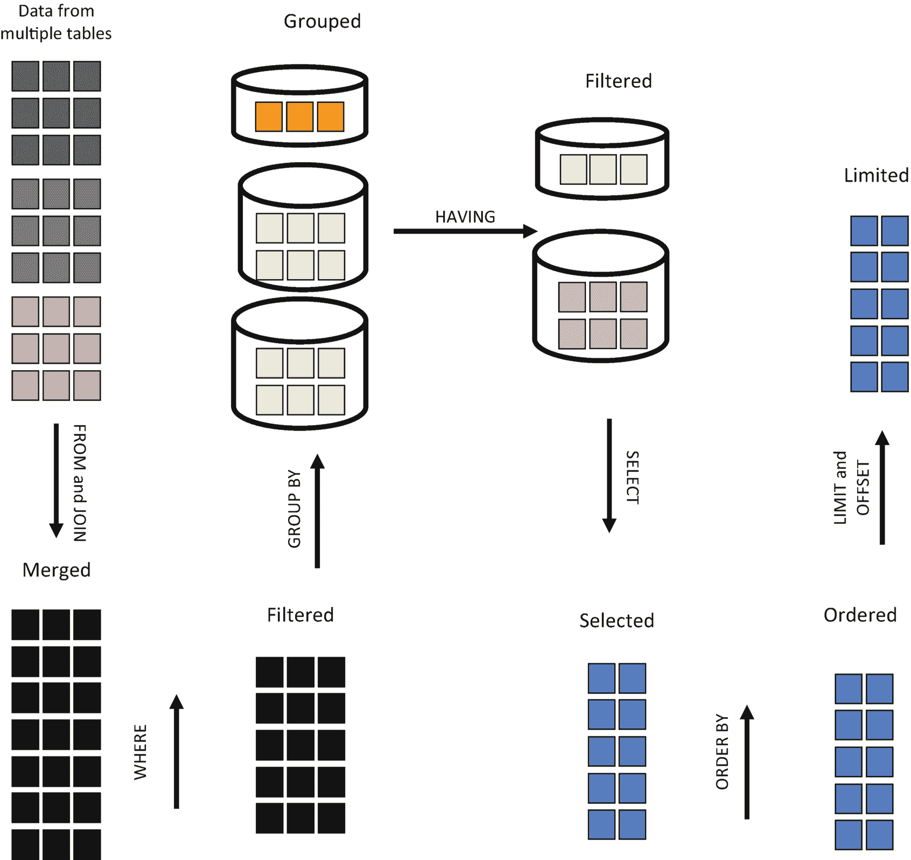
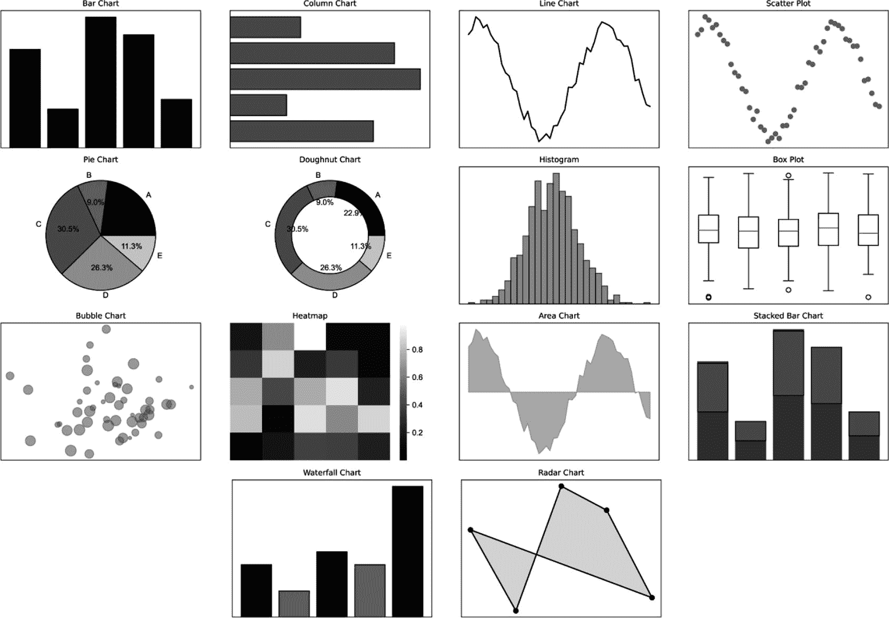

# 表 10-19

### 高消费客户

| customer_id | total_spent | Rank |
| --- | --- | --- |
| 4 | 280 | 1 |
| 3 | 160 | 2 |
| 1 | 90 | 3 |
| 5 | 60 | 4 |
| 2 | 50 | 5 |

要提取客户的电子邮件域名，以下查询使用了 `SPLIT_PART()` 函数：

```sql
SELECT
name,
email,
SPLIT_PART(email, '@', 2) AS domain
FROM customers;
```

## 表 10-20

### 提取出的客户电子邮件域名

| Name | Email | Domain |
| --- | --- | --- |
| Alice | `alice@mail.com` | `mail.com` |
| Bob | `bob@mail.com` | `mail.com` |
| Carol | `carol123@mail.com` | `mail.com` |
| David | `dave99@mail.com` | `mail.com` |
| Eve | `eve_wonder@mail.com` | `mail.com` |

要提取产品颜色，以下查询使用了 JSON 函数。

```sql
SELECT
name,
attributes->>'color' AS color
FROM products;
```

## 表 10-21

### 提取出的产品颜色

| Name | Color |
| --- | --- |
| T-Shirt | red |
| Jeans | blue |
| Jacket | black |
| Sneakers | white |
| Hoodie | gray |

要处理缺失的库存数据并使用默认值，以下查询使用了控制函数来确保当库存数据缺失时显示 "Out of Stock"：

```sql
SELECT
name,
COALESCE(CAST(stock AS TEXT), 'Out of Stock') AS stock_status
FROM products;
```

## 表 10-22

### 库存数据值

| Name | stock_status |
| --- | --- |
| T-Shirt | 100 |
| Jeans | 50 |
| Jacket | 30 |
| Sneakers | 40 |
| Hoodie | 25 |

要使用特定的自定义函数计算客户忠诚度分数，以下查询创建了一个基于客户消费总额来分配“忠诚度分数”的函数。

首先，Mary 定义了一个 `calculate_loyalty_score` 函数，该函数根据客户的总消费额对其进行分类。

```sql
CREATE FUNCTION calculate_loyalty_score(total_spent NUMERIC)
RETURNS TEXT AS $$
BEGIN
IF total_spent >= 1000 THEN
RETURN 'Platinum';
ELSIF total_spent >= 500 THEN
RETURN 'Gold';
ELSIF total_spent >= 200 THEN
RETURN 'Silver';
ELSE
RETURN 'Bronze';
END IF;
END;
$$ LANGUAGE plpgsql;
```

然后，她在查询中使用该函数对客户进行分类：

```sql
SELECT
name,
total_spent,
calculate_loyalty_score(total_spent) AS loyalty_level
FROM customers;
```

此函数实现了客户分类的自动化，帮助业务根据消费水平提供个性化促销，如表 10-23 所示。

## 表 10-23

### 客户分类

| Name | total_spent | loyalty_level |
| --- | --- | --- |
| Alice | 300.5 | Silver |
| Bob | 150 | Bronze |
| Carol | 450.75 | Silver |
| David | 1200 | Platinum |
| Eve | 550.25 | Gold |

最后，要获取数据库版本和当前用户，以下查询使用了系统函数。结果显示在表 10-24 中。

## 表 10-24

### 数据库版本和当前用户

| Version | current_user |
| --- | --- |
| PostgreSQL 14.17 (Debian 14.17-1.pgdg120+1) on x86_64-pc-linux-gnu, compiled by gcc (Debian 12.2.0-14) 12.2.0, 64-bit | user_43c2bv266_43c9rcy88 |

```sql
SELECT version(), current_user;
```

## 使用分析工具分解复杂问题

要用 SQL 点“数”成金，掌握一套称为 *递归查询* 的高级分析工具至关重要。递归查询允许你将复杂问题分解为更小、更易于管理的步骤。*递归公共表表达式*（RCTEs）对于处理层次化数据特别有用，例如分析组织结构或网络流。这些功能使分析师能够围绕他们的数据构建一个连贯的叙述，揭示有助于他们做出明智决策的洞见。

CTE 与递归查询的结合使你能够以模块化和可读性高的方式构建查询。使用 CTE 可以将复杂问题分解为更小、更易于管理的步骤，从而提高查询的清晰度和效率。你无需编写嵌套的子查询，而是可以使用 CTE 定义中间结果，并在主查询中引用它们，从而使 SQL 查询更易于理解和维护。这种模块化方法允许独立审查每个步骤，从而改进调试和优化。

前面章节已经提到，CTE 是一个可以在查询中引用的临时结果集。因此，查询更具可读性和结构性，大型查询可以被分解为更小的步骤。

```sql
WITH cte_name AS (
SELECT column1, column2
FROM table_name
WHERE condition
)
SELECT * FROM cte_name;
```

这里，一个名为 `cte_name` 的 CTE 创建了一个临时结果集。该 CTE 从 `table_name` 中选择 `column1` 和 `column2`，条件是满足特定条件。然后，主查询从这个临时结果集中选择所有列。相应地，作为一个示例，以下查询从销售表中查找每个产品类别的总销售额。通过使用 CTE，使其更易于阅读和维护。

```sql
WITH category_sales AS (
SELECT category, SUM(sales) AS total_sales
FROM sales_data
GROUP BY category
)
SELECT * FROM category_sales;
```

这里，CTE `category_sales` 计算每个类别的总销售额。为了使 SQL 更易于阅读和维护，主查询只是简单地从 `category_sales` 中检索结果。

递归 CTE 是一种特殊类型的 CTE，它引用自身。这使其能够处理层次或序列数据，例如组织结构、网络中的路径或父子关系。它由两个关键部分组成：基本查询和递归查询。*基本查询*是初始数据集，而*递归查询*调用 CTE 本身，重复获取下一层级的数据。

```sql
WITH RECURSIVE cte_name AS (
-- 基本查询：选择起始点
SELECT column1, column2
FROM table_name
WHERE condition
UNION ALL
-- 递归查询：调用自身以获取相关数据
SELECT t.column1, t.column2
FROM table_name t
JOIN cte_name c ON t.related_column = c.column1
)
```

此查询采用了一个 `RECURSIVE` CTE，包含两个主要部分。基本查询通过从 `table_name` 中选择满足特定条件的 `column1` 和 `column2` 来建立起点。因此，这构成了第一层结果。递归部分将表递归连接回先前的结果（这些结果存储在 CTE 本身中）。它使用 `t.related_column` 和 `c.column1` 之间的关系，逐步构建多个层级的关联数据。每次迭代都会添加新行，直到没有找到匹配的行为止。这种技术对于遍历树结构（如组织结构、物料清单展开或网络路径）特别有用，尤其是在事先不知道其深度的情况下。递归会持续进行，直到达到自然的终止点，即不再添加新行时停止。例如，以下查询希望从一个包含 `id`、`name` 和 `manager_id` 的员工表中，找到特定经理下的所有员工。


## 递归 CTE：构建层次查询

```
WITH RECURSIVE employee_hierarchy AS (
-- 基础情况：选择顶级经理（CEO）
SELECT id, name, manager_id, 1 AS level
FROM employees
WHERE manager_id IS NULL
UNION ALL
-- 递归情况：查找向当前层级汇报的员工
SELECT e.id, e.name, e.manager_id, eh.level + 1
FROM employees e
JOIN employee_hierarchy eh ON e.manager_id = eh.id
)
```

该查询从 CEO 开始，递归查找其下属的所有员工，并动态分配层级。此查询使用名为 `employee_hierarchy` 的递归 CTE 来生成组织汇报结构的层次视图。查询包含两个协同工作以构建完整组织层次结构的主要组件。基础情况通过从 `Employees` 表中选择顶级经理（通常是 CEO）来建立起点，其特征是 `manager_id` 列为 `NULL` 值。此查询选择经理的 `id`、`name` 和 `manager_id`，同时分配一个级别值 1 以指示层次结构中的顶级位置。这是结果集的第一行，并作为递归的基础。

递归部分随后将 `Employees` 表与先前生成的结果（存储在 `employee_hierarchy` CTE 中）进行连接。它查找所有 `manager_id` 与当前结果集中某人 ID 匹配的员工，本质上是识别所有直接下属。对于这些员工中的每一个，它将级别值增加 1，表明他们在层次结构中比其经理低一级。这个递归过程自动进行，每次迭代都查找向在上一轮迭代中发现的经理汇报的员工。此过程持续进行，直到找不到更多匹配的员工。

通过这种递归方法，此查询可以高效地遍历整个组织结构，无论其深度如何。这会产生包含适当级别指示符的完整汇报关系图。这使得无需提前知道有多少层级即可可视化复杂的组织层次结构。

CTE 和递归 CTE 是强大的工具，可以使 SQL 查询更具结构性、可读性和效率。表 10-25 说明了 CTE 和 RCTE 之间的关键区别。

表 10-25

CTE 和 RCTE 的关键区别

| 特性 | 标准 CTE | 递归 CTE |
| --- | --- | --- |
| 目的 | 组织复杂查询 | 处理层次或顺序数据 |
| 是否调用自身 | 否 | 是 |
| 用例 | 筛选、分组、聚合 | 组织层次结构、图遍历 |
| 查询执行 | 运行一次 | 迭代运行，直到没有行匹配 |

## 第二个故事：为民事登记处分析家谱

民事登记过程是保存城市公民和居民生活事件（如出生、婚姻和死亡）记录的地方。Jane 打算在祖先研究部门工作，她将分析从这些记录中收集的数据。Jane 的任务是分析一个家谱数据集。该数据集包括有关个人及其直系父母的信息。使用 RCTE，她将解决与家族血统相关的各种挑战。对于 Jane 的分析之旅，表 10-26 包含了与公民和居民相关的数据。

表 10-26

family_tree 表

| ID | 姓名 | parent_id | 出生年份 |
| --- | --- | --- | --- |
| 1 | Alice | `NULL` | 1950 |
| 2 | Bob | 1 | 1975 |
| 3 | Carol | 1 | 1978 |
| 4 | Dave | 2 | 2000 |
| 5 | Eve | 3 | 2003 |
| 6 | Frank | 2 | 2005 |
| 7 | Grace | 5 | 2028 |

给定这些数据，Jane 希望完成以下任务：

*   检索 Alice 的所有后代及其世代深度。
*   列出 Grace 的所有祖先，追溯世代。
*   识别家谱中最长的祖先链。
*   为每个血统找出最年长祖先与最年轻后代之间的年龄差。

以下查询将检索 Alice 的所有后代及其世代深度：

```
WITH RECURSIVE descendants AS (
-- 基础情况：从 Alice 开始
SELECT id, name, parent_id, birth_year, 1 AS generation
FROM family_tree
WHERE name = 'Alice'
UNION ALL
-- 递归情况：查找上一世代的孩子
SELECT f.id, f.name, f.parent_id, f.birth_year, d.generation + 1
FROM family_tree f
JOIN descendants d ON f.parent_id = d.id
)
SELECT * FROM descendants;
```

为了在家族树中找到 Alice 的所有后代，此 SQL 查询使用 `WITH RECURSIVE` 子句构建了一个递归查询。此查询首先从 `family_tree` 表中选择所有数据，包括关于 Alice 当前祖先的信息，然后递归地调用自身（即 `descendants` CTE）来查找该祖先的所有孩子。此 CTE 将根据 `parent_id` 将 `family_tree` 表的每一行连接到 Descendants 表，逐步探索家族树，最终返回 Alice 的所有后代的列表，包括他们的 ID、姓名、父 ID 和出生年份。

注意

`WITH RECURSIVE` 子句的一部分在 `descendants` CTE 内定义了一个名为 `generation` 的新列。它在跟踪家族树中每个人祖先的“层级”或“深度”方面起着至关重要的作用。在之前的查询中，`1 AS generation` 部分声明并命名了一个名为 `generation` 的列，该列将被添加到递归 CTE 生成的每一行中。为基本情况（Alice）分配的值 `1` 确立了计算世代深度的起点。随着查询递归进行，沿着家族树向下移动，`generation` 值每代增加一。Alice 在第一代，所以她是起点。Bob 的孩子将在第二代，因为他们距离 Alice 有一代之隔。第三代指的是 Alice 的孙辈。`generation` 列允许您组织和可视化家族树。利用亲代血统，它构建了一个祖先关系的数字层次结构。

表 10-27 说明了 Alice 的所有后代及其世代深度。

表 10-27

Alice 的后代及其世代深度

| ID | 姓名 | parent_id | 出生年份 | generation |
| --- | --- | --- | --- | --- |
| 1 | Alice | `NULL` | 1950 | 1 |
| 2 | Bob | 1 | 1975 | 2 |
| 3 | Carol | 1 | 1978 | 2 |
| 4 | Dave | 2 | 2000 | 3 |
| 5 | Eve | 3 | 2003 | 3 |
| 6 | Frank | 2 | 2005 | 3 |
| 7 | Grace | 5 | 2028 | 4 |

以下查询提供了 Grace 的所有祖先的列表，并追溯世代：


## 本章概述

本章重点介绍了 SQL 函数在增强数据分析和洞察提取方面的功能。它探讨了使用汇总函数进行总结、统计和数学函数获取数值洞察，以及窗口函数进行趋势分析等操作和分析数据的技巧。此外，值函数、排名函数、字符串函数、日期时间函数、JSON 函数、控制函数和系统函数允许进行更深入的数据探索和转换。而且，SQL 简化了生成有洞察力的摘要和进行层次数据分析的过程。这些技术共同提升了对数据的整体理解，使复杂数据集更易于访问和处理。

### 核心要点

*   SQL 函数通过实现强大的计算、筛选和转换功能来增强数据分析，从而获得更深入的洞察。
*   递归查询与公共表表达式（CTE）的结合，将复杂问题分解为可管理的步骤，实现了层次化数据分析。
*   自定义 SQL 函数允许用户通过定义可重用的逻辑来进行专业计算，从而扩展 SQL 的能力。
*   利用这些 SQL 函数，数据工作流程变得更加高效，有助于做出更好的决策并获得可操作的洞察。

### 关键收获

*   **多样的数据处理能力**：SQL 函数为聚合、筛选和转换数据以发掘更深层次洞察提供了强大的工具。
*   **高级分析能力**：利用统计、数学和窗口函数执行复杂的计算。
*   **高效的层次分析**：递归公共表表达式（RCTE）有助于分解复杂关系。
*   **数据结构处理**：利用 JSON、字符串和日期函数来有效管理和操作结构化及半结构化数据。
*   **自定义功能扩展**：定义可重用的 SQL 函数以封装逻辑，并简化重复性计算，从而提高工作流程效率。

### 后续展望

下一章，“大结局：讲述你的数据故事”，将探讨如何以最佳方式呈现你的数据故事。同时也会分享一些总结性的思考，包括有效的数据故事展示技巧，以及通过创建可重用、高效的工作流程来增强数据解读的建议。


## 测试你的技能

Emma 是学者学院的一名数据分析师，该校不同年级的学生参加一年一度的“卓越竞赛”。学校管理层需要了解学生在不同科目和类别的表现。他们要求 Emma 根据表 10-31 中的数据回答以下问题：

**表 10-31**

`competition_results`（竞赛结果）表

| student_id | 姓名 | 年级 | 科目 | 分数 | 竞赛年份 |
| --- | --- | --- | --- | --- | --- |
| 101 | Alice | 9 | 数学 | 92 | 2024 |
| 102 | Bob | 10 | 科学 | 78 | 2024 |
| 103 | Charlie | 9 | 数学 | 85 | 2024 |
| 104 | David | 11 | 文学 | 65 | 2024 |
| 105 | Emma | 10 | 科学 | 88 | 2024 |

1.  哪些学生在每个科目中表现最佳，并在他们的年级内进行排名？
2.  每个科目的平均分是多少？不同年级之间如何比较？
3.  百分之多少的学生分数高于 90 分（优秀）以及低于 50 分（待提高）？
4.  学生在核心科目（数学、科学）的分数在不同竞赛年份中有何变化？
5.  与去年的竞赛相比，有多少比例的学生在同一科目上提高了分数？
6.  哪些学生在所有科目中的总分最高？
7.  每个年级有多少学生参加，每个年级的中位数分数是多少？
8.  每个科目的最高分、最低分和平均分是多少？
9.  是否可以创建一个函数，根据学生的表现水平（优秀、良好、平均、待提高）对他们进行分类？

## 11. 最终章：呈现你的数据故事

你的旅程即将结束。整个旅程贯穿了每一章，包含了使用 SQL 查询进行数据分析的故事。通过一章又一章的故事，你已经学会了如何从原始数据中提取更深层次的见解和信息，以解决复杂和高级的分析问题。本章旨在总结前面的章节，并为呈现数据分析叙事提供见解。在本章之前，各章主要通过叙事来教授数据分析和 SQL 查询编写。然而，本章更侧重于为已掌握足够查询编写技能的读者提供一种数据分析的思维方式。

## 数据故事讲述的艺术

数据分析中的故事讲述，是以一种引人入胜且易于理解的方式呈现数据驱动的见解的实践。不仅仅是展示原始数字、表格或图表，故事讲述有助于传达数据的含义及其重要性。它将复杂的发现转化为人们能够产生共鸣的叙事，从而更容易理解趋势、模式和结论。数据故事讲述包含四个基本要素：数据、叙事、可视化和可操作的见解。数据由事实、数字和统计结果组成，为故事讲述提供了基础。叙事是结构化的解释，为数据提供背景，使其具有意义。像图表、图形和仪表板这样的可视化元素支持并强化了故事。最后，可操作的见解是指导决策或战略规划的结论。

### 查询编写对于数据故事讲述的重要性

在数据故事讲述中，SQL 在提取、转换和分析数据以创建有意义的叙述方面扮演着至关重要的角色。编写良好的 SQL 查询能让分析师高效地检索相关数据、发掘见解，并以结构化的方式呈现发现。如果没有强大的查询编写技能，数据故事讲述就会缺乏准确性、深度和清晰度。

#### 为故事提取正确的数据

数据分析中的故事讲述始于检索相关且准确的数据。SQL 使分析师能够筛选和组织数据，确保分析中只包含必要的信息。表 11-1 提供了一个结构化表格，总结了用于为故事讲述提取正确数据的 SQL 语句、子句、操作和函数。

**表 11-1**

用于为故事讲述提取正确数据的 SQL 语句、子句、操作和函数

| 类别 | SQL 组件 | 用途 |
| --- | --- | --- |
| SQL 语句 | `SELECT` | 从表中检索特定数据 |
| | `FROM` | 指定要查询的表 |
| | `WHERE` | 根据条件筛选数据 |
| | `GROUP BY` | 按特定列聚合数据 |
| | `ORDER BY` | 以升序或降序对结果排序 |
| | `JOIN` | 组合来自多个表的数据 |
| | `LIMIT` | 限制返回的行数 |
| | `HAVING` | 筛选聚合后的结果 |
| SQL 子句 | `DISTINCT` | 删除重复值 |
| | `AS` | 重命名列以提高可读性 |
| | `IN / NOT IN` | 匹配指定列表中的值 |
| | `BETWEEN` | 筛选某个范围内的数据 |
| | `LIKE` | 在文本中搜索模式 |
| SQL 操作 | 算术 (+, -, *, /) | 执行数学计算 |
| | 比较 (=, >, <, >=, <=, <>) | 比较值 |
| | 逻辑 (AND, OR, NOT) | 组合多个条件进行筛选 |
| 聚合函数 | `COUNT()` | 计算行数 |
| | `SUM()` | 计算值的总和 |
| | `AVG()` | 计算列的平均值 |
| | `MIN()` / `MAX()` | 查找最小或最大值 |
| 字符串函数 | `UPPER()` / `LOWER()` | 将文本转换为大写或小写 |
| | `SUBSTRING()` | 提取字符串的一部分 |
| | `TRIM()` | 删除文本中多余的空格 |
| 日期函数 | `NOW()` | 返回当前时间戳 |
| | `DATE_TRUNC()` | 将日期/时间值四舍五入到指定级别 |
| | `EXTRACT()` | 从日期中检索年、月或日 |

数据故事讲述依赖于 SQL 从数据库中提取和塑形精确的数据。正如第 2 到 6 章所阐述的，像 `SELECT` 和 `FROM` 这样的 SQL 语句分别用于识别所需的数据列及其源表。筛选通过 `WHERE` 实现行级条件过滤，通过 `HAVING` 对 `GROUP BY` 产生的聚合结果进行条件过滤。数据排列由 `ORDER BY` 处理排序，而 `JOIN` 用于整合来自多个表的数据。`LIMIT` 控制输出量。

进一步的细化来自 SQL 子句。`DISTINCT` 确保结果的唯一性，`AS` 重命名列以提高清晰度，而像 `IN`、`NOT IN`、`BETWEEN` 和 `LIKE` 这样的子句提供了强大的模式匹配和范围筛选能力。SQL 操作，包括算术 (+, -, *, /)、比较 (=, >, <) 和逻辑 (`AND`, `OR`, `NOT`) 操作，允许在查询中进行计算和复杂的条件逻辑。正如在第 5 章和第 10 章详细讨论的，聚合函数如 `COUNT()`、`SUM()`、`AVG()`、`MIN()` 和 `MAX()` 对于总结数据见解至关重要。此外，像 `UPPER()`、`SUBSTRING()` 和 `TRIM()` 这样的字符串函数，以及像 `NOW()`、`DATE_TRUNC()` 和 `EXTRACT()` 这样的日期函数，便于文本操作和时序分析，确保检索到的数据能有效支持叙述。


#### 构建数据以获得更佳洞察

原始数据集通常复杂且难以解读。SQL 通过使用 `JOIN`、聚合和过滤来构建数据，使洞察更容易获得。参见表 11-2。

**表 11-2**

用于构建数据以获得更好洞察的 SQL 语句、子句、操作和函数

| 类别 | SQL 组件 | 用途 |
| --- | --- | --- |
| SQL 语句 | `SELECT` | 从表中提取特定列 |
| | `FROM` | 定义要从中检索数据的表 |
| | `WHERE` | 根据条件过滤数据 |
| | `GROUP BY` | 对数据进行分组以执行聚合 |
| | `ORDER BY` | 以升序或降序对数据进行排序 |
| | `JOIN` | 合并来自多个表的数据 |
| | `LIMIT` | 限制返回的行数 |
| | `HAVING` | 过滤聚合后的数据 |
| SQL 子句 | `DISTINCT` | 删除重复值 |
| | `AS` | 重命名列以提高可读性 |
| | `IN / NOT IN` | 根据预定义列表过滤值 |
| | `BETWEEN` | 过滤指定范围内的值 |
| | `LIKE` | 使用通配符查找文本模式 |
| SQL 操作 | 算术运算 (+, -, *, /) | 执行数学计算 |
| | 比较运算 (=, >, <, >=, <=, <>) | 比较值 |
| | 逻辑运算 (AND, OR, NOT) | 组合多个过滤条件 |
| 聚合函数 | `COUNT()` | 计算行数 |
| | `SUM()` | 计算值的总和 |
| | `AVG()` | 计算列的平均值 |
| | `MIN() / MAX()` | 找到最小或最大值 |
| 字符串函数 | `CONCAT()` | 组合多个字符串值 |
| | `UPPER() / LOWER()` | 将文本转换为大写或小写 |
| | `SUBSTRING()` | 提取字符串的一部分 |
| | `TRIM()` | 从文本中删除多余空格 |
| 日期函数 | `NOW()` | 返回当前时间戳 |
| | `DATE_TRUNC()` | 对日期/时间值进行舍入 |
| | `EXTRACT()` | 检索日期的特定部分 |
| 窗口函数 | `ROW_NUMBER()` | 分配唯一的行号 |
| | `RANK() / DENSE_RANK()` | 根据条件为行分配排名 |
| | `LAG() / LEAD()` | 访问前一行或后一行的值 |
| | `NTILE(n)` | 将数据分为 n 个相等的部分 |
| 公用表表达式 (CTEs) | `CASE WHEN` | 执行条件计算 |
| | `WITH` (公用表表达式) | 创建临时结果集以提高可读性 |

如表 11-2 所示，SQL 提供了构建数据以获得更好洞察的基本组件。像 `SELECT`、`FROM`、`WHERE`、`JOIN` 和 `GROUP BY` 这样的语句用于检索、过滤、组合和聚合信息。像 `AS`、`LIKE` 和 `BETWEEN` 这样的子句用于优化查询。操作符实现计算和逻辑，而聚合函数、字符串函数和日期函数则用于汇总和格式化数据。正如第 10 章所讨论的，像 `RANK()` 和 `LAG()` 这样的高级功能可以跨相关行执行计算。此外，第 8 章讨论的 `CASE WHEN` 和 CTEs 提供了条件逻辑并改进了查询组织，从而产生更具洞察力和结构化的结果。

#### 支持查询结果的可视化

SQL 查询为仪表板、图表和报告提供干净、结构化的数据。编写良好的查询可确保可视化结果准确、相关且具有洞察力。表 11-3 列出了可用于帮助您为仪表板、报告和可视化叙事准备查询结果的 SQL 元素。

**表 11-3**

用于支持查询结果可视化的 SQL 语句、子句、操作和函数

| 类别 | SQL 组件 | 用途 |
| --- | --- | --- |
| SQL 语句 | `SELECT` | 检索用于可视化的特定数据 |
| | `FROM` | 指定要查询的表 |
| | `WHERE` | 在可视化之前过滤数据 |
| | `GROUP BY` | 为图表（如条形图、饼图）聚合数据 |
| | `ORDER BY` | 为趋势分析对数据进行排序 |
| | `JOIN` | 合并来自多个源的数据 |
| | `LIMIT` | 限制数据大小以获得更好的可视化效果 |
| | `HAVING` | 为清晰度过滤聚合后的数据 |
| SQL 子句 | `DISTINCT` | 删除重复值以避免冗余 |
| | `AS` | 重命名列以获得更清晰的标签 |
| | `IN / NOT IN` | 选择特定值进行重点分析 |
| | `BETWEEN` | 过滤定义范围内的数据 |
| | `LIKE` | 搜索模式匹配的文本 |
| SQL 操作 | 算术运算 (+, -, *, /) | 为可视化分析计算数值 |
| | 比较运算 (=, >, <, >=, <=, <>) | 为有意义的可视化过滤数据 |
| | 逻辑运算 (`AND`, `OR`, `NOT`) | 组合多个条件进行分段 |
| 聚合函数 | `COUNT()` | 计算直方图或 KPI 的数据点 |
| | `SUM()` | 为条形图和饼图计算总计 |
| | `AVG()` | 为趋势分析计算平均值 |
| | `MIN() / MAX()` | 确定可视化的范围尺度 |
| 字符串函数 | `CONCAT()` | 组合值以进行标签格式化 |
| | `UPPER() / LOWER()` | 标准化文本大小写以保持一致性 |
| | `SUBSTRING()` | 提取关键文本部分用于可视化 |
| | `TRIM()` | 清理数据以获得更好的呈现效果 |
| 日期函数 | `NOW()` | 获取时间线的当前时间戳 |
| | `DATE_TRUNC()` | 聚合时间数据以分析趋势（如月度销售额） |
| | `EXTRACT()` | 为图表检索年、月或日 |
| 窗口函数 | `ROW_NUMBER()` | 分配唯一的行号用于排名 |
| | `RANK() / DENSE_RANK()` | 帮助创建排行榜和排序列表 |
| | `LAG() / LEAD()` | 比较当前与之前的数据点 |
| | `NTILE(n)` | 将数据分为分位数进行分布分析 |
| 公用表表达式 (CTEs) | `CASE WHEN` | 在图表中实现条件分类 |
| | `WITH` (CTEs) | 为可视化工具准备结构化数据 |

第 8 章解释了 SQL 如何为清晰的可视化准备结果。像 `SELECT`、`FROM`、`WHERE`、`GROUP BY` 和 `ORDER BY` 这样的语句专门为图表和趋势分析提取、过滤、聚合和排序数据。像 `AS` 这样的子句提供了清晰的标签，而操作和聚合函数则计算视觉表示所必需的数值。字符串和日期函数格式化文本并按时间分组数据。使用窗口函数和 CTE 等高级工具，可以为复杂数据提供各种可视化比较、排名和分类。


#### 确保数据的准确性与可靠性

编写不当的查询可能导致错误的洞察、误导性的决策以及有缺陷的故事叙述。如表 11-4 所示，数据验证、错误处理和一致性检查等 SQL 能力能够确保故事中所用数据的可信度。

表 11-4

| 类别 | SQL 组件 | 目的 |
| --- | --- | --- |
| SQL 语句 | `SELECT` | 检索数据以验证准确性 |
| | `INSERT` | 确保正确的数据录入 |
| | `UPDATE` | 在保持数据完整性的同时修改现有数据 |
| | `DELETE` | 安全地删除不正确或重复的记录 |
| | `MERGE` | 通过插入或更新数据防止重复 |
| | `TRANSACTION` | 确保原子性、一致性，并在需要时回滚 |
| SQL 子句 | `WHERE` | 过滤掉不正确或不需要的数据 |
| | `HAVING` | 确保聚合数据满足条件 |
| | `ORDER BY` | 组织数据以识别不一致之处 |
| | `DISTINCT` | 消除重复记录 |
| | `CHECK` | 定义约束以保持数据有效性 |
| | `FOREIGN KEY` | 维护参照完整性 |
| | `PRIMARY KEY` | 确保记录的唯一性 |
| | `UNIQUE` | 防止指定列中出现重复值 |
| | `NOT NULL` | 确保必填字段不为空 |
| SQL 操作 | `算术运算 (+, -, *, /)` | 确保计算在数学上的正确性 |
| | `比较运算 (=, >, <, >=, <=, <>)` | 验证值之间的正确关系 |
| | `逻辑运算 (AND, OR, NOT)` | 组合多个条件以进行准确过滤 |
| 聚合函数 | `COUNT()` | 检测缺失或重复的记录 |
| | `SUM()` | 验证数值总和 |
| | `AVG()` | 检查平均计算中的异常值 |
| | `MIN() / MAX()` | 识别意外值或错误 |
| 字符串函数 | `TRIM()` | 删除可能导致不匹配的多余空格 |
| | `UPPER() / LOWER()` | 标准化文本大小写以确保一致性 |
| | `LENGTH()` | 检测异常短或长的值 |
| | `REPLACE()` | 修正错误的文本条目 |
| 日期函数 | `NOW()` | 捕获准确的时间戳 |
| | `EXTRACT()` | 验证特定的日期组成部分（年、月、日） |
| | `DATE_TRUNC()` | 标准化日期/时间以确保一致性 |
| | `AGE()` | 检查逻辑日期差（例如年龄计算） |
| 验证函数 | `IS NULL / IS NOT NULL` | 检测缺失或不完整的数据 |
| | `COALESCE()` | 用默认值替换 `NULL` 值 |
| | `CASE WHEN` | 对数据应用条件性更正 |
| | `REGEXP_MATCH()` | 使用正则表达式确保数据格式有效 |
| 窗口函数 | `ROW_NUMBER()` | 识别重复记录 |
| | `RANK()` | 检测排序数据集中的不一致 |
| | `LAG() / LEAD()` | 将数据与上一行或下一行进行比较 |
| 数据完整性工具 | `CHECKSUM()` | 跨表验证数据完整性 |
| | `FOREIGN KEY CASCADE` | 维护关系数据中的一致性 |

如第一章所讨论的，可以使用多种选项来确保数据的准确性和可靠性。像 `INSERT`、`UPDATE` 和 `DELETE` 这样的语句，在 `TRANSACTION` 控制下，能够安全地管理数据。`PRIMARY KEY`、`FOREIGN KEY`、`CHECK` 和 `NOT NULL` 等约束强制执行数据有效性和完整性规则。`WHERE` 子句过滤掉不准确的数据，而 `DISTINCT` 则删除重复项。聚合、字符串、日期和验证等操作及专用函数用于验证计算、标准化格式、检测错误、处理 `NULL` 值（如 `COALESCE`），以及验证数据。

#### 利用动态查询实现自动化故事叙述

SQL 能够通过生成随时间更新的动态洞察来自动化报告和故事叙述。存储过程、视图和计划查询支持持续的分析，确保决策者定期获得新鲜的洞察，如表 11-5 简要总结。

表 11-5

| 类别 | SQL 组件 | 目的 |
| --- | --- | --- |
| SQL 语句 | `SELECT` | 检索用于故事叙述的动态数据 |
| | `INSERT` | 将生成的洞察存储到报告表中 |
| | `UPDATE` | 根据新数据更新动态报告 |
| | `DELETE` | 删除过时或无关的洞察 |
| | `WITH (CTE)` | 简化用于动态分析的复杂查询 |
| | `EXECUTE` | 运行存储为预处理语句的动态查询 |
| | `PREPARE` | 准备带有占位符以供动态执行的查询 |
| SQL 子句 | `WHERE` | 根据条件动态过滤数据 |
| | `HAVING` | 动态过滤聚合洞察 |
| | `ORDER BY` | 为可读性动态排序数据 |
| | `GROUP BY` | 为摘要动态聚合数据 |
| | `CASE WHEN` | 应用条件逻辑以获得动态洞察 |
| | `LIMIT` | 动态控制结果大小 |
| | `OFFSET` | 支持自动化报告中的分页 |
| SQL 操作 | `LIKE / ILIKE` | 支持基于模式的动态搜索 |
| | `IN` | 动态过滤多个值 |
| | `BETWEEN` | 处理动态日期和范围过滤器 |
| 字符串函数 | `CONCAT()` | 为报告动态组合文本 |
| | `STRING_AGG()` | 动态聚合多个值 |
| | `REPLACE()` | 动态调整文本 |
| 日期函数 | `NOW()` | 动态使用当前时间戳 |
| | `EXTRACT()` | 动态检索日期组成部分 |
| | `DATE_TRUNC()` | 聚合基于时间的故事叙述洞察 |
| | `AGE()` | 计算动态时间线的差异 |
| 验证函数 | `COALESCE()` | 动态处理 `NULL` 值 |
| | `NULLIF()` | 避免动态查询中不必要的错误 |
| | `GREATEST() / LEAD()` | 动态选择最小/最大值 |
| 窗口函数 | `ROW_NUMBER()` | 支持动态比较的排名 |
| | `RANK()` | 生成动态排名 |
| | `LAG() / LEAD()` | 动态比较上一行和下一行 |
| 存储过程 | `CREATE PROCEDURE` | 自动化重复的故事叙述查询 |
| | `CALL` | 执行存储的故事叙述逻辑，仅从 PG 11+版本开始支持 |
| 视图和物化视图 | `CREATE VIEW` | 存储用于报告的可重用动态查询 |
| | `REFRESH MATERIALIZED VIEW` | 更新动态的预计算洞察 |
| 动态查询执行 | `FORMAT()` | 以字符串形式构造动态 SQL 查询 |
| | `EXECUTE` | 运行动态 SQL 查询 |

如第 7 章所讨论，SQL 通过支持动态查询促进了自动化的故事叙述。关键语句如 `SELECT` 和子句如 `WHERE`、`HAVING`、`ORDER BY` 使用嵌套查询、参数以及像 `NOW()`、`EXTRACT()` 或 `CASE WHEN` 这样的函数，以实现灵活的数据检索和条件逻辑。CTE 和窗口函数构建了复杂且具有上下文感知的洞察。自动化依赖于可重用的存储过程和视图，如第 9 章所述。动态 SQL 执行允许查询根据变化的数据或输入自动生成最新的叙述。

总而言之，SQL 查询编写是数据分析中故事叙述的一项基本技能。它使分析师能够提取有意义的数据、为获得更好洞察而组织信息、以准确结果支持可视化故事叙述、确保数据的可靠性与准确性，并为持续的故事叙述自动化动态报告。


### PostgreSQL 查询执行

在查询执行期间，PostgreSQL 首先检查其语法和结构是否有效。此步骤包括词法分析、语法分析和语义分析。*词法分析* 将查询分解为单个标记，如关键字、列名和表名。*语法分析* 检查查询是否遵循 SQL 语法规则。*语义分析* 确保引用的表或列存在并验证数据类型。一旦查询被解析，PostgreSQL 会通过考虑多种策略来创建执行计划。PostgreSQL 在这些步骤中的关键操作包括表扫描方法、连接策略选择以及排序和聚合优化。在表扫描方法中，PostgreSQL 在扫描全表的顺序扫描、使用索引的索引扫描以及优化多索引扫描的位图堆扫描之间做出选择。在连接策略选择中，嵌套循环连接适合小表，哈希连接对于大型数据集高效，而合并连接则适合已排序的数据。在排序和聚合优化中，PostgreSQL 使用索引、哈希、并行处理和内存高效算法来优化排序和聚合，以减少磁盘 I/O 和计算时间。

图 11-1 说明了 SQL 语句和子句的执行顺序。在 PostgreSQL 中，SQL 语句和子句的执行顺序遵循一个特定的序列，这与它们在查询中被书写的顺序不同。通常，它以 `FROM` 子句开始，PostgreSQL 在此确定数据来源，这可能涉及多个表或视图，并应用任何 `JOIN` 操作来组合这些来源。接下来，`WHERE` 子句根据指定的条件过滤行。过滤后，`GROUP BY` 子句将行分组为聚合。如果对聚合组有任何条件，则随后应用 `HAVING` 子句。一旦行被分组并由 `HAVING` 过滤（如果适用），`SELECT` 子句用于选择将出现在结果中的列和表达式。然后使用 `ORDER BY` 子句对数据进行排序，确定返回行的顺序。最后，应用 `LIMIT` 和 `OFFSET` 来限制返回的行数，并在使用 `OFFSET` 的情况下跳过指定数量的行。



图 11-1

PostgreSQL 中的查询执行流程。

理解此执行流程至关重要。通过理解 PostgreSQL 中的这个执行流程，你可以优化查询并确保它们返回正确的结果。

### 超越查询本身

数据分析之旅并不止于 SQL 查询的执行。虽然查询是获取洞察的基础，但最终目标是有效地传达这些洞察。原始数据通常抽象而复杂，需要转化为有意义的故事。这就是数据故事讲述发挥作用的地方。它充当了将数据的原始形式与有意义的理解连接起来的桥梁。数据分析师可以通过故事讲述，以引人入胜且富有影响力的方式连接趋势、数据点和模式。

为了提高分析效果，有效地展示你的发现至关重要。要让受众理解数据并基于数据采取行动，仅仅展示数据是不够的；关键是以他们容易理解的方式解释数据。一个精心制作的演示文稿可以将原始数字转化为强大的叙事，从而指导决策。通过清晰地组织数据、有效地使用视觉辅助工具并专注于洞察，可以确保你的发现不仅被看到，而且被理解。演示文稿不仅应传达信息，还应讲述一个突出数据重要性的故事。它还应强调从中得出的结论的影响。

前面的章节探讨了数据分析的各步骤，从理解问题和准备数据到分析和解释数据。现在，是时候将重点转移到讨论如何让发现变得生动起来。

#### 为演示构建数据叙事结构

为演示构建数据叙事对于有效呈现复杂信息至关重要。一个精心构建的数据演示最常具有经典的讲故事结构，从演示开始。

经典的叙事结构——铺垫、发展、高潮和结局——可以成为数据故事讲述的坚实基础。这种结构通过将数据驱动的洞察置于有意义的框架中，使其更具吸引力和记忆点。简而言之，数据故事讲述涉及一个激发行动的结构化叙事，超越了单纯的统计数据，以传达引人入胜的信息。经典叙事结构以铺垫开始，设定场景，介绍背景、问题或手头的疑问。提供相关的背景信息和数据对于确立主题的重要性并帮助受众理解其为何重要至关重要。随后是发展部分，它构建论点，呈现关键发现和见解。数据可视化、趋势分析和比较被用来建立期望并引导受众走向核心信息。然后叙事达到高潮，揭示最具影响力的洞察或意外发现。这是一个关键时刻，旨在激发受众的重大认识。最后是结局，它呼吁行动或后续步骤，解释发现的启示。它根据数据建议可能的行动、决策或未来方向。这个结束阶段确保数据故事不仅能传递信息，还能激发行动，将原始数据转化为知情决策的基础。

#### 理解你的受众

了解你的受众的重要性不容低估。根据受众的专业水平定制你的演示文稿至关重要。对于数据科学家，详细的方法论和专业术语可能是合适的，而对于业务高管或普通利益相关者，则需要一个专注于战略影响的高层次概述。此外，识别你受众的目标——无论他们是寻求战略业务洞察、运营改进还是技术解决方案——将使你能够使内容与他们的需求保持一致。通过将你的叙事与他们的关切对齐，你确保叙事直接解决受众的关切并为他们提供有用的信息。


### 数据故事呈现的关键要素

一个数据故事呈现的关键要素始于一个强有力的开场，旨在立即抓住注意力。这可以是一个发人深省的问题、一个惊人的统计数据或一个相关的现实场景。开场之后，应提供背景和概述，说明数据集的来源以及正在调查的业务问题或研究问题。对方法（包括所使用的任何 `SQL` 查询和分析技术）进行简明描述，能为你的发现增添可信度。关键发现应清晰、简洁地呈现，最好辅以可视化图表以增强理解。从发现过渡到实际建议至关重要。这能将洞察转化为利益相关者可以实施的实际步骤。通过引导观众采取行动——无论是做出业务决策、采用新策略还是进行进一步研究——这确保了演示文稿以一个明确的目标和影响力结束。

### 可视化：从图像中获取洞察

原始数据可能密集且难以解读。可视化将原始数据转化为易于理解的洞察，增强了理解和参与度。因为人脑处理视觉信息比文本信息更高效，所以可视化可以成为一种强大的沟通工具。然而，有效的可视化取决于选择正确的图表类型。例如，条形图非常适合比较类别，而折线图则擅长显示随时间变化的趋势。选择恰当的图表能确保数据的故事被准确有效地传达，防止误解并增强理解。表 11-6 和图 11-2 说明了对有效可视化有用的常用图表类型。



**图 11-2** 常用图表类型图示

**表 11-6** 常用图表类型摘要

| 图表类型 | 描述 |
| --- | --- |
| 条形图 | 用矩形条显示分类数据；用于比较数量。 |
| 柱形图 | 类似于条形图，但条形是垂直的；用于比较不同类别。 |
| 折线图 | 通过用线连接数据点来显示随时间变化的趋势。 |
| 散点图 | 使用点显示两个数值变量之间的关系。 |
| 饼图 | 用扇形表示一个整体的比例；最适合显示百分比分布。 |
| 环形图 | 饼图的变体，中心有一个孔，提高了可读性。 |
| 直方图 | 类似于条形图，但用于连续数据的频率分布。 |
| 箱线图（箱须图） | 用四分位数和异常值总结数据分布。 |
| 气泡图 | 类似于散点图，但包含由气泡大小表示的第三个变量。 |
| 热力图 | 使用颜色梯度以矩阵形式显示变量之间的关系。 |
| 面积图 | 类似于折线图，但线下有阴影区域以强调数量。 |
| 堆积条形图 | 将条形分割成不同类别以显示部分与整体的关系。 |
| 瀑布图 | 显示初始值如何受到一系列正面或负面影响。 |
| 雷达图（蜘蛛图） | 在径向布局中比较不同类别中的多个变量。 |
| 树状图 | 使用嵌套的矩形通过大小和颜色来表示层次数据。 |

如图 11-2 所示，可视化技术在数据叙事中服务于不同的目的。条形图对于比较分类数据非常有效，例如不同产品线的销售额。折线图对于说明随时间变化的趋势非常宝贵，比如全年网站流量的波动。散点图揭示了两个数值变量之间的关系，展示了相关性或模式。直方图显示单个数值变量的分布，突出频率和范围。地图对于地理数据至关重要，允许进行空间分析和模式识别。最后，仪表板可以将多个可视化组合成一个统一的界面，提供关键绩效指标的全面概览。

### 为 PostgreSQL 推荐的可视化工具

`PostgreSQL` 是一个强大的关系型数据库，可以与各种可视化工具无缝集成，使数据变得生动。`Tableau` 和 `Power BI` 提供了用户友好的界面来创建交互式仪表板，而 `Grafana` 则非常擅长时间序列数据可视化，常用于监控。`Python` 库如 `Matplotlib` 和 `Seaborn` 提供了一种更具编程性的方法，提供了广泛的定制选项，如图 11-2 所示。要将数据从 `PostgreSQL` 导出到这些工具，你可以执行标准的 `SQL` 查询来提取所需数据，然后将其导出为 `CSV` 文件，或使用可视化工具提供的直接数据库连接器。例如，`Tableau` 和 `Power BI` 允许通过 `ODBC` 或 `JDBC` 驱动程序直接连接到 `PostgreSQL` 数据库。因此，无论可视化是实时更新还是按计划更新，它们都可以反映最新的信息。

### 超越演示：如何引导你的观众

有效的数据演示并不止于最后一张幻灯片。通过引导观众超越演示文稿，确保他们理解、记住并根据洞察采取行动。这包括提供支持材料、鼓励进一步探索和培养数据驱动的文化。

#### 支持材料

为了增强理解和可信度，分享支持分析的资源至关重要。数据来源的透明度允许观众验证信息并理解其可靠性。每个数据集都存在局限性，以及诸如缺失值或偏差等数据挑战。此外，创建一个结构化的关键术语、指标和定义列表，能确保解释的一致性，尤其是在处理复杂数据集或技术术语时。

#### 鼓励进一步探索

数据演示应激发观众的好奇心。演示者不应只是简单地给出结论，而应让观众参与到对新问题的讨论中。讨论 `SQL` 查询背后的问题可以带来更好的洞察或更具启发性的问题，从而发现更好的数据发现。此外，提供像共享仪表板或数据集这样的交互式工具，能让观众进行实践探索，使他们能够独立发现洞察。

#### 创建数据驱动的文化

超越单次演示的目标，是创造一个数据处于决策核心的环境。通过使用数据来指导策略，演示者可以帮助观众将思维模式从基于直觉转变为基于证据。通过采用这种策略，演示者可以超越仅仅分享洞察——他们可以为观众配备工具、思维方式和动力，使他们在演示结束后仍能长期有效地使用数据。


## 最终思考：人工智能（AI）时代数据叙事者的传承

正如你所了解的，数据叙事是将复杂数据转化为引人入胜、富有意义的叙述的能力。数据叙事者需要清晰度、上下文和互动性。通过清晰呈现数据并赋予其背景和关联，叙事者能与受众在情感层面建立连接。这使得数据不仅具有信息性，而且通过理解受众的需求而变得有趣。同时，它还需要选择正确的可视化方式并强调故事的核心信息。

随着技术进步，数据叙事也在不断演变。工具和技术会发展，但有效传达数据的核心需求将保持不变。这促使分析师们持续精进他们的数据叙事技能，这一点至关重要。数据叙事的未来将是动态的，但其目标将始终是让数据对所有人而言都易于获取、易于理解且可付诸行动。

毫无疑问，诸如大语言模型（LLMs）和高级语言模型等现象的出现，给该领域内或计划未来进入该领域的许多人带来了诸多担忧。近年来，生成式 AI 和 LLMs 已经彻底改变了查询编写和数据分析。这些技术能够实现自动化 SQL 查询生成、用于提取洞察的自然语言处理，甚至预测性分析。通过降低技术门槛，它们赋能更广泛的受众以更简单的方式与数据交互。随着这些 AI 工具的持续进步，它们将进一步提升数据分析的速度、效率和准确性。这将使得从大型数据集中挖掘洞察并创建引人入胜的叙述变得更加容易。

尽管 AI 的出现为编写查询带来了诸多优势，但一个重大的问题也随之产生。虽然 LLMs 确实可以生成 SQL 查询并帮助自动化数据分析任务，但学习 SQL 是否仍有其逻辑上的理由？

作为本书的作者，在 2025 年 4 月撰写本章时，我对这个问题的答案是“绝对肯定的”——分析师仍然需要学习编程语言、查询编写以及许多 AI 可以完成的技能。事实上，我认为掌握 SQL 能让分析师理解查询背后的逻辑。这不仅有助于他们理解模型生成的内容，还能根据特定需求修改和优化查询。如果不理解 SQL，当他们遇到复杂的数据结构或 LLMs 无法自动妥善处理的特定需求时，可能会在调整查询时遇到困难。LLMs 可以基于其训练所用的模式生成查询，但它们可能并不总是能为每个特定情况生成最高效或最符合语境的查询。通过学习 SQL，分析师能够学会如何定制查询以满足其确切需求、优化查询性能并确保遵循最佳实践。对于未返回预期结果或性能不佳的 LLMs 查询，可以利用 SQL 知识进行诊断。可以解读错误信息、识别性能问题并优化查询。

总而言之，虽然 LLMs 可以辅助生成查询，但 SQL 仍是一项基本技能，使分析师能够管理、理解和排查其数据库系统的问题。

无论如何，我希望你阅读和实践本书所投入的时间和精力，将帮助你学习数据分析、查询编写以及在数据世界中讲述故事的能力。最后，我必须说明，仅阅读一本书不足以成为专业的数据分析师。我建议你始终更新你的知识和技能。作为一名数据分析师，我建议你扎实掌握基础知识，并保持自我激励去学习更多。在你继续数据叙事之旅时，请记住，每个数据集都有一个等待被讲述的故事。数据叙事的世界广阔且不断变化，但你赋予数据意义的角色始终有价值。

## 本章总结

本章探讨了有效呈现数据故事的艺术，确保洞见清晰、有说服力且可操作。你学习了如何构建叙述结构、选择有影响力的可视化，并运用叙事原则与受众互动。还讨论了数据驱动文化，以及引导受众解读、鼓励进一步探索和开展进一步研究的策略。运用这些策略，可以将原始数据转化为有意义的洞见，以促进明智决策。

### 关键点

*   数据故事需要用清晰的叙述和有吸引力的可视化进行构建，以确保其既易于理解又引人入胜。
*   针对不同受众调整演示文稿能增强理解，并鼓励基于数据做出决策。
*   虽然 AI 和语言模型可以辅助生成查询，但 SQL 仍是一项基本技能，使分析师能够管理、理解和排查其数据库问题。

### 核心要点

*   **有效的数据叙述**：呈现一个结构清晰、有开头、发展和结尾的数据故事的能力，能提升受众的参与度和理解度。
*   **策略性可视化选择**：选择正确的图表和视觉元素，将确保你的数据被清晰且令人信服地传达。
*   **以受众为中心的沟通**：使演示文稿与不同受众相关，能促进更好的理解并推动数据驱动的决策制定。

