# 第一部分 新一代数据库

### 1. 三次数据库革命

电子补充材料 本章的在线版本（doi：[10.1007/978-1-4842-1329-2_1](http://dx.doi.org/10.1007/978-1-4842-1329-2_1)）包含补充材料，可供授权用户使用。

> 幻想。疯狂。所有的革命都是如此，直到它们发生，之后便成为历史的必然。——[大卫·米切尔](http://www.goodreads.com/author/show/6538289.David_Mitchell)，[《云图》](http://www.goodreads.com/work/quotes/1871423) 我们仍处于互联网革命最初几分钟的开端。——斯科特·库克

本书讲述的是数据库技术的第三次革命。第一次革命由`电子计算机`的出现驱动，第二次革命由`关系数据库`的出现驱动。而第三次革命，则是由需要全球范围和持续可用性的现代应用需求所驱动，导致了非关系型数据库替代方案的激增。在本章中，我们将概述这三波数据库技术浪潮，并讨论导致当今新一代数据库的市场和技术力量。

图 1-1 展示了一个主要数据库版本发布时间的简单时间线。

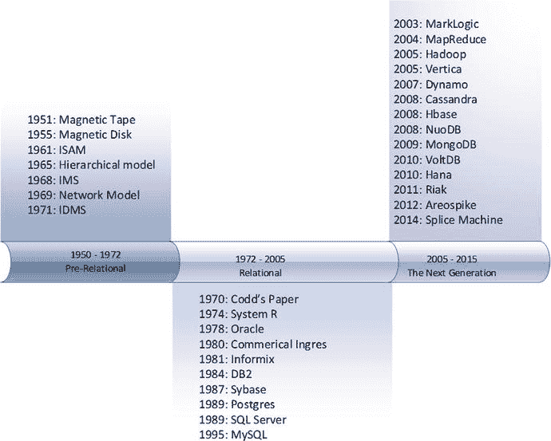

图 1-1. 主要数据库版本与创新的时间线

图 1-1 阐明了数据库技术的三个主要时代。在`电子计算机`被广泛采用后的 20 年里，一系列日益复杂的数据库系统涌现出来。1970 年`关系模型`被定义后不久，几乎所有重要的数据库系统都共享了一个通用架构。这个架构的三大支柱是`关系模型`、`ACID`事务和`SQL`语言。

然而，大约从 2008 年开始，新的数据库系统出现了爆炸式增长，而这些系统无一遵循传统的关系型实现方式。这些新的数据库系统是本书的主题，本章将展示先前几波数据库技术是如何引领至这新一代数据库系统的。

#### 早期数据库系统

维基百科将数据库定义为“有组织的数据集合”。尽管“数据库”一词直到 20 世纪 60 年代后期才进入我们的词汇表，但收集和组织数据一直是人类文明和技术发展中不可或缺的因素。书籍——尤其是那些具有严格结构的书籍，如字典和百科全书——代表了物理形式的数据集。图书馆和其他有索引的信息档案库代表了现代数据库系统在工业时代之前的等价物。

我们也能从打孔卡和其他能够以可机械处理的形式存储信息的物理介质的采用中，看到数字数据库的起源。在 19 世纪，织机卡片被用来“编程”织布机以生成复杂的织物图案，而制表机使用打孔卡来生成人口普查统计数据，自动演奏钢琴则使用代表旋律的穿孔纸带。图 1-2 展示了一台`霍列瑞斯`制表机在 1890 年被用于处理美国人口普查。

图 1-2. 用于处理 1890 年美国人口普查的制表机和打孔卡

第二次世界大战后`电子计算机`的出现代表了数据库领域的第一次革命。一些早期的数字计算机是为了执行纯粹的数学功能而创建的——例如计算弹道表。但同样常见的是，它们被设计用来操作和处理数据，例如处理轴心国加密的军事通讯。

早期的“数据库”最初使用纸带，最终使用磁带顺序存储数据。虽然可以在这些数据集上“快进”和“倒带”，但直到 20 世纪 50 年代中期旋转磁盘的出现，直接高速访问单个记录才成为可能。直接访问允许快速访问任意大小文件中的任何条目。`ISAM`（`索引顺序访问方法`）等索引方法的发展使得快速的面向记录的访问变得可行，从而促成了第一个`OLTP`（`联机事务处理`）计算机系统的诞生。

`ISAM`及类似的索引结构驱动了第一批电子数据库。然而，这些完全受应用程序控制——当时有数据库，但没有`数据库管理系统`（`DBMS`）。

#### 第一次数据库革命

要求每个应用程序都编写自己的数据处理代码显然是一个生产力问题：每个应用程序都必须重复发明数据库的轮子。此外，应用程序数据处理代码中的错误不可避免地会导致数据损坏。允许多个用户并发访问或更改数据而不从逻辑上或物理上损坏数据，需要复杂的编码。最后，通过缓存、预取和其他技术优化数据访问，需要复杂且专业的算法，这些算法不易在每个应用程序中复制。

因此，将数据库处理逻辑从应用程序中分离出来，形成一个独立的代码库，变得非常必要。这一层——数据库管理系统或 `DBMS`——将最大限度地减少程序员的工作量，并确保数据访问例程的性能和完整性。

早期的数据库系统强制执行模式（数据库中数据结构的定义）和访问路径（从一条记录导航到另一条记录的固定方式）。例如，`DBMS` 可能有一个 `CUSTOMER`（客户）和一个 `ORDER`（订单）的定义，以及一个定义好的访问路径，允许你检索与特定客户相关的订单，或者与特定订单相关的客户。

这些第一代数据库完全运行在当时大型计算机系统上——主要是 `IBM` 大型机。到 20 世纪 70 年代初，两种主要的 `DBMS` 模型正在争夺主导地位。网络模型由 `CODASYL` 标准正式定义，并在如 `IDMS` 等数据库中实现，而层次模型则提供了一种稍微简单的方法，最著名的例子是 `IBM` 的 `IMS`（信息管理系统）。图 1-3 对比了这些数据库对数据的结构化表示。

注意

这些早期系统通常被描述为本质上是“导航式”的，因为你必须使用指针或链接从一个对象导航到另一个对象。例如，在层次数据库中查找一个订单，可能需要先找到客户，然后沿着链接找到该客户的订单。

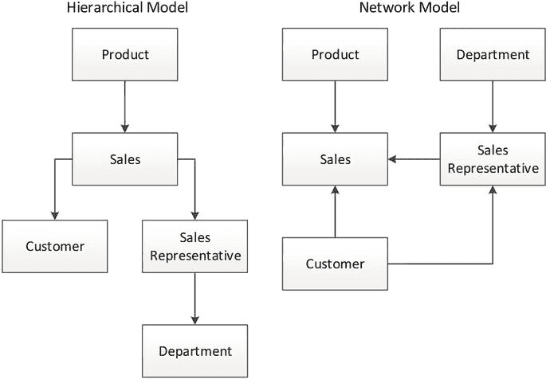

图 1-3.
层次和网络数据库模型

层次和网络数据库系统在大机计算时代占据主导地位，并支撑了直到 20 世纪 70 年代末期绝大多数的计算机应用程序。然而，这些系统有几个显著的缺点。

首先，导航式数据库在数据结构和查询能力方面极其不灵活。通常只有在初始设计阶段可以预见的查询才可能实现，而且向现有系统添加新的数据元素极其困难。

其次，数据库系统以一次处理一条记录的事务为中心——这在我们今天称为 `CRUD`（创建、读取、更新、删除）。查询操作，尤其是我们今天与商业智能相关的那种复杂的分析查询，需要复杂的编码。随着计算机系统与业务流程的日益集成，对分析型报告的业务需求迅速增长。因此，大多数 IT 部门发现自己积压了大量报告请求，还有一整代计算机程序员在编写重复的 `COBOL` 报告代码。

#### 第二次数据库革命

可以说，没有哪个人对数据库技术的影响能超过埃德加·科德。科德在第二次世界大战后不久获得了牛津大学的数学学位，随后移民到美国，从 1949 年起断断续续地为 `IBM` 工作。科德作为一名“编程数学家”（啊，那是美好的年代）工作，并参与了一些 `IBM` 最早的商用电子计算机项目。

在 20 世纪 60 年代末，科德在加利福尼亚州圣何塞的一个 `IBM` 实验室工作。科德非常熟悉当时的数据库，并对其设计抱有重大的保留意见。特别是，他认为：

*   现有数据库太难使用。当时的数据库只能由具备专业编程技能的人访问。
*   现有数据库缺乏理论基础。科德的数学背景促使他从形式化结构和逻辑操作的角度思考数据；他认为现有数据库使用的是任意表示法，既不确保逻辑一致性，也不提供处理缺失信息的能力。
*   现有数据库混淆了逻辑和物理实现。现有数据库中的数据表示与数据库中物理存储的格式相匹配，而不是一种能让非技术用户理解的数据逻辑表示。

科德发表了一份内部 `IBM` 论文，概述了他关于数据库系统更形式化模型的想法，这随后催生了他 1970 年的论文“`大型共享数据库的关系数据模型`”。¹ 这篇经典论文包含了定义关系数据库模型的核心思想，该模型成为了一代人中数据库系统最重要——几乎是普遍的——模型。

##### 关系理论

关系数据库理论的复杂性可能很高，超出了本简介的范围。然而，其本质在于，关系模型描述了给定数据集应该如何呈现给用户，而不是它应该如何存储在磁盘或内存中。关系模型的关键概念包括：

*   元组，一个无序的属性值集合。在实际的数据库系统中，一个元组对应一行，一个属性对应一个列值。
*   关系，即不同元组的集合，对应于关系数据库实现中的一张表。
*   约束，用于强制数据库的一致性。键约束用于标识元组以及元组之间的关系。
*   关系上的操作，如连接、投影、并集等。这些操作总是返回关系。在实践中，这意味着对表的查询会以表格格式返回数据。

表中的一行应可通过唯一的键值来标识并高效访问，并且该行中的每一列都必须依赖于该键值，而非其他标识符。因此，不直接支持包含嵌套信息的数组和其他结构。

对关系模型的符合程度在各种“范式”中进行了描述。第三范式是最常见的级别。数据库从业者通常通过记住“所有非键属性必须依赖于‘键、整个键，除了键别无其他——愿科德帮助我！’”来记住第三范式的定义！²

图 1-4 提供了一个规范化示例：左边的数据代表一个相当简单的数据集合。然而，它包含了学生和考试名称的冗余，并且使用重复的属性集来表示考试答案是值得商榷的（虽然可能符合关系形式，但它暗示每次考试的题目数量相同，并使某些操作变得困难）。右边的五个表格代表了该数据的规范化表示。

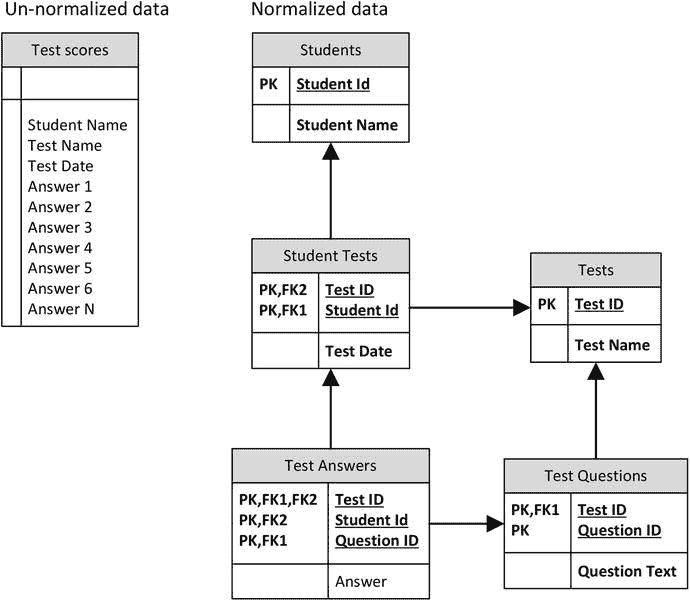

图 1-4.
规范化与非规范化数据

##### 事务模型

关系模型本身并未定义数据库如何处理并发的数据变更请求。这些变更——通常被称为数据库事务——给所有数据库系统都带来了问题，因为需要确保数据的一致性和完整性。

吉姆·格雷在 20 世纪 70 年代末定义了最广为接受的事务模型。正如他所说：“事务是一种状态转换，它具有原子性（要么全做，要么全不做）、持久性（效果在故障后依然存在）和一致性（一种正确的转换）这些属性。”³ 这很快被推广为 `ACID` 事务：原子性、一致性、隔离性和持久性。一个 `ACID` 事务应该是：

*   **原子性**：事务是不可分割的——事务中的所有语句要么全部应用于数据库，要么全部不应用。
*   **一致性**：数据库在事务执行前后都保持一致的状态。
*   **隔离性**：虽然一个或多个用户可以同时执行多个事务，但一个事务不应该看到其他进行中事务的影响。
*   **持久性**：一旦事务被保存到数据库（在 `SQL` 数据库中通过 `COMMIT` 命令），即使操作系统或硬件发生故障，其更改也应预期会持续存在。

`ACID` 事务成为了所有严肃的数据库实现的标准，但也与格雷论文发表前后兴起的关系数据库联系最为紧密。

正如我们稍后将看到的，`ACID` 事务模型所隐含的、对超越单一数据中心可扩展性的限制，一直是开发新数据库架构的关键驱动力。

##### 最早的关系数据库

最初对关系模型的反应有些冷淡。包括 `IBM` 在内的现有供应商不愿接受科德的基本假设：即当时的数据库建立在一个有缺陷的基础上。此外，许多人真诚地质疑，如果数据表示没有针对底层访问机制进行微调，一个系统是否能够提供足够的性能。有没有可能创建一个高性能数据库系统，允许用户以任何可能想象的方式访问数据呢？

然而，`IBM` 确实在 1974 年启动了一个研究项目，开发一个名为 `System R` 的关系数据库系统原型。`System R` 证明了关系数据库可以提供足够的性能，并且它开创了 `SQL` 语言。（科德曾规定关系系统应包括查询语言，但未强制要求特定的语法。）同样在此期间，伯克利的迈克尔·斯通布雷克开始着手一个最终名为 `INGRES` 的数据库系统。`INGRES` 也是关系型的，但它使用了一种非 `SQL` 的查询语言，称为 `QUEL`。

这时，拉里·埃里森出现在我们的故事中。埃里森本质上比学术型更富创业精神，尽管技术上极其精通，曾在 `Amdahl` 工作。埃里森既熟悉科德的工作，也了解 `System R`，他相信关系数据库代表了数据库技术的未来。1977 年，埃里森创立了最终成为 `Oracle 公司` 的公司，并发布了第一个商业上成功的关系数据库系统。

##### 数据库之战！

正是在这一时期，小型机挑战并最终终结了大型计算机的主导地位。与今天的计算机硬件相比，70 年代末 80 年代初的小型机几乎算不上“小型”。但与大型机不同，它们几乎不需要专门的设施，并且使得中型公司首次能够拥有自己的计算基础设施。这些新的硬件平台运行着新的操作系统，并催生了对能在这些操作系统上运行的新数据库的需求。

到 1981 年，`IBM` 已经发布了一款名为 `SQL/DS` 的商业关系数据库，但由于它只能在 `IBM` 大型机操作系统上运行，因此在快速增长的小型机市场毫无影响力。埃里森的 `Oracle` 数据库系统于 1979 年商业化发布，并迅速在 `Digital` 和 `Data General` 等公司提供的小型机上获得青睐。与此同时，伯克利的 `INGRES` 项目也催生了商业关系数据库 `Ingres`。`Oracle` 和 `Ingres` 在早期的小型机关系数据库市场争夺主导地位。

到 80 年代中期，关系数据库的好处——即使不是关系理论的细微差别——已被广泛理解。数据库购买者尤其欣赏 `SQL` 语言（现在包括 `Ingres` 在内的所有供应商都已采用），它为报表编写和分析查询带来了巨大的生产力提升。此外，新一代数据库开发工具——当时被称为 4GL——日益流行，而这些新工具通常与关系数据库服务器配合得最好。最后，小型机在性价比上，特别是在中端市场，提供了明显优于大型机的优势，而在这里，关系数据库几乎是唯一的选择。

事实上，关系数据库在心智份额上变得如此主导，以至于旧式数据库系统的供应商不得不将他们的产品也描述为关系型的。这促使科德写下了他著名的 12 条规则（实际上是 13 条规则，从规则 0 开始），作为区分真正的关系数据库与冒牌货的一种严格测试。

在随后的几十年里，许多新的数据库系统被引入。这些包括 `Sybase`、`Microsoft SQL Server`、`Informix`、`MySQL` 和 `DB2`。虽然这些系统中的每一个都试图通过声称在性能、可用性、功能或经济性方面更优来差异化，但它们在依赖三个关键原则方面几乎是相同的：科德的关系模型、`SQL` 语言和 `ACID` 事务模型。

**注意**

当我们说 `RDBMS` 时，通常指的是实现关系数据模型、支持 `ACID` 事务并使用 `SQL` 进行查询和数据操作的数据库。

##### 客户端-服务器计算

到 80 年代末，关系模型显然在争夺数据库心智份额的战斗中取得了决定性胜利。这种心智份额的主导地位在向客户端-服务器计算的转变过程中转化为了市场主导地位。

小型机在某种程度上是“小型大型机”：在小型机应用程序中，所有处理都发生在小型机本身上，用户通过笨拙的“绿屏”终端与应用程序交互。然而，即使在小型机成为商业计算支柱的同时，一场新的应用程序架构革命正在兴起。

基于 `IBM PC` 标准的微型计算机平台日益普及，以及 `Microsoft Windows` 等图形用户界面的出现，催生了一种新的应用范式：客户端-服务器。在客户端-服务器模型中，表示逻辑通常托管在运行 `Microsoft Windows` 的 `PC` 终端上。这些基于 `PC` 的客户端程序与通常运行在小型机上的数据库服务器通信。应用程序逻辑通常集中在客户端，但也可以使用存储过程——在数据库内部运行的程序——位于数据库服务器内。

客户端-服务器提供了绿屏时代无与伦比的丰富体验，到 90 年代初，几乎所有新的应用程序都追求客户端-服务器架构。几乎所有的客户端开发平台都假定后端是 `RDBMS`——事实上，通常假定 `SQL` 是客户端与服务器之间所有请求的载体。

##### 面向对象编程与面向对象数据库管理系统

在客户端-服务器革命后不久，另一个重大的范式转变冲击了主流的应用程序开发语言。在传统的“过程式”编程语言中，数据和逻辑本质上是分离的。过程（Procedure）会在其逻辑中加载和操作数据，但过程本身并不以任何有意义的方式包含数据。面向对象（OO）编程将属性和行为合并到单个对象中。例如，一个员工对象可以代表员工记录的结构，也可以代表可以对这些记录执行的操作——更改工资、晋升、退休等等。就我们的目的而言，面向对象编程最相关的两个原则是：

*   封装：一个对象类封装了数据以及可以对该数据执行的操作（方法）。实际上，一个对象可能会限制对底层数据的直接访问，要求对数据的修改只能通过对象的方法进行。例如，一个员工类可能包含一个检索工资的方法和另一个修改工资的方法。修改工资的方法可能包含对最低和最高工资的限制，并且该类可能不允许在这些方法之外对工资进行任何操作。
*   继承：对象类可以继承父类的特征。员工类可以继承人员类的所有属性（出生日期、姓名等），同时添加诸如工资、入职日期等属性和方法。

面向对象编程在程序员生产力、应用程序可靠性和性能方面带来了巨大的提升。在整个 80 年代末和 90 年代初，大多数编程语言都转换到了面向对象模型，并且许多重要的新语言——如 Java——应运而生，它们是原生面向对象的。

面向对象编程的革命为关系数据库面临的第一个严峻挑战奠定了基础，这一挑战出现在 90 年代中期。面向对象的开发人员对他们程序中数据的面向对象表示与数据库中的关系表示之间存在的“阻抗失配”感到沮丧。在一个面向对象的程序中，与一个逻辑工作单元相关的所有细节都会存储在一个类中或直接链接到该类。例如，一个客户对象将包含有关该客户的所有详细信息，并链接到包含客户订单的对象，而这些订单对象又链接到订单行项。这种表示方式本质上是非关系型的；实际上，这种数据表示方式更接近于 CODASYL 时代的网络数据库。

当一个对象被存储到关系数据库或从关系数据库中检索时，需要多个`SQL`操作才能从面向对象表示转换为关系表示。这对程序员来说很麻烦，并可能导致性能或可靠性问题。图 1-5 说明了这个问题。

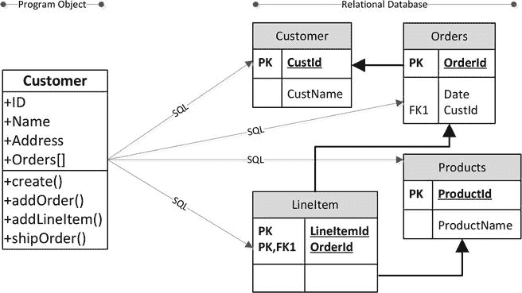

图 1-5.

在`RDBMS`中存储一个对象需要多个`SQL`操作

面向对象编程的倡导者开始将关系数据库视为过程式时代的遗物。这导致了那句相当臭名昭著的名言：“关系数据库就像一个车库，强迫你把你的车拆掉，然后把零件存放在小抽屉里。”

面向对象编程的迅速成功几乎不可避免地导致了这样一个主张：一个`面向对象数据库管理系统（OODBMS）`更适合满足现代应用程序的需求。`OODBMS`将直接存储程序对象而无需规范化，并允许应用程序轻松地加载和存储它们的对象。面向对象数据库运动创建了一份宣言，概述了`OODBMS`的关键论点和属性。⁴ 在实现上，`OODBMS`类似于前关系时代的导航模型——一个对象（例如客户）内的指针允许导航到相关对象（例如订单）。

在 90 年代中期，对`OODBMS`模型的倡导日益增长，对许多人来说，`OODBMS`成为`RDBMS`的逻辑继任者似乎是自然而然的事情。当时主要的`Oracle`、`Informix`、`Sybase`和`IBM`等关系数据库供应商迅速争先恐后地在他们的`RDBMS`中实现`OODBMS`功能。同时，一些纯粹的`OODBMS`系统被开发出来并获得了初步的牵引力。

然而，到 90 年代末，`OODBMS`系统完全未能获得市场份额。`Oracle`和`Informix`等主流数据库供应商成功地实现了许多`OODBMS`功能，但即使是这些功能也极少被使用。面向对象的程序员逐渐接受了使用`RDBMS`系统来持久化对象，而这种痛苦通过`对象关系映射（ORM）`框架得到了一定程度的缓解，这些框架自动化了翻译过程中最繁琐的方面。

对于面向对象数据库的失败，存在着相互竞争且未必相互矛盾的解释。就我而言，我认为`OODBMS`模型的倡导者只关注了`OODBMS`为应用程序开发者带来的优势，而忽略了新模型对于那些希望出于业务目的消费信息的人所具有的劣势。数据库的存在不仅仅是为了程序员的利益；它们代表了重要的资产，必须能够被那些希望为决策和商业智能挖掘信息的人所访问。通过实现一个只能由程序员使用的数据模型，并剥夺业务用户可用的`SQL`接口，`OODBMS`未能获得编程圈子以外的支持。

然而，正如我们将在第 4 章中看到的，对`OODBMS`的动机极大地影响了当今一些最受欢迎的非关系型数据库。

##### 关系型平台期

一旦对面向对象数据库的兴奋劲过去，关系数据库在 2000 年代后半段之前一直保持着无可挑战的地位。事实上，在大约 10 年的时间里（1995-2005），没有引入任何重要的新数据库：市场上已经有足够的`RDBMS`系统使其饱和，而且`RDBMS`模型对市场的牢牢控制意味着任何非关系型的替代方案都无法出现。考虑到这段时期本质上是互联网从极客的好奇心发展成为一个无处不在的全球网络的时代，在此期间没有出现新的数据库架构是令人震惊的，这证明了关系模型的力量。

#### 第三次数据库革命

到 2000 年代中期，关系数据库似乎已经根深蒂固。从 2005 年展望未来，似乎尽管我们会看到当时关系数据库系统内部持续且重大的创新，但没有任何迹象表明会有任何根本性的变化即将到来。但事实上，关系数据库完全占据统治地位的时代即将结束。

特别是，客户端-服务器时代与大规模 Web 应用时代之间应用程序架构的差异，对关系数据库造成了无法通过渐进式创新来缓解的压力。

#### 谷歌与 Hadoop

到 2005 年，谷歌已成为全球最大的网站——这一地位从谷歌成立几年后便已确立。当谷歌初创时，关系型数据库虽已成熟，但面对谷歌所需处理的数据规模和速度，它显得力不从心。如今企业面临的"大数据"挑战，谷歌在近 20 年前就已首次遭遇。谷歌很早就不得不发明全新的软硬件架构，以存储和处理其需要索引的、呈指数级增长的网站数据。

2003 年，谷歌披露了构成其存储架构基础的分布式文件系统`GFS`的细节⁵；2004 年，它又披露了用于创建万维网索引的分布式并行处理算法`MapReduce`的细节⁶。2006 年，谷歌公开了其`BigTable`分布式结构化数据库的详情⁷。

这些概念，连同许多同样源自谷歌的其他技术，构成了 Hadoop 项目的基础。Hadoop 在雅虎内部走向成熟，并从 2007 年开始被迅速广泛采用。Hadoop 生态系统最为关键，它成为了我们将在第 2 章详细讨论的大数据生态系统的**技术使能者**。

#### 其他互联网公司

尽管谷歌的运营总体规模和数据量远超其他任何网络公司，但其他网站也有自己的挑战。专注于在线电子商务的网站——例如亚马逊——需要能够大规模运行的事务处理能力。早期的社交网站如 MySpace，以及后来的 Facebook，在将其基础设施从支持数千用户扩展到数百万用户的过程中，也面临着类似的挑战。

同样，即使是 Oracle 这样最昂贵的商业关系数据库管理系统，也无法提供足够的可扩展性来满足这些网站的需求。Oracle 的横向扩展 RDBMS 架构（`Oracle RAC`）试图为无限扩展提供路线图，但它在经济上缺乏吸引力，并且似乎从未能满足最前沿所需的规模。

许多早期网站试图通过各种"自己动手"的技术来扩展开源数据库。这涉及利用`Memcached`等分布式对象缓存来减轻数据库负载，通过数据库复制来分散数据库读取活动，以及最终——当其他方法都失败时——采用"分片"。

分片涉及根据一个键属性（例如客户标识符）将数据分区存储到多个数据库中。例如，在 Twitter 和 Facebook 中，客户数据被分散到数量庞大的`MySQL`数据库上。特定用户的大多数数据最终存储在一个数据库上，以便针对该客户的操作能快速完成。这需要应用程序来确定正确的分片并适当地路由请求。

在 Facebook 等网站上采用分片，使得基于`MySQL`的系统能够扩展到巨大规模，但这样做的缺点也非常多。许多关系型操作和数据库级别的`ACID`事务丢失了。跨分片执行连接或维护事务完整性变得不可能。分片的运营成本，加上关系型特性的丧失，使得许多人开始寻求 RDBMS 的替代方案。

与此同时，亚马逊内部一个类似的困境，导致了在其自研数据存储中开发一种不同于严格`ACID`一致性的替代模型。亚马逊于 2008 年披露了这个名为"Dynamo"系统的细节⁸。

亚马逊的`Dynamo`模型，加上寻求"网络规模"数据库的 Web 开发者的创新，共同催生了后来被称为键值数据库的类别。我们将在第 3 章更详细地讨论这些。

#### 云计算

应用程序和数据库"在云端"——即通过互联网访问——的存在，自 20 世纪 90 年代末以来一直是应用领域的一个持续特征。然而，大约在 2008 年，云计算有些突然地爆发，成为大型组织的重要关切和初创公司的巨大机遇。

在之前的 5 到 10 年里，主流计算机应用已从基于客户端-服务器模型的丰富桌面应用，转向了数据存储和应用服务器位于可通过互联网访问的某处——"云端"——的基于 Web 的应用。这给新兴公司带来了真正的挑战，它们需要设法为早期用户提供足够的托管能力，并能在经历梦寐以求的指数级增长时迅速扩展。

2006 年至 2008 年间，亚马逊推出了弹性计算云（`EC2`）。`EC2`提供了托管在亚马逊硬件基础设施上、可通过互联网访问的虚拟机映像。`EC2`可用于托管 Web 应用，并能按需相对快速地增加计算能力。亚马逊还增加了其他服务，如存储（`S3`、`EBS`）、虚拟私有云（`VPC`）、`MapReduce`服务（`EMR`）等。整个平台被称为亚马逊网络服务（`AWS`），是首个实用的基础设施即服务（`IaaS`）云。`AWS`成为了谷歌、微软等其他公司提供云计算服务的灵感来源。

对于希望利用云计算平台所允许的弹性可扩展性的应用程序来说，现有的关系型数据库并不合适。Oracle 尝试将网格计算集成到其架构中，但只取得了有限的成功，并且对于这些需要按需扩展的应用程序来说，既不经济也不实用。这种对弹性可扩展数据库的需求，加上基于 Web 的初创公司所产生的需求，加速了键值存储的增长，这些存储通常基于亚马逊自己的`Dynamo`设计。事实上，亚马逊在其云中提供了非关系型服务，从`SimpleDB`开始，后来被`DynamoDB`取代。

#### 文档数据库

程序员们始终对面向对象模型与关系模型之间的"阻抗不匹配"感到不满。对象关系映射系统只能轻微缓解当需要将复杂对象以范式存储在关系型数据库中时产生的不便。

大约从 2004 年开始，越来越多的网站能够提供比以往丰富得多的交互体验。这得益于被称为`AJAX`（异步 JavaScript 和 XML）的编程风格，在这种风格中，浏览器内的 JavaScript 通过传输`XML`消息直接与后端通信。`XML`很快被 JavaScript 对象表示法（`JSON`）所取代，这是一种类似`XML`的自描述格式，但更紧凑，并且与 JavaScript 语言紧密结合。

`JSON`成为了将对象存储（序列化）到磁盘的事实标准格式。一些网站开始将`JSON`文档直接存储到关系型表的列中。很快，就有人决定省去关系型中间层，创建一个可以直接存储`JSON`的数据库。这些数据库被称为文档数据库。

`CouchBase`和`MongoDB`是两种流行的面向`JSON`的数据库，尽管几乎所有非关系型数据库——以及大多数关系型数据库——都支持`JSON`。程序员喜欢文档数据库的原因与他们喜欢`OODBMS`的原因相同：它免去了将对象转换为关系格式的繁琐过程。我们将在第 4 章更详细地探讨文档数据库。

##### “NewSQL”

关系模型或 ACID 事务模型并未规定关系型数据库的物理架构。然而，部分由于共同的历史渊源，部分由于当时硬件的现实条件，大多数关系型数据库最终以非常相似的方式实现。磁盘上的数据格式、内存的使用、锁的性质等，在各大`RDBMS`实现之间仅有细微差别。

2007 年，`Ingres`和`Postgres`数据库系统的先驱 Michael Stonebraker 领导的一个研究团队发表了开创性论文《一个架构时代的终结（是时候进行全面重写了）》⁹。该论文指出，支撑主流关系型架构的硬件假设已不再适用，并且现代数据库工作负载的多样性表明，单一架构可能并非在所有负载下都是最优的。

Stonebraker 及其团队提出了对现有`RDBMS`设计的若干变体，每种都针对特定的应用负载进行了优化。其中两种设计变得尤为重要（尽管公平地说，这两种设计并非完全是前所未有的）。`H-Store`描述了一种纯内存分布式数据库，而`C-Store`则指定了一种列式数据库的设计。这两种设计在随后的几年里都极具影响力，并且是后来被称为`NewSQL`数据库系统的首批范例——这类数据库保留了`RDBMS`的关键特性，但又不同于`Oracle`和`SQL Server`等传统系统所展示的常见架构。我们将在第 6 章和第 7 章中探讨这些数据库类型。

##### 非关系型数据库的爆发

正如我们在图 1-1 中所看到的，在 2000 年代上半叶涌现了大量关系型数据库系统。特别是，在 2008 年至 2009 年间发生了一种“寒武纪大爆发”：短短几年内出现了几十种新的数据库系统。其中许多现已废弃不用，但有些——如`MongoDB`、`Cassandra`和`HBase`——如今已占据了可观的市场份额。

起初，这些新型数据库系统缺乏一个通用名称。有人提出了“分布式非关系型数据库管理系统”（`DNRDBMS`），但显然这无法激发人们的想象力。然而，在 2009 年末，`NoSQL`这个术语迅速流行起来，作为任何与传统 SQL 数据库分道扬镳的数据库系统的简称。

在许多人看来，`NoSQL`是一个不幸的术语：它定义了数据库“不是”什么，而非它“是”什么，并且它将注意力集中在了 SQL 语言的存在与否上。尽管大多数非关系型系统确实不支持 SQL，但实际上，促使大多数`NoSQL`数据库设计的动机是偏离严格的事务型和关系型数据模型。

到 2011 年，`NewSQL`这个术语开始流行，用以描述这一新型数据库：它们虽不代表与关系模型的完全决裂，但增强或从根本上修改了其基本原则——这包括在第 6 章讨论的列式数据库，以及在第 7 章讨论的部分内存数据库。

最后，`大数据`一词在 2012 年初进入了主流视野。虽然该术语主要指的是利用数据创造价值的新方式，但我们通常将“`大数据`解决方案”理解为支持大规模非结构化数据集（如`Hadoop`）的技术的便捷简称。

**注意**

`NoSQL`、`NewSQL`和`大数据`这些术语在许多方面定义模糊、被过度炒作且含义过载。然而，它们代表了指向下一代数据库技术的、最广为人知的说法。

粗略地说，`NoSQL`数据库摒弃了关系模型的约束，包括严格一致性和模式。`NewSQL`数据库保留了关系模型的许多特性，但以显著方式改进了底层技术。`大数据`系统通常围绕`Hadoop`生态系统内的技术构建，越来越多地纳入`Spark`。

#### 结论：并非万能

第一次数据库革命是电子数字计算机出现的必然结果。从某些方面看，第一波数据库是计算机时代之前技术（如打孔卡和制表机）的电子化翻版。早期为这些数据库增加结构层和一致性的尝试，或许提高了程序员效率和数据一致性，但也将数据锁定在只有程序员掌握着钥匙的系统中。

第二次数据库革命源于埃德加·科德的洞见：如果数据库系统建立在坚实、形式化、数学化的基础之上，将大有裨益；数据的表示应独立于物理存储实现；并且数据库应支持不需要复杂编程技能的灵活查询机制。

现代关系型数据库在超过 30 年的商业主导地位中得以成功发展，这是计算机科学和软件工程的胜利。很少有软件理论概念能像关系型数据库这样被如此成功且广泛地实现。

第三次数据库革命并非基于单一的架构基础。如果一定要说，它基于这样一个命题：单一的数据库架构无法应对现代数字世界带来的挑战。拥有数亿用户的大型社交网络应用的存在，以及可能带来数十亿机器输入的物联网（`IoT`）应用的出现，将关系型数据库——尤其是`ACID`事务模型——逼至崩溃边缘。而在规模的另一端，我们还有必须在内存和计算能力有限的移动和可穿戴设备上运行的应用。我们淹没在数据之中，其中许多数据结构不可预测，难以将其转换为关系型形式。

数据库的第三波浪潮大致对应于计算机应用的第三波浪潮。`IDC`等机构常称此为“第三平台”。第一平台是大型机，由前关系型数据库系统支持。第二平台，即客户端-服务器和早期 Web 应用，由关系型数据库支持。第三平台的特征是涉及云部署、移动应用、社交网络和物联网的应用。第三平台需要第三波数据库技术，这些技术包括但不限于关系型系统。图 1-6 总结了三个平台如何与我们的三次数据库革命浪潮相对应。

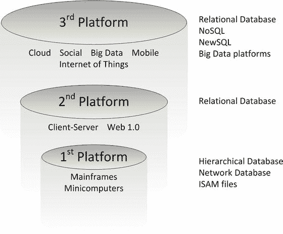
*图 1-6. `IDC`的“三平台”模型对应着数据库技术的三次浪潮*

对于数据库行业的从业者来说，这是一个激动人心的时代。对于一代软件专业人士（以及我职业生涯的大部分时间）而言，数据库技术的创新主要发生在符合`ACID`的关系型数据库的约束之内。既然`RDBMS`的霸权已被打破，我们就可以自由地设计唯一的约束仅在于我们想象力的数据库系统。众所周知，失败驱动创新。一些新的数据库系统概念可能经不起时间的考验；然而，似乎不太可能有一个单一模型能像关系模型那样完全主导不久的将来。数据库专业人士将需要谨慎地为他们的具体情况选择最合适的技术；在许多情况下，关系型技术将继续是最合适的选择——但并非总是如此。

在接下来的章节中，我们将审视下一代数据库系统的每一个主要类别。我们将探讨它们的目标、架构以及它们满足现代应用系统所提出挑战的能力。

#### 注释

[`http://www.seas.upenn.edu/∼zives/03f/cis550/codd.pdf`](http://www.seas.upenn.edu/%7Ezives/03f/cis550/codd.pdf)
威廉·肯特，《关系数据库理论中五种范式的简易指南》，1983 年。
[`http://research.microsoft.com/en-us/um/people/gray/papers/theTransactionConcept.pdf`](http://research.microsoft.com/en-us/um/people/gray/papers/theTransactionConcept.pdf)
[`https://www.cs.cmu.edu/∼clamen/OODBMS/Manifesto/`](https://www.cs.cmu.edu/%7Eclamen/OODBMS/Manifesto/)
[`http://research.google.com/archive/gfs.html`](http://research.google.com/archive/gfs.html)
[`http://research.google.com/archive/mapreduce.html`](http://research.google.com/archive/mapreduce.html)
[`http://research.google.com/archive/bigtable.html`](http://research.google.com/archive/bigtable.html)
[`http://queue.acm.org/detail.cfm?id=1466448`](http://queue.acm.org/detail.cfm?id=1466448)
[`http://nms.csail.mit.edu/∼stavros/pubs/hstore.pdf`](http://nms.csail.mit.edu/%7Estavros/pubs/hstore.pdf)

### 2. 谷歌、大数据与 Hadoop

> 信息是 21 世纪的石油，而分析是内燃机。——彼得·桑德加，高德纳研究，2011 年
> 数据的创造正在爆炸性增长。伴随着所有的自拍和人们拒绝从云端删除的无用文件……。世界的数据存储容量将被超越……。数据短缺、数据配给、数据黑市……数据末日！——加文·贝尔森，HBO《硅谷》，2015 年

在计算史上，没有什么比大数据的概念更能提升数据处理、存储和分析的关注度了。自 20 世纪 80 年代以来，我们就认为自己是一个信息时代社会，但媒体和公众对数据在社会中的作用的关注集中度从未像过去几年这样高过——这要归功于大数据。

大数据技术包括那些让我们能从数据中获取更多意义的技术——例如机器学习——以及那些允许我们以比以往更高的粒度存储更大量数据的技术。

谷歌开创了许多这些大数据技术，它们以`Hadoop`的形式进入了更广泛的 IT 社区。在本章中，我们将回顾谷歌数据管理技术的历史、`Hadoop`的出现，以及其他用于海量非结构化数据存储的技术的发展。

#### 大数据革命

大数据是一个宽泛的术语，存在多种相互竞争的定义。对本书作者而言，它意味着数据在计算机科学和社会中的角色发生了两个相辅相成的重大转变：

*   **数据量更多**：我们现在有能力以原始格式存储和处理所有数据——包括机器生成的数据、多媒体数据、社交网络数据和事务数据——并可能永久保存这些数据。
*   **效果更显著**：机器学习、预测性分析和集体智能的进步使得我们能够从数据中生成比以往任何时候都更多的价值。

本书并非讲述大数据革命的书；这类书已经够多了。然而，我们仍应花些篇幅阐明大数据作为一个概念的重要性，以便将这些技术置于合适的背景中理解。

对于资深的数据库专业人士来说，大数据常常像是一个无意义的流行语，因为他们自古以来就经历着数据库容量的指数级增长。在数据库管理系统的历史中，数据量的增长从未不引人注目。

然而，确实，当今组织数据的本质与不久前的过去相比，在性质上已有所不同。一些人将这种范式转变称为数据领域的“工业革命”，这个术语确实很贴切。在工业革命之前，所有产品基本上都是手工制作的；而在工业革命之后，产品则是在工厂的流水线上生产出来的。类似地，在数据工业革命之前，所有数据都是“内部生成”的。现在，数据从四面八方涌来：客户、社交网络、传感器，以及所有传统来源，如销售和内部运营系统。

##### 云、移动、社交与大数据

大多数人会同意，过去十年间三大主导的信息技术趋势是云、移动和社交媒体。这三大宏观趋势已经改变了我们的经济、社会和日常生活。过去 15 年在线零售的发展或许是这些趋势动态演变最熟悉的例证。

“云计算”一词在 2008 年开始获得广泛关注，但我们现在所称的“云”真正诞生于 20 世纪 90 年代末的电子商务革命。互联网作为通用广域网的出现，以及万维网作为企业对客户门户的兴起，通过创建基于网络的店面，几乎将所有企业都“推上了云端”。

对于某些行业——例如音乐和图书——互联网迅速成为一个重要的甚至是主导的销售渠道。但在更广泛的零售领域，实体店（砖瓦砂浆门店）仍然主导着消费者互动。尽管零售商在云端充分展现，但消费者在网上的存在是零星而浅层的。对大多数消费者来说，互联网连接仅限于家用共享电脑或工作场所的台式机。消费者只是间歇性地连接互联网，且没有在线身份。

社交网络和智能手机的出现几乎同时发生。智能手机让人们可以随时随地上网，而社交网络则为频繁的互联网互动提供了动力。几年之内，普通消费者的互联网互动频率急剧加速：以前每天只上网几次的人现在持续在线，通过电子邮件和社交网络监控他们的职业和社交活动。

消费者现在发现，只要购物冲动一来，随时在线购物都很方便。此外，零售商很快发现，他们可以利用来自社交网络和其他互联网来源的信息来精准投放营销活动并实现个性化互动。零售商自己也创建了社交网络页面，作为其在线商店的补充，并允许零售商通过社交网络直接与消费者互动。

在线业务与社交网络之间的协同效应——由始终连接的移动互联网中介和促成——导致了零售格局的剧烈转变。新零售模式 effectiveness 的关键是数据：社交-移动-云产生了海量数据，可用于优化和增强在线体验。这种良性反馈循环驱动着大数据解决方案，而这些方案可能决定下一代零售运营的成败。

零售业是一个熟悉的例子，但类似动态几乎驱动着所有其他行业。在某些情况下，物联网（IoT）——通过将几乎每一个收集或消耗数据的物理设备都连接到互联网上——扮演着与零售场景中智能手机同等的角色。新的联网设备——互联网汽车、可穿戴设备、家庭自动化等——推动着产生数据并依赖数据来获取竞争优势的良性数据循环。图 2-1 说明了这个循环。

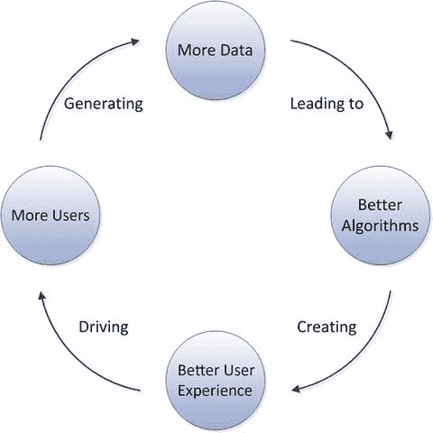

图 2-1. 大数据的良性循环

#### 谷歌：大数据的先驱

当谷歌在 1996 年首次创建时，万维网已经是一个规模空前的网络；事实上，正是这种巨大的规模使得谷歌的关键创新——PageRank——成为一项突破。当时的搜索引擎只是根据网页内的关键词进行索引。鉴于任何搜索词都可能有海量匹配结果，这种方式并不足够；结果主要根据搜索词在页面中出现的次数进行加权，而不考虑其有用性或受欢迎程度。PageRank 允许根据指向某个页面的链接数量来加权该页面的相关性，这使得谷歌能够立即提供比竞争对手更好的搜索结果。

PageRank 是数据驱动算法的一个绝佳例子，它利用了“群体智慧”（集体智能），并且能够随着更多数据的可用而智能适应（机器学习）。因此，谷歌是第一个清晰的例子，证明了一家公司通过我们现在所称的数据科学在互联网上取得了成功。

#### Google 硬件基础设施

Google 是展示如何通过智能利用海量数据来打造更优算法的典范。然而，就我们的目的而言，Google 在数据架构方面的创新最具相关性。

Google 最初的硬件平台由典型的现成服务器集合组成，它们可能被放置在任何研究实验室的桌子下。然而，仅用了几年时间，Google 就转向了在商业级数据中心中部署大量机架式服务器。随着 Google 的发展，它超越了即使是最庞大现有数据中心架构的容量限制。为了提供能够实现无限制指数级增长的硬件基础设施，其经济性和实用性要求 Google 创建一种新的硬件和软件架构。

Google 在设计其中心架构时遵循了一些关键原则。最重要的一点——并且在当时是独一无二的——Google 致力于在海量商用服务器上实现大规模的并行化和分布式处理。Google 也采取了“绝地武士自己造光剑”的态度：在 Google 的架构中几乎找不到任何第三方的，尤其是商业的软件。“自建”在 Google 看来优于“购买”。

到 2005 年，Google 不再将单个服务器视为计算的基本单元。相反，Google 围绕`Google Modular Data Center`构建数据中心。`Modular Data Center`由集装箱组成，每个集装箱容纳约一千台定制的、运行`Linux`的`Intel`服务器。每个模块包括独立的电源和空调。数据中心容量的增加不是通过单独添加新服务器，而是通过添加新的包含 1000 台服务器的模块来实现的！图 2-2 展示了 Google 专利中描述的模块示意图。¹

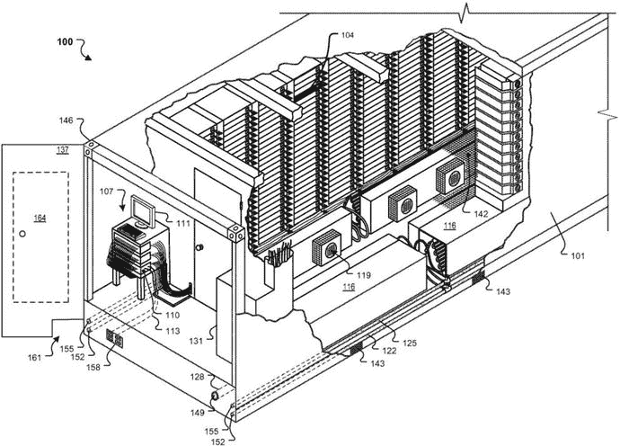

**图 2-2.**
Google 专利中描述的模块化数据中心

当时，主流的数据处理架构是将其存储分离到由`EMC`等公司构建的专用存储服务器上。这些存储通过`Fibre Channel`（或类似协议）作为存储区域网络（`SAN`）提供给数据库或其他应用程序，或者通过`TCP/IP`作为网络附加存储（`NAS`）提供。Google 摒弃了这些概念；在 Google 的架构中，存储将位于与提供计算能力的同一服务器内部直接连接的磁盘上。

##### Google 软件栈

Google 硬件架构有许多引人入胜的方面。然而，为了我们的目的，理解当时的 Google 架构由数十万台低成本服务器组成，每台服务器都有自己的直连存储，这就足够了。

不言而喻，这种独特的硬件架构也需要独特的软件架构。当时可用的任何操作系统或数据库平台都无法在如此庞大的服务器数量上运行。因此，Google 开发了三个主要的软件层作为 Google 平台的基础。它们是：

*   Google 文件系统（`GFS`）：一个分布式集群文件系统，允许将 Google 数据中心内的所有磁盘作为一个巨大的、分布式的、冗余的文件系统进行访问。
*   `MapReduce`：一个分布式处理框架，用于在大量可能不可靠的服务器上并行化算法，并能够处理海量数据集。
*   `BigTable`：一个非关系型数据库系统，使用`Google File System`进行存储。

Google 非常慷慨地在 2003 年²、2004 年³和 2006 年⁴发布的一系列论文中揭示了这些组件的基本设计。这三项技术——连同其他实用程序和组件——共同构成了许多 Google 产品的基础。

图 2-3 展示了该架构的一个高度简化表示。`GFS`抽象了构成 Google 模块化数据中心的服务器中包含的存储。`MapReduce`抽象了这些服务器中包含的处理能力，而`BigTable`允许使用`GFS`进行存储来存储海量数据集的结构化数据。

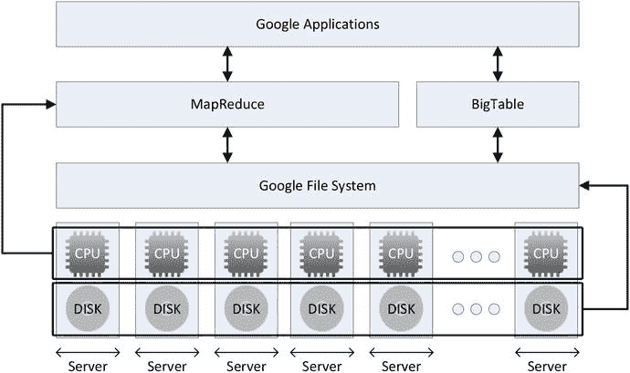

**图 2-3.**
Google 软件架构

##### 更多关于 MapReduce

`MapReduce`是一种用于通用数据密集型处理并行化的编程模型。`MapReduce`将处理分为两个阶段：一个映射阶段，其中数据被分解成可以由独立线程（可能运行在独立的机器上）处理的块；以及一个归约阶段，它将来自`mapper`的输出组合成最终结果。

`MapReduce`的经典例子是单词计数程序，如图 2-4 所示。例如，假设我们希望统计某个输入文件中宠物类型的出现次数。我们在`map`阶段将数据分解成相等的块。然后数据被混洗成按宠物类型分组。最后，`reduce`阶段统计出现次数，以提供输入到输出的总计数。

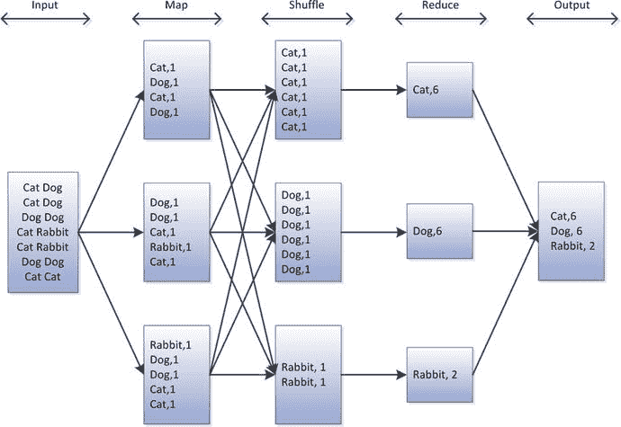

**图 2-4.**
简单的 MapReduce 流水线

如图 2-4 所示的简单`MapReduce`流水线很少见；更典型的情况是将多个`MapReduce`阶段链接在一起以实现更复杂的结果。例如，可能有多个需要以某种方式合并的输入文件，或者可能存在一些复杂的迭代处理以执行统计或机器学习分析。

图 2-5 展示了一个更复杂的多阶段`MapReduce`流水线。在此示例中，一个包含访问各种产品网页信息的文件与一个包含产品详情（以获取产品类别）的文件连接，然后再与一个包含客户详情的文件连接，以确定客户的国家/地区。然后将这些连接的数据进行汇总，以提供一份关于产品类别、客户地理位置和页面访问量的报告。

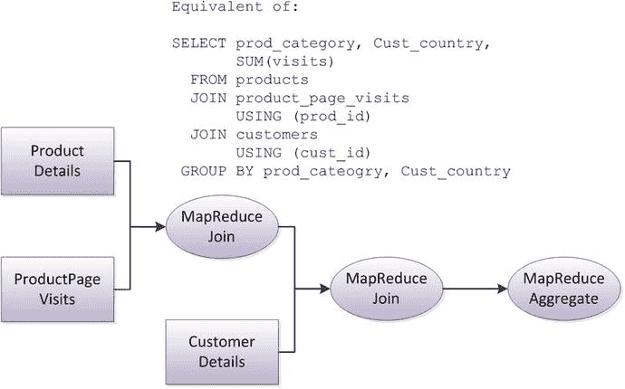

**图 2-5.**
多阶段 MapReduce

`MapReduce`过程可以组装成任意复杂的流水线，能够解决非常广泛的数据处理问题。然而，在许多方面，`MapReduce`代表了一种暴力处理方法，并不总是最有效或最优雅的解决方案。也存在一类计算问题，`MapReduce`无法为其提供可扩展的解决方案。由于所有这些原因，`MapReduce`在 Google 内外都已被更复杂和专门的算法所扩展；我们将在第 11 章中讨论其中的一些。然而，尽管替代处理模型日益普及，`MapReduce`仍然是一种默认且广泛适用的范式。

#### Hadoop：开源的 Google 技术栈

虽然上一节概述的技术构成了我们都使用过的 Google 产品的基础，但它们通常并不直接面向公众。然而，它们确实启发了`Hadoop`，它包含了所有这些重要技术的类似组件，并且作为一个开源的`Apache`项目可供所有人使用。

没有其他单一技术比`Hadoop`对大数据的影响更大。`Hadoop`——通过提供一种经济可行的大规模非结构化数据存储和处理手段——使主流 IT 能够进行 Google 风格的大数据处理。

#### Hadoop 的起源

2004 年，Doug Cutting 和 Mike Cafarella 正在进行一个名为 Nutch 的开源项目，旨在构建一个基于 Apache Lucene 的网络搜索引擎。Lucene 是一个基于 Java 的文本索引和搜索库。Nutch 团队渴望利用 Lucene 构建一个可扩展的网络搜索引擎，其明确目标是创建一个与 Google 内部使用的专有技术相媲美的开源替代品。

Nutch 的初始版本无法展示出索引整个互联网所需的可扩展性。当 Google 在 2003 年和 2004 年发布了关于 `GFS` 和 `MapReduce` 的论文后，Nutch 团队很快意识到，这些论文为解决 Nutch 的可扩展性挑战提供了一个经过验证的架构基础。

随着 Nutch 团队实现了他们自己的 `GFS` 和 `MapReduce` 等价系统，人们很快意识到这些技术适用于广泛的数据处理挑战，因此有必要成立一个专门的项目来推广这项技术。由此产生的项目被命名为 Hadoop。Hadoop 于 2007 年开放下载，并于 2008 年成为 Apache 的顶级项目。

许多开源项目都是从小处起步，缓慢成长。Hadoop 则恰恰相反。雅虎（Yahoo!）在 2006 年聘请了 Cutting 来改进 Hadoop，目标是让 Hadoop 发展成熟，直至能够为雅虎的平台做出贡献。2008 年初，雅虎宣布其一个拥有超过 5PB 存储空间和 10,000 多个 CPU 核心的 Hadoop 集群，正在生成用于解析雅虎网络搜索的索引。因此，在 IT 圈外几乎无人听闻 Hadoop 之前，它就已经在超大规模的环境中得到了验证。

Hadoop 的另一个重要早期采用者是 Facebook。Facebook 于 2007 年开始试用 Hadoop，到 2008 年，其生产环境中已有一个使用 2,500 个 CPU 核心的集群。Facebook 最初实施 Hadoop 是为了补充其基于 Oracle 的数据仓库。到 2012 年，Facebook 的 Hadoop 集群磁盘容量已超过 100PB，它完全取代了 Oracle 作为数据仓库的解决方案，并为许多 Facebook 核心产品提供支持。

许多财富 500 强公司都已采纳了 Hadoop——至少是在试点阶段。与所有新技术一样，预期会出现一些过度炒作以及随后的幻灭。然而，大多数积极寻求大数据解决方案的组织都在以某种形式使用 Hadoop。

Hadoop 事实上已成为海量非结构化数据存储和处理的解决方案，这一点可以从三大数据库厂商——微软、Oracle 和 IBM——所采取的立场中看出。到 2012 年，这些巨头都已停止提供任何形式的 Hadoop 替代品，转而在其产品组合中提供 Hadoop。

#### Hadoop 的力量

Hadoop 为大数据提供了一种经济上具有吸引力的存储解决方案，同时也为分析处理提供了一种可扩展的处理模型。具体来说，它具备：

*   一种经济的可扩展存储模型。随着数据量的增加，在线存储这些数据的成本也随之上升。因为 Hadoop 可以运行在采用通用硬盘的商用硬件上，所以每 TB 的价格几乎低于任何其他技术。
*   大规模的可扩展 `IO` 能力。由于 Hadoop 使用大量通用设备，其聚合 `IO` 和网络容量高于专用存储阵列所提供的能力，后者通常由数量更少、容量更大的磁盘和更少数量的处理器组成。此外，向 Hadoop 添加新服务器会同时增加存储、`IO`、`CPU` 和网络容量，而向存储阵列添加磁盘则可能只是加剧阵列内部的网络或 `CPU` 瓶颈。
*   可靠性：Hadoop 中的数据以冗余方式存储在多台服务器上，并且可以跨多个计算机机架分布。服务器故障不会导致数据丢失；事实上，即使某台服务器发生故障，Hadoop 作业也会继续执行——处理过程会简单地切换到另一台服务器。
*   一种可扩展的处理模型：`MapReduce` 代表了一种应用广泛且可扩展的分布式处理模型。虽然 `MapReduce` 并非所有算法的最高效实现，但它几乎能够以蛮力方式为所有算法提供可接受的性能。
*   读时模式：数据可以在不转换为高度结构化范式格式的情况下加载到 Hadoop 中。这使得 Hadoop 能够轻松快速地摄入各种形式的数据。结构的施加可以延迟到访问数据时；这有时被称为读时模式，与关系型数据仓库的写时模式相对。

#### Hadoop 的架构

Hadoop 的架构大致与 Google 的架构相似。Google 文件系统（GFS）的功能由 Hadoop 分布式文件系统（`HDFS`）提供，它允许使用熟悉的文件系统习语来访问集群中的所有磁盘存储。

目前 Hadoop 架构有两个主要迭代版本。Hadoop 2.0 建立在 1.0 架构之上，因此让我们依次考虑每一个。

在 Hadoop 1.0 中，集群中的大多数服务器既充当数据节点，又充当任务追踪器，这意味着每台服务器既提供数据存储也提供处理能力（`CPU` 和内存）。

Hadoop 1.0 架构中还定义了专用节点。作业追踪器节点负责协调在 Hadoop 集群上运行的作业调度，而名称节点则是一种目录，提供从数据节点上的数据块到 `HDFS` 上文件的映射。每条数据通常会在三个节点上复制，这些节点可以位于不同的服务器机架上，以避免任何单点故障。图 2-6 展示了 Hadoop 1.0 的架构。

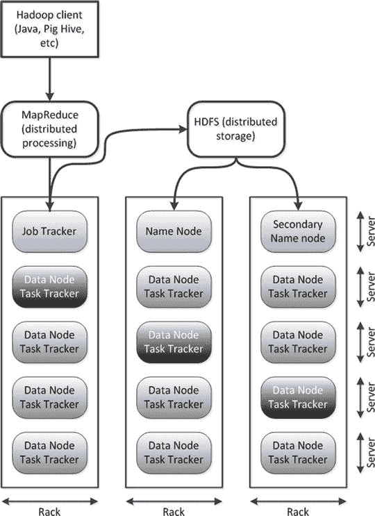

图 2-6. Hadoop 1.0 架构

Hadoop 1.0 架构功能强大且易于理解，但它仅限于 `MapReduce` 工作负载，并且在调度和资源分配方面灵活性有限。在 Hadoop 2.0 架构中，`YARN`（Yet Another Resource Negotiator，或递归地称为 YARN Application Resource Negotiator）通过将任务追踪器的角色拆分为两个流程，提高了可扩展性和灵活性。资源管理器（Resource Manager）控制对集群资源（内存、`CPU` 等）的访问，而应用程序管理器（Application Manager）（每个作业一个）则控制任务的执行。

`YARN` 提供的远不止是改进的可扩展性。`YARN` 将传统的 `MapReduce` 仅仅视为可以在集群上运行的众多可能框架之一，从而允许 Hadoop 运行基于更复杂处理模型的任务，其中一些我们将在第 11 章中讨论。

图 2-7 展示了 `YARN` 的资源分配和应用程序执行方面。例如，Hadoop 客户端向资源管理器提交应用程序执行请求 (1)。资源管理器与各个节点管理器（Node Managers）协调，以确定哪些节点有可用资源 (2)。然后，资源管理器在可用节点上创建一个应用程序管理器 (3)。应用程序管理器协调在选定节点上的容器（Containers）中运行的任务 (4)。容器控制应用程序任务可以使用的 `CPU` 和内存量。

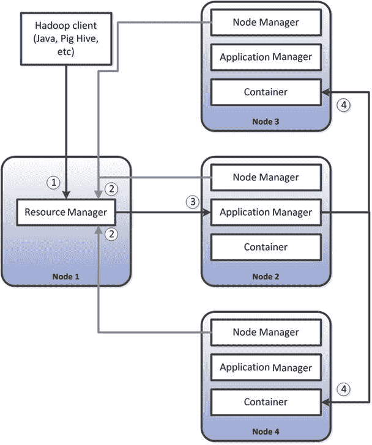

图 2-7. Hadoop 2.0 `YARN` 架构

#### HBase

正如本章前面提到的，谷歌在 2003 年至 2006 年间发布了三篇关键论文，揭示了其平台的架构。`GFS`和`MapReduce`论文构成了核心`Hadoop`架构的基础。第三篇关于`BigTable`的论文，则成为了最早的正式`NoSQL`数据库系统之一——`HBase`——的基础。

`HBase`使用`Hadoop HDFS`作为文件系统，这与大多数传统关系型数据库使用操作系统文件系统的方式相同。例如，在一个使用`MyISAM`选项的`MySQL`数据库中，每个表都表示为存储在文件系统上的一个文件。通过使用`Hadoop HDFS`作为其文件系统，`HBase`能够创建真正海量的表——其规模远超`MySQL`甚至`Oracle`等系统的可能极限。此外，`HDFS`的容错性为`HBase`表提供了自动冗余。正如我们在图 2-6 中看到的，`HDFS`文件系统中的每个数据项默认被复制三次。由于`HDFS`提供了这种固有的冗余性，`HBase`无需存储数据的多个副本来防止数据丢失。

虽然`HDFS`允许在`Hadoop`中存储任何结构的文件，但`HBase`确实对数据施加了结构。`HBase`对象的术语看起来相当熟悉——列、行、表、键。然而，`HBase`表与我们熟悉的关系表有很大不同。

首先，在每个单元格中——即特定行的列值——通常会有多个版本的数据值。单元格内的每个数据版本都由一个时间戳标识。这为`HBase`表提供了一种时间上的“第三维度”。

其次，`HBase`的列更类似于分布式`key : value`对的`Map`中的键值，而不是关系数据库表中固定且相对较少的列。每一行可以拥有大量的“稀疏”列。`HBase`表中的每一行看起来都可以由一组唯一的列构成。

为了理解`HBase`数据模型的工作原理，请考虑图 2-8 所示的数据。我们首先看到原始数据（1）——一个包含用户、网站以及每个用户访问该网站次数的列表。关系型表示（2）涉及三张表——`sites`、`people`和`visits`——其中`sites`与`visits`、`people`与`visits`之间存在外键关系。

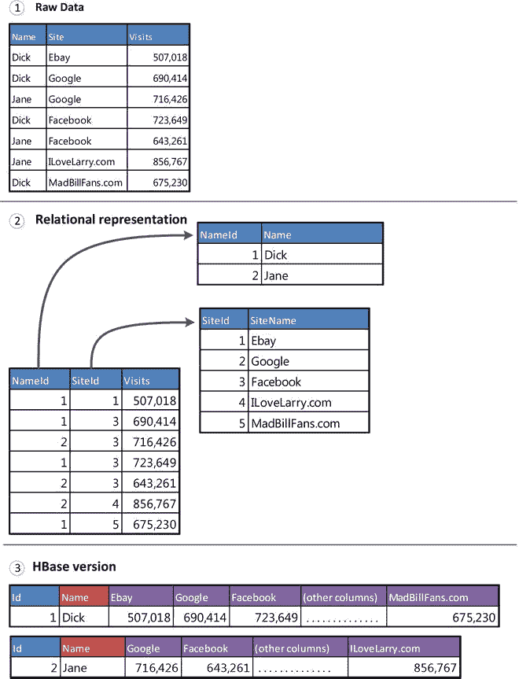

图 2-8. HBase 数据模型与关系模型对比

在`HBase`表示（3）中，每个人的信息都保存在单行中。该行包含了该人访问过的所有网站的列。列名代表网站名称，列值代表访问次数。由于人们会访问成千上万甚至数十万个网站，一行中可能存在成千上万甚至数十万个列。虽然有些网站几乎每个人都会访问——例如 Google.com——但行中只包含与他们实际访问过的网站相对应的列。因此，例如，如果你从未访问过 dell.com，那么你的行中就不会有 dell.com 列。

`HBase`数据模型和存储系统将在第 10 章中更详细地探讨。

##### Hive

`Hadoop`的先驱们很早就意识到，如果只有能够编写`MapReduce`程序的人才能访问该系统，那么该平台的全部价值就无法实现。非程序员需要灵活、强大且易用的查询工具来从`Hadoop`系统中提取数据。即使对于程序员来说，为了执行重复的报告任务而费力且繁琐地编写`MapReduce`代码似乎也效率极低。Facebook 和 Yahoo!分别独立开发了解决这个问题的两个方案：`Hive`和`Pig`。

`Hive`通常被认为是“`Hadoop`的`SQL`”，尽管`Hive`除了提供`SQL`处理层外，还为`Hadoop`系统提供了一个目录服务。`Hive`元数据服务包含有关`HDFS`文件系统中已注册文件结构的信息。这些元数据有效地对这些文件进行了“模式化”，提供了列名和数据类型的定义。`Hive`客户端或服务器（取决于`Hive`配置）接受称为`Hive 查询语言 (HQL)`的类`SQL`命令。这些命令被转换为处理查询并将结果返回给用户的`Hadoop`作业。大多数时候，`Hive`会创建`MapReduce`程序来实现连接、排序、聚合等查询操作。然而，最近版本的`Hive`可以采用更现代的基于`YARN`的处理范式，例如`Tez`（一种旨在加速某些数据处理模式操作的编程模型）；我们将在第 11 章中更多地讨论`Tez`。

图 2-9 说明了`Hive`的架构。`Hive`元存储将`HDFS`文件映射到`Hive`表（1）。`Hive`客户端或服务器（取决于安装模式）接受`HQL`命令，对这些表执行`SQL`操作。`Hive`将`HQL`转换为`Hadoop`代码（3）——通常是`MapReduce`。此代码对`HDFS`文件（4）进行操作，并将查询结果返回给`Hive`（5）。

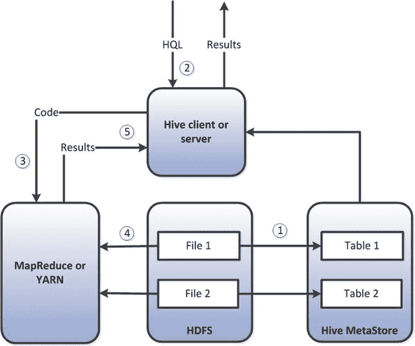

图 2-9. Hive 架构

`Hive`的重要性难以言表。`Hive`向所有熟悉`SQL`的人敞开了`Hadoop`的大门，向整个社区展示了`Hadoop`可以作为一种数据仓库的形式运行，并为将`Hadoop`集成到商业智能工具中奠定了基础。然而，通过提高人们对`Hadoop`能像传统数据库一样运行的期望，`Hive`也导致了一些不切实际的期望。`SQL`通常被用作实时查询工具，但`Hadoop`的批处理特性意味着即使是最简单的`HQL`查询也无法以实时模式运行。

`Hadoop`社区试图通过两种方式来处理`Hive`的性能问题。主要的`Hadoop`供应商 Cloudera 创建了一种替代性的专有`SQL on Hadoop`框架，称为`Impala`，而其他公司——包括另一家主要的`Hadoop`供应商 Hortonworks——则试图通过增量改进以及更好地与`YARN`和`Tez`等后`MapReduce`框架集成来提高`Hive`的性能。与此同时，`Oracle`和`Teradata`等传统数据库供应商也试图通过其现有的`SQL`引擎提供`SQL on Hadoop`功能。我们将在第 11 章中花更多时间讨论`Hadoop`和`NoSQL`的`SQL`接口。

#### Pig

Facebook 创建`Hive`是为了让分析师能够访问`Hadoop`中的数据。Yahoo!为了应对类似的需求，独立创建了另一个解决方案：`Pig`。

`Pig`支持一种称为`Pig Latin`的程序化、高级数据流语言。与`Hive`类似，`Pig Latin`被编译为`MapReduce`代码。然而，`Pig`更像是一种脚本语言，而非`SQL`的替代品。虽然可以创建出与几乎所有`Hive HQL`查询等效的`Pig`脚本，但`Pig`能够表达比`HQL`复杂得多的操作流水线。

图 2-10 比较了一个`Pig Latin`脚本与一个等效的`Hive HQL`语句。请注意，`Pig`脚本是过程式的表示——它明确指定了为达成结果必须执行的事件序列。与`SQL`类似，`HQL`是非过程式的：由`Hive`优化器决定执行方式；`HQL`只指定要在数据上执行的逻辑操作。

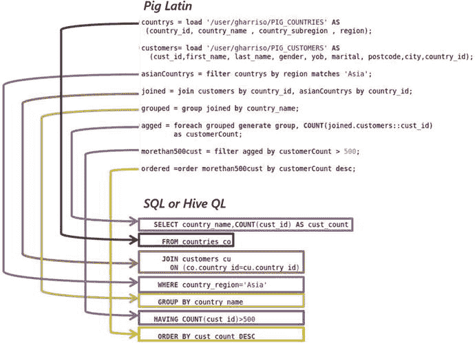

图 2-10. Pig Latin 与 Hive HQL 对比

##### Hadoop 生态系统

`MapReduce`、`YARN` 和 `HDFS` 构成了 `Hadoop` 架构的基础。`HBase`、`Pig` 和 `Hive` 则建立在这些基础之上。`Hadoop` 生态系统包括了一个不断扩展的工具和应用程序家族，它们要么构建在核心 `Hadoop` 之上，要么设计为与核心 `Hadoop` 协同工作。其中一些最重要的工具包括：

*   `Flume`，一个用于将基于文件的数据加载到 `HDFS` 中的工具。
*   `SQOOP`，一个用于与关系型数据库交换数据的工具，既可以将关系表导入到 `HDFS` 文件，也可以将 `HDFS` 文件导出到关系数据库。
*   `Zookeeper`，它在集群内提供协调和同步服务。
*   `Oozie`，一个工作流调度器，允许从底层作业（例如，在 `MapReduce` 应用程序之前运行一个 `Sqoop` 或 `Flume` 作业）构建复杂的工作流。
*   `Hue`，一个简化 `Hadoop` 管理和开发任务的图形用户界面。

此外，还有许多 `Apache` 和开源项目，虽然它们并非完全依赖于 `Hadoop`，但常常被集成到 `Hadoop` 实现中。这包括机器学习框架 `Mahout`、分布式流消息系统 `Kafka` 以及其他许多重要的 `Apache` 项目。

近年来，`Hadoop` 家族最重要的补充是 `Spark` 以及它所属的伯克利数据分析栈（`BDAS`）的其他组件。如果我们将 `Hadoop` 视为一个面向磁盘、用于运行 `MapReduce` 风格程序的框架，那么 `Spark` 则代表了一个面向内存、用于运行类似工作负载的框架。我们将在第 7 章中更详细地探讨 `Spark`。

#### 结论

`Hadoop` 代表了自关系模型以来数据库架构最重要的变革之一。它提供了传统 `RDBMS` 无法企及的存储和处理经济性，并且提供了存储和处理非结构化及半结构化数据的能力，而这是 `RDBMS` 没有真正解决方案的领域。比任何其他技术都更甚，`Hadoop` 理所当然地与大数据运动联系在一起。

然而，虽然 `Hadoop` 提供了一个用于海量数据处理的框架，但它没有用于事务性和在线操作的框架。正如我们将在下一章看到的，前沿的网站不仅需要存储和批处理解决方案，还需要一个在线事务处理解决方案。这些需求催生了我们现在所称的 `NoSQL`，而这将是下一章探讨的内容。

#### 注释

[`http://www.google.com/patents/US20100251629`](http://www.google.com/patents/US20100251629) [`http://research.google.com/archive/gfs.html`](http://research.google.com/archive/gfs.html) [`http://research.google.com/archive/mapreduce.html`](http://research.google.com/archive/mapreduce.html) [`http://research.google.com/archive/bigtable.html`](http://research.google.com/archive/bigtable.html)

### 3. 分片、亚马逊与 NoSQL 的诞生

> 第一步 - 分片数据库。第二步 - 搞死你自己。——推特用户 @Dmitriy，2009
> “鲍勃：那么，我怎么查询数据库呢？
> IT 技术员：这不是数据库。这是个键值存储……你得用 `Erlang` 写一个分布式的 `map-reduce` 函数。
> 鲍勃：你刚才是不是让我滚蛋？
> IT 技术员：我相信是的，鲍勃。”——Fault Tolerance 卡通，@jrecursive，2009

我们上一次看到主要的、新型的关系数据库品牌是在 1995 年左右，即 `MySQL` 的首次发布。在 1995 年，美国的万维网才刚刚两岁——`Netscape` 浏览器是在前一年才发布的。就计算机系统而言，那是一个不同的时代。

在 1995 年到 2005 年这 10 年间，互联网从拨号上网的新奇事物转变为我们文明中最重要的通信系统之一，成为国际商业的基础，并很快成为我们社交生活的核心。尽管如此，2005 年使用的数据库系统与 1995 年使用的名称相同。回顾 2005 年的软件格局，您可能会认为数据库领域并无新事，这情有可原。

然而，在幕后，关系数据库支撑 Web 应用程序需求的能力已经被拉伸到了断裂点。在这种压力之下，诞生了一种新型的 Web 规模事务数据库系统——即我们现在所称的 `NoSQL`。

#### 扩展 Web 2.0

万维网最初被构想并实现为一个链接的静态文档的全球集合。事实上，网络的绝大部分内容仍然是只读的静态内容。`Google` 开发了上一章介绍的许多技术，以便为这些文档提供索引和搜索能力。

但对于零售商和其他企业来说，网络承诺提供的远不止是存储在线目录和白皮书的地方。基于网络的零售网点的概念有望彻底改变现代商业。尽管这种电子商务的概念导致了我们这代人最大的繁荣与萧条，但其承诺最终得以实现，今天你几乎可以在线购买任何东西。

静态页面的万维网通常被称为 `Web 1.0`，而具有事务处理能力的动态生成内容的万维网则被称为 `Web 2.0`。然而，2.0 版本并非受控架构重建的结果；相反，它是由于网络开发者争相应对功能、性能和规模方面不断增长的需求而产生的。

##### Web 2.0 如何取胜

最初的网络服务器提供对用 `HTML` 编写的超文本文档的访问。当时没有数据库系统参与，也无法进行任何业务或交易活动。

早期想要提供某种形式用户交互的网站——例如 `Amazon.com`——使用了 `通用网关接口` (`CGI`)。`CGI` 允许 `HTTP` 请求调用脚本，而不是显示一个 `HTML` 页面。早期的动态网页会调用用 `Perl` 语言编写的脚本，这些脚本会连接到数据库，并根据数据库内容动态生成 `HTML` 代码。这样，网站就能根据数据库中存储的数据展示目录，或者根据用户档案个性化页面。

`CGI` 的方法逐渐被更优雅、更集成的框架（如 `Java` `J2EE` 和 `ASP.NET`）所取代，尽管大量基于 `PHP` 语言的网站仍然遵循 `CGI` 模型。然而，无论使用何种框架，通用的模式都涉及一个网络应用服务器，用于显示从数据库内容动态生成的信息。

在这种架构中，扩展 Web 层很容易。就像在客户端/服务器架构中，一个数据库可以对应多个客户端一样，你可以根据需要部署任意多的 Web 服务器与单个后端数据库通信。因此，Web 服务器层的瓶颈只需通过添加更多 Web 服务器即可解决。

然而，解决数据库层的瓶颈则不那么简单。尽管在二十一世纪初已有一些数据库集群解决方案，但通常难以通过这些方案实现线性扩展，并且没有一个方案曾展现出大型电子商务网站所需级别的扩展能力。

在 Web 2.0 的早期阶段，解决数据库性能问题的方法就是购买更强大的数据库服务器。数据库服务器的能力逐年增强，存储服务器能为数据库提供巨大的 `IO` 容量。因此，在最初的互联网泡沫期间，像 `EMC` 和 `Oracle` 这样的公司表现非常好，因为对于这些早期的 Web 2.0 公司来说，购买最强大的数据库服务器来支撑他们预期的极其乐观的增长曲线是合理的。

有两个因素导致了这种向上扩展方案的放弃。首先，互联网泡沫破灭将财务现实带回考量，幸存下来的网络公司需要财务上谨慎的解决方案。企业希望一个能够从小规模起步并根据需要增长的方案。其次，随着 Web 2.0 公司达到全球规模，他们发现即使是最庞大的集中式数据库服务器也无法满足需求。向上扩展的方式已经行不通了。

此外，即使向上扩展方案能提供所需的容量，它仍然代表着一个潜在的单点故障，并且无法在全球市场提供均衡的响应时间。

##### 开源解决方案

互联网泡沫破灭后，开源软件在 Web 2.0 运营中越来越受到重视。`Linux` 取代了专有的 `UNIX` 成为首选操作系统，`Apache` 网络服务器占据了主导地位。在此期间，`MySQL` 超越 `Oracle`，成为网站开发的首选 `数据库管理系统` (`DBMS`)。

`MySQL` 在当时，甚至现在，其可扩展性也远不如 `Oracle`；它通常在性能较低的硬件上运行，并且不太能利用多核处理器。然而，Web 开发者想出了一些技巧来让 `MySQL` 发挥更大作用。

首先，他们使用了一种叫做 `Memcached` 的技术来尽可能避免访问数据库。`Memcached` 是一个开源实用程序，提供分布式对象缓存。面向对象的语言可以将数据库信息的面向对象表示缓存在多台服务器上。通过从这些服务器而不是数据库读取，可以减少数据库上的负载。

其次，Web 开发者利用了 `MySQL` 的复制功能。复制允许将一个数据库的更改复制到另一个数据库。读取请求可以被定向到这些副本数据库中的任何一个。然而，写入操作仍然必须发送到主数据库，因为主到主的复制是不可能的。但是，在典型的数据库应用——特别是 Web 应用中——读取次数远远多于写入次数，因此读取复制策略是合理的。

图 3-1 展示了从单一 Web 服务器和数据库服务器到多 Web 服务器、`Memcached` 服务器和只读数据库副本的转变。

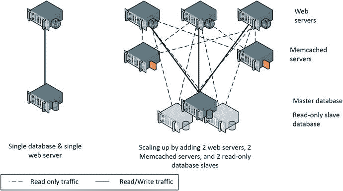

图 3-1.

使用 `Memcached` 服务器和复制进行扩展

`Memcached` 和读取复制显著提高了基于 `MySQL` 的 Web 应用程序的整体容量。然而，这两种技术都只能增加系统的读取能力。当系统在数据库写入活动上达到瓶颈时，就需要一个更激进的解决方案。

##### 分片

分片允许将一个逻辑数据库分区到多个物理服务器上。

在分片的应用中，最大的表被分区到多个数据库服务器上。每个分区被称为一个分片。这种分区基于一个 `键值`，例如用户 `ID`。在操作特定记录时，应用程序必须确定哪个分片将包含该数据，然后将 `SQL` 发送到适当的服务器。分片是最大型网站采用的解决方案；`Facebook` 和 `Twitter` 是最著名的例子。在这两个网站上，特定于单个用户的数据都集中在特定节点上的 `MySQL` 表中。

图 3-2 展示了本章前面所示的 `Memcached` 和复制配置，并添加了分片。在这个例子中，有三个分片，为简单起见，分片按主键的首字母标记。因此，我们可以想象键为 `GUY` 的行在分片 2 中，而键 `BOB` 则被分配到分片 1。在实践中，更可能对主键进行哈希处理，以确保键均匀分布到服务器。

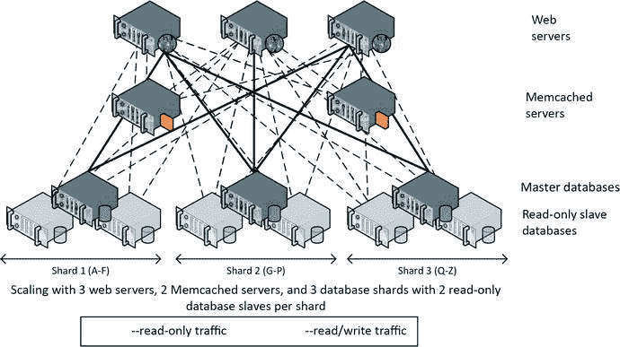

图 3-2.

图 3-1 中的 `Memcached`/复制架构，添加了分片

`Facebook` 使用的确切服务器数量一直在变化，且并非总是公开披露，但在 2011 年左右，他们确实透露其配置中使用了超过 4000 个 `MySQL` 分片和 9000 台 `Memcached` 服务器。这种分片的 `MySQL` 配置支持每秒 14 亿次峰值读取、每秒 350 万行更改和每秒 810 万次物理 `IO`。正如我们将看到的，分片涉及显著的操作复杂性和妥协，但它是一种经过验证的、可在大规模上实现数据处理的技术。

分片概念简单，但实践中极其复杂。应用程序必须包含理解任何特定数据位置的逻辑，以及将请求路由到正确分片的逻辑。分片通常与快速增长相关联，因此这种路由需要是动态的。那些只能通过访问多个分片才能满足的请求，也需要复杂的编码，而在非分片的数据库上，单个 `SQL` 语句可能就足够了。

###### 千刀万剐的分片

分片——与缓存和复制一起——可以说是将关系型数据库扩展至大规模网络应用的唯一途径。然而，分片的运营成本巨大。分片策略的缺点包括：

*   **应用复杂度**：将 `SQL` 请求路由到正确的分片由应用代码负责。在一个静态分片的数据库中，这已经足够困难；然而，大多数大型网站都在增长过程中不断增加分片，这意味着必须实现一个动态路由层。这一层通常需要额外复杂的代码来维护 `Memcached` 对象副本，并区分主数据库和只读副本。
*   **残缺的 `SQL`**：在分片数据库中，无法执行跨分片的 `SQL` 语句。这通常意味着 `SQL` 语句仅限于行级访问。跨分片的连接无法实现，聚合的 `GROUP BY` 操作也无法进行。这实际上意味着只有程序员才能查询整个数据库。
*   **事务完整性丧失**：跨多个分片的 `ACID` 事务是不可能的——或者至少不切实际。理论上，在某些支持`两阶段提交 (2PC)`的数据库系统中可以实现跨数据库的事务——但在实践中，这会造成冲突解决的问题、可能产生瓶颈、对 `MySQL` 存在问题，并且很少被实施。
*   **运营复杂性**：跨分片的负载均衡变得极为棘手。添加新分片需要复杂的数据再平衡。更改数据库模式也需要在所有分片上进行滚动操作，从而导致模式出现暂时的不一致。简而言之，分片数据库需要大量的运营工作和管理员技能。

关系型数据库供应商——特别是 `Oracle`——曾试图创建一种关系型数据库实现，旨在提供分片数据库的可扩展性，同时不牺牲 `ACID` 和关系特性，也避免运营上的麻烦。`Oracle` 的 `真正应用集群 (RAC)` 是透明可扩展、符合 `ACID` 标准的、关系型集群的最重要范例。

在 `Oracle RAC` 数据库中，每个数据库节点都处理位于共享存储设备上的数据。这种共享磁盘集群与无共享模型形成对比，后者被其他集群数据库采用，更适用于数据仓库工作负载。（我们将在第 8 章更详细地比较共享磁盘和无共享架构。）

在 `RAC` 中添加新的数据库节点无需进行任何数据再平衡，并且在这些数据库节点之间实现了一种分布式内存缓存。`Oracle RAC` 曾展现出巨大的前景，并且确实得到了广泛应用。然而，它作为 `MySQL` 分片模型的替代方案却失败了，原因有三：第一，它过于昂贵。第二，它未能证明具备最大型网站所需的可扩展性水平。第三，人们逐渐认识到，没有任何符合 `ACID` 的数据库能够满足世界上最大型网站的需求。这最后一点限制是一种“物理定律”般的约束，在后来被称为 `CAP` 定理中得到了阐述。

###### CAP 定理

2000 年，埃里克·布鲁尔概述了“`CAP`”猜想，后来在提供了数学证明后被确立为定理。`CAP` 定理指出，在一个分布式数据库系统中，你最多只能同时拥有以下三者中的两者：一致性、可用性和分区容忍性。一致性意味着数据库的每个用户在任何给定时刻对数据都有完全一致的视图。可用性意味着在发生故障时，数据库仍保持可操作状态。分区容忍性意味着在分布式系统的两个部分之间的网络发生故障时，数据库仍能维持运行。

在 2000 年，分区容忍性的问题在某种程度上还是理论性的。大多数系统位于单一数据中心内，该数据中心内的冗余网络连接防止了任何分区的发生。如果该数据中心发生故障，或许会启动一个故障转移数据中心。然而，当时几乎没有真正的多数据中心应用。

但随着 Web 系统扩展到全球范围并追求持续可用性，分区容忍性成为一个现实问题。考虑图 3-3 所示的分布式应用。在发生图中所示的网络分区时，系统有两个选择：要么向每个用户显示不同的数据视图，要么关闭其中一个分区并断开其中一个用户的连接。

``

`图 3-3.`

`分布式数据库应用中的网络分区`

`Oracle` 的 `RAC` 解决方案当然支持 `ACID` 事务模型，在网络分区时（在 `Oracle` 领域被称为“脑裂”场景）会选择一致性。其中一个分区会选择关闭。然而，在全球社交网络应用或世界范围的电子商务系统背景下，期望的解决方案是即使牺牲用户之间的某些一致性也要保持可用性。

###### 最终一致性

`CAP` 定理提供了一个严苛的选择：如果你希望系统不受网络分区干扰，就必须牺牲分区间严格的强一致性。

然而，即使不考虑 `CAP` 定理，`ACID` 事务在大型分布式网站中也日益难以为继。这更多地与性能而非可用性有关。在任何高可用的数据库系统中，为了在节点故障时允许系统继续运行，必须维护每个数据元素的多个副本。在全球分布式系统中，将节点分布到世界各地以降低各地的延迟变得越来越可取。然而，为了确保强一致性，有必要确保数据库变更被同步且立即地传播到多个节点。当其中一个节点位于地球的另一端时，这会造成不可避免的延迟增加。

对于银行来说，这种延迟代价是无法避免的。然而，对于包括社交网络和某些电子商务运营在内的许多网站来说，这种全球范围的同步一致性是不必要的。我在澳大利亚的朋友比我在美国的朋友早几秒钟看到我的推文，这无关紧要。只要两位朋友最终都能看到这条推文，我就很满意了。

这种最终一致性的概念已成为许多 `NoSQL` 数据库的关键特性。这一概念最著名的是由亚马逊首席技术官维尔纳·沃格尔斯提出，并在亚马逊的 `Dynamo` 键值存储中得以实现。

#### 亚马逊的 Dynamo

亚马逊开创了许多早期 Web 2.0 时代使用的技术，特别是使用 Perl 语言来整合数据库与 Web 前端。早期的亚马逊使用 Oracle 数据库作为其商品目录、客户详细信息和订单的主要存储库。Oracle 数据库承受的负载是巨大的，亚马逊几次著名的宕机事件都与数据库故障有关。

亚马逊曾尝试将网站拆分为多个功能区域，每个区域可以拥有自己专用的数据库。他们也是面向服务架构（SOA）的早期采用者，在这种架构中，诸如`get-product-details`这样的逻辑服务不是通过 SQL 查询解决，而是通过 Web 服务调用来完成。这使得数据库与应用层解耦，并允许亚马逊尝试替代的数据库技术。

2007 年，亚马逊披露了一个内部开发的替代性非关系型系统的细节，该系统旨在满足其庞大在线网站的需求。这个被称为`Dynamo`的系统，其设计基于以下需求：

*   持续可用性：即使是最短的应用宕机时间，对亚马逊来说也代价高昂。数据存储必须在所有可预见的情况下保持可用。
*   网络分区容忍：作为一个在全球拥有客户和数据中心的全球电子商务供应商，亚马逊最关心的是网络分区不应导致可用性丧失，即使这种丧失仅限于特定地域。
*   无损冲突解决：亚马逊的另一个关键需求是任何订单或购物车更新都不应丢失。例如，如果用户从两台不同的计算机向其购物车添加商品，这两件商品都应出现在最终的购物车中。此外，在任何情况下都不应有人被阻止向其购物车添加商品，这意味着对对象不能有排他的写锁。
*   效率：系统需要快速响应，因为众所周知，即使网站响应时间的微小延迟也会导致在线销售额显著下降。在线顾客是出了名的善变和没耐心。
*   经济性：该系统需要能够在通用硬件上运行。
*   增量可扩展性：应该可以通过少量增量添加服务器来扩展系统，而无需手动维护或停机。

为了达成这些目标，亚马逊愿意在现有数据库的许多特性上做出妥协。

原则上，数据存储应在必要时放宽一致性（在一定限度内）以确保可用性。“在一定限度内”这个说法在这里很重要：系统应优先考虑可用性而非一致性，但要以一种可预测、可控和可管理的方式进行。此外，一致性和可用性之间的权衡应该是可配置的——例如，应用程序应该能够选择在发生网络分区时采取何种措施。

此外，数据存储只需要支持基于主键的访问，无需支持数据模型：通过键查找检索到的值是未结构化的二进制对象。与设计目标为存储海量文件的 Google 的`BigTable`不同，`Dynamo`的假设是大多数对象都很小——小于 1 MB。

`Dynamo`——以及许多受其启发的系统——明确尝试在`CAP 定理`方面取得不同的结果。与其总是以牺牲网络分区容忍性为代价来达成一致性，`Dynamo`允许（尽管不强制要求）转而牺牲一致性。参见图 3-4。

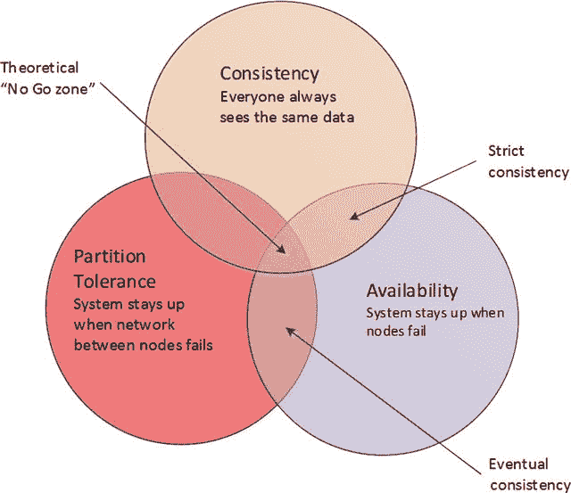

图 3-4. `Dynamo`与`ACID RDBMS`在`CAP 定理`限制下的映射

`Dynamo`已成为许多非关系型数据库的架构模型。（我们将在第 8 章和第 9 章深入探讨`Dynamo`的内部细节。）`Dynamo`的一些关键架构特性包括：

*   一致性哈希：一致性哈希是一种方案，它使用主键的哈希值来确定集群中负责该键的节点，并允许以最小的再平衡开销向集群添加或移除节点。更多细节见下文。
*   可调一致性：应用程序可以指定一致性、读性能和写性能之间的权衡。在`Dynamo`中，可以指定强一致性、最终一致性或弱一致性。更多细节见下文。
*   数据版本控制：由于写操作永远不会被阻塞，系统中可能存在一个对象的多个版本。有时这些版本可以由数据存储本身合并，但有时需要由应用程序或用户来解决。例如，如果买家从两台计算机更新其购物车，结果购物车中可能有重复的物品，他可能需要将其移除。

`Dynamo`系统中有许多复杂的设计特性；其中许多将在第 8 章和第 9 章讨论。然而，如果不稍微详细阐述两个关键特性——`一致性哈希`和`可调一致性`，那将是疏忽。

##### 一致性哈希

当我们对键值进行哈希时，我们会对键值执行数学计算，并使用该计算值来确定存储数据的位置。使用哈希的一个原因是我们能够将数据均匀分布在一定数量的槽位中。最简单的例子是使用取模函数，该函数返回除法的余数。如果我们想将任何数字哈希到 10 个桶中，我们可以使用模 10；那么键 27 将映射到桶 7，键 32 将映射到桶 2，键 25 映射到桶 5，以此类推。

使用这种方法，我们可以将键均匀映射到 10 台服务器上。当我们想确定哪个节点应该存储特定项时，我们会计算其模数并使用结果来定位节点。实际上，哈希函数比简单的取模函数更复杂，一个好的哈希函数总能将哈希值均匀地分布在节点上，无论键值有何种偏斜。

哈希作为在固定数量节点上均匀分布数据的方法效果很好。但如果我们添加或移除一个节点，就会出现问题——我们必须重新计算所有哈希值并重新分配所有数据。例如，如果我们想在上面的模 10 示例中添加一台新服务器，我们将使用模 11 重新计算哈希，然后我们必须相应地移动几乎每个数据项。一致性哈希的工作原理是对键值进行哈希，并应用一种一致的方法将这些哈希值分配到特定节点。

按照惯例，也可能根据联邦法律，一致性哈希方案被表示为环——因为哈希值会“循环回到”0。图 3-5 显示了向现有集群添加一个节点时发生的情况。只有当前映射到新节点“邻居”的那些键需要重新映射。

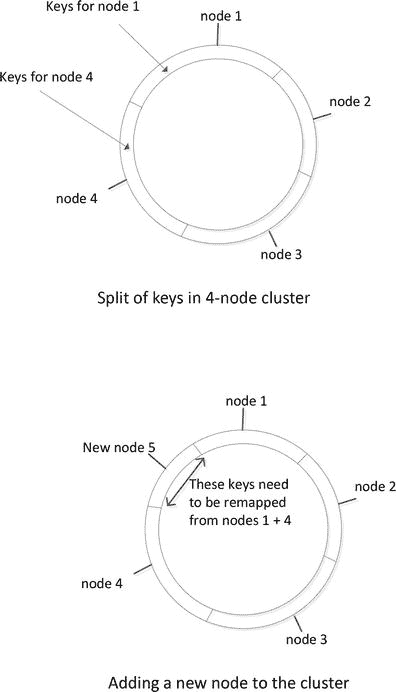

图 3-5. 向一致性哈希方案中添加一个新节点

添加新节点时的重新映射过程仍然是一个开销很大的操作，在实践中，基于`Dynamo`的数据库通常采用“虚拟节点”的变通方法来进一步减少开销。该机制将在第 8 章中详细解释。

### 4. 文档数据库

> 关系型数据库就像一个车库，迫使你把汽车拆成零件，然后分门别类地存进小抽屉里。——面向对象数据社区，20 世纪 90 年代中期
> 对象数据库就像一个衣橱，要求你把领带、内衣、皮带、袜子和鞋子全都挂在西装上一起收纳。——大卫·恩索，同一时期

文档数据库是一种非关系型数据库，它将数据存储为结构化文档，通常采用 XML 或 JSON 格式。“文档数据库”这个定义本身，除了表明其文档存储模型之外，并不隐含任何特定的限制：文档数据库可以自由实现 ACID 事务或其他传统关系型数据库管理系统的特性，不过主流的文档数据库提供的事务支持相对有限。

基于 JSON 的文档数据库在 2008 年非关系型数据库爆发后蓬勃发展，主要有三个原因。首先，它们解决了面向对象编程与关系数据库模型之间的冲突，这种冲突曾令软件开发者感到沮丧，并且是 20 世纪 90 年代中期面向对象数据库运动的重要驱动力。其次，因为自描述的文档格式可以独立于创建它们的程序进行查询，它们支持对数据库进行即席查询访问，这是纯键值存储所缺乏的。第三，它们与主流的基于 Web 的编程范式，特别是 AJAX 编程模型，非常契合。

文档数据库通过允许某种形式的数据描述而无需强制实施模式，或许在关系型数据库的严格模式与完全无模式的键值存储之间，提供了一个令人满意的折中方案。程序员仍然可以随着应用程序内部需求的变化而自由地更改数据模型，但数据使用者仍然能够查询数据以确定其含义。

与 Web 开发编程实践的契合，使得 JSON 文档数据库——尤其是 MongoDB 数据库——成为许多 Web 开发者的默认选择。

注意

将某物描述为文档数据库，仅仅告诉我们它以 XML 或 JSON 格式存储数据。这个术语并未定义任何特定的事务或集群模型。

##### 可调节的一致性

Dynamo 允许应用程序选择应用于特定操作的一致性级别。`NWR` 表示法描述了 Dynamo 如何在一致性、读性能和写性能之间进行权衡：

*   `N` 是数据库为每个数据项维护的副本数量。
*   `W` 是在写入操作完成前必须写入的数据项副本数量。
*   `R` 是应用程序在读取数据项时将访问的副本数量。

当 `W = N` 时，Dynamo 在将控制权交还给应用程序之前，总是会写入每一个副本——这正是 ACID 数据库在实现同步复制时的做法。如果应用程序更关心写性能而不是读性能，那么它可以设置 `W = 1`，`R = N`。这样，每次读取必须访问所有副本以确定哪个是正确的，但每次写入只需在返回控制权之前接触数据的一个副本（其他副本的写入会作为后台任务传播到所有副本）。

最常见的配置可能是 `N > W > 1`。这意味着必须完成多于一次的写入，但并非所有节点都需要立即更新。另一个常见的设置是 `W + R > N`；这确保了最新的值总是会包含在读操作中，即使它混杂在“较旧”的值之中。这有时被称为**法定人数集合**。

图 3-6 展示了各种 `NWR` 设置的示例。根据不同的设置，Dynamo 可以在一致性、可靠性和性能之间进行权衡。

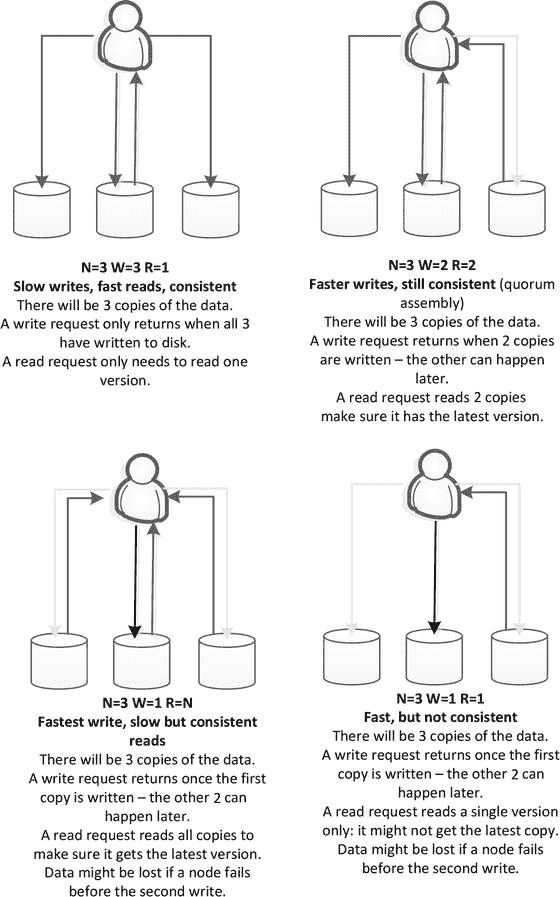

图 3-6.
Dynamo 中的可调节一致性

#### Dynamo 与键值存储家族

实现了 Dynamo 主要特性之一——即通过主键检索二进制值的概念——的系统，被统称为**键值存储**。正如 Google 的 GFS 和 MapReduce 论文成为 Hadoop 的蓝图一样，Amazon 的 Dynamo 论文也成为了许多键值存储的蓝图。

那些正苦恼于分片和其他高难度数据库技术所带来的操作复杂性的 Web 开发者们，早已开始尝试各种非关系型设计。然而，随着 Amazon Dynamo 论文的发布，这些开发者们有了一个经过验证的架构模型可供构建。结果是在 2008 至 2009 年间，涌现出了一批受 Dynamo 启发的系统。这些系统是第一批可识别的 NoSQL 数据库。

诚然，并非所有的键值存储都明确基于 Dynamo 模型。然而，受 Dynamo 启发的系统名单令人印象深刻，其中包括活跃的数据库系统，如 `Riak`、领英的 `Voldemort`、`Cassandra`，当然还有 Amazon 自己的 `DynamoDB`。其中一些系统，如 `Riak` 和 `Voldemort`，或多或少是 Dynamo 架构的精确复制品，而另一些则将 Dynamo 与其他概念结合使用。例如，Apache 的 `Cassandra` 实现了 Dynamo 的一致性哈希和可调节一致性模型，并结合了 BigTable 数据模型的变体。

尽管 Dynamo 代表了最流行且阐述最清晰的键值存储架构，但也存在一些与 Dynamo 设计关系不大或无关的键值存储。这些系统包括 `Redis` 和 `Oracle NoSQL`。

#### 结论

我们已经看到，维护高可用性全球网站的挑战与 ACID 事务模型存在冲突。Brewer 的 CAP 定理以及实践经验表明，在一个像互联网这样不完善的网络中，一个系统无法同时追求强一致性和全局可用性。对于大多数大型网站而言，持续的可用性可能比完美的数据一致性更重要。

尝试在最大型 Web 应用所需的规模上部署关系型数据库，涉及了使用缓存（尤其是 `Memcached`）、只读复制和分片等技术。这种架构模式实际上破坏了数据库的关系型特性和 ACID 特性：一旦数据库被分片，ACID 一致性和即席 SQL 查询访问能力就丧失了。尽管如此，分片解决方案在 Twitter 和 Facebook 等网站上已被证明是有效的。

互联网零售的先驱 Amazon 放弃了将 RDBMS 作为核心数据库，转而支持其内部开发的非关系型键值存储系统 `Dynamo`。`Dynamo` 实现的是**最终一致性**而非严格一致性；对数据的更新最终保证会在整个系统中传播，但可能不会即时被每个用户看到。

`Dynamo` 对许多其他键值存储的设计产生了强大影响，例如 `Riak` 和 `Cassandra`，并且是 Amazon 基于云的数据库 `DynamoDB` 的基础。像 `Dynamo` 这样的系统对其承载的数据不强制任何结构。这使得它们除了程序员之外，对其他人而言都难以理解和使用。正如我们将在下一章看到的，另一类数据库——文档数据库——扩展了键值的概念，要求值必须以 XML 或 JSON 等自描述格式进行结构化。

#### 注

[`http://www.allthingsdistributed.com/files/amazon-dynamo-sosp2007.pdf`](http://www.allthingsdistributed.com/files/amazon-dynamo-sosp2007.pdf)

#### XML 与 XML 数据库

最初的文档数据库是围绕 XML 文档标准构建的。XML 数据库之所以引起我们的兴趣，主要是作为现代 JSON 文档数据库的架构前身；如今，XML 数据库在整个数据库市场中占据重要但小众的地位。

`XML`（可扩展标记语言）的出现，源于开发一种通用标记语言作为`SGML`等各类专用格式后继的努力，以及认识到`HTML`——Web 1.0 的基础——将布局和数据不恰当地结合在了一起。`XML`能够表示几乎任何形式的信息，再加上控制呈现的`层叠样式表（CSS）`，使得第二代网站能够将数据和格式分离。

除了这些 Web 2.0 用例外，`XML`还被广泛使用，并成为许多文档类型的标准格式，最终甚至包括文字处理文档和电子表格。`XML`也是许多数据交换协议的基础，特别是，它是`SOAP`（简单对象访问协议）等 Web 服务规范的基础。

在 21 世纪初，人们普遍预期，组织中关系数据库之外的大多数文档最终都将表示为`XML`。尽管`XML`的发展势头有所放缓，但如今，种类繁多的文档类型仍在底层使用`XML`。

##### XML 工具与标准

`XML`拥有一个丰富的生态系统支持，其中包括各种标准和工具，用以辅助`XML`文档的创作、验证、搜索和转换。这些包括：

*   `XPath`：一种从`XML`文档中检索特定元素的语法。`XPath`提供了一种简单方便的方法，使用通配符和标签引用来过滤文档。
*   `XQuery`：一种用于查询`XML`文档的查询语言。相关的`XQuery Update`规范提供了修改文档的机制。`XQuery`有时被称为“`XML`的`SQL`”。
*   `XML 模式`：一种特殊类型的`XML`文档，用于描述某类指定的`XML`文档中可能存在的元素。`XML 模式`可用于验证文档是否格式正确，或辅助程序查询符合该格式的`XML`文档。
*   `XSLT`（可扩展样式表语言转换）：一种将`XML`文档转换为其他格式（包括`HTML`等非`XML`格式）的语言。
*   `DOM`（文档对象模型）：一种面向对象的`API`，程序可用它与`XML`、`XHTML`及类似结构的文档进行交互。

作为“`XML`的`SQL`”，`XQuery`在大多数`XML`数据库架构中占据重要地位。图 4-1 展示了一个简单的`XQuery`语句示例，该语句搜索包含嵌入式`CITY`元素且其中含有字符串“Berlin”的`ADDRESS`元素的文档。

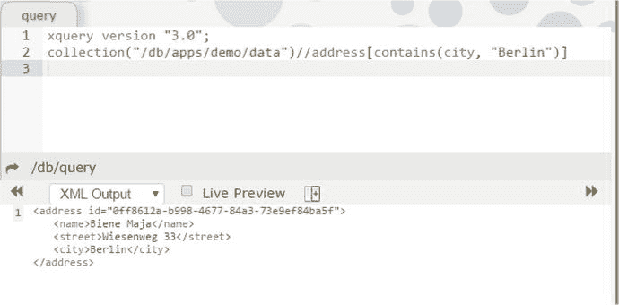
图 4-1. `XQuery`示例

##### XML 数据库

组织内部`XML`文档数量的不断增长，推动了某种形式的`XML`文档管理系统——或原生`XML`数据库的出现。

`XML`数据库通常由一个平台构成，该平台实现了`XQuery`和`XSLT`等各种`XML`标准，并为`XML`文件的存储、索引、安全和并发访问提供服务。图 4-2 展示了一个简化的通用`XML`数据库架构。

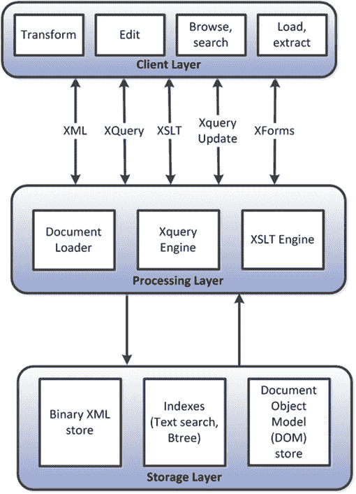
图 4-2. 通用`XML`数据库架构

在 21 世纪前半叶，出现了多种`XML`数据库，并得到了健康的采用。然而，它们并非被定位为`RDBMS`的替代品，而是作为一种管理许多组织面临的`XML`文档激增问题的手段。

两个较为重要的`XML`数据库包括开源的`eXist`和商业的`MarkLogic`。

##### 关系型系统中的 XML 支持

关系型数据库厂商都在其核心产品中引入了`XML`支持，通常允许将`XML`文档存储在数据库表的`long/BLOB`列中，并提供对`DOM`、`XSLT`和`XQuery`等各种`XML`标准的支持。此外，`XML`支持被添加到`ANSI SQL`定义（`SQL/XML`）中，允许在标准`SQL`语言语句中进行`XML`操作。对这些`SQL`扩展的支持出现在`Oracle`、`Postgres`、`DB2`、`MySQL`和`SQL Server`中。

#### JSON 文档数据库

`XML`作为基于文件的文档和数据交换的标准格式具有许多优点。但对于严肃的数据库应用来说，它作为存储格式也有一些缺点。`XML`因浪费空间且处理开销大而受到合理批评。`XML`标签冗长且重复，通常会使所需存储量增加数倍。部分由于这个原因，`XML`语言格式的解析成本相对较高。

长期以来，`XML`一直是结构化文件的主要格式，但对于数据交换和文档数据库本身而言，一种较新的格式——`JavaScript 对象表示法（JSON）`——承诺了更大的好处，并已取得了远比其`XML`前身更大的普及度。

基于`JSON`的文档数据库和基于`XML`的文档数据库有许多相似之处，其中最不重要的就是`XML`和`JSON`格式之间的表面相似性。然而，两者的设计是为了支持截然不同的用例和差异显著的应用程序。`XML`数据库通常用作内容管理系统；即，组织和维护`XML`格式的文本文件集合——学术论文、商业文档等。另一方面，`JSON`文档数据库主要支持基于 Web 的操作型工作负载——存储和修改现代 Web 应用程序核心的动态内容和事务数据。

**注意**
`JSON`和`XML`是相似的格式，但`XML`文档数据库和`JSON`文档数据库通常支持不同的应用程序。`XML`文档数据库擅长内容管理系统，`JSON`文档数据库通常旨在支持操作型 Web 应用程序。

##### JSON 与 AJAX

`JSON`由 JavaScript 先驱 Douglas Crockford 创建，是构建更动态、更具交互性的 Web 应用程序框架的尝试的一部分。`JSON`被明确设计为`XML`的一种更轻量级的替代品，并在`AJAX`编程模型中成为`XML`的重要替代品，该模型在 21 世纪中期推动了 Web 应用程序的革命。

`AJAX`（异步 JavaScript 和`XML`）是一种灵活的编程模式，其中 Web 浏览器上的`JavaScript`通过异步交换`XML`或`JSON`文档与后端 Web 服务器通信，而不是通过交换完整的`HTML`页面。正是`AJAX`使得开创性的 Web 应用程序（如`Google Maps`和`Gmail`）能够提供丰富且交互式的体验。

尽管`AJAX`中的“`X`”指的是`XML`，但`JSON`文档也可用作与 Web 服务器交互的媒介。实际上，由于其与`JavaScript`的紧密集成，`JSON`在数据交换方面逐渐变得比`XML`更受欢迎。在引入`AJAX`方法后的几年内，所有严肃的 Web 开发人员都熟悉了`JavaScript`编程和`JSON`模型。

图 4-3 比较了`JSON`和`XML`文档的外观。

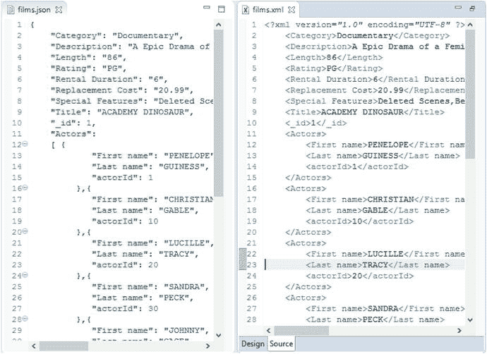
图 4-3. `XML`与`JSON`文件格式比较

##### JSON 数据库

###### 概述

以 Amazon Dynamo 为代表的键值存储数据库的兴起，加上 JSON 作为数据交换格式的日益普及，为 JSON 文档数据库的出现奠定了基础。

并没有一个单一的规范或宣言来阐述基于 JSON 的文档数据库应具备哪些属性。要成为一个 JSON 文档数据库，你只需以 JSON 格式存储数据即可。

###### 存储层级

在 JSON 文档数据库中，存储的层级结构通常如下：

*   `文档` 是基本存储单元，大致对应于关系数据库管理系统（RDBMS）中的一行。一个文档包含一个或多个键值对，还可以包含嵌套文档和数组。数组中也可以包含文档，从而形成复杂的层次结构。
*   `集合` 或数据桶是一组具有某些共同用途的文档；这大致相当于关系型数据库中的表。集合中的文档不必是同类型，但通常一个集合中的文档代表某一共同类别的信息。

###### 数据建模

虽然从理论上讲，文档数据库可以像关系型系统中那样精确地实现第三范式模式，但文档数据库更通常采用较少的集合来建模数据，并用嵌套文档来表示主从关系。

例如，考虑一个电影和演员的数据库。在关系数据模型中，我们会将演员和电影分别表示在不同的表中，并创建一个 `连接` 表来表明哪些演员出演了哪些电影，如图 4-4 所示。

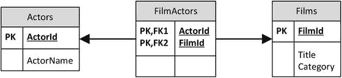

图 4-4. 简单的关系型电影数据库

在 JSON 文档数据库中，我们可以创建三个集合，其键值对应于关系模式中的列——但这样做会显得很不自然。文档数据库通常不提供 `连接` 操作，而且程序员通常希望 JSON 结构能紧密映射到其代码的对象结构。因此，更自然的方式是如图 4-5 所示来表示这些数据。

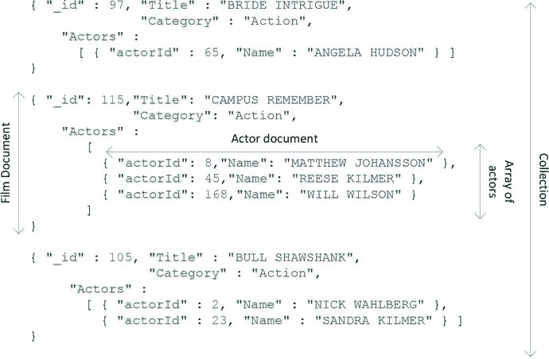

图 4-5. JSON 电影集合

#### 文档数据库中的数据模型

在图 4-5 中，“演员”作为数组嵌套在“电影”文档内。这种模式通常被称为文档嵌入。该设计模式的优点在于允许在一个操作中检索出一部电影及其所有演员，并且避免了在应用程序代码中执行连接操作。

另一方面，这种方法会导致“演员”信息在多个文档中重复出现，在复杂的设计中，如果任何“演员”属性需要更改，这可能会导致问题，并可能引发不一致。一部电影中的演员数量相对较少，但在其他应用场景中，如果嵌套文档中的成员数量无限增长（因为单个 JSON 文档的大小通常有上限——例如在 `MongoDB` 中是 `64MB`），也会出现问题。

由于这些原因，数据库设计者可能会选择使用文档标识符来链接多个文档，这很像关系数据库通过外键关联行的方式。例如，在图 4-6 中，我们在“电影”文档中嵌入了一个演员 ID 数组，可用于定位出演某部电影的演员。

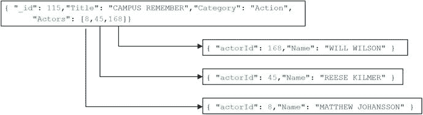

图 4-6. 在文档数据库中链接文档

在图 4-7 中，我们看到文档链接的另一个例子。在这个例子中，设计采用了关系风格：一个链接文档将电影与演员关联起来。虽然这对文档数据库来说有些不自然，但对于某些工作负载，它可能在性能和可维护性之间提供最佳平衡。

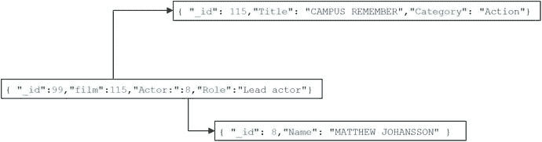

图 4-7. 文档链接可以类似于关系型第三范式

文档数据库中的数据建模不如关系数据库那样确定性强：没有类似第三范式的东西来定义一个“正确”的模型。此外，关系数据库的建模主要由待存储数据的性质驱动，而在文档数据库中，要执行的查询的性质则重要得多。

#### 早期的 JSON 数据库

由 Damien Katz 创建的 `CouchDB` 是第一个著名的基于 JSON 的数据库系统。Damien Katz 曾参与开发 `Lotus Notes`——一个具有强大文档处理能力的协作系统。2005 年，他决定创建一个更贴近 Web 开发和面向对象编程模型的数据库系统。其成果就是 `CouchDB`。

最初，`CouchDB` 是用 `C++` 编写的，存储的是 `XML` 文档。大约在 2007 年，出现了新的架构，将 `JSON` 作为主要存储格式，包含一个 JavaScript 命令和查询接口，以及一个用 `Erlang` 语言重写的核心引擎。

随着其发展成熟，`CouchDB` 借鉴了其他曾启发键值存储和 `Hadoop` 的范式，包括 `MapReduce` 的 JavaScript 实现、`最终一致性` 和多版本模型，以及基于哈希的集群/分片模型，以允许 `CouchDB` 跨节点扩展。

`CouchDB` 于 2008 年成为 `Apache` 项目，并得到了 `IBM` 的支持。2009 年，成立了商业公司 `couch.io`（后来更名为 `CouchOne`）来维护和推广该技术。

#### MemBase 与 CouchBase

当 2009 年对非关系数据库的兴趣爆发时，`CouchDB` 已经有多年的积极开发，并且似乎能很好地受益于围绕“`NoSQL`”日益增长的热度。

`Membase` 是这一时期另一个获得显著采用的非关系系统。`Membase` 数据库为极受欢迎的 `Memcached` 框架（我们在第 3 章讨论过）提供了持久化变体。`Memcached` 是一个分布式只读对象缓存，通常与 `MySQL` 一起部署以减轻数据库负载。对象分布在多个 `Memcached` 节点上，可以通过哈希键查找来定位。如果数据存在于 `Memcached` 服务器中，就可以避免数据库读取。

`Membase` 提供了一个兼容 `Memcached` 的解决方案，其中数据也可以被修改并持久化到磁盘。因此，对于那些已经投资于 `Memcached` 技术的用户来说，`Membase` 特别有吸引力，它提供了将应用程序从 `Memcached`/`MySQL` 转换到 `Membase` 的可能性。`Membase` 最初作为极具人气的 `Zynga` 在线游戏 `Farmville` 的底层数据库而闻名。

与此同时，尽管 `CouchDB` 有许多技术成就，但 `CouchDB` 数据库和 `CouchOne` 公司似乎在建立商业生态位方面举步维艰；它缺乏一个可行的横向扩展架构。2011 年初，宣布了 `Membase` 和 `CouchOne` 的合并。合并后的公司名为 `CouchBase`。`CouchBase` 将现有的 `CouchDB` 代码捐赠给了 `Apache` 社区，并着手进行一项新的工作，以融合 `CouchDB` 和 `Membase` 的功能。在最终的 `Couchbase` 服务器中，来自 `CouchDB` 的 JSON 引擎与来自 `Membase` 的兼容 `Memcached` 的键值层被合并在一起。

`Couchbase` 继承了 `CouchDB` 用于创建查询和视图的 `MapReduce` 接口，但 `Couchbase 4.0` 引入了一个类似 `SQL` 的文档访问层，称为 `N1QL`（非第一范式查询语言）。有关此内容以及其他类似 `SQL` 的 `NoSQL` 接口的更多详细信息，请参见第 11 章。

#### MongoDB

2007 年，刚刚被`Google`收购的在线广告投放公司`Double Click`的创始人和资深工程师们，成立了一家名为`10gen`的新创公司。该公司的目标是创建一个类似于`Google App Engine`的`PaaS`（平台即服务）产品。这个平台需要一个可扩展且弹性十足的数据存储引擎；由于没有合适的现成候选方案，团队便自己创建了一个数据库，并将其命名为`MongoDB`。2008 年，`10gen`转型，专注于`MongoDB`，并于 2009 年以开源许可证发布了该产品，同时提供商业企业版分发。

`MongoDB`是一个面向`JSON`的文档数据库，尽管其内部使用了一种称为`BSON`的二进制编码变体。`BSON`格式相比`JSON`具有更低的解析开销，并且对日期和二进制数据等数据类型提供更丰富的支持。

`MongoDB`提供了一个基于`JavaScript`的查询能力，相对容易学习——至少与最初在`CouchDB`中必需的`MapReduce`方法相比是如此。图 4-8 比较了使用`MongoDB`的`JavaScript`查询来检索由特定演员出演的电影，以及在`MySQL`中等效的`SQL`语句。我们将在第 11 章详细探讨`MongoDB`查询语言。

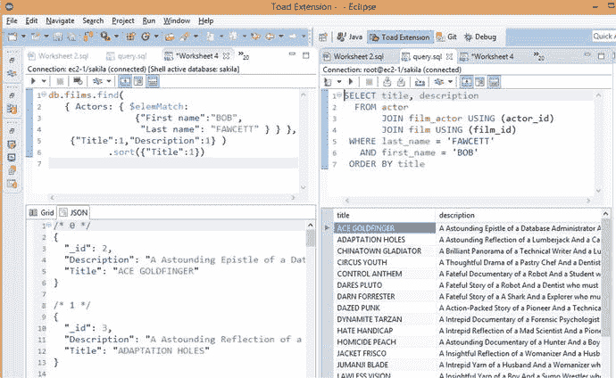

图 4-8. `MongoDB`的`JavaScript`查询及其`SQL`等效语句

通过提供开发者友好的生态系统和架构，`MongoDB`在`NoSQL`数据库领域确立了强大的领先地位。寻求非关系型替代方案——通常替代`MySQL`或`Oracle`——的开发者发现，`MongoDB`相对容易上手。由开发者主导的`MongoDB`采用度很高，如今`MongoDB`可以称得上是使用最广泛的非关系型数据库。

在许多方面，如今`MongoDB`的崛起类似于上个世纪`MySQL`的盛行。在这两种情况下，这些数据库进入组织并非源于某种战略技术计划，而是由于它们在开发者中的流行。正如`MySQL`在 21 世纪初成为`LAMP`（Linux-Apache-`MySQL`-PHP）技术栈应用的默认数据库一样，`MongoDB`似乎也在现代 Web 开发社区中取得了类似的地位。

`MongoDB`可能缺乏其他`NoSQL`产品（如`Cassandra`或`HBase`）的某些可扩展性和吞吐量能力，尽管 3.0 版本中`WiredTiger`存储引擎的实现为基础引擎带来了显著的能力提升。尽管如此，它已为许多高端、大规模的网站提供支持，并且看起来在不久的将来将成为领先的`NoSQL`数据库。

##### JSON, JSON, 无处不在

`JSON`在现代文档数据库中的核心作用并不妨碍其在其他系统中的使用。

正如关系型世界接纳了`XML`并将`XML`特性引入`SQL`标准一样，许多`RDBMS`供应商也提供了对`JSON`的原生支持。例如，`Oracle`和其他关系型供应商已经在`SQL`语言中引入了特性，允许在`SQL`语句中操作存储在数据库表中的`JSON`文档。实际上，正如我们将在第 12 章看到的，`Oracle`现在为`JSON`提供了完全非`SQL`的访问路径。

当然，将`JSON`文档存储在键值存储对象中一直是可能的，而且并不少见。然而，像`Riak`这样的纯键值数据库也引入了支持`JSON`的索引方案。此外，最新版本的`Cassandra`数据库允许将`JSON`结构直接映射到`Cassandra`表列。

`MarkLogic`——本章前面提到的成功的商业`XML`数据库供应商——在 2014 年增加了对原生`JSON`存储的支持。基于其作为`XML`数据库的广泛渗透，`MarkLogic`现在可以声称自己是现代文档数据库市场的领先竞争者，尽管`MarkLogic`能否突破其`XML`内容管理的利基市场，直接与`MongoDB`和`CouchBase`等数据库竞争，赢得 Web 应用程序开发者的青睐，还有待观察。

无论如何，我们可以预期在几乎所有数据库系统中都会看到一定程度的`JSON`支持。

#### 结论

文档数据库通过采用文档格式——`XML`或`JSON`——作为数据模型，区别于其他关系型和非关系型系统。支持`XML`文档格式的文档数据库主要作为内容管理系统非常重要，为基于`XML`的文本文件提供管理仓库。另一方面，`JSON`文档数据库使用`JSON`文档作为基于 Web 的应用程序的数据层——这是以前`MySQL`所承担的任务。在某种程度上，基于`XML`的文档数据库代表了上一代数据库系统，而`JSON`数据库则可以说是下一代。

`JSON`的流行以及关系型数据库和键值存储中对`JSON`日益增长的支持，模糊了最初存在于像`MongoDB`这样的数据库与受`Dynamo`启发的数据库（如`Riak`）之间的界限。在不久的将来，对`JSON`的支持可能成为所有数据库的共同特性，而不是区分特定数据库技术细分市场的特性。

然而，如今`JSON`文档数据库在下一代数据库系统中代表了一个独特且重要的细分领域。它们提供了超越纯键值存储的有用功能，特别是在程序员生产力和数据可访问性方面。

`JSON`的简单自描述模型和简单的键值访问路径对于以简单`CRUD`（创建、读取、更新、删除）访问路径为主导的 Web 应用程序非常有效。然而，现代应用程序生成的数据模型不仅日益超越面向文档的键值存储的复杂度，甚至也超出了关系模型舒适的建模能力。我们将在下一章探讨这些图数据库。

