# 5. 表格并非友好之选：图数据库

> 谷歌曾试图衡量人们所思所想，最终自身成为了人们所思所想。Facebook 曾试图绘制社交图谱，最终自身成为了社交图谱。——乔治·戴森，《图灵的大教堂》
> 无论何时有人给你一个问题，去思考图。——史蒂夫·耶格，《在谷歌找到那份工作》（博客文章）

键值存储、文档数据库和关系型系统的拥护者们几乎在数据库设计的方方面面都存在分歧，但他们在一个观点上达成了一致：数据库是关于存储“事物”的信息，无论这些事物是由 `JSON`、`表格`还是二进制值来表示。但有时，我们主要关注的是事物之间的关系，而非事物本身。这正是图数据库系统大放异彩之处。

图结构对我们来说最熟悉的例子来自诸如 Facebook 这样的社交网络。在 Facebook 中，关于个人的信息固然重要，但正是人与人之间的网络——社交图谱——赋予了该平台独特的力量。类似的面向图的数据集也存在于网络拓扑、访问控制系统、医疗模型等领域。

关系型数据库完全有能力通过使用 `外键` 和 `自连接` 来为这类网络建模。不幸的是，当处理非常庞大的图时，`RDBMS` 通常会遇到性能问题，而且 `SQL` 缺乏一种能够有效处理图数据的表达性语法。

到目前为止描述的 NoSQL 解决方案在处理图模型方面甚至比关系型数据库更差。在键值存储或文档数据库中，图结构可以存储在单个文档或对象中，但对象之间的关系并不是原生支持的（因为没有连接操作）。

要高效处理一种以对象或实体间复杂关系网络为主要焦点的数据模型，需要一种不同类型的数据库：图数据库。

#### 什么是图？

与关系型数据库类似，但与许多非关系型系统不同，图数据库基于坚实的理论基础。图论是数学中一个历史悠久的分支，在医学、物理学、社会学以及计算机科学中有许多实际应用。

图论定义了图的这些主要组成部分：

*   顶点，或称“节点”，代表不同的对象。
*   边，或称“关系”或“弧”，连接这些对象。
*   节点和边都可以拥有属性。

虽然在数学理论中最常用的是顶点和边这两个术语，但在本章中，我们将更多地使用“节点”和“关系”，因为这些术语能让语言更简洁明了。

节点和关系都可以有属性。节点的属性与你可能在关系表或 `JSON` 文档中找到的属性相似。关系的属性可能包括关系的类型、强度或历史。

图 5-1 展示了一个简单的图，包含四个节点（顶点）和三条关系（边）。

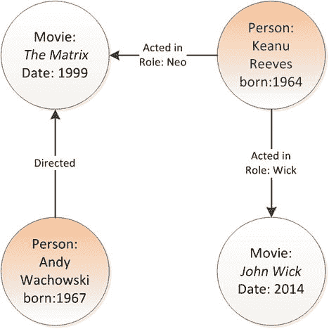

图 5-1. 包含四个顶点（节点）和三条边（关系）的简单图

图论提供了用于从图中定义或移除节点或关系，以及执行操作来查找相邻节点的数学符号。这些基本操作可用于执行图遍历——穿过图来探索网络。举一个熟悉的例子，Facebook 有时会执行图遍历来查找你朋友的朋友。在图 5-1 所示的例子中，我们可能会执行图遍历来查找所有曾与基努·里维斯共同主演过电影的演员。

#### 图的 RDBMS 模式

在关系模型中表示图结构相对容易。例如，我们可以创建如图 5-2 所示的关系结构来表示图 5-1 所示的图。

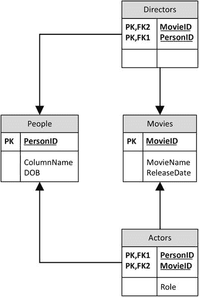

图 5-2. 表示我们示例图数据的关系模式

虽然关系模型可以轻松地表示图模型中包含的数据，但在实践中我们面临两个显著问题：

`SQL` 缺乏能够轻松执行图遍历的语法，尤其是那些深度未知或无界的遍历。例如，使用 `SQL` 查找你朋友的朋友还算容易，但要解决“分隔度”问题（通常用与凯文·贝肯相隔多少连接的例子来说明）就很困难了。
当我们遍历图时，性能会迅速下降。每增加一级遍历，查询响应时间都会显著增加。

例如，考虑找出所有曾与基努·里维斯合作过的演员所需的 `SQL`。它可能如图 5-3 所示。

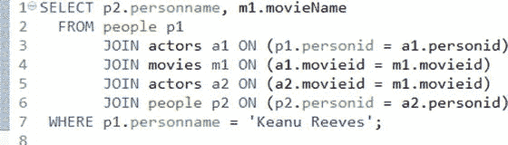

图 5-3. 执行一级图遍历的 SQL

此 `SQL` 查询 `PEOPLE` 表以找到基努，然后查询 `ACTORS` 和 `MOVIES` 表以找到他主演的电影，接着再次查询 `ACTORS` 和 `PEOPLE` 表以找到出演过那些电影的其他演员。像这样的五表连接尚可管理，但随着我们遍历得更深，每增加一次搜索深度，我们就必须再添加三个连接。此外，没有语法允许我们搜索到任意深度。因此，例如，如果我们想展开整个图，我们做不到，因为无法预先知道需要检查多少层级。

`RDBMS` 中的性能也是一个潜在问题。假设创建了适当的索引，我们上面的示例查询将以可接受的开销执行。但每次连接都需要为每个演员和电影进行索引查找。每次索引查找都会增加开销，对于深度图遍历来说，性能通常是不可接受的。有时最好的解决方案是将表完整加载到应用程序代码中的映射结构中，并在内存中遍历图。然而，这假设应用程序代码中有足够的内存来缓存所有数据，但情况并非总是如此。

由于键值存储不支持连接，它们提供的图遍历能力甚至比关系数据库更少。在纯粹的键值存储或文档数据库中，图遍历逻辑必须完全在应用程序代码中实现。

##### RDF 与 SPARQL

资源描述框架（RDF）是一种网络标准，于 1990 年代后期开发，用于对网络资源及其之间的关系进行建模。它代表了最早用于表示和处理图形数据的标准之一。

RDF 中的信息以三元组的形式表示，概念上形如 `实体：属性：值；` 例如：

`TheMatrix: is :Movie`
`Kenau: is :Person`
`Kenau: starred in: TheMatrix`

RDF 旨在作为一种在万维网上为资源（特别是 Web 服务）及其所依赖的依赖关系创建正式数据库的方法。

RDF 图可以以多种格式存储，包括 XML，甚至可以存储在关系数据库的表中。然而，原生 RDF 数据库（称为三元组存储）也已被实现。这些包括 AllegroGraph、Ontotext GraphDB、StarDog 和 Oracle Spatial。

RDF 支持一种查询语言 SPARQL（一个递归首字母缩写词：SPARQL 协议和 RDF 查询语言），这是一种类似于 SQL 的语言，用于查询 RDF 数据。图 5-4 展示了一个 SPARQL 查询，它正在查询 DBpedia（维基百科部分数据的 RDF 表示）以查找所有以 Edgar Codd 为主题的条目。

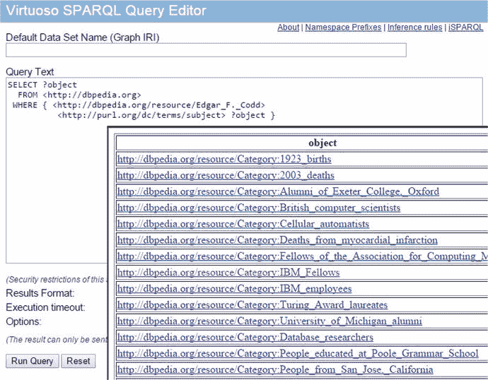

图 5-4. 使用 SPARQL 查询 DBpedia

##### 属性图与 Neo4j

虽然 RDF 是一项重要的图技术，但属性图模型通过为节点和关系关联属性，提供了一个更丰富的模型来表示复杂数据。

属性图模型是 Neo4j 的基础，它是最广泛采用的图数据库。Neo4J 是一个基于 Java 的图数据库，可以轻松嵌入任何 Java 应用程序或作为独立服务器运行。Neo4j 支持数十亿个节点、符合 ACID 的事务以及多版本一致性。

Neo4j 实现了一种声明式图查询语言 Cypher。Cypher 允许使用类似于 SQL 或 SPARQL 的简单语法来查询图，但特别针对图遍历进行了优化。

以下 Cypher 语句将在 Neo4J 内部创建如图 5-1 所示的图形结构：

```cypher
CREATE `(TheMatrix:Movie {title:'The Matrix', released:1999,`
        `tagline:'Welcome to the Real World'})`
CREATE `(JohnWick:Movie {title:'John Wick', released:2014,`
        `tagline:'Silliest Keanu movie ever'})`
CREATE `(Keanu:Person {name:'Keanu Reeves', born:1964})`
CREATE `(AndyW:Person {name:'Andy Wachowski', born:1967})`
CREATE
  `(Keanu)-[:ACTED_IN {roles:['Neo']}]->(TheMatrix),`
  `(Keanu)-[:ACTED_IN {roles:['John Wick']}]->(JohnWick),`
  `(AndyW)-[:DIRECTED]->(TheMatrix)`
```

以下 Cypher 查询检索图中单个节点的信息：

```
neo4j-sh (?)$ `MATCH` `(kenau:Person {name:"Keanu Reeves"})`
>`              `RETURN` `kenau;`
`+----------------------------------------+`
`| kenau                                  |`
`+----------------------------------------+`
`| Node[1]{name:"Keanu Reeves",born:1964} |`
`+----------------------------------------+`
```

`MATCH`子句大致等同于 SQL 中的`WHERE`子句，而`RETURN`子句则等同于`SELECT`列表。

`MATCH`支持一种用于遍历图中关系的语法。例如，以下查询查找所有曾与基努·里维斯在同一部电影中出演过的演员：

```
neo4j-sh (?)$ `MATCH` `(kenau:Person {name:"Keanu Reeves"})`
              `-[:ACTED_IN]->(movie)<-[:ACTED_IN]-(coStar)`
              `RETURN` `coStar.name;`
`+----------------------+`
`| coStar.name          |`
`+----------------------+`
`| "Jack Nicholson"     |`
`| "Diane Keaton"       |`
`| "Dina Meyer"         |`
`| "Ice-T"              |`
`| "Takeshi Kitano"     |`
```

在上面的例子中，我们指定了关系类型（`ACTED_IN`）和节点类型（`movie`）。我们也可以指定通配符来匹配所有关系或节点类型，并且可以指定遍历的深度，如下面的查询所示，它匹配从“基努·里维斯”两步遍历范围内的所有节点。此列表将包括他出演的所有电影，以及所有联合主演和导演。

```
neo4j-sh (?)$ `MATCH` `(kenau:Person {name:"Keanu Reeves"})`
              `-[*1..2]-(related)` `RETURN` `distinct related;`
`+------------------------------------------------------------------------`
`| related`
`+------------------------------------------------------------------------`
`| Node[0]{title:"The Matrix",released:1999,`
          `tagline:"Welcome to the Real World"}`
`| Node[7]{name:"Joel Silver",born:1952}`
`| Node[5]{name:"Andy Wachowski",born:1967}`
`| Node[6]{name:"Lana Wachowski",born:1965}`
```

正如 SQL 查询生成结构化为表格的结果集一样，Cypher 返回的结果本身也可以是图。例如，在图 5-5 中，我们生成了一个图，显示了与“基努·里维斯”相关的所有节点，向外延伸两级。

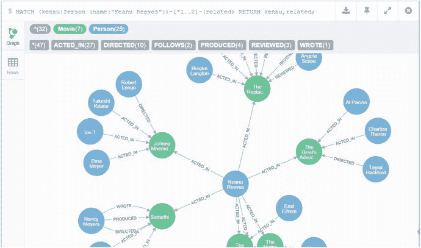

图 5-5. Cypher 查询的图输出

##### Gremlin

虽然易于使用，但 Cypher 直到最近还仅限于 Neo4J。Gremlin 是另一种图数据库查询语言，可以与 Neo4J 以及多种其他图引擎一起使用，包括 Titan（现为 Datastax Cassandra 发行版的一部分）和 OrientDB。

与 Cypher 的非过程化、类似 SQL 的风格相比，Gremlin 是一种更面向过程的语言。使用 Gremlin，程序员声明要执行的具体遍历操作——可能使用多条语句。

图 5-6 展示了 Gremlin 的“示例”数据库。该数据库包含六个顶点（节点），定义了四个人和两个项目。有些人创建了项目，有些人认识其他人。

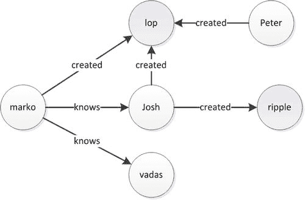

图 5-6. Gremlin 示例图数据库

在 Gremlin 表示法中，`V`代表顶点/节点，而`E`代表边/关系：

```
gremlin> `myGraph.V.map`
==>{name=marko, age=29}
==>{name=vadas, age=27}
==>{name=lop, lang=java}
==>{name=josh, age=32}
==>{name=ripple, lang=java}
==>{name=peter, age=35}
gremlin> `myGraph.E`
==>e[11][4-created->3]
==>e[12][6-created->3]
==>e[7][1-knows->2]
==>e[8][1-knows->4]
==>e[9][1-created->3]
==>e[10][4-created->5]
```

此命令显示 Marko“认识”的人：

```
gremlin> `marko=myGraph.v(1)`
==>v[1]
gremlin> `marko.out('knows').name`
==>vadas
==>josh
```

此命令遍历树结构以查找 Marko 认识的人所创建的项目：

```
gremlin> `marko.out('knows').out('created').name`
==>lop
==>ripple
```

2015 年末，Neo 技术公司宣布了 Cypher 语言的开源版本。Oracle 和 Databricks（Spark 公司）以及其他几家供应商已宣布支持这种 openCypher 语言。考虑到 Neo4j 的流行以及 Cypher 提供的可能更易上手的语法，Gremlin 作为替代语言的动机很可能会减弱。


#### 图数据库内部原理

图处理可以在各种数据库上执行，无论其内部存储格式如何。本章开头概述的图数据库逻辑模型几乎可以在任何数据库系统上实现；实际上，关系型系统可以在不妥协的情况下实现图中的逻辑关系。然而，正如我们之前讨论的，关系型系统上的性能——即使有最优索引——也会随着图遍历深度的增加而下降。要在实践中实现高效的实时图处理，需要一种能够无需索引查找即可遍历图结构的方式。这种无需索引的导航方式被称为 `无索引邻接`。

例如，要在关系模型（如图 5-2 所示）中实现一个图，需要使用一个连接表来在代表相邻节点的两行之间进行导航——这两行可能位于同一个表中。索引允许将相邻行的逻辑键值转换为数据库内的物理地址。然后可以快速访问此物理地址。在典型的实现中，遍历 B-Tree 索引需要三到四次逻辑 IO 操作，以及进一步的查找以检索值。这些 IO 操作可能在缓存内存中得到满足，但通常需要一些物理 IO。

正如我们之前讨论的，索引查找通常足以应对浅层遍历，但随着遍历深度增加，它们会导致性能下降。具体实现因数据库类型而异，但需要创建索引来促进图遍历是所有非图数据库的共同特点。

在利用 `无索引邻接` 的原生图数据库中，每个节点都知道所有相邻节点的物理位置。因此，无需使用索引即可高效导航图，因为每个节点都“指向”所有相邻节点。

毫不奇怪，对于图遍历操作，原生图数据库的性能远超其他实现方式。然而，这种架构在将图分布到多个服务器上时带来了挑战。虽然一个节点当然可以指向位于另一台机器上的相邻节点，但跨多台机器路由遍历的开销消除了图数据库模型的优势，因为服务器间通信远比本地访问耗时得多。因此，许多像 `Neo4j` 这样的纯图数据库目前不支持分布式部署——图数据库只能在单台服务器上运行。

#### 图计算引擎

纯图数据库当然擅长图处理，但对于典型应用中的所有工作负载来说，它们很少是最优选择。相反，许多应用——即使其主要工作负载由非图数据库技术满足——有时也需要能够执行高效的图遍历。

此外，正如我们之前讨论的，纯图模型难以处理大规模分布式数据集，因为跨多台物理机器执行基于图的遍历效率低下。

图计算引擎为那些希望将图处理与其他数据模型合并的数据库，以及需要在大规模分布式数据集上进行图处理的场景提供了解决方案。图计算引擎实现了高效的图处理算法并提供了图 API，但它并不假设或要求数据必须以我们之前讨论的 `无索引邻接` 图格式存储；底层数据集可以保存在关系数据库、NoSQL 系统或 Hadoop 中。图计算引擎并不总是提供纯图数据库所具备的高效实时图遍历；相反，它们往往擅长处理整个图或图大部分内容的批处理操作。

重要的图计算引擎包括：

*   `Apache Giraph`：一个设计用于在 Hadoop 数据上运行、使用 MapReduce 的图处理系统。
*   `GraphX`：一个图处理系统，是伯克利数据分析栈的一部分，该栈包括 Spark（见第 7 章）。它使用 Spark 作为图处理的基础，就像 Giraph 使用 MapReduce 一样。
*   `Titan`：一个图数据库，可以构建在大数据存储引擎之上，包括 HBase 和 Cassandra。Cassandra 的商业供应商 Datastax 于 2014 年收购了 Titan 的商业赞助商 Aurelius。

###### 总结

图数据库在数据库技术中占据了一个特定且重要的 niche。与键值存储和文档数据库的倡导者不同，图数据库的支持者并不声称要取代历史悠久的 RDBMS；相反，他们正确地将图数据库描述为一种重要的替代方案，当分析对象之间的关系与对象本身同等重要时。

图数据库的逻辑模型在概念上相当简单。节点（或“顶点”）通过关系（或“边”）相互连接。节点和关系都可能具有属性——`名称:值` 对的集合。

诸如 `SPARQL`、`Cypher` 和 `Gremlin` 等语言针对图遍历操作进行了优化，提供了一种语法，使我们能够在不需要关系型数据库所必需的递归连接的情况下遍历图。

像 `Neo4j` 这样的纯图数据库以针对实时图处理优化的格式存储数据，但这种格式并不总是适合其他用途。这些数据库以匹配图逻辑关系的物理格式存储数据。

图计算引擎对以其他格式保存的数据执行图处理，通常是在 Hadoop 中，但也可能以关系格式存储。图计算引擎通常针对对整个图执行批处理进行优化，而原生图数据库则针对实时图处理进行优化。

修改数据的物理组织以适应特定处理工作负载并非图数据库独有。正如我们将在下一章看到的，列式数据库将传统的数据库存储物理组织方式进行了“侧转”，以优化分析工作负载。

## 6. 列数据库

> 我真希望能找到一句关于列数据库的俏皮话 ——盖伊·哈里森，《下一代数据库》

在西方文化中长大的我们，被训练成认为数据是按行排列的。数据在账簿、表格、电子表格中呈现的方式，甚至欧洲语言从左到右、从上到下的组织方式，都使我们习惯于以行格式可视化数据。因此，最早的数字文件将每条记录表示为一行，这并不奇怪。但无论这种格式多么方便和熟悉，它并不总是物理组织数据的最佳方式。

当第一个数字文件被创建时，每条记录的数据以我们称之为“行格式”的方式存储在一起。首批尝试实现关系模型的数据库诞生于一个时期，当时 OLTP 处理——本质上是按记录处理——是最重要的数据库工作负载类型。这类工作负载主要是面向记录的，而早期数字文件的面向行的物理结构提供了良好的性能。

然而，随着我们从 OLTP 处理进入数据仓库和分析工作负载领域，面向行的物理组织变得不那么理想。在数据仓库中，你很少想处理单行的所有列，但你经常想处理所有行中单列的值。面向列的数据库通过在磁盘上物理地将列存储在一起来满足这一要求。


##### 数据仓库模式

在 Edgar Codd 发表其关于关系数据库模型的开创性论文时，数据库工作负载主要由基于记录的处理所主导：即所谓的 CRUD 操作（创建、读取、更新、删除）是最为关键的，而报表程序通常遍历整个表，并在后台批处理模式下运行，查询响应时间并非关键问题。然而，在 20 世纪 80 年代末和 90 年代，越来越多的关系型数据库被要求支持分析型和决策支持型应用，这些应用通常要求交互式的响应时间。这些系统被称为数据仓库，并且日益与生成原始数据的 OLTP 系统并行运行。Edgar Codd 创造了缩写词 OLAP（在线分析处理）来区分这些工作负载与 OLTP 系统的工作负载。

将 OLTP 和 OLAP 工作负载分离对于维护 OLTP 系统的服 务级别响应时间至关重要：突发的 I/O 密集型聚合查询通常会导致 OLTP 系统出现不可接受的响应时间下降。但同样重要的是，OLAP 系统要求的模式与 OLTP 系统不同。

开发星型模式是为了创建数据仓库，其中聚合查询可以快速执行，并为商业智能（BI）工具提供可预测的模式。在星型模式中，中央的大型事实表与众多较小的维度表相关联。当维度表实现了一组更复杂的外键关系时，则该模式被称为雪花模式。

图 6-1 展示了一个简化的星型模式示例。

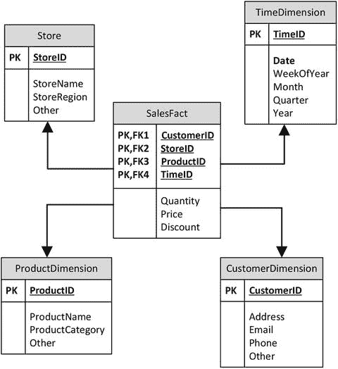

图 6-1. 星型模式

注意：虽然星型模式常见于关系型数据库中，但它们并不代表一个完全规范化的关系数据模型。维度表和事实表通常都包含冗余信息，或者仅部分依赖于主键的信息。在某些方面，星型模式的广泛采用是朝着不再完全遵循 Codd 关系模型迈出的一步。

几乎所有的数据仓库都采用了星型模式范式的某种变体，几乎所有的关系型数据库都采用了索引和 SQL 优化方案来加速针对星型模式的查询。这些优化使得关系型数据仓库能够作为管理仪表板和流行 BI 产品的基础。然而，尽管有这些优化，数据仓库中的星型模式处理仍然是极其消耗 CPU 和 I/O 资源的。随着数据量的增长和用户对交互式响应时间需求的持续，对传统数据仓库性能的不满日益增加。

##### 列式替代方案

将数据以列式格式存储可能更好的想法可以追溯到 20 世纪 70 年代，尽管商用列式数据库直到 20 世纪 90 年代中期才出现。

列式概念的核心是列的数据在磁盘上分组存放。图 6-2 比较了一些简单数据的列式存储和行式存储：在列式数据库中，特定列的值位于相同的磁盘块中；而在行式模型中，每一行的所有列都位于一起。

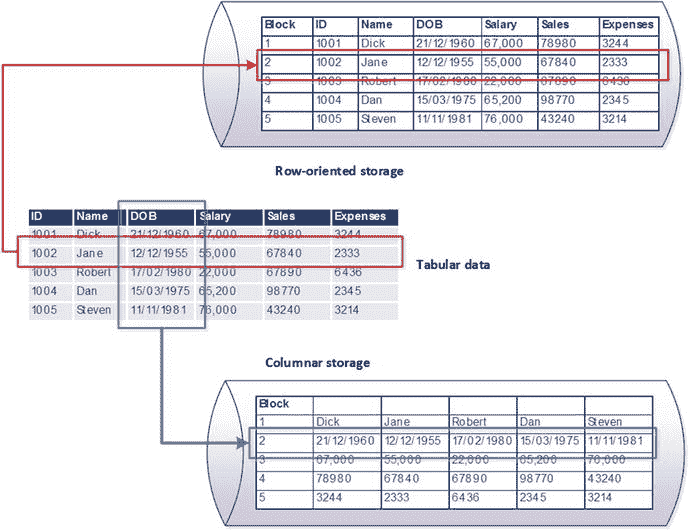

图 6-2. 列式存储与行式存储的比较

列式架构有两个主要优势。首先，在列式架构中，旨在聚合特定列值的查询得到了优化，因为所有要聚合的值都存在于相同的磁盘块中。图 6-3 以我们的示例数据库说明了这一现象；从行存储中检索薪资总和必须扫描五个块，而在列存储中只需访问一个块就足够了。

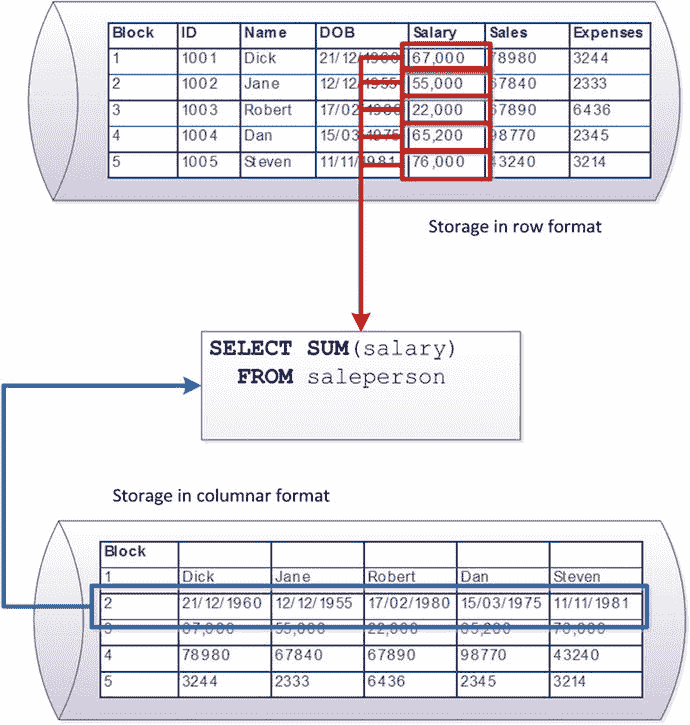

图 6-3. 列式存储中的聚合操作需要更少的 I/O

列式架构所提供的确切 I/O 和 CPU 优化因工作负载、索引和模式设计而异。通常，在列式数据库中，跨多行工作的查询会得到显著加速。

#### 列式压缩

列式架构的第二个关键优势是压缩。压缩算法主要通过消除数据值内的冗余来工作。高度重复的数据——特别是当这些重复是局部集中时——比重复度低的数据能实现更高的压缩比。尽管无论采用行式还是列式存储，整个数据库中的总重复量是相同的，但压缩方案通常尝试在数据的局部子集上工作；如果压缩能在隔离的数据块上进行，其 CPU 开销会低得多。由于在列式数据库中，列在磁盘上存储在一起，因此实现更高的压缩比所需的计算成本要低得多。

此外，在许多情况下，列式数据库会以排序顺序存储列数据。在这种情况下，只需将每个列值表示为与前一个列值的“增量”，即可实现非常高的压缩比。其结果是以极低的计算开销实现极高的压缩比。

#### 列式写入惩罚

列式架构的关键缺点——也是它对于 OLTP 数据库而言是一个糟糕选择的原因——是其施加在单行操作上的开销。在列式数据库中，检索单行需要从该表的每个列存储中组装该行。读取开销可以通过缓存和多列投影（在磁盘上将多个列存储在一起）来部分减少。然而，当涉及 DML 操作——尤其是插入时——几乎无法避免必须修改每一行的所有列。

图 6-4 展示了在我们的简单示例数据库上，列存储插入操作的开销。行存储只需执行一次 I/O 即可插入一个新值，而列存储必须更新与列数一样多的磁盘块。

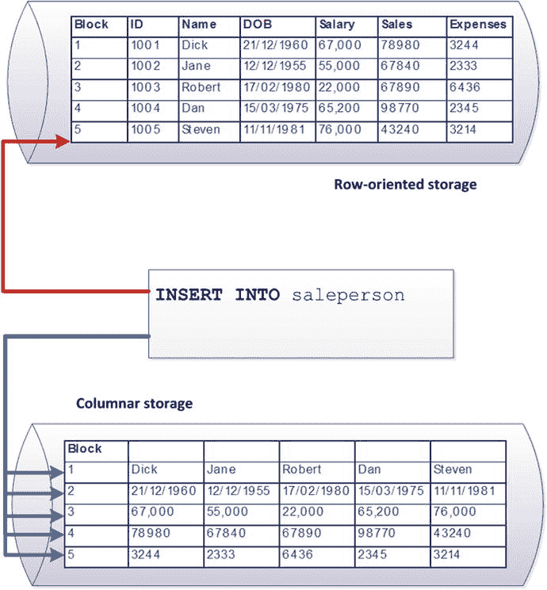

图 6-4. 列存储的插入开销

在实际的行存储（例如，传统的 RDBMS）中，由于索引开销，插入需要不止一次 I/O；而实际的列存储则实现了缓解方案，以避免单行修改期间的严重开销。然而，基本原则——列存储在单行修改时性能不佳——是成立的。


#### Sybase IQ、C-Store 与 Vertica

在 20 世纪 90 年代中期，当时的四大关系型数据库供应商之一 Sybase 收购了 Expressway 公司。Expressway 开发了可以说是首个重要的商用列式数据库。Expressway 的技术成为了 Sybase IQ（"智能查询"）的基础，后者成为了 Sybase 的旗舰数据仓库平台。然而，尽管 Sybase IQ 在随后的十年中获得了显著增长，并且拥有尖端技术，但它未能主导数据仓库市场。业界对列式技术重要性的认识仍然较低。

2005 年，关系型数据库先驱、Ingres 的发明者 Mike Stonebraker 及其同事发表了一篇论文，概述了一个他们称为 `C-store` 的形式化数据库系统。¹ `C-store` 与现有的列式系统有许多共同特征，同时也包含一些提高写入性能的重要创新。Stonebraker 的论文包含了 `TPC-H` 基准测试结果，证明了 `C-Store` 架构在处理数据仓库工作负载时，性能优于现有的基于行的 `DBMS`。

Stonebraker 成立了 Vertica 公司——旨在构建 `C-Store` 的商业实现。Vertica 于 2011 年被 HP 收购。

时机就是一切。尽管 Sybase IQ 早在近十年前就成功推出了商用列式数据库，但 `C-Store` 和 Vertica 的出现，恰逢"万能通用"的关系型架构大厦开始出现裂痕之时。`C-Store` 和 Vertica 成为了一波新浪潮系统的代表——这些系统虽然不排斥关系模型或 `SQL`，但与传统的 `RDBMS` 架构有显著区别。Vertica 成为了"NewSQL"数据库的典范。

在 `C-Store` 模型发布之后，其他几个重要的基于列的系统也进入了市场，包括 InfoBright、VectorWise 和 MonetDB。列式技术也成为许多重要商用关系型数据库中的关键组成部分，包括 Oracle Exadata、Microsoft SQL Server 和 SAP HANA。（我们将在本章后面探讨 Oracle 的实现，并在下一章探讨 HANA。）

## 列数据库架构

正如我们之前指出的，单行的插入和更新开销是列式架构的一个关键弱点。许多数据仓库是通过每日批处理作业批量加载的——典型的夜间 `ETL` 场景。然而，为数据仓库提供实时的"最新"信息变得越来越重要，这意味着数据仓库应该能够接受持续不断的增量更改流。上面概述的简单列式架构将无法应对这种持续不断的行级修改流。

为了解决这个问题，列式数据库通常会实现某种形式的写优化增量存储（我们简称其为 `delta store`）。数据库的这个区域针对频繁写入进行了优化。你可以简单地将 `delta store` 中的数据视为行格式，尽管实际上其内部格式可能仍是列式或行/列混合的。无论数据的内部格式如何，`delta store` 通常是内存驻留的，数据通常是未压缩的，并且该存储可以接受高频数据修改。

`delta store` 中的数据会定期与主列式存储合并。在 Vertica 中，此过程称为 `Tuple Mover`，在 Sybase IQ 中称为 `RLV (Row Level Versioned) Store Merge`。合并会定期进行，或者当 `delta store` 中的数据量超过阈值时进行。在合并之前，查询可能需要同时访问 `delta store` 和列存储才能返回完整准确的结果。

`图 6-5` 展示了一个通用的列式数据库架构。数据库包含一个主要的列存储，其中存放着高度压缩的列式数据，由磁盘存储支持。一个较小的写优化 `delta store` 包含几乎未压缩、内存驻留且可能是行式的数据。

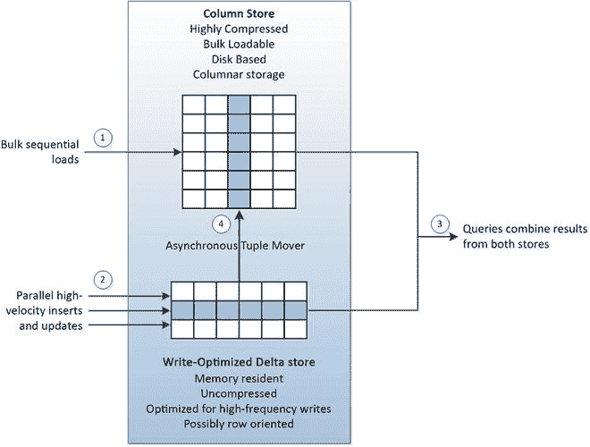

`图 6-5`. 列存储数据库中的写优化

大规模的批量顺序加载——例如夜间 `ETL` 作业——通常会定向到列存储（1）。增量插入和更新会定向到写优化存储（2）。查询可能需要从两个存储中读取才能获得完整和一致的结果（3）。系统会定期或根据需要，通过一个进程将数据从写优化存储转移到列存储（4）。

##### 投影

在之前对列式数据库的简单描述中，我们展示了每列存储在一起。对于只访问单列的查询，将每列存储在磁盘上的单独区域可能就足够了，但在实际中，复杂的查询需要读取列数据的组合。因此，有时将列的组合一起存储在磁盘上是有意义的。

为了实现这一点，像 Vertica 这样的列式数据库将表物理存储为一系列 `投影`，其中包含了经常一起访问的列组合。

例如，在 `图 6-6` 中，我们看到一个包含三个投影的单一逻辑表。在 Vertica 中，每个表都有一个默认的 `超级投影`，包含表中的所有列（1）。会创建额外的投影来支持特定查询。在这个例子中，创建了一个投影来支持按客户聚合的销售数据（2），另一个投影用于按地区和产品聚合的销售数据（3）。

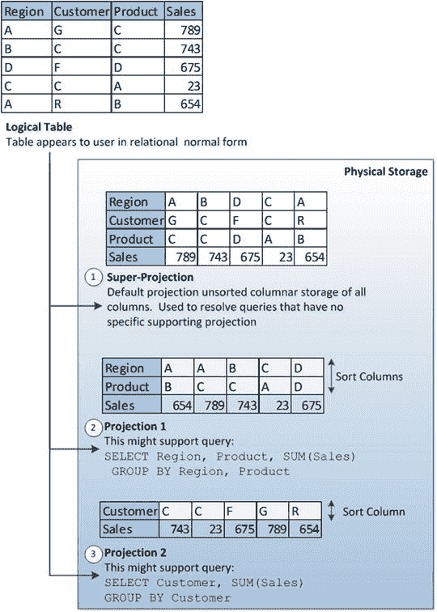

`图 6-6`. 具有三个投影的列式数据库表

在 Vertica 中，投影可以按一列或多列排序。这减少了排序和聚合操作的处理时间，同时也提高了压缩效率。Vertica 还支持 `预连接投影`，这些投影基于连接条件物化来自多个表的列。`预连接投影` 的功能类似于传统关系系统中为支持特定连接操作而创建的 `物化视图`。

`投影` 可以由数据库管理员手动创建，也可以由查询优化器根据特定 `SQL` 即时创建，或者基于历史工作负载批量创建。创建正确的投影集对于列式存储的性能至关重要——其重要性大致相当于在行存储中正确索引的重要性。

Sybase IQ 将其查询优化结构称为"索引"；然而，这些索引更类似于 Vertica 的投影，而不是 Oracle 或 SQL Server 中的 `B-Tree` 索引。实际上，Sybase IQ 的默认索引——在表创建时自动在所有列上创建——被称为 `快速投影索引`。Sybase 还支持基于传统 `位图` 和 `B-Tree` 索引方案的其它索引选项。


##### 其他数据库中的列式技术

列式范式的变体已在传统关系型系统和其他“NewSQL”系统中实现。例如，内存数据库`SAP HANA`提供了在表级别支持列或行定向的功能。`Oracle 12c`的“内存数据库”也实现了列存储。我们将在第 7 章中简要介绍这些架构。

Oracle 的增强型混合列压缩（`EHCC`）是一种有趣的尝试，旨在结合行存储和列存储技术的优点。`EHCC`（目前仅在 Oracle 的`Exadata`系统中可用）中，数据行被包含在约`1 MB`的压缩单元内，而列则存储在更小的`8K`块中。因为列在块内一起存储，可以实现高压缩率。因为行被保证在`1 MB`的压缩单元内，执行行级修改的开销得以降低。图 6-7 阐释了这个概念。行包含在`1MB`的压缩单元内，但每个`8K`块包含经过高度压缩的特定列的数据。

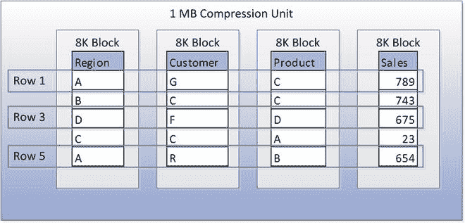

图 6-7. Oracle 的混合列压缩方案

列式存储在现代非关系型系统中也很常见。`Apache Parquet`是`Hadoop`文件的列式存储机制，允许`Hadoop`系统利用列式的性能优势和压缩能力。`Apache Kudu`同时使用行和列存储格式，旨在弥合`HDFS`基于行的处理与`Hadoop`文件扫描之间公认的性能差距。

#### 结论

人们很容易认为列式架构只是对存储的物理调整，对数据库系统的整体设计影响甚微。然而，列式存储范式对现有关系系统（它们渴望承担数据仓库角色）和如`Vertica`这类“新 SQL”系统的演进都产生了巨大影响。

理解列式架构对于审视新一代内存数据库也很重要；正如我们将在下一章看到的，其中许多数据库内部采用了列式架构，以优化和压缩驻留内存的数据，用于分析目的。

#### 注释

`C-Store: A Column-oriented DBMS`，第 31 届 VLDB 会议论文集，挪威特隆赫姆，2005 年；[`http://db.lcs.mit.edu/projects/cstore/vldb.pdf`](http://db.lcs.mit.edu/projects/cstore/vldb.pdf)

