# 7. 磁盘的终结？SSD 与内存数据库

> 640K 的内存对任何人来说都足够了。——据称（无依据）出自比尔·盖茨，1981 年
>
> 我说过一些蠢话和错话，但不是那句。——比尔·盖茨，2001 年

自第一个数据库系统诞生以来，数据库专业人员一直致力于不惜一切代价避免磁盘`IO`。对磁盘设备的`IO`速度一直比内存或`CPU`访问慢许多数量级，而且随着摩尔定律加速了`CPU`和内存的性能，而机械磁盘性能却停滞不前，这种情况只会变得更糟。

经济实惠的固态硬盘（`SSD`）技术的出现，使数据库磁盘性能实现了量子飞跃。在过去的几年里，`SSD`技术已从昂贵的奢侈品转变为主流技术，在几乎每一个性能关键的数据库系统中都占有一席之地。然而，`SSD`具有一些独特的性能特性，因此一些数据库系统被开发出来以利用这些能力。

虽然`SSD`允许加速`IO`，但服务器内存容量的增加和成本的降低有时使我们能够完全避免`IO`。许多较小的数据库现在可以完全装入单台服务器的内存容量，当然也可以装入集群的内存容量。对于这些数据库，内存解决方案可能比`SSD`架构更具吸引力。

#### 磁盘的终结？

自 20 世纪 50 年代以来，磁盘设备在数字计算中一直无处不在。其基本架构在此期间变化甚微：一个或多个盘片包含代表信息位的磁荷。这些磁荷由一个驱动臂读写，该臂移动到盘片半径上的特定位置，然后等待盘片旋转到适当的位置。这些机械操作本质上很慢，并且无法从摩尔定律描述的指数级改进中受益。这是简单的物理学——如果磁盘转速随着`CPU`处理能力的提高而增加，那么现在磁盘外缘的速度将达到光速的大约 10 倍！

图 7-1 说明，虽然这些设备的尺寸和密度多年来有所提升，但其架构基本未变。虽然摩尔定律驱动了`CPU`、内存和磁盘密度的指数级增长，但它并不适用于磁盘性能的机械方面。因此，磁盘已成为数据库性能日益增长的拖累。

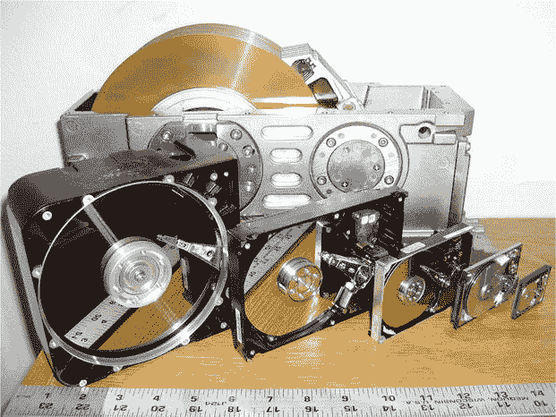

图 7-1. 历年来的磁盘设备

##### 固态硬盘

与磁盘不同，固态硬盘没有活动部件，`IO`延迟大幅降低。商用`SSD`目前使用`DDR RAM`（本质上是带电池备份的`RAM`设备）或`NAND 闪存`实现。`NAND 闪存`是一种固有的非易失性存储介质，几乎完全主导了当今的`SSD`市场。

闪存`SSD`的性能比磁盘设备高出几个数量级，尤其是在读取操作方面。高端固态硬盘的随机读取可能只需`25`微秒，而磁盘读取可能需要高达`4,000`微秒（`4`毫秒或`4/1000`秒）——慢了`150`多倍。

虽然`SSD`肯定比磁盘快，但对于所有工作负载来说，速度提升并不成比例。特别是，在`SSD`中修改信息的成本（花费时间）比从中读取信息要高。

`SSD`在存储单元中存储信息位。单层单元（`SLC`）`SSD`每个单元存储一位信息，而多层单元（`MLC`）`SSD`在每个单元中存储多于一位——通常只有两位，但有时是三位。单元被排列成约`4K`的页，页被排列成块，通常每个块包含`256`个页。

读取操作和初始写入操作只需要单页`IO`。然而，更改页的内容需要对整个块进行擦除和覆盖。即使是初始写入也可能明显慢于读取，但块擦除操作尤其慢——大约两毫秒。图 7-2 显示了页寻道、页写入和块擦除的大致时间。

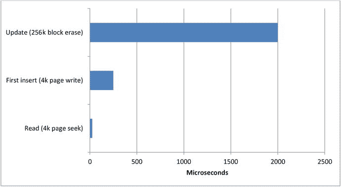

图 7-2. 闪存 SSD 的性能特征

商用`SSD`制造商花费巨大努力来避免擦除操作带来的性能损失，以及单元被修改时`SSD`产生的“磨损”所引发的可靠性问题。他们采用复杂的算法来确保最小化擦除操作，并使写入均匀分布在设备上。然而，这些算法会产生写入放大效应，即每次写入操作都伴随着`SSD`上的多次物理`IO`，因为数据被移动，存储空间被回收。

注释

无论`SSD`供应商实施了多么复杂的算法和优化，基本点仍然是：闪存`SSD`在执行写入时的速度明显慢于执行读取时的速度。

##### 磁盘经济学

固态硬盘的前景让一些人预期所有磁盘终将被 SSD 取代。虽然这一天可能到来，但在短期内，存储的经济性与 I/O 的经济性却存在矛盾：磁盘技术提供了每单位存储更经济的介质，而闪存技术则提供了交付高 I/O 速率和低延迟更经济的介质。尽管固态硬盘的成本正在迅速下降，磁盘的成本也是如此。图 7-3 展示了 SSD 和 HDD 每 GB 成本趋势的考察。

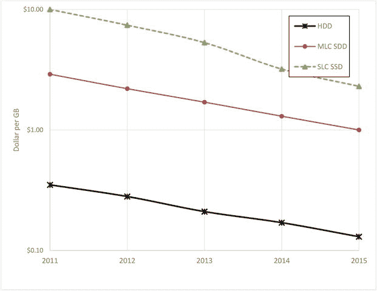

图 7-3. SSD 与 HDD 存储成本趋势（注意对数刻度）

虽然对于小型数据库或性能关键型系统而言，SSD 正日益成为一种经济的解决方案，但它不太可能成为海量数据库的通用解决方案，尤其是对于那些访问不频繁的数据。因此，我们很可能会看到固态硬盘、传统硬盘和内存的组合，为下一代数据库提供基础。

### 支持 SSD 的数据库

一些下一代数据库系统专门设计了架构，以利用 SSD 的物理特性。

许多传统的关系型数据库在 SSD 上表现相对较差，因为关键的 I/O 操作被隔离为顺序写操作，而硬盘驱动器在此类操作上表现良好，但这却代表着 SSD 最糟糕的工作负载。当一个符合`ACID`的关系型数据库中的事务提交时，事务记录通常会立即写入一个顺序事务日志（在某些数据库中称为重做日志）。即使将此事务日志移到 SSD 上，其 I/O 性能也可能不会提升，因为 SSD 的写入性能较低，并且存在我们之前讨论过的写入放大效应。在这种情况下，用户可能会对将写密集型`RDBMS`迁移到 SSD 后实现的性能提升感到失望。

许多非关系型系统（例如`Cassandra`）使用日志结构化存储引擎——通常基于日志结构合并树（`LSM`）架构——详情参见第 10 章。这些系统倾向于避免更新现有块，而是执行更大的批量写入操作，这对固态硬盘的性能特性更为友好。

`Aerospike`是一个 NoSQL 数据库，它试图提供一种能够充分利用闪存 SSD I/O 特性的数据库架构。`Aerospike`实现了一个日志结构化文件系统，其中更新是通过将新值追加到文件并将原始数据标记为无效来物理实现的。旧值的存储空间由后台进程在稍后时间回收。

`Aerospike`在内存使用上也采用了一种不寻常的方法。它并非使用主内存作为缓存来避免物理磁盘 I/O，而是使用主内存来存储数据的索引，同时始终将数据保留在闪存上。这种方法代表了这样一种认识：在基于闪存的系统中，传统数据库“不惜一切代价避免 I/O”的做法可能是不必要的。

#### 内存数据库

固态硬盘可能对数据库性能产生了变革性影响，但对大多数数据库架构而言，它只带来了渐进式的改变。一个更具范式转变趋势的，是将完整数据库存储在主内存中日益增长的实用性。

自计算机发展初期以来，内存的成本以及单台服务器上可安装的内存容量都呈指数级增长。图 7-4 说明了这些趋势：几十年来，单位存储的内存成本以及单个内存芯片上可容纳的存储容量一直在增长（注意对数刻度——相对笔直的线条表明了指数级趋势）。

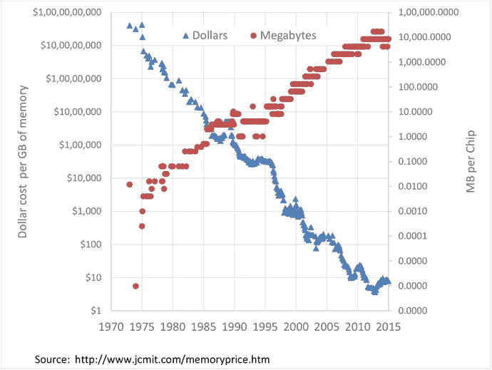

图 7-4. 过去 40 年内存成本和容量趋势（注意对数刻度）

平均数据库的规模——特别是在大数据现象的背景下——也呈指数级增长。对于许多系统，数据库的增长速度持续超过内存的增长速度。但现在，许多规模更适中的数据库可以轻松地存储在单台服务器的内存中。而比这多得多的数据库可以驻留在集群的内存容量范围内。

传统的关系型数据库使用内存来缓存存储在磁盘上的数据，随着内存量的增加，它们通常会表现出显著的性能提升。但有一些数据库操作必须写入持久化介质。在传统的数据库架构中，`COMMIT`操作需要将数据写入持久化介质上的事务日志，并且数据库会定期将内存中的“检查点”块写入磁盘。要充分利用大内存系统，需要一种能够意识到数据库完全驻留在内存中的架构，并且能够在不丢失数据（即使在断电情况下）的前提下，利用高速访问的优势。

内存系统应解决传统数据库架构的两个变化：

*   无缓存架构：传统的基于磁盘的数据库几乎无一例外地在主内存中缓存数据，以最小化磁盘 I/O。在内存系统中，这是徒劳且适得其反的：缓存已经存储在内存中的数据毫无意义！
*   替代持久化模型：内存中的数据在断电时会消失，因此数据库必须应用某种替代机制来确保数据不会丢失。

内存数据库通常使用一些组合技术来确保不丢失数据。这些包括：

*   将数据复制到集群中的其他成员。
*   将完整的数据库映像（称为快照或检查点）写入磁盘文件。
*   将事务/操作记录写入仅追加的磁盘文件（称为事务日志或日志）。

#### TimesTen

TimesTen 是一款相对较早的内存数据库系统，其目标是支持类似于传统关系型系统的负载，但性能更优。TimesTen 成立于 1995 年，于 2005 年被 Oracle 收购。Oracle 将其作为独立的内存数据库或作为补充传统基于磁盘的`Oracle RDBMS`的缓存数据库提供。

###### 核心特点
TimesTen 实现了一个相当熟悉的基于 SQL 的关系模型。在被 Oracle 收购后，它实现了`ANSI 标准 SQL`，但近年来的工作重点是使该数据库与 Oracle 核心数据库兼容——甚至支持 Oracle 的存储过程语言`PL/SQL`。

###### 持久化与事务
在 TimesTen 数据库中，所有数据都驻留在内存中。持久化是通过将内存的周期性快照写入磁盘，以及在事务提交后写入基于磁盘的事务日志来实现的。

在默认配置下，所有磁盘写入都是异步的：数据库操作通常不需要等待磁盘 IO 操作。但是，如果在事务提交和事务日志写入之间发生电源故障，则数据可能会丢失。这种行为不符合`ACID`，因为事务的持久性（`ACID`中的"D"）无法得到保证。但是，用户可以选择在提交操作期间配置对事务日志的同步写入。在这种情况下，数据库变得符合`ACID`，但某些数据库操作将需要等待磁盘 IO。

###### 架构图示
图 7-5 展示了 TimesTen 的架构。当数据库启动时，所有数据从检查点文件加载到主内存中（1）。应用程序通过 SQL 请求与 TimesTen 交互，这些请求保证在主内存中找到所有相关数据（2）。按需或定期将数据库数据写入检查点文件（3）。应用程序提交会触发写入事务日志（4），不过默认情况下此写入是异步的，因此应用程序不需要等待磁盘。事务日志可用于在发生故障时恢复数据库（5）。

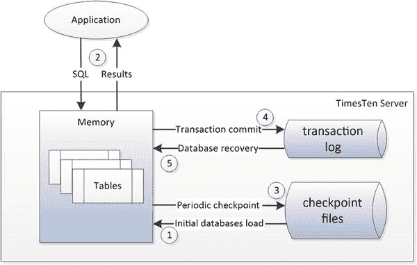

图 7-5. TimesTen 架构

###### 当前意义
TimesTen 在当今的重要性主要体现在它是 Oracle 企业解决方案架构的一部分。然而，它确实代表了一个早期的基于内存的事务型关系数据库架构的良好示例。

#### Redis

###### 起源与发展
TimesTen 是构建一个兼容`RDBMS`的内存数据库的尝试，而 Redis 则处于另一个极端：本质上是一个内存键值存储。`Redis`（远程字典服务器）最初被设想为一个简单的内存系统，能够在处理能力有限的系统（例如虚拟机镜像）上维持非常高的事务速率。

Redis 由 Salvatore Sanfilippo 于 2009 年创建。VMware 在 2010 年雇佣了 Sanfilippo 并赞助 Redis 的开发。2013 年，Pivotal 软件——从 VMware 母公司 EMC 分拆出来的大数据公司——成为了主要赞助商。

###### 架构与特性
Redis 遵循熟悉的键值存储架构，其中键指向对象。在 Redis 中，对象主要包括字符串和各种类型的字符串集合（列表、有序列表、哈希映射等）。仅支持主键查找；Redis 没有二级索引机制。

尽管 Redis 设计为将所有数据保存在内存中，但通过使用其虚拟内存功能，Redis 可以在数据集大于可用内存的情况下运行。启用此功能后，Redis 会将较旧的键值“换出”到磁盘文件。如果需要这些键，它们将被换回内存。此选项显然会带来显著的性能开销，因为某些键查找将导致磁盘 IO。

###### 持久化机制
Redis 使用磁盘文件进行持久化：
*   `快照`文件在某个时间点存储整个 Redis 系统的副本。可以按需创建快照，也可以配置为在达到计划间隔或写入阈值后发生。服务器关闭时也会进行一次快照。
*   `仅追加文件 (AOF)`保留更改的日志，可用于在发生故障时从快照“向前滚动”数据库。配置选项允许用户配置在每次操作后、每秒间隔或基于操作系统决定的刷新间隔写入`AOF`。

###### 复制功能
此外，Redis 支持异步主/从复制。如果性能至关重要且可接受少量数据丢失，则可以使用副本作为备份数据库，并为主库配置最少的基于磁盘的持久化。但是，无法限制可能的数据丢失量；在高负载期间，从库可能会显著落后于主库。

###### 架构图示
图 7-6 展示了这些架构组件。应用程序通过主键查找与 Redis 交互，返回“值”——字符串、字符串集合、字符串哈希等（1）。键值几乎总是在内存中，尽管可以配置 Redis 使用虚拟内存系统，在这种情况下键值可能需要被换入或换出（2）。Redis 可能会定期将整个内存空间的副本转储到磁盘（3）。此外，Redis 可以配置为将更改写入仅追加日志文件，无论是短时间间隔还是每次操作后（4）。最后，Redis 可以将主数据库的状态异步复制到从 Redis 服务器（5）。

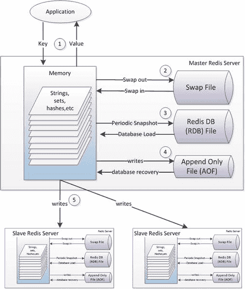

图 7-6. Redis 架构

###### 性能考量
尽管 Redis 从头开始设计为内存数据库系统，但在以下情况下，应用程序可能需要等待 IO 完成：
*   如果`仅追加文件`被配置为在每次操作后写入，那么应用程序需要在修改返回控制之前等待 IO 完成。
*   如果配置了 Redis 虚拟内存，那么应用程序可能需要等待一个键被“换入”内存。

###### 总结
Redis 作为一种简单、高性能的键值存储，在开发人员中很受欢迎，它在无需昂贵硬件的情况下表现良好。它缺乏像`MongoDB`这样一些其他非关系型系统的复杂性，但在数据适合主内存的系统上，或作为基于磁盘的数据库前面的缓存层，它工作得很好。

#### SAP HANA

SAP 于 2010 年推出 `HANA`，将其定位为一款革命性的内存数据库，主要面向商业智能 (`BI`)，但也能支持 `OLTP` 工作负载。

`SAP HANA` 是一款关系型数据库，旨在通过将内存技术与列式存储选项相结合，并在优化的硬件配置上部署，从而提供突破性的性能。虽然 `SAP` 不直接销售 `HANA` 硬件，但他们为 `HANA` 认证服务器提供了详细指南，其中包括对快速 `SSD` 驱动器的要求。

`HANA` 中的表可以配置为行式存储或列式存储。通常，用于 `BI` 目的的表会配置为列式存储，而 `OLTP` 表则配置为行式存储。选择行式或列式格式为 `HANA` 提供了同时支持 `OLTP` 和分析工作负载的能力。

行存储中的数据保证驻留在内存中，而列存储中的数据默认按需加载。但是，可以将特定的列或整个表配置为在数据库启动时立即加载。

`HANA` 的持久化架构采用了在 `Redis` 和 `TimesTen` 中常见的快照与日志文件模式。`HANA` 会定期将内存状态快照到 `Savepoint` 文件中。这些 `Savepoint` 会定期应用到主数据库文件中。

`ACID` 事务一致性由事务“重做”日志实现。与大多数符合 `ACID` 的关系型数据库一样，该日志在事务提交时写入，这意味着应用程序在提交返回控制权之前，需要等待事务日志 `IO` 完成。为了最小化可能减慢 `HANA` 以内存速度运行的 `IO` 等待，重做日志被放置在 `SAP` 认证的 `HANA` 设备中的固态硬盘上。

`HANA` 的列式架构包含一个在第六章讨论的写优化增量存储模式的实现。针对列式表的事务会被缓冲在这个增量存储中。最初，数据以行式格式保存（`L1` 增量）。然后数据会移动到 `L2` 增量存储，该存储是列式导向的，但压缩相对较轻且未排序。最后，数据会迁移到主列存储中，在那里数据被高度压缩并排序。

图 7-7 说明了 `HANA` 架构的这些关键方面。启动时，基于行的表和选定的列式表从数据库文件中加载 (1)。其他列式表将按需加载。对行式表的读写可以直接应用 (2)。对基于列的表的更新将被缓冲在增量存储中 (3)，最初是写入 `L1` 行式存储。`L1` 存储中的数据随后会被提升到 `L2` 存储，最后到达列存储本身 (4)。对列式表的查询必须同时从增量存储和主列存储中读取数据 (5)。

内容丰富的图 7-7 也说明了持久化架构。内存映像会定期复制到保存点 (6)，而这些保存点会在适当的时候与数据文件合并 (7)。当提交发生时，一个事务记录会被写入重做日志 (8)。`HANA` 参考架构规定此重做日志必须位于快速的 `SSD` 上。

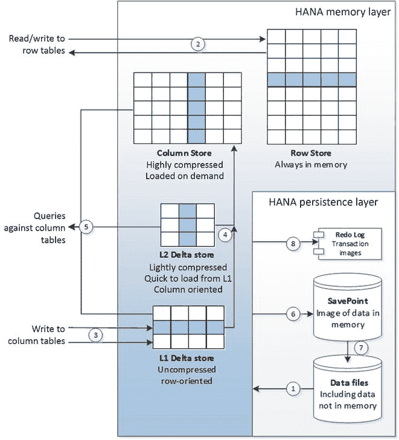

图 7-7. `SAP HANA` 架构

我们再次看到，尽管 `HANA` 被描述为内存数据库，但在某些情况下，应用程序仍需等待来自磁盘设备的 `IO`；具体来说，是在提交时，以及列式表按需加载到内存中时。

#### VoltDB

`Redis`、`HANA` 和 `TimesTen` 是正统的内存数据库系统：从设计之初就使用内存作为所有数据的主要——且通常是唯一的——来源。然而，正如我们所看到的，使用这些系统的应用程序仍然经常需要等待磁盘 `IO`。特别是，在事务提交时，通常会有到某种形式的事务日志或日志的磁盘 `IO`。

`VoltDB` 是 `H-store` 设计的商业实现。`H-store` 是 Michael Stonebraker 在 2007 年的开创性论文中描述的数据库之一，该论文认为没有单一的数据库架构适用于所有现代工作负载。¹ `H-store` 描述了一种内存数据库，其设计明确意图是在正常的事务操作期间不需要磁盘 `IO`——它致力于成为一个纯粹的内存解决方案。

`VoltDB` 支持 `ACID` 事务模型，但它不是通过写入磁盘来保证数据持久性，而是通过跨多台机器的复制来保证持久性。事务提交只有在数据成功写入超过一台物理机器的内存后才完成。涉及的机器数量取决于指定的 `K-safety` 级别。例如，`K-safety` 级别为 2 保证在任何两台机器故障时数据不丢失；在这种情况下，提交必须在成功传播到三台机器后才能完成。

也可以配置一个命令日志，将事务命令记录在基于磁盘的日志中。该日志可以是同步的——在每次事务提交时写入——也可以是异步的。因为 `VoltDB` 仅支持基于确定性存储过程的事务，所以日志只需记录驱动事务的实际命令，而不是像其他数据库事务日志那样记录修改块的副本。尽管如此，如果启用了同步命令日志选项，那么 `VoltDB` 应用程序可能会遇到磁盘 `IO` 等待时间。

`VoltDB` 支持关系模型，尽管其集群方案在模型能够按照公共键进行层次化分区时效果最佳。在 `VoltDB` 中，表必须要么被分区，要么被复制。分区分布在集群的各个节点上，而复制的表则在每个分区中复制一份。复制的表可能会在 `OLTP` 操作中产生额外开销，因为事务必须在每个分区中复制；这与分区表形成对比，后者在需要从多个分区整理数据时会产生额外开销。因此，复制的表通常是较小的参考型表，而较大的事务表则被分区。

`VoltDB` 中的分区不仅分布在物理机器上，也分布在具有多个 `CPU` 核心的机器内部。在 `VoltDB` 中，每个分区专用于一个 `CPU`，该 `CPU` 拥有对该分区的独占单线程访问权限。这种独占访问减少了锁和闩锁的开销，但它要求事务快速完成以避免请求的串行化。

图 7-8 说明了分区和复制如何影响 `VoltDB` 中的并发性。每个分区与一个 `CPU` 核心相关联，在任何给定时刻，针对该分区永远只有一个 `SQL` 语句处于活动状态 (1)。在此示例中，`ORDERS` 和 `CUSTOMERS` 表已使用客户 ID 进行分区，而 `PRODUCTS` 表则完全复制在所有分区中。访问单个客户数据的查询仅需涉及单个分区 (2)，而跨客户的查询必须在短时间内独占访问所有分区 (3)。

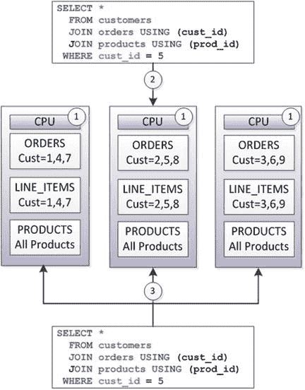

图 7-8. `VoltDB` 分区

`VoltDB` 事务通过被封装为单个 `Java` 存储过程调用来简化，而不是由一组单独的 `SQL` 语句表示。这确保了事务持续时间最小化（事务内没有思考时间或网络时间），并进一步减少了锁问题。

##### Oracle 12c “内存数据库”

`Oracle RDBMS version 12.1` 引入了“Oracle 数据库内存”特性。这个表述可能具有误导性，因为并非整个数据库都驻留在内存中。实际上，Oracle 实现了一个`内存列存储`来补充其`基于磁盘的行存储`。

图 7-9 展示了 Oracle 内存列存储架构的基本要素。`OLTP`应用程序以常规方式与数据库交互。数据存储在磁盘文件中(1)，但也缓存在内存中(2)。`OLTP`应用程序主要从内存进行读写操作(3)，但任何已提交的事务都会立即写入磁盘上的事务日志(4)。当需要或按配置，行数据会被加载成列表示形式供分析应用程序使用(5)。一旦数据被加载到列格式后提交的任何事务都会被记录在日志中(6)，分析查询会查阅该日志以确定是否需要从行存储读取更新的数据(7)，或者可能需要重建列结构。

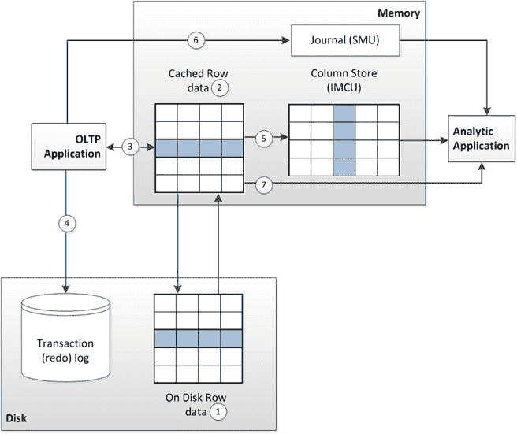

图 7-9.

Oracle 12c “内存”架构

#### Berkeley Analytics Data Stack 与 Spark

如果`SAP HANA`和`Oracle TimesTen`代表了关系数据库主题上的内存变体，并且如果`Redis`代表了键值存储主题上的内存变体，那么`Spark`就代表了`Hadoop`主题上的一个内存变体。

`Hadoop`通过提供一个灵活、可扩展且经济的框架来处理海量结构化、非结构化和半结构化数据，成为了当今大数据堆栈的事实基础。`Hadoop 1.0 MapReduce`算法代表了一种相对简单但可扩展的并行处理方法。`MapReduce`并非对所有工作负载都是最优雅或最复杂的方法，但它几乎可以适用于任何问题，并且通常可以通过粗暴地应用许多服务器来扩展。

然而，人们早就意识到`MapReduce`——尤其是在基于磁盘的存储上工作时——不足以应对新兴的大数据分析挑战。`MapReduce`擅长批处理，但在实时场景中表现不佳。即使是最简单的`MapReduce`任务也需要相当长的启动时间，而对于一些机器学习算法来说，执行时间根本不足够。

2011 年，加州大学伯克利分校成立了`AMPlab (Algorithms, Machines, and People)`，旨在攻克大数据上高级分析和机器学习带来的新挑战。由此产生的伯克利数据分析堆栈(`BDAS`)——特别是`Spark`处理引擎——显示出快速的普及度。

`BDAS`由几个核心组件组成：

*   `Spark`是一个内存式、分布式、容错的处理框架。它用兼容 Java 虚拟机的编程语言`Scala`实现，提供了比`MapReduce`更高级别的抽象，从而提高了开发人员的生产力。作为内存解决方案，`Spark`在那些会导致`MapReduce`磁盘 IO 瓶颈的任务上表现出色。特别是那些需要对数据集进行重复迭代的任务——许多机器学习工作负载的典型特征——显示出显著的改进。
*   `Mesos`是一个集群管理层，某种程度上类似于`Hadoop 的 YARN`。然而，`Mesos`专门设计用于允许多个框架，包括`BDAS`和`Hadoop`，共享一个集群。
*   `Tachyon`是一个容错的、兼容`Hadoop`的、以内存为中心的分布式文件系统。该文件系统允许将大型数据集存储在磁盘上，但提倡积极的缓存以为频繁访问的数据提供内存级的响应时间。

其他`BDAS`组件构建在此核心之上。`Spark SQL`提供了特定于`Spark`的`SQL`实现用于临时查询，并且还有一个活跃的项目致力于允许`Hadoop`堆栈中的`SQL`实现`Hive`生成`Spark`代码。

`Spark streaming`基于`Spark`基础提供了面向流的处理范式，而`GraphX`则提供了基于`Spark`构建的图计算引擎。`BDAS`还在`MLBase`组件中以不同抽象级别的机器学习库。

`Spark`有时被称为`Hadoop`的继任者，但实际上`Spark`和`BDAS`的其他元素被设计为与`Hadoop HDFS`和`YARN`紧密协作，许多`Spark`实现使用`HDFS`进行持久化存储。图 7-10 展示了`Hadoop`元素（如`YARN`和`HDFS`）如何与`Spark`和`BDAS`的其他元素交互。

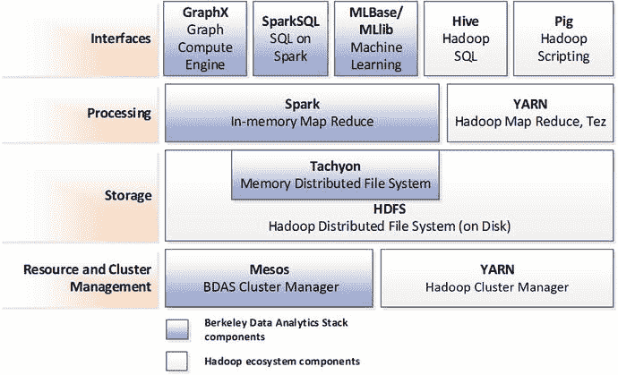

图 7-10.

Spark, Hadoop 和伯克利数据分析堆栈

`Spark`被纳入许多其他数据管理堆栈；它是三大主要组织`Hadoop`发行版(`Cloudera`, `Hortonworks`, 和`MapR`)的核心部分。`Spark`也是`Datastax`的`Cassandra`发行版的一个组件。

##### Spark 架构

在`Spark`中，数据被表示为`弹性分布式数据集 (RDD)`。`RDDs`是可以分布在集群多个节点上的对象集合。分区和后续的处理分发由`Spark`框架自动处理。

`RDDs`被描述为不可变的：对`RDDs`的`Spark`操作返回新的`RDDs`，而不是修改原始的`RDD`。因此，例如，对一个`RDD`进行排序会创建一个包含已排序数据的新`RDD`。

`Spark API`定义了在`RDDs`上执行操作的高级方法。诸如连接、过滤和聚合等操作，在`MapReduce`中可能需要数百行`Java`代码，在`Spark`中则表达为简单的方法调用；其抽象级别类似于`Hadoop 的 Pig`脚本语言。

`RDD`内的数据可以是简单类型，如字符串或任何其他`Java/Scala`对象类型。然而，`RDD`通常包含键值对，`Spark`提供了特定的数据操作，如聚合和连接，这些操作仅适用于面向键值的`RDDs`。

在底层，`Spark RDD`方法通过`有向无环图 (DAG)`操作实现。`有向无环图`为数据操作提供了一种比`MapReduce`更复杂和高效的处理范式。我们将在第 11 章讨论`有向无环图`操作。

尽管`Spark`期望在内存中处理数据，但它能够管理那些无法完全放入主内存的数据集合。根据配置，如果数据量超过内存容量，`Spark`可能会将数据分页到磁盘。

`Spark`不是一个面向`OLTP`的系统，因此不需要我们在其他内存数据库中看到的事务日志或日志。然而，`Spark`可以从本地或分布式文件系统读取或写入，特别是它集成了标准的`Hadoop`方法来处理`HDFS`或外部数据。`RDDs`在磁盘上可以表示为文本文件或`JSON`文档。

`Spark`也可以访问任何兼容`JDBC`的数据库（实际上，几乎是每个关系系统）中的数据，以及从`HBase`或`Cassandra`中的数据。

图 7-11 展示了`Spark`处理的一些基本特征。数据可以从外部源（包括关系数据库(1)或分布式文件系统如`HDFS`(2)）加载到`弹性分布式数据集 (RDD)`中。`Spark`提供了对`RDDs`进行操作的高级方法，这些方法输出新的`RDDs`。这些操作包括连接(3)或聚合(4)。`Spark`数据可以以各种格式持久化到磁盘(5)。

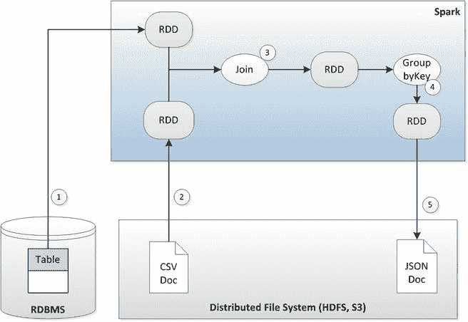

图 7-11.

Spark 处理的基本要素

#### 结论

预测磁盘在数据库系统中终结显然为时过早：磁盘在存储海量“冷数据”或“温数据”方面仍然提供最佳经济效益，在大数据时代，存储的经济性依然至关重要。然而，`固态硬盘`对于那些检索速度比长期存储成本更重要的数据集，则提供了更优的经济效益。所有重要的数据库系统都在适应`SSD`的独特物理特性。一些数据库从底层开始构建，以充分利用`SSD`的处理特性。

随着内存价格下降，单台数据库服务器可容纳的内存容量增加，`内存架构`对于规模较小，或延迟与事务处理速度比大规模存储经济性更重要的数据库，变得愈发具有吸引力。当一个数据库无法装入单台服务器的内存时，`分布式内存系统`可能提供一个极具吸引力的高性能解决方案。

我们已经看到`内存数据库`设计如何在各类数据库系统中兴起：关系型、键值型以及大数据型。混合设计的数量也在不断增加，例如 Oracle 的方案，试图将`内存`处理的优势与仅传统磁盘设备才能提供的存储经济性相结合。

#### 注释

一个架构时代的终结（是时候进行彻底重写了），`http://nms.csail.mit.edu/∼stavros/pubs/hstore.pdf`

