# 第二部分
技术细节

### 8. 分布式数据库模式

> 将无法扮演的角色分配给队员的经理应受责备。——弗朗茨·舒伯特
> 通信速度之快令人惊叹。同样真实的是，速度会加剧我们所知虚假信息的传播。——爱德华·R·默罗

当应用程序需求超出数据库容量时，Web 应用程序的管理员传统上面临两种选择：通过提升单个服务器的性能进行纵向扩展，或通过增加更多服务器进行横向扩展。在关系数据库时代的大部分时间里，纵向扩展是更实际的选择。早期的关系数据库不提供集群选项，而单台服务器提供的 CPU 和内存持续遵循摩尔定律呈指数级增长。因此，横向扩展既不实际也不必要。

然而，随着数据库工作负载从防火墙后的客户端-服务器应用程序转向可能具有全球范围的 Web 应用程序，在单台服务器上支持工作负载和可用性要求变得越来越困难。此外，互联网应用程序常面临不可预测且大规模的工作负载增长：应用程序可能“突然爆红”，需求出现指数级增长。计算机硬件的经济甜点以及增长的需求日益鼓励采用服务器集群，而非单一、庞大的专有服务器。数据库的横向扩展解决方案变得势在必行。

为了满足 Web 规模应用的需求，新一代分布式非关系型数据库应运而生。在本章中，我们将深入探讨这些分布式数据库系统的架构。

#### 分布式关系数据库

最初的数据库系统设计为在单台计算机上运行。事实上，在客户端-服务器革命之前，早期数据库应用程序的所有组件——包括所有应用程序代码——都驻留在单一系统上：大型机。

在这种集中式模型中，所有程序代码都在服务器上运行，用户通过哑终端与应用程序代码通信（终端之所以“哑”，是因为它们不包含任何应用程序代码）。在客户端-服务器模型中，表示层和业务逻辑在工作站——通常是 Windows PC——上实现，这些工作站与单一后端数据库服务器通信。在早期的互联网应用中，业务逻辑在一个或多个 Web 应用服务器上实现，而表示逻辑则在 Web 浏览器和应用服务器之间共享，后者几乎总是与单一的数据库服务器通信。

图 8-1 展示了这三种架构，显示了每种模式如何继续依赖单一的、庞大的数据库服务器。

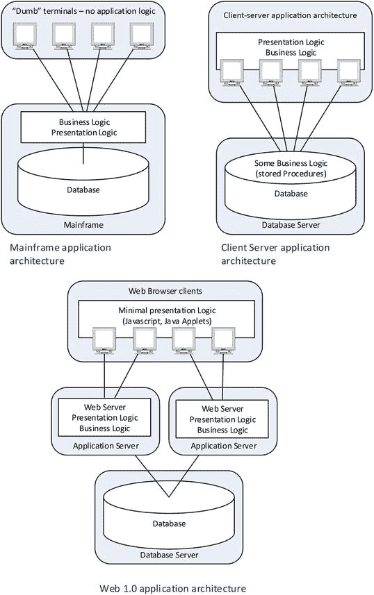

图 8-1. 大型机、客户端-服务器和早期 Web 架构都依赖单一的、庞大的数据库服务器

##### 复制

数据库复制最初被采用作为实现高可用性的一种手段。使用复制，数据库管理员可以配置一个备用数据库，以便在发生故障时接管主数据库。

数据库复制通常利用大多数关系型数据库用于支持`ACID`事务的`事务日志`。我们在第 7 章`内存数据库`的背景下介绍了`事务日志`模式。当`ACID`兼容数据库中的事务提交时，事务记录会立即写入`事务日志`，以便在发生故障时得以保留。监控`事务日志`的复制进程可以将更改应用到备份数据库，从而创建一个副本。

图 8-2 说明了基于日志的复制方法。数据库事务以异步“延迟”方式写入数据库文件(1)，但数据库事务在提交时立即写入`事务日志`(2)。复制进程监控`事务日志`，并在事务被写入时将其应用到只读的从属数据库(3)。复制通常是异步的，但在某些数据库中，提交可以延迟直到事务被复制到从属数据库。

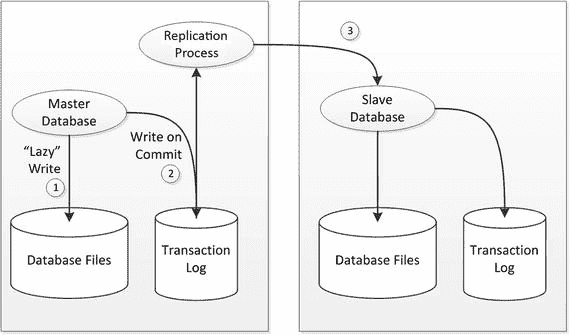

图 8-2. 基于日志的复制

正如我们在第 3 章看到的，复制通常是将数据库负载分布到多台服务器的第一步。使用复制，读取负载可以以横向扩展的方式分布，尽管数据库事务仍然必须应用到主副本。

##### 共享无共享与共享磁盘

分发数据库工作负载的复制模式能很好地将读活动分散到多个服务器上，但它无法分发事务性写负载，写操作仍然必须完全定向到主服务器。

复制对于分发数据仓库工作负载的价值也有限。联机事务处理（OLTP）工作负载通常由大量短时请求组成。然而，在数据仓库环境中，工作负载通常由数量较少但数据密集型的查询构成。在高端数据库服务器中，这些海量查询由多个进程或线程执行，每个进程或线程可以利用独立的 CPU 核心并受益于多个 I/O 通道。

跨多个数据库服务器并行化查询需要新的方法。数据仓库供应商通过实现无共享集群数据库架构为这个问题提供了解决方案。与关系型世界中的许多概念一样，无共享思想最著名的是由**Michael Stonebraker**在 1980 年代概述。数据库服务器可以被分类为：

*   **全共享**：在这种情况下，每个数据库进程共享相同的内存、CPU 和磁盘资源。共享内存意味着每个进程都在同一个服务器上，因此这种架构是单节点数据库架构。
*   **共享磁盘**：在这种情况下，数据库进程可以存在于集群中的不同节点上，并可以访问其所在服务器的 CPU 和内存。然而，每个进程对磁盘设备拥有平等的访问权，这些设备在集群的所有节点之间共享。
*   **无共享**：在这种情况下，集群中的每个节点不仅可以访问自己的内存和 CPU，还可以访问专用的磁盘设备及其自己的数据库子集。我们在本书中已经看到几个无共享架构的例子，包括第 3 章中的分片 MySQL 设计和第 7 章中的 VoltDB 分区方案。

无共享模型成为早期几个集群数据库系统（如 Teradata）的基础。它为数据仓库工作负载提供了一个有吸引力的模型，因为查询可以基于它们希望访问的数据轻松地在多个节点上并行化。对于一个希望最大化以读为中心的工作负载的系统来说，实现起来要容易得多。采用无共享模型的数据库通常自称为大规模并行处理（`MPP`）数据库。图 8-3 展示了无共享模型。

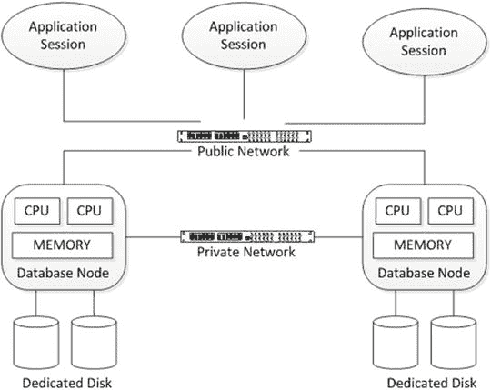
*图 8-3. 无共享数据库架构*

无共享架构在事务场景中往往会失效，因为需要协调可能涉及多个节点上数据的事务。由于 ACID 事务是“要么全做，要么全不做”的，事务中的所有节点必须在事务执行上紧密协调。这种协调被称为两阶段提交，实现起来非常困难，并可能导致“状态不明”的事务结果和较差的事务性能。

无共享架构的另一个缺点是，如果没有仔细分区，集群工作负载会变得不平衡。维护正确的分区成为一个主要的运维活动。当从集群中添加或移除节点时，需要进行昂贵的再平衡操作。

共享磁盘架构在理论上允许更大、更弹性的可扩展性，并且它消除了再平衡操作的需要。它还提供了一种更经济的高可用性解决方案，因为没有节点对任何特定的数据集负有专属责任。在无共享架构中，节点故障会导致部分数据库不可用，而在共享磁盘架构中，剩余节点能够接管故障节点的责任。

共享磁盘架构面临的挑战是需要跨节点协调缓存数据。如果没有内存缓存，所有操作的性能将下降到磁盘速度。但为了在所有节点上维护一致的数据视图，每个节点需要维护一致的缓存。维护这种缓存一致性会给节点间的网络带来压力，并且难以成功实现。

迄今为止，在商业上唯一取得成功的共享磁盘关系数据库管理系统（RDBMS）是 Oracle 的真正应用集群（`RAC`）集群数据库。`RAC`是 Oracle 的`Exadata`数据库一体机和云数据库产品的基础。图 8-4 展示了共享磁盘模型。

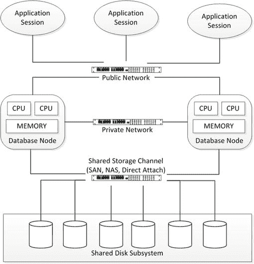
*图 8-4. 共享磁盘数据库架构*

#### 非关系型分布式数据库

在分布式关系数据库中跨多个节点维护 ACID 事务完整性是一项重大挑战。然而，在非关系型数据库系统中，通常不提供 ACID 合规性。对于非关系型分布式数据库，以下考虑因素变得更加重要：

*   **平衡可用性与一致性**：正如我们在第 3 章中所见，布鲁尔 CAP 定理认为，一个旨在扩展超出单一本地网络的分布式数据库，在发生网络分区时必须在可用性和一致性之间做出选择。一个符合 ACID 的数据库必须优先考虑一致性，而非其他所有因素。然而，没有严格 ACID 合规性约束的非关系型数据库可以取得不同的平衡。
*   **硬件经济性**：当系统扩展到数千或数十万个节点时，即使单个服务器的成本有微小差异也会迅速放大。因此，一个经济的数据库架构将更好地利用商品化硬件，以获得可用的最佳性价比。此外，可能需要能够处理服务器配置之间的差异，以便可以在不升级所有现有节点至最新硬件规格的情况下，将新硬件添加到数据库集群中。
*   **弹性**：在一个庞大的数据库集群中，节点会不时发生故障。在发生这些故障时，不能有数据丢失、可用性中断，甚至可能不能有事务级别的失败。

新一代数据库采用了三种主要的分布式数据库架构。这三种模型是：

*   **传统分片架构的变体**，其中数据根据“分片键”的值被分段存储在各个节点上。
*   **`Hadoop HDFS/HBase`模型的变体**，其中“全知主节点”根据负载和其他因素决定数据在集群中的位置。
*   **`Amazon Dynamo`一致性哈希模型**，其中数据基于键值的可预测数学哈希分布在集群的各个节点上。

为了确保在服务器故障时不丢失数据，复制可能内置于这些架构中，尽管复制策略各不相同。我们将在本章剩余部分研究这些方法各自的例子。我们使用`MongoDB`作为分片架构的例子，`HBase`作为全知主节点的例子，`Cassandra`作为`Dynamo`风格一致性哈希的例子。

#### MongoDB 分片与复制

`MongoDB`支持分片以提供横向扩展能力，支持复制以实现高可用性。尽管两者可以独立实现，但在生产场景中通常同时存在。

##### 分片

MongoDB 分片架构的高层表示如图 8-5 所示。每个分片由一个独立的 MongoDB 数据库实现，该数据库在大多数方面并不知晓自己在更广泛的分片服务器中的角色 (1)。一个独立的 MongoDB 数据库——配置服务器 (2)——包含可用于确定数据如何在各分片间分布的元数据。一个路由器进程 (3) 负责将请求路由到相应的分片服务器。

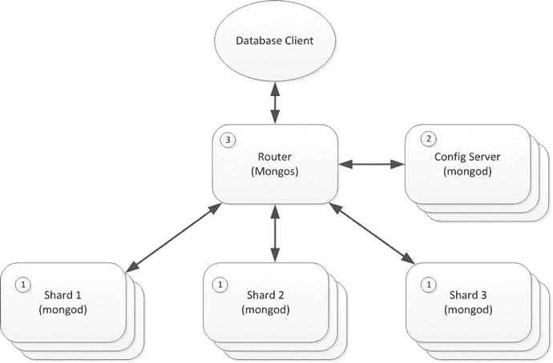

图 8-5. MongoDB 分片架构

您可能还记得，在 MongoDB 中，一个 `集合` 用于存储多个通常具有某些共同属性的 JSON 文档。要对一个集合进行分片，我们需要选择一个 `片键`，这是一个或多个索引属性，将用于确定文档在各分片间的分布。MongoDB 索引的 `B-tree` 结构包含了将键均匀分布到各分片所需的信息。

###### 分片机制

数据在分片间的分布可以是基于范围的，也可以是基于哈希的。在基于范围的分区中，每个分片被分配一个特定的片键值范围。MongoDB 会查阅索引中的键值分布，以确保每个分片被分配大致相同数量的键。在基于哈希的分片中，键是基于应用于片键的哈希函数进行分布的。

每种方案都有其优点和需要权衡之处。图 8-6 展示了对于插入和范围查询，范围分片与哈希分片固有的性能权衡。

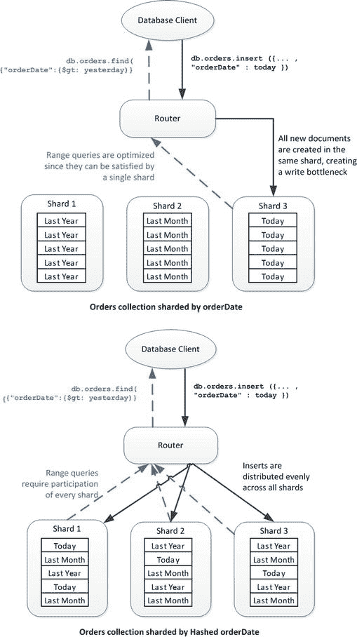

图 8-6. MongoDB 中范围分片与哈希分片的比较

基于范围的分区使得处理值范围的查询执行效率更高，因为这些查询通常可以通过访问单个分片来解决。基于哈希的分片则要求范围查询通过访问所有分片来解决。另一方面，基于哈希的分片更可能将“热点”文档（例如，未完成的订单或最近的帖子）均匀分布在集群中，从而更有效地平衡负载。

然而，当启用范围分区且片键持续递增时，负载往往只聚集在其中一个分片上，从而导致集群失衡。而使用基于哈希的分区，新文档会均匀分布在集群的所有成员中。此外，尽管 MongoDB 试图将片键在集群中均匀分布，但在特定的片键范围内可能存在热点，这再次导致负载失衡。在这种情况下，基于哈希的分片更有可能均匀分配负载。

标签感知分片允许 MongoDB 管理员微调文档到分片的分布。通过将一个分片与一个标签关联，并将集合内的一个键范围与同一个标签关联，管理员可以明确地确定这些文档将驻留的分片。这可用于将数据归档到更便宜、更慢的存储上的分片，或将特定数据定向到特定的数据中心或地理位置。

###### 集群平衡

当实施基于哈希的分片时，在大多数情况下，每个分片中的文档数量倾向于保持平衡。然而，在基于范围的分片场景中，分片很容易变得不平衡，特别是当片键基于一个持续增长的值时，例如自动递增的主键 ID。

因此，MongoDB 会定期评估集群中分片的平衡情况，并在需要时执行再平衡操作。再平衡的单位是分片块。分片由块组成——通常大小为 64MB——这些块包含连续的片键值（或哈希后的片键值）。如果向集群中添加或移除了分片，或者平衡器确定某个分片已变得不平衡，它便可以将块从一个分片移动到另一个分片。如果块变得太大，它们本身也会被拆分。

##### 复制

分片几乎总是与复制结合使用，以确保生产环境 MongoDB 部署的可用性和可扩展性。

在 MongoDB 中，数据可以通过副本集在多台机器间复制。一个副本集由一个主节点以及两个或更多个从节点组成。主节点接受所有写请求，这些请求被异步传播到从节点。

主节点由一个涉及所有可用节点的选举决定。要获得成为主节点的资格，一个节点必须能够联系到副本集中超过半数的节点。这确保了如果一个网络将副本集分割成两部分，只有一部分会尝试建立一个主节点。

成功的候选节点将根据它联系到的节点数量以及一个可能由系统管理员分配的 `priority` 值来选出。将一个实例的优先级设置为 0 将阻止它被选为主节点。如果出现平票，将选择具有最近 `optime`（最后一次操作的时间戳）的服务器。

主节点在其本地数据库（称为 `oplog`）中存储有关集合文档更改的信息。主节点将不断尝试将这些更改应用到从实例。

副本集内的成员通过 `heartbeat` 消息频繁通信。如果主节点发现它无法收到超过半数从节点的心跳消息，那么它将放弃其主节点状态，并将召集新的选举。图 8-7 展示了一个三成员副本集，并说明网络分区如何导致主节点变更。

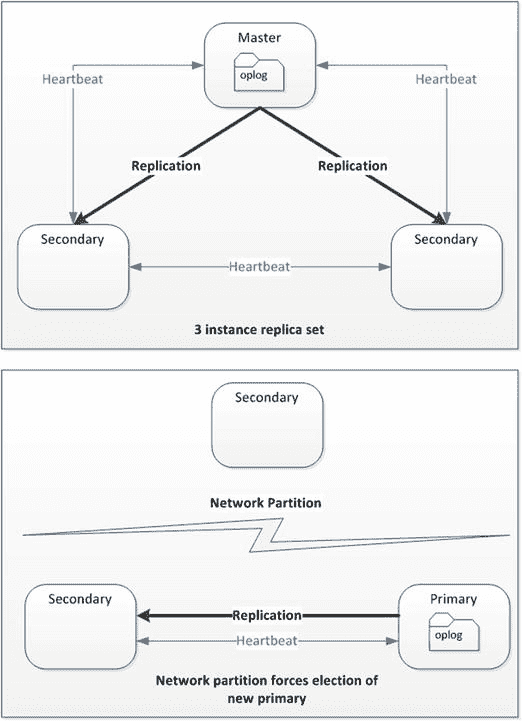

图 8-7. MongoDB 副本集与主节点故障转移

`Arbiters`（仲裁者）是特殊的服务器，可以在主节点选举中投票，但不保存数据。对于大型数据库，这些仲裁者可以避免创建原本不必要的额外服务器来确保在选举主节点时有法定人数可用。

##### 写入关注与读取偏好

MongoDB 应用程序可以在一定程度上控制读写操作的行为，提供可调的一致性和可用性。

*   `write concern`（写入关注）设置决定了 MongoDB 何时认为一个写操作已完成。默认情况下，写操作在主节点接收到修改后即完成。这意味着，如果主节点发生不可恢复的故障，则可能会丢失数据。为确保写操作已传播到主节点之外，客户端可以发出一个阻塞调用，该调用将等待直到写操作被所有从节点、大多数从节点或指定数量的从节点接收。
*   `read preference`（读取偏好）决定了客户端将读请求发送到哪里。默认情况下，所有读请求都发送到主节点。但是，客户端驱动可以请求在主节点不可用时，将读请求路由到从节点，或者路由到所有从节点，或者路由到“最近”的服务器。后一个设置旨在优先考虑低延迟而非一致性。

读取偏好和写入关注的默认设置导致 MongoDB 表现为一个严格一致的系统：每个人都会看到文档的同一版本。允许从从节点满足读取请求会导致更趋于最终一致的行为，除非写入关注被配置为阻塞写操作直到它们到达从节点。

我们将在下一章更详细地探讨 MongoDB 的一致性。

#### HBase

HBase 既可被视为"Hadoop 数据库"，也可被视为"开源 BigTable"。也就是说，我们可以将 HBase 描述为一种在 Hadoop HDFS 文件系统之上提供随机访问数据库服务的机制，或者也可以将其视为 Google BigTable 数据库的开源实现，并且恰好使用 HDFS 进行数据存储。这两种描述都是准确的：尽管理论上 HBase 可以在任何分布式文件系统——甚至非分布式文件系统——上实现，但它几乎总是在 Hadoop HDFS 上实现，并且 HBase 的许多架构假设也反映了这一点。另一方面，HBase 实现了实时随机访问数据库功能，这本质上与 Hadoop 的基本能力不同。
在接下来的讨论中，我们将重点关注最常见的 HBase 架构形式：在 HDFS 之上实现的形式。在 HDFS 上实现 HBase 创造了一种混合体，结合了无共享和共享磁盘的集群模式。一方面，每个 HBase 节点都可以访问数据库中的任何数据元素，因为所有数据都可以通过 HDFS 访问。另一方面，通常将 HBase 服务器与 HDFS DataNode 放置在同一位置，这意味着实际上每个节点往往负责存储在本地磁盘上的一个独有的数据子集。
无论哪种情况，HDFS 都为磁盘上的数据提供了可靠性保证：HBase 架构不需要关心写入镜像或磁盘故障管理，因为这些都由底层的 HDFS 系统自动处理。
我们在第 2 章介绍了 HDFS 和 Hadoop 架构；如果需要复习，请参考该章。HDFS 使用直接连接到构成 Hadoop 集群的服务器（即 DataNode）的磁盘来实现分布式文件系统。HDFS 自动管理数据冗余：默认情况下，数据会在三个 DataNode 上进行复制，其中一个（如果可能）位于单独的服务器机架上。

##### 表、区域与区域服务器

HBase 基于 Google 的 BigTable 规范实现了一个宽列存储。我们在第 2 章接触过该数据模型，并将在第 10 章详细讨论。目前，我们可以将 HBase 表视为潜在的海量表格数据集，在磁盘上由数量可变的、称为`Hfiles`的 HDFS 文件实现。
HBase 表中的所有行都由一个唯一的`行键`标识。一个规模不小的表会被拆分成多个称为`区域`的水平分区。每个区域由一个连续的、排序的键值范围组成。这类似于本章前面描述的 MongoDB 基于范围的分片方案。
对一个区域的读或写访问由一个`区域服务器`控制。每个`区域服务器`通常运行在一个专用主机上，并且通常与 Hadoop `DataNode`放置在同一位置。
每个`区域服务器`中通常会有多个区域。随着区域增长，它们会根据可配置的策略拆分成多个区域。区域也可以手动拆分。我们将在本章稍后详细讨论这一点。
每个 HBase 安装都会包含一个跨多个节点实现的 Hadoop `Zookeeper`服务。HBase 可能与 Hadoop 集群的其他部分共享这个`Zookeeper`集合，也可能使用专用的服务。
当 HBase 客户端希望读写特定的键值时，它会向`Zookeeper`询问控制 HBase 目录的`区域服务器`的地址。该目录包含表`-ROOT-`和`.META.`，它们标识了负责特定键范围的`区域服务器`。然后，客户端将与该`区域服务器`建立连接，并请求读写相关的键值。
HBase 主服务器执行各种内务管理任务。特别是，它控制区域在`区域服务器`之间的平衡。如果添加或移除了一个`区域服务器`，主服务器将组织将其区域重新定位到其他`区域服务器`。
图 8-8 展示了其中一些建筑元素。HBase 客户端咨询`Zookeeper`以确定 HBase 目录表的位置（1），然后可以查询该目录来确定相应的`区域服务器`的位置（2）。接着，客户端将向相应的`区域服务器`请求读取或修改键值（3）。`区域服务器`读取或写入位于 HDFS 上的相应磁盘文件（4）。
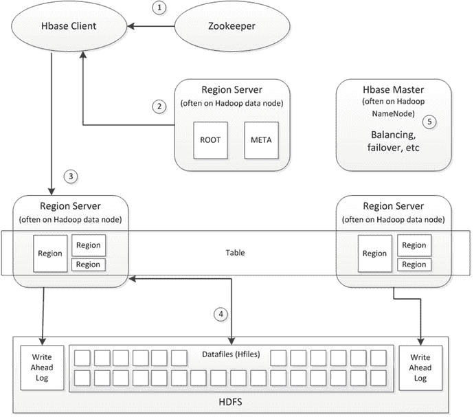
图 8-8.
HBase 架构

##### 缓存与数据本地性

`区域服务器`包含一个可以满足许多内存读取的块缓存，以及一个`内存存储`，它在内存中写入，然后再刷写到磁盘。然而，为了确保写入的持久性，每个`区域服务器`都有一个专用的预写日志，它将所有写入操作记录到 HDFS。这种架构是日志结构合并树模式的实现，该模式在第 10 章有更全面的描述。
`区域服务器`可以充当通用的 HDFS 客户端，与 HDFS `名称节点`通信以执行文件的读写操作。在最典型的生产部署场景中，每个`区域服务器`位于一个 Hadoop `名称节点`上，因此，区域数据将与`区域服务器`放置在同一位置，提供良好的数据本地性。这种数据本地性会因重新平衡操作和`区域服务器`故障切换而被打乱，但压缩操作——如第 10 章所述合并 HDFS 磁盘文件——将恢复数据本地性。
Hadoop 和 HBase 支持一种称为`短路读取`的模式，在此模式下，`区域服务器`可以直接从本地磁盘读取，绕过`名称节点`。当然，这只有在数据存储在同时托管`区域服务器`的`数据节点`上时才可能。
三种级别的数据本地性如图 8-9 所示。在第一种配置中，`区域服务器`和`数据节点`位于不同的服务器上，所有读写都必须通过网络。在第二种配置中，`区域服务器`和`数据节点`放置在同一位置，所有读写都通过`数据节点`，但由本地磁盘满足。在第三种场景中，配置了`短路读取`，`区域服务器`可以直接从本地磁盘读取。
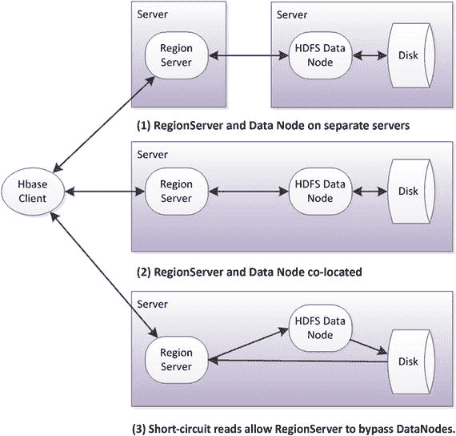
图 8-9.
HBase 中的数据本地性

##### 行键排序

HBase 的区域分区方案要求区域由连续的行键范围组成。当行键包含某种形式的单调递增值（如时间戳或递增计数器）时，这种基于范围的分区方案会对性能产生显著影响。在这种情况下，所有写入操作都将定向到特定的区域，从而定向到单个`区域服务器`。这可能会在写入吞吐量上形成瓶颈。
HBase 没有提供内部机制来缓解此问题。这取决于应用程序设计者来构建一个要么是随机化的键——例如，时间戳的哈希值——要么以某种方式用一个更平衡的属性作为前缀的键。在 HBase 时间序列数据库`OpenTSDB`中，时间戳前面加上了一个具有大量值的度量标识符变量。单个度量的数据将位于特定的`区域服务器`中，但特定时间戳的数据将分布在所有`区域服务器`上。


##### RegionServer 的分割、负载均衡与故障处理

随着区域（region）不断增长，`RegionServer` 会根据需要对其进行分割。新产生的区域最初仍将由原始的 `RegionServer` 管理——但它们有资格在负载均衡操作期间被重新分配。默认的区域分割策略会导致区域大小逐步增大，第一次分割可能在区域大小仅为 128MB 时就发生，而第十个区域的大小将约为 10GB。不过，也可以手动分割区域，或通过自定义代码覆盖默认的分割策略。

HBase `master` 节点最重要的职责之一，就是在各个 `RegionServer` 之间平衡区域分布。`master` 会定期评估所有 `RegionServer` 的区域分布是否均衡，如果检测到不均衡，它就会将区域迁移到其他服务器。这是一种“软”重新平衡——区域的数据仍然保留在其位于 `HDFS` 磁盘上的原始位置，但管理该数据的职责被转移到了另一个 `RegionServer`。

如前所述，重新平衡往往会导致数据局部性（data locality）的损失：当某个 `RegionServer` 接管一个新区域的职责时，该区域很可能位于一个远程的数据节点上——至少在下一次 major compaction 之前是这样。

##### 区域副本

在早期版本的 HBase 中，如果一个 `RegionServer` 发生故障，需要故障切换到一个新的 `RegionServer`。由于 `RegionServer` 并不实际存储区域的数据（数据保存在 `HDFS` 中），因此故障并非灾难性的。`master` 会检测到故障，并以类似于负载均衡操作的方式，将相关区域分配给其他的 `RegionServer`。然而，这仍然会导致服务出现一定程度的中断。

区域副本允许在多个 `RegionServer` 上存储区域的冗余副本。如果某个 `RegionServer` 发生故障，这些副本就可以用来服务客户端的请求。

原始的 `RegionServer` 作为该区域的主副本。区域的只读副本被分发到其他的 `RegionServer`——如果可能的话，这些 `RegionServer` 最好位于不同的机架——它们随后“跟随”主 `RegionServer`。对这些副本的写入操作是异步于主 `RegionServer` 的写入的，因此副本中的数据并不总是最新的。我们将在下一章探讨 HBase 区域副本的配置如何影响一致性和可用性。

HBase 还支持一种复制功能，可用于建立一个重复的 HBase 数据库。这通常用于在另一个数据中心复制整个 HBase 数据库。

#### Cassandra

在第 3 章，我们介绍了亚马逊的 `Dynamo` 数据库以及一致性哈希的概念。许多开源系统都实现了 `Dynamo` 模型。在本章中，我们将探讨 Cassandra 的实现。

##### Gossip 协议

在 HBase 和 MongoDB 中，我们接触到了 `master` 节点的概念——这些节点承担特殊的监督功能，协调其他节点的活动，并记录数据库集群的当前状态。在 Cassandra 和其他 `Dynamo` 数据库中，则没有专门的 `master` 节点。所有节点都是平等的，每个节点都能够执行集群运行所需的任何活动。

然而，Cassandra 中的节点确实具有短期的特定职责。例如，当客户端执行一个操作时，会分配一个节点作为该操作的协调者。当有新成员加入集群时，会提名一个节点作为 `seed` 节点，新节点将从该节点获取信息。但是，这些短期职责可以由集群中的任何节点履行。

`master` 节点的一个优势是它可以维护集群配置和状态的权威版本。在没有 `master` 节点的情况下，Cassandra 要求集群的所有成员都保持与集群配置和状态的当前信息同步。这是通过使用 `gossip` 协议实现的。集群的每个成员每秒钟都会将其自身状态以及它所知道的任何其他节点的状态信息，发送给集群中最多三个其他节点。通过这种方式，集群状态在所有成员中不断得到更新。

`gossip` 这个名称非常贴切：当人们八卦时，他们通常倾向于谈论其他人！同样，在 Cassandra 中，节点不仅传播自己的状态，也会“八卦”其他节点的状态。

集群配置被持久化在 `system` 键空间（keyspace）中，该键空间对所有集群成员开放。`keyspace` 大致类似于关系数据库中的模式（schema）——`system` `keyspace` 包含记录集群配置元数据的表。

这种架构消除了集群内的任何单点故障。尽管带有 `master` 节点的分布式数据库也有策略来实现快速故障切换，但 `master` 节点的崩溃通常会导致可用性暂时下降，例如短暂地回退到只读模式。

Cassandra 集群中 gossip 的主要话题之一是节点的可用性。传统的节点故障检测机制是节点之间发送心跳。然而，在广泛分布的系统中，心跳可能因网络问题而丢失，而非实际的节点故障。因此，Cassandra 的故障检测更具概率性：可以认为，集群中的节点对其他节点的“担忧”会逐渐加深。如果某个节点似乎很可能宕机，那么操作就会被定向到“已知状态良好”的节点。


##### 一致性哈希

Cassandra 和其他基于 Dynamo 的数据库使用**一致性哈希**来在集群中分布数据。`rowkey`（类似于关系数据库中的主键）被哈希化。每个节点被分配一个哈希值范围，拥有特定哈希键值范围的节点负责该数据的初始放置。

在默认的 Cassandra 分区方案中，哈希值范围从 `-2⁶³` 到 `2⁶³-1`。因此，如果集群中有四个节点，并且我们希望为每个节点分配相等数量的哈希值，那么每个节点的大致哈希范围如下：

| 节点 | 低哈希值 | 高哈希值 |
| --- | --- | --- |
| 节点 A | `-2⁶³` | `-2⁶³/2` |
| 节点 B | `-2⁶³/2` | `0` |
| 节点 C | `0` | `2⁶³/2` |
| 节点 D | `2⁶³/2` | `2⁶³` |

我们通常将集群可视化为一个环：环的圆周代表所有可能的哈希值，节点在环上的位置代表其负责的区域。图 8-10 展示了一个简单的一致性哈希：`rowkey` 的值被哈希化，这决定了它在“环”上的位置。集群中的节点负责环中值的范围，从而拥有特定的 `rowkey` 值。

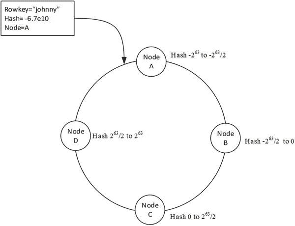

图 8-10.
一致性哈希

图 8-10 中的四节点集群是均衡的，因为每个节点负责的哈希范围大小相似。但随着我们添加节点，集群有失衡的风险。如果我们将集群中的节点数量翻倍，那么可以在环上现有节点之间为新增节点分配位置，集群将保持平衡。然而，翻倍集群通常是不切实际的：逐步增长集群更经济。

早期版本的 Cassandra 在添加新节点时有两个选项。我们可以重新映射所有的哈希范围，或者可以在现有范围内映射新节点。第一种选项会获得一个平衡的集群，但代价是昂贵的重新平衡过程。在第二种选项中，集群变得不平衡；由于每个节点负责从自身到其前驱节点之间的环区域，在不更改其他节点范围的情况下添加新节点实质上是将一个区域一分为二。图 8-11 展示了向集群添加节点如何导致哈希键范围分布不均衡。

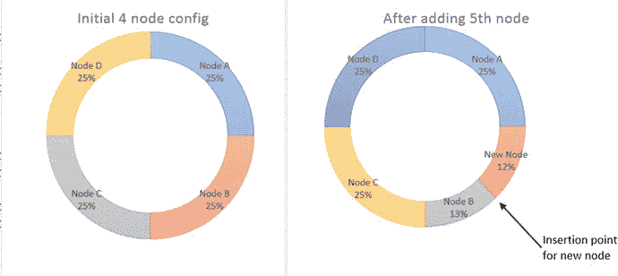

图 8-11.
向 Cassandra 集群添加节点（不使用虚拟节点）

在 Cassandra、Riak 和许多其他基于 Dynamo 的系统中实现的**虚拟节点**为这个问题提供了解决方案。使用虚拟节点时，哈希范围是为相对大量的虚拟节点（通常每个物理节点 256 个虚拟节点）计算的，然后这些虚拟节点被分配给物理节点。现在，当添加新节点时，可以将特定的虚拟节点重新分配给新节点，从而以最小的开销实现平衡配置。图 8-12 说明了虚拟节点与物理节点之间的关系。

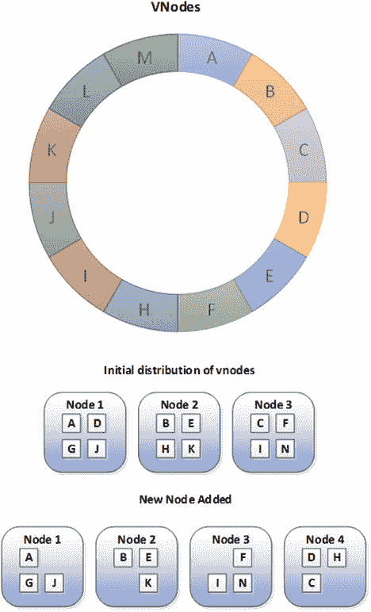

图 8-12.
使用虚拟节点在物理节点间分区数据

虚拟节点还有其他一些优势。例如，更容易平衡由异构系统组成的集群，因为你可以为更强大的新机器分配更多虚拟节点，为性能较弱的旧机器分配更少的虚拟节点。此外，如果一个节点死亡，可以从更多物理机中重建它，从而更公平地分摊恢复开销。

###### 保留顺序的分区器

Cassandra 分区器决定了键如何在节点间分布。默认分区器使用上一节描述的一致性哈希。Cassandra 也支持保留顺序的分区器，它将数据作为实际的（例如，未哈希的）`rowkey` 范围分布在集群的各个节点上。这样做的好处是将特定行范围的请求隔离到特定机器，但这可能导致集群不均衡，并可能产生热点，特别是如果键值是递增的。例如，如果键值是时间戳并且实现了保留顺序的分区器，那么所有新行都倾向于在集群的单个节点上创建。

在早期版本的 Cassandra 中，可能需要使用保留顺序的分区器来优化无法通过其他方式满足的范围查询；然而，在引入二级索引之后，保留顺序的分区器主要是为了向后兼容而保留，Cassandra 文档建议在新应用中不要使用它。

##### 副本

到目前为止，我们已经了解了 Cassandra 如何将数据项的初始副本分配给节点。一致性哈希算法也决定了数据项的副本存储位置。

负责与特定 `rowkey` 值对应的哈希范围的节点称为**协调节点**。协调器负责确保写入所需数量的副本数据副本。数据必须写入的节点数量称为`复制因子`，这也是我们在第 3 章首次遇到的 `NWR` 表示法中的 `N`。

默认情况下，协调器会将数据副本写入环上的接下来 `N-1` 个节点。因此，如果`复制因子`是 3，协调器会将数据项的副本发送到环上的接下来两个节点。在此场景中，每个节点将复制来自环上前面两个节点的数据，并复制到环上的后面两个节点。这个简单的方案被称为`简单复制策略`。

Cassandra 还允许你配置更复杂和高可用的方案。`网络拓扑感知复制策略`确保副本将被写入同一数据中心内其他机架的节点，或者可选地写入另一个数据中心的节点。图 8-13 说明了这两种复制策略。

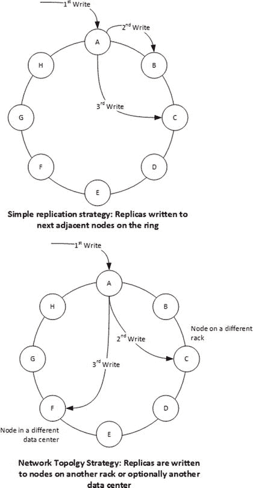

图 8-13.
Cassandra 中的复制策略

##### 探测器

Cassandra 使用**探测器**来帮助优化读写操作。可以配置多种探测器。

*   `SimpleSnitch` 仅返回环上节点的列表。这对于我们在上一节讨论的`简单复制策略`已经足够。
*   `RackInferringSnitch` 使用主机的 IP 地址来推断其机架和数据中心位置。此探测器支持`网络感知复制策略`。
*   `PropertyFileSnitch` 使用配置文件中的数据而不是 IP 地址来确定数据中心和机架拓扑。

此外，所有探测器都监控请求的读取延迟，并利用此数据构建统计模型，从而可以将请求路由到性能最佳的节点。

存在专门的探测器，它们理解各种云平台（如 Amazon EC2）内部的网络拓扑。


#### 本章小结

在本章中，我们回顾了针对传统关系型数据库及几种非关系型系统的分布式数据库模式。关系型数据库架构诞生于大型、单体数据库服务器的时代，大多数关系型数据库至今仍以单实例方式运行。然而，无共享（shared-nothing）集群在海量并行数据仓库中已很常见，而 Oracle 也拥有一款商业上成功的共享磁盘（shared-disk）集群 RDBMS。

我们详细考察了三种分布式非关系型数据库系统。MongoDB 结合了分片和复制技术来实现分布式处理。HBase 利用 Hadoop 分布式文件系统的分布式文件系统，结合范围分区策略，实现了高度可扩展的解决方案。Cassandra 则采用了 Amazon Dynamo 系统开创的一致性哈希方案，创建了一个对称的集群解决方案，无需主服务器。

在分布式数据库中，通常会在集群内维护数据的多个副本。在下一章中，我们将了解这些数据库如何在这样的分布式系统中管理数据一致性。

### 9. 一致性模型

> 变要想产生任何真正的价值，就必须是持久且一致的。——托尼·罗宾斯，励志演讲家
> 一致性与自然相悖，与生命相悖。唯一完全一致的人是死人。——奥尔德斯·赫胥黎

推动非关系型数据库革命的最大因素之一，是希望摆脱严格 ACID 一致性的限制。人们普遍认为，新一代非关系型数据库仅提供弱一致性，或者最多是最终一致性，并且其底层一致性机制非常简单。这种看法是对非关系型数据库系统的根本误解。非关系型系统提供了一系列一致性保证，包括严格一致性，尽管是在单对象级别上。事实上，当我们失去了 ACID 事务模型提供的严格且可预测的规则时，需要一些复杂的架构来平衡可接受的一致性程度。

在缺乏 ACID 事务模型的情况下，出现了多种处理一致性的方法：包括相对熟悉的最终一致性概念以及各种可调节的一致性模型。许多非关系型数据库实际上对单个对象是严格一致的，即使它们不支持严格的多对象一致性。而且，尽管没有 ACID 事务，但像 Cassandra 这样的系统支持一种更简单的轻量级事务模型。

一致性模型对数据库并发性（多用户同时访问数据的能力）和可用性有着巨大影响。理解数据库系统如何处理一致性对于确定该数据库能否满足应用程序需求至关重要。

#### 一致性的类型

具有讽刺意味的是，“一致性”这个术语在数据库社区中的用法存在显著差异。一致性可能指以下任何一种含义：

*   **与其他用户的一致**：如果两个用户同时查询数据库，他们会看到相同的数据吗？传统关系型系统通常会努力确保他们看到的数据一致，而非关系型数据库则通常采取更宽松的立场。
*   **单个会话内的一致**：在单个数据库会话的上下文中，数据是否保持某种逻辑一致性？例如，如果我们修改了一行然后再次读取，我们会看到自己的更新吗？
*   **单个请求内的一致**：单个请求返回的数据是否在内部是连贯的？例如，当我们读取关系表中的所有行时，通常保证我们看到的是该表在某个时间点的状态。我们开始查询后发生的对表的修改不包括在内。
*   **与现实的一致**：数据是否与数据库试图反映的现实相符？例如，银行事务仅仅在事务结束时保持一致是不够的；它还必须正确反映实际的账户余额。以准确性为代价的一致性通常是不可接受的。

##### ACID 与 MVCC

关系型数据库通过两种主要的架构模式来满足一致性需求：ACID 事务和多版本并发控制（MVCC）。

我们已经在本书中广泛讨论了 ACID 事务。回顾一下，ACID 事务应该是：

*   **原子性**：事务是不可分割的——事务中的所有语句要么全部应用于数据库，要么都不应用。
*   **一致性**：数据库在事务执行前后都保持一致状态。
*   **隔离性**：虽然一个或多个用户可以同时执行多个事务，但一个事务不应该看到其他进行中的事务的影响。
*   **持久性**：一旦事务保存到数据库（在 SQL 数据库中通过 `COMMIT` 命令），即使操作系统或硬件发生故障，其更改也应持久保存。

**注意**

即使是 Oracle 这样的关系型数据库，默认情况下也不实现 ACID 要求的严格事务隔离。完全隔离所有事务的开销通常太高。

实现 ACID 一致性的最简单方法是使用锁。在基于锁的一致性中，如果一个会话正在读取某个项目，则其他会话不能修改它；如果一个会话正在修改某个项目，则其他会话不能读取它。然而，基于锁的一致性会导致不可接受的高争用和低并发性。

为了在不进行过度锁定的情况下提供 ACID 一致性，关系型数据库系统几乎都采用了多版本并发控制（MVCC）模型。在该模型中，数据的多个副本被标记上时间戳或更改标识符，使数据库能够构建特定时间点的数据库快照。通过这种方式，MVCC 在最大化并发性的同时，提供了事务隔离和一致性。

例如，在 MVCC 中，如果一个数据库表在某个会话开始读取该表之后、完成读取之前发生了修改，数据库将使用表数据的先前版本来确保该会话看到一个一致的版本。MVCC 还意味着在事务提交之前，其他会话看不到该事务的修改——其他会话看到的是数据的旧版本。这些数据的旧副本也用于回滚未成功完成的事务。

图 9-1 说明了 MVCC 模型。一个数据库会话在时间 t1（1）发起一个事务。在时间 t2，该会话更新数据库表中的数据（2）；这导致创建了该数据的新版本（3）。大约在同一时间，第二个数据库会话查询数据库表，但由于第一个会话的事务尚未提交，他们看到的是数据的先前版本（4）。在第一个会话提交事务（5）之后，第二个数据库会话将从该数据的已修改版本进行读取（6）。

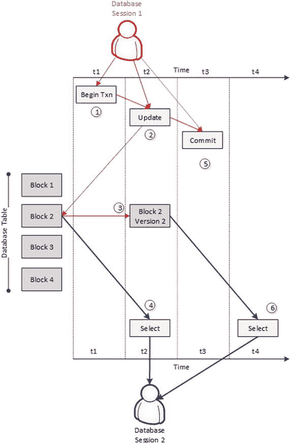

图 9-1.

多版本并发控制（MVCC）

MVCC 的巨大优势是减少了锁开销。在图 9-1 所示的示例中，如果没有 MVCC，更新将会创建一个阻塞性锁，阻止第二个会话读取数据，直到事务完成。


##### 全局事务序列号

MVCC 可以使用事务时间戳来确定哪些版本的数据应对特定查询可见。但大多数数据库使用的是全局事务 ID，而非显式的时间戳。在 Oracle 中这被称为系统变更号（`SCN`），在 Microsoft SQL Server 中则称为事务序列号。

每当事务启动时，此序列号就会递增，并被记录在被修改行（或数据库块）的结构中。当查询开始时，它会查找序列号小于或等于查询开始时当前序列号值的行。如果查询遇到序列号更高的行，它就知道必须请求该行的旧版本。

##### 两阶段提交

MVCC 与 ACID 事务模型协同工作，为运行在单一系统上的事务提供隔离。在分布式 RDBMS 中跨数据库的事务，则通过两阶段提交（`2PC`）协议来实现。

`2PC` 的两个阶段是：

*   提交请求阶段：协调者要求其他节点准备事务。通常，准备阶段涉及锁定相关的表行并应用更改但不提交。
*   提交阶段：如果提交请求阶段在所有节点都成功，协调者会向所有节点发出提交其事务的信号。或者，如果有任何节点遇到困难，则会向所有节点发送回滚请求，事务失败。

在这两个阶段之间可能会出现问题，在这种情况下，事务可能在部分节点成功而在其他节点失败；此时，会产生待定事务，需要由数据库管理员进行协调。

##### 其他一致性级别

多表 ACID 事务模型在某种程度上是数据库一致性的高标杆。虽然许多新一代数据库继续支持 ACID，但没有数据库试图提供更高层级的事务一致性，而许多数据库则提供较低的一致性保证。

第一个也是最重要的一致性降低是将其范围限制在单个操作或对象。在 RDBMS 中，我们可以跨多个语句保持一致性；例如，我们可以将一个表中删除一行和另一个表中插入一行作为一个原子操作。在大多数关系数据库中，我们可以要求访问多个表的一组查询从查询开始的那一刻起返回数据的一致视图。几乎没有非关系型系统支持这种级别的多对象一致性。

即使在单对象操作中，我们也可能期望各种一致性级别。实际上，最重要的 consistency 级别是：

*   强一致性：读操作将始终返回最近的数据值。
*   因果一致性：读操作可能不返回最新的值，但不会返回“乱序”的值。这意味着如果一个会话创建了更新 A、B 和 C，另一个会话绝不应该在看不到更新 B 的情况下看到更新 C。
*   单调一致性：在这种模式下，一个会话将永远不会看到数据回退到更早的时间点。一旦我们读取了一个数据项，我们将永远不会看到该数据项的更早版本。
*   读己之所写：这是一种最终一致性的形式，其中至少保证你能够看到自己执行过的任何操作。
*   最终一致性：系统在任何时间点可能不一致，但所有单个操作最终都将被一致地应用。如果所有更新停止，那么系统最终将达到一致状态。
*   弱一致性：系统不保证系统将变得一致——例如，如果服务器发生故障，更新可能会丢失。

实际上，非关系型系统实现的是强一致性或最终一致性，而 RDBMS 系统提供 ACID 一致性。大多数非关系型系统不直接支持因果或单调一致性级别。

#### MongoDB 中的一致性

默认情况下——在单服务器部署中——MongoDB 数据库提供严格的单文档一致性。当 MongoDB 文档被修改时，它会被锁定，防止其他会话读取和写入。

然而，当实现 MongoDB 副本集时，可以通过允许对可能包含过时数据的辅助服务器进行读取，来配置更接近最终一致性的方式。

##### MongoDB 锁定

MongoDB 通过使用锁来实现单个文档的一致性。锁用于确保两个写操作不会同时尝试修改一个文档，并且确保读取者不会看到数据的不一致视图。

我们之前看到了多版本并发控制（`MVCC`）算法如何被用来允许读取者在更新活动并发的情况下继续读取一致的数据版本。`MVCC` 在关系数据库中被广泛使用，因为它避免了阻塞读取者——读取者将读取数据项的先前“版本”，而不是在更新发生时被锁阻塞。MongoDB 没有实现 `MVCC` 系统，因此读取者会被阻止读取正在更新的文档。

MongoDB 锁的粒度在其历史中发生过变化。在 MongoDB 2.0 之前的版本中，一个全局锁序列化了所有写活动，在任何写操作期间，会阻塞服务器上所有文档的所有并发读取者和写入者。

在 2.2 版本中，锁的范围扩大到数据库级别，在 2.8 版本中扩大到集合级别。在 MongoDB 3.0 版本中，如果集合使用 `WiredTiger` 存储引擎存储，则锁定应用于文档级别。当文档级锁定生效时，对文档的更新只会阻塞希望访问同一文档的读取者或写入者。

锁定在 MongoDB 中是一个有争议的话题；原始的“全局”锁和缺乏 `MVCC` 与关系数据库中熟悉的机制相比显得较差。现在锁的范围仅限于文档级别，这些担忧已显著减少。

##### 副本集与最终一致性

在单服务器 MongoDB 配置中——以及在默认的多服务器场景中——MongoDB 提供强一致性。所有读取操作都被定向到主服务器，该服务器将始终拥有文档的最新版本。

然而，我们在前一章中看到，我们可以配置 MongoDB 的读取偏好，允许从辅助服务器进行读取，这可能会返回过时的数据。最终所有辅助服务器都应该接收到所有更新，因此这种行为可以宽松地描述为“最终一致”。


#### HBase 一致性

HBase 为单行提供**强一致性**：HBase 客户端不能以会导致行数据不一致的方式同时修改一行。这种行为与我们在关系型数据库中看到的情况类似，后者通常使用行级锁来防止对单行的同时更新。然而，在 HBase 中实现起来更为复杂，因为一行可能包含分布在多个列族中的数千个列，这些列族可能有不同的磁盘存储。在更新一行内的任何列或列族期间，`RegionServer` 将锁定整行，以防止对任何其他列进行冲突的更新。

读取操作不获取锁，读取也不会被写入操作阻塞。相反，读取操作使用一种我们本章前面讨论过的多版本并发控制 (`MVCC`) 形式。当读写操作并发执行时，读操作将读取该行的先前版本，而不是正在被更新的版本。

HBase 使用了我们前面讨论过的 `SCN` 模式的一个变体来实现 `MVCC`。当写入开始时，它会递增一个存储在被修改的单元格（即行内的特定列值）中的写入编号。当读取开始时，会被分配一个读取点编号，该编号对应于最高已完成写入点。然后，读取可以检查数据项，以确保它不会读取一个单元格，如果该单元格的写入编号表明自读取开始以来它已被更新。

##### 最终一致的区域副本

在 HBase 的早期版本中，保证了所有读取的**强一致性**——你总是能读取到行的最新写入版本。然而，随着第 8 章介绍的区域副本的引入，就可能出现一种形式的最终一致性。

引入区域副本是为了提高 HBase 的可用性。`RegionServer` 的故障绝不会导致数据丢失，但在新的 `RegionServer` 实例化期间，可能会造成轻微的性能中断。区域副本允许立即故障转移到备份的 `RegionServer`，该服务器维护着区域数据的一个副本。

默认情况下，在 HBase 中，所有读取都定向到主 `RegionServer`，这导致了严格一致的行为。但是，如果为读取配置了一致性为**时间线一致性**，那么读取请求将首先发送到主 `RegionServer`，随后很快会向次级 `RegionServer` 发送重复的请求。第一个返回结果的服务器完成该请求。请记住，主服务器在此竞争中占得先机，因此如果主服务器可用，它通常会是第一个返回的。

该方案被称为时间线一致性，因为次级 `RegionServer` 始终以与主服务器相同的顺序接收区域更新。然而，此架构不保证次级 `RegionServer` 拥有最新信息；并且如果存在多个次级 `RegionServer`，那么读取可能会返回乱序的写入结果，因为多个次级服务器与主服务器之间可能存在竞争条件。

图 9-2 说明了 `RegionServer` 副本处理过程。一个 HBase 客户端正在按顺序向主 `RegionServer` (1) 发出写入。这些写入被异步复制到次级 `RegionServer` (2)；在任何给定时刻，其中一些复制可能尚未完成 (3)。如果客户端使用的是时间线一致性，那么它可能会从主服务器读取数据，但如果主服务器无响应，它可能会从某个次级 `RegionServer` (4) 读取数据。连续的读取可能返回来自任一次级或主服务器的数据——因此数据可能以任何顺序返回。一致性的“时间线”特性仅适用于单个次级，而非整个系统。

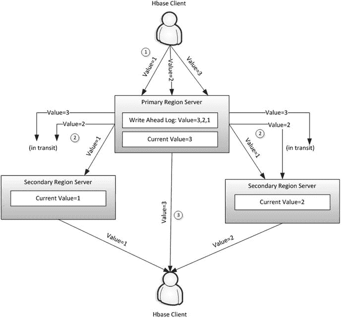
*图 9-2. 使用 `RegionServer` 副本的 HBase 时间线一致性*

注意：时间线一致性在 HBase 中不是默认设置。默认情况下，客户端将从主 `RegionServer` 读取，在这种情况下，HBase 将提供强一致性。

#### Cassandra 一致性

Cassandra 使用了 Amazon Dynamo 模型的**可调一致性**。这种可调一致性提供了多种一致性级别，其中大多数可以在单个请求的级别上指定。

我们在第 3 章简要介绍了 Dynamo 一致性模型。从高层来看，该模型允许独立配置以下三个变量，以提供多种结果：

*   `N` 是数据库将为每个数据项维护的副本数量。
*   `W` 是必须完成写入的数据项副本数量，之后写入操作才能将控制权返回给应用程序。
*   `R` 是应用程序在读取数据项时将访问的副本数量。

正如我们在第 3 章所见，这些变量可以配置为允许强一致性、弱一致性，以及平衡读写性能。

Cassandra 遵循 Dynamo 模式非常紧密，但有自己独特的实现。因此，虽然以下讨论应广泛适用于其他 Dynamo 系统（如 Riak 或 DynamoDB），但细节是 Cassandra 特有的。

##### 副本因子

**副本因子**决定了将在多个节点上维护多少数据副本。这在键空间（大致相当于一个模式）级别指定，等同于 Dynamo `NRW` 表示法中的 `N`。

正如我们在上一章所见，可以建立各种复制策略，以确保副本分布在多个机架或数据中心。

##### 写入一致性

每个写入操作都可以指定一个**写入一致性级别**。写入一致性级别控制 Cassandra 在完成写入请求之前必须满足的条件。一些更常见的级别是：

*   `ALL`：写入必须传播到所有节点。这导致**非常强的一致性**，但如果某个节点不可用，写入将无法完成。
*   `ONE`|`TWO`|`THREE`：写入必须传播到指定数量的节点。级别为 `ONE` 可最大化写入性能，但可能以牺牲一致性为代价。根据读取一致性设置和副本因子，`TWO` 和 `THREE` 可能提供也可能不提供更强的一致性保证。
*   `QUORUM`：写入必须完成到副本节点的**法定人数**。法定人数要求大多数副本接受写入，然后写入操作才能完成。
*   `EACH_QUORUM`：写入必须完成到**每个数据中心**的副本节点的法定人数。因此，如果有两个数据中心，每个数据中心有三个副本，则每个数据中心至少两个副本必须完成写入请求，操作才能完成。
*   `LOCAL_QUORUM`：要求仅在**当前数据中心**写入法定数量的副本。
*   `ANY`：只要写入到任何节点，即使该节点不负责存储该特定数据项，写入也会成功。如果无法到达任何直接负责存储该数据项副本的节点，那么在任何节点上的**提示移交**（本章稍后详述）就足以完成写入。这是一个**极低可靠性**的设置，因为默认情况下提示移交在三小时后会被删除；对此设置最好的说法是数据**可能**被写入了。

一些额外的写入一致性级别在下文关于轻量级事务的部分中描述。


##### 读一致性

读一致性级别与写一致性级别类似。关键术语是相同的，尽管其语义当然有所不同。写一致性的设置并不意味着任何特定的读一致性设置，正如我们将看到的，正是这两者之间的相互作用决定了数据库的整体行为。

最常见的读一致性级别有：

*   `ALL`：轮询所有副本。
*   `ONE`|`TWO`|`THREE`：读取请求将被传播到“最近的”一个、两个或三个节点。“接近度”由一个`snitch`确定（参见第[8]章）。
*   `LOCAL_ONE`：读取请求将被发送到当前数据中心中最近的节点。
*   `QUORUM`：当一个法定人数（quorum）返回数据后，读取完成：一个`QUORUM`涉及所有数据中心中大多数副本。
*   `EACH_QUORUM`：当每个数据中心中的副本法定人数都响应后，读取完成。
*   `LOCAL_QUORUM`：当本地数据中心中的副本法定人数响应后，读取完成。

一些额外的读一致性级别在后续关于轻量级事务的部分中有描述。

请注意，当从多个副本请求读取时，`Cassandra`不需要看到每个节点的全部数据内容。相反，协调器通常会请求一个数据摘要。该摘要是一个数据的哈希表示，可用于确定两组返回的数据是否相同。我们将在关于读修复和暗示切换的部分进一步讨论这一点。

#### 一致性级别间的相互作用

读和写一致性级别的设置相互作用，产生了各种性能、一致性和可用性结果。可以以降低性能为代价来配置强一致性和高可用性；可以以牺牲一致性为代价来配置高可用性和性能；或者可以以牺牲可用性为代价来实现一致性和性能。其中一些权衡在图[3-6]中进行了说明。表[9-1]描述了一些组合及其含义。

表 9-1.

`Cassandra`中读写一致性级别的相互作用

| 读\写 | `ONE` | `QUORUM` | `ALL` |
| --- | --- | --- | --- |
| `ONE` | 高性能和可用性，但无一致性 |   | 写入快速且高度可用；读取一致但速度慢且高度不可用 |
| `QUORUM` |   | 性能中等，可用性好，强一致性 |   |
| `ALL` | 写入缓慢且高度不可用；读取快速且一致 |   | 最严格的一致性，但可用性和性能最低 |

#### 暗示切换与读修复

我们在上一章关于`Cassandra`集群的上下文中讨论过暗示切换和读修复，但由于它们是`Cassandra`一致性机制的重要组成部分，有必要进一步讨论。

除非写一致性级别设置为`ALL`，否则不一致性会在`Cassandra`集群中积累。网络分区或临时节点停机（例如重启）会阻止一些副本写入完成。随着时间的推移，这些不一致性会不断积累，造成无序和混乱——通常在热力学中被称为熵。`Cassandra`和其他基于`Dynamo`的数据库中的反熵机制旨在主动将系统恢复到一致状态。

暗示切换允许一个节点存储原本打算发给另一个节点的更新，前提是该节点暂时不可用。如果该节点在短时间内（默认为三小时）重新上线，写入操作将被传输。如果该节点在该时间段内未重新上线，则暗示切换将被删除。如果一致性级别设置为`ANY`，暗示切换可以替代一次成功的写入。

读修复是`Cassandra`可用于修复不一致性的机制，例如，当一个节点停机时间超过暗示切换限制时。当`Cassandra`从多个节点组装一次读取时，它会检测到任何具有过时数据的节点。一个更新将被发送到过时的副本以纠正不一致性。

如前所述，`Cassandra`在多节点读取期间不会请求所有副本的整个数据值。相反，一个节点被直接发出读取实际数据的请求，而其他节点则被发送请求以获取数据的哈希摘要。如果结果不一致，则通过直接读取检索最新的数据，并向过时的节点发出读修复指令。

图[9-3]提供了一个读修复操作的示例。协调器节点向一个副本（1）请求直接读取（例如实际数据），并向另外两个副本（2）请求摘要（例如哈希值）。其中一个副本具有过期数据（3）。在将正确结果返回给客户端（4）后，协调器向过期的副本（5）发出读修复。

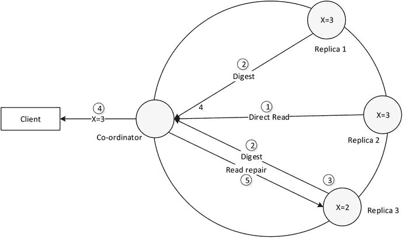

图 9-3.

`Cassandra`中的读修复

正如前一章所述，还可以安排或手动调用批量读修复操作，以查找整个键空间中的不一致性。这种机制将在第[10]章讨论压实策略时进一步探讨。

#### 时间戳与粒度

`Cassandra`使用时间戳来确定哪个副本是最新的。其他`Dynamo`系统（如`Riak`）使用不同的算法，称为向量钟，我们将在下一节讨论。

`Cassandra`的方法涉及比较冲突写入的时间戳，并选择时间戳最高的那个；这种策略被称为**最后写入胜出**。

当应用于文档数据库或键值存储中可能出现的大型复杂对象时，最后写入胜出的方法存在一些潜在的缺点。一个用户可能修改了用户的电子邮件地址，几秒钟后另一个用户修改了同一位用户的出生日期。我们不希望出生日期的修改抹掉电子邮件地址的更新。`MongoDB`和`HBase`在更新期间锁定整个文档或行以避免此潜在问题。

`Cassandra`通过将修改、并发和冲突解决的单位定为单个单元格（即行和列的交点）来解决此问题。这意味着两个用户可以愉快地同时修改同一行，前提是他们不修改同一列。如果一个用户更新了出生日期，而另一个用户更新了同一行的电子邮件地址，这两个更新都不会相互冲突。


##### 向量时钟

Cassandra 使用时间戳来确定哪个是“最新”的事务。如果对列值存在两个冲突的修改，具有最高时间戳的那个将被视为最近且最正确的。

其他 Dynamo 系统使用一种更复杂的机制，称为向量时钟。向量时钟的优势在于不需要在所有节点之间进行时钟同步，并帮助我们识别可能冲突的事务。

尽管名称如此，向量时钟并不包含任何时间戳。相反，它由一组计数器组成。这些计数器在操作完成时递增，其方式类似于前面讨论的传统系统变更号模式。该集合包含集群中每个节点的一个计数器。每当节点上发生操作时，该节点将递增其自身向量时钟中的计数器。每当节点向另一个节点传输操作时，它会在请求中包含其向量时钟。传输的向量时钟将包含传输节点的最高计数器，以及该传输节点曾见过的其他节点的最高计数器。

当节点收到来自其他节点的可能冲突的更新时，它可以比较向量时钟以确定请求的相对顺序。有一组定义好的向量时钟操作可以判断：
*   两个向量时钟是否来自完全同步的节点。
*   一个节点相对于另一个节点是否过时。
*   时钟是并发的，即每个节点都拥有一些比另一个节点更新的信息。在这种情况下，我们无法选择哪个更新是真正更正确的。

向量时钟以难以理解而闻名，尽管其底层算法其实相当简单。图 9-4 展示了三个向量时钟在三个节点上递增的示例。该算法为了清晰起见有所简化。

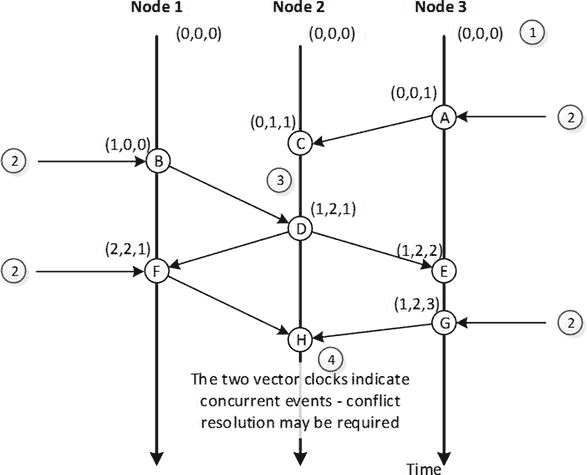

图 9-4. 向量时钟示例

在图 9-4 中，向量时钟开始时所有节点都设置为 0 (1)。来自外部客户端的节点更新导致节点递增其自身在向量时钟中的元素 (2)。当这些更改传播到其他节点时，接收节点更新其向量时钟并合并来自其他节点的向量时钟 (3)。事件 (H) 发生在节点 2 从节点 1 接收到向量时钟 (F) 和从节点 3 接收到向量时钟 (G) 时 (4)。这些向量时钟各自都包含比对方更高的元素；向量时钟 (F) 对于节点 1 的值更高，而向量时钟 (G) 对于节点 3 的值更高。节点 2 无法确定这两个向量时钟中哪一个代表最新的数据——每个发送节点都“知道”一些对方节点不知道的信息，因此不清楚哪个节点“知道”得最好。

图 9-4 中的向量时钟告诉我们版本 (G) 和版本 (F) 是冲突的——每个版本都包含来自唯一更新的信息，这些信息可能都包含重要内容。那么，系统该怎么办呢？以下是一些选项：
*   回退到最后写入获胜策略：两个更新不太可能发生在完全相同的纳秒，因此一个会有更高的时间戳值。我们可以决定时间戳最高的“获胜”。
*   保留两个副本：这需要应用程序或用户来解决冲突。
*   合并数据：这是原始 Dynamo 采用的方法，它管理着亚马逊的购物车。如果存在两个冲突的购物车，它们会被合并，最坏的情况（从亚马逊的角度看）是你买了两次相同的东西。另一种合并可以发生在计数器之类的数据上；我们不是让一个计数器递增覆盖另一个，而是可以推断两个操作都想要递增计数器，从而递增两次。存在一类特殊的数据类型——无冲突复制数据类型（CRDT），它们允许预先定义这类合并。

有支持向量时钟的支持者，也有支持 Cassandra 所用时间戳系统的支持者。双方都不质疑这两种方法的具体影响；他们的分歧在于对这些后果的可取性。最后写入获胜为应用程序开发者和管理员提供了一个更简单的模型，而向量时钟允许识别冲突，但随后必须解决这些冲突。

##### 轻量级事务

Cassandra 是一种无锁架构，它使用冲突解决而非锁定来实现高可用性和高性能。然而，有时操作需要原子性地结合读操作和写操作。例如，考虑图 9-5 所示的场景：一个常见的修改两个账户余额的事务操作。两个 Cassandra 会话发出 Cassandra 查询语言（CQL）语句来检索账户的当前余额 (1)。基于此信息，第一个会话应用一笔利息支付 (2)，紧接着第二个会话增加余额以处理一笔存款 (3)。第二次更新覆盖了第一次更新，导致利息支付丢失。

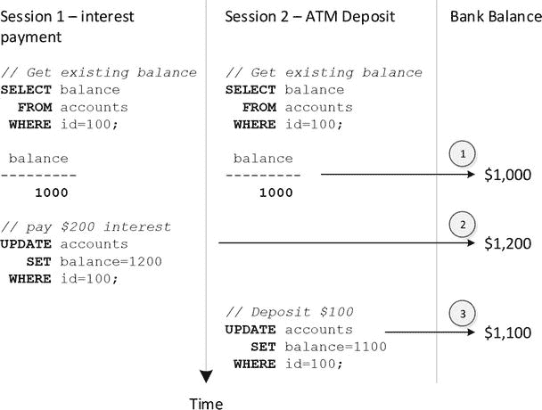

图 9-5. 丢失更新问题

当然，缺乏 ACID 事务是 Cassandra 可能不适合此类银行应用的原因之一。然而，在几乎所有应用程序中，某种形式的原子操作都是必需的，而 Cassandra 提供了轻量级事务（LWT）来支持这些需求。

Cassandra 的事务被称为“轻量级”，是因为它们仅应用于单个操作，并且只支持比较并设置（CAS）模式。CAS 操作是一种原子操作，它检查一个值，如果该值符合预期，则设置另一个值。

在 Cassandra 中，轻量级事务在 Cassandra 查询语言中使用 `IF` 子句来表达。图 9-6 说明了这将如何解决我们在图 9-5 中遇到的丢失更新场景。

与之前一样，每个会话查询当前余额 (1)。第一个会话应用利息支付，由于 `IF` 子句中指定的余额是正确的，因此操作成功 (2)。然而，尝试添加 100 美元存款的第二个事务失败了，因为余额自上次读取以来已发生变化 (3)。失败消息中返回了新余额，使会话能够成功重试该事务 (4)。

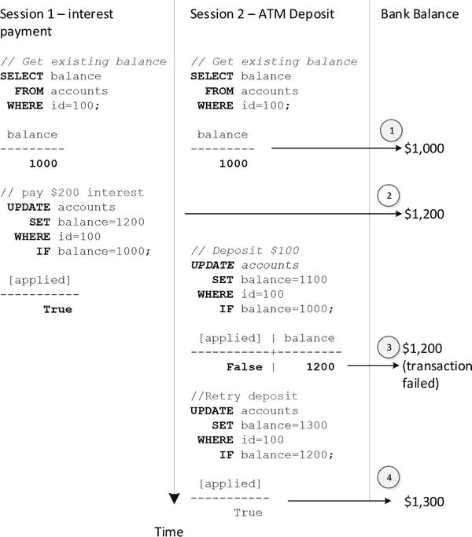

图 9-6. 使用轻量级事务解决丢失更新问题

熟悉关系数据库事务的人会认出图 9-6 中的场景是乐观锁模式。

Cassandra 的轻量级事务使用一种基于仲裁的事务协议，称为 Paxos。Paxos 协议以难以描述而闻名，实现起来也很复杂，但它类似于前面在分布式关系数据库事务上下文中讨论的两阶段提交（2PC）协议的一种形式。Paxos 的关键区别在于它使用仲裁——即多数——来确定成功或失败，而不是要求每个节点都成功应用更改。

修改后的 Cassandra Paxos 协议分四个阶段工作：


准备/承诺。任何节点都可以提议修改；该节点被称为`领导者`。`领导者`向所有副本节点发送提议。节点可以通过三种方式响应：它们可以承诺接受此提议，并且不接受任何后续提议。如果该节点已持有更早的提议，则该更早的提议将随其承诺一并包含。如果大多数节点回复了一个更早的提议，则在处理新提议之前必须先应用该更早的提议。节点也可能拒绝该提议，因为它已经承诺应用一个更新的提议。

读取当前值。将从每个节点请求数据项的当前值，以确认该值符合`UPDATE`或`INSERT`语句中的`IF`子句。

提议/接受。向所有节点提议新值，节点回复它们是否能够应用该新值。

提交/确认。如果提议/接受步骤成功，则`领导者`将指示所有节点可以完成该事务。提议的值被应用到常规的 Cassandra 存储中，并对所有人可见。

请记住，Paxos 是一个基于法定人数的协议，这意味着每一步骤的成功都需要大多数副本达成一致。无法访问或因其他原因无法参与的副本，将在稍后通过正常的反熵机制进行纠正。

Cassandra 轻量级事务的实现涉及比非事务性替代方案显著更多的往返次数——在简单情况下涉及多达四倍的往返次数，并且如果需要协调多个冲突的提议，可能会更多。

图 9-7 展示了一个成功的 Cassandra 轻量级事务的简化事件序列。在阶段 1，`领导者`提议对一个数据项进行更改，副本承诺不接受任何更早的提议。在阶段 2，`领导者`检查数据值是否符合预期，并符合 CQL `IF`子句中的规范。在阶段 3，`领导者`提议数据项的新值，副本接受该提议。在阶段 4，`领导者`提交该提议，每个副本确认提交成功。

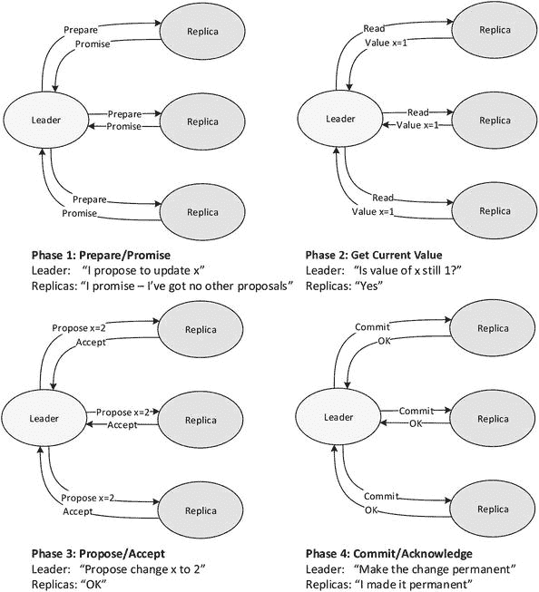

图 9-7. Cassandra 轻量级事务处理

#### 结论

许多下一代系统——通常被描述为 NewSQL——采用了传统 RDBMS 中久经考验的一致性模型，最重要的是 ACID 事务和多版本并发控制（`MVCC`）。

NoSQL 类型的下一代数据库背负着一种不应有的名声，即只提供简单的一致性控制。事实上，正如我们在本章所看到的，在满足分布式数据库的可用性和可扩展性要求的同时，维持一个可预测但又灵活的一致性模型，需要至少与我们在关系世界中已知的系统同样复杂的架构。

本章我们重点介绍了 NoSQL 领域采用的三种方法。MongoDB 采用相对传统的悲观锁模型，通过阻塞冲突操作来保持一致性。HBase 仅使用非常短暂的锁，而是依赖一种`MVCC`版本来允许高频变异发生，同时避免行级不一致。Cassandra 采用 Dynamo 的可调一致性模型，允许应用程序在一致性、可用性和性能之间进行权衡。Cassandra 还增加了一个基于 Paxos 的轻量级事务。

在下一章，我们将看到本章的一致性概念以及上一章的分布式数据库架构如何得到数据模型和存储系统的支持。

### 10. 数据模型与存储

> 模型只是对真实事物的模仿。 ——[梅·韦斯特](http://www.goodreads.com/author/show/259666.Mae_West) 在线信息的海洋都在一同流动，访问工具变得绝对关键。如果你不索引它，它就不存在。它在那里，但你找不到它，所以它也就如同不存在。 ——[芭芭拉·金特](http://www.goodreads.com/author/show/863738.Barbara_Quint)

关系数据库模型为数据的表示提供了一个强大的理论基础，消除了冗余并最大化了数据访问的灵活性。许多下一代数据库系统，尤其是 NewSQL 类型，继续拥护关系模型：它们的创新通常集中在数据的底层物理存储上。

然而，NoSQL 类型的数据库明确拒绝关系模型的固定模式。这种拒绝并非基于对关系数据建模原理的理论分歧，而是源于一种实际的愿望，即通过允许模式随应用程序演进来促进应用程序开发的敏捷性。此外，NoSQL 数据库力求避免连接等操作所产生的开销，这是关系规范化的必然结果。

在数据模型之下，所有数据库都采用了旨在优化典型访问路径的物理存储机制。在本章回顾了新的和传统的数据模型之后，我们将探讨存储如何设计来支持这些模型。

##### 数据模型

当今的数据库采用多种数据模型：

*   关系模型是传统 RDBMS（Oracle、SQL Server 等）中数据表示的灵感来源，也是 Vertica 和 VoltDB 等 NewSQL 数据库的基础。
*   键值存储在理论上对键值中的“值”部分不施加任何结构或限制。然而，在实践中，大多数键值存储为某些类型的数据结构提供额外支持，以允许索引和冲突解决。
*   基于谷歌 BigTable 数据库的数据库实现了 BigTable 规范中描述的宽列存储。然而，在 Cassandra 等数据库中已经引入了一些重要的创新。
*   文档数据库使用 JSON 或 XML 文档，通常对可以表示的数据不施加限制，但提供了一种自描述且可预测的数据表示。
*   图数据库将数据表示为节点、关系和属性。图数据库在第 5 章中有详细描述。


##### 数据关系模型回顾

在深入探讨非关系型数据模型之前，让我们快速回顾一下关系型模型。该模型主导了上一代数据库系统，并且至今仍是应用最广泛的数据模型。关系型模型不仅是传统 `RDBMS` 的基础，也是 `NewSQL` 类型数据库（例如 `Vertica` 和 `VoltDB`）的基础。我们早在第 1 章就概述过关系模型，当然，关系数据模型也有大量的文献支持。以下是一个简要总结。

关系模型将值组织成元组（行）。多个元组用于构建关系（表）。行通过键值来标识，并且——至少在第三范式中——所有值都应仅通过完整的主键来定位。外键通过引用另一个表中的主键来定义表之间的关系。

从关系模型中消除冗余的过程称为规范化。图 10-1 提供了一个非规范化和规范化数据的示例。

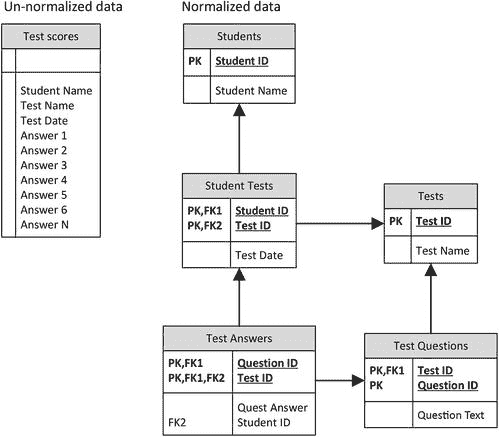
图 10-1. 规范化的关系数据模型

星型模式代表了一种在数据仓库中常见——实际上几乎总是存在——的数据建模模式。在星型模式中，一个大型的“事实”表包含详细的业务数据，并包含指向较小的、更静态的“维度”表的外键，这些维度表从业务角度对事实项进行分类，通常包括时间、产品、客户等。

图 10-2 展示了一个星型模式的示例。核心的 `SALES` 事实表包含按不同时间段、产品和客户汇总的销售总额。每项汇总的细节和解释可以通过连接维度表 `TIMES`、`PRODUCTS` 和 `CUSTOMERS` 来查找。

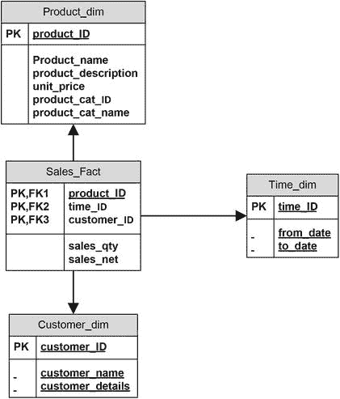
图 10-2. 星型模式

##### 键值存储

与关系模型不同，键值存储中数据如何表示没有正式的定义。通常，键值存储会接受任何在特定大小限制内的二进制值作为键，并能够存储任何二进制数据作为值。在这方面，我们或许可以说键值存储是数据类型不可知的。然而，大多数键值存储为某些类型的数据提供了额外的支持。这种支持源于提供以下特性之一的愿望：

*   二级索引。在纯粹的键值存储中，定位对象的唯一方式是通过其键。然而，大多数应用程序需要基于非键项进行查找。例如，我们可能希望定位某个地理区域内的所有用户、特定公司的所有订单等。
*   冲突解决。提供最终一致性或 `Amazon Dynamo` 风格可调一致性的键值存储，可能会实现特殊的数据类型以促进冲突解决。

基于 `Amazon` 的 `Dynamo` 规范构建的键值存储 `Riak` 就阐释了这两种模式。

除了二进制对象，`Riak` 还允许将数据定义为以下类型之一：

*   `Riak` 收敛复制数据类型 (`CRDT`)。这些数据类型将在下文详述，包括映射（maps）、集合（sets）和计数器（counters）。`Riak` 可以解决这些数据类型上的冲突操作，无需应用程序或人工干预。
*   文档类型，例如 `XML`、`JSON` 或 `Text`。
*   自定义数据类型。

`Riak` 包含 `Solr`，一个开源的文本搜索引擎。当 `Riak` 值被定义为内置数据类型之一，或被定义为提供了自定义搜索代码的自定义数据类型时，`Solr` 会对该值建立索引并提供多种查找功能，包括精确匹配、正则表达式和范围搜索。

对于 `JSON`、`XML` 和 `Riak` 映射，搜索可以限制在文档内的特定字段中。因此，例如，你可以搜索具有特定 `JSON` 属性特定值的文档。

###### 收敛复制数据类型

我们在第 9 章中简要介绍了收敛复制数据类型 (`CRDT`)。正如我们当时指出的，`Riak` 使用向量时钟来判断两次更新是否可能发生冲突。默认情况下，如果在检查两次冲突更新的向量时钟后，系统无法确定哪个更新是更正确的，那么 `Riak` 将通过创建兄弟值来保留更新的两个版本，这些冲突必须由用户或应用程序解决。

`CRDT` 允许合并两个冲突的更新，即使它们的向量时钟表明它们是并发的。`CRDT` 封装了确定性的规则，这些规则可用于合并冲突值，或确定两个冲突值中哪一个应该“胜出”并被传播。

当 `CRDT` 值在节点之间传播时，它不仅包含对象的当前值，还包含已应用于该对象的操作历史。这段历史在某种程度上类似于 `Riak` 系统中伴随每次更新的向量时钟数据，但与向量时钟不同，它包含的信息专门与特定对象的历史相关。

`CRDT` 合并最简单的例子涉及 `g-counter`（只增计数器）数据类型。这是一个单调递增的计数器，不能被递减（例如，你可以增加计数器，但不能减少其值）。

你可能会认为，只需将所有节点上发生过的所有递增操作相加，就可以合并 `g-counter` 的更新，从而确定总计数值。然而，这种方法忽略了一些递增操作可能是其他递增操作的副本的可能性。为了避免这种重复计数，每个节点都维护一个从每个节点接收到的计数值的数组。在递增时，节点递增其在数组中的元素，然后将整个数组传输给其他节点。如果检测到更新之间的冲突（通过向量时钟机制），我们取每个版本中每个节点对应元素的最大值，然后将它们相加。

最后一句话相当绕口，但它仍然比数学符号简单！希望逐步了解图 10-3 所示的例子能阐明这个过程。

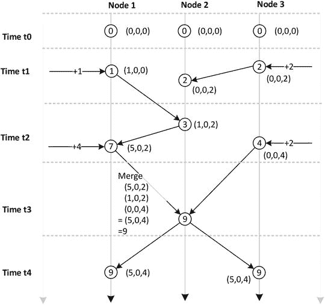
图 10-3. 收敛复制数据类型 g-counter

*   在时间 `t0`，每个节点的计数器值为 `0`，计数器数组（每个节点对应一个元素）中的每个元素也设置为 `0`。
*   大约在时间 `t1`，节点 `1` 收到计数器递增操作 `+1`，而节点 `2` 收到递增操作 `+2`。节点 `1` 和 `2` 将其计数值传输给节点 `3`。
*   大约在时间 `t2`，节点 `1` 收到递增 `+4` 和来自节点 `2` 的更新，而节点 `3` 收到递增 `+2`。此时每个节点的计数器值都不同：`7` (`5,0,2`)、`3` (`1,0,2`) 或 `4` (`0,0,4`)。
*   大约在时间 `t3`，节点 `2` 收到来自节点 `1` 和节点 `3` 的更新。这些更新可能存在冲突，因此节点 `2` 必须合并这三个计数器数组。通过取每个数组中每个节点对应元素的最大值，节点 `2` 得出计数器的正确值为 (`5,0,4`)，总和为 `9`。
*   在时间 `t4`，节点 `2` 将计数器的正确值传播给其他节点，集群现在重新同步。

学术界定义并实现了其他 `CRDT`，并在 `Riak` 或其他数据库中应用。例如：


*   `PN-counter`类型允许计数器安全地进行递增和递减操作。它由两个`g-counter`实现，一个维护增量操作，另一个维护减量操作。
*   `G-set`类型实现了一个只能添加元素、永不删除的对象集合。
*   `2P-set`提供了一个既可以插入也可以移除元素的集合。但是，一个对象只能被移除一次。
*   `LWW-set`允许多次插入和删除，对于冲突操作采用最后写入获胜的策略。

其他 CRDT 类型在支持的操作上提供了更大的灵活性，但类似于`LWW-set`类型，在冲突时会指定赢家和输家。赢家可能由时间戳决定，或通过比较元素所经历的相对操作次数决定，或由一些其他领域特定逻辑决定。

##### BigTable 与 HBase 中的数据模型

谷歌的 BigTable 论文发表于 2006 年，是 HBase、Cassandra 和其他几种数据库所使用的数据模型的基础。谷歌也在其 Google Cloud BigTable 产品中提供 BigTable 存储服务。

BigTable 表具有以下特征：

*   数据被组织成表——类似于关系型表——拥有列和行。
*   表通过单个`rowkey`进行索引和排序。
*   一个表包括一个或多个列族，这些列族在表定义中命名和指定。
*   列族由列组成。列名是动态的，可以在插入新值时动态创建新列。使用“列”这个术语有些误导：BigTable 列族更准确地被描述为排序的多维映射，其中的值由列名和时间戳标识。
*   特定列族的数据在磁盘上一起存储。
*   表是稀疏的：空列不占用空间。
*   一个单元格（行和列的交点）可能包含数据元素的多个版本，由时间戳索引。

###### 列族结构

列族可以用于方便地对相关列进行分组，通过将经常一起访问的列在磁盘上共同定位来优化磁盘 I/O，或者创建一个可用于更复杂数据的多维结构。

图 10-4 展示了一个简单的列族结构。行被分组到三个列族中，但每一行都有相同的列名。在这种配置中，该表类似于一个为了性能原因在磁盘上进行了垂直分区的`关系表`。

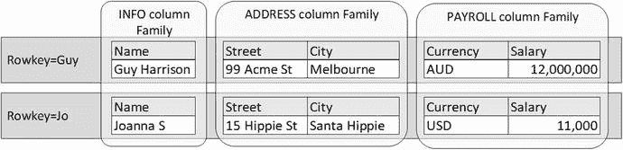

**图 10-4.**
简单的列族结构

当我们创建一个“宽”列族时，BigTable 数据模型的独特性变得更加明显。在这种情况下，列名代表`name:value`对中的名称部分。任何给定的`rowkey`可以拥有任意集合的此类列，并且不同的`rowkey`在列名方面不需要有任何共同性。

图 10-5 展示了一个这样的宽列族。在`FRIENDS`列族中，我们有可变数量的列，每列对应一个特定的朋友。列的名称对应于朋友的姓名，而列的值是朋友的电子邮件。在此示例中，Guy 和 Joanna 有一个共同的朋友 John，因此他们共享该列。但是，代表不共享的朋友的其他列仅出现在需要的行中。

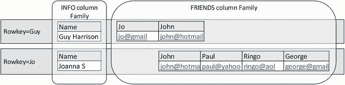

**图 10-5.**
宽列族结构

BigTable/HBase 列族被称为稀疏的，因为在给定行中不存在的列不消耗存储空间。实际上，BigTable 列族本质上是一个由任意一组排序的`name:value`对组成的“映射”。

###### 版本

BigTable 列族中的每个单元格可以存储一个值的多个版本，由时间戳索引。时间戳可以由应用程序指定或由服务器自动分配。值在单元格内按时间戳降序存储，因此默认情况下读取将检索最近的时间戳。读取操作可以指定时间戳范围或指定要返回的数据版本数。

一个列族配置设置指定了将为每个值存储的最大版本数。在 HBase 中，默认的版本数是三。还有一个最小版本数，通常与生存时间设置相结合。`TTL`设置指示服务器删除早于特定秒数的值。最小版本数覆盖了`TTL`，因此通常无论数据年龄如何，至少会保留一个或多个副本。

图 10-6 展示了带时间戳的多个值。对于所示的行，`info:loc`列只有一个值，但`readings:temp`列有五个值，可能对应于恒温器的最后五次读数。

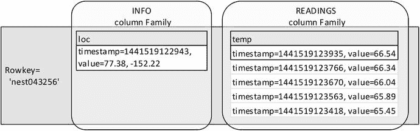

**图 10-6.**
BigTable 中单元格数据的多个版本

BigTable 数据库中的删除操作是通过创建墓碑标记来实现的，该标记表明小于给定时间戳的列或列族的所有版本都已被移除。默认情况下，删除使用当前时间戳，从而消除所有先前的行值。

删除的元素会保留在磁盘上，直到发生压缩。我们将在本章后面讨论压缩。


#### Cassandra

Cassandra 的数据模型基于 BigTable 设计，但自其初始版本以来已发生了显著演变。事实上，通过 Cassandra 查询语言（CQL）操作 Cassandra 时，有时很难辨认出 BigTable 的结构。

CQL 的`CREATE TABLE`语句允许我们定义复合主键，这看起来类似于关系型数据库中的多列键。例如，在下面展示的 CQL 中，我们创建了一个名为`FRIENDS`的表，其键是`NAME`和`FRIEND`列，分别对应用户名及其每个朋友的名字：

```sql
CREATE TABLE friends
(user text,
friend text,
email text,
PRIMARY KEY (user,friend));
```

对这个表的 CQL 查询返回的结果意味着，每个用户和朋友的组合都存在一行数据：

```
cqlsh:guy>   SELECT * FROM friends;
 user | friend | email
------+--------+------------------
   Jo | George | George@gmail.com
   Jo |    Guy |    Guy@gmail.com
   Jo |   John |   John@gmail.com
  Guy |     Jo |     Jo@gmail.com
```

但是，当我们使用（现已弃用的）thrift 客户端查看列族时，可以看到我们有两行，一行有四个列，另一行有六个列（此处的输出已为清晰起见进行了编辑）：

```
RowKey : Jo
=> ( name =George:,      value =,                 timestamp=...)
=> ( name =George:email, value =George@gmail.com, timestamp=...)
=> ( name =Guy:,         value =,                 timestamp=...)
=> ( name =Guy:email,    value =Guy@gmail.com,    timestamp=...)
=> ( name =John:,        value =,                 timestamp=...)
=> ( name =John:email,   value =John@gmail.com,   timestamp=...)
-------------------
RowKey : Guy
=> ( name =Jo:,          value =,                 timestamp=...)
=> ( name =Jo:email,     value =Jo@gmail.com,     timestamp=...)
=> ( name =John:,        value =,                 timestamp=...)
=> ( name =John:email,   value =John@gmail.com,   timestamp=...)
2 Rows Returned.
```

CQL 主键的第一部分（在我们的例子中是`USER`）用于指定表的`rowkey`，并被称为**分区键**。主键的第二部分（在我们的例子中是`FRIEND`）是**聚簇键**，用于创建一个宽列结构，其中 CQL 键列的每个不同值都用作 BigTable 风格列名的一部分。因此，例如，列`Guy:email`是由 CQL 列`“Friend”`中的值`“Guy”`与 CQL 列`“email”`的名称组合构建而成的。

这相当令人困惑！难怪 Cassandra 倾向于通过更熟悉的关系型风格 SQL 类符号来隐藏这种复杂性。图 10-7 比较了数据的 Cassandra CQL 表示与底层的 BigTable 结构：CQL 中显示的五个明显的行在底层存储中实际实现为两个 BigTable 风格的行。

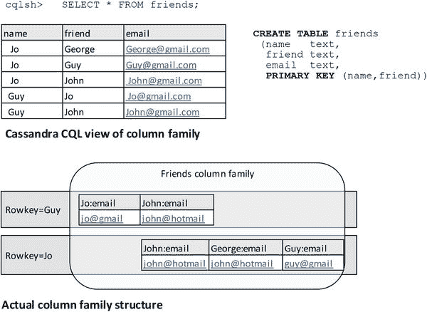

**图 10-7.**
Cassandra CQL 将宽列结构表示为窄表

> **注意**
> Cassandra 对术语“列族”的使用与 HBase 和 BigTable 不同。Cassandra 的列族等同于 HBase 中的表。为了保持一致性，我们可能会用 Cassandra“表”来指代，而纯粹主义者可能会说“列族”。

Cassandra 表的底层物理实现解释了 Cassandra 查询语言中的某些特定行为。例如，CQL 要求`ORDER BY`子句只能引用复合键列。CQL 中的`WHERE`子句也有看似奇怪和武断的限制，除非你理解底层的存储模型。分区键只接受等式子句（`IN`和`=`），这在你记得`rowkey`是跨集群进行哈希分区时是有意义的，正如我们在第 8 章中讨论的那样。聚簇键列确实支持范围运算符，如`>`和`<`，这再次说明，当你记得在 BigTable 模型中列族实际上是排序的哈希映射时，这是有意义的。

###### Cassandra 集合

Cassandra 的分区键和聚簇键实现了一种高度可扩展且高效的存储模型。然而，Cassandra 还支持集合数据类型，允许将重复组存储在列值内。

例如，我们可能使用`MAP`数据类型实现了`FRIENDS`表，这将允许我们在单个 Cassandra 列中存储一个朋友和电子邮件的哈希映射：

```sql
CREATE TABLE friends2
(person text,
  friends map<text,text>,
  PRIMARY KEY (person ));

INSERT into friends2(person,friends)
VALUES('Guy',
         {'Jo':'jo@gmail.com',
          'john':'john@gmail.com',
          'Chris':'chris@gmail.com'});
```

Cassandra 还支持`SET`和`LIST`类型，以及上面显示的`MAP`类型。

##### JSON 数据模型

JavaScript 对象表示法（JSON）是文档数据库事实上的标准数据模型。我们在第 4 章专门讨论了文档数据库；在这里，我们将正式地看一下 JSON 的一些元素。

JSON 文档由一小套非常简单的结构构建而成：值、对象和数组。

*   数组由方括号（`[` 和 `]`）包围并由逗号（`,`）分隔的值列表组成。
*   对象由一个或多个`“name”:”value”`格式的名称值对组成，由花括号（`{` 和 `}`）包围并由逗号（`,`）分隔。
*   值可以是 Unicode 字符串、标准格式的数字（可能包括科学记数法）、布尔值、数组或对象。

定义中的最后几个字非常重要：因为值可能包含本身包含值的对象或数组，所以 JSON 结构可以表示任意复杂和嵌套的信息集。特别是，数组可以用来表示文档的重复组，这在关系型数据库中需要一个单独的表。

诸如 CouchBase 和 MongoDB 之类的文档数据库将文档组织到存储桶或集合中，通常期望其中包含类似类型的文档。图 10-8 展示了 JSON 的一些基本元素。

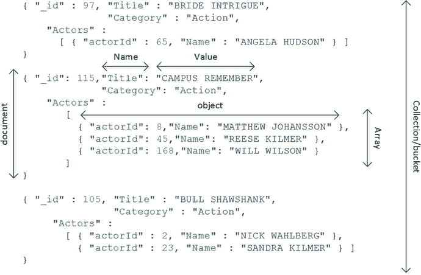

**图 10-8.**
JSON 文档

###### 二进制 JSON

MongoDB 在内部以 BSON 格式存储 JSON 文档。BSON 旨在成为 JSON 数据的更紧凑、更高效的表示形式，它对数字和其他数据类型使用更高效的编码。此外，BSON 包含字段长度前缀，允许扫描操作“跳过”元素，从而提高效率。


##### 存储

关系数据库模型的一个根本性创新在于逻辑数据表示与物理存储模型的分离。在关系模型出现之前，为了操作数据库，必须理解数据的物理存储方式。这种严格的分离使得数据的关系表示在一代计算机科学家中保持相对稳定，而底层的存储机制（如索引）已经历了重大创新。这种解耦最极端的例子可以在列式数据库领域看到。像 Vertica 和 Sybase IQ 这样的列式数据库继续支持面向行的关系数据库模型，即使它们通过以列式格式存储数据而将数据“侧翻”过来。

我们已经在第 6 章中探讨了列式系统的底层物理存储，因此这里不需要再研究那项特定的创新。然而，像 HBase 和 Cassandra 这样的现代非关系型数据库，其物理布局发生了根本性的转变。这就是从为随机访问优化的 B 树存储结构，转向为顺序写入性能优化的**日志结构合并树**模式。

##### 典型的关系型存储模型

大多数关系型数据库都有类似的高级存储架构。

图 10-9 展示了一个简化的关系数据库架构。数据库客户端通过向数据库进程发送 SQL 来与其交互 (1)。数据库进程最初从磁盘上的数据库文件中检索数据 (2)，并将数据存储在内存缓冲区中以优化后续访问 (3)。如果数据被修改，则会在内存副本中进行更改 (4)。在事务提交时，数据库进程会写入事务日志 (5)，这确保了在系统故障的情况下事务不会丢失。内存中被修改的数据由一个“惰性”数据库写入进程异步写回到数据库文件。

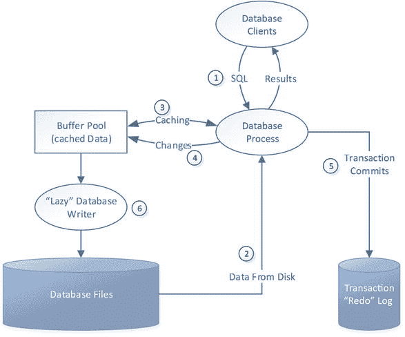

图 10-9.
关系数据库存储架构

图 10-9 所示的大部分架构也可以在非关系系统中找到。特别是，事务日志的等效组件几乎存在于任何事务型数据库系统中。

另一种无处不在的 RDBMS 架构模式——至少在操作型数据库领域——是 B 树索引。B 树索引是一种允许对数据库系统中的元素进行随机访问的结构。

图 10-10 展示了一个 B 树索引结构。B 树索引具有层次化的树状结构。树的顶部是头部块。此块包含指向任何给定键值范围对应的适当分支块的指针。分支块通常会指向更具体范围的适当叶块，或者对于较大的索引，指向另一个分支块。叶块包含键值列表以及匹配表数据的物理地址。

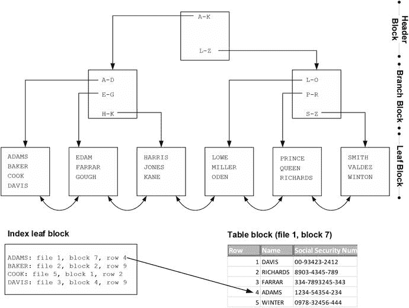

图 10-10.
B 树索引结构

叶块包含指向前一个和后一个叶块的链接。这允许我们按升序或降序扫描索引，并使得可以使用索引来满足使用 `">"`、`"<"` 或 `"BETWEEN"` 运算符的范围查询。

B 树索引提供可预测的性能，因为每个叶节点都处于相同的深度。索引中每增加一层，所能支持的键数量呈指数级增长，对于几乎所有的表，三次或四次 IO 就足以定位到任何行。

然而，在更改数据时维护 B 树可能代价高昂。例如，考虑将键值为 `"NIVEN"` 的行插入到图 10-10 所示的表索引中。要插入该行，我们必须在 `L-O` 块中添加一个新条目。如果叶块中没有空闲空间容纳新条目，则需要进行索引拆分。必须分配一个新块，并将现有块中的一半条目移动到新块中。此外，还需要在分支块中添加一个新条目（以指向新创建的叶块）。如果分支块中没有空闲空间，则分支块也必须进行拆分。

这些索引拆分是昂贵的操作：必须分配新块，并将索引条目从一个块移动到另一个块，在拆分期间访问时间会受到影响。因此，尽管 B 树索引是一种高效的随机读取机制，但它对于写入密集型工作负载来说就不那么出色了。

B 树结构固有的局限性，通过能够将磁盘写入主数据库文件的操作延迟这一点得到了一定程度的缓解：只要在提交时写入了事务日志条目，数据文件的修改（包括索引块）就可以在内存中执行并稍后写入磁盘。然而，在大量、密集的写入活动期间，空闲内存将被耗尽，吞吐量将受到数据库块磁盘 IO 的限制。

为了提供更好的写入密集型工作负载吞吐量，已经出现了一些对 B 树模式的重大改进：Couchbase 的 `HB+-Trie` 和 Tokutek 的 `fractal tree index` 都声称提供了更好的写入优化。

然而，越来越多的数据库实现了一种从底层开始就为支持写入密集型工作负载而优化的存储架构：**日志结构合并树**。


##### 日志结构合并树

日志结构合并（LSM）树是一种旨在优化存储并支持极高插入速率，同时仍能支持高效随机读取访问的结构。

一个最简单的 LSM 树由两个带索引的“树”组成：

*   一个**内存中的树**，它是所有新记录插入的接收者。在 Cassandra 中，这个内存中的树被称为`MemTable`，在 HBase 中则被称为`MemStore`。
*   多个**磁盘上的树**，它们代表已刷新到磁盘的内存中树的副本。在 Cassandra 中，这个磁盘结构被称为`SSTable`，在 HBase 中则被称为`StoreTable`。

磁盘上的树文件最初是内存中树的实时点副本，但会定期合并以创建更大的合并存储。这个合并过程被称为合并。

**注意**

日志结构合并树是一种被广泛采用的架构，是 BigTable、HBase、Cassandra 和其他数据库的基础。然而，不同实现中的命名约定有所不同。为方便起见，我们默认使用 Cassandra 的术语，其中内存中的树称为`MemTable`，磁盘上的树称为`SSTables`。

LSM 架构确保写入始终快速，因为它们以内存速度运行。向磁盘的传输也很快，因为它以仅追加的批处理方式进行，从而实现快速的顺序写入。读取要么来自内存中的树，要么来自磁盘上的树；无论哪种情况，读取都通过索引进行辅助，并且相对迅速。

当然，如果数据在内存存储中时服务器发生故障，那么数据可能会丢失。因此，实现 LSM 模式的数据库都包含某种形式的事务日志，以便在发生故障时可以恢复更改。此日志文件大致相当于关系数据库的事务（重做）日志。在 Cassandra 中，它被称为`CommitLog`，在 HBase 中，则称为预写日志（`WAL`）。一旦内存中的树刷新到磁盘，这些日志条目就可以被丢弃。

图 10-11 使用 Cassandra 术语说明了日志结构合并树架构。来自数据库客户端的写入首先应用于`CommitLog`（1），然后应用于`MemTable`（2）。一旦`MemTable`达到特定大小，它将被刷新到磁盘以创建新的`SSTable`（3）。刷新完成后，`CommitLog`记录可以被清除（4）。定期地，多个`SSTables`被合并（压缩）成更大的`SSTables`（5）。

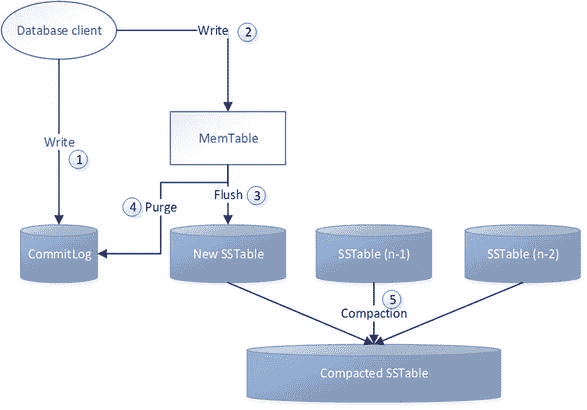

图 10-11.

LSM 架构（Cassandra 术语）

###### SSTable 与布隆过滤器

LSM 树的磁盘部分是一个带索引的结构。例如，在 Cassandra 中，每个`SSTable`都与一个索引相关联，该索引包含`SSTable`中存在的所有行键以及文件中相关值位置的偏移量。然而，磁盘上可能有很多`SSTables`，这会对索引查找产生倍增效应，因为理论上我们必须检查每个`SSTable`的每个索引才能找到所需的行。

为避免这些多次索引查找，使用了布隆过滤器来减少必须执行的查找次数。

布隆过滤器通过对键值应用多个哈希函数来创建。哈希函数的输出用于设置布隆过滤器结构中的位。在布隆过滤器中查找键值时，我们执行相同的哈希函数并查看位是否被设置。如果位未设置，则搜索值一定不包含在表中。但是，如果位被设置，可能是因为某个值恰好哈希到相同的值。最终结果是一个通常将大小减少 85%，但仅产生 15%误报率的索引。

布隆过滤器足够紧凑以适应内存，并且导航速度非常快。然而，为了实现这种压缩，布隆过滤器在某种意义上是“模糊”的，因为它们可能返回假阳性。如果从布隆过滤器得到阳性结果，仅意味着该文件可能包含该值。但是，布隆过滤器永远不会错误地告知您某个值不存在。因此，如果布隆过滤器告诉我们某个键未包含在特定的`SSTable`中，那么我们可以安全地从查找中省略该`SSTable`。

图 10-12 显示了使用 Cassandra 术语的日志结构合并树的读取模式。数据库请求首先从`MemTable`读取（1）。如果未找到所需值，它将查询最新`SSTable`的布隆过滤器（2）。如果布隆过滤器表明不存在匹配的值，它将检查下一个`SSTable`（3）。如果布隆过滤器表明`SSTable`中可能存在匹配的键值，则该过程将使用`SSTable`索引（4）在`SSTable`内搜索该值（5）。一旦找到匹配的值，就不需要检查更旧的`SSTables`。

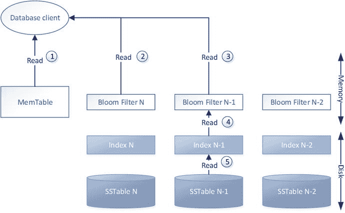

图 10-12.

日志结构合并树读取（Cassandra 术语）

###### 更新与墓碑标记

`SSTables`是不可变的——也就是说，一旦`MemTable`被刷新到磁盘并成为`SSTable`，就不能再对`SSTable`进行进一步的修改。如果一个值在一段时间内被反复修改，这些修改将累积在多个`SSTables`中。检索值时，系统将从最新到最旧的`SSTables`读取，以找到列的最新值，或构建完整的行。因此，要更新一个值，我们只需要插入新值，因为当存在较新版本时，不会检查较旧的值。

删除操作通过将墓碑标记写入`MemTable`来实现，该标记最终会传播到`SSTables`。一旦遇到某行的墓碑标记，系统将停止检查更旧的条目，并向应用程序报告“未找到行”。

###### 合并

随着`SSTables`数量的增加，由于布隆过滤器、索引和过时值的数量增多，读取性能和存储会下降。因此，系统会定期将多个`SSTables`合并成一个文件。在合并过程中，分散在多个`SSTables`中的行会被合并，已删除的行会被移除。

但是，墓碑标记会在系统中保留一段时间，以确保对行的延迟更新不会使本应保持删除状态的行复活。如果在较旧的对该行的更新仍在系统中传播时移除了墓碑标记，就可能发生这种情况。为避免这种可能性，默认设置防止墓碑标记被删除超过一周，而暗示性传递（参见第 8 章）通常仅在三小时后过期。但是，如果这些默认设置被调整，或者发生异常长的网络分区，可以想象被删除的行将会复活。


##### 二级索引

二级索引使我们能够快速找到除主键或 `rowkey` 值之外、符合其他某些条件的行。

二级索引在关系型系统中无处不在：能够遍历主键和外键关系是关系型系统的一个基本特性，如果只存在主键索引，这将是不切实际的。在关系型系统中，主键索引和二级索引通常以相同方式实现：最常见的是使用 `B-tree` 索引，有时也使用 `位图` 索引。

我们在第 6 章中讨论了列式数据库如何经常使用投影作为索引的替代方案：这种方法在列式系统中有效，因为查询通常跨大量行聚合数据，而不是查找符合特定条件的少量行。我们还在第 5 章中讨论了图数据库如何使用无索引邻接性来执行高效的图遍历，而无需单独的索引结构。

这两种解决方案都不适合非关系型操作型数据库系统。键值存储、BigTable 系统和文档数据库的底层设计假设数据通过特定的键值来检索，并且在许多情况下——尤其是在早期的键值系统中——按 `rowkey` 值查找是查找行的唯一方式。

然而，对于大多数应用来说，仅通过主键快速访问数据是不够的。因此，大多数非关系型数据库都提供某种形式的二级索引支持，或者至少提供“自建”二级索引的模式。

###### 自建二级索引

为键值存储创建二级索引在概念上相当简单。你创建一个表，其中键值是要索引的列或属性，该表包含主表的 `rowkey`。

图 10-13 说明了该技术。`USERS` 表包含每个用户的唯一标识符（`rowkey`），但我们经常需要通过电子邮件地址检索用户。因此，我们创建一个单独的表，其中主键是用户的电子邮件地址，并包含源表的 `rowkey`。

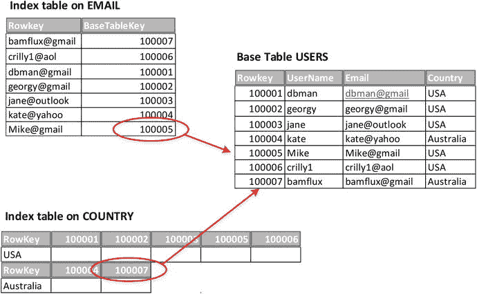

图 10-13. 自建二级索引

该主题的变体允许对非唯一值进行索引。例如，在像 `HBase` 这样的宽列存储中，一个索引条目可能由多个列组成，这些列指向具有共同值的行，如图 10-13 中的“`COUNTRY`”索引所示。

然而，上述自建方法存在一些显著问题：

*   需要由应用代码来一致地维护基础表中的数据及其所有索引。应用代码中的错误或使用替代客户端对数据进行临时操作可能导致索引中数据缺失或不正确。
*   理想情况下，修改基础表的操作和修改索引的操作应该是原子的：要么两者都成功，要么都不成功。然而，在非关系型数据库中，很少提供多对象事务。如果索引操作成功但基础表修改失败（或反之），则索引将不正确。
*   最终一致性会引发类似问题：应用可能从索引中读取到尚未传播到基础表每个副本的条目（或反之）。
*   索引表支持等值查找，但通常不支持范围操作，因为与 `B-tree` 结构不同，索引条目之间没有指向下一个逻辑条目的指针。

自建索引并非完全不可行，但它给应用带来了沉重负担，实践中会导致不可靠和脆弱的实现。当数据库实现原生的二级索引方案时，这些问题大多可以得到缓解。二级索引的实现可以独立于应用代码，并且数据库引擎可以确保索引条目和基础表条目被一致地维护。

###### 全局索引与本地索引

分布式数据库给索引方案带来了额外的问题。如果索引条目使用常规机制进行分区——无论是通过对键值进行一致性哈希，还是使用键值作为分片键——那么基础表行的索引条目通常位于不同的节点上。因此，大多数查找通常会跨越两个节点，因此需要两次 `IO` 操作。

如果索引值是唯一的，那么常规的分片或哈希机制会将数据均匀分布在集群中。然而，如果键值是非唯一的，特别是如果值的分布存在显著倾斜，那么索引条目以及索引负载可能分布不均。例如，图 10-13 中 `COUNTRY` 上的索引将导致最大国家（在我们的例子中是 `USA`）的索引条目集中在单个节点上。

为避免这些问题，非关系型数据库中的二级索引通常实现为本地索引。每个节点维护自己的索引，该索引仅引用本地节点上保存的数据。依赖于索引的查询被发送到每个节点，节点通过其本地索引将任何匹配的数据返回给查询协调器，由协调器合并结果。

图 10-14 说明了本地二级索引方法。数据库客户端请求特定非键值的数据（1）。查询协调器将这些请求发送到集群中的每个节点（2）。每个节点检查其本地索引以确定是否存在匹配值（3）。如果在索引中找到匹配值，则从中检索 `rowkey`，并用于从基础表中检索数据（4）。每个节点将数据返回给查询协调器（5），协调器整合结果并将其返回给数据库客户端（6）。

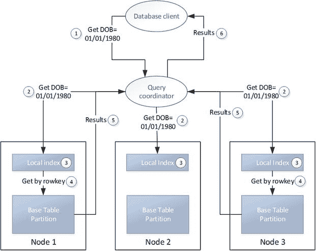

图 10-14. 本地二级索引


#### NoSQL 数据库中的二级索引实现

尽管大多数非关系型数据库实现了本地二级索引，但具体实现方式差异显著。

-   `Cassandra` 提供了本地二级索引。其在 `Cassandra 查询语言（CQL）` 中的实现使用了关系型数据库用户熟悉的语法。然而，在内部，其实现涉及每个节点上的列族，这些列族将索引值与基础列族中的行键关联起来。每个索引行以索引值为键，索引行中的宽列结构包含匹配的基础列族行的行键。其架构类似于图 10-13 所示的 `COUNTRY` 索引示例。
-   `MongoDB` 允许在集合内文档的指定元素上创建索引。`MongoDB` 索引是传统的 `B 树` 索引，类似于关系型系统中的索引，如图 10-10 所示。
-   `Riak` 是一个纯粹的键值存储。由于在 `Riak` 中与键关联的值对于数据库服务器是不透明的，`Riak` 没有可用于索引的纲要元素。然而，`Riak` 允许为特定对象关联标签，并且每个节点上的本地索引允许快速检索匹配的标签。`Riak` 架构师现在建议使用本章前面讨论的内置 `Solr` 集成功能，而不是这种二级索引机制。
-   `HBase` 不提供原生的二级索引能力。如果你的 `HBase` 实施需要二级索引，你必须实现某种形式的 DIY 二级索引。不过，`HBase` 有一个协处理器特性，可以显著提高 DIY 索引的健壮性并降低程序员的开销。`HBase` 观察者协处理器的作用类似于 `RDBMS` 中的数据库触发器——它允许程序员指定当数据库中发生某些事件时运行的代码。程序员可以使用观察者协处理器来维护二级索引，从而确保索引能够自动且无误地维护。一些第三方提供了库来进一步协助需要在 `HBase` 中实现二级索引的程序员。

#### 结论

在本章中，我们回顾了非关系型新一代数据库实现的一些数据模型模式。`NoSQL` 数据库常被称为无模式，但实际上，模式更常见的是灵活多变而非完全不存在。

`HBase` 和 `Cassandra` 的数据模型基于谷歌的 `BigTable` 设计，该设计实现了一个稀疏的分布式多维映射结构。在面向 `BigTable` 的表中，列名实际上更接近 `Java` 或 `.NET` 映射结构中的键，而非关系系统中的列。尽管 `Cassandra` 内部使用了面向 `BigTable` 的数据结构，但 `Cassandra` 工程师在 `BigTable` 结构之上实现了一个更具关系风格的接口：`Cassandra 查询语言`。

许多非关系型系统使用日志结构合并树架构，这种架构可以比传统的基于关系型 `B 树` 的结构承载更高的写入吞吐量。

许多非关系型系统的初始实现——特别是那些基于 `BigTable` 或 `Dynamo` 的——仅支持主键访问。然而，基于其他键检索数据的能力几乎是一个普遍需求，因此大多数非关系型系统都实现了某种形式的二级索引。

### 11. 语言与编程接口

> 任何傻瓜都能写出计算机能理解的代码。优秀的程序员写出人类能理解的代码。 ——马丁·福勒
> 对顾客而言，接口就是产品。 ——杰夫·拉斯金

关系型数据库之所以能占据主导地位，一个关键因素是 `SQL` 语言作为查询和修改数据的机制得到了几乎普遍的采用。`SQL` 并非完美无缺，但它展现出了足够的灵活性，既能满足非程序员数据库用户的需求，也能满足专业数据库程序员的需求。程序员将 `SQL` 嵌入到编程语言中，而非程序员则要么在查询工具中显式使用 `SQL`，要么在 `BI` 工具隐式使用 `SQL` 与数据库交互时（由后台自动处理）使用它。在 `SQL` 出现之前，大多数 `IT` 部门都积压了大量的报告请求；`SQL` 使得业务用户可以“自助”满足这些请求。

`SQL` 仍然是最重要的数据库语言。它不仅是 `RDBMS` 的通用语言，而且在 `NewSQL` 类型的新一代数据库系统中也被广泛采用。

然而，尽管 `NoSQL` 的含义已被追溯修正为“不仅仅是 SQL”而非“绝对不要 SQL！”，但对于 `NoSQL` 类型的新一代数据库，通常并不提供 `SQL` 支持。在本章中，我们将探讨在缺乏 `SQL` 的情况下如何与这些数据库交互，并观察 `SQL` 正如何日益回归到非关系型数据库的世界中。

**注意**

本章中的代码示例仅为提供数据库编程语言的概览¹——本章无意作为任何相关语言的教程或参考手册。

#### SQL

即使在下一代数据库系统的范围内，SQL 仍然是最重要的数据库编程语言。关于 SQL 主题的书籍已有数百本（实际上，我本人也写过几本），因此在这里对该语言进行全面回顾实属多余。不过，或许值得概述一下当今 SQL 实现中存在的各种变体，以及该语言的关键要素。

SQL 语言主要包含以下几类语句：

*   **数据查询语言（DQL）**，以无处不在的 `SELECT` 语句为代表。
*   **数据操作语言（DML）**，包括修改数据库中数据的语句，例如 `UPDATE`、`DELETE`、`INSERT` 和 `MERGE`，以及事务控制语句（`COMMIT`、`ROLLBACK`、`BEGIN TRANSACTION`），并且——为了本次讨论的目的——还包括数据控制语言（DCL）语句，如 `GRANT`。
*   **数据定义语言（DDL）**，包括创建或修改表及其他结构（索引、物化视图等）的语句。DML 还允许指定存储过程和触发器。这些语句通常具有高度的供应商特定性，因为它们整合了对专有编程语言（例如 Oracle PL/SQL）或对特定数据库独有的存储子句的支持。

SQL 语言是多个 ANSI 和 ISO 标准规范的主题。其中一些标准包括：

*   SQL-89：首个被广泛采用的主要标准。该标准描述了我们今天所知 SQL 语言的核心元素。
*   SQL-92（SQL2）：增加了现代连接语法（连接条件在 `FROM` 子句中完整限定），并添加了标准元数据接口，用于提供数据库中对象的描述，该接口至少被部分供应商实现。SQL-92 引入了规范的“入门级”子集概念（该子集与 SQL-89 非常相似）。
*   SQL:1999（SQL3）：一次月球爆炸将月球推入星际空间。哎呀，抱歉，那是《太空：1999》。SQL:1999 则没那么有趣，它引入了几乎无人使用的面向对象关系数据库特性以及一些较小的语言变更。
*   SQL:2003：引入了分析性“窗口”函数（对分析而言是一项重要创新）以及 SQL/XML。它还最终确定了存储过程的规范。
*   SQL:2006、SQL:2008、SQL:2011：各种杂项改进，例如 `INSTEAD OF` 触发器、`MERGE` 语句以及时态查询。

在我看来，各种 SQL 标准与现实世界中的 SQL 语言实现已日益脱节。常听到供应商将其 SQL 支持描述为“符合入门级 SQL-92”，这实际上是声称自己遵循了一个 14 年前规范的最低要求。

实际上，你可以预期一个 RDBMS 至少会实现 SQL-92 中关于 `SELECT` 语句和 DML 的所有内容。SQL:2003 的窗口函数（允许一行内的计算能“看到”相邻行的一个“窗口”）已被广泛实现，这可能是过去 15 年 SQL 语言标准中最重大的单一创新。

DDL 语句和存储过程代码通常在不同数据库之间不兼容。像 `CREATE TABLE` 这样的 DDL 语句共享通用语法，但通常包含供应商特定的构造，例如自定义数据类型或专有存储子句。虽然 ANSI 存储过程语法被 DB2 和 MySQL 实现，但 Oracle 和 Microsoft SQL Server 实现的是完全不兼容的存储程序语言。

#### NoSQL API

被描述为 NoSQL 的数据库显然必须提供一种插入、修改和检索数据的机制。由于这些数据库大多是由程序员为程序员开发的，它们通常主要提供 Java 等语言支持的低级 API。

#### Riak

Riak 是 Amazon Dynamo 模型的开源实现。它实现了一个纯粹的键值系统：Riak 中的对象通过其键来定位，通过键检索到的对象是一个二进制对象，其内容对数据库引擎是不透明的。

考虑到上述相对简单的交互方式，我们期望有一个相当直接的 API，而这正是我们得到的。让我们看一段向 Riak 桶中插入值的 Java 代码：

```java
1. RiakClient myClient = RiakClient.newClient(myServer);
2. // 创建键、值并设置桶
3. String myKey = Long.toString(System.currentTimeMillis());
4. String myValue = myKey + ":" + Thread.getAllStackTraces().toString();
5. Location myLocation = new Location(new Namespace("MyBucket"), myKey);
6. StoreValue sv = new StoreValue.Builder(myValue).withLocation(myLocation)
   .build();
7. StoreValue.Response svResponse = myClient.execute(sv);
8. System.out.println("response="+svResponse);
```

在第 3 到 5 行，我们定义了一个键（设置为当前时间的毫秒数）、一个值（当前线程栈跟踪的字符串表示）以及将接收该值的桶（`"MyBucket"`）。第 6 行准备了一个 `StoreValue` 对象——该对象包含键值对及其将关联的桶名。我们在第 7 行执行 `StoreValue`，有效地将数据添加到数据库中。

`StoreValue` 对象接受可控制可选行为的选项，例如仲裁。在下面的例子中，我们指定只要至少有一个节点完成写入 IO，写入即可完成（关于仲裁的讨论见第 9 章）：

```java
sv = new StoreValue.Builder(Thread.getAllStackTraces()).
   withLocation(myLocation).
   withOption(StoreValue.Option.W,Quorum.oneQuorum()).build();
```

此示例还利用了 Riak API 的一个很酷的特性：如果我们传递一个 Java 对象作为值，Riak 会自动将其转换为 JSON 文档。

这里，我们检索刚刚插入的数据。请注意，我们使用了与插入时相同的 `Location` 对象（`MyLocation`）：

```java
FetchValue fv = new FetchValue.Builder(myLocation).build();
FetchValue.Response fvResp = myClient.execute(fv);
String myFetchedData = fvResp.getValue(String.class);
System.out.println("value=" + myFetchedData);
```

返回的值是一个字符串，包含我们之前插入的栈跟踪对象的 JSON 表示：

```json
value=
{"Thread[nioEventLoopGroup-2-8,10,main]":
[{"methodName":"poll0","fileName":null,
"lineNumber":-2,
"className":"sun.nio.ch.WindowsSelectorImpl$SubSelector" ...
```

对于某些应用程序，这种 put/get 编程模型可能足够了。然而，Riak 编程存在一些重要的细微差别，这些差别源于 Dynamo 一致性模型。你可能还记得第 8 章和第 9 章，冲突的更新可能会产生需要应用程序解决的兄弟版本。Riak 提供了你可以实现的接口来自动化解决此类冲突。

接下来是一个简化的冲突解决器类。当检测到类型为 `String` 的兄弟版本时，将调用此解决器。该类接收一个字符串列表并返回“已解决”的结果。此处可以实现任何应用程序代码，但在我的示例中，我只是返回了列表中的第一个字符串。

```java
public class MyResolver implements ConflictResolver<String> {
    public String resolve(List<String> siblings) {
        return (siblings.get(0) );
    }
}
```

冲突解决器需要注册才能生效：

```java
ConflictResolverFactory factory = ConflictResolverFactory.getInstance();
factory.registerConflictResolver(String.class, new MyResolver());
```


#### Riak

现在，如果我们获取一个包含同源数据的字符串值，冲突解决器将被调用并解决这些冲突。在我们的例子中，我们使用了几乎最简单的对象类型——字符串，并采用了简单的解决逻辑：在生产应用中，对象类型很可能是应用自定义的复杂类，解决逻辑可能涉及非常复杂的逻辑来合并两个对象。

除了同源数据解决，Riak API 还允许处理对复杂数据类型的修改。应用代码无需提供要插入的新对象的完整副本，而只需指定一个要应用于现有对象的变更向量。例如，如果一个对象是好友列表，我们可以通过仅指定新好友的名称来添加新好友，而无需检索并重新插入所有现有好友。

###### 定义更新值

通过扩展 `UpdateValue` 超类，我们可以定义如何将更新值应用于 Riak 对象。在下面的示例中，`apply` 方法定义了更新将（在“\n”回车符之后）简单地追加到 Riak 对象。

```java
public class MyRiakUpdater extends UpdateValue.Update<String> {

    private final String updatedString;

    public MyRiakUpdater(String updatedString) {
        this.updatedString = updatedString;
    }

    public String apply(String original) {
        return original + "\n" + updatedString;
    }
}
```

###### 调用更新器

要调用更新器，我们从之前创建的更新器类创建一个新的对象实例，并使用 `withUpdate` 方法将其应用于原始版本。

```java
MyRiakUpdater myUpdatedData = new MyRiakUpdater(newData);

UpdateValue myUpdate = new UpdateValue.Builder(myLocation)
    .withUpdate(myUpdatedData).build();

UpdateValue.Response updateResponse = myClient.execute(myUpdate);
```

这段代码将在首先解决同源数据（前提是我们已经注册了合适的冲突解决器）之后，将更新应用于 Riak 对象。

#### HBase

HBase API 与我们在 Riak API 中看到的 put/get 模式有一些相似之处。然而，由于 HBase 表具有宽列结构，因此引入了一些额外的复杂性。

##### 使用 Shell 命令

HBase 支持一个简单的 shell，允许访问基本的数据定义和操作命令。在这里，我们启动 HBase shell 并发出命令来创建一个名为 `ourfriends` 的表，该表有两个列族：`info` 和 `friends`：

```shell
$ hbase shell
hbase(main):003:0> create 'ourfriends', {NAME => 'info'}, {NAME => 'friends'}
0 row(s) in 1.3400 seconds
```

每个 put 命令填充行中的一个单元格，因此这四个命令填充了由行键‘guy’标识的行中的列：

```shell
hbase(main):005:0> put 'ourfriends', 'guy','info:email','guy@gmail.com'
0 row(s) in 0.0900 seconds

hbase(main):006:0> put 'ourfriends', 'guy','info:userid','9990'
0 row(s) in 0.0070 seconds

hbase(main):007:0> put 'ourfriends', 'guy','friends:Jo','jo@gmail.com'
0 row(s) in 0.0050 seconds

hbase(main):008:0> put 'ourfriends', 'guy','friends:John','john@gmail.com'
0 row(s) in 0.0040 seconds
```

`get` 命令获取特定行键的值，使我们能够看到刚刚输入的单元格值：

```shell
hbase(main):018:0> get 'ourfriends','guy'
COLUMN                      CELL
 friends:Jo                 timestamp=1444123707299, value=jo@gmail.com
 friends:John               timestamp=1444123707324, value=john@gmail.com
 info:email                 timestamp=1444123707214, value=guy@gmail.com
 info:userid                timestamp=1444123707274, value=9990
4 row(s) in 0.0390 seconds
```

请注意，这是一个宽列结构，其中列族 `friends` 中的列名代表好友的姓名。这就是第 10 章图 10-5 所示的数据结构。

##### 连接 HBase 服务器

Shell 适用于简单的实验和数据验证，但 HBase 中的大部分实际工作都是在 Java 程序中完成的。在这里，我们看到了从 Java 程序连接到 HBase 服务器的简单代码：

```java
Configuration config = HBaseConfiguration.create();
config.set("hbase.zookeeper.quorum", myServer);
config.set("hbase.zookeeper.property.clientport", "2181");
HBaseAdmin.checkHBaseAvailable(config);
Connection connection = ConnectionFactory.createConnection(config);
```

##### 获取数据

对于具有固定列结构的列族，例如我们示例中的 `info`，我们可以相当简单地检索数据：

```java
1. Table myTable = connection.getTable(TableName.valueOf("ourfriends"));
2. byte[] myRowKey = Bytes.toBytes("guy");
3. byte[] myColFamily = Bytes.toBytes("info");
4. byte[] myColName = Bytes.toBytes("email");
5. Get myGet = new Get(myRowKey);
6. Result myResult = myTable.get(myGet);
7. byte[] myBytes = myResult.getValue(myColFamily, myColName);
8. String email = Bytes.toString(myBytes);
9. System.out.println("Email address=" + email);
```

第 1 至 4 行指定了要检索的表、行键、列族和列名。第 5 和第 6 行检索指定行键的行，第 7 行为指定的列族和列名提取一个单元格值。第 8 行将值从字节数组转换为字符串。这是 HBase API 中不太讨人喜欢的特性之一：你经常需要将数据与 HBase 原生字节数组进行来回转换。

对于动态列名，我们需要先检索每一行的列名，然后才能检索数据。`getFamilyMap` 方法从结果对象返回一个映射结构，该结构标识了特定行中的列名：

```java
NavigableMap<byte[], byte[]> myFamilyMap = myResult.getFamilyMap(myColFamily);
```

然后我们可以遍历列名，并使用标准的 `getValue` 调用来检索它们：

```java
for (byte[] colNameBytes : myFamilyMap.keySet()) {
    // 获取列族中的列名
    String colName = Bytes.toString(colNameBytes);
    byte[] colValueBytes = myResult.getValue(myColFamily, colNameBytes);
    System.out.println("Column " + colName + "=" + Bytes.toString(colValueBytes));
}
```

##### 写入数据

HBase 的 `put` 方法在形式上类似于 `get` 方法，它允许我们将一个新的列值放入一个单元格。请记住，正如第 10 章所讨论的，HBase 单元格可能包含多个数据版本，由时间戳标识。因此，put 方法实际上是添加一个新值，而不是覆盖现有值。

在这里，我们添加一个新的好友：

```java
myColFamily = Bytes.toBytes("friends");
byte[] myNewColName = Bytes.toBytes("paul");
byte[] myNewColValue = Bytes.toBytes("paul@fmail.com");

Put myPut = new Put(myRowKey);
myPut.addColumn(myColFamily, myNewColName, myNewColValue);
myTable.put(myPut);
```

HBase API 不需要像 Riak 那样包含同源数据解决的方法，因为 HBase 使用锁定和严格一致性来防止此类同源数据的产生。

##### 其他功能

HBase API 包括用于扫描行键范围的其他方法，这在行键包含某种自然分区值（例如客户 ID）或行键指示某种时间顺序时非常有用。此外，你可能还记得我们在第 10 章的讨论，HBase 支持协处理器架构，允许在发生某些数据操作操作时调用代码。该架构提供了类似数据库触发器的能力，允许我们对输入值执行验证、维护二级索引或维护派生值。


#### MongoDB

与 Spring 或 J2EE 等流行的开发框架相比，我们在 Riak 和 HBase 中看到的 API 并非过于复杂。然而，对于普通用户——尤其是编程不熟练的用户来说，它们几乎无法使用。这些语言要求你显式地导航到所需的值，并且不为复杂查询提供任何直接支持。

MongoDB 通过提供一种用 JavaScript 实现并通过 MongoDB shell 公开的丰富查询语言，在一定程度上解决了这些限制。MongoDB 中的集合对象包含一个`find()`方法，该方法允许构建相当复杂的查询。图 11-1 比较了 MongoDB 查询与等效的 SQL 语句。

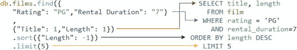
图 11-1. MongoDB JavaScript 查询与 SQL 的比较

注：MongoDB 和 Couchbase 的示例数据基于 MySQL“Sakila”示例模式的一个移植版本，该模式描述了一个 DVD 租赁业务的数据库。如今 DVD 租赁业务已基本消失，但该示例数据库为 MySQL 用户提供了一个熟悉的模式。转换后的数据库可在 [`​bit.​ly/​1LwY9xl`](http://bit.ly/1LwY9xl) 获取。

使用`find()`方法可以构建相当复杂的查询，但对于需要跨文档聚合的查询，我们需要使用`aggregate()`方法。`aggregate()`方法实现了与 SQL `GROUP BY`子句逻辑等效的功能。图 11-2 比较了 SQL `GROUP BY`语句与其 MongoDB 等效语句。

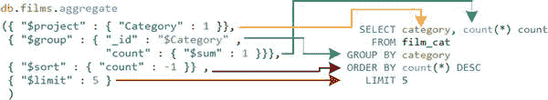
图 11-2. MongoDB 聚合框架与 SQL 的比较

基于 JavaScript 的 MongoDB shell 语言无法直接嵌入其他编程语言中。历史上，针对各种语言的 MongoDB 驱动程序实现了受 JavaScript 接口启发的接口，但在不同语言之间存在显著差异。最近，开发了一个跨驱动程序规范，该规范提高了各种编程语言驱动程序实现之间的一致性。

以 Java 为例，以下是一些连接到服务器并选择 NGDBDemo 数据库内“test”集合的代码：

```java
MongoClient mongoClient = new MongoClient(mongoServer);
MongoDatabase database = mongoClient.getDatabase("NGDBDemo");
MongoCollection<Document> collection = database.getCollection("test");
```

以下代码创建并插入一个新文档：

```java
1.  Document people = new Document();              // 一个人的文档
2.  people.put("Name", "Guy");
3.  people.put("Email", "guy@gmail.com");
4.  BasicDBList friendList = new BasicDBList();    // 好友列表
5.  BasicDBObject friendDoc = new BasicDBObject(); // 一个好友
6.  friendDoc.put("Name", "Jo");
7.  friendDoc.put("Email", "Jo@gmail.com");
8.  friendList.add(friendDoc);                     // 添加该好友
9.  friendDoc.clear();
10. friendDoc.put("Name", "John");
11. friendDoc.put("Email", "john@gmail.com");
12. friendList.add(friendDoc);                     // 添加另一个好友
13. people.put("Friends", friendDoc);
14. collection.insertOne(people);
```

第 1 行创建一个空文档。第 2 和第 3 行向文档添加一些值。在第 4 至第 7 行，我们创建了一个表示子文档数组的`List`结构，并将第一个文档插入该数组。第 9 至第 13 行将第二个子文档插入列表。第 14 行将新文档（其中包含两个嵌入的好友文档）插入 MongoDB。

这种编程模式反映了第 10 章中描述的 JSON 文档的基本结构：JSON 文档由任意嵌套的对象、值和数组组成。MongoDB 接口要求我们以编程方式构建这些结构，尽管有几种独立的实用工具类可用，允许在 Java 对象和 JSON 文档之间进行转换。

Java 驱动程序中的集合对象支持一个`find()`方法，虽然语法上与 JavaScript 版本不完全相同，但它允许我们执行与在 JavaScript shell 中相同的 操作：

```java
Document myDoc = collection.find(eq("Name", "Guy")).first();
System.out.println(myDoc.toJson());
```

该 API 提供了可滚动的游标，允许我们遍历结果集或整个集合。此示例遍历集合中的所有文档：

```java
MongoCursor<Document> cursor = collection.find().iterator();
try {
    while(cursor.hasNext()) {
        System.out.println(cursor.next().toJson());
    }
} finally {
    cursor.close();
}
```

一个更紧凑的替代获取循环可以这样构建：

```java
for (Document cur : collection.find()) {
    System.out.println(cur.toJson());
}
```


#### Cassandra 查询语言 (CQL)

Cassandra 的底层数据结构基于 Google 的 BigTable 模型，这让我们预期其 API 在语法上会与 HBase API 类似。确实，早期基于 Thrift 的 Cassandra API 复杂程度不亚于 HBase 编程 API；甚至可以说更复杂，因为 Cassandra 实现了一种“超级列”结构，扩展了可能的列族配置范围，但这使得其概念化和编程变得困难。

在 0.8 版本中，Cassandra 团队果断地从以 API 为中心的接口转向了受 SQL 启发的、基于语言的接口：Cassandra 查询语言 (CQL)。CQL 使用熟悉的 SQL 惯用语法来进行数据定义、操作和查询任务，现在它是通过查询工具或在程序中与 Cassandra 数据库交互的首选方法。

##### CQL 作为抽象层与接口

CQL 通过 `cqlsh` 程序为 Cassandra 提供了交互式的即席查询能力。它还通过允许更简洁、更易懂的数据操作代码来简化编程任务，这些代码对于那些曾在基于 SQL 的接口（如 JDBC）中编写过代码的人来说看起来很熟悉。

但或许最重要也最具争议的是，Cassandra CQL 抽象了底层的宽列 BigTable 风格数据模型，转而采用一种更类似关系的表格式方案。我们在第 10 章详细讨论过这一点，此处不再重复：特别是参见图 10-7，对比了 Cassandra CQL 的数据表示与底层宽列结构。

关于 CQL 抽象最好——也许也是最坏——的一点是，用户无需理解宽列数据模型的细微差别即可与 Cassandra 交互。然而，尽管你可以在不理解底层 Cassandra 数据模型的情况下编写功能性的 Cassandra CQL，但如果理解了两者如何关联，将会获得最佳结果。

##### CQL 中的宽列结构

CQL 中的宽列结构通过使用复合主键来定义，其中键的第一部分定义了分区（例如，rowkey），第二部分定义了聚簇列。聚簇列的值成为宽列族中的动态列名。

下面的 CQL 语句（在 `cqlsh` shell 中执行）定义并填充了一个 Cassandra 表，该表大致等同于我们在本章前面创建的 HBase 表：

```sql
cqlsh:guy> CREATE TABLE friends
   ... (name text,
   ...  friend_name text,
   ...  friend_email text,
   ...  PRIMARY KEY(name,friend_name));

cqlsh:guy> INSERT INTO friends (name,friend_name,friend_email)
   ... VALUES('Guy','Jo','Jo@gmail.com');

cqlsh:guy> INSERT INTO friends (name,friend_name,friend_email)
   ... VALUES('Guy','Chris','Chris@gmail.com');

cqlsh:guy> INSERT INTO friends (name,friend_name,friend_email)
   ... VALUES('Guy','John','John@gmail.com');
```

熟悉的类 SQL 结构允许我们执行更新和删除、创建索引或发出查询。

##### 局限性与设计原理

然而，与标准 SQL 相比，CQL 的 `SELECT` 语句功能有限：特别是，不支持连接（joins）和聚合（`GROUP BY`）操作。此外，`WHERE` 子句和 `ORDER BY` 子句受到严重限制。排序和范围查询仅限于特定分区键内的聚簇列。

如果你将 CQL 表视为关系结构，这些限制似乎令人困惑。但如果你记住键的第一部分实际上是一个在整个集群中被一致哈希的 rowkey，那么这个限制就显得更合理了。Cassandra 无法有效地对哈希分布在整个集群的 rowkey 值执行范围扫描。也不可能在不访问特定行的情况下访问分区列，因为每一行的列值都可能完全不同。

因此，不支持这个 `ORDER BY` 子句：

```sql
cqlsh:guy> SELECT * FROM friends ORDER BY name;
SInvalidRequest: code=2200 [Invalid query] message="ORDER BY is only supported when the partition key is restricted by an EQ or an IN."
```

但这个是合法的：

```sql
cqlsh:guy> SELECT * FROM friends WHERE name = 'Guy'
   ... ORDER BY friend_name;

 name | friend_name | friend_email
------+-------------+-----------------
 Guy |        Chris | Chris@gmail.com
 Guy |           Jo |    Jo@gmail.com
 Guy |         John |  John@gmail.com
```

类似的限制阻止了对分区键进行范围操作：

```sql
cqlsh:guy> SELECT * FROM friends WHERE name > 'Guy'  ;
InvalidRequest: code=2200 [Invalid query] message="Only EQ and IN relation are supported on the partition key (unless you use the token() function)"
```

但允许在指定分区键的前提下对聚簇键进行范围查询：

```sql
cqlsh:guy> SELECT * FROM friends
   ... WHERE name='Guy' AND friend_name > 'Guy';

 name | friend_name | friend_email
------+-------------+----------------
 Guy |           Jo |   Jo@gmail.com
 Guy |         John | John@gmail.com
```

##### 在 Java (JDBC 类) 应用程序中使用 CQL

CQL 在 Java 程序或其他语言中通过类似于 JDBC 的驱动语法使用：CQL 语句作为字符串传递给将 CQL 提交到服务器并返回结果集或返回码的方法。

以下 Java 代码连接到一个 Cassandra 服务器并指定一个键空间（第 1-3 行），提交一个 CQL 查询（第 5-6 行）并遍历结果（第 8-11 行）：

```java
1.  String myServer=args[0];
2.  Cluster cluster = Cluster.builder().addContactPoint(myServer).build();
3.  Session myKeySpace = cluster.connect("guy");
4.
5.  String cqlString = "SELECT * FROM friends where name='Guy'";
6.  ResultSet myResults = myKeySpace.execute(cqlString);
7.
8.  for (Row row : myResults.all()) {
9.        System.out.println(row.getString(0) +" "+
10.           row.getString(1) + " " + row.getString(2));
11.  }
```

如果我们事先不知道结果集的结构，那么有一个元数据接口可以让我们提取列名和数据类型：

```java
List<Definition> colDefs = myResults.getColumnDefinitions().asList();
System.out.println("Column count=" + colDefs.size());
System.out.println("Column Names:");
for (Definition colDef : colDefs) {
   System.out.println(colDef.getName());
}
```

#### MapReduce

早期的 NoSQL 系统提供的 `put` 和 `get` 方法只支持逐记录处理，这给需要对数据执行哪怕简单分析的应用程序带来了沉重的编程负担。谷歌的 MapReduce 算法——首次发表于 2004 年——为在分布式系统上并行化计算提供了一个解决方案，并且它不仅被受谷歌技术栈启发的系统（如 Hadoop 和 HBase），也被许多早期的 NoSQL 系统（如 CouchDB 和 MongoDB）广泛采用。

MapReduce 的典型例子由词频统计 ([`wiki.apache.org/hadoop/WordCount`](https://wiki.apache.org/hadoop/WordCount)) 程序提供，它代表了几乎最简单的 MapReduce 示例。我们在图 2-4 中展示了词频统计的图示表示。

在词频统计示例中，map 阶段使用分词器将输入分解为单词，然后为每个单词赋值 1：

```
public static class Map
    extends Mapper<LongWritable, Text, Text, IntWritable> {
    private final static IntWritable one = new IntWritable(1);
    private Text word = new Text();

    public void map(LongWritable key, Text value, Context context)
        throws IOException, InterruptedException {
        String line = value.toString();
        StringTokenizer tokenizer = new StringTokenizer(line);
        while(tokenizer.hasMoreTokens()) {
            word.set(tokenizer.nextToken());
            context.write(word, one);
        }
    }
}
```

reducer 类接收这些名称:值对（其中值始终为 1），并计算每个单词的计数总和：

```
public static class Reduce
    extends Reducer<Text, IntWritable, Text, IntWritable> {
    public void reduce(Text key, Iterable<IntWritable> values,
        Context context)
        throws IOException, InterruptedException {
        int sum = 0;
        for (IntWritable val : values) {
            sum += val.get();
        }
        context.write(key, new IntWritable(sum));
    }
}
```

MapReduce 作业由主代码调用，该代码定义输入输出类型及文件、指定 map 和 reducer 类并调用作业：

```
Job job  = Job .getInstance(conf, "wordcount");
job.setOutputKeyClass(Text.class);
job.setOutputValueClass(IntWritable.class);
job.setMapperClass(Map.class);
job.setReducerClass(Reduce.class);
job.setInputFormatClass(TextInputFormat.class);
job.setOutputFormatClass(TextOutputFormat.class);
FileInputFormat.addInputPath(job, new Path(args[0]));
FileOutputFormat.setOutputPath(job, new Path(args[1]));
job.waitForCompletion(true);
```

在 Java 中编写 MapReduce 代码有些繁琐，并且涉及大量模板代码。许多替代的实现要简单得多。例如，这是使用 MongoDB 的 JavaScript MapReduce 框架实现的词频统计算法：

```
db.films.mapReduce(
    /* Map    */ function() {emit (this.Category,1);},
    /* Reduce */ function(key,values) {return Array.sum(values)} ,
    { out: "MovieRatings"  }
)
```

这段 JavaScript 从 `films` 集合中读取数据，对每个电影的类别进行词频统计，结果输出到集合 "MovieRatings"：

```
> db.MovieRatings.find();
{ "_id" : "Action", "value" : 64 }
{ "_id" : "Animation", "value" : 66 }
{ "_id" : "Children", "value" : 60 }
{ "_id" : "Classics", "value" : 57 }
{ "_id" : "Comedy", "value" : 58 }
```

MapReduce 是一种灵活的编程范式，能够适应广泛的数据处理算法。然而，对于给定问题，它很少是最高效的算法，并且通常不是对程序员来说最有效率的方法。因此，出现了许多提供替代编程和处理范式的框架。

#### Pig

人们很早就意识到，如果常见的操作需要精通复杂 MapReduce 编程的高级 Java 程序员，那么 Hadoop 的全部潜力就无法被释放。正如我们将在本章后面看到的，Facebook 开发 Hive（最初的 SQL on Hadoop）是朝着解决这个问题迈出的重要一步。而在雅虎，Hadoop 团队认为 SQL 范式无法涵盖足够广泛的 MapReduce 编程任务类别。因此，雅虎着手创建一种既能最大化生产力，又能支持复杂过程化数据流的语言。其结果就是 Pig。

Pig 在表面上类似于 Perl 或 Python 等脚本语言，因为它提供灵活的语法和动态类型的变量。但 Pig 实际上实现了一种相当独特的编程范式；它最好被描述为一种数据流语言。Pig 语句通常表示数据操作，大致类似于 SQL 中的各个操作符——加载 (`load`)、排序 (`sort`)、连接 (`join`)、分组 (`group`)、聚合 (`aggregate`) 等。通常，每个 Pig 语句接受一个或多个数据集作为输入，并返回一个数据集作为输出。例如，一个 Pig 语句可能接受两个数据集作为输入，并返回连接后的集合作为输出。用户可以通过基于 Java 的用户定义函数 (`UDF`) 机制添加自己的操作。

对于熟悉 SQL 编程的人来说，在 Pig 中编程将编程模型完全颠倒。SQL 是一种非过程化语言：你指定你想要的数据，而不是概述要执行的事件序列。相比之下，Pig 是显式过程化的：数据操作的精确序列在你的 Pig 代码中指定。对于 SQL 专家来说，它更像是 SQL 语句的执行计划，而不是 SQL 语句本身。

SQL 编译器和 Hive 的 HQL 编译器包含优化器，试图确定解决 SQL 请求的最有效方法。Pig 不太依赖此类优化器，因为执行计划是显式的。正如 Pig 专家们喜欢说的：“Pig 使用的是你头脑中的优化器。”

以下是无处不在的词频统计在 Pig 中的实现：

```
file= load 'some file';
b = foreach file generate flatten (TOKENIZE((chararray)$0)) as word;
c = group b by word;
d = foreach c generate COUNT(b), group;
store d into 'pig_wordcount';
```

Pig 可用于执行复杂的工作流并提供类似于 SQL 的即席查询能力。例如，图 11-3 所示的示例执行连接、过滤和聚合，以提供亚洲地区客户的摘要。图 11-3 也包含了一个可比的 SQL 语句。

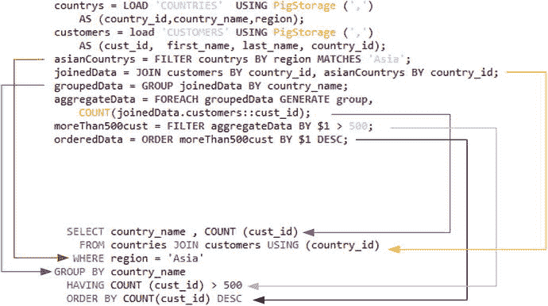

图 11-3.

Pig 与 SQL 对比

尽管 Pig 能够表达几乎所有可以用 SQL 语法表达的数据查询，但它也能执行更复杂的数据流，而这些在关系数据库管理系统 (`RDBMS`) 中需要多个 SQL 语句与过程化代码串联起来才能完成。

然而，尽管 Pig 比 SQL 更灵活，但它不是一种图灵完备的编程语言：它缺乏完整通用编程解决方案所需的控制结构。不过，Pig 可以嵌入到 Python 和其他语言中。


#### 有向无环图

Hadoop 1.0 基于 MapReduce 模式。复杂的程序可以通过链接多个 MapReduce 步骤来实现最终结果。

长期以来，人们一直承认，虽然 MapReduce 是一个应用广泛、能支持多种作业类型的模型，但它并非适用于所有工作负载的最佳模型。特别是，MapReduce 有着巨大的启动开销，这意味着即使是最简单的"Hello World" MapReduce 作业通常也需要数分钟而非数秒才能启动；仅这一点就使得 MapReduce 不适用于交互式工作负载和低延迟操作。

Hadoop 2.0 引入了 YARN 框架，它允许 Hadoop 运行基于其他处理模式的工作负载——MapReduce 只是其中一种。

Apache Tez 项目（Tez 在印地语中意为“速度”）是众多基于 YARN 的项目之一，它为 Hadoop 提供了一个处理框架，既支持传统 Hadoop 工作负载所特有的大规模批处理，也支持低延迟操作，从而使 Hadoop 能支持更广泛的解决方案。

Tez 基于一种称为有向无环图（`DAG`）的灵活处理范式。这个令人望而生畏的术语实际上描述了一种熟悉的处理模型。任何检查过 SQL 执行计划的人都会遇到过 `DAG`。这些图描述了复杂请求如何被分解为多个操作，这些操作按特定顺序执行，并且可以任意相互提供数据。MapReduce 本身就是一个 `DAG`，但 MapReduce 范式严重限制了可以构建的图的类型。此外，MapReduce 要求图中的每个步骤都由一组独立的进程执行，而 Tez 则允许图中的多个步骤由单个进程执行，并且可能位于 Hadoop 集群的特定节点上。

#### Cascading

Cascading 是一个流行的开源 Java 框架，它对 Hadoop MapReduce 或基于 YARN 的处理原语进行了抽象。在某些方面，它类似于 Pig，因为它处理高级别的数据流和转换，使程序员免于构建低级别并行化类的繁琐工作。然而，与 Pig 不同，Cascading 集成在 Java 语言中，并且能够创建更加模块化和精密的解决方案。

Cascading 编程模型基于源（sources）、汇（sinks）和组装成数据流的管道（pipes）。程序员通过组装这些管道来构建比 MapReduce 更复杂的程序。这些工作流代表了前一节讨论的 `DAG`。

#### Spark

我们在第 7 章探讨了 Spark 项目的起源和架构。Spark 可以被认为是“基于内存的 Hadoop”，但实际上它提供的不仅仅是内存速度提升。Spark API 的抽象级别高于原生的 YARN 或 MapReduce 代码，在程序员生产力和执行速度方面都有所提升。

Spark 支持 Python、Java 和其他语言的 API，但它的原生语言是 Scala，因此我们这里的示例将使用 Scala API。

在这里，我们将文本文件（本例中来自 HDFS）加载到 Spark 弹性分布式数据集（`RDDs`）中。

```
val countries=sc.textFile("COUNTRIES")
val customers=sc.textFile("CUSTOMERS")
```

Spark `RDDs` 是不可变的：我们不能更改 `RDD` 的内容；相反，我们执行操作来创建新的 `RDDs`。

HDFS 的输入是 CSV 文件，所以在我们初始的 `RDDs` 中，输入文件的每一行都表示为一个字符串。以下是 `countries` `RDD` 中的第一个元素：

```
scala> countries.first()
res9: String = "52790,United States of America,Americas"
```

在下一个例子中，我们使用 `map` 函数从每个 CSV 字符串中提取键值，并创建键值对 `RDDs`。

```
val countryRegions=countries.map(x=>(x.split(",")(0),x.split(",")(2)))
val AsianCountries=countryRegions.filter(x=> x._2.contains("Asia") )
// 国家代码和国家名称
val countryNames=countries.map(x=>(x.split(",")(0),x.split(",")(1)))
```

第一个 `RDD` `countryRegions` 包含所有国家代码及其关联的区域。第二个（`AsianCountries`）使用 `filter()` 方法创建一个仅包含亚洲国家的 `RDD`。第三个（`countryNames`）创建一个以国家 ID 为键、包含国家名称的 `RDD`。以下是 `countryNames` `RDD` 中的第一个元素：

```
scala> countryNames.first()
res12: (String, String) = (52790,United States of America)
```

聚合可以通过执行 `map` 和 `reduce` 操作来创建。下面的第一行使用 `map` 为每个客户发出一个国家名称和数字 1。第二行调用一个归约器（reducer），发出一个包含每个国家客户数量的 `RDD`：

```
val custByCountry=customers.map(x=>(x.split(",")(3),1))
val custByCountryCount=custByCountry.reduceByKey((x,y)=> x+y)
```

在下一个语句中，我们将包含按国家 ID 统计的客户数量的 `RDD` 与我们之前创建的亚洲国家 ID 列表进行连接（join）。因为我们使用的是默认的内连接（inner join）方法，所以这只返回亚洲区域的客户计数。

```
val AsiaCustCount=AsianCountries.join(custByCountryCount)
```

下一个连接操作将我们包含按国家代码为键的国家名称的 `RDD` 与上一个 `RDD` 连接起来。现在我们有了一个 `RDD`，其中包含了按亚洲区域国家名称统计的客户数量：

```
val AsiaCustCountryNames=AsiaCustCount.join(countryNames)
```

这个 Spark 工作流大致等同于图 11-3 所示的 Pig 工作流。然而，对于海量数据集，Spark 作业预计能在更短的时间内完成，因为从 HDFS 初始加载之后的每个操作都将在内存中完成。

#### SQL 的回归

我不知道你怎么想，但在我为本章创建示例时，我被新一代数据库语言所营造的“巴别塔”印象所触动。无论你对 `SQL` 有何看法，但在二十多年里，数据库程序员们一直都在使用同一种语言。由于非关系型系统的激增，我们都被迫使用不同的语言。虽然其中一些语言在处理非结构化数据或并行化编程任务方面确实具有明确优势，但在许多情况下，抽象级别降低了，程序员的工作量反而增加了。

因此，在 `NoSQL` 的热潮兴起仅仅几年后，我们就看到 `SQL` 几乎回归到了每一个新的数据库领域，这并不令人惊讶。`SQL` 的优势实在太多：它是一种简化数据访问和操作的高级别抽象，它是数以百万计的数据库用户都熟练掌握的语言，而且有数百种流行的商业智能和分析工具在底层使用它作为访问数据的手段。


##### SQL-on-Hadoop 工具对比

##### Hive

Hive 是 Hadoop 上最初的 SQL 引擎。我们在第 2 章讨论了 Hive 的起源和架构。从 Hadoop 的早期开始，Hive 就代表了对许多用户而言最易接触的 Hadoop 界面。

Hive 查询语言（`HQL`）是一种基于 SQL 的语言，接近 `SQL-92` 入门级合规性，特别是在其 `SELECT` 语句中。`INSERT`、`DELETE` 和 `UPDATE` 等 `DML` 语句在最近的版本中得到支持，尽管 Hive 的真正目的是提供对通常通过其他方式摄取的 Hadoop 数据的查询访问。一些 `SQL-2003` 分析窗口函数也得到支持。

如第 2 章所述，`HQL` 被编译为 `MapReduce` 或——在后期版本中——更复杂的基于 `YARN` 的 `DAG` 算法。

以下是一个简单的 Hive 查询，它执行与我们之前 Pig 和 Spark 示例相同的分析：

```sql
0: jdbc:Hive2://> SELECT country_name, COUNT(cust_id)
0: jdbc:Hive2://>   FROM countries co JOIN customers cu
0: jdbc:Hive2://>    ON (cu.country_id=co.country_id)
0: jdbc:Hive2://>  WHERE region = 'Asia'
0: jdbc:Hive2://> GROUP BY country_name
0: jdbc:Hive2://>  HAVING COUNT(cust_id) > 500;

2015-10-10 11:38:55     Starting to launch local task to process map join;      maximum memory = 932184064
<<Bunch of Hadoop JobTracker output deleted>>
2015-10-10 11:39:05,928 Stage-2 map = 0%,  reduce = 0%
2015-10-10 11:39:12,246 Stage-2 map = 100%,  reduce = 0%, Cumulative CPU 2.28 sec
2015-10-10 11:39:20,582 Stage-2 map = 100%,  reduce = 100%, Cumulative CPU 4.4 sec
+---------------+------+--+
| country_name  |_c1   |
+---------------+------+--+
| China         | 712  |
| Japan         | 624  |
| Singapore     | 597  |
+---------------+------+--+
3 rows selected (29.014 seconds)
```

`HQL` 语句看起来和操作起来都像 `SQL` 语句。然而，`HQL` 与常用的标准 `SQL` 之间有一些显著差异：

*   `HQL` 支持许多表生成函数，这些函数可用于从可能包含值数组或名称：值对映射的嵌入式字段中返回多行。`Explode()` 函数为数组或映射中的每个元素返回一行，而 `json_tuple()` 则拆分嵌入的 `JSON` 文档。
*   Hive 提供了一个 `SORT BY` 子句，该子句请求输出仅在 `MapReduce` 管道中的每个 `reducer` 内排序。与 `ORDER BY` 相比，这避免了在最终 `reducer` 阶段进行大型排序，但可能不会以排序顺序返回结果。
*   `DISTRIBUTE BY` 控制 `mapper` 如何将输出分发给 `reducer`。我们可以坚持让每个 `reducer` 接收特定列的连续范围，而不是基于键值的哈希将值分发给 `reducer`。`DISTRIBUTE BY` 可与 `SORT BY` 结合使用，以实现结果的总体排序，而无需进行昂贵的最终排序操作。`CLUSTER BY` 结合了指定相同列列表的 `DISTRIBUTE BY` 和 `SORT BY` 操作的语义。

Hive 可以查询 `HBase` 表中的数据和 `HDFS` 中保存的数据。对 `Spark` 的支持是可用的，但仍处于积极开发中。

##### Impala

很难高估 Hive 对 Hadoop 早期采用的重要性。Hive 为非 Java 程序员提供了一种熟悉的访问 Hadoop 中数据的机制，并允许第三方分析解决方案更轻松地与 Hadoop 集成。

然而，Hive 与 `RDBMS SQL` 之间的相似性不可避免地导致了不切实际的期望。`RDBMS` 用户已经习惯于将 `SQL` 作为实时查询工具，而即使是最简单的 Hive 查询通常也需要几分钟才能完成，因为即使是最简单的查询也必须承担启动 `MapReduce` 作业的开销。此外，内存中的数据缓存通常将整体 `SQL` 响应时间减少 90% 或更多，而 Hive 查询完全受 `I/O` 限制。Hive 的初始版本也采用了相当初级的查询优化。

对 Hive 性能的失望导致了一项相当密集的工作来改进 Hive，现代版本的 Hive 比初始版本在性能上提高了好几个数量级。

Cloudera 的 `Impala` 项目旨在提供低延迟、符合 `ANSI` 标准的 Hadoop 上 `SQL`。`Impala` 方法与 Hive 方法之间的关键区别在于，虽然 Hive 程序被转换为原生 Hadoop 处理——最初是 `MapReduce`，但今天也包括 `Tez`——`Impala` 包含自己的处理架构，直接从原生 `HDFS` 或 `HBase` 存储读取。尽管 `Impala` 绕过了 Hadoop 处理层，但它可以通过 `HCatalog` 接口访问 Hive 和 Pig 元数据，这意味着它知道 Hive 和 Pig 表的结构。

`Impala` 架构深受传统大规模并行处理（`MPP`）数据仓库数据库架构的影响，我们在第 8 章讨论过。`Impala` 部署守护进程——通常在每个 Hadoop 数据节点上——并使用类似于 `RDBMS` 系统（如 `Teradata` 或 `Oracle`）使用的算法将工作分发给这些守护进程。这些守护进程随时准备工作，因此不像 Hive 那样存在作业创建的初始延迟。

毫无疑问，对于短时查询，`Impala` 架构提供了比 Hive 更好的性能体验。然而，鉴于 Hive 最近版本的改进，有些人声称 Hive 在更大规模上仍提供更优越的性能。这种争论的一部分是由商业 Hadoop 公司内的营销团队推动的，因此需要仔细评估相互竞争的说法。

##### Spark SQL

如前所述，最近的 Hive 版本中提供了一些对 Spark 的支持。然而，`Spark` 包含自己的 `SQL` 方言，毫不奇怪地被称为 `Spark SQL`。

您可能还记得第 7 章，`Spark SQL` 处理的是数据框（`DataFrame`）而不是弹性分布式数据集（`RDD`）。数据框可以被认为是一种更表格化和模式化的关系，相对于 `RDD`。数据框可以从 `RDD` 或 `Hive` 表创建。

`SQL-92` 合规性在 `Spark SQL` 中是一项正在进行的工作。


###### Couchbase N1QL

到目前为止，我们所接触的 SQL 都是在 Hadoop 和 Spark 等分析系统的语境下使用的。NoSQL 类型的操作型数据库并未如此迅速地实现 SQL；然而，在 2015 年，Couchbase 宣布了非第一范式查询语言（Non-first Normal Form Query Language， N1QL），发音为“Nickel”，这是一个近乎完整的 SQL 语言实现，专为文档数据库设计，并在 Couchbase Server 4.0 中得以实现。

例如，考虑图 11-4 所示的示例数据（这与我们之前用于 MongoDB 的示例数据相同）。

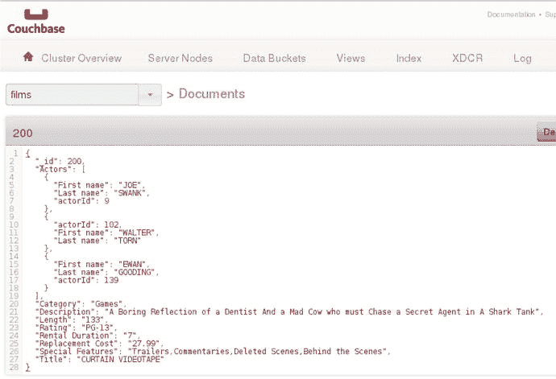

图 11-4. Couchbase 示例文档

###### 基本查询

N1QL 允许我们执行基本查询，以检索选定的文档或选定文档的属性：

```
cbq> SELECT `Title` FROM films WHERE _id=200;
{
"requestID": "0d5cff15-f5e7-434d-9dc4-d950ef5e21f8",
"signature": {
"Title": "json"
},
"results": [
{
"Title": "CURTAIN VIDEOTAPE"
}
],
"status": "success",
```

###### 访问嵌套文档

N1QL 允许我们使用数组表示法访问 JSON 结构中的嵌套文档。因此，例如，在下面的示例中，`Actors[0]` 指的是 `Actors` 数组中的第一个嵌套文档：

```
cbq> SELECT Actors[0].`First name`, Actors[0].`Last name`
>   FROM films where _id=200;
{
"requestID": "5aa27ec1-ce4d-4452-a137-2239b88e47fe",
"results": [
{
"First name": "JOE",
"Last name": "SWANK"
}
],
"status": "success",
```

###### 使用 WHERE ANY 查询子文档

我们可以使用 `WHERE ANY` 语法查询符合搜索条件的子文档：

```
cbq> SELECT `Title` FROM films
>   WHERE ANY Actor IN films.Actors SATISFIES
>   ( Actor.`First name`="JOE" AND Actor.`Last name`="SWANK" ) END;
{
"requestID": "f3d6dd05-912d-437b-984f-214770f87076",
"results": [
{
"Title": "CHOCOLAT HARRY"
},
{
"Title": "CHOCOLATE DUCK"
},
... ...
```

###### 使用 UNNEST 连接嵌套文档

`UNNEST` 命令允许将嵌入的文档“连接”回父文档。因此，这里我们为每位出演电影 200 的演员返回一个结果，结果中包含电影标题：

```
cbq> SELECT f.`Title`, a.`First name`, a.`Last name`
>   FROM films f
>   UNNEST f.Actors a
>   WHERE f._id=200;
{
"requestID": "f8227647-3506-4bfd-a538-3f8a0d038198",
"results": [
{
"First name": "JOE",
"Last name": "SWANK",
"Title": "CURTAIN VIDEOTAPE"
},
{
"First name": "WALTER",
"Last name": "TORN",
"Title": "CURTAIN VIDEOTAPE"
},
... ...
],
"status": "success",
}
```

`UNNEST` 命令允许我们在子文档嵌套在父文档内时，执行等同于父文档和子文档之间连接的操作。N1QL 还允许我们在独立文档之间进行连接，前提是一篇文档包含对另一篇文档主键的引用。

因此，例如，如果我们有一个包含我们假想的（现在肯定陷入困境的）DVD 店中“逾期”电影主键的文档存储桶，那么我们可以使用 `ON KEYS` 连接语法将其连接到 `films` 集合，仅返回那些电影：

```
cbq> SELECT f.`Title` FROM overdues
>   JOIN films f ON KEYS overdues.filmId ;
{
"requestID": "6f0f505e-72f6-404d-9e20-953850dc9524",
"results": [
{
"Title": "CURTAIN VIDEOTAPE"
},
{
"Title": "HARPER DYING"
}
],
"status": "success",
```

###### 总结

N1QL 还包括 DML 语句，允许我们操作文档内容，以及 DDL 语句，允许创建和修改索引。

N1QL 是一个雄心勃勃的尝试，旨在将 SQL 引入文档数据库的世界。有趣的是，在 CouchBase 等公司向其数据库引入 SQL 支持的同时，Oracle 等公司也在其基于 SQL 的数据库中引入了强大的 JSON 支持。这两个世界似乎正在融合。


##### Apache Drill

到目前为止，我们所了解的 SQL 变体都与其底层技术紧密耦合。诚然，像 Hive 这样的技术能够访问 HBase、Spark 以及 HDFS 中的数据，但这更多地体现了 HDFS、HBase 和 Spark 的集成性，而非 Hive 系统本身固有的异构性。

Apache Drill 框架旨在提供一个 SQL 引擎，它能够跨多个分布式数据存储（如 HDFS 或 Amazon S3）以及 NoSQL 系统（如 MongoDB 和 HBase）进行操作。Drill 的架构基于 Google 的 Dremel 系统，后者是 Google BigQuery 产品的基础。

Drill 集成了一个分布式的、异构的、基于成本的优化器，能够智能地将数据访问算法分配到多个不同的系统中。这使得一个 SQL 查询可以跨越 Hadoop、MongoDB、Oracle 或其他数据库，并且——至少在理论上——能够以高效且最优的方式执行。

目前，Drill 可以查询来自具有 JDBC 或 ODBC 连接器的关系型系统、由 Hive 支持的系统、各种基于云的分布式文件系统（如 Amazon S3、Google Cloud Drive）以及 MongoDB 的数据。

让我们看看对 MongoDB 的支持，因为它能让我们了解 Drill 如何处理非表数据。这里，我们使用 Drill 来查询我们的示例 MongoDB 集合。

简单的查询当然很简单：
```
0: jdbc:drill:zk=local> SELECT Title FROM films WHERE Rating='G' LIMIT 5;
+--------------------+
|       Title        |
+--------------------+
| ACE GOLDFINGER     |
| AFFAIR PREJUDICE   |
| AFRICAN EGG        |
| ALAMO VIDEOTAPE    |
| AMISTAD MIDSUMMER  |
+--------------------+
5 rows selected (1.365 seconds)
```

我们可以使用类似于 N1QL 数组表示法的点号表示法来深入查询子文档。因此，这里我们使用数组表示法 `Actors[2]:` 从电影《西部雄狮》的嵌入式 actors 数组中的第二个文档检索数据。
```
0: jdbc:drill:zk=local> SELECT
. . . . . . . . . . . >   `Actors[2].First name`, `Actors[2].Last name`
. . . . . . . . . . . >   FROM films WHERE Title='WEST LION';
+---------+-----------+
| EXPR$0  |  EXPR$1   |
+---------+-----------+
| SEAN    | WILLIAMS  |
+---------+-----------+
```

`FLATTEN` 函数为嵌入式数组中的每个文档返回一行。它与 Hive 的 `EXPLODE` 函数或 N1QL 的 `UNNEST` 子句有些类似。请注意，每个文档都以 JSON 格式返回；目前似乎没有办法对这些结果进行模式化处理：
```
0: jdbc:drill:zk=local> SELECT Title, FLATTEN(Actors)
. . . . . . . . . . . >   FROM films WHERE Rating='G' LIMIT 5;
+-----------------+---------------------------------------------------------
|       Title     |                            EXPR$1
+-----------------+---------------------------------------------------------
| ACE GOLDFINGER  | {"First name":"BOB","Last name":"FAWCETT","actorId":19}
| ACE GOLDFINGER  | {"First name":"MINNIE","Last name":"ZELLWEGER",
| ACE GOLDFINGER  | {"First name":"SEAN","Last name":"GUINESS", "actorId":9
| ACE GOLDFINGER  | {"First name":"CHRIS","Last name":"DEPP","actorId":160}
| AFFAIR PREJUDICE| {"First name":"JODIE","Last name":"DEGENERES",
+-----------------+---------------------------------------------------------
5 rows selected (0.589 seconds)
```

我们可以看到，Drill 具备基本的复杂 JSON 文档导航能力，我们可以期待这一能力会随着时间推移而改进。

Drill 也能导航 HBase 中的宽列存储结构。让我们看看本章前面插入到 HBase 中的数据，这次使用 Drill：
```
0: jdbc:drill:zk=local>  SELECT * FROM friends;
+---------+---------+------+
| row_key | friends | info |
+---------+---------+------+
| [B@6fe2da0c | {"Jo":"am9AZ21haWwuY29t","John":"am9obkBnbWFpbC5jb20="} | {"email":"Z3V5QGdtYWlsLmNvbQ==","userid":"OTk5MA=="} |
| [B@43be5d62 | {"John":"am9obkBnbWFpbC5jb20=","Guy":"Z3V5QGdtYWlsLmNvbQ==","Paul":"cGF1bEBnbWFpbC5jb20=","Ringo":"cmluZ29AZ21haWwuY29t"} | {"email":"am9AZ21haWwuY29t","userid":"OTk5MQ=="} |
+---------+---------+------+
2 rows selected (1.532 seconds)
```
输出不太友好！最初，Drill 在返回 HBase 数据时，没有解码内部的字节数组结构，也没有展平定义我们宽列族的任何映射。

然而，我们可以使用 `FLATTEN` 函数从我们的宽列族“friends”中的每一列提取一行，使用 `KVGEN` 函数将映射转换为列，并使用 `CONVERT FROM` 函数将字节数组转换为 Unicode 字符：
```
0: jdbc:drill:zk=local>
WITH friend_details AS
( SELECT info, FLATTEN( KVGEN(friends)) AS friend_info FROM friends)
SELECT CONVERT_FROM(friend_details.info.email,'UTF8') AS email,
CONVERT_FROM(friend_details.friend_info.`value`,'UTF8')
AS friend_email
FROM friend_details;
+----------------+------------------+
|      email     |   friend_email   |
+----------------+------------------+
| guy@gmail.com  | jo@gmail.com     |
| guy@gmail.com  | john@gmail.com   |
| jo@gmail.com   | john@gmail.com   |
| jo@gmail.com   | guy@gmail.com    |
| jo@gmail.com   | paul@gmail.com   |
| jo@gmail.com   | ringo@gmail.com  |
+----------------+------------------+
```
Drill 展现出巨大的潜力。一个能够导航关系和非关系系统所呈现的各种数据结构的统一 SQL 框架，正是我们解决由当今和未来新一代数据库所特有的海量语言和接口所构成的巴别塔问题所需要的。

##### 其他用于 NoSQL 的 SQL 方案

还有其他一些值得注意的 SQL-on-NoSQL 系统：
* Presto 是一个开源的 SQL 引擎，在许多方面与 Drill 类似，可以查询 JDBC、Cassandra、Hive、Kafka 等系统中的数据。
* 许多关系型数据库供应商提供连接器，允许其 SQL 语言从 Hadoop 或其他系统中检索数据。例如 Oracle Big Data SQL、IBM BigSQL 和 Terradata QueryGrid。
* Apache Phoenix 为 HBase 提供了一个 SQL 层。
* Dell Toad Data Point 为各种非关系系统提供 SQL 访问，包括 MongoDB、Cassandra、HBase 和 DynamoDB。（免责声明：我在 Dell 领导开发 Toad 的团队。）

#### 结论

本章试图让你感受新一代数据库系统提供的语言和 API。在许多情况下，提供的只是底层的编程 API。然而，未来的趋势似乎很明确：SQL 正在重新确立其作为数据库世界通用语言的地位。几乎所有新的数据库都变得可以通过 SQL 访问，并且许多系统甚至对于底层编程也正在采用类似 SQL 的接口。

SQL 不太可能再次成为未来数据库的唯一接口：宽列系统和文档数据库的独特需求表明，非 SQL 的惯用法将是必需的，尽管 Cassandra 的 CQL 和 CouchBase 的 N1QL 确实展示了类 SQL 语言如何仍然是一个处理非关系格式数据的有用抽象。尽管如此，似乎越来越可能的是，大多数下一代数据库最终将支持某种形式的 SQL 访问，即使只是通过像 Drill 这样的独立层来实现。

#### 注意

代码示例可在 [`https://github.com/gharriso/NextGenDBSamples`](https://github.com/gharriso/NextGenDBSamples) 找到。

### 12. 未来的数据库

> 人脑拥有巨大的记忆存储。它使我们充满好奇心和创造力……而且大脑做了一件非常特别的事情。它发明了一个叫做“未来”的想法。——David Suzuki
> 每一场革命都会有其反革命——这是革命真实存在的标志。——C. Wright Mills


本书讲述了数据库技术领域的一场革命：曾经“一刀切”的传统关系型 `SQL` 数据库，如何让位于多种专用数据库技术。在过去的 11 个章节中，我们回顾了下一代数据库系统的主要类别，并深入探讨了其中一些系统的内部架构。

我们所回顾的大部分技术仍在快速发展，很少有人会认为数据库系统的演进已经达到了最终状态。我们能否从本书所回顾的趋势以及我们观察到的技术挑战中进行推断，以预测数据库技术的下一步发展？此外，我们是否应该认为，我们在此讨论的任何革命性变革正走在错误的轨道上？我们是否需要发起一场反革命？

在本章中，我认为当前这种必须在多个相互重叠、各有妥协的架构中做出选择的局面，应该也终将过去。我相信，我们将会看到当今这些迥异的技术日益趋同。未来的数据库，在我看来，将是一种可以配置为支持所有或大部分当前需要独特且独立数据库技术来处理的工作负载的系统。

#### 回顾革命

正如我们在第 1 章所讨论的，数据库技术的三大时代对应于计算机应用的三大时代：大型机、客户端-服务器和现代 Web。因此，现代数据库的演变历程与万维网的发展历程并行也就不足为奇了。最新一代数据库系统的主要驱动力，源于 Web 2.0、全球电子商务、大数据、社交网络、云计算以及日益重要的物联网 (`IoT`) 的需求。这些流行词不仅仅是简单的营销口号：它们各自要求并反映了应用架构的重大变革，数据库技术必须对此做出响应。当今的应用架构和数据库技术不断面临挑战，以满足应用对无与伦比的规模、可用性和吞吐量的需求。

这些挑战所代表的当务之急是不可抗拒的：对大多数企业而言，大数据、社交网络、移动设备和云存储代表了关键的竞争挑战。利用数据创造竞争优势的能力，是现代商业组织生存的关键；同样，部署具备全球范围、移动和社交语境的应用能力也至关重要。很难想象一个成功的现代企业，会没有利用数据或通过社交网络和移动渠道与用户互动的策略。对某些行业而言，`IoT` 代表着类似的威胁和机遇：联网设备有望彻底改变制造业、医疗保健、交通运输、家庭自动化以及许多其他行业。

由这些需求催生的应用架构转变，被市场研究公司 `IDC` 等机构方便地总结为“第三平台”。

我们在本书中回顾的许多关键数据库变体，都针对满足这第三平台所带来的一项或多项挑战进行了优化：

*   `Hadoop` 和 `Spark` 的存在是为了提供一个平台，用于存储和分析海量半结构化和非结构化数据。
*   诸如 `Cassandra` 和 `MongoDB` 之类的非关系型操作数据库，其存在是为了为 Web 应用提供一个支持全球规模、持续可用性并能快速演进新功能的平台。其中一些，如 `Cassandra`，因其能够为潜在的全球部署提供可扩展性和经济性而受到青睐。另一些，如 `MongoDB`，则因其允许更快速的应用设计迭代而具有吸引力。
*   诸如 `Neo4j` 之类的图数据库和图计算引擎，可以管理社交网络中常见的网络数据。

然而，在上述每一个领域内，我们都能看到对传统 `RDBMS` 系统所提供关键优势的持续需求。特别是：

*   `SQL` 提供了一种数据查询接口，它经受住了时间的考验，为数百万人所熟悉，并涉及数千种分析工具。
*   关系数据模型为清晰易懂的数据模型提供了一个理论上健全的基础。即使物理实现形式不同，关系模型仍然是大多数计算机数据集的正确表示方式。
*   事务，可能是多对象的、符合 `ACID` 特性的事务，在许多情况下对于力求正确表示系统所有交互的系统来说，仍然是强制性的。

#### 反革命者

很难有人会否认数据库领域没有发生某种剧变。`Hadoop`、`Spark`、`MongoDB`、`Cassandra` 以及许多其他非关系型系统，如今构成了许多（如果不是大多数）财富 500 强公司组织数据架构中重要且不断增长的部分。当然，也可以辩称所有这些新技术都是一个错误，关系模型和事务性的 `SQL` 关系型数据库代表了更好的解决方案，最终市场会“恢复理智”并回归关系型的怀抱。

虽然我认为我们几乎不可能完全回归到一种主要在客户端-服务器时代成熟的数据库架构，但在我看来相当清楚的是，大多数下一代数据库都代表着重大的妥协。当今的下一代数据库并不代表数据库的“统一场论”；恰恰相反。我们仍有很长的路要走。

一位对非关系型系统的批评者可以合理地指出，最新一代的数据库存在以下弱点：


##### 对非关系型数据库的反思与未来

*   **导航模型的回归**。许多新型数据库重新引入了前关系型系统中存在的状况，即数据的逻辑表示与物理表示以一种不可取的方式紧密耦合。关系模型的重大成功之一在于实现了逻辑表示与物理实现的**分离**。
*   **不一致性到极致**。大多数非关系型系统无法执行多对象事务，即使在单对象事务中也可能出现不一致性和不可预测性，这可能导致一系列不良后果，而这些后果在很大程度上已通过 `ACID` 事务和多版本一致性控制（`MVCC`）模式得以解决。在放宽一致性模型的系统中，都可能出现幻读、更新丢失和不确定行为等问题。
*   **不适合商业智能**。像 `HBase`、`Cassandra` 和 `MongoDB` 这样的系统为程序员提供的功能多于为企业所有者提供的功能。这些系统中的数据与常规的商业智能（`BI`）实践相对隔离。缺乏一个能够访问这些系统的完整 `SQL` 层，使它们与更广泛的企业环境隔绝。
*   **妥协过多**。有各种各样的专用数据库解决方案，在某些情况下，这些专用方案可能完全符合应用程序的需求。但在太多情况下，应用程序不得不在两种或多种 `NQR`（不太合适）的数据库架构之间做出选择。

##### 我们是否绕回了起点？

关系模型的支持者声称非关系型系统是回到了几十年前已被摒弃的前关系型架构，这并不罕见。这种说法在许多方面并不准确，特别是因为前关系型系统是非分布式的，而当今的非关系型数据库通常采用分布式数据库架构。仅这一点就使得当今的非关系型系统与 20 世纪 60 年代和 70 年代的前关系型系统有着**根本的不同**。

然而，许多新型非关系型系统在**一个方面**与前关系型数据库相似：它们将数据的逻辑表示和物理表示纠缠在一起。Edgar Codd 对 `IDMS` 和 `IMS` 等前关系型系统的关键批评之一，就是它们要求用户了解数据的底层物理表示。关系模型解耦了这些逻辑和物理表示，允许用户以逻辑一致的视图查看数据，无论底层存储模型如何。数据的规范化关系表示避免了针对特定访问模式或存储布局的任何偏向：它将数据的逻辑表示与底层物理表示**解耦**。

许多现代非关系型系统的倡导者明确**拒绝这种解耦**。他们认为，通过使所有访问模式平等，规范化使它们都同样糟糕。但这一论断是值得怀疑的：它忽略了在关系模型之上应用反规范化作为优化的可能性。很明显，呈现给最终用户的结构不必与磁盘上的结构相同。

事实上，放弃关系模型的动机，较少源于这些访问模式方面的考虑，而更多源于希望将数据库的数据表示与应用程序代码中的面向对象表示**对齐**。另一个动机是允许模式快速变更：避免通常冗长的逻辑数据模型变更过程，以及将该变更传播到生产系统所需的漫长过程。

Codd 在 1970 年提出数据的物理和逻辑表示应该分离，他错了吗？几乎肯定没有。拥有一个能够代表明确且无冗余的数据视图的逻辑数据模型仍然是可取的。事实上，大多数非关系型建模课程都鼓励用户从某种形式的“逻辑”模型开始。

因此，我认为，**对高级别数据逻辑模型的需求仍然是可取的**，允许用户使用该模型与数据库交互，仍然像关系模型首次提出时一样是一个有效的要求。然而，现代应用程序需要能够传播至少是数据模型的微小变更，而无需启动一个笨重的数据库变更控制流程。

##### 选择过剩的尴尬

十年前，为应用程序选择正确的数据库系统相当简单：选择与其有现有合作关系或许可交易条件最佳的数据库供应商。技术考虑或价格可能导致在 `Oracle` 和 `SQL Server` 之间做出选择，但数据库是 `RDBMS` 几乎是既定事实。如今，选择最佳数据库系统是一项艰巨得多的任务，各种供应商和倡导者相互矛盾的说法往往使其变得更加困难。在大多数情况下，某种形式的关系技术将是最佳选择。但对于那些可能寻求突破 `RDBMS` 舒适区，并希望从新数据库技术的独特功能中获得竞争优势的应用程序来说，数据库的选择可能是决定性的。

“哪个是最好的数据库？” 通常，这个问题没有正确答案，因为每个选择都意味着某种形式的妥协。`RDBMS` 在查询访问和事务能力方面可能更胜一筹，但如果应用程序发展壮大，它可能无法提供所需的网络分区容忍度。`Cassandra` 可能提供最佳的数据中心间可用性，但可能无法与 `BI` 系统集成。等等……

图 12-1 展示了当今试图决定数据库的人所面临的一些决策点。

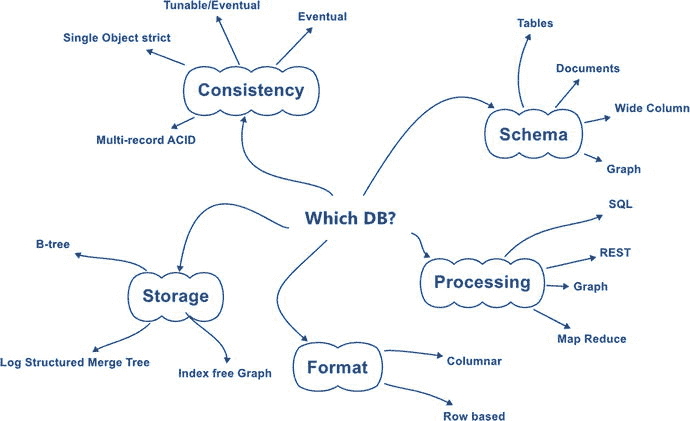

图 12-1. 选择正确数据库所涉及的决策

##### 我们能否兼得？

我逐渐相信，我们可以在**单一数据库产品**中“兼得”。例如，从架构上讲，没有理由认为一个数据库系统不能提供一种可调的一致性模型，其一端是严格的多记录 `ACID` 事务，另一端是最终一致性风格模型。同样地，我相信我们可以结合关系模型和文档存储的特性，最初可以遵循现有趋势，在关系表中允许 `JSON` 数据类型。

对这种融合的阻力，很可能既源于市场和竞争考虑，也源于技术障碍。无论是 `RDBMS` 现有厂商还是非关系型新锐，承认混合模型应该占上风，可能都不符合它们的利益。而且，支持这种混合模型可能涉及技术复杂性，对于规模较小、进入市场较晚的企业来说将更加困难。

尽管如此，我认为这将是整个数据库行业的最佳结果。与其提供数十种涉及重大妥协的不兼容技术，不如提供一个连贯的数据库架构，将接下来概述的功能作为可配置的行为提供。让我们看看每个融合领域，并考虑将这些技术结合到一个系统中需要什么。

##### 一致性模型


##### 类似 Cassandra 的数据库

像 `Cassandra` 这样基于 `Dynamo` 模型构建的数据库，已经提供了一种可调的一致性模型，允许管理员或开发者选择一致性与性能之间的权衡级别。基于 `Dynamo` 的系统以其提供最终一致性而闻名，但它们同样能够提供严格的一致性——至少在单对象事务内是如此。`RDBMS` 系统也提供对隔离级别的控制——例如，提供保证可重复读取的级别。

然而，像 `Cassandra` 这样基于 `Dynamo` 的系统目前无法提供多对象事务。与此同时，现有实现中的 `RDBMS` 一致性受到 `ACID` 事务原则的影响，该原则要求数据库始终向所有用户提供一致的视图。

正如我们在第 3 章所讨论的，最终一致性类系统的根本动机是能够经受住网络分区。如果分布式数据库被网络分区一分为二——即“脑裂”场景——数据库只能通过牺牲某种程度的严格一致性来维持可用性。

在一个最终一致、可容忍网络分区的数据库中实现多行事务，无疑是一项重大的工程挑战，但并非显然不可能。这样的数据库将允许开发者或管理员在严格一致的 `ACID` 事务与涉及多对象的最终一致事务之间进行选择（如图 12-2 所示）。

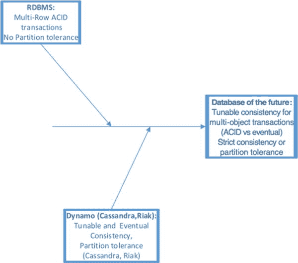

图 12-2.

一种可能的收敛一致性模型

##### 模式

虽然关系模型的纯粹主义者可能声称商业 `RDBMS` 系统并未实现纯粹的版本，但传统的 `RDBMS` 至少为数据建模过程定义了明确的规范。数据“规范化”从逻辑表示中消除了冗余和模糊性。总的来说，数据的关系型表示在为非程序员提供可理解的数据视图方面已被证明具有无价的价值，并且——与采用 `SQL` 作为数据访问的通用语言一起——为商业智能和查询工具提供了可预测且易于访问的接口。

对关系模型的异议至少源于两个原因：

- 程序员希望有一个可以接受面向对象数据的数据存储，而无需经历从范式中解构和重构所带来的开销和复杂性。
- 关系模型的生命周期在某种程度上代表了一个瀑布式过程，要求在项目开始时就全面定义模型，并且一旦部署到生产环境就难以更改。现代敏捷应用程序开发实践拒绝这种瀑布式方法，而支持期望设计变更的迭代开发。此外，现代 Web 应用程序需要快速迭代新功能，以适应激烈的竞争环境。虽然现代 `RDBMS` 系统可以执行在线模式修改，但代码和模式变更的协调带来了应用程序故障的风险，通常需要仔细且耗时的变更控制程序。

简而言之，现代应用程序需要灵活的模式，可以在必要时由更改的应用程序代码动态修改。

然而，在这个大数据时代，一个可理解且无歧义的数据模型的需求甚至比关系模型早期更为重要。非关系型数据库无法轻松集成到组织的商业智能（`BI`）能力中；在最坏的情况下，它们包含的数据对 `BI` 框架来说是完全不透明的。

提供一个两全其美的解决方案似乎在某些现有数据库的能力范围内。一个允许在较高层次以相对稳定的范式表示数据，同时也允许存储动态变化数据的数据库，只需要关系表中的列能够存储任意复杂的结构——例如 `JSON`——并且这些复杂结构得到集成到 `SQL` 中的高效查询机制的支持。

正如我们将看到的，这样的混合能力已经存在。几乎所有数据库——关系型和非关系型——都在引入对 `JSON` 的支持。例如，`Riak`、`Cassandra`、`PostgresSQL` 和 `Oracle` 都提供了用于索引、存储和检索 `JSON` 结构的具体机制。很快，将一个数据库描述为“文档”数据库将变得毫无意义，因为所有数据库都将提供对 `JSON` 的强大支持。

我确信关系模型的纯粹主义者会争辩说，这样的混合解决方案实际上是魔鬼的杰作，因为它损害了关系模型的理论基础。也许确实如此，一种允许原型设计和快速迭代数据模型同时保持关系纯粹性的关系实现将是受欢迎的。但目前我认为短期方向已经确定：我们将把 `JSON` 嵌入到关系表中，以平衡灵活性与关系模型的优势。图 12-3 说明了未来数据库中模式元素可能融合的愿景。

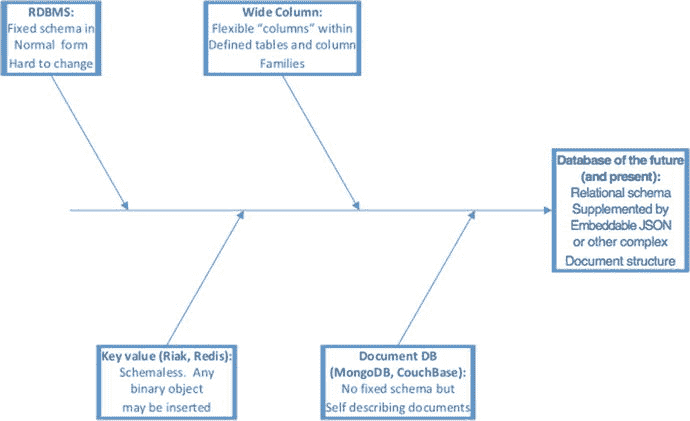

图 12-3.

一种可能的收敛模式模型

##### 数据库语言

`Codd` 对关系数据库的定义并未指定 `SQL` 语言，一个形式上的关系数据库完全有可能使用其他语言。然而，随着时间的推移，单一跨平台数据访问语言的优势变得显而易见，整个行业团结在 `SQL` 周围。

“`NoSQL`”这个术语是不幸的，因为它暗示了对 `SQL` 语言的拒绝，而不是数据库技术变革核心中更根本的问题。然而，确实有很多情况下 `SQL` 与这些新系统不兼容或不合适，这些系统通常支持第 11 章中描述的低级 `API` 的逐条记录处理。

今天，`SQL` 已重新获得其作为数据库世界通用语的地位，并且似乎很清楚，大多数数据库都将允许 `SQL` 查询，无论是像 `Couchbase` 的 `N1QL` 那样原生支持，还是通过像 `Apache Drill` 这样的 `SQL` 处理框架。即使对于那些不能原生支持全部 `SQL` 操作的数据库，我们也可以看到简化版的 `SQL` 语法提高了可用性和程序员效率：例如，比较一下 `HBase` 提供的 `API` 与 `Apache Cassandra CQL` 提供的类似 `SQL` 的接口（两者都在第 11 章中描述）。

当前统一数据库面临的新兴挑战，与其说是为非关系系统提供 `SQL` 访问，不如说是允许对关系系统进行非 `SQL` 访问。虽然 `SQL` 语言可以满足广泛的数据查询需求，但它并不总是最合适的语言。特别是，有些数据科学问题可能需要更低级别的 `API`，例如 `MapReduce`，或者更复杂的有向无环图（`DAG`）算法。我们还看到图遍历操作不能轻易用 `SQL` 指定，而可以用 `Gremlin` 或 `Cypher` 等替代语法更轻松地表达。

关系模型的一个正式原则是，不应允许绕过基于集合的查询语言（例如 `SQL`）。这在 `Codd` 的第 13 条规则（`nonsubversion`，非支配性）中有明确规定。然而，如果关系数据库希望在所有领域保持相关性，可能有必要放宽这条规则，或者在 `SQL` 基础之上提供替代的处理 `API`。


此外，当混合数据库主要将数据存储在嵌入式 JSON 结构中而非关系表中时，要求使用 SQL 语法来导航这些 JSON 文档可能显得笨拙。采用更接近`MongoDB`原生风格的 API 可能更为合适。将查询表达为通过`REST`接口推送到数据库的 JSON 文档（如同现有 JSON 文档数据库的做法）或许是可取的。

事实上，部分关系数据库厂商已经提供了上述描述的大部分功能。本章后续将探讨`Oracle`如何支持 JSON `REST`查询及`Cypher`图语言。图 12-4 展示了数据库语言与 API 融合的愿景。

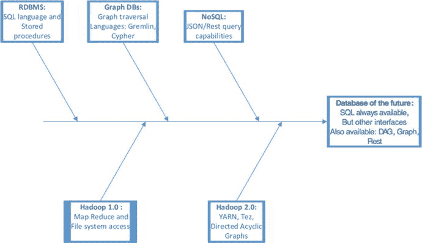
图 12-4.
数据库语言可能的融合路径

##### 存储

磁盘或其他持久化介质上的数据结构对数据库性能和经济性具有巨大影响。第 7 章讨论了在多层存储（内存、固态硬盘、磁盘、`HDFS`）中进行数据分层的必要性。我们在第 6 章也看到，数据的列式表示如何能为分析型数据库带来显著改进。最后，第 10 章揭示了传统`RDBMS`中占据主导地位的`B 树`索引结构，对于写密集型工作负载而言，可能不如`Cassandra`和`HBase`的日志结构合并树架构。

因此，如同我们技术决策树上的其他分叉一样，不存在一种适用于所有工作负载的唯一正确的存储布局。如今，我们通常必须选择原生支持最适合我们应用程序存储布局的数据库。

当然，数据库底层的存储机制对应用程序是隐藏的：检索数据的访问方法必须反映数据的模式表示，但磁盘上的结构通常对应用程序是不透明的。此外，我们已经看到能够维护多个存储引擎的数据库：`MySQL`拥有可插拔存储引擎接口已超过 10 年，`MongoDB`最近也宣布了支持多种替代存储引擎的可插拔存储架构。

在诸如`Hana`的系统中，我们还能看到根据预期工作负载需求为特定表选择行式或列式存储的能力。

这种可插拔——或至少是“可选择”——的存储引擎架构，似乎是未来数据库发展的正确方向。我相信，这些数据库应允许将表或集合管理为列式或行式，由`B 树`或日志结构合并树提供支持，驻留于内存或存储在磁盘上。在某些情况下，我们甚至可能希望将数据存储为原生图格式，以支持实时图遍历（尽管在大多数情况下，将图计算引擎层叠在限制较少的结构上已足够）。图 12-5 展示了可插拔存储引擎的愿景。

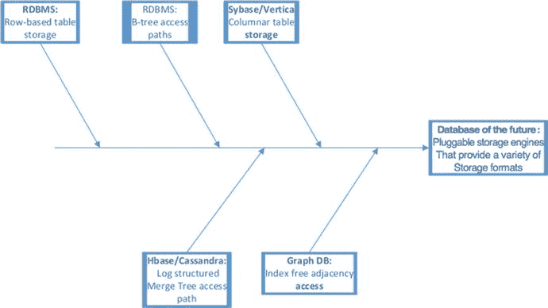
图 12-5.
数据库存储的融合选项

#### 融合数据库的愿景

通过整合数据库技术各个方面的融合愿景，我得以勾勒出理想数据库管理系统的特征。关键要求可总结如下：

> 理想的数据库架构应在单一系统内支持多种数据模型、语言、处理范式和存储格式。那些要求特定数据库功能的应用程序需求，应通过单一数据库管理系统内的配置选项或可插拔特性来解决，而非从不同的数据库架构中进行选择。

具体而言，一个理想的数据库架构将：


*   支持一个**可调的一致性模型**，该模型允许严格的 RDBMS 风格的 ACID 事务、Dynamo 风格的最终一致性，或介于两者之间的任何一点。
*   通过允许数据广泛地由关系模型表示，同时也允许应用可扩展的模式（可能通过支持嵌入式 JSON 数据类型），为一种可扩展但关系兼容的模式提供支持。
*   支持多种语言和 API。SQL 似乎注定将保持其作为主要数据库访问语言的地位，但应辅以图查询语言（如 Cypher）、基于 REST 的文档式查询，以及能够用 MapReduce 或其他 DAG 算法表达处理过程的能力。
*   成为一种底层的可插拔数据存储模型，允许数据的物理存储基于合适的行式或列式存储，并在磁盘上以 B 树、日志结构合并树或其他最优存储结构实现。
*   支持一系列分布式可用性和一致性特性。特别是，在发生网络分区的情况下，应用程序应能决定所支持的可用性和一致性级别，并能够对数据在可能全球分布式系统中的复制进行微调。

#### 与此同时，在 Oracle 总部……

Oracle，当然是第一家将关系数据库技术商业化的公司，因此可能被期望在维持 RDBMS 现状方面拥有最大的既得利益。在某种程度上，这没错：Oracle 继续主导着 RDBMS 市场，并积极倡导 SQL 和关系模型。

然而，在幕后，可以说 Oracle 在追求我之前概述的融合数据库未来愿景方面，与其他任何厂商一样接近。特别是，Oracle 已经：

*   提供了其基于 Hadoop 的集成系统：Oracle 大数据一体机。该大数据一体机包含了 Cloudera 发行版的 Hadoop（包括 Spark）。它还通过将谓词过滤下推到数据节点（使用最初为 Oracle Exadata RDBMS 一体机创建的技术），整合了显著的性能创新。Oracle 还提供了连接器，以促进大数据一体机与 Oracle RDBMS 之间的数据移动，以及 Oracle Big Data SQL，它允许来自 Oracle RDBMS 的 SQL 以 Oracle 大数据一体机中保存的数据为目标。
*   在 RDBMS 中提供了对嵌入式 JSON 的非常强大的支持。JSON 文档可以存储在`LOB`（见下一节）或字符列中，并可以使用对 SQL 的扩展来检索。数据库中的 JSON 也可以通过基于 REST 的 JSON 查询 API——简单 Oracle 文档访问 (`SODA`)——直接访问。该 API 与 MongoDB 查询 API 非常相似。
*   提供 Oracle REST 数据服务 (`ORDS`)，它也提供了对关系表中数据的基于 REST 的接口。这为使用嵌入在 REST 调用中的 JSON 查询文档来检索表数据提供了非 SQL 的 API，类似于`SODA`支持的基于 JSON 的查询语言。
*   增强了其图计算引擎。新的 Oracle 图功能将允许使用`OpenCypher`（由 Neo4j 首创的图语言）对存储在 RDBMS 或大数据一体机中的任何数据执行图分析。
*   支持一种无共享的分片分布式数据库，它提供了一种替代的分布式数据库模型，与共享磁盘的 RAC 集群数据库架构相比，可以支持更具线性可扩展性的 OLTP 解决方案。

让我们更详细地看看其中一些产品。

##### Oracle JSON 支持

Oracle 允许将 JSON 文档存储在 Oracle `LOB`（长对象）或字符列中。Oracle 提供了一个检查约束，可用于确保这些列中的数据是有效的 JSON 文档：

```
CREATE TABLE ofilmes
(
  id              INTEGER PRIMARY KEY,
  json_document   BLOB
  CONSTRAINT ensure_json CHECK (json_document IS JSON)
)
```


###### Oracle JSON 与 REST 访问功能

Oracle 在其 SQL 方言中支持用于查询 JSON 文档的函数。具体包括：

*   `JSON_QUERY` 返回 JSON 文档的一部分；它使用类似于 XML 中 XPATH 的 JSON 路径表达式。
*   `JSON_VALUE` 类似于 `JSON_QUERY`，但返回 JSON 文档中的单个元素。
*   `JSON_EXISTS` 确定特定元素是否存在于 JSON 文档中。
*   `JSON_TABLE` 将部分 JSON 投影为关系表。例如，`JSON_TABLE` 可用于将 JSON 文档的每个子元素投影为不同的虚拟行。

接下来的示例使用第 11 章出现的“films” JSON 文档集合来说明 MongoDB 和 Couchbase 查询。为了唤起记忆，这些文档看起来像这样：
```json
{
  "Title": "ACE GOLDFINGER",
  "Category": "Horror",
  "Description": "A Astounding Epistle of a Database Administrator And a Explorer who must Find a Car in Ancient China",
  "Length": "48",
  "Rating": "G",
  "Actors": [
    {
      "First name": "BOB",
      "Last name": "FAWCETT",
      "actorId": 19
    },
    ... ...
    {
      "First name": "CHRIS",
      "Last name": "DEPP",
      "actorId": 160
    }
  ]
}
```

可以使用简单的点符号来展开 JSON 结构（例如 `o.json_document.Title`），而 `JSON_QUERY` 可以返回文档内选定路径的完整 JSON 结构。在此示例中，`JSON_QUERY` 返回 actors 嵌套文档。
```sql
SQL> SELECT o.json_document.Title,
  2         JSON_QUERY(json_document, '$.Actors') actors
  3    FROM "ofilms" o
  4   WHERE id = 4
  5  /
TITLE
------------------------------------------------------------
ACTORS
------------------------------------------------------------
AFFAIR PREJUDICE
[{"First name":"JODIE","Last name":"DEGENERES","actorId":41}
,{"First name":"SCARLETT","Last name":"DAMON","actorId":81} ...
```

在关系上下文中，将嵌套 JSON 文档作为字符串返回没有帮助，因此这里我们可以使用 `JSON_TABLE` 为每个演员返回一行。以下是一个查询，返回电影标题以及电影中所有演员的姓名：
```sql
SQL> SELECT f.json_document.Title,a.*
  2    FROM "ofilms" f,
  3         JSON_TABLE(json_document,'$.Actors[*]'
  4                    COLUMNS("First" PATH '$."First name"',
  5                            "Last" PATH '$."Last name"')) a
  6   WHERE id=4;

TITLE                First           Last
-------------------- --------------- ---------------
AFFAIR PREJUDICE     JODIE           DEGENERES
AFFAIR PREJUDICE     SCARLETT        DAMON
AFFAIR PREJUDICE     KENNETH         PESCI
AFFAIR PREJUDICE     FAY             WINSLET
AFFAIR PREJUDICE     OPRAH           KILMER
```

该查询从单个电影文档中返回了五行，因为该文档的演员数组中有五位演员。`JSON_TABLE` 大致相当于 N1QL 中的 `UNNEST` 子句或 Apache Drill 中的 `FLATTEN` 子句（两者均在第 11 章中讨论过）。

###### 通过 Oracle REST 访问 JSON

JSON 文档和集合完全可以在不使用 SQL 的情况下，通过基于 REST 的简单 Oracle 数据访问 (SODA) 协议创建、操作和检索。

虽然可以在没有任何基于 SQL 的数据定义语言语句的情况下创建集合，但底层实现如我们在上一节所讨论的——会创建一个包含 LOB 的数据库表来存储 JSON 文档。

无论集合是通过 REST API 还是通过 SQL 创建的，都可以使用 REST 调用来查询文档。例如，图 12-6 显示了一个检索 ID 为 4 的文档的 REST 命令：
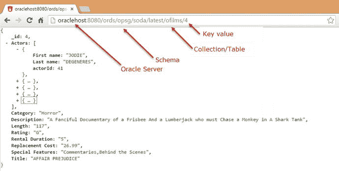
**图 12-6.** Oracle REST JSON 查询按 ID 获取行

REST SODA 接口可用于执行 CRUD（创建、读取、更新、删除）操作。向“集合”添加“文档”会在表中创建新行。

该接口还支持一个查询机制，可用于检索符合任意过滤条件的文档。图 12-7 说明了使用此接口的一个简单 REST 查询（使用可用于原型化 REST 调用的 Google Chrome “Postman” 扩展）。
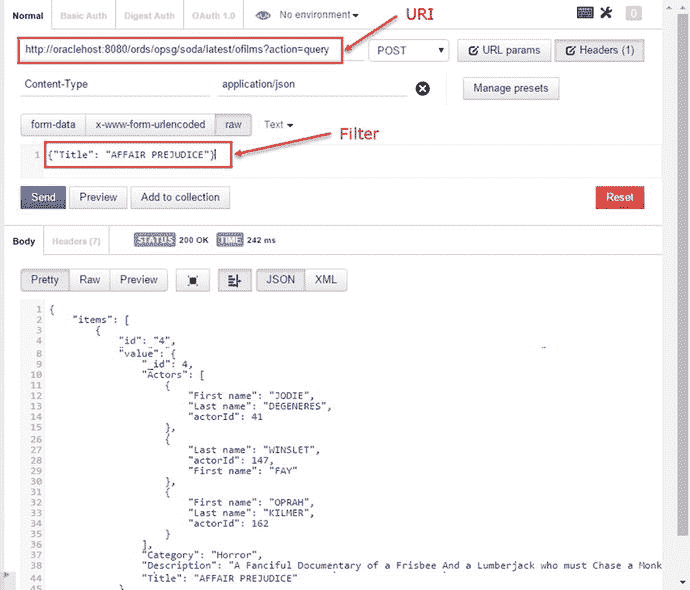
**图 12-7.** 简单的 SODA REST 查询

JSON 文档过滤语法与 MongoDB 提供的语法极其相似。事实上，Oracle 开发人员有意为 MongoDB 和其他文档数据库用户提供熟悉的体验。

图 12-8 展示了一个更复杂的查询，我们搜索时长超过 60 分钟、评级为 G 的电影，并按长度降序排序。
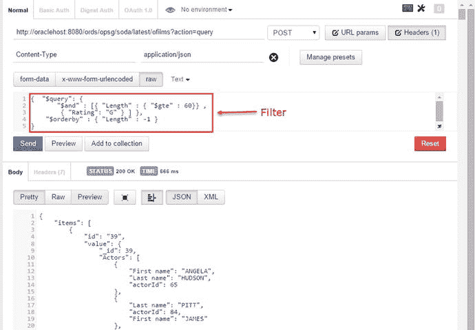
**图 12-8.** 复杂的 Oracle REST 查询

###### 对 Oracle 表的 REST 访问

Oracle REST 数据服务 API 也为关系表提供了 REST 接口。该机制与我们之前检查的 JSON SODA 接口几乎相同。

在图 12-9 中，我们看到一个 REST 查询从 Oracle `CUSTOMERS` 表中检索数据，在 HTTP 字符串中提供了一个简单的查询过滤器。
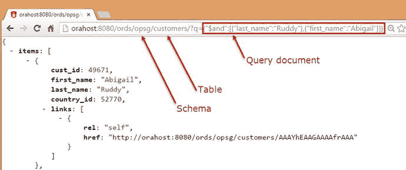
**图 12-9.** 用于表查询的 Oracle REST 接口

##### Oracle Graph

Oracle 长期以来在其 Oracle Spatial and Graph 选项中支持基于 RDF 的图功能。该选项基于第 6 章概述的 RDF W3C 标准。然而，尽管此功能提供了一些重要的图能力，但它不如 Neo4J 等流行属性图数据库所提供的功能全面。

正如您可能从第 6 章回忆起的，RDF 系统是三元组存储的一个例子，它表示节点之间相对简单的关系。相比之下，属性存储表示节点之间的关系，但也允许模型在节点和关系中存储重要信息（属性）。虽然 RDF 图为本体的开发和分布式数据源提供强大支持，但属性图通常对自定义应用程序开发更具吸引力，因为它们提供更丰富的数据模型。

Oracle 最近集成了一个属性图计算引擎，可以对保存在 Oracle RDBMS、Oracle 大数据 Hadoop 系统或 Oracle 自己的 NoSQL 系统中的任何数据执行图分析。该计算引擎支持 openCypher 图语言。Cypher 是最流行的专用图数据库引擎 Neo4J 中实现的语言，openCypher 已作为该语言的开源版本提供。

Oracle 的实现并不代表原生图数据库存储引擎。正如您可能从第 6 章回忆起的，原生图数据库必须实现无索引邻接，有效地在基础存储中实现图结构。相反，Oracle 实现了一个图计算引擎，能够将各种格式的数据加载到内存中，在其中进行图分析。这种方法的好处是图分析可以应用于以任何现有格式保存的数据，前提是该格式可以作为图进行导航。许多现有的关系模式实际上确实实现了图关系。例如，一个典型的组织模式将有从员工到其经理的外键，这可以表示为一个图。

##### Oracle Sharding


###### Oracle 分片

Oracle 分片是 Oracle 数据库中一个相对较新的特性，于 2015 年底宣布。Oracle 长期以来一直提供分布式数据库集群能力。早在 20 世纪 90 年代初，Oracle 就提供了 `Oracle Parallel Server`——一种共享磁盘集群数据库。这种数据库集群技术最终演变为 `Oracle Real Application Clusters (RAC)`，它被广泛采用，并代表了共享磁盘数据库集群模型最重要的实现。我们在第 8 章更详细地讨论了共享磁盘数据库集群。

然而，`RAC` 的集群架构更适合数据仓库工作负载，而不是大规模可扩展的 `OLTP`。对于写入密集型工作负载，`RAC` 的大规模扩展变得有问题，因为维护内存中数据一致性视图的开销会导致私有数据库网络中出现过多的“ chatter ”。因此，典型的 `RAC` 集群只有很少的节点——绝大多数少于 10 个。

Oracle 分片选项允许将 `OLTP` 工作负载部署在多达 1,000 个独立的 Oracle 实例上，使用的架构类似于第 3 章回顾的 MySQL 自建分片，也与第 8 章探讨的 MongoDB 分片架构非常相似。

图 12-10 展示了 Oracle 分片架构的表示。协调器数据库 (1) 包含描述键如何在分片中分布的目录。每个分片由一个独立的 Oracle 数据库实例实现。包含分片键的查询可以直接发送到相关的数据库实例 (3)；分片目录知道分片映射，并可以向应用程序提供适当的连接详细信息 (4)。未指定分片键或在多个分片上聚合的查询 (5) 由充当代理的协调器数据库调解。协调器数据库将查询发送到各个分片以检索必要的数据 (6)，然后聚合或合并数据以返回适当的结果集。

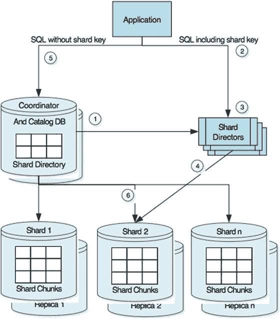

图 12-10. Oracle 分片

Oracle 分片支持的分布方案类似于 Oracle 现有表分区产品支持的方案。数据可以通过哈希、分片键范围或分片键值列表跨分片进行分区。还有一种复合方案，其中数据主要按列表或范围分区，然后根据第二个分片键进行哈希。使用哈希分区时，Oracle 可以通过随着数据量变化或节点添加到分片系统或从中移除而重新分发分片块来自动确定负载均衡。范围或列表分区需要用户进行分片均衡。

每个分片可以使用 Oracle 复制技术 (`DataGuard` 或 `Goldengate`) 进行复制。副本可用于满足读取请求，但这可能要求应用程序显式地从副本而不是主副本请求数据。

不符合分片键或相对较小的表可以在每个分片上复制，而不是跨整个集群分片。例如，`products` 表可能被复制到所有分片，而其他数据则通过客户 ID 进行分片。

与所有分片方案一样，Oracle 分片打破了传统 `RDBMS` 提供的一些常规保证。虽然支持跨分片连接，但不能保证结果的时间点一致性。跨分片的事务仅在分片内是原子的——分布式事务没有两阶段提交。

##### Oracle 作为混合数据库

看到 Oracle 采用了明显旨在让 MongoDB 用户感到熟悉的 `JSON` 接口，并最终采用了承认无共享架构在某些工作负载上优越性的分布式数据库策略，这令人惊讶，甚至可能有点好笑。但对我而言，看到领先的 `RDBMS` 供应商从替代方法中学习是令人鼓舞的。

然而，Oracle 尚未尝试解决未来集成数据库面临的关键挑战之一：在网络可能出现分区时，平衡一致性和可用性。

Oracle 的 `RAC` 集群数据库在网络分区的情况下明确选择一致性而非可用性：在“脑裂”场景中，Oracle `RAC` 集群中被隔离的实例将被驱逐或自愿关闭，而不是继续以不一致的状态运行。Oracle 分片为在线系统提供了潜在的更好的解决方案——理论上，在网络分片期间，分片数据库的某些部分可能在每个分区中继续可用。然而，只有一部分选定的分片将在每个分区中可用，并且没有机制来协调不一致。此外，在分片模型中，事务完整性——即使整个数据库可用——也不能得到保证。例如，跨分片的事务或查询可能表现出不一致的行为。

事务型关系数据库在网络分区面前保持可用性的一种模式，可能需要在 `ACID` `RDBMS` 系统中实现的事务行为与 `Dynamo` 风格的最终一致性之间进行某种合并。

在 `RDBMS` 领域，Oracle 并非唯一采用 `JSON` 或对非关系范式感兴趣的公司。Oracle 的人们是真诚地试图将其旗舰数据库产品推向未来，还是仅仅试图削弱新兴竞争对手的势头，还有待观察。但很明显，大量的精力正投入到工程特性上，这些特性将 `Oracle` `RDBMS` 从其传统的 `RDBMS` 根基上转移开。至少，其中一些特性暗示了融合数据库系统可能的行为方式。

#### 其他融合数据库

还有其他一些尝试融合关系和非关系模型的案例值得在此提及：


##### 数据库技术的未来：统一与颠覆

*   `NuoDB` 是一个基于 SQL 的关系型系统，它利用事务的乐观异步传播，在分布式环境下实现了接近 `ACID` 的一致性。这种方法可能导致与严格 `ACID` 一致性的轻微偏差：集群中的所有副本不会同时更新。与 `Dynamo` 系统的方式有些类似，用户可以调整所需的一致性级别。`NuoDB` 还将存储层与事务层分离，支持可插拔的存储引擎架构。
*   `Splice Machine` 在一个由 `HBase` 管理的存储系统之上构建了一个关系兼容的 SQL 层。虽然其主要目标是利用 `HBase` 的可扩展性来提供一个更具经济效益的可扩展 SQL 引擎，但它也支持混合数据访问，因为数据可以直接通过 `MapReduce` 或 `YARN` 从 `HBase` 检索，也可以通过关系层的 SQL 进行访问。
*   `Cassandra` 在其当前版本中增加了对 `JSON` 的强大支持，并且正在其商业版本中集成一个图形计算引擎。`Dynamo` 的可调一致性模型，加上 `Cassandra` 的轻量级事务特性，覆盖了比其他非关系型竞争者更广泛的事务场景。然而，目前没有支持完整 SQL 或多对象 `ACID` 事务的路线图。
*   `Apache Kudu` 旨在构建一个同等支持全表扫描和基于记录访问模式的非关系型系统。其技术方法涉及结合基于内存的行存储和基于磁盘的列式存储。其明确意图是弥合 `HDFS` 在完整“表”扫描性能与 `HBase` 行级访问性能之间的差距。这本身并不能提供真正的混合解决方案，但与 `Apache Impala` 结合使用，可以提供一个支持 SQL 的数据库，同时提供键值式访问和 `Hadoop` 兼容性。然而，目前尚无多行事务的计划。

###### 颠覆性的数据库技术

到目前为止，我描述的是一个数据库技术在最近出现分化之后，将朝着某种“统一模型”数据库方向融合的未来。

推断现有技术是一项有用的消遣，而且通常是唯一可用的预测技术。然而，历史告诉我们，技术并不总是沿着现有轨迹发展。颠覆性技术会出现，它们带来的不连续性无法被推断，也无法总是被完全预见。

颠覆性的新数据库技术可能即将出现，但同样可能的是，过去十年间数据库技术发生的巨大变化，已经代表了我们所能轻易接受的最大程度的变革。

尽管如此，有一些计算技术趋势超越了数据库架构，并可能严重影响未来的数据库。

###### 存储技术

自从数字数据库诞生以来，速度经济和存储经济之间就一直存在强烈的冲突。提供最大存储经济效益（用于存储大量数据）的介质（磁盘、磁带）伴随着最慢的速度，因此对吞吐量和延迟的经济性最差。相反，提供最低延迟和最高吞吐量（内存、`SSD`）的介质，每单位存储成本最昂贵。

正如在第 7 章中所指出的，虽然 `SSD` 的每 `TB` 价格在稳步下降，但磁盘的每 `TB` 价格也在下降。推断表明，`SSD` 在短期内不会显著便宜于磁盘用于大容量存储。即使 `SSD` 的价格与磁盘持平，内存与 `SSD` 之间的性价比差异仍然将是决定性的：内存的速度仍然比 `SSD` 快许多数量级，但每 `TB` 的价格也昂贵许多数量级。

只要这种经济差异持续存在，我们将被鼓励采用使用不同存储技术的数据库架构，以优化“慢速”数据的经济性和“快速”数据的经济性。像 `Hadoop` 这样的系统将继续优化每 `TB` 的成本，而像 `HANA` 这样的系统将试图最小化提供高吞吐量或低延迟的成本。

然而，如果出现一种技术，能同时为大规模存储和延迟提供可接受的经济效益，那么我们可能会看到数据库架构几乎立即的转变。这种通用内存将提供相当于 `RAM` 的访问速度，同时兼具磁盘的持久性、持久性和存储经济性。

大多数技术专家认为，这种颠覆性的存储技术还需要几年时间才会出现，但鉴于持续的大量投资，我们最终很可能会创造出一种持久、快速且经济的存储介质，能够满足所有数据库工作负载的需求。当这种情况发生时，我们今天看到的许多数据库架构将失去其存在的关键理由。例如，如果持久存储（即磁盘）能像内存一样快，那么 `Spark` 和 `Hadoop` 之间的差异就会变得微乎其微。

一些重要的新存储技术即将出现，包括忆阻器和相变内存。然而，这些新技术似乎都不太可能立即实现通用内存的愿景。

###### 区块链

过去几年你如果没听说过比特币，那你一定是生活在岩石下。比特币是一种电子加密货币，在许多网络交易中可以像现金一样使用。在撰写本文时，大约有 1500 万个比特币在流通，每个交易价格约为 360 美元，总价值约为 53 亿美元。

比特币结合了点对点技术和公钥密码学。比特币的所有者可以使用私钥来主张所有权并授权交易；其他人可以使用公钥来验证交易。与其他点对点系统（如 `Bittorrent`）一样，没有中央服务器维护比特币交易；而是有一个名为区块链的分布式公共账本。

加密货币的影响远超本文范围，但区块链概念对数据库技术有明确的影响。区块链取代了通常必须调解任何资金转移的可信第三方。不是由集中式数据库记录交易并对各方进行身份验证，区块链允许交易和身份通过区块链网络的共识进行验证；也就是说，每笔交易在达成之前，都通过基于公钥的身份验证由多个节点确认。

比特币底层的区块链是公开的，但也可能存在私有（或许可）区块链，这些区块链是“仅限邀请”的。无论是私有还是公有，区块链可以说代表了一种新型的共享分布式数据库。与基于 `Dynamo` 模型的系统一样，区块链中的数据在大量主机上冗余分布。然而，区块链代表了数据库中权限管理方式的完整范式转变。在现有的数据库系统中，数据库所有者对数据库中保存的数据拥有绝对控制权。然而，在区块链系统中，所有权由数据的创建者维护。


试想一个维护着类似 Facebook 社交网络的数据库：尽管应用程序被设计为只允许你修改自己的帖子或个人详情，但现实情况是 Facebook 公司实际上完全控制着你的在线数据。那里的员工——如果他们愿意——可以删除你的帖子、审查你的帖子，甚至在他们真想这么做时修改你的帖子。而在基于区块链的数据库中，你将完全拥有自己帖子的所有权，任何其他实体都不可能修改它们。

基于区块链的应用有潜力颠覆广泛的社交和经济活动。资金转移、财产、全球身份管理（护照、出生证明）、投票、许可证、遗嘱、健康数据以及海量的其他交易数据，未来都可能由区块链来监管。目前维护这些类型交易记录的数据库可能会变得过时。

大多数数据库所有者可能希望保持对数据库中数据的控制权，因此区块链在短期内不太可能彻底改变数据库技术。然而，数据库系统确实很可能会针对特定的应用场景，实施基于区块链的身份验证和授权协议。此外，基于区块链基础构建的正式数据库系统似乎也即将出现。

##### 量子计算

量子物理学的起源可以追溯到 100 多年前，当时人们认识到能量是由离散的包或量子组成的。

到 20 世纪 30 年代，量子物理学中大多数令人难以置信的理论已被充分阐明。在著名的双缝实验中，单个光子似乎同时通过多个缝隙，前提是没有被观测。这些光子处于多重状态的叠加态。试图测量光子的路径会导致它们坍缩成单一状态。光子可以发生纠缠，在这种情况下，一个光子的状态可能与另一个原本无关的粒子的状态有着不可分割的联系——这被阿尔伯特·爱因斯坦称为“幽灵般的超距作用”。

正如尼尔斯·玻尔那句名言所说：“如果你没有对量子力学感到深刻震惊，那说明你还没理解它。”量子物理学的传统观点是，多重同时存在的概率直到被有意识的观察者感知时才会坍缩确定下来。这种哥本哈根诠释是著名的 `薛定谔的猫` 思想实验的基础，在该实验中，一只猫在一个精巧的量子装置中，当未被观测时，会同时处于死和活的状态。有人推测其实是薛定谔的狗提出了这个实验。¹

各种量子诠释所无可否认的、令人难以置信的怪异性，对现实世界技术确实有着重大影响：大多数现代电子产品都直接或间接地由量子理论赋能，在计算领域尤其如此，那里硅电路日益增长的密度使我们越来越接近量子效应占主导的“极小领域”。

利用量子效应来创造一种新型计算机的想法，在 20 世纪 80 年代由物理学家理查德·费曼推广开来。其核心概念是使用亚原子粒子行为作为计算的构建基础。本质上，当今物理计算机的逻辑门和硅基构建模块，将被涉及亚原子层面叠加和纠缠的机制所取代。

量子计算机有望提供一种机制，以跨越硅基技术的限制，并彻底革新密码学带来了可能。量子计算机能够破解现有私钥/公钥加密方案的预言似乎越来越可能成为现实，而量子密钥传输已经提供了一种防篡改机制，可在数百公里范围内传输证书。

如果量子计算实现了其理论潜力，它将对计算的所有领域——包括数据库——产生巨大影响。也有一些针对数据库的特定量子计算提议：

*   量子事务：受叠加概念的启发，有人提议数据库中的数据可以保持在一种“量子”状态，有效地表示多种可能的结果。当被“观测”时，这些多重状态会坍缩成一种结果。例如，飞机上的座位分配可以表示为所有可能座位安排的总和，当最终座位分配确定时，这种叠加会“坍缩”；坍缩可以通过各种座位偏好来调节：请求坐在一起，或要求靠过道或靠窗的座位。这种方法利用了量子概念，但不需要量子计算基础设施，尽管量子计算机可以在潜在的大规模上实现此类操作。²
*   量子搜索：量子计算机有可能为传统数据库提供搜索性能的加速。量子计算机可以更快地执行全表扫描，为复杂的非索引搜索项找到匹配的行。³ 当传统磁盘访问是限制因素时，这种改进不太可能是决定性的，但对于内存数据库，量子数据库搜索有可能成为一项实用的创新。
*   量子查询语言：在经典（即非量子）计算机中，处理的基本单位是 `比特`，它表示两种二进制状态之一。在量子计算机中，处理的基本单位是 `量子比特`，它表示一个 `比特` 所有可能状态的叠加。要持久存储来自量子计算机的信息，将需要一个真正具备量子能力的数据库，能够使用 `量子比特` 逻辑而非布尔 `比特` 逻辑执行逻辑操作。对这样的数据库进行操作，将需要一种能够表示量子操作而非 `SQL` 关系谓词的新语言。这样一种语言已被提出：量子查询语言（`QQL`）。⁴

几十年来，关于实用量子计算的承诺不断，但迄今为止，实际应用明显缺席。真正的量子计算很可能最终被证明是无法实现的，或者对于主流应用来说不切实际。但是，即使量子计算只实现了其部分目标，它也将极大地改变计算格局，数据库也难以免受其影响。

#### 结论

在本书中，我试图概述那些“打破”了 `RDBMS` 数十年主导地位的市场和技术力量。在第 1 章中，我认为没有一种万能架构能够满足多样化现代应用的所有需求。我至今仍然相信这一点。

我还想重申，我认为现代的 `RDBMS`——本质上是关系模型、`ACID` 事务和 `SQL` 语言的结合体——代表了软件工程的一项绝对胜利。`RDBMS` 彻底改变了计算、数据库管理和应用开发。我相信显而易见的是，对于最广泛的应用工作负载而言，`RDBMS` 仍然是最佳单一选择，并且它已经并将继续经受住时间的考验。


话虽如此，但同样清楚的是，上世纪 90 年代确立的**关系数据库管理系统（RDBMS）**架构，并不能为当今构建的各种应用提供一个通用的解决方案。即使它能，也显而易见，在我们所处的世界里，开发者、应用架构师、CTO 和 CIO 们正越来越多地寻求**非关系型**替代方案。作为数据库专业人士，我们有必要理解这些非关系型替代方案背后的驱动力，了解其架构，并能够对这些系统进行咨询、管理和利用。

随着我对支撑现代下一代数据库架构的技术了解得越多，我越来越相信，我们在过去 10 年里看到的数据库多样性“寒武纪大爆发”将会——或至少应该——随之迎来一个融合的时期。数据库用户面临的选择太多，而为特定应用负载选择最佳数据库时又需要太多的折衷。我们不应该为了实现网络分区容错性而牺牲多行事务能力，也不应该在希望允许应用动态演化模式元素时，将关系型这个“孩子”和洗澡水一起倒掉。因此，我期盼一个未来：这些选择将成为单一数据库架构内的配置问题，而不是在多个不尽完美的系统之间做“霍布森选择”（即别无选择的选择）。

融合的清晰迹象就在我们身边：**JSON** 被关系型系统普遍接纳；**SQL** 作为数据库访问标准语言被广泛重新采用；以及轻量级事务被引入到原本不支持事务的系统中。

在本章中，我试图概述一个理想的数据库系统为实现这种“涅槃”境界应提供的一些选项。显然，我们距离能够交付这样一个融合系统还有多年时间。但这并不妨碍一个数据库老兵继续梦想！

我谨慎而乐观地相信，融合将是未来几年塑造数据库领域的主导力量。然而，也有一些技术已初现端倪，可能迫使范式转移：**量子计算**、**区块链**和**通用内存**等等，仅举几例。

尽管存在各种折衷，以及令人眼花缭乱、往往不兼容或不一致的技术模型，但对于数据库从业者而言，这仍然是一个激动人心的时代。关系型数据库的主导时期让我们得以磨练技能并掌握一套连贯的技术栈。当今数据库专业人士面临的挑战是：理解可用的多样化技术，为工作挑选最佳、最持久的技术，并针对手头的任务优化这些技术。选择和优化正确的数据库，能够增强现代应用的能力和经济性——当这些应用被用于正当目的时，它们将帮助我们建设一个更加繁荣、仁爱和融合的全球社区。

#### 注释

```
http://bit.ly/1jowDoC
http://www.cs.cornell.edu/∼sudip/quantumdb.pdf
http://arxiv.org/pdf/quant-ph/0301079v1.pdf
http://arxiv.org/pdf/0705.4303v1.pdf
```

### 13. 数据库概览

在本附录中，我提供了本书涵盖的主要数据库系统的简要描述。

目前有大量数据库管理系统在使用中：`DB-Engines` 网站 (`http://db-engines.com/en/ranking`) 根据网站引用、搜索频率、职位发布、社交网络和 `Stack Overflow` 提及情况，对数据库系统进行流行度排名。他们追踪了超过 250 个系统，其中 100 多个获得了不俗的评分（按其排名方案，分数大于 1.0）。显然，我无法在此囊括所有系统，本附录——以及本书中——所选择的数据库，仅代表我个人对这些系统的兴趣和熟悉程度。遗漏或包含不应被解读为对系统架构或其适用性的认可或否定。在传统的数据库供应商中，我只包含了`Oracle`；第 12 章对其非关系特性的论述论证了将其纳入的理由。然而，许多其他关系型数据库供应商也在实现类似的功能（例如，`JSON`集成）。

尽管我认为数据库泛滥的时代即将结束，随之而来的将是一个整合的时代，但新的数据库系统仍然在相当频繁地推出。其中一些可能代表了重大创新，并被证明是改变游戏规则的。不过，我通常只关注那些已经活跃使用了至少几年的数据库：经验表明，许多最新的“革命性”新数据库将无法获得足够的市场吸引力。

`db-engines.com` 网站为追踪数据库的相对流行度提供了宝贵的资源。他们的排名系统更多地反映了互联网上的“热议度”，而非收入或企业采用情况，但它确实是评判数据库系统相对心智占有率的最佳单一资源。

#### Aerospike

数据库名称：`Aerospike`

许可/公司：`AGPL` 许可，由 Aerospike Corp. 商业发行

维基百科描述：
> Aerospike 是一款针对闪存优化的内存开源 NoSQL 数据库，也是开发它的公司名称。

供应商描述：
> 提供规模速度的高性能 NoSQL 数据库。

我的看法：
`Aerospike` 采用一种假设快速闪存 `SSD` 作为持久层的架构，并仅使用内存来缓存索引。

数据模型：
键-值

事务模型：
严格一致的单服务器事务，集群内最终一致

集群：
分片与复制

APIs：
`Aerospike` 查询语言 (`AQL`) 是 `SQL` 语言的一个子集，并提供大多数常见语言的驱动程序。

#### Cassandra

数据库名称：`Apache Cassandra`

许可/公司：基于 `Apache` 许可的开源软件
`Datastax` 提供企业版

维基百科描述：
> `Apache Cassandra` 是一个开源的分布式数据库管理系统，旨在跨众多商用服务器处理海量数据，提供高可用性且无单点故障。

供应商描述：
> `Cassandra` 的无主、无共享架构为其事务型/操作型数据库应用程序提供了持续的正常运行时间，以及一个能够存储现代数据类型的灵活数据模型和易于数据库管理的操作简易性。

我的看法：
`Cassandra` 最初被设想为一个能够融合谷歌 `BigTable` 和亚马逊 `Dynamo` 最佳特性的数据库系统。`Cassandra` 已在像 `Netflix` 这样的站点上实现了一些最高规模的 `NoSQL` 部署。`Cassandra` 在其 `BigTable` 和 `Dynamo` 的影响之上实现了重大创新，无疑是 `NoSQL` 领域的领导者。

数据模型：
基于 `BigTable` 的宽列模型，但通过 `Cassandra 查询语言 (CQL)` 接口提供了窄列抽象。

事务模型：
`Dynamo` 风格的可调一致性，以及基于 `Paxos` 的轻量级事务能力。

集群：
一致性哈希

APIs：
`CQL`


##### CQL

Cassandra 查询语言（CQL）是一种类 SQL 语言，提供数据查询和操作接口。CQL 抽象了底层的宽列数据模型，呈现一个更类似于关系型的表格式界面。

#### CouchBase

数据库名称：Couchbase

许可证/公司：Apache 许可证，由 Couchbase 公司提供商业支持

维基百科描述：

Couchbase Server，原名 Membase，是一个开源、分布式（无共享架构）的 NoSQL 面向文档数据库，针对交互式应用进行了优化。

供应商描述：

Couchbase Server 是一个为性能、可扩展性和可用性而设计的分布式 NoSQL 数据库。它使开发人员能够更轻松、更快速地构建应用程序，通过结合 SQL 的强大功能和 JSON 的灵活性。

我的看法：

当今的 Couchbase Server 同时源自兼容 Memcached 的 Membase 和开创性的 JSON 数据库 CouchDB。Couchbase Server 仍然同时支持键值对和文档范式。`N1QL`——一种用于文档的 SQL 语言——的引入，帮助 Couchbase 与其他领先的文档数据库`MongoDB`区分开来。

数据模型：

键值对和 JSON

事务模型：

单文档事务的强一致性

集群：

分片和复制

API：

基于 REST 的 API，提供 Java 和其他语言的驱动程序，以及用于处理文档的`SQL`语言`N1QL`。

#### DynamoDB

数据库名称：DynamoDB

许可证/公司：亚马逊

维基百科描述：

Amazon DynamoDB 是亚马逊公司作为亚马逊网络服务组合一部分提供的完全托管的专有 NoSQL 数据库服务。

供应商描述：

Amazon DynamoDB 是一个快速且灵活的 NoSQL 数据库服务，适用于所有需要在任何规模下保持一致、个位数毫秒延迟的应用程序。它是一个完全托管的云数据库，支持文档和键值存储模型。

我的看法：

亚马逊发明了 Dynamo 模型并提供占主导地位的公共云平台，因此基于 Dynamo 模型提供云数据库是自然而然的事情。DynamoDB 提供高性能、几乎无限的扩展性和非常低的管理开销。然而，对亚马逊的锁定和相对较高的价格可能限制了其当前的市场采用率。

数据模型：

支持列表、映射和 JSON 文档的键值存储。支持二级索引。

事务模型：

默认为最终一致，但应用程序可以请求一致性读取

集群：

一致性哈希

API：

基于 REST 的 API，提供 Java、.NET 和 PHP 的驱动程序

#### HBase

数据库名称：Apache HBase

许可证/公司：Apache 许可证，由 Cloudera、MapR、Hortonworks 等公司提供商业支持

维基百科描述：

HBase 是一个开源、非关系型、分布式数据库，仿照谷歌的 BigTable 并用 Java 编写。它作为 Apache 软件基金会的 Apache Hadoop 项目的一部分开发，运行在`HDFS`（Hadoop 分布式文件系统）之上，为 Hadoop 提供类似 BigTable 的功能。

供应商描述：

HBase 是为 Apache Hadoop 构建的高性能、分布式数据存储。

我的看法：

HBase 通过与 Hadoop 平台的关联实现了早期的市场渗透和技术加速，并已在许多站点的大规模环境中得到验证。与 Hadoop `HDFS`的紧密集成有助于其实现非常高的可用性，并为大数据分析提供了内置的协同效应。

数据模型：

BigTable 宽列族

事务模型：

严格一致的单行事务

集群：

范围键被分区到区域中，主服务器跟踪此分区。在磁盘级别，HBase 使用`HDFS`进行分发和复制。

API：

REST 和 Thrift 接口，附带 Java 驱动程序

#### MarkLogic

数据库名称：MarkLogic

许可证/公司：专有，MarkLogic 公司

维基百科描述：

MarkLogic 被认为是一种多模型 NoSQL 数据库，因为它能够存储、管理和搜索 JSON 和 XML 文档以及图数据（RDF 三元组）。

供应商描述：

MarkLogic 是一个新一代数据库，它采用灵活的数据模型构建，用于存储、管理和搜索当今的数据，同时不牺牲上一代关系数据库的数据弹性和一致性特性。

我的看法：

在我们现在称之为 NoSQL 数据库出现之前，MarkLogic 已经构建了一个功能强大且广泛采用的 XML 数据库。MarkLogic 最近增加了对 JSON 的支持，现在定位为一个组织级的 NoSQL 数据库。

数据模型：

XML， RDF， JSON

事务模型：

严格一致

集群：

分片

API：

`XQuery`， `XSLT`， `SPARQL`， REST

#### MongoDB

数据库名称：MongoDB

许可证/公司：GNU AGPL， Apache 许可的驱动程序。由 MongoDB 公司提供商业支持。

维基百科描述：

MongoDB（源自"巨大"一词）是一个跨平台的面向文档数据库。被归类为 NoSQL 数据库，MongoDB 摒弃了传统的基于表的关系数据库结构，转而采用具有动态模式的类 JSON 文档（MongoDB 将格式称为`BSON`），这使得在某些类型的应用程序中集成数据更容易、更快捷。

供应商描述：

MongoDB 是一个开源的文档数据库，旨在便于开发和扩展。MongoDB 提供高性能、高可用性和自动扩展。

我的看法：

MongoDB 在 NoSQL 采用方面建立了强大的领先优势，这得益于其在 Web 开发人员中的流行，在该领域，该数据库已经取代`MySQL`成为基于现代开源框架构建的网站的默认选择。

数据模型：

JSON 文档

事务模型：

单文档事务默认严格一致

集群：

哈希或范围分片，带主节点

API：

JavaScript 查询 API，提供 Java、.NET、Python 和其他语言的驱动程序

#### Neo4J

数据库名称：Neo4J

许可证/公司：GPL/AGPL，由 Neo Technology 公司提供商业支持

维基百科描述：

Neo4j 是一个用 Java 实现的开源图数据库，其他语言编写的软件可以通过`Cypher`查询语言通过事务性 HTTP 端点访问。

供应商描述：

Neo4j 是世界领先的图数据库。

我的看法：

Neo4J 代表了使用最广泛的属性图数据库。Neo4J 的`Cypher`编程语言的开源版本可能成为一个标准。

数据模型：

属性图

事务模型：

严格一致

集群：

主从复制

API：

`Cypher`图编程语言，提供大多数编程语言的驱动程序

#### NuoDB

数据库名称：NuoDB

许可证/公司：专有，由 NuoDB 公司提供

维基百科描述：

NuoDB 是一种在云中工作的新 SQL 数据库。它既可以用于单供应商，也可以用于多供应商的云设置。

供应商描述：

NuoDB 革命性的持久分布式缓存（`DDC`）架构结合了传统关系数据库管理系统的强大功能——丰富的`ANSI SQL`支持、完整的`ACID`事务、用于安全、备份和管理的组织级工具——以及对跨多个数据中心弹性扩展和持续可用性的支持。

我的看法：

NuoDB 是构建符合`ACID`的分布式 SQL 数据库的一次重要尝试。它包含一个可调节的一致性模型和一个可插拔的存储引擎架构。

数据模型：

建立在可插拔存储层之上的关系模型，该存储层可能包含非关系引擎

事务模型：

具有可调节一致性级别的`ACID`，可能导致最终一致行为

集群：

专有集群模型

API：

`SQL`，可以对底层存储引擎进行非`SQL`访问

#### Oracle RDBMS

数据库名称：Oracle database 12c

许可证/公司：甲骨文

维基百科描述：

Oracle 数据库（通常称为 Oracle RDBMS 或简称 Oracle）是由甲骨文公司生产和销售的对象关系数据库管理系统。

供应商描述：


Oracle Database 12c 引入了全新的多租户架构，能够快速整合多个数据库并将其作为云服务进行管理。它还包含内存数据处理能力，可提供**突破性的分析性能**。

我的看法：

Oracle 可以称得上是第一个成功的、基于关系模型的商业数据库，并在大约 30 年的时间里一直主导着数据库市场。

从技术地位来看，Oracle 总体上也引领着市场，开创了许多核心的 RDBMS 架构，包括行级锁、`MVCC` 和共享磁盘集群。

Oracle 提供了 Hadoop 设备和一个 NoSQL 键值存储。在其核心 RDBMS 中，它实现了许多面向文档的数据库特性，包括一个带有 `REST` 接口的 `JSON` 存储。

##### 数据模型

关系型，并支持对象类型（varrays、嵌套表等）以及内嵌的 `XML` 和 `JSON`

##### 事务模型

遵循 `ACID`，采用 `MVCC`

##### 集群

共享磁盘集群数据库（`RAC`）或分片

##### API

`SQL`，附带专有的 `PL/SQL` 存储过程语言

#### Redis

数据库名称：Redis

许可/公司：`BSD` 许可证，由 Redis Labs 提供商业支持

维基百科描述：

Redis 是一个数据结构服务器。它是开源的、基于网络的、内存中的；它存储键值，并具有可选的持久性。

厂商描述：

Redis 是一个开源的（`BSD` 许可）、内存中的数据结构存储，用作数据库、缓存和消息代理。

我的看法：

Redis 是一个流行的轻量级内存键值存储。

##### 数据模型

键值

##### 事务模型

单服务器内严格一致

##### 集群

主从复制

##### API

提供 API，并有适用于大多数常用语言的驱动程序

#### Riak

数据库名称：Apache Riak

许可/公司：Apache 开源项目，由 Basho Technologies 商业化

维基百科描述：

Riak 是一个分布式 NoSQL 键值数据存储，提供高可用性、容错性、操作简单性和可扩展性。Riak 实现了 Amazon `Dynamo` 论文的原则，并深受 `CAP` 定理的影响。

厂商描述：

Riak 是一个分布式 NoSQL 数据库，具有高可用性、可扩展性和易于操作的特点。它自动将数据分布到集群中，以确保快速性能和容错性。

我的看法：

Riak 是对 `Dynamo` 键值存储概念的一个相当纯粹的实现，同时集成了 `Solr`、时间序列扩展以及一个对象云存储产品。Riak 被广泛采用，并且技术相当成熟。

##### 数据模型

键值

##### 事务模型

`Dynamo` 可调一致性

##### 集群

一致性哈希

##### API

`REST API`，并有适用于 Java、Ruby、Python 等的驱动程序

#### SAP HANA

数据库名称：Hana

许可/公司：专有，由 `SAP` SE 生产

维基百科描述：

`SAP HANA` 是一个内存中、列式、关系型数据库管理系统，由 `SAP` SE 开发并销售。

厂商描述：

通过 `SAP HANA` 加速创新步伐——这是一个内存平台，它将一个符合 `ACID` 标准的数据库与高级数据处理、应用服务和灵活的数据集成服务相结合。

我的看法：

Hana 将列式或行式存储格式与内存技术相结合，运行在经过认证的硬件规范上，为 `OLTP` 或 `OLAP` 工作负载提供低延迟。

##### 数据模型

关系型

##### 事务模型

`ACID`

##### 集群

无共享分区

##### API

`SQL`

#### TimesTen

数据库名称：TimesTen

许可/公司：Oracle 专有

维基百科描述：

TimesTen 是一个内存中的、关系型数据库管理系统，具有持久性和可恢复性。

厂商描述：

Oracle TimesTen 内存数据库（TimesTen）是一个功能齐全、针对内存优化的关系型数据库，具有持久性和可恢复性。

我的看法：

它是内存数据库类别的早期进入者，也是内存事务关系型架构的一个很好的例子。如今，它主要作为 Oracle 更广泛软件栈的一部分而具有重要意义。

##### 数据模型

关系型

##### 事务模型

`ACID`

##### 集群

无

##### API

`SQL`

#### Vertica

数据库名称：Vertica

许可/公司：专有，由 `HP` 提供

维基百科描述：

基于集群的、列式的 Vertica 分析平台旨在管理大型、快速增长的数据量，并在用于数据仓库和其他查询密集型应用时提供极快的查询性能。

厂商描述：

`HP` Vertica 是最先进的 `SQL` 数据库分析组合，从最初的第一行代码开始构建，旨在满足最苛刻的大数据分析计划。

我的看法：

Vertica 是 Stonebraker 等人的开创性论文中概述的概念的一个相当忠实的实现，这些论文部分地开创了 `NewSQL` 类别。它与 `SAP Sybase IQ` 一起，代表了一个主要基于列式概念的数据库系统实例。

##### 数据模型

关系型

##### 事务模型

`ACID`

##### 集群

无共享

##### API

`SQL`

#### VoltDB

数据库名称：VoltDB

许可/公司：专有，VoltDB Corp.

维基百科描述：

VoltDB 是一个由几位著名数据库系统研究员（包括图灵奖获得者 Michael Stonebraker）设计的内存数据库。它是一个符合 `ACID` 的 `RDBMS`，采用无共享架构。

厂商描述：

内存性能，永不丢失数据。具有毫秒延迟的流分析。在横向扩展架构中的 `OLTP`。具有 `ACID` 保证的 `SQL` 和 `JSON`。

我的看法：

VoltDB 实现了一个比其他自称内存数据库更纯粹的内层架构，但在提交操作期间会执行磁盘 I/O。该架构的另一个显著特点是避免了在单个分区内使用闩锁和锁。

##### 数据模型

关系型，但当数据是层次化时，分区效果最佳

##### 事务模型

`ACID`

##### 集群

无共享

##### API

`SQL` 和 Java 存储过程


#### A
索引 A Aerospike Aerospike 查询语言（`AQL`）`AJAX`。参见 异步 JavaScript 和 XML（`AJAX`） 替代持久化模型 亚马逊 `ACID` 关系型数据库管理系统 `Dynamo` `DynamoDB` 哈希 键值存储 `NWR` 表示法 `SOA` 亚马逊网络服务（`AWS`） Apache `Cassandra`。参见 Cassandra Apache `HBase` Apache `Kudu`。参见 `Hbase` 仅追加文件（`AOF`） 异步 JavaScript 和 XML（`AJAX`） 原子性、一致性、独立性和持久性（`ACID`）事务 `AWS`。参见 亚马逊网络服务（`AWS`）

#### B
伯克利分析数据栈与 Spark `AMPlab` `BDAS` `DAG` `Hadoop` 符合 `JDBC` 标准的数据库 `MapReduce` `MLBase` 组件 `RDD` Spark 架构 Spark 处理单元 Spark `SQL` Spark Streaming 大数据革命 云计算 竞争性定义 工业革命 `IoT` 社交网络与智能手机 二进制 JSON（`BSON`） 区块链 布隆过滤器 布尔位逻辑 `B-Tree` 索引结构 商业智能（`BI`）实践

#### C
无缓存架构 `CAP` 定理 分区容错性 `RAC` 解决方案 层叠样式表（`CSS`） `Cassandra` 集群节点 一致性哈希 数据模型 Gossip 节点添加顺序保持分区器 副本 Snitch 虚拟节点 `Cassandra` 一致性 Hinted Handoff `LWT` 参见（轻量级事务（`LWT`）） 读一致性 读修复 复制因子 时间戳与精度 向量时钟 写一致性 `Cassandra` 查询语言（`CQL`） 列结构 `cqlsh` 程序 `JDBC` `CGI`。参见 公共网关接口（`CGI`） 云计算 科德的第 13 条规则（不可颠覆性） 列式架构与 列数据库架构 优势 聚合操作 列式与行式存储，比较 压缩 缺点 数据备份 数据仓库 增量存储 插入，列存储 `IO` 和 `CPU` 优化 列式技术 大规模批量顺序加载 Oracle 的混合列式压缩方案 投影 数据库表 预连接 超级投影 `RLV` 元组迁移器 `Vertica` 写优化 写惩罚 写优化增量存储 列族结构 公共网关接口（`CGI`） 一致性模型 `ACID` `Cassandra` 参见（`Cassandra` 一致性） `HBase` `MongoDB` `MVCC` 事务一致性 事务序列号 两阶段提交（`2PC`） 哥本哈根诠释 `Couchbase` 查询 `N1QL` `CouchDB` `CQL`。参见 `Cassandra` 查询语言（`CQL`） `CRDT`。参见 收敛复制数据类型（`CRDT`） 加密货币 `CSS`。参见 层叠样式表（`CSS`） `C-store` `Cypher` 图查询语言

#### D
`DAG`。参见 有向无环图（`DAG`） 数据库 令人眼花缭乱的阵列 `BI` 框架 区块链 寒武纪大爆发 Cloudera `Hadoop` 发行版 一致性模型 收敛的 对下一代商业智能的批评 妥协 决策点 反规范化 埃德加·科德的关键批评 高层次逻辑模型 `IDMS` 和 `IMS` 不一致的 导航模型 非关系型系统 `RDBMS` 明确且无冗余视图 颠覆性数据库技术 `Dynamo` 风格的 最终一致性 图计算引擎 混合能力 在 `ACID` `RDBMS` 系统中 不兼容的技术 `JSON` 嵌入在 `RDBMS` 中 `JSON` 通过 Oracle `REST` 语言 现代 `RDBMS` `MongoDB` 用户 Oracle 大数据 `SQL` Oracle 图 Oracle `JSON` 支持 Oracle 分片 Oracle 的 `RAC` 集群化 Oracle 表 `ORDS` 可能的融合，模式模型 量子计算 `RDBMS` 现有厂商 关系模型 革命性竞争挑战 图数据库 `Hadoop` 和 `Spark` 物联网（`IoT`） 非关系型 操作数据库 主要驱动因素 关系模型 `SQL` 事务 分片分布式数据库 存储 存储技术 严格的多记录 `ACID` 事务 数据库管理系统（`DBMS`） 数据库概览 `Aerospike` `Cassandra` `CouchBase` `DB-Engines` 网站 `DynamoDB` `HBase` `MarkLogic` `MongoDB` `Neo4J` 非平凡分数 `NuoDB` `Oracle` `RDBMS` `Redis` “革命性的” `Riak` `SAP Hana` `TimesTen` `Vertica` `VoltDB` 数据模型 `BigTable` 和 `HBase` `Cassandra` 文档数据库 图数据库 `JSON` 键值 键值存储 冲突解决 `CRDT` 数据类型无关 `Riak` 二级索引 关系型 数据仓库 模式 `CPU` 和 `IO` 密集型 `CRUD` 操作 `OLAP` `OLTP` 系统 雪花模式 星型模式 有向无环图（`DAG`） Apache `Tez` 项目 `MapReduce` 范式 分布式关系数据库 客户端-服务器 大型机 单体数据库服务器 `MPP` 数据库 `RAC` 集群数据库 复制方法 基于日志的备用数据库 事务日志 共享磁盘 无共享 Web 架构 文档数据库 `JSON` 非关系型数据库 `XML` 持久分布式缓存（`DDC`）架构

#### E
早期数据库系统 定义 电子计算机 人类文明与技术 索引方法 制表机与穿孔卡片 `EC2`。参见 弹性计算云（`EC2`） `EHCC`。参见 增强型混合列式压缩（`EHCC`） 弹性计算云（`EC2`） 增强型混合列式压缩（`EHCC`） 可扩展标记语言（`XML`） `CSS` 数据库架构 关系型系统 工具与标准 `XQuery` 语句 `Facebook` `Fast` 投影索引 第一次数据库革命 数据处理代码 `DBMS` 网络与层次模型

#### G
Google 硬件平台 `MapReduce` 模块化数据中心 `PageRank` 软件 Google Cloud `BigTable` Google 模块化数据中心 图数据库 定义 图计算引擎 `Gremlin` 无索引邻接 内部存储 `Neo4j` 属性 `RDBMS` 模式 `RDF` `SPARQL`

#### H
`Hadoop` 分析处理架构 生态系统 `HBase` `Hive` `Nutch` 开源项目 `Pig` `Hadoop` 分布式文件系统（`HDFS`） `HANA` 架构 `HBase` 架构 缓存与数据局部性 目录表 `DataNode` `Hadoop` `HDFS` 文件系统 `HDFS` `HDFS` `DataNodes` 实现 主节点 主服务器 `OpenTSDB` 随机访问数据库服务 实时随机访问数据库 区域副本 `RegionServer` 与 关系模型 `rowkey` 排序 短路读 表 `Zookeeper` 服务 `HDFS`。参见 `Hadoop` 分布式文件系统（`HDFS`） 层次模型 `Hive` 架构 `Impala` `SQL` 处理层 Hive 查询语言（`HQL`）

#### I
`IaaS`。参见 基础设施即服务（`IaaS`） `IBM` 不一致索引顺序访问方法（`ISAM`） 基础设施即服务（`IaaS`） 内存数据库 替代持久化模型 大数据现象 无缓存架构 `COMMIT` 操作 内存成本与容量 `Oracle 12c` `Redis` `SAP HANA` `TimesTen` 传统数据库架构 `VoltDB` 物联网（`IoT`） `ISAM`。参见 索引顺序访问方法（`ISAM`）

#### J, K
JavaScript 对象表示法（`JSON`） `AJAX` 内容管理系统 `CouchBase` `CouchDB` 数据库 文档嵌入 `MemBase` `MongoDB` `JSON`。参见 JavaScript 对象表示法（`JSON`） `JSON` 嵌入在 `RDBMS` 中

#### L
轻量级事务（`LWT`） 比较并设置（`CAS`）模式 无锁架构 乐观锁模式 `Paxos` 协议 处理 基于日志的复制 日志结构合并（`LSM`）树 架构 布隆过滤器 `Cassandra` 术语 `CommitLog` 压合 内存中树 磁盘上树 `SSTables` `Tombstones` `WAL` `LSM`。参见 日志结构合并树（`LSM`）

#### M
磁盘设备 `MarkLogic` 大规模并行处理（`MPP`） `Membase` `Memcached` 技术 非关系型系统 忆阻器 `MemTable` `Mesos` `MongoDB` 集群平衡 JavaScript 查询和 `SQL` `JSON` `MySQL` 副本集和主故障切换 复制 分片架构 机制 范围和哈希分片键 标签感知 写关注和读偏好 `MongoDB` 查询 多级单元（`MLC`） 多版本并发控制（`MVCC`） 优势 模式 快照构建

#### N
`N1QL` 分析系统 `UNNEST` 命令 `N1QL`。参见 非第一范式查询语言（`N1QL`） `Neo4j` Cypher 和 Cypher 查询 网络模型 网络拓扑感知复制策略 NewSQL `H-Store` 和 `C-Store` `RDBMS` 非第一范式查询语言（`NIQL`） 非关系型分布式数据库 `ACID` 兼容性 平衡可用性与一致性 一致性哈希模型 硬件经济性 全知主节点 传统分片架构 非关系型操作数据库 `NoSQL` `APIs` 级联 `CQL` `DAG` `Hbase` `MapReduce` `MongoDB` `Pig` `Riak` `Spark` 项目 `NuoDB` `Nutch`

#### O
面向对象数据库管理系统（`OODBMS`） 面向对象编程（`OOP`） 封装 继承 `RDBMS` 对象关系映射（`ORM`） `OLTP`。参见 联机事务处理（`OLTP`） 联机分析处理 联机事务处理（`OLTP`） `OODBMS`。参见 面向对象数据库管理系统（`OODBMS`） `OOP`。参见 面向对象编程（`OOP`） `openCypher` 图语言 `Oplog` `Oracle` 大数据一体机 `Oracle` 大数据 `Hadoop` 系统 `Oracle` 数据库 内存中 `Oracle` `JSON` 支持 `Oracle` 并行服务器 `Oracle` `RDBMS` `Oracle` 真正应用集群（`RAC`） `Oracle` `REST` 数据服务（`ORDS`） `Oracle` `REST` 接口 `Oracle` `REST` `JSON` 查询 `Oracle` `REST` 查询 `Oracle` 分片架构 `Oracle` `TimesTen` 内存数据库（`TimesTen`） `ORM`。参见 对象关系映射（`ORM`）

#### P
`Pig` Latin `PropertyFileSnitch`

#### Q
量子查询语言（`QQL`） 量子搜索 量子事务 `QUEL`

#### R
`RAC`。参见 真正应用集群（`RAC`） `RackInferringSnitch` `RDD`。参见 弹性分布式数据集（`RDD`） `RDF`。参见 资源描述框架（`RDF`） 真正应用集群（`RAC`） `Redis` 远程字典服务器（`Redis`） 关系存储模型 `B-Tree` 索引结构 `Couchbase` 的 `HB+-Trie` 数据库架构 索引块 `RDBMS` 架构模式 `Tokutek` 的分形树索引 关系理论概念 规范化与非规范化数据 远程字典服务器（`Redis`） `AOF` 架构组件 架构 `EMC` 键值存储 键值存储架构 内存数据库系统 `MongoDB` 快照 虚拟内存系统 副本集 复制因子 弹性分布式数据集（`RDD`） 资源描述框架（`RDF`） `Riak` 行级版本化 `S` `SAP Hana` `SCN`。参见 系统变更号（`SCN`） 第二次数据库革命 客户端-服务器计算 `IBM` `INGRES` 大型机 `OODBMS` `OOP` `QUEL` 关系数据库模型 参见（关系理论） `SQL/DS` `SQL` 语言 事务模型 二级索引 `B-Tree` 索引 `DIY` 全局和本地实现 非关系型操作数据库系统 面向服务的架构（`SOA`） 基于集合的查询语言（`SQL`） 优势 `ANSI` 和 `ISO` 标准 Apache `Drill` 框架 `Hive` `Impala` `N1QL` `NoSQL` spark 类型 分片块 分片 `ACID` 事务 缺点 `Facebook` `memcached`/复制架构 共享磁盘数据库架构 简单 Oracle 数据访问（`SODA`） 简单 Oracle 文档访问（`SODA`） 单级单元（`SLC`） `SOA`。参见 面向服务的架构（`SOA`） `SODA` `REST` 查询 固态硬盘（`SSD`） `Aerospike` 算法 电池后备 `RAM` 设备 `DDR` `RAM` 经济性 支持的数据库 `NAND` 闪存 性能特征 `SLC` 和 `MLC` 写入放大 `SPARQL` 协议 `Splice Machine` 层 `SQL/DS` `SSTables` 星型模式 超级投影 `Sybase` IQ 系统变更号（`SCN`）

#### T, U
制表机与穿孔卡片 `Tachyon` 第三次数据库革命 云计算 文档数据库 谷歌 `Hadoop` NewSQL `TimesTen` 生存时间（`TTL`） 事务模型，`ACID` 事务 事务 可调一致性模型 `V` `Vertica` `VoltDB`

#### W
Web 2.0 `CAP` 定理 基于 `CGI` 的方法 电子商务 最终一致性 开源解决方案 `memcached` 服务器和复制 `MySQL` 扩展解决方案 分片 预写日志（`WAL`）

#### X
`XML`。参见 可扩展标记语言（`XML`）

#### Y, Z
另一种资源协调器（`YARN`） `Application Manager` `Resource Manager`

