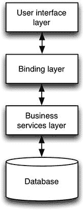
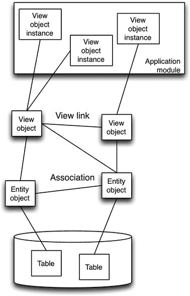
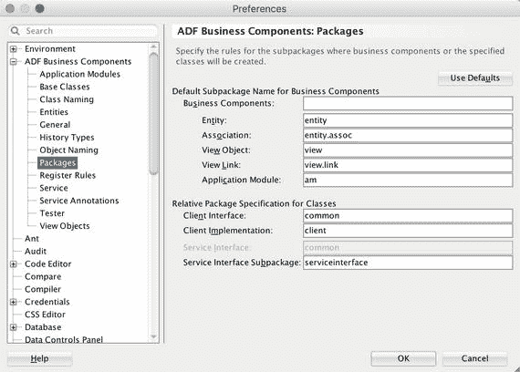
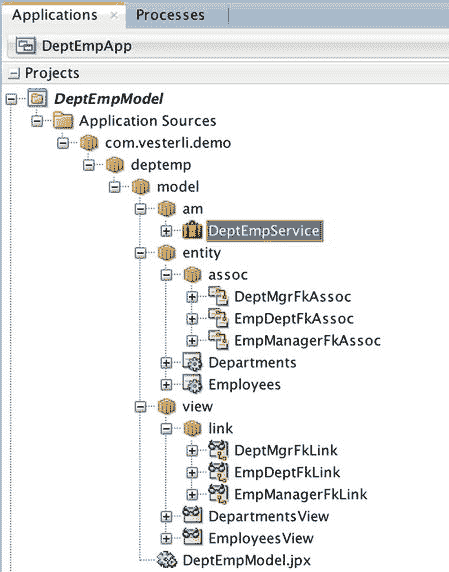
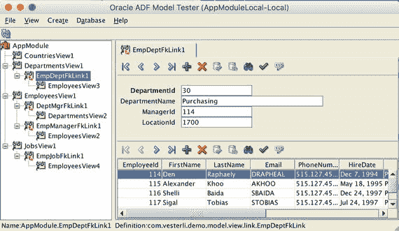
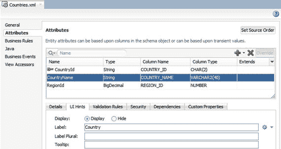

# 1. 拖放式构建

`Oracle 应用开发框架 (ADF)` 提供极高生产力的秘诀在于无需编写代码即可构建大量功能。在构建 `ADF` 应用程序时，您应该力求编写尽可能少的代码，使用 `JDeveloper` 通过拖放方式组合应用程序中每个页面的初始版本。

本章将介绍如何使用 `ADF 业务组件` 向导和图形化任务流构建器，以及如何构建具有自动数据绑定的页面。

## ADF 应用程序的剖析

`Oracle` 最初是一家数据库公司，这一传统在其大多数开发工具中熠熠生辉。像 `Oracle Forms`、`Oracle Application Express (APEX)` 和 `Oracle ADF` 这样的工具都基于一个前提：您已经拥有一个设计良好的关系型数据库，其中包含存储数据所需的所有表。

在数据库之上，`ADF` 应用程序有两层：业务服务层和用户界面层。在这两层之间，您会发现绑定层，它定义了用户界面层如何连接到业务服务层。图 1-1 展示了 `ADF` 的高层架构。

图 1-1.
`ADF` 高层架构

### 业务服务层

业务服务层提供应用程序的主要功能。这包括各种计算、业务规则，以及非常重要的数据存储功能。业务服务层背后可能是其他技术——通常会有一个关系型数据库来存储数据，但您的 `ADF` 应用程序也可以纯粹基于 Web 服务。在本书中，我们将讨论业务服务层由基于 `Oracle` 数据库表的 `ADF` 业务组件组成的 `ADF` 应用程序。这是构建 `ADF` 应用程序最常见的方式，也是 `Oracle` 推荐的方法。

### 用户界面层

用户界面层包含用户将用来与您的应用程序交互的网页。构建用户界面层涉及：

*   决定您的应用程序将包含哪些页面
*   定义页面间的导航流程
*   设计包含字段、按钮和其他用户界面组件的实际页面

### 绑定层

绑定层将用户界面层连接到业务服务层，是 `Oracle ADF` 的“秘诀”。当您使用 `JDeveloper` 中的拖放功能创建应用程序时，绑定层会自动为您创建。因此，即使从不接触绑定层，也可以构建功能完备的 `ADF` 应用程序。但由于对绑定层的基本理解在现实的 `ADF` 应用程序开发中非常有用，我们将在本章末尾简要讨论它。

### 创建 ADF 工作区

一个企业级 `ADF` 应用程序由许多工作区组成，每个工作区生成整体应用程序的一部分。当您使用 `ADF` 时，您在 `JDeveloper` 中通过 `文件 ➤ 新建 ➤ 应用程序` 创建工作区，并选择 `ADF Fusion Web 应用程序` 类型。当您创建这样一个工作区时，`JDeveloper` 会自动在工作区内创建两个项目：

*   用于业务组件的模型项目
*   用于用户界面的视图/控制器项目

`JDeveloper` 还会自动为每个项目添加正确的 `ADF` 库，并在它们之间定义依赖关系，因此视图/控制器项目可以访问在模型项目中创建的业务组件。

`JDeveloper` 将工作区称为“应用程序”。这是一个不太恰当的措辞，因为除了最简单的 `ADF` 应用程序外，其他所有应用程序都会涉及多个工作区。

### 数据库业务组件

如引言所述，`Oracle ADF` 应用程序通常构建在关系型数据库之上。`Oracle JDeveloper` 提供了多个向导，使您能够轻松构建业务服务层所需的所有类型的 `ADF` 业务组件。主要有五种类型的业务组件：

*   `实体对象`：这些对象直接对应表，因此您应用程序使用的每个表都将有一个实体对象。实体对象处理将属性值更改转换为发送到数据库的 `INSERT`、`UPDATE` 和 `DELETE` 语句的技术细节。
*   `关联`：这些对象定义实体对象之间的关系，对应于数据库中的外键关系。`JDeveloper` 向导通常会自动检测外键并创建匹配的关联，但您也可以手动创建它们。
*   `视图对象`：这些对象定义特定用例所需的具体数据。一个视图对象可以使用来自多个实体对象（因此也来自多个表）的数据。例如，一个 `Employees` 视图对象除了显示来自 `Employees` 实体对象的员工信息外，还可能显示来自 `Departments` 实体对象的部门名称。
*   `视图链接`：这些对象表示视图对象之间的主从关系，并允许 `ADF` 协调从记录与主记录。例如，如果您显示一个部门及其员工列表，连接您的 `Departments` 视图对象与 `Employees` 视图对象的视图链接可确保 `Employees` 视图对象仅显示该部门的记录。
*   `应用程序模块`：这些对象收集应用程序或子系统中使用的所有视图对象的实例。应用程序模块控制数据库事务，允许您在应用程序模块中对许多不同的视图对象进行更改，然后在一个事务中提交或回滚所有更改。

不同的 `ADF` 业务组件可以可视化为如图 1-2 所示。

图 1-2.
`ADF` 业务组件

### 保持条理

您的 `ADF` 应用程序将包含大量所有五种类型的业务组件。为了更轻松地区分它们以便找到您需要的那一个，`JDeveloper` 提供了一个您应该设置的偏好设置。

在 `JDeveloper` 偏好设置对话框的 `ADF Business Components` 节点下，更改每种类型的包前缀设置。此设置意味着每次 `JDeveloper` 向导为您创建业务组件时，它都会自动将其放置在您的业务组件项目根包下适当命名的子包中。

我建议使用如图 1-3 所示的设置。

图 1-3.
`ADF` 业务组件包的偏好设置

## 向导演示

当你开始使用 Oracle ADF 时，应该使用 `JDeveloper` 中的 **从业务组件建表向导** 来构建你的业务组件。此向导会为业务组件初始化项目，包括创建从 `JDeveloper` 到包含你应用表的数据库的连接。

在开始创建 ADF 业务组件之前，请确保已选择你的业务服务层（模型）项目。

**提示**

在项目早期就确定一个数据库连接名称，并让所有团队成员使用相同的名称。当你从多个子系统组合主应用程序时，如果每个人都使用相同的数据源名称，事情会容易得多。

该向导会引导你完成最多六个步骤，并可选择性地显示摘要。

1.  创建实体对象。你可以查询数据库连接，并选择要为其创建实体对象的表。向导会自动为所选表之间数据库中的所有外键创建关联。
2.  创建基于实体的视图对象。会为你选择的每个实体对象创建一个默认视图对象。它将包含来自该实体对象的所有属性。
3.  创建基于查询的视图对象。此步骤允许你直接基于 SQL 查询（而非实体对象）创建额外的视图对象。这些对象将不可更新。
4.  创建一个应用程序模块，并以所有可能的组合方式添加所有视图对象的实例。
5.  创建任何 REST Web 服务。你需要为你的业务组件定义 REST API 的初始版本，然后选择你想要作为 REST Web 服务公开的视图对象。
6.  定义你希望包含在每个 REST Web 服务中的属性。

在第一步之后的任何时间，你都可以点击 **完成** 来结束向导。

运行该向导并从标准的 Oracle HR 示例模式中选择 `EMPLOYEES` 和 `DEPARTMENTS` 表，将创建如图 1-4 所示的业务组件。

**图 1-4.**
针对 `EMPLOYEES` 和 `DEPARTMENTS` 的 ADF 业务组件

### 测试业务组件

由于一个 ADF 应用程序同时包含业务服务层和用户界面层，仅通过运行应用程序并与用户界面交互可能很难调试问题。你无法判断是应该在业务服务层还是用户界面层查找问题。

为了应对这一挑战，`JDeveloper` 提供了 **Oracle ADF 模型测试器**。可以通过在 `JDeveloper` 中右键单击一个应用程序模块并选择 **运行** 来启动这个小程序。当你这样做时，Oracle ADF 模型测试器应用程序会启动，加载你点击的应用程序模块，并展示该应用程序模块内的所有视图对象实例。你可以点击每个视图对象，查看应用了所有业务组件逻辑后的数据库中的实际数据。ADF 模型测试器应用程序外观如图 1-5 所示。

**图 1-5.**
ADF 模型测试器

你应该始终使用这个小程序对你的 ADF 业务组件进行简单测试，以验证你的查询、验证和业务逻辑是否按预期工作。

### 实体对象

实体对象直接对应于数据库表，负责处理对象/关系映射和数据验证逻辑。每个数据库表应恰好对应一个实体对象，这使你能够在一个地方实现业务规则和验证，并确保它始终被应用。

默认情况下，创建实体对象的 `JDeveloper` 向导会为对应表中的每一列创建一个属性。将每一列都表示为属性并不会带来性能损失，因为 ADF 会自动进行优化，只查询在任何给定情况下相关的属性/列。

### 构建实体对象

由于实体对象直接对应于表，因此在创建实体对象时需要做的决定很少。你可以使用“从业务组件建表向导”来创建初始的实体对象——只需不选择创建任何视图对象或应用程序模块即可。

创建实体对象后，你应该打开每一个，并为每个属性定义将显示给用户的默认标签。这可以在 **属性** 选项卡下的 **UI 提示** 子选项卡中完成，如图 1-6 所示。

**图 1-6.**
为实体对象属性设置 UI 提示

**标签** 属性以及 **UI 提示** 子选项卡上的其他元素将成为显示该属性的用户界面组件的默认值。如果你不在这里指定任何内容，则属性名（源自底层数据库列）将成为默认标签。在实体对象级别提供的值可以在每个基于该实体对象的视图对象中被覆盖。

你可能有一个为数据库中新记录创建主键值的数据库触发器。为了告诉 ADF 这一点，你需要将主键属性的类型更改为特殊的 `DBSequence` 类型。打开实体对象，然后在 **属性** 选项卡上打开主键属性。当你在 **详细信息** 选项卡上更改 **类型** 字段时，其他几个设置也会随之更改，包括 **插入时刷新** 设置。这些更改共同意味着，你的 ADF 应用程序接受在创建新记录时不输入主键值，并且 ADF 将在执行 `INSERT` 语句时要求数据库返回新的主键值。

### 构建关联

如果你在一次通过“从业务组件建表向导”中构建了所有的实体对象，那么该向导应该会自动为数据库中的所有外键关系创建关联。如果你不是在同一时间创建所有实体对象，`JDeveloper` 可能不会创建关联。在这种情况下，你可以手动在 `JDeveloper` 中创建关联。如果你的数据库由于某种原因不包含外键，这也是必要的。

为了从 `JDeveloper` 向导中获得最大收益，你应该确保 `JDeveloper` 了解你数据模型中的关系。

### 视图对象

实体对象面向数据库，而视图对象则面向用户。每个视图对象代表为满足特定需求而收集的特定数据集。你的用户界面定义了你所需的视图对象，包括必须包含哪些属性。

