# 图形导航流程设计

当您为应用程序构建好所需的业务服务后，接下来需要创建用户界面层。构建此层分为三个步骤：

1.  将您的应用程序划分为独立的导航流。
2.  设计每个导航流。
3.  在每个导航流内构建页面。

本节描述如何划分您的应用程序并设计导航流；构建实际页面的内容将在本章后续部分介绍。

### 构建视图对象

由于每个视图对象都是为特定目的而构建的，您不能像处理实体对象那样简单地运行向导来构建一整套对象。相反，您需要使用 `JDeveloper` 中的视图对象向导逐个构建视图对象。

运行向导时，首先选择一个将作为视图对象基础实体对象的实体对象。默认情况下，该实体对象将被标记为可更新。

如果您需要来自其他实体对象的额外数据，可以在添加第一个之后继续添加。默认情况下，这些实体对象在 `JDeveloper` 中将被标记为 `Reference` 对象。在图 1-7 中，首先选择了 `Employees` 实体对象并标记为可更新。随后添加了 `Departments` 实体对象以获取部门名称。

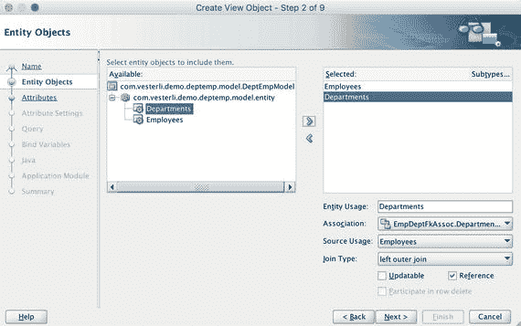

图 1-7。

构建视图对象

从图中可以看出，`JDeveloper` 已识别出两个实体对象之间的连接，并引用了相应的关联。如果 `Employees` 和 `Departments` 实体对象之间没有关联，`JDeveloper` 将无法连接它们。

记录的排序也是视图对象定义的一部分（步骤 5，查询）。

视图对象的属性在 `Attributes` 选项卡上也有一个 `UI Hints` 子选项卡，就像实体对象一样。这允许您指定默认标签、工具提示和其他用户界面元素。如果您在此处未指定任何内容，则将使用来自实体对象的 UI 提示。如果实体对象也未设置 UI 提示，则属性名称（源自底层数据库列）将成为标签。

### 定义值列表

在您希望将某些属性的值限制为特定集合的应用程序位置，通常会定义一个代码列，该列带有一个指向允许值表的外键。在用户界面中，这通常通过下拉列表实现。这种关系在 Oracle ADF 的视图对象（即业务服务层）中建模。当您稍后在应用程序页面上使用该视图对象时，可以选择如何表示此允许值列表（各种列表组件、单选按钮组或其他选项）。

要定义这样的值列表，需要做两件事：

1.  创建包含允许值列表的视图对象
2.  将属性与值列表视图对象关联起来

要创建此关联，请打开视图对象，转到 `Attributes` 子选项卡，并选择要关联列表的属性。在属性下方的 `List of Values` 选项卡上，单击绿色加号以添加一个值列表。在 `Create List of Values` 对话框中，单击 `List Data Source` 旁边的绿色加号，选择 `View Definition` 单选按钮，然后选择包含您的列表值和描述的视图对象。图 1-8 显示了所有这些对话框。

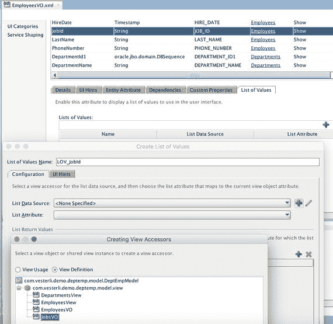

图 1-8。

定义值列表

不要忽略 `Create List of Values` 对话框的 `UI Hints` 选项卡。这是您定义向用户显示哪个值的地方。

如果您有少量且预计不会更改的值，可以通过在 `Create View Object` 向导的第一步中将 `Data Source` 设置为 `Static List` 来创建一个静态视图对象。

### 构建视图链接

当您的用户界面包含主从关系时，例如订单与订单行项目，或部门与其员工，您需要一个视图链接。

一旦您创建了主视图对象和从视图对象，就可以使用 `JDeveloper` 向导手动创建这些链接。通常，视图链接将由主视图对象背后的主要实体对象和从视图对象背后的主要实体对象之间的关联来支撑。在视图链接向导中，您需要标识主视图对象和从视图对象，以及用于建立连接的属性（一个或多个）。如果有可用的关联，您应该选择该关联的两端，如图 1-9 所示。

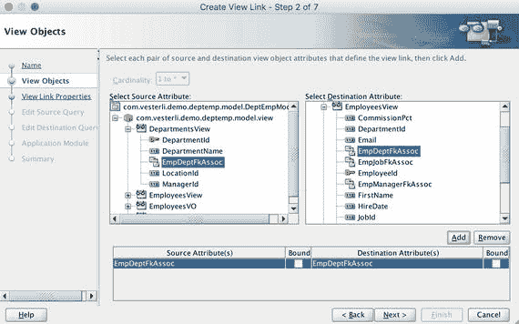

图 1-9。

构建视图链接

请注意，只有当您想在用户界面中显示主从关系时，才需要视图链接。如果您只是想用来自不同实体对象的数据丰富一个数据集，则可以创建一个基于两个实体对象的视图对象，而无需创建视图链接。

### 创建视图标准

视图对象总是包含相同的属性和相同的排序顺序（除非您以编程方式更改它），但它不必总是返回相同的记录。为了限制视图对象返回的记录，您可以添加视图标准和绑定变量。如果您熟悉 SQL，可以将视图标准视为一个命名的、声明式的 `WHERE` 子句。

您可以在视图对象的 `View Criteria` 选项卡上添加视图标准。在 `Create View Criteria` 对话框中，为您的标准命名，并可以添加多个用 `AND` 或 `OR` 连接的标准。每个标准将单个属性与您硬编码到视图标准中的字面值，或者您可以在此对话框中创建的绑定变量进行比较。图 1-10 显示了一个视图标准。

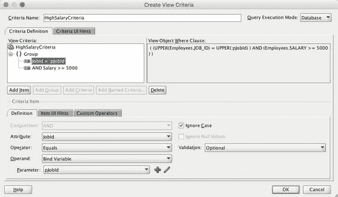

图 1-10。

定义视图标准

创建视图标准后，可以在向应用程序模块添加视图对象实例时使用它。您也可以以编程方式将其应用于视图对象——我们将在第 5 章回到这一点。

### 构建应用程序模块

最后一个 ADF 业务组件是应用程序模块。这些对象收集将在您的应用程序或子系统中使用的多个视图对象实例。应用程序模块控制数据库事务，允许用户通过多个不同的屏幕对许多不同的视图对象进行更改，然后将所有内容作为一个事务提交到数据库。

每个视图对象实例都基于一个视图对象，但一个视图对象可以在应用程序模块中的多个视图对象实例中使用。例如，图 1-11 显示了一个包含 `EmployeeView` 视图对象三个不同实例的应用程序模块。

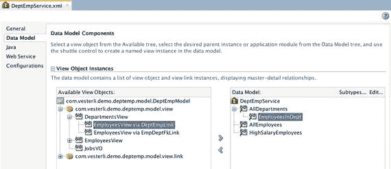

图 1-11。

应用程序模块中的视图对象实例

实例 `AllEmployees` 位于应用程序模块的根级别，将显示所有员工。

实例 `EmployeesInDept` 从属于 `AllDepartments`，将仅显示该部门的员工。要创建此类从属视图对象实例，您需要通过视图链接添加视图对象。在图中，`EmployeesInDept` 实例是通过选择右侧的 `AllDepartments`，然后通过 `DeptEmptLink` 选择左侧的 `EmployeesView` 来创建的。

实例 `HighSalaryEmployees` 也是 `EmployeesView` 上的根级别实例，但在本例中，已对其应用了视图标准。您可以通过选择视图对象实例，然后单击右上角的 `Edit` 按钮来应用视图标准。这将调出 `Edit View Instance` 对话框，您可以在其中设置绑定变量并应用视图标准。


### 应用程序分区

所有企业级 ADF 应用程序都将包含许多独立的导航流，每个导航流都定义了用户如何在页面之间导航。由于 Oracle 是为其自身非常庞大的应用程序（如 Oracle Fusion Applications，一套完整的 ERP 套件）而开发 ADF 的，因此模块化是 ADF 开发的核心。

因此，开发 ADF 应用程序用户界面的第一步是决定你需要哪些导航流。你的需求通常是一个很好的起点，每个用例或用户故事都是成为独立导航流的候选。

### 有界和无界任务流

你在 ADF 中构建的导航流被称为任务流，有时也称为页面流。ADF 任务流是模块化的，你可以在一个任务流中包含另一个任务流。这允许你将整个应用程序构建和维护为多个独立的、可重用的任务流，并将它们组合成一个应用程序。我们将在下一章回到整个应用程序的架构。

任务流包含实际展示给用户的页面或页面片段，以及定义用户被允许如何在页面或片段之间导航的控制流。它还可以包含流程逻辑（分支）并调用业务逻辑。

ADF 中有两种类型的任务流：

*   无界任务流
*   有界任务流

### 无界任务流

一个无界任务流由多个页面组成，用户可以从这些页面中的任何一个启动任务流。因此，任务流周围没有严格的边界。

因为每个 ADF 视图/控制器项目总是有一个名为 `adfc-config` 的无界任务流，所以你通常不需要自己创建这些。

无界任务流通常仅用于应用程序中的第一层导航。许多 ADF 应用程序在其无界任务流中只有一个页面，然后使用各种有界任务流来展示应用程序的功能。如何切换不同的有界上下文将在第 4 章讨论。

### 有界任务流

一个有界任务流通常由多个页面片段组成。它具有一个明确定义的入口点、一个或多个页面以及一个或多个出口点。你的大部分应用程序功能通常将以带有页面片段的有界任务流的形式实现。

你使用页面片段构建有界任务流是为了能够重用它们。一个页面片段应仅包含执行其设计任务所需的用户界面元素。它不应包含任何通用信息，如标题栏、徽标或菜单。这样，该任务流就可以在你的整个应用程序甚至不同的应用程序中使用和重用。

因为页面片段本身不可运行，所以你需要将其嵌入页面中才能运行。

### 创建任务流

最常见的 ADF 架构由一个无界任务流和多个使用页面片段的有界任务流组成。由于每个 ADF Faces 项目都会自动获得一个无界任务流，因此你通常只需要创建使用页面片段的有界任务流。因为你的任务流是应用程序用户界面层的一部分，所以在开始创建任务流之前，请确保在工作区中选择了视图项目。

你可以在“新建库”（New Gallery）的“Web 层” ➤ “JSF/Facelets”下找到任务流。在“创建任务流”对话框中，请确保勾选“创建为有界任务流”和“使用页面片段创建”两个复选框，如图 1-12 所示。在真实的企业应用程序中，你应该使用模板。我们将在第 2 章讨论模板。

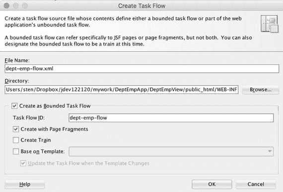

图 1-12. 创建带有片段的有界任务流

创建任务流后，你将看到一个空白图表，中间有一条说明文字。

### 添加视图组件

从这里开始，你从组件面板（通常在右侧）拖入视图组件。你需要为应用程序中想要的每个页面或页面片段准备一个视图组件。

请注意，你创建的第一个视图组件会自动获得一个绿色的“光晕”，表明它是这个有界任务流的入口点。如果你想让另一个活动作为入口点，可以右键单击你希望首先调用的活动的图标，然后选择“标记活动” ➤ “默认活动”。

请注意，你在此处添加的视图活动最初只是占位符。实际的页面或页面片段直到你双击视图活动时才会创建。如果你仔细观察视图活动图标，可以看到初始图标的轮廓底部是虚线。一旦你创建了页面或页面片段，图标就会变为整个轮廓都是实线的图标。

### 添加返回活动

每个有界任务流应该至少有一个任务流返回活动（灰色的角箭头）。这表示出口点，即控制权返回到任何调用此任务流的其他任务流的地方。如果你没有返回活动，你将无法从另一个任务流调用这个有界任务流，因为没有方法可以返回。请注意，返回活动有一个可以设置的 `outcome` 属性。如果你有多个任务流返回活动，你可以向调用者指示流程内部发生了什么——例如，你可能有一个返回 `success`，另一个返回 `error`。

### 添加控制流

当你有了视图活动和返回活动后，你需要添加控制流案例（箭头）来定义它们之间允许的导航。你可以（并且应该）为每个控制流案例指定一个简短的名称。当你构建页面并添加像按钮这样的命令组件时，从页面片段出发的各种流程将作为选项提供。图 1-13 展示了一个任务流可能包含几个视图活动、一个返回活动和一些控制流的样子。

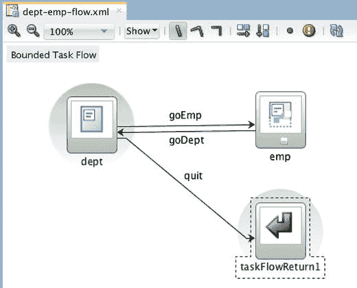

图 1-13. 一个任务流

如果你愿意，还可以添加路由器活动。这些活动允许流程根据表达式语言（EL）编写的表达式的求值结果，处理到不同的控制流案例。我们将在第 4 章回到这一点，在那里我们还将讨论如何从业务组件中放入代码元素。

### 拖放页面

当你在任务流设计中为页面创建了占位符后，就可以创建相应的页面片段了。为此，在带有片段的有界任务流中双击一个视图活动，以打开“创建 ADF 页面片段”对话框。

### 页面布局

在“创建 ADF 页面片段”对话框中，你有三个选项：

*   创建空白页面
*   引用 ADF 模板
*   复制快速开始布局

在学习 ADF 时，请使用“复制快速开始布局”选项。这允许你从可视化目录中选择一个示例，如图 1-14 所示。当你做出选择时，JDeveloper 会将相应的布局组件添加到你的页面片段中。

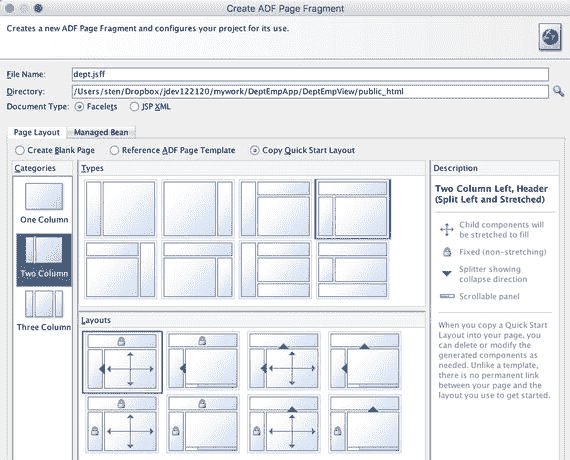

图 1-14. ADF 快速开始布局

在真实的企业 ADF 应用程序中，你希望将所有页面和页面片段都基于页面模板。我们将在下一章回到页面模板。

请注意，你的页面片段不应包含装饰性元素，如徽标或页面标题栏。如果你的应用程序需要这些元素，它们应该被添加到作为页面片段任务流框架的母版页中。页面片段通常只采用一列拉伸布局，以利用所有可用的屏幕区域。


### 查看和配置您的页面

当您创建页面后，它会在 JDeveloper 主窗口中打开。有几种方式可以查看您的应用程序：

*   设计视图
*   源代码视图
*   结构窗口

此外，JDeveloper 会显示一个“属性”窗口，其中包含当前所选项目的详细信息。

**提示**：您可以根据自己的喜好重新排列 JDeveloper 中的窗口。要恢复为默认的窗口布局，请选择 `窗口 ➤ 将窗口重置为出厂设置`。

### 设计视图

页面的初始视图是设计视图。在此视图中，JDeveloper 会尝试显示页面在运行时的大致样子。窗口顶部的工具栏（如图 1-15 所示）允许您更改视图。

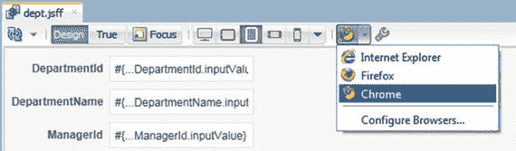

“设计”设置显示有关页面的技术细节，在构建页面时可能有用：例如，布局组件的边框以及字段及其值的技术细节。“真实”设置则显示页面在运行时的样子，使用正确数据类型（文本、数字、日期）的虚拟数据。“焦点”按钮只显示一个布局容器，当您有包含多个嵌套容器的复杂布局时，这可能很有用。不同的屏幕图标允许您以各种尺寸和方向（桌面、横向平板电脑、纵向平板电脑、横向智能手机、纵向智能手机）测试布局。您可以自定义每个尺寸具体应代表多少像素。最后，您可以在配置的各种浏览器中查看带有虚拟数据的页面或页面片段。

### 源代码视图

要查看页面背后的实际源代码，您可以点击窗口底部的“源代码”选项卡切换到源代码视图。此视图显示所有组件和设置，并允许您自由进行任何更改。

ADF 页面的所有组件都是层次结构的一部分，您可以使用左侧边距中的 + 和 – 图标折叠和展开节点。窗口顶部的工具栏允许您启用“区块着色”，其中每个节点获得自己的颜色，以使结构更清晰。如果您进行了手动更改，还可以要求 JDeveloper 重新格式化您的代码。

默认情况下，JDeveloper 会在右侧边距显示“迷你地图”，为您提供代码的视觉概览。您可以从地图的上下文菜单中关闭它，并再次从源代码的上下文菜单中显示它（`源代码 ➤ 显示迷你地图`）。

最右侧边距的顶部如果显示一个绿色方块，表示您的代码有效。如果存在错误，顶部的区块会变为红色，并且您会在边距中对应错误位置的地方看到红色条。类似地，橙色表示警告。

如果您有错误或警告，左侧边距通常会显示一个快速修复图标，提供 JDeveloper 对如何修复代码的最佳猜测。

如果您想查看行号，可以在左侧边距中右键单击，然后从上下文菜单中选择“切换行号”。

要切换回设计视图，请点击窗口底部的“设计”选项卡。

### 结构窗口

如图 1-16 所示的“结构窗口”展示了页面组件层次结构的另一种视图。

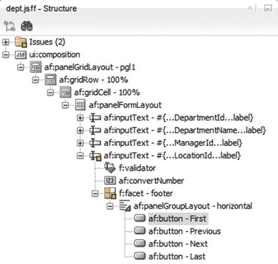

默认情况下，此窗口位于 JDeveloper 的左下角。您在源代码视图中的选择以及在结构窗口中的选择会由 JDeveloper 保持同步，因此您可以点击结构窗口中的元素以快速跳转到页面源代码中的相应位置。设计视图、源代码视图、结构窗口和属性窗口只是应用程序的不同表现形式，因此，如果您在源代码视图中进行更改，例如，它会立即反映在结构窗口中。

### 添加数据绑定组件

在一个包含模型和视图/控制器项目的简单 ADF Fusion 工作区中，您会自动在“应用程序”窗口的“数据控件”窗格中找到从您的应用程序模块创建的数据控件，如图 1-17 所示。

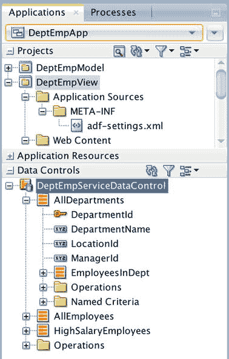

JDeveloper 会为每个应用程序模块自动创建一个数据控件。在数据控件内部，您可以看到相应应用程序模块中的所有视图对象实例。从“数据控件”面板，您可以拖放一个视图对象实例（方形的红色/橙色图标，例如 `AllDepartments`）或一个单独的属性（矩形的 XYZ 图标，例如 `DepartmentName`）到页面片段上。

当您将数据控件窗格中的一个项目拖放到页面或页面片段上时，JDeveloper 会自动提示您选择要添加的用户界面组件类型。列表取决于项目的类型，只显示与该项目相关的组件。

### 添加视图对象实例

当您拖放一个视图对象实例时，您会得到一个很长的可能用户界面对象列表，但最常用的是 ADF 表单和 ADF 表格（`ADF 表格` 在 Table/List View 的子菜单下可以找到）。

如果您选择 ADF 表单，您将获得一个一次显示一条记录的页面。属性将垂直排列，每个属性有一个单独的字段。您可以勾选“行导航”复选框（如图 1-18 所示），要求 JDeveloper 同时添加用于导航到第一条、上一条、下一条和最后一条记录的按钮。

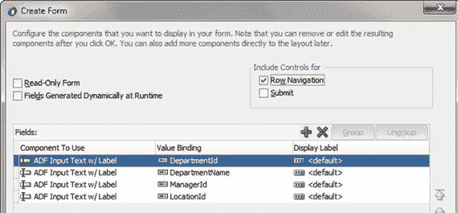

如果您没有为每个属性提供标签，ADF 将使用视图对象中的 UI 提示。如果视图对象中没有设置 UI 提示，ADF 将退而使用实体对象上设置的任何 UI 提示。如果那里也没有指定标签，则标签将变成从数据库列派生的属性名称。

从技术上讲，JDeveloper 创建一个 `<af:PanelFormLayout>` 组件，其中包含连接到您拖放的视图对象实例中各个属性的单独 `<af:InputText>` 组件。如果您勾选了“行导航”复选框，您还会获得连接到每个视图对象自动提供的标准操作“第一条”、“上一条”、“下一条”和“最后一条”的按钮。

如果您选择 ADF 表格，您将获得一个在表格中显示多条记录的页面，每条记录作为表格中的一行。您可以选择复选框来启用排序（通过点击列标题）和启用过滤（在每列顶部添加一个过滤条件框）。如果您不想使用默认值，还可以指定每个属性的标签。从技术上讲，JDeveloper 创建一个绑定到整个视图对象实例的 `<af:Table>` 组件。

### 添加单个属性

您也可以将单个属性拖放到页面或页面片段上。在这种情况下，您的用户界面组件选择是不同的——最常用的组件是带标签的 ADF 输入文本，它会如您所料地显示为带标签的输入字段。您可以显式指定一个标签，或者接受来自视图对象 UI 提示、实体对象 UI 提示或数据库列名称的默认值。


### 添加操作

如果在“数据控件”窗格中展开一个视图对象实例的“`操作`”选项卡，您将看到 ADF 为每个视图对象自动提供的许多标准操作。当将这些操作拖放到页面或页面片段上时，系统会显示一个对该操作有意义的界面组件列表。最常用的是“`ADF 按钮`”和“`ADF 链接`”。

在第 5 章，您将学习如何向视图对象和应用程序模块添加自己的逻辑。您添加并决定发布的方法也会出现在“`数据控件`”窗格中，并且可以以相同的方式轻松添加到您的应用程序中。

### 添加提交和回滚

与视图对象一样，应用程序模块在“`数据控件`”面板的最底部（所有视图对象实例下方）也有一个“`操作`”选项卡。应用程序模块的两个标准操作是“`提交`”和“`回滚`”。为了执行对数据库的提交或回滚，您只需将其中一项操作拖放到您的页面或页面片段上。ADF 会为您处理好一切，因此您无需编写任何代码即可构建功能齐全的数据库应用程序。

### 实现导航

当您向任务流添加控制流案例时，就定义了页面之间可能的导航。要在用户界面中实际实现导航，您需要将一个操作项（例如按钮）拖放到您的页面上。选中操作项后，打开“`属性`”窗口，找到“`操作`”属性，并从选项列表中选择。您会看到此下拉列表包含了所有已定义的、从当前页面出发的控制流案例。

当用户点击您连接到某个控制流案例的操作项时，您的 ADF 应用程序就会切换到对应的页面。

**提示**
ADF 会处理用户在页面间导航时的临时值存储。当用户最终选择“`提交`”或“`回滚`”操作时，所有更改都将被提交到数据库。

### 检查绑定

当您运行使用这些拖放功能构建的应用程序时，来自业务组件的数据将自动显示在网页的字段中。页面上的更改会自动传播回业务组件，如果您执行提交操作，更改将一直传播到数据库。连接业务组件和用户界面元素的机制称为 *绑定*。

JDeveloper 会自动为您创建绑定，您可以通过点击页面底部的“`绑定`”选项卡来访问它们。这将生成一个可视化的绑定表示，如图 1-19 所示。

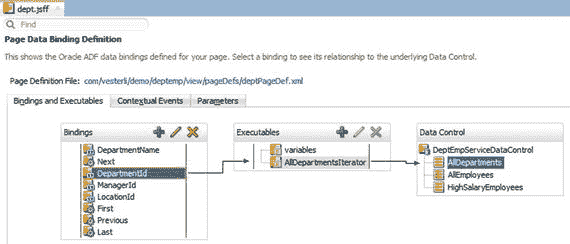
*图 1-19. 绑定的可视化表示*

左侧的“`绑定`”列显示了不同的绑定。最常用的有：
- 用于单个属性的属性绑定（带有 XY 图标）。
- 用于整个视图对象实例的树绑定（带有文件夹层次结构图标）。
- 用于操作的动作绑定（带有齿轮图标）。

当您点击一个绑定时，会出现一个箭头指向中间列的“`可执行对象`”。这通常是一个迭代器，代表指向右侧列所示数据控件中数据集合的指针。

每个页面都有一个绑定，存储在页面定义文件中。要查看绑定的实际源代码，您需要点击绑定窗口顶部的“`页面定义文件`”链接，或在“`应用程序`”窗口中找到该绑定。

在许多 ADF 应用程序中，您无需更改 JDeveloper 为您创建的绑定。然而，在高级 ADF 应用程序中，您可能需要手动创建绑定。您可以点击“`绑定`”窗口中的绿色加号来创建绑定和可执行对象。

**注意**
如果您在“`设计`”选项卡上从页面或页面片段中删除一个元素，JDeveloper 会尝试通过自动删除相应的绑定来帮助您。如果您从“`源`”选项卡中删除一个元素，JDeveloper 会假定您是一位高级 ADF 开发人员，并保留绑定不变，以便您决定是保留它还是手动删除它。

### 最小可行产品

一个企业级 ADF 应用程序通常由许多使用页面片段的有界任务流和一个带有菜单的主页面组成。当用户选择另一个菜单项时，相应的任务流会显示在主页面的动态区域中。由于这种构建应用程序的方式需要一些代码，我们将在第 4 章回到这一点。

但是，您可以在不编写任何代码的情况下构建一个功能齐全的应用程序。这使您可以快速向用户展示一个可运行的原型并收集初步反馈。

### 一个简单的主页面

一个基本的主页面可以基于“`单列页眉（拉伸）`”快速启动布局来构建，如图 1-20 所示。

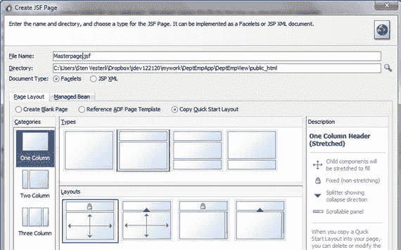
*图 1-20. 单列页眉（拉伸）*

在该页面内，在顶部的页眉区域放置一个“`输出文本`”组件，在窗口的主区域放置一个“`面板选项卡式`”组件。这些组件默认位于 JDeveloper 窗口的右侧，在“`组件`”窗口中可以找到。

**提示**
您可以使用“`组件`”窗口顶部的搜索框按名称搜索组件。

在“`创建面板选项卡式`”对话框中，为您想要测试的应用程序所有部分创建选项卡。

选择您的页眉文本，并使用“`属性`”窗口更改文本、字体样式和大小。

然后将您的页面流拖放到应用程序的选项卡上。当提示选择用户界面组件时，选择“`区域`”。我们将在第 4 章回到另一个选项（“`动态区域`”）。您将正常看到主页面的元素，以及任务流第一页的灰度图像，如图 1-21 所示。

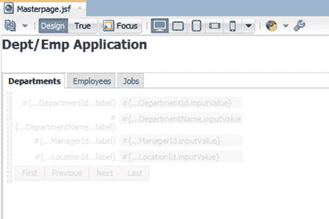
*图 1-21. 显示包含有界任务流的区域的主页面*

现在您可以右键单击主页面并运行您的应用程序。

在安装 JDeveloper 后第一次运行应用程序时，系统会提示您输入内置 WebLogic 服务器的密码，并且服务器需要一些时间来进行首次初始化和启动。

您应该能在不同的选项卡上看到您的任务流，并能够在选项卡之间导航。

### 结论

您现在已经了解了如何利用 ADF 和 JDeveloper 的强大功能，在不编写一行代码的情况下构建一个完整的、功能齐全的 ADF 应用程序。

在下一章中，我们将讨论如何构建利用 ADF 企业应用程序开发功能的更大规模的应用程序，在后续章节中，您将学习如何添加实现业务逻辑的 Java 代码。

## 2. ADF 企业架构

在上一章中，您看到了构建小型但功能齐全的 ADF 应用程序是多么容易。本章将讨论如何在企业环境中构建更大的应用程序。

### ADF 库

ADF 企业级功能背后的秘密是“`ADF 库`”。一个“`ADF 库`”类似于一个普通的 Java 归档（`JAR`）文件，但它包含有关其内容的额外元数据。这些元数据使 JDeveloper 能够显示内容，并使得在 JDeveloper 中复用“`ADF 库`”内的组件变得容易。


### 创建 ADF 库

ADF 库是基于工作区内的某个项目创建的。当工作区中的项目之间存在依赖关系时，该库将自动包含其所依赖项目的所有对象。在典型的 ADF Fusion Web Application 类型的工作区中，JDeveloper 会自动添加从视图/控制器项目到模型项目的依赖项。这意味着，当你从视图/控制器项目创建 ADF 库时，模型项目的内容也会自动包含在你的库中。

要从项目创建 ADF 需要一个部署配置。你通过右键单击项目并选择 **Deploy ➤ New Deployment Profile** 来创建它。选择一个 ADF Library JAR 文件类型，并为你的配置文件起一个有意义的名称。按照约定，配置文件名格式为 `adflibXxx`（例如 `adflibHrDemoCommon`）。配置文件名将成为 ADF 库文件的默认名称。

**提示**

由于你可能需要在 JDeveloper 之外处理 ADF 库文件（例如，在版本控制系统中或在应用服务器上），因此应用程序名称应作为库文件名的一部分，以便你能够区分这些文件。

在如图 2-1 所示的 **Edit ADF Library JAR Deployment Profile Properties** 对话框中，有一项设置你总是需要更改：`Connections`。

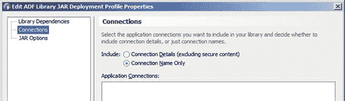

**图 2-1.** 编辑 ADF 库 JAR 部署配置文件属性对话框

默认选项 `Connection Details` 意味着你的库将包含数据库连接详情。你不希望你的库包含指向本地开发数据库的连接信息。因此，你需要选择 `Connection Name Only`。这意味着你的库将只包含连接的名称，而非技术细节。然后，将由你的应用服务器管理员来定义具有此名称的数据源，并指向正确的数据库。

### 管理 ADF 库

由于 ADF 库是开发过程的核心，因此妥善管理它们非常重要。每位开发者都可以随时发布新的 ADF 库，但在将库共享给整个团队之前，你需要一个评审流程。

默认情况下，ADF 库是在项目内的 `deploy` 子目录中创建的。你可以将它们留在那里，然后在新的版本准备好进行更广泛的分发时告知你的构建/部署管理员。

然后，构建/部署管理员将确保你的 ADF 库文件经过测试，并放置在所有人都能获取其 ADF 库的中央位置。这个经过批准的版本应该被置于版本控制之下。

你的流程可以是自动化的，也可以是手动的，但你需要一个中间步骤，该步骤接收某个团队构建的 ADF 库，对其进行验证，然后发布供其他团队使用。

### 使用 ADF 库

要使用一个 ADF 库，你需要定义一个指向已批准库存储位置的文件系统连接，并将它们添加到需要的项目中。

该连接在 `Resources` 窗口中定义，该窗口默认位于 JDeveloper 窗口的右侧。如果看不到，可以从 `Window` 菜单打开。在此窗口中，单击窗口顶部的 New 图标，然后选择 **IDE Connections ➤ File System**。为你的连接命名，并选择指向公共 ADF 库的路径。`Resources` 窗口现在将显示该目录中所有可用的库。

要在项目中使用 ADF 库，请在 `Applications` 窗口中选择该项目。然后右键单击 `Resources` 窗口中的库并选择 `Add to Project`。

**提示**

如果你想查看项目中包含了哪些 ADF 库，可以右键单击项目并选择 `Refresh ADF Library Dependencies …`。这将使 JDeveloper 重新读取项目的所有 ADF 库并将它们打印到 `Messages` 窗口。

### ADF 架构模型

借助 ADF 库的强大功能，你可以创建适合需求的 ADF 架构。存在多种可能性，但三种良好的架构如下：

*   简单型
*   模块型
*   企业型

### 简单型 ADF 架构

在简单型 ADF 架构中，你将所有内容保存在一个工作区中。你将拥有一个包含公共代码的基础项目、一个包含你的 ADF 业务组件的模型项目，以及一个包含你的任务流和主页面的视图/控制器项目。

此架构适用于不超过 20 个任务流、由不超过三到四名开发者的团队实现的应用程序。如果应用程序变得更大，则很难找到需要处理的组件，并且由于 JDeveloper 必须处理更多对象之间的相互依赖关系，其运行速度会变慢。如果团队变得太大，成员们往往会相互干扰，并且可能对 `DataBindings.cpx` 等中心应用程序文件产生争用。

**提示**

为了简化对大型应用程序工作区的视图，请查看 JDeveloper 的功能 `Working Sets` ，位于 `Application` 窗口顶部的 Working Set 图标（一个漏斗）下。此功能允许你限制在 JDeveloper 中看到的内容。


### 模块化 ADF 架构

在构建单个大型 ADF 应用程序时，应采用模块化架构。这涉及多个工作空间和项目，每个项目由一至四人的小团队负责。

将包含一个基础层、少量子系统和一个主应用程序，如图 2-2 所示。

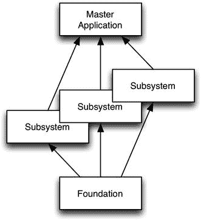

图 2-2. 模块化 ADF 架构

### 基础层

基础层应保存在一个工作空间中，包含四个项目：

*   通用模型
*   通用 UI
*   通用工具代码
*   业务组件基类

创建基础工作空间时，请选择 `ADF Fusion Web Application`。此向导允许您创建通用模型和通用 UI 项目。然后，使用 `File` -> `New` -> `Project` -> `ADF Model Project` 添加一个额外的项目用于工具和业务组件基类。选择 ADF 模型项目的原因是，JDeveloper 中的此项目模板已包含您所需的技术。

通用模型项目应包含可在整个应用程序中共享的所有业务组件。由于实体对象直接映射到数据库表，这些可以共享并放入通用模型项目。类似地，用于值列表的视图对象也可以共享并放入通用模型。

通用 UI 项目包含属于用户界面层的所有共享元素。此项目中的元素可能包括模板、皮肤和声明式组件。

通用工具代码项目包含您将在整个应用程序中使用的任何通用工具类。

**提示**

查找 Oracle 的 Fusion Order Demo 应用程序并下载。此演示应用程序包含几个有用的工具类。虽然不是 Oracle 官方支持的软件，但它可以作为您自己工具的良好起点。

业务组件基类项目包含您自己的 ADF 业务组件基类，它们扩展了 Oracle 提供的类。本章后面的“创建您自己的基类”一节解释了为什么需要这些类以及如何构建它们。

### 子系统

实现应用程序功能需求的任务流被放入少量子系统中。每个子系统应有自己的工作空间，包含一个模型项目和一个视图/控制器项目。一个典型的项目将有三到八个子系统，每个子系统分配给一个由一或两名开发人员组成的团队。

模型项目应包含该子系统实现的用例所特有的视图对象。

视图/控制器项目应包含实现子系统用例的有界任务流及其页面片段。

### 主应用程序

主应用程序包含带有全局菜单的主页面。所有功能都通过子系统生成的 ADF 库包含在主应用程序中。安全性在主应用程序中定义。

### 企业级 ADF 架构

如果您的组织已战略性的选择 ADF 作为其开发平台，那么您很可能会构建许多 ADF 应用程序。在这种情况下，建立一个企业级 ADF 架构是合理的。

这涉及一个对所有应用程序通用的企业基础层和一个用于每个应用程序的应用程序基础层。将会有少量子系统以及一个或多个利用部分子系统功能的主应用程序。在企业级 ADF 架构中，某些子系统可能是共享的，并在多个主应用程序中使用。该架构如图 2-3 所示。

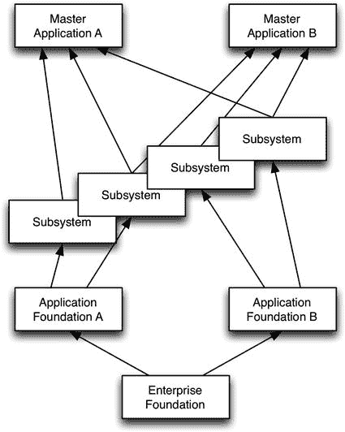

图 2-3. 企业级 ADF 架构

### 企业基础层

企业基础层包含在整个企业内通用的代码。此层应保存在一个工作空间中，包含至少两个项目：

*   企业业务组件基类
*   企业通用工具代码

与模块化架构类似，业务组件基类项目包含对 Oracle 的 ADF 业务组件基类的扩展。在企业层面，您可以添加希望组织中每个 ADF 业务组件都具有的功能。

类似地，企业通用工具代码项目包含预计将在组织内所有 ADF 应用程序中使用的工具类。

### 应用程序基础层

应用程序基础层包含特定于应用程序的代码：

*   对企业业务组件基类的应用特定扩展
*   应用特定的通用工具代码
*   通用模型

特定于应用程序的业务组件扩展扩展了企业级业务组件基类，并添加了仅此特定应用程序需要的任何额外功能。同样，通用工具代码项目包含仅在此应用程序中有用的通用类。

通用模型项目包含跨应用程序共享的业务组件，如同模块化架构中那样（即，实体对象和值列表视图对象）。

### 子系统

ADF 企业架构中的子系统类似于模块化架构中的子系统，每个子系统由一个模型项目和一个视图/控制器项目组成。

### 主应用程序

每个主应用程序也类似于模块化架构中的主应用程序。在 ADF 企业架构中，同一个子系统可以在多个主应用程序中使用。

### 部署 ADF 应用程序

使用这些 ADF 架构时，您的粒度单位是子系统。如果您进行更改，则必须重建子系统 ADF 库，然后构建并部署主应用程序 EAR 文件。

如果您希望子系统更改生效而无需重建主应用程序，您可以考虑将 ADF 库部署为 WebLogic 共享库，或者研究称为“远程区域”的 ADF 功能。

### 业务组件代码

在第一章中，您看到了如何在不编写任何代码的情况下构建 Oracle ADF 应用程序。当然，您并不局限于 ADF 默认的业务组件功能，而是可以根据需要扩展和自定义它。

### 隐式业务组件

如果您不自己编写任何代码，您就是在隐式使用 Oracle 作为 ADF 框架的一部分提供的 ADF 类。例如，每当您的应用程序使用实体对象时，ADF 将自动创建 `oracle.jbo.server.EntityObject` 类的一个实例。该类读取您的实体对象的定义（表、列和其他设置），并为 ADF 业务组件栈的其余部分提供多个接口以供调用。


### 显式业务组件

您可以通过单击 Java 选项卡右上角的铅笔图标，为业务组件在 Java 选项卡上创建显式业务组件。这将打开“选择 Java 选项”对话框。不同类型的业务组件，该对话框也不同：图 2-4 展示了其实体对象的外观。

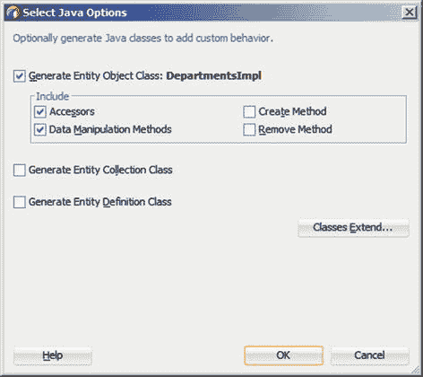
图 2-4. 为实体对象生成 Java

如果您执行此操作，您将看到得到一个扩展了 Oracle 提供的业务组件基类的 Java 类。部分代码如清单 2-1 所示。

```java
package com.vesterli.hrdemo.foundation.model.entity;
...
import oracle.jbo.server.EntityImpl;
...
// ---------------------------------------------------------------------
// ---    File generated by Oracle ADF Business Components Design Time.
// ---    Sat Feb 04 15:17:10 CET 2017
// ---    Custom code may be added to this class.
// ---    Warning: Do not modify method signatures of generated methods.
// ---------------------------------------------------------------------
public class DepartmentsImpl extends EntityImpl {
...
/**
* This is the default constructor (do not remove).
*/
...
/**
* Gets the attribute value for DepartmentName, using the alias name DepartmentName.
* @return the value of DepartmentName
*/
public String getDepartmentName() {
return (String) getAttributeInternal(DEPARTMENTNAME);
}
/**
* Sets value as the attribute value for DepartmentName.
* @param value value to set the DepartmentName
*/
public void setDepartmentName(String value) {
setAttributeInternal(DEPARTMENTNAME, value);
}
...
/**
* Add locking logic here.
*/
public void lock() {
super.lock();
}
/**
* Custom DML update/insert/delete logic here.
* @param operation the operation type
* @param e the transaction event
*/
protected void doDML(int operation, TransactionEvent e) {
super.doDML(operation, e);
}
}
```
清单 2-1. 实体对象 Java 代码的一部分

您可以看到您的类被称为 `EntityImpl`。import 语句表明这意味着 `oracle.jbo.server.EntityImpl`。根据您在“选择 Java 选项”对话框中的选择，JDeveloper 将在类中创建一些占位符方法，您可以在其中添加自己的代码。例如，“数据操作方法”复选框导致 JDeveloper 创建了 `lock()` 和 `doDML()` 方法。

您可以随时在代码中任意位置右键单击并选择“源”➤“重写方法”，以要求 JDeveloper 为 Oracle 提供的基类中的任何方法添加占位符。

正如 JDeveloper 所创建的那样，这些方法只是调用 Oracle 提供的超类中的相应方法。这意味着，在您添加一些自己的代码之前，为业务组件生成 Java 不会改变应用程序的功能。

您对特定业务组件（如本示例中的 `DepartmentsImpl`）所做的任何更改将仅适用于该业务组件。但您也可以通过创建自己的 ADF 业务组件基类来进行将应用于应用程序中每个业务组件的更改。

### 您自己的基类

您应该始终创建自己的 ADF 业务组件基类，扩展 Oracle 提供的类。您不必添加任何功能，但重要的是您要创建这层额外的代码，以便将来在所有组件中放置您可能需要的任何通用功能。图 2-5 展示了您自己的基类如何位于 Oracle 提供的类与应用程序中使用的特定业务组件之间。

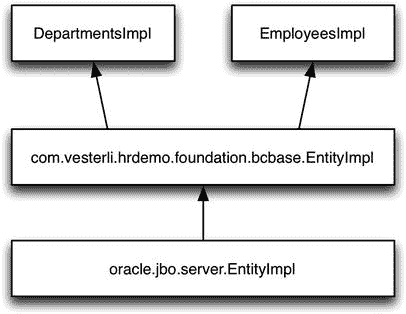
图 2-5. 扩展 Oracle 的业务组件基类

### 创建您自己的基类

在 BCBase 项目中创建您自己的业务组件基类之前，您需要让 JDeveloper 加载 ADF 业务组件功能。您可以通过右键单击项目并选择“项目属性”来完成此操作。然后选择“ADF 业务组件”并勾选“为业务组件初始化项目”复选框。

完成此操作后，创建您自己的基类作为标准 Java 类（“文件”➤“新建”➤“Java 类”）。共有 11 个 ADF 业务组件基类。您可能只会为其中的几个添加功能，但由于添加您自己的基类没有任何成本，而且您永远不知道将来哪一个可能有用，因此您应该创建所有这些类的自己版本。Oracle 类（都可以在 `oracle.jbo.server` 包中找到）如下：

*   `EntityCache`
*   `EntityImpl`
*   `ProgrammaticEntityImpl`
*   `EntityDefImpl`
*   `ViewObjectImpl`
*   `ViewRowImpl`
*   `ProgrammaticViewObjectImpl`
*   `ProgrammaticViewRowImpl`
*   `ViewDefImpl`
*   `ApplicationModuleImpl`
*   `ApplicationModuleDefImpl`

对于每一个类，创建您自己的版本，扩展相关的 Oracle 类，如图 2-6 所示。

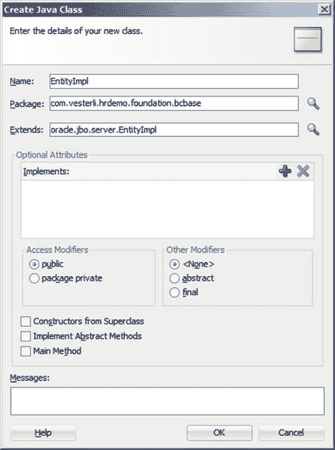
图 2-6. 创建您自己的业务组件基类

您的代码将类似于清单 2-2。

```java
package com.vesterli.hrdemo.foundation.bcbase;
public class EntityImpl extends oracle.jbo.server.EntityImpl {
}
```
清单 2-2. 您自己的业务组件基类代码

注意这个类有多简单：它只有一个名称和它扩展了 Oracle 提供的基类的信息。这是项目开始时您所需要的全部——您可以根据需要添加自己的方法，重写 Oracle 类中的方法。

完成后，从您的 BCBase 项目创建一个 ADF 库，并将其放在您的公共 ADF 库目录中供所有人使用。

### 使用您自己的基类

一旦创建了您自己的 ADF 业务组件基类，您就可以设置 JDeveloper，使其在创建新业务组件时始终使用它们。您可以在 JDeveloper 首选项中的“ADF 业务组件”➤“基类”下进行设置。对于每个基类，将 `oracle.jbo.server` 替换为您的基类所在的包，如图 2-7 所示。

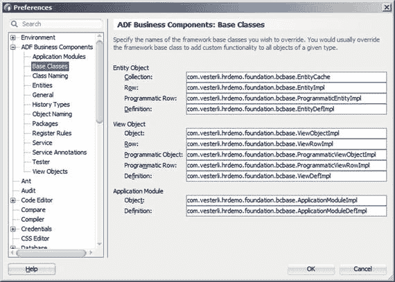
图 2-7. 配置 JDeveloper 使用您的 ADF 基类

在 JDeveloper 首选项下进行更改意味着从此创建的每个业务组件都将基于这些类。这也意味着，如果包含您的 ADF 业务组件基类的 ADF 库未添加到项目中，您的应用程序将在运行时失败。

如果您想为单个项目更改基类，“项目属性”下有一个类似的设置。

### 使用模板

正如企业开发框架所预期的那样，Oracle ADF 也提供了各种选项，让您可以基于模板构建用户界面元素。如果您在模板上创建页面、页面片段和任务流，您将可以选择在以后轻松地在整个应用程序或企业中添加或更改内容。如果您不使用模板，您必须在每个页面、片段或任务流中单独进行任何必要的全局更改。

除了前期需要一点思考外，将所有内容基于模板没有任何成本，因此您应该始终使用它们。即使项目开始时没有任何内容需要放入模板，也请创建空模板并在其上构建您的应用程序。

所有模板都在您的基础工作区中的视图/控制器项目中创建。如果您使用企业架构，那么您的企业基础和应用程序基础都应具有模板。

### 页面模板

许多 ADF 应用程序只有一个主页面，但您仍应将其基于页面模板构建，以便于后续扩展和/或开发其他应用程序。

页面模板包含一些通用元素，例如页眉栏或您希望在每个页面上显示的公共页脚。您应在 `CommonUI` 项目中使用 `File ➤ New ➤ Web Tier ➤ JSF/Facelets ➤ ADF Page Template` 来创建它。在创建页面模板时，您通常需要复制一个快速启动布局。

作为模板创建的一部分，您至少需要定义一个 facet，可能还需要定义属性，如图 2-8 所示。

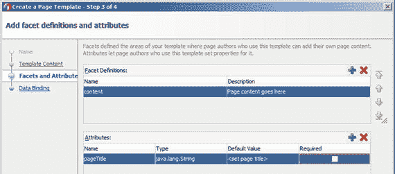

图 2-8. 定义模板 facet 和属性

### 使用 Facet

Facet 是一个位置，模板使用者可以在其中添加他们自己的内容。一个模板通常有一个 facet，但如果您的布局需要两个独立的内容区域，也可能有多个。

创建模板后，它会显示在 JDeveloper 主窗口中。在这里，您可以添加徽标、页眉等装饰元素。模板中的所有元素都将成为基于该模板的每个页面的一部分。

在您希望放置实际页面内容的位置，从组件面板中拖放一个 Facet 定义 (`<af:facetRef>`)。系统会提示您输入 facet 名称，选项是您在创建模板时定义的那些 facet。

### 使用属性

通常，您希望能够更改放置在模板区域中的文本。例如，您的模板可能在页面顶部定义了一个彩色条，您希望将页面名称写在这个条内。在基于模板的页面上，您无法在模板区域内添加任何内容。但是，您可以为模板属性赋值。

具体用法如下：

-   定义模板时，创建一个属性（例如 `pageTitle`）。
-   在模板中，将您希望显示页面名称的地方放置一个文本元素（例如 `<af:outputText>`）。将该文本元素的“值”属性设置为与属性对应（例如 `#{attrs.pageTitle}`）。为该文本元素应用您想要的任何样式（字体大小等）。
-   基于该模板创建一个页面。在“源”视图中，选择 `<af:pageTemplate>` 元素，在“属性”窗口中找到模板属性的字段，并将其设置为所需的值。

### 页面片段模板

您应用程序的主体将由有界任务流中的页面片段组成。因为这些片段将驻留在您应用程序的主页面内，所以它们通常不包含任何页眉或页脚等装饰。

因此，您的页面片段模板通常仅包含一个拉伸的一列布局，以确保您的片段能充分利用页面上的所有可用空间。定义一个内容 facet 并将该 facet 引用放置在拉伸布局中。

**注意：** 为页面片段基于模板构建可能看起来多余，但这样做没有任何成本，并且在您确实需要向每个页面片段添加某些通用内容的罕见情况下，它可以为您节省大量工作。

### 任务流模板

您也可以将有界任务流基于模板构建。这允许您后续添加功能，或在整个应用程序范围内全局设置属性。

这样做的一个原因可能是向每个任务流添加通用的初始化器和终结器。这些是 ADF 在进入和离开任务流时自动执行的代码片段，通常用于应用程序性能跟踪。

与页面片段模板类似，您可能没有立即对任务流模板的需求，但创建它们没有任何成本。通过将您所有应用程序的任务流都基于模板构建，您就获得了轻松对每个任务流进行一些更改的选项。

### 应用程序皮肤

您应用程序的视觉外观部分由 ADF Skin 决定。如果您不创建一个，将使用 ADF 默认皮肤。

您自己的 ADF Skin 总是基于 ADF 附带的标准皮肤之一，任何您未显式更改的部分都将具有默认的 ADF 外观。这意味着您可以在项目开始时创建一个空皮肤，并将其置于基础工作空间中，而不影响应用程序的外观。

如果您将所有子系统和主应用程序都基于此皮肤，您就再次建立了一个进行应用程序范围更改的单一入口点。

我们将在第 3 章中再次讨论皮肤。

## 通用模型

在 ADF 应用程序中，您还可以跨子系统重用一些业务组件。这些可重用组件应放置在基础工作空间中的通用模型项目中。业务组件通常只能在单个应用程序内重用，因此 ADF 企业架构中的企业基础层不太可能包含共享的业务组件。

当您将基础工作空间创建为 ADF Fusion Web 应用程序时，JDeveloper 会自动在模型 (`CommonModel`) 和视图/控制器 (`CommonUI`) 项目之间建立依赖关系。您应在基础项目中删除此依赖关系（项目属性 ➤ 依赖关系）。该依赖关系意味着当您从视图/控制器项目创建 ADF 库时，模型项目中的所有内容都会自动包含在内。这对于子系统来说没问题，但在基础层中，您需要显式地将每个项目部署到 ADF 库。

### 共享实体对象

请记住，实体对象将数据库表映射为可供视图对象使用的对象表示形式。这意味着对于每个数据库表，您只需要一个实体对象。因此，将它们全部创建在一个通用模型项目中，然后从基础工作空间中的通用模型项目部署为 ADF 库是有意义的。

### 共享值列表视图对象

视图对象包含为特定目的收集的属性。这意味着它们通常作为子系统的一部分构建，以实现该子系统中的用例或故事。但是，每次为属性实现值列表时，您也需要一个视图对象。其中许多将在多个子系统中使用，因此将它们与实体对象一起放在基础层的通用模型项目中是有意义的。

您的通用模型项目还需要一个应用程序模块。这允许您运行和测试您的值列表视图对象，并且该应用程序模块也可以用作共享应用程序模块。有关共享应用程序模块的更多信息，请参阅 Oracle 手册《使用 Oracle 应用程序开发框架开发 Fusion Web 应用程序》中的“共享应用程序模块视图实例”章节。


### 构建子系统

ADF 应用程序的主体部分将置于各个子系统中。每个子系统应在独立的工作区中创建，并包含一个模型项目和一个视图/控制器项目。

你的子系统工作区将利用基础层中的所有 ADF 库：`common UI`、`common model`、业务组件基类以及任何通用工具代码。

在模型项目中，你需要创建实现该子系统故事或用例所需的视图对象和视图链接。所有这些都应基于来自 `common model` 的实体对象。

**提示**

如果在创建视图对象时没有看到任何实体对象，可能是你未正确添加对 `common model` ADF 库的依赖。

在视图/控制器项目中，你需要创建带有页面片段的有界任务流，以匹配你的用例、故事或 UI 线框图。这些应基于来自 `common UI` ADF 库的页面流模板。

创建任务流后，再基于你的页面片段模板创建实际的页面片段。

因为你无法直接运行带有页面片段的任务流，所以你的子系统通常还包含每个任务流的测试页面。你也可以使用 `ADF EMG Task Flow Tester`，这是一个由 ADF 企业方法学组（`ADF EMG`）成员开发的 `JDeveloper` 扩展。像安装其他 `JDeveloper` 扩展一样，通过选择 `帮助 ➤ 检查更新` 来安装这个实用工具。务必在 `检查更新` 向导的第一步中勾选 `开源和合作伙伴扩展` 复选框。你应该能在向导的第二步中看到此工具，如图 2-9 所示。

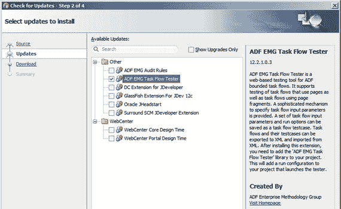

图 2-9.

安装 `ADF EMG Task Flow Tester`

允许 `JDeveloper` 重启，并按照说明开始使用 `ADF EMG Task Flow Tester`。

### 构建主应用程序

主应用程序是所有子系统汇集的地方。它拥有自己的工作区，并使用来自基础层和所有子系统的 ADF 库。在主应用程序工作区中，你仅使用视图/控制器项目——所有业务组件都驻留在基础层或某个子系统中。

### 主应用程序内容

主应用程序包含基于页面模板的主页（是一个完整的页面，而非片段）。

由于页面模板包含所有应用程序装饰（标题栏、徽标等），页面本身将仅包含一个菜单、一个动态区域和一些代码。该代码用于处理动态区域内容的切换，以显示另一个有界任务流。我们将在第 5 章讨论应用程序逻辑时看到必要的代码示例。

### 安全性

最后，你在主应用程序中应用安全性。要应用安全性，请选择 `应用程序 ➤ 安全 ➤ 配置 ADF 安全性` 并完成 `配置 ADF 安全性` 向导。

**注意**

`ADF 安全性` 在运行于 `WebLogic` 和 `WebSphere` 应用服务器上的 ADF 应用程序中可用。如果你运行的是免费的 `ADF Essentials` 版本并部署在 `GlassFish` 上，则无法使用 `ADF 安全性`。你可以通过其他方式（例如 `Apache Shiro`）保护网页，但如果希望在任务流级别限制访问，则必须自行编写授权代码。

### 运行配置 ADF 安全性向导

在第一步中，选择 `ADF 认证和授权` 以请求 `ADF` 处理认证（识别用户）和授权（用户被允许做什么）。

在第二步中，选择 `基于表单的认证` 并勾选 `生成默认页面` 复选框。这将创建包含所有必要信息和字段的基本登录页面。然后你可以修改它们以匹配你的应用程序。`HTTP 基本` 和 `HTTP 摘要` 将登录交给浏览器处理，向用户显示其浏览器用于认证的任何对话框。

在第三步中，选择 `无自动授予` 以表示你将显式分配访问权限。

在第四步中，不要勾选 `认证成功后重定向` 复选框。你通常只想向用户显示主页，而不是重定向到其他页面。

当你完成向导时，你的应用程序即受到安全保护，并将提示你输入用户名和密码。在定义访问权限之前，它也不允许你访问任何内容。

### 定义访问权限

访问权限在安全向导创建的 `jazn-data.xml` 文件中定义。你可以选择 `应用程序 ➤ 安全 ➤ 应用程序角色`，在用户友好的对话框中查看此文件，而不必直接编辑文件本身。

作为应用程序开发者，你为应用程序中不同类型的用户创建应用程序角色。许多应用程序只有一级安全性，即每个经过认证的用户都可以使用应用程序的全部功能。在这种情况下，你只需要一个应用程序角色。其他应用程序有几种用户类型，因此需要多个应用程序角色。

在 `jazn-data.xml` 文件的 `应用程序角色` 选项卡上，你命名这些应用程序角色。在 `资源授权` 选项卡上，你选择资源并将其授予特定角色。如果你有复杂的安全要求，你可能还会使用权利授予（即资源组）。

典型的 `ADF 安全性` 使用以下授权：

*   对应用程序主页的 `网页` 授权，授予每个应用程序角色。
*   对不同任务流的 `任务流` 授权，根据需要授予不同的应用程序角色。

在使用模块化或企业架构的 `ADF 应用程序` 中，任务流在子系统中开发，并通过 `ADF 库` 引入主应用程序。要授予对这些任务流的访问权限，请务必勾选 `显示从 ADF 库导入的任务流` 复选框。

如果你想保护数据集，可以使用 `ADF 实体对象` 授权。如果你想保护单个属性，则使用 `ADF 实体对象属性` 授权。

### 在内置的 WebLogic 中运行

在 `测试用户和角色` 选项卡上，你可以定义测试用户并为他们分配角色。这些用户仅在 `JDeveloper` 内置的 `WebLogic` 服务器中运行应用程序时使用。

你可以将应用程序中定义的应用程序角色分配给单个测试用户或用户组（在 `JDeveloper` 中称为 `企业角色`）。这允许你模拟部署到独立应用服务器时将适用的授权逻辑。

### 部署到测试和生产服务器

当你将应用程序部署到独立的测试和生产服务器时，部署的一部分工作是将应用程序角色映射到服务器上的用户或组。

在典型的企业环境中，你的 `WebLogic` 服务器将与某个身份提供者（例如 `Microsoft Active Directory`）集成。这意味着当你在 `Oracle Enterprise Manager Grid Control` 中分配应用程序角色时，你可以看到并分配给你的 `AD` 用户和组。

例如，你的应用程序可能有 `readonly`、`normal` 和 `superuser` 应用程序角色。在你的身份管理系统中，可能有名为 `Trainee`、`Customer Service` 和 `Senior advisor` 的用户组。部署应用程序时，你可以将 `readonly` 映射到 `Trainee`，`normal` 映射到 `Customer Service`，`superuser` 映射到 `Senior advisor`。

## 总结

你已经了解了 `ADF 库` 如何让你将即使非常大型的企业应用程序的开发也拆分成可管理的部分，以及如何在开始认真构建之前构建所需的所有基础元素。

在下一章中，我们将讨论如何为你的应用程序实现所需的布局和外观。


