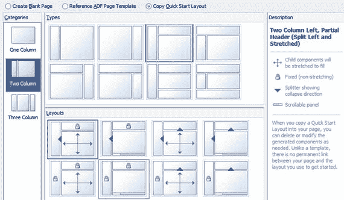

# 3. 布局与皮肤

正如你在第 1 章所看到的，在构建简单的拖放式 ADF 应用程序时，JDeveloper 能够生成可接受的布局和视觉外观。本章将解释如何更深入地控制 ADF 应用程序的布局和外观。

为此，ADF 提供了以下功能：

*   布局组件
*   单独的组件样式设置
*   应用程序级别的皮肤定制

你可以使用诸如 `Panel Grid Layout` 之类的布局组件来排列页面和页面片段上的组件。你可以将布局组件相互嵌套，以实现你想要的确切布局，并通过 `Spacer` 组件来控制元素之间的间距。

要更改单个组件的外观，你可以修改其 `InlineStyle` 属性。ADF 组件由标准的层叠样式表（CSS）格式控制，你可以为一个组件设置显式样式，或定义一个样式类。

整个应用程序中每个组件的外观都由应用程序皮肤控制。一个皮肤包含一个 CSS 文件，可选择性地辅以资源包来自定义 ADF 应用程序中使用的默认字符串，可能还包括你自己的图像文件。你的应用程序始终基于一个默认皮肤，因此你只需要更改那些你希望与默认外观不同的部分。

### 布局

许多年前，第一个使用 Java 生成网页的技术是 JavaServer Pages（JSP）。在 JSP 中，展示逻辑和 Java 代码中的业务逻辑与定义呈现给用户的页面的 HTML 标签混合在一起。这导致网页非常难以维护。随着时间的推移，开发人员学会了将 Java 代码分离到标签库中，以试图清理这种混乱，但正确使用标签库仍然需要开发人员的自律。

JavaServer Faces（JSF）一劳永逸地解决了这个问题。一个 JSF 页面只包含组件，任何展示逻辑都被放在单独的 Java Bean 类中。我们将在第 5 章回到展示逻辑。ADF 基于 JSF，其用户界面组件是 Oracle 提供的特殊 JSF 组件。

一些组件（如数据输入字段和下拉列表）用于显示数据。其他组件执行操作，如执行导航和调用业务逻辑。最后，还有一些组件用于在页面上排列其他组件。这些就是我们本章将要讨论的布局组件。

### 布局管理器 vs. 固定格式

在某些开发工具（例如 Oracle Forms）中，你将组件放置在页面上的固定位置。例如，你可能将一个输入字段放置在位置 x=150, y=220。这意味着该组件将始终放置在距左边距 150 像素、距上边距 220 像素的位置。这种方法让你拥有完全的控制权，但也缺乏灵活性。如果用户在更大的显示器上运行应用程序，所有内容将保持开发人员定义的原样，多余的空间无法被利用。

在 ADF 应用程序中，布局是动态的，可以取决于应用程序运行所在的浏览器窗口的大小。布局由布局管理器组件处理，这些组件负责排列放置在其内部的组件。布局管理器可以控制其他布局管理器，从而形成一个完整的布局管理器层次结构。这允许你创建你想要的确切布局。

一些布局组件仅控制其他元素——例如，面板网格布局控制网格行组件，选项卡面板控制详细信息项。其他布局组件具有可以容纳其他组件的 facet。例如，面板拉伸布局具有 top、bottom、start、center 和 end facet，它们有特定的位置。放置在面板拉伸布局的 top facet 中的组件将始终位于屏幕最上方，而 center facet 中的所有内容将位于其下方。

**注意**

一些组件（如 `panel stretch layout`）具有 start 和 end facet，而不是 left 和 right。这是因为 ADF 支持从右到左的语言，如阿拉伯语、希伯来语或波斯语。如果你的应用程序配置为使用其中一种语言，start facet 会移动到右侧，因为那是阅读开始的地方。

### 可拉伸与不可拉伸

当布局管理器在屏幕上排列组件时，它们会考虑每个布局组件的拉伸属性。ADF 布局组件有四种类型：

*   可以拉伸自身也可以拉伸其子组件的组件
*   自身不可拉伸但可以拉伸其子组件的组件
*   可以拉伸自身但不拉伸其子组件的组件
*   自身不可拉伸且不拉伸其子组件的组件

一个 ADF 应用程序通常从一个可拉伸的外部布局容器开始，该容器会拉伸其子组件（例如，一个行高为 100%、单元格宽度为 100% 的 `Panel Grid Layout`）。这确保你的应用程序将使用所有可用的浏览器空间。

有些组件无法拉伸（例如，`Input Text`），因此你应避免将这些组件作为将尝试拉伸其子组件的布局容器的直接子项。相反，你应该将不可拉伸的组件包装在一个布局组件（如 `Panel Group Layout`）中，该组件本身可拉伸但不拉伸其子组件。

### 快速入门布局

在学习 ADF 布局时，最佳起点是**快速入门布局**。这些布局展示了最佳实践，并随 ADF 一起演进。例如，在早期的 ADF 版本中，快速入门布局的外部布局容器是 `Panel Stretch Layout`。然而，当 ADF 在 11.1.2 版本中引入了改进的 `Panel Grid Layout` 组件后，一些快速入门布局随之改变，以展示使用这个新组件的正确方式。

当你创建一个页面或页面片段时，选择 **复制快速入门布局**，然后选择最接近你想要实现效果的示例。首先，从左侧的“类别”面板中选择列数（一列、两列或三列）。然后，选择一种类型，最后选择一个布局，如图 3-1 所示。

图 3-1. 使用快速入门布局

在布局选择中，你会看到几种不同的图标：

*   四向箭头表示一个区域将尽可能拉伸。这对于页面的主要工作区域是一个很好的选择。
*   挂锁表示一个大小不会改变的区域。JDeveloper 只在边距周围（顶部、左侧、底部，在少数情况下是右侧）提供这些固定大小的区域。这些区域通常用于页面页眉、菜单和任务列表，因为你知道它们只会占用有限的空间。
*   三角形表示 JDeveloper 将使用 `<af:panelSplitter>` 组件。在应用程序中，该组件显示为一条带小三角形的线，用户可以点击三角形来折叠三角形所指向的区域。这通常用于为用户可能不需要一直看到的补充信息创建一个位置。
*   滚动条表示 JDeveloper 将使用一个布局为 `scroll` 的 `<af:panelGroupLayout>`。在应用程序中，如果组件数量超过页面所能容纳的范围，该布局将显示滚动条。单列布局提供垂直滚动条，而两列和三列布局提供水平滚动条。如果你知道页面包含的信息会超出屏幕范围，应使用这些布局。你应尽量避免强制用户滚动。

### 使用面板网格布局

面板网格布局是用途最广泛的布局组件，也可能是你使用最多的组件。它还有一个额外优势，即其布局方式与 HTML 表格的布局方式相匹配，因此与其他 ADF 布局组件相比，它提供了更好的性能。

