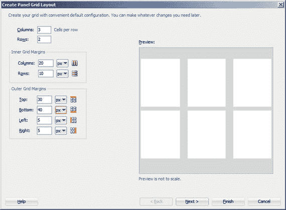
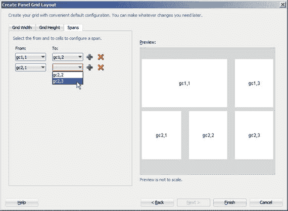
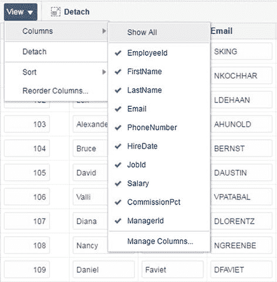
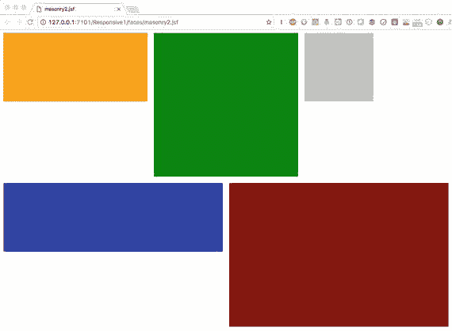
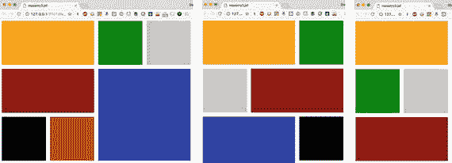

# 创建你自己的面板网格布局

你也可以从“组件”窗口中向页面添加面板网格布局。如果你希望更详细地控制页面某部分的布局，这会很有用。经验丰富的 ADF 开发者也常常先创建空白页面，然后自己添加布局组件。

当你将面板网格布局组件放到页面上时，“创建面板网格布局”向导会出现，如图 3-2 所示。



图 3-2. “创建面板网格布局”向导

你需要决定行数和列数以及边距。内部网格边距定义了网格内行和单元格之间的间距，而外部网格边距则定义了面板网格布局边缘与最外层单元格之间的间距。例如，在上图中，从网格布局顶部到第一行为 30 像素，行与行之间为 10 像素，最后一行与面板网格布局底部之间为 40 像素。

在向导的第二步，你可以定义单元格的初始宽度和高度，并定义某些单元格是否应跨越多行或多列。

你在“网格宽度”选项卡上所做的选择将用作该列所有单元格的宽度属性。默认情况下，JDeveloper 向导以百分比指定宽度，在列之间均匀分配空间。

提示： 以百分比指定单元格宽度，并确保总和为 100%。如果你混合使用单位（例如像素和百分比）或没有分配所有空间，结果将是未定义的。

你也可以将宽度设置为`auto`（自动）或`dontCare`（不关注）。对于单元格，`auto`宽度意味着它将根据单元格中的组件进行大小调整。单元格的`dontCare`设置意味着该列中的其他单元格可以定义宽度。你可能不希望将整个列设置为`dontCare`，因为这意味 ADF 可以自由地给该列任何它想要的宽度。

在“网格高度”选项卡上，行高始终是`auto`，意味着高度由行中的组件定义。向导完成后，你可以将高度更改为百分比（相对于尚未分配给其他行的空间）。

在如图 3-3 所示的“跨度”选项卡上，你可以指定是否有任何单元格跨越多行或多列。你可以在右侧的预览中看到单元格的名称——它们将被命名为类似`gc1,3`的形式。



图 3-3. 网格布局中的行和列跨度

你通过定义“起始网格单元格（左上角）”和“结束网格单元格（右下角）”来定义每个跨度。JDeveloper 会尝试在第二个下拉列表中只显示有意义的选项，但你也可以创建无意义的、不合理的跨度。在这种情况下，应用程序中的显示效果当然是未定义的。

当你完成向导时，JDeveloper 会创建一个`<af:panelGridLayout>`标签，并在其中放置必要的`<af:gridRow>`和`<af:gridCell>`标签，并设置相关属性。你可以在“属性”窗口或源代码视图中更改这些属性。跨度由`columnSpan`和`rowSpan`属性控制：你为这些属性设置的值表示你希望合并的单元格数量。这与 HTML `<td>`标签使用`colspan`和`rowspan`属性的方式类似。

### 使用面板表单布局

一种非常常见的布局是将多个输入元素排列在一列中，彼此上下相邻。你可以使用面板网格构建这种布局，但 ADF 为此提供了一个专门的布局管理器：面板表单布局（`<af:panelFormLayout>`）。

你可以通过从“组件”窗口将“面板表单布局”组件拖到页面上来创建此布局。当你像第 1 章中看到的那样，从“数据控件”窗格将集合放到页面上时，JDeveloper 也会使用面板表单布局。

在面板表单布局内部，你可以放置所需的数据组件。通常，你会从“数据控件”面板将这些组件作为单个属性拖入，以便 JDeveloper 自动创建必要的数据绑定。

面板表单布局包含一个页脚 facet，通常用于放置导航按钮、保存数据或执行业务逻辑的按钮，这些按钮通常放置在面板组布局内。例如，当你将视图对象实例作为 ADF 表单放下并选中“行导航”复选框时得到的代码，看起来如清单 3-1 所示。

```
清单 3-1. 面板表单布局示例
```

控制面板表单布局的两个最重要的属性是`MaxColumns`（最大列数）和`Rows`（行数）属性。

*   `Rows`控制 ADF 在开始新列之前渲染多少个输入元素。如果未输入值，所有输入元素将显示在一列中。例如，如果你将值设置为 10，ADF 将在第一列中渲染前 10 个元素，然后为第 11 到 20 个项目开始第二列。
*   `MaxColumns`定义允许的列数——桌面应用程序的默认值为 3，在平板电脑或智能手机上运行时默认值为 2。

如果你的元素数量超过了`Rows`乘以`MaxColumns`，则`MaxColumns`限制具有优先权。也就是说，如果你有 30 个元素，`Rows`为`8`，`MaxColumns`为`3`，ADF 将遵守`MaxColumns`限制并覆盖`Rows`设置，将你的元素渲染为 10 行乘以 3 列。


### 使用面板集合布局

另一个专门的布局组件是面板集合布局（`<af:panelCollectionLayout>`）。该组件旨在与`<af:table>`组件一起使用，以同时显示多条数据记录。

它包含三个方面：
*   `menus` 方面用于在面板集合布局提供的内置菜单项之外添加额外的项目。
*   `toolbar` 方面用于当你需要带按钮的工具栏时。
*   `statusbar` 方面用于在表格下方的状态栏中显示附加信息。

要使用面板集合，请从“组件”窗口将其放置到你的页面上。然后，从“数据控制”窗格将一个集合以 ADF 表的形式放置到面板集合上。如果你已经将集合放置为表格，可以右键单击表格组件并选择“源” ➤ “环绕”，然后在“环绕方式”对话框中选择“面板集合”。

默认情况下，面板集合会显示为表格上方的一行额外内容。它包含一个“视图”菜单，其功能包括选择要显示的列、如何对列进行排序等。图 3-4 展示了默认菜单。



图 3-4.

带有 ADF 表格的面板集合

你可以通过在“源”视图或 JDeveloper 窗口左下角的“结构”面板中将菜单组件（`<af:menu>`）放置到 `menus` 方面，在内置的“视图”菜单旁边添加额外的菜单。在此菜单内部，你添加菜单项，通常是 `<af:commandMenuItem>`，它们会调用你编写的 Java Bean 类中的方法。我们将在第 5 章回到 Java Bean 的讨论。

如果你想直接向面板集合的顶部栏添加按钮，可以将工具栏（`<af:toolbar>`）放置到“工具栏”方面，然后将按钮组件（`<af:button>`）放置到工具栏上。

要在表格下方创建状态栏，你需要将工具栏放置到 `statusbar` 方面，然后在状态栏中放置所需的组件。通常，这会是一个输出文本组件，其值属性设置为某种计算出的状态。在第 4 章，我们将回到如何在 Java 代码中计算值并将其显示在输出文本中。

### 使用选项卡和手风琴式布局

如果你的信息量超出一页所能容纳的范围，并且用户需要能够在所有元素之间快速来回切换，你可以考虑使用选项卡或手风琴式布局对其进行分组。两者都是交互式容器项，它们包含其他布局组件，而这些布局组件又包含用户将与之交互的实际数据元素或操作项。

### 面板选项卡式布局

我们已经在第 1 章末尾讨论过面板选项卡式布局组件。该组件在运行应用程序时，会将其中的每个详细信息项渲染为单独的选项卡。当你将面板选项卡式布局（`<af:panelTabbed>`）放置到页面或页面片段上时，JDeveloper 会显示“创建面板选项卡式布局”向导。在此向导中，你可以定义所有选项卡并选择它们的放置位置（上方、下方、上下方、左侧、右侧、起始端或末尾端）。起始端和末尾端位置会遵循你的区域设置，对于像英语这样从左到右的语言显示在左侧，对于像阿拉伯语这样从右到左的语言显示在右侧。

该向导当然是创建多个组件的快捷方式。如果你后来决定更改选项卡放置位置，可以更改“位置”属性。如果你发现需要一个额外的选项卡，可以从“组件”窗口添加一个“显示详细信息项”，或者在“源”视图中编写或复制一个 `<af:showDetailItem>` 标签。

如果你的所有选项卡无法在屏幕上完全显示，ADF 将自动显示左右滚动箭头，以及一个“列出所有选项卡”图标（一个向下的三角形）。

### 面板手风琴式布局

另一个允许用户在应用程序的不同视图之间进行选择的布局组件是面板手风琴式布局。它以这种可以展开和收缩的乐器命名。

当你从“组件”窗口将面板手风琴式布局放置到页面上时，会出现“创建面板手风琴式布局”向导。与创建选项卡式布局的向导类似，此窗口允许你定义手风琴式布局内部的窗格。在对话框顶部，你可以在“一次显示一个窗格”和“同时显示多个窗格”之间进行选择。如果你选择一次显示一个，那么当用户选择一个新的窗格时，打开的手风琴式窗格将自动关闭。当然，如果你选择只允许一个窗格打开，你只能为一个窗格选择“已披露”。如果你选择允许多个窗格打开，“已披露”列将变为复选框，你可以选择多个窗格。

如果你以后想添加一个新窗格，只需将“显示详细信息项”放置到面板手风琴式布局内部即可。要在显示一个和多个窗格之间切换，你需要更改“披露多个”属性的值。对于手风琴式布局中的每个详细信息项，你可以通过设置“已披露”属性来控制其是否最初显示。

提示

你可以仅通过更改面板组件，在面板选项卡式布局和面板手风琴式布局之间进行转换。“显示详细信息项”组件在这两种面板类型中的工作方式相同。

### 其他布局组件

面板网格布局、面板表单布局和面板集合布局是最常用的布局组件，而面板选项卡式布局和面板手风琴式布局在页面非常复杂时可以提供帮助。除此之外，ADF 还提供了许多其他布局组件，包括：

*   面板拉伸布局，其中心方面用于放置内容，可选的上、下、起始端和末尾端方面用于放置附加信息。
*   面板分割器，具有两个方面，其中一个方面可以折叠。这允许用户在单个方面使用整个屏幕区域或在两个方面之间分割屏幕之间做出选择。
*   显示详细信息提供了一个可折叠区域，可用于补充信息或可选输入。请注意，“显示详细信息”与“显示详细信息项”不同。“显示详细信息”是独立使用的，而“显示详细信息项”是在面板选项卡式布局、面板手风琴式布局或其他布局容器的上下文中使用的。
*   卡片组在不同视图之间提供过渡效果（如幻灯片放映），而面板仪表板允许你创建一个带有框格的布局，用户可以重新排列这些框格。

有时，你可能只想对布局额外调整一点间距，例如，为了更好地对齐项目。为此，你可以使用间距组件。这些不可见的组件具有你可以以像素为单位设置的固定宽度和高度。

注意

建议的对齐方法是使用正确配置的面板网格布局。你的设计不应依赖于间距组件。

### 响应式设计

响应式设计意味着构建能够根据可用屏幕尺寸而变化的应用程序。其理念是构建一个应用程序，使其在大型桌面工作站和平板电脑甚至智能手机等小型设备上都具有良好的显示效果。ADF 12c 第 2 版（12.2.x）有两个功能使这一点更容易实现：瀑布流布局和匹配媒体行为。


### 瀑布流布局

瀑布流布局管理器以网格形式动态排列特殊格式的详细信息项。虽然“瀑布流”这个名字可能让人联想到固定的墙壁，但实际上它是一种非常动态的布局，会在页面首次渲染时排列“砖块”，并在应用程序浏览器窗口每次更改大小时重新排列它们。ADF 文档将砖块称为瓦片。

这种布局适用于仪表板类型的应用程序，其中有许多小的信息元素需要呈现。小型数据可视化组件（如环形图）在瀑布流布局中效果很好，既可以单独使用，也可以作为链接指向包含更详细信息的其他页面。

有几种不同的布局组件可以用作砖块——最常见的是 `Panel Box` 和 `Panel Group Layout`。文档没有具体说明哪些组件适用，但大多数组件不能作为砖块在瀑布流布局中使用。

**提示**

在当前版本的 JDeveloper (12.2.1.2.0) 中创建瀑布流布局时，它默认填充了两个 `Panel Box` 组件。默认的 `Panel Box` 可以折叠，但不幸的是，瀑布流布局不会注意到这一点，从而导致布局错位。将 `Show Disclosure` 属性更改为 `false`，这样用户就不会弄乱瀑布流布局。

就像乐高积木一样，瀑布流布局中的砖块都必须具有标准尺寸。瀑布流布局的默认最小砖块尺寸为 170 × 170 像素，所有其他砖块都是此尺寸的倍数，同时考虑了砖块之间的间距。

## 砖块尺寸

瀑布流布局中组件的尺寸必须使用 `Style Class` 属性来定义。Oracle 为我们提供了八种标准尺寸：

*   `AFMasonryTileSize1x1`
*   `AFMasonryTileSize1x2`
*   `AFMasonryTileSize1x3`
*   `AFMasonryTileSize2x1`
*   `AFMasonryTileSize2x2`
*   `AFMasonryTileSize2x3`
*   `AFMasonryTileSize3x1`
*   `AFMasonryTileSize3x2`

如果这些尺寸都不符合您的需求，瀑布流布局还可以识别更高的尺寸类名，最高可达 `AFMasonryTileSize10x10`。但是，如果您想使用这些更大的尺寸，必须在您的皮肤 CSS 文件中定义相应的 CSS 类。

1 × 1 砖块的默认尺寸是 170 × 170 像素。默认边框是 8 像素，因此两个相邻砖块之间的距离是 16 像素。为了使瀑布流正确对齐，较大的砖块尺寸必须是基础尺寸加上砖块间距的倍数。例如，两个相邻的 1 × 1 砖块的总宽度是 2 × 170 像素 + 它们之间 2 × 8 像素的边框。因此，2 × 1 砖块的宽度是 356 像素。

**注意**

可以在您自己的 CSS 文件中覆盖 `AFMasonryTileSize` 类，从而创建具有不同砖块尺寸的瀑布流布局。因为瀑布流布局是 ADF 12.2 中的一项全新功能，仍有一些不足之处，所以不建议使用非标准的砖块尺寸。

## 运行时砖块对齐

在运行时，ADF 通过按照它们在 `<af:masonryLayout>` 标签内列出的顺序添加砖块来呈现瀑布流布局。它们按照从左到右的阅读顺序添加（除非您的 ADF 应用程序配置为从右到左的语言）。砖块一次添加一个，直到下一个砖块无法再放入当前行。无法放入的砖块将成为新行的第一个砖块。一旦布局有多行，ADF 就会尝试将下一个砖块放入每行的任何开放空间中。只有当它无处可放时，才会将其添加到底部行的末尾。

例如，如果一个宽的 3x1 砖块导致 ADF 开始第二行，它仍然可能将任何后续的 1x1 或 2x1 砖块放入第一行。同样，ADF 会尝试填充由不同高度的砖块留下的任何空隙。

## 瀑布流最佳实践

如果您有很多大砖块，如图 3-5 所示，ADF 无法真正将它们很好地组合成一个美观的布局。



图 3-5. 瀑布流布局中有太多大砖块

要使瀑布流布局良好运行，您需要有充足的小 (1 × 1) 砖块供应，以便 ADF 可以将它们放入大砖块留下的任何空间中，如图 3-6 所示。



图 3-6. 有足够小砖块的瀑布流布局

在大显示器上，瀑布流布局最终会变成单行，如图 3-7 所示，除非您限制它。


图 3-7. 非常宽的瀑布流布局

为了避免这种情况，您可以将瀑布流布局放置在另一个具有宽度限制的容器内。您可以将其放在一个 `Panel Group Layout` 中，并将其 `InlineStyle` 属性设置为，例如 `max-width:750px`。

### 屏幕相关格式化

瀑布流布局是实现响应式设计的一种自动方式——ADF 尽可能地将定义的砖块放入布局中。

然而，ADF 还提供了另一种根据屏幕大小控制页面布局的方法：通过 `<af:matchMediaBehavior>` 标签。当您将此标签放置在另一个组件内部时，它可以控制其周围标签的某些属性。例如，您可以控制 `Panel Form Layout` 的 `Rows` 属性，如代码清单 3-2 所示。

```
...
```

代码清单 3-2. 使用 `<af:matchMediaBehavior>`

在此示例中，`Panel Form Layout` 的 `Rows` 属性具有默认值 `6`，但如果屏幕尺寸低于 768 像素，`Rows` 的值将更改为 `12`。

`<af:matchMediaBehavior>` 的属性指定了要更改的包含标签的哪个属性（`propertyName`），以及该属性的值应是什么（`matchedPropertyValue`）。条件放在 `mediaQuery` 属性中，并遵循标准的 CSS3 媒体查询语法。

重要的是，该属性必须在包含标签中显式定义——在本例中，即 `Panel Form Layout` 必须定义了 `Rows` 属性。否则，您的应用程序将因 `NullPointerException` 而失败。

在撰写本书时当前版本的 ADF (12.2.1.2.0) 中，`<af:matchMediaBehavior>` 标签除了文档中的一个简短示例外没有其他文档——它甚至没有出现在在线标签文档 [`docs.oracle.com/middleware/12212/adf/tag-reference-faces/toc.htm`](http://docs.oracle.com/middleware/12212/adf-tag-reference-faces/toc.htm) 中。它似乎无法做太多事情，除了更改这个特定属性。如果您能更改元素的宽度，那将非常有用，但在当前版本中似乎无法实现。如果能够更改 `Rendered` 属性（控制特定组件是否显示），那也将是一个极好的功能。

**注意**

请查阅文档和标签指南，以了解 `<af:matchMediaBehavior>` 的功能是否自本书撰写以来有所改进。

