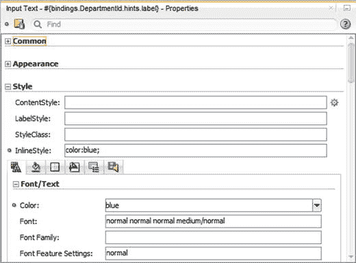
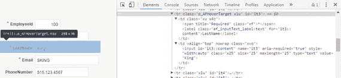
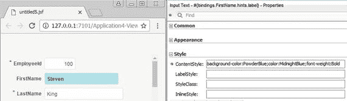
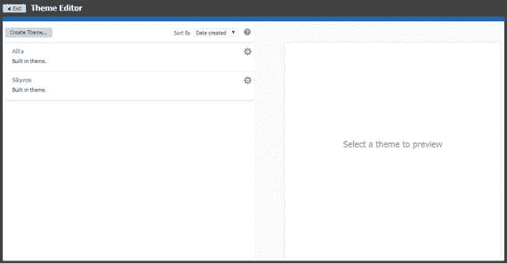
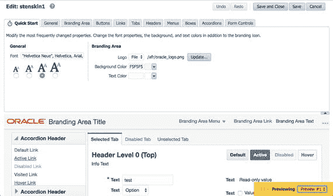
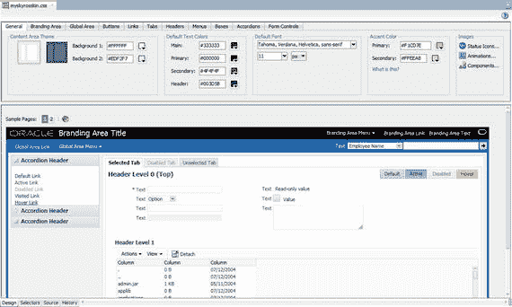
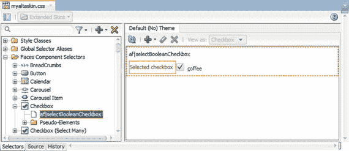

# 样式

所有 ADF 组件都有可接受的默认视觉外观。然而，大多数组织都希望以某种方式更改外观，而 ADF 支持这一点。由于 ADF 应用程序是在浏览器中运行的 Web 应用程序，因此普通的层叠样式表 (CSS) 样式适用于 ADF 组件。本节介绍如何更改单个组件的外观。

几乎每个 ADF 组件都有一个 `InlineStyle` 属性，您可以在其中编写 CSS 样式。一些组件还有一个 `ContentStyle` 属性，少数组件还有一个额外的 `LabelStyle` 属性。

还有一个 `StyleClass` 属性，您可以在其中输入对 CSS 样式类的引用。使用此属性需要您的应用程序有一个单独的 CSS 文件。


### 内联样式

`InlineStyle`属性与下方六个选项卡中的许多特定 CSS 样式字段相关联。您可以直接在字段中编写 CSS 样式，也可以在选项卡上进行选择和输入文本。JDeveloper 会自动保持`InlineStyle`字段与选项卡上众多字段的同步，如图 3-8 所示。



图 3-8. 设置 InlineStyle

不幸的是，设置`InlineStyle`并不总能得到您预期的结果。原因是当某些 ADF 组件在浏览器中呈现时，会变成相当复杂的 HTML 结构。例如，图 3-9 展示了 Input Text 组件在运行时在浏览器中查看时，使用 Google Chrome 的开发者工具所呈现的样子。



图 3-9. Input Text 的 HTML

一个组件变成了一行 HTML 表格行（`<tr>`），其中包含一个用于标签的单元格（`<td>`）和一个用于实际字段的单元格。为 Input Text 设置`InlineStyle`会影响 HTML 表格行，但不会影响标签单元格或输入字段。

### 内容样式

为了解决将样式应用于项内容而非其周围整个 HTML 标签的问题，ADF 提供了设置`ContentStyle`的选项。您放入此字段的 CSS 格式会影响组件的内容。例如，在 Input Text 组件中，它会影响显示和可更改值的字段。

您必须在`ContentStyle`字段中编写正确的 CSS——不像在`InlineStyle`字段下方的带图标的六个选项卡那样提供输入帮助。如果您不擅长 CSS 命令，可以在选项卡上进行选择，然后将完成的 CSS 表达式从`InlineStyle`移动到`ContentStyle`。图 3-10 展示了使用`ContentStyle`的示例。



图 3-10. 设置 ContentStyle

### 标签样式

一些 ADF 输入组件包含作为组件一部分的标签元素。图 3-9 显示，整个输入文本元素是一个表格行，有两个单元格分别用于标签和内容。`InlineStyle`应用于所有内容，`ContentStyle`应用于内容，而`LabelStyle`则应用于标签文本和背景。

与`ContentStyle`类似，您必须在`LabelStyle`属性中编写有效的 CSS，并且无法从该属性下方的样式选项卡获得任何帮助。

### 样式类

如果您要为大量元素添加相同样式，将 CSS 存储在一个地方并重用是明智的。皮肤包含一个 CSS 文件，但根据您用于创建皮肤的工具，您可能能够也可能无法将自己的样式类添加到皮肤 CSS 文件中。

| 皮肤编辑器 | 能否在皮肤中使用自定义 CSS 类？ |
|---|---|
| JDeveloper 内置皮肤编辑器 | 可以，在源代码视图中 |
| 主题编辑器 Web 应用程序（来自 12.2.1） | 不可以 |

如下一节关于“皮肤化”所述，主题编辑器是更改应用程序皮肤的最简单工具。然而，因为它将开发人员与 CSS 细节隔离，所以它不提供定义自定义样式类的能力。

相反，您必须在公共 UI 项目中创建一个 CSS 文件，并使用`<af:resource>`标签将其添加到您的页面和页面片段模板中。然后，CSS 文件中定义的类可以在`StyleClass`属性中使用。

注意

CSS 文件中的样式类定义使用点号表示法，如`.veryImportant`。设置`StyleClass`属性时不带点号（`veryImportant`）。

### 条件样式

所有样式属性也可以变为动态的（即，值由 Java 代码计算）。我们将在下一章讨论用户界面编程时看到一个这方面的例子。

## 皮肤化

所有 ADF 应用程序的外观都由其皮肤控制。在 ADF 的发展过程中，ADF 应用程序有过许多不同的外观。上一代是 Skyros 皮肤，最新的是 Alta 皮肤。Oracle 建议您对所有新的应用程序开发使用 Alta 皮肤并遵循 Alta 指南。这也是 Oracle 自己在包括 Application Express (APEX)和 Oracle JET 在内的所有产品中正在做的事情。因此，如果组织使用 ADF 以外的其他 Oracle 开发工具，应用程序之间将会有共同之处。

Oracle Alta 涵盖了许多用户体验方面，Oracle 创建了一个完整的网站来介绍 Alta 的使用。它解释了视觉风格并提供了用户体验设计模式。这些设计模式基于 Oracle 的用户体验研究，并解释了设计页面和实现特定功能的最佳方式。您可以在[`www.oracle.com/webfolder/ux/middleware/alta/index.html`](http://www.oracle.com/webfolder/ux/middleware/alta/index.html)找到所有关于 Oracle Alta 的资料。

### 使用皮肤

创建 CSS 文件是 Web 开发中的一个专业领域，而 ADF 皮肤是特别复杂的 CSS 文件。Oracle 一直在尝试许多不同的方法，以使普通开发人员能够相对容易地创建 ADF 皮肤，而且看起来他们还没有找到最终的解决方案。

在撰写本文时，JDeveloper 的版本是 12.2.1.2.0，您可以通过两种方式创建和编辑皮肤：

*   在 JDeveloper 内部
*   使用独立的主题编辑器 Web 应用程序

独立的主题编辑器最容易使用，但不允许您编辑应用程序的每个方面。主题编辑器用户界面使用“主题”一词，但主题与皮肤是相同的。

在 JDeveloper 中，您可以进行任何更改，但 JDeveloper 皮肤编辑器不如主题编辑器用户友好。不幸的是，您必须在两者之间做出选择。Oracle 文档声称可以在 JDeveloper 中基于在主题编辑器中创建的主题创建皮肤，但这在撰写本文时的当前 JDeveloper 版本（12.2.1.2.0）中似乎不起作用。

注意

推荐的方法是在主题编辑器中创建您的皮肤。如果主题编辑器的功能证明不够，请在 JDeveloper 皮肤编辑器中创建皮肤，并将 CSS 从您的主题复制并粘贴到 JDeveloper 皮肤编辑器的源代码选项卡中。

### 设置主题编辑器

主题编辑器是一个 Web 应用程序（EAR 文件），它随 JDeveloper 一起提供。要设置它，您需要在 JDeveloper 中创建一个应用程序工作区，并配置应用程序以存储您正在处理的皮肤：

1.  选择 文件 ➤ 新建 ➤ 应用程序 ➤ 来自 EAR 文件的应用程序
2.  选择主题编辑器 EAR 文件`<jdeveloper_install_dir>\jdeveloper\skineditor\skin-editor-webapp.ear`并完成向导
3.  在 JDeveloper 中，打开`web.xml`文件并添加以下上下文初始化参数（`SKIN_REPOSITORY`参数可能已存在）：

    ```
    将此上下文参数设置为 file，以便主题保存到临时目录。
    为 oracle.adf.view.rich.SKIN_REPOSITORY_FILE_PATH 指定一个目录位置，
    以便在服务器重启之间保留更改。
    oracle.adf.view.rich.SKIN_REPOSITORY
    file

    将此上下文参数设置为保存主题的目录位置。
    用于在服务器重启之间保留更改。
    oracle.adf.view.rich.SKIN_REPOSITORY_FILE_PATH
    C:\\JDeveloper\\adfskins
    ```

然后保存并关闭`web.xml`文件。

`SKIN_REPOSITORY_FILE_PATH`的值是主题编辑器存储您的皮肤文件的位置。在 Windows 上，您需要将反斜杠写两次，如上所示。在 Mac 和 Linux 上，文件路径只包含正斜杠，只需要写一次，像这样：`/Users/sten/jdeveloper/adfskins`。


### 创建和管理皮肤

### 创建皮肤

如果你使用的是第 2 章中描述的模块化架构，你只需要一个特定于应用程序的皮肤。

如果你使用的是企业级架构，你应该先创建一个以你的组织命名的企业皮肤。然后，为每个应用程序创建一个特定于应用程序的皮肤。这个皮肤应该以应用程序命名，并扩展你的企业级皮肤。`Theme Editor`和`JDeveloper`皮肤编辑器都允许你基于先前定义的皮肤来创建新皮肤。

完成上一节描述的设置后，你可以在`skin-editor`项目中，右键单击`Web Content`下的`index.html`文件，然后选择`运行`。这将在`JDeveloper`内置的`WebLogic`服务中启动`Theme Editor` Web 应用程序，并为你打开浏览器开始处理你的皮肤。`Theme Editor`的初始页面将如图 3-11 所示。


图 3-11. 主题编辑器初始视图

从这个视图，你可以点击`创建主题`按钮来创建一个新的皮肤。

注意：请记住，该工具使用"主题"一词来指代一个`ADF`皮肤。

通常，你应该基于现有的`Alta`皮肤来创建新皮肤。在企业级`ADF`架构中，你的应用程序特定皮肤应该基于你的企业皮肤，而你的企业皮肤又应该基于`Alta`皮肤。

### 修改皮肤

你可以点击你的皮肤，进入皮肤编辑页面，如图 3-12 所示。


图 3-12. 主题编辑窗口

使用此 Web 应用程序中的不同选项卡，你可以更改应用程序的外观。你的更改效果会显示在浏览器窗口的下半部分，你可以在多个预览之间切换。

如前所述，当你保存皮肤时，其文件将存储在`SKIN_REPOSITORY_FILE_PATH`位置。会有一个以你的皮肤名称和版本命名的目录，在该目录中，你会找到实际的`CSS`皮肤文件。如果你添加（上传）了任何自己的资源，如徽标或图标，它们将成为皮肤的一部分，并存储在`resources`子目录中。

### 导出皮肤

当你完成对皮肤的必要修改后，可以使用`Theme Editor`概览页面上的齿轮图标将其导出为`ADF`库。你的皮肤会获得一个系统生成的名称，你应该将其更改为有意义的名称。

与其他`ADF`库一样，一旦你的皮肤经过测试，就应该将其移动到你的公共`ADF`库目录中，以便你的`ADF`子系统和主应用程序可以使用它。

### 使用皮肤

要在子系统或主应用程序中使用皮肤，首先需要将皮肤`ADF`库文件添加到你的应用程序中。添加方式与添加其他`ADF`库相同，如第 2 章所述。将其放入你选择的`ADF`库位置后，它应该会显示在文件系统连接下的`资源`窗口中。右键单击该库并将其添加到你的项目中。

然后在视图/控制器项目中找到`trinidad-config.xml`文件。在`应用程序`窗口的树状结构中，你可以在`Web Content` ➤ `WEB-INF`下找到此文件。

在此文件中，你只需将`<skin-family>`标签内的值更改为你皮肤的系列名称。这就是为你的子系统或应用程序重新设置皮肤所需的全部操作。

### 测试

因为皮肤是静态文件，内置的`WebLogic`服务器倾向于缓存它们。这意味着当你重新运行应用程序时，你的更改不会显示。

为了限制这种缓存（在开发或测试环境中），你可以将上下文初始化参数`org.apache.myfaces.trinidad.CHECK_FILE_MODIFICATION`设置为`true`。该参数的描述说明：

> "如果此参数为 true，将自动检查你的 JSP 的修改日期，并在 JSP 更改时丢弃保存的状态。它还会自动检查你的皮肤 CSS 文件是否已更改，而无需重启服务器。这使得开发更容易，但增加了开销。因此，在应用程序部署时，此参数应设置为 false。"

即使设置了此参数，你仍然需要在再次运行之前停止你的应用程序（从`进程`窗口）。

注意：简单地右键单击并选择`运行`将导致重新部署，而你的皮肤更改不会生效。

如果你使用像`Firebug`或`Google Chrome 开发者工具`这样的工具检查正在运行的`ADF`应用程序，你会看到所有样式都有像`xrs`这样的短名称。这是`ADF`出于性能原因自动进行的优化，但在开发过程中，你可以禁用它以查看完整的样式类名。为此，请将`org.apache.myfaces.trinidad.DISABLE_CONTENT_COMPRESSION`参数更改为`true`。

### 使用 JDeveloper 皮肤编辑器

如果你需要比`Theme Editor`更强大的皮肤功能，可以在`JDeveloper`内创建一个`ADF`皮肤。当你打开皮肤`CSS`文件时，`JDeveloper`会识别出该文件是皮肤的一部分，并在专门的视图中显示它。

对于基于 Oracle 旧版`Skyros`皮肤的皮肤，`JDeveloper`会显示一个包含`设计`选项卡的皮肤视图，如图 3-13 所示。


图 3-13. JDeveloper 中的皮肤设计视图

在此选项卡上，`JDeveloper`会尝试显示你所做的更改的效果。该皮肤视图还有一个`选择器`视图（将在下文描述）和一个显示原始`CSS`文件的`源码`视图。

基于 Oracle 较新的`Alta`皮肤的皮肤不显示`设计`选项卡。相反，你需要使用图 3-14 所示的`选择器`选项卡。在此选项卡上，你可以在左侧的树状结构中选择`ADF`设计元素，在`属性`窗口中进行更改（图 3-13 中未显示），然后在右侧查看结果。


图 3-14. JDeveloper 中的皮肤选择器视图

`JDeveloper`皮肤编辑器比`Theme Editor`功能更强大，但也更难使用。基于旧版`Skyros`皮肤的皮肤可以使用`设计`视图，但对于推荐使用的基于`Alta`皮肤的皮肤，你必须在对开发人员不太友好的`选择器`视图中工作。

## 结论

现在你可以控制应用程序的外观了。你可以安排屏幕上的元素，通过样式设置更改单个组件的视觉外观，并通过使用`ADF`皮肤更改整个应用程序的外观。在下一章中，我们将看到如何向应用程序添加表示逻辑。


