# 4. 业务逻辑

您应用程序的许多核心功能都将在业务组件中实现。ADF 提供了多种无需编写代码即可添加简单业务逻辑的方法，但使您的应用程序独具特色的大部分功能将通过 Java 和/或 Groovy 来实现。

**注意**

Groovy 是一种与 Java 集成的脚本语言，它像 Java 代码一样在 Java 虚拟机中运行。Groovy 的语法比 Java 更简洁，这使其成为用于定义默认值或编程式验证等场景的代码片段的良好选择。

编写企业级 Java 应用程序的一个难点在于创建适合您试图解决的特定业务问题的对象层次结构。然而，在 Oracle ADF 应用程序中，这并非必需。凭借实体对象、视图对象和应用程序模块的概念，Oracle ADF 建立了一个最佳实践的对象层次结构，您只需通过重写或向 ADF Java 对象添加方法来填补空白。这是即使对于 Java 知识有限的开发者而言，ADF 也能如此高效的原因之一。

### 实体对象中的逻辑

我们发现，最接近数据库的是实体对象。您添加到实体对象中的逻辑将应用于整个应用程序，因为所有数据访问都通过这些对象进行。ADF 会在需要时自动创建业务组件类的实例。如第 2 章所述，您应该利用选项创建自己的业务组件基类，这些基类扩展了 Oracle 提供的类。

您在这些自定义基类中需要编写的 Java 代码量将取决于您的应用程序需求：

*   如果 ADF 实体对象的声明式功能已足够，则无需向基类添加逻辑或为实体对象创建特定的 Java 类。在这种情况下，ADF 只是创建并配置相关业务组件基类的一个实例。
*   如果您想更改所有实体对象的工作方式，则需要在您的实体对象基类（位于您基础工作区中的 BCBase 项目内）中重写方法。
*   如果您想更改特定实体对象的工作方式，则需要为该实体对象创建一个 Java 类，并扩展基类。

某些逻辑（例如，计算默认值或编程式验证）根本不需要 Java 代码，而可以通过更简单的 Groovy 脚本来处理。

### 默认值

要为属性设置虚拟默认值，请在实体对象的“属性”选项卡上选择它，然后填写“详细信息”选项卡右下角的“默认值”部分。图 4-1 展示了如何使用 Groovy 表达式定义默认值。

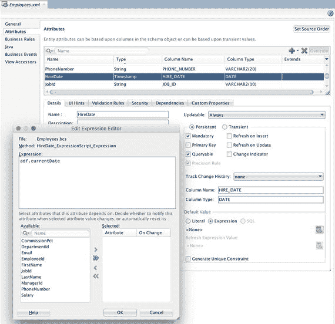

**图 4-1.** 使用 Groovy 表达式定义属性默认值

在 Groovy 表达式中，您可以直接使用属性名引用当前实体对象中的属性，使用特殊的 `adf` 对象，并执行常规计算和逻辑。在前面的示例中，我们使用了内置的 `adf.currentDate` 函数为 `HireDate` 提供默认值。有关内置 `adf` 对象以及如何使用 Groovy 表达式的更多信息，请参阅 Oracle 手册《使用 Oracle 应用程序开发框架开发 Fusion Web 应用程序》中的“将 Groovy 脚本语言与业务组件配合使用”部分。

**提示**

表达式编辑器中的“帮助”按钮会显示一些基本的帮助信息，并包含指向手册中前述部分的链接。

Groovy 表达式存储在独立的 `.bcs`（业务组件脚本）文件中。在 ADF 业务组件的某些地方，Groovy 脚本会显示为超链接，您可以单击该链接在完整的编辑器窗口中打开 `.bcs` 文件。

### 验证

典型应用程序中的许多业务逻辑处理数据验证。ADF 提供了多种方法，可以轻松地为属性或整个实体对象定义验证。

### 声明式验证

要向实体对象添加验证，请打开它，然后选择左侧的“业务规则”选项卡。然后，您可以右键单击“实体验证器”节点以指定整个实体对象的验证，或右键单击单个属性以向该属性添加验证器。此时会出现“添加验证规则”对话框，如图 4-2 所示。

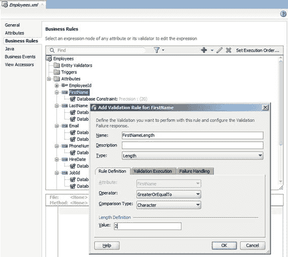

**图 4-2.** 为实体属性添加验证规则

有许多可用的验证规则类型：

*   集合（仅实体级别）
*   比较
*   键存在
*   长度
*   列表
*   方法
*   范围
*   正则表达式
*   脚本表达式
*   唯一键（仅实体级别）

“比较”验证非常有用，它可以将属性值与字面值、同一实体对象中的另一个属性、另一个实体对象中的属性，甚至 SQL 查询的结果进行比较。

“长度”和“范围”验证根据字面值对属性值提供简单的检查。

“键存在”和“列表”验证检查某个属性是否作为键存在于其他实体中，或者该属性是否是特定允许值列表的一部分。您不应依赖这些验证，而应创建只允许用户选择有效值的用户界面。同样，您应该自动生成唯一键，而不是依赖实体级别的“唯一键”验证。

要验证高级格式，您可以使用“正则表达式”验证。这些表达式使用非常具体的语法编写，允许您指定诸如“两个大写字母，后跟一到四个数字”之类的规则。JDeveloper 为您提供了一些示例，包括电子邮件验证，其表达式如下：

```
[a-zA-Z0-9._%+-]+@[a-zA-Z0-9.-]+\.[a-zA-Z]{2,4}
```

正如这个例子所表明的那样，习惯这种语法需要一点功夫。虽然互联网搜索很可能为您提供适用于大多数验证的正则表达式，但您的团队中应该有人努力去理解正则表达式语法。

在实体级别，您还可以创建“集合”验证。这是一种相当专业的验证，用于验证子记录集合。例如，在 Department 实体对象上的“集合”验证可能会限制部门内所有员工的工资总和。为了能够实现“集合”验证，父项和子项之间的关系必须以特定方式配置：

1.  在您要验证的实体对象与包含子项集合的实体对象之间必须存在关联。
2.  该关联必须是组合类型。此类型不是默认类型，而是在关联的“关系”选项卡上设置的，其中必须勾选“组合关联”复选框。

创建“集合”验证时，系统会要求您选择操作、访问器、属性、运算符和比较值，如图 4-3 所示。

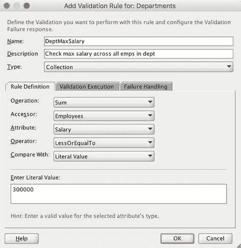

**图 4-3.** 集合验证

如果两个前提条件都满足，子实体对象的访问器应出现在“访问器”列表中。一旦选择了访问器，您就可以选择子实体对象中要与之比较验证的属性。


### 脚本表达式验证

你还可以选择**脚本表达式**类型的验证，并编写一个 `Groovy` 表达式。这种编程语言具有类似 Java 的语法，可在 ADF 的许多地方使用。Oracle 手册 *《使用 Oracle 应用程序开发框架开发 Fusion Web 应用程序》* 描述了如何将 `Groovy` 用于验证、默认值等等。该表达式必须返回 `true`（表示验证成功）或 `false`（表示验证失败）。或者，如果你需要发出错误或警告，可以在表达式中调用 `adf.error.raise()` 或 `adf.error.warn()`。

### 方法验证

如果声明性验证或脚本验证都无法满足你的需求，你总是可以创建一个**方法验证**。为此，选择类型为 `方法`，并保持 `创建并选择方法` 复选框为选中状态，如图 4-4 所示。

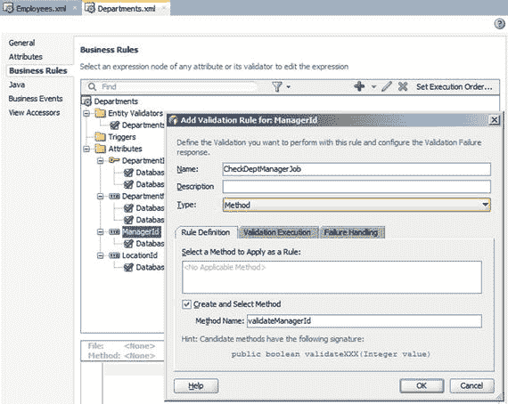
图 4-4. 添加方法验证

如果你尚未为你的实体对象创建 Java 类，`JDeveloper` 将询问你是否需要创建该类。在该类中，将创建一个具有正确名称和签名的验证方法：
*   属性验证的方法签名必须是 `public boolean validateXXX(YYY value)`，其中 `XXX` 是属性的名称，`YYY` 是与该属性匹配的数据类型。
*   实体验证的方法签名必须是 `public boolean validateZZZ()`，其中 `ZZZ` 是实体对象的名称。

当然，你需要为验证成功返回 `true`，如果验证失败则返回 `false`。

### 失败处理

如果你尝试在 `失败处理` 选项卡上未定义消息的情况下关闭 `添加验证` 对话框，`JDeveloper` 会发出警告。你应该始终转到图 4-5 所示的 `失败处理` 选项卡，来定义与验证失败关联的消息。

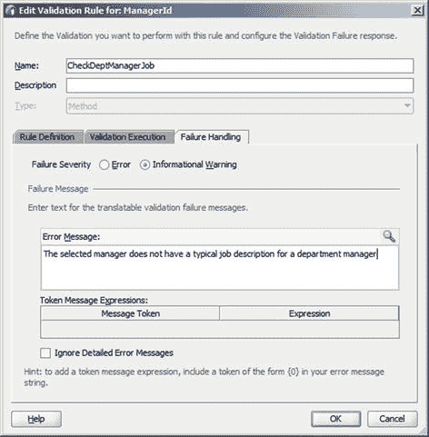
图 4-5. 定义验证失败的消息

在此选项卡上，你可以决定验证失败是应被视为**错误**还是**警告**。错误会阻止应用程序继续执行，并在有问题的属性周围显示红色边框。警告则以橙色边框显示，用户可以选择忽略警告并继续将值提交到数据库（例如）。

你提供一条消息，甚至可以使用花括号 `{ }` 在文本中定义变量标记。对于你使用的每一对花括号，`标记消息表达式` 表中都会出现相应的行，允许你输入一个将在运行时被计算并插入到消息中的表达式。

### 使用触发器

ADF 12c 的一个新特性是能够定义**实体级触发器**。这些触发器类似于实体级验证，也是在 `业务规则` 选项卡上添加的。触发器是一个 `Groovy` 验证表达式，在触发条件发生时执行。触发条件列表包括：
*   插入前和插入后
*   更新前和更新后
*   删除前和删除后
*   回滚前和回滚后
*   提交前
*   事务被提交到数据库后

你编写的 `Groovy` 表达式默认是**不受信任的**。普通的 `Groovy` 代码可以正常运行，你也可以调用 Java 通用 API。但是，你无法使用（例如）`java.io.file` 来读取文件。你也无法从 `Groovy` 表达式中调用你在实体对象上定义的方法。

如果你想明确地将你的 `Groovy` 脚本标记为**受信任的**，你必须在实体对象的 XML 视图中（在 `源` 选项卡上）找到对该脚本的引用。其中会有一行 `trustMode="untrusted"`，你可以将其改为 `trustMode="trusted"`。

如果你想调用你自己编写的方法，你也可以用 `@AllowUntrustedScriptAccess` 注解该方法，以表明不受信任的脚本调用该方法是可以的。请参阅 Oracle 手册 *《使用 Oracle 应用程序开发框架开发 Fusion Web 应用程序》* 中“关于不受信任的 Groovy 表达式你可能需要了解的内容”一节，了解如何在 Java 类中配置信任的示例。

### 创建 Java 对象

为了向特定实体对象添加业务逻辑，你需要为该对象创建一个 Java 类。如果你尚未通过定义方法类型的验证来创建它，你可以转到实体对象的 `Java` 选项卡并单击编辑（铅笔）图标，调出 `选择 Java 选项` 对话框，如图 4-6 所示。

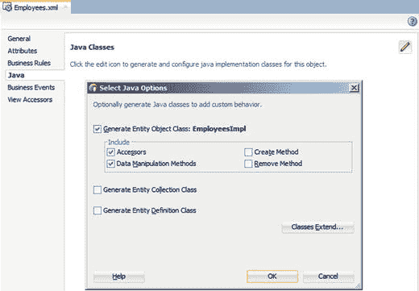
图 4-6. 为实体对象创建 Java

通常你只会创建 `实体对象类`。应用程序需要创建自己的 `实体集合类`（处理数据缓存）或 `实体定义类`（定义实体对象的内部工作方式）的情况非常罕见。

你在 `实体对象类` 的 `包含` 部分所做的选择，决定了 `JDeveloper` 将哪些方法放入实体对象 Java 类中。Java 类将扩展相关的业务组件基类，所有添加的方法都将调用基类中的相应方法。这意味着实体对象的行为将与生成 Java 之前完全一样——但现在你有了一个针对特定实体对象的 Java 类，你可以在其中添加自己的逻辑。

`包含` 部分提供以下选项：
*   `访问器`：为实体对象中的所有属性创建 setter 和 getter 方法。所有这些方法都调用 `setAttributeInternal()` 和 `getAttributeInternal()` 以维持默认功能。
*   `数据操作方法`：创建 `doDML()` 方法和 `lock()` 方法。每当 ADF 框架希望向数据库发送 `INSERT`、`UPDATE` 或 `DELETE` 语句时，`doDML()` 方法都会作为标准 ADF 处理的一部分被调用。本章后面，我们将看到一个如何使用此方法的示例。当 ADF 希望对特定记录建立数据库锁时，会调用 `lock()` 方法。
*   `创建方法`：创建一个本地的 `create()` 方法，该方法以 `AttributeList` 对象作为参数。当 ADF 想要创建新记录时，会在实际 `INSERT` 语句发送到数据库之前的 `doDML()` 操作之前调用它。定制化通常涉及修改 `AttributeList` 以添加缺失的值或处理从用户界面传递过来的值。
*   `移除方法`：创建一个本地的 `remove()` 方法，每当 ADF 想要移除记录时，都会在 `DELETE` 发送到数据库之前的 `doDML()` 调用之前调用它。

你总是可以通过在生成的类中右键单击并选择 `源` ➤ `覆盖方法` 来添加单个方法。这将调出图 4-7 所示的 `覆盖方法` 对话框。

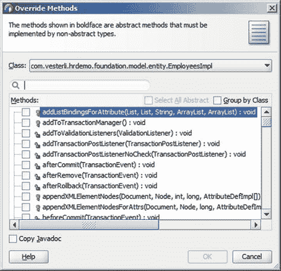
图 4-7. 覆盖方法对话框

通过此对话框，你可以选择一个或多个方法进行覆盖。这会使 `JDeveloper` 将这些方法添加到你的实体对象 Java 类中，以便你可以修改标准行为。

**注意**
如果你再次使用编辑（铅笔）图标调出 `选择 Java 选项` 对话框并取消选中一个复选框，`JDeveloper` 会在不发出警告的情况下删除相应的方法，包括你添加的任何代码。如果发生这种情况，请使用 Java 类底部的 `历史记录` 选项卡查找以前的版本。


### 访问器

如果为某个属性生成访问器，你可以在 `setXXX()` 方法中修改存储的值，并在 `getXXX()` 方法中修改返回值。

例如，你可以修改 `setEmail()` 方法，始终将值转换为小写，如清单 4-1 所示。

```
package com.vesterli.hrdemo.foundation.model.entity;
...
import com.vesterli.hrdemo.foundation.bcbase.EntityImpl;
...
public class EmployeesImpl extends EntityImpl {
...
/**
* 将值设置为 Salary 属性的值。
* @param value 要设置的 Salary 值
*/
public void setEmail (String value) {
setAttributeInternal(EMAIL, value.toLowerCase());
}
...
}
清单 4-1.
重写访问器
```

如果你想屏蔽值，可以重写 `getXXX()` 方法，为部分或全部用户返回屏蔽后的值。对于 `String` 属性，你可以简单地重写 getter 方法，返回 `******` 而非实际值。对于像 `Salary` 这样的数值属性，你只能返回数值，因此解决方案是使用一个瞬态字符串属性。

你可以通过单击绿色加号并选择“新建属性”，然后添加一个 `String` 属性（例如属性名为 `SalaryString`），在实体对象的“属性”选项卡上添加瞬态属性。完成后，在“详细信息”选项卡上将该属性标记为“瞬态”，这样 ADF 就不会尝试将其包含在发送到数据库的 SQL 中。

当你为实体对象创建访问器时，也会为瞬态属性创建 setter 和 getter 方法。你可以在 `getSalaryString()` 方法中添加逻辑，仅向具有 `salary-admin-role` 的用户返回真实值，如果用户没有此角色，则返回一串星号，如清单 4-2 所示。

```
package com.vesterli.hrdemo.foundation.model.entity;
...
import com.vesterli.hrdemo.foundation.bcbase.EntityImpl;
import oracle.adf.share.ADFContext;
import oracle.adf.share.security.SecurityContext;
...
public class EmployeesImpl extends EntityImpl {
/**
* 获取 Salary 属性的值，使用别名 Salary。
* @return Salary 的值
*/
public BigDecimal getSalary() {
throw new JboException("读取 Salary 时发生内部错误");
}
/**
* 将值设置为 Salary 属性的值。
* @param value 要设置的 Salary 值
*/
public void setSalary(BigDecimal value) {
throw new JboException("写入 Salary 时发生内部错误");
}
/**
* 获取 SalaryString 属性的值，
* 使用别名 SalaryString。
* @return SalaryString 的值
*/
public String getSalaryString() {
ADFContext actx = ADFContext.getCurrent();
SecurityContext sctx = actx.getSecurityContext();
if (sctx.isUserInRole("salary-admin-role")) {
return ((BigDecimal) getAttributeInternal(SALARY)).toString();
} else {
return "*******";
}
}
/**
* 将值设置为 SalaryString 属性的值。
* @param value 要设置的 SalaryString 值
*/
public void setSalaryString(String value) {
try {
BigDecimal sal = new BigDecimal(value);
ADFContext actx = ADFContext.getCurrent();
SecurityContext sctx = actx.getSecurityContext();
if (sctx.isUserInRole("salary-admin-role")) {
setAttributeInternal(SALARY, sal);
} else {
throw new JboException("用户不允许更改工资");
}
} catch (NumberFormatException e) {
throw new JboException("工资必须是数字");
}
}
...
}
清单 4-2.
使用瞬态属性屏蔽值
```

清单中也重写了 setter，接收 `String` 值并转换为所需的 `BigDecimal`。然后，它实现了你在前一清单中看到的相同访问控制逻辑，然后才调用内部方法来设置对应于数据库列的实际 `Salary` 属性。同时实现了自定义的 setter 和 getter 后，用户界面就可以使用这个 `SalaryString` 属性来代替原始的 `Salary` 属性。

**提示**

为防止 UI 开发者意外使用原始的 `Salary` 属性，清单 4-2 中的代码会在应用程序尝试直接操作该属性时抛出异常。你还可以将 `Salary` 属性的“显示”属性设置为“隐藏”（在“UI 提示”选项卡上），以进一步降低开发者使用它的风险。

### 与数据库交互

### 处理数据库触发器

你的数据库可能包含在插入或更新后更改值的触发器。如果是这种情况，你需要告知实体对象预期这些更改，并确保它更新自身。这需要在“属性”选项卡上为每个属性进行设置。在“详细信息”子选项卡上，选中“插入时刷新”和/或“更新时刷新”复选框，如图 4-8 所示。

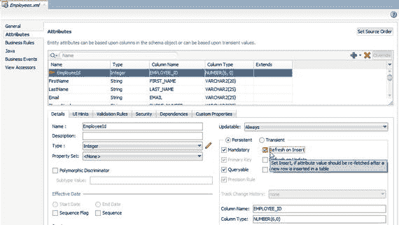

图 4-8.
插入时刷新属性

此设置告诉 ADF 在插入或更新后分别从数据库重新读取该属性。

在 Oracle 数据库中，触发器常用于提供主键值。在这种情况下，你需要设置“插入后刷新”。当使用 Oracle 数据库时，ADF 会利用 Oracle 特有的 `RETURNING … INTO` 子句，在一次往返中从数据库获取更新后的值。对于其他数据库，则需要从应用服务器到数据库进行一次额外的往返来刷新属性。

### 调用存储过程

当你重写 `doDML()` 方法时，JDeveloper 会自动在你的实体对象 Java 类中放置对 `super.doDML()` 的调用。这确保了正常的 ADF 实体对象处理得以进行，向数据库发送 INSERT、UPDATE 或 DELETE SQL 语句。

但是，如果你不希望发生这种情况，可以移除这个调用。例如，如果你希望表中的所有插入都由数据库中的存储过程处理，这会很有用。在这种情况下，你希望 ADF 调用该过程，而不是向数据库发送 INSERT。例如，如果你有一个包含过程 `INSERT_REC` 的 `EMP_API` 包，该过程接受四个参数，可能如清单 4-3 所示。

```
/**
* 此处为自定义 DML 更新/插入/删除逻辑。
* @param operation 操作类型
* @param e 事务事件
*/
protected void doDML(int operation, TransactionEvent e) {
CallableStatement cstmt = null;
if (operation == DML_INSERT) {
String insStmt = "{call emp_api.insert_rec(?,?,?,?)}";
cstmt = getDBTransaction().createCallableStatement(insStmt, 0);
try {
cstmt.setString(1, getFirstName());
cstmt.setString(2, getLastName());
cstmt.setString(3, getJobId());
cstmt.setInteger(4, getDepartmentId());
}
catch (Exception ex) {
// 处理 SQL 异常
} finally {
try {
cstmt.close();
} catch (SQLException ex) {
// 如果关闭时出错，则忽略
}
}
} else {
super.doDML(operation, e);
}
}
清单 4-3.
在 doDML() 中调用存储过程
```

此代码首先检查语句是否为 INSERT。如果是，它获取当前的事务上下文，并使用调用 `EMP_API` 包中名为 `INSERT_REC` 的存储过程的 SQL CALL 语句创建一个 `CallableStatement`。作为语句的一部分，问号表示参数。创建语句对象后，通过一些 `setString()` 调用将实体对象中的属性值连接到参数，然后执行该语句。

如果操作不是 INSERT，则在 `else` 分支中通过调用 `super.doDML()` 来处理正常的 `doDML()` 处理。


### 替换标准数据库操作

重写 `doDML()` 方法的另一个便捷应用场景是：您希望实现逻辑删除，而非实际删除记录。这意味着您的表和实体对象需要一个额外的列来指示记录是否已被删除，并且任何发送 `DELETE` 语句到数据库的尝试都必须被拦截并更改为设置删除指示符属性的 `UPDATE` 操作。如果您新建一个数据库列 `DELETED_YN`，并在实体对象中创建对应的属性，代码可能如清单 4-4 所示。

```java
package com.vesterli.hrdemo.foundation.model.entity;
...
public class DepartmentsImpl extends EntityImpl {
...
/**
* 在此方法中添加实体删除逻辑。
*/
public void remove() {
setDeletedYn("Y");
super.remove();
}
...
/**
* 自定义 DML 更新/插入/删除逻辑。
* @param operation 操作类型
* @param e 事务事件
*/
protected void doDML(int operation, TransactionEvent e) {
if (operation == DML_DELETE) {
operation = DML_UPDATE;
}
super.doDML(operation, e);
}
/**
* 获取 DeletedYn 属性值，使用别名 DeletedYn。
* @return DeletedYn 的值
*/
public String getDeletedYn() {
return (String) getAttributeInternal(DELETEDYN);
}
/**
* 将值设置为 DeletedYn 的属性值。
* @param value 要设置给 DeletedYn 的值
*/
public void setDeletedYn(String value) {
setAttributeInternal(DELETEDYN, value);
}
...
}
```
清单 4-4. 实现逻辑删除

`doDML()` 方法只是将 `DELETE` 替换为 `UPDATE`，而 `remove()` 方法则设置指示记录已被删除的属性。

**提示**

由于逻辑删除的记录仍然保留在数据库中，您的视图对象将需要过滤掉这些已被逻辑删除的记录。有关示例，请参阅后面关于视图对象逻辑章节中的“永久过滤”部分。

### 视图对象中的逻辑

虽然实体对象逻辑主要存在于一个类中，但视图对象逻辑存在于两个类中：

*   **视图对象类**：这些类代表视图对象的查询或整个数据集，其内置功能与所有记录相关。视图对象类中的功能示例包括更改排序顺序、视图标准或执行查询。
*   **视图行类**：这些类代表视图对象所定义记录集中的单个行。这些对象中的功能与单行相关。您将在视图行对象中重写的典型函数是一个访问器。

### 创建 Java 对象

与为实体对象创建 Java 对象的方式类似，您可以在对象的“Java”选项卡上单击编辑（铅笔）图标，为视图对象创建 Java 对象。这将打开视图对象的“选择 Java 选项”对话框，如图 4-9 所示。

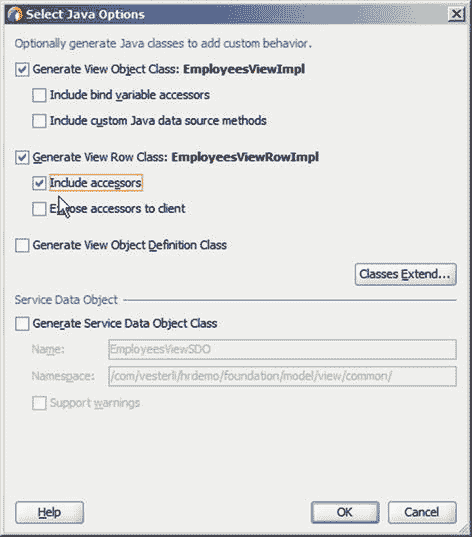
图 4-9. 为视图对象创建 Java

通过此对话框，您可以创建“视图对象类”和“视图行类”，并选择希望 JDeveloper 添加到生成类中的方法。您以后始终可以编辑代码，或者通过“源”->“重写方法”来重写方法。

**注意**

如果您再次打开“选择 Java 选项”对话框并取消选中某个复选框，JDeveloper 将会直接删除相应的方法，包括您编写的任何代码。如果以这种方式丢失了代码，请使用 Java 类中的“历史记录”选项卡恢复到先前的版本。

### 视图对象类逻辑

当您向实体对象添加业务逻辑时，通常是重写一个现有方法，以使 ADF 在标准功能之外执行额外的操作。这意味着实体对象逻辑通常作为其他地方启动操作的结果在“幕后”发生。

视图对象逻辑则不同。如果您向视图对象类添加一个方法并创建客户端接口，那么该方法就可以从应用程序的用户界面层访问。它会出现在“数据控件”面板中，对于简单的方法，您可以直接将操作拖放到页面片段上，并将其作为 ADF 按钮放置。在更复杂的情况下，您需要为方法创建一个操作绑定，然后从用户界面层的托管 bean 中调用它。

**注意**

如果您的逻辑主要是操作数据，它应位于业务组件层中的视图对象类中。如果您的逻辑主要是操作用户界面，那么它应位于用户界面层中的托管 bean 中，如第 5 章所述。

视图对象逻辑作用于视图对象的整个数据集。如果您想根据用户的选择以不同的方式过滤或排序数据，您可以在视图对象类上调用一个方法。

### 启用和禁用视图标准

一个典型的用例是启用和禁用视图标准。视图标准是应用于视图对象的限制条件，可以启用和禁用，用户界面通常包含用于记录过滤的按钮或复选框。基于视图标准显示和隐藏记录的方法可能如清单 4-5 所示。

```java
package com.vesterli.hrdemo.deptemp.model.view;
...
import com.vesterli.hrdemo.foundation.bcbase.ViewObjectImpl;
...
public class DepartmentsViewImpl extends ViewObjectImpl
implements DepartmentsView {
...
public void showDeleted() {
removeViewCriteria("DontShowDeleted");
executeQuery();
}
public void dontShowDeleted() {
ViewCriteria vc = getViewCriteria("DontShowDeleted");
applyViewCriteria(vc);
executeQuery();
}
...
}
```
清单 4-5. 在视图对象类中更改视图标准

请注意，更改视图对象中的数据不会自动反映在用户界面中。例如，如果您从按钮调用这些方法之一，则需要将显示数据的元素（例如，表格组件）的“部分触发器”属性设置为指向更改视图标准的按钮。部分页面渲染的概念以及“部分触发器”属性将在第 5 章中解释。

### 永久过滤

在本章前面的实体对象示例中，您看到了如何在实体对象中实现逻辑删除。此方法会将逻辑删除的记录保留在数据库中，为了防止它们显示给用户，您可以让视图对象过滤掉这些已删除的对象。这可以通过视图标准来完成，如图 4-10 所示。

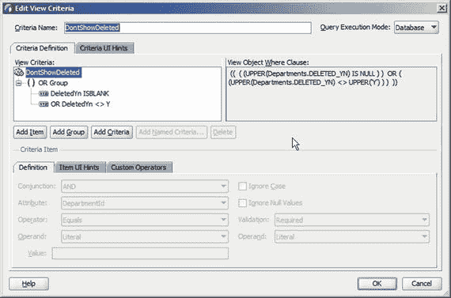
图 4-10. 用于过滤掉逻辑删除记录的视图标准

您可以将此视图标准永久添加到应用程序模块中的视图对象实例，以防止已删除的记录显示给用户。为此，请打开应用程序模块的“数据模型”选项卡，选择 `Departments` 视图对象的实例。然后，单击“编辑”以打开“编辑视图实例”对话框，您可以在该对话框中将视图标准永久应用于此视图对象实例。


### 视图行类逻辑

视图对象类作用于整个数据集，而视图行类方法则作用于单个记录。这意味着修改数据以及响应数据变化的功能应归属于视图行类。

您在视图行类中所做的典型更改是覆盖一个或多个访问器方法（针对特定属性的 setter 和/或 getter）。如果您在`Select Java Options`对话框中勾选了`Include accessors`复选框，`JDeveloper`将自动为视图对象中的所有属性创建访问器方法。在视图行类中拥有大量访问器方法不会带来任何性能开销，但这会使代码变得冗长，并且需要更多时间才能找到您想要更改的方法。

注意：您也可以在实体对象中覆盖访问器。如果您希望更改在整个应用程序中生效，则应在实体对象中覆盖访问器。如果您只想在一个地方更改访问器，则应在相关的视图行对象中进行更改。

另一个例子是与数据变化相关的更复杂的逻辑。例如，考虑默认的`HR`模式，其中包含`employees`和`departments`。如果用户可以自由更改员工的部门，`ADF`的默认功能就能正常工作。您只需允许`employees`屏幕上的部门编号可编辑（通常通过包含所有部门的下拉列表实现）。但如果您想在启动部门调动之前添加额外的处理逻辑，您可以在员工视图行类上创建一个`changeDept()`方法，将新的部门 ID 作为参数。在用户界面中，您可以创建一个单独的输入元素来选择新部门——一个不连接到数据库的元素。然后，您可以设置一个按钮来调用该方法，并将新部门的 UI 元素连接到该方法调用。

清单 4-6 中的示例`changeDept()`方法使用了一个视图访问器来处理员工视图行对象之外的数据，并将现有部门的位置与新部门的位置进行比较。如果国家不同，则该员工因需搬迁到另一个国家而应获得 10%的加薪。

```java
package com.vesterli.hrdemo.deptemp.model.view;
import com.vesterli.hrdemo.deptemp.model.view.common.EmployeesVORow;
import com.vesterli.hrdemo.foundation.model.entity.DepartmentsImpl;
import com.vesterli.hrdemo.foundation.bcbase.ViewRowImpl;
...
import oracle.jbo.Key;
import oracle.jbo.Row;
import oracle.jbo.RowSet;
public class EmployeesVORowImpl extends ViewRowImpl
implements EmployeesVORow {
...
public void changeDept(Integer newDeptId) {
RowSet rs = getDepartmentsVO1();
Row row = null;
Object[] keyVals = new Object[1];
keyVals[0] = getDepartmentId();
Key oldDeptKey = new Key(keyVals);
row = rs.getRow(oldDeptKey);
String oldCountryId = (String)row.getAttribute("CountryId");
keyVals[0] = newDeptId;
Key newDeptKey = new Key(keyVals);
row = rs.getRow(newDeptKey);
String newCountryId = (String)row.getAttribute("CountryId");
if (!oldCountryId.equals(newCountryId)) {
setSalary(getSalary().multiply(new BigDecimal(1.1))
.setScale(0, BigDecimal.ROUND_HALF_UP));
}
}
...
/**
* Sets value as attribute value for SALARY using the alias name Salary.
* @param value value to set the SALARY
*/
public void setSalary(BigDecimal value) {
setAttributeInternal(SALARY, value);
}
...
/**
* Gets the view accessor RowSet DepartmentsVO1.
*/
public RowSet getDepartmentsVO1() {
return (RowSet) getAttributeInternal(DEPARTMENTSVO1);
}
...
}
```
清单 4-6. 在视图行类中通过访问器访问另一个视图对象

`changeDept()`方法首先使用视图访问器获取对`DepartmentsVO1`视图对象实例中所有行的引用。如何创建访问器将在下一节描述。代码然后首先为旧部门创建一个`Key`对象，并检索该部门的国家 ID，然后创建另一个`Key`来检索新部门的国家。如果两者不同，则将当前视图行的薪资设置为当前薪资的 1.1 倍，从而实现当员工被调动到另一个国家的部门时加薪 10%。

### 视图访问器

视图行类要能访问其他视图行对象，必须存在一个指向该对象的访问器。这通过在视图对象的`Accessors`选项卡中点击绿色加号图标来创建。在如图 4-11 所示的`View Accessors`对话框中，您可以选择要创建哪些访问器。

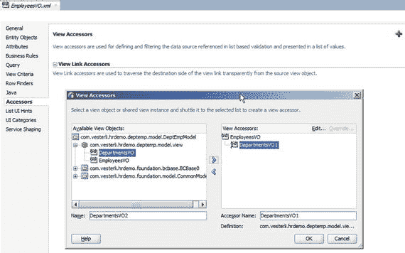
图 4-11. 创建视图访问器

底层实体对象之间必须存在关联，以便`JDeveloper`和`ADF`能够确定如何从一个视图对象中的记录导航到另一个视图对象中的记录。

### 应用模块中的逻辑

业务组件层的最后一部分是应用模块，您也可以创建自己的 Java 对象来实现您的应用模块。

您可以从`Java`选项卡为应用模块创建 Java 类，如图 4-12 所示。

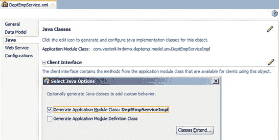
图 4-12. 为应用模块创建 Java 类

应用模块包含一些您可能想要覆盖的方法，您也可能希望向应用模块添加自己的业务逻辑。

### 覆盖应用模块功能

应用模块包含视图对象实例的集合，并控制数据库事务。因此，在特定于应用的应用模块类中通常被覆盖的许多方法都与数据库事务或连接相关。

在覆盖应用模块方法时，通常您希望更改整个应用程序（即每个应用模块）的行为。因此，应用模块方法通常在您作为所有应用模块基础的基类中被覆盖。有关指定自己的业务组件基类的更多信息，请参阅第 2 章。

在应用模块类中最常被覆盖的方法是`prepareSession()`，该方法在应用模块首次创建时被调用。由于应用模块可以在多个`ADF`会话之间共享，因此每当应用模块被交给一个新的`ADF`会话时，该方法也会被执行。

如果您希望在每次应用模块连接到数据库时执行一些数据库初始化，可以使用此方法。您可能希望设置包变量、更改 SQL 会话（例如，启动 SQL 跟踪），或为使用`Oracle Virtual Private Database (VPD)`建立会话上下文。

应用模块还包含诸如`beforeCommit()`、`beforeRollback()`、`afterCommit()`和`afterRollback()`之类的方法，您可以覆盖它们以实现自定义事务处理。

### 添加自定义应用模块逻辑

您添加到应用模块的自定义方法也可以像视图对象上的方法一样在用户界面中使用。这经常用于实现对数据库中存储过程的调用，如本章前面“调用存储过程”一节所述。其语法类似于本章前面“实体对象中的逻辑”一节中清单 4-3 所示的语法，从`getDBTransaction()`开始以获取对所有视图对象实例都参与的当前事务的引用。

如果您为应用模块方法创建了客户端接口，它会显示在`Data Controls`窗格中内置的`Commit`和`Rollback`操作旁边。您可以直接将该操作作为一个`ADF`按钮拖放到页面片段上，或者为该方法创建一个操作绑定并从托管 bean 中调用它。


