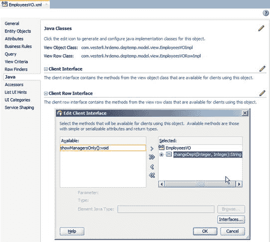
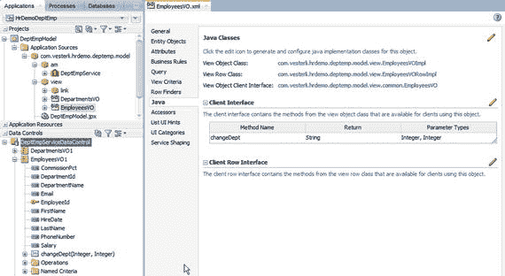
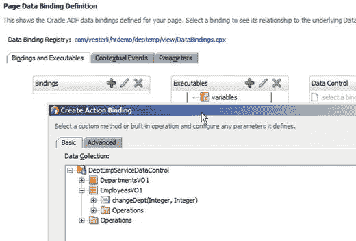

# 向客户端公开逻辑

默认情况下，您添加到视图对象或应用程序模块中的逻辑对用户界面层是不可用的。要使您的方法可用，您需要从视图对象或应用程序模块的 Java 选项卡创建客户端接口。图 4-13 展示了为视图对象创建客户端接口。

图 4-13. 创建客户端接口

对于视图对象，您可以为视图对象类和视图行类创建客户端接口。对于应用程序模块，只有一种客户端接口类型。类中的所有方法都会显示在“编辑客户端界面”对话框的左侧，您可以将想要公开的方法移动到右侧的“已选择”框中。

当您像这样公开方法后，它们会与属性一起显示在“数据控制”面板中，如图 4-14 所示。

图 4-14. 在数据控件窗格中公开的客户端方法

一旦您的方法出现在“数据控件”窗格中，它们就可以被拖放到页面或页面片段上，并作为 ADF 操作元素（按钮或命令链接）放置。如果您想在用户界面中使用来自 Java Bean 的方法，您需要从相关页面的“绑定”选项卡创建一个操作绑定，如图 4-15 所示。我们将在第 5 章回到在用户界面中使用 Java Bean 的话题。

图 4-15. 为客户端方法创建绑定

## 总结

在本章中，您已经了解了如何使用自己的逻辑扩展 ADF 业务组件的标准功能。在某些情况下，您会覆盖标准的 ADF 方法，添加功能，甚至完全替换标准的 ADF 处理。在其他情况下，您向视图对象或应用程序模块添加自己的逻辑，并通过客户端接口使该逻辑对用户界面层可用。

在下一章中，您将看到如何在用户界面层添加业务逻辑。

