# 5. 表现层逻辑

正如您在第 1 章所见，ADF 处理了将数据从数据库获取到网页、接受更改并存储回数据的所有基本功能。只有当您需要默认功能之外的东西时，才需要开始编写代码。

本章描述了如何向表现层添加逻辑。ADF 提供了几种方式：

*   预构建的 UI 组件验证器（声明式）
*   托管 Bean（服务器端 Java 代码）
*   自定义客户端 JavaScript

## 预构建的验证器

您在第 4 章中看到，可以为业务组件属性添加大量验证，包括声明式和编程式。但这种验证发生在服务器端，需要进行服务器往返。有些类型的验证非常简单，可以通过客户端 JavaScript 来处理，而 ADF 提供了几个预构建的验证器。

您可以在“组件”窗口中底部附近的“操作”标题下找到这些验证器。如图 5-1 所示。

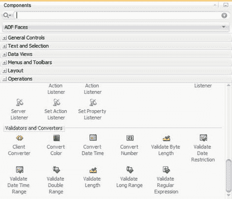

图 5-1. UI 组件的声明式验证器

要使用其中之一，您只需将其拖放到相关的 UI 组件上，例如“输入文本”组件。完成此操作后，它们将出现在页面的“源”视图中，如代码清单 5-1 所示。

```
...
...
```

代码清单 5-1. 页面源码中声明式验证器的示例

它们也会出现在 JDeveloper 窗口左下角的“结构”窗口中，如图 5-2 所示。

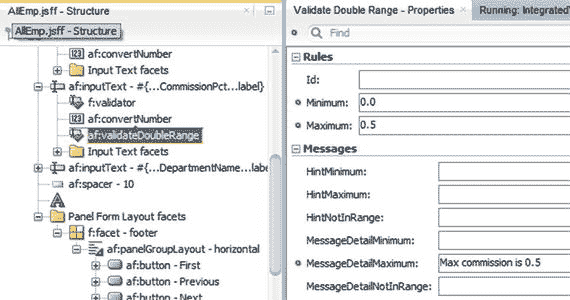

图 5-2. “结构”窗口中的声明式验证器及其属性

当您在源视图或“结构”窗口中选择验证器时，其属性会显示在“属性”窗口中。在这里，您可以配置验证器，并提供验证失败时要显示给最终用户的消息。

声明式验证在客户端运行，并在用户离开字段时立即触发。图 5-3 显示了声明式验证失败时在用户界面中显示的结果。

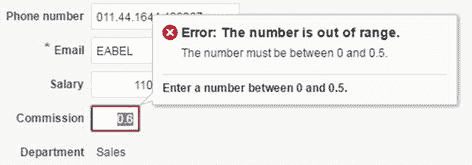

图 5-3. 声明式验证失败时向用户显示的消息

### 添加托管 Bean

当您需要在应用程序的用户界面层应用逻辑时（用于高级验证、计算等），您需要用 Java 编写托管 Bean，并将它们连接到页面上的项目。在 ADF（和 JSF）中，实际的用户界面与表现层逻辑是分开的，通过将这两个功能拆分到不同的文件中：

*   用户界面存储在 JavaServer Faces (JSF) 和 JavaServer Faces Fragment (JSFF) 文件中。
*   表现层逻辑的源代码存储在 Java Bean 文件中。

您的应用程序将包含许多 Java 文件。您通过将它们定义为任务流中的托管 Bean 来声明哪些文件是表现层的一部分，然后通过设置 UI 组件的属性以使用表达式语言语法引用 Bean 类，将它们连接到您的 UI 组件。

ADF 框架为您管理这些 Bean。这意味着它们会在适当的时间自动实例化，并在不再需要时自动销毁。它们存在的时间长短由其作用域决定，将在后面的小节中描述。

### Bean 类

您想在应用程序用户界面层使用的所有类都必须是有效的 Java Bean。这意味着它们必须：

1.  具有一个公共的、无参数的默认构造函数。
2.  允许使用标准的 setter 和 getter 方法访问所有属性。
3.  是可序列化的。

构造函数只是一个与类同名且不接受参数的方法。ADF 框架在创建 Bean 类的实例时调用此方法。

setter 和 getter 方法必须按照 JavaBean 约定命名。例如，如果 Bean 有一个名为 `firstName` 的 `String` 属性，则它必须具有 `setFirstName()` 和 `getFirstName()` 方法。

注意

您的 Java Bean 源代码中的属性必须以小写字母开头。

Bean 是可序列化的意味着它可以被存储、从内存中删除，并在以后完全恢复，包括它之前拥有的所有内部状态。这对于您打算在比请求（Request）更长的作用域中使用的所有 Bean 都是必需的。

注意

短寿命 Bean（请求作用域和后备 Bean 作用域）永远不需要存储和恢复，因此它们不需要是可序列化的。

一个只包含属性值和代码的典型 Bean，可以通过简单地实现 `java.io.Serializable` 接口来使其可序列化。请注意，UI 组件和业务组件不是可序列化的，因此您不应尝试在托管 Bean 中存储这些内容。


### Bean 作用域

通过将托管 Bean 定义为有界任务流的一部分，您可以将它们添加到 ADF 应用程序中。每当您添加一个 Bean 时，也需要定义其作用域。如果您熟悉 JSF，那么会对 `Application`、`Session`、`View` 和 `Request` 作用域有所了解，但 ADF 拥有更多作用域。ADF 应用程序中存在以下作用域，按其生命周期从长到短排列：

*   `Application`：应用作用域中的 Bean 会一直存在，直到应用程序停止。这意味着它们会持续存在于用户会话之间——用户可以关闭浏览器，几天后再次访问应用程序，仍然能在应用作用域中找到相同的值。直到应用服务器管理员在服务器上终止应用程序（或应用程序崩溃），它们才会被清除。这可用于存储您希望保存在内存中的应用程序配置。
*   `Session`：会话作用域中的 Bean 在用户首次访问应用程序时创建，并持续到用户会话结束——无论是用户关闭浏览器，还是会话因不活动而超时。如果用户决定在同一浏览器中运行两个应用程序实例，会话作用域的 Bean 是危险的。某些浏览器会将同一浏览器不同标签页中的两个应用程序实例视为同一会话的一部分，而其他浏览器则会将它们视为两个独立的会话。
*   `PageFlow`：页面流作用域中的 Bean 在用户访问页面流中的第一个页面时创建，并持续到她离开该页面流为止。它们在有界任务流中非常有用，用于存储需要从所有页面和任务流的其他元素访问的值。在包含主页面的无界任务流中创建的页面流作用域 Bean，是存储您希望在用户运行应用程序期间始终可用的信息的理想位置。它们比会话作用域 Bean 更安全，因为它们总是会为应用程序的独立实例而分离，无论浏览器如何处理会话。
*   `View`：视图作用域中的 Bean 在特定视图（页面或页面片段）的持续期间存在。JSF 和 ADF 都定义了视图作用域；在 ADF 应用程序中，当您引用 Bean 时，总是获得 ADF 视图作用域。
*   `Request`：请求作用域中的 Bean 在一个请求（即一次服务器往返）的持续期间存在。此作用域中的 Bean 可以从页面上的所有任务流访问。这意味着，如果同一个页面上存在两个有界任务流实例，则它们会共享一个请求作用域 Bean。这通常不是期望的行为，因此对于短暂存在的 Bean，您应优先选择后备 Bean 作用域。
*   `BackingBean`：后备 Bean 作用域中的 Bean 仅在请求的持续期间存在；这隔离了页面上同一有界任务流的独立实例。将此作用域用于无状态的纯逻辑——即需要响应事件而运行的代码。一旦请求被处理且响应发送回浏览器，后备 Bean 作用域的 Bean 就会被终止。

当您刚开始使用 ADF 时，请尽量限制自己使用 `PageFlow` 和 `BackingBean` 作用域：`PageFlow` 用于所有需要长时间存储的内容，而 `BackingBean` 用于无状态的纯逻辑。这使您的代码更简单，并降低了团队中一名开发人员将某些内容存储在一个作用域，而另一名开发人员却期望在另一个作用域中找到它的风险。

### 向用户界面添加 Bean

JDeveloper 提供了一些便捷的快捷方式，可直接将 Bean 添加到页面上的用户界面元素。

### 向按钮添加 Bean

如果您在 `JDeveloper` 的页面设计视图中双击一个按钮，将显示 **绑定操作属性** 对话框。从这里，您可以选择现有的托管 Bean，或单击 **新建** 以打开如图 5-4 所示的 **创建托管 Bean** 对话框。

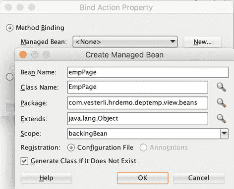

图 5-4. **创建托管 Bean** 对话框

在此对话框中，您输入 Bean 名称和类名。Bean 名称在表达式语言表达式中引用 Bean 时使用，类名是相应 Java 文件的名称。按照约定，Bean 名称以小写字母开头，类名以大写字母开头。与特定页面相关的 Bean（通常是 `BackingBean` 作用域）应以该页面命名，而与整个任务流相关的 Bean（通常是 `PageFlow` 作用域）应以该流命名。

您定义 Bean 所属的包；按照约定，Bean 应放在视图/控制器项目基础包下的 `.beans` 子包中。最后，选择一个作用域，并保持选中创建类的复选框。

当您单击 **确定** 时，将返回到图 5-4 所示的 **绑定操作属性** 对话框。`JDeveloper` 会自动在 **方法** 字段中填入一些它生成的内容。不要接受此默认值；点击该字段并输入一个有用的方法名，然后再单击 **确定**。`JDeveloper` 将创建您的类，其外观将类似于清单 5-2。

```java
package com.vesterli.hrdemo.deptemp.view.beans;
public class EmpPage {
    public EmpPage() {
    }
    public String giveRaise() {
        // 在此添加事件代码...
        return null;
    }
}
```
清单 5-2. 后备 Bean 示例

如果您查看所点击按钮的 **操作** 属性，会发现 `JDeveloper` 已根据您选择的作用域、类名和方法名自动填入了正确的值：`#{backingBeanScope.empPage.giveRaise}`。

如果您查看您的页面或页面片段所属的任务流，可以在 **概览** 选项卡的 **托管 Bean** 子选项卡上看到该 Bean 已被添加，如图 5-5 所示。

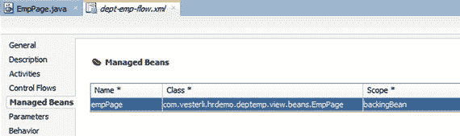

图 5-5. 已添加到任务流的托管 Bean

### 向数据绑定组件添加 Bean

您也可以通过双击数据绑定组件（如 **输入文本**）来添加 Bean。此时会出现 **绑定验证器属性** 对话框，允许您创建一个新的 Bean（如前所述），或选择一个现有的 Bean。您必须为数据验证提供一个方法名，`JDeveloper` 会自动将该方法放入您的 Bean 代码中，并在该项上设置 **验证器** 属性。

对于所有绑定到业务组件属性的 UI 组件，通常最好将验证放在业务组件上。这样，您只需定义一次验证，即可应用于所有地方。如果您决定在 Bean 中实现自定义验证器，您的 Bean 代码需要抛出 `ValidatorException` 以向 ADF 指示验证失败。此异常的一个参数是包含严重性和消息文本的 `FacesMessage` 对象实例。清单 5-3 展示了一个验证方法的示例。

```java
package com.vesterli.hrdemo.deptemp.view.beans;
import javax.faces.application.FacesMessage;
import javax.faces.component.UIComponent;
import javax.faces.context.FacesContext;
import javax.faces.validator.ValidatorException;
public class EmployeeBean {
    public EmployeeBean() {
    }
    ...
    public void salaryValidator(FacesContext facesContext,
        UIComponent uIComponent, Object object)
        throws ValidatorException {
        if (object != null) {
            int sal = Integer.valueOf(object.toString());
            if((sal % 10) != 0) {
                throw new ValidatorException(
                    new FacesMessage(FacesMessage.SEVERITY_WARN,
                        "薪资应为整数", null));
            }
        }
    }
}
```
清单 5-3. 托管 Bean 中的验证器方法


### 向任务流添加 Bean

虽然直接向按钮添加 Bean 和方法很有用，但在大多数情况下，你需要对这个过程有更多的控制权。向任务流添加 Bean 的常规做法是：先创建类，然后将其添加到相关的任务流中。

你像创建任何其他 Java 类一样创建这个类。然后，在你想使用它的任务流中打开，选择“概览”选项卡，再选择右侧的“托管 Bean”子选项卡。点击绿色加号，提供一个 Bean 名称，指向该类并选择一个作用域。添加 Bean 后，其外观如图 5-5 所示。

### 与 UI 组件交互

如果你的 Bean 代码需要与页面上的 UI 组件交互，则需要在 Bean 代码中创建一个组件引用，并将其连接到页面上的 UI 组件。例如，你可能想添加一个用于建议加薪的新字段，以及一个调用 Java 逻辑来读取现有工资并建议加薪的按钮，如图 5-6 所示。

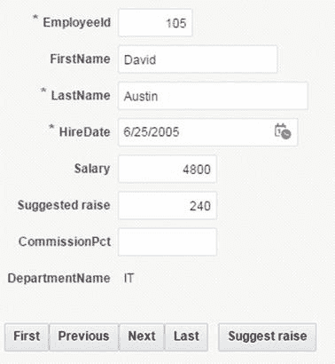

图 5-6.
与 Bean 逻辑交互的屏幕示例

### 创建组件引用

在 Bean 中，你创建一个属性，该属性是 `ComponentReference` 的一个实例，并创建使用与 UI 组件对应的类的 setter 和 getter 方法。UI 组件类的名称通常是“Rich”后跟组件名称——例如，`RichInputText` 对应于输入文本元素。所有这些类都可以在 `oracle.adf.view.rich.component` 的子包中找到。

提示
完整的 ADF RichClient API 文档可以在 [`http://jdevadf.oracle.com/adf-richclient-demo/docs/apidocs/index.html`](http://jdevadf.oracle.com/adf-richclient-demo/docs/apidocs/index.html) 找到。

清单 5-4 中的代码展示了两个组件引用的实现：一个用于包含现有工资值（例如，来自业务组件）的输入文本元素，另一个用于将包含计算出的加薪额的另一个输入文本元素。`SuggestRaise()` 方法计算当前工资的 5%，并将该值放入建议加薪字段。

```
package com.vesterli.hrdemo.deptemp.view.beans;
import org.apache.myfaces.trinidad.util.ComponentReference;
...
public class EmpPage {
private ComponentReference salary;
private ComponentReference raise;
public void setSalary(RichInputText salary) {
this.salary = ComponentReference.newUIComponentReference(salary);
}
public RichInputText getSalary() {
if (salary != null) {
return (RichInputText)salary.getComponent();
} else {
return null;
}
}
public void setRaise(RichInputText raise) {
this.raise = ComponentReference.newUIComponentReference(raise);
}
public RichInputText getRaise() {
if (raise != null) {
return (RichInputText)raise.getComponent();
} else {
return null;
}
}
public String suggestRaise() {
BigDecimal orgSal = (BigDecimal)getSalary().getValue();
BigDecimal suggestedRaise = orgSal.multiply(new BigDecimal(0.05));
suggestedRaise = suggestedRaise.setScale(0, BigDecimal.ROUND_DOWN);
getRaise().setValue(suggestedRaise);
AdfFacesContext.getCurrentInstance().addPartialTarget(getRaise());
return null;
}
...
}
```
清单 5-4.
操作 UI 组件值的 Bean 示例

注意，`SuggestRaise()` 中的 `getValue()` 返回一个通用的 `Object`。因为我们是从绑定到数字字段的 `salary` 中检索数据，所以该对象可以被强制转换为 `BigDecimal`。然后我们创建另一个 `BigDecimal`，进行一些计算和舍入，最后获取 `raise` 组件并设置其值。

每次属性更改时都让 ADF 自动刷新页面将是浪费的。因此，我们必须明确请求组件刷新，我们通过将其推入使用 `addPartialTarget()` 待重绘的对象列表来实现。

你只需要对未绑定到数据源的 UI 组件调用 `setValue()`。如果你想更改已绑定到业务组件属性的组件的值，你应该直接更改绑定属性的值，如本章后面的“与业务组件交互”部分所述。

### 将 Bean 连接到 UI 组件

要将 Bean 中的组件引用连接到 UI 组件，组件的 `Binding` 属性必须设置为指向 Bean 属性。要设置此属性，你可以单击属性右侧的齿轮图标并选择“编辑”，以调出图 5-7 所示的“编辑属性：绑定”对话框。

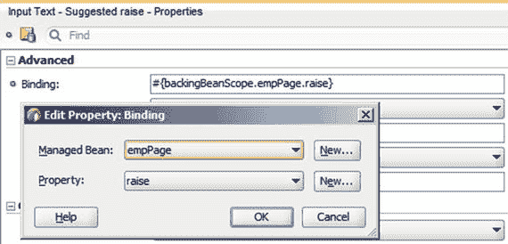

图 5-7.
“编辑属性绑定”对话框

当你选择一个托管 Bean 时，“属性”下拉列表将只显示 Bean 中类型正确的属性。在此示例中，你需要为工资和建议加薪字段都设置 `Binding` 属性。要使按钮调用 `suggestRaise()`，你必须如前所述设置按钮的 `Action` 属性。

注意
你也可以创建或选择一个 Bean，然后单击“属性”旁边的“新建”来创建一个新属性。如果你这样做，你将需要稍微修改代码以包含一个 `ComponentReference`，如清单 5-4 所示。

### 与业务组件交互

当你想从用户界面层使用业务组件时，你需要通过绑定层。不要尝试直接访问数据库数据，因为应用程序的其余部分确实使用了绑定层。如果你的应用程序的一部分试图绕过绑定层，你将会遇到神秘且难以发现的错误。

### 绑定层

要查看页面上可用的绑定，请选择页面窗口底部的“绑定”选项卡。你将看到一个绑定的图形化表示，如图 5-8 所示。

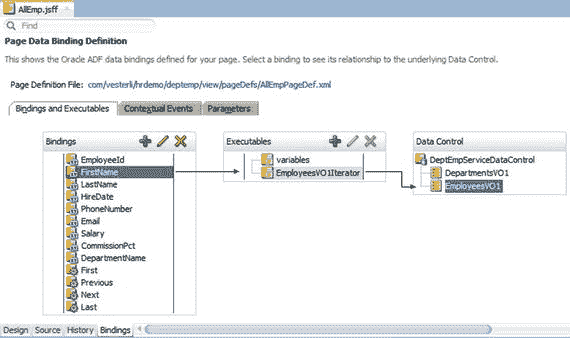

图 5-8.
属性值绑定和操作绑定

当你将某些内容从“数据控件”窗格拖放到页面或页面片段上时，ADF 会自动为你创建绑定：
* 当你拖放单个属性时，你会得到一个 `attributeValues` 绑定和一个单属性组件（如输入文本）。图 5-8 上的 `FirstName` 绑定是一个 `attributeValue` 绑定。
* 当你拖放一个操作时，你会得到一个 `action` 绑定和一个操作组件（如按钮）。图 5-8 上的 `Previous` 绑定是一个 `action` 绑定。
* 当你拖放整个视图对象实例时，你会得到一个树绑定和一个多属性组件（如表）。图 5-9 展示了一个树绑定。

    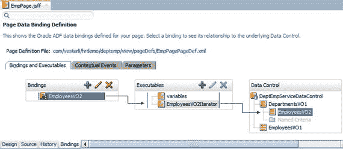

    图 5-9.
    树绑定

如果你想访问尚未拖放到页面上的属性，你必须手动单击“绑定”选项卡上的绿色加号来创建属性绑定。

提示
如果你想让 JDeveloper 帮助你，也可以尝试将元素拖放到页面上，然后在页面的源视图中删除匹配的 UI 组件。如果你从“设计”选项卡或“结构”窗口中删除组件，JDeveloper 会自动清理并删除相应的绑定。但如果你在“源”选项卡上删除组件，JDeveloper 会保留绑定不变。


### 访问绑定层

为了从代码中访问绑定层，首先需要创建一个 `BindingContainer` 的实例，如清单 5-5 所示。

```java
import oracle.adf.model.BindingContext;
import oracle.binding.BindingContainer;
...
public class EmpPage {
...
public String processEmp {
BindingContainer bc =
BindingContext.getCurrent().getCurrentBindingsEntry();
...
}
...
}
清单 5-5.
获取 BindingContainer
```

在 JDeveloper 中编写代码时，通常无需手动输入 `import` 语句；该工具会自动提供建议。但是，`BindingContainer` 和 `BindingContext` 都有多个选项：您应该选择清单 5-5 中所示的那几个。

获取 `BindingContainer` 是您在代码中经常要执行的操作，因此在您的实用程序代码项目中的实用程序类里为此创建一个方法是很有意义的。

### 访问属性值

当您拥有一个 `BindingContainer` 对象后，您可以从中检索属性绑定，如清单 5-6 所示。

```java
...
import java.math.BigDecimal;
import java.sql.Timestamp;
import oracle.adf.model.BindingContext;
import oracle.binding.AttributeBinding;
import oracle.binding.BindingContainer;
...
public class EmpPage {
...
public String getEmpValues() {
...
AttributeBinding fnb =
(AttributeBinding)bc.getControlBinding("FirstName");
AttributeBinding salb =
(AttributeBinding)bc.getControlBinding("Salary");
AttributeBinding hdb =
(AttributeBinding)bc.getControlBinding("HireDate");
String firstName = (String)fnb.getInputValue();
BigDecimal sal = (BigDecimal)salb.getInputValue();
Timestamp hireDate = (Timestamp)hdb.getInputValue();
...
return null;
}
}
清单 5-6.
获取属性值
```

属性名称必须与视图对象中写的完全一致，包括大小写。

`getInputValue()` 方法的签名是返回一个通用的 `Object`。但是，ADF 使用在视图对象的“属性”选项卡上为该属性定义的对象，因此您可以将 `getInputValue()` 的输出强制转换为相关类型。JDeveloper 中的视图对象向导将根据您为业务组件初始化模型项目时定义的“数据类型映射”设置创建对象。当您使用默认的“Oracle 的 Java 扩展”映射时，会发生以下映射：

*   数据库 `VARCHAR2` 变为 `java.lang.String`
*   数据库 `NUMBER` 变为 `java.math.BigDecimal`
*   数据库 `DATE` 变为 `java.sql.Timestamp`

### 访问操作

正如您在第 4 章所见，业务组件带有内置操作，并且您可以创建自己的操作。所有内置操作以及您决定暴露给用户界面层的操作都会显示在“应用程序”窗口的“数据控件”窗格中。

#### 提示

如果您的某个自定义操作即使在使用蓝色双箭头图标刷新后仍未显示在“数据控件”窗格中，可能是您忘记创建客户端接口了。请参阅第 4 章。

要从托管 Bean 代码中执行操作，您也需要通过绑定层。必要的代码如清单 5-7 所示。

```java
...
import java.util.List;
import java.util.Map;
import oracle.adf.model.BindingContext;
import oracle.binding.OperationBinding;
...
public class EmpPage {
...
public String changeDept(Integer empId, Integer deptId) {
...
OperationBinding ob = bc.getOperationBinding("moveDept");
Map obParam = ob.getParamsMap();
obParam.put("empId", empId);
obParam.put("deptId", deptId);
Object result = ob.execute();
if(!ob.getErrors().isEmpty()) {
handleErrors(ob.getErrors());
return null;
}
...
return null;
}
}
清单 5-7.
执行操作
```

与属性绑定类似，操作的名称必须与您在“绑定”选项卡上看到的完全一致，包括大小写。

您的操作可能需要一个或多个参数。如果是这种情况，您需要从操作绑定中检索一个 `Map` 对象，并将您的参数放入此映射中。如果您没有任何参数要传递，则不需要这些代码行。

执行操作绑定总是返回一个通用的 `Object`；根据底层代码，这对于调用该方法的 Bean 可能有用也可能没用。

您应该始终调用 `getErrors()` 来检查执行操作时是否出错。此方法的返回值是一个 `java.util.List` 对象，其中包含任何错误的 `Throwable` 对象。

### 访问迭代器

当您想要处理整个数据集，而不仅仅是一个值时，您需要访问树形绑定的迭代器。为此，您需要将绑定容器强制转换为 `DCBindingContainer`，如清单 5-8 所示。

```java
...
import oracle.adf.model.BindingContext;
import oracle.adf.model.binding.DCBindingContainer;
import oracle.adf.model.binding.DCIteratorBinding;
import oracle.adf.view.rich.component.rich.data.RichTable;
import oracle.adf.view.rich.context.AdfFacesContext;
import oracle.jbo.Row;
...
public class EmployeeBean {
...
private ComponentReference empTab;
...
public void setEmpTab(RichTable empTab) {
this.empTab = ComponentReference.newUIComponentReference(empTab);
}
public RichTable getEmpTab() {
if (empTab != null) {
return (RichTable)empTab.getComponent();
} else {
return null;
}
}
...
public String DeptRaise() {
BindingContainer bc =
BindingContext.getCurrent().getCurrentBindingsEntry();
DCBindingContainer dcb =(DCBindingContainer)bc;
DCIteratorBinding iter =
(DCIteratorBinding)dcb
.findIteratorBinding("EmployeesInDeptVOIterator");
Row[] allRows = iter.getAllRowsInRange();
BigDecimal currSal;
for (Row r: allRows) {
currSal = (BigDecimal)r.getAttribute("Salary");
r.setAttribute("Salary", currSal.multiply(new BigDecimal(1.05))
.setScale(0, BigDecimal.ROUND_DOWN));
}
AdfFacesContext.getCurrentInstance().addPartialTarget(getEmpTab());
return null;
}
}
清单 5-8.
遍历数据集
```

您使用 `findIteratorBinding()` 从容器中检索迭代器绑定。与所有其他绑定一样，您必须准确输入其在“绑定”选项卡上存在的名称。此迭代器有许多有用的功能，其中之一是 `getAllRowsInRange()`，它返回一个 `Row` 对象数组。在上面的示例中，我们简单地遍历此数组，并给每个人加薪 5%。

更改属性的值本身并不会更新 UI 组件。要使显示来自迭代器数据的 ADF 表自我更新，我们需要：

*   为表组件创建一个 `ComponentReference`
*   创建接收和返回 `RichTable` 的 setter 和 getter 方法
*   将表的 `Binding` 属性设置为我们的 `RichTable` 属性（使用类似 `#{backingBeanScope.EmployeeBean.empTab}` 的表达式）
*   使用 `AdfFacesContext.getCurrentInstance().addPartialTarget(getEmpTab());` 将表作为部分页面渲染目标添加到 ADF Faces 上下文中


### 处理选定行

如果你想处理在显示来自迭代器的数据的 ADF 表中当前记录，你可能会尝试使用 `DCIteratorBinding` 对象中存在的 `getCurrentRow()` 方法。然而，该方法返回的是视图对象实例中的当前行，而不是用户界面中当前选定的行。要访问 ADF 表组件中选定的一个或多个行，你需要先处理该表组件。

ADF 表有一个 `rowSelection` 属性，可以设置为 `none`、`single` 和 `multiple`。当你将视图对象实例拖放到页面上时，这是你可以在“创建表”向导中进行的选择之一，当然你以后也可以随时更改它。如果你在表中允许选择，那么就可以通过连接到 UI 组件的 `RichTable` 对象的 `getSelectedRowKeys()` 方法，检索所有选定记录的 `Key` 对象，如代码清单 5-9 所示。

```java
...
import oracle.adf.model.BindingContext;
import oracle.adf.model.binding.DCBindingContainer;
import oracle.adf.model.binding.DCIteratorBinding;
import oracle.adf.view.rich.component.rich.data.RichTable;
import oracle.jbo.Key;
import oracle.jbo.Row;
import oracle.jbo.RowSetIterator;
import org.apache.myfaces.trinidad.model.RowKeySet;
...
public class EmpPage {
...
private ComponentReference empTab;
...
public void setEmpTab(RichTable empTab) {
    this.empTab = ComponentReference.newUIComponentReference(empTab);
}
public RichTable getEmpTab() {
    if (empTab != null) {
        return (RichTable)empTab.getComponent();
    } else {
        return null;
    }
}
...
public String ProcessEmps() {
    RowKeySet selectedEmps = getEmpTab().getSelectedRowKeys();
    Iterator selIter = selectedEmps.iterator();
    BindingContainer bc =
        BindingContext.getCurrent().getCurrentBindingsEntry();
    DCBindingContainer dcb =(DCBindingContainer)bc;
    DCIteratorBinding empIter =
        (DCIteratorBinding)dcb.
            findIteratorBinding("EmployeesInDeptVOIterator");;
    RowSetIterator rsi = empIter.getRowSetIterator();
    Row curr = null;
    while (selIter.hasNext()) {
        Key key = (Key)((List)selIter.next()).get(0);
        curr = rsi.getRow(key);
        // process row
        ...
    }
    return null;
}
}
```
**代码清单 5-9.** 在表中处理选定行

当你有了行键集合后，你可以为选定的行获取一个 `Iterator` 对象。这是一个遍历用户界面中行的迭代器，与连接到视图对象实例的迭代器无关。

为了实际处理选定行的数据，你仍然需要像上一个例子中那样使用 `DCIteratorBinding`。不过，在这种情况下，我们从中获取一个 `RowSetIterator`。这个对象的优点在于，它使得基于键查找特定行变得容易。当我们循环遍历所有选定行时，可以检索到 `Key`，然后使用 `getRow(key)` 从视图对象中检索实际的行。

### 与用户交互

当验证失败时，你可以使用 ADF 提供的默认通信机制。这种机制会显示一个或多个消息，并高亮显示任何验证失败的字段。如果你想对显示给用户的消息有更多控制，就需要通过使用 JSF 上下文来创建自己的消息。这个对象是自动创建的，它处理所有与服务器往返相关的信息。

### 默认消息

如代码清单 5-10 所示，当你将你自己的消息添加到 JSF faces 上下文时，它们会被添加到应用程序想要向用户显示的所有其他消息中，并在一个对话框中一起显示。

```java
...
import javax.faces.application.FacesMessage;
import javax.faces.context.FacesContext;
...
public class DeptPage {
...
public String ShowMessage() {
    FacesContext fctx = FacesContext.getCurrentInstance();
    FacesMessage fm = new FacesMessage("General message");
    fm1.setSeverity(FacesMessage.SEVERITY_WARN);
    fctx.addMessage(null, fm);
    return null;
}
...
}
```
**代码清单 5-10.** 在默认位置向用户显示消息

如你所见，你将消息创建为 `FacesMessage` 对象，包含消息文本，并可选择性地设置严重性。有四种严重性可用：

-   `SEVERITY_FATAL`（不常用；致命错误通常会导致应用程序崩溃）
-   `SEVERITY_ERROR`
-   `SEVERITY_WARN`
-   `SEVERITY_INFO`

如上所示，当你使用 `null` 作为第一个参数将消息添加到 faces 上下文时，该消息会显示在应用程序窗口上半部分的中心位置，如图 5-10 所示。

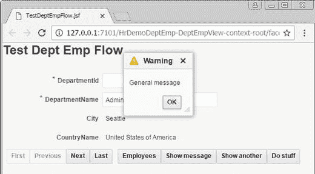

**图 5-10.** 默认位置的消息

### 与组件相关的消息

如果你的消息与页面上的特定 UI 组件相关，你可以提供该项的客户端 ID 作为第一个参数。代码清单 5-11 展示了这一点。

```java
...
import javax.faces.application.FacesMessage;
import javax.faces.context.FacesContext;
import oracle.adf.view.rich.component.rich.input.RichInputText;
...
public class DeptPage{
    private ComponentReference dname;
...
public void setDname(RichInputText dname) {
    this.dname = ComponentReference.newUIComponentReference(dname);
}
public RichInputText getDname() {
    if (dname != null) {
        return (RichInputText)dname.getComponent();
    } else {
        return null;
    }
}
...
public String ShowAnother() {
    FacesContext fctx = FacesContext.getCurrentInstance();
    FacesMessage fm = new FacesMessage(FacesMessage.SEVERITY_INFO,
        "Summary", "This is the detailed message");
    String dnameItem = getDname().getClientId(fctx);
    logger.finer("Dname field is " + dnameItem);
    fctx.addMessage(dnameItem, fm);
    return null;
}
...
}
```
**代码清单 5-11.** 与特定组件相关地向用户显示消息

这要求该组件连接到 bean 属性——在前面的示例中，部门名称项的 `Binding` 属性被设置为 `#{backingBeanScope.deptPage.dname}`。

请注意，尽管 `addMessage()` 的第一个参数在技术上只是一个 `String`，但你不能只在这里写组件 ID。你需要组件的完整位置，这取决于包含该组件的所有容器。正确的值类似于 `pt1:r1:0:pt1:it2`，所以你应该让 `getClientId()` 为你处理这个。

当你将消息与组件放在一起时，效果如图 5-11 所示。

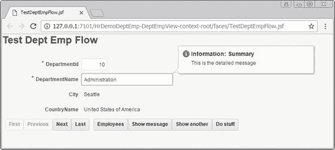

**图 5-11.** 与 UI 组件对齐的消息

可以向页面同时添加通用消息和与组件对齐的消息。ADF 会尽力显示所有消息，但结果对大多数用户来说是令人困惑的。如果你打算添加自己的消息，请只使用一种位置。

### 使用消息区域

如果你不希望你的通用消息显示在弹出窗口中，你也可以在页面上的某处添加一个内联的 `Messages` 组件 (`<af:messages inline="true">`)。所有通用的（非组件对齐的）ADF 消息随后都将显示在此区域中。

### 任务流中的逻辑

通过托管 Bean，你可以在页面中实现自定义行为，但你也可以添加自己的代码来控制任务流中的行为。


### 调用托管 Bean 任务流

如果您想在任务流中的两个页面之间运行某些代码，可以从“组件”窗口将“方法调用活动”拖放到任务流的“图示”视图中。为您的方法调用命名，并将“方法”属性设置为指向您要执行的方法。您可以点击字段左侧的齿轮图标，打开“方法表达式生成器”。这样您就可以通过点击来找到所需的方法，如图 `5-12` 所示。

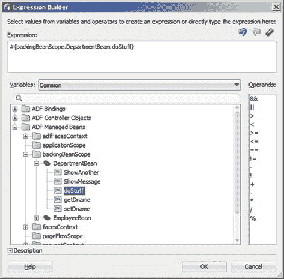
图 5-12. 方法表达式生成器

设置好“方法”后，您可以使用常规的“控制流用例”箭头将您的方法调用连接到任务流中的其他活动。您需要恰好有一条箭头从方法调用活动指出，并且该“控制流用例”上的文本必须与“固定结果”属性的值匹配。

### 在任务流中使用业务逻辑

您还可以从业务组件添加逻辑。在“应用程序”窗口的“数据控件”窗格中显示的每个操作，都可以拖放到“图示”视图上，并自动成为“方法调用活动”。如果绑定尚不存在，JDeveloper 会自动建立绑定，并设置匹配的“方法”属性。其值将类似于 `#{binding.CreateWithParams.execute}`。

请记住，您可以将自定义方法添加到 ADF 业务组件。如果您选择为您的方法创建“客户端接口”，它会显示在“数据控件”窗格中，并且可以像内置的 ADF 操作一样使用。

### 如何使用路由器组件

“方法调用活动”始终只有一个结果，任务流会沿着匹配的箭头转到下一个活动。但是，您可以使用“路由器活动”在任务流中做出分支决策。

一个“路由器”可以有任意数量的“控制流用例”指向其他活动。其中必须有一个与路由器的“默认结果”属性匹配。除此之外，您还可以定义多个“用例”，每个用例将一个“表达式”匹配到一个“结果”（箭头）。

表达式使用表达式语言编写，语法为 `#{ … }`，或者您可以使用“表达式生成器”通过点击组合一个表达式。请注意，“表达式生成器”包含可用于比较值的操作数。

提示：表达式语言中的字面值是用花括号内的单引号编写的，如下所示：`#{'This is a literal value'}`。

对于比简单比较更复杂的任何逻辑，通常最好在托管 bean 中创建一个方法来执行必要的计算。表达式语言很快就会变得难以阅读。

### 任务流切换逻辑

在前面的章节中，我们已经看到，一个企业 ADF 应用程序通常由多个使用页面片段的有界任务流，以及一个包含菜单结构并处理安全性的主页面构成。为了允许从主页面上的菜单切换任务流，我们需要一个“动态区域”组件和一些代码。

### 动态区域如何工作

当您将一个任务流拖放到页面上时，系统会提示您创建“区域”或“动态区域”。对于静态测试页面，您可以直接创建静态“区域”，但在一个应该能够显示不同任务流的主页面中，您需要一个“动态区域”。

页面上的 UI 组件在两种情况下都是 `<af:region>`，但如果您选择动态区域，JDeveloper 将帮助您创建必要的附加代码。

当您创建静态区域时，JDeveloper 只会创建一个指向任务流固定路径的任务流绑定。其形式类似于 `/WEB-INF/dept-emp-flow.xml#dept-emp-flow`。

当您创建动态区域时，JDeveloper 会执行多项操作：
* 创建一个指向托管 bean 的任务流绑定。其形式类似于 `${viewScope.PageSwitcherBean.dynamicTaskFlowId}`。
* 提示您输入控制该区域的 bean 名称，并向 bean 类中填充示例内容。
* 将该 bean 添加到视图项目的无界任务流中。

### 构建主页面

当您构建好前两个任务流后（无论是在一个子系统还是两个子系统中），您就可以创建主应用程序和具有任务流切换功能的主页面。

首先，您需要为主页面创建一个模板。这是在基础工作空间中完成的。您的模板需要两个 facet：一个用于菜单，一个用于页面内容。通常，您会使用一个“面板网格布局”，包含两行，每行一个单元格，将顶部行的高度设置为一个较小的值（如 30 像素）用于菜单。第二行应占据所有剩余空间，因此其高度应设置为“自动”。在顶部单元格中，放置一个用于菜单的 facet，在底部单元格中，放置一个用于内容的 facet。

根据模块化 ADF 应用程序架构，主应用程序需要能够访问构成应用程序的所有组件。这意味着您需要将基础层中的所有 ADF 库，以及包含子系统的 ADF 库添加到主工作空间中。

添加完所有库后，基于该模板创建主页面。在菜单 facet 中，放置一个“菜单栏”组件，然后添加一个或多个“菜单”组件。在菜单上，再放置与您希望显示的任务流相对应的“菜单项”组件。

创建好菜单后，在“资源”窗口中打开子系统 ADF 库，如图 `5-13` 所示。在“ADF 任务流”标题下，您可以看到 ADF 库中的所有任务流。将其中一个拖放到主页面的内容 facet 上，并选择“动态区域”，让 JDeveloper 完成上一节描述的必要工作。

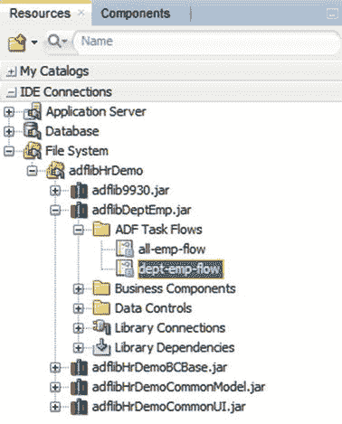
图 5-13. 显示子系统任务流的“资源”窗口

运行此主页面时，您应该会看到页面显示菜单和您拖放到页面上的那个任务流。

### 存储状态

控制动态区域的 bean 必须在视图作用域中。这意味着它仅在显示特定页面时存在，因此它无法存储选择了哪个任务流。为此，我们需要另一个具有更长作用域的 bean。一个不错的选择是在主应用程序的无界任务流中创建一个具有页面流作用域的 bean。当主应用程序启动时，无界任务流启动，实例化其页面流作用域 bean，并显示主页面。由于主应用程序中的无界任务流在应用程序运行期间一直保持活动状态，因此此作用域中的 bean 将持续到应用程序运行结束。

您需要创建一个如代码清单 `5-12` 所示的状态存储 bean。

```
package com.vesterli.hrdemo.master.view.beans;
import java.io.Serializable;
public class UiStateBean implements Serializable {
private String currentTF = "/WEB-INF/dept-emp-flow.xml#dept-emp-flow";
public void setCurrentTF(String s) {
this.currentTF = s;
}
public String getCurrentTF() {
return currentTF;
}
}
```
代码清单 5-12. 用于存储所选任务流的 Bean

该 bean 仅保存一个包含所选任务流路径的字符串变量。应将其初始化为您希望应用程序首先显示的任务流。

您需要将此 bean 添加到主工作空间视图项目的无界任务流 (`adfc-config.xml`) 中，并指定其作用域为页面流作用域。


### 使用存储状态

当你有一个用于存储应用程序状态的 Bean 时，需要将提供当前任务流的 Bean 更改为动态区域。此 Bean 已包含 JDeveloper 自动创建的一些内容，但应将其修改为如代码清单 5-13 所示。

```java
package com.vesterli.hrdemo.master.view.beans;
import java.io.Serializable;
import oracle.adf.controller.TaskFlowId;
public class PageSwitcherBean implements Serializable {
    private UiStateBean currentUiState;
    public PageSwitcherBean() {
    }
    public TaskFlowId getDynamicTaskFlowId() {
        return TaskFlowId.parse(currentUiState.getCurrentTF());
    }
    public void setUiState(UiStateBean state) {
        currentUiState = state;
    }
}
```
代码清单 5-13. 为动态区域提供任务流 ID 的 Bean

此 Bean 现在包含一个 UI 状态 Bean 的私有实例以及一个用于设置它的方法。它仍然包含 JDeveloper 创建的 `getDynamicTaskFlowId()` 方法，但该方法现在返回存储在私有 UI 状态 Bean 中的字符串。

### 连接 Bean

为了使 ADF 在每次初始化时都能将 UI 状态 Bean 传递给页面切换器 Bean，我们使用了一项称为托管属性的 ADF 功能。所有 Bean 都是托管 Bean；也就是说，由 ADF 框架创建和销毁它们。但 ADF 还可以管理这些 Bean 的属性。这是在任务流的“概述”选项卡下的“托管属性”标题下完成的，如图 5-14 所示。

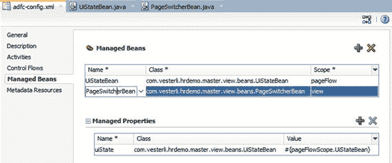
图 5-14. 使用托管属性将 UI 状态连接到页面切换器 Bean

要设置此属性，首先选择页面切换器 Bean，然后单击“托管属性”旁边的绿色加号以创建新的托管属性。每当创建页面切换器 Bean 时，ADF 将自动设置该属性。与属性“名称”匹配的设置器方法将使用“值”属性的内容被调用。例如，如果名称是 `uiState`，ADF 将调用 `setUiState()`。在图 5-14 中，您可以看到“值”是 `#{pageFlowScope.UiStateBean}`。这意味着每当创建页面切换器 Bean 时，都会从页面流作用域插入 `UiStateBean`。

### 连接菜单项

现在所有代码都已就位，我们实际需要在用户选择菜单项时设置一些值。这是通过将“设置属性监听器”组件（来自“组件”窗口的“操作”部分）拖放到每个菜单项上来完成的。这将打开如图 5-15 所示的“插入设置属性监听器”对话框。

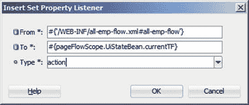
图 5-15. “插入设置属性监听器”对话框

“来源”参数是一个作为表达式语言表达式的字面值：即您希望该菜单项显示的任务流的路径。“目标”参数是您希望将值分配给的 UI 状态 Bean 中的属性，“操作”参数是您希望分配发生的时间。对于菜单项上的属性监听器，您希望分配在操作时（即用户选择菜单项时）发生。

在页面的源视图中，带有设置属性监听器的菜单将类似于代码清单 5-14。

```xml
...
```
代码清单 5-14. 带有属性监听器的菜单

通过这种方式，您可以在用户选择每个菜单项时，将不同任务流的路径分配给 UI 状态 Bean。

### 刷新主页面

最后一步是在 UI 状态值更改时要求区域重绘自身。区域 UI 组件不知道您已更改了 UI 状态 Bean 的值，因此您必须通知它刷新。这是通过在区域上设置 `PartialTriggers` 属性来完成的。

当您单击该属性右侧的齿轮图标并选择“编辑”时，将出现“编辑属性：`PartialTriggers`”对话框，如图 5-16 所示。

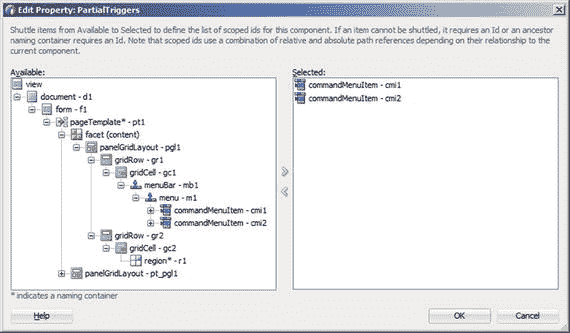
图 5-16. “编辑属性：`PartialTriggers`”对话框

在此对话框中，您指定应触发区域刷新的组件。在左侧，导航到您的菜单项，选择每个项，然后单击 ➤ 按钮将其移至右侧。对右侧“选定”框中的任何项目执行操作都将导致组件刷新，正如用户对现代 Web 应用程序所期望的那样。

当您运行主页面时，每次单击菜单项，设置属性监听器都会在 UI 状态 Bean 中存储一个新值，并告诉区域刷新。区域将刷新，向页面切换器 Bean 请求要显示的任务流的路径，而页面切换器 Bean 将从 UI 状态 Bean 中读取此路径。

## 结论

您现在已了解如何向应用程序添加表示逻辑，以补充业务层中的逻辑，从而使您的应用程序能够执行任何您需要的功能。但正如编程中常见的那样，有时您的代码可能无法首次正确运行。在下一章中，我们将讨论如何使用 ADF 的日志记录和调试功能来修复代码中的任何问题。

