# 6. 日志记录和调试

您已经了解了如何使用强大的声明式功能构建 ADF 应用程序，以及如何将自己的业务逻辑添加到业务组件和用户界面层。但是，有时您的应用程序的工作方式与您预期的并不完全一致。这时日志记录和调试就派上用场了。

## 使用 ADF Logger

帮助您理解应用程序工作方式的第一项功能是日志记录。Java 内置了基本的日志功能，还有像 `Log4J` 这样的几个 Java 日志框架。在 ADF 应用程序中，您应该使用 ADF 特定的 `ADFLogger` 类进行日志记录。ADF Logger 使用标准的 Java 日志 API。

**注意**：切勿在生产代码中使用 `System.out.println()`，即使互联网上有一半的 Java 示例都这样做。您无法关闭此类日志记录，因此会产生无法管理的大量日志。

与标准 Java 日志记录相比，ADF Logger 有几个优点，特别是所有由同一 ADF 事件引起的日志消息都被赋予相同的执行上下文 ID（`ECID`），因此您可以轻松找到与特定消息相关的所有日志条目。您还可以在应用程序运行时更改日志级别，甚至可以为应用程序的特定用户设置更高的日志级别。


## 为类添加日志记录

您所有的 Java 类都应包含一个 `ADFLogger` 实例。在您的团队中，请统一决定其命名，以便每个人都能轻松地在任何地方添加新的日志语句，并确信记录器已存在。我建议直接将此实例命名为 `logger`。

您可以使用 `ADFLogger` 类中的 `createADFLogger()` 工厂方法来创建它，并传入当前类的名称，如清单 6-1 所示。

```java
package com.vesterli.hrdemo.deptemp.model.view;
import ...
public class EmployeesVORowImpl extends ViewRowImpl implements EmployeesVORow {
    private ADFLogger logger =
        ADFLogger.createADFLogger(EmployeesVORowImpl.class);
    ...
}
```
**清单 6-1.** 创建 ADFLogger 实例

如果不提供当前类的名称，您将会收到大量日志消息，但无法查明它们的来源。因此，请始终提供类名。

当您的类中拥有一个记录器对象后，您就可以使用 `ADFLogger` 类提供的各种方法向代码中添加日志语句。所有日志语句都有一个日志级别，重要的是您的团队需要就如何使用它们做出统一决定。下表显示了我的建议。

| 日志级别 | 用途 |
| :--- | :--- |
| `SEVERE` | 阻止应用程序继续运行的严重错误。您的服务器管理员应设置对 ADF 日志文件的监控，以便在发生此类错误时，他和/或您能收到警报。 |
| `WARNING` | 表示应用程序存在问题的警告。通常用于指示配置错误、意外的数据库错误、错误消息或来自外部系统无响应。 |
| `INFO` | 面向业务用户的应用程序操作信息。 |
| `CONFIG` | 类的初始化。从数据库或文件读取初始配置。 |
| `FINE` | 粗粒度的调试日志。使用 `FINE` 记录方法进入和/或退出（即，一个方法内不超过两次）。 |
| `FINER` | 中等粒度的调试日志。使用 `FINER` 记录方法内部的更详细信息。 |
| `FINEST` | 细粒度的调试日志。循环中的日志记录应使用 `FINEST`。 |

在清单 6-2 中，您可以看到一些 ADF 日志语句的示例。

```java
package com.vesterli.hrdemo.deptemp.view.beans;
import ...
public class EmpPage {
    ADFLogger logger = ADFLogger.createADFLogger(EmpPage.class);
    ...
    public String MultiRaise() {
        logger.fine("Entering MultiRaise()");
        RowKeySet selectedEmps = getEmpTab().getSelectedRowKeys();
        Iterator selIter = selectedEmps.iterator();
        logger.finer("Get iterator for all VO records");
        BindingContainer bc =
            BindingContext.getCurrent().getCurrentBindingsEntry();
        DCBindingContainer dcb =(DCBindingContainer)bc;
        DCIteratorBinding empIter =
            dcb.findIteratorBinding("EmployeesInDeptVOIterator");
        RowSetIterator rsi = empIter.getRowSetIterator();
        logger.finer("Loop over selected employees, give raise");
        Row currEmp = null;
        String oldSalString;
        BigDecimal oldSal;
        BigDecimal newSal;
        while (selIter.hasNext()) {
            Key key = (Key)((List)selIter.next()).get(0);
            currEmp = rsi.getRow(key);
            logger.finest("Working on " + currEmp.getAttribute("EmployeeId"));
            oldSalString = (String)currEmp.getAttribute("SalaryString");
            oldSal = new BigDecimal(oldSalString);
            logger.finest("Old sal is " + oldSal);
            newSal = oldSal.multiply(new BigDecimal(1.05))
                .setScale(0, BigDecimal.ROUND_DOWN);
            currEmp.setAttribute("SalaryString", newSal.toString());
            logger.finest("New sal is " + currEmp.getAttribute("SalaryString"));
        }
        logger.finer("Done increasing salaries, refreshing UI");
        AdfFacesContext.getCurrentInstance().addPartialTarget(empTab);
        return null;
    }
    ...
}
```
**清单 6-2.** ADF 日志记录示例

在方法开头有一个 `logger.fine()` 语句，在方法执行流程中有一些 `logger.finer()` 语句提供信息。在代码后半部分的循环内部，使用了 `logger.finest()`。

### 配置日志记录

您希望使用不同日志级别的原因在于，您可以对日志应用相关过滤器。您可以为单个类或 Java 包设置日志阈值，只有达到或超过阈值的日志语句才会实际写入日志。这样一来，额外的日志语句在几乎所有实际情况下都是“免费”的，因为低于阈值的日志语句在运行时的开销非常低。

默认情况下，您只会看到 `WARNING` 级别或更高级别的日志。这是因为您的 `ADFLogger` 实例继承了根记录器的配置，而根记录器被设置为 `WARNING`。要查看您自己不同级别的日志，您需要添加以您的类和包命名的记录器，并定义它们的日志级别。

这可以在 `logging.xml` 文件中完成，但无需直接编辑此文件。对于 JDeveloper 内置的 WebLogic 服务器，您可以从日志窗口中点击 **Actions**（操作），然后选择 **Configure Oracle Diagnostic Logging**（配置 Oracle 诊断日志），如图 6-1 所示。

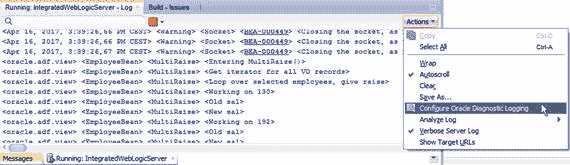
**图 6-1.** 在 JDeveloper 中配置 ADF 日志记录

这会在 JDeveloper 中打开 `logging.xml` 文件。因为 JDeveloper 将此文件识别为特殊配置文件，它提供了一个 **Overview**（概述）选项卡，您可以在其中轻松更改日志配置。如果您想查看原始配置文件，可以选择 `logging.xml` 窗口底部的 **Source**（源）选项卡。

ADF 既有在程序调用之间持续存在的持久记录器，也有每当实例化包含日志语句的类时由 ADF 创建的瞬态记录器。如果在应用程序在内置 WebLogic 服务器中运行时打开 `logging.xml` 窗口，您将看到许多记录器。为了获得更好的概览，请选中 **Hide Transient Loggers**（隐藏瞬态记录器）复选框，如图 6-2 所示。

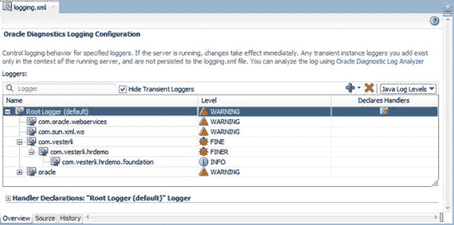
**图 6-2.** logging.xml 的“概述”选项卡

您自己添加的记录器应该是持久记录器。要添加这些记录器，请点击绿色加号并选择 **Add Persistent Logger**（添加持久记录器）。在对话框中，输入记录器名称并选择日志阈值。

*   如果您的记录器名称是包名，则该包中每个类达到或超过阈值的日志语句都将写入日志。
*   如果您的记录器名称是特定类的名称，则只有该特定类达到或超过阈值的日志语句才会写入日志。

所有记录器都会自动排列在根记录器下的层级结构中，每个记录器都可以有自己的日志级别。这使您可以很好地控制哪些内容被写入日志文件。

例如，在图 6-2 中，我指定了：

*   一个 `com.vesterli` 记录器，允许对未由更低级别记录器显式设置日志记录的每个类进行 `FINE` 级别的日志记录。您的组织产生的所有 Java 代码都应位于类似的基准 Java 包下。
*   一个 `com.vesterli.hrdemo` 记录器，允许对作为我的 HRDemo 应用程序一部分的每个类进行 `FINER` 级别的日志记录。通过使用这样一个应用程序基准包，您可以使用一个记录器控制整个应用程序的日志记录。
*   一个 `com.vesterli.hrdemo.foundation` 记录器，仅对此包中的类显示 `INFO` 级别的日志记录。一旦您的基础类在应用程序中经过测试和使用，您通常不希望从它们那里获得非常详细的日志。

### 读取日志

达到相关阈值的日志语句将被写入 WebLogic 日志文件和/或显示在控制台中。

### 在 JDeveloper 中读取日志

当你在`JDeveloper`内置的 WebLogic 服务器中运行应用程序时，你会看到日志条目出现在日志窗口中。`ADF`不会区分你编写的日志语句和`ADF`自身产生的日志。`JDeveloper`的默认配置为`ADF`包设置了一个相当高的阈值，因此除非你添加或重新配置了记录器，否则应该不会看到大量`ADF`内部日志信息。

注意
即使你通过拖放组件到页面上来构建页面，你也可能会收到一些`ADF`警告。实际上，这是`JDeveloper`在抱怨它自己生成的代码。这些警告可以安全地忽略。通常不值得花时间去追踪和修复根本原因。

不要在“操作”菜单中取消选择名为`Verbose Server Log`的选项。这虽然能减少日志输出，但不会区分你的日志和内部`ADF`日志，因此你也看不到任何自己的日志。

如果你有一个很大的日志文件，可以使用`Oracle 诊断日志分析器 (ODLA)`来检查它。要启动它，你从“操作”按钮菜单中选择`Analyze Log ➤ Current in Console`。`ODLA`会如图 6-3 所示打开。

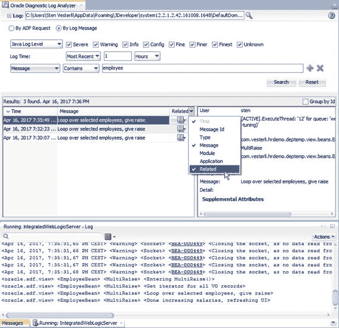
图 6-3. Oracle 诊断日志分析器

在`ODLA`窗口顶部，你可以输入搜索条件并执行搜索。最常见的搜索是在顶部的单选按钮组中选择`By Log Message`。在底部的搜索条件行中，你通常会在第一个下拉菜单中选择`Message`，在第二个中选择`Contains`，然后输入一个搜索字符串。

在`ODLA`窗口下半部分的结果区域中，请注意左侧概览框右上角的小三角形。这允许你选择要在概览中查看哪些属性。如图 6-3 所示，如果你选择了`Related`，你会得到一列带有一个小图标的字段。

这是一个非常强大的功能。如果你点击那个小图标，你会得到一些选项，包括`Related by Request`。如果你选择这个选项，你会看到由同一次服务器往返触发的所有日志消息。这让你能够看到由于相同用户交互（通常是鼠标点击或按键）而在所有类中发生的一切。拥有问题发生之前的消息通常非常有帮助，特别是当其他事件产生的无关消息被过滤掉时。

### 在其他工具中读取日志

当你将应用程序部署到外部 WebLogic 服务器用于测试或生产时，日志配置不会被包含在内。你需要在每个 WebLogic 服务器上单独配置日志记录。这意味着，即使你在`JDeveloper`内置的 WebLogic 服务器中配置了大量日志记录，当你将应用程序部署到另一个 WebLogic 服务器时，默认情况下你将看不到任何日志记录。

在独立的 WebLogic 服务器上，你在 Enterprise Manager 中配置日志记录。为此，在`Application Deployments`下找到`ADF`应用程序，然后选择`Application Deployment ➤ ADF ➤ ADF Log Configuration`。

日志也可以在 Enterprise Manager 中查看，这让你的 WebLogic 管理员能够了解你的应用程序运行状况。甚至，开发人员可以指导运维人员采取某些措施来缓解日志中揭示的问题。例如，当`ADF`应用程序无法联系数据库或外部服务时，就可能出现这种情况。

当你在 Enterprise Manager Grid Control 中查看日志时，你会看到该特定托管服务器上创建的所有日志。你很可能需要过滤日志以追踪问题。类似于`JDeveloper`中`Oracle 诊断日志分析器`的工作方式，你可以搜索包含特定字符串的日志消息，然后点击`View Related Messages`，并通过选择`by ECID (Execution Context ID)`来查找来自同一次服务器往返的消息。

Oracle 还宣布了一项非常有趣的云服务，名为`Oracle Management Cloud`。这项云服务可以接收来自各类应用程序的日志文件，并提供带有可视化和下钻功能的综合概览。`Oracle Management Cloud`将接收的日志输入之一就是来自`ADF`应用程序的日志，这些应用程序既包括在您数据中心 WebLogic 服务器上运行的`ADF`应用，也包括部署到`Oracle Java Cloud Service`上的`ADF`应用。在撰写本文时它尚未发布，但你可以访问`cloud.oracle.com`查看它是否可用以及是否符合你的需求。

最后，你可以自己阅读原始日志文件，或者配置一些工具来监控和展示它们。`ADF`日志条目会写入你部署应用程序所对应的托管服务器的 WebLogic 服务器日志中。如果你部署到一个名为`MyManagedServer`的托管服务器，你可以在`MyManagedServer-diagnostic.log`文件中找到你的`ADF`条目。你的服务器管理员可以帮助你找到这个文件，也可以使用 Enterprise Manager 将其移动到其他位置。

注意
如果你无法访问服务器文件系统，请询问你的服务器管理员，是否可以将测试服务器的日志文件放在共享网络驱动器上。

如果你想查看`JDeveloper`内置 WebLogic 服务器的日志文件，你可以在域主目录中找到它们。在 Windows 上，路径类似于`C:\Users\<你的用户名>\AppData\Roaming\<systemX.Y.Z>\DefaultDomain\servers\DefaultServer\logs\DefaultServer-diagnostic.log`。

### 常规调试

`JDeveloper`是一个完整的`集成开发环境 (IDE)`，因此它当然包含了你期望的所有调试功能。

### 设置断点

要调试你的 Java 代码，你需要打开相关的类，然后在左侧边距处点击以设置一个断点。它会用一个红点和该行代码的红色背景标记出来，如图 6-4 所示。

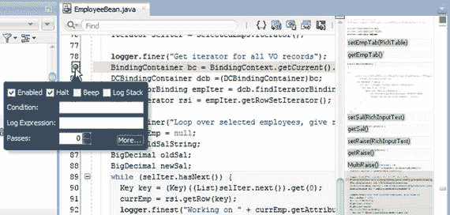
图 6-4. 设置断点

它在右侧边距也会用一个小粉色方框标记。如果你显示了迷你地图，带有断点的行在那里也会显示为粉红线。你可以在迷你地图或右侧边距点击，以跳转到某个断点（或代码中的任何其他位置）。

注意
源代码视图右侧的迷你地图可以让你快速概览大型类。你可以右键单击并设置各种选项以及隐藏该地图。要再次显示它，请按`Alt+Shift+句点`或在源代码中右键单击上下文菜单中选择`Source ➤ Show Mini-Map`。

如果你将鼠标悬停在左侧边距的红色断点圆点上，会弹出一个对话框，如图 6-4 所示。在这个对话框中，你可以选择，例如，只在第五次到达该断点时停止，或者基于某些条件停止。如果你右键单击断点圆点并选择`Edit Breakpoint`，你会获得更多选项来定制该断点。

### 以调试模式运行

一旦设置了所需的断点，你就可以右键单击一个可运行的元素并选择`Debug`（而不是通常的`Run`）。

对于子系统中的任务流，你通常运行一个包含要调试的任务流的测试页面。要测试应用程序中的 Java 类，你通常会有调用它们的单元测试类，因此你可以直接运行这些单元测试来调用和调试你的类。

如果内置的 WebLogic 服务器已经以正常（`运行`）模式启动，系统会提示你是否要重启服务器。以`调试`模式运行会稍慢一些，并且需要重启 WebLogic，因此`JDeveloper`会保护你免于意外地在`运行`和`调试`模式之间切换。


### 单步执行代码

当你在代码中遇到断点时，执行会停止，JDeveloper 会高亮显示代码中的当前行。如果在任何内容返回给 Web 浏览器之前中断，浏览器将只是一片空白，显示尚未收到响应的指示。

执行停止后，你有几个选项：

*   单步跳过（`F8`）
*   单步进入（`F7`）
*   单步跳出（`Shift+F7`）
*   执行至方法结束
*   运行至光标处（`F4`）
*   继续执行（`F9`）

其中一些选项可从源视图上方的工具栏中找到，所有选项都可以在“源”菜单中找到。

常规方法是使用“单步跳过”逐行执行你类中的代码。JDeveloper 会在最左侧边距中显示执行次数、一些变量和一些控制流，如图 6-5 所示。

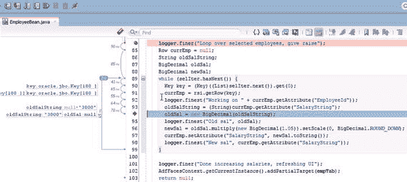

图 6-5.

在 JDeveloper 中调试代码

默认情况下，最左侧边距（常规边距中行号的左侧）相当狭窄，但你可以拖动其边缘以查看更多调试信息，如上图所示。

“单步进入”将进入包含当前打开类所调用方法的类。如果当前代码行调用了多个其他类的方法，系统会提示你选择要进入哪个类。如果你的代码中存在嵌套调用层次结构，这将非常有用，但有时只会将你带入 Oracle 的 ADF 源代码中。除非你已按本章后面说明请求并安装了源代码，否则尝试进入 ADF 代码只会导致缺少源代码的错误。

你也可以直接点击将光标置于代码更下方的位置，然后按 `F4` “运行至光标处”。当你收集到所需信息后，按“继续执行”（`F9`）允许 JDeveloper 继续执行。

### 收集信息

当你以调试模式启动内置的 WebLogic 服务器时，JDeveloper 会自动在“日志”窗口中为你打开几个新选项卡：

*   `数据`
*   `智能数据`
*   `监视点`
*   `EL 求值器`
*   `ADF 数据`
*   `断点`

“数据”选项卡显示当前内存中所有对象的信息，而“智能数据”选项卡会猜测在此代码位置与你最相关的内容并仅显示这些。

如果你对这两个窗口中都没有的某些内容感兴趣，可以在“监视点”选项卡上添加一个监视点。你可以键入表达式，也可以在代码视图中选择某些内容，右键单击，然后选择“监视”。

“EL 求值器”允许你计算表达式语言表达式的值，这在调试如下所述的流程时特别有用。

“ADF 数据”选项卡显示 ADF 内存作用域（pageFlowScope、requestScope 等）中的所有内容，而“断点”选项卡则提供代码中所有断点的概述。你可以关闭不需要的选项卡，并从 JDeveloper 的“窗口”菜单的“调试器”子菜单中重新打开这些及其他调试选项卡。

此外，你可以将光标置于任何变量上并按 `Ctrl+I`（或右键单击并选择“检查”）以打开一个独立的弹出式“检查器”窗口，显示该变量。

### 调试任务流

当你能够找出导致问题的代码时，调试代码是有效的。但有时，可能很难找到正在运行的代码，或者应用程序中的执行路径与你预期的不同。幸运的是，JDeveloper 为你提供了在比代码更高的层次进行调试的能力：在任务流中。

要调试任务流，你在“图表”视图中打开它，并右键单击某个任务流活动。它会出现一个小红点，如图 6-6 所示。

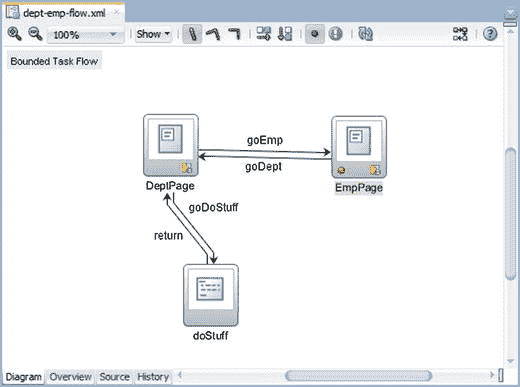

图 6-6.

在任务流中设置断点

当你运行应用程序时，执行会在任务流中的断点处停止。在 JDeveloper 中，焦点位于带有活动断点的任务流图上，并且 JDeveloper 通常会移到开发机器的前台（位于活动浏览器窗口前面）。

当你在任务流中停止执行时，实际上没有代码可以单步执行，但你可以使用表达式语言（EL）检查应用程序的状态。你在“日志”窗口的“表达式语言”选项卡上进行此操作，如图 6-7 所示。

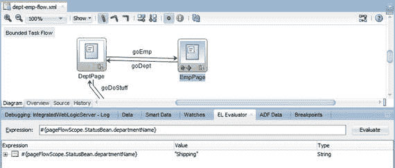

图 6-7.

调试任务流时计算表达式语言

通过此窗口，你可以检查托管 Bean 和公开为 EL 的 ADF 内部值中的值。例如：

*   `#{pageFlowScope.myBean.myAttribute}` 将为你提供页面流作用域中 Bean `myBean` 的 `myAttribute` 属性的值。请注意，如果你选择了错误的作用域，表达式语言将只计算为 null。
*   `#{securityContext.userName}` 将为你提供当前登录用户的名称。如果用户尚未登录，此值将计算为 `anonymous`。
*   `#{facesContext.viewRoot.locale.language}` 将为你提供应用程序当前运行的语言（来自浏览器）。这对于调试翻译或本地化错误非常有用。

### 调试进入 ADF 库

正如你在第 2 章所看到的，一个 ADF 应用程序通常由多个子系统和一个主应用程序组成。每个子系统都部署为一个 ADF 库，主应用程序使用这些库。但是，当你追踪的错误在单独测试任务流时不出现时，如何调试整个应用程序呢？解决方案很简单：你将源代码与子系统的 ADF 库一起包含。

### 部署源代码

为了允许调试器在子系统代码中中断并显示相关源代码，它需要访问源代码。默认情况下，ADF 库仅包含已编译的 Java 类文件（字节码），而不包含源文件。这对于部署生产应用程序来说没问题，因为你不想让最终用户不需要的源代码使库膨胀。在某些情况下，你的 ADF 应用程序甚至可能由你不希望其查看源代码的最终客户使用。

但对于调试，你需要部署子系统的源代码。为此，你创建一个单独的部署配置文件，将你的源代码打包到 JAR 文件中。选择常规的 `文件` ➤ `新建` ➤ `常规` ➤ `部署配置文件`，然后选择 `JAR 文件`（而不是常规的 `ADF 库 JAR 文件`）。你应该为源 JAR 文件确定标准命名——我建议加上 `source` 前缀，例如 `sourceDeptEmp`。

在 `编辑 JAR 部署配置文件属性` 对话框中，你需要打开 `文件组` ➤ `项目输出` ➤ `贡献者` 并更改 JDeveloper 建议的默认内容。你不需要 `项目输出目录` 和 `项目依赖项`，但你需要 `项目源路径`，如图 6-8 所示。

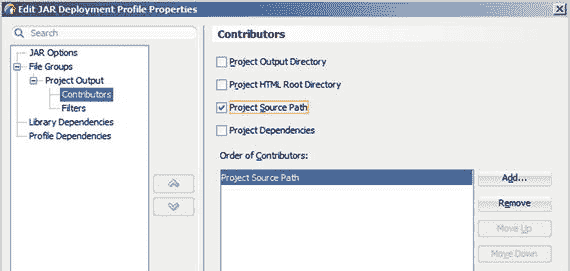

图 6-8.

为源 JAR 部署设置属性


### 在库代码中中断

当您为相关子系统创建了源代码 JAR 文件后，您可以像添加其他 JAR 一样将它们添加到您的主应用程序视图项目中：`Project Properties`（项目属性）➤ `Libraries and Classpath`（库和类路径）➤ `Add JAR/Directory`（添加 JAR/目录）。

要查看源代码 JAR 文件并在其中设置断点，您需要重新配置`Applications`（应用程序）窗口以显示所包含的库。这可以通过`Applications`（应用程序）窗口右上角的`Navigator Display Options`（导航器显示选项）按钮来完成。选择`Show Libraries`（显示库），如图 6-9 所示。

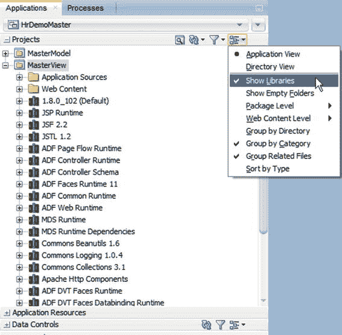

图 6-9. 配置`Applications`（应用程序）窗口以显示库

现在，所有库都显示在`Applications`（应用程序）窗口中。找到您想要在其中设置断点的子系统对应的源代码 JAR 文件，打开它并双击 Java 文件以打开源文件。您可以在这些子系统文件中设置断点，如图 6-10 所示。当您运行主应用程序时，执行将在您选择的相关子系统中的位置停止。

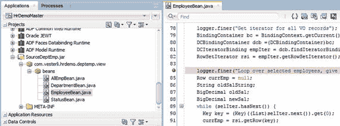

图 6-10. 从主应用程序在子系统源代码中放置断点

### 添加 ADF 源代码

在调试 ADF 应用程序时，您经常会看到图 6-11 所示的对话框。

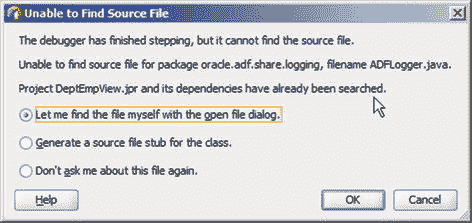

图 6-11. 无法找到源文件

这个对话框意味着您希望继续单步调试，但 `JDeveloper` 无法找到包含下一个要执行的代码片段的源文件。如果执行继续到您自己的某些类中，而您又没有按照前面所述创建源代码 JAR，就可能发生这种情况。但最常见的情况是，执行进入了 `Oracle` 提供的大型 ADF 代码库。默认情况下，您没有 `Oracle` ADF 的源代码。

### 获取 ADF 源代码

但如果您与 `Oracle` 签订了有效的支持合同，您可以获取源代码。该过程在 `My Oracle Support` 上的 `Doc ID 971256.1` 中有描述，主要步骤如下：

1.  您通过 `My Oracle Support` 提交一个 `Service Request`（服务请求），并要求获取您所需版本的 ADF 源代码。您必须提供一个有权代表您的组织与 `Oracle` 签署 `Source Code Agreement` (`SCA`)（源代码协议）的人员的姓名、电子邮件和传真号码（是的，确实需要）。如果您是开发者，这个人可能是您的经理。
2.  `Oracle` 会向您发送 `SCA`。
3.  您组织中被授权的人员签署并将 `SCA` 返回。
4.  `SR`（服务请求）会更新一个指向相关源代码 `ZIP` 文件的 `URL` 以及打开该 `ZIP` 文件的密码。
5.  您下载 `ZIP` 文件（其名称通常类似于 `adf_vvvv_nnnn_source.zip`，其中 `vvvv` 是版本号，`nnnn` 是构建号）。

### 将 ADF 源代码添加到 JDeveloper

从 `Oracle` 获得 ADF 源代码后，您通常需要为其创建一个用户库。为此，选择 `Tools`（工具）➤ `Manage Libraries`（管理库）以打开 `Manage Libraries`（管理库）对话框。在此对话框中，单击 `New`（新建）以添加一个用于 ADF 源代码的新库。提供一个名称，并将 `ZIP` 文件作为一个新的 `Source Path`（源路径）条目添加。不要选中 `Deployed by Default`（默认部署）复选框。

### 将 ADF 源代码添加到项目

定义了 ADF 源代码用户库后，您可以在每个相关项目的 `Project Properties`（项目属性）➤ `Libraries and Classpaths`（库和类路径）➤ `Add Library`（添加库）下将其添加进去。您的 ADF 源代码库应出现在 `Users`（用户）节点下。

将 ADF 源代码作为项目的一部分后，您就可以调试进入 ADF 本身了。如果您需要更多信息来帮助调试一个棘手的问题，您还可以跟踪从您自己的应用程序到内部 ADF 类的执行路径。如果您对 ADF 内部工作原理感到好奇，您甚至可以在 `Oracle` 的代码中设置断点。

