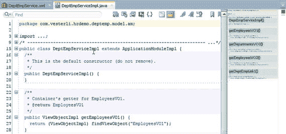
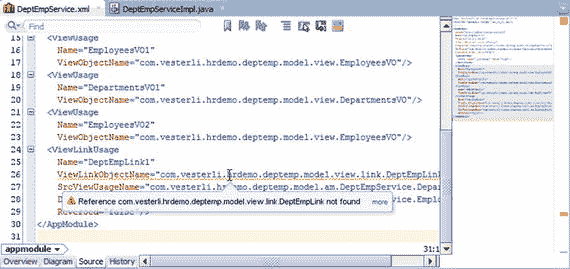

# 提示与技巧

当您的 ADF 应用程序出现问题时，首先运行 `ADF Model Tester`（ADF 模型测试器）。这将告诉您问题是出在业务组件层还是用户界面层。

### 如果模型无法运行

某些类型的错误意味着模型测试器根本无法启动。在这种情况下，`JDeveloper` 无法提供任何好的建议，您在 `Log`（日志）窗口中看到的只是类似清单 6-3 的内容。

```
C:\Java\jdk1.8.0_102\bin\javaw.exe -server -classpath ...
Apr 17, 2017 5:31:10 PM oracle.security.jps.JpsStartup start
INFO: Jps initializing.
Apr 17, 2017 5:31:11 PM oracle.security.jps.JpsStartup start
INFO: Jps started.
Apr 17, 2017 5:31:20 PM oracle.jbo.jbotester.MainFrame main
INFO: BC4J Tester started.
```

清单 6-3. `ADF Model Tester`（ADF 模型测试器）未完全启动

如果您没有看到 `jdev tester server connecting on port...`，则表示模型测试器未正确启动。这种情况下，您的业务组件中的某些代码存在问题，您需要检查所有业务组件的源文件。

您需要打开 `XML` 文件（在业务组件的 `Source`（源）选项卡上）以及您生成的任何 `Java` 类。一个没有问题的文件在右边距顶部有一个绿色方块，并且右边距没有其他标记，如图 6-12 所示。



图 6-12. 没有问题的业务组件文件

如果文件存在问题，右上角的方块是橙色或红色的，并且在右边距的不同位置会出现橙色和/或红色的标记，如图 6-13 所示。



图 6-13. 有问题的业务组件文件

每个问题都在代码中以橙色或红色下划线突出显示，您可以将鼠标指针指向它，`JDeveloper` 就会告知它认为是什么问题。

## 如果页面是空白的

如果您的网页显示为空白，并且 `JDeveloper` 日志没有告知您问题所在，您需要检查该页面的源文件。查找右边距中用红色和/或黄色条标记的错误和警告，以及代码中的下划线。

如果这无助于解决问题，您可以回退到久经考验的调试方法：注释掉代码。由于页面的源是 `XML`，您需要使用 `XML` 注释语法 `<!--   -->`。

首先，在页面顶部附近放置一个起始注释，并注释掉所有包含表达式语言（绑定、操作监听器等）的内容。然后从 `Components`（组件）窗口中放入一些简单的组件，如清单 6-4 所示。

```
...
-->
```

清单 6-4. 注释掉页面的部分内容

现在，当您运行页面时，应该只看到简单的组件。然后移动注释开始和结束标记，以包含越来越多的 `UI` 组件，直到找到导致问题的那一个。

