# 7. 您的工作流程

`JDeveloper` 是一个企业级工具，它支持并与许多您需要的工具集成，以支持企业应用程序开发流程。


### 工作流程

由于 ADF 提供了多种方式来实现一次通用功能，然后在多个应用间共享，因此**从一开始就以正确的方式设置项目至关重要**。

开发工作应在装有 `JDeveloper` 的开发工作站上进行，最好还配有一份数据库副本。现代工作站性能强大，足以同时运行 `JDeveloper`、`WebLogic` 和数据库。当面对数据库不可避免的变更时，这种配置能为你提供更大的灵活性。

你需要将完成的代码交付至中央代码仓库，然后由构建过程（最好是自动化的）生成应用程序的某个版本，并将其部署到集成环境。

### 设计工作

第一步是与实际最终用户一起设计应用程序。确保设计小组中有各类用户的代表。一个常见的问题是应用程序由专家用户开发——这通常会导致界面过于复杂，普通用户和新手用户难以理解。

除了用户之外，为了快速高效地使用 ADF 开发出用户友好的应用程序，你还需要三种不同的技术技能：

*   用户体验（UX）设计师
*   经验丰富的 Oracle ADF 开发人员
*   数据库设计师

用户体验设计师通过研讨会引导用户设计出满足其需求的界面和导航，同时确保一致性和用户体验最佳实践的实施。Oracle 已对用户体验进行了广泛研究，并免费提供了其所有最佳实践。你团队中的 UX 设计师应熟悉《Oracle 应用程序用户体验设计模式》（ [`www.oracle.com/webfolder/ux/applications/DPG/index.html`](http://www.oracle.com/webfolder/ux/applications/DPG/index.html) ），并阅读免费的 Oracle 电子书以获取灵感。如果你的 ADF 应用程序旨在扩展 Oracle 的云应用程序，则应按照“简化用户体验”指南构建你的应用程序，使其看起来与 Oracle 云应用程序套件中的应用程序一致。

当用户体验（界面和导航）的初稿完成后，UX 设计师会与首席 ADF 开发人员进行讨论。开发人员可以通过以下两种方式为设计做出贡献：

*   建议使用专门的 ADF 组件，可能以较低成本提供额外功能或便利
*   如果建议的设计在标准 ADF 中难以实现，则提出满足特定需求的替代方案

然后，UX 设计师会进行必要的修改，以纳入 ADF 开发人员的意见，并与用户一起最终确定设计。

设计完成后，数据库设计师根据设计来识别所有数据实体及其关系和属性。在此阶段，可能需要返回用户处澄清关系、属性和有效值，然后再构建数据库。

### 应用程序架构

随着应用程序规范开始具体化，你可以开始建立应用程序架构。

如果这是你构建的第一个 ADF 应用程序，你应该从第 2 章中描述的模块化 ADF 架构开始，该架构由一个基础层、若干子系统和一个主应用程序组成。

如果你已经知道将构建许多 ADF 应用程序，并且你的团队中有一些经验丰富的 ADF 开发人员，你也可以从一开始就建立一个企业级 ADF 架构。这种更复杂的架构也在第 2 章中进行了描述，涉及为所有应用程序建立企业基础层，以及为每个应用程序建立独立的应用程序基础层。

此时，你需要决定子系统的数量，包括每个子系统的名称、范围和 Java 包名称。

### 初始开发

应用程序架构就位后，你就可以开始初始开发了。如果你正在按照敏捷方法运行项目，可以将此视为第一个冲刺阶段。

### 开发标准

你需要某个地方来记录你的开发标准。为了便于更新和跟踪变更，这最好是一个 Wiki 或类似工具，而不是文字处理文档。

你的开发标准必须包括基础层、所有子系统和主应用程序的 Java 包名称。它还应包括 Java 编码准则（现在就解决制表符与空格之争，一劳永逸）以及 ADF 对象和 Java 类的命名标准。

**提示**

要获取 ADF 命名标准的灵感，你可以查看由 ADF 企业方法组制定的《ADF 命名与项目布局指南》（ [`www.oracle.com/technetwork/developer-tools/adf/learnmore/adf-naming-layout-guidelines-v2-00-1904828.pdf`](http://www.oracle.com/technetwork/developer-tools/adf/learnmore/adf-naming-layout-guidelines-v2-00-1904828.pdf) ）。

`JDeveloper` 有许多可以设置的偏好选项。请确保至少设置以下内容：

*   环境 ➤ 编码（设置为 `UTF8`。某些平台上的某些 `JDeveloper` 版本默认为其他编码）
*   ADF 业务组件 ➤ 基类（设置为你自己的 BC 基类）
*   ADF 业务组件 ➤ 包（为实体、关联、视图对象、视图链接和应用程序模块提供不同的子包，以便在代码和 `JDeveloper` 中将它们分离）
*   代码编辑器 ➤ 代码样式（复制一个配置文件并根据你的需要进行调整）

### 创建所有 JDeveloper 工作区

标准就位后，你的首席开发人员或架构师应创建应用程序的所有 `JDeveloper` 工作区，包括其中的项目。这些工作区应创建在一个新目录中，该目录除用于 ADF 工作区和 ADF 库外不作他用。我们称此目录为你的 `$ADF_ROOT` 目录（例如，`C:\JDeveloper\hrdemo`）。

在模块化 ADF 架构中，这意味着创建：

*   基础层工作区，包含通用模型、通用 UI、通用实用程序代码和业务组件基类等项目
*   所有子系统工作区，每个都包含一个模型项目和一个视图/控制器项目
*   主应用程序工作区
*   一个用于存放你的 ADF 库的目录

### 创建初始基础层

现在，在基础层工作区内，你应该创建整个应用程序所依赖的元素：

*   业务组件基类
*   页面模板
*   页面片段模板
*   任务流模板
*   应用程序皮肤

你的业务组件基类目前可以为空，但你需要创建它们并设置 `JDeveloper`，以便在创建 ADF 业务组件时使用这些基类。

**注意**

`JDeveloper` 并未提供简便的方法将配置从一个 `JDeveloper` 实例迁移到另一个实例，因此无法将正确的 `JDeveloper` 设置分发给你整个团队，除非给每人一台预装了正确配置的 `JDeveloper` 的虚拟机。

同样，你的模板和皮肤目前也可以为空。有关这些元素的更多详细信息，请参阅第 2 章。

创建这些初始代码后，从通用 UI 和业务组件基类项目创建 ADF 库。将这些 ADF 库 `JAR` 文件放入 ADF 项目目录中的通用 ADF 库目录中。然后，按照本章后面“源代码控制”部分的描述，将所有工作区置于版本控制之下，并将 ADF 库目录置于版本控制之下。


### 创建数据库

在创建 JDeveloper 工作空间和初始基础架构的同时，您的数据库设计团队可以为应用程序创建初始的数据模型。

一个成功的 Oracle ADF 项目基于一个设计良好的数据库。数据库设计超出了本书的范围。

**提示**  
确保数据库对象（如表）的版本控制可能很困难。可以考虑使用像 `Flyway`（ [`https://flywaydb.org/`](https://flywaydb.org/) ）这样的工具，来处理任何项目中都不可避免的数据库变更。

如果您想使用 JDeveloper 来开发数据库，请研究 JDeveloper 中称为离线表的功能。这些表在 JDeveloper 中定义，可以与实际的数据库进行比较，并且 JDeveloper 可以自动生成必要的脚本，使数据库与离线定义保持一致。

### 初始应用

初始应用的目的有两个：一是确保所有部分协同工作，并在开始正式构建前修复任何问题；二是向您的用户展示应用程序将是什么样子。在敏捷开发中，一个基本原则是能够在每两到三周的冲刺结束时演示一些新的功能。即使您不实施敏捷方法的其他部分，通过定期向用户展示应用程序的演示来让他们了解进度，也是一个好主意。

一旦数据库的第一个版本准备就绪，您就可以使用“从业务组件生成表”向导在公共模型项目中创建所有实体对象。然后从公共模型项目创建一个 ADF 库。

接着，您构建一个简单的子系统，实现应用程序设计中的一个界面。如果您的应用程序包含用于维护参考数据的界面，那么其中某个界面可能是一个适合在初始应用中实现的候选。该子系统将涉及一个基于来自公共模型 ADF 库的实体对象的视图对象，以及一个包含单个页面片段的任务流。将完成的子系统部署为 ADF 库。

在构建子系统的同时，您的团队还应按照第 5 章所述构建带有菜单和任务流切换逻辑的主应用程序。如果您的应用程序将要实施 ADF 安全性，请现在就使用示例用户为主应用程序应用安全性，用于演示。

**注意**  
不要等到项目结束时才实施安全性。如果您的应用程序需要将您的 WebLogic 应用服务器与另一个身份提供程序（如 Microsoft Active Directory）集成，您需要在项目早期启动此过程，以便有时间修复可能出现的任何问题。

按照第 5 章所述，将子系统 ADF 库添加到主应用程序中，并测试是否可以调用来自子系统的任务流，以及是否可以更改页面片段上的数据并将这些更改后的数据存储到数据库中。

然后向用户展示这个基本应用程序。这让他们对最终的 ADF 应用程序将是什么样子有了初步的了解，并向他们证明项目正在进展中。

### 构建应用程序

初始应用已经证明了整个技术栈是可行的，或者可能已经识别出您需要处理的领域（例如，安全性集成）。要构建应用程序的其余部分，您需要在子系统中实现所有设计好的界面和其他功能。

如果您使用敏捷开发方法，您会为每个冲刺选择一些用户故事，并不断从子系统部署新的 ADF 库，并将它们集成到主应用程序中。如果您按照传统的瀑布模型运行项目，请确保在计划中设置一些里程碑，在这些里程碑点将所有工作集成到主应用程序中，以便向最终用户和其他利益相关者演示应用程序的当前状态。

### 处理数据库变更

在开发过程中，数据库总是会发生变化。会有对现有表中属性的小改动（新增或修改的列），也可能涉及新表和表关系变更的较大的结构性变化。

当您需要对数据库中的表进行小改动时，编写脚本来在本地数据库中进行更改。然后更改基础工作区中公共模型项目中的相应实体对象。您可以右键单击实体对象并选择“与数据库同步”，以寻求 JDeveloper 的帮助。“与数据库同步”对话框如图 7-1 所示。

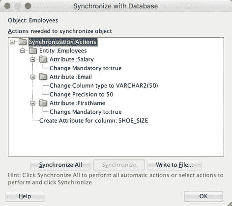
*图 7-1.*
将数据库更改与 ADF 实体对象同步

您需要单击“同步”或“全部同步”来让 JDeveloper 实际更改您的实体对象——如果只是单击“确定”，则不会进行任何更改。确认您需要更改后，JDeveloper 会确认哪些更改已成功。

请注意，实体对象中的属性更改不会自动应用于使用该实体对象的视图对象，并且对于视图对象也没有相应的“同步”功能。您必须手动处理任何视图对象的更改。您可以右键单击实体对象并选择“查找用法”，以查找依赖于该实体对象的视图对象。

### 处理其他基础架构变更

对业务组件基类的更改不应破坏现有代码。同样，对页面和任务流模板的更改可能会影响页面的视觉外观，但不应破坏应用程序（除非您意外删除了某些页面中使用的 facet）。

但是，您应始终执行回归测试，以验证您的应用程序是否仍然有效。通过用户界面自动化应用程序测试是一个好主意。

### 源代码控制

您需要将 ADF 应用程序源代码和库置于版本控制之下。如果您的组织以前使用过像 Oracle Forms 这样的工具，它将所有源代码组织在少数几个大文件中，那么您可能至今还没有适当的版本控制。一旦开始使用包含大量小型但相互依赖的文件的 ADF，您就绝对需要实施源代码控制。

当今最流行的版本控制软件是 `Git`。图 7-2 显示了来自 Google Trends 的各种版本控制工具随时间变化的比较。

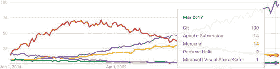
*图 7-2.*
版本控制软件流行度

`Git` 是一个免费的开源工具，可以从 [`https://git-scm.com/`](https://git-scm.com/) 下载并在本地运行，或者您可以使用托管实例，如 `GitHub`（ [`https://github.com/`](https://github.com/) ）。本章稍后描述的 Oracle Developer Cloud Service (DCS) 也使用 `Git`。不过，`JDeveloper` 内置了对 `Apache Subversion` 的支持，您可以从 `JDeveloper` 扩展中心（ [`http://apex.oracle.com/pls/apex/f?p=updatecenter:uc`](http://apex.oracle.com/pls/apex/f?p=updatecenter:uc) ）下载用于 `CVS`、`Perforce` 等的扩展。


### 对整个应用程序进行初始版本控制

本节介绍如何使用 Git 对应用程序进行版本控制。由于 Git 是一个分布式版本控制系统，您通常先将更改提交到您的私有本地仓库，然后将更改推送到中央仓库。因为 Git 已经与 JDeveloper 集成，所以您无需单独下载和安装它。

**提示**
如果您正在使用任何 Oracle 云服务（例如 Java Cloud Service），则 Oracle Developer Cloud Service (DCS) 已包含在内，您无需额外付费即可使用。此服务包含一个中央 Git 仓库和许多其他工具。如果您计划使用 DCS，请参阅本章后面关于 DCS 的具体章节。

如前所述，您的技术主管或架构师应在开发开始前构建所有必要的工作区。他还应将所有文件置于版本控制之下。此过程涉及四个步骤：

1.  将您的 ADF 根目录初始化为本地 Git 仓库
2.  将所有项目文件添加到此本地仓库
3.  将所有项目文件提交到本地仓库
4.  将本地仓库推送到所有开发者均可访问的中央 Git 仓库

**注意**
如果您使用 `Team ➤ Version Application`（团队 ➤ 版本化应用程序），则会运行 `Import to Git wizard`（导入 Git 向导），并将单个应用程序工作区版本化到一个 Git 仓库中。但是，initialize-add-commit（初始化-添加-提交）方法会将一个目录中的所有工作区版本化到同一个 Git 仓库中，因此这是推荐的方法。

### 初始化本地 Git 仓库

首先，将所有 ADF 工作区及 ADF 库目录所在的目录初始化为 Git 仓库。Git 仓库只是一个带有一些 Git 可识别的额外文件的目录。在本章中，我们将此目录称为 `$ADF_ROOT`。

为此，请选择 `Team ➤ Git ➤ Initialize`（团队 ➤ Git ➤ 初始化）。仅当您在 JDeveloper 中打开着一个未版本化的应用程序工作区时，此菜单项才处于活动状态。在“初始化仓库”对话框中，提供所有 ADF 工作区及 ADF 库目录的根目录名称，如图 7-3 所示。

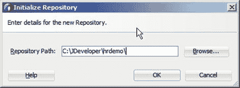

图 7-3. 初始化 Git 仓库

这会添加一个隐藏的 `.git` 子目录，从而将您指定的目录转变为一个 Git 仓库。

### 添加所有文件

完成此步骤后，您会在 JDeveloper 的“Applications”（应用程序）窗口中看到，所有文件夹和文件图标的左下角都添加了一个小标记，如图 7-4 所示。如果将鼠标光标指向某个文件或文件夹，弹出的小提示框会显示 `Git: Unversioned`（Git：未版本化）。

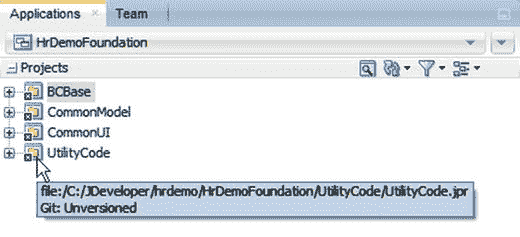

图 7-4. 未版本化的应用程序工作区

工作区中的所有文件也会出现在“Pending Changes window”（待定更改窗口）的“Candidates tab”（候选选项卡）上。如果此窗口未作为新标签页在屏幕底部的“Log window”（日志窗口）旁边自动打开，您可以通过选择 `Team ➤ Git ➤ Pending Changes`（团队 ➤ Git ➤ 待定更改）来打开它。

要添加所有文件，请选择 `Team ➤ Git ➤ Add all`（团队 ➤ Git ➤ 全部添加）。将出现“Add All”（全部添加）窗口，其大小可调整，如图 7-5 所示。

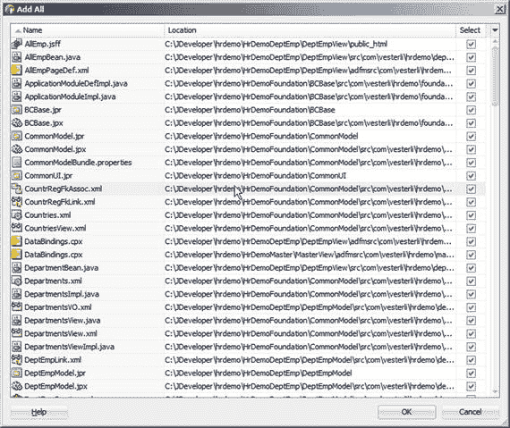

图 7-5. “添加全部”对话框（已展开）

请注意，“Add All”（全部添加）对话框包含 `$ADF_ROOT` 下所有工作区的所有文件。因为您将 `$ADF_ROOT` 目录初始化为一个 Git 仓库，“Add All”（全部添加）操作会作用于该目录及其子目录中的所有文件。

“Applications”（应用程序）窗口中图标上的标记变为加号，所有文件移动到“Pending Changes window”（待定更改窗口）的“Outgoing”（传出）选项卡，如图 7-6 所示。

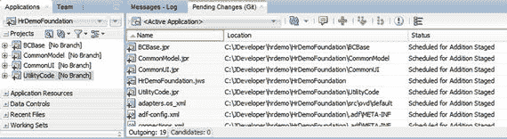

图 7-6. 文件已添加并准备提交到 Git

### 提交所有文件

要将所有文件提交到您的本地 Git 仓库，请从 JDeveloper 主菜单中选择 `Team ➤ Git ➤ Commit All`（团队 ➤ Git ➤ 全部提交），或从“Applications window”（应用程序窗口）的上下文菜单中选择 `Versioning ➤ Commit All`（版本控制 ➤ 全部提交）。将出现“Commit All”（全部提交）对话框，如图 7-7 所示。

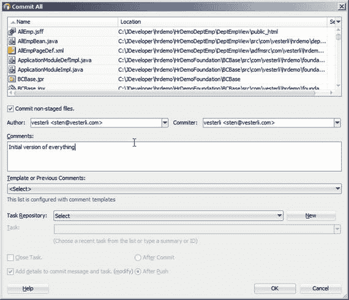

图 7-7. “全部提交”对话框

请确保勾选 `Commit non-staged files`（提交未暂存的文件）复选框。Git 实际上使用一个单独的暂存区，文件可以是 `Staged`（已暂存）或 `Not Staged`（未暂存）（您可以在“Pending Changes window”（待定更改窗口）的“Status column”（状态列）中看到这一点）。高级 Git 用户可以通过控制文件是否已暂存来仅提交部分已更改的文件。对于日常 Git 使用，只需勾选该复选框并提交所有文件，无论其是否已暂存。


### 使用中央仓库

当你从 JDeveloper 提交文件时，更改会存储在你的本地 Git 仓库（即你之前初始化的 `$ADF_ROOT` 目录）中。正因为你是针对本地仓库进行操作，所以提交速度非常快，并且没有你提交的代码会破坏他人代码的风险。

当然，存储在本地仓库的文件距离被遗忘仅一次硬盘崩溃之遥，因此你需要将更改推送到一个公共仓库进行安全保存，并允许其他人在需要时使用最新代码。为此，你需要为你的团队设置一个中央仓库。

如果你使用 Oracle Cloud，你可以免费访问 Oracle Developer Cloud Service，其中包含一个中央 Git 仓库。如果不使用，你将需要为你的团队搭建一个中央 Git 实例，或者使用像 GitHub ([`www.github.com`](http://www.github.com)) 这样的托管解决方案。

### 推送到中央 Git 实例

要将你的应用程序推送到 GitHub，你需要创建一个 GitHub 账户，登录，并为每个工作区（foundation、subsystems、master）创建空仓库。不要用 README 文件初始化它们——它们将从 JDeveloper 中填充内容。当你准备好仓库后，在“应用程序”窗口的上下文菜单中选择 `版本管理 ➤ 推送`，或者在 JDeveloper 主菜单中选择 `团队 ➤ Git ➤ 推送`。“推送到 Git”向导将帮助你将每个应用程序工作区推送到远程仓库。

如果你在自己的组织中运行自己的中央 Git 实例，过程也是类似的。

将所有应用程序工作区推送到中央 Git 实例是应用程序初始版本管理的一部分，应在所有文件都已提交到本地仓库后，由首席开发人员或架构师尽快完成。

### 从中央 Git 实例克隆工作区

一旦首席开发人员或应用程序架构师将工作区推送到共享位置，每个开发人员都可以从服务器获取自己的副本。用 Git 的术语来说，开发人员**克隆**了该仓库。要启动“从 Git 克隆”向导，请选择 `团队 ➤ Git ➤ 克隆`。

输入一个远程名称（按惯例为 `origin`）并提供你仓库的 URL。在第 4 步中，指定本地 Git 仓库目录应放置的本地目录（你的 `$ADF_ROOT`）。因为克隆过程会自动创建一个与你的 Git 仓库同名的目录，所以你应选择希望成为你的 `$ADF_ROOT` 的父目录。例如，如果你的 Git 仓库名为 `hrdemo`，并且你选择 `C:\JDeveloper` 作为本地目录，那么你的 Git 仓库目录将位于 `C:\JDeveloper\hrdemo`。

下载完所有内容后，JDeveloper 会向你显示它在仓库中找到的 ADF 应用程序，你可以选择要在 JDeveloper 中打开哪些应用程序。

### 从中央 Git 实例获取更改

要下载其他开发人员已推送到中央仓库服务器的更改，并将其合并到你的代码中，你可以使用 JDeveloper 菜单中的 `团队 ➤ Git ➤ 拉取`。“从 Git 拉取”向导会帮助你下载更改。如果你遇到 JDeveloper 无法自动解决的合并冲突，它们会显示在“待处理更改”窗口中，你可以在每个冲突上右键单击并选择 `解决冲突` 来解决它。

### Git 文件生命周期

文件在 Git 中可以有几种不同的状态，如图 7-8 所示。

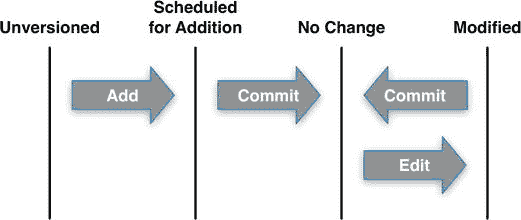

图 7-8. Git 文件状态生命周期

当你将中央仓库克隆到本地开发工作站时，所有文件都将被提交到本地仓库，状态为 `未更改`。

当你添加一个新文件时，它处于 `未版本控制` 状态。它也会出现在“待处理更改”窗口的 `候选` 选项卡上，如图 7-9 所示。

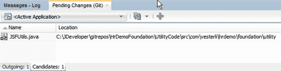

图 7-9. 待处理更改，候选

当你通过在“待处理更改”选项卡上选择文件并单击绿色加号图标，或者右键单击文件并选择 `版本管理 ➤ 添加` 来 `添加` 文件时，文件状态变为 `已暂存以备添加`。它也会从 `候选` 选项卡消失并出现在 `传出` 选项卡上，如图 7-10 所示。

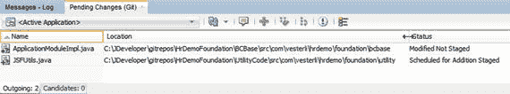

图 7-10. 待处理更改，传出

你编辑的文件状态会变为 `已修改`，也会出现在此选项卡上（例如，上图中的 `ApplicationModuleImpl.java`）。在“待处理更改”窗口中，你可以右键单击并选择 `全部提交`。你也可以在“应用程序”窗口中右键单击并选择 `版本管理 ➤ 全部提交`。

**提示**

你在 JDeveloper 中进行的某些更改会影响多个文件，因此最安全的方法是始终使用 `全部提交` 来提交更改。

当你选择任一命令时，将出现“全部提交”对话框，你可以在其中提供提交注释。

请确保勾选 `提交未暂存的文件` 复选框以提交所有文件。如前所述，Git 有一些高级的“暂存”功能，但通常情况下，无论文件的暂存状态如何，你都需要提交所有文件。


## 使用功能分支

如果你之前使用过其他版本控制系统，你可能会非常不愿意创建新的代码分支。实际上，历史上将分支合并回去确实异常困难。

在 Git 中，通常会使用更多的分支。通常，你会为每个新功能创建一个单独的分支，有些组织甚至为每个错误修复使用独立的分支。使用功能分支有三个主要好处：

*   每个开发者可以按需频繁地提交和推送代码
*   每个开发者可以随时将主线（mainline）合并到自己的分支中，这样合并冲突就不会累积变大
*   在构建发布版本时，发布经理可以决定哪些功能分支要纳入发布分支

### 启动功能分支

要启动一个新分支，选择 Team ➤ Git ➤ Create Branch 以打开 Create Branch 对话框，如图 7-11 所示。

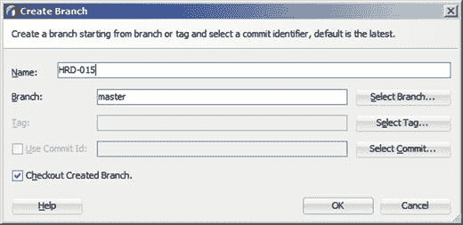
*图 7-11. 创建分支*

为你分支起一个简短但有意义的名称。使用来自你的任务/问题跟踪器的简短名称通常是个好选择。确保勾选了 Checkout Created Branch 复选框，以便立即开始在你的功能分支上工作。现在，在 Applications 窗口中，每个项目后的方括号里显示的就是你的分支名称。

### 在功能分支上工作

在功能分支上工作与其他开发工作并无不同。你可以自由地向本地仓库提交代码，并且应该至少每天向中央仓库推送一次以作备份。

在工作过程中，如果你知道正在使用的代码有重大更新，你可能偶尔需要从中央仓库拉取（pull）最新代码。

### 合并功能分支

一旦你的功能开发完成并在本地提交，你可以通过 Team ➤ Git ➤ Checkout 切换到主分支（master）。在 Checkout Revision 对话框中，选择 `master` 分支（位于 `local` 节点下）。你会看到 Applications 窗口中项目名后的方括号内更新为 `[master]`。

然后执行 `Git pull` 来获取主分支的最新更改，接着执行 `Git merge`。在 Merge 对话框中，选择你的功能分支（在 `Local` 节点下）并点击 OK。通常，合并会自动完成而不会出错。如果有任何合并冲突，它们会显示在 Pending Changes 窗口中，并用感叹号标记。右键单击并选择 Resolve Conflict 以打开冲突解决窗口，在那里你可以选择哪个更改优先保留，或者手动创建新的合并代码。

合并后，你需要将更改推送到中央仓库。Push to Git 对话框允许你选择要推送的分支。确保推送新合并的主分支。为了便于其他开发者将来可能接手工作，也推送功能分支是一个好的实践。

### 质量保证

你的 ADF 工作流程的一部分必须是确保代码编写良好、文档完善且正确。所有常用的行业工具都适用于 ADF 应用程序，但 JDeveloper 提供了一些额外的功能。

### 审核代码

在 Build 菜单中，你可以找到一个名为 Audit… 的条目。选择此项后，系统会要求你选择一个配置文件，然后就可以运行自动化的代码审核。注意 Edit 按钮——它会调出如图 7-12 所示的 Audit Profile 对话框。

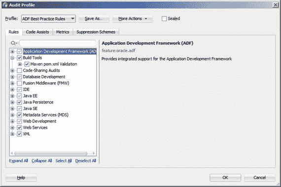
*图 7-12. 编辑审核配置文件*

在此对话框中，你决定哪些规则在哪个配置文件中处于激活状态。

当你运行审核时，你会在可展开的树形结构中得到大量结果，如图 7-13 所示。

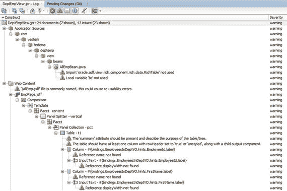
*图 7-13. 审核结果*

在结果树上方的工具栏中，你可以更改显示方式并关闭低优先级的问题。在树中的一个折叠节点里，Severity 列的值是该节点或其子节点中找到的最高严重级别。

如果你发现某个特定的警告对你没有帮助，你可以编辑配置文件以停止运行该测试。你也可以通过右键单击一个实例来隐藏所有同类型的问题。

提示：Oracle ADF 企业方法学组（ADF EMG）的志愿者们专门针对 ADF 开发了额外的审核规则。参见 [`https://adfaudit.atlassian.net/wiki/spaces/ADFAUDIT`](https://adfaudit.atlassian.net/wiki/spaces/ADFAUDIT)

### 文档生成

如果你选择 Build ➤ Javadoc …，JDeveloper 可以为你自动生成 Javadoc 文档。当然，文档的实用性取决于你在代码中编写的 Javadoc 注释的数量。

你还可以为可视化任务流生成文档。当 Diagram 选项卡处于活动状态时，JDeveloper 会显示一个 Diagram 菜单，其中的 Publish Diagram 菜单项可以将你的图表保存为 PNG 文件，供你在文档中使用。

要为业务组件生成文档，你可以通过 File ➤ New ➤ From Gallery ➤ General ➤ Diagrams 创建一个业务组件图。这会给你一个空白的图表，你可以将 ADF 业务组件拖放到上面。

## 构建流程

你已经了解了开发者如何使用上下文菜单将应用程序部署到 ADF 库，以及如何将主应用程序部署为可部署的 EAR 文件。但在现代专业的开发环境中，这个过程应该被自动化并通过脚本运行。幸运的是，JDeveloper 可以帮助你做到这一点。

本节描述如何使用 Apache Ant 构建，这是一个非常灵活、适用于任何项目结构的构建工具。要定义一个 Ant 构建，你需要创建一个构建文件（通常称为 `build.xml`），其中包含如 `compile` 或 `deploy` 等多个目标（targets）。

注意：Apache Maven 是一个更现代的构建工具，同时也处理依赖管理。从 12c 版本开始，JDeveloper 也支持 Maven。由于 Maven 假设的标准目录结构与默认的 ADF 项目不匹配，因此使用 Maven 构建 ADF 项目需要一些 Maven 技能。如果你具备这些技能，Maven 也是一个很好的构建工具选择。

由于构建脚本包含了目录名称，包括 JDeveloper 安装的完整路径，因此所有开发者的工作站都应将 JDeveloper 和 `$ADF_ROOT` 目录设置在相同的位置。


### 构建单个项目

要使用 Ant 构建单个项目，您可以选择 File ➤ New ➤ From Gallery ➤ General ➤ Ant ➤ Buildfile from Project。此时将出现“从项目创建构建文件”对话框，如图 7-14 所示。

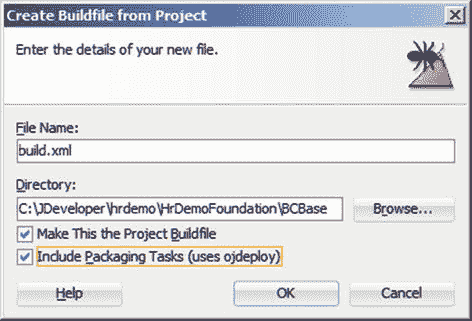

图 7-14. 从项目创建构建文件

请确保勾选“包含打包任务（使用 `ojdeploy`）”复选框。此选项意味着 JDeveloper 将包含用于将所有内容实际打包到 ADF 库中的构建任务。JDeveloper 包含在您的构建文件中的任务取决于与 JDeveloper 一起安装的 `ojdeploy` 实用程序。目前无法仅在构建服务器上安装 `ojdeploy` 实用程序，因此您必须在构建服务器上安装 JDeveloper 才能使用 `ojdeploy`。

为项目自动生成的构建文件将构建所有部署配置文件和所有相关项目。为了仅构建所需内容，您应该删除任何多余的部署配置文件，例如 JDeveloper 创建的默认配置文件。

在所有 ADF 工作区中，JDeveloper 默认注册了一个从视图/控制器项目到模型项目的依赖项。Ant 构建会遵循此依赖关系，并在您构建视图/控制器时自动构建模型项目。这意味着您只需为每个子系统工作区中的视图/控制器项目创建一个 Ant 构建文件。

当您为项目创建构建文件时，JDeveloper 会创建一个包含各种设置和目录名的 `build.properties` 文件，以及 `build.xml` 文件本身。这些文件会显示在“应用程序”窗口的“资源”节点下。

`build.xml` 看起来与清单 7-1 中的类似。

```
...

...

...

清单 7-1. 自动生成的 build.xml 文件
```

您可以看到 `all` 目标依赖于 `deploy`、`compile` 和 `copy`。这意味着如果您选择构建 `all` 目标，所有依赖的构建目标也将被构建。这些任务大多仅使用标准的 Ant 功能，文档位于 [`http://ant.apache.org/manual`](http://ant.apache.org/manual)。特定于 ADF 的任务是 `ojdeploy`，位于 `deploy` 目标中。此任务指向构建所需的 `ojdeploy` 类并设置必要的参数。此目标的效果与从 JDeveloper 内部手动构建部署配置文件相同。

### 构建主应用程序

在为主应用程序创建 `build.xml` 文件之前，您需要确保已为视图/控制器项目创建了 WAR 部署配置文件，并为应用程序创建了 EAR 部署配置文件。

WAR 部署配置文件的创建位置在项目属性的 Deployment 节点下，创建方式与子系统 ADF 库部署配置文件相同。

EAR 部署配置文件是应用程序属性的一部分。选择 Application ➤ Application Properties ➤ Deployment 以创建 EAR 文件部署配置文件。在 Application Assembly 节点上包含主视图项目。

拥有这两个部署配置文件后，为应用程序创建一个 Ant 构建。通过 File ➤ New ➤ From Gallery ➤ General ➤ Ant ➤ Buildfile from Application 完成。应用程序的构建文件和构建属性文件将显示在“应用程序”窗口的“应用程序资源”部分，而不是在项目下。您可以通过右键单击构建文件并选择 Run Ant Target ➤ deploy 来构建完整的应用程序。

### 构建基础框架和子系统

要构建所有子系统，您可以向主构建文件添加一个新目标，该目标使用 `<ant>` 任务调用子目录中的 Ant 脚本。如果您的构建文件具有默认的 `build.xml` 名称，您只需将 Ant 指向所有基础框架和子系统目录即可。您的新目标可能如清单 7-2 所示。

```
...

清单 7-2. 调用基础框架和子系统构建目标的 Ant 目标
```

根据您的目录布局，您可能需要调整对其他构建文件的引用。您可以通过在 JDeveloper 中右键单击 Ant 脚本并选择 Debug Ant Target，然后选择您的目标来调试您的 Ant 脚本。这将为您提供更详细的输出，可用于查找任何错误。

`inheritall=false` 是指示 Ant 不要将主构建文件参数传递给子系统构建，允许子系统使用其各自的 `build.properties` 文件。

### 复制 ADF 库

所有基础框架和子系统的 ADF 库默认构建在其各自的部署目录中。您需要通过编写另一个使用 ant `copy` 任务的目标，将它们复制到您的公共 ADF 库位置。此目标可能如清单 7-3 所示。

```
...

清单 7-3. 将所有 ADF 库复制到公共位置的 Ant 目标
```

注意

前面清单中的 `file=` 参数应位于一行：它仅因书籍格式限制而换行。查询 ID="Q3" 文本="请注意书籍格式限制的引用。"。

### 组合构建

最后，您可以修改 `deploy` 目标，使其依赖于这两个新任务，如下所示：`<target name="deploy" depends="buildsub,copysub" ... >`。这可确保它们在部署之前总是被调用，先是 `buildsub`，然后是 `copysub`。

通过这种方法，您可以使用一个 Ant 构建指令构建整个应用程序，包括所有 ADF 库和主应用程序 EAR。该指令可以手动运行，也可以集成到您可能使用的任何持续构建工具中。

## 使用开发者云服务

如果您正在使用任何 Oracle 云服务，Oracle 开发者云服务（DCS）是免费包含在内的。这项基于云的服务提供了一套全面的集成开发支持功能，包括：

*   Git 仓库
*   代码审查工作流
*   任务/问题跟踪器
*   Wiki
*   构建服务器
*   部署到其他 Oracle 云服务

其他供应商如 Atlassian 或 GitHub 提供类似的服务，但由于如果您拥有其他 Oracle 云服务，该 Oracle 服务是免费的，因此您尝试一下可能是有意义的。

### 创建用户

第一步是将您的开发者创建为 Oracle 开发者云服务的用户。从 [`http://cloud.oracle.com`](http://cloud.oracle.com) 上的登录链接开始，您需要选择您的云服务运行在哪个数据中心，以及您的身份域，并输入您的用户名和密码。所有这些信息都可以在您注册 Oracle 云时收到的欢迎邮件中找到。

从 Oracle 云仪表板，您可以单击右上角的“用户”按钮，将您的开发者定义为 Oracle 云服务的用户。在如图 7-15 所示的“添加用户”对话框中，请确保为您的开发者分配正确的角色。要使用开发者云服务，您的开发者需要“开发者服务用户角色”，而您的首席开发者和架构师可能需要“开发者服务管理员”。

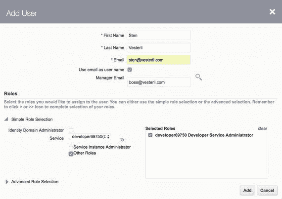

图 7-15. 为开发者云服务用户分配角色

在撰写本文时，这不是一个非常直观的过程。要分配开发者服务用户角色，首先选择开发者服务（名称类似 `developer69750`），然后勾选“其他角色”复选框，最后单击 ➤ 链接将该角色分配给用户。要分配开发者服务管理员角色，您需要勾选相应的复选框。希望在您阅读本书时，此过程已经变得更加用户友好。

新创建的用户现在会收到一封包含账户信息和临时密码的电子邮件。


### 创建项目

开发者云服务（DCS）可以包含许多独立的项目。这些是真正意义上的项目，而非功能受限的 JDeveloper 项目。您可以通过 DCS 网页界面创建项目，但在处理模块化或企业级 ADF 架构中的多个 JDeveloper 工作区时，直接从 JDeveloper 创建项目会更加便捷。这是一项由首席开发人员或架构师在初始工作区创建完成后执行一次的任务。

## 连接到开发者云服务

首先，您需要从 JDeveloper 创建到您的云服务实例的连接。这可以通过 JDeveloper 主菜单中的 `Team` ➤ `Team Server` ➤ `Add Team Server` 完成。在 `New Team Server` 对话框中，为您的服务提供一个名称和 URL。您可以从欢迎邮件或网页浏览器中复制该 URL——其形式类似于 `https://developer.us2.oraclecloud.com/developer12345-a667788`。

然后选择 `Team` ➤ `Team Server` ➤ （您的服务名称） ➤ `Login`。

**注意**
要以新创建的 Oracle Cloud 用户身份登录，您必须先通过网页浏览器登录一次以设置密码和其他身份验证信息。

### 创建项目

登录后，选择 `Team` ➤ `Team Server` ➤ （您的服务名称） ➤ `New project`。此时会出现 `New Project on Oracle Developer Cloud Service` 对话框。在第一步中，您需要提供项目名称以及其他一些信息。`Private/Shared` 设置用于控制项目是仅对明确授予访问权限的用户可访问，还是对您身份域中的所有用户可访问。

在向导的第二步（如图 7-16 所示），您需要选择本地 Git 仓库的放置目录，并选择所有希望成为此 Git 仓库和开发者云服务项目一部分的应用程序工作区。

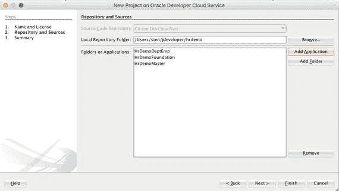
**图 7-16.** 将应用程序工作区添加到开发者云服务

在最后一步，您将看到一个确认信息，说明您的应用程序工作区将被移动到新的本地仓库位置。然后，该过程将运行一段时间，移动工作区并在开发者云服务上创建一个新项目。

过程完成后，您需要从新位置打开其中一个应用程序工作区。如果您有任何从原始位置打开的工作区，请关闭它们。`Pending Changes` 窗口将在 `Candidates` 选项卡上显示您工作区中的文件。由于本地和中央仓库都是 Git，前面描述的相同命令适用：首先 `Add All`，然后 `Commit All`。

**注意**
请注意，在 `Commit All` 对话框底部，您的开发者云服务现在会自动列在 `Task Repository` 下。我们将在本章后面部分再次讨论这一点。

当所有内容都提交到本地仓库后，执行 `Push` 操作推送到中央仓库。当您通过网页浏览器查看您的开发者云服务实例时，现在可以看到您的新项目。打开它，您将看到如图 7-17 所示的项目视图。

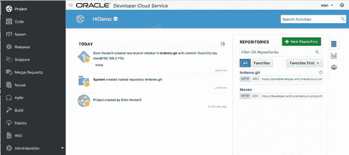
**图 7-17.** 开发者云服务中的一个项目

如果您将项目设置为 `Private`，则必须在 `TEAM` 选项卡（最右侧）上将所有相关开发人员添加到您的项目中。如果您将项目设置为 `Shared`，则所有具有开发者服务用户角色的 Oracle Cloud 用户都可以在其上工作。

### 任务管理

开发者云服务还具有任务/问题跟踪功能。您可以在 JDeveloper 的 `Team` 窗口（其中称为 Tasks）或通过网页界面（其中称为 Issues）创建它们。JDeveloper 会自动将 JDeveloper 中的任务与服务器上的任务保持同步。

任务具有所有常见属性，包括优先级、产品、组件、分配、截止日期、估算、时间跟踪等。

一个有趣的功能是，您可以为任务添加私有详细信息，包括注释和您个人安排该任务的日期。

如果您使用开发者云服务，应该利用这个内置的任务管理功能，因为每次向 Git 提交代码时，您都可以选择一个任务。这使您可以完全了解哪些代码更改与哪个任务相关联。

### 处理代码

开发者云服务使用 Git，因此工作流程类似于本章前面描述的常规 Git 工作流程：创建功能分支并检出，在分支中进行代码更改，并定期提交到本地仓库。

当 JDeveloper 连接到开发者云服务实例时，`Commit` 对话框允许您注明提交所属的任务，如图 7-18 所示。

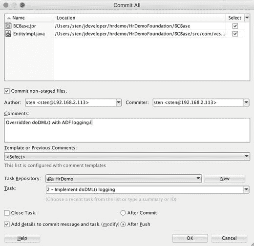
**图 7-18.** 连接到开发者云服务时的提交对话框

请注意，您可以选择一个任务与提交关联。您还可以在提交时选择关闭任务和/或将任务信息添加到提交注释中。您可以决定是在本地提交时（`After Commit`）执行此操作，还是等到将更改推送到中央仓库时（`After Push`）再执行。

### 代码审查

当您准备好将更改提交到中央仓库时，请推送您的功能分支。使用开发者云服务时，请不要进行本地合并。

推送功能分支后，转到 DCS 网页的 `Merge Requests` 部分，然后单击 `New Merge Request`。选择您希望将功能分支与 master 合并，如图 7-19 所示。

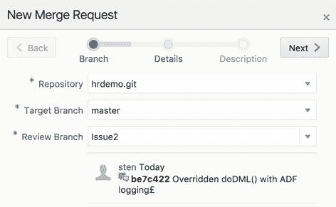
**图 7-19.** 创建新的合并请求

在此向导的第二步中，选择将此合并请求链接到的问题，并选择代码审查人。

代码审查人现在将在 `Assigned to Me` 下看到此代码请求。当审查人打开它时，他可以查看所有更改的文件和提交，并可以对审查整体或特定代码行进行评论，如图 7-20 所示。

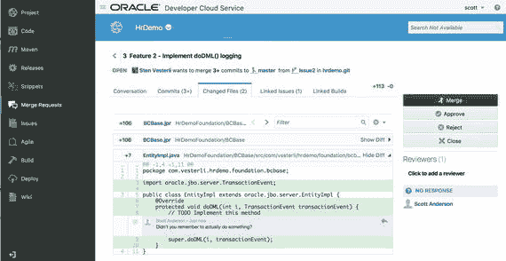
**图 7-20.** 对合并请求进行评论

一旦合并请求获得批准，功能分支就可以实际合并到 master 分支。如果您愿意，还可以让开发者云服务在提交完成后删除功能分支。

**提示**
由于工具支持不佳，代码审查在项目中经常被忽视。如果您使用开发者云服务，强烈建议利用此合并请求功能。

