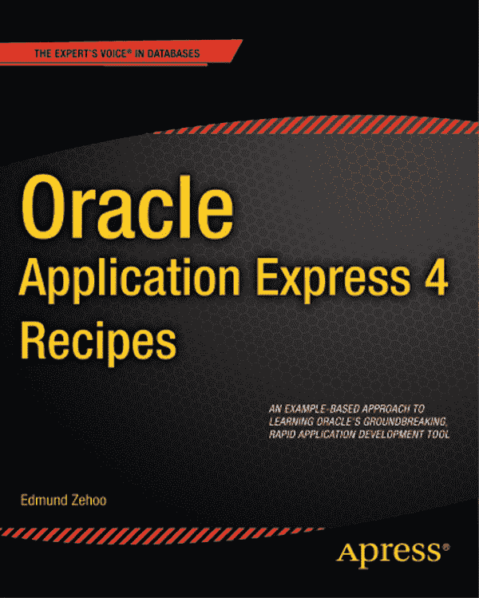
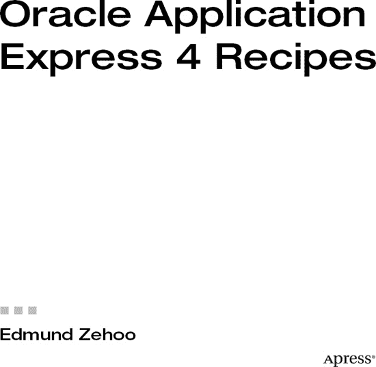

# Oracle Application Express 4 食谱

版权所有 © 2011 Edmund Zehoo
保留所有权利。未经版权所有者及出版商事先书面许可，不得以任何形式或任何方式（电子或机械，包括影印、录制）复制或传播本作品的任何部分，亦不得通过任何信息存储或检索系统进行。
ISBN-13 (平装): 978-1-4302-3506-4
ISBN-13 (电子): 978-1-4302-3507-1

书中可能出现的商标名称、标识和图像。我们并非在每次出现商标名称、标识或图像时都使用商标符号，而仅在编辑性质上使用这些名称、标识和图像，且旨在为商标所有者带来利益，并无侵犯商标的意图。
本出版物中对商品名称、商标、服务标志及类似术语的使用，即使未特别标识，也不应被视为表达意见，认为这些术语不受专有权约束。

## 责任团队

总裁兼发行人: Paul Manning
主编: Jonathan Gennick
技术评审: Guillermo Alan Bort
编辑委员会: Steve Anglin, Mark Beckner, Ewan Buckingham, Gary Cornell, Jonathan Gennick, Jonathan Hassell, Michelle Lowman, James Markham, Matthew Moodie, Jeff Olson, Jeffrey Pepper, Frank Pohlmann, Douglas Pundick, Ben Renow-Clarke, Dominic Shakeshaft, Matt Wade, Tom Welsh
协调编辑: Anita Castro
文案编辑: Mary Behr
排版: Bytheway Publishing Services
索引: John Collin
美术: April Milne
封面设计: Anna Ishchenko

## 发行与销售

本书全球图书贸易由 Springer Science+Business Media, LLC. 发行，地址：233 Spring Street, 6th Floor, New York, NY 10013。电话 1-800-SPRINGER，传真 (201) 348-4505，电子邮件 `orders-ny@springer-sbm.com`，或访问 [`www.springeronline.com`](http://www.springeronline.com)。

如需翻译信息，请发送电子邮件至 `rights@apress.com`，或访问 [`www.apress.com`](http://www.apress.com)。
Apress 和 friends of ED 图书可批量购买用于学术、企业或推广用途。大多数图书也提供电子书版本和许可。更多信息，请参考我们的特殊批量销售—电子书许可网页 [`www.apress.com/bulk-sales`](http://www.apress.com/bulk-sales)。

## 免责声明

本书信息按“原样”提供，不作任何担保。尽管在本书编写过程中已采取一切预防措施，但作者和 Apress 对因本书所含信息直接或间接导致或据称导致的任何个人或实体的损失或损害不承担任何责任。
本书源代码可由读者在 [`www.apress.com`](http://www.apress.com) 获取。您需要回答与本书相关的问题才能成功下载代码。

*献给我的家人，因为你们是我真正拥有的一切。*

## 目录概览

-  关于作者
-  关于技术评审
-  致谢
-  第 1 章: Oracle APEX 简介
-  第 2 章: 应用程序数据录入
-  第 3 章: 连接应用程序逻辑
-  第 4 章: 自定义外观和感觉
-  第 5 章: 数据可视化
-  第 6 章: 应用程序全球化
-  第 7 章: 提高应用程序性能
-  第 8 章: 应用程序安全
-  第 9 章: 部署应用程序
-  第 10 章: 迷你图书目录网站
-  索引

## 目录

 关于作者

 关于技术审阅者

 致谢

## 第 1 章：Oracle APEX 简介

 第 1 章：Oracle APEX 简介

### 1-1. 决定是否使用 APEX

问题

解决方案

工作原理

### 1-2. 确定 APEX 部署模型

问题

解决方案

工作原理

### 1-3. 安装 Oracle APEX

问题

解决方案

工作原理

### 1-4. 熟悉 APEX 术语

问题

解决方案

工作原理

### 1-5. 为团队开发设置工作区

问题

解决方案

工作原理

### 1-6. 管理开发流程

问题

解决方案

工作原理

## 第 2 章：应用数据录入

 第 2 章：应用数据录入

### 2-1. 创建数据库应用

问题

解决方案

工作原理

### 2-2. 创建报表以管理您的数据

问题

解决方案

工作原理

### 2-3. 更改表单中的字段项类型

问题

解决方案

工作原理

### 2-4. 在表单中从值列表中选择

问题

解决方案

工作原理

### 2-5. 在表单中上传和下载文件

问题

解决方案

工作原理

### 2-6. 使用表格式表单加快数据录入

问题

解决方案

工作原理

### 2-7. 创建 Web Sheet 应用

问题

解决方案

工作原理

### 2-8. 更改 Web Sheet 列的项类型

问题

解决方案

工作原理

### 2-9. 批量修改 Web Sheet 中的值

问题

解决方案

工作原理

## 第 3 章：连接应用逻辑

 第 3 章：连接应用逻辑

## 第三章：处理用户输入

3-1. 为表单添加服务器端验证

问题

解决方案

工作原理

3-2. 为表格化表单添加服务器端验证

问题

解决方案

工作原理

3-3. 为表单添加客户端 JavaScript 验证

问题

解决方案

工作原理

3-4. 动态更改下拉列表中的项目列表

问题

解决方案

工作原理

3-5. 动态禁用或隐藏表单的某一部分

问题

解决方案

工作原理

3-6. 存储计算值

问题

解决方案

工作原理

3-7. 与 Web 服务交互

问题

解决方案

工作原理

3-8. 保存页面时运行`PL/SQL`进程

问题

解决方案

工作原理

3-9. 从表单发送电子邮件

问题

解决方案

工作原理

## 第四章：自定义外观和感觉

4-1. 为表单添加图片页眉

问题

解决方案

工作原理

4-2. 为页面添加自定义`CSS`样式

问题

解决方案

工作原理

4-3. 使用自定义`CSS`文件

问题

解决方案

工作原理

4-4. 在应用程序中创建新主题

问题

解决方案

工作原理

4-5. 修改表单控件模板

问题

解决方案

工作原理

4-6. 创建可重用的代码片段

问题

解决方案

工作原理

4-7. 通过插件扩展`UI`

问题

解决方案

工作原理

## 第五章：数据可视化

5-1. 创建经典报表

问题

解决方案

## 第 5 章：报表与数据可视化

### 5-2. 创建参数化报表

#### 问题

#### 解决方案

#### 工作原理

### 5-3. 在图形图表中可视化数据

#### 问题

#### 解决方案

#### 工作原理

### 5-4. 在多系列图表中可视化数据

#### 问题

#### 解决方案

#### 工作原理

### 5-5. 在日历上可视化数据

#### 问题

#### 解决方案

#### 工作原理

### 5-6. 在地图上可视化数据

#### 问题

#### 解决方案

#### 工作原理

### 5-7. 将一切整合到仪表盘页面

#### 问题

#### 解决方案

#### 工作原理

---

## 第 6 章：应用程序全球化

### 6-1. 为双字节字符输入做准备

#### 问题

#### 解决方案

#### 工作原理

### 6-2. 支持双字节数据输入

#### 问题

#### 解决方案

#### 工作原理

### 6-3. 将用户界面翻译成另一种语言

#### 问题

#### 解决方案

#### 工作原理

### 6-4. 存储和显示带时区信息的日期

#### 问题

#### 解决方案

#### 工作原理

---

## 第 7 章：提高应用程序性能

### 7-1. 测量页面访问频率

#### 问题

#### 解决方案

#### 工作原理

### 7-2. 在 APEX 中测量页面性能

#### 问题

#### 解决方案

#### 工作原理

### 7-3. 在 APEX 中测量区域性能

#### 问题

#### 解决方案

#### 工作原理

### 7-4. 启用区域缓存

#### 问题

#### 解决方案

#### 工作原理

### 7-5. 启用页面缓存

#### 问题

#### 解决方案

#### 工作原理

---

## 第 8 章：保护应用程序安全

### 8-1. 创建您自己的认证方案

#### 问题

#### 解决方案

#### 工作原理

### 8-2. 定义用户访问权限

