# Oracle APEX 简介

我仍然记得十年前为一家猎头公司部署了我的第一个 `Microsoft Access` 应用程序。他们拥有大约 200 名用户（我仿佛已经听到你们中一些人的抱怨声），并且需要一个系统来管理求职者和希望雇佣他们的公司。然后，他们给了我这个只有两个人的微不足道的开发团队一个“不可妥协”的一个月期限，要求我们在这一个月内完成系统的构思、开发和测试——并在之后立即上线。

任何一个有自尊心的企业开发团队都会对这个荒谬的时间安排一笑置之，但由于一些我们自己也不清楚的原因（尽管我认为这份工作提供的丰厚报酬与我们的决定有关），我们决定尝试一下。我们求助于遥远的 `快速应用程序开发（RAD）` 领域。我们找到了一个匹配的工具 `Microsoft Access`，在确认实际用户并发率足够低，可以绕过 `Access` 的并发限制后，我们接下了这份工作。

我们这个两人团队成功地在一个月的时间内开发并部署了该应用程序，这家机构在升级系统前至少使用了它五年。这个故事的关键点在于，如果没有 `RAD` 工具，有些项目可能永远无法面世。直到今天，像我这样的故事仍在互联网的许多角落回响。

自那时起，`RAD` 工具已经取得了长足的进步。既然现在大多数企业解决方案完全部署在 `Web` 上，`RAD` 工具跟上这一趋势也就顺理成章了，而它们也确实做到了。从更简单的应用程序创建工具，如基于云的 `Zoho App Creator` 和 `Google Apps`，到更“严肃”的工具如 `APEX` 和 `Ruby on Rails`，它们都已在 `Web` 上首次亮相；现在，任何人要建立自己的销售团队应用程序或在线书店应用程序，并将它们全部托管在 `互联网` 上，都变得前所未有的容易，只需（比喻性地）点击一下按钮。

`RAD` 工具在业务场景中表现得异常出色；首先是因为业务应用程序通常是 `基于 Web 的`，其次是因为它们主要由 `CRUD（创建、读取、更新和删除）` 操作组成，这些是每个 `以数据库为中心` 的应用程序的核心原子操作。出于同样的原因，`APEX` 是其中的佼佼者；它与 `Oracle` 数据库紧密集成，并通过 `PL/SQL` 很好地处理 `CRUD`。`APEX` 作为一个平台位于数据库之上，正因如此，你从 `APEX` 开发出的应用程序享有数据库可用的所有好处（例如，集群支持）。

在本章中，你将通过几个实践案例来了解 `APEX`，这些案例将帮助你快速上手并运行 `APEX`。这些案例也将作为一种入门指南，让你熟悉基本的 `APEX` 概念。你还将学习如何使用 `APEX` 中提供的一些团队开发工具。

### 1-1. 决定是否使用 APEX

#### 问题

你的老板刚给你分配了一个新项目。你不确定 `APEX` 是否是适合该项目的工具。

#### 解决方案

`APEX` 提供更短的开发时间和易用性，但在某些情况下，它并非项目的最佳工具。在使用一个工具之前，了解其全部功能和局限性很重要。如果满足以下条件，请考虑为项目使用 `APEX`：

*   目标应用程序是一个 `基于 Web 的` 应用程序，主要由 `CRUD` 操作组成。
*   `Oracle` 是你的应用程序唯一需要支持的数据库，或者迁移到不同数据库供应商的可能性极小。
*   你的项目开发时间紧迫。
*   你的开发方法论要求快速、连续的原型迭代，或者需求经常变化。
*   你的应用程序需要处理高交易量。
*   你的开发团队精通 `PL/SQL` 和 `JavaScript`。

在以下情况下，请避免使用 `APEX`：

*   你的应用程序包含需要非 `CRUD` 架构的模块，例如消息驱动或事件驱动的架构。
*   你的应用程序需要在逻辑层和表示层都有很高的对象重用性，并且需要严格遵循传统的框架，如 `面向对象编程（OOP）` 或 `模型-视图-控制器（MVC）`。
*   你的应用程序包含复杂的表单，每页超过 100 个数据库项目（例如：可输入字段）。（我想指出，从用户界面的角度来看，在单个页面中放置 100 个或更多字段是非常糟糕的设计。但是，你的项目需求可能无论如何都要求你这样做。如果是这样，请记住 `APEX` 的这个限制。）
*   你的应用程序包含的报表需要在同一个报表中显示超过 100 列。
*   你的应用程序包含的表需要超过两列作为主键。


#### 工作原理

如前所述，APEX 非常适用于基于 CRUD 的 Web 业务应用程序，并作为平台位于 Oracle 数据库之上。APEX 能很好地做到这一点，因为其核心是利用 PL/SQL 语言来处理构建于其上的应用程序的业务逻辑，而 PL/SQL 是所有数据库 CRUD 操作的基础。一个好的衡量标准是，如果应用程序中 75% 以上是 CRUD 操作，那么使用 APEX 将能显著减少开发应用程序所需的时间和精力。

此外，APEX 是一个快速应用程序开发工具，许多开发人员都曾证实 RAD 产品如何使他们能够在数周内（而非数月）部署大型系统（包括我在本书开篇部分提到的自己）。APEX 也适用于采用软件开发方法的团队，这些方法的需求集在不断演进，例如敏捷开发，或是那些频繁需要连续原型迭代的方法。APEX 同样适合大规模部署。考虑这些数据：Oracle 在 [`http://apex.oracle.com`](http://apex.oracle.com) 提供了一个免费的 APEX 实例，平均每周接收 140 万到 150 万次页面浏览，并托管着超过 10,000 个工作区。

APEX 应用程序实际上运行在 Oracle 数据库内部；其代码模块主要由 PL/SQL 组成，任何应用程序、表单和报表都作为元数据存储在数据库表中。因为业务逻辑、用户界面和数据都存储在数据库中，APEX 的优势在于消除了其他平台所需的额外网络往返开销，那些平台需要在业务层和数据层之间频繁通信。因此，APEX 应用程序的性能轻松超越传统的三层架构应用程序。

然而，APEX 并非独立于数据库，因此存在被数据库供应商锁定的风险。例如，将 APEX 应用程序从 Oracle 数据库迁移到基于 Microsoft SQL Server 的数据库，几乎肯定意味着需要从头开始重写整个应用程序。在考虑是否在项目中使用 APEX 时，重要的是考虑应用程序需要支持的数据库范围。

在使用 APEX 时，还应注意几个技术限制，特别是在单个页面上可托管的数据库项目数量方面。表 1-1 列出了 Oracle 网站上所述的当前 APEX 的一些限制。

**表 1-1.** APEX 组件限制

| **组件** | **描述** |
| --- | --- |
| `Interactive reports` | 单个页面支持一个交互式报表。每个交互式报表最多 100 列。 |
| `Classic reports` | 每个经典报表最多 100 列。 |
| `Forms` | 每页 100 个可输入项（输入字段）。文本区域或富文本编辑控件最多可输入 32767 字节。主键最多两列。 |
| `Tabular forms` | 每页最多一个向导生成的表单表格。最多 50 个可编辑的表单表格列。 |
| `Item names` | 使用绑定变量语法引用的项目名称最长 30 个字符。 |
| `Validations` | 为验证输入的文本最长 3,950 个字符。 |

APEX 的大部分业务逻辑开发都是使用 PL/SQL 完成的。虽然 PL/SQL 在一定程度上支持函数和代码可重用性，但这并未扩展到业务层之外。例如，在传统的开发工具中，你可以创建不同的按钮，这些按钮都继承自一个包含通用行为集合的通用按钮类。这种面向对象编程在用户界面层面的支持在 APEX 中并不提供。

最后，重要的是要记住 APEX 是一个具有标准行为和功能的平台。它不提供与传统开发工具相同的自由度，因此，如果你需要实现 APEX 未开箱即用的某些功能，你将需要亲自动手使用 JavaScript、AJAX 和 DHTML。

### 1-2. 确定 APEX 部署模型

#### 问题

你想要部署 APEX。你听说有几种不同的方法，但不确定哪种部署模型适合你的需求。

#### 解决方案

部署 APEX 时的主要决策点是决定使用哪个 HTTP 服务器来提供你的 APEX 应用程序服务。Oracle 提供两种类型的 HTTP 服务器：

*   Oracle XML DB HTTP Server（嵌入式 PL/SQL 网关）
*   Oracle HTTP Server 和 mod_plsql

如果符合以下情况，请选择 Oracle XML DB HTTP Server：

*   你希望采用更简单的两层部署（Web 浏览器和数据库服务器）。
*   你的首要目标是以最少的配置，在尽可能短的时间内启动并运行。
*   你不希望安装单独的服务器来托管 HTTP 服务器。
*   你将 APEX 部署在作为独立系统的个人 PC 上。

如果符合以下情况，请选择 Oracle HTTP Server 和 mod_plsql 方法：

*   你希望采用完整的三层部署（Web 浏览器、HTTP Web 服务器和数据库服务器）。
*   你将 APEX 部署在企业环境中，并且需要访问广泛的 Web 服务器配置和日志设置。
*   你打算将 APEX 应用程序暴露在互联网上。这涉及到安全目的，将在“工作原理”部分详细解释。
*   你需要单点登录集成。
*   你需要中间层负载均衡和故障转移功能。


#### 工作原理

Oracle XML DB HTTP 服务器包含嵌入式 PL/SQL 网关，它与标准的 Oracle 数据库安装一起安装。嵌入式 PL/SQL 网关在 Oracle XML DB HTTP 服务器中运行。这如 图 1-1 所示。

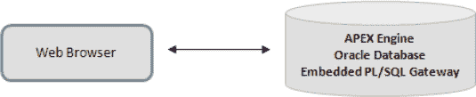

`图 1-1.` 使用 Oracle XML DB HTTP 作为您的 Web 服务器

这种部署是一个两层模型，易于设置。APEX 引擎和嵌入式 PL/SQL 网关存在于同一个数据库中。请注意，在某些情况下，两层部署可能不是理想的选择，尤其是从安全角度来看。例如，如果您计划将 APEX 应用程序暴露到互联网上，这种部署模型可能就不合适，因为 HTTP 监听器无法与数据库分离，这样您也会将数据库直接暴露给互联网。

由于 Web 服务器和数据库紧密耦合而产生的另一个缺点是，如果数据库停机，您的 Web 服务器也将关闭；这将阻止访问静态数据，如静态网页或图像。

嵌入式 PL/SQL 网关也不提供中间层负载均衡或故障转移功能。为了扩展系统，您将需要依赖数据库级别的 Oracle 真应用集群（`RAC`）技术。基于这些原因，嵌入式 PL/SQL 网关更适用于较小的部署或独立系统。

 `注意` 在 Oracle 数据库版本 11*g* 之前，不支持带有嵌入式 PL/SQL 网关的 Oracle XML DB HTTP 服务器。

Oracle HTTP 服务器和 `mod_plsql` 方法对于企业部署至关重要，因为管理员有更广泛的配置和日志设置可供使用，并且从安全角度来看也是如此。Oracle HTTP 服务器运行在 Apache 上，并使用 `mod_plsql` 插件通过 Net8/SQL*Net 连接与 APEX 引擎通信。`mod_plsql` 插件将 HTTP 请求映射到 Oracle 数据库中的存储过程。图 1-2 详细说明了 Oracle HTTP 服务器部署。

 `提示` Net8/SQL*Net 连接是一种透明连接，用于在客户端机器和 Oracle 数据库之间传输数据。它允许服务和应用程序驻留在不同的机器上，并作为对等应用程序相互通信。

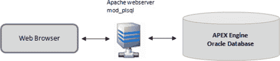

`图 1-2.` 使用 Oracle HTTP 服务器作为您的 Web 服务器

### 1-3. 安装 Oracle APEX

#### 问题

您的任务是在现有的 Oracle 数据库安装（恰好运行在基于 Windows 的服务器上）之上安装最新版本的 Oracle APEX，并且您已决定使用嵌入式 PL/SQL 网关作为 Web 服务器。

 `注意` APEX 安装支持大量平台。本配方中显示的示例和截图将基于 Windows 安装。非 Windows 操作系统的安装过程保持不变。

#### 解决方案

在您的系统上安装 APEX，请执行以下步骤：

1.  确保存在现有的 Oracle 数据库安装。如果未找到，请先安装 Oracle 数据库（版本 10.2.0.3 及以上）。
 `注意` 某些版本的 Oracle 数据库内置了较早版本的 APEX。无论如何，无论您是全新安装 APEX 还是升级到更新版本的 APEX，以下步骤仍然适用。
2.  下载软件。本书撰写时的 Oracle APEX 最新版本是 4.0.2。您可以从以下 URL 下载最新版本的 APEX：[`http://www.oracle.com/technetwork/developer-tools/apex/downloads/index.html`](http://www.oracle.com/technetwork/developer-tools/apex/downloads/index.html)
3.  将下载的 APEX 包解压到系统上的 `APEXFILES\APEX` 文件夹中（例如：`C:\APEXFILES\APEX`）。
 `注意` `C:\APEXFILES\APEX` 将是您的 APEX 主目录。重要的是，您的子文件夹必须命名为 `APEX`。
4.  以 `SYSDBA` 身份登录到系统上的 `SQL*Plus`。
5.  您需要创建两个表空间。在 `SQL*Plus` 中运行 清单 1-1 所示的语句。
`清单 1-1.` 创建 APEX 表空间
```
CREATE TABLESPACE APEX datafile 'C:\oraclexe\oradata\XE\APEX.dbf'
SIZE 500M
EXTENT MANAGEMENT LOCAL
SEGMENT SPACE MANAGEMENT AUTO;

CREATE TABLESPACE APEX_FILES datafile 'C:\oraclexe\oradata\XE\APEX_FILES.dbf' SIZE 100M
EXTENT MANAGEMENT LOCAL
SEGMENT SPACE MANAGEMENT AUTO;
```
 `注意` 您的 Oracle 主目录可能安装在不同的路径中。请确保将上面代码中的路径更改为正确的位置。在上面的示例中，Oracle 数据库主目录路径是 `C:\oraclexe\oradata\XE`。
6.  现在，将 `SQL*Plus` 的工作目录设置为 `C:\APEXFILES\APEX`。最简单的方法（在 Windows 上）是先打开一个命令提示符窗口，导航到该文件夹，然后从该文件夹运行 `sqlplus` 命令。
7.  再次以 `SYSDBA` 身份登录，并键入以下命令：
```
@apxsqler
```
如果中途出错，此命令将回滚随后执行的所有 SQL。
8.  接下来，通过键入以下命令运行 APEX 安装脚本。执行可能需要几分钟；您应该会看到大量输出流过。
```
@apexins APEX APEX_FILES TEMP /i/
```
运行此语句的输出快照如 图 1-3 所示。
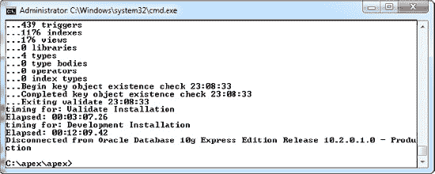
`图 1-3.` Apex 安装输出
9.  要检查安装过程中是否有任何错误，您可以检查 `C:\APEXFILES\APEX` 文件夹中生成的日志文件。如果有任何错误，请以 `SYSDBA` 身份登录到 `SQL*Plus` 并运行以下命令来撤销安装：
```
DROP USER FLOWS_030000 CASCADE
```
然后，您需要在重新运行安装之前解决日志文件中的错误。
 `提示` 日志文件名格式为 `Install<YYYY-MM-DD><HH24-MI-SS>.log`
10. 如果安装中没有错误，请再次以 `SYSDBA` 身份登录到 `SQL*Plus`，并通过运行以下语句将 APEX 图像加载到 Oracle 数据库中：
```
@apxldimg.sql C:\APEXFILES
```
您应该会看到如 图 1-4 所示的输出。
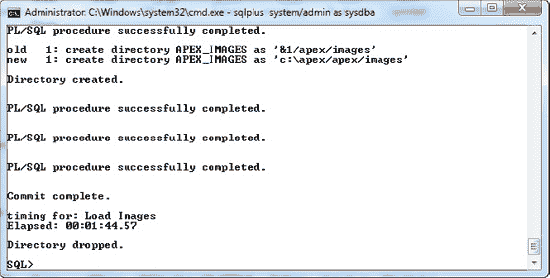
`图 1-4.` Apxldimg.sql 输出
 `注意` 运行此步骤时，请确保提供的路径指向父文件夹，而不是解压 APEX 安装文件的文件夹。`apxldimg` 脚本会将 `\APEX` 后缀附加到您的路径后。


### 11. 重置 APEX 图像前缀
接下来，你需要强制 APEX 使用正确的 APEX 图标图像和 JavaScript 文件路径。如果不执行此步骤，可能会发现 APEX 登录页面加载时没有图标显示，并出现一堆 JavaScript 错误。打开 Windows 命令提示符，导航到 `C:\APEXFILES\APEX\UTILITIES` 目录。从该目录运行 `sqlplus` 工具并以 SYSDBA 身份登录。然后，运行以下语句：
```
@reset_image_prefix.sql
```
当提示输入图像前缀时，只需按 Enter 键使用默认值 (`/i/`)。成功完成后，你应该会看到如图 1-5 所示的输出。

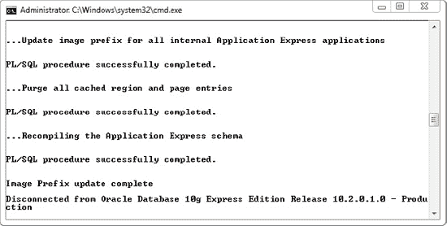

**图 1-5.** 重置图像前缀

### 12. 设置管理员密码
最后，通过运行以下语句为 Administrator 设置密码 `admin123`：
```
@apxxepwd.sql admin123
```

### 13. 登录 APEX
现在，尝试使用以下 URL 登录 APEX，将 *yourserver* 替换为你的实际服务器名称、IP 地址或 localhost（如果你将 APEX 作为独立系统安装在本地机器上）：
```
http://yourserver:8080/apex
```
你应该会看到如图 1-6 所示的登录页面。

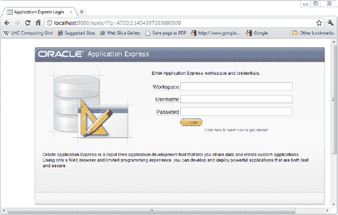

**图 1-6.** APEX 登录页面

 **提示** 如果你无法看到图 1-6 中的登录页面，请检查 URL 中指定的端口号是否正确。同时检查是否已将 APEX 文件解压到正确的文件夹，并在安装过程中正确引用了这些文件夹。如果仍然无法确定问题所在，查看生成的 APEX 安装日志文件总是一个好主意。更多故障排除信息可在此处获取：`http://download.oracle.com/docs/cd/E17556_01/doc/install.40/e15513/trouble.htm#BABCHHAF`

将工作区名称设置为 `INTERNAL`，用户名设置为 `ADMIN`，密码设置为 `admin123`，然后单击“登录”按钮。你应该能看到如图 1-7 所示的页面。这将表明你的 APEX 安装已成功。

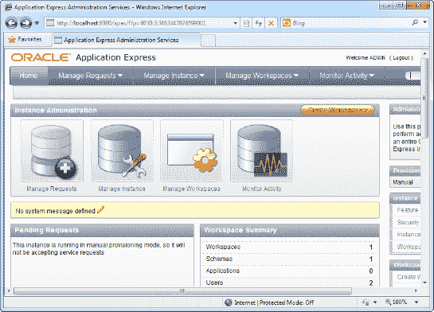

**图 1-7.** APEX 主页

#### 工作原理

尝试安装 APEX 时，你可能注意到的第一件事是它没有所谓的安装程序。仔细观察，你会发现从 Oracle 站点下载的 APEX 安装文件只是一堆 PL/SQL 脚本文件。

没有安装程序的原因是 Oracle APEX 基本上是一个元数据存储库。APEX 应用程序、表单和报表只不过是存储在 Oracle 数据库中的元数据和 PL/SQL 代码。一个名为 Application Express 引擎的引擎使用这些元数据来渲染和处理 APEX 网页。

 **提示** Oracle APEX、你的应用程序、表单和报表完全存在于数据库中，这使得备份成为一个便捷的过程。备份 APEX 应用程序与备份任何其他 Oracle 数据库没有什么不同。第 9 章 详细介绍了备份过程。

为了了解 APEX 产品由什么组成，以下是一些来自 Oracle 网站的数据：APEX 包含大约 425 个表和 230 个 PL/SQL 包，包含超过 425,000 行代码。

### 1-4. 熟悉 APEX 术语

#### 问题
你发现自己置身于经验丰富的 APEX 开发人员之中。由于不懂行话，你绞尽脑汁试图理解他们每隔一分钟左右抛出的术语。你不会说 APEX 语，这是一个严重的问题。

#### 解决方案
在开始使用 APEX 之前，你需要了解工作区、Websheets 和模式之间的区别。表 1-2 详细探讨了 APEX 中使用的各种术语。

**表 1-2.** APEX 术语表

| **术语** | **描述** |
| --- | --- |
| `Workspace` | 工作区代表一个开发团队的工作区域。它允许不同的开发团队在各自独立的工作区（位于同一存储库中）中工作，而无需相互交互。 |
| `Application` | 应用程序基本上就是它的字面意思——“应用程序”的传统概念。在 Apex 4.0 中，你可以构建两种不同类型的应用程序：数据库应用程序或 Websheet 应用程序。 |
| `Database application` | 数据库应用程序是一种围绕 RDBMS 构建的应用程序类型。它通常由表单、视图和报表组成。 |
| `Websheet application` | Websheet 是 Apex 4.0 的最新成员。它是另一种类型的应用程序，允许你以声明方式构建和部署基于 Web 的表单、业务逻辑和报表。 |
| `Schema` | 每个 APEX 工作区都链接到一个或多个数据库模式。数据库模式为每个应用程序存储各种数据库对象（如表）。 |
| `Theme` | 主题是模板的集合，定义了 APEX 应用程序的外观（布局）。 |
| `Page` | 页面是 APEX 应用程序最基本的单位，与网页相关联。你可以创建六种不同类型的页面：空白页面、报表、表单、表格式表单、主详细信息以及“报表和表单”。 |
| `Blank page` | 空白页面是一个空页面，允许你自行定制内容。 |
| `Report` | APEX 中有两种类型的报表：经典报表和交互式报表。 |
| `Classic report` | 经典报表是一种静态报表，以表格形式向用户显示记录列表。 |
| `Interactive report` | 交互式报表是一种允许用户交互的报表类型——在查看时进行搜索、过滤、排序、列选择、高亮显示等操作，以在报表中检索所需的数据集。 |
| `Form` | 表单允许数据输入。表单通常由一组数据控件和一个提交按钮组成。 |
| `Tabular form` | 表格式表单允许你在单个屏幕上一次对多条记录执行更新、插入和删除操作。这些记录以表格格式显示。 |
| `Master detail` | 主详细信息页面允许你从两个表创建具有主从关系的表单。 |
| `Report and Form` | 报表和表单页面在同一页面中包含报表和表单。此类页面最常见的用法是当你需要在一页中输入搜索参数，并让搜索结果显示在同一页面中时。在这种情况下，可以通过表单组件输入搜索参数，搜索结果将显示在页面的报表组件中。 |


#### 工作原理

APEX 是一个可供多个开发团队同时使用的平台。每个**工作空间**代表一个开发团队的工作区域。在每个工作空间内部，开发者可以创建多个应用程序。例如，团队 Alpha 可能正在开发两个应用程序（一个销售团队应用和一个 HRM 应用），而团队 Beta 可能正在开发一个在线书店应用程序。这在图 1-8 中进行了总结。

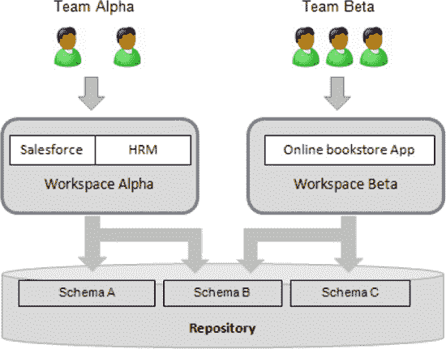

`图 1-8. APEX 工作空间`

在 APEX 工作空间的上下文中，可以创建许多不同的对象和子对象。图 1-9 展示了这些不同类型对象之间的关系。如果你再次被这些术语弄糊涂，请参考表 1-2 以获取这些对象的定义。

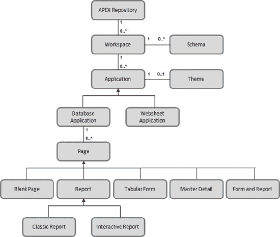

`图 1-9. 各种 APEX 对象之间的关系`

 `注意` 数据库应用程序的原子单位是页面。一个数据库应用程序本质上由一堆页面组成，这些页面可以是数据录入界面、报表或数据表格列表的混合。

### 1-5. 为团队开发设置工作空间

#### 问题

你刚刚安装了 APEX。现在你需要创建一个工作空间，以便开发团队 Alpha（Sally 和 John）可以开发他们的销售团队应用。

#### 解决方案

以下是为团队开发进行设置的方法：

1.  在浏览器的地址栏中输入 [`http://yourserver:8080/apex`](http://yourserver:8080/apex) 登录 APEX 门户。
     `注意` 请将 `yourserver` 替换为你的服务器名称或 IP 地址。如果你在本地安装了 APEX，请将 `yourserver` 替换为 `localhost`。
2.  在登录窗口中，指定 `Internal` 作为工作空间，并使用你在配方 1-3 中先前创建的用户名和密码以管理员身份登录。
3.  成功登录后，点击 `Manage Workspaces` 菜单项。点击 `Workspace Actions` 部分下的 `Create Workspace` 链接。在随后出现的页面中，指定工作空间名称、ID 和描述。你现在应该看到如图 1-10 所示的页面。
    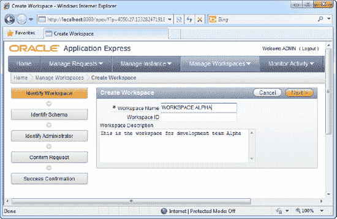
    `图 1-10. 创建一个工作空间`
4.  点击 `Next` 按钮继续。在此页面，你可以指定使用现有的数据库模式或为该工作空间创建一个新模式。图 1-11 展示了如何为工作空间创建新模式。
    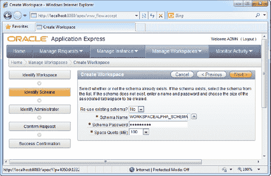
    `图 1-11. 为工作空间创建新模式`
5.  接下来，你将需要指定`工作空间管理员`用户、密码和电子邮件。参见图 1-12。
    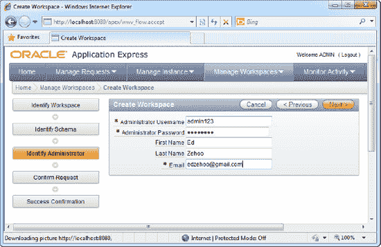
    `图 1-12. 指定管理员详细信息`
6.  点击 `Next` 按钮继续。点击向导剩余页面的确认工作空间创建。你可以通过导航至 `Manage Workspace`  `Workspace Reports`  `Existing Workspaces` 链接来浏览现有工作空间。点击该链接后，你应该能看到你刚刚创建的 `Alpha` 工作空间（在图 1-13 中高亮显示）。
    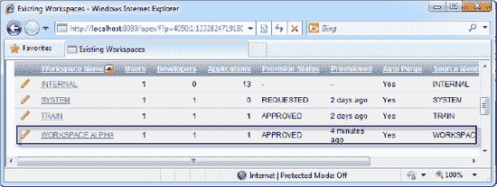
    `图 1-13. 团队 Alpha 工作空间`
7.  现在你需要将开发者 Sally 和 John 的用户账户添加到该工作空间。点击 `Manage Workspaces` 菜单，然后点击 `Workspace Actions` 部分下的 `Manage Developers and Users` 链接。在随后的页面中，点击黄色的 `Create User` 按钮，并在下一页填写用户详细信息。务必为你创建的用户账户选择先前创建的 `WORKSPACE ALPHA` 工作空间。图 1-14 详细说明了这一点。填写完表格后点击 `Create` 按钮。
    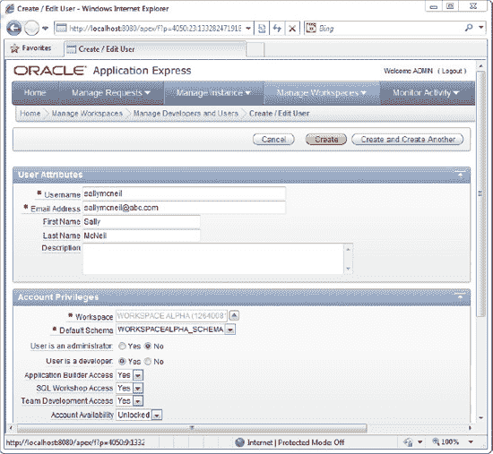
    `图 1-14. 创建一个开发者`
8.  创建用户后，你应该能在 `Manage Developers and Users` 页面看到新创建的账户。现在是尝试以开发者身份登录你的工作空间的时候了。点击页面右上角的 `Logout` 链接，然后点击 `Login` 链接再次导航至 `Login` 页面。在登录页面，指定 `WORKSPACE ALPHA` 作为你的工作空间名称，并指定你先前创建的开发者账户的用户名和密码（如图 1-15 所示）。
    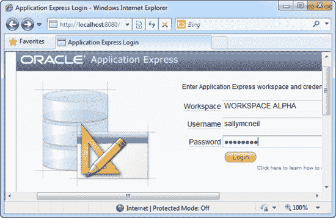
    `图 1-15. 登录你的工作空间`
9.  点击 `Login` 按钮。如果你能够成功登录，你应该能看到如图 1-16 所示的工作空间主页。
    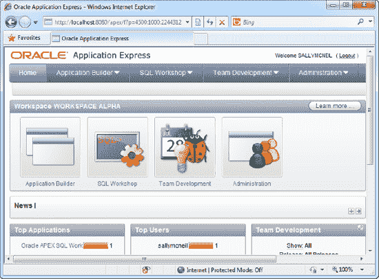
    `图 1-16. 工作空间主页`

#### 工作原理

正如前面在配方 1-4 中介绍的，工作空间代表了开发团队的工作区域。例如，在典型的 APEX 部署中，每个部门可能都会获得自己的工作空间，该空间是自我管理的，并且与其他部门分离。

一个 APEX 工作空间可以配置为映射到一个或多个数据库模式。这允许在此 APEX 工作空间中创建的任何应用程序、表单或报表继承关联数据库模式中的所有权限。（你的应用程序代码将有权访问该模式中的所有数据库对象，就像它直接登录到该模式一样）。

在一个典型的组织中，APEX 管理员会根据需要为不同的开发团队创建工作空间，然后为每个工作空间单独添加相应的开发者账户。

 `注意` 不要将 APEX 工作空间与数据库工作空间混淆。后者是一个共享的虚拟环境，用户可以在其中对表中的数据进行版本控制更改。数据库工作空间是 `Oracle Workspace Manager` 的一部分，这是 Oracle 数据库的一个特性。

### 1-6. 管理开发过程

#### 问题

作为项目经理，你已为你的开发团队建立了一套功能、里程碑和任务。你需要利用 APEX 的`软件配置管理`功能来跟踪项目进度。


#### 解决方案

要在整个项目中创建和更新一个功能特性，请遵循以下步骤：

1.  登录到您 APEX 门户中的一个工作区。
2.  点击 `Team Development` -> `Features` -> `Create Feature`。
3.  填写您希望在软件中开发的功能特性的详细信息（如图 1-17 所示）。

    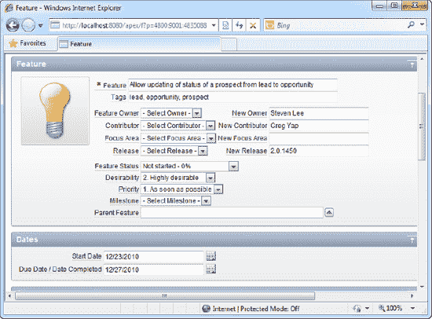

    **图 1-17。** 创建功能特性

4.  点击 `Create Feature` 按钮。
5.  您已创建了一个功能特性，现在工作区中的所有开发者都可以查看它。
6.  如果某个开发者已完成此功能特性，并且他现在希望更改该特性的状态，他首先需要导航至 `Team Development` -> `Features` -> `Features` 标签页。
7.  在此页面中，您应该能够看到所有功能特性的列表。您也可以通过此页面搜索您的功能特性。找到您之前创建的功能特性后，点击其旁边的 `Edit` 图标（参见图 1-18）。

    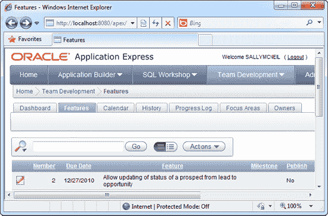

    **图 1-18。** 浏览功能特性列表

8.  在下一页中，将功能特性的 `Status` 字段更改为 `Complete - 100%`，然后点击 `Apply Changes` 按钮。
9.  如果您导航至 `Team Development` -> `Features` -> `Dashboard` 标签页，您可以看到一个包含功能特性列表摘要的仪表板（如图 1-19 所示）。

    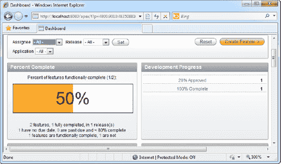

    **图 1-19。** 功能特性仪表板

10. `Calendar` 标签页以*可视化日历格式*显示您的功能特性开发截止日期，`History` 标签页显示功能特性列表的最新更新，而 `Focus Areas` 和 `Owners` 标签页则通过环形图显示功能特性在不同相关人员之间的分布情况。

     **提示** 创建里程碑、任务和报告错误的步骤与创建功能特性的步骤非常相似。要访问各项，请点击 `Team Development` 菜单中对应的图标。

#### 工作原理

APEX 4.0 版本中提供的新 `Team Development` 模块为利益相关者（您的最终用户）提供了一种登录并跟踪功能请求状态的方式，甚至可以在他们使用您开发的应用程序时插入他们的反馈！

`APEX Team Development` 对于在项目中使用基于 `SCRUM` 方法（如 `敏捷`）的开发团队来说也是一个巨大的福音。`敏捷` 开发的基本原则之一是，功能特性可以随时以任何顺序添加，更重要的是，可以在任何迭代中发布一个可工作的产品。

使用 `Team Development`，您可以快速创建一个新的发布版本；将一组功能特性、里程碑和任务归入该发布版本下；并通过门户中的各种仪表板跟踪其进度。当发布版本提供给最终用户时，他们登录门户来测试您的应用程序并提供反馈（通过集成的 `Team Development Feedback` 功能）。这使得项目经理能够纳入这些反馈，并建立一个新的发布版本以及一组新的功能特性、里程碑和任务。

这种迭代过程可以发生多次，以每周左右的速度产生应用程序的增量发布，非常适合 `敏捷` 开发方法中普遍存在的需求快速变化的特性。

## 第 2 章

## 应用程序数据录入

大多数以业务数据库为中心的应用程序通常以相同的方式运作。应用程序围绕一个表构建，例如一个 `Customer` 表。最终用户需要向此表中添加新数据（本例中是新客户记录）。他或她还需要修改现有数据并从此表中删除客户记录。此表中的数据记录通常以网格形式呈现，并伴有 `新建`、`编辑` 和 `删除` 按钮，允许最终用户修改网格内容。`新建` 和 `编辑` 按钮通常将用户带到单独的详细信息页面——一个表单——该表单以更简化的字段集合显示，用于数据录入。

随着您转向更复杂的示例，如销售订单表单或费用报销申请表，您可以用日益复杂的花哨功能来装饰您的应用程序——数据验证、计算字段、复杂表单行为、访问权限、Web 服务调用等等。然而，就其核心而言，一个业务应用程序仍然由基本的 `CRUD`（`创建`、`读取`、`更新` 和 `删除`）操作组成。

这种反复出现的模式是使整个 `Oracle APEX` 概念运作的基础。它负责设置基本数据录入屏幕并将其绑定到数据库表的繁琐工作。之后，您可以自由地为每个页面添加您想要的花哨功能，使它们按您希望的方式运行。

本章为您提供了一些方法，帮助您为应用程序创建 `CRUD` 基础。它将指导您创建两种不同类型的应用程序——标准数据库应用程序和 `Websheet` 应用程序（`APEX 4.0` 中的新功能）。您将学习如何为两者生成数据录入表单，然后稍作修改以使用更丰富的 UI 控件。我还将探讨如何使用一种称为 `表单表格` 的特殊类型表单来加速数据录入。

### 2-1. 创建数据库应用程序

#### 问题

您需要创建一个 `数据库应用程序`，其中包含一个数据录入表单，用于管理主客户列表及其详细信息。

#### 解决方案

最好将此问题分为两部分来处理。首先，创建客户表。然后创建应用程序，包括数据录入表单。


## 创建客户表

以下是创建客户表的步骤：

1.  以开发者身份登录到现有的 APEX 工作区。

     **注意** 关于如何创建工作区的更多信息，您可以参考配方 1-5。

2.  现在需要创建客户表。点击 `SQL Workshop`  `Object Browser` 菜单项。在随后出现的窗口中，点击右上角的 `Create` 按钮，并选择 `Table` 菜单项。
3.  系统将显示一个允许您定义数据库表的窗口。指定表的名称并为表定义几个字段。您可以创建混合的 `NVARCHAR2`、`NUMBER` 和 `DATE` 类型字段。如图 2-1 所示。

    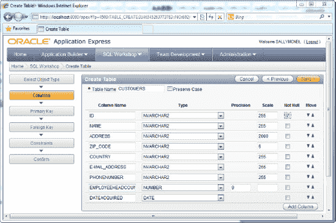

    *图 2-1. 创建客户表*

4.  点击 `Next` 按钮继续。在此屏幕中，如果需要，您可以定义主键。将主键设置为表中的 `ID` 字段，如图 2-2 所示。

     **提示** 一些 APEX 功能，例如从报表页面编辑记录，需要在报表所基于的表或视图上定义主键。您可以在配方 2-2 中了解更多关于报表页面的信息。

    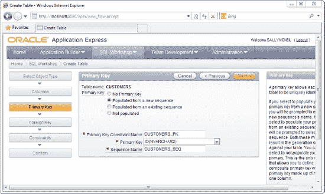

    *图 2-2. 定义主键*

5.  点击 `Next` 按钮。下一页允许您定义外键（如果存在）。由于目前没有外键，跳过此页并再次点击 `Next` 按钮。在下一页中，您可以为表定义约束。例如，您可能不希望有重复记录（同一公司的两条名称相同的记录）。选择在 `Name` 字段上创建唯一约束，如图 2-3 所示。

    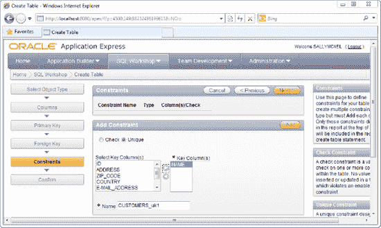

    *图 2-3. 在客户表上定义约束*

6.  点击 `Next` 按钮。您将看到即将创建的表的摘要。点击 `Create` 按钮确认请求，之后您的表将被生成。如果您浏览表列表，应该会看到 `Customers` 表出现在该列表中（如图 2-4 所示）。

    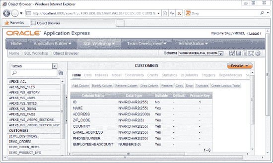

    *图 2-4. 对象浏览器中的客户表*

## 创建数据库应用程序和数据录入表单

现在是创建数据库应用程序的时候了。

1.  要创建新的数据库应用程序，请点击工作区主页中的 `Application Builder`  `Database applications` 菜单项。
2.  应用程序构建器向导将显示（如图 2-5 所示）。选择 `Database application` 类型。

    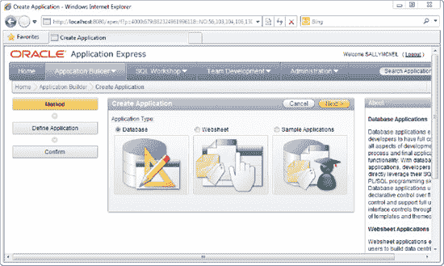

    *图 2-5. 应用程序构建器向导*

3.  接下来，您需要指定应用程序的名称。使用 `Sales Force` 作为应用程序名称。选择从头开始创建应用程序。点击 `Next` 按钮。
4.  您现在将看到向导中名为 `Pages` 的部分。在这里，您可以定义应用程序中包含的页面列表。创建一个空白页面；这将是您应用程序的主页。选择空白页面类型并指定 `My Home` 作为您的页面名称（参见图 2-6）。完成后，点击 `Add Page` 按钮。

    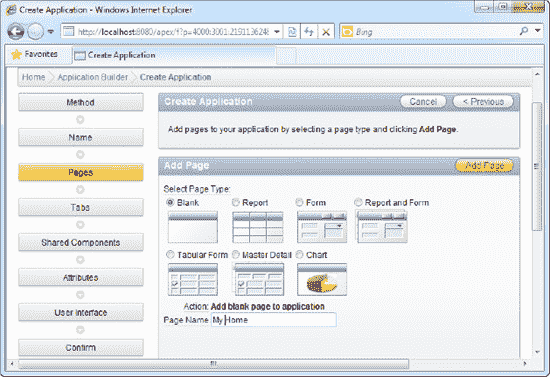

    *图 2-6. 创建空白页面作为主页*

5.  在同一区域，您将能够创建数据录入页面。选择 `Form` 页面类型。在 `Subordinate to Page` 字段中，选择 `My Home` 页面。在 `table name` 字段中，从数据库中选择一个现有的表；在您的情况下，就是您之前创建的 `Customers` 表。完成后，点击 `Add Page` 按钮。此步骤的详细信息如图 2-7 所示。

     **提示** `Subordinate to Page` 字段为 APEX 提供了关于您的页面如何结构化的信息。这反过来又定义了 APEX 之后生成的默认导航方案。例如，将 `Customers` 表单设置为 `My Home` 页面的下级，将导致 APEX 在主页中自动生成一个指向 `Customers` 表单的链接。

    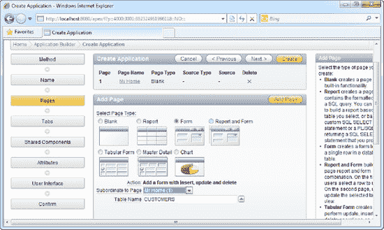

    *图 2-7. 创建客户数据录入页面*

6.  完成后，点击 `Next` 按钮。在下一页中，您可以为应用程序定义选项卡。使用默认设置并继续到下一页。您现在也可以跳过 `Shared Components`、`Attributes` 和 `UI` 向导页面。点击 `Create` 按钮创建应用程序。系统将要求您再次确认您的设置。
7.  应用程序成功创建后，您将看到图 2-8 所示的截图。（请注意，`Login` 页面会在您的应用程序中自动生成）。点击 `Run Application` 图标来试用您的应用程序！

    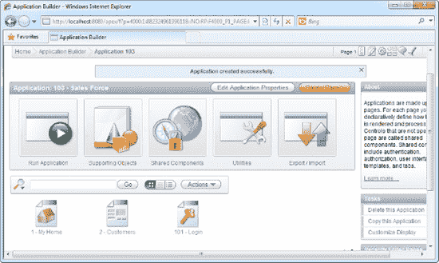

    *图 2-8. SalesForceApp 应用程序创建成功！*

8.  您将首先看到 `Login` 页面。使用您之前登录到工作区时所用的开发者账户的相同凭据登录。登录到应用程序后，您应该会看到如图 2-9 所示的主页。请注意，主页上已自动生成了一个指向 `Customers` 页面的链接。

    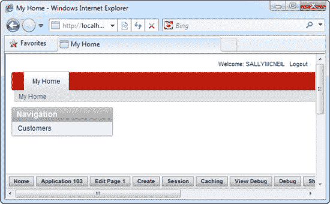

    *图 2-9. 您应用程序的主页*

9.  点击 `Customers` 链接以打开 `Customers` 数据录入表单。您可以在这里看到您的表单（包含来自 `Customers` 表的完整字段列表）。在此表单中输入一些信息，完成后点击 `Create` 按钮。如图 2-10 所示。

     **注意** 表单上生成的控件取决于数据库表中声明的字段类型。例如，数据库中的 `DATE` 字段会在表单上生成一个日期选择器控件。

    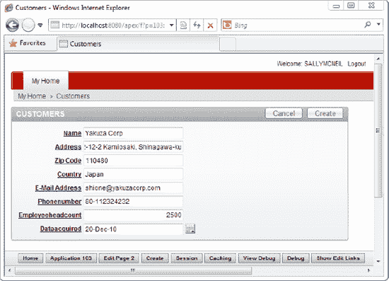

    *图 2-10. 客户数据录入页面*

10. 创建记录后，从应用程序注销，并点击底部栏中的 `Home` 按钮返回工作区。导航到 `SQL Workshop` 中的 `Object Browser`，查看此表中的数据。您应该能够在数据库表中看到新创建的记录（参见图 2-11）。

    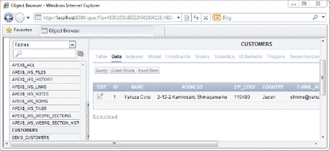

    *图 2-11. 新创建的客户记录*

#### 工作原理

`Database Application` 类型是 APEX 中最常见的应用程序类型。它允许您设置页面（特别是表单和报表），从而快速围绕现有数据库表生成 CRUD（增删改查）用户界面。

一个典型的 APEX 应用程序从开发者（或数据库设计者）定义应用程序所需的完整数据库表集开始。这可以使用 `Object Browser` 工具或在 APEX 的 `SQL Workshop` 部分运行 PL/SQL 脚本来完成。也可以使用外部工具、脚本中的一组 DDL 或从另一个数据库导入模式来创建数据库对象——表、索引、约束、序列等。

一旦表全部生成，APEX 开发者就会从这些数据库表的模式中生成所需的表单和报表。表单就位后，开发者通过添加验证例程、JavaScript 功能、复杂表单行为、访问权限设置等来优化这些生成的页面。

### 2-2. 创建报表以管理您的数据

#### 问题

您的用户希望创建两个页面：一个数据录入表单和另一个页面来检索他们刚刚输入的数据。该应用程序还需要以网格（列表）格式逐行向用户显示先前输入的数据，并提供一种让他们编辑和删除其数据的方法。


#### 解决方案

执行以下步骤以创建一个显示现有记录的报表：

1.  在工作区中打开 Sales Force 应用程序（以开发者身份连接）。
2.  点击右上角的“创建页面”按钮。在弹出的窗口中，选择“表单”页面类型。在下一页（图 2-12）中，选择“基于表格和报表的表单”页面类型。点击“下一步”按钮继续。

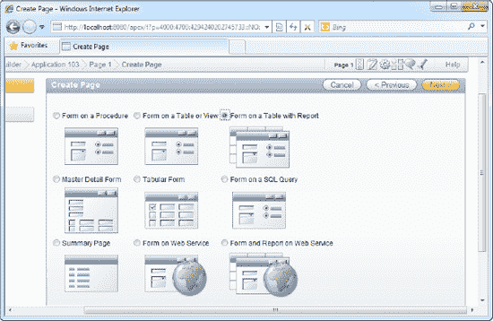

***图 2-12.** 选择页面类型*

3.  在下一页，使用默认设置。点击“下一步”按钮进入表/视图选择页面。选择 `Customers` 表并点击“下一步”按钮。在接下来的向导两页中使用默认设置。您最终将看到如图 2-13 所示的页面，该页面允许您定义报表中可用的列。高亮（选择）所有列，然后点击“下一步”按钮。

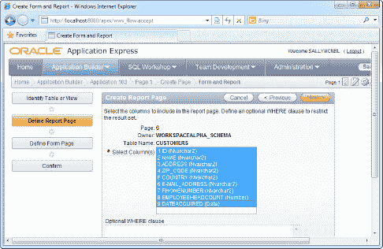

***图 2-13.** 指定要包含在报表中的列列表*

4.  在向导的接下来四页中使用默认设置。之后，您将看到一个页面，允许您选择表单中可用的列。选择所有列。

 **提示** 此时，您可能会遇到 `Column Names must be valid Oracle Identifiers` 错误。如果您包含了 Oracle 数据库中的某些保留关键字或包含无效字符的字段，就可能发生这种情况。与 APEX 相比，Oracle 数据库在字段命名方面具有更高的自由度。您可以在以下链接查看 Oracle 命名数据库对象的规则：[`http://download.oracle.com/docs/cd/E11882_01/server.112/e17118/sql_elements008.htm#SQLRF51129`](http://download.oracle.com/docs/cd/E11882_01/server.112/e17118/sql_elements008.htm#SQLRF51129)。

5.  在下一页，您可以决定是否允许用户通过报表对 `Customers` 表执行插入、更新或删除记录的操作。将所有选项保留为“是”（参见图 2-14）。

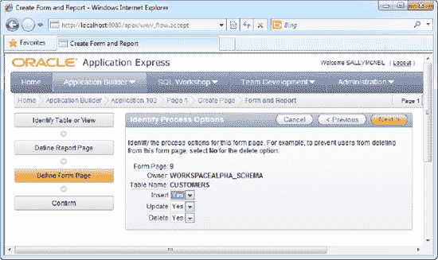

***图 2-14.** 表单上的处理选项*

6.  点击“下一步”按钮，然后点击“完成”以完成配置并创建表单和报表。之后，返回您的应用程序主页。您应该能够在应用程序中看到两个新页面：“CUSTOMERS 上的报表”和“CUSTOMERS 上的表单”。您可以在图 2-15 中看到它们。

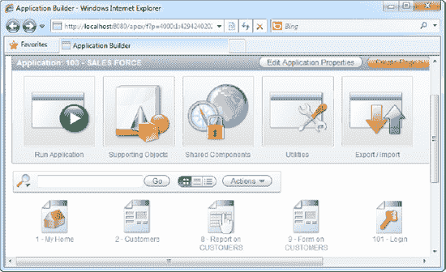

***图 2-15.** 新创建的报表和表单*

7.  现在，您需要在首页创建指向该报表和表单的链接。导航到应用程序主页，点击“1-我的主页”页面。这将显示该页面的配置区域。在“页面呈现”部分下，导航到 区域  主体 (3)，右键单击“导航”项并选择“编辑列表”菜单项。这将显示如图 2-16 所示的页面。

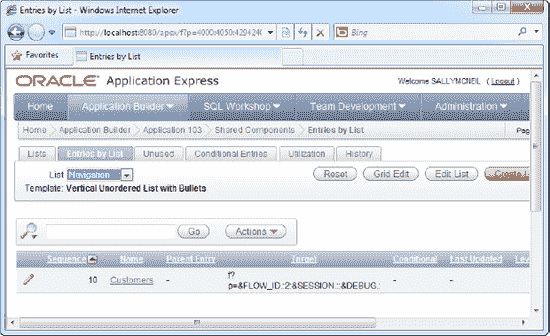

***图 2-16.** “按列表显示条目”页面*

8.  点击右上角的“创建列表”按钮。这将显示一个新页面，允许您配置导航列表的设置。将“列表条目标签”指定为“我的客户列表”（这是链接上显示的标题），并为“页面”字段选择“CUSTOMERS 上的报表”页面。完成后，点击“创建”按钮。您现在应该能在“按列表显示条目”页面看到您新创建的链接。
9.  现在，导航到您的应用程序并运行它。您现在应该在应用程序首页区域看到新的“我的客户列表”链接，如图 2-17 所示。

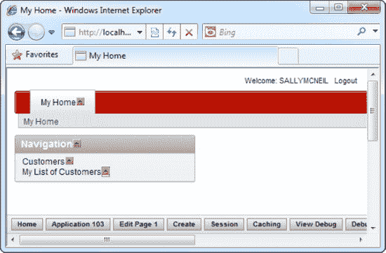

***图 2-17.** 应用程序首页区域*

10. 点击“我的客户列表”链接。您应该能看到来自 `Customers` 表的记录显示在表格中。点击“创建”按钮以向列表中添加新记录。您将看到关联的表单显示（如图 2-18 所示）。填写此表单并点击“创建”按钮。

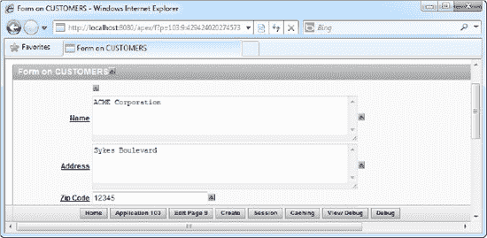

***图 2-18.** 客户详情表单*

11. 添加新记录后，您将能够在列表中看到它（如图 2-19 所示）。您也可以通过点击表格左侧的小纸笔图标来编辑现有记录。

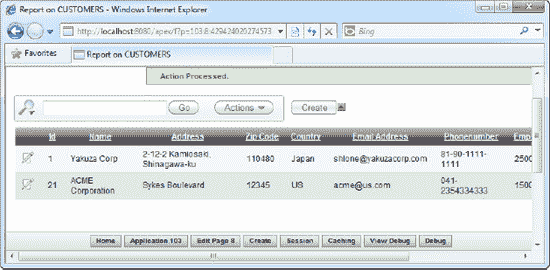

***图 2-19.** 新创建的记录*

#### 工作原理

报表是 APEX 中的一种对象类型，指的是以表格形式显示的多个数据记录的列表。“报表”这个词有点用词不当，因为它在 APEX 中的用途远不止生成传统的数据报告。APEX 中的报表（特别是交互式报表）通常用于向用户呈现记录列表，以便他/她可以从底层表中修改或删除它们。从这个意义上说，报表的功能可以被认为与视图类似。

报表也可以用于具有主从关系的明细表单中，此时报表呈现为主表单内的表格形式。然后，可以将多个子记录输入到此表中。

报表带有很多内置功能；表 2-1 列出了报表提供的一些默认功能。

***表 2-1.** 报表内置功能*

| **功能** | **描述** |
| --- | --- |
| `筛选` | 也许是报表最强大的功能，筛选器允许最终用户（实时地）定义一组筛选条件，这些条件可以立即应用于报表中显示的完整行集。筛选器会实时修改对数据库的查询；这意味着发送到 APEX 进行处理的数据集只是显示给用户的信息。 |
| `分页` | 报表中的记录由 APEX 自动分页。最终用户可以动态更改页面大小（单页中显示的行数）。 |
| `排序` | 最终用户可以轻松地实时按报表中的每一列排序。 |
| `分组` | 最终用户可以按某个字段或字段组合动态分组记录。 |
| `高亮显示` | 最终用户可以选择根据某些条件动态高亮显示行（例如，将金额大于 $10,000 的所有发票记录以红色高亮显示）。 |
| `创建计算列` | 最终用户可以动态创建由现有列中的数据计算得出的附加列。最终用户可以定义非常复杂的公式来执行此计算。 |
| `图表` | 最终用户可以动态创建报表中现有数据的图表视图。只需点击几下，最终用户就可以创建一个复杂的饼图，例如，来可视化报表中的数据。 |
| `聚合` | 最终用户可以使用聚合函数（例如，求和），该函数计算报表中某一列所有数据的聚合值，并将其显示在列的底部。这可以与分组结合使用。 |

### 2-3. 更改表单中的字段项类型

#### 问题

您需要将表单上几个字段的项目类型从文本区域更改为单行文本框。


#### 解决方案

要将文本区域的字段类型更改为单行文本框，请按照以下步骤操作：

1.  导航至应用主页，点击 `CUSTOMERS 表单`。这将显示页面配置区域。在 `页面渲染` 部分，展开 `区域` → `主体 (3)` → `Form on Customers` → `项目` 节点，并双击您想要修改的字段（参见 图 2-20）。

    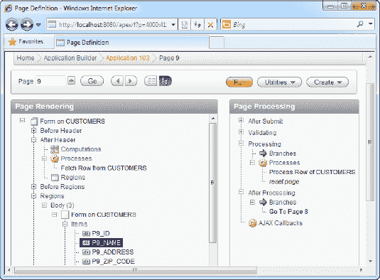

    图 2-20. 表单上的字段设置

2.  在 `编辑页面项` 页面中，将该字段的字段类型从 `文本区域` 更改为 `文本字段`（如 图 2-21 所示）。

    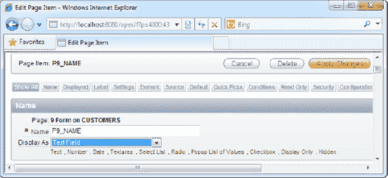

    图 2-21. 字段设置页面

3.  点击 `应用更改` 按钮。运行应用并打开 `我的客户列表` 页面。选择创建新记录。在表单页面中，您应该能观察到您字段的字段类型已相应改变（如 图 2-22 所示）。

    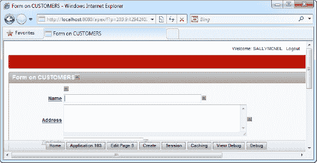

    图 2-22. 在 CUSTOMERS 表单中反映的更改

#### 工作原理

`页面渲染` 部分提供了每个页面后端配置的概览。它列出了表单上使用的每个字段，并提供了从视觉布局到验证行为等各个方面操作这些字段的工具。

### 2-4. 在表单中从值列表中选择

#### 问题

您需要在客户表单的 `Country` 字段中创建一个作为下拉列表的值列表。此值列表必须是动态的，并且应在单独的表中进行管理。

#### 解决方案

以下是如何创建一个允许用户从值列表中选择的表单字段：

1.  使用 `SQL 工作室` 中的 `对象浏览器` 工具，创建一个名为 `Countries` 的新表，包含两列：`CountryName` 和 `Remarks`。向表中插入一些示例数据；例如，在 `CountryName` 字段中为 `Japan`、`US` 和 `Singapore` 创建记录。

     **提示** 配方 2-1 描述了如何使用 `对象浏览器` 工具创建表。

2.  导航至应用主页，点击 `CUSTOMERS 表单`。这将显示页面配置区域。在 `页面渲染` 部分，展开 `区域` → `主体 (3)` → `Form on Customers` → `项目` 节点，并双击 `Country` 字段。
3.  在随后的页面中，将 `显示为` 字段类型更改为 `选择列表`。这表示一个下拉列表。当您这样做时，您还会注意到顶部会出现一个名为 `值列表` 的新选项卡。点击此选项卡。
4.  在随后的页面中，点击 `创建动态值列表` 链接。这将启动一个弹出窗口，允许您配置动态列表。在弹出窗口中，使用默认的表/视图所有者，然后点击 `下一步` 按钮。
5.  在向导的下一页中，选择 `Countries` 表。将 `CountryName` 同时设置为 `显示` 列和 `返回值`。依次点击 `下一步` 和 `完成` 按钮以完成配置。您将在值列表 `定义` 区域看到生成的 SQL（如 图 2-23 所示）。

    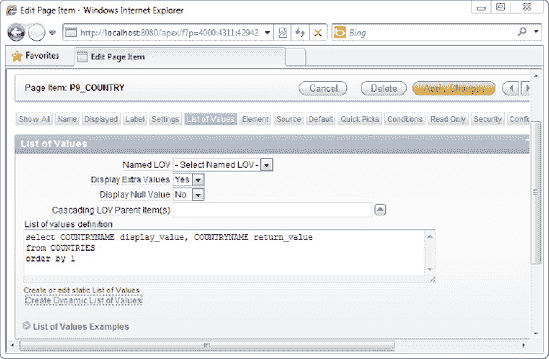

    图 2-23. 值列表定义区域中生成的 SQL

6.  点击 `显示` 选项卡，并将 `高度` 设置为 `1`。这将把选择列表从列表框转换为下拉列表。
7.  点击 `应用更改` 按钮。运行应用，点击 `我的客户列表` 链接，并选择创建新记录。您会注意到 `Country` 字段已更改为一个下拉列表，其中包含存储在 `Countries` 表中的值（如 图 2-24 所示）。

    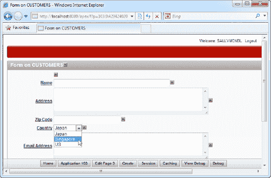

    图 2-24. 国家下拉列表

#### 工作原理

Oracle APEX 提供了五种不同类型的控件，允许用户从值列表中选择。它们在 表 2-2 中描述。

表 2-2. 提供值列表功能的项类型

| 项类型 | 描述 |
| --- | --- |
| `复选框` | 您可以创建多个复选框（一个检查列表），供用户在表单上勾选。值列表区域允许您定义每个复选框的标题和值。 |
| `单选按钮组` | `单选按钮组` 类型允许您使用单选按钮从值列表中选择单个值。值列表区域允许您定义每个单选按钮的标题和值。 |
| `弹出式值列表` | `弹出式值列表` 是一种选择控件，您可以从弹出窗口中的列表中选择一个值。 |
| `选择列表` | 选择列表可以呈现为列表框（如果 `高度` 属性设置为大于 1 的值）或下拉列表（如果 `高度` 属性设置为 1）。`选择列表` 中包含的值列表在值列表区域中定义。 |
| `穿梭框` | 穿梭框基本上由两个列表框组成，允许您将项目从一个框穿梭（或添加）到另一个框。 |

### 2-5. 在表单中上传和下载文件

#### 问题

您需要让用户在每条客户记录中上传一个附件——公司简介（任何文件格式）。

#### 解决方案

以下是如何在表单中创建文件上传字段：

1.  使用 `SQL 工作室` 中的 `对象浏览器` 工具，向 `Customers` 表添加一个新的 `BLOB` 列，并将列命名为 `CompanyProfile`。
2.  导航至应用主页，点击 `CUSTOMERS 表单`。这将显示页面配置区域。在 `页面渲染` 部分，展开 `区域` → `主体 (3)` → `Form on Customers` 节点，并右键单击 `项目` 节点。选择 `创建页面项` 菜单项。
3.  在随后的页面中，选择 `文件浏览` 字段类型并点击 `下一步`。在下一页中，将 `项名称` 更改为 `P9_COMPANYPROFILE`。在向导的其余页面中使用默认设置。创建页面项后，在 `页面渲染` 部分双击该项。
4.  在项配置页面中，点击 `源` 选项卡，并将 `源类型` 更改为 `数据库列`。将 `源值或表达式` 字段设置为您的 `BLOB` 数据库字段的名称，`COMPANYPROFILE`。点击 `应用更改` 按钮保存您的更改。
5.  现在，运行应用，点击 `我的客户列表` 链接，并选择创建新记录。您会在表单中看到新的公司简介字段。点击 `浏览` 按钮并在文件选择器对话框中选择任何基于文本的文件（如 图 2-25 所示）。点击右上角的 `创建` 按钮以保存记录。文件内容将被写入 `BLOB` 列。

    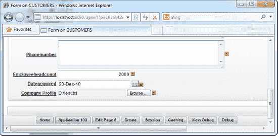

    图 2-25. 正在使用的公司简介文件上传字段

6.  现在尝试编辑您刚刚创建的记录。在表单窗口中，您将能够在文件上传控件旁边看到一个小小的 `下载` 链接。点击 `下载` 链接以下载文件内容（如 图 2-26 所示）。

    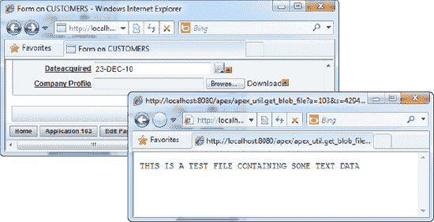

    图 2-26. 从 BLOB 字段下载数据

#### 工作原理

当您使用 `BLOB` 字段存储文件附件时，文件附件的内容在通过 APEX 表单上传后存储在 `BLOB` 字段中。同样，当启动下载时，`BLOB` 字段的内容会被下载到客户端浏览器。

### 2-6. 使用表单表格加速数据录入

#### 问题

您有大量数据需要输入到您的应用程序中。您需要一种更好、更快的方式来编辑和插入数据记录。


#### 解决方案

执行以下步骤以创建表格数据录入表单：

1.  导航至应用程序主页。创建一个新页面，并选择“表格表单”作为页面类型。单击“下一步”按钮。
2.  在向导的下一部分，您可以选择允许在表格表单上执行的操作类型。保留默认设置（更新、插入和删除）并继续到下一页。
3.  从列表中选择 `Customers` 表。在下一页，选择要包含在表格表单中的所有列。如图 2-27 所示。

    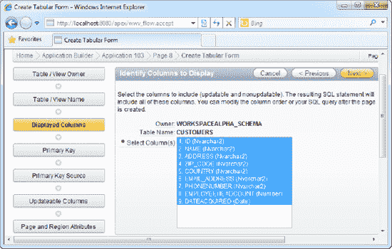

    **图 2-27. 选择要包含在表格表单中的列列表**

4.  在所有后续页面中使用默认设置。在向导结束时，单击“运行页面”图标以运行您的表格表单。
5.  您应该能够看到表格表单，如图 2-28 所示。您可以通过直接在表格单元格中更改值来修改数据。您还可以使用表格顶部和底部提供的按钮删除和添加行。修改数据完成后，单击“提交”按钮保存更改。

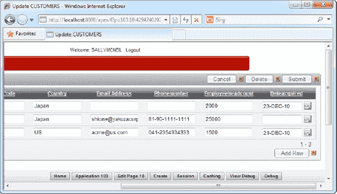

**图 2-28. 运行中的表格表单**

 **提示** 您可能还想从应用程序主页直接链接到此表格表单。配方 2-9 中的步骤 7 到 9 详细解释了如何执行此操作。

#### 工作原理

表格表单可帮助您快速设置网格，允许您对表格数据进行内联编辑。表格表单的目标是允许最终用户修改多条记录并一次性提交所有更改。这在多用户需要频繁更新多条数据记录时，减少了网络流量。

表格表单功能为内联编辑中的每列提供了丰富的 UI 控件。例如，`Country` 列在编辑时可以呈现一个包含国家列表的下拉列表。

## 2-7. 创建 Websheet 应用程序

#### 问题

您有一个包含大量数据（所有客户的列表）的 Microsoft Excel 电子表格。您需要将此整个列表放到 Web 上，以便用户可以通过 Web 界面修改它，并且需要在尽可能短的时间内完成。

#### 解决方案

以下是使用 Microsoft Excel 电子表格中的数据创建 Websheet 应用程序的方法：

1.  单击 `Application Builder` 主菜单项，然后单击“创建”按钮。选择创建 Websheet 应用程序。
2.  将应用程序名称更改为 `CustomersWebSheet`。
3.  单击“创建”按钮以创建 Websheet。您应该在工作区主页中看到您的 Websheet 应用程序（参见图 2-29）。

    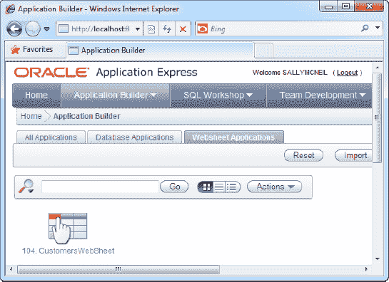

    **图 2-29. 新创建的 CustomersWebSheet 应用程序**

4.  单击您的 Websheet 应用程序，然后单击“运行”按钮。
5.  使用您的开发者凭据登录到 Websheet 应用程序。
6.  在应用程序中，单击 `Data` 主菜单项并选择 `Create` 子菜单项。
7.  在向导中，选择创建数据网格，然后单击“下一步”按钮。
8.  在下一页中，选择通过复制和粘贴创建数据网格（如图 2-30 所示）。

    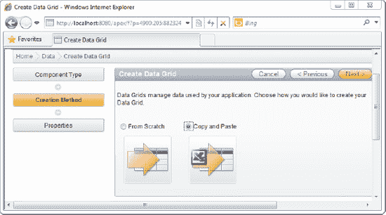

    **图 2-30. 通过剪切和粘贴创建数据网格**

9.  在下一页中，指定 `Customers` 作为数据网格的名称。您现在需要将所有数据从您的 Excel 电子表格中复制（如图 2-31 所示）并粘贴到此页的大文本区域中（如图 2-32 所示）。

    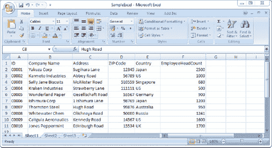

    **图 2-31. 从您的 Microsoft Excel 文件复制内容...**

    

    **图 2-32. ...并将它们粘贴到此处的大文本区域中...**

10. 接下来，单击“上传”按钮。您会发现您的电子表格数据神奇地整齐排列在数据网格中（参见图 2-33）！

    

    **图 2-33. ...这就是整齐排列在数据网格中的电子表格数据！**

11. 您现在可以直接通过单击表格中的任何单元格来编辑 Websheet（如图 2-34 所示）。使用每行左侧的“编辑”图标（该图标会打开一个根据您的 Excel 表列生成的表单）向表格添加新行等。


**图 2-34. 在 Websheet 中编辑数据**

#### 工作原理

Websheet 提供了一种将整个电子表格转换为可编辑网格的便捷方法，该网格提供了报表提供的所有标准功能——包括验证、分页、排序、突出显示等。

请注意，Websheet 应用程序在底层的工作方式略有不同。Websheet 数据网格不像表单那样直接映射到数据库表。Websheet 数据存储在内部的 `APEX$_WS_ROWS` 表中。

 **提示** 您可以使用 SQL Workshop 中的 Object Browser 工具检查 `APEX$_WS_ROWS` 表的内容。

### 2-8. 更改 Websheet 列的项类型

#### 问题

您需要创建一个 Websheet，其中对不同列使用不同的控件。例如，您的用户希望对 `Country` 列使用下拉列表（包含不同国家的列表）。

#### 解决方案

以下是为 Websheet 中的列创建下拉列表的方法：

1.  导航至 `CustomersWebSheet` 应用程序并运行它。使用您的开发者凭据登录到应用程序。
2.  打开 `Customers` 数据网格。
3.  单击“管理”下拉按钮，然后单击 `Columns`  `Column Properties` 菜单项。
4.  您将看到“列属性”页面。从“列名”字段中选择 `Country` 列。
5.  在“显示为”字段下，选择“选择列表”。
6.  在图 2-35 所示的“值列表”部分下，选择“基于当前值新建值列表”项。这将从您之前粘贴的电子表格数据中的 `Country` 列检索整个唯一值列表。

    

    **图 2-35. 修改 Country 列属性**

7.  完成后单击“添加行”按钮。当您在数据网格中单击 `Country` 列中的任何单元格时，您现在会注意到一个包含国家列表的下拉列表，而不是通常的文本框（参见图 2-36）。


**图 2-36. Websheet 数据网格内的下拉列表**

#### 工作原理

与报表类似，您可以轻松更改 Websheet 中每列的项类型。但是，Websheet 可用的项类型仅限于以下几种：

*   日期选择器
*   只读
*   选择列表
*   文本
*   文本区域

 **注意** 对于 Websheet 中的选择列表，您只能在 LOV 中定义静态项列表（以逗号分隔）。Websheet 中的选择列表不支持像表单那样的动态列表。

### 2-9. 批量修改 Websheet 中的值

#### 问题

您的 Websheet 中有一个包含数千行的列表。您需要将所有地址中的单词“Road”更改为“Street”。


#### 解决方案

以下是如何在 Websheet 中批量修改数据：

1.  导航至 `CustomersWebSheet` 应用程序并运行它。使用你的开发者凭据登录到该应用程序。
2.  打开“客户数据”网格。
3.  点击“管理”下拉按钮，然后点击“行  替换”菜单项。
4.  在随后打开的页面中，在“查找内容”字段中输入 `Road`，在“替换为”字段中输入 `Street`（如图 2-37 所示）。完成后点击“应用”按钮。

    

    ***图 2-37.** 将 “Road” 替换为 “Street”*

5.  你会发现 Websheet 中所有 “`Road`” 短语都被替换为 “`Street`” 了（如图 2-38 所示）。


***图 2-38.** Websheet 中的短语替换*

#### 工作原理

Websheets 提供了一些工具来帮助你在数据网格中批量修改数据。支持以下批量编辑操作：

*   将某列中所有行的某个值替换为另一个值。
*   将某列的所有行设置为某个特定值。
*   用前一行的数据填充包含空值的列。

## 第 3 章

## 连接应用逻辑

如果你是一名 ASP.NET 开发人员，你可能对 Microsoft 引入的用于将表示层与逻辑层分离的 **代码隐藏模型** 很熟悉。在代码隐藏页面中，代码的执行是基于事件的。你会指定在页面加载或按钮点击时执行的代码块。

APEX 逻辑层的工作方式与此类似。也许总结其工作原理的最佳方式是：页面执行被划分为不同的时序事件——可以在这些时间点插入应用逻辑。例如，一个典型的 APEX 页面的后端执行被划分为两个主要事件：页面渲染和页面处理，这两个事件又各自包含可以触发应用逻辑的更小事件。

APEX 开发人员主要可以使用 PL/SQL 语句和 JavaScript 来插入应用逻辑，这两者也可以通过 APEX 提供的向导生成。（事实上，如果你不把 PL/SQL 视为“代码”，那么你完全可以从零开始创建一个完整的书店或销售团队应用程序，而无需编写一行代码！）

APEX 与传统的开发工具不同，它旨在最短时间内快速产出业务应用程序。为了实现这一目标，APEX 强制执行一个严格的框架，期望业务应用程序以某种特定的方式开发。例如，每个表单在其生命周期中的特定点都应显示信息、提供客户端和服务器端验证，并执行后端处理。在 APEX 上开发的应用程序本质上受限于这种流程，试图编写逻辑来做一些超出此常规范围的事情，可能不如使用传统开发工具那样容易。这意味着你不能用 APEX 来创建游戏（至少无法创建出色的游戏），但你当然可以用它来非常快速地创建业务应用程序——尤其是以数据库为中心的应用程序。

在本章中，我将详细探讨 APEX 逻辑层，并向你展示如何在 APEX 中执行常见任务。

### 3-1. 为你的表单添加服务器端验证

#### 问题

你正在创建一个处理医院病人出院的表单。当护士填写表单时，他们需要输入病人的社会安全号码。在记录可以被创建之前，表单数据必须在后端进行验证——病人的社会安全号码必须与支付历史记录表进行核对。如果支付记录存在（即病人已支付其医疗费用），则允许出院。否则，出院表单必须显示一条错误消息。

#### 解决方案

在测试本教程中的解决方案之前，你需要先设置一些示例数据库和表单对象。之后，你将探索如何为这些表单添加服务器端验证。让我们从创建示例对象开始。

##### 设置示例对象

要创建示例对象，请按照以下步骤操作：

1.  使用 SQL Workshop 或 PL/SQL 创建清单 3-1 所示的 `PaymentHistory` 表。

    ***清单 3-1.** `PaymentHistory` 表*

    ```sql
    CREATE table "PAYMENTHISTORY" (
        "SOCIALSECURITYNO" NVARCHAR2(9),
        "AMOUNTPAID"       NUMBER(6,2)
    )
    ```

2.  创建清单 3-2 所示的病人出院表（将 `DISCHARGEID` 字段设为主键），然后创建一个数据库应用程序并在此表上设置一个数据录入表单。

    ***清单 3-2.** `PatientDischarge` 表*

    ```sql
    CREATE table "PATIENTDISCHARGE" (
        "DISCHARGEID"              NVARCHAR2(10),
        "PATIENTNAME"              NVARCHAR2(255),
        "PATIENTSOCIALSECURITYNO"  NVARCHAR2(9),
        "DATEOFDISCHARGE"          DATE,
        "DISCHARGEREMARKS"         NVARCHAR2(2000),
        constraint  "PATIENTDISCHARGE_PK" primary key ("DISCHARGEID")
    )
    /

    CREATE sequence "PATIENTDISCHARGE_SEQ"
    /

    CREATE trigger "BI_PATIENTDISCHARGE"
      before insert on "PATIENTDISCHARGE"
      for each row
    begin
      if :NEW."DISCHARGEID" is null then
        select "PATIENTDISCHARGE_SEQ".nextval into :NEW."DISCHARGEID" from dual;
      end if;
    end;
    /
    ```

     **提示** 有关如何设置数据录入表单的更多信息，请参考教程 2-1。

3.  向 `PaymentHistory` 表中添加一条示例记录，社会安全号码为 `123456789`。可以通过执行清单 3-3 中的 SQL 来完成。

    ***清单 3-3.** 在 `PaymentHistory` 表中创建示例记录*

    ```sql
    INSERT INTO PAYMENTHISTORY(SOCIALSECURITYNO,AMOUNTPAID) VALUES('123456789',500)
    ```


### 3-1. 添加服务器端验证

要为您的表单添加服务器端验证，请按照以下步骤操作：

1.  导航至出院患者表单的“页面定义”区域中的“页面处理”部分。
2.  在“验证”节点下，右键单击“验证”节点，然后单击“创建”按钮（如图 3-1 所示）。

    

    ***图 3-1.** 启动创建验证向导*

3.  您现在应该会看到“创建验证”向导。在向导的第一页，选择“项目级验证”项（参见图 3-2）。

    

    ***图 3-2.** 选择验证类型*

4.  在向导的下一页，选择 `PATIENTDISCHARGE: 1. P1_PATIENTSOCIALSECURITYNO` (`Patientsocialsecurityno`) 项作为要验证的项。
5.  在下一页，选择 `PL/SQL` 验证方法，接着选择函数返回布尔值 `PL/SQL` 验证类型。
6.  在下一个（序列和名称）步骤中使用默认值。继续到下一个（验证）步骤，并输入清单 3-4 中所示的 `PL/SQL` 验证代码。

    ***清单 3-4.** PL/SQL 验证代码*

    ```
    DECLARE
          CT INTEGER;
    BEGIN
          SELECT COUNT(*) INTO CT FROM PAYMENTHISTORY WHERE
          SOCIALSECURITYNO = :P1_PATIENTSOCIALSECURITYNO;
          IF CT>0 THEN
              return true;
          ELSE
              return false;
          END IF;
    END;
    ```
7.  在同一步骤中，指定验证失败时显示的错误消息，如图 3-3 所示。

    

    ***图 3-3.** 指定验证行为*

8.  继续到下一步。为“按下按钮时”字段选择“创建”选项，如图 3-4 所示。

    

    ***图 3-4.** 指定验证行为*

9.  单击“创建”按钮以创建验证规则。
10. 现在运行该表单。您将看到出院患者表单显示。在“患者社会保障号”字段中输入除 `123456789` 以外的任何值。单击“创建”按钮。您应该会看到验证错误消息显示在页面顶部（如图 3-5 所示）。如果您输入值 `123456789`（该值存在于 PaymentHistory 表中），则不会显示错误。


***图 3-5.** 运行中的验证*

#### 工作原理

首先，简单介绍一下服务器端验证。服务器端验证与客户端验证相对，它需要到服务器的往返行程。APEX 中主要有三种类型的服务器端验证。

> **项目级验证**：当您的验证一次只涉及一个页面项时使用此类型。
>
> **表格表单验证**：用于验证表格表单（更多内容见配方 3-2）。
>
> **页面级验证**：当您的验证涉及表单中的多个页面项时使用此类型（例如，确保开始日期早于结束日期）。

“条件类型”字段允许您指定应用验证的条件。例如，如果出院的患者恰好是该医院的 VIP 患者，您可能不需要检查付款。您可以在出院患者表单中包含一个复选框，如果勾选，则表示该患者是 VIP 会员。条件配置允许您创建一个可以检查此标志的规则，如果勾选，则跳过验证。

### 3-2. 为您的表格表单添加服务器端验证

#### 问题

您有一个“员工”表格表单，需要执行服务器端验证。您需要确保在提交表单时，社会保障号不为空。

#### 解决方案

要为您的表格表单添加服务器端验证，请按照以下步骤操作：

1.  创建清单 3-5 中所示的表。

    ***清单 3-5.** 示例员工表*

    ```
    CREATE table "EMPLOYEE" (
        "EMPLOYEENAME"     NVARCHAR2(255),
        "EMPLOYEETYPE"     NVARCHAR2(10),
        "SOCIALSECURITYNO" NVARCHAR2(10),
        "EMPLOYEEID"       NVARCHAR2(10),
        constraint  "EMPLOYEE_PK" primary key ("EMPLOYEEID")
    )
    /

    CREATE sequence "EMPLOYEE_SEQ"
    /

    CREATE trigger "BI_EMPLOYEE"
      before insert on "EMPLOYEE"
      for each row
    begin
      if :NEW."EMPLOYEEID" is null then
        select "EMPLOYEE_SEQ".nextval into :NEW."EMPLOYEEID" from dual;
      end if;
    end;
    ```
2.  基于 `EMPLOYEE` 表创建一个数据库应用程序/表格表单。

     **提示** 配方 2-6 展示了如何创建表格表单。

3.  导航到您的表格表单的“页面定义”区域的“页面呈现”部分。
4.  展开以下节点：`Employee`  `区域`  `正文 (3)`  `EMPLOYEE`  `报表列`，右键单击 `SOCIALSECURITYNO` 字段，然后单击“创建验证”子菜单项，如图 3-6 所示。

    

    ***图 3-6.** 为 SOCIALSECURITYNO 字段添加验证*

5.  在下一页，选择“列非空”验证类型（您正在检查以确保 `SocialSecurityNo` 字段不为空）。在下一页使用默认设置。
6.  在接下来的页面中，您将可以指定验证失败时显示的错误消息。输入以下错误消息：“请指定员工的社会保障号码。”
7.  在下一页，为“按下按钮时”字段选择“添加”（添加行）。保存更改并运行您的表格表单。将社会保障号码字段留空并尝试提交表格表单。您应该看到如图 3-7 所示的屏幕。


***图 3-7.** 运行中的表格表单验证*

#### 工作原理

您可以在表格表单的以下四个事件中的任何一个插入简单验证：

*   用户单击“添加”（添加行）按钮时。
*   用户单击“取消”按钮时。
*   用户单击“删除”按钮时。
*   用户单击“提交”按钮时。

 **注意** 并非所有标准表单的验证选项都适用于表格表单。例如，表格表单不支持您在配方 3-1 中看到的复杂类型的 `PL/SQL` 验证。

### 3-3. 为您的表单添加客户端 JavaScript 验证

#### 问题

当焦点移开标准表单上的数值字段时，您需要立即检查输入的值是否在特定范围内，如果不在则显示错误消息。您希望使用 JavaScript 来完成此操作，这样可以消除到服务器的往返行程。


#### 解决方案

要为表单添加客户端验证，请按照以下步骤操作：

1.  创建如清单 3-6 所示的表，并基于该表创建一个数据库应用/数据录入表单。

    **清单 3-6.** 示例薪资表

    ```sql
    CREATE table "SALARIES" (
        "PAYROLLID"    NVARCHAR2(255),
        "EMPLOYEENAME" NVARCHAR2(255),
        "SALARY"       NUMBER(6,2),
        constraint  "SALARIES_PK" primary key ("PAYROLLID")
    )
    /

    CREATE sequence "SALARIES_SEQ"
    /

    CREATE trigger "BI_SALARIES"
      before insert on "SALARIES"
      for each row
    begin
      if :NEW."PAYROLLID" is null then
        select "SALARIES_SEQ".nextval into :NEW."PAYROLLID" from dual;
      end if;
    end;
    /
    ```

2.  导航到表单“页面定义”区域的“页面呈现”部分。
3.  右键单击根节点（你的数据录入表单），并选择“编辑”子菜单项。
4.  在下一页中，导航到“HTML 头和主体属性”选项卡。在“HTML 头”字段中，输入如清单 3-7 所示的 JavaScript 代码。你应该会看到如图 3-8 所示的屏幕。单击“应用更改”按钮。

    **清单 3-7.** 验证 JavaScript

    ```html
    <script type="text/javascript">
      function validSalary(object){
        if(parseInt(object.value)>5000)
       alert('Salary must be a figure below $5000');
      }
    </script>
    ```
    

    **图 3-8.** 指定 `validSalary` JavaScript 函数

5.  完成此操作后，再次导航到表单的“页面定义”区域。在“页面呈现”部分，在“薪资  区域  主体 (3)  薪资  项”菜单下，右键单击 `P1_SALARY` 表单项。在弹出菜单中单击“编辑”项。
6.  导航到“元素”选项卡，并在“HTML 表单元素属性”字段中键入清单 3-8 所示的代码（如图 3-9 所示）。

    **清单 3-8.** 向薪资字段添加 JavaScript 事件处理程序

    ```html
    onblur="validSalary(this);"
    ```
    

    **图 3-9.** 向 SOCIALSECURITYNO 字段添加验证

7.  应用你的更改。现在运行表单。如果你在“薪资”字段中输入一个大于 5000 的值，然后离开该字段，它将显示一个 JavaScript 弹出错误消息，如图 3-10 所示。


**图 3-10.** 运行中的客户端验证

#### 工作原理

APEX 中的客户端验证完全通过 JavaScript 实现，它非常有用，因为不会产生到服务器的额外往返。你通常在以下情况使用客户端验证：

*   检查缺失值。
*   检查数值或日期值是否在特定范围内。
*   检查特定值的长度是否超过最大字符数。

表单的“HTML 头和主体属性”部分允许你插入 JavaScript 代码块，这些代码块在渲染特定页面时会被包含在内。你可以使用此部分插入一系列 JavaScript 函数，这些函数可以从表单中的任何项有选择地调用。

如你之前所见，“HTML 表单元素属性”字段允许你为表单上的每个页面项指定 JavaScript 事件处理程序。你可以从此区域调用在“HTML 头和主体属性”部分中定义的 JavaScript 函数。

### 3-4. 动态更改下拉列表中的项列表

#### 问题

你有一个下拉列表。当你更改此下拉列表中的值时，你希望另一个下拉列表中的值也随之更改。换句话说，你希望创建一个级联下拉列表。

例如，你有一个设备请求表单。提交请求时，你可以使用类别和子类别下拉列表来聚焦到特定设备。当你更改设备类别时，子类别列表会刷新，仅显示与该类别相关的设备。

#### 解决方案

要测试此配方中的解决方案，你首先需要设置一些示例数据库和表单对象。之后，你将在这两个下拉列表之间创建级联关系。让我们从示例对象开始。


## 设置示例对象

要设置本教程中使用的示例对象，请按照以下步骤操作：

1.  创建如清单 3-9 所示的表。

    ***清单 3-9.** 示例设备请求表*

    ```
    CREATE table "EQUIPMENTREQUEST" (
        "REQUESTID"   NVARCHAR2(10),
        "CATEGORY"    NVARCHAR2(255),
        "SUBCATEGORY" NVARCHAR2(255),
        constraint  "EQUIPMENTREQUEST_PK" primary key ("REQUESTID")
    )
    /

    CREATE sequence "EQUIPMENTREQUEST_SEQ"
    /

    CREATE trigger "BI_EQUIPMENTREQUEST"
      before insert on "EQUIPMENTREQUEST"
      for each row
    begin
      if :NEW."REQUESTID" is null then
        select "EQUIPMENTREQUEST_SEQ".nextval into :NEW."REQUESTID" from dual;
      end if;
    end;
    /

    CREATE table "CATEGORY" (
        "CATEGORYNAME" NVARCHAR2(255),
        "CATEGORYID"   NUMBER(6,2),
        constraint  "CATEGORY_PK" primary key ("CATEGORYID")
    )
    /

    CREATE sequence "CATEGORY_SEQ"
    /

    CREATE trigger "BI_CATEGORY"
      before insert on "CATEGORY"
      for each row
    begin
      if :NEW."CATEGORYID" is null then
        select "CATEGORY_SEQ".nextval into :NEW."CATEGORYID" from dual;
      end if;
    end;
    /

    CREATE table "SUBCATEGORY" (
        "SUBCATEGORYNAME"  NVARCHAR2(255),
        "PARENTCATEGORYID" NUMBER(6,2),
        "SUBCATEGORYID"    NUMBER(6,2),
        constraint  "SUBCATEGORY_PK" primary key ("SUBCATEGORYID")
    )
    /

    CREATE sequence "SUBCATEGORY_SEQ"
    /

    CREATE trigger "BI_SUBCATEGORY"
      before insert on "SUBCATEGORY"
      for each row
    begin
      if :NEW."SUBCATEGORYID" is null then
        select "SUBCATEGORY_SEQ".nextval into :NEW."SUBCATEGORYID" from dual;
      end if;
    end;
    /
    ```

2.  现在创建如清单 3-10 所示的示例数据。`MODEM`和`NETWORK CARD`子类别项属于父类别`HARDWARE`，而`LOTUS NOTES`和`SHAREPOINT`子类别项属于父类别`SOFTWARE`。本例中的外键是`PARENTCATEGORYID`列。

    ***清单 3-10.** 创建示例数据*

    ```
    INSERT INTO CATEGORY(CATEGORYID,CATEGORYNAME) VALUES(1,'SOFTWARE')
    /
    INSERT INTO CATEGORY(CATEGORYID,CATEGORYNAME) VALUES(2,'HARDWARE')
    /
    INSERT INTO SUBCATEGORY(SUBCATEGORYNAME,PARENTCATEGORYID,SUBCATEGORYID) VALUES('LOTUS NOTES',1,1)
    /
    INSERT INTO SUBCATEGORY(SUBCATEGORYNAME,PARENTCATEGORYID,SUBCATEGORYID) VALUES('SHAREPOINT',1,2)
    /
    INSERT INTO SUBCATEGORY(SUBCATEGORYNAME,PARENTCATEGORYID,SUBCATEGORYID) VALUES('NETWORK CARD',2,3)
    /
    INSERT INTO SUBCATEGORY(SUBCATEGORYNAME,PARENTCATEGORYID,SUBCATEGORYID) VALUES('MODEM',2,4)
    /
    ```

3.  现在，基于`EquipmentRequest`表创建一个数据库应用程序/标准录入表单。转到表单的“页面定义” > “页面渲染”视图，将`CATEGORY`字段更改为`选择列表`。选择为该字段创建动态值列表，分别将`CATEGORY`、`CATEGORYNAME`和`CATEGORYID`设置为表名、显示列和返回值。

     `提示` 请参阅教程 2-4 了解如何创建动态下拉列表。

4.  对`SUBCATEGORY`字段重复相同操作，分别使用`SUBCATEGORY`、`SUBCATEGORYNAME`和`SUBCATEGORYID`作为表名、显示列和返回值。

5.  再次编辑`CATEGORY`字段，在“默认值”选项卡下，输入`1`作为默认值。这将把类别下拉列表中默认选定的值设置为`SOFTWARE`。

6.  测试你的表单。你应该能看到两个包含先前输入数据的下拉列表，但目前它们之间没有级联关系，如图 3-11 所示。

    

    ***图 3-11.** 没有级联关系的下拉列表*

## 创建级联关系

要在两个下拉列表之间创建级联关系，请按照以下步骤操作：

1.  在“页面定义” > “页面渲染”视图中，编辑`SUBCATEGORY`字段。导航到“值列表”选项卡。将“级联值列表父项”字段设置为`P1_CATEGORY`。

2.  在“值列表定义”区域，在 SQL 中添加过滤条件 `WHERE PARENTCATEGORYID=:P1_CATEGORY`。现在，你应该看到如图 3-12 所示的屏幕。

    

    ***图 3-12.** 创建级联关系*

3.  应用你的更改并再次运行表单。注意，当你更改选定的类别时，子类别下拉列表将仅显示与该类别相关的项目（参见图 3-13）。

    

    ***图 3-13.** 运行中的级联关系*

#### 工作原理

你可以使用 PL/SQL 在 `选择列表` 页面项的“值列表”选项卡中轻松指定动态下拉列表返回的值列表 (LOV)。

你可能还注意到，你可以使用 `:ItemName` 语法（冒号后跟页面项名称）在 PL/SQL 代码中直接引用表单字段。这允许你创建动态 PL/SQL 代码，实时使用表单中输入的数据进行进一步处理。

### 3-5. 动态禁用或隐藏表单的一部分

#### 问题

你有一个标准表单上的字段列表，希望根据另一个字段中指定的值来隐藏（设置为不可见）。以教程 3-2 中的示例员工表为背景，如果员工类型被输入为 `LOCAL`，你可能会选择隐藏员工的社保号码。

#### 解决方案

要创建动态操作以隐藏表单的一部分，请按照以下步骤操作：

1.  从教程 3-2 中的 `EMPLOYEE` 表创建一个数据库应用程序/标准录入表单。
2.  从 `EMPLOYEE` 表创建一个标准录入表单。
3.  导航到表单的`页面定义`区域。右键单击`P1_EMPLOYEETYPE`字段，然后选择“创建动态操作”菜单项。
4.  在向导的第一页，选择“标准”动态操作类型。接下来，为你的动态操作分配一个名称。
5.  在向导的下一页，在“值”字段中指定`LOCAL`（如图 3-14 所示）。

    

    ***图 3-14.** 配置动态操作*

6.  在向导的下一页，指定“隐藏”选项。确保勾选“创建相反操作”复选框。
7.  接下来，系统将要求你选择要隐藏的字段。从“选择类型”字段中选择`项`，并添加`P1_SOCIALSECURITYNO`到右侧的框中（如图 3-15 所示）。

    

    ***图 3-15.** 指定动态操作的目标*

8.  单击“创建”按钮。现在，运行你的表单。在“员工类型”字段中输入`LOCAL`。完成后，将焦点移离该字段。“社保号码”字段将立即从视图中消失（如图 3-16 所示）。如果你在“员工类型”字段中输入除 `LOCAL` 以外的任何内容，此行为将不会应用。

    

    ***图 3-16.** 表单中运行的动态操作*

#### 工作原理

动态操作是在特定页面项目上应用的客户端行为，通常使用 JavaScript 和 AJAX 的组合实现。APEX 提供了向导（例如你之前在本配方中看到的那个）来自动生成客户端行为。如果你想实现以下功能，动态操作非常有用：

*   当表单上发生某些事件时（例如：输入了特定数据或某个字段被双击），动态隐藏或显示表单的某些部分。
*   当表单上发生某些事件时，启用或禁用表单上的某些字段。

 **注意** 过去，APEX 开发人员必须手动编写 JavaScript/AJAX 代码来创建动态行为。在 Apex 4.0 中，向导允许你轻松生成动态客户端行为——将开发人员从复杂的 JavaScript 编程中解放出来。

### 3-6. 存储计算值

#### 问题

你需要对通过表单输入的某些值进行计算，然后再将最终值存储到数据库中。以配方 3-3 中的示例 `Salaries` 表为例，你可能希望在将金额保存到数据库之前，对工资进行一些计算。

#### 解决方案

要在表单中创建计算字段，请按照以下步骤操作：

1.  导航到 Salaries 表单的页面定义区域。在页面处理部分的 `After Submit` 根节点下，右键单击 Computations 节点。
2.  在向导的第一页，选择“此页面上的项目”位置类型。在下一页中，为 Compute Item 字段选择 `P1_SALARY`，为 `type` 字段选择 `PL/SQL Function Body`。
3.  在下一页，你将能够指定要应用的计算。例如，你可以使用以下 PL/SQL 来指定所有输入的工资在存储到数据库时都应增加 20%：`return (:P1_SALARY * 20)/100 + :P1_SALARY`
4.  保存你的更改并运行表单。尝试在工资字段中输入值 500（如 图 3-17 所示）并创建记录。

    

    ***图 3-17.** 运行 Salaries 表单*

5.  现在，使用对象浏览器检查你的数据库。你可以看到计算已应用于你的数据（如 图 3-18 所示）。


***图 3-18.** 存储在数据库中的计算值*

#### 工作原理

APEX 计算允许你在表单的不同事件上应用计算算法。它可用于向最终用户显示计算值（例如，货币转换后的金额）（通过只读文本页面项目字段），或将计算值保存在数据库中。

### 3-7. 与 Web 服务交互

#### 问题

当你在表单中单击一个按钮时，需要连接到一个 Web 服务，向其传递一个参数，并让 Web 服务返回一个值，然后你可以在表单上显示该值。例如，你可能希望显示通过表单指定的两种不同货币的最新汇率（从 Web 服务检索）。

#### 解决方案

要测试本配方中的解决方案，你首先需要设置一个示例表单。之后，你需要将对 Web 服务的引用添加到你的应用程序中。最后，你需要在表单中使用该引用。让我们从创建示例表单开始。

##### 创建示例表单

要创建本配方中使用的示例表单，请按照以下步骤操作：

1.  你需要做的第一件事是创建一个用于输入货币代码的示例表单（并在同一表单中显示通过 Web 服务检索到的汇率）。
2.  创建一个新应用程序并向该应用程序添加一个空白页面。在“页面定义 > 页面呈现”区域中，创建一个名为 `P1_FROMCODE` 的新页面项目（文本字段）。为此页面项目使用默认设置。之后，创建另一个文本字段页面项目 `P1_TOCODE`，设置类似。接下来，创建一个名为 `P1_RETURNEDRATE` 的数字字段页面项目。
3.  接下来，在表单中创建一个按钮。右键单击“项目”节点并选择“创建按钮”。指定 `P1_GETCURRENCYRATE` 作为按钮的名称，将“标签”字段设置为“获取货币汇率”，并将 `按钮样式` 更改为“HTML 按钮”（如 图 3-19 所示）。最后，单击“创建按钮”。

    

    ***图 3-19.** 配置“获取货币汇率”按钮*

4.  你现在应该看到如 图 3-20 所示的屏幕。


***图 3-20.** CurrencyRateReq 表单中的页面项目列表*

##### 添加 Web 服务引用

要向你的应用程序添加 Web 服务引用，请按照以下步骤操作：

1.  你现在需要添加对 Web 服务的引用。导航到你的应用程序主页，然后单击“共享组件”图标。在“逻辑”部分，单击“Web 服务引用”。单击“创建”按钮以添加新的 Web 服务引用。
2.  在向导的第一页，选择“基于 WSDL”选项。当被问及是否要搜索 UDDI 注册表以查找 WSDL 时，选择“否”。在向导的下一页，在 WSDL 位置字段中指定 [`www.webservicex.net/CurrencyConvertor.asmx?wsdl`](http://www.webservicex.net/CurrencyConvertor.asmx?wsdl)（如 图 3-21 所示）。

    

    ***图 3-21.** Web 服务 URL*

3.  单击“完成”按钮。Web 服务应成功创建。


## 从您的表单调用 Web 服务

要在您的表单中使用 Web 服务引用，请遵循以下步骤：

1.  在页面定义 `images/U001.jpg` 的“页面处理”区域中，右键单击“提交后”下的 `Processes`（过程），然后单击“创建”按钮。
2.  选择“Web 服务”过程类型。在下一个页面中，为过程指定一个名称。在随后的页面中，在“Web 服务引用”字段中选择 `CurrencyConverter` Web 服务。此时会立即出现另一个“操作”字段。选择 `ConversionRate` 操作。这将依次显示该 Web 服务方法的输入参数和输出参数列表。
3.  对于“Web 服务输入参数”部分中的 `From Currency`（来源货币）参数，使用文本字段右侧的小箭头按钮从弹出列表中选择 `P1_FROMCODE` 字段。为 `To Currency`（目标货币）字段选择 `P1_TOCODE`。确保这两个参数的“来源”均设置为“项”。
4.  对于“Web 服务输出参数”部分，选择将结果存储在 `Items`（项）中。在 `ConversionRateResult`（汇率转换结果）参数的“值”字段中指定 `P1_RETURNEDRATE`。完成配置后，您应该看到类似于 图 3-22 中的截图所示的内容。

    

    图 3-22. 指定 Web 服务详细信息

5.  在向导的下一页中，您可以分别指定 Web 服务调用成功或失败时显示的成功消息和错误消息。继续到向导的下一步，在此您可以选择在单击表单上的“获取汇率”按钮时调用 Web 服务。在“当按钮被按下时”字段中选择 `P1_GETCURRENCYRATE`（如 图 3-23 所示）。

    

    图 3-23. 将 Web 服务执行挂接到“获取汇率”按钮

6.  最后，单击“创建过程”按钮以完成向导。现在运行您的表单。在 `FromCode` 和 `ToCode` 字段中指定三位字母的货币代码，然后单击“获取汇率”按钮。您应该能够在 `ReturnedRate`（返回汇率）字段中看到返回的货币汇率（如 图 3-24 所示）。

    

    图 3-24. 实际运行中的 Web 服务调用

 **注意** 由于本例中使用的 Web 服务托管在网上，您需要确保托管 APEX 实例的服务器具有到互联网的活动连接，此示例才能工作。

#### 工作原理

“Web 服务引用”部分提供了一个全局共享区域，允许您定义 Web 服务数据源。将 Web 服务引用集中在一处，而不是在整个应用程序中硬编码它们，可以在 Web 服务的 URL 或地址发生变更时，使您的应用程序更易于维护。

Web 服务可以在表单执行过程中的任何时刻被调用——当表单加载时、当按钮被点击时，或者当满足特定条件时。APEX 还支持两种不同类型的 Web 服务：RESTful Web 服务和基于 WSDL 的 Web 服务。

### 3-8. 保存页面时运行 PL/SQL 过程

#### 问题

提交表单后，您希望将通过表单输入的一些数据保存到另一个单独的表中。例如，您有一个“患者出院”表单。当您在此表单中创建一条记录时，需要在“支付历史”表单中创建一个对应的条目。

#### 解决方案

要在保存页面时运行 PL/SQL 过程，请遵循以下步骤：

1.  在配方 3-1 中创建示例表。
2.  基于 `PATIENTDISCHARGE` 表创建一个新的数据库应用程序/标准数据录入表单。
3.  在“患者出院”表单的页面定义 `images/U001.jpg` “页面处理”区域中，右键单击“处理”节点下的 `Processes`（过程）节点，并选择“创建”菜单项。
4.  在向导的第一步中，选择 `PL/SQL` 项。
5.  在向导的下一页中指定过程的名称，并为“点”字段选择“提交后 - 计算和验证之后”。
6.  在下一页中，指定 清单 3-11 中所示的 PL/SQL。您现在应该看到如 图 3-25 所示的屏幕。

    清单 3-11. 向另一个表插入数据

    ```sql
    INSERT INTO PAYMENTHISTORY(SOCIALSECURITYNO,AMOUNTPAID) VALUES (:P1_PATIENTSOCIALSECURITYNO,0)
    ```

    

    图 3-25. 指定过程详细信息

7.  保存您的更改并立即运行表单。在“社会安全号码”字段中键入 99999999 并创建记录。使用对象浏览器，打开 `PAYMENTHISTORY` 表。您应该能够看到此表中自动创建了一条社会安全号码为 99999999 的新记录。

#### 工作原理

过程是一种服务器端任务，当表单中发生某个事件时执行。通过向导可以生成多种不同类型的过程（例如，运行 PL/SQL 脚本、发送电子邮件或调用 Web 服务）。您甚至可以创建过程来动态修改应用程序中的会话状态。通过向导，过程还可以绑定到表单上的按钮项，以便当表单上的按钮被点击时，过程会立即执行。

 **提示** 过程也可以由客户端 JavaScript 事件启动。通过检查回发参数，可以执行不同的服务器端过程。

### 3-9. 从表单发送电子邮件

#### 问题

您需要在单击表单上的按钮时发送电子邮件。您还想使用通过表单输入的数据作为电子邮件中的各种参数。


