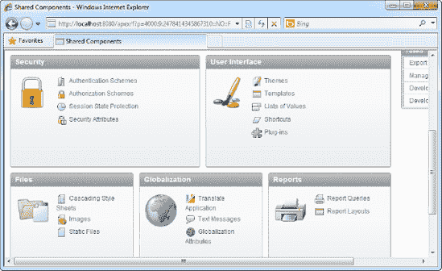
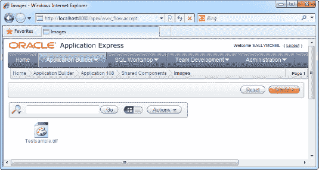
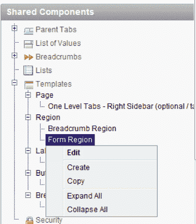
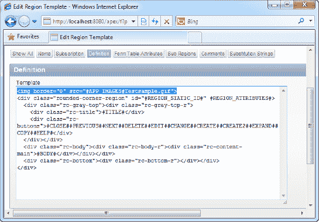
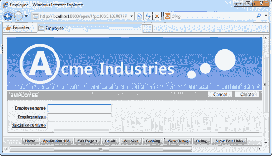
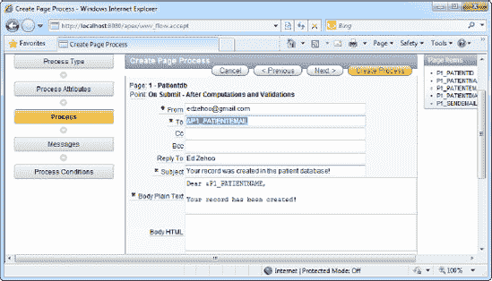

# 第四章：自定义外观与感觉

自定义应用程序的外观与感觉是解决方案交付中最关键的一环。这个过程定义了您的应用如何呈现给最终用户。APEX 在这方面极其灵活，允许您自定义的不仅仅是页面的配色方案、页眉和页脚，甚至包括表单上控件使用的属性。

很多时候，像您这样的用户并不仅仅是在为内部网环境创建独立的 Web 应用程序。我知道许多开发者使用 APEX，是因为他们需要一种更简便的方式将表单集成到面向公众的网站中。试想一下公共网站上的“申请职位”版块。当访问者点击链接时，他们不应该感觉自己被重定向到了一个全新的门户网站。该“申请职位”表单的观感应该与网站上的任何其他页面别无二致。为了实现这个目标，开发者需要使表单的配色方案、页眉和页脚与网站的其余部分保持一致。

APEX 提供了完善的工具，让您可以更改应用程序中用户界面的方方面面。在本章中，我们将探讨其基本方法。

### 4-1. 为表单添加图片页眉

#### 问题

您需要在表单的页眉区域添加一张图片。

#### 解决方案

要向表单的页眉区域添加图片，请按照以下步骤操作：

1.  在应用程序构建器中点击一个现有应用程序。
2.  点击“共享组件”图标。在随后出现的页面中，点击“文件”部分下的 `图片` 链接，如 图 4-1 所示。

    

    **图 4-1.** “文件”部分中的“图片”链接

3.  在随后出现的页面中，点击右上角的黄色“创建”按钮。从列表中选择您的应用程序，并浏览选择一个横幅图片（GIF、JPG 或 PNG 文件）进行上传。完成后，点击 `上传` 按钮。
4.  现在，您应该能在应用程序中看到您的图片了，如 图 4-2 所示。

    

    **图 4-2.** Testsample.gif 图片

5.  现在，导航到应用程序中的一个现有表单并点击它，以查看其 `页面定义`。
6.  在表单的 `共享组件` 区域，展开 `模板` 节点，然后是 `区域` 节点，右键单击 `表单区域` 节点，并选择 `编辑` 菜单项（如 图 4-3 所示）。

    

    **图 4-3.** 导航到表单区域模板定义页面

7.  在随后出现的页面中，点击“定义”选项卡。在模板框中的 DIV 标签上方添加以下 HTML 标签：``
8.  您现在应该能看到如 图 4-4 所示的屏幕。

    

    **图 4-4.** 在模板中包含 Testsample.gif 图片

9.  保存您的更改并运行表单。您现在应该能在表单顶部看到您的图片了，如 图 4-5 所示。

    

    **图 4-5.** 表单中的新图片页眉

 **注意** 图片名称区分大小写！如果使用不正确的大小写，您的图片可能根本不会显示。

## 解决方案（针对前一个配方上下文）

要测试此配方中的解决方案，您首先需要创建示例数据库和表单对象。然后，您需要从表单中调用“发送电子邮件”过程。让我们首先创建此配方中使用的示例对象。

### 创建示例对象

要创建此配方中使用的示例对象，请按照以下步骤操作：

1.  创建如 清单 3-12 所示的表，并基于该表创建一个新的数据库应用程序/数据录入表单。

    **清单 3-12.** PatientDB 表

    ```sql
    CREATE table "PATIENTDB" (
        "PATIENTNAME"      NVARCHAR2(255),
        "PATIENTEMAIL"     NVARCHAR2(255),
        "PATIENTDIAGNOSIS" NVARCHAR2(2000),
        "PATIENTID"        NVARCHAR2(10),
        constraint  "PATIENTDB_PK" primary key ("PATIENTID")
    )
    /

    CREATE sequence "PATIENTDB_SEQ"
    /

    CREATE trigger "BI_PATIENTDB"
      before insert on "PATIENTDB"
      for each row
    begin
      if :NEW."PATIENTID" is null then
        select "PATIENTDB_SEQ".nextval into :NEW."PATIENTID" from dual;
      end if;
    end;
    /
    ```

### 发送电子邮件

要从表单调用“发送电子邮件”过程，请按照以下步骤操作：

1.  在 `PatientDB` 表单的“页面定义”  “页面呈现”部分，添加一个名为“发送电子邮件”的新按钮项。将按钮类型更改为 HTML 按钮，并将按钮标签设置为“发送电子邮件”。
2.  在 `PatientDB` 表单的“页面定义”  “页面处理”部分，右键单击“处理”节点下的“过程”，并选择创建新过程。
3.  在向导的第一页，选择“发送电子邮件”过程。接着，为该过程指定一个名称。在下一页，指定电子邮件的内容和收件人。您可以使用替换语法（例如，`&P1_PATIENTNAME`）将表单中的数据插入到电子邮件中。图 3-26 所示的图展示了一个典型电子邮件的配置，该邮件使用了通过表单输入的患者电子邮件地址和姓名。

    

    **图 3-26.** 指定电子邮件的详细信息

4.  在下一页，指定要显示的成功或失败消息。在向导的后续页面中，在“当按下按钮时”字段中指定 `P1_SENDEMAIL` 字段。
5.  保存更改并运行表单。在“患者电子邮件”字段中指定一个可用的电子邮件地址。点击“发送电子邮件”按钮。一封电子邮件应发送到您指定的地址。

#### 工作原理

发送电子邮件也是一个服务器端过程。外发电子邮件不会立即发送（除非您在过程配置向导中特别指定了这样做），而是会进入队列，直到一个 `DBMS_JOB` 作业将其出队并发送出去。


